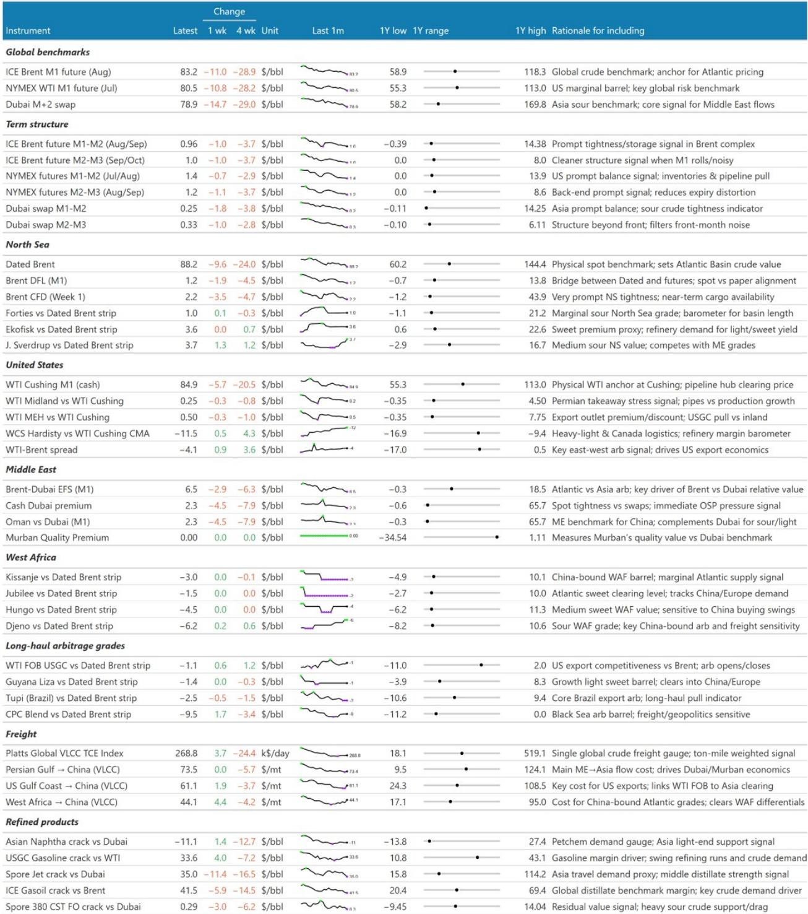
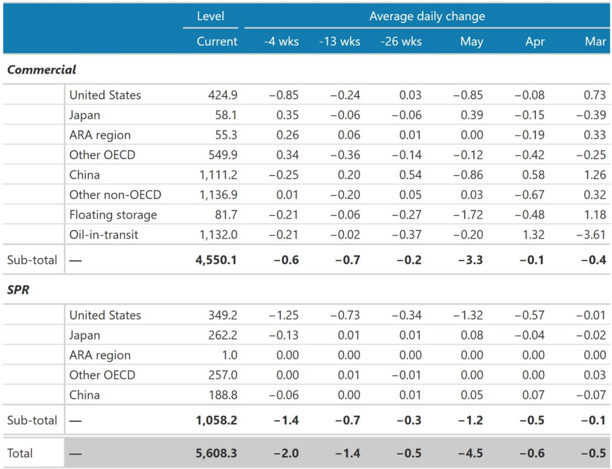
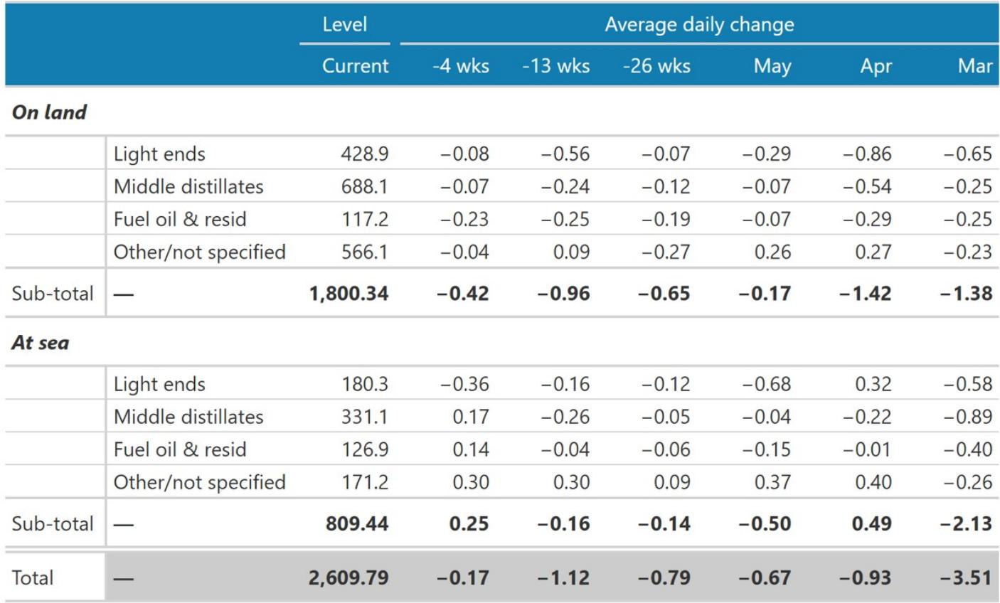

# 摩根斯坦利：油价真正的风险不是地缘缓和，而是供需错位的结构性固化

这份报告最值得认真对待的判断，不是霍尔木兹海峡即将重新开放，而是：即便中东供应恢复，市场依然面临一个比想象中更顽固的供需错位格局。摩根斯坦利在美伊谅解备忘录签署后迅速下调了近两个季度的布伦特油价预测，3季度从100美元调至90美元，4季度从95美元直降至80美元。但真正值得推敲的，不是这10-15美元的调整幅度，而是调整背后的逻辑链条——报告揭示了一个比“地缘政治溢价消退”更深刻的结构性问题。

当前市场最容易被误解的地方在于：人们倾向于把油价疲软归因于霍尔木兹海峡即将重新开放这一预期，但报告通过大量实物市场数据证明，物理原油市场的疲软早在政治突破之前就已经形成，且其驱动因素——美国出口高企与中国进口低迷——短期内看不到逆转迹象。这意味着即便中东供应恢复节奏符合预期，油价的上行空间也可能比多数人想象的更窄。

这份报告发布的时间点很关键。美伊备忘录签署于6月14日，比摩根斯坦利此前假设的“7月底”提前了约两周。正是这个时间差，让机构得以重新审视此前预测中隐含的一个关键假设：在供应恢复之前，美国出口下降和中国进口回升能否为市场提供缓冲。现在来看，这个缓冲机制不仅没有启动，反而在持续恶化。

## 1. 生产恢复的时间表提前了，但真正决定油价的不是这个变量

摩根斯坦利将中东产量恢复的时间线整体前移了约1-2周。按照最新估算，7月中旬开始恢复，9月恢复50%，12月恢复80%，剩余部分在2027年初完成。这个节奏看起来不算慢，但报告真正想表达的是：供应恢复的速度本身并不是当前油价的定价核心。

关键在于，即便在日均约1100万桶的中东原油产量处于停产的背景下，实物市场已经出现了反常的疲软。布伦特现货价格、迪拜升贴水、成品油裂解价差均在走弱，亚洲石脑油裂解价差在过去四周内下跌了13美元/桶，接近一年低点。对于一个全球约33%的海运原油供应被切断的市场而言，这种价格行为是反直觉的。

报告用一个细节数据点破了这个矛盾：未售出货轮的数量正在上升，且范围在扩大。尼日利亚、安哥拉、刚果、CPC混合油、利比亚、阿塞拜疆、甚至俄罗斯ESPO，多个地区的现货原油都存在明显的销售困难。这不是某个单一品类的局部问题，而是全球性的需求吸收能力不足。对于一个理论上面临巨大供应缺口的市场，出现如此广泛的未售库存，只能说明一个问题：需求端的问题比供应端的问题更严重。

## 2. 美国出口与中国进口构成了一个“10 mb/d的缓冲垫”，但它的持续性正在被质疑

报告最核心的分析框架，是美中两国在实物市场上扮演的“缓冲角色”。美国净出口从去年的约500万桶/日跃升至近期的约900万桶/日，中国净进口则从约1300万桶/日骤降至约700万桶/日。两者合计，相当于为全球市场腾出了约1000万桶/日的供需宽松空间。

这个数字意味着什么？中东停产带来的供应缺口，大部分被美中两国的反向变动所对冲。如果没有这个缓冲，布伦特价格可能早已远超100美元。但问题在于，这个缓冲机制能持续多久？

报告通过追踪已知油轮动向给出了一个令人担忧的答案：6月美国净出口仍将维持在850-900万桶/日的水平，与5月基本持平；中国净进口在6月可能比5月更低，7月的数据也尚未显示出改善迹象。更关键的是，中国炼厂和贸易商的现货原油采购活动——通常占进口量的约一半——在4月已降至异常低的约450万桶/日，5月进一步降至约410万桶/日，而6月已知的交易量甚至低于这两个月的同期路径。

这意味着，市场此前期待的“中国需求回升”这一关键变量，至少在可预见的未来几周内不会兑现。而美国出口能否持续维持高位，同样存在不确定性——高出口本身对美国国内库存和炼厂开工率会形成压力。

## 3. 需求侧的真实状况比数据呈现的更复杂，报告留下了一个关键悬疑

报告指出，5月全球炼厂原油加工量同比下降约580万桶/日，全球原油需求因此同步下降。但摩根斯坦利明确表示，这很可能“严重高估了实际需求的下降幅度”。原因在于，需求下降的很大一部分来自“延迟采购”而非“消费减少”。

报告举了一个生动的例子：德国居民在预期霍尔木兹海峡即将重新开放的情况下，选择暂缓填充取暖油储罐。消费行为仍在继续，但采购行为被推迟了。这种现象在全球范围内可能普遍存在——炼厂、贸易商、终端用户都在等待更低的价格和更确定的供应前景，从而主动减少库存采购。

但问题在于，报告坦承“我们缺乏足够的数据来全面描述这一效应”。这意味着，当前市场对真实需求的判断存在一个根本性的盲区：被延迟的采购需求何时会回归？如果地缘风险进一步下降，这些被压抑的需求是否会集中释放，从而在某个时间点形成价格脉冲？反之，如果延迟采购持续更久，是否会进一步压制现货价格，甚至倒逼上游减产？

这个问题的答案，将直接决定3季度布伦特能否从当前水平反弹至90美元，还是连这个目标都显得过于乐观。

## 4. 报告尚未完全回答的关键问题：被延迟的需求是否会形成价格脉冲

摩根斯坦利虽然下调了预测，但依然认为3季度市场偏紧、布伦特可能从当前水平反弹。然而，这个判断成立的前提是：被延迟的采购需求必须在某个时间点回归，而且回归的规模要足够大。

报告对此并未给出确定性结论。它指出了延迟采购的存在，也承认数据不足以量化其规模，但未能回答一个更关键的问题：延迟采购的回归路径是怎样的？是平滑恢复，还是集中爆发？如果大量延迟的采购需求在某个时间窗口内同时涌入市场，可能会在短期内推高价格，甚至超过摩根斯坦利目前的3季度目标。但如果回归过程缓慢且分散，则价格反弹的力度可能非常有限。

这个不确定性，恰恰是当前油价预测中最值得跟踪的变量。它既可能成为看多者的催化剂，也可能让看空者的逻辑更加坚实。对于产业决策者和投资者而言，与其纠结于90美元还是80美元的预测数字，不如将注意力放在这个未解问题上——它决定了未来3-6个月油价波动的方向与幅度。

## 5. 一个更值得关注的观察框架：从“地缘政治溢价”转向“供需结构定价”

这份报告最重要的贡献，在于它系统性地将市场的注意力从地缘政治事件本身引向了供需结构的深层变化。地缘政治事件可以在一夜之间改变，但供需结构一旦固化，其影响将持续数个季度甚至更久。

从这个角度看，当前市场面临的核心问题不是“霍尔木兹海峡何时重新开放”，而是“美中两国的供需角色何时会逆转”。美国出口能否持续高位，取决于其国内产量、库存和炼厂开工率的动态平衡；中国进口能否回升，取决于其经济需求、炼厂利润和政策导向的综合作用。这两个变量都不是地缘政治事件能够直接影响的。

对于读者而言，一个实用的观察框架是：放弃对“地缘政治事件”的短线交易思维，转而关注三个结构性指标——美国出口的周度变化趋势、中国现货采购的月度追踪数据、以及全球炼厂开工率的恢复节奏。只有当这三个指标同时出现方向性变化时，油价的定价逻辑才可能发生根本性转变。

---

这份报告在逻辑上留下了一个有待深挖的缺口：被延迟的采购需求究竟有多大，以及它将以何种方式回归。摩根斯坦利并未给出量化估计，但这个问题恰恰是当前油价预测中最具价值的未知变量。如果你对追踪这些结构性变化感兴趣，欢迎来星球微信群里继续讨论——我们会在群内分享更细颗粒度的数据追踪框架，以及报告未完全展开的图表背后的二阶影响。毕竟，在信息高度对称的市场中，真正有价值的不是预测本身，而是预测背后的逻辑链条和未解问题。

Personal reading notes and learning share only. Not investment advice.

