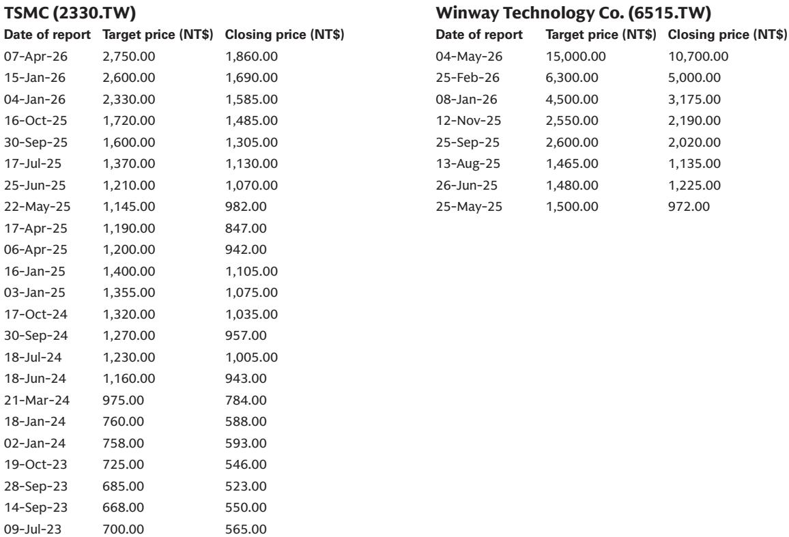
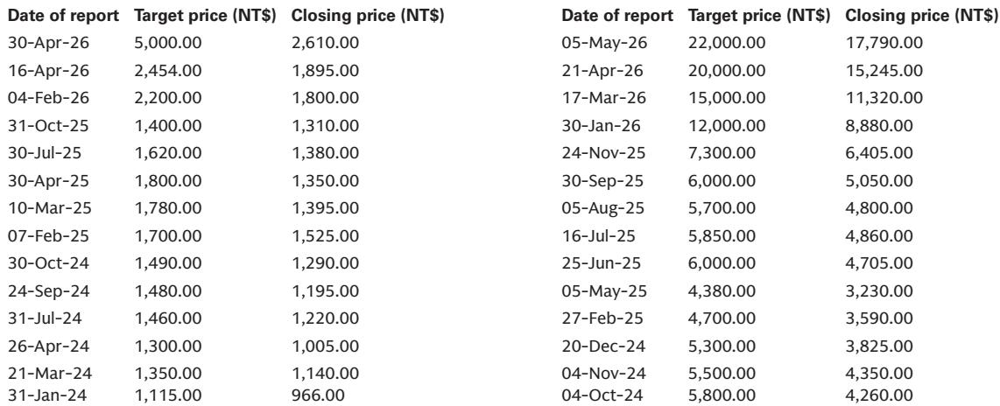
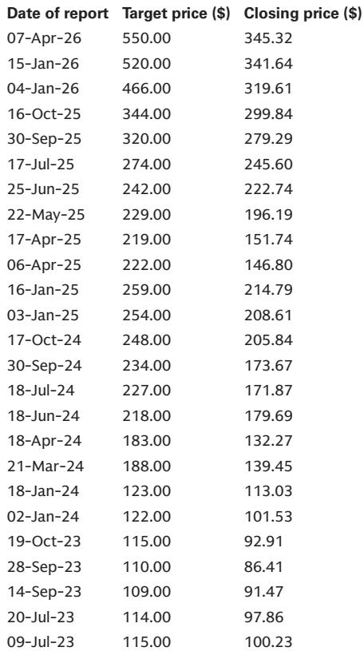

# GS：AI ASIC仍是首选主题，但市场低估了CPU和下一个供应链瓶颈的定价权

当大多数投资者还在追问AI需求能否持续时，一份来自GS的最新路演反馈显示，对话的焦点正在发生深刻的转移。在刚刚结束的美国投资者路演中，GS团队与超过35位机构投资者进行了交流。一个清晰的信号是：市场情绪依然高度建设性，AI ASIC（专用集成电路）继续是最受追捧的投资主题。但真正值得关注的，不是需求本身是否强劲，而是讨论的层次已经进化到了下一个阶段——CPU需求、供应链定价权以及超大规模资本支出的可持续性。

这份报告的洞察力不在于重复“AI很好”，而在于它捕捉到了一个关键转折：投资者正在从“要不要买AI”转向“买谁能在下一阶段继续增长”。增量资本的配置正变得高度挑剔，半导体持仓已经成为许多机构的最大仓位之一。这意味着，能够继续证明盈利增长可持续性的公司，才能获得进一步的资本青睐。

在众多讨论中，GS提炼出了四个最核心的投资者关切：AI供应链的下一个瓶颈在哪里、生态系统的定价权如何分配、哪些公司能在未来几年维持超速增长、以及市场过热的下行风险是什么。本文将基于这份报告，拆解这些问题的逻辑层次，并指出报告尚未完全回答的关键变量。

## 1. 投资者的关注点已从AI需求转向货币化验证和资本支出可持续性

一个反复出现的问题是：当前AI投资周期的可持续性如何？这并非空穴来风。超大规模云服务商（CSP）正在加速资本支出，而投资者开始追问这些投入何时能转化为可观的回报。GS注意到，谷歌近期的融资活动引发了显著关注。历史上，美国投资者倾向于将外部融资视为过度投资或泡沫行为的信号。但情绪正在演变——越来越多的投资者开始将谷歌的融资能力视为对长期AI货币化机会的信心标志。

这一变化意味着什么？它表明市场正在成熟：从纯粹的“讲故事”阶段，进入需要“证明自己”的阶段。投资者不再满足于“AI有巨大潜力”的叙事，他们需要看到具体的货币化路径。对于产业链上的公司而言，这意味着那些能够清晰展示其客户AI投入回报率的公司，将获得更高的估值溢价。而那些只是泛泛受益于AI浪潮的公司，可能会面临越来越挑剔的审视。

然而，报告也指出，关于“超大规模资本支出增长是否需要在2028年前进一步加速以支撑供应链扩张”的辩论仍在持续。这是一个尚未完全解答的关键问题。如果资本支出增速放缓，供应链中哪些环节将首当其冲？这个问题本身，就指向了下一个讨论焦点。

## 2. 代理型AI正将CPU需求推向前台，这是市场最被低估的结构性变化

在本次路演中，最引人注目的讨论转向之一，是投资者对CPU（中央处理器）兴趣的显著提升。长期以来，市场注意力几乎完全被AI加速器（如GPU、ASIC）所吸引。但GS的报告揭示了一个关键的逻辑演变：虽然AI加速器仍然是训练工作负载的主要受益者，但CPU在推理和代理型AI（Agentic AI）应用中可能扮演更重要的角色。

代理型AI，即能够自主执行复杂任务的AI系统，其工作负载对CPU的依赖远高于传统训练。这意味着，随着AI应用从训练走向大规模部署，CPU基础设施的重要性将与加速器并驾齐驱。GS团队特别强调了这一主题，认为它对于Aspeed和WinWay等公司而言，是仍未被市场充分定价的增长驱动因素。

这一判断的“所以呢”含义非常明确：如果CPU需求因代理型AI而出现结构性增长，那么整个服务器硬件生态的竞争格局和估值逻辑都将被重塑。那些在CPU相关领域有深度布局的公司，将获得一个独立于GPU/ASIC周期的增长引擎。这不仅是一个增量机会，更可能是一个新的估值锚点。

## 3. 台积电的盈利预期仍过于保守，定价权辩论正从“能否”转向“何时”

作为核心持仓的台积电，在本次路演中的讨论焦点也发生了微妙但重要的变化。投资者不再质疑需求，而是开始激烈辩论其定价权。一个反复出现的疑问是：为什么台积电在如此有利的竞争地位下，没有更激进地提价？

GS的观点是，台积电很可能维持其年度定价节奏，而非频繁调整。但报告真正有洞察力的部分在于，它指出了投资者可能低估的另一个维度：产能瓶颈缓解、生产力提升、有利的产品组合以及更好的运营杠杆。这些因素叠加，将持续推动台积电未来几年的盈利能力上升。

这意味着，市场对台积电盈利预期的共识可能仍然偏低。GS认为，盈利能力的持续超预期，将成为股价在2026年第二季度财报前追赶的关键催化剂。这背后隐含的判断是：市场对台积电的估值模型，可能过度关注了提价这一单一变量，而忽略了其运营效率提升带来的结构性利润率改善。对于投资者而言，这意味着台积电的盈利安全边际可能比普遍认知的要高。

## 4. 联发科的AI ASIC机会：市场认知仍停留在早期，仓位配置明显不足

联发科是本次路演中讨论最多的公司之一，但这恰恰说明市场对其机会的认知尚不充分。GS指出，虽然投资者普遍理解其AI ASIC业务的长期机会，但许多人仍低估了下一个项目（2028年）中潜在的定价和内容扩展。关键在于，市场对下一代芯片的ASP（平均销售价格）提升幅度缺乏清晰认知。

更值得关注的是，投资者对一系列长期风险的辩论，在GS看来为时过早。这些风险包括：未来几代产品中内容贡献是否会下降、下一代芯片的内容是否低于预期、以及美国CSP客户是否会逐步将更多芯片设计能力内部化。报告的核心判断是：联发科的第一颗AI ASIC芯片尚未进入量产（商业化预计在2026年底），这颗芯片本身就是一个关键里程碑，它验证了联发科在领先AI ASIC项目中的参与能力。更重要的是，除了第一个项目，联发科正在积极接触多个未来的AI ASIC机会。

因此，GS认为投资者可能低估了即将到来的量产爬坡以及后续更广泛机会管线的重要性。一个关键信号是：投资者仓位仍然相对较轻。许多投资者在股价大涨后减仓，而许多美国投资者仍然低配。市场对联发科在美国CSP ASIC战略中的长期定位存在显著的不确定性，特别是与博通之间的份额分配。这意味着，如果联发科能够成功交付并证明其价值，其估值重估的空间可能非常可观。

## 5. 报告尚未完全回答的关键问题：供应链瓶颈的转移与定价权的真正归属

尽管GS的报告提供了深刻的洞察，但它也留下了一些尚未完全解答的关键问题，这些问题恰恰是投资者进一步思考的起点。

第一个问题是：当AI供应链的瓶颈从“产能”转移到“测试和封装”时，定价权将如何重新分配？报告重点提到了WinWay，其受益于测试复杂度的提升，但并未深入讨论这种定价权的可持续性。测试和封装环节的进入壁垒是否足够高，以至于能支撑持续的超额利润？还是说，随着竞争者涌入，这种定价权只是暂时的？

第二个问题是：CPU需求的爆发，是否会重塑服务器CPU市场的竞争格局？英特尔、AMD和ARM架构之间的博弈将如何演变？报告提到了Aspeed和WinWay作为CPU受益者，但并未展开讨论CPU市场本身的结构性变化。对于长期投资者而言，理解CPU市场的竞争态势，是判断这些公司增长天花板的关键。

第三个问题，也是最根本的问题：超大规模资本支出的可持续性，其真正的锚点是什么？是AI货币化的进展，还是竞争格局的演变？如果货币化进展不及预期，资本支出削减的幅度和节奏会如何？报告提到了这个辩论，但没有给出明确的结论。这恰恰是投资者需要自行跟踪和判断的核心变量。

## 6. 一个观察框架：如何评估下一阶段AI投资的价值

基于GS报告的洞察，我们可以提炼出一个观察框架，帮助投资者在下一阶段做出更精准的判断。这个框架围绕三个维度展开：

第一，定位的稀缺性。在AI供应链中，哪些环节具有不可替代性？台积电的先进制程、Aspeed在BMC领域的70%市场份额、WinWay在高端测试插座领域的客户壁垒，这些都是稀缺性的体现。稀缺性决定了定价权，也决定了利润的可持续性。

第二，增长的独立性。公司的增长是否过度依赖单一客户或单一技术路线？联发科的AI ASIC机会，其价值在于它打开了智能手机之外的第二个增长曲线，从而降低了对单一市场的依赖。CPU需求的崛起，则为Aspeed和WinWay提供了独立于GPU/ASIC周期的增长动力。那些拥有多个增长引擎的公司，其估值应该享有溢价。

第三，市场认知的差距。报告反复提到“市场低估”“认知不足”“仓位较轻”。这本身就是超额收益的来源。当大多数投资者还在质疑联发科的ASIC能力时，GS看到的是即将到来的量产爬坡和更广泛的机会管线。当市场仍将CPU视为配角时，GS看到了代理型AI带来的结构性需求。寻找市场认知与基本面现实之间的差距，是下一阶段选股的关键。

这份GS报告的价值，不仅在于它提供了具体的股票推荐，更在于它构建了一个思考框架：在AI投资从“讲故事”进入“看业绩”的阶段，真正决定胜负的，不再是“谁在AI里”，而是“谁在AI里有定价权”以及“谁的增长独立于单一叙事”。那些能够同时回答这两个问题的公司，才值得在组合中占据更大的权重。

---

对于报告中的具体估值模型、风险分析以及更多未公开的图表数据，我们将在社群中提供完整的研报解读与原始图表。报告中关于“供应链瓶颈转移后的二阶影响”以及“超大规模资本支出可持续性的三个压力测试场景”等更深层次的讨论，也将在微信群中继续展开。欢迎来星球微信群里继续讨论，一起拆解这份报告的未尽之处。

Personal reading notes and learning share only. Not investment advice.

