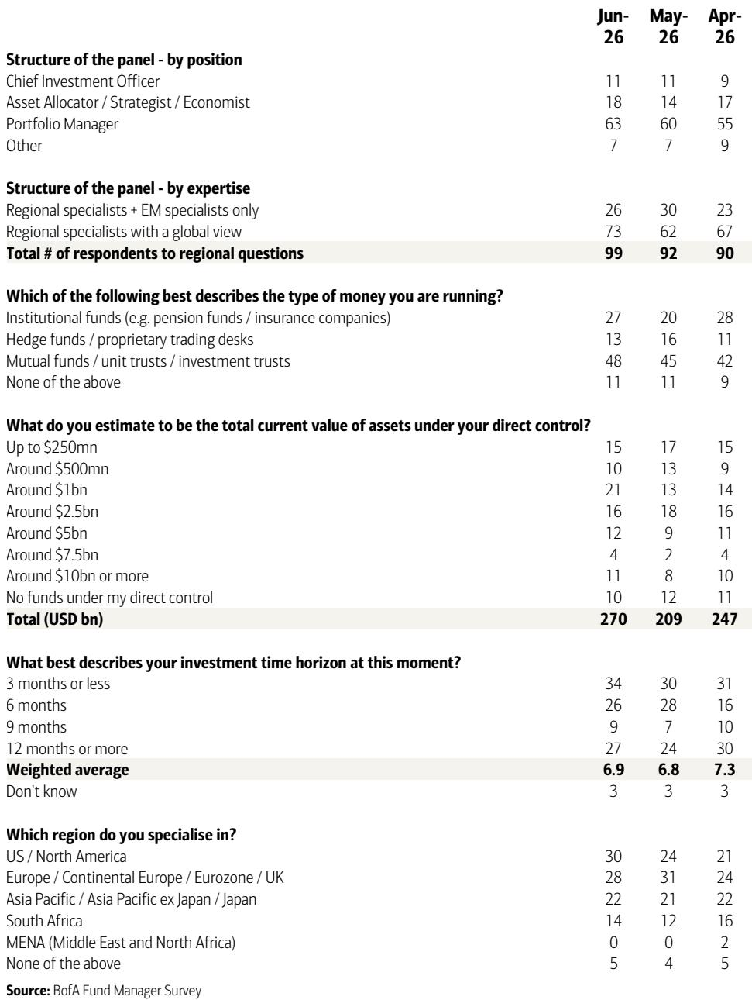
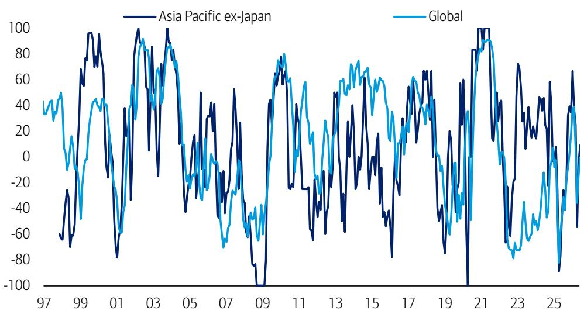

# Asia Fund Managers Are Betting on Tech Hardware, Not Just Semiconductors, and That Changes the Investment Narrative

The most telling signal in the June Asia Fund Manager Survey is not about AI enthusiasm fading. It is about a decisive rotation within the technology trade itself. For the first time in this cycle, fund managers in Asia Pacific ex-Japan are now more overweight Tech Hardware than Semiconductors. This is not a minor sector preference shift. It is a structural re-rating of where value creation is expected to materialize in the AI supply chain, and it carries implications for portfolio construction that most investors have not yet fully priced in.

The survey, conducted from June 5 to June 11 with 198 panelists managing $540 billion in assets, reveals a market that has digested the energy shock of early 2026 and is recalibrating its risk appetite accordingly. Energy security concerns have collapsed from 91% high/extreme concern in April to just 18% in June. That is a 73-percentage-point swing in two months. The macro fog has lifted, and fund managers are now voting with their sector allocations in ways that deserve careful strategic attention.

Yet beneath the surface of normalized macro fears lies a paradox. Forty-one percent of respondents remain completely unhedged against downside risk in the AI trade. Another 41% are rotating into other sectors or underweighting AI beneficiaries. The market is split exactly in half on whether the AI trade needs protection. The implications of this divide will shape relative returns in the second half of 2026.

## The Collapse of Energy Security Fears Has Unlocked a Rotation into Cyclical and Growth Exposures That Were Previously Avoided

The speed at which energy security concerns have normalized is unprecedented in recent survey history. In April, 91% of fund managers said they were highly or extremely concerned about energy security risks for the APAC region. By June, that figure had fallen to 18%. The moderate concern category now accounts for 68% of respondents, up from 9% in April. Fourteen percent say they are not concerned at all.

This shift matters because energy security was the dominant macro overhang that suppressed risk appetite in April. With that constraint removed, fund managers have moved back into growth-oriented positions. Corporate profit expectations strengthened further in June, with the net percentage expecting better profits in APAC ex-Japan now at 50%, well above the long-run average. The net percentage deeming consensus EPS estimates as too high has fallen to the 14th percentile historically, meaning skepticism about earnings quality is unusually low.

The practical consequence is that fund managers are now willing to rotate out of defensive positions and into sectors that benefit from a functioning macro environment. The survey shows a clear rotation out of Materials and Consumer Discretionary (ex Retailing) into Financial Services and Telecom. This is not a flight to safety. It is a return to normalized sector allocation based on fundamentals rather than tail-risk hedging.

## The Shift from Semiconductors to Tech Hardware Signals That the AI Trade Is Maturing Beyond the Initial Infrastructure Build-Out

The most consequential sector-level finding in the June survey is that fund managers in APAC ex Japan are now more overweight Tech Hardware than Semiconductors. This is a reversal of the pattern that held throughout the early stages of the AI investment cycle, where semiconductor companies captured the lion's share of capital flows due to their direct exposure to GPU and ASIC demand.

The logic behind this rotation is straightforward but strategically important. The first phase of the AI cycle was about building the compute infrastructure. That phase rewarded semiconductor companies with pricing power and order visibility. The second phase, which appears to be underway, is about deploying that infrastructure into end-user applications and hardware systems. Tech Hardware companies that manufacture servers, networking equipment, cooling systems, and edge devices are now seen as the next marginal beneficiaries.

In Japan, Tech Hardware has risen to tie with Banks as the second-most preferred sector, behind only Semiconductors. This is notable because Japan's Tech Hardware ecosystem includes companies with exposure to semiconductor manufacturing equipment, precision components, and industrial automation. The fact that fund managers are elevating this sector alongside Banks, which benefit from the Bank of Japan's policy normalization, suggests a dual thesis: earnings growth from tech deployment and margin expansion from financial sector repricing.

The open question is whether this rotation is premature. If AI adoption accelerates faster than expected, semiconductor companies may still have more pricing power than the market currently assumes. The survey data shows that only 9% of fund managers believe the positive impact of AI on equities is more than fully priced in. That means 91% see at least some remaining upside. If the majority is wrong and AI is actually closer to fully priced, then rotating into Tech Hardware could be a defensive move that misses the final leg of semiconductor outperformance.

## Indonesia Has Overtaken India as the Least Preferred Market, Revealing a Divergence in Emerging Asia That Demands a Country-by-Country Approach

The survey's country-level data reveals a striking shift in regional preferences. Indonesia has overtaken India as investors' least preferred market in APAC ex Japan. This is a significant development because India had been the consensus underweight for several quarters due to valuation concerns and the absence of a clear AI narrative.

India's primary concern, according to the survey, remains the lack of a clear AI play. Without a domestic semiconductor ecosystem or a large-scale AI services export model, Indian equities are being penalized by a market that is increasingly rewarding AI exposure. Indonesia's decline, by contrast, appears to be driven by commodity cycle concerns and policy uncertainty rather than tech exposure.

Meanwhile, North Asia remains the clear favorite. Taiwan leads as the most preferred market, with 41% of fund managers identifying it as the primary beneficiary of the next phase of the AI cycle. South Korea follows at 23%, though this is down from 29% in May. The United States gained ground, rising from 10% to 18%, as fund managers increasingly see US tech companies as direct beneficiaries of AI deployment.

Japan's growth expectations improved further in June, with the net percentage expecting a stronger Japanese economy reaching 59%, surpassing the long-term average. The key driver for Japan equities is now earnings, cited by 41% of respondents, up from 38% in May. Policy normalization by the Bank of Japan also gained traction, rising to 27% from 19%. This confirms that the Japan trade is no longer just about corporate governance reform and currency weakness. It is increasingly about fundamental earnings delivery in a rising rate environment.

The divergence between North Asia and Southeast Asia is likely to persist. Fund managers are effectively making a bet that the AI cycle will concentrate value creation in economies with deep tech supply chains, while commodity-linked and domestic-demand-driven markets will lag. For investors constructing a regional portfolio, the implication is clear: passive regional exposure is insufficient. Active country allocation is now the primary source of alpha.

## The Report Does Not Fully Answer Whether the 41% of Unhedged AI Investors Are Complacent or Correct, and That Uncertainty Creates a Second-Order Risk

The survey's most provocative finding is that 41% of fund managers remain unhedged against downside risk in the AI trade. Of these, 27% say they have no hedge and remain overweight AI, while 14% are unhedged but have rotated into other sectors. Another 41% have taken some form of hedging action, including rotating into value or cyclicals (18%), rotating into defensive sectors (14%), rotating within the AI value chain (14%), or shorting or underweighting crowded AI beneficiaries (9%).

The report provides the data but does not resolve the strategic question: are the unhedged investors correct in their conviction, or are they setting themselves up for a correction? The answer depends on whether AI earnings expectations have further room to run. The survey shows that only 9% of investors believe AI's positive impact is more than fully priced in. That suggests the majority still sees upside. But the 41% who are hedging are implicitly betting that the upside is limited or that a rotation is coming.

The second-order risk is that if the unhedged cohort is forced to capitulate, the selling pressure could be concentrated in the most crowded AI names. The survey does not identify which specific stocks or sub-sectors within AI are most crowded, but the fact that 27% of fund managers are unhedged and overweight AI means there is a concentrated positioning risk. Any negative catalyst, whether it is a disappointing earnings report from a key AI company or a shift in US trade policy, could trigger a disorderly unwind.

This is the analytical gap that the report leaves open. It tells us what fund managers are doing, but it does not tell us whether their positioning is robust to a shock. For serious investors, this uncertainty is not a reason to avoid the AI trade. It is a reason to stress-test portfolios against a scenario where the 41% of hedgers are right and the 27% of unhedged overweight investors are forced to adjust.

## A Three-Step Decision Framework for Positioning in the Current Environment

Based on the survey data and the patterns it reveals, investors should consider a structured decision framework that moves from macro to sector to country.

Step one is to assess whether the normalization of energy security concerns is durable. The 73-point drop in high/extreme concern from April to June is dramatic, but it reflects a specific geopolitical context that could reverse. If energy security fears re-emerge, the rotation into cyclical sectors and Tech Hardware would likely reverse as well. The decision here is binary: either you believe the energy risk is structurally resolved, in which case you can lean into the current rotation, or you treat it as a temporary reprieve and maintain hedges.

Step two is to decide on the AI value chain position. The survey shows a clear preference for Tech Hardware over Semiconductors, but this could be a tactical call that works only if AI deployment accelerates. If AI adoption slows, semiconductor companies with strong balance sheets may hold up better than hardware companies with thinner margins. The decision here is about time horizon. For a 6-to-12-month view, the rotation into Tech Hardware makes sense. For a longer horizon, maintaining semiconductor exposure may capture the next infrastructure build-out cycle.

Step three is to allocate across countries with precision. North Asia, particularly Taiwan and Japan, offers the clearest AI exposure. The US is gaining interest but is not the primary focus for APAC fund managers. India and Indonesia require a separate thesis that does not rely on AI. For investors who need exposure to those markets, the rationale must come from domestic demand, financial sector reform, or commodity cycles, not from technology.

This framework does not guarantee outcomes, but it forces explicit assumptions about the macro environment, the AI cycle, and regional differentiation. The survey data provides the raw material. The framework turns that material into a decision.

## The Full Report Contains the Charts and Granular Data That Make These Shifts Visible

The analysis above is based on the June Asia Fund Manager Survey, but the full report contains the charts and historical context that allow investors to see these shifts in real time. The exhibit on how investors are hedging AI downside risk, the sector rotation data, and the country preference trends are all presented with multi-month comparisons that reveal the velocity of change.

For example, the chart showing that 41% of investors remain unhedged against AI downside risk is accompanied by a breakdown of how the other 41% are hedging. The exhibit on expected returns for APAC equities shows the moderation from last month's improvement and places it in historical context. The sector preference data for Japan reveals the rise of Tech Hardware alongside Banks and Semiconductors. These are not static snapshots. They are time-series data points that show how conviction is building or breaking in specific areas.

The report also includes the question on when the Bank of Japan will next raise rates, with 64% of respondents expecting a June hike. This matters because Japanese financials are now a preferred sector, and the timing of policy normalization directly affects their earnings trajectory. Without the granular data on rate expectations, the sector rotation into Japanese Banks would appear less well-supported.

Join the community to read the full report and review the original charts.

*This article is for learning and discussion only and does not constitute investment advice.*

Personal reading notes and learning share only. Not investment advice.

