## CHINA BROKERS & ASSET MANAGERS

# Positioned for Structural Growth Amid Shifting Sector Dynamics

China brokers' shares have performed strongly since June 9, +7%/+5% vs. +1%/+3% of banks for A/H shares within our coverage. This aligns with our key takeaways from the recent China Financials trip: we prefer brokers over banks. Incorporating incremental insights from GS strategists' latest views on the HK IPO market, we reiterate a constructive stance on China brokers relative to banks, reflecting a meaningful shift in the sector's fundamental drivers. As loan growth decelerates across the banking system, earnings growth is no longer the primary determinant of bank valuations; instead, investor focus has shifted toward balance sheet resilience and capital strength. In this context, brokers offer a more compelling combination of cyclical earnings recovery and structural return improvement, supported by capital markets activity and international business expansion.

Exhibit 1: Brokers are demonstrating strong performance, +7%/+5% vs. +1%/+3% of banks for A/H share since June 9.  
As of June 15  
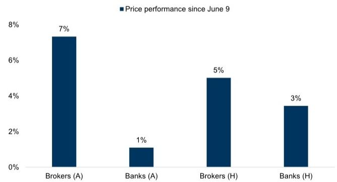

bar chart

Price performance since June 9
| Category | Price Performance (%) |
|---|---|
| Brokers (A) | 7 |
| Banks (A) | 1 |
| Brokers (H) | 5 |
| Banks (H) | 3 |

Price performance is based on the average of our covered companies  
Source: Wind

Central to our positive view is the role of Hong Kong business as a key engine of ROE expansion for Chinese brokers. Management teams across leading brokers have articulated a clear strategic pivot toward scaling their international businesses, particularly in Hong Kong, where returns are structurally higher than in the onshore market. This shift is being enabled by active capital raising, such as equity placements and refinancing, which are designed to fund balance sheet expansion in

## Shuo Yang, Ph.D.

+852-2978-0701 | shuo.yang@gs.com

GS (Asia) L.L.C.

## Claire Ouyang

+852-2978-6686

claire.x.ouyang@gs.com

GS (Asia) L.L.C.

GS does and seeks to do business with companies covered in its research reports. As a result, investors should be aware that the firm may have a conflict of interest that could affect the objectivity of this report. Investors should consider this report as only a single factor in making their investment decision. For Reg AC certification and other important disclosures, see the Disclosure Appendix, or go to www.gs.com/research/hedge.html. Analysts employed by non-US affiliates are not registered/qualified as research analysts with FINRA in the U.S.

offshore operations. As a result, offshore subsidiaries are already delivering meaningfully higher leverage and ROE compared to group averages, providing a clear pathway for consolidated ROE improvement over the medium term. For example, CICC management mentioned during a CEO meeting it has raised its medium-term ROE target to 13–15%, explicitly citing capital deployment into Hong Kong as the primary driver.

Exhibit 2: The average leverage for the offshore subsidiaries of the three brokers in our coverage is 11x, compared to the group average leverage of 6x As of 2025  
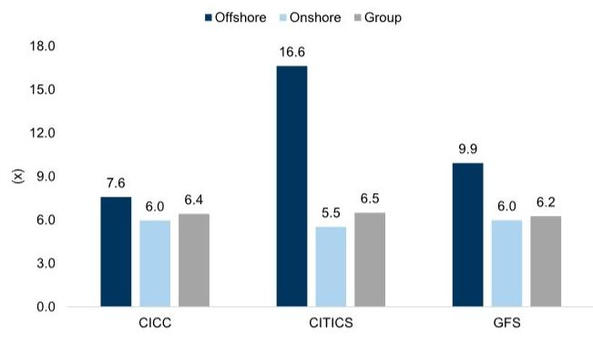

bar chart

| Category | Offshore | Onshore | Group |
|---|---|---|---|
| CICC | 7.6 | 6.0 | 6.4 |
| CITICS | 16.6 | 5.5 | 6.5 |
| GFS | 9.9 | 6.0 | 6.2 |

Source: Company data, GS Global Investment Research

Exhibit 3: The average ROE for the offshore subsidiaries of the three brokers in our coverage is 16%, compared to the group average leverage of 9%
As of 2025  
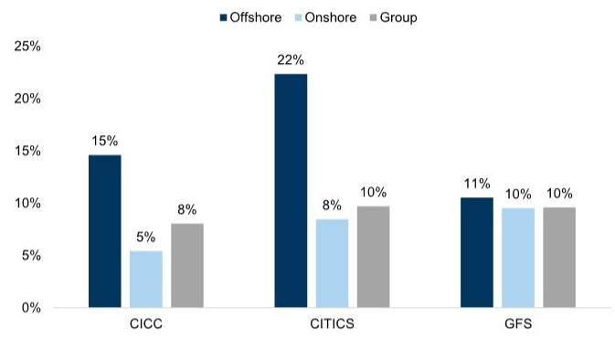

bar chart

| Category | Offshore (%) | Onshore (%) | Group (%) |
| :--- | :--- | :--- | :--- |
| CICC | 15 | 5 | 8 |
| CITICS | 22 | 8 | 10 |
| GFS | 11 | 10 | 10 |

Source: Company data, GS Global Investment Research

The strength of the Hong Kong IPO cycle further reinforces this thesis. GS strategists believe the IPO market has experienced a notable resurgence, with strong issuance volumes and robust post-listing performance, with newly listed companies since 2025 having generated average returns of approximately $40\%$ in the first month, albeit with significant dispersion. This backdrop supports a favorable operating environment for brokers' core businesses, including underwriting, advisory, and trading. In particular, leading brokers have cited a current pipeline of over 180 IPO deals, highlighting both the depth and sustainability of the current cycle.

Exhibit 4: GS strategists note the IPO market experienced a notable resurgence in 2025 and expect it to further normalize to historical averages in 2026  

bar-line hybrid

| Year | IPO amount - HK (US$bn) | IPO amount - A shares (US$bn) | A+H IPOs as % of all China mkt cap (%) |
|---|---|---|---|
| 2009 | 51 | 21 | 1.0 |
| 2010 | 124 | 70 | 2.5 |
| 2011 | 60 | 40 | 1.5 |
| 2012 | 23 | 15 | 0.5 |
| 2013 | 16 | 8 | 0.3 |
| 2014 | 25 | 10 | 0.4 |
| 2015 | 54 | 22 | 0.5 |
| 2016 | 46 | 21 | 0.4 |
| 2017 | 50 | 33 | 0.4 |
| 2018 | 55 | 19 | 0.5 |
| 2019 | 73 | 43 | 0.6 |
| 2020 | 123 | 71 | 0.7 |
| 2021 | 128 | 84 | 0.7 |
| 2022 | 98 | 83 | 0.6 |
| 2023 | 55 | 49 | 0.5 |
| 2024 | 20 | 8 | 0.3 |
| 2025 | 56 | 18 | 0.4 |
| Ytd | 18 | 6 | 0.5 |
| 2026E | 18 | 100 | 0.6 |
As of March 31, 2026
Ytd: YTD: YTD
2026E: 
*Year-over-Year change: YTD

Source: Wind, Bloomberg, GS Global Investment Research

Exhibit 5: Investors participating in IPOs over the past two years could have achieved approximately 40% returns on average in the first month  
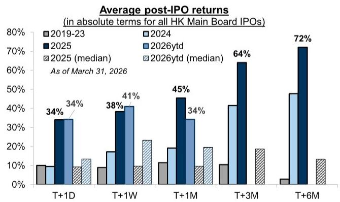

bar chart

Average post-IPO returns (in absolute terms for all HK Main Board IPOs)
| Period | 2019-23 (%) | 2024 (%) | 2025 (%) | 2026ytd (%) | 2025 (median) (%) | 2026ytd (median) (%) |
|---|---|---|---|---|---|---|
| T+1D | 10 | 10 | 34 | 34 | 10 | 13 |
| T+1W | 9 | 17 | 38 | 41 | 9 | 23 |
| T+1M | 11 | 19 | 45 | 34 | 9 | 20 |
| T+3M | 10 | 41 | 64 | - | - | 19 |
| T+6M | 3 | - | 72 | - | - | 13 |
As of March 31, 2026

Source: Wind, FactSet, GS Global Investment Research

The AI theme represents another pillar supporting the sector's outlook. Elevated market interest in AI and related industries has contributed to strong trading activity, with sector-wide ADTV forecast to increase meaningfully. Brokers benefit from this trend

through higher brokerage commissions, increased derivatives activity, and stronger demand for capital markets services. CICC management have indicated that as long as compelling investment themes such as AI persist, accompanied by a supportive interest rate environment, trading volumes are unlikely to see a material decline. This suggests that AI is not merely a short-term catalyst but should be an important driver of sustained market engagement.

However, it is important to distinguish between different sources of broker earnings growth. While participation in IPOs and STAR Board principal investments can boost reported earnings, these activities are inherently volatile and subject to valuation fluctuations and lock-up constraints. Historical experience indicates that such investments tend to increase earnings volatility without delivering a commensurate uplift in valuation multiples. As a result, we believe the market will place greater emphasis on structural drivers of ROE improvement—namely, leverage expansion and capital deployment into higher-return international businesses—rather than on episodic investment gains.

Exhibit 6: During the 2020-23 period, the investment income growth of our covered brokers ranged from a peak of $265\%$ to a trough of $-72\%$ YoY, with the valuation of H-shares for the brokers declining from a peak of 12x to a trough of 7x  
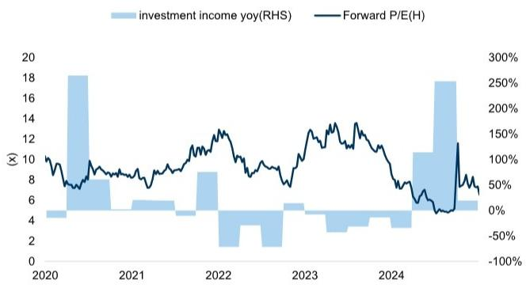

bar-line hybrid chart

| Year | Investment Income Yoy(RHS) | Forward P/E(H) |
|------|-----------------------------|----------------|
| 2020 | 4                           | 100%           |
| 2021 | 6                           | 80%            |
| 2022 | 9                           | 130%           |
| 2023 | 5                           | 120%           |
| 2024 | 6                           | 50%            |
| 2025 | 18                          | 150%           |

Investment income growth and forward P/E both use the average of CICC, CITICS, GFS in our coverage

Exhibit 7: We therefore believe principal investment tends to exacerbate the volatility of brokers' earnings and not drive an uplift in their valuation multiples  
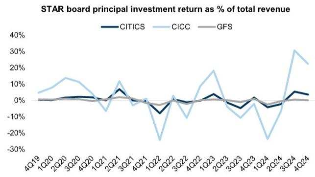

line chart

| Quarter | CITICS | CICC | GFS |
|---------|--------|------|-----|
| 4Q19    | 0%     | 5%   | 0%  |
| 1Q20    | 0%     | 10%  | 0%  |
| 2Q20    | 0%     | 15%  | 0%  |
| 3Q20    | 0%     | 10%  | 0%  |
| 4Q20    | 0%     | 5%   | 0%  |
| 1Q21    | 0%     | -5%  | 0%  |
| 2Q21    | 5%     | 10%  | 0%  |
| 3Q21    | 0%     | -5%  | 0%  |
| 4Q21    | 0%     | -5%  | 0%  |
| 1Q22    | -5%    | -25% | 0%  |
| 2Q22    | -5%    | 0%   | 0%  |
| 3Q22    | 0%     | -5%  | 0%  |
| 4Q22    | 0%     | 5%   | 0%  |
| 1Q23    | 5%     | 15%  | 0%  |
| 2Q23    | 0%     | -5%  | 0%  |
| 3Q23    | -5%    | -10% | 0%  |
| 4Q23    | -5%    | -5%  | 0%  |
| 1Q24    | -5%    | -25% | 0%  |
| 2Q24    | -5%    | -5%  | 0%  |
| 3Q24    | 5%     | 30%  | 0%  |
| 4Q24    | 0%     | 20%  | 0%  |

Source: Company data, GS Global Investment Research, Wind

Source: Company data, Wind

Against this backdrop, we reiterate our preference for CICC-H and CITICS-A as our top broker picks. Both companies offer clear exposure to the key themes outlined above. CICC stands out for its leading position in the Hong Kong IPO market, its significant contribution from international operations, and a well-articulated strategy to drive ROE expansion through capital reallocation and potential M&A. CITICS, meanwhile, is actively raising capital to expand its international footprint, with a clear plan to increase the contribution of offshore business to overall equity and earnings while creating additional headroom for leverage optimization. These characteristics make both names well positioned to benefit from the confluence of IPO cycle strength and structural ROE improvement.

Exhibit 8: CICC's offshore business contributes the most to both revenue and profit, at over $40\%$ , the highest among Chinese brokers As of 2025  
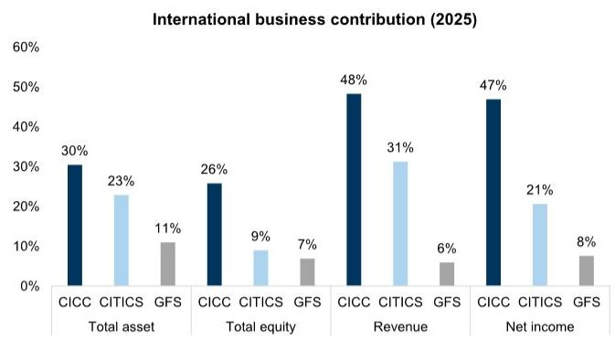

bar chart

International business contribution (2025)
| Category | CICC (%) | CITICS (%) | GFS (%) |
| :--- | :--- | :--- | :--- |
| Total asset | 30 | 23 | 11 |
| Total equity | 26 | 9 | 7 |
| Revenue | 48 | 31 | 6 |
| Net income | 47 | 21 | 8 |

Source: Company data

Exhibit 9: Following CITICS' Rmb 16bn refinancing, we calculate the leverage of its international business will decrease from 16.6x to 10.6x, creating greater room for expansion  
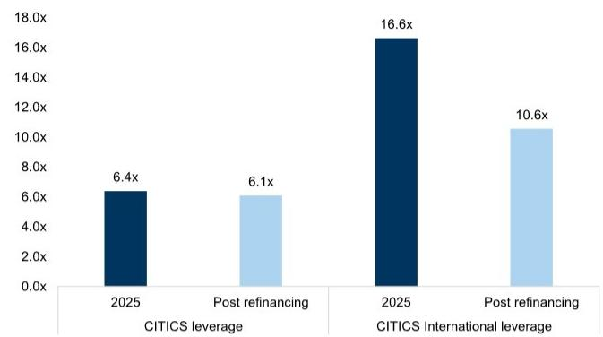

bar chart

| Category | 2025 (x) | Post refinancing (x) |
| :--- | :--- | :--- |
| CITICS leverage | 6.4 | 6.1 |
| CITICS International leverage | 16.6 | 10.6 |

Source: Company data, GS Global Investment Research

Lastly, we note that online brokers such as FUTU also stand to benefit from the current capital market environment, particularly through increased retail participation and AUM growth. However, regulatory developments related to cross-border capital flows and the normalization of mainland client activity introduce near-term uncertainty. While regulatory clarity is improving and the long-term wealth management opportunity remains intact, we believe these headwinds limit the stock's risk-reward relative to traditional brokers with stronger institutional franchises and are Neutral on FUTU.

Exhibit 10: Valuation Summary  
price as of June 15

<table><tr><td rowspan="2">Name</td><td rowspan="2">Ticker</td><td rowspan="2">Price (Local currency)</td><td rowspan="2">Rating</td><td rowspan="2">Valuation method</td><td rowspan="2">Target multiple</td><td rowspan="2">Target price (Local currency)</td><td rowspan="2">Upside (%)</td><td colspan="2">Net profit growth</td><td colspan="2">Trading PE</td><td colspan="2">Trading PB</td><td colspan="2">Implied PE</td><td colspan="2">Implied PB</td></tr><tr><td>2026E</td><td>2027E</td><td>2026E</td><td>2027E</td><td>2026E</td><td>2027E</td><td>2026E</td><td>2027E</td><td>2026E</td><td>2027E</td></tr><tr><td colspan="18">Covered companies</td></tr><tr><td colspan="18">Brokers (A)</td></tr><tr><td>CICC-A</td><td>601995.SS</td><td>33.68</td><td>Neutral</td><td>12m PE</td><td>18.0x</td><td>45.72</td><td>36%</td><td>24%</td><td>1%</td><td>13.4x</td><td>13.3x</td><td>1.1x</td><td>1.1x</td><td>18.2x</td><td>18.0x</td><td>1.6x</td><td>1.4x</td></tr><tr><td>CITICS-A</td><td>600030.SS</td><td>26.86</td><td>Buy</td><td>12m PE</td><td>16.0x</td><td>39.96</td><td>49%</td><td>23%</td><td>0%</td><td>10.8x</td><td>10.8x</td><td>1.1x</td><td>1.0x</td><td>16.0x</td><td>16.0x</td><td>1.7x</td><td>1.5x</td></tr><tr><td>GFS-A</td><td>000776.SZ</td><td>20.83</td><td>Buy</td><td>12m PE</td><td>14.0x</td><td>32.09</td><td>54%</td><td>37%</td><td>-5%</td><td>8.7x</td><td>9.1x</td><td>0.9x</td><td>0.8x</td><td>13.4x</td><td>14.0x</td><td>1.3x</td><td>1.2x</td></tr><tr><td colspan="18">Brokers (H)</td></tr><tr><td>CICC-H</td><td>3908.HK</td><td>20.80</td><td>Buy</td><td>12m PE</td><td>11.0x</td><td>30.45</td><td>46%</td><td>24%</td><td>1%</td><td>7.6x</td><td>7.5x</td><td>0.6x</td><td>0.6x</td><td>11.1x</td><td>11.0x</td><td>0.9x</td><td>0.9x</td></tr><tr><td>CITICS-H</td><td>6030.HK</td><td>27.18</td><td>Neutral</td><td>12m PE</td><td>11.0x</td><td>29.95</td><td>10%</td><td>23%</td><td>0%</td><td>10.0x</td><td>10.0x</td><td>1.0x</td><td>1.0x</td><td>11.0x</td><td>11.0x</td><td>1.1x</td><td>1.1x</td></tr><tr><td>GFS-H</td><td>1776.HK</td><td>16.91</td><td>Neutral</td><td>12m PE</td><td>8.0x</td><td>19.99</td><td>18%</td><td>37%</td><td>-5%</td><td>6.5x</td><td>6.8x</td><td>0.6x</td><td>0.6x</td><td>7.6x</td><td>8.0x</td><td>0.8x</td><td>0.7x</td></tr><tr><td colspan="18">Fintech</td></tr><tr><td>Futu</td><td>FUTU</td><td>97.54</td><td>Neutral</td><td>12m PE</td><td>11.0x</td><td>118.19</td><td>21%</td><td>-18%</td><td>25%</td><td>11.4x</td><td>9.1x</td><td>2.1x</td><td>1.7x</td><td>13.9x</td><td>11.1x</td><td>2.6x</td><td>2.1x</td></tr></table>

Source: FactSet, Company data, GS Global Investment Research

The authors would like to thank Zihan Wang for her contribution to this report.

## Price Target Risks and Methodology - China International Capital Corp.

We are Buy/Neutral on CICC-H/CICC-A. Our 12-month target prices of HK\$ 30.45/Rmb 45.72 are based on 11x/18x 2027E P/Es.

Downside risks: 1) weaker-than-expected China capital market, 2) OTC derivative losses, 3) decreased AUM and fee rate, 4) higher cost income ratio.

Upside risks for A shares: 1) improving brokerage fee and IBD income, 2) increasing OTC derivative business and income growth, 3) more cost savings to support ROE.

## Price Target Risks and Methodology - CITIC Co.

We are Buy/Neutral on CITICS A/H. Our 12-month target prices of Rmb 39.96/HK\$ 29.95 are based on 16x/11x 2027E P/Es.

Downside Risks: 1) further slower revenue growth on weaker capital market, 2) decreasing AUM and take rate of asset management business, 3) slower growth of investment income, 4) more operating expense to keep cost income ratio high.

Upside risks for H share: 1) improving capital market and higher ADTV to drive core business growth, 2) further greater than expected cost savings.

## Price Target Risks and Methodology - GFS Co.

We are Buy/Neutral on GFS-A/H. Our 12-month target prices of Rmb 32.09/HK\$ 19.99 are based on 14x/8x 2027E P/Es.

Upside risks: 1) improving brokerage fees and IBD income, 2) increasing asset management AUM, 3) more cost savings to support ROE.

Downside risks: 1) weaker-than-expected China capital market, 2) a decrease in AUM and fee rate, 3) higher cost-to-income ratio.

## Price Target Risks and Methodology - FUTU Holdings

We are Neutral-rated on FUTU with a 12-month TP of US\$ 118.19, based on a 12m forward 2027E P/E of 11x.

Upside/Downside risks: 1) Lower-/greater-than-expected regulatory impact, 2) Stronger-/weaker-than-expected capital market performance, 3) an optimized cost structure in new markets, 4) challenges in new market expansion.

## Disclosure Appendix

## Reg AC

We, Shuo Yang, Ph.D. and Claire Ouyang, hereby certify that all of the views expressed in this report accurately reflect our personal views about the subject company or companies and its or their securities. We also certify that no part of our compensation was, is or will be, directly or indirectly, related to the specific recommendations or views expressed in this report.

Unless otherwise stated, the individuals listed on the cover page of this report are analysts in GS' Global Investment Research division.

Contributing Authors: Shuo Yang, Ph.D. GS (Asia) L.L.C., Claire Ouyang GS (Asia) L.L.C..

Unless otherwise stated, the individuals listed in the Contributing Authors disclosure of this report are analysts in GS' Global Investment Research division.

## GS Factor Profile

The GS Factor Profile provides investment context for a stock by comparing key attributes to the market (i.e. our universe of rated stocks) and its sector peers. The four key attributes depicted are: Growth, Financial Returns, Multiple (e.g. valuation) and Integrated (a composite of Growth, Financial Returns and Multiple). Growth, Financial Returns and Multiple are calculated by using normalized ranks for specific metrics for each stock. The normalized ranks for the metrics are then averaged and converted into percentiles for the relevant attribute. The precise calculation of each metric may vary depending on the fiscal year, industry and region, but the standard approach is as follows:

Growth is based on a stock's forward-looking sales growth, EBITDA growth and EPS growth (for financial stocks, only EPS and sales growth), with a higher percentile indicating a higher growth company. Financial Returns is based on a stock's forward-looking ROE, ROCE and CROCI (for financial stocks, only ROE), with a higher percentile indicating a company with higher financial returns. Multiple is based on a stock's forward-looking P/E, P/B, price/dividend (P/D), EV/EBITDA, EV/FCF and EV/Debt Adjusted Cash Flow (DACF) (for financial stocks, only P/E, P/B and P/D), with a higher percentile indicating a stock trading at a higher multiple. The Integrated percentile is calculated as the average of the Growth percentile, Financial Returns percentile and (100% - Multiple percentile).

Financial Returns and Multiple use the GS analyst forecasts at the fiscal year-end at least three quarters in the future. Growth uses inputs for the fiscal year at least seven quarters in the future compared with the year at least three quarters in the future (on a per-share basis for all metrics).

For a more detailed description of how we calculate the GS Factor Profile, please contact your GS representative.

## M&A Rank

Across our global coverage, we examine stocks using an M&A framework, considering both qualitative factors and quantitative factors (which may vary across sectors and regions) to incorporate the potential that certain companies could be acquired. We then assign a M&A rank as a means of scoring companies under our rated coverage from 1 to 3, with 1 representing high (30%-50%) probability of the company becoming an acquisition target, 2 representing medium (15%-30%) probability and 3 representing low (0%-15%) probability. For companies ranked 1 or 2, in line with our standard departmental guidelines we incorporate an M&A component into our target price. M&A rank of 3 is considered immaterial and therefore does not factor into our price target, and may or may not be discussed in research.

## Quantum

Quantum is GS' proprietary database providing access to detailed financial statement histories, forecasts and ratios. It can be used for in-depth analysis of a single company, or to make comparisons between companies in different sectors and markets.

## Disclosures

The rating(s) for CITIC Co. (H), CITIC Co.(A), China International Capital Corp. (A), China International Capital Corp. (H), Futu Holdings, GF Securities Co. (A) and GF Securities Co.(H) is/are relative to the other companies in its/their coverage universe: CITIC Co. (H), CITIC Co.(A), China International Capital Corp. (A), China International Capital Corp. (H), East Money Information Co., Futu Holdings, GF Securities Co. (A), GF Securities Co.(H), Hundsun, UP Fintech Holding

## Company-specific regulatory disclosures

The following disclosures relate to relationships between The GS Group, Inc. (with its affiliates, “GS”) and companies covered by GS Global Investment Research and referred to in this research.

GS beneficially owned 1% or more of common equity (excluding positions managed by affiliates and business units not required to be aggregated under US securities law) as of the month end preceding this report: China International Capital Corp. (A) (Rmb32.82) and China International Capital Corp. (H) (HK\$19.62)

GS has received compensation for investment banking services in the past 12 months: China International Capital Corp. (A) (Rmb32.82), China International Capital Corp. (H) (HK\$19.62), Futu Holdings (\$97.54), GF Securities Co. (A) (Rmb20.08) and GF Securities Co.(H) (HK\$16.50)

GS expects to receive or intends to seek compensation for investment banking services in the next 3 months: China International Capital Corp. (A) (Rmb32.82), China International Capital Corp. (H) (HK\$19.62), CITIC Co. (H) (HK\$26.18), CITIC Co.(A) (Rmb26.29), Futu Holdings (\$97.54), GF Securities Co. (A) (Rmb20.08) and GF Securities Co.(H) (HK\$16.50)

GS has received compensation for non-investment banking services during the past 12 months: China International Capital Corp. (A) (Rmb32.82), China International Capital Corp. (H) (HK\$19.62), CITIC Co. (H) (HK\$26.18), CITIC Co.(A) (Rmb26.29), Futu Holdings (\$97.54), GF Securities Co. (A) (Rmb20.08) and GF Securities Co.(H) (HK\$16.50)

GS had an investment banking services client relationship during the past 12 months with: China International Capital Corp. (A) (Rmb32.82), China International Capital Corp. (H) (HK\$19.62), CITIC Co. (H) (HK\$26.18), CITIC Co.(A) (Rmb26.29), Futu Holdings (\$97.54), GF Securities Co. (A) (Rmb20.08) and GF Securities Co.(H) (HK\$16.50)

GS had a non-investment banking securities-related services client relationship during the past 12 months with: China International Capital Corp. (A) (Rmb32.82), China International Capital Corp. (H) (HK\$19.62), CITIC Co. (H) (HK\$26.18), CITIC Co.(A) (Rmb26.29), Futu Holdings (\$97.54), GF Securities Co. (A) (Rmb20.08) and GF Securities Co.(H) (HK\$16.50)

GS had a non-securities services client relationship during the past 12 months with: China International Capital Corp. (A) (Rmb32.82), China

International Capital Corp. (H) (HK\$19.62), CITIC Co. (H) (HK\$26.18), CITIC Co.(A) (Rmb26.29), GF Securities Co. (A) (Rmb20.08) and GF Securities Co.(H) (HK\$16.50)

GS has managed or co-managed a public or Rule 144A offering in the past 12 months: GF Securities Co. (A) (Rmb20.08) and GF Securities Co.(H) (HK\$16.50)

GS makes a market in the securities or derivatives thereof: China International Capital Corp. (A) (Rmb32.82), China International Capital Corp. (H) (HK\$19.62), CITIC Co. (H) (HK\$26.18), CITIC Co.(A) (Rmb26.29) and Futu Holdings (\$97.54)

## Distribution of ratings/investment banking relationships

GS Investment Research global Equity coverage universe

<table><tr><td rowspan="2"></td><td colspan="3">Rating Distribution</td><td colspan="3">Investment Banking Relationships</td></tr><tr><td>Buy</td><td>Hold</td><td>Sell</td><td>Buy</td><td>Hold</td><td>Sell</td></tr><tr><td>Global</td><td>50%</td><td>34%</td><td>16%</td><td>65%</td><td>60%</td><td>45%</td></tr></table>

As of April 1, 2026, GS Global Investment Research had investment ratings on 3,074 equity securities. GS assigns stocks as Buys and Sells on various regional Investment Lists; stocks not so assigned are deemed Neutral. Such assignments equate to Buy, Hold and Sell for the purposes of the above disclosure required by the FINRA Rules. See ‘Ratings, Coverage universe and related definitions’ below. The Investment Banking Relationships chart reflects the percentage of subject companies within each rating category for whom GS has provided investment banking services within the previous twelve months.

Price target and rating history chart(s)  
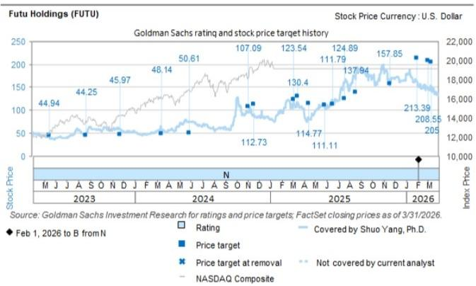

line chart

|  | D |  | D |  |
| --- | --- | --- | --- | --- |
|  | D |  | D |  |
|  | D |  | D |  |
|  | D |  | D |  |
|  | D |  | D |  |
|  | D |  | D |  |
|  | D |  | D |  |
|  | D |  | N |  |
|  | D |  | N |  |
|  | D |  | N |  |
|  | D |  | N |  |
|  | D |  | N |  |
|  | D |  | N |  |
|  | D |  | N |  |
|  | D |  | N |  |
|  | D K | 112.73 | N |  |
|  | D K | 114.77 | N |  |
|  | D K | 111.11 | N |  |
|  | D K | 111.11 | N |  |
|  | D K | 130.4 | N |  |
|  | D K | 137.94 | N |  |
|  | D K | 124.89 | N |  |
|  | D K | 157.85 | N |  |
|  | D K | 213.39 | N |  |
|  | F M | 208.55 | N |  |

The price targets shown should be considered in the context of all prior published GS, which may or may not have included price targets, as well as developments relating to the company, its industry and financial markets.

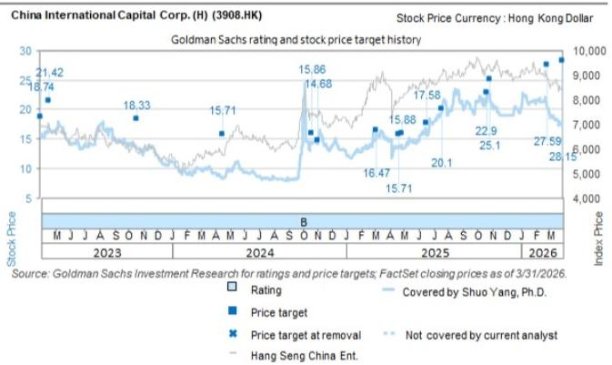

line chart

| Date       | Stock Price | Index Price |
|------------|-------------|-------------|
| M 2023     | 18.74       | 21.42       |
| J 2023     | 18.33       | 18.74       |
| A 2023     | 15.71       | 18.33       |
| S 2023     | 15.71       | 15.71       |
| O 2023     | 15.71       | 15.71       |
| N 2023     | 15.71       | 15.71       |
| D 2023     | 15.71       | 15.71       |
| F 2023     | 15.71       | 15.71       |
| M A 2024   | 15.71       | 15.71       |
| J A 2024   | 15.71       | 15.71       |
| A M 2024   | 15.71       | 15.71       |
| S O 2024   | 15.71       | 15.71       |
| O N 2024   | 15.71       | 15.71       |
| N D 2024   | 15.71       | 15.71       |
| D F 2024   | 15.71       | 15.71       |
| F M 2024   | 15.71       | 15.71       |
| M A 2025   | 15.71       | 15.71       |
| J A 2025   | 15.71       | 15.71       |
| A M 2025   | 15.71       | 15.71       |
| S O 2025   | 15.71       | 15.71       |
| O N 2025   | 15.71       | 15.71       |
| E D 2025   | 15.71       | 15.71       |
| F M 2025   | 15.71       | 15.71       |
| M A 2026   | 15.71       | 15.71       |
| J A 2026   | 15.71       | 15.71       |
| A M 2026   | 15.71       | 15.71       |
| S O 2026   | 15.71       | 15.71       |
| O N 2026   | 15.71       | 15.71       |
| E D 2026   | 15.71       | 15.71       |
| F M 2026   | 15.71       | 15.71       |
| M A 2027   | 15.71       | 15.71       |
| J A 2027   | 15.71       | 15.71       |
| A M 2027   | 15.71       | 15.71       |
| S O 2027   | 15.71       | 15.71       |
| O N 2027   | 15.71       | 15.71       |
| E D 2027   | 15.71       | 15.71       |
| F M 2027   | 15.71       | 15.71       |
| M A 2028   | 15.71       | 15.71       |
| J A 2028   | 15.71       | 15.71       |
| A M 2028   | 15.71       | 15.71       |
| S O 2028   | 15.71       | 15.71       |
| O N 2028   | 15.71       | 15.71       |
| E D 2028   | 15.71       | 15.71       |
| F M 2028   | 15.71       | 15.71       |
| M A 2029   | 15.71       | 15.71       |
| J A 2029   | 15.71       | 15.71       |
| A M 2029   | 15.71       | 15.71       |
| S O 2029   | 15.71       | 15.71       |
| O N 2029   | 15.71       | 15.71       |
| E D 2029   | 15.71       | 15.71       |
| F M 2030   | 15.71       | 15.71       |
| M A 2031   | 15.71       | 15.71       |
| J A 2032   | 15.71       | 15.71       |
| A M 2033   | 15.71       | 15.71       |
| S O 2033   | 15.71       | 15.71       |
| O N 2033   | 15.71       | 15.71       |
| E D 2033   | 15.71       | 15.71       |
| F M 2034   | 15.71       | 15.71       |
| M A          | (unlabeled) | (unlabeled) |
| J A          | (unlabeled) | (unlabeled) |
| A M          | (unlabeled) | (unlabeled) |
| S O          | (unlabeled) | (unlabeled) |
| O N          | (unlabeled) | (unlabeled) |
| E D          | (unlabeled) | (unlabeled) |
| F M          | (unlabeled) | (unlabeled) |
| M A          | (unlabeled) | (unlabeled) |
| J A          | (unlabeled) | (unlabeled) |
| A M          | (unlabeled) | (unlabeled) |
| S O          | (unlabeled) | (unlabeled) |
| O N          | (unlabeled) | (unlabeled) |
| E D          | (unlabeled) | (un labeled) |
| F M          | (unlabeled) | (un labeled) |
| M A          | (unlabeled) | (un labeled) |
| J A          | (unlabeled) | (un labeled) |
| A M          | (unlabeled) | (un labeled) |
| S O          | (unlabeled) | (un labeled) |
| O N          | (unlabeled) | (un labeled) |
| E D          | (unlabeled) | (un labeled) |
| F M          | (unlabeled) | (un labeled) |
| M A          | (unlabeled) | (un labeled) |
| J A          | (unlabeled) | (un labeled) |
| A M          | (unlabeled) | (un labeled) |
| S O          | (unlabeled) |(un labeled) |
| O N          | (unlabeled) | (un labeled) |
| E D          | (unlabeled) | (un labeled) |
| F M          | (unlabeled) | (un labeled) |
| M A          | (unlabeled) | (un labeled) |
| J A          | (unlabeled) | (un labeled) |
| A M          | (unlabeled)|(un labeled)|

The price targets shown should be considered in the context of all prior published GS, which may or may not have included price targets, as well as developments relating to the company, its industry and financial markets.

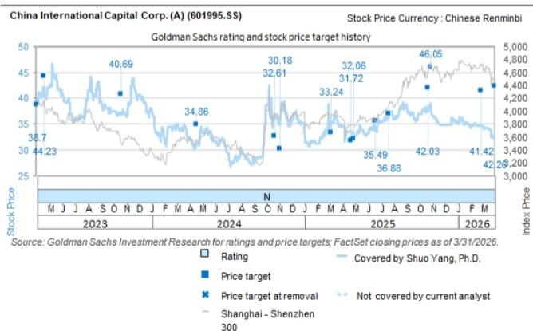

line chart

| Date | Stock Price | Index Price | Rating | Price Target |
| --- | --- | --- | --- | --- |
| 2023 M | 38.7 | 44.23 |  |  |
| 2023 J | 40.69 |  |  |  |
| 2023 A |  |  |  |  |
| 2023 S |  |  |  |  |
| 2023 O |  |  |  |  |
| 2023 N |  |  |  |  |
| 2023 D |  |  |  |  |
| 2024 F |  |  |  |  |
| 2024 M |  |  |  |  |
| 2024 A | 34.86 |  |  |  |
| 2024 M |  |  |  |  |
| 2024 J | 30.18 |  |  |  |
| 2024 S | 32.61 |  |  |  |
| 2024 O | 32.06 |  |  |  |
| 2024 N | 31.72 |  |  |  |
| 2024 D | 33.24 |  |  |  |
| 2025 F |  |  |  |  |
| 2025 M |  |  |  |  |
| 2025 A |  |  |  |  |
| 2025 M | 35.49 |  |  |  |
| 2025 J | 36.88 |  |  |  |
| 2025 S |  |  |  |  |
| 2025 O |  |  |  |  |
| 2025 N | 46.05 |  |  |  |
| 2025 D |  |  |  |  |
| 2025 J |  |  |  |  |
| 2025 F |  |  |  |  |
| 2025 M |  |  |  |  |
| 2025 M |  |  |  |  |
| 2026 N |  |  |  |  |
| 2026 D |  |  |  |  |
| 2026 M | 41.42 |  |  |  |
| 2026 J | 42.28 |  |  |  |
| 2026 M |  |  |  |  |
| 2026 A |  |  |  |  |
| 2026 S |  |  |  |  |
| 2026 O |  |  |  |  |
| 2026 N |  |  |  |  |
| 2026 D |  |  |  |  |
| 2026 J |  |  |  |  |
| 2026 F |  |  |  |  |
| 2026 M |  |  |  |  |
| 2026 M |  |  |  |  |

The price targets shown should be considered in the context of all prior published GS, which may or may not have included price targets, as well as developments relating to the company, its industry and financial markets.

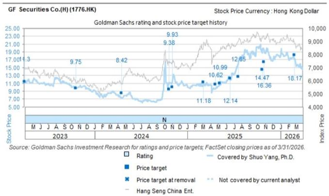

line chart

| Date       | Stock Price | Rating | Price target | Price target at removal | Not covered by current analyst | Hang Seng China Ent. |
|------------|-------------|--------|--------------|--------------------------|-------------------------------|----------------------|
| 2023       | 11.3        |        |              |                          |                               |                      |
| 2024       | 9.75        |        |              |                          |                               |                      |
| 2024       | 8.42        |        |              |                          |                               |                      |
| 2024       | 9.38        |        |              |                          |                               |                      |
| 2024       | 9.93        |        |              |                          |                               |                      |
| 2024       | 11.18       |        |              |                          |                               |                      |
| 2024       | 10.62       |        |              |                          |                               |                      |
| 2024       | 10.99       |        |              |                          |                               |                      |
| 2024       | 12.14       |        |              |                          |                               |                      |
| 2024       | 12.65       |        |              |                          |                               |                      |
| 2024       | 14.47       |        |              |                          |                               |                      |
| 2024       | 16.36       |        |              |                          |                               |                      |
| 2024       | 18.17       |        |              |                          |                               |                      |
Source: GS Investment Research for ratings and price targets; FactSet closing prices as of 3/31/2026.

The price targets shown should be considered in the context of all prior published GS, which may or may not have included price targets, as well as developments relating to the company, its industry and financial markets.

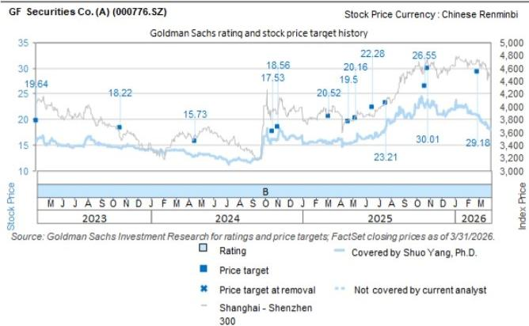

line chart

| 2024 O |  |  |  |  |
| --- | --- | --- | --- | --- |
| 2024 N |  |  |  |  |
| 2024 D |  |  |  |  |
| 2024 F |  |  |  |  |
| 2024 M |  |  |  |  |
| 2024 A |  |  |  |  |
| 2024 S |  |  |  |  |
| 2024 O |  |  |  |  |
| 2024 N |  |  |  |  |
| 2024 D |  |  |  |  |
| 2024 J |  |  |  |  |
| 2024 J |  |  |  |  |
| 2024 A |  |  |  |  |
| 2024 S |  |  |  |  |
| 2024 O |  |  |  |  |
| 2024 N |  |  |  |  |
| 2024 D |  |  |  |  |
| 2035 F |  |  |  |  |
| 2035 M |  |  |  |  |
| 2035 A |  |  |  |  |
| 2035 S |  |  |  |  |
| 2035 O |  |  |  |  |
| 2035 N |  |  |  |  |
| 2035 D |  |  |  |  |
| 2035 J |  |  |  |  |
| 2035 J |  |  |  |  |
| 2035 A |  |  |  |  |
| 2035 S |  |  |  |  |
| 2035 O |  |  |  |  |
| 2035 N |  |  |  |  |
| 2035 D |  |  |  |  |
| 2045 F |  |  |  |  |
| 2045 M |  |  |  |  |
| 2045 A |  |  |  |  |
| 2045 S |  |  |  |  |
| 2045 O |  |  |  |  |
| 2045 N |  |  |  |  |
| 2045 D |  |  |  |  |
| 2045 J |  |  |  |  |
| 2045 J |  |  |  |  |
| 2045 A |  |  |  |  |
| 2045 S |  |  |  |  |
| 2045 O |  |  |  |  |
| 2045 N |  |  |  |  |
| 2045 D |  |  |  |  |
| 2055 F |  |  |  |  |
| 2055 M |  |  |  |  |
| 2055 A |  |  |  |  |
| 2055 S |  |  |  |  |
| 2055 O |  |  |  |  |
| 2055 N |  |  |  |  |

The price targets shown should be considered in the context of all prior published GS, which may or may not have included price targets, as well as developments relating to the company, its industry and financial markets.

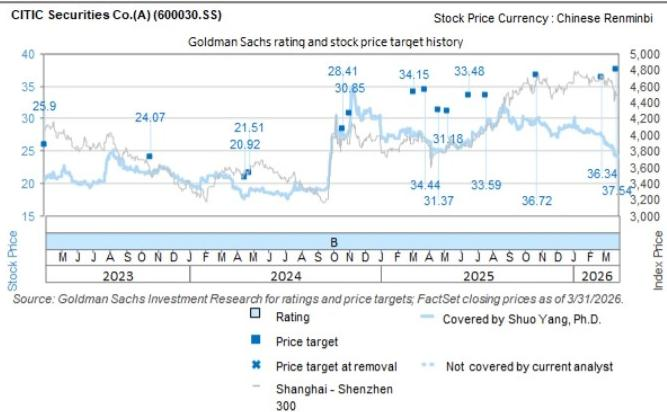

line chart

| Date       | Stock Price | Index: Price |
|------------|-------------|--------------|
| Mar 2023   | 25.9        | 3,000        |
| Jun 2023   | 24.07       | 3,200        |
| Sep 2023   | 21.51       | 3,400        |
| Dec 2023   | 20.92       | 3,600        |
| Mar 2024   | 28.41       | 3,800        |
| Jun 2024   | 30.85       | 4,000        |
| Sep 2024   | 34.15       | 4,200        |
| Dec 2024   | 31.18       | 4,400        |
| Mar 2025   | 34.44       | 4,600        |
| Jun 2025   | 33.59       | 4,800        |
| Sep 2025   | 36.72       | 5,000        |
| Dec 2025   | 36.34       | 4,800        |
| Mar 2026   | 37.54       | 4,600        |

The price targets shown should be considered in the context of all prior published GS, which may or may not have included price targets, as well as developments relating to the company, its industry and financial markets.

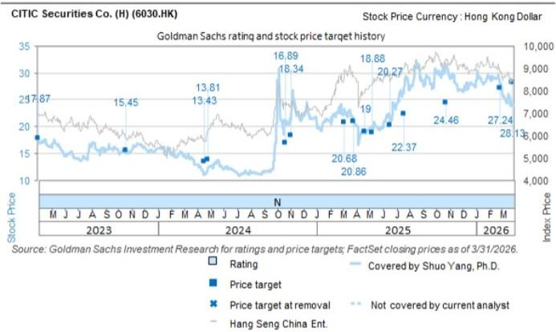

line chart

| Date | Stock Price | Index Price | Rating | Price Target |
| --- | --- | --- | --- | --- |
| Mar 2023 | 17.87 | 4,000 |  |  |
| Jun 2023 | 15.45 | 5,000 |  |  |
| Sep 2023 |  |  |  |  |
| Dec 2023 |  |  |  |  |
| Mar 2024 | 13.81 | 5,000 |  |  |
| Jun 2024 | 13.43 | 5,000 |  |  |
| Sep 2024 |  |  |  |  |
| Dec 2024 |  |  |  |  |
| Mar 2025 | 16.89 | 7,000 |  |  |
| Jun 2025 | 18.34 | 8,000 |  |  |
| Sep 2025 |  |  |  |  |
| Dec 2025 | 18.88 | 9,000 |  |  |
| Mar 2026 | 19.06 | 8,500 |  |  |
| Jun 2026 | 20.68 | 8,000 |  |  |
| Sep 2026 | 22.37 | 8,500 |  |  |
| Dec 2026 | 24.46 | 9,500 |  |  |
| Mar 2027 | 27.24 | 9,000 |  |  |
| Jun 2027 | 28.13 | 8,500 |  |  |
| Sep 2027 |  |  |  |  |
| Dec 2027 |  |  |  |  |
| Mar 2028 |  |  |  |  |
| Jun 2028 |  |  |  |  |
| Sep 2028 |  |  |  |  |
| Dec 2028 |  |  |  |  |
| Mar 2029 |  |  |  |  |
| Jun 2030 |  |  |  |  |
| Sep 2030 |  |  |  |  |
| Dec 2030 |  |  |  |  |
| Mar 2031 |  |  |  |  |
| Jun 2032 |  |  |  |  |
| Sep 2032 |  |  |  |  |
| Dec 2032 |  |  |  |  |
| Mar 2033 |  |  |  |  |
| Jun 2034 |  |  |  |  |
| Sep 2034 |  |  |  |  |
| Dec 2034 |  |  |  |  |
| Mar 2035 |  |  |  |  |
| Jun 2036 |  |  |  |  |
| Sep 2036 |  |  |  |  |
| Dec 2036 |  |  |  |  |
| Mar 2037 |  |  |  |  |
| Jun 2038 |  |  |  |  |
| Sep 2038 |  |  |  |  |
| Dec 2038 |  |  |  |  |
| Mar 2039 |  |  |  |  |
| Jun 2040 |  |  |  |  |
| Sep 2040 |  |  |  |  |
| Dec 2040 |  |  |  |  |
| Mar 2041 |  |  |  |  |
| Jun 2042 |  |  |  |  |
| Sep 2042 |  |  |  |  |
| Dec 2042 |  |  |  |  |
| Mar 2043 |  |  |  |  |
| Jun 2044 |  |  |  |  |
| Sep 2044 |  |  |  |  |
| Dec 2044 |  |  |  |  |
| Mar 2045 |  |  |  |  |
| Jun 2046 |  |  |  |  |
| Sep 2046 |  |  |  |  |
| Dec 2046 |  |  |  |  |
| Mar 2047 |  |  |  |  |
| Jun 2048 |  |  |  |  |
| Sep 2048 |  |  |  |  |
| Dec 2048 |  |  |  |  |
| Mar 2049 |  |  |  |  |
| Jun 2050 |  |  |  |  |
| Sep 2051 |  |  |  |  |
| Dec 2051 |  |  |  |  |
| Mar 2052 |  |  |  |  |
| Jun 2053 |  |  |  |  |
| Sep 2053 |  |  |  |  |
| Dec 2053 |  |  |  |  |
| Mar 2054 |  |  |  |  |
| Jun 2055 |  |  |  |  |
| Sep 2055 |  |  |  |  |
| Dec 2055 |  |  |  |  |
| Mar 2056 |  |  |  |  |
| Jun 2057 |  |  |  |  |
| Sep 2057 |  |  |  |  |
| Dec 2057 |  |  |  |  |

The price targets shown should be considered in the context of all prior published GS, which may or may not have included price targets, as well as developments relating to the company, its industry and financial markets.

Target price history table(s)  
CITIC Co. (H) (6030.HK)

<table><tr><td>Date of report</td><td>Target price (HK$)</td><td>Closing price (HK$)</td></tr><tr><td>24-Apr-26</td><td>29.95</td><td>26.62</td></tr><tr><td>27-Mar-26</td><td>28.13</td><td>24.14</td></tr><tr><td>27-Feb-26</td><td>27.24</td><td>28.06</td></tr><tr><td>26-Oct-25</td><td>24.46</td><td>31.66</td></tr><tr><td>21-Jul-25</td><td>22.37</td><td>27.25</td></tr><tr><td>19-Jun-25</td><td>20.27</td><td>20.75</td></tr><tr><td>09-May-25</td><td>18.88</td><td>19.44</td></tr><tr><td>22-Apr-25</td><td>19.00</td><td>19.00</td></tr><tr><td>27-Mar-25</td><td>20.86</td><td>21.30</td></tr><tr><td>06-Mar-25</td><td>20.68</td><td>23.40</td></tr><tr><td>04-Nov-24</td><td>18.34</td><td>22.40</td></tr><tr><td>21-Oct-24</td><td>16.89</td><td>20.80</td></tr><tr><td>26-Apr-24</td><td>13.81</td><td>12.32</td></tr><tr><td>18-Apr-24</td><td>13.43</td><td>11.18</td></tr><tr><td>20-Oct-23</td><td>15.45</td><td>15.08</td></tr></table>

GF Securities Co.(H) (1776.HK)

<table><tr><td>Date of report</td><td>Target price (HK$)</td><td>Closing price (HK$)</td></tr><tr><td>28-Apr-26</td><td>19.99</td><td>17.50</td></tr><tr><td>21-Apr-26</td><td>18.84</td><td>16.93</td></tr><tr><td>01-Apr-26</td><td>18.26</td><td>14.64</td></tr><tr><td>27-Feb-26</td><td>18.17</td><td>17.24</td></tr><tr><td>30-Oct-25</td><td>16.36</td><td>19.54</td></tr><tr><td>22-Oct-25</td><td>14.47</td><td>18.75</td></tr><tr><td>21-Jul-25</td><td>12.65</td><td>16.28</td></tr><tr><td>19-Jun-25</td><td>12.14</td><td>11.82</td></tr><tr><td>09-May-25</td><td>10.99</td><td>10.56</td></tr><tr><td>22-Apr-25</td><td>10.62</td><td>9.60</td></tr><tr><td>06-Mar-25</td><td>11.18</td><td>10.80</td></tr><tr><td>04-Nov-24</td><td>9.93</td><td>11.62</td></tr><tr><td>21-Oct-24</td><td>9.38</td><td>10.86</td></tr><tr><td>18-Apr-24</td><td>8.42</td><td>7.37</td></tr><tr><td>20-Oct-23</td><td>9.75</td><td>9.87</td></tr></table>

China International Capital Corp. (A) (601995.SS)

<table><tr><td>Date of report</td><td>Target price (Rmb)</td><td>Closing price (Rmb)</td></tr><tr><td>30-Apr-26</td><td>45.72</td><td>34.23</td></tr><tr><td>21-Apr-26</td><td>44.58</td><td>33.93</td></tr><tr><td>01-Apr-26</td><td>42.26</td><td>32.68</td></tr><tr><td>27-Feb-26</td><td>41.42</td><td>34.65</td></tr><tr><td>29-Oct-25</td><td>46.05</td><td>39.03</td></tr></table>

CITIC Co.(A) (600030.SS)

<table><tr><td>Date of report</td><td>Target price (Rmb)</td><td>Closing price (Rmb)</td></tr><tr><td>24-Apr-26</td><td>39.96</td><td>26.23</td></tr><tr><td>27-Mar-26</td><td>37.54</td><td>24.26</td></tr><tr><td>27-Feb-26</td><td>36.34</td><td>27.37</td></tr><tr><td>26-Oct-25</td><td>36.72</td><td>29.87</td></tr><tr><td>21-Jul-25</td><td>33.59</td><td>28.90</td></tr></table>

China International Capital Corp. (A) (601995.SS)

<table><tr><td>Date of report</td><td>Target price (Rmb)</td><td>Closing price (Rmb)</td></tr><tr><td>22-Oct-25</td><td>42.03</td><td>37.42</td></tr><tr><td>21-Jul-25</td><td>36.88</td><td>36.61</td></tr><tr><td>19-Jun-25</td><td>35.49</td><td>33.79</td></tr><tr><td>28-Apr-25</td><td>32.06</td><td>32.86</td></tr><tr><td>22-Apr-25</td><td>31.72</td><td>33.53</td></tr><tr><td>06-Mar-25</td><td>33.24</td><td>35.81</td></tr><tr><td>04-Nov-24</td><td>30.18</td><td>35.77</td></tr><tr><td>21-Oct-24</td><td>32.61</td><td>35.86</td></tr><tr><td>18-Apr-24</td><td>34.86</td><td>31.34</td></tr><tr><td>20-Oct-23</td><td>40.69</td><td>37.23</td></tr></table>

CITIC Co.(A) (600030.SS)

<table><tr><td>Date of report</td><td>Target price (Rmb)</td><td>Closing price (Rmb)</td></tr><tr><td>19-Jun-25</td><td>33.48</td><td>25.91</td></tr><tr><td>09-May-25</td><td>31.18</td><td>25.55</td></tr><tr><td>22-Apr-25</td><td>31.37</td><td>25.08</td></tr><tr><td>27-Mar-25</td><td>34.44</td><td>26.90</td></tr><tr><td>06-Mar-25</td><td>34.15</td><td>28.00</td></tr><tr><td>04-Nov-24</td><td>30.85</td><td>29.06</td></tr><tr><td>21-Oct-24</td><td>28.41</td><td>27.46</td></tr><tr><td>26-Apr-24</td><td>21.51</td><td>19.16</td></tr><tr><td>18-Apr-24</td><td>20.92</td><td>18.21</td></tr><tr><td>20-Oct-23</td><td>24.07</td><td>21.53</td></tr></table>

Futu Holdings (FUTU)

<table><tr><td>Date of report</td><td>Target price ($)</td><td>Closing price ($)</td></tr><tr><td>10-Jun-26</td><td>118.19</td><td>92.93</td></tr><tr><td>28-May-26</td><td>114.37</td><td>104.91</td></tr><tr><td>25-May-26</td><td>102.13</td><td>89.76</td></tr><tr><td>12-May-26</td><td>210.47</td><td>137.03</td></tr><tr><td>12-Mar-26</td><td>205.00</td><td>143.01</td></tr><tr><td>03-Mar-26</td><td>208.55</td><td>144.70</td></tr><tr><td>01-Feb-26</td><td>213.39</td><td>162.57</td></tr><tr><td>19-Nov-25</td><td>157.85</td><td>165.90</td></tr><tr><td>20-Aug-25</td><td>137.94</td><td>178.66</td></tr><tr><td>21-Jul-25</td><td>124.89</td><td>160.27</td></tr><tr><td>19-Jun-25</td><td>111.79</td><td>122.16</td></tr><tr><td>29-May-25</td><td>111.11</td><td>107.36</td></tr><tr><td>15-Apr-25</td><td>114.77</td><td>83.74</td></tr><tr><td>17-Mar-25</td><td>130.40</td><td>117.11</td></tr><tr><td>06-Mar-25</td><td>123.54</td><td>116.79</td></tr><tr><td>19-Nov-24</td><td>112.73</td><td>86.70</td></tr><tr><td>04-Nov-24</td><td>107.09</td><td>96.90</td></tr><tr><td>29-May-24</td><td>50.61</td><td>76.36</td></tr><tr><td>15-Mar-24</td><td>48.14</td><td>54.25</td></tr><tr><td>23-Nov-23</td><td>45.97</td><td>59.38</td></tr><tr><td>24-Aug-23</td><td>44.25</td><td>49.40</td></tr></table>

China International Capital Corp. (H) (3908.HK)

<table><tr><td>Date of report</td><td>Target price (HK$)</td><td>Closing price (HK$)</td></tr><tr><td>30-Apr-26</td><td>30.45</td><td>20.22</td></tr><tr><td>21-Apr-26</td><td>29.70</td><td>19.94</td></tr><tr><td>01-Apr-26</td><td>28.15</td><td>17.20</td></tr><tr><td>27-Feb-26</td><td>27.59</td><td>20.26</td></tr><tr><td>29-Oct-25</td><td>25.10</td><td>22.74</td></tr><tr><td>22-Oct-25</td><td>22.90</td><td>21.34</td></tr><tr><td>21-Jul-25</td><td>20.10</td><td>20.55</td></tr><tr><td>19-Jun-25</td><td>17.58</td><td>15.64</td></tr><tr><td>28-Apr-25</td><td>15.88</td><td>13.28</td></tr><tr><td>22-Apr-25</td><td>15.71</td><td>13.80</td></tr><tr><td>06-Mar-25</td><td>16.47</td><td>15.86</td></tr><tr><td>04-Nov-24</td><td>14.68</td><td>14.72</td></tr><tr><td>21-Oct-24</td><td>15.86</td><td>14.22</td></tr><tr><td>18-Apr-24</td><td>15.71</td><td>8.60</td></tr><tr><td>20-Oct-23</td><td>18.33</td><td>13.36</td></tr></table>

GF Securities Co. (A) (000776.SZ)

<table><tr><td>Date of report</td><td>Target price (Rmb)</td><td>Closing price (Rmb)</td></tr><tr><td>28-Apr-26</td><td>32.09</td><td>21.10</td></tr><tr><td>21-Apr-26</td><td>30.24</td><td>19.88</td></tr><tr><td>01-Apr-26</td><td>29.31</td><td>18.43</td></tr><tr><td>27-Feb-26</td><td>29.18</td><td>20.84</td></tr><tr><td>30-Oct-25</td><td>30.01</td><td>23.55</td></tr><tr><td>22-Oct-25</td><td>26.55</td><td>22.33</td></tr><tr><td>21-Jul-25</td><td>23.21</td><td>18.70</td></tr><tr><td>19-Jun-25</td><td>22.28</td><td>16.30</td></tr><tr><td>09-May-25</td><td>20.16</td><td>15.77</td></tr><tr><td>22-Apr-25</td><td>19.50</td><td>15.36</td></tr><tr><td>06-Mar-25</td><td>20.52</td><td>15.72</td></tr><tr><td>04-Nov-24</td><td>18.56</td><td>16.52</td></tr><tr><td>21-Oct-24</td><td>17.53</td><td>16.07</td></tr><tr><td>18-Apr-24</td><td>15.73</td><td>13.04</td></tr><tr><td>20-Oct-23</td><td>18.22</td><td>14.53</td></tr></table>

Price targets shown in table(s) are unadjusted for corporate actions.

## Regulatory disclosures

## Disclosures required by United States laws and regulations

See company-specific regulatory disclosures above for any of the following disclosures required as to companies referred to in this report: manager or co-manager in a pending transaction; 1% or other ownership; compensation for certain services; types of client relationships; managed/co-managed public offerings in prior periods; directorships; for equity securities, market making and/or specialist role. GS trades or may trade as a principal in debt securities (or in related derivatives) of issuers discussed in this report.

The following are additional required disclosures: Ownership and material conflicts of interest: GS policy prohibits its analysts, professionals reporting to analysts and members of their households from owning securities of any company in the analyst's area of coverage. Analyst compensation: Analysts are paid in part based on the profitability of GS, which includes investment banking revenues. Analyst as officer or director: GS policy generally prohibits its analysts, persons reporting to analysts or members of their households from serving as an officer, director or advisor of any company in the analyst's area of coverage. Non-U.S. Analysts: Non-U.S. analysts may not be associated persons of GS & Co. LLC and therefore may not be subject to FINRA Rule 2241 or FINRA Rule 2242 restrictions on communications with a subject company, public appearances and trading in securities covered by the analysts.

Distribution of ratings: See the distribution of ratings disclosure above. Price chart: See the price chart, with changes of ratings and price targets in prior periods, above, or, if electronic format or if with respect to multiple companies which are the subject of this report, on the GS website at https://www.gs.com/research/hedge.html.

## Additional disclosures required under the laws and regulations of jurisdictions other than the United States

The following disclosures are those required by the jurisdiction indicated, except to the extent already made above pursuant to United States laws and regulations. Australia: GS Australia Pty Ltd and its affiliates are not authorised deposit-taking institutions (as that term is defined in the Banking Act 1959 (Cth)) in Australia and do not provide banking services, nor carry on a banking business, in Australia. This research, and any access to it, is intended only for “wholesale clients” within the meaning of the Australian Corporations Act, unless otherwise agreed by GS. In producing research reports, members of Global Investment Research of GS Australia may attend site visits and other meetings hosted by the companies and other entities which are the subject of its research reports. In some instances the costs of such site visits or meetings may be met in part or in whole by the issuers concerned if GS Australia considers it is appropriate and reasonable in the specific circumstances relating to the site visit or meeting. To the extent that the contents of this document contains any financial product advice, it is general advice only and has been prepared by GS without taking into account a client’s objectives, financial situation or needs. A client should, before acting on any such advice, consider the appropriateness of the advice having regard to the client’s own objectives, financial situation and needs. A copy of certain GS Australia and New Zealand disclosure of interests and a copy of GS’ Australian Sell-Side Research Independence Policy Statement are available at: https://www.goldmansachs.com/disclosures/australia-new-zealand/index.html. Brazil: Disclosure information in relation to CVM Resolution n. 20 is available at https://www.gs.com/worldwide/brazil/area/gir/index.html. Where applicable, the Brazil-registered analyst primarily responsible for the content of this research report, as defined in Article 20 of CVM Resolution n. 20, is the first author named at the beginning of this report, unless indicated otherwise at the end of the text. Canada: This information is being provided to you for information purposes only and is not, and under no circumstances should be construed as, an advertisement, offering or solicitation by GS & Co. LLC for purchasers of securities in Canada to trade in any Canadian security. GS & Co. LLC is not registered as a dealer in any jurisdiction in Canada under applicable Canadian securities laws and generally is not permitted to trade in Canadian securities and may be prohibited from selling certain securities and products in certain jurisdictions in Canada. If you wish to trade in any Canadian securities or other products in Canada please contact GS Canada Inc., an affiliate of The GS Group Inc., or another registered Canadian dealer. Hong Kong: Further information on the securities of covered companies referred to in this research may be obtained on request from GS (Asia) L.L.C. India: Further information on the subject company or companies referred to in this research may be obtained from GS (India) Securities Private Limited, Research Analyst - SEBI Registration Number INH000001493, 10th Floor, Ascent-Worli, Sudam Kalu Ahire Marg, Worli, Mumbai-400 025, India, Corporate Identity Number U74140MH2006FTC160634, Phone +91 22 6616 9000, Fax +91 22 6616 9001. GS may beneficially own 1% or more of the securities (as such term is defined in clause 2 (h) the Indian Securities Contracts (Regulation) Act, 1956) of the subject company or companies referred to in this research report. Investment in securities market are subject to market risks. Read all the related documents carefully before investing. Registration granted by SEBI and certification from NISM in no way guarantee performance of the intermediary or provide any assurance of returns to investors. GS (India) Securities Private Limited compliance officer and investor grievance contact details can be found at: https://www.goldmansachs.com/worldwide/india/documents/Grievance-Redressal-and-Escalation-Matrix.pdf, and a copy of the annual audit compliance report can be found at this link: https://publishing.gs.com/content/site/india-annual-compliance-report.html. Japan: See below. Korea: This research, and any access to it, is intended only for “professional investors” within the meaning of the Financial Services and Capital Markets Act, unless otherwise agreed by GS. Further information on the subject company or companies referred to in this research may be obtained from GS (Asia) L.L.C., Seoul Branch. New Zealand: GS New Zealand Limited and its affiliates are neither “registered banks” nor “deposit takers” (as defined in the Reserve Bank of New Zealand Act 1989) in New Zealand. This research, and any access to it, is intended for “wholesale clients” (as defined in the Financial Advisers Act 2008) unless otherwise agreed by GS. A copy of certain GS Australia and New Zealand disclosure of interests is available at: https://www.goldmansachs.com/disclosures/australia-new-zealand/index.html. Russia: Research reports distributed in the Russian Federation are not advertising as defined in the Russian legislation, but are information and analysis not having product promotion as their main purpose and do not provide appraisal within the meaning of the Russian legislation on appraisal activity. Research reports do not constitute a personalized investment recommendation as defined in Russian laws and regulations, are not addressed to a specific client, and are prepared without analyzing the financial circumstances, investment profiles or risk profiles of clients. GS assumes no responsibility for any investment decisions that may be taken by a client or any other person based on this research report. Singapore: GS (Singapore) Pte. (Company Number: 198602165W), which is regulated by the Monetary Authority of Singapore, accepts legal responsibility for this research, and should be contacted with respect to any matters arising from, or in connection with, this research. Taiwan: This material is for reference only and must not be reprinted without permission. Investors should carefully consider their own investment risk. Investment results are the responsibility of the individual investor. United Kingdom: Persons who would be categorized as retail clients in the United Kingdom, as such term is defined in the rules of the Financial Conduct Authority, should read this research in conjunction with prior GS on the covered companies referred to herein and should refer to the risk warnings that have been sent to them by GS International. A copy of these risks warnings, and a glossary of certain financial terms used in this report, are available from GS International on request.

European Union and United Kingdom: Disclosure information in relation to Article 6 (2) of the European Commission Delegated Regulation (EU) (2016/958) supplementing Regulation (EU) No 596/2014 of the European Parliament and of the Council (including as that Delegated Regulation is implemented into United Kingdom domestic law and regulation following the United Kingdom's departure from the European Union and the European Economic Area) with regard to regulatory technical standards for the technical arrangements for objective presentation of investment recommendations or other information recommending or suggesting an investment strategy and for disclosure of particular interests or indications of conflicts of interest is available at https://www.gs.com/disclosures/europeanpolicy.html which states the European Policy for Managing Conflicts of Interest in Connection with Investment Research.

Japan: GS Japan Co., Ltd. is a Financial Instrument Dealer registered with the Kanto Financial Bureau under registration number Kinsho 69, and a member of Japan Securities Dealers Association, Financial Futures Association of Japan Type II Financial Instruments Firms Association, and Investment Management Association of Japan. Sales and purchase of equities are subject to commission pre-determined with clients plus consumption tax. See company-specific disclosures as to any applicable disclosures required by Japanese stock exchanges, the Japanese Securities Dealers Association or the Japanese Securities Finance Company.

## Ratings, coverage universe and related definitions

Buy (B), Neutral (N), Sell (S) Analysts recommend stocks as Buys or Sells for inclusion on various regional Investment Lists. Being assigned a Buy or Sell on an Investment List is determined by a stock's total return potential relative to its coverage universe. Any stock not assigned as a Buy or a Sell on an Investment List with an active rating (i.e., a stock that is not Rating Suspended, Not Rated, Early-Stage Biotech, Coverage Suspended or Not Covered), is deemed Neutral. Each region manages Regional Conviction Lists, which are selected from Buy rated stocks on the respective region's Investment Lists and represent investment recommendations focused on the size of the total return potential and/or the likelihood of the realization of the return across their respective areas of coverage. The addition or removal of stocks from such Conviction Lists are managed by the Investment Review Committee or other designated committee in each respective region and do not represent a change in the analysts' investment rating for such stocks.

Total return potential represents the upside or downside differential between the current share price and the price target, including all paid or anticipated dividends, expected during the time horizon associated with the price target. Price targets are required for all covered stocks. The total return potential, price target and associated time horizon are stated in each report adding or reiterating an Investment List membership.

Coverage Universe: A list of all stocks in each coverage universe is available by primary analyst, stock and coverage universe at https://www.gs.com/research/hedge.html.

Not Rated (NR). The investment rating, target price and earnings estimates (where relevant) are removed pursuant to GS policy when GS is acting in an advisory capacity in a merger or in a strategic transaction involving this company, when there are legal, regulatory or policy constraints due to GS' involvement in a transaction, and in certain other circumstances. Early-Stage Biotech (ES). An investment rating and a target price are not assigned pursuant to GS policy when this company has neither a drug, treatment or medical device that has passed a Phase II clinical trial nor a license to distribute a post-Phase II drug, treatment or medical device. Rating Suspended (RS). GS has suspended the investment rating and price target for this stock, because there is not a sufficient fundamental basis for determining an investment rating or target price. The previous investment rating and target price, if any, are no longer in effect for this stock and should not be relied upon. Coverage Suspended (CS). GS has suspended coverage of this company. Not Covered (NC). GS does not cover this company.

## Global product; distributing entities

GS Global Investment Research produces and distributes research products for clients of GS on a global basis. Analysts based in GS offices around the world produce research on industries and companies, and research on macroeconomics, currencies, commodities and portfolio strategy. This research is disseminated in Australia by GS Australia Pty Ltd (ABN 21 006 797 897); in Brazil by GS do Brasil Corretora de Títulos e Valores Mobiliários S.A.; Public Communication Channel GS Brazil: 0800 727 5764 and / or contatogoldmanbrasil@gs.com. Available Weekdays (except holidays), from 9am to 6pm. Canal de Comunicação com o Público GS Brasil: 0800 727 5764 e/ou contatogoldmanbrasil@gs.com. Horário de funcionamento: segunda-feira à sexta-feira (exceto feriados), das 9h às 18h; in Canada by GS & Co. LLC; in Hong Kong by GS (Asia) L.L.C.; in India by GS (India) Securities Private Ltd.; in Japan by GS Japan Co., Ltd.; in the Republic of Korea by GS (Asia) L.L.C., Seoul Branch; in New Zealand by GS New Zealand Limited; in Russia by OOO GS; in Singapore by GS (Singapore) Pte. (Company Number: 198602165W); and in the United States of America by GS & Co. LLC. GS International has approved this research in connection with its distribution in the United Kingdom.

GS International (“GSI”), authorised by the Prudential Regulation Authority (“PRA”) and regulated by the Financial Conduct Authority (“FCA”) and the PRA, has approved this research in connection with its distribution in the United Kingdom.

European Economic Area: GS Bank Europe SE (“GSBE”) is a credit institution incorporated in Germany and, within the Single Supervisory Mechanism, subject to direct prudential supervision by the European Central Bank and in other respects supervised by German Federal Financial Supervisory Authority (Bundesanstalt für Finanzdienstleistungsaufsicht, BaFin) and Deutsche Bundesbank and disseminates research within the European Economic Area.

## General disclosures

This research is for our clients only. Other than disclosures relating to GS, this research is based on current public information that we consider reliable, but we do not represent it is accurate or complete, and it should not be relied on as such. The information, opinions, estimates and forecasts contained herein are as of the date hereof and are subject to change without prior notification. We seek to update our research as appropriate, but various regulations may prevent us from doing so. Other than certain industry reports published on a periodic basis, the large majority of reports are published at irregular intervals as appropriate in the analyst's judgment.

GS conducts a global full-service, integrated investment banking, investment management, and brokerage business. We have investment banking and other business relationships with a substantial percentage of the companies covered by Global Investment Research. GS & Co. LLC, the United States broker dealer, is a member of SIPC (https://www.sipc.org).

Our salespeople, traders, and other professionals may provide oral or written market commentary or trading strategies to our clients and principal trading desks that reflect opinions that are contrary to the opinions expressed in this research. Our asset management area, principal trading desks and investing businesses may make investment decisions that are inconsistent with the recommendations or views expressed in this research.

The analysts named in this report may have from time to time discussed with our clients, including GS salespersons and traders, or may discuss in this report, trading strategies that reference catalysts or events that may have a near-term impact on the market price of the equity securities discussed in this report, which impact may be directionally counter to the analyst's published price target expectations for such stocks. Any such trading strategies are distinct from and do not affect the analyst's fundamental equity rating for such stocks, which rating reflects a stock's return potential relative to its coverage universe as described herein.

We and our affiliates, officers, directors, and employees will from time to time have long or short positions in, act as principal in, and buy or sell, the securities or derivatives, if any, referred to in this research, unless otherwise prohibited by regulation or GS policy.

The views attributed to third party presenters at GS arranged conferences, including individuals from other parts of GS, do not necessarily reflect those of Global Investment Research and are not an official view of GS.

Any third party referenced herein, including any salespeople, traders and other professionals or members of their household, may have positions in the products mentioned that are inconsistent with the views expressed by analysts named in this report.

This research is not an offer to sell or the solicitation of an offer to buy any security in any jurisdiction where such an offer or solicitation would be illegal. It does not constitute a personal recommendation or take into account the particular investment objectives, financial situations, or needs of individual clients. Clients should consider whether any advice or recommendation in this research is suitable for their particular circumstances and, if appropriate, seek professional advice, including tax advice. The price and value of investments referred to in this research and the income from them may fluctuate. Past performance is not a guide to future performance, future returns are not guaranteed, and a loss of original capital may occur. Fluctuations in exchange rates could have adverse effects on the value or price of, or income derived from, certain investments.

Certain transactions, including those involving futures, options, and other derivatives, give rise to substantial risk and are not suitable for all investors. Investors should review current options and futures disclosure documents which are available from GS sales representatives or at https://www.theocc.com/about/publications/character-risks.jsp and https://www.goldmansachs.com/disclosures/cftc\_fcm\_disclosures. Transaction costs may be significant in option strategies calling for multiple purchase and sales of options such as spreads. Supporting documentation will be supplied upon request.

Differing Levels of Service provided by Global Investment Research: The level and types of services provided to you by GS Global Investment Research may vary as compared to that provided to internal and other external clients of GS, depending on various factors including your individual preferences as to the frequency and manner of receiving communication, your risk profile and investment focus and perspective (e.g., marketwide, sector specific, long term, short term), the size and scope of your overall client relationship with GS, and legal and regulatory constraints. As an example, certain clients may request to receive notifications when research on specific securities is published, and certain clients may request that specific data underlying analysts' fundamental analysis available on our internal client websites be delivered to them electronically through data feeds or otherwise. No change to an analyst's fundamental research views (e.g., ratings, price targets, or material changes to earnings estimates for equity securities), will be communicated to any client prior to inclusion of such information in a research report broadly disseminated through electronic publication to our internal client websites or through other means, as necessary, to all clients who are entitled to receive such reports.

All research reports are disseminated and available to all clients simultaneously through electronic publication to our internal client websites. Not all research content is redistributed to our clients or available to third-party aggregators, nor is GS responsible for the redistribution of our research by third party aggregators. For research, models or other data related to one or more securities, markets or asset classes (including related services) that may be available to you, please contact your GS representative or go to https://research.gs.com.

Disclosure information is also available at https://www.gs.com/research/hedge.html or from Research Compliance, 200 West Street, New York, NY 10282.

## © 2026 GS.

You are permitted to store, display, analyze, modify, reformat, and print the information made available to you via this service only for your own use. You may not resell or reverse engineer this information to calculate or develop any index for disclosure and/or marketing or create any other derivative works or commercial product(s), data or offering(s) without the express written consent of GS. You are not permitted to publish, transmit, or otherwise reproduce this information, in whole or in part, in any format to any third party without the express written consent of GS. This foregoing restriction includes, without limitation, using, extracting, downloading or retrieving this information, in whole or in part, to train or finetune a machine learning or artificial intelligence system, or to provide or reproduce this information, in whole or in part, as a prompt or input to any such system.