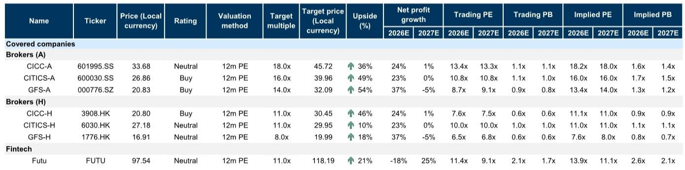
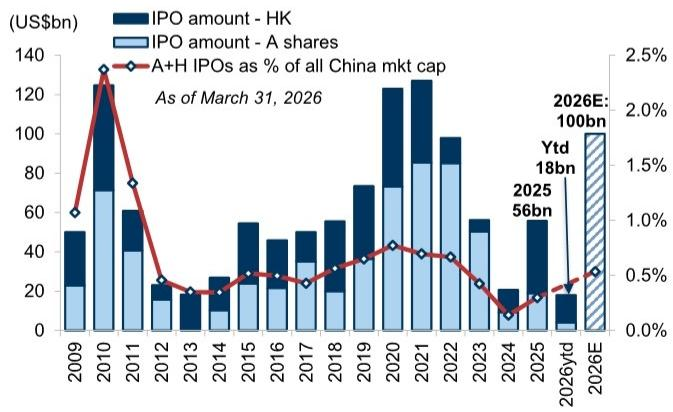
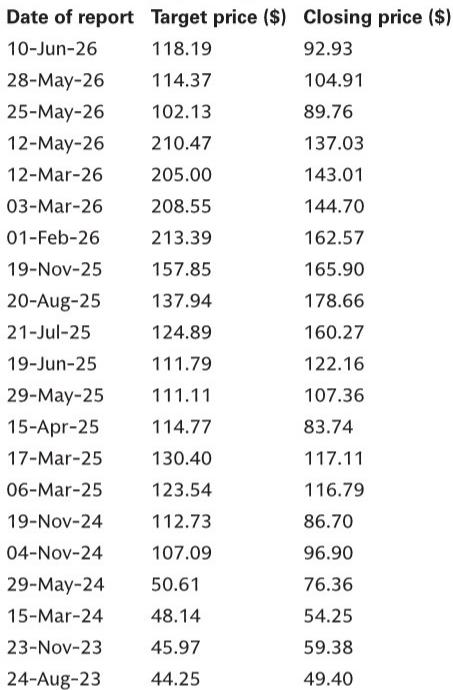

# China Brokers Are No Longer a Cyclical Play — They Are Becoming a Structural ROE Story

The case for owning Chinese brokers over banks has shifted from cyclical timing to structural conviction. Since early June, broker shares have outperformed bank stocks by a meaningful margin — A-share brokers rising 7% versus 1% for banks, and H-share brokers gaining 5% versus 3%. This is not merely a beta-driven rally in a risk-on environment. It reflects a fundamental reordering of how investors should evaluate the two sectors. As loan growth decelerates across China's banking system, earnings momentum is no longer the primary driver of bank valuations. The market has pivoted to assessing balance sheet resilience and capital adequacy. In that context, banks become defensive instruments at best. Brokers, by contrast, now offer something banks cannot: a credible pathway to structurally higher returns on equity, driven not by episodic market rallies but by deliberate capital deployment into higher-return international businesses.

The argument is not that China's capital markets are about to boom indefinitely. It is that the business model of leading Chinese brokers is evolving in a way that makes their earnings power less dependent on domestic trading volumes and more anchored to offshore operations where leverage, returns, and growth trajectories are fundamentally different. This is a sector rotation argument with a strategic thesis behind it. The question for investors is whether the market has fully priced in this transformation, or whether the re-rating has only just begun.

## The Hong Kong Business Is Reshaping the ROE Trajectory of Chinese Brokers in a Way Domestic Operations Cannot

The most important single data point in the sector today is the leverage differential between onshore and offshore operations. For the three largest brokers under coverage, the average leverage of their offshore subsidiaries stands at approximately 11 times, compared to a group average of roughly 6 times. This is not a statistical artifact. It is the direct result of a deliberate strategic pivot. Management teams across these firms have explicitly stated that scaling international businesses — particularly in Hong Kong — is the primary mechanism for improving consolidated returns. CICC, for example, has raised its medium-term ROE target to 13-15 percent, and management has openly attributed this ambition to capital deployment into Hong Kong.

The leverage gap matters because it translates directly into a return gap. Offshore subsidiaries of these brokers are generating an average ROE of around 16 percent, compared to a group average of approximately 9 percent. CITICS' offshore arm, for instance, delivers 22 percent ROE against a group-level 10 percent. This is not a marginal difference. It is a structural advantage that, as the offshore business grows as a share of total equity, will mechanically lift the consolidated ROE of these firms over time. The mechanism is straightforward: raise capital at the group level, deploy it into higher-leverage, higher-return offshore operations, and watch the blended return improve. CITICS' recent RMB 16 billion refinancing is a case in point. The transaction will reduce its international subsidiary's leverage from 16.6 times to 10.6 times, creating substantial headroom for further balance sheet expansion. The capital is not being raised to sit idle. It is being raised to fund growth in a business that already earns double the return of the domestic franchise.

This is not a story about a single good quarter or a hot IPO cycle. It is about a multi-year transformation in how Chinese brokers allocate capital. The implication is clear: investors who continue to value these firms based on domestic brokerage commission trends are missing the most important driver of future returns.

## The IPO Cycle Is a Powerful Near-Term Tailwind, but It Is the Structural Pipeline That Matters More

The Hong Kong IPO market has experienced a notable resurgence. Issuance volumes have picked up sharply, and post-listing performance has been strong, with newly listed companies since 2025 generating average first-month returns of approximately 40 percent, albeit with significant dispersion. Leading brokers report a current pipeline of over 180 IPO deals. This is not a trivial number. It indicates depth and sustainability beyond a single quarter of favorable conditions.

But the temptation here is to treat the IPO cycle as a cyclical trade — buy brokers when issuance is hot, sell when it cools. That would be a mistake. The more important observation is that a sustained IPO pipeline creates a multi-year revenue stream from underwriting, advisory, and trading that is less correlated with daily trading volumes in the A-share market. It also deepens the relationship between brokers and the companies they bring to market, creating follow-on business in M&A, debt financing, and shareholder services. The Hong Kong IPO cycle is not just a fee event. It is a franchise-building mechanism.

Strategists expect the IPO market to normalize toward historical averages by 2026. That normalization is already anticipated in the data. The question is not whether IPO volumes will remain at peak levels forever. It is whether the structural shift toward international business will persist even as the cycle matures. The evidence suggests it will. The offshore leverage and ROE advantages are not dependent on a hot IPO market. They are embedded in the business model itself.

## AI-Driven Trading Activity Is a Real Catalyst, but It Must Be Distinguished from Episodic Investment Gains

Elevated market interest in AI and related industries has contributed to strong trading activity. Sector-wide average daily trading volume is forecast to increase meaningfully. Brokers benefit through higher brokerage commissions, increased derivatives activity, and stronger demand for capital markets services. Management teams have indicated that as long as compelling investment themes persist — and AI appears to have staying power — trading volumes are unlikely to see a material decline, particularly in a supportive interest rate environment.

This is a genuine positive. But it must be placed in proper context. The more volatile component of broker earnings comes from principal investments — including participation in IPOs and STAR Board positions. Historical data shows that investment income growth for covered brokers has ranged from a peak of 265 percent year-on-year to a trough of negative 72 percent over the 2020-2023 period. During the same period, the forward price-to-earnings multiple for H-share brokers declined from 12 times to 7 times. The correlation is not accidental. Episodic investment gains boost reported earnings but introduce volatility that the market penalizes. They do not drive valuation multiples higher.

The market is sophisticated enough to distinguish between earnings that come from sustainable business operations and earnings that come from volatile principal investments. The structural ROE improvement story — driven by leverage expansion and capital deployment into international businesses — is what will drive multiple expansion over time. AI-driven trading activity is a welcome tailwind, but it is not the thesis.

## What the Report Does Not Fully Answer: The Sustainability of Offshore Leverage and the Risk of Regulatory Convergence

The report makes a compelling case that offshore operations offer structurally higher returns. But it leaves an important question partially unanswered: how sustainable is the leverage differential between onshore and offshore operations? The onshore regulatory environment in China has historically constrained broker leverage, and for good reason — systemic stability concerns. The offshore model in Hong Kong operates under a different regulatory framework. But as Chinese brokers grow their international footprints, will regulators in either jurisdiction begin to converge on capital requirements? If Hong Kong regulators impose tighter leverage constraints on Chinese-owned broker subsidiaries, or if onshore regulators permit higher domestic leverage, the gap that drives the ROE advantage could narrow.

This is not a near-term risk. The report's data shows that offshore leverage is currently 11 times versus 6 times onshore, and the gap is widening as firms raise capital for international expansion. But investors should monitor regulatory developments in both Hong Kong and mainland China. The structural ROE story depends on the persistence of this leverage differential. If it narrows, the investment case changes.

A second unresolved question is the impact of cross-border capital flow regulation on online brokers like FUTU. The report notes that regulatory developments related to cross-border capital flows and the normalization of mainland client activity introduce near-term uncertainty. This is an area where the full report likely contains more granular analysis. For institutional investors focused on traditional brokers, this may be a secondary concern. But for those considering the broader Chinese financial ecosystem, the regulatory trajectory for cross-border wealth management remains a critical variable.

## A Decision Framework for Investors: Distinguishing Between Cyclical Exposure and Structural Advantage

For investors evaluating Chinese brokers, the key analytical task is to distinguish between firms that benefit from the current cycle and firms that are building structural advantages that will persist beyond it. The report's preference for CICC-H and CITICS-A is based on the latter category. Both firms offer clear exposure to the Hong Kong IPO cycle, but more importantly, both have articulated credible strategies for expanding their international businesses and improving consolidated ROE through capital reallocation.

CICC stands out for its leading position in the Hong Kong IPO market and the significant contribution of international operations to both revenue and profit — over 40 percent, the highest among Chinese brokers. The firm has a well-articulated strategy to drive ROE expansion through capital reallocation and potential M&A. CITICS, meanwhile, is actively raising capital to expand its international footprint, with a clear plan to increase the contribution of offshore business to overall equity and earnings while creating additional headroom for leverage optimization.

The decision framework for investors should be built around three questions. First, what proportion of the firm's earnings comes from international operations, and is that proportion growing? Second, does the firm have a credible capital-raising plan to fund offshore expansion? Third, is management compensation and incentive structure aligned with ROE improvement rather than episodic investment gains? Firms that score well on all three questions are likely to deliver structural re-rating. Firms that rely primarily on domestic trading volumes and principal investments will remain cyclical and volatile.

This framework also helps explain the report's neutral stance on FUTU. The online broker benefits from retail participation and AUM growth, but regulatory uncertainty around cross-border capital flows creates a risk that is difficult to model. The long-term wealth management opportunity in China is real, but near-term headwinds limit the risk-reward relative to traditional brokers with stronger institutional franchises.

## Join the Community to Read the Full Report and Review the Original Charts

The structural case for Chinese brokers over banks is grounded in data that is best understood visually. The leverage and ROE differentials between offshore and onshore operations, the trajectory of IPO issuance and post-listing returns, and the volatility of principal investment income relative to sustainable earnings — all of these are captured in the original charts that accompany the full report. For investors who want to test the thesis against the underlying numbers, the full report provides the necessary detail. Join the community to read the full report and review the original charts.

*This article is for learning and discussion only and does not constitute investment advice.*

Personal reading notes and learning share only. Not investment advice.

