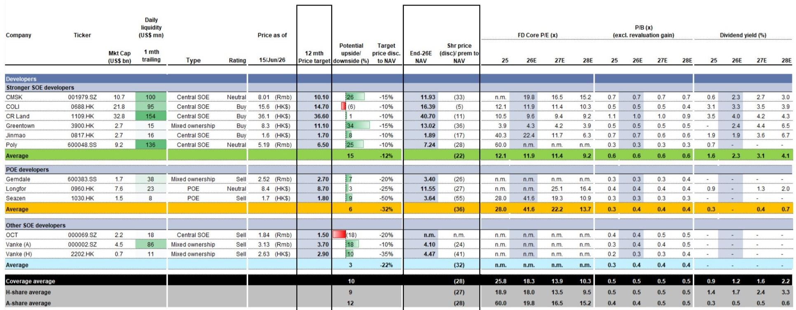
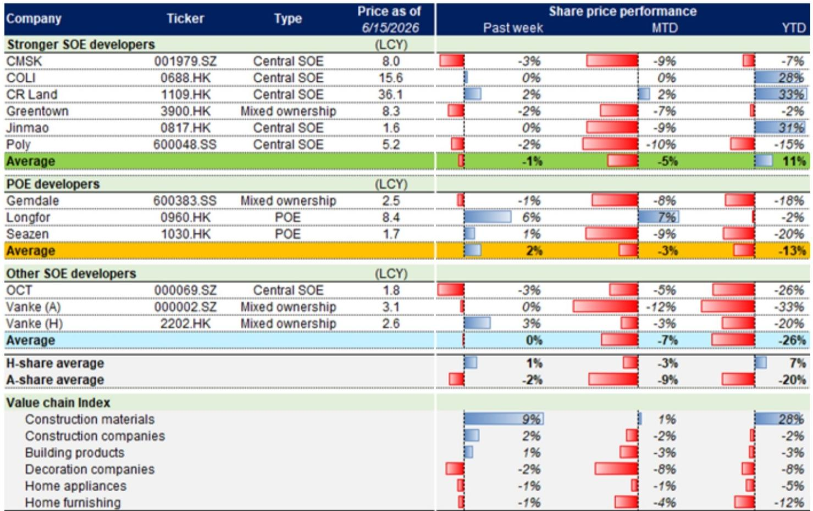
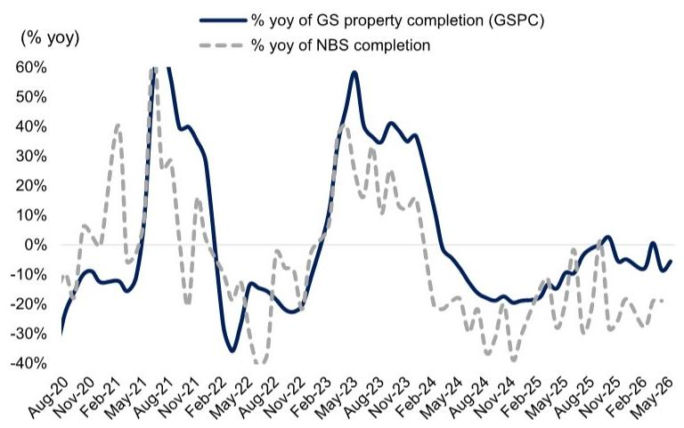

# China's Property Market Has Reached a Tactical Plateau, but the Real Test Lies in Policy Execution Velocity

The narrative of China's property market has shifted from crisis to stabilization, but the data from Week 24 reveals a market that is neither recovering nor declining—it is holding its breath. Transaction volumes in both primary and secondary markets have plateaued, with year-over-year figures flattening at levels that are neither alarming nor encouraging. New home sales were flat year-over-year, secondary transactions were also flat, and agent sentiment edged lower even as home-seller price expectations remained stable. This is the geometry of a market in equilibrium, but it is an equilibrium built on policy support, not organic demand.

The most important signal this week is not the transaction data itself, but the granular details emerging from central ministries on urban renewal funding. The National Development and Reform Commission has allocated RMB 97 billion in central budgetary investment for renovating old urban communities and dilapidated housing, benefiting roughly 8 million households. An additional RMB 160 billion in ultra-long-term treasury bonds—up RMB 25 billion year-over-year—has been earmarked for underground pipeline upgrades. The Ministry of Finance has reaffirmed its commitment to subsidy programs across key cities, with 15 new cities selected for 2026, bringing the cumulative total to approximately 50 key cities. These numbers are not trivial, and they represent a deliberate strategy to use infrastructure and urban renewal as a buffer against the broader economic slowdown.

Why does this matter now? Because the property market is no longer a standalone story. It is becoming a transmission mechanism for fiscal policy. The question for investors is no longer simply whether home prices will rise or fall, but how effectively the state can convert these funding commitments into actual construction, demand creation, and price stabilization. The market is currently pricing in a modest recovery, but the data suggests that execution velocity—the speed at which policy becomes reality—will determine whether this plateau becomes a launchpad or a ceiling.

## The Urban Renewal Funding Framework Is a Multi-Layered Test of Fiscal Coordination

The funding details released this week are not just numbers; they are a blueprint for how the Chinese government intends to manage the property transition without triggering a hard landing. The RMB 97 billion for old community renovations and the RMB 160 billion for underground pipelines are targeted at the physical infrastructure that supports housing demand. But the more significant development is the Ministry of Finance's commitment to multi-pronged financing tool kits, including direct fiscal subsidies, local government special bonds, and tax incentives.

The strategic insight here is that the government is deliberately avoiding a broad-based stimulus. Instead, it is channeling capital into specific, measurable projects that have a direct impact on housing quality and urban livability. This is a supply-side intervention that aims to create demand by improving the product. However, the risk is that these funds are disbursed slowly, or that local governments lack the administrative capacity to execute at scale. The report notes that front-loaded implementation is key to buffering economic downside risks. Investors should watch the pace of fund disbursement over the next two quarters as a leading indicator of whether this strategy will work.

## Transaction Volumes Are Flat, but the Composition Reveals a Two-Tier Market Divergence

The headline data shows primary GFA sold was flat year-over-year and secondary transactions were up only 1% year-over-year. But beneath the surface, the composition tells a more nuanced story. Year-to-date, primary GFA sold is down 13% year-over-year, while secondary GFA sold is up 1% year-over-year. Compared to 2024 levels, primary is down 11% while secondary is up 22%. Compared to 2023 levels, primary is down a staggering 43% while secondary is up 8%.

This divergence is not a statistical artifact. It reflects a structural shift in buyer preference away from new builds and toward existing homes. Secondary markets offer immediate occupancy, lower price uncertainty, and often better locations. The implication is that developers of new projects are facing a demand problem that is not purely cyclical. Even if policy support improves, buyers may continue to favor the secondary market unless new projects offer compelling value or superior quality. The inventory months remain elevated at 27.8, suggesting that the primary market still has a significant overhang to work through.

## Completion Data Signals That Supply Discipline Is Finally Taking Hold, but at a Cost

The GS Property Completion tracker indicates a high-teens percentage year-over-year decline in completions for May 2026, following a 19% year-over-year decline in April by NBS data. For the full fiscal year 2026, completions are expected to decline 1% year-over-year. This is a dramatic slowdown from previous years and suggests that developers are finally exercising supply discipline.

The strategic implication is twofold. First, lower completions mean less new inventory entering the market, which should gradually help rebalance supply and demand. Second, it signals that the development pipeline is contracting, which will have downstream effects on construction, materials, and employment. The glass supply-demand model used to derive these completion estimates is a clever proxy, but it also raises an open question: if completions are falling faster than demand, at what point does the market shift from oversupply to undersupply in specific segments? The report does not answer this, but it is a critical question for long-term investors.

## Valuations Are at Historical Troughs, but the Discount Reflects Structural Uncertainty, Not Just Cyclical Fear

The valuation data is striking. Offshore coverage developers trade at an average 27% discount to end-2026E NAV and at 0.5X 2026E P/B. Onshore coverage developers trade at a 28% discount to NAV and 0.4X 2026E P/B. Compared to historical troughs in 2008, 2011, and 2014, current P/B multiples are significantly lower. During the 2008 trough, offshore developers traded at 0.7X P/B; today they trade at 0.5X. Onshore developers traded at 1.6X P/B in 2008; today they trade at 0.4X.

This compression suggests that the market is pricing in not just a cyclical downturn but a structural reassessment of the business model. Developers are no longer seen as growth companies; they are being valued as liquidation or cash-flow generation vehicles. The question that the report does not fully answer is whether this discount is justified by the earnings trajectory, or whether it represents an opportunity for investors who believe the policy framework will eventually restore profitability. The answer depends on whether urban renewal funding can translate into developer revenue and margin recovery, which remains uncertain.

## The Report Leaves Unanswered How Urban Renewal Funding Will Flow to Private Developers

One of the most significant gaps in the current analysis is the distribution mechanism for urban renewal funding. The report details allocations from NDRC and MOF, but it does not clarify how these funds will reach developers, particularly private developers who have been most affected by the credit crunch. The funding appears to be channeled through local governments and state-owned enterprises, which raises concerns about whether private developers will have meaningful access to this capital.

If the funding remains concentrated in the state-owned sector, the recovery will be uneven, and the valuation discount for private developers may persist or widen. Conversely, if the government finds a way to include private developers in the execution of urban renewal projects, it could provide a lifeline that restores confidence in the broader sector. This is the single most important variable that the current data does not illuminate, and it is the reason why investors should remain cautious about extrapolating the current plateau into a recovery.

## A Decision Framework for Investors: Three Questions to Determine Positioning

Given the complexity of the current environment, investors need a structured approach to evaluating property exposure. The following framework is derived from the report's logic but extends it into actionable decision points.

First, assess policy execution velocity. Track the pace of urban renewal fund disbursement over the next two quarters. If disbursement accelerates, it will likely support completions, stabilize employment in construction, and gradually improve demand. If disbursement remains slow, the plateau could become a decline.

Second, evaluate tier-one versus tier-two city exposure. The report's inventory data shows that tier-one cities have lower inventory months and more stable demand. Investors should favor developers with concentrated exposure to tier-one and strong tier-two cities, as these markets are more likely to benefit from urban renewal funding and have shorter recovery timelines.

Third, distinguish between state-owned and private developers. The valuation discount for private developers is extreme, but it may be justified if they are excluded from policy benefits. Investors should look for evidence that private developers are being included in urban renewal contracts or that their access to credit is improving. Without such evidence, the risk-reward remains unfavorable for private names despite the low valuations.

Join the community to read the full report and review the original charts.

*This article is for learning and discussion only and does not constitute investment advice.*

Personal reading notes and learning share only. Not investment advice.

