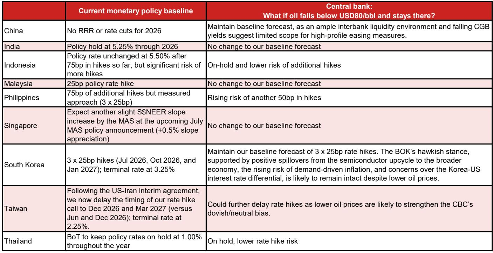
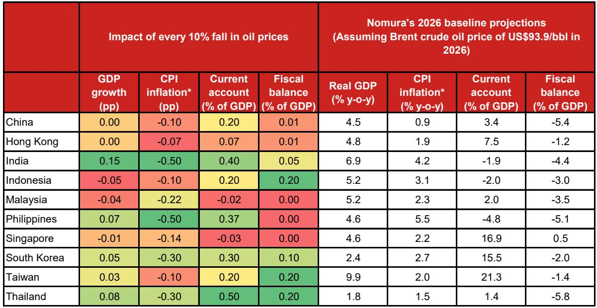
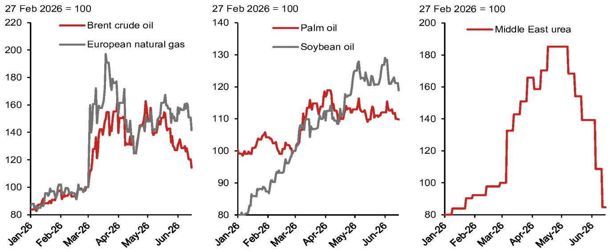

# NOM：油价暴跌不是短期交易，而是亚洲资产重新定价的起点

市场正在用交易员的思维理解美伊和平协议——油价跌了，能源进口国受益，这没错。但这份NOM研报真正值得关注的判断是：油价下行对亚洲的影响远不止于通胀和经常账户的数字改善，它正在改变三个更根本的结构——央行政策路径的重新校准、AI资本开支与能源成本下降的叠加效应、以及区域内国家之间“受益程度”的显著分化。

如果只看油价从100美元以上跌到83美元以下这个结果，你可能会认为这是一个短期交易机会。但NOM的分析框架告诉我们，当油价在80美元附近企稳，2026年全年均价将从基准假设的93.9美元降至85.4美元，下半年油价将比当前假设低约15%。这意味着的，不是一个月的数据波动，而是一个季度的宏观假设重置。

更关键的是，这份报告在“大家都受益”的叙事下埋了一条暗线：受益的程度、方式、时间差，才是决定投资回报的核心变量。泰国、菲律宾、印度、韩国被列为最大赢家，但背后的逻辑完全不同——有的是进口账单下降，有的是通胀快速回落，有的是经常账户顺差扩大，还有一个可能享受“双重红利”。这些差异，才是资产定价的关键。

---

## 1. 油价每跌10%，亚洲的宏观画面就换一次底色，但效果不是同步的

NOM用一组清晰的弹性系数告诉我们油价对亚洲经济的传导路径。每10%的油价下跌，平均提升亚洲经常账户约0.3%的GDP，压低通胀0.2-0.3个百分点，同时对增长和财政也有边际正向贡献。

但这些数字的平均值掩盖了最重要的信息：国别差异。泰国每10%油价下跌对经常账户的改善是0.5个百分点，是所有亚洲经济体中最大的；印度是0.4个百分点，韩国是0.3个百分点。而在通胀端，印度和菲律宾的弹性最大，每10%油价下跌可压低通胀0.5个百分点。

这意味着什么？当油价从100美元跌到83美元，降幅约17%，泰国的经常账户改善幅度可能接近0.85个百分点的GDP，印度的通胀压力可能下降近0.85个百分点。这不是边际变化，而是足以改变宏观叙事的幅度。

但NOM同时提醒了一个容易被忽视的滞后效应：供应链正常化是渐进的。霍尔木兹海峡的重新开放需要清理水雷、疏散滞留船只、重启停产油井，保险成本在初期仍会高企，航运信心的恢复需要时间。因此，通胀改善的传导需要2-3个月才能完全体现。这是一个时间差交易机会——市场可能先定价通胀回落，但实际数据改善要等到三季度。

---

## 2. 四个最大赢家的受益逻辑完全不同，这决定了它们资产定价的驱动因素

NOM将泰国、菲律宾、印度和韩国列为油价下行的最大受益者，但细看每个国家的传导机制，你会发现它们对应的资产逻辑截然不同。

泰国是亚洲最大的净石油进口国（相对GDP），能源占CPI篮子高达11.8%。油价的直接效果是进口账单下降和成本推动型通胀缓解。这对泰国的意义在于，经常账户从1.4%的GDP占比开始改善，空间巨大。但NOM也明确指出，泰国的结构性约束——人口老龄化、生产率挑战、中国冲击——并未改变。因此，油价对泰国资产的影响更像是“减压”，而非“转型”。

菲律宾的情况不同。由于没有燃料补贴，国际油价直接传导至消费者价格，4月通胀已飙升至7.2%。油价下跌在菲律宾的效果是“立竿见影”的通胀回落，这将减轻央行的加息压力。但这份报告也埋了一个伏笔：2026年是厄尔尼诺年，食品通胀的中期风险仍在。菲律宾的通胀叙事可能经历“先降后稳”的节奏。

印度是NOM认为可能享受“双重红利”的经济体。除了油价下降带来的进口成本降低、经常账户赤字收窄、通胀回落和财政补贴负担减轻之外，印度最近宣布的FCNR(B)措施预计将带来约550亿美元的流入，进一步提振国际收支盈余。这意味着印度可能同时获得“能源红利”和“资本流入红利”，两者叠加的效果可能远超单独计算。

韩国的逻辑则更多地与AI相关。油价下降叠加AI繁荣带来的半导体出口增长，韩国的经常账户顺差可能从NOM当前估计的15.5%的GDP占比（已经是历史高位）进一步扩大。韩国的受益更多是“锦上添花”，而非“雪中送炭”。

这些差异意味着，投资者不能用“油价下跌利好亚洲”这个笼统判断来做资产配置。泰国的受益更多体现在经常账户和汇率，菲律宾在通胀和政策路径，印度在双顺差，韩国在出口竞争力。每个国家的资产定价驱动因素不同，对应的交易策略也应不同。

---

## 3. 央行政策路径的分化比油价本身更重要——有些央行反而会继续加息

这份研报最反直觉的洞察之一，是油价下跌并没有让所有亚洲央行转向鸽派。NOM清晰地展示了央行政策路径的“高度分化”。

在“按兵不动”的阵营中，印尼央行、印度央行、澳大利亚央行、泰国央行和中国央行预计维持利率不变。但这里有一个值得深挖的细节：印尼央行维持利率的前提是印尼盾的稳定。如果油价下跌导致资本流入，印尼盾走强，那么印尼央行维持利率的空间会更大。但如果油价下跌引发全球风险偏好变化，资金流出新兴市场，印尼央行反而可能面临加息压力。

在“推迟加息”的阵营中，台湾央行是唯一一个被调整预测的。NOM将台湾央行的首次加息从6月推迟到12月，并预计12月和明年3月各加息12.5个基点，终端利率为2.25%。这背后的逻辑是，油价下行缓解了通胀压力，让央行有更多空间维持宽松立场。但这也意味着，台湾的利率正常化进程将比市场预期更慢。

最值得关注的是“继续加息”的阵营。菲律宾央行、马来西亚央行、新加坡金管局、韩国央行和新西兰央行都预计将继续收紧政策。菲律宾央行预计累计加息75个基点（包括本周的25个基点），核心通胀仍然高企。韩国央行预计在7月、10月和明年1月各加息25个基点，终端利率达到3.25%。

为什么油价下跌没有让这些央行转向？NOM的解释是，这些经济体的通胀压力更多来自国内需求驱动，而非能源价格。韩国的半导体上行周期正在带动整体经济，需求驱动的通胀压力正在上升，同时韩国需要缩小与美国的利差。马来西亚的增长强劲、劳动力市场紧张。新加坡面临核心通胀压力上升和广泛增长。

这意味着，油价下跌对不同经济体的货币政策含义完全不同。对于菲律宾这样的国家，油价下跌是“救命稻草”，可以缓解通胀压力；对于韩国这样的国家，油价下跌只是“锦上添花”，不会改变央行的加息路径。投资者需要区分哪些经济体的政策路径会被油价改变，哪些不会。

---

## 4. 报告尚未完全回答的关键问题：供应链正常化的时间差如何影响资产定价节奏

NOM在报告中明确指出，供应链正常化将是“渐进的”——清理水雷、重启油井、恢复航运信心都需要时间。但这份报告没有完全展开的一个关键问题是：这个时间差对资产定价意味着什么？

如果油价已经跌至83美元以下，但通胀数据的改善需要2-3个月才能体现，那么市场可能会经历一个“预期领先于现实”的阶段。债券市场可能提前定价通胀回落，导致收益率曲线陡化；汇率市场可能提前定价经常账户改善，导致货币升值；股票市场可能提前定价增长改善，导致周期性板块上涨。

但NOM没有告诉我们的是，这个时间差是否会导致“过度定价”后的回调。如果供应链正常化比预期更慢，或者如果和平协议破裂（NOM明确表示协议仍然脆弱），那么当前资产价格中已经计入的油价利好可能需要重新定价。

另一个未完全展开的问题是：油价下跌对亚洲科技供应链的间接影响。报告提到了AI繁荣与能源成本下降的叠加效应，但没有详细分析能源成本下降对半导体制造、数据中心运营等行业的成本影响。在AI资本开支激增的背景下，能源成本的下降可能显著改善科技公司的利润率，但这个传导链条的量化分析在报告中着墨不多。

---

## 5. 一个更值得关注的观察框架：区分“结构性受益”和“周期性受益”

基于NOM的逻辑，我们可以提炼出一个更实用的分析框架：将亚洲经济体分为“结构性受益者”和“周期性受益者”。

结构性受益者的特征是，油价下跌不仅改善短期数据，还改变了中长期的经济韧性。印度是最典型的例子——油价下跌降低进口成本、改善经常账户、减轻财政补贴负担，同时FCNR(B)措施带来资本流入，这种“双重红利”具有持续性。韩国的半导体出口与能源成本下降的叠加效应也具有结构性特征，因为AI需求是结构性趋势。

周期性受益者的特征是，油价下跌带来短期改善，但无法解决结构性约束。泰国是最典型的例子——经常账户改善是真实的，但人口老龄化和生产率挑战并未改变。菲律宾的通胀回落是短期的，厄尔尼诺年的食品通胀风险仍然存在。

这个框架的实用价值在于，它可以帮助投资者判断哪些国家的资产定价变化是可持续的，哪些可能只是交易性机会。结构性受益者的资产可能获得更持久的重定价，而周期性受益者的资产可能需要在数据兑现后重新评估。

---

## 6. 外汇和利率策略中隐藏的“相对价值”机会

NOM在外汇策略中做出了一些值得关注的调整。他们启动了新的美元/韩元空头头寸（信心水平1/5），重新启动了欧元/印度卢比多头头寸（信心从2/5提升至3/5），并降低了对新加坡元/印尼卢比多头的信心（从4/5降至3/5）。同时维持美元/离岸人民币空头（4/5）和美元/新台币空头（3/5）。

这些调整背后反映了一个核心逻辑：在油价下跌的背景下，NOM更倾向于做多那些受益于能源成本下降、同时有国内因素支撑的货币（韩元、印度卢比），而对那些有政策不确定性或结构性问题的货币（印尼卢比）保持谨慎。

在利率策略中，NOM建议在韩国进行2年远期5年利率接收操作（信心3/5，从4/5下调），在印度推荐9月2s5s NDOIS flatteners。这表明，即使在油价下跌的背景下，NOM对亚洲利率市场的判断仍然是高度分化的——韩国利率可能下行，印度利率曲线可能平坦化。

这些策略建议的核心启发是：油价下跌创造的不是一个“买入所有亚洲资产”的窗口，而是一个“精挑细选、做多相对价值”的窗口。投资者需要区分哪些货币和利率产品真正受益于油价下跌，哪些只是被市场情绪带动。

---

这份NOM报告提供了清晰的宏观框架，但正如所有优秀的研究报告一样，它留下的问题比回答的问题更有价值。供应链正常化的时间差如何影响资产定价节奏？和平协议的脆弱性如何被市场定价？AI资本开支与能源成本下降的叠加效应如何量化？厄尔尼诺年对食品通胀的影响是否会抵消油价下跌的利好？

这些问题，正是我们将在知识星球微信群里深入讨论的内容。如果你对亚洲资产重新定价的逻辑感兴趣，欢迎来星球微信群里继续探讨——我们不仅会分享完整报告的原始图表和数据，还会基于这些未解问题推演后续的市场情景。

Personal reading notes and learning share only. Not investment advice.

