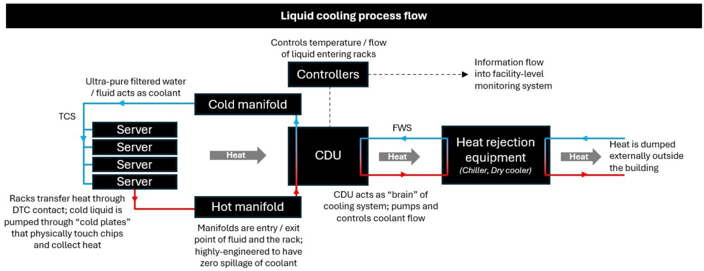
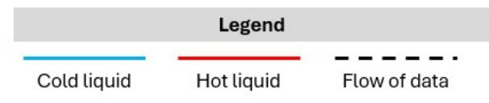
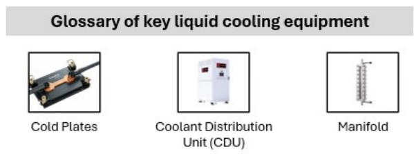
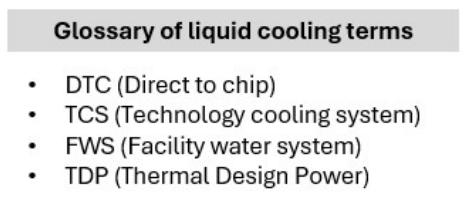
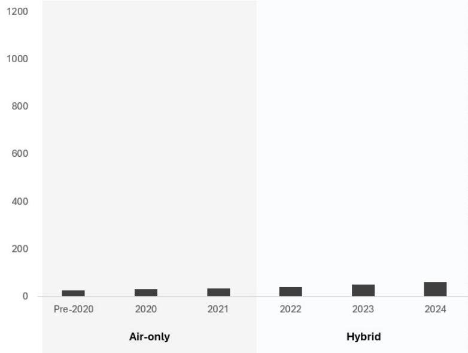
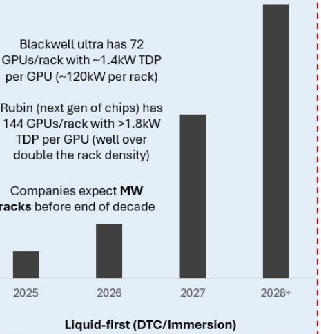
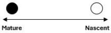
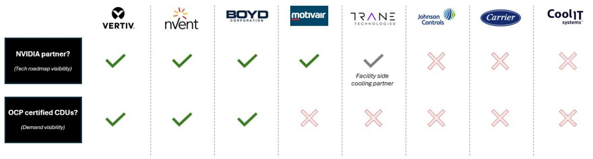

# U.S. Multi Industry & Electrical Equipment

# Liquid Cooling Primer: Coolant Distribution Units (CDUs)


Varun Govindaraj

+1 917 344 8543

varun.govindaraj@bernsteinsg.com


Chad Dillard

+1 917 344 8469

chad.dillard@bernsteinsg.com


Alasdair Leslie

+44 20 7762 4952

alasdair.leslie@bernsteinsg.com


Madison Rezaei

+1 917 344 8622

madison.rezaei@bernsteinsg.com

## Specialist Sales


Steve Song

+1 917 344 8401

steve.song@bernsteinsg.com

As rack thermal densities in data centers continue to increase, air is no longer powerful enough to handle cooling requirements. And so liquid cooling, once a fridge modality relegated to only the highest-performance computing use cases, increasingly finds itself in the mainstream. At the core of liquid cooling, two components drive the narrative (CDUs and Cold Plates). In this note, we offer perspectives on CDUs, why they are critical, how to evaluate them, key players in the market and their offerings, and a longer term view on what the future for the equipment could look like when the market eventually cools down (pun intended).

We think CDUs are a great business to be in; the equipment is complex enough to not be entirely commoditized and has a material service attach. They are mission-critical; if a CDU fails you are looking at multiple racks burning out (which is a huge issue today when rack values continue to increase). This also creates a technical moat where customers will want reliable service; they are unlikely to go to the lowest cost provider in the market because the cost of failure far outweighs the near-term savings a cheaper service contract can deliver.

While we have not opined on the market size of CDUs, there is clearly debate on both size and growth rates. We are comfortable with an LSD \$B market size for 2026, growing double digits (mid-teens+) over the next 5 years to get to MSD-HSD \$B by 2030. We have developed a proprietary liquid cooling model for this to be modeled; but market size is highly sensitive to GW added, cost per kW of cooling and CDU useful life (all of which are seeing debates). Reach out to the authors or your Bernstein sales contact if you'd like a walkthrough of how to use it.

Looking at the actual CDUs launched in the market today, there are many players, but not everyone is innovating or has a large scale unit. Players in the NVIDIA liquid cooling ecosystem (Vertiv, nVent, Boyd, Motivair) all have great products. Trane Technologies punches above its weight. Carrier and JCI have CDUs but given they are more focused on chillers, we found their CDU breadth, specifications, and level of detail provided to not be at the same level as the other names in this list. CoolIt seems to be more of a cold plate name; their approach temperature lags competitors.

As we think about the next five years, we believe that technology roadmap visibility (which comes from being a partner of NVIDIA since they really set the direction of change) and participation in the Open Compute Project (OCP) create a right to win (because it deepens hyperscaler relationships and creates a pathway for long-term demand generation); and not many companies can say they have both.

Lastly, we think the shift to two-phase DTC cooling (from single-phase) should be closely watched. Only Vertiv and Accelsius (from the companies we have mentioned in this note) have actually announced products / published detailed perspectives. While we're still at least a year out from commercially scaled offerings (if not more), and most other companies serious about liquid cooling are likely working on a product, the step-change in engineering from this shift has the potential to disrupt the market and position occupied by key players.

BERNSTEIN TICKER TABLE

<table><tr><td rowspan="2">Ticker</td><td rowspan="2">Rating</td><td colspan="3">12 Jun 2026</td><td rowspan="2">TTMRel.</td><td colspan="4">Adjusted EPS</td><td colspan="3">Adjusted P/E (x)</td></tr><tr><td>Cur</td><td>Closing Price</td><td>Price Target</td><td>Cur</td><td>2025A</td><td>2026E</td><td>2027E</td><td>2025A</td><td>2026E</td><td>2027E</td></tr><tr><td>VRT (Vertiv)</td><td>O</td><td>USD</td><td>302.87</td><td>416.00</td><td>141.6%</td><td>USD</td><td>4.20</td><td>6.52</td><td>9.21</td><td>72.2</td><td>46.4</td><td>32.9</td></tr><tr><td>NVT (nVent)</td><td>O</td><td>USD</td><td>165.84</td><td>218.00</td><td>114.8%</td><td>USD</td><td>3.34</td><td>4.79</td><td>6.19</td><td>49.6</td><td>34.6</td><td>26.8</td></tr><tr><td>CARR (Carrier)</td><td>M</td><td>USD</td><td>69.91</td><td>75.00</td><td>(26.5)%</td><td>USD</td><td>2.57</td><td>2.81</td><td>3.20</td><td>27.2</td><td>24.9</td><td>21.9</td></tr><tr><td>TT (Trane)</td><td>O</td><td>USD</td><td>458.25</td><td>550.00</td><td>(14.9)%</td><td>USD</td><td>13.06</td><td>14.96</td><td>17.61</td><td>35.1</td><td>30.6</td><td>26.0</td></tr><tr><td>JCI (Johnson Controls)</td><td>O</td><td>USD</td><td>144.96</td><td>176.00</td><td>17.0%</td><td>USD</td><td>3.78</td><td>5.06</td><td>6.04</td><td>38.4</td><td>28.6</td><td>24.0</td></tr><tr><td>SU.FP (Schneider)</td><td>O</td><td>EUR</td><td>265.30</td><td>310.00</td><td>3.8%</td><td>EUR</td><td>8.43</td><td>10.22</td><td>11.95</td><td>31.5</td><td>26.0</td><td>22.2</td></tr><tr><td>ETN (Eaton)</td><td>O</td><td>USD</td><td>391.39</td><td>534.00</td><td>(4.4)%</td><td>USD</td><td>12.07</td><td>13.29</td><td>16.32</td><td>32.4</td><td>29.4</td><td>24.0</td></tr><tr><td>SPX</td><td></td><td></td><td>7,431.46</td><td></td><td></td><td></td><td></td><td></td><td></td><td></td><td></td><td></td></tr><tr><td>EDME</td><td></td><td></td><td>1,570.59</td><td></td><td></td><td></td><td></td><td></td><td></td><td></td><td></td><td></td></tr></table>

O - Outperform, M - Market-Perform, U - Underperform, NR - Not Rated, CS - Coverage Suspended  
Source: Bloomberg, Bernstein estimates and analysis.

## INVESTMENT IMPLICATIONS

We rate VRT Outperform with a target price of \$416.

We rate NVT Outperform with a target price of \$218.

We rate CARR Market-Perform with a target price of \$75.

We rate TT Outperform with a target price of \$550.

We rate JCI Outperform with a target price of \$176.

We rate Schneider Outperform with a target price of €310.

We rate Eaton Outperform with a target price of \$534.

## DETAILS

EXHIBIT 1: CDU Outlook Summary

## CDUs | We think CDUs are here to stay; some commoditization risk (but less than cold plates)

<table><tr><td>Timeframe</td><td>Near-term(2026–2028)</td><td>Mid-term(2028–2030)</td><td>Long-term(2030+)</td></tr><tr><td>Risk ofCommoditization</td><td>Low</td><td>Moderate</td><td>Moderate</td></tr><tr><td>Risk ofObsolescence</td><td>Low</td><td>Low</td><td>Low</td></tr><tr><td>Commentary</td><td>Near-term, we expectCDUs to be a growth driverfor anyone with exposure toliquid cooling from DCsWe expect the market tobe supply constrained;anyone with a CDU offeringwill probably see largebacklogs through 2028While there are somecommoditization risks fromprograms like OCP, ProjectDeschutes, etc. we believethe pace of productevolutionlargely supportsvendor pricing power</td><td>Regardless of whetherimmersion cooling or DTC isthe dominant configurationat this point, CDUs will stillbe required (so there is noobsolescence risk)We do expect the liquidcooling market to be muchmore mature at this pointand think there is largerpossibilitythat specs.become standardizedHowever, service quality /uptime will remainrelevant(especially if CDUsmove to the facility level vs.rack level), enabling CDUplayers todrive revenuefrom their install base vs.new equipment sales</td><td>Even in a config. with silicon etched microchannels,CDUs will remain relevant(and if anything, become more important asthe flow volume / pressure become critical to finely control)We think CDUs will be able to retain some pricingpower long-term even ifthey are fully specified by hyperscalersat this point –driven by a combination ofhigher complexity(esp. compared to cold plates)and theneed for serviceonce CDUs installedGiven the high value of racks, wedo not think theservice can be outsourced to third-party non-OEMs</td></tr></table>

Practically no obsolescence risk; we think CDUs are here to stay regardless of the dominant cooling config.

Some commoditization risk; hyperscalers will specify designs but CDUs are more complex (multiple connected pieces) than cold plates which preserves pricing power

In addition, CDUs need service (which cold plates do not) which also defends margin

We think CDUs are a great business to be in, ESPECIALLY for companies that can drive the innovation roadmap vs. just become contract mfg.

We see wide dispersion of forecasts for broader CDU market; but an LSD \$B market size today growing MSD/HSD \$B in the next 5 years does not seem too improbable

EXHIBIT 2: Comparison of Flagship Liquid-to-Liquid CDUs across OEMs

<table><tr><td>Company</td><td>Product</td><td>Configuration</td><td>TCS Flow rate1</td><td>Capacity1</td><td>Flow ratio</td><td>ATD2</td><td>Pressure Head</td><td>Modularity</td></tr><tr><td rowspan="4">VRT3</td><td>Coolchip 121</td><td>Rack</td><td>120 lpm</td><td>121 kW</td><td>1 lpm / kW</td><td>4°C</td><td>17 psi</td><td>No</td></tr><tr><td>Coolchip 1350</td><td>Row</td><td>1200 lpm</td><td>1.37 MW</td><td>0.9 lpm / kW</td><td>4°C</td><td>35 psi</td><td>No</td></tr><tr><td>Coolchip 2300</td><td>Row/Perimeter</td><td>3400 lpm</td><td>2.3 MW</td><td>1.5 lpm / kW</td><td>4°C</td><td>Expected &gt;50 psi</td><td>Cluster control</td></tr><tr><td>Deschutes 5.0</td><td>Row/Perimeter</td><td>1900 lpm</td><td>2 MW</td><td>0.9 lpm / kW</td><td>3°C</td><td>80 psi</td><td>N/A</td></tr><tr><td rowspan="4">NVT</td><td>Rackchiller 100</td><td>Rack</td><td>N/A</td><td>100 kW</td><td>N/A</td><td>4°C</td><td>N/A</td><td>No</td></tr><tr><td>Rackchiller 800</td><td>Row</td><td>690 lpm</td><td>575 kW</td><td>1.2 lpm / kW</td><td>4°C</td><td>~50 psi4</td><td>No</td></tr><tr><td>CZ and CX series</td><td>CZ (rack)/CX (row)</td><td colspan="5">To be released in 2H 2026; expected to be bleeding edge technology</td><td>Advertised</td></tr><tr><td>Deschutes 5.0</td><td>Row/Perimeter</td><td>1900 lpm</td><td>2MW</td><td>1.1 lpm / kW</td><td>3°C</td><td>80 psi</td><td>N/A</td></tr><tr><td rowspan="2">TT</td><td>CDU-1MW</td><td>Row</td><td>1500 lpm</td><td>1.35 MW</td><td>1.1 lpm / kW</td><td>4°C</td><td>40 psi</td><td>No</td></tr><tr><td>Giga-modular CDU</td><td>Row/Perimeter</td><td>3900 lpm</td><td>2.5 MW</td><td>&gt;1.5 lpm / kW</td><td>3°C</td><td>50 psi</td><td>Yes, up to 14MW</td></tr><tr><td>JCI</td><td>Silent-Aire</td><td>Row/Perimeter</td><td>1600 lpm</td><td>1.05 MW</td><td>1.5 lpm / kW</td><td>5.2°C</td><td>30 psi</td><td>10 MW (skid only)</td></tr><tr><td>CARR5</td><td>QL 65LL</td><td>Row/Perimeter</td><td>N/A</td><td>1.35 MW</td><td>N/A</td><td>2 - 4°C8</td><td>N/A</td><td>5 MW (skid only)</td></tr><tr><td rowspan="5">Boyd</td><td>RAL110-04U19</td><td>Rack</td><td>80 lpm</td><td>80 kW</td><td>1 lpm / kW</td><td>8°C</td><td>21 psi</td><td>No</td></tr><tr><td>RAL300-04U21</td><td>Rack</td><td>160 lpm</td><td>160 kW</td><td>1 lpm / kW</td><td>5°C</td><td>25 psi</td><td>No</td></tr><tr><td>ROL1100-48U32</td><td>Row</td><td>473 lpm</td><td>550 kW</td><td>1 lpm / kW</td><td>4°C</td><td>30 psi</td><td>No</td></tr><tr><td>ROL2300-48U40</td><td>Row</td><td>1514 lpm</td><td>1150 kW</td><td>1.3 lpm / kW</td><td>4°C</td><td>55 psi</td><td>No</td></tr><tr><td>ROL4000-48U65</td><td>Row/Perimeter</td><td>1893 lpm</td><td>2 MW</td><td>0.9 lpm / kW</td><td>3°C</td><td>80 psi</td><td>No</td></tr><tr><td rowspan="3">Motivair6</td><td>MCDU 45</td><td>Row</td><td>1166 lpm</td><td>853 kW</td><td>1.4 lpm / kW</td><td>4°C</td><td>29 psi</td><td>No</td></tr><tr><td>MCDU 55</td><td>Row</td><td>1632 lpm</td><td>728 kW</td><td>&gt;1.5 lpm / kW</td><td>4°C</td><td>51 psi</td><td>No</td></tr><tr><td>MCDU 70</td><td>Row/Perimeter</td><td>3751 lpm</td><td>2.5 MW</td><td>&gt;1.5 lpm / kW</td><td>4°C</td><td>38 psi</td><td>Yes, up to 10MW</td></tr><tr><td rowspan="3">CoolIT</td><td>CHx80</td><td>Rack</td><td>N/A</td><td>80 kW</td><td>N/A</td><td>N/A (expect MSD)</td><td>N/A</td><td>No</td></tr><tr><td>CHx200</td><td>Rack</td><td>N/A</td><td>200 kW</td><td>N/A</td><td>N/A (expect MSD)</td><td>N/A</td><td>No</td></tr><tr><td>CHx20007</td><td>Row/Perimeter</td><td>2125 lpm</td><td>2 MW</td><td>1.05 lpm / kW</td><td>5°C</td><td>35 psi</td><td>Cluster Control</td></tr></table>

Note: Liquid-to-liquid only; We have focused primarily on CDUs released around or after mid-2024; OEM specs are often intentionally complex; we have made our best attempt at representing data here; 1. Nominal; 2. Approach temp. differential; 3. Unclear if water / PG25; 4. Inferred from spec sheet at 690 lpm; 5. Unclear if water/PG25 rated; 6. Water rated (so actual numbers will be lower); 7. CoolIT published different specs for the same product; we have used PDP details; CHx1500 not shown as it does not have a distinct PDP; 8. $^{2}$ °C ATD available using a high-efficiency heat exchanger  
Source: Bernstein Analysis and Estimates, Company Reports

## INTRODUCTION

In the past, a continuous flow of cool air over servers was sufficient to cool data centers. With time, chips and racks have grown increasingly dense, to the point where even freezing cold air blowing at gale force speeds wouldn't do the job. Needless to say, finding an alternative cooling modality became critical. And so, liquid cooling technology, which long sat at the fringe of data center infrastructure, suddenly found itself thrust into the spotlight. Looking ahead, rack densities and chip TDPs seem set to keep growing, forcing liquid cooling solutions to evolve with more rigorous server demands.

## OVERVIEW OF LIQUID COOLING

Liquid cooling encompasses multiple different types of technology, with varying levels of efficiency and at distinct stages of maturity. At their core, they share one common principle; liquid flows over a surface (directly or indirectly) and uses principles of convection to extract heat. We describe five modalities of liquid cooling below:

1. Single-phase DTC: The predominant format of liquid cooling today. DTC stands for Direct-To-Chip. It involves cold plates (which are aptly named slabs of metal that have reduced temperature due to refrigerant that circulates inside them) coming into contact with racks / chips to extract heat. Coolant Distribution Units (CDUs) pump low temperature coolant (usually a water - propylene glycol mix) through the plates and recollect the spent liquid once they have extracted heat from the server. The heat is then extracted from the coolant (making it cold again) and the process repeats. It is called single phase because the coolant stays in a single phase (liquid) and does not change phases from to gas via evaporation. This loop (i.e., circulating from the CDU through cold plates in the server) is called the TCS or technology cooling system. Once spent coolant reaches the CDU, it passes through a heat exchanger where it transfers heat to another cooling loop called the FWS or Facility Water System. The FWS connects to a chiller or dry cooler to reject this heat outside a data center. However, as rack power densities continue to increase, single phase DTC is seemingly reaching the theoretical limit of how much heat it can extract.  
2. Two-phase DTC: The principles remain exactly the same as single phase DTC, but in this case the liquid coolant boils and evaporates when it comes in contact with the server after absorbing heat. Evaporation requires significant energy, so it enables the refrigerant to extract a lot of heat without having its own temperature rise too much. In most cases, the refrigerant is maintained as close to its boiling point as possible. Not yet mainstream, but a number of companies are experimenting at the lab scale and approaching commercial maturity (which is expected over the next couple of years). It is worth noting that capacities of CDUs that support two-phase liquid are limited; Accelsius for example has a relatively mature offering and their highest capacity CDU is well below 1MW (vs. 2MW+ for single phase cooling). Equipment (both CDUs and cold plates) need to be designed differently for two-phase; gas flowing through an ecosystem behaves much differently from liquid.  
3. Immersion cooling: Once a competitor to DTC, now largely relegated to niche applications. Does not need cold plates; the entire server is submerged in dielectric (i.e., non-conducting) fluid which extracts heat. Has both single phase and two-phase versions. Fell off due to convenience; cold plates can rapidly be replaced and servers can still be maintained with relative ease, in contrast, immersion cooling requires a large tank to be moved, and a wet server to be extracted and dried before any work can be done on it. R&D is still taking place, but hyperscaler roadmaps clearly lean towards DTC.  
4. Cold plate etched DTC: Micro-channels are etched into the surface of a cold plate to improve contact with the chip surface. Enables better heat transfer compared to traditional single phase or two-phase DTC but still very nascent tech.  
5. Silicon-etched DTC: Forgoes cold plates entirely and etches cooling channels on the surface of the chip itself. Very nascent, unlikely to see commercialization before the end of the decade, although key players like Microsoft and TSMC are making investments here.

The reason we have laid out these technologies is that it has implications on the outlook of equipment that make up the liquid cooling ecosystem. CDUs and cold plates are the most important to discuss. CDUs (Coolant Distribution Units) are essentially responsible for controlling the distribution, flow, and pressure of coolant across multiple rows and racks. Cold plates receive coolant from CDUs (via a manifold) and absorb heat through their surface before returning the spent coolant to the CDU. Both these components are seeing significant demand (and shortages today) and there has been a flurry of investment activity in the space with larger players making strategic investments and acquisitions (e.g., JCI investing in Accelsius, Eaton acquiring Boyd). In today's note, we focus specifically on CDUs.

EXHIBIT 3: Overview of Liquid Cooling and Key Components  


<details>
<summary>flowchart</summary>

```mermaid
graph TD
  A["Cold manifold"] -->|Ultra-pure filtered water / fluid acts as coolant| B["Server"]
  A -->|Racks transfer heat through DTC contact; cold liquid is pumped through "cold plates" that physically touch chips and collect heat| C["Server"]
  A -->|Racks transfer heat through DTC contact; cold liquid is pumped through "cold plates" that physically touch chips and collect heat| D["Server"]
  E["CDU"] -->|Heat| A
  F["Hot manifold"] -->|Manifolds are entry / exit point of fluid and the rack; highly-engineered to have zero spillage of coolant| G["Server"]
  H["Controls temperature / flow of liquid entering racks"] --> I["Controllers"]
  I --> J["Information flow into facility-level monitoring system"]
  K["CDU acts as &quot;brain&quot; of cooling system; pumps and controls coolant flow"] --> L["FWS"]
  L --> M["Heat"]
  M --> N["Heat rejection equipment (Chiller, Dry cooler)"]
  N --> O["Heat"]
  O --> P["Heat is dumped externally outside the building"]
```
</details>



<details>
<summary>text_image</summary>

Legend
Cold liquid	Hot liquid	Flow of data
</details>



<details>
<summary>text_image</summary>

Glossary of key liquid cooling equipment
Cold Plates
Coolant Distribution
Unit (CDU)
Manifold
</details>



<details>
<summary>text_image</summary>

Glossary of liquid cooling terms
• DTC (Direct to chip)
• TCS (Technology cooling system)
• FWS (Facility water system)
• TDP (Thermal Design Power)
</details>

Source: Bernstein, Company Reports

EXHIBIT 4: Still Early Days for Liquid Cooling  
Evolution of frontier GPU rack computing power  
Rack power (kW) for frontier chips  


<details>
<summary>bar chart</summary>

| Category | Year | Value |
| :--- | :--- | :--- |
| Air-only | Pre-2020 | 25 |
| Air-only | 2020 | 30 |
| Air-only | 2021 | 30 |
| Hybrid | 2022 | 35 |
| Hybrid | 2023 | 45 |
| Hybrid | 2024 | 55 |
</details>

All power used by GPUs gets converted to heat; an exponential increase in heat generated translates into an exponential need for cooling  


<details>
<summary>bar chart</summary>

| Year | Liquid-first (DTC/Immersion) |
|---|---|
| 2025 | Blackwell ultra has 72 GPUs/rack with ~1.4kW TDP per GPU (~120kW per rack) |
| 2026 | Rubin (next gen of chips) has 144 GPUs/rack with >1.8kW TDP per GPU (well over double the rack density) |
| 2027 | Companies expect MW racks before end of decade |
| 2028+ |
</details>

Our focus for this discussion  
Source: Bernstein Analysis and Estimates

EXHIBIT 5: Single Phase DTC Dominant Today, and Two-Phase Seems to be the Future

<table><tr><td rowspan="2">Approach</td><td colspan="2">DTC (not etched)</td><td rowspan="2">Immersion (one phase and two phase)</td><td colspan="2">DTC (etched + microfluidics)</td></tr><tr><td>Single-phase</td><td>Two-phase</td><td>Cold-plate etched</td><td>Silicon-etched</td></tr><tr><td>How it works</td><td>“Cold plates” physically attached to GPUs / racksRefrigerant is pumped through cold plates; extract heat from GPUs through metal of cold plateWarm liquid refrigerant is chilled again using facility cooling systems (e.g., chillers) before being re-circulated to cold plates</td><td>Process is identical to single-phase DTC, except refrigerant evaporates (phase changes) when it absorbs heat from GPUsEach kg of refrigerant collects much more heat than single-phase system, enabling more efficient process (up to 80% less power acc. to Vertiv)</td><td>Unlike DTC where cold plates are needed, in immersion cooling servers are submerged directly in coolant bathHowever, the technology still not widely adopted; key challenge of immersion cooling is the “mess”; DTC enables easy repair of racks but with immersion cooling it needs to be lifted out of an immersion tank</td><td>Micro-channels etched into cold plates to allow better fit on siliconFluid flows much closer to the silicon, enabling more efficient heat transferRequires increased manufacturing precision and expertise vs. cold plates for bulk liquids</td><td>Microfluidics channels etched directly into silicon wafersSince liquid is effectively in contact with silicon, manufacturing happens at the fab level when the silicon is etchedCold plates are not required in this config.</td></tr><tr><td>Cooling ceiling</td><td>200 W/cm2</td><td>300 W/cm2; potentially &gt;1kW/cm2 but unproven</td><td>500 W/cm2</td><td>600+ W/cm2</td><td>&gt;1kW/cm2</td></tr><tr><td>Commercial Maturity</td><td>Highly mature; de-facto for liquid cooling today</td><td>Used in some systems but much more complex (due to gas-liquid interactions); seems to be the next frontier</td><td>Some players have offerings, but not really adopted at scale; NVIDIA reference designs all focus on DTC as the standard</td><td>Emerging technology but not yet commercialized; could be seen before 2030</td><td>Largely conceptual; not expected before 2030</td></tr></table>



OVERVIEW OF KEY PIECES OF EQUIPMENT

EXHIBIT 6: Key Equipment in Liquid Cooling Landscape

<table><tr><td colspan="2">Equipment</td><td>CDUs</td><td>Cold plates</td><td>Manifolds</td><td>Refrigerant / coolant</td><td>Immersion tanks</td></tr><tr><td colspan="2">Description</td><td>Controls the volume and pressure of coolant flow through racks; also drives heat transfer of coolant to facility-side loop</td><td>Metal plates that have refrigerant pumped into them; transfers heat through physical contact with GPUs</td><td>Connects the CDU to the rack / cold plate system; effectively splits the flow of incoming fluid</td><td>Liquid that drives the actual heat transfer; can be water + glycol mix or more specialized chemical refrigerants</td><td>Physical equip. to submerge servers for immersion cooling; contact with coolant in tank drives heat transfer</td></tr><tr><td rowspan="6">Needed for...</td><td>Single-phase DTC</td><td>✓</td><td>✓</td><td>✓</td><td>✓</td><td>Not needed</td></tr><tr><td>Two-phase DTC</td><td>✓</td><td>✓</td><td>✓</td><td>✓</td><td>Not needed</td></tr><tr><td>Immersion cooling</td><td>✓ Design may evolve</td><td>Not needed</td><td>Not needed</td><td>✓</td><td>✓</td></tr><tr><td>Cold-plate etched DTC</td><td>✓</td><td>✓</td><td>✓</td><td>✓</td><td>Not needed</td></tr><tr><td>Silicon etched DTC</td><td>✓</td><td>Not needed (if channels etched into silicon)</td><td>✓</td><td>✓</td><td>Not needed</td></tr><tr><td></td><td>Focus of this primer</td><td></td><td></td><td></td><td></td></tr></table>

Source: Bernstein Analysis, Company Reports

Multiple pieces of equipment tie together to make liquid cooling work. A quick summary of each of these pieces of equipment is provided below (along with a deep-dive on CDUs).

1. CDUs: The beating heart of the liquid cooling ecosystem. Responsible for the interplay of two thermal loops (TCS and FWS). The TCS (or technology cooling system) pumps low-temperature coolant from the CDU to the server where it extracts heat generated by chips and recirculates it back. In the CDU, a heat exchanger transfers this collected heat from the spent coolant to the FWS (Facility Water System), effectively lowering the coolant temperature again. The heated water in the FWS then connects to a chiller or dry cooler to reject heat outside the data center.  
2. Cold Plates: Pieces of metal that sit in the server and extract heat from racks by contact. Cold plates are cooled by the coolant (pumped by the CDU) that flows through them. More complex cold plate designs and geometries enable better heat transfer but also need higher pressure from the CDU. These are effectively consumable units; there is little to no service possible on them and the value of a cold plate is all in the design (fabrication is much simpler once you have a blueprint).  
3. Manifolds: These are engineered pieces of equipment that control the flow of coolant from the CDU into the server / cold plate. They need to be highly engineered to ensure not even a drop of the coolant spills (because it creates electrical and fire hazards if it falls on an operating chip). The “no spill disconnect” capability of a manifold, where a cold plate or CDU can be disconnected without any spillage of coolant is a critical piece of the engineering. While an important piece of the liquid cooling ecosystem, it is not at the same level as CDUs or cold plates.  
4. Coolant / refrigerant: Usually a mix of water and propylene glycol at the TCS side for single phase DTC cooling, this is responsible for capturing and rejecting heat. PG25 (a mix of 25% propylene glycol and 75% water) is the standard. While not as thermally conductive as water, it inhibits microbe growth, and has less corrosion risk, so engineers prefer using it. Some higher performance coolants also exist, but this is largely the standard. In the case of two phase DTC or immersion cooling, very different refrigerants will be needed. For example, in the case of two-phase DTC, the liquid needs to boil at relatively low temperatures. Similarly in the case of immersion cooling, the liquid needs to be non-conducting and generally exclude water to prevent corrosion risks.

5. Immersion tanks: Only needed in immersion cooling, not required for DTC. Large tanks that servers can be immersed into. Great heat transfer capabilities (especially with forced convection) but extremely tedious to maintain and service.

EXHIBIT 7: Product Coverage by Different OEMs

<table><tr><td rowspan="2">Company</td><td colspan="2">Component</td><td colspan="5">Cooling configuration</td></tr><tr><td>Cold plates</td><td>CDUs</td><td>Single-phase DTC</td><td>Two-phase DTC</td><td>Immersion cooling</td><td>Cold-plate etched DTC</td><td>Silicon-etched DTC</td></tr><tr><td></td><td>Acquired Strategic Thermal Labs for design + mfg. capabilities</td><td>Organic, mid 2024</td><td rowspan="7">All players serve this market today</td><td>CDUs designed to work with 2-phase DTC + publish white papers</td><td>Organic, Nov 2025</td><td rowspan="7" colspan="2">Some early-stage effort from players like TSMC/MSFT but no activity by any of the major cooling players yet</td></tr><tr><td>nvent</td><td>No product</td><td>Organic, Nov 2020</td><td>No product</td><td>Iceotope partnership, July 2022</td></tr><tr><td></td><td>Acq. Motivair, Oct 2025</td><td>Acq. Motivair, Oct 2025</td><td>No product</td><td>Iceotope partnership, July 2019</td></tr><tr><td></td><td>Acq. Boyd, Mar 2026</td><td>Acq. Boyd, Mar 2026</td><td>Boyd has two-phase expertise (but not in CDUs)</td><td>No product</td></tr><tr><td>TRANETECHNOLOGIES</td><td>No product</td><td>Feb 2025 (but partner with LiquidStack in 2023)</td><td>No product</td><td>Feb 2025 (but partnered with LiquidStack in 2023)</td></tr><tr><td></td><td>Invested in ZutaCore Feb 2025</td><td>Organic, Nov 2025</td><td>Invested in ZutaCore Feb 2025</td><td>No product</td></tr><tr><td></td><td>Invested in Accelsius Oct 2025</td><td>Organic, Sep 2025</td><td>Invested in Accelsius Oct 2025</td><td>No product</td></tr></table>

We think it's in JCI / Carrier's best interest to keep these as vestments as optionality for now – but not to make a full acq. unless commoditization risk for cold plates is managed  
There is also a case to be made for diversification of technologies; there is uncertainty around what the mid to long-term roadmap would look like and most players (ex-Vertiv) seem to be committing to either 2-phase DTC or immersion cooling  
Source: Bernstein Analysis, Company Reports

Interestingly, companies are making different implied bets on what the future of liquid cooling will look like. Vertiv is perhaps the only name in the above exhibit that is playing all angles; they try and invest everywhere to make sure regardless of which direction roadmaps go they are positioned to win. But other companies are more intentional; for example, Trane Technologies has a great single phase DTC CDU today (probably the highest capacity in the market) but has shown limited visibility on two-phase DTC. Similarly, Carrier and JCI have invested in ZutaCore and Accesius respectively which are innovating in two-phase DTC, but are not really focused on immersion. That being said, it does seem to be a great time to be a nice player that focuses on any part of the liquid cooling ecosystem; larger companies are snapping up targets with fervor (and at princely multiples) as they look to cover up any portfolio gaps they have.

## OUR PERSPECTIVE ON CDUS

We are quite bullish on the outlook for CDUs. They are central to making liquid cooling work and have practically no obsolescence risk (they are a key part of the cooling ecosystem in all five architectures we discussed earlier). They are large, highly engineered pieces of equipment with multiple interconnected pieces that require regular servicing - which creates a recurring revenue stream once installed (very similar to chillers). And because they are mission-critical (i.e., if a CDU goes down multiple racks go down with it), we also do not think customers will choose lower cost service providers because the cost of failure far outweighs the savings from a cheaper service contract. The market is heavily supply constrained today; while OEMs continue to add capacity we expect backlogs to remain elevated in the near-mid term.

It is worth noting that there is some commoditization risk (especially longer-term); hyperscalers have been specifying designs via the OCP (Open Compute Project) led by Google's Project Deschutes. But even with some inevitable pricing pressure from this on the top line, we think OEMs will have negotiating leverage on service contracts. With all this said, we are hardly at a point in the technology lifecycle where products can be completely specified because of the pace of innovation. It is still early days in the ecosystem, and we think near-term winners will be those that can continue innovating on the product roadmap (e.g., driving the shift from single-phase to two-phase DTC).

It has been challenging placing an exact size to the market; most outlooks vastly differ in both overall opportunity and growth potential. We think an LSD market size today, growing double digits annually to MSD/HSD by 2030 is a fair assumption to make. Perhaps it could even go higher, but that depends on the share of the market that switches to liquid cooling and how quickly GW come online. To help assess this, we have also developed a data center cooling model where assumptions can be plugged in (GW, share of liquid cooling, CDU cost / kW, etc.) to deliver an implied market size. If you are interested, please reach out to the author team / your Bernstein sales contact, and we will find time to walk you through how to use this model.

## EXHIBIT 8: CDU Outlook Summary

## CDUs | We think CDUs are here to stay; some commoditization risk (but less than cold plates)

<table><tr><td>Timeframe</td><td>Near-term(2026-2028)</td><td>Mid-term(2028-2030)</td><td>Long-term(2030+)</td></tr><tr><td>Risk of Commoditization</td><td>Low</td><td>Moderate</td><td>Moderate</td></tr><tr><td>Risk of Obsolescence</td><td>Low</td><td>Low</td><td>Low</td></tr><tr><td>Commentary</td><td>Near-term, we expect CDUs to be a growth driver for anyone with exposure to liquid cooling from DCsWe expect the market to be supply constrained; anyone with a CDU offering will probably see large backlogs through 2028While there are some commoditization risks from programs like OCP, Project Deschutes, etc. we believe the pace of product evolution largely supports vendor pricing power</td><td>Regardless of whether immersion cooling or DTC is the dominant configuration at this point, CDUs will still be required (so there is no obsolescence risk)We do expect the liquid cooling market to be much more mature at this point and think there is larger possibility that specs. become standardizedHowever, service quality / uptime will remain relevant (especially if CDUs move to the facility level vs. rack level), enabling CDU players to drive revenue from their install base vs. new equipment sales</td><td>Even in a config. with silicon etched microchannels, CDUs will remain relevant (and if anything, become more important as the flow volume / pressure become critical to finely control)We think CDUs will be able to retain some pricing power long-term even if they are fully specified by hyperscalers at this point - driven by a combination of higher complexity (esp. compared to cold plates) and the need for service once CDUs installedGiven the high value of racks, we do not think the service can be outsourced to third-party non-OEMs</td></tr></table>

Source: Bernstein Analysis and Estimates

Practically no obsolescence risk; we think CDUs are here to stay regardless of the dominant cooling config.

Some commoditization risk; hyperscalers will specify designs but CDUs are more complex (multiple connected pieces) than cold plates which preserves pricing power

In addition, CDUs need service (which cold plates do not) which also defends margin

We think CDUs are a great business to be in, ESPECIALLY for companies that can drive the innovation roadmap vs. just become contract mfg.

We see wide dispersion of forecasts for broader CDU market; but an LSD \$B market size today growing MSD/HSD \$B in the next 5 years does not seem too improbable

## COMPARISON OF KEY PLAYERS IN THE MARKET

Naturally, as liquid cooling has accelerated, every player with even a tangential play in the space has tried launching a CDU. But not all CDUs are created equal. In this section of our primer, we lay out how one should evaluate products, how CDU manufacturers try and obfuscate data to make comparisons hard, compare products across some major names, and share a POV on who we think is best positioned to win looking ahead.

First, let's talk about what matters in a CDU. There are dozens of technical specifications that are thrown around; while all matter in their own unique ways, we specifically call out four to keep an eye on:

1. CDU capacity: Usually represented in kW or MW, this represents the actual cooling power a CDU can deliver. More cooling capacity = more racks or servers that the CDU can cool. Capacity is generally represented as a “nominal” figure, which represents the amount of cooling power that a CDU can deliver when it operates under conditions as intended.

It is also sensitive to the liquid flowing through it; for example, if a CDU runs pure water vs. PG25 as the coolant it will have a higher capacity (by \~10 - 20%); but this is misleading because PG25 is probably the fluid that a hyperscaler will use when operating a CDU. Similarly, a CDU running at a high approach temperature difference will have a much higher cooling capacity than one with a low approach temperature difference; but hyperscalers almost always run at lower approach temperatures differences so the higher capacity is a meaningless number. As CDU sizes continue to grow, flagship capacities of >2MW are the new baseline.

2. Approach temperature difference (ATD): This represents the difference between the FWS and TCS loops. Essentially, an ATD of $4^{0}C$ means that chilled water in the FWS can be at $30^{0}C$ , and that will cool the TCS loop to $34^{0}C$ (the difference between these loops is the ATD). The reason you want this to be low is that it signifies efficiency; a low ATD means you need to spend less energy cooling you FWS creating cost savings. A high ATD means that your CDU is doing a bad job transferring heat between the TCS and FWS. $4^{0}C$ is a common approach temperature for flagship CDUs; $3^{0}C$ is not unheard of (especially with OCP specified CDUs) and Carrier has gone as low as $2^{0}C$ (although this is using an add-on high efficiency heat exchanger and likely under certain specific conditions).  
3. Flow ratio: We define the flow ratio as the nominal flow rate of coolant in the TCS (designated in liters per minute or lpm) divided by the nominal capacity of the unit (designated in kW/MW). It signifies how much coolant flows for each unit of heat you are removing. Too low, and the chips will overheat. Too high, and you're wasting energy pumping too much fluid through the server. The gold standard of flagship CDUs today is around 1.5 lpm / kW or more.  
4. Pressure head: Cold plates often have complex geometries, and fluid needs to be pushed through it with enough force. If not, it can pool or stagnate and struggle to return to the CDU from the server. For this to be done, the CDU needs to pump with enough intensity (measured by the pressure head). For bigger CDUs, a head of >50 psi seems to get the job done; hyperscalers in the OCP seem to spec. at 80 psi.

The challenge is not in getting just one of these metrics to the level hyperscalers need; that is easy to do. The issue is improving one metric has a direct, negative impact on another (either listed above or the cost to operate a unit). SO CDU OEMs need to carefully engineer offerings to meet all customer requirements while keeping operating costs reasonable.

EXHIBIT 9: CDU Assessment Criteria

<table><tr><td>Metric</td><td>1 Capacity</td><td>2 Approach Temp. Difference</td><td>3 Flow Ratio</td><td>4 Pressure Head</td></tr><tr><td>Question answered</td><td>How much cooling power does the CDU deliver?</td><td>How efficient is the TCS/FWS heat transfer?</td><td>How much coolant can the CDU pump through?</td><td>How powerfully can the CDU pump coolant?</td></tr><tr><td>Description</td><td>Power rating of the CDU (e.g., a 2MW CDU can cool 4x 500 kW racks); varies based on many other metrics but has a stated “nominal” rating according to base conditions</td><td>Difference between the FWS (Facility Water System) &amp; TCS (Technology Cooling System)Lower is better; implies you need to spend less energy cooling the FWS to get TCS temperature at required level</td><td>Measure of flow per unit cooling; indicates intensity with which cooling power is delivered to the cold platesHigher is better but only to a point; has goldilocks zone after which bigger flow rate has diminishing returns</td><td>Amount of pressure with which the CDU pumps coolant fluid into the serverHigher pressure head allows more flow &amp; handles pressure drop across more complex cold plate geometries</td></tr><tr><td>What does “good” look like?</td><td>Measured in kW/MW; hyperscalers now look for 2MW+ capacities</td><td>Best in class around 2 - 3°C; hard to see it go lower than that (although most players today operate closer to ~4°C)</td><td>&gt;1.5 lpm / kW is what larger CDUs (&gt;2MW) try to achieve</td><td>For bigger units, &gt;50 psi is expected; OCP compliant CDUs require 80 psi</td></tr></table>

Source: Bernstein Analysis and Estimates

With this as context, we ran a comparison of key CDU OEMs in the market today. While the manner of reporting makes it hard to create an apples-to-apples point of view, we have used our judgment to develop a robust point of view below.

EXHIBIT 10: Comparison of Flagship Liquid-to-Liquid CDUs across OEMs

<table><tr><td>Company</td><td>Product</td><td>Configuration</td><td>TCS Flow rate1</td><td>Capacity1</td><td>Flow ratio</td><td>ATD2</td><td>Pressure Head</td><td>Modularity</td></tr><tr><td rowspan="4">VRT3</td><td>Coolchip 121</td><td>Rack</td><td>120 lpm</td><td>121 kW</td><td>1 lpm / kW</td><td>4°C</td><td>17 psi</td><td>No</td></tr><tr><td>Coolchip 1350</td><td>Row</td><td>1200 lpm</td><td>1.37 MW</td><td>0.9 lpm / kW</td><td>4°C</td><td>35 psi</td><td>No</td></tr><tr><td>Coolchip 2300</td><td>Row/Perimeter</td><td>3400 lpm</td><td>2.3 MW</td><td>1.5 lpm / kW</td><td>4°C</td><td>Expected &gt;50 psi</td><td>Cluster control</td></tr><tr><td>Deschutes 5.0</td><td>Row/Perimeter</td><td>1900 lpm</td><td>2 MW</td><td>0.9 lpm / kW</td><td>3°C</td><td>80 psi</td><td>N/A</td></tr><tr><td rowspan="4">NVT</td><td>Rackchiller 100</td><td>Rack</td><td>N/A</td><td>100 kW</td><td>N/A</td><td>4°C</td><td>N/A</td><td>No</td></tr><tr><td>Rackchiller 800</td><td>Row</td><td>690 lpm</td><td>575 kW</td><td>1.2 lpm / kW</td><td>4°C</td><td>~50 psi4</td><td>No</td></tr><tr><td>CZ and CX series</td><td>CZ (rack)/CX (row)</td><td colspan="5">To be released in 2H 2026; expected to be bleeding edge technology</td><td>Advertised</td></tr><tr><td>Deschutes 5.0</td><td>Row/Perimeter</td><td>1900 lpm</td><td>2MW</td><td>1.1 lpm / kW</td><td>3°C</td><td>80 psi</td><td>N/A</td></tr><tr><td rowspan="2">TT</td><td>CDU-1MW</td><td>Row</td><td>1500 lpm</td><td>1.35 MW</td><td>1.1 lpm / kW</td><td>4°C</td><td>40 psi</td><td>No</td></tr><tr><td>Giga-modular CDU</td><td>Row/Perimeter</td><td>3900 lpm</td><td>2.5 MW</td><td>&gt;1.5 lpm / kW</td><td>3°C</td><td>50 psi</td><td>Yes, up to 14MW</td></tr><tr><td>JCI</td><td>Silent-Aire</td><td>Row/Perimeter</td><td>1600 lpm</td><td>1.05 MW</td><td>1.5 lpm / kW</td><td>5.2°C</td><td>30 psi</td><td>10 MW (skid only)</td></tr><tr><td>CARR5</td><td>QL 65LL</td><td>Row/Perimeter</td><td>N/A</td><td>1.35 MW</td><td>N/A</td><td>2 - 4°C8</td><td>N/A</td><td>5 MW (skid only)</td></tr><tr><td rowspan="5">Boyd</td><td>RAL110-04U19</td><td>Rack</td><td>80 lpm</td><td>80 kW</td><td>1 lpm / kW</td><td>8°C</td><td>21 psi</td><td>No</td></tr><tr><td>RAL300-04U21</td><td>Rack</td><td>160 lpm</td><td>160 kW</td><td>1 lpm / kW</td><td>5°C</td><td>25 psi</td><td>No</td></tr><tr><td>ROL1100-48U32</td><td>Row</td><td>473 lpm</td><td>550 kW</td><td>1 lpm / kW</td><td>4°C</td><td>30 psi</td><td>No</td></tr><tr><td>ROL2300-48U40</td><td>Row</td><td>1514 lpm</td><td>1150 kW</td><td>1.3 lpm / kW</td><td>4°C</td><td>55 psi</td><td>No</td></tr><tr><td>ROL4000-48U65</td><td>Row/Perimeter</td><td>1893 lpm</td><td>2 MW</td><td>0.9 lpm / kW</td><td>3°C</td><td>80 psi</td><td>No</td></tr><tr><td rowspan="3">Motivair6</td><td>MCDU 45</td><td>Row</td><td>1166 lpm</td><td>853 kW</td><td>1.4 lpm / kW</td><td>4°C</td><td>29 psi</td><td>No</td></tr><tr><td>MCDU 55</td><td>Row</td><td>1632 lpm</td><td>728 kW</td><td>&gt;1.5 lpm / kW</td><td>4°C</td><td>51 psi</td><td>No</td></tr><tr><td>MCDU 70</td><td>Row/Perimeter</td><td>3751 lpm</td><td>2.5 MW</td><td>&gt;1.5 lpm / kW</td><td>4°C</td><td>38 psi</td><td>Yes, up to 10MW</td></tr><tr><td rowspan="3">CoolIT</td><td>CHx80</td><td>Rack</td><td>N/A</td><td>80 kW</td><td>N/A</td><td>N/A (expect MSD)</td><td>N/A</td><td>No</td></tr><tr><td>CHx200</td><td>Rack</td><td>N/A</td><td>200 kW</td><td>N/A</td><td>N/A (expect MSD)</td><td>N/A</td><td>No</td></tr><tr><td>CHx20007</td><td>Row/Perimeter</td><td>2125 lpm</td><td>2 MW</td><td>1.05 lpm / kW</td><td>5°C</td><td>35 psi</td><td>Cluster Control</td></tr></table>

Note: Liquid-to-liquid only; We have focused primarily on CDUs released around or after mid-2024; OEM specs are often intentionally complex; we have made our best attempt at representing data here; 1. Nominal; 2. Approach temp. differential; 3. Unclear if water / PG25; 4. Inferred from spec sheet at 690 lpm; 5. Unclear if water/PG25 rated; 6. Water rated (so actual numbers will be lower); 7. CoolIT published different specs for the same product; we have used PDP details; CHx1500 not shown as it does not have a distinct PDP; 8. $^{2}$ °C ATD available using a high-efficiency heat exchanger  
Source: Bernstein Analysis and Estimates, Company Reports

Our key observations looking at the data:

- Companies in the NVDA power / cooling partner ecosystem (Vertiv, Motivair, Boyd, nVent have great coverage) - a good mix of rack-level CDUs (largely designed to be retrofit friendly) and row / perimeter units for greenfield hyperscaler builds  
- Only three companies have an OCP compliant CDU based on specs from Google's Deschutes 5.0 (Vertiv, nVent, Boyd); it is surprising to not see more names there. OCP specs seem to need a very high level of engineering, so we wonder if there's a technical gap with the other players preventing them from delivering these specs.  
- Most flagship CDUs deliver cooling power at 2MW or more; if a company does not have a >2MW CDU we think it impacts credibility (standalone, not skid).  
- Approach temperature differentials seem to be reliably at $3^{0}\mathrm{C}$ for top tier products; while Carrier does claim a $2^{0}\mathrm{C}$ approach temperature they caveat this as needing a high-efficiency heat exchanger. It is theoretically possible for any company to lower approach temperatures, but that has an impact on cooling power delivered; Carrier's spec sheet did not have a significant amount of detail so we would believe this $2^{0}\mathrm{C}$ works only under specific circumstances and is unlikely to be a nominal number.  
- Trane punches above its weight; the Giga-modular CDU seems to have the highest single unit capacity on the market and seems to be addictively modular up to 14MW.  
- Carrier and JCI seem to de-prioritize CDUs vs. their chiller portfolio; they do not have anything >2MW without skids and JCI's CDU also has a higher approach temperature difference ( $5^{0}C$ vs the $4^{0}C$ standard) when you use PG25 as a coolant.

## LOOKING AHEAD

We continue to emphasize the importance of being an NVDA partner when trying to identify what drives success in liquid cooling longer-term. This is because NVIDIA largely sets power and cooling standards the rest of the industry follows (e.g., even with liquid cooling and 800V DC), and we expect they will also do so when the time comes to shift to two-phase DTC. Currently, Vertiv, nVent, Boyd (via Eaton) and Motivair (via Schneider) are all plugged into NVIDIA's roadmap. Trane is connected on the facility cooling side, but we think that still gives them visibility to white space cooling requirements. In contrast, JCI, Carrier, CoolIT, Accelsius are not looped in which we think is a detriment to their long-term right to win in CDUs specifically.

We also think having OCP compliant CDUs and working with hyperscalers through that model will help create longer-term demand. Only three companies (Vertiv, nVent, and Boyd) currently have OCP compliant CDUs on the program website. While not an immediate factor to success, OCP-compliant CDUs are high spec., and we think having this certification is a signal that these three players are (i) able to deliver the highest level of technical requirements for CDUs and (ii) are building engineering relationships with hyperscalers outside project-level conversations that will pay off in the longer-run.

Lastly, looking at two-phase DTC, we see divergent levels of investment by players. Vertiv and Accelsius seem to be furthest along with actual units being displayed. Boyd comes next; they do not have explicitly mentioned two-phase CDU products, but they do have a history of two-phase cooling more broadly they can apply here. Schneider has recently published a blog post on two-phase but we have not seen much else from them yet. nVent and Trane have no major two-phase DTC announcements, but given they are looped into the NVIDIA ecosystem we would imagine they will develop a product when they need to (and given they innovate quickly, we are comfortable in their ability to deliver when they need to). JCI and Carrier are exposed to two-phase via equity investments in Accelsius and Zutacore respectively (but no direct products of their own). Lastly for CoolIT, we were unable to find any specific mentions of two-phase DTC (at least on CDUs).

EXHIBIT 11: Partnership Outlook by CDU OEM  


<details>
<summary>text_image</summary>

VERTIV.
NVENT
BOYD
CORPORATION
motivair
TRANETECHNOLOGIES
Johnson Controls
Carrier
CoolIT systems™
NVIDIA partner?
(Tech roadmap visibility)
✓
✓
✓
✓
✓
Facility side
cooling partner
×
×
×
×
×
OCP certified CDUs?
(Demand visibility)
✓
✓
✓
×
×
×
×
×
</details>

Source: Bernstein Analysis, Company Reports

EXHIBIT 12: Two-phase DTC Outlook by CDU OEM

<table><tr><td>VERTIV.</td><td>ACCELSIUS®</td><td>BOYD CORPORATION</td><td>motivair</td><td>nvent</td><td>TRANE TECHNOLOGIES®</td><td>Johnson Controls</td><td>Carrier</td><td>CoolIT systems™</td></tr><tr><td>Actively exploring two-phase DTC in CDUs portfolio; have published on topic in the past</td><td>Well-developed portfolio of two-phase tech.; CDUs (NeuCool) exist but need to be scaled</td><td>Existing two-phase portfolio does exist, but not focused towards CDUs</td><td>Have published recently (1H26) on the topic in a blog post; likely working on it but no major announcements</td><td>Currently no two-phase offering in NVT portfolio</td><td>More immersion cooling focused via LiquidStack acq.</td><td>Only exposure is through Accelsius equity investment (although Legrand is a larger investor)</td><td>Only exposure is through ZutaCore equity investment</td><td>No exposure</td></tr><tr><td>Two phase test apparatus</td><td>NeuCool specs</td><td></td><td></td><td colspan="5">While NVT / TT have no product; both have shown strong R&amp;D capabilities in liquid cooling which combined with tech. visibility via NVIDIA ties give us comfort they can launch products when they need to</td></tr></table>

Source: Bernstein Analysis, Company Reports

## I. REQUIRED DISCLOSURES

References to "Bernstein" or the "Firm" in these disclosures relate to the following entities: Bernstein Institutional Services LLC (April 1, 2024 onwards), Bernstein & Co., LLC (pre April 1, 2024), Bernstein Autonomous LLP, BSG France S.A. (April 1, 2024 onwards), Bernstein (Hong Kong) Limited 盛博香港有限公司, Bernstein (Canada) Limited, Bernstein (India) Private Limited (SEBI registration no. INH000006378), Bernstein (Singapore) Private Limited, Bernstein Japan KK (サンフォード・C・バーンスタイン株式会社) and analysts employed by SG Africa Technologies & Services to produce Bernstein under a Global Services Agreement in place between Bernstein and SG.

Bernstein is part of a joint venture between SG (SG) and AllianceBernstein, L.P. (AB). Unless specifically noted otherwise, for purposes of these disclosures, references to Bernstein's “affiliates” relate to both SG and AB and their respective affiliates.

## VALUATION METHODOLOGY

This research publication covers six or more companies. For valuation methodology and other company disclosures:

Please visit: https://bernstein-autonomous.bluematrix.com/sellside/Disclosures.action.

Or, you can also write to the Director of Compliance, Bernstein Institutional Services LLC, 245 Park Avenue, New York, NY 10167.

## RISKS

This research publication covers six or more companies. For risks and other company disclosures:

Please visit: https://bernstein-autonomous.bluematrix.com/sellside/Disclosures.action.

Or, you can also write to the Director of Compliance, Bernstein Institutional Services LLC, 245 Park Avenue, New York, NY 10167.

## RATINGS DEFINITIONS, BENCHMARKS AND DISTRIBUTION

## EQUITY RATINGS DEFINITIONS

## Bernstein brand

The Bernstein brand rates stocks based on forecasts of relative performance for the next 12 months versus the S&P 500 for stocks listed on the U.S. and Canadian exchanges, versus the Bloomberg Europe Developed Markets Large and Mid Cap Price Return Index EUR (EDME) for stocks listed on the European exchanges and emerging markets exchanges outside of the Asia Pacific region, versus the Bloomberg Japan Large and Mid Cap Price Return Index USD (JPL) for stocks listed on the Japanese exchanges, and versus the Bloomberg Asia ex-Japan Large and Mid Cap Price Return Index (ASIAX) for stocks listed on the Asian (ex-Japan) exchanges -unless otherwise specified.

The Bernstein brand has three categories of ratings:

- Outperform: Stock will outpace the market index by more than 15 pp  
• Market-Perform: Stock will perform in line with the market index to within +/-15 pp  
• Underperform: Stock will trail the performance of the market index by more than 15 pp

Coverage Suspended: Coverage of a company under the Bernstein brand has been suspended. Ratings and price targets are suspended temporarily, are no longer current, and should therefore not be relied upon.

Not Rated: A rating assigned when the stock cannot be accurately valued, or the performance of the company accurately predicted, at the present time. The covering analyst may continue to publish research reports on the company to update investors on events and developments.

Not Covered (NC) denotes companies that are not under coverage.

Bernstein brand stock ratings are based on a 12-month time horizon.

## Autonomous brand – common stocks

The Autonomous brand rates common stocks as indicated below. As our benchmarks we use the Bloomberg Europe 500 Banks And Financial Services Index (BEBANKS) and Bloomberg Europe Dev Mkt Financials Large and Mid Cap Price Ret Index EUR (EDMFI) index for developed European banks and Payments, the Bloomberg Europe 500 Insurance Index (BEINSUR) for European insurers, the S&P 500 and S&P Financials for US banks and Payments coverage, S5LIFE for US Insurance, the S&P Insurance Select Industry (SPSIINS) for US Non-Life Insurers coverage, and the Bloomberg Emerging Markets Financials Large, Mid and Small Cap Price Return Index (EMLSF) for emerging market banks and insurers and Payments. Ratings are stated relative to the sector (not the market).

The Autonomous brand has three categories of common stock ratings:

- Outperform (OP): Stock will outpace the relevant index by more than 10 pp  
- Neutral (N): Stock will perform in line with the market index to within +/-10 pp  
• Underperform (UP): Stock will trail the performance of the relevant index by more than 10 pp

Coverage Suspended: Coverage of a company under the Autonomous research brand has been suspended. Ratings and price targets are suspended temporarily, are no longer current, and should therefore not be relied upon.

Not Rated: A rating assigned when the stock cannot be accurately valued, or the performance of the company accurately predicted, at the present time. The covering analyst may continue to publish research reports on the company to update investors on events and developments.

Those denoted as ‘Feature’ (e.g., Feature Outperform FOP, Feature Under Outperform FUP) are our core ideas.

Not Covered (NC) denotes companies that are not under coverage.

Autonomous brand common stock ratings are based on a 12-month time horizon.

## Autonomous brand – preferred stocks

The Autonomous brand has three categories of preferred stock ratings:

- Outperform (OP): The total return of the preferred instrument is expected to outperform preferred securities of other issuers operating in similar sectors or rating categories over the next six months.  
- Neutral (N): The total return of the preferred instrument is expected to perform in line with preferred securities of other issuers operating in similar sectors or rating categories over the next six months.  
- Underperform (UP): The total return of the preferred instrument is expected to underperform preferred securities of other issuers operating in similar sectors or rating categories over the next six months.

Autonomous preferred stock ratings are based on a 6-month time horizon.

## AUTONOMOUS CREDIT RESEARCH

Where this report contains investment recommendations for credit instruments, as defined in article 3(1)(35) of the Market Abuse Regulation, the information below is presented to comply with its disclosure requirements.

The report may also include reference(s) to published opinions by other Autonomous or Bernstein analysts covering the equity securities of the issuer(s) referenced herein. Please note an investment recommendation for credit instruments published by the author(s) of this report may differ from the published view of the analyst covering equity securities for the issuer(s) contained in this report and vice versa.

## CREDIT RATINGS DEFINITIONS

The Autonomous brand has three categories of credit ratings:

\- Credit Outperform (C-OP): The total return of the Reference Credit Instrument is expected to outperform the credit spread of bonds of other issuers operating in similar sectors or rating categories over the next six months.

- Credit Neutral (C-N): The total return of the Reference Credit Instrument is expected to perform in line with the credit spread of bonds of other issuers operating in similar sectors or rating categories over the next six months.  
- Credit Underperform (C-UP): The total return of the Reference Credit Instrument is expected to underperform the credit spread of bonds of other issuers operating in similar sectors or rating categories over the next six months.

Autonomous credit ratings are based on a 6-month time horizon.

A list of all investment recommendations produced by the author(s) of this report alongside credit ratings history are available upon request.

It is at the sole discretion of the Firm as to when to initiate, update and cease research coverage. The Firm has established, maintains and relies on information barriers to control the flow of information contained in one or more areas (i.e. the private side) within the Firm, and into other areas, units, groups or affiliates (i.e. public side) of the Firm

DISTRIBUTION OF EQUITY RATINGS/INVESTMENT BANKING SERVICES

<table><tr><td>Equity Rating</td><td>Market Abuse Regulation (MAR) and FINRA Rating Category</td><td>Global Rating Distribution</td><td>Investment Banking Relationships*</td></tr><tr><td>Outperform</td><td>BUY</td><td>51.1%</td><td>16.5%</td></tr><tr><td>Market-Perform (Bernstein Brand) Neutral (Autonomous Brand)</td><td>HOLD</td><td>36.3%</td><td>17.8%</td></tr><tr><td>Underperform</td><td>SELL</td><td>12.6%</td><td>14.9%</td></tr></table>

\* These figures represent the percentage of companies within each equity rating category for which affiliates of Bernstein have provided investment banking services within the previous 12 months.  
As of March 31, 2026. All figures are updated quarterly.

## PRICE CHARTS/ RATINGS AND PRICE TARGET HISTORY

This research publication covers six or more companies. For price chart and other company disclosures, please visit https://bernstein-autonomous.bluematrix.com/sellside/Disclosures.action or you can write to the Director of Compliance, Bernstein Institutional Services LLC, 245 Park Avenue, New York, NY 10167.

## CONFLICTS OF INTEREST

SG and/or an affiliate(s) acted as Joint Global Coordinator and Joint deal manager in Schneider's convertible bond issue (EUR 800m, 8Y)

Bernstein Autonomous LLP or BSG France SA, beneficially, has either a net long or short position of 0.5% or more of the total issued share capital of a class of common equity securities of the following MiFID eligible securities: Carrier Global Corporation, Trane Technologies PLC and Eaton Corp PLC.

AB and/or its affiliates beneficially own 1% or more of a class of common equity securities of the following company: Eaton Corp PLC.

Bernstein and/or affiliates have received compensation for investment banking services in the past twelve months from Schneider Electric SA.

Bernstein and/or affiliates have received compensation for non-investment banking securities-related products or services in the previous twelve months from the following clients: Carrier Global Corporation and Schneider Electric SA.

Bernstein and/or affiliates expect to receive or intend to seek compensation for investment banking services in the next three months from Schneider Electric SA.

Certain affiliates of Bernstein act as market maker or liquidity provider in the equities securities of: Vertiv Holdings Co, nVent Electric PLC, Carrier Global Corporation, Trane Technologies PLC, Johnson Controls International PLC, Schneider Electric SA and

Eaton Corp PLC.

Certain affiliates of Bernstein act as market maker or liquidity provider in the debt securities of: Carrier Global Corporation, Schneider Electric SA and Eaton Corp PLC.

Affiliates of Bernstein managed or co-managed in the past twelve months a public offering of securities of Schneider Electric SA.

Bernstein and/or affiliates had an investment banking client relationship during the past twelve months with Schneider Electric SA.

## OTHER MATTERS

The legal entity(ies) employing the analyst(s) listed in this report, and their location, can be determined by the country code of their phone number, as follows:

+1 Bernstein Institutional Services LLC; New York, New York, USA

+44 Bernstein Autonomous LLP; London UK

+212 SG Africa Technologies & Services; Casablanca, Morocco

+33 BSG France S.A.; Paris, France

+34 BSG France S.A.; Madrid, Spain

+41 Bernstein Autonomous LLP; Geneva, Switzerland

+49 BSG France S.A.; Frankfurt, Germany

+91 Bernstein (India) Private Limited; Mumbai, India

+852 Bernstein (Hong Kong) Limited 盛博香港有限公司; Hong Kong, China

+65 Bernstein (Singapore) Private Limited; Singapore

+81 Bernstein Japan KK; Tokyo, Japan

Where this report has been prepared by research analyst(s) employed by a non-US affiliate, such analyst(s), is/are (unless otherwise expressly noted below) not registered as associated persons of Bernstein Institutional Services LLC or any other SEC-registered broker-dealer and are not licensed or qualified as research analysts with FINRA. Accordingly, such analyst(s) may not be subject to FINRA's restrictions regarding (among other things) communications by research analysts with a subject company, interactions between research analysts and investment banking personnel, participation by research analysts in solicitation and marketing activities relating to investment banking transactions, public appearances by research analysts, and trading securities held by a research analyst account.

Where this report has been prepared by research analyst(s) employed by SG Africa Technologies & Services (part of the SG group of companies), it has been prepared on behalf of a Bernstein company under a Global Services Agreement in place between Bernstein and SG.

## CERTIFICATION

Each research analyst listed in this report, who is primarily responsible for the preparation of the content of this report, certifies that all of the views expressed in this publication accurately reflect that analyst's personal views about any and all of the subject securities or issuers and that no part of that analyst's compensation was, is, or will be, directly or indirectly, related to the specific recommendations or views in this publication.

## II. ADDITIONAL GLOBAL CONFLICT DISCLOSURES

It is at the sole discretion of the Firm as to when to initiate, update and cease research coverage. The Firm has established, maintains and relies on information barriers to control the flow of information contained in one or more areas (i.e., the private side) within the Firm, and into other areas, units, groups or affiliates (i.e., public side) of the Firm.

## III. OTHER IMPORTANT INFORMATION AND DISCLOSURES

Separate branding is maintained for “Bernstein” and “Autonomous” research products.

- Bernstein produces a number of different types of research products including, among others, fundamental analysis and quantitative analysis under both the “Autonomous” and “Bernstein” brands. Recommendations contained within one type of research product may differ from recommendations contained within other types of research products, whether as a result of differing time horizons, methodologies or otherwise. Furthermore, views or recommendations within a research product issued under one brand may differ from views or recommendations under the same type of research product issued under the other brand. The Research Ratings System for the two brands and other information related to those Rating Systems are included in the previous section.  
- Autonomous operates as a separate business unit within the following entities: Bernstein Institutional Services LLC, Bernstein Autonomous LLP, Bernstein (Hong Kong) Limited 盛博香港有限公司 and Bernstein (India) Private Limited. For information relating to “Autonomous” branded products (including certain Sales materials) please visit: www.autonomous.com. For information relating to Bernstein branded products please visit: www.bernsteinresearch.com.

Analysts are compensated based on aggregate contributions to the research franchise as measured by account penetration, productivity and proactivity of investment ideas. No analysts are compensated based on performance in, or contributions to, generating investment banking revenues.

This report has been produced by an independent analyst as defined in Article 3 (1)(34)(i) of EU 596/2014 Market Abuse Regulation (“MAR”) and the same article of MAR as it forms part of United Kingdom domestic law by virtue of the European Union (Withdrawal) Act 2018.

To our readers in the United States: Bernstein Institutional Services LLC, a broker-dealer registered with the U.S. Securities and Exchange Commission (“SEC”) and a member of the U.S. Financial Industry Regulatory Authority, Inc. (“FINRA”) is distributing this publication in the United States and accepts responsibility for its contents. Where this material contains an analysis of debt product(s), such material is intended only for institutional investors and is not subject to the US independence and disclosure standards applicable to debt research prepared for retail investors.

Bernstein Institutional Services LLC may act as principal for its own account or as agent for another person (including an affiliate) in sales or purchases of any security which is a subject of this report. This report does not purport to meet the objectives or needs of any specific individuals, entities or accounts.

To our readers in Canada: If this publication pertains to a Canadian domiciled company, it is being distributed in Canada by Bernstein (Canada) Limited, which is licensed and regulated by the Canadian Investment Regulatory Organization. If the publication pertains to a non-Canadian domiciled company, it is being distributed by Bernstein Institutional Services LLC, which is licensed and regulated by both the SEC and FINRA, into Canada under the International Dealers Exemption.

This document may not be passed onto any person in Canada unless that person qualifies as "permitted client" as defined in Section 1.1 of NI 31-103.

To our readers in Brazil: This report has been prepared by Bernstein Institutional Services LLC, and Banco BTG Pactual S.A. ("BTG") is responsible for the distribution of this report in Brazil.

To readers in the United Kingdom: This publication has been issued or approved for issue in the United Kingdom by Bernstein Autonomous LLP, authorised and regulated by the Financial Conduct Authority and located at 60 London Wall, London EC2M 5SH, +44 (0)20-7170-5000. Registered in England & Wales No OC343985.

This document is for distribution only to persons who (i) have professional experience in matters relating to investments falling within Article 19(5) of the Financial Services and Markets Act 2000 (Financial Promotion) Order 2005 (as amended, the “Financial Promotion Order”), (ii) are persons falling within Article 49(2)(a) to (d) (“high net worth companies, unincorporated associations, etc.”) of the Financial Promotion Order, (iii) are outside the United Kingdom, or (iv) are persons to whom an invitation or inducement to engage in investment activity (within the meaning of section 21 of the FSMA) in connection with the issue or sale of any securities may otherwise lawfully be communicated or caused to be communicated (all such persons together being referred to as “relevant persons”). This document is directed only at relevant persons and must not be acted on or relied on by persons who are not relevant persons. Any investment or investment activity to which this document relates is available only to relevant persons and will be engaged in only with relevant persons.

To our readers in the member states of the EEA: This publication is being distributed by BSG France SA, which is authorised and regulated by the Autorité de Contrôle Prudentiel et de Résolution (ACPR) and Autorité des Marchés Financiers (AMF).

To our readers in Hong Kong: This publication is being distributed in Hong Kong by Bernstein (Hong Kong) Limited 盛博香港有限公司, which is licensed and regulated by the Hong Kong Securities and Futures Commission (Central Entity No. AXC846) to carry out Type 4 (Advising on Securities) regulated activities and subject to the licensing conditions mentioned in the SFC Public Register (https://www.sfc.hk/publicregWeb/corp/AXC846/details)). This publication is solely for professional investors, as defined in the Securities and Futures Ordinance (Cap. 571). The purpose of this report is solely to provide an analysis of the issuers referred to in this report and is not intended for any purpose contrary to the laws of Hong Kong.

To our readers in Singapore: This publication is being distributed in Singapore by Bernstein (Singapore) Private Limited, only to accredited investors or institutional investors, as defined in the Securities and Futures Act 2001 of Singapore ("SFA"). Recipients in Singapore should contact Bernstein (Singapore) Private Limited in respect of matters arising from, or in connection with, this publication. Bernstein (Singapore) Private Limited is regulated by the Monetary Authority of Singapore and licensed under the SFA as a capital markets services licence holder for dealing in capital markets products that are securities and collective investment schemes and an exempt financial adviser for advising on, issuing and promulgating analyses and reports on securities. Bernstein (Singapore) Private Limited is registered in Singapore with Company Registration No. 20213710W and located at 8 Marina Boulevard, #12-01, Marina Bay Financial Centre, Singapore 018981, +65-6326-7000.

To our readers in the People's Republic of China: The securities referred to in this document are not being offered or sold and may not be offered or sold, directly or indirectly, in the People's Republic of China (for such purposes, not including the Hong Kong and Macau Special Administrative Regions or Taiwan, the "PRC") in contravention of any applicable laws of the PRC.

This document does not constitute an offer to sell or the solicitation of an offer to buy any securities in the PRC to any person to whom it is unlawful to make the offer or solicitation in the PRC.

We do not represent that this document may be lawfully distributed, or that any securities may be lawfully offered, in compliance with any applicable registration or other requirements in the PRC, or pursuant to an exemption available thereunder, or assume any responsibility for facilitating any such distribution or offering. In particular, no action has been taken by us which would permit a public offering of any securities or distribution of this document in the PRC. Accordingly, the securities are not being offered or sold within the PRC by means of this document or any other document. Neither this document nor any advertisement or other offering material may be distributed or published in the PRC, except under circumstances that will result in compliance with any applicable laws and regulations.

To our readers in Japan: This publication is being distributed in Japan by Bernstein Japan KK (サンフォード・C・バーンスタイン株式会社), which is registered in Japan as a Financial Instruments Business Operator with the Kanto Local Finance Bureau (registration number: The Director-General of Kanto Local Finance Bureau (FIBO) No.3387) and regulated by the Financial Services Agency. It is also a member of Investment Management Association of Japan. This publication is solely for qualified institutional investors in Japan only, as defined in Article 2, paragraph (3), items (i) of the Financial Instruments and Exchange Act.

For the institutional client readers in Japan who have been granted access to the Bernstein website by Daiwa Group Inc. ("Daiwa"), your access to this document should not be construed as meaning that Bernstein is providing you with investment advice for any purposes. Whilst Bernstein has prepared this document, your relationship is, and will remain with, Daiwa, and Bernstein has neither any contractual relationship with you nor any obligations towards you.

To our readers in Australia: Bernstein (Hong Kong) Limited 盛博香港有限公司 is responsible for distributing research in Australia. It is regulated by the Securities and Exchange Commission under U.S. laws, by the Financial Conduct Authority under U.K. laws, which differs from Australian laws. Bernstein (Hong Kong) Limited 盛博香港有限公司 is exempt from the requirement to hold an Australian financial services license under the Corporations Act 2001 in respect of the provision of the following financial services to wholesale clients:

• providing financial product advice;  
• dealing in a financial product;  
• making a market for a financial product; and  
• providing a custodial or depository service.

To our readers in India: This publication is being distributed in India by Bernstein (India) Private Limited (SCB India) which is licensed and regulated by Securities and Exchange Board of India ("SEBI") as a research analyst entity under the SEBI (Research Analyst) Regulations, 2014, having registration no. INH000006378 and as a stock broker having registration no. INZ000213537. SCB India is currently engaged in the business of providing research and stock broking services. Please refer to www.bernsteinresearch.in for more information.

\- SCB India is a Private limited company incorporated under the Companies Act, 2013, on April 12, 2017 bearing corporate identification number U65999MH2017FTC293762, and registered office at Level 3A, 4th Floor, First International Financial Centre, Plot Nos C-54 and C-55, G Block, Near CBI Office, Bandra Kurla Complex, Bandra (East), Mumbai 400098, Maharashtra, India (Phone No: +91-22-68421401).

\- For details of Associates (i.e., affiliates/group companies) of SCB India, kindly email MUM-BERNSTEIN-InCompliance@bernsteinsg.com.

• SCB India does not have any disciplinary history as on the date of this report.

\- Except as noted above, SCB India and/or its Associates (i.e., affiliates/group companies), the Research Analysts authoring this report, and their relatives

• do not have any financial interest in the subject company  
• do not have actual/beneficial ownership of one percent or more in securities of the subject company;  
- is not engaged in any investment banking activities for Indian companies, as such;

• have not managed or co-managed a public offering in the past twelve months for any Indian companies;

\- have not received any compensation for investment banking services or merchant banking services from the subject company in the past 12 months;

• have not received compensation for brokerage services from the subject company in the past twelve months;

\- have not received any compensation or other benefits from the subject company or third party related to the specific recommendations or views in this report; and

\- do not currently, but may in the future, act as a market maker in the financial instruments of the companies covered in the report.

\- do not have any conflict of interest in the subject company as of the date of this report.

\- Except as noted above, the subject company has not been a client of SCB India during twelve months preceding the date of distribution of this research report. Neither SCB India nor its Associates (i.e., affiliates/group companies) have received compensation for products or services other than investment banking, merchant banking or brokerage services from the subject company in the past twelve months.

\- The principal research analyst(s) who prepared this report, members of the analysts' team, and members of their households are not an officer, director, employee or advisory board member of the companies covered in the report.

\- Our Compliance officer / Grievance officer is Ms. Rupal Talati, who can be reached at +91-22-68421451, or MUM-BERNSTEIN-InCompliance@bernsteinsg.com / Scbin-investorgrievance@bernsteinsg.com

\- The Research investor charter and Terms & Conditions of SCB India are available on its website and may be accessed at Bernstein (India) Private Limited (https://bernsteinresearch.in/) for your reference.

\- Disclaimer: Registration granted by SEBI, and certification from NISM, is in no way a guarantee of performance of the intermediary or provide any assurance of returns to investors. Investments in securities market are subject to market risks. Read all the related documents carefully before investing.

To our readers in Switzerland: This document is provided in Switzerland by or through Bernstein Autonomous LLP, and is provided only to qualified investors as defined in article 10 of the Swiss Collective Investment Scheme Act (“CISA”) and related provisions of the Collective Investment Scheme Ordinance and in strict compliance with applicable Swiss law and regulations. The products mentioned in this document may not be suitable for all types of investors. This document is based on the Directives on the Independence of Financial Research issued by the Swiss Bankers Association (SBA) in January 2008.

To our readers in the Middle East: Bernstein Autonomous LLP, DIFC branch has its principal office at Gate Village 06, DIFC, Dubai, UAE. Bernstein Autonomous LLP, DIFC branch is regulated by the Dubai Financial Services Authority (DFSA) with the registration number CL10040 and is provisioned for Arranging Deals in Investments and Advising on Financial Products. All communications and services are directed at Professional Clients and Market Counterparties only (as defined in the DFSA rulebook). Persons other than Professional Clients and Market Counterparties, such as Retail Clients, are not the intended recipients of our communications or services.

## LEGAL

All research publications are disseminated to our clients through posting on the firm's password protected websites, bernsteinresearch.com and autonomous.com. Certain, but not all, research publications are also made available to clients through third-party vendors or redistributed to clients through alternate electronic means as a convenience.

This publication has been published and distributed in accordance with the Firm's policy for management of conflicts of interest in investment research, a copy of which is available from Bernstein Institutional Services LLC, Director of Compliance, 245 Park Avenue, New York, NY 10167. Additional disclosures and information regarding Bernstein's business are available on our website www.bernsteinresearch.com.

The securities described herein may not be eligible for sale in all jurisdictions or to certain categories of investors where that permission profile is not consistent with the licenses held by the entities noted herein. This document is for distribution only as may be permitted by law. This publication is not directed to, or intended for distribution to or use by, any person or entity who is a citizen or resident of, or located in any locality, state, country or other jurisdiction where such distribution, publication, availability or use would be contrary to law or regulation or which would subject any of the entities referenced herein or any of their subsidiaries or affiliates to any registration or licensing requirement within such jurisdiction. This publication is based upon public sources we believe to be reliable, but no representation is made by us that the publication is accurate or complete. We do not undertake to advise you of any change in the reported information or in the opinions herein. This publication was prepared and issued by entity referred to herein for distribution to eligible counterparties or professional clients. This publication is not an offer to buy or sell any security, and it does not constitute investment, legal or tax advice. The investments referred to herein may not be suitable for you. Investors must make their own investment decisions in consultation with their professional advisors in light of their specific circumstances. The value of investments may fluctuate, and investments that are denominated in foreign currencies may fluctuate in value as a result of exposure to exchange rate movements. Information about past performance of an investment is not necessarily a guide to, indicator of, or assurance of, future performance.

This report is directed to and intended only for our clients who are “eligible counterparties”, “professional clients”, “institutional investors” and/or “professional investors” as defined by the aforementioned regulators, and must not be redistributed to retail clients as defined by the aforementioned regulators. Retail clients who receive this report should note that the services of the entities noted herein are not available to them and should not rely on the material herein to make an investment decision. The result of such act will not hold the entities noted herein liable for any loss thus incurred as the entities noted herein are not registered/authorised/licensed to deal with retail clients and will not enter into any contractual agreement/arrangement with retail clients. This report is provided subject to the terms and conditions of any agreement that the clients may have entered into with the entities noted herein. All research reports are disseminated on a simultaneous basis to eligible clients through electronic publication to our client portal.

The information in this report was prepared by Bernstein solely for the internal business use of our clients. Clients may store, display, analyze, reformat and print the information in this report for this limited use only. Clients may not copy, alter, create derivative works, resell, reverse engineer, commercially exploit, share or distribute any part of the information contained herein for any purpose without Bernstein's express written consent. These restrictions include extracting data or using the content to develop indices or other products. Further, you may not use this report, or any portion of this report, to train or finetune any third-party machine learning or artificial intelligence system, or as a prompt or input into any such system. You also may not, without Bernstein's express written consent, do any of the foregoing in connection with your own internal machine learning or artificial intelligence system.

Bernstein may use artificial intelligence tools in the preparation of its materials. Any such materials are reviewed by Bernstein's research analysts prior to publication.

This report has been prepared for information purposes only and is based on current public information that we consider reliable, but the entities noted herein do not warrant or represent (express or implied) as to the sources of information or data contained herein are accurate, complete, not misleading or as to its fitness for the purpose intended even though the entities noted herein rely on reputable or trustworthy data providers, it should not be relied upon as such. Opinions expressed are the author(s)' current opinions as of the date appearing on the material only and we do not undertake to advise you of any change in the reported information or in the opinions herein.

Any references to SG herein are purely factual, based upon publicly available information, and included for comparative purposes only. They do not constitute an opinion or recommendation with respect to the securities of SG.

This publication was prepared and issued by the entity referred to herein for distribution to eligible counterparties or professional clients. The information in this report is intended for general circulation and does not constitute an offer to buy or sell any security, investment, legal or tax advice nor a personal recommendation, as defined by any of the aforementioned regulators. It does not take into account the particular investment objectives, financial situations, or needs of individual investors. The report has not been reviewed by any of the aforementioned regulators and does not represent any official recommendation from the aforementioned regulators. The investments referred to herein may not be suitable for you. Investors must make their own investment decisions in consultation with advice sought from a financial adviser regarding the suitability of the investment product, taking into account the specific investment objectives, financial situation or particular needs of any recipient of the recommendation, before the recipient makes a commitment to purchase the investment product.

The analysis contained herein is based on numerous assumptions. Different assumptions could result in materially different results. The information in this report does not constitute, or form part of, any offer to sell or issue, or any offer to purchase or subscribe for shares, or to induce engagement in any other investment activity. The value of any securities or financial instruments mentioned in this report may fluctuate subject to market conditions. Information about past performance of an investment is not necessarily a guide to, indicative of, or assurance of future performance. Estimates of future performance mentioned by the research analyst in this report are based on assumptions that may not be realized due to unforeseen factors like market volatility/fluctuation. In relation to securities or financial instruments denominated in a foreign currency other than the clients' home currency, movements in exchange rates will have an effect on the value, either favorable or unfavorable. Before acting on any recommendations in this report, recipients should consider the appropriateness of investing in the subject securities or financial instruments mentioned in this report and, if necessary, seek independent professional advice.

The securities described herein may not be eligible for sale in all jurisdictions or to certain categories of investors where that permission profile is not consistent with the licenses held by the entities noted herein. This document is for distribution only as may be permitted by law. It is not directed to, or intended for distribution to or use by, any person or entity who is a citizen or resident of or located in any locality, state, country or other jurisdiction where such distribution, publication, availability or use would be contrary to law or regulation or would subject the entities noted herein to any regulation or licensing requirement within such jurisdiction.

Source: Bloomberg Index Services Limited. BLOOMBERG® is a trademark and service mark of Bloomberg Finance L.P. and its affiliates (collectively “Bloomberg”). Bloomberg or Bloomberg’s licensors own all proprietary rights in the Bloomberg Indices. Neither Bloomberg nor Bloomberg’s licensors approves or endorses this material, or guarantees the accuracy or completeness of any information herein, or makes any warranty, express or implied, as to the results to be obtained therefrom and, to the maximum extent allowed by law, neither shall have any liability or responsibility for injury or damages arising in connection therewith.

No part of this material may be reproduced, distributed or transmitted or otherwise made available without prior consent of the entities noted herein. Copyright Bernstein Institutional Services LLC Bernstein Autonomous LLP, BSG France S.A., Bernstein (Hong Kong) Limited 盛博香港有限公司, Bernstein (Canada) Limited, Bernstein (India) Private Limited (SEBI registration no. INH000006378), Bernstein (Singapore) Private Limited and Bernstein Japan KK (サンフォード・C・バーンスタイン株式会社). All rights reserved. The trademarks and service marks contained herein are the property of their respective owners. Any unauthorized use or disclosure is strictly prohibited. The entities noted herein may pursue legal action if the unauthorized use results in any defamation and/or reputational risk to the entities noted herein and research published under the Bernstein and Autonomous brands.