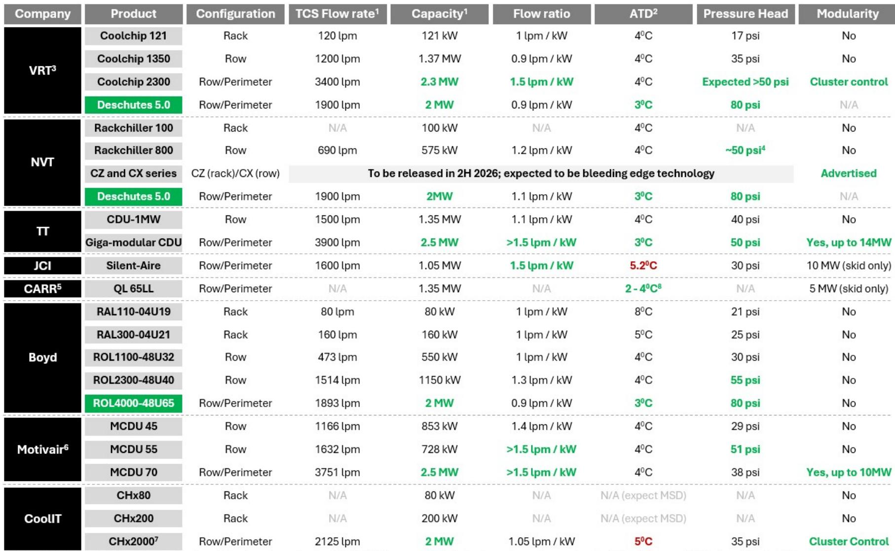
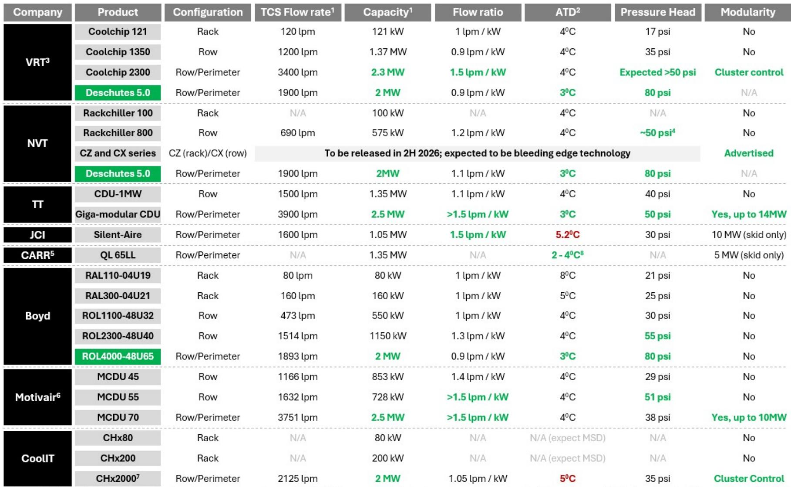
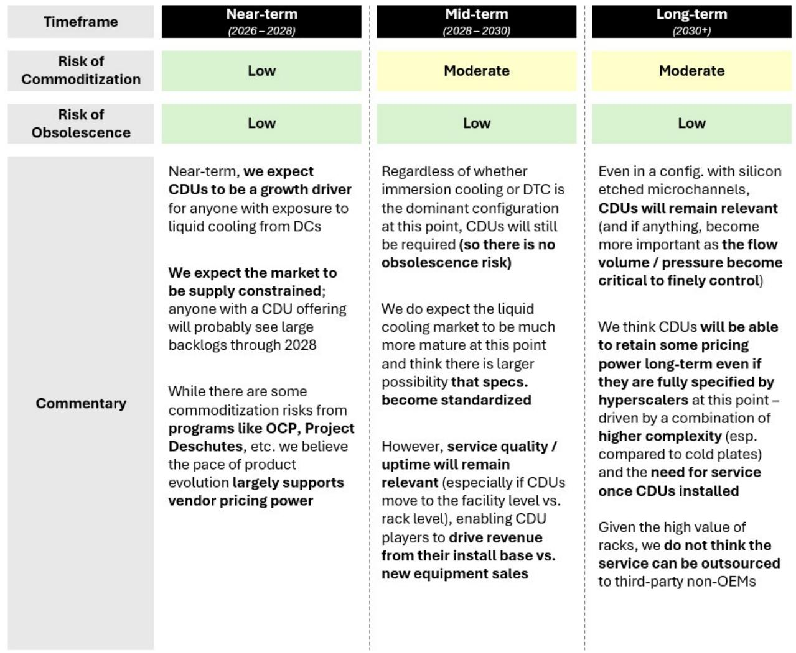

# Bernstein：液冷数据中心最被低估的环节不是冷板，而是冷却液分配单元

当英伟达的GPU集群单机柜功耗突破100千瓦，传统风冷已经彻底失效。液冷从边缘技术走向数据中心基础设施的核心，这已是行业共识。但多数讨论集中在冷板——那个贴在芯片上的金属块——而忽略了整个液冷系统中真正决定成败的组件：冷却液分配单元。

Bernstein这份最新的液冷专题报告，核心判断清晰且反直觉：CDU是一个被市场低估的好生意。它不是简单的泵阀组合，而是兼具技术壁垒、服务粘性和长期定价权的关键节点。更重要的是，在冷板可能走向标准化的过程中，CDU的不可替代性反而在增强。

这份报告的价值不在于告诉你液冷市场有多大——市场规模的争论仍在继续——而在于提供了一个评估CDU企业的分析框架，以及一个值得长期跟踪的技术拐点信号：两相直接接触冷却正在逼近商业化。

---

## 1. 为什么CDU比冷板更难被替代：技术复杂度和服务绑定的双重护城河

冷却液分配单元的核心功能是精确控制冷却液的流量、压力和温度，将其分配到多个机柜和机架，再回收升温后的冷却液。听起来像是一个工业泵站，但Bernstein指出，CDU的复杂程度和关键性远超表面认知。

从技术角度看，CDU需要同时管理多个物理量：流量比、压头、接近温度差、模块化扩展能力。以Bernstein对比的旗舰产品为例，Vertiv的Coolchip 2300可以处理2.3兆瓦的热负荷，流量高达每分钟3400升，压头超过50 psi；Trane Technologies的Giga-modular CDU则实现了14兆瓦的模块化扩展。这些参数背后是流体力学、热交换效率和系统可靠性的工程平衡。

但真正让CDU区别于冷板的是服务绑定。冷板一旦安装，几乎不需要维护。而CDU包含泵、阀、热交换器、传感器和控制逻辑，这些部件需要持续的监控、维护和更换。Bernstein强调，当单机柜的价值持续攀升——一个装满GPU的机柜可能价值数百万美元——CDU故障意味着多个机柜同时烧毁。这种风险让客户不会为了短期成本节省而选择最低价的服务商。

这意味着CDU市场存在一个天然的技术护城河：客户需要的是可靠的服务，而非便宜的硬件。这解释了为什么Bernstein认为CDU的标准化风险低于冷板——即使超大规模云厂商最终会指定CDU的设计规格，但服务环节仍然掌握在OEM手中。

## 2. 市场规模争论背后的真正变量：GW部署量、每千瓦成本和CDU使用寿命

Bernstein对CDU市场规模的估算相对克制：2026年约为低单位数十亿美元，到2030年增长至中高单位数十亿美元，复合年增长率约为15%左右。但报告坦承，这个估算高度依赖于三个关键假设，而这三个假设正是当前市场争论的焦点。

第一个变量是数据中心新增电力容量。全球数据中心电力需求的预测从每年几吉瓦到几十吉瓦不等，差异主要来自AI推理需求的爆发速度。第二个变量是每千瓦冷却成本，这取决于液冷技术的演进路径——单相直接接触冷却的成本结构不同于两相，而浸没式冷却的成本结构又完全不同。第三个变量是CDU的使用寿命，这直接决定了替换周期和总需求。

Bernstein开发了一个专有的液冷模型来处理这些变量，但报告没有给出具体的模型细节。这实际上是一个明确的信号：CDU市场规模不是一个可以精确预测的数字，而是一个需要持续跟踪的变量。对于投资者而言，更重要的不是市场规模的具体数字，而是判断市场是否处于供不应求的状态——Bernstein明确表示，2028年之前CDU市场将处于供应受限状态，这意味着任何拥有CDU产品的企业都将获得大量订单。

## 3. 竞争格局的分层：谁在定义技术路线，谁在跟随标准

Bernstein对CDU市场的竞争分析值得仔细拆解。报告没有简单列出所有参与者，而是根据技术实力和市场定位进行了分层。

第一梯队是英伟达液冷生态系统中的合作伙伴：Vertiv、nVent、Boyd和Motivair。这些企业不仅拥有成熟的CDU产品线，更重要的是，它们通过与英伟达的深度合作获得了技术路线图的可见性。Bernstein认为，这种可见性是“赢的权利”——因为英伟达在很大程度上决定了数据中心热密度的演进方向，谁先知道下一代GPU的热设计功耗，谁就能提前设计相应的冷却方案。

第二梯队是Trane Technologies，报告用“实力超出预期”来形容。Trane的Giga-modular CDU在容量和模块化方面都处于领先地位，这与其在工业冷却领域的深厚积累有关。

第三梯队是Carrier和Johnson Controls。它们拥有CDU产品，但Bernstein发现，由于这两家公司更专注于冷水机组等传统冷却设备，其CDU的产品广度、规格参数和细节披露程度都不及前述企业。这暗示它们可能更多是跟随市场，而非定义技术路线。

值得关注的是CoolIT。报告指出，CoolIT更像是冷板公司，其CDU的接近温度差落后于竞争对手。这提醒我们，在液冷生态中，冷板能力和CDU能力并不自动等同。

## 4. 两相直接接触冷却：一个可能颠覆现有格局的技术拐点

Bernstein报告中最重要的技术判断，是关于两相直接接触冷却的演进。目前主流的单相直接接触冷却正在接近其理论散热极限。当机柜功耗超过某个阈值时，单相冷却液无法带走足够的热量，而两相冷却通过让冷却液蒸发来吸收更多热量，可以在不显著提高冷却液温度的情况下实现更高的散热效率。

但两相冷却对CDU提出了全新的要求。气体在系统中的流动行为与液体完全不同，这意味着泵、阀门、管道和热交换器都需要重新设计。Bernstein指出，在报告覆盖的企业中，只有Vertiv和Accelsius（Johnson Controls投资的企业）已经发布了实际的两相CDU产品。其他企业虽然很可能在研发，但尚未公开产品细节。

报告估计，两相CDU的商业化规模应用至少还需要一年，甚至更长时间。但一旦技术成熟，它可能重新定义CDU市场的竞争格局。那些在单相时代建立优势的企业，如果无法及时切换到两相技术，可能面临市场份额的流失。反之，那些在单相时代看似落后的企业，可能在两相时代实现弯道超车。

这里有一个尚未完全回答的问题：两相CDU的技术壁垒是否比单相更高？如果答案是肯定的，那么先发优势将更加显著；如果答案是相反的，那么市场可能更快走向标准化和价格竞争。Bernstein的报告没有给出明确的判断，但这正是需要持续跟踪的关键。

## 5. 报告尚未完全回答的关键问题：CDU的定价权能维持多久

尽管Bernstein对CDU市场持乐观态度，但报告也留下了一个核心问题：CDU的定价权能维持多久？

从短期看，2028年之前市场供应受限，定价权显然在供应商手中。但从中期看，Bernstein认为标准化风险是“中等”的。超大规模云厂商正在通过开放计算项目（OCP）和Project Deschutes等项目推动CDU设计的标准化。一旦规格标准化，供应商之间的差异化将缩小，价格竞争可能加剧。

但报告同时指出，CDU比冷板更复杂——冷板本质上是一块带流道的金属板，而CDU是一个包含多个互联部件的系统——这种复杂性本身就能维持一定的定价权。更重要的是，服务需求不会因为标准化而消失。即使CDU的硬件规格被标准化，安装、调试、监控和维护仍然需要专业团队。

这意味着CDU市场的长期竞争可能从“卖硬件”转向“卖服务”。那些能够建立强大服务网络的企业，即使硬件利润率下降，也能通过服务合同获得稳定的收入流。Bernstein的长远展望中也提到了这一点：到2030年后，即使CDU被超大规模云厂商完全指定规格，服务需求仍将支撑CDU企业的收入。

但这里有一个尚未被充分讨论的变量：如果超大规模云厂商决定自研CDU，或者将服务内部化，CDU企业的定价权将受到实质性威胁。Bernstein的报告没有深入探讨这一情景，但这可能是投资者需要自己判断的风险。

## 6. 投资者的观察框架：三个维度区分赢家与输家

基于Bernstein的分析，我们可以提炼出一个评估CDU企业的三维框架。

第一维是技术路线图可见性。与英伟达等芯片厂商的合作深度，决定了企业能否提前预判下一代冷却需求。这一点在技术快速迭代的时期尤为重要。

第二维是开放计算项目参与度。OCP不仅是一个标准制定平台，更是与超大规模云厂商建立深度关系的渠道。Bernstein指出，同时具备这两个条件的企业并不多。

第三维是服务能力。CDU的服务收入不仅提供了稳定的现金流，还建立了客户锁定效应。一旦客户的CDU系统由某家企业安装和维护，更换供应商的成本将非常高。

用这个框架来看Bernstein覆盖的标的：Vertiv和nVent似乎同时满足三个条件；Trane在技术能力上突出，但服务网络可能需要验证；Carrier和Johnson Controls在CDU领域的投入深度仍有待观察。

---

Bernstein这份报告的价值在于，它把CDU从一个被忽视的组件提升到了战略核心的位置。在液冷市场从边缘走向主流的进程中，CDU的竞争格局和技术演进路径，可能比冷板市场更具投资洞察价值。

但报告也留下了一些悬而未决的问题：两相冷却的商业化时间表是否会被推迟？超大规模云厂商的自研倾向是否会改变竞争格局？CDU的服务收入究竟能贡献多少利润率？这些问题的答案，可能需要等到更多企业披露财报细节，或者等到两相产品真正进入商业化阶段才能揭晓。

欢迎来星球的微信群里继续讨论这些未解问题。我们会在群内分享Bernstein报告的完整PDF，以及我们对CDU市场规模模型的解读。如果你对液冷产业链的其他环节——冷板、浸没式冷却、芯片级散热——也有兴趣，我们可以在后续的讨论中逐一展开。

Personal reading notes and learning share only. Not investment advice.

