## Investor Presentation | Asia Pacific

## Greater China Technology Hardware: Building Blocks of Compute: Servers, AI Infrastructure, and Electronic Components

MS TAIWAN LIMITED+

## Howard Kao

Equity Analyst

Howard.Kao@morganstanley.com +886 2 2730-2989

## Sharon Shih

Equity Analyst

Sharon.Shih@morganstanley.com +886 2 2730-2865

text_image

Asia Summer School 2026

## GREATER CHINA TECHNOLOGY HARDWARE

Asia Pacific

Industry View In-Line

MS does and seeks to do business with companies covered in MS. As a result, investors should be aware that the firm may have a conflict of interest that could affect the objectivity of MS. Investors should consider MS as only a single factor in making their investment decision.

## For analyst certification and other important disclosures, refer to the Disclosure Section, located at the end of this report.

+= Analysts employed by non-U.S. affiliates are not registered with FINRA, may not be associated persons of the member and may not be subject to FINRA restrictions on communications with a subject company, public appearances and trading securities held by a research analyst account.

## Investment Summary

• Opportunities in AI GPU and ASIC server/rack design upgrades

• Major design upgrades for upcoming Vera Rubin platform, Kyber architecture and LPX/Vera CPU rack.  
- AI ASIC server upgrade and volume expansion magnitude – mainly TPU and Trainium platform

\- Where we see room for share price upside, near term

- AI server power solution (800 VDC), PCB/ABF substrate supply tightness, data network/interconnect/CPO upgrade  
- Smooth GB300 server rack delivery plus attractive risk-reward for AI server ODMs  
- Capacity expansion wave across the tech hardware supply chain

• What are the potential risks that we observe

- Consumer electronics (smartphones/PC) demand and margin impact in 2H impacted by memory inflation  
- Raw material price hike (copper, nickel) and supply tightness a margin headwind  
• Supply shortage impact could potentially delay the shipment pace  
- Geopolitical tension that impacts AI data center infrastructure spending

• Key stock ideas

- AI server hardware – Wistron, FII/Hon Hai, Wiwynn, Quanta, Delta Electronics, AVC, BizLink, King Slide, Accton, Chenbro, Gold Circuit, Unimicron, NYPCB, Zhen Ding, Yageo, FIT, and Fositek  
- Edge AI – Xiaomi, Luxshare, Lenovo

Hardware Technology Valuation Comparison

<table><tr><td rowspan="2">Ticker</td><td rowspan="2">Company</td><td rowspan="2">Closing Price 6/12/2026</td><td rowspan="2">Rating</td><td rowspan="2">Price Target (LC)</td><td rowspan="2">Market Cap (US$mn)</td><td colspan="2">EPS (Local Dollar)</td><td colspan="2">P/E (X)</td><td colspan="2">P/B (X)</td><td colspan="2">P/S (X)</td><td colspan="2">EV/EBITDA</td><td colspan="2">ROE (%)</td><td colspan="2">ROA (%)</td><td rowspan="2">Trading Volume (US$ mn)</td><td rowspan="2">26E</td></tr><tr><td>26E</td><td>27E</td><td>26E</td><td>27E</td><td>26E</td><td>27E</td><td>26E</td><td>27E</td><td>26E</td><td>27E</td><td>26E</td><td>27E</td><td>26E</td><td>27E</td></tr><tr><td colspan="22">Tech conglomerate &amp; Enablers</td></tr><tr><td colspan="22">Taiwan</td></tr><tr><td>2301.TW</td><td>Lite-On Tech</td><td>217.00</td><td>E</td><td>176.00</td><td>15,250</td><td>8.72 e</td><td>11.19 e</td><td>24.9</td><td>19.4</td><td>5.2 e</td><td>5.0 e</td><td>2.4</td><td>1.9</td><td>16.06</td><td>12.33</td><td>21.56</td><td>26.28</td><td>8.99</td><td>10.08</td><td>137.07</td><td>3%</td></tr><tr><td>2308.TW</td><td>Delta</td><td>2,215.00</td><td>O</td><td>2700.0</td><td>177,184</td><td>41.52 e</td><td>65.05 e</td><td>53.4</td><td>34.0</td><td>13.1 e</td><td>10.2 e</td><td>7.2</td><td>5.1</td><td>30.23</td><td>20.27</td><td>29.61</td><td>36.69</td><td>14.84</td><td>18.14</td><td>472.10</td><td>1%</td></tr><tr><td>2317.TW</td><td>Hon Hai</td><td>260.50</td><td>O</td><td>310.0</td><td>114,314</td><td>16.38 e</td><td>19.90 e</td><td>15.9</td><td>13.1</td><td>1.7 e</td><td>1.6 e</td><td>0.4</td><td>0.3</td><td>7.02</td><td>5.93</td><td>11.30</td><td>12.87</td><td>4.32</td><td>4.83</td><td>472.88</td><td>4%</td></tr><tr><td>2354.TW</td><td>Foxconn Tech</td><td>57.00</td><td>U</td><td>54.00</td><td>2,510</td><td>3.47 e</td><td>3.81 e</td><td>16.4</td><td>15.0</td><td>0.5 e</td><td>0.5 e</td><td>0.5</td><td>0.6</td><td>(1.13)</td><td>(0.61)</td><td>4.32</td><td>4.62</td><td>2.34</td><td>2.58</td><td>24.14</td><td>2%</td></tr><tr><td>2421.TW</td><td>Sunon</td><td>144.00</td><td>E</td><td>165.0</td><td>1,287</td><td>10.18 e</td><td>11.65 e</td><td>14.1</td><td>12.4</td><td>3.9 e</td><td>3.5 e</td><td>1.6</td><td>1.5</td><td>7.69</td><td>6.61</td><td>29.21</td><td>29.51</td><td>14.94</td><td>15.27</td><td>25.60</td><td>4%</td></tr><tr><td>2455.TW</td><td>VPEC</td><td>352.00</td><td>E</td><td>290.00</td><td>1,869</td><td>4.88 e</td><td>7.60 e</td><td>72.1</td><td>46.3</td><td>17.6 e</td><td>14.8 e</td><td>15.6</td><td>12.3</td><td>48.99</td><td>33.02</td><td>25.73</td><td>34.64</td><td>18.26</td><td>25.06</td><td>60.26</td><td>1%</td></tr><tr><td>2474.TW</td><td>Catcher</td><td>205.50</td><td>U</td><td>160.0</td><td>3,643</td><td>12.03 e</td><td>12.52 e</td><td>17.1</td><td>16.4</td><td>0.8 e</td><td>0.8 e</td><td>6.5</td><td>6.0</td><td>29.10</td><td>28.18</td><td>4.65</td><td>4.81</td><td>3.23</td><td>3.32</td><td>27.54</td><td>5%</td></tr><tr><td>3017.TW</td><td>AVC</td><td>2,405.00</td><td>O</td><td>3333.00</td><td>28,945</td><td>96.50 e</td><td>145.03 e</td><td>24.9</td><td>16.6</td><td>11.9 e</td><td>7.8 e</td><td>4.2</td><td>3.2</td><td>14.36</td><td>9.51</td><td>57.33</td><td>55.61</td><td>19.71</td><td>22.07</td><td>322.89</td><td>1%</td></tr><tr><td>3081.TWO</td><td>LandMark</td><td>2,165.00</td><td>E</td><td>2850.0</td><td>6,325</td><td>17.62 e</td><td>28.78 e</td><td>122.9</td><td>75.2</td><td>32.9 e</td><td>19.8 e</td><td>42.7</td><td>26.6</td><td>87.63</td><td>55.38</td><td>31.52</td><td>32.71</td><td>26.72</td><td>28.67</td><td>102.60</td><td>0%</td></tr><tr><td>3324.TWO</td><td>Auras</td><td>998.00</td><td>E</td><td>1025.00</td><td>2,933</td><td>58.09 e</td><td>66.06 e</td><td>17.2</td><td>15.1</td><td>5.9 e</td><td>4.7 e</td><td>2.2</td><td>1.9</td><td>11.61</td><td>10.05</td><td>39.64</td><td>34.72</td><td>17.35</td><td>15.65</td><td>125.08</td><td>1%</td></tr><tr><td>6271.TW</td><td>Tong Hsing</td><td>238.50</td><td>E</td><td>116.0</td><td>1,433</td><td>8.16 e</td><td>9.47 e</td><td>29.2</td><td>25.2</td><td>1.8 e</td><td>1.7 e</td><td>4.1</td><td>3.8</td><td>23.43</td><td>20.13</td><td>6.25</td><td>6.94</td><td>4.72</td><td>5.27</td><td>19.32</td><td>1%</td></tr><tr><td>6805.TW</td><td>Fositek</td><td>1,825.00</td><td>O</td><td>2426.00</td><td>3,789</td><td>67.54 e</td><td>92.07 e</td><td>27.0</td><td>19.8</td><td>11.3 e</td><td>7.9 e</td><td>6.5</td><td>5.1</td><td>19.96</td><td>14.19</td><td>50.61</td><td>46.84</td><td>25.85</td><td>25.70</td><td>112.08</td><td>1%</td></tr><tr><td colspan="22">HK/ China</td></tr><tr><td>002230.SZ</td><td>iFlytek</td><td>40.79</td><td>E</td><td>44.80</td><td>13,175</td><td>0.58 e</td><td>0.67 e</td><td>70.8</td><td>60.5</td><td>4.7 e</td><td>4.4 e</td><td>3.0</td><td>2.7</td><td>45.03</td><td>41.24</td><td>6.86</td><td>7.49</td><td>3.08</td><td>3.36</td><td>396.68</td><td>0%</td></tr><tr><td>002241.SZ</td><td>GoerTek</td><td>22.72</td><td>U</td><td>20.50</td><td>11,902</td><td>1.29 e</td><td>1.38 e</td><td>17.7</td><td>16.5</td><td>2.1 e</td><td>1.9 e</td><td>0.7</td><td>0.7</td><td>9.67</td><td>8.15</td><td>12.04</td><td>12.13</td><td>4.92</td><td>4.76</td><td>447.01</td><td>3%</td></tr><tr><td>002475.SZ</td><td>Luxshare</td><td>64.58</td><td>O</td><td>77.00</td><td>69,265</td><td>2.85 e</td><td>4.05 e</td><td>22.7</td><td>15.9</td><td>3.8 e</td><td>3.1 e</td><td>1.1</td><td>0.9</td><td>12.86</td><td>9.96</td><td>18.48</td><td>21.51</td><td>7.72</td><td>9.53</td><td>1,223.18</td><td>0%</td></tr><tr><td>002600.SZ</td><td>Lingyi</td><td>13.63</td><td>U</td><td>12.20</td><td>14,697</td><td>0.51 e</td><td>0.67 e</td><td>27.0</td><td>20.3</td><td>0.9 e</td><td>0.8 e</td><td>1.5</td><td>1.2</td><td>12.73</td><td>10.58</td><td>13.35</td><td>15.34</td><td>5.94</td><td>7.29</td><td>439.77</td><td>0%</td></tr><tr><td>601138.SS</td><td>FII</td><td>69.52</td><td>O</td><td>82.8</td><td>203,549</td><td>3.08 e</td><td>4.04 e</td><td>22.6</td><td>17.2</td><td>8.0 e</td><td>7.8 e</td><td>1.0</td><td>0.8</td><td>15.61</td><td>12.39</td><td>36.07</td><td>45.92</td><td>11.11</td><td>11.57</td><td>1,552.36</td><td>4%</td></tr><tr><td colspan="22">Display &amp; Industrial Automation</td></tr><tr><td colspan="22">Taiwan</td></tr><tr><td>1590.TW</td><td>Airtac</td><td>1,290.00</td><td>O</td><td>2000.0</td><td>7,990</td><td>56.77 e</td><td>65.77 e</td><td>22.7</td><td>19.6</td><td>4.4 e</td><td>3.9 e</td><td>6.0</td><td>5.3</td><td>15.34</td><td>13.19</td><td>20.53</td><td>21.28</td><td>18.56</td><td>19.04</td><td>29.32</td><td>2%</td></tr><tr><td>2049.TW</td><td>Hiwin</td><td>323.50</td><td>O</td><td>400.0</td><td>3,279</td><td>8.77 e</td><td>10.77 e</td><td>36.9</td><td>30.0</td><td>2.1 e</td><td>2.0 e</td><td>3.8</td><td>3.3</td><td>18.79</td><td>15.97</td><td>8.02</td><td>9.22</td><td>5.36</td><td>5.88</td><td>37.60</td><td>1%</td></tr><tr><td>2360.TW</td><td>Chroma</td><td>2,295.00</td><td>O</td><td>2800.0</td><td>29,410</td><td>39.87 e</td><td>55.57 e</td><td>57.6</td><td>41.3</td><td>23.3 e</td><td>17.9 e</td><td>19.4</td><td>14.6</td><td>45.77</td><td>33.12</td><td>45.59</td><td>49.12</td><td>30.31</td><td>32.01</td><td>128.21</td><td>1%</td></tr><tr><td>2395.TW</td><td>Advantech</td><td>473.00</td><td>O</td><td>400.0</td><td>12,722</td><td>14.77 e</td><td>16.97 e</td><td>32.0</td><td>27.9</td><td>6.9 e</td><td>6.4 e</td><td>5.1</td><td>4.5</td><td>25.95</td><td>22.28</td><td>22.18</td><td>23.85</td><td>15.32</td><td>16.27</td><td>29.52</td><td>2%</td></tr><tr><td>2409.TW</td><td>AUO</td><td>23.50</td><td>E</td><td>14.0</td><td>5,517</td><td>0.25 e</td><td>0.51 e</td><td>93.5</td><td>46.0</td><td>1.2 e</td><td>1.1 e</td><td>0.6</td><td>0.6</td><td>4.54</td><td>3.12</td><td>1.24</td><td>2.56</td><td>0.42</td><td>0.88</td><td>78.44</td><td>1%</td></tr><tr><td>3481.TW</td><td>Innolux</td><td>48.55</td><td>E</td><td>19.5</td><td>11,845</td><td>0.36 e</td><td>0.56 e</td><td>133.6</td><td>86.0</td><td>1.7 e</td><td>1.7 e</td><td>1.6</td><td>1.5</td><td>11.59</td><td>10.50</td><td>1.37</td><td>2.13</td><td>0.88</td><td>1.35</td><td>174.47</td><td>0%</td></tr><tr><td>3665.TW</td><td>Bizlink</td><td>2,310.00</td><td>O</td><td>3665.0</td><td>13,307</td><td>63.77 e</td><td>120.77 e</td><td>36.2</td><td>19.1</td><td>8.0 e</td><td>6.0 e</td><td>4.6</td><td>3.0</td><td>22.45</td><td>12.56</td><td>24.01</td><td>35.51</td><td>13.85</td><td>21.31</td><td>181.15</td><td>1%</td></tr><tr><td>3714.TW</td><td>Ennostar</td><td>64.40</td><td>U</td><td>29.0</td><td>1,480</td><td>(0.08) e</td><td>0.01 e</td><td>NM</td><td>7,194.7</td><td>0.9 e</td><td>0.9 e</td><td>1.9</td><td>1.8</td><td>7.99</td><td>9.94</td><td>(0.11)</td><td>0.01</td><td>(0.09)</td><td>0.01</td><td>14.59</td><td>0%</td></tr><tr><td>6176.TW</td><td>Radiant</td><td>91.30</td><td>E</td><td>170.0</td><td>1,347</td><td>11.47 e</td><td>11.27 e</td><td>8.0</td><td>8.1</td><td>1.1 e</td><td>1.1 e</td><td>0.9</td><td>0.9</td><td>0.35</td><td>0.14</td><td>13.99</td><td>13.23</td><td>7.40</td><td>7.20</td><td>15.16</td><td>9%</td></tr><tr><td>8069.TWO</td><td>E Ink</td><td>190.50</td><td>O</td><td>250.0</td><td>6,933</td><td>11.37 e</td><td>13.07 e</td><td>16.8</td><td>14.6</td><td>2.9 e</td><td>2.7 e</td><td>5.1</td><td>4.4</td><td>13.09</td><td>11.02</td><td>17.91</td><td>18.95</td><td>11.82</td><td>12.80</td><td>42.01</td><td>4%</td></tr><tr><td>2059.TW</td><td>King Slide</td><td>6,910.00</td><td>O</td><td>6650.0</td><td>19,260</td><td>167.77 e</td><td>193.77 e</td><td>41.2</td><td>35.7</td><td>17.1 e</td><td>12.8 e</td><td>24.3</td><td>20.6</td><td>32.55</td><td>26.77</td><td>48.03</td><td>41.12</td><td>38.12</td><td>32.93</td><td>90.37</td><td>1%</td></tr><tr><td>2345.TW</td><td>Accton</td><td>2,335.00</td><td>O</td><td>3350.0</td><td>40,313</td><td>75.77 e</td><td>100.77 e</td><td>30.8</td><td>23.2</td><td>14.5 e</td><td>9.8 e</td><td>3.7</td><td>2.9</td><td>21.71</td><td>15.88</td><td>57.33</td><td>50.43</td><td>24.83</td><td>24.41</td><td>217.23</td><td>1%</td></tr><tr><td>8210.TW</td><td>Chenbro</td><td>1,475.00</td><td>O</td><td>1780.0</td><td>5,699</td><td>47.77 e</td><td>58.77 e</td><td>30.9</td><td>25.1</td><td>12.2 e</td><td>9.4 e</td><td>5.4</td><td>4.4</td><td>21.11</td><td>16.99</td><td>44.50</td><td>41.35</td><td>21.17</td><td>20.25</td><td>76.80</td><td>1%</td></tr><tr><td colspan="22">HK/ China</td></tr><tr><td>000050.SZ</td><td>Tianma</td><td>7.66</td><td>U</td><td>6.3</td><td>2,685</td><td>0.21 e</td><td>0.25 e</td><td>35.7</td><td>30.5</td><td>0.6 e</td><td>0.6 e</td><td>0.5</td><td>0.4</td><td>5.18</td><td>4.51</td><td>1.77</td><td>2.04</td><td>0.66</td><td>0.74</td><td>40.44</td><td>0%</td></tr><tr><td>000100.SZ</td><td>TCL Corp.</td><td>4.51</td><td>E</td><td>4.7</td><td>13,842</td><td>0.32 e</td><td>0.37 e</td><td>14.3</td><td>12.1</td><td>1.6 e</td><td>1.6 e</td><td>0.4</td><td>0.4</td><td>4.79</td><td>4.47</td><td>11.45</td><td>13.54</td><td>1.48</td><td>1.70</td><td>302.96</td><td>4%</td></tr><tr><td>000725.SZ</td><td>BOE Tech</td><td>5.83</td><td>O</td><td>5.2</td><td>31,670</td><td>0.22 e</td><td>0.29 e</td><td>26.2</td><td>20.2</td><td>1.5 e</td><td>1.5 e</td><td>1.0</td><td>1.0</td><td>5.25</td><td>5.01</td><td>5.99</td><td>7.38</td><td>1.76</td><td>2.10</td><td>499.47</td><td>1%</td></tr><tr><td>300433.SZ</td><td>Lens Tech</td><td>42.68</td><td>E</td><td>31.0</td><td>32,278</td><td>0.82 e</td><td>1.39 e</td><td>51.8</td><td>30.7</td><td>4.0 e</td><td>3.6 e</td><td>2.8</td><td>2.2</td><td>18.05</td><td>13.80</td><td>7.47</td><td>11.75</td><td>4.85</td><td>7.47</td><td>447.68</td><td>1%</td></tr><tr><td>300567.SZ</td><td>Jingce</td><td>192.90</td><td>E</td><td>70.0</td><td>7,962</td><td>0.87 e</td><td>1.47 e</td><td>222.6</td><td>131.5</td><td>12.4 e</td><td>11.6 e</td><td>16.3</td><td>14.3</td><td>178.12</td><td>104.77</td><td>5.73</td><td>9.12</td><td>2.45</td><td>3.85</td><td>144.78</td><td>0%</td></tr><tr><td>600703.SS</td><td>Sanan Opto</td><td>15.26</td><td>U</td><td>9.0</td><td>11,233</td><td>0.27 e</td><td>0.37 e</td><td>56.9</td><td>41.2</td><td>1.9 e</td><td>1.8 e</td><td>3.3</td><td>2.8</td><td>16.43</td><td>14.11</td><td>3.32</td><td>4.43</td><td>1.84</td><td>2.31</td><td>310.39</td><td>0%</td></tr></table>

NA = not available at this time. Source: FactSet, MS; E=MS estimates.  
Note: Prices as of the close, June 12, 2026.

Hardware Technology Valuation Comparison

<table><tr><td rowspan="2">Ticker</td><td rowspan="2">Company</td><td rowspan="2">Closing Price 6/12/2026</td><td rowspan="2">Rating</td><td rowspan="2">Price Target (LC)</td><td rowspan="2">Market Cap (US$mn)</td><td colspan="2">EPS (Local Dollar)</td><td colspan="2">P/E (X)</td><td colspan="2">P/B (X)</td><td colspan="2">P/S (X)</td><td colspan="2">EV/EBITDA</td><td colspan="2">ROE (%)</td><td colspan="2">ROA (%)</td><td rowspan="2">Trading Volume (US$ mn)</td><td rowspan="2">26E</td></tr><tr><td>26E</td><td>27E</td><td>26E</td><td>27E</td><td>26E</td><td>27E</td><td>26E</td><td>27E</td><td>26E</td><td>27E</td><td>26E</td><td>27E</td><td>26E</td><td>27E</td></tr><tr><td colspan="22">PC / Data Center / Cyclical Components</td></tr><tr><td colspan="22">Taiwan</td></tr><tr><td>2324.TW</td><td>Compal</td><td>36.35</td><td>U</td><td>23.00</td><td>5,031</td><td>1.98 e</td><td>2.23 e</td><td>18.4</td><td>16.3</td><td>1.1 e</td><td>1.0 e</td><td>0.2</td><td>0.2</td><td>8.0</td><td>7.6</td><td>5.7</td><td>6.2</td><td>1.9</td><td>2.0</td><td>49.0</td><td>2%</td></tr><tr><td>2327.TW</td><td>Yageo</td><td>855.00</td><td>O</td><td>1010.0</td><td>55,080</td><td>17.88 e</td><td>23.59 e</td><td>47.8</td><td>36.2</td><td>8.2 e</td><td>7.4 e</td><td>10.3</td><td>8.7</td><td>31.7</td><td>24.7</td><td>19.0</td><td>21.4</td><td>8.8</td><td>10.5</td><td>367.3</td><td>1%</td></tr><tr><td>2353.TW</td><td>Acer</td><td>36.70</td><td>U</td><td>21.00</td><td>3,552</td><td>1.54 e</td><td>1.61 e</td><td>23.9</td><td>22.8</td><td>1.4 e</td><td>1.3 e</td><td>0.4</td><td>0.4</td><td>10.3</td><td>9.5</td><td>5.3</td><td>6.0</td><td>1.9</td><td>2.0</td><td>27.2</td><td>4%</td></tr><tr><td>2357.TW</td><td>Asustek</td><td>785.00</td><td>U</td><td>570.0</td><td>18,390</td><td>59.22 e</td><td>57.19 e</td><td>13.3</td><td>13.7</td><td>1.9 e</td><td>1.9 e</td><td>0.6</td><td>0.6</td><td>10.0</td><td>10.7</td><td>14.9</td><td>13.8</td><td>7.0</td><td>6.1</td><td>90.5</td><td>5%</td></tr><tr><td>2368.TW</td><td>GCE</td><td>1,320.00</td><td>O</td><td>1660.00</td><td>21,961</td><td>47.19 e</td><td>82.32 e</td><td>28.0</td><td>16.0</td><td>12.6 e</td><td>8.1 e</td><td>6.3</td><td>4.2</td><td>18.9</td><td>10.6</td><td>54.7</td><td>61.5</td><td>24.2</td><td>28.4</td><td>217.0</td><td>1%</td></tr><tr><td>2376.TW</td><td>Gigabyte</td><td>342.00</td><td>E</td><td>375.0</td><td>7,193</td><td>32.40 e</td><td>29.75 e</td><td>10.6</td><td>11.5</td><td>3.2 e</td><td>3.1 e</td><td>0.5</td><td>0.4</td><td>7.4</td><td>8.4</td><td>32.4</td><td>27.1</td><td>12.3</td><td>9.7</td><td>60.5</td><td>4%</td></tr><tr><td>2382.TW</td><td>Quanta</td><td>372.00</td><td>O</td><td>385.00</td><td>45,133</td><td>24.66 e</td><td>28.80 e</td><td>15.1</td><td>12.9</td><td>4.6 e</td><td>3.8 e</td><td>0.4</td><td>0.4</td><td>12.2</td><td>10.2</td><td>33.6</td><td>32.3</td><td>5.6</td><td>5.1</td><td>212.5</td><td>3%</td></tr><tr><td>3231.TW</td><td>Wistron</td><td>156.00</td><td>O</td><td>210.0</td><td>15,317</td><td>13.95 e</td><td>18.11 e</td><td>11.2</td><td>8.6</td><td>1.7 e</td><td>1.5 e</td><td>0.1</td><td>0.1</td><td>3.4</td><td>2.7</td><td>15.8</td><td>18.2</td><td>3.5</td><td>3.7</td><td>201.6</td><td>2%</td></tr><tr><td>3533.TW</td><td>Lotes</td><td>2,240.00</td><td>E</td><td>2350.00</td><td>7,623</td><td>94.03 e</td><td>116.81 e</td><td>23.8</td><td>19.2</td><td>5.4 e</td><td>4.6 e</td><td>5.7</td><td>4.8</td><td>13.9</td><td>11.2</td><td>24.1</td><td>25.7</td><td>19.2</td><td>20.3</td><td>67.6</td><td>2%</td></tr><tr><td>4938.TW</td><td>Pegatron</td><td>93.10</td><td>E</td><td>85.0</td><td>8,080</td><td>5.39 e</td><td>7.61 e</td><td>17.3</td><td>12.2</td><td>0.9 e</td><td>0.9 e</td><td>0.2</td><td>0.1</td><td>4.9</td><td>3.8</td><td>5.6</td><td>7.5</td><td>2.2</td><td>2.6</td><td>26.4</td><td>0%</td></tr><tr><td>4958.TW</td><td>Zhen Ding</td><td>552.00</td><td>O</td><td>666.00</td><td>18,032</td><td>14.46 e</td><td>24.21 e</td><td>38.2</td><td>22.8</td><td>3.2 e</td><td>2.9 e</td><td>2.6</td><td>2.0</td><td>16.5</td><td>10.9</td><td>8.8</td><td>13.5</td><td>5.3</td><td>8.1</td><td>155.4</td><td>1%</td></tr><tr><td>8046.TW</td><td>Nan Ya PCB</td><td>819.00</td><td>O</td><td>1275.0</td><td>16,467</td><td>11.52 e</td><td>23.78 e</td><td>71.1</td><td>34.4</td><td>10.2 e</td><td>8.5 e</td><td>9.6</td><td>7.1</td><td>36.3</td><td>21.7</td><td>15.1</td><td>26.8</td><td>11.2</td><td>19.2</td><td>225.6</td><td>0%</td></tr><tr><td>3037.TW</td><td>Unimicron</td><td>902.00</td><td>O</td><td>1285.00</td><td>42,850</td><td>11.84 e</td><td>25.26 e</td><td>76.2</td><td>35.7</td><td>11.4 e</td><td>9.1 e</td><td>7.3</td><td>5.2</td><td>33.6</td><td>18.3</td><td>15.9</td><td>28.4</td><td>6.5</td><td>11.3</td><td>371.6</td><td>0%</td></tr><tr><td>6669.TW</td><td>Wiwynn</td><td>4,850.00</td><td>O</td><td>7500.0</td><td>28,757</td><td>357.51 e</td><td>466.82 e</td><td>13.6</td><td>10.4</td><td>5.5 e</td><td>4.2 e</td><td>0.6</td><td>0.4</td><td>9.2</td><td>7.3</td><td>46.0</td><td>45.6</td><td>17.3</td><td>16.4</td><td>238.1</td><td>3%</td></tr><tr><td colspan="22">HK/China</td></tr><tr><td>000977.SZ</td><td>Inspur</td><td>57.84</td><td>E</td><td>75.00</td><td>12,518</td><td>2.26 e</td><td>3.03 e</td><td>25.5</td><td>19.1</td><td>3.3 e</td><td>2.9 e</td><td>0.4</td><td>0.3</td><td>27.1</td><td>21.1</td><td>13.9</td><td>16.3</td><td>3.7</td><td>3.7</td><td>592.9</td><td>0%</td></tr><tr><td>600183.SS</td><td>Shengyi</td><td>149.73</td><td>E</td><td>74.0</td><td>53,664</td><td>2.06 e</td><td>2.84 e</td><td>72.6</td><td>52.7</td><td>16.6 e</td><td>14.2 e</td><td>9.3</td><td>7.3</td><td>52.3</td><td>38.8</td><td>24.6</td><td>29.1</td><td>15.7</td><td>18.3</td><td>445.9</td><td>1%</td></tr><tr><td>002916.SZ</td><td>Shennan Circuit</td><td>376.16</td><td>E</td><td>400.00</td><td>37,805</td><td>7.18 e</td><td>11.24 e</td><td>52.4</td><td>33.5</td><td>8.9 e</td><td>6.9 e</td><td>7.4</td><td>5.7</td><td>41.1</td><td>27.3</td><td>25.2</td><td>31.6</td><td>14.9</td><td>19.5</td><td>377.2</td><td>0%</td></tr><tr><td>0992.HK</td><td>Lenovo</td><td>22.88 HKD</td><td>E</td><td>14.2</td><td>36,215</td><td>1.42 e</td><td>1.43 e</td><td>16.2</td><td>16.0</td><td>3.6 e</td><td>3.2 e</td><td>0.4</td><td>0.4</td><td>6.3</td><td>6.0</td><td>26.1</td><td>22.7</td><td>5.0</td><td>4.8</td><td>145.0</td><td>3%</td></tr><tr><td>6088.HK</td><td>FIT Hong Teng</td><td>7.30 HKD</td><td>O</td><td>12.00</td><td>6,803</td><td>0.32 e</td><td>0.53 e</td><td>23.0</td><td>13.7</td><td>2.2 e</td><td>1.9 e</td><td>1.2</td><td>1.0</td><td>11.0</td><td>6.9</td><td>10.2</td><td>15.1</td><td>4.7</td><td>7.3</td><td>59.9</td><td>0%</td></tr><tr><td colspan="22"></td></tr><tr><td colspan="22">Smartphone &amp; Wireless Equipment Taiwan</td></tr><tr><td>3008.TW</td><td>Largan</td><td>4,020.00</td><td>E</td><td>2450.00</td><td>17,204</td><td>153.49 e</td><td>165.87 e</td><td>26.2</td><td>24.2</td><td>2.5 e</td><td>2.3 e</td><td>9.0</td><td>8.4</td><td>13.5</td><td>12.3</td><td>10.2</td><td>10.0</td><td>9.0</td><td>9.2</td><td>75.8</td><td>2%</td></tr><tr><td>3406.TW</td><td>Genius</td><td>662.00</td><td>E</td><td>425.00</td><td>2,467</td><td>31.74 e</td><td>39.14 e</td><td>20.9</td><td>16.9</td><td>2.5 e</td><td>2.2 e</td><td>3.0</td><td>2.7</td><td>7.3</td><td>6.2</td><td>12.7</td><td>13.7</td><td>8.1</td><td>9.4</td><td>20.3</td><td>11%</td></tr><tr><td colspan="22">HK/China</td></tr><tr><td>000063.SZ</td><td>ZTE (A Shr)</td><td>37.81</td><td>E</td><td>34.30</td><td>24,997</td><td>0.83 e</td><td>1.16 e</td><td>45.6</td><td>32.7</td><td>2.3 e</td><td>2.2 e</td><td>1.1</td><td>1.0</td><td>22.5</td><td>20.5</td><td>5.2</td><td>6.9</td><td>1.8</td><td>2.3</td><td>823.2</td><td>2%</td></tr><tr><td>002036.SZ</td><td>LCE</td><td>7.96</td><td>U</td><td>8.50</td><td>1,242</td><td>0.20 e</td><td>0.24 e</td><td>39.9</td><td>32.6</td><td>2.9 e</td><td>2.7 e</td><td>0.9</td><td>0.8</td><td>9.7</td><td>8.6</td><td>7.5</td><td>8.5</td><td>1.3</td><td>1.6</td><td>75.9</td><td>0%</td></tr><tr><td>002236.SZ</td><td>Dahua</td><td>15.84</td><td>E</td><td>20.80</td><td>7,641</td><td>1.35 e</td><td>1.50 e</td><td>11.8</td><td>10.6</td><td>1.3 e</td><td>1.2 e</td><td>1.4</td><td>1.3</td><td>8.8</td><td>7.6</td><td>11.1</td><td>11.6</td><td>8.0</td><td>8.1</td><td>136.6</td><td>4%</td></tr><tr><td>002273.SZ</td><td>Crystal</td><td>33.18</td><td>O</td><td>30.00</td><td>6,808</td><td>1.08 e</td><td>1.25 e</td><td>30.7</td><td>26.4</td><td>4.5 e</td><td>4.3 e</td><td>5.7</td><td>4.9</td><td>20.1</td><td>17.2</td><td>15.0</td><td>16.7</td><td>11.9</td><td>13.0</td><td>212.2</td><td>2%</td></tr><tr><td>002373.SZ</td><td>TransInfo</td><td>7.22</td><td>E</td><td>9.70</td><td>1,468</td><td>0.44 e</td><td>0.50 e</td><td>16.5</td><td>14.4</td><td>0.9 e</td><td>0.8 e</td><td>1.4</td><td>1.2</td><td>6.8</td><td>5.5</td><td>5.6</td><td>6.0</td><td>3.9</td><td>4.2</td><td>58.0</td><td>0%</td></tr><tr><td>002415.SZ</td><td>Hikvision</td><td>29.98</td><td>E</td><td>35.80</td><td>40,540</td><td>1.75 e</td><td>1.87 e</td><td>17.1</td><td>16.0</td><td>2.8 e</td><td>2.6 e</td><td>2.8</td><td>2.5</td><td>11.7</td><td>10.3</td><td>16.9</td><td>16.7</td><td>11.2</td><td>11.2</td><td>261.7</td><td>4%</td></tr><tr><td>002456.SZ</td><td>SZ O-Film</td><td>8.67</td><td>U</td><td>8.00</td><td>4,296</td><td>0.06 e</td><td>0.11 e</td><td>157.5</td><td>75.8</td><td>5.5 e</td><td>5.0 e</td><td>1.4</td><td>1.2</td><td>27.1</td><td>22.0</td><td>3.6</td><td>6.9</td><td>0.8</td><td>1.6</td><td>179.6</td><td>1%</td></tr><tr><td>300098.SZ</td><td>Gosuncn</td><td>4.90</td><td>U</td><td>4.80</td><td>1,115</td><td>0.08 e</td><td>0.10 e</td><td>65.3</td><td>48.6</td><td>2.9 e</td><td>2.8 e</td><td>3.5</td><td>3.0</td><td>37.4</td><td>27.2</td><td>4.6</td><td>5.9</td><td>2.5</td><td>3.0</td><td>55.4</td><td>0%</td></tr><tr><td>002281.SZ</td><td>Accelink</td><td>205.40</td><td>U</td><td>166.00</td><td>24,447</td><td>2.30 e</td><td>3.38 e</td><td>89.3</td><td>60.8</td><td>14.3 e</td><td>12.1 e</td><td>10.5</td><td>7.8</td><td>57.6</td><td>41.2</td><td>17.1</td><td>21.6</td><td>10.6</td><td>13.1</td><td>608.9</td><td>0%</td></tr><tr><td>600745.SS</td><td>Wingtech</td><td>17.94</td><td>U</td><td>15.00</td><td>3,295</td><td>(0.26) e</td><td>(0.17) e</td><td>NM</td><td>NM</td><td>0.9 e</td><td>0.9 e</td><td>6.4</td><td>6.0</td><td>(449.9)</td><td>316.7</td><td>(1.3)</td><td>(0.8)</td><td>(0.8)</td><td>(0.5)</td><td>227.1</td><td>0%</td></tr><tr><td>603297.SS</td><td>Yongxin</td><td>117.96</td><td>E</td><td>120.00</td><td>1,931</td><td>2.81 e</td><td>3.37 e</td><td>42.0</td><td>35.0</td><td>5.9 e</td><td>5.4 e</td><td>11.2</td><td>9.2</td><td>41.2</td><td>30.7</td><td>14.5</td><td>16.0</td><td>12.3</td><td>13.6</td><td>31.3</td><td>1%</td></tr><tr><td>688036.SS</td><td>Transsion</td><td>53.17</td><td>E</td><td>60.00</td><td>9,031</td><td>0.54 e</td><td>2.14 e</td><td>97.9</td><td>24.8</td><td>3.0 e</td><td>2.7 e</td><td>0.9</td><td>0.8</td><td>122.4</td><td>16.7</td><td>3.0</td><td>11.5</td><td>1.4</td><td>5.1</td><td>128.4</td><td>0%</td></tr><tr><td>601869.SS</td><td>YOFC-A</td><td>442.51</td><td>U</td><td>202.25</td><td>38,935</td><td>9.07 e</td><td>15.38 e</td><td>48.8</td><td>28.8</td><td>14.6 e</td><td>10.3 e</td><td>9.1</td><td>7.2</td><td>24.8</td><td>16.0</td><td>35.1</td><td>42.1</td><td>18.0</td><td>23.8</td><td>393.8</td><td>0%</td></tr><tr><td>603236.SS</td><td>Quectel</td><td>56.15</td><td>E</td><td>95.00</td><td>3,338</td><td>4.25 e</td><td>4.92 e</td><td>13.2</td><td>11.4</td><td>2.4 e</td><td>2.0 e</td><td>0.5</td><td>0.5</td><td>8.8</td><td>7.6</td><td>19.9</td><td>18.9</td><td>6.3</td><td>6.3</td><td>114.1</td><td>0%</td></tr><tr><td>0285.HK</td><td>BYDE</td><td>24.50 HKD</td><td>O</td><td>39.00</td><td>7,044</td><td>2.00 e</td><td>2.63 e</td><td>12.2</td><td>9.3</td><td>1.2 e</td><td>1.1 e</td><td>0.2</td><td>0.2</td><td>4.4</td><td>3.4</td><td>12.2</td><td>14.5</td><td>4.7</td><td>5.7</td><td>73.9</td><td>3%</td></tr><tr><td>0763.HK</td><td>ZTE (H Shr)</td><td>26.20 HKD</td><td>O</td><td>39.00</td><td>24,997</td><td>0.83 e</td><td>1.16 e</td><td>31.6</td><td>22.7</td><td>1.4 e</td><td>1.3 e</td><td>1.1</td><td>1.0</td><td>22.5</td><td>20.5</td><td>5.2</td><td>6.9</td><td>1.8</td><td>2.3</td><td>91.9</td><td>3%</td></tr><tr><td>1478.HK</td><td>Q-Tech</td><td>7.98 HKD</td><td>U</td><td>7.20</td><td>1,220</td><td>0.72 e</td><td>0.91 e</td><td>11.0</td><td>8.7</td><td>1.2 e</td><td>1.1 e</td><td>0.3</td><td>0.3</td><td>6.4</td><td>4.6</td><td>12.8</td><td>14.7</td><td>4.2</td><td>4.8</td><td>10.1</td><td>3%</td></tr><tr><td>1810.HK</td><td>Xiaomi</td><td>25.84 HKD</td><td>O</td><td>45.00</td><td>70,518</td><td>1.03 e</td><td>1.34 e</td><td>25.2</td><td>19.2</td><td>2.1 e</td><td>1.9 e</td><td>1.3</td><td>1.0</td><td>22.6</td><td>15.5</td><td>7.1</td><td>8.9</td><td>3.7</td><td>4.7</td><td>886.3</td><td>0%</td></tr><tr><td>2018.HK</td><td>AAC</td><td>42.60 HKD</td><td>O</td><td>42.00</td><td>6,515</td><td>2.06 e</td><td>2.55 e</td><td>20.7</td><td>16.7</td><td>1.6 e</td><td>1.5 e</td><td>1.3</td><td>1.1</td><td>6.5</td><td>4.6</td><td>9.4</td><td>10.6</td><td>4.8</td><td>5.4</td><td>31.6</td><td>1%</td></tr><tr><td>2382.HK</td><td>Sunny Optical</td><td>70.95 HKD</td><td>E</td><td>62.00</td><td>9,912</td><td>2.85 e</td><td>3.46 e</td><td>24.9</td><td>20.5</td><td>2.0 e</td><td>1.8 e</td><td>1.6</td><td>1.3</td><td>7.9</td><td>5.9</td><td>9.9</td><td>10.7</td><td>5.0</td><td>5.4</td><td>109.1</td><td>2%</td></tr><tr><td>6869.HK</td><td>YOFC-H</td><td>230.60 HKD</td><td>E</td><td>230.00</td><td>38,935</td><td>9.07 e</td><td>15.38 e</td><td>25.4</td><td>15.0</td><td>6.6 e</td><td>4.7 e</td><td>9.1</td><td>7.2</td><td>24.8</td><td>16.0</td><td>35.1</td><td>42.1</td><td>18.0</td><td>23.8</td><td>310.5</td><td>0%</td></tr></table>

NA = not available at this time. Source: FactSet, MS; E=MS estimates.  
Note: Prices as of the close, June 12, 2026.

Demand Forecasts – Potential Downside from Memory Cost Hike

<table><tr><td>(mn units)</td><td>2008</td><td>2009</td><td>2010</td><td>2011</td><td>2012</td><td>2013</td><td>2014</td><td>2015</td><td>2016</td><td>2017</td><td>2018</td><td>2019</td><td>2020</td><td>2021</td><td>2022</td><td>2023</td><td>2024</td><td>2025</td><td>2026e</td><td>2027e</td></tr><tr><td>Server</td><td>8.4</td><td>7.1</td><td>8.3</td><td>8.6</td><td>8.7</td><td>9.0</td><td>9.2</td><td>9.7</td><td>9.6</td><td>10.2</td><td>11.8</td><td>11.8</td><td>12.7</td><td>13.5</td><td>14.9</td><td>12.4</td><td>14.5</td><td>14.5</td><td>14.8</td><td>15.5</td></tr><tr><td>YoY % Change</td><td></td><td>-16%</td><td>17%</td><td>4%</td><td>0%</td><td>3%</td><td>3%</td><td>5%</td><td>-2%</td><td>7%</td><td>16%</td><td>0%</td><td>7%</td><td>7%</td><td>10%</td><td>-17%</td><td>17%</td><td>0%</td><td>2%</td><td>5%</td></tr><tr><td>PC</td><td>296.6</td><td>312.5</td><td>354.9</td><td>360.4</td><td>346.1</td><td>311.8</td><td>304.7</td><td>272.1</td><td>256.2</td><td>261.3</td><td>260.2</td><td>267.5</td><td>306.6</td><td>353.6</td><td>293.8</td><td>253.2</td><td>255.9</td><td>277.1</td><td>232.3</td><td>224.8</td></tr><tr><td>YoY % Change</td><td>11%</td><td>5%</td><td>14%</td><td>2%</td><td>-4%</td><td>-10%</td><td>-2%</td><td>-11%</td><td>-6%</td><td>2%</td><td>0%</td><td>3%</td><td>15%</td><td>15%</td><td>-17%</td><td>-14%</td><td>1%</td><td>8%</td><td>-16%</td><td>-3%</td></tr><tr><td>PC (inc. Tablet)</td><td>296.6</td><td>312.5</td><td>374.2</td><td>436.6</td><td>490.3</td><td>531.6</td><td>534.8</td><td>479.3</td><td>431.1</td><td>425.1</td><td>406.4</td><td>412.0</td><td>470.1</td><td>521.8</td><td>455.4</td><td>381.8</td><td>400.4</td><td>424.7</td><td>383.0</td><td>378.5</td></tr><tr><td>YoY % Change</td><td>11%</td><td>5%</td><td>20%</td><td>17%</td><td>12%</td><td>8%</td><td>1%</td><td>-10%</td><td>-10%</td><td>-1%</td><td>-4%</td><td>1%</td><td>14%</td><td>11%</td><td>-13%</td><td>-16%</td><td>5%</td><td>6%</td><td>-10%</td><td>-1%</td></tr><tr><td>Desktop</td><td>155.1</td><td>144.3</td><td>154.8</td><td>152.3</td><td>146.0</td><td>134.2</td><td>131.3</td><td>110.7</td><td>100.8</td><td>100.8</td><td>96.0</td><td>95.9</td><td>85.8</td><td>95.8</td><td>85.7</td><td>72.2</td><td>69.7</td><td>77.2</td><td>66.3</td><td>64.9</td></tr><tr><td>YoY % Change</td><td>-4%</td><td>-7%</td><td>7%</td><td>-2%</td><td>-4%</td><td>-8%</td><td>-2%</td><td>-16%</td><td>-9%</td><td>0%</td><td>-5%</td><td>0%</td><td>-11%</td><td>12%</td><td>-11%</td><td>-16%</td><td>-3%</td><td>11%</td><td>-14%</td><td>-2%</td></tr><tr><td>Notebook</td><td>141.5</td><td>168.2</td><td>200.1</td><td>208.0</td><td>200.1</td><td>177.5</td><td>173.4</td><td>161.4</td><td>155.4</td><td>160.5</td><td>164.1</td><td>171.6</td><td>220.8</td><td>257.7</td><td>208.1</td><td>180.9</td><td>186.1</td><td>199.9</td><td>166.0</td><td>159.9</td></tr><tr><td>YoY % Change</td><td>33%</td><td>19%</td><td>19%</td><td>4%</td><td>-4%</td><td>-11%</td><td>-2%</td><td>-7%</td><td>-4%</td><td>3%</td><td>2%</td><td>5%</td><td>29%</td><td>17%</td><td>-19%</td><td>-13%</td><td>3%</td><td>7%</td><td>-17%</td><td>-4%</td></tr><tr><td>Tablet</td><td></td><td></td><td>19.4</td><td>76.2</td><td>144.2</td><td>219.9</td><td>230.1</td><td>207.2</td><td>174.9</td><td>163.8</td><td>146.2</td><td>144.5</td><td>163.5</td><td>168.3</td><td>161.6</td><td>128.6</td><td>144.6</td><td>147.6</td><td>150.6</td><td>153.7</td></tr><tr><td>YoY % Change</td><td></td><td></td><td></td><td>294%</td><td>89%</td><td>52%</td><td>5%</td><td>-10%</td><td>-16%</td><td>-6%</td><td>-11%</td><td>-1%</td><td>13%</td><td>3%</td><td>-4%</td><td>-20%</td><td>12%</td><td>2%</td><td>2%</td><td>2%</td></tr><tr><td>Smartphone</td><td>150.8</td><td>173.4</td><td>304.7</td><td>494.4</td><td>726.7</td><td>1,018.7</td><td>1,301.5</td><td>1,437.6</td><td>1,469.5</td><td>1,465.3</td><td>1,402.5</td><td>1,372.6</td><td>1,281.2</td><td>1,359.8</td><td>1,206.2</td><td>1,165.5</td><td>1,237.5</td><td>1,261.7</td><td>1,099.8</td><td>1,137.0</td></tr><tr><td>YoY % Change</td><td>22%</td><td>15%</td><td>76%</td><td>62%</td><td>47%</td><td>40%</td><td>28%</td><td>10%</td><td>2%</td><td>0%</td><td>-4%</td><td>-2%</td><td>-7%</td><td>6%</td><td>-11%</td><td>-3%</td><td>6%</td><td>2%</td><td>-13%</td><td>3%</td></tr><tr><td>iPhone</td><td>13.7</td><td>25.1</td><td>47.5</td><td>93.1</td><td>135.8</td><td>153.5</td><td>192.7</td><td>231.5</td><td>215.4</td><td>215.8</td><td>204.9</td><td>199.3</td><td>203.4</td><td>235.8</td><td>226.3</td><td>234.3</td><td>232.5</td><td>252.0</td><td>246.0</td><td></td></tr><tr><td>YoY % Change</td><td>269%</td><td>84%</td><td>89%</td><td>96%</td><td>46%</td><td>13%</td><td>26%</td><td>20%</td><td>-7%</td><td>0%</td><td>-5%</td><td>-3%</td><td>2%</td><td>16%</td><td>-4%</td><td>4%</td><td>-1%</td><td>8%</td><td>-2%</td><td></td></tr><tr><td>iPad</td><td></td><td></td><td>14.8</td><td>40.5</td><td>65.7</td><td>74.2</td><td>63.4</td><td>49.6</td><td>42.5</td><td>43.8</td><td>43.3</td><td>49.9</td><td>53.3</td><td>57.8</td><td>60.5</td><td>48.53</td><td>50.63</td><td>53.33</td><td>51.90</td><td></td></tr><tr><td>YoY % Change</td><td></td><td></td><td></td><td>174%</td><td>62%</td><td>13%</td><td>-15%</td><td>-22%</td><td>-14%</td><td>3%</td><td>-1%</td><td>15%</td><td>7%</td><td>8%</td><td>5%</td><td>-20%</td><td>4%</td><td>5%</td><td>-3%</td><td></td></tr></table>

Source: IDC, MS. e = MS estimates.

Valuation Premium Justified for the AI Hardware Supply Chain

<table><tr><td rowspan="2">Company</td><td rowspan="2">Ticker</td><td colspan="2">AI revenue mix</td><td colspan="2">AI profit mix</td><td colspan="2">P/E</td><td colspan="2">PEG</td></tr><tr><td>2025e</td><td>2026e</td><td>2025e</td><td>2026e</td><td>2026e</td><td>2027e</td><td>2026e</td><td>2027e</td></tr><tr><td>Wistron</td><td>3231.TW</td><td>27%</td><td>35%</td><td>6%</td><td>26%</td><td>10.4x</td><td>8.0x</td><td>0.19x</td><td>0.27x</td></tr><tr><td>Bizlink</td><td>3665.TW</td><td>15-20%</td><td>20-25%</td><td>20-25%</td><td>25-30%</td><td>33.2x</td><td>17.5x</td><td>0.90x</td><td>0.20x</td></tr><tr><td>FII</td><td>601138.SS</td><td>52%</td><td>56%</td><td>32%</td><td>35%</td><td>22.8x</td><td>17.3x</td><td>0.31x</td><td>0.55x</td></tr><tr><td>Lite-on Tech</td><td>2301.TW</td><td>12%</td><td>11%</td><td>14%</td><td>13%</td><td>28.2x</td><td>22.0x</td><td>0.90x</td><td>0.78x</td></tr><tr><td>Delta</td><td>2308.TW</td><td>15%</td><td>20%</td><td>16%</td><td>22%</td><td>60.7x</td><td>38.7x</td><td>0.76x</td><td>0.68x</td></tr><tr><td>AVC</td><td>3017.TW</td><td>15%</td><td>17%</td><td>15%</td><td>17%</td><td>28.0x</td><td>18.6x</td><td>0.29x</td><td>0.37x</td></tr><tr><td>Accton</td><td>2345.TW</td><td>70-75%</td><td>75-80%</td><td>70-75%</td><td>75-80%</td><td>34.6x</td><td>26.0x</td><td>0.57x</td><td>0.79x</td></tr><tr><td>TFC Optical</td><td>300394.SZ</td><td>55%</td><td>60%</td><td>35%</td><td>50%</td><td>96.8x</td><td>69.6x</td><td>1.37x</td><td>1.79x</td></tr><tr><td>Auras</td><td>3324.TWO</td><td>38%</td><td>47%</td><td>50%</td><td>62%</td><td>17.8x</td><td>15.7x</td><td>0.17x</td><td>1.14x</td></tr><tr><td>King Slide</td><td>2059.TW</td><td>55%</td><td>55-60%</td><td>60%</td><td>60-65%</td><td>29.3x</td><td>25.4x</td><td>0.47x</td><td>1.64x</td></tr><tr><td>Accelink</td><td>002281.SZ</td><td>0-5%</td><td>20%</td><td>0-5%</td><td>30%</td><td>88.1x</td><td>60.0x</td><td>0.92x</td><td>1.28x</td></tr><tr><td>Quanta</td><td>2382.TW</td><td>50%</td><td>68%</td><td>35%</td><td>56%</td><td>12.7x</td><td>10.8x</td><td>0.47x</td><td>0.65x</td></tr><tr><td>Eoptolink</td><td>300502.SZ</td><td>40%</td><td>50%</td><td>45%</td><td>60%</td><td>37.2x</td><td>20.6x</td><td>0.39x</td><td>0.26x</td></tr><tr><td>Giga-Byte</td><td>2376.TW</td><td>54%</td><td>61%</td><td>26%</td><td>30%</td><td>10.3x</td><td>11.2x</td><td>0.13x</td><td>-1.37x</td></tr></table>

Source: Company data, MS. E = MS estimates. Note: Based on closing prices as of May 27, 2026.

## AI Server Momentum Continues To Be Strong

ChatGPT Monthly Visitors (B)  
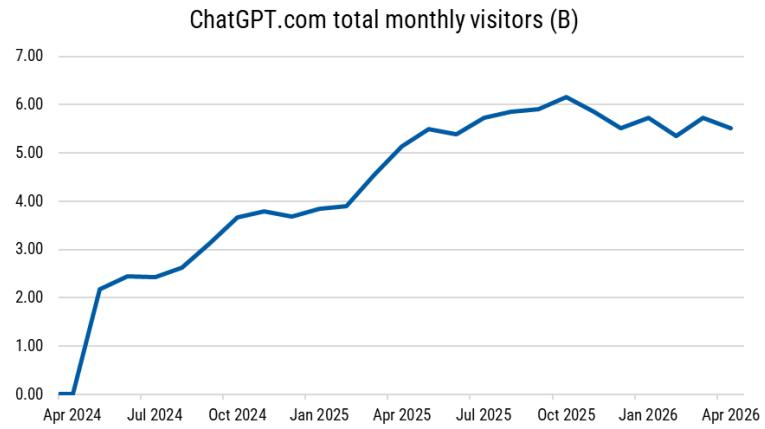

line chart

| Date       | Total Monthly Visitors |
| ---------- | ---------------------- |
| Apr 2024   | 0.00                   |
| Jul 2024   | 2.40                   |
| Oct 2024   | 3.70                   |
| Jan 2025   | 3.80                   |
| Apr 2025   | 5.40                   |
| Jul 2025   | 5.80                   |
| Oct 2025   | 6.10                   |
| Jan 2026   | 5.60                   |
| Apr 2026   | 5.50                   |

GPU vs. ASIC Share Price Movement  
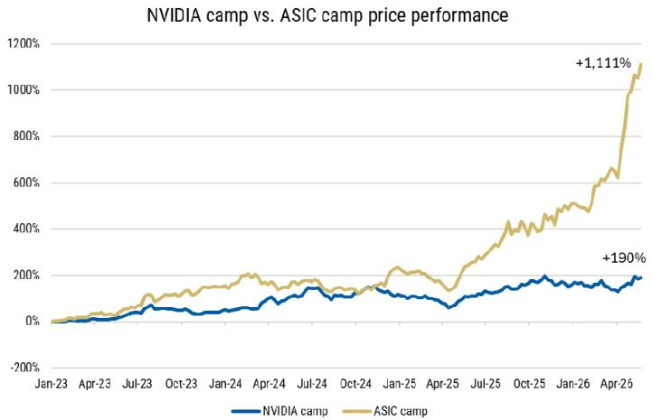

line chart

| Date    | NVIDIA camp | ASIC camp |
|---------|-------------|-----------|
| Apr-26  | +190%       | +1,111%   |

Total Cloud Capex Up Y/Y in CY25-26  
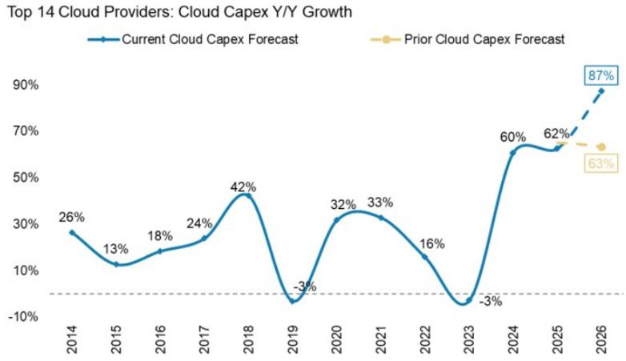

line chart

Top 14 Cloud Providers: Cloud Capex Y/Y Growth
| Year | Current Cloud Capex Forecast (%) | Prior Cloud Capex Forecast (%) |
| :--- | :--- | :--- |
| 2014 | 26 | - |
| 2015 | 13 | - |
| 2016 | 18 | - |
| 2017 | 24 | - |
| 2018 | 42 | - |
| 2019 | -3 | - |
| 2020 | 32 | - |
| 2021 | 33 | - |
| 2022 | 16 | - |
| 2023 | -3 | - |
| 2024 | 60 | - |
| 2025 | 62 | - |
| 2026 | 87 | 63 |

Cloud Capex Could See Upside for CY26  
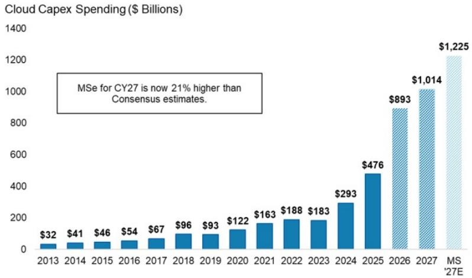

bar chart

Cloud Capex Spending ($ Billions)
| Year | Cloud Capex Spending ($ Billions) |
| :--- | :--- |
| 2013 | 32 |
| 2014 | 41 |
| 2015 | 46 |
| 2016 | 54 |
| 2017 | 67 |
| 2018 | 96 |
| 2019 | 93 |
| 2020 | 122 |
| 2021 | 163 |
| 2022 | 188 |
| 2023 | 183 |
| 2024 | 293 |
| 2025 | 476 |
| 2026 | 893 |
| 2027 | 1,014 |
| MS '27E | 1,225 |
MSe for CY27 is now 21% higher than Consensus estimates.

Source: IDC, MS. MS estimates.

## Agentic AI – Hardware Beneficiaries (ABF Substrates, CPU Sockets, MLCCs)

Every 1M Units of total CPU upside

<table><tr><td>Server CPU ABF Substrate ASP (US$)</td><td>77.8</td></tr><tr><td>Revenue upside to Unimicron per 1M CPUs (US$ M)</td><td>12.6</td></tr><tr><td>Revenue upside to Unimicron per 1M CPUs (NT$ M)</td><td>397</td></tr><tr><td>Unimicron 2026 total revenue estimate (NT$ M)</td><td>169,246</td></tr><tr><td>Unimicron ABF revenue upside per 1M CPUs</td><td>0.2%</td></tr></table>

If CPU TAM grows 10-15M units...

<table><tr><td>Server CPU ABF Substrate ASP (US$)</td><td>77.8</td></tr><tr><td>Revenue upside to Unimicron if CPU TAM grows 10-15M units (US$ M)</td><td>157.6</td></tr><tr><td>Revenue upside to Unimicron if CPU TAM grows 10-15M units (NT$ M)</td><td>4,964</td></tr><tr><td>Unimicron 2026 ABF revenue estimate (NT$ M)</td><td>169,246</td></tr><tr><td>Unimicron ABF revenue upside if CPU TAM grows 10-15M units</td><td>2.9%</td></tr></table>

Every 1M Units of total CPU upside

<table><tr><td>Server CPU Socket ASP (US$)</td><td>21.9</td></tr><tr><td>Revenue upside to Lotes per 1M CPUs (US$ M)</td><td>7.7</td></tr><tr><td>Revenue upside to Lotes per 1M CPUs (NT$ M)</td><td>241</td></tr><tr><td>Lotes 2026 total revenue estimate (NT$ M)</td><td>41,065</td></tr><tr><td>Lotes CPU Socket upside per 1M CPUs</td><td>0.6%</td></tr></table>

If CPU TAM grows 10-15M units...

<table><tr><td>Server CPU Socket ASP (US$)</td><td>21.9</td></tr><tr><td>Revenue upside to Lotes if CPU TAM grows 10-15M units (US$ M)</td><td>95.7</td></tr><tr><td>Revenue upside to Lotes if CPU TAM grows 10-15M units (NT$ M)</td><td>3,015</td></tr><tr><td>Lotes 2026 total revenue estimate (NT$ M)</td><td>41,065</td></tr><tr><td>Lotes CPU Socket upside if CPU TAM grows 10-15M units</td><td>7.3%</td></tr></table>

Every 1M Units of total CPU upside

<table><tr><td>Server CPU Socket ASP (US$)</td><td>21.9</td></tr><tr><td>Revenue upside to FIT per 1M CPUs (US$ M)</td><td>8.8</td></tr><tr><td>FIT 2026 total revenue estimate (US$ M)</td><td>5,483</td></tr><tr><td>FIT CPU Socket upside per 1M CPUs</td><td>0.2%</td></tr></table>

If CPU TAM grows 10-15M units...

<table><tr><td>Server CPU Socket ASP (US$)</td><td>21.9</td></tr><tr><td>Revenue upside to FIT if CPU TAM grows 10-15M units (US$ M)</td><td>109.4</td></tr><tr><td>FIT 2026 ABF revenue estimate (NT$ M)</td><td>5,483</td></tr><tr><td>FIT CPU Socket upside if CPU TAM grows 10-15M units</td><td>2.0%</td></tr></table>

Every 1M Units of total CPU upside

<table><tr><td>Server MLCC Content (US$)</td><td>30.0</td></tr><tr><td>Revenue upside to Yageo per 1M CPUs (US$ M)</td><td>4.5</td></tr><tr><td>Revenue upside to Yageo per 1M CPUs (NT$ M)</td><td>142</td></tr><tr><td>Yageo 2026 total revenue estimate (NT$ M)</td><td>158,893</td></tr><tr><td>Yageo MLCC revenue upside per 1M CPUs</td><td>0.1%</td></tr></table>

If CPU TAM grows 10-15M units...

<table><tr><td>Server MLCC Content (US$)</td><td>30.0</td></tr><tr><td>Revenue upside to Yageo if CPU TAM grows 10-15M units (US$ M)</td><td>56.3</td></tr><tr><td>Revenue upside to Yageo if CPU TAM grows 10-15M units (NT$ M)</td><td>1,772</td></tr><tr><td>Yageo 2026 total revenue estimate (NT$ M)</td><td>158,893</td></tr><tr><td>Yageo MLCC revenue upside if CPU TAM grows 10-15M units</td><td>1.1%</td></tr></table>

Source: MS estimates.

## NVIDIA GPU Roadmap

## Recent updates

- 2025 came in at \~29K racks, and we forecast 70-80K racks for 2026.  
- VR200 rack production is delayed by 1-2 months vs original schedule due to component issues (i.e., Midplane PCB), so rack ramp will start in 4Q26.  
• Quanta should be a share gainer for GB racks in CY26.

<table><tr><td>NVIDIA</td><td>H100</td><td>H200</td><td>B200</td><td>GB200 NVL72</td><td>GB300 NVL72 (RENAMED FROM GB200 Ultra)</td><td>VR200 NVL144</td><td>VR200 NVL144 CPX</td><td>VR300</td></tr><tr><td>Launch timing</td><td>4Q22</td><td>2Q24</td><td>1Q25</td><td>4Q24</td><td>3Q25</td><td>2H26</td><td>End of 2026</td><td>2H27</td></tr><tr><td>CPU</td><td>x86</td><td>x86</td><td>x86</td><td>Grace</td><td>Grace</td><td>Vera</td><td>Vera</td><td>Vera</td></tr><tr><td>Back-end</td><td>CoWoS-S</td><td>CoWoS-S</td><td>CoWoS-L</td><td>CoWoS-L</td><td>CoWoS-L</td><td>CoWoS-L</td><td>CoWoS-L</td><td>CoWoS-L</td></tr><tr><td>GPU Cooling</td><td>Air</td><td>Air &amp; Liquid</td><td>Air &amp; Liquid</td><td>Liquid</td><td>Liquid</td><td>Liquid</td><td>Liquid</td><td>Liquid</td></tr><tr><td>GPU Max TDP</td><td>700W</td><td>700W</td><td>1,000W</td><td>1,200W</td><td>1,400W</td><td>2,300W</td><td>800W</td><td>3,600W</td></tr><tr><td>Product Form Factor</td><td>DGX/HGX 8x GPU PCIe</td><td>DGX/HGX 8x GPU PCIe</td><td>DGX/HGX 8x GPU PCIe</td><td>Oberon GB 2:4 board NVSwitch tray NVL backplane</td><td>Oberon GB 2:4 board NVSwitch tray NVL backplane</td><td>Oberon VR 2:4 board NVSwitch tray NVL backplane</td><td>Oberon VR 2:4 board NVSwitch tray NVL backplane</td><td>Kyber</td></tr><tr><td>GPU Memory</td><td>80/96GB | HBM2e/3 | 8H</td><td>141GB | HBM3e | 8H</td><td>192GB | HBM3e | 8H</td><td>192GB | HBM3e | 8H</td><td>288GB | HBM3e | 8H</td><td>288GB | HBM4 | 8H</td><td>128GB GDDR7</td><td>1TB | HBM4e | 16H</td></tr><tr><td>HBM Vendor</td><td>Hynix</td><td>Hynix/Micron</td><td>Hynix/Micron/Samsung</td><td>Hynix/Micron/Samsung</td><td>Hynix/Micron/Samsung</td><td>Hynix/Micron/Samsung</td><td>Hynix/Micron/Samsung</td><td>Hynix/Micron/Samsung</td></tr><tr><td>NVLink B/W per GPU</td><td>900GB/s</td><td>900GB/s</td><td>1,800 GB/s</td><td>1,800 GB/s</td><td>1,800 GB/s</td><td>3,600 GB/s</td><td>3,600 GB/s</td><td>3,600 GB/s</td></tr><tr><td>CPU-GPU Interface</td><td>128 GB/s PCIe5</td><td>128 GB/s PCIe5</td><td>128 GB/s PCIe5</td><td>450 GB/s C2C</td><td>450 GB/s C2C</td><td>1.8TB/s C2C</td><td>1.8TB/s C2C</td><td>1.8TB/s C2C</td></tr><tr><td>Netw ork Adapter</td><td>400G CX7 | BF3</td><td>400G CX7 | BF3</td><td>400G CX7 | BF3</td><td>400G CX7 | BF3</td><td>800G CX8</td><td>1,600G CX9</td><td>1,600G CX9</td><td>1,600G CX9</td></tr></table>

Source: MS.

## AMD GPU Roadmap

## Recent updates

• MI400-series Helios rack OAM/UBB are produced by Wistron  
- Wiwynn will be the main ODM partner for Meta for MI400-series Helios rack, and should be main beneficiary from Meta/AMD's multi-year, multi-generation partnership to deploy up to 6 gigawatts of AMD Instinct GPUs

<table><tr><td>AMD</td><td>MI250X</td><td>MI300A</td><td>MI300X</td><td>MI325X</td><td>MI350X</td></tr><tr><td>Launch timing</td><td>4Q21</td><td>4Q23</td><td>4Q23</td><td>4Q24</td><td>3Q25</td></tr><tr><td>CPU</td><td>x86</td><td>x86</td><td>x86</td><td>x86</td><td>x86</td></tr><tr><td>Back-end</td><td>SolC + CoWoS-S</td><td>SolC + CoWoS-S</td><td>SolC + CoWoS-S</td><td>SolC + CoWoS-S</td><td>SolC + CoWoS-S</td></tr><tr><td>GPU Cooling</td><td>Air</td><td>Air</td><td>Air</td><td>Air</td><td>Air</td></tr><tr><td>GPU Max TDP</td><td>560W</td><td>760W</td><td>750W</td><td>750W</td><td>750W</td></tr><tr><td>Product Form Factor</td><td>4x GPU</td><td>4x APU</td><td>8x GPU</td><td>8x GPU</td><td>N/A</td></tr><tr><td>GPU Memory</td><td>128GB | HBM2e</td><td>128GB | HBM3</td><td>192GB | HBM3</td><td>288GB | HBM3e</td><td>288GB | HBM3e</td></tr><tr><td>HBM Vendor</td><td>Samsung</td><td>Samsung</td><td>Samsung</td><td>N/A</td><td>N/A</td></tr><tr><td>B/W per GPU</td><td>200GB/s</td><td>384GB/s</td><td>896GB/s</td><td>N/A</td><td>N/A</td></tr><tr><td>CPU-GPU Interface</td><td>64 GB/s PCIe4</td><td>N/A</td><td>128 GB/s PCIe5</td><td>128 GB/s PCIe5</td><td>128 GB/s PCIe5</td></tr></table>

Source: MS estimates.

Owing to recent increase in memory prices, memory will become 25%+ of Rubin BOM  
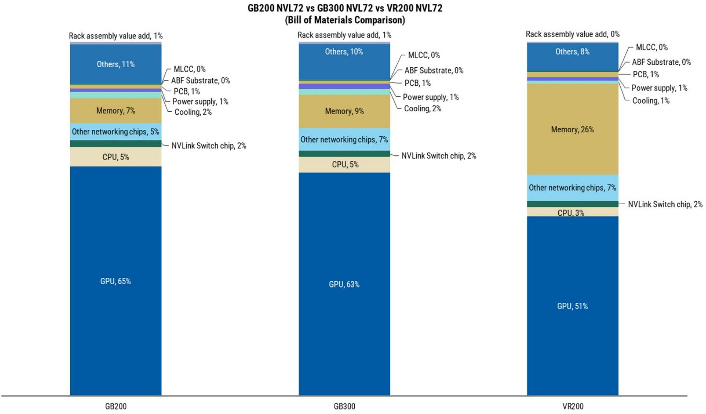

stacked bar chart

| Platform | Component | Percentage (%) |
| --- | --- | --- |
| GB200 | GPU | 65 |
| GB200 | Others | 11 |
| GB200 | Memory | 7 |
| GB200 | Other networking chips | 5 |
| GB200 | NVLink Switch chip | 2 |
| GB300 | GPU | 63 |
| GB300 | Others | 10 |
| GB300 | Memory | 9 |
| GB300 | Other networking chips | 7 |
| GB300 | NVLink Switch chip | 2 |
| VR200 | GPU | 51 |
| VR200 | Others | 8 |
| VR200 | Memory | 26 |
| VR200 | NVLink Switch chip | 2 |
| VR200 | CPU | 3 |
| GB200 | MLCC | 0 |
| GB200 | ABF Substrate | 0 |
| GB200 | PCB | 1 |
| GB200 | Power supply | 1 |
| GB200 | Cooling | 2 |
| GB300 | MLCC | 0 |
| GB300 | ABF Substrate | 0 |
| GB300 | PCB | 1 |
| GB300 | Power supply | 1 |
| GB300 | Cooling | 2 |
| VR200 | MLCC | 0 |
| VR200 | ABF Substrate | 0 |
| VR200 | PCB | 1 |
| VR200 | Power supply | 1 |
| VR200 | Cooling | 1 |
| GB200 | Others | 11 |
| GB300 | Others | 10 |
| VR200 | Others | 8 |
| The chart displays stacked bars representing the percentage contribution of each component to the total processing volume. < | caption_end | > |

Source: MS estimates.

We estimate that a single VR200 NVL72 rack will cost \~US\$7.8M for hyperscalers

<table><tr><td>Nvidia NVL72 Bill of Materials</td><td>GB300</td><td>VR200</td></tr><tr><td>GPU</td><td>$2,520,000</td><td>$3,960,000</td></tr><tr><td>CPU</td><td>$180,000</td><td>$180,000</td></tr><tr><td>NVLink Switch chip</td><td>$64,800</td><td>$144,000</td></tr><tr><td>Other networking chips</td><td>$261,000</td><td>$576,000</td></tr><tr><td>Memory</td><td>$373,939</td><td>$2,001,600</td></tr><tr><td>Cooling</td><td>$64,610</td><td>$72,080</td></tr><tr><td>Power supply</td><td>$57,600</td><td>$76,000</td></tr><tr><td>PCB</td><td>$35,100</td><td>$116,730</td></tr><tr><td>ABF Substrate</td><td>$11,160</td><td>$20,340</td></tr><tr><td>MLCC</td><td>$1,530</td><td>$4,320</td></tr><tr><td>Others</td><td>$402,412</td><td>$623,278</td></tr><tr><td>Rack assembly value add</td><td>$22,400</td><td>$28,800</td></tr><tr><td>Total</td><td>$3,994,551</td><td>$7,803,148</td></tr></table>

<table><tr><td>Diff.</td></tr><tr><td>57%</td></tr><tr><td>0%</td></tr><tr><td>122%</td></tr><tr><td>121%</td></tr><tr><td>435%</td></tr><tr><td>12%</td></tr><tr><td>32%</td></tr><tr><td>233%</td></tr><tr><td>82%</td></tr><tr><td>182%</td></tr><tr><td>55%</td></tr><tr><td>29%</td></tr><tr><td>95%</td></tr></table>

Source: MS estimates.

Our bottom-up analysis shows ODM value-added per rack to increase \~38% for VR200

<table><tr><td>ODM Value-Add per rack</td><td>GB300</td><td>VR200</td></tr><tr><td>Compute Board Assembly/Test</td><td>$12,096</td><td>$16,200</td></tr><tr><td>Compute Tray Assembly/Test</td><td>$28,800</td><td>$32,400</td></tr><tr><td>Switch Board Assembly/Test</td><td>$2,475</td><td>$3,150</td></tr><tr><td>Switch Tray Assembly/Test</td><td>$2,700</td><td>$3,150</td></tr><tr><td>Rack Assembly/Test</td><td>$22,400</td><td>$28,800</td></tr><tr><td>BF DPU Assembly/Test</td><td>$1,170</td><td>$1,170</td></tr><tr><td>CX/Orchid Module Assembly/Test</td><td>$0</td><td>$3,600</td></tr><tr><td>Other peripheral boards</td><td>$3,150</td><td>$1,260</td></tr><tr><td>Cooling components</td><td>$12,922</td><td>$14,416</td></tr><tr><td>Others</td><td>$22,500</td><td>$45,500</td></tr><tr><td>Total ODM Value-Add</td><td>$108,213</td><td>$149,646</td></tr></table>

Source: MS estimates.

Our bottom-up analysis shows PCB content increasing \~233% for VR200

<table><tr><td>PCB ASP per board (US$)</td><td>GB300</td><td>VR200</td></tr><tr><td>Compute PCB</td><td>$650</td><td>$1,400</td></tr><tr><td>Switch PCB</td><td>$800</td><td>$1,450</td></tr><tr><td>Midplane PCB</td><td>$0</td><td>$1,500</td></tr><tr><td>BlueField PCB</td><td>$0</td><td>$255</td></tr><tr><td>ConnectX PCB</td><td>$0</td><td>$270</td></tr><tr><td>Other peripheral PCB</td><td>$50</td><td>$50</td></tr><tr><td>PCB Units per rack</td><td>GB300</td><td>VR200</td></tr><tr><td>Compute PCB</td><td>36x</td><td>36x</td></tr><tr><td>Switch PCB</td><td>9x</td><td>9x</td></tr><tr><td>Midplane PCB</td><td>0x</td><td>18x</td></tr><tr><td>BlueField PCB</td><td>18x</td><td>18x</td></tr><tr><td>ConnectX PCB</td><td>0x</td><td>72x</td></tr><tr><td>Other peripheral PCB</td><td>90x</td><td>45x</td></tr><tr><td>Total PCB Content per rack</td><td>GB300</td><td>VR200</td></tr><tr><td>Compute PCB</td><td>$23,400</td><td>$50,400</td></tr><tr><td>Switch PCB</td><td>$7,200</td><td>$13,050</td></tr><tr><td>Midplane PCB</td><td>$0</td><td>$27,000</td></tr><tr><td>BlueField PCB</td><td>$0</td><td>$4,590</td></tr><tr><td>ConnectX PCB</td><td>$0</td><td>$19,440</td></tr><tr><td>Other peripheral PCB</td><td>$4,500</td><td>$2,250</td></tr><tr><td>Total PCB Content per rack</td><td>$35,100</td><td>$116,730</td></tr></table>

Source: MS estimates.

## Our bottom-up analysis shows MLCC content increasing \~182% for VR200

<table><tr><td>MLCC content per board (US$)</td><td>GB300</td><td>VR200</td></tr><tr><td>Compute PCB</td><td>$25</td><td>$90</td></tr><tr><td>Switch PCB</td><td>$20</td><td>$45</td></tr><tr><td>BlueField DPU Module</td><td>$5</td><td>$5</td></tr><tr><td>ConnectX Orchid Module</td><td>$5</td><td>$5</td></tr><tr><td>Other peripheral PCB</td><td>$5</td><td>$5</td></tr><tr><td>Units per rack</td><td>GB300</td><td>VR200</td></tr><tr><td>Compute PCB</td><td>36x</td><td>36x</td></tr><tr><td>Switch PCB</td><td>9x</td><td>9x</td></tr><tr><td>BlueField DPU Module</td><td>0x</td><td>18x</td></tr><tr><td>ConnectX Orchid Module</td><td>0x</td><td>72x</td></tr><tr><td>Other peripheral PCB</td><td>90x</td><td>45x</td></tr><tr><td>Total MLCC Content per rack</td><td>GB300</td><td>VR200</td></tr><tr><td>Compute PCB</td><td>$900</td><td>$3,240</td></tr><tr><td>Switch PCB</td><td>$180</td><td>$405</td></tr><tr><td>BlueField DPU Module</td><td>$0</td><td>$90</td></tr><tr><td>ConnectX Orchid Module</td><td>$0</td><td>$360</td></tr><tr><td>Other peripheral PCB</td><td>$450</td><td>$225</td></tr><tr><td>Total MLCC Content per rack</td><td>$1,530</td><td>$4,320</td></tr></table>

Source: MS estimates.

Our bottom-up analysis shows ABF substrate content increasing \~82% for VR200

<table><tr><td>ABF Substrate ASP per chip (US$)</td><td>GB300</td><td>VR200</td></tr><tr><td>GPU</td><td>$100</td><td>$200</td></tr><tr><td>CPU</td><td>$50</td><td>$60</td></tr><tr><td>NVSwitch ASIC</td><td>$30</td><td>$30</td></tr><tr><td>BlueField DPU</td><td>$30</td><td>$30</td></tr><tr><td>ConnectX chip</td><td>$30</td><td>$30</td></tr><tr><td>ABF Units per rack</td><td>GB300</td><td>VR200</td></tr><tr><td>GPU</td><td>72x</td><td>72x</td></tr><tr><td>CPU</td><td>36x</td><td>36x</td></tr><tr><td>NVSwitch ASIC</td><td>18x</td><td>36x</td></tr><tr><td>BlueField DPU</td><td>18x</td><td>18x</td></tr><tr><td>ConnectX chip</td><td>36x</td><td>72x</td></tr><tr><td>Total ABF Content per rack</td><td>GB300</td><td>VR200</td></tr><tr><td>GPU</td><td>$7,200</td><td>$14,400</td></tr><tr><td>CPU</td><td>$1,800</td><td>$2,160</td></tr><tr><td>NVSwitch ASIC</td><td>$540</td><td>$1,080</td></tr><tr><td>BlueField DPU</td><td>$540</td><td>$540</td></tr><tr><td>ConnectX chip</td><td>$1,080</td><td>$2,160</td></tr><tr><td>Total ABF Content per rack</td><td>$11,160</td><td>$20,340</td></tr></table>

Source: MS estimates.

## Our bottom-up analysis shows cooling component content increasing $\sim 12\%$ for VR200

<table><tr><td colspan="3">Thermal value per Vera Rubin NVL 144 rack</td></tr><tr><td></td><td></td><td></td></tr><tr><td>Compute tray (Bianca)</td><td>unit</td><td>BoM (US$)</td></tr><tr><td>Cold plate module - Compute Board</td><td></td><td>$ 400</td></tr><tr><td>- # per compute tray</td><td>2</td><td>$ 800</td></tr><tr><td>NVQD</td><td></td><td>$ 20</td></tr><tr><td>- # per compute tray</td><td>4</td><td>$ 80</td></tr><tr><td>Tray manifold</td><td></td><td>$ 1,000</td></tr><tr><td>Cold plate module - Bottom Half</td><td></td><td>$ 150</td></tr><tr><td>- # per compute tray</td><td>3</td><td>$ 450</td></tr><tr><td>NVQD</td><td></td><td>$ 20</td></tr><tr><td>- # per compute tray</td><td>16</td><td>$ 320</td></tr><tr><td>Floating mount</td><td></td><td>50</td></tr><tr><td>- # per compute tray</td><td>2</td><td>$ 100</td></tr><tr><td>Thermal value per compute tray</td><td></td><td>$ 2,750</td></tr><tr><td>- # of compute tray per rack</td><td>18</td><td></td></tr><tr><td>Thermal value for compute tray per rack</td><td></td><td>$ 49,500</td></tr><tr><td></td><td></td><td></td></tr><tr><td>Switch tray</td><td>unit</td><td>BoM (US$)</td></tr><tr><td>Cold plate module</td><td></td><td>$ 200</td></tr><tr><td>- # per switch tray</td><td>2</td><td>$ 400</td></tr><tr><td>NVQD</td><td></td><td>$ 20</td></tr><tr><td>- # per compute tray</td><td>18</td><td>$ 360</td></tr><tr><td>Floating mount</td><td></td><td>50</td></tr><tr><td>- # per compute tray</td><td>2</td><td>$ 100</td></tr><tr><td>Others</td><td></td><td>$ 60</td></tr><tr><td>Thermal value per compute tray</td><td></td><td>$ 920</td></tr><tr><td>- # of switch tray per rack</td><td>9</td><td></td></tr><tr><td>Thermal value for switch tray per rack</td><td></td><td>$ 8,280</td></tr><tr><td>total thermal content value per rack</td><td></td><td>$ 57,780</td></tr></table>

Source: MS estimates.

<table><tr><td>Cooling content (US$)</td><td>GB300</td><td>VR200</td></tr><tr><td>Cooling (In-tray only)</td><td>$50,310</td><td>$57,780</td></tr><tr><td>Rack Manifold</td><td>$13,500</td><td>$13,500</td></tr><tr><td>Rack-level other cooling</td><td>$800</td><td>$800</td></tr><tr><td>Total cooling (ex-Side-car CDU)</td><td>$64,610</td><td>$72,080</td></tr><tr><td>Side-car CDU</td><td>$50,000</td><td>$50,000</td></tr><tr><td>Total cooling</td><td>$114,610</td><td>$122,080</td></tr></table>

## Our bottom-up analysis shows power supply content increasing \~32% for VR200

<table><tr><td>Server power supply design</td><td colspan="4">Power shelf</td><td colspan="2">HVDC Standalone power rack</td></tr><tr><td>AC-DC conversion</td><td>400V AC &gt;&gt; 50V DC</td><td>400V AC &gt;&gt; 50V DC</td><td>400V AC &gt;&gt; 50V DC</td><td>400V AC &gt;&gt; 50V DC</td><td>400V AC &gt;&gt; 800V DC</td><td>400V AC &gt;&gt; 800V DC</td></tr><tr><td>Nvidia AI GPU generation</td><td>GB200</td><td>GB300</td><td>GB300</td><td>Vera Rubin</td><td>Vera Rubin CPX version</td><td>Vera Rubin Ultra</td></tr><tr><td>Nvidia AI server rack architecture</td><td>Oberon</td><td>Oberon</td><td>Oberon</td><td>Oberon</td><td>Oberon</td><td>Kyber</td></tr><tr><td>Power wattage per server rack</td><td>120kW</td><td>140kW</td><td>140kW</td><td>200kW+</td><td>380kW+</td><td>600kW</td></tr><tr><td>Power wattage per PSU</td><td>5.5kW</td><td>8kW</td><td>12kW</td><td>18.3kW</td><td>18.3kW</td><td>30kW</td></tr><tr><td>Power value per AI server rack</td><td>US$36,000 (x)</td><td>US$57,600</td><td>US$69,120</td><td>US$76,000</td><td>US$398,160</td><td>&gt;10x</td></tr><tr><td>Power value per watt</td><td>US$0.3</td><td>US$0.41</td><td>US$0.49</td><td>US$0.38</td><td>US$1.05</td><td>...</td></tr></table>

Source: MS estimates.

## We Forecast 2026e GB200/300 Racks To Be 70-80K

GB200/300 NVL72-equivalent monthly rack output  
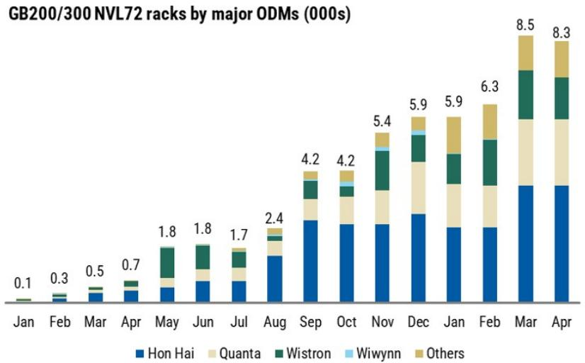

stacked bar chart

GB200/300 NVL72 racks by major ODMs (000s)
| Month | Hon Hai | Quanta | Wistron | Wiwynn | Others |
|---|---|---|---|---|---|
| Jan | 0.1 | 0.0 | 0.1 | 0.0 | 0.0 |
| Feb | 0.3 | 0.1 | 0.2 | 0.0 | 0.0 |
| Mar | 0.5 | 0.1 | 0.2 | 0.1 | 0.0 |
| Apr | 0.7 | 0.2 | 0.3 | 0.1 | 0.1 |
| May | 1.8 | 0.4 | 1.6 | 0.1 | 0.0 |
| Jun | 1.8 | 0.4 | 1.6 | 0.1 | 0.1 |
| Jul | 1.7 | 0.4 | 1.2 | 0.1 | 0.1 |
| Aug | 2.4 | 0.6 | 0.4 | 0.2 | 0.1 |
| Sep | 4.2 | 1.2 | 1.2 | 0.3 | 0.2 |
| Oct | 4.2 | 1.4 | 0.6 | 0.3 | 0.3 |
| Nov | 5.4 | 1.8 | 2.4 | 0.5 | 0.3 |
| Dec | 5.9 | 2.4 | 1.4 | 0.3 | 0.5 |
| Jan | 5.9 | 2.4 | 1.6 | 0.3 | 1.4 |
| Feb | 6.3 | 2.4 | 2.4 | 0.3 | 1.4 |
| Mar | 8.5 | 3.6 | 2.4 | 0.3 | 1.4 |
| Apr | 8.3 | 3.6 | 2.4 | 0.3 | 1.4 |

GB200/300 rack supply share by major ODMs (2026e)

GB200/300 NVL72-equivalent rack supply share (2026)  
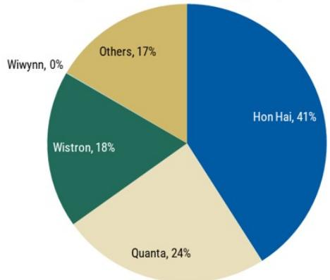

pie chart

| Category | Percentage (%) |
| :--- | :--- |
| Hon Hai | 41 |
| Quanta | 24 |
| Wistron | 18 |
| Others | 17 |
| Wiwynn | 0 |

Source: MS estimates (e).

GB200/300 NVL72-equivalent quarterly rack output (2026e)  
GB200/300 NVL72 racks by major ODMs (000s)  
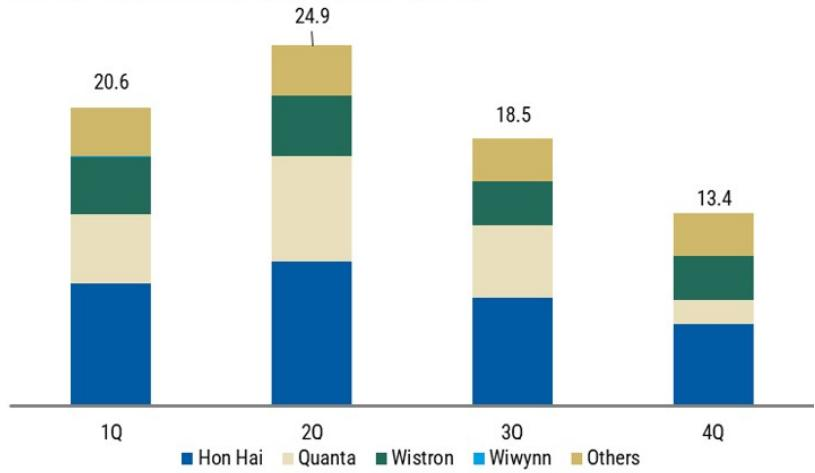

stacked bar chart

| Category | Hon Hai | Quanta | Wistron | Wiwynn | Others |
| :--- | :--- | :--- | :--- | :--- | :--- |
| 1Q | 8.0 | 4.0 | 3.0 | 0.0 | 2.6 |
| 2Q | 9.0 | 5.0 | 3.0 | 0.0 | 2.9 |
| 3Q | 7.0 | 4.0 | 2.0 | 0.0 | 2.5 |
| 4Q | 6.0 | 1.0 | 2.0 | 0.0 | 3.4 |

GB200/300 rack demand share (2026e)

Nvidia GB200/300 server demand share, 2026e  
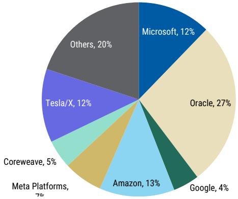

pie chart

| Company | Share (%) |
| :--- | :--- |
| Microsoft | 12 |
| Oracle | 27 |
| Google | 4 |
| Amazon | 13 |
| Meta Platforms | 7 |
| Coreweave | 5 |
| Tesla/X | 12 |
| Others | 20 |

## TSMC May Expand CoWoS Capacity to 165Kwpm by 2027 Given Strong AI Demand

CoWoS Supply Capacity Breakdown (By Year End)  
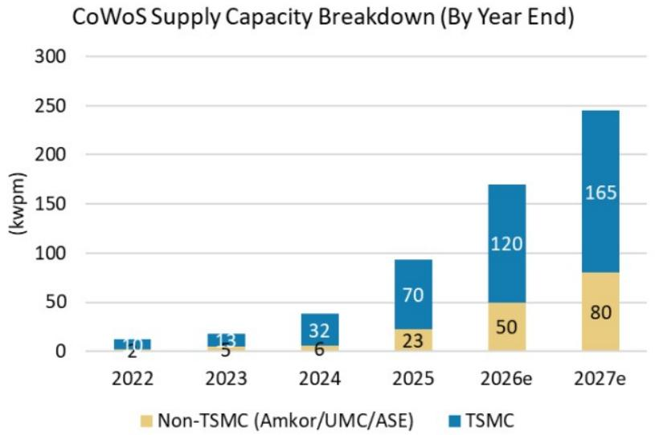

stacked bar chart

CoWoS Supply Capacity Breakdown (By Year End)
| Year | Non-TSMC (Amkor/UMC/ASE) (kwpm) | TSMC (kwpm) |
| :--- | :--- | :--- |
| 2022 | 2 | 10 |
| 2023 | 5 | 13 |
| 2024 | 6 | 32 |
| 2025 | 23 | 70 |
| 2026e | 50 | 120 |
| 2027e | 80 | 165 |

Global CoWoS Capacity Demand by Key Customer  
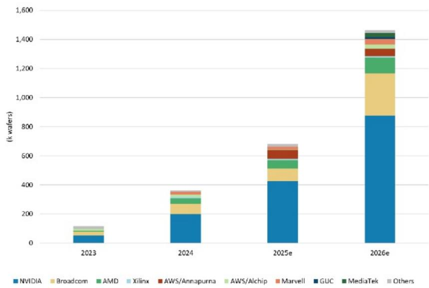

stacked bar chart

| Year | NVIDIA (k wafers) | Broadcom (k wafers) | AMD (k wafers) | Xilinx (k wafers) | AWS/Annapurna (k wafers) | AWS/Alchip (k wafers) | Marvell (k wafers) | GUC (k wafers) | MediaTek (k wafers) | Others (k wafers) |
|---|---|---|---|---|---|---|---|---|---|---|
| 2023 | 40 | 10 | 10 | 10 | 10 | 10 | 0 | 0 | 0 | 10 |
| 2024 | 200 | 80 | 50 | 0 | 10 | 0 | 10 | 0 | 0 | 10 |
| 2025e | 420 | 120 | 70 | 0 | 50 | 0 | 30 | 0 | 0 | 20 |
| 2026e | 870 | 250 | 120 | 0 | 60 | 0 | 40 | 30 | 30 | 10 |

Source: Company data, TrendForce, MS estimates (e).

## AI Computing Wafer Consumption Could Rise to US\$26B in CY26

Al semi wafer consumption, by customer, 2025e  
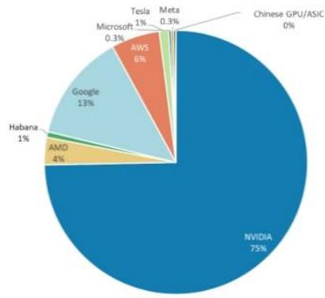

pie chart

| Company | Share (%) |
| :--- | :--- |
| NVIDIA | 75 |
| Google | 13 |
| AMD | 4 |
| Habana | 1 |
| Microsoft | 0.3 |
| Tesla | 1 |
| Meta | 0.3 |
| Chinese GPU/ASIC | 0 |

Al semi wafer consumption, by customer, 2026e  
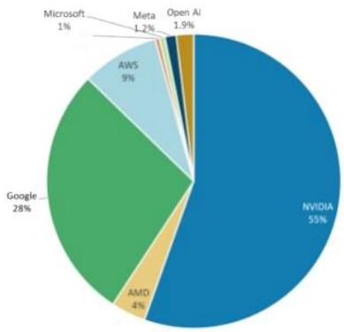

pie chart

| Company | Share (%) |
| :--- | :--- |
| NVIDIA | 55 |
| Google | 28 |
| AMD | 4 |
| AWS | 9 |
| Microsoft | 1 |
| Meta | 1.2 |
| Open AI | 1.9 |

<table><tr><td>AI chip vendor</td><td>Product name</td><td>CoWoS capacity allocation (k wafers)</td><td>Chips per CoWoS wafer</td><td>Implied shipments (k)</td><td>Compute die size</td><td>Geometry</td><td>Compute die units</td><td>Wafer consumption (k wafers)</td><td>Wafer price (US$)</td><td>Wafer revenue TAM (US$ mn)</td><td>Backend revenue (US$ mn)</td></tr><tr><td colspan="12">AI GPU (2026e)</td></tr><tr><td rowspan="3">NVIDIA</td><td>B300</td><td>390</td><td>14</td><td>5,460</td><td>850</td><td>4nm</td><td>2</td><td>433</td><td>21,945</td><td>9,510</td><td>8,241</td></tr><tr><td>Rubin R200</td><td>260</td><td>8</td><td>2,080</td><td>850</td><td>3nm</td><td>2</td><td>165</td><td>26,000</td><td>4,292</td><td>5,494</td></tr><tr><td>H200</td><td>75</td><td>27</td><td>2,025</td><td>814</td><td>4nm</td><td>1</td><td>57</td><td>21,945</td><td>1,243</td><td>1,275</td></tr><tr><td rowspan="3">AMD</td><td>MI300</td><td>3</td><td>12</td><td>36</td><td>110</td><td>5nm</td><td>8</td><td>1</td><td>18,000</td><td>19</td><td>79</td></tr><tr><td>MI350/375</td><td>7</td><td>12</td><td>84</td><td>110</td><td>3nm</td><td>8</td><td>2</td><td>26,000</td><td>64</td><td>194</td></tr><tr><td>MI400</td><td>65</td><td>10</td><td>650</td><td>110</td><td>2nm</td><td>8</td><td>32</td><td>28,125</td><td>886</td><td>1,805</td></tr><tr><td colspan="12">AI ASIC (2026e)</td></tr><tr><td rowspan="3">Google</td><td>TPU v7p (Ironwood)</td><td>145</td><td>16</td><td>2,320</td><td>700</td><td>3nm</td><td>2</td><td>152</td><td>26,000</td><td>3,942</td><td>3,327</td></tr><tr><td>TPU v7e (Sunfish; AVGO)</td><td>80</td><td>12</td><td>960</td><td>800</td><td>3nm</td><td>2</td><td>72</td><td>26,000</td><td>1,864</td><td>1,835</td></tr><tr><td>TPU v8 (Zebrafish;MediaTek)</td><td>30</td><td>20</td><td>600</td><td>800</td><td>3nm</td><td>2</td><td>45</td><td>26,000</td><td>1,165</td><td>688</td></tr><tr><td rowspan="2">AWS</td><td>Trainium 2.5</td><td>20</td><td>16</td><td>320</td><td>600</td><td>5nm</td><td>2</td><td>12</td><td>20,000</td><td>237</td><td>411</td></tr><tr><td>Trainium 3</td><td>80</td><td>17</td><td>1,360</td><td>700</td><td>3nm</td><td>2</td><td>73</td><td>26,000</td><td>1,886</td><td>1,642</td></tr><tr><td rowspan="2">Microsoft</td><td>Maia 200</td><td>4</td><td>29</td><td>116</td><td>700</td><td>3nm</td><td>1</td><td>3.0</td><td>26,000</td><td>79</td><td>87</td></tr><tr><td>Maia 300</td><td>5</td><td>11</td><td>55</td><td>850</td><td>2nm</td><td>1</td><td>2.9</td><td>28,125</td><td>82</td><td>109</td></tr><tr><td>Meta</td><td>MTIA 3 (Iris)</td><td>15</td><td>10</td><td>150</td><td>850</td><td>3nm</td><td>2</td><td>11.9</td><td>26,000</td><td>310</td><td>1</td></tr><tr><td colspan="2">Total</td><td>1,434</td><td></td><td></td><td></td><td></td><td></td><td>1,084</td><td></td><td>26,159</td><td>25,219</td></tr></table>

Source: MS estimates.

## More ASIC Projects Are Coming, According to Each CSP Plan

<table><tr><td>k Units</td><td>2023</td><td>2024</td><td>2025e</td><td>2026e</td><td>2027e</td><td>2028e</td></tr><tr><td>v5</td><td>500</td><td>2,400</td><td>250</td><td></td><td></td><td></td></tr><tr><td>v6 (Trillium)</td><td></td><td></td><td>1,000</td><td></td><td></td><td></td></tr><tr><td>v7 (Ironwood, by Broadcom)</td><td></td><td></td><td>500</td><td>2,300</td><td>500</td><td></td></tr><tr><td>v8i (Sunfish; 3nm, by Broadcom)</td><td></td><td></td><td></td><td>900</td><td>3,000</td><td>2,500</td></tr><tr><td>v8t (Zebrafish; 3nm, by MediaTek)</td><td></td><td></td><td></td><td>500</td><td>2,500</td><td>1,000</td></tr><tr><td>v9 (Humufish; 2nm, by MediaTek)</td><td></td><td></td><td></td><td></td><td>150</td><td>2,500</td></tr><tr><td>v9a (Merope; 2nm, by US design service)</td><td></td><td></td><td></td><td></td><td></td><td>unknown</td></tr><tr><td>v10 (Icefish; 1.4nm, by MediaTek)</td><td></td><td></td><td></td><td></td><td></td><td>unknown</td></tr><tr><td>Total</td><td>500</td><td>2,400</td><td>1,750</td><td>3,700</td><td>6,150</td><td>&gt;6000</td></tr></table>

Source: MS estimates.

## ODMs Have Underperformed YTD

ODM Cohort Has Underperformed TAIEX by 30ppts YTD  
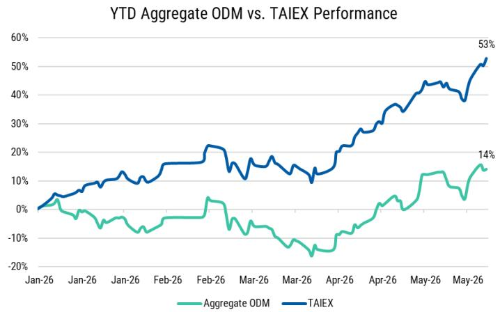

line chart

| Month   | Aggregate ODM | TAIEX |
|---------|---------------|-------|
| May-26  | 14%           | 53%   |

YTD Price Performance – Individual ODMs vs TAIEX

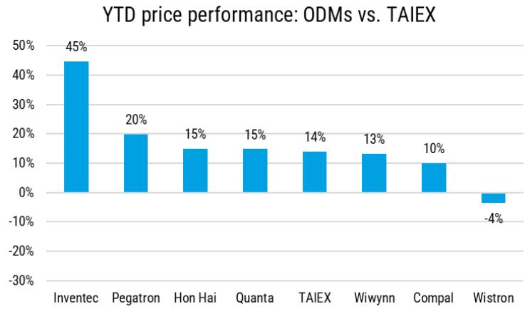

bar chart

YTD price performance: ODMs vs. TAIEX
| Company | YTD Price Performance (%) |
| :--- | :--- |
| Inventec | 45 |
| Pegatron | 20 |
| Hon Hai | 15 |
| Quanta | 15 |
| TAIEX | 14 |
| Wiwynn | 13 |
| Compal | 10 |
| Wistron | -4 |

Source: MS.

ODM Cohort Is Trading At Avg Historical P/E  
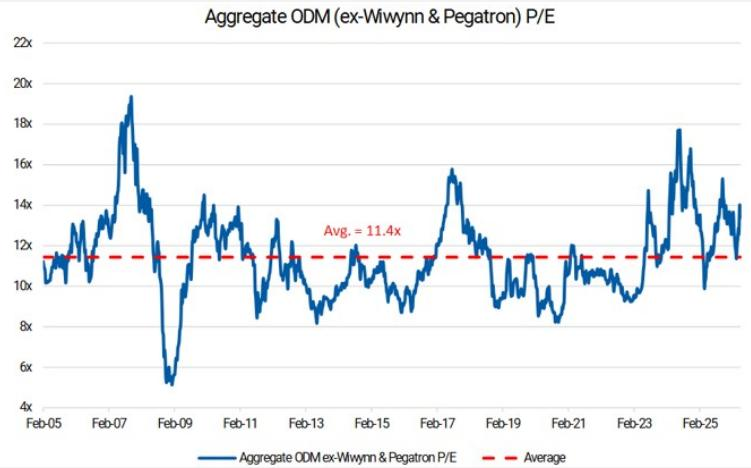

line chart

| Date    | Aggregate ODM ex-Wiwynn & Pegatron P/E |
|---------|----------------------------------------|
| Avg.    | 11.4x                                  |

...While Revenue Continues to Grow y/y

Key ODM Quarterly Revenue in C1Q25-1Q26 (NT\$ B)  
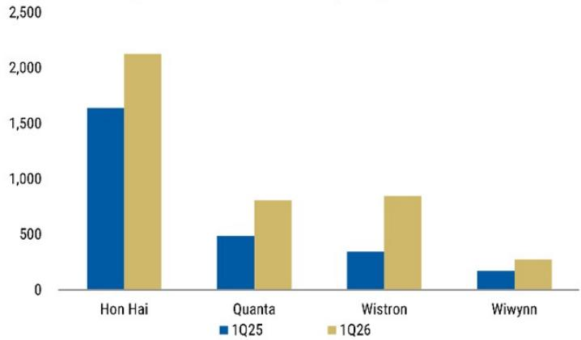

bar chart

| Company | 1Q25 | 1Q26 |
|---|---|---|
| Hon Hai | 1650 | 2150 |
| Quanta | 480 | 800 |
| Wistron | 330 | 850 |
| Wiwynn | 150 | 270 |

Wistron Is a Share Winner from VR200 Onward as Well as MI400-series  
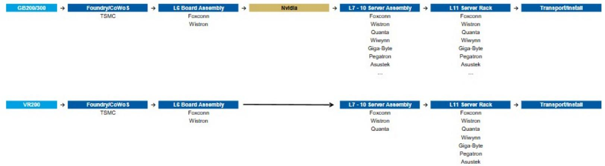

flowchart

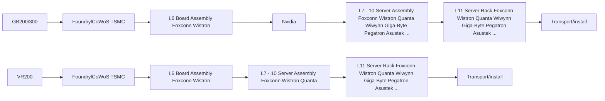
```mermaid
graph LR
  A["GB200/300"] --> B["FoundrylCoWoS TSMC"]
  B --> C["L6 Board Assembly Foxconn Wistron"]
  C --> D["Nvidia"]
  D --> E["L7 - 10 Server Assembly Foxconn Wistron Quanta Wiwynn Giga-Byte Pegatron Asustek ..."]
  E --> F["L11 Server Rack Foxconn Wistron Quanta Wiwynn Giga-Byte Pegatron Asustek ..."]
  F --> G["Transport/install"]
    
  H["VR200"] --> I["FoundrylCoWoS TSMC"]
  I --> J["L6 Board Assembly Foxconn Wistron"]
  J --> K["L7 - 10 Server Assembly Foxconn Wistron Quanta"]
  K --> L["L11 Server Rack Foxconn Wistron Quanta Wiwynn Giga-Byte Pegatron Asustek ..."]
  L --> M["Transport/install"]
```

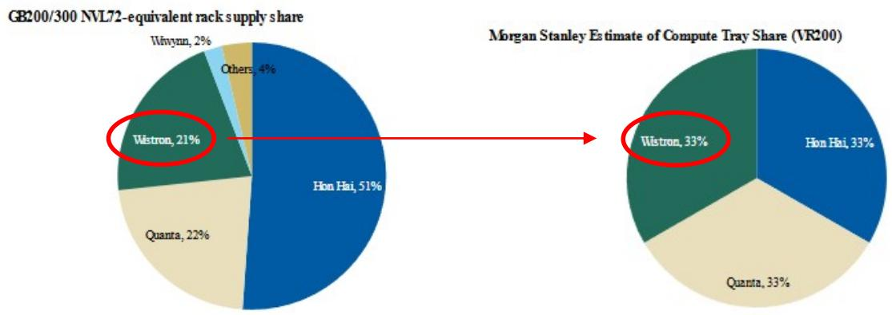

pie chart

GB200/300 NVL72-equivalent rack supply share
| Provider | Share (%) |
| :--- | :--- |
| Hon Hai | 51 |
| Wistron | 21 |
| Quanta | 22 |
| Others | 4 |

| Mortgage Estimate of Compute Tray Share (VR200) | Share (%) |
|--- |---|
| Hon Hai | 33 |
| Quanta | 33 |
| Wistron | 33 |
| Others | 4 |

Wistron Sensitivity Analysis for GB300

<table><tr><td colspan="2">EPS contribution</td><td colspan="6">Rack shipment (000s)</td></tr><tr><td rowspan="7">Rack ASP (US$ M)</td><td></td><td>1</td><td>2</td><td>3</td><td>4</td><td>5</td><td>6</td></tr><tr><td>2.6</td><td>0.36</td><td>0.73</td><td>1.09</td><td>1.46</td><td>1.82</td><td>2.18</td></tr><tr><td>2.8</td><td>0.39</td><td>0.78</td><td>1.18</td><td>1.57</td><td>1.96</td><td>2.35</td></tr><tr><td>3.0</td><td>0.42</td><td>0.84</td><td>1.26</td><td>1.68</td><td>2.10</td><td>2.52</td></tr><tr><td>3.2</td><td>0.45</td><td>0.90</td><td>1.34</td><td>1.79</td><td>2.24</td><td>2.69</td></tr><tr><td>3.4</td><td>0.48</td><td>0.95</td><td>1.43</td><td>1.90</td><td>2.38</td><td>2.85</td></tr><tr><td>3.6</td><td>0.50</td><td>1.01</td><td>1.51</td><td>2.01</td><td>2.52</td><td>3.02</td></tr></table>

AI Server Rack-Equivalent Forecast (k units)  
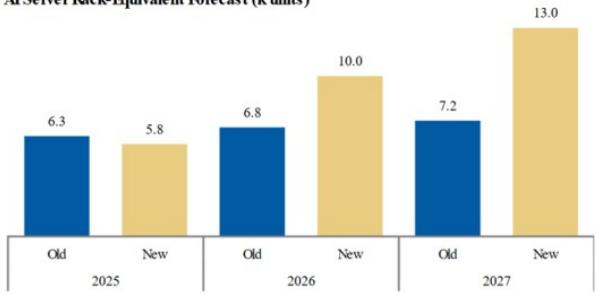

bar chart

2025E Oil Equivalent Production (Millions)
| Year | Old (m) | New (m) |
| :--- | :--- | :--- |
| 2025 | 6.3 | 5.8 |
| 2026 | 6.8 | 10.0 |
| 2027 | 7.2 | 13.0 |

Source: NVIDIA, MS.

## Suppliers with Integration Capability and Proven Shipment Record Stand Out

## Liquid cooling solution supply dynamics for GB200 server rack system

Cooling Facility providers

Vertiv Schneider Electric CoolIT

Integrated liquid cooling rack solution

Delta
Lite-on Tech
Cooler Master
Motivair
AVC
Auras
BOYD

OEM

OEM
Supermicro ← → Auras, Kaori, Nidec and Abelcom
DELL ← → Foxconn, Wistron
HPE

ODM

Total Solutions Foxconn Quanta

Partnership Thermal Partners
Wistron MG Cooling, AVC
Wiwynn Auras, Zutacore
Gigabyte CoolIT, Motivair, nVent
ZT Systems/Inventec AVC, Vertiv, Auras

## GB200 / ASIC server rack ODM partners

<table><tr><td>GB200/300</td><td>ODM Partner(s)</td></tr><tr><td>Microsoft</td><td>Foxconn/Quanta</td></tr><tr><td>Oracle</td><td>Foxconn/Wistron/Wiwynn/Quanta</td></tr><tr><td>Google</td><td>Quanta/Foxconn/Inventec</td></tr><tr><td>Amazon</td><td>Quanta/Foxconn</td></tr><tr><td>Meta Platforms</td><td>Quanta/Foxconn</td></tr><tr><td>Dell</td><td>Wistron</td></tr><tr><td>HPE</td><td>Foxconn/Wistron</td></tr><tr><td>Others</td><td>SMCI / etc</td></tr></table>

<table><tr><td>ASIC</td><td>ODM Partner(s)</td></tr><tr><td>Amazon</td><td>Wiwynn/Jabil</td></tr><tr><td>Google</td><td>Celestica/Foxconn/Inventec</td></tr><tr><td>Meta Platforms</td><td>Quanta/Celestica/Wiwynn</td></tr></table>

ABF Substrate: We Are Entering the AI Diffusion Era  
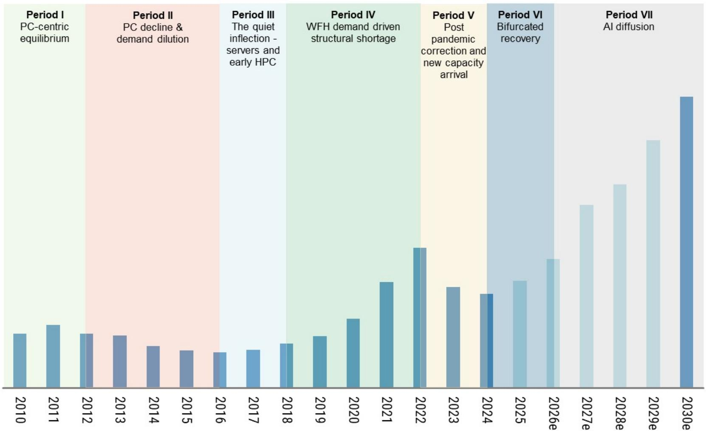

bar chart

| Year | Value |
|---|---|
| 2010 | 4.5 |
| 2011 | 6.0 |
| 2012 | 5.5 |
| 2013 | 5.8 |
| 2014 | 4.2 |
| 2015 | 3.8 |
| 2016 | 3.5 |
| 2017 | 3.7 |
| 2018 | 4.0 |
| 2019 | 4.8 |
| 2020 | 6.5 |
| 2021 | 8.5 |
| 2022 | 10.5 |
| 2023 | 8.0 |
| 2024 | 7.5 |
| 2025 | 8.5 |
| 2026e | 9.5 |
| 2027e | 11.0 |
| 2028e | 13.5 |
| 2029e | 16.5 |
| 2030e | 19.5 |

Source: Company data, MS estimates.

ABF Substrate Body Size and Layer Count Continues to Increase  
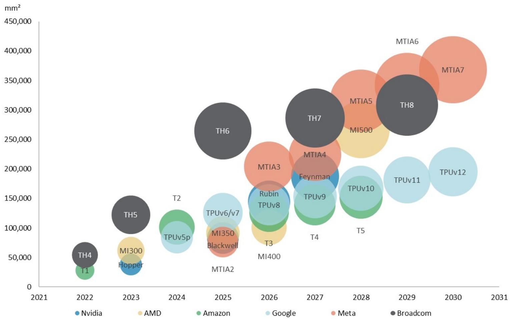

bubble chart

| Year | Company | Value (mm²) | Bubble Size |
| --- | --- | --- | --- |
| 2022 | Hopper | ~35,000 | Small |
| 2023 | MI300 | ~65,000 | Medium |
| 2023 | Hopper | ~40,000 | Small |
| 2024 | TPUv5p | ~80,000 | Small |
| 2024 | TPUv6/v7 | ~120,000 | Medium |
| 2025 | Blackwell | ~90,000 | Small |
| 2025 | MTIA2 | ~110,000 | Small |
| 2025 | MTIA3 | ~180,000 | Medium |
| 2025 | MTIA4 | ~230,000 | Medium |
| 2025 | MTIA5 | ~290,000 | Medium |
| 2025 | MTIA6 | ~360,000 | Medium |
| 2025 | MTIA7 | ~380,000 | Medium |
| 2025 | TH6 | ~260,000 | Large |
| 2026 | TPUv8 | ~130,000 | Medium |
| 2026 | TPUv9 | ~140,000 | Medium |
| 2026 | TPUv10 | ~150,000 | Medium |
| 2026 | TPUv11 | ~170,000 | Medium |
| 2026 | TPUv12 | ~185,000 | Medium |
| 2027 | Feynman | ~195,000 | Medium |
| 2027 | TH7 | ~315,000 | Large |
| 2027 | TH8 | ~315,000 | Large |
| 2027 | MTIA4 | ~245,000 | Medium |
| 2027 | MTIA5 | ~345,000 | Medium |
| 2027 | MTIA6 | ~375,000 | Medium |
| 2027 | MTIA7 | ~415,000 | Medium |
| 2027 | TH4 | ~45,000 | Small |
| 2028 | AMD | ~255,000 | Medium |
| 2028 | AMD | ~195,000 | Medium |
| 2028 | AMD | ~185,000 | Medium |
| 2028 | AMD | ~175,000 | Medium |
| 2028 | AMD | ~165,000 | Medium |
| 2028 | AMD | ~155,000 | Medium |
| 2028 | AMD | ~145,000 | Medium |
| 2028 | AMD | ~135,000 | Medium |
| 2028 | AMD | ~125,000 | Medium |
| 2028 | AMD | ~115,000 | Medium |
| 2028 | AMD | ~195,000 | Small |
| 2028 | AMD | ~185,000 | Small |
| 2028 | AMD | ~175,000 | Small |
| 2028 | AMD | ~165,000 | Small |
| 2028 | AMD | ~155,000 | Small |
| 2028 | AMD | ~145,000 | Small |
| 2028 | AMD | ~135,000 | Small |
| 2028 | AMD | ~125,000 | Small |
| 2028 | AMD | ~115,000 | Small |
| 2028 | AMD | ~195,000 | Small |
| 2028 | AMD | ~185,000 | Small |
| 2028 | AMD | ~175,000 | Small |
| 2028 | AMD | ~165,000 | Small |

Source: Company data, MS estimates.

## ABF Substrates: Undersupply from 2027 Onward

Expect ABF substrate undersupply from 2027 onwards  
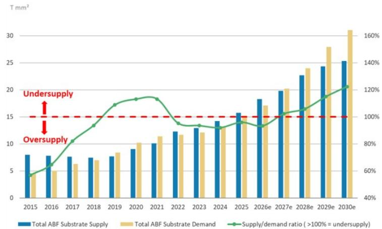

bar-line hybrid

| Year | Total ABF Substrate Supply (T mm²) | Total ABF Substrate Demand (T mm²) | Supply/demand ratio (>100% = undersupply) (%) |
| --- | --- | --- | --- |
| 2015 | 8 | 4 | 55 |
| 2016 | 8 | 5 | 65 |
| 2017 | 7.5 | 6 | 95 |
| 2018 | 7.5 | 7 | 135 |
| 2019 | 8 | 8.5 | 175 |
| 2020 | 9 | 10.5 | 185 |
| 2021 | 10 | 11.5 | 185 |
| 2022 | 12.5 | 11.5 | 135 |
| 2023 | 13 | 12 | 135 |
| 2024 | 14 | 12.5 | 135 |
| 2025 | 16 | 14.5 | 145 |
| 2026e | 18.5 | 17 | 135 |
| 2027e | 20 | 20.5 | 155 |
| 2028e | 23 | 24 | 165 |
| 2029e | 24.5 | 28 | 185 |
| 2030e | 25.5 | 31.5 | 205 |

AI-related applied expected to rise to 75%+ by 2030

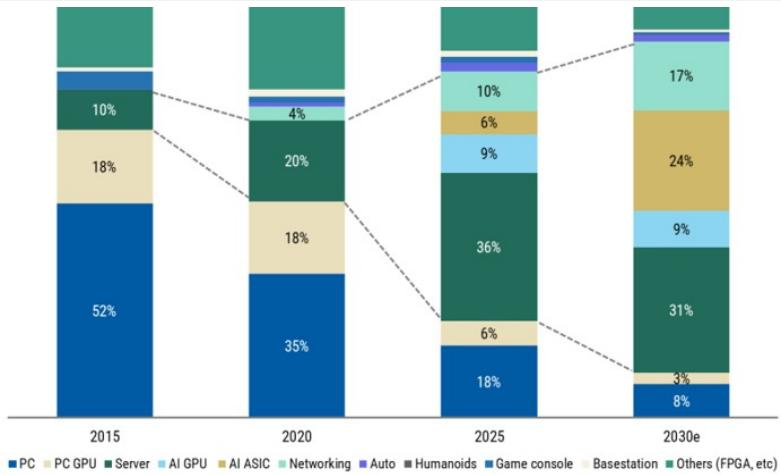

stacked bar chart

| Year | PC (%) | PC GPU (%) | Server (%) | AI GPU (%) | AI ASIC (%) | Networking (%) | Auto (%) | Humanoids (%) | Game console (%) | Basestation (%) | Others (FPGA, etc) (%) |
|---|---|---|---|---|---|---|---|---|---|---|---|
| 2015 | 52 | 18 | 10 | - | - | - | - | - | - | - | - |
| 2020 | 35 | 18 | 20 | - | - | - | 4 | - | - | - | - |
| 2025 | 18 | 6 | 36 | 9 | 6 | 10 | 3 | - | - | - | - |
| 2030e | 8 | 3 | 31 | 9 | 24 | 17 | 3 | - | - | - | - |

Source: Prismark, MS. e = MS estimates.

We are in early innings of an AI-driven upcycle  
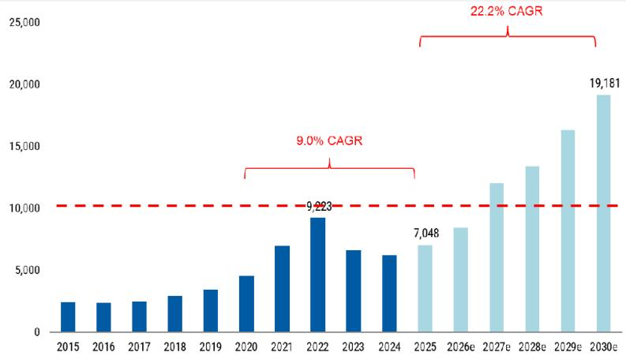

bar chart

| Year | Value |
| :--- | :--- |
| 2015 | 2400 |
| 2016 | 2300 |
| 2017 | 2500 |
| 2018 | 3000 |
| 2019 | 3500 |
| 2020 | 4600 |
| 2021 | 7000 |
| 2022 | 9223 |
| 2023 | 6600 |
| 2024 | 6100 |
| 2025 | 7048 |
| 2026e | 8400 |
| 2027e | 12000 |
| 2028e | 13400 |
| 2029e | 16300 |
| 2030e | 19181 |
9.0% CAGR (approx) for 2021–2022; 9.0% CAGR for 2022–2023; 22.2% CAGR for 2025–2030e.

Expect T glass to remain undersupplied until 2028  
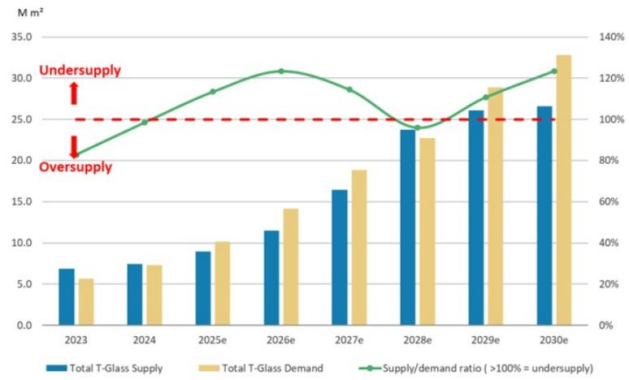

bar-line hybrid

| Year | Total T-Glass Supply (M m²) | Total T-Glass Demand (M m²) | Supply/demand ratio (>100% = undersupply) (%) |
|---|---|---|---|
| 2023 | 7.0 | 6.0 | 80 |
| 2024 | 7.5 | 7.5 | 100 |
| 2025e | 9.0 | 10.0 | 110 |
| 2026e | 11.5 | 14.0 | 120 |
| 2027e | 16.5 | 19.0 | 115 |
| 2028e | 24.0 | 23.0 | 95 |
| 2029e | 26.0 | 29.0 | 115 |
| 2030e | 26.5 | 33.0 | 130 |
Undersupply period (2023–2024) is marked by red arrow; Oversupply period (2024–2025e) is marked by red dashed line at ~25 M m².

## ABF Substrates: Sales Mix by Product and End Segment

Unimicron, NYPCB, Kinsus sales mix (2025)  
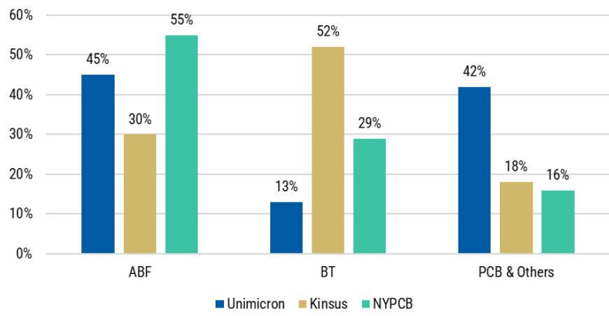

bar chart

| Category | Unimicron (%) | Kinsus (%) | NYPCB (%) |
| :--- | :--- | :--- | :--- |
| ABF | 45 | 30 | 55 |
| BT | 13 | 52 | 29 |
| PCB & Others | 42 | 18 | 16 |

ABF names end segment exposure (2025)  
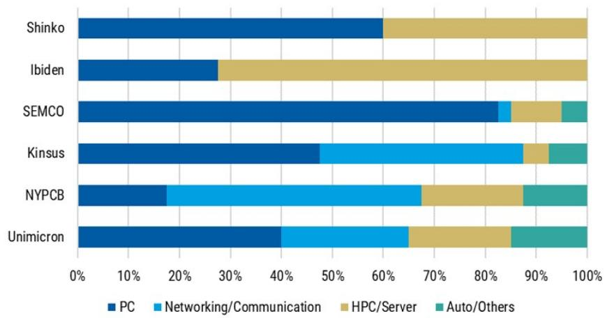

stacked bar chart

| Company | PC (%) | Networking/Communication (%) | HPC/Server (%) | Auto/Others (%) |
| :--- | :--- | :--- | :--- | :--- |
| Shinko | 60 | 0 | 45 | 0 |
| Ibiden | 28 | 0 | 73 | 0 |
| SEMCO | 82 | 3 | 10 | 7 |
| Kinsus | 47 | 51 | 5 | 10 |
| NYPCB | 18 | 67 | 30 | 19 |
| Unimicron | 39 | 31 | 29 | 20 |

Source: Company data, MS estimates.

NVIDIA GPU ABF/CCL/PCB Roadmap

<table><tr><td>NVIDIA</td><td>A100</td><td>H100</td><td>B200</td></tr><tr><td>ABF Substrate</td><td></td><td></td><td></td></tr><tr><td>Substrate size</td><td>55mm x 55mm</td><td>55mm x 58mm</td><td>73mm x 81mm</td></tr><tr><td>Layer count</td><td>12L</td><td>12L</td><td>14L</td></tr><tr><td>Supplier</td><td>Ibiden</td><td>Ibiden</td><td>Ibiden/Unimicron</td></tr><tr><td>OCP Accelerator Module (OAM)</td><td></td><td></td><td></td></tr><tr><td>CCL Spec.</td><td>0</td><td>Very low-loss (M6), Ultra low-loss (M7)</td><td>Extreme low-loss (M8) + Low-loss (M4)</td></tr><tr><td>CCL supplier</td><td>0</td><td>EMC</td><td>Doosan</td></tr><tr><td>PCB Size</td><td>140mm x 78mm</td><td>152mm x 80.5mm</td><td>170mm x 86.5mm</td></tr><tr><td>PCB Spec.</td><td>12L</td><td>18L HDI</td><td>20L HDI</td></tr><tr><td>PCB Supplier</td><td>0</td><td>UMTC, ISU, TTM, WUS</td><td>UMTC, VGT, ISU, TTM</td></tr><tr><td>Universal Baseboard (UBB)</td><td></td><td></td><td></td></tr><tr><td>CCL Spec.</td><td>0</td><td>Ultra low-loss (M7)</td><td>Extreme low-loss (M8) + Low-loss (M4)</td></tr><tr><td>CCL supplier</td><td>EMC</td><td>EMC, TUC</td><td>Doosan, TUC</td></tr><tr><td>PCB Spec.</td><td>0</td><td>24L PTH</td><td>18L PTH</td></tr><tr><td>PCB Supplier</td><td>0</td><td>WUS, TTM, ISU</td><td>WUS, TTM, ISU, UMTC</td></tr><tr><td>Switch board</td><td></td><td></td><td></td></tr><tr><td>CCL Spec.</td><td>Ultra low-loss (M7)</td><td>Very low-loss (M6), Ultra low-loss (M7)</td><td>Ultra low-loss (M7), Extreme low-loss (M8)</td></tr><tr><td>CCL supplier</td><td>0</td><td>EMC, TUC</td><td>EMC, TUC, Doosan</td></tr><tr><td>PCB Spec.</td><td>0</td><td>26-28L</td><td>28-30L</td></tr><tr><td>PCB Supplier</td><td>0</td><td>WUS, TTM, GCE, ISU</td><td>WUS, TTM, GCE, ISU</td></tr><tr><td>Motherboard</td><td></td><td></td><td></td></tr><tr><td>CCL Spec.</td><td>Very low-loss (M6)</td><td>Very low-loss (M6)</td><td>Very low-loss (M6)</td></tr><tr><td>CCL supplier</td><td>EMC, TUC, ITEQ, Panasonic</td><td>EMC, TUC, ITEQ, Panasonic</td><td>EMC, TUC, ITEQ, Panasonic</td></tr><tr><td>PCB Spec.</td><td>16-18L</td><td>16-18L</td><td>16-20L</td></tr><tr><td>PCB Supplier</td><td>GCE, WUS, TTM, ISU, Tripod</td><td>GCE, WUS, TTM, ISU, Tripod</td><td>GCE, WUS, TTM, ISU, Tripod</td></tr></table>

<table><tr><td>NVIDIA</td><td>GB200 NVL72</td><td>GB300 NVL72</td><td>VR200</td></tr><tr><td>ABF Substrate</td><td></td><td></td><td></td></tr><tr><td>Substrate size</td><td>73mm x 81mm</td><td>73mm x 81mm</td><td>83mm x 97mm</td></tr><tr><td>Layer count</td><td>14L</td><td>14L</td><td>18L</td></tr><tr><td>Supplier</td><td>Ibiden/Unimicron</td><td>Ibiden/Unimicron</td><td>Ibiden/Unimicron</td></tr><tr><td>OCP Accelerator Module (OAM)</td><td></td><td></td><td></td></tr><tr><td>CCL Spec.</td><td>Extreme low-loss (M8) + Low-loss (M4)</td><td>Extreme low-loss (M8) + Low-loss (M4)</td><td>Extreme low-loss (M8) + Low-loss (M4)</td></tr><tr><td>CCL supplier</td><td>Doosan</td><td>Doosan</td><td>Doosan</td></tr><tr><td>PCB Size</td><td>305.5mm x 222mm</td><td>305.5mm x 222mm</td><td>305.5mm x 222mm</td></tr><tr><td>PCB Spec.</td><td>22L HDI</td><td>22L HDI</td><td>26L HDI</td></tr><tr><td>PCB Supplier</td><td>VGT, UMTC</td><td>VGT, UMTC</td><td>VGT, UMTC, ZDT, Dynamic</td></tr><tr><td>Switch board</td><td></td><td></td><td></td></tr><tr><td>CCL Spec.</td><td>Extreme low-loss (M8)</td><td>Extreme low-loss (M8)</td><td>Extreme low-loss (M8)</td></tr><tr><td>CCL supplier</td><td>EMC</td><td>EMC, Shengyi</td><td>EMC, Shengyi</td></tr><tr><td>PCB Spec.</td><td>24L PTH</td><td>24L PTH</td><td>32L PTH</td></tr><tr><td>PCB Supplier</td><td>WUS, TTM, VGT</td><td>VGT, TTM, Kinw on</td><td>VGT, WUS, TTM</td></tr><tr><td>Midplane PCB</td><td></td><td></td><td></td></tr><tr><td>CCL Spec.</td><td>NA</td><td>NA</td><td>Beyond extreme low-loss (M9)</td></tr><tr><td>CCL supplier</td><td>NA</td><td>NA</td><td>EMC</td></tr><tr><td>PCB Spec.</td><td>NA</td><td>NA</td><td>44L PTH</td></tr><tr><td>PCB Supplier</td><td>NA</td><td>NA</td><td>VGT, WUS</td></tr><tr><td>Orchid Module / BlueField Module</td><td></td><td></td><td></td></tr><tr><td>CCL Spec.</td><td>NA</td><td>NA</td><td>Extreme low-loss (M8)</td></tr><tr><td>CCL supplier</td><td>NA</td><td>NA</td><td>EMC</td></tr><tr><td>PCB Spec.</td><td>NA</td><td>NA</td><td>20L PTH</td></tr><tr><td>PCB Supplier</td><td>NA</td><td>NA</td><td>WUS, VGT, TTM, UMTC</td></tr></table>

Source: MS.

## AI GPUs to adopt CoWoP instead of CoWoS, reducing reliance on ABF substrates?

TSMC CoWoS Package  
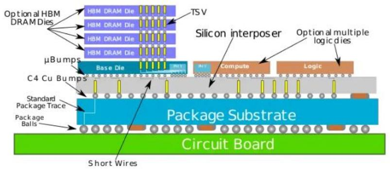

text_image

Option al HBM
DRAM Dies
HBM DRAM Die
TSV
HBM DRAM Die
HBM DRAM Die
HBM DRAM Die
μBumps
Base Die
PILY
Silicon interposer
Optional multiple
logic dies
C4 Cu Bumps
Standard
Package Trace
Package
Balls
Package Substrate
Circuit Board
Short Wires

A CoWoP Package  
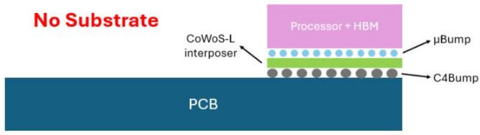

text_image

No Substrate
CoWoS-L
interposer
Processor + HBM
μBump
C4Bump
PCB

What is CoWoP? CoWoP stands for Chip on Wafer on PCB, in which a PCB (printed circuit board) replaces the ABF substrate in a CoWoS (Chip on Wafer on Substrate) IC package. Currently, all Nvidia's data center GPUs adopt TSMC's CoWoS technology, and TSMC's CoWoS yield rate is close to 100%.

Why use CoWoP if CoWoS yield rate is so high? By adopting CoWoP, the aim is to resolve substrate warpage, increase NVLink reach on the PCB without substrate in between chip and PCB, achieve greater cooling efficiency without a package lid, and remove capacity bottleneck in certain package materials.

We don't think Rubin Ultra will use CoWoP: In order to adopt CoWoP, the L/S (line/space) of the PCB needs to shrink to $< 10 / 10\mu \mathrm{m}$ , because that is where L/S for ABF substrates currently is. Average high-density interconnect (HDI) PCB is $40 / 50\mu \mathrm{m}$ today. SLP (substrate-like PCB), which is used in iPhone mainboards today, is $20 / 35\mu \mathrm{m}$ – hence the name SLP, because its L/S is closer to that of substrates. However, to get the PCB L/S from $20 / 35\mu \mathrm{m}$ to below $10 / 10\mu \mathrm{m}$ would be difficult, which is one reason for why we don't think it will happen for Rubin Ultra. This is in line with Shoji Sato's checks as well, with Ibiden saying that Rubin Ultra's ABF substrate is much larger than Rubin's, with more layers. We believe shifting to CoWoP from CoWoS would entail significant yield risks and reshuffling of the related supply chain, which does not look rational to us for products targeted to enter mass production in one year's time.

## Optical transceiver – PCB beneficiaries of AI interconnect build-out

<table><tr><td colspan="4">(mn units)</td></tr><tr><td>New Estimates</td><td>2026E</td><td>2027E</td><td>2028E</td></tr><tr><td>800G</td><td>44</td><td>63</td><td>64</td></tr><tr><td>1.6T</td><td>29</td><td>79</td><td>87</td></tr><tr><td>3.2T</td><td>0</td><td>0</td><td>8</td></tr><tr><td>Total</td><td>73</td><td>141</td><td>158</td></tr></table>

<table><tr><td>Previous Estimates</td><td>2026E</td><td>2027E</td><td>2028E</td></tr><tr><td>800G</td><td>34</td><td>48</td><td>54</td></tr><tr><td>1.6T</td><td>19</td><td>24</td><td>27</td></tr><tr><td>3.2T</td><td>0</td><td>0</td><td>5</td></tr><tr><td>Total</td><td>53</td><td>71</td><td>85</td></tr></table>

<table><tr><td>Pct. of change</td><td>2026E</td><td>2027E</td><td>2028E</td></tr><tr><td>800G</td><td>29%</td><td>31%</td><td>19%</td></tr><tr><td>1.6T</td><td>52%</td><td>233%</td><td>226%</td></tr><tr><td>3.2T</td><td>--</td><td>--</td><td>60%</td></tr><tr><td>Total</td><td>38%</td><td>98%</td><td>86%</td></tr></table>

<table><tr><td></td><td>400G</td><td>800G</td><td>1.6T</td></tr><tr><td>Layers</td><td>10-12L2-3 press HDI</td><td>12-14L, 4-8L mSAPor HDI</td><td>14-16L6-10L mSAP</td></tr><tr><td>Process</td><td>HDI</td><td>HDI or mSAP</td><td>mSAP</td></tr><tr><td>CCL Spec</td><td>M6</td><td>M7(LDK1) / M7+ (LDK2)</td><td>M7+ / M8 (LDK2)</td></tr><tr><td>ASP (US$)</td><td>$5-15</td><td>$15-25</td><td>$20-30</td></tr><tr><td>GM Est.</td><td>20-30%</td><td>30-40%</td><td>40-50%+</td></tr><tr><td>Suppliers</td><td>Unimicron, Shennan, WUS, other smaller suppliers.</td><td>Unimicron, Shennan, Zhen Ding, WUS, Compeq, etc.</td><td>Unimicron, Shennan, Zhen Ding, Compeq, WUS, etc.</td></tr></table>

AI transceiver PCB TAM is growing at 83% CAR from 2025-28E (US\$ M)  
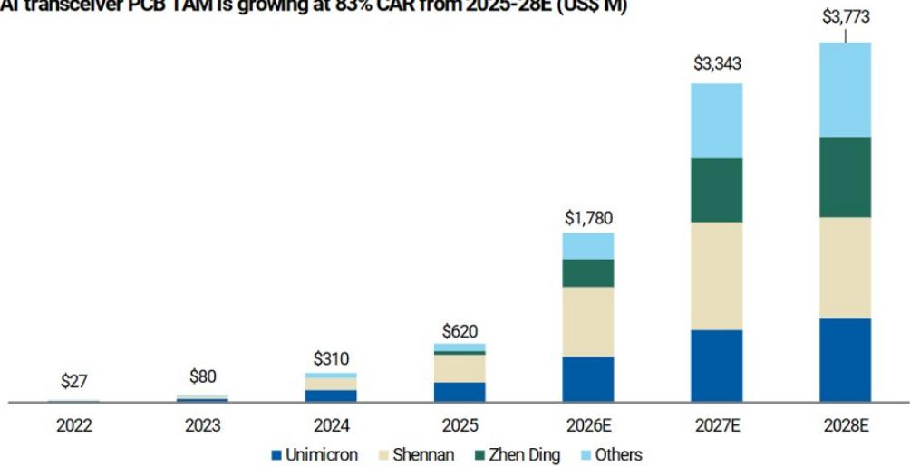

stacked bar chart

Air transceiver PCB TAM is growing at 83% CAR from 2023-28E (US$ M)
| Year | Unimicron | Shennan | Zhen Ding | Others |
| :--- | :--- | :--- | :--- | :--- |
| 2022 | $27 | | | |
| 2023 | $80 | | | |
| 2024 | $310 | | | |
| 2025 | $620 | | | |
| 2026E | $1,780 | | | |
| 2027E | $3,343 | | | |
| 2028E | $3,773 | | | |

Source: Company data, MS estimates.

## ABF Substrates: M-series Chips

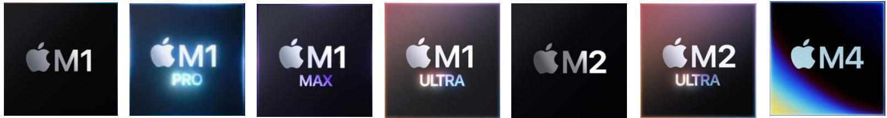

<table><tr><td>Chip</td><td>M1</td><td>M1 Pro</td><td>M1 Max</td><td>M1 Ultra</td><td>M2</td><td>M2 Ultra</td><td>M4</td></tr><tr><td>Dimensions</td><td>24 x 27mm</td><td>57 x 25mm</td><td>57 x 36mm</td><td>65 x 72mm</td><td>24 x 27mm</td><td>70.6 x 70mm</td><td>24 x 27.7mm</td></tr><tr><td>Size</td><td> $648mm^2$ </td><td> $1,425mm^2$ </td><td> $2,052mm^2$ </td><td> $4,680mm^2$ </td><td> $648mm^2$ </td><td> $4,942mm^2$ </td><td> $665mm^2$ </td></tr><tr><td>Layer count</td><td>8L</td><td>10L</td><td>10L</td><td>18L</td><td>8L</td><td>18L</td><td>8L</td></tr></table>

Source: Apple, MS

## What's the Latest on PCs?

## Recent updates

- "Demand is outstripping supply" in the first half of the year.  
- PC prices are increasing, and they are increasing faster than costs are rising. OEMs are optimizing their product portfolios to sell less low-end PCs and more high-end PCs due to component constraints.  
• We believe this is going to drive the OEMs to see stronger profits and margins in the near term.  
• However, we maintain our cautious view and think the margin and demand impact will start to emerge in 2H26.

All Taiwan OEMs' Revenue Came In Better-than-Expected in 1Q  
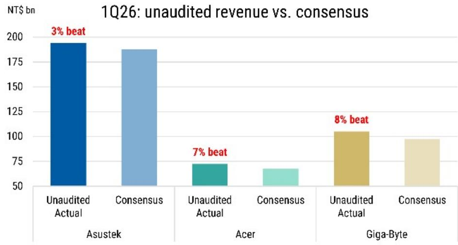

bar chart

1Q26: unaudited revenue vs. consensus
| Company | Category | Value (NT$ bn) | Performance (%) |
| :--- | :--- | :--- | :--- |
| Asustek | Unaudited Actual | 195 | 3 |
| Asustek | Consensus | 187 | 3 |
| Acer | Unaudited Actual | 72 | 7 |
| Acer | Consensus | 66 | 7 |
| Giga-Byte | Unaudited Actual | 104 | 8 |
| Giga-Byte | Consensus | 98 | 8 |

Source: Company data, e = MS estimates. Note: Ex-China supply shows 18% in the next slide, but this includes India production for the India market.

We estimate 2Q26 NB shipments to be 30.3M units (+4% q/q, -8% y/y)

<table><tr><td>Shipment (unit: k)</td><td>Jan-25</td><td>Feb-25</td><td>Mar-25</td><td>Apr-25</td><td>May-25</td><td>Jun-25</td><td>Jul-25</td><td>Aug-25</td><td>Sep-25</td><td>Oct-25E</td><td>Nov-25</td><td>Dec-25</td><td>Jan-26</td><td>Feb-26</td><td>Mar-26</td><td>Apr-26</td><td>May-26E</td></tr><tr><td>Quanta</td><td>2,800</td><td>3,100</td><td>4,900</td><td>3,300</td><td>3,800</td><td>5,000</td><td>4,000</td><td>4,100</td><td>4,600</td><td>3,500</td><td>3,500</td><td>3,900</td><td>2,700</td><td>2,000</td><td>5,300</td><td>3,500</td><td>3,500</td></tr><tr><td>Wistron</td><td>1,500</td><td>1,500</td><td>1,900</td><td>1,700</td><td>1,800</td><td>2,400</td><td>2,000</td><td>2,200</td><td>2,200</td><td>2,100</td><td>2,200</td><td>2,600</td><td>1,700</td><td>1,600</td><td>2,800</td><td>1,800</td><td>2,000</td></tr><tr><td>Others</td><td>1,500</td><td>1,600</td><td>1,900</td><td>1,700</td><td>1,800</td><td>2,100</td><td>1,700</td><td>1,800</td><td>1,900</td><td>1,600</td><td>1,700</td><td>2,000</td><td>1,700</td><td>1,500</td><td>2,200</td><td>1,500</td><td>1,800</td></tr><tr><td>Compal</td><td>2,000</td><td>2,100</td><td>2,900</td><td>2,200</td><td>2,400</td><td>2,500</td><td>2,300</td><td>2,300</td><td>2,500</td><td>2,100</td><td>2,300</td><td>2,400</td><td>1,600</td><td>1,500</td><td>2,800</td><td>1,800</td><td>2,100</td></tr><tr><td>Pegatron</td><td>610</td><td>575</td><td>700</td><td>610</td><td>775</td><td>990</td><td>750</td><td>825</td><td>825</td><td>775</td><td>710</td><td>925</td><td>700</td><td>425</td><td>675</td><td>525</td><td>625</td></tr><tr><td>Total</td><td>8,410</td><td>8,875</td><td>12,300</td><td>9,510</td><td>10,575</td><td>12,990</td><td>10,750</td><td>11,225</td><td>12,025</td><td>10,075</td><td>10,410</td><td>11,825</td><td>8,400</td><td>7,025</td><td>13,775</td><td>9,125</td><td>10,025</td></tr><tr><td>MoM %</td><td></td><td></td><td></td><td></td><td></td><td></td><td></td><td></td><td></td><td></td><td></td><td></td><td></td><td></td><td></td><td></td><td></td></tr><tr><td>Quanta</td><td>-35%</td><td>11%</td><td>58%</td><td>-33%</td><td>15%</td><td>32%</td><td>-20%</td><td>2%</td><td>12%</td><td>-24%</td><td>0%</td><td>11%</td><td>-31%</td><td>-26%</td><td>165%</td><td>-34%</td><td>0%</td></tr><tr><td>Wistron</td><td>-17%</td><td>0%</td><td>27%</td><td>-11%</td><td>6%</td><td>33%</td><td>-17%</td><td>10%</td><td>0%</td><td>-5%</td><td>5%</td><td>18%</td><td>-35%</td><td>-6%</td><td>75%</td><td>-36%</td><td>11%</td></tr><tr><td>Others</td><td>-25%</td><td>7%</td><td>19%</td><td>-11%</td><td>6%</td><td>17%</td><td>-19%</td><td>6%</td><td>6%</td><td>-16%</td><td>6%</td><td>18%</td><td>-15%</td><td>-12%</td><td>47%</td><td>-32%</td><td>20%</td></tr><tr><td>Compal</td><td>-13%</td><td>5%</td><td>38%</td><td>-24%</td><td>9%</td><td>4%</td><td>-8%</td><td>0%</td><td>9%</td><td>-16%</td><td>10%</td><td>4%</td><td>-33%</td><td>-6%</td><td>87%</td><td>-36%</td><td>17%</td></tr><tr><td>Pegatron</td><td>-19%</td><td>-6%</td><td>22%</td><td>-13%</td><td>27%</td><td>28%</td><td>-24%</td><td>10%</td><td>0%</td><td>-6%</td><td>-8%</td><td>30%</td><td>-24%</td><td>-39%</td><td>59%</td><td>-22%</td><td>19%</td></tr><tr><td>Total</td><td>-25%</td><td>6%</td><td>39%</td><td>-23%</td><td>11%</td><td>23%</td><td>-17%</td><td>4%</td><td>7%</td><td>-16%</td><td>3%</td><td>14%</td><td>-29%</td><td>-16%</td><td>96%</td><td>-34%</td><td>10%</td></tr><tr><td>YoY%</td><td></td><td></td><td></td><td></td><td></td><td></td><td></td><td></td><td></td><td></td><td></td><td></td><td></td><td></td><td></td><td></td><td></td></tr><tr><td>Quanta</td><td>-3%</td><td>7%</td><td>4%</td><td>3%</td><td>-5%</td><td>11%</td><td>18%</td><td>-5%</td><td>-6%</td><td>9%</td><td>-3%</td><td>-9%</td><td>-4%</td><td>-35%</td><td>8%</td><td>6%</td><td>-8%</td></tr><tr><td>Wistron</td><td>15%</td><td>7%</td><td>0%</td><td>6%</td><td>6%</td><td>33%</td><td>25%</td><td>29%</td><td>16%</td><td>17%</td><td>29%</td><td>44%</td><td>13%</td><td>7%</td><td>47%</td><td>6%</td><td>11%</td></tr><tr><td>Others</td><td>0%</td><td>23%</td><td>12%</td><td>13%</td><td>6%</td><td>24%</td><td>0%</td><td>6%</td><td>6%</td><td>-6%</td><td>0%</td><td>0%</td><td>13%</td><td>-6%</td><td>16%</td><td>-12%</td><td>0%</td></tr><tr><td>Compal</td><td>-9%</td><td>-9%</td><td>-3%</td><td>-21%</td><td>-17%</td><td>-17%</td><td>-8%</td><td>-21%</td><td>-14%</td><td>-25%</td><td>-15%</td><td>4%</td><td>-20%</td><td>-29%</td><td>-3%</td><td>-18%</td><td>-13%</td></tr><tr><td>Pegatron</td><td>16%</td><td>53%</td><td>8%</td><td>16%</td><td>6%</td><td>28%</td><td>-3%</td><td>-6%</td><td>0%</td><td>35%</td><td>14%</td><td>23%</td><td>15%</td><td>-26%</td><td>-4%</td><td>-14%</td><td>-19%</td></tr><tr><td>Total</td><td>0%</td><td>7%</td><td>3%</td><td>-1%</td><td>-4%</td><td>10%</td><td>8%</td><td>-2%</td><td>-2%</td><td>0%</td><td>1%</td><td>6%</td><td>0%</td><td>-21%</td><td>12%</td><td>-4%</td><td>-5%</td></tr></table>

<table><tr><td>Shipment (unit: k)</td><td>1Q24</td><td>2Q24</td><td>3Q24</td><td>4Q24</td><td>1Q25</td><td>2Q25</td><td>3Q25</td><td>4Q25</td><td>1Q26</td><td>2Q26E</td></tr><tr><td>Quanta</td><td>10,500</td><td>11,700</td><td>12,600</td><td>11,100</td><td>10,800</td><td>12,100</td><td>12,700</td><td>10,900</td><td>10,000</td><td>10,500</td></tr><tr><td>Wistron</td><td>4,600</td><td>5,100</td><td>5,200</td><td>5,300</td><td>4,900</td><td>5,900</td><td>6,400</td><td>6,900</td><td>6,100</td><td>5,800</td></tr><tr><td>Others</td><td>4,500</td><td>4,900</td><td>5,200</td><td>5,400</td><td>5,000</td><td>5,600</td><td>5,400</td><td>5,300</td><td>5,400</td><td>5,500</td></tr><tr><td>Compal</td><td>7,500</td><td>8,700</td><td>8,300</td><td>7,800</td><td>7,000</td><td>7,100</td><td>7,100</td><td>6,800</td><td>5,900</td><td>6,500</td></tr><tr><td>Pegatron</td><td>1,550</td><td>2,030</td><td>2,475</td><td>1,950</td><td>1,885</td><td>2,375</td><td>2,400</td><td>2,410</td><td>1,800</td><td>2,000</td></tr><tr><td>Total</td><td>28,650</td><td>32,430</td><td>33,775</td><td>31,550</td><td>29,585</td><td>33,075</td><td>34,000</td><td>32,310</td><td>29,200</td><td>30,300</td></tr><tr><td>QoQ %</td><td></td><td></td><td></td><td></td><td></td><td></td><td></td><td></td><td></td><td></td></tr><tr><td>Quanta</td><td>1%</td><td>11%</td><td>8%</td><td>-12%</td><td>-3%</td><td>12%</td><td>5%</td><td>-14%</td><td>-8%</td><td>5%</td></tr><tr><td>Wistron</td><td>-13%</td><td>11%</td><td>2%</td><td>2%</td><td>-8%</td><td>20%</td><td>8%</td><td>8%</td><td>-12%</td><td>-5%</td></tr><tr><td>Others</td><td>0%</td><td>9%</td><td>6%</td><td>4%</td><td>-7%</td><td>12%</td><td>-4%</td><td>-2%</td><td>2%</td><td>2%</td></tr><tr><td>Compal</td><td>-10%</td><td>16%</td><td>-5%</td><td>-6%</td><td>-10%</td><td>1%</td><td>0%</td><td>-4%</td><td>-13%</td><td>10%</td></tr><tr><td>Pegatron</td><td>-6%</td><td>31%</td><td>22%</td><td>-21%</td><td>-3%</td><td>26%</td><td>1%</td><td>0%</td><td>-25%</td><td>11%</td></tr><tr><td>Total</td><td>-5%</td><td>13%</td><td>4%</td><td>-7%</td><td>-6%</td><td>12%</td><td>3%</td><td>-5%</td><td>-10%</td><td>4%</td></tr><tr><td>YoY%</td><td></td><td></td><td></td><td></td><td></td><td></td><td></td><td></td><td></td><td></td></tr><tr><td>Quanta</td><td>-3%</td><td>-7%</td><td>-4%</td><td>7%</td><td>3%</td><td>3%</td><td>1%</td><td>-2%</td><td>-7%</td><td>-13%</td></tr><tr><td>Wistron</td><td>18%</td><td>11%</td><td>0%</td><td>0%</td><td>7%</td><td>16%</td><td>23%</td><td>30%</td><td>24%</td><td>-2%</td></tr><tr><td>Others</td><td>2%</td><td>0%</td><td>6%</td><td>20%</td><td>11%</td><td>14%</td><td>4%</td><td>-2%</td><td>8%</td><td>-2%</td></tr><tr><td>Compal</td><td>-1%</td><td>0%</td><td>-11%</td><td>-6%</td><td>-7%</td><td>-18%</td><td>-14%</td><td>-13%</td><td>-16%</td><td>-8%</td></tr><tr><td>Pegatron</td><td>-9%</td><td>-2%</td><td>-1%</td><td>18%</td><td>22%</td><td>17%</td><td>-3%</td><td>24%</td><td>-5%</td><td>-16%</td></tr><tr><td>Total</td><td>1%</td><td>-1%</td><td>-4%</td><td>5%</td><td>3%</td><td>2%</td><td>1%</td><td>2%</td><td>-1%</td><td>-8%</td></tr></table>

Source: IDC, MS. e = MS estimates.

## Memory Takes A Bite Out of Hardware Margins

OEM Average Selling Price vs. Consumer Mix  
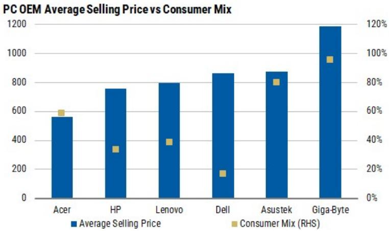

bar-line hybrid

PC OEM Average Selling Price vs Consumer Mix
| Company | Average Selling Price ($) | Consumer Mix (%) |
| :--- | :--- | :--- |
| Acer | 560 | 60 |
| HP | 755 | 34 |
| Lenovo | 800 | 39 |
| Dell | 865 | 17 |
| Asustek | 880 | 82 |
| Giga-Byte | 1190 | 96 |

Greater China PC OEM Aggregate Forward P/E  
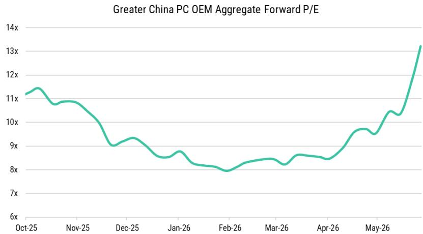

line chart

| Date   | Forward P/E |
|--------|-------------|
| Oct-25 | 11.2x       |
| Nov-25 | 10.8x       |
| Dec-25 | 9.0x        |
| Jan-26 | 8.5x        |
| Feb-26 | 8.0x        |
| Mar-26 | 8.3x        |
| Apr-26 | 8.5x        |
| May-26 | 9.5x        |
| Jun-26 | 13.2x       |

Source: MS.

Memory as a % of BOM  
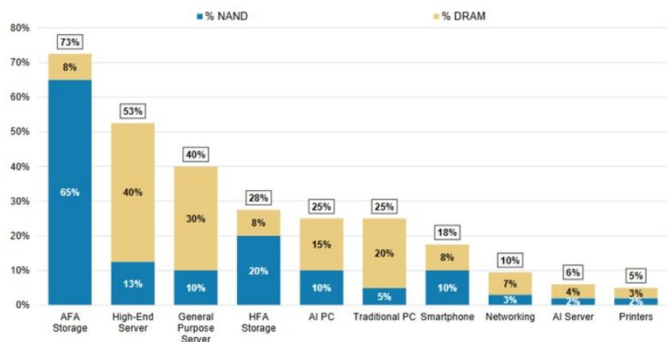

stacked bar chart

| Category | % NAND (%) | % DRAM (%) |
|---|---|---|
| AFA Storage | 65 | 8 |
| High-End Server | 13 | 40 |
| General Purpose Server | 10 | 30 |
| HFA Storage | 20 | 8 |
| AI PC | 10 | 15 |
| Traditional PC | 5 | 20 |
| Smartphone | 10 | 8 |
| Networking | 3 | 7 |
| AI Server | 2 | 4 |
| Printers | 2 | 3 |
The chart displays two stacked segments per category: blue for % NAND and yellow for % DRAM. The total percentages are labeled above each segment: AFA Storage (73%), High-End Server (53%), General Purpose Server (40%), HFA Storage (28%), AI PC (25%), Traditional PC (25%), Smartphone (18%), Networking (10%), AI Server (6%). The chart is a single data series representing the sum of both components for each category.

Asia IT Hardware OEM/ODM Scorecard

<table><tr><td colspan="8">Asia IT Hardware OEM/ODM Scorecard</td></tr><tr><td></td><td>AI Beneficiary</td><td>Margins</td><td>Supply Chain Leverage</td><td>End-Market Demand</td><td>Special Situations</td><td>Memory Exposure</td><td>Ranking</td></tr><tr><td>w i w y n n</td><td>4</td><td>4</td><td>4</td><td>4</td><td>1</td><td>4</td><td>3.5</td></tr><tr><td>w i stron</td><td>4</td><td>3</td><td>4</td><td>3</td><td>1</td><td>4</td><td>3.2</td></tr><tr><td>Quanta Computer</td><td>4</td><td>3</td><td>4</td><td>3</td><td>1</td><td>4</td><td>3.2</td></tr><tr><td>Lenovo</td><td>2</td><td>2</td><td>4</td><td>2</td><td>4</td><td>1</td><td>2.5</td></tr><tr><td>GIGABYTE</td><td>3</td><td>3</td><td>3</td><td>2</td><td>1</td><td>2.5</td><td>2.4</td></tr><tr><td>ASUS®</td><td>2</td><td>3</td><td>2</td><td>2</td><td>1</td><td>2.5</td><td>2.1</td></tr><tr><td>PEGATRON</td><td>2</td><td>1</td><td>2</td><td>2</td><td>1</td><td>4</td><td>2.0</td></tr><tr><td>COMPAL</td><td>2</td><td>2</td><td>1</td><td>2</td><td>1</td><td>4</td><td>2.0</td></tr><tr><td>acer</td><td>1</td><td>2</td><td>1</td><td>1</td><td>1</td><td>2.5</td><td>1.4</td></tr></table>

## PC Market Overview

Global notebook demand vs. supply  
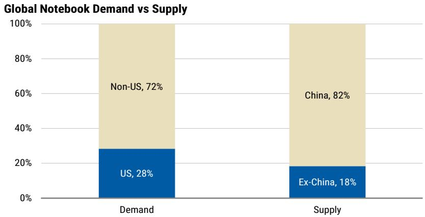

stacked bar chart

Global Notebook Demand vs Supply
| Category | US (%) | Non-US (%) |
| :--- | :--- | :--- |
| Demand | 28 | 72 |
| Supply | 18 | 82 |

Global PC OEM US demand vs. ex-China supply  
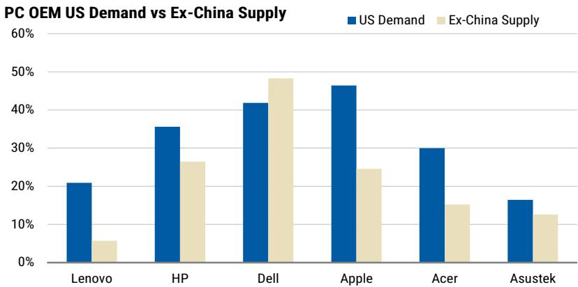

bar chart

PC OEM US Demand vs Ex-China Supply
| Company | US Demand (%) | Ex-China Supply (%) |
| :--- | :--- | :--- |
| Lenovo | 20.5 | 5.5 |
| HP | 35.5 | 26.0 |
| Dell | 41.5 | 48.0 |
| Apple | 46.0 | 24.0 |
| Acer | 30.0 | 15.0 |
| Asustek | 16.5 | 12.5 |

Global notebook production by location  
Global notebook production by location  
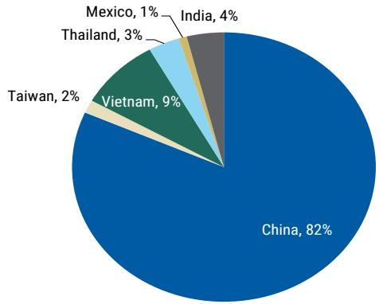

pie chart

| Country | Percentage (%) |
| :--- | :--- |
| China | 82 |
| Vietnam | 9 |
| Taiwan | 2 |
| Thailand | 3 |
| Mexico | 1 |
| India | 4 |

Global PC OEM production by location

Global notebook production breakdown by region  
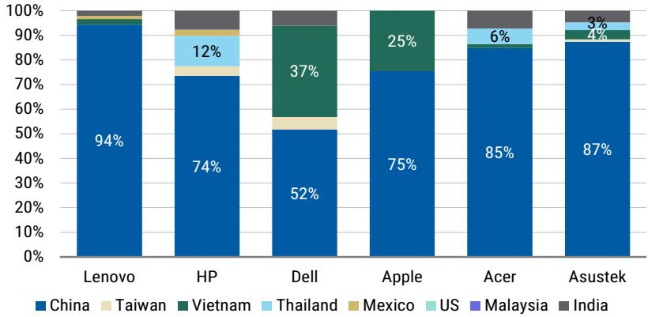

stacked bar chart

| Company | China (%) | Taiwan (%) | Vietnam (%) | Thailand (%) | Mexico (%) | US (%) | Malaysia (%) | India (%) |
| :--- | :--- | :--- | :--- | :--- | :--- | :--- | :--- | :--- |
| Lenovo | 94 | 0 | 2 | 1 | 1 | 0 | 0 | 0 |
| HP | 74 | 3 | 0 | 12 | 2 | 0 | 0 | 8 |
| Dell | 52 | 3 | 37 | 0 | 0 | 0 | 0 | 6 |
| Apple | 75 | 0 | 25 | 0 | 0 | 0 | 0 | 0 |
| Acer | 85 | 0 | 0 | 6 | 0 | 0 | 0 | 6 |
| Asustek | 87 | 0 | 4 | 4 | 0 | 0 | 3 | 3 |

Source: IDC, MS. e = MS estimates. Note: Ex-China supply includes India production for India market.

## CPU Market Share Trend

Server CPU market share  
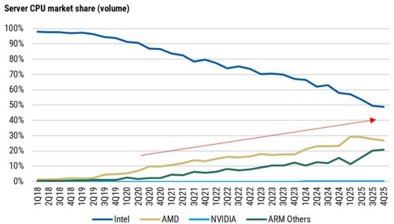

line chart

Server CPU market share (volume)
| Quarter | Intel (%) | AMD (%) | NVIDIA (%) | ARM Others (%) |
|---|---|---|---|---|
| 1Q18 | 98 | 0 | 0 | 0 |
| 2Q18 | 97 | 0 | 0 | 0 |
| 3Q18 | 96 | 0 | 0 | 0 |
| 4Q18 | 95 | 0 | 0 | 0 |
| 1Q19 | 94 | 0 | 0 | 0 |
| 2Q19 | 93 | 0 | 0 | 0 |
| 3Q19 | 92 | 0 | 0 | 0 |
| 4Q19 | 91 | 0 | 0 | 0 |
| 1Q20 | 90 | 0 | 0 | 0 |
| 2Q20 | 88 | 5 | 0 | 0 |
| 3Q20 | 86 | 8 | 0 | 0 |
| 4Q20 | 84 | 10 | 0 | 0 |
| 1Q21 | 82 | 12 | 0 | 0 |
| 2Q21 | 80 | 14 | 0 | 0 |
| 3Q21 | 78 | 15 | 0 | 5 |
| 4Q21 | 76 | 16 | 0 | 6 |
| 1Q22 | 74 | 17 | 0 | 7 |
| 2Q22 | 72 | 18 | 0 | 8 |
| 3Q22 | 70 | 19 | 0 | 9 |
| 4Q22 | 68 | 20 | 0 | 10 |
| 1Q23 | 66 | 21 | 0 | 11 |
| 2Q23 | 64 | 22 | 0 | 12 |
| 3Q23 | 62 | 23 | 0 | 13 |
| 4Q23 | 60 | 24 | 0 | 14 |
| 1Q24 | 58 | 25 | 0 | 15 |
| 2Q24 | 56 | 26 | 0 | 16 |
| 3Q24 | 54 | 27 | 0 | 17 |
| 4Q24 | 52 | 28 | 0 | 18 |
| 1Q25 | 50 | 29 | -5.575 | - |
| 2Q25e-05 | -5.575 | -5.575 | -5.575 | - |
| Q3Q25e-05 | -5.575 | -5.575 | -5.575 | - |
| Q4Q25e-05 | -5.575 | -5.575 | -5.575 | - |
The chart displays a trend line with markers for Intel, AMD, NVIDIA, and ARM Others. The Y-axis represents market share percentage, and the X-axis represents time in quarters from Q1 '08 to Q4 '25. The legend indicates the color coding: blue for Intel, gold for AMD, cyan for NVIDIA, and green for ARM Others. The red arrow highlights a rising trend for AMD from Q3 '23 to Q4 '25. The data is already in English.

DT CPU market share  
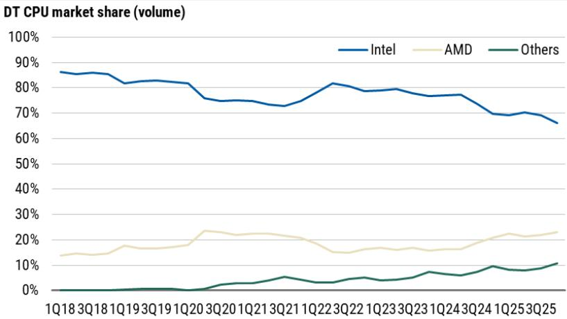

line chart

| Quarter | Intel | AMD  | Others |
|---------|-------|------|--------|
| 1Q18    | 85%   | 14%  | 0%     |
| 3Q18    | 84%   | 15%  | 0%     |
| 1Q19    | 83%   | 17%  | 0%     |
| 3Q19    | 82%   | 18%  | 0%     |
| 1Q20    | 81%   | 23%  | 0%     |
| 3Q20    | 75%   | 22%  | 0%     |
| 1Q21    | 74%   | 21%  | 0%     |
| 3Q21    | 73%   | 20%  | 0%     |
| 1Q22    | 72%   | 19%  | 0%     |
| 3Q22    | 81%   | 16%  | 0%     |
| 1Q23    | 79%   | 17%  | 0%     |
| 3Q23    | 78%   | 16%  | 0%     |
| 1Q24    | 77%   | 17%  | 0%     |
| 3Q24    | 76%   | 18%  | 0%     |
| 1Q25    | 70%   | 22%  | 0%     |
| 3Q25    | 67%   | 23%  | 0%     |

Source: IDC, MS.

NB CPU market share  
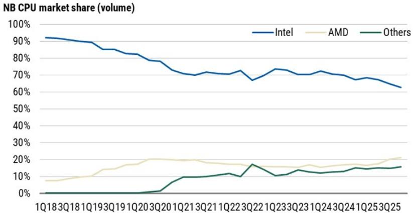

line chart

| Quarter | Intel | AMD | Others |
| ------- | ----- | --- | ------ |
| 1Q18    | 92%   | 7%  | 0%     |
| 3Q18    | 90%   | 8%  | 0%     |
| 1Q19    | 88%   | 10% | 0%     |
| 3Q19    | 85%   | 12% | 0%     |
| 1Q20    | 82%   | 15% | 0%     |
| 3Q20    | 78%   | 18% | 0%     |
| 1Q21    | 75%   | 17% | 5%     |
| 3Q21    | 72%   | 16% | 8%     |
| 1Q22    | 70%   | 15% | 10%    |
| 3Q22    | 73%   | 14% | 15%    |
| 1Q23    | 75%   | 13% | 10%    |
| 3Q23    | 72%   | 14% | 12%    |
| 1Q24    | 70%   | 15% | 13%    |
| 3Q24    | 68%   | 16% | 14%    |
| 1Q25    | 67%   | 17% | 15%    |
| 3Q25    | 65%   | 18% | 16%    |

## Cloud and Edge AI Will Add \~US\$1B TAM to the Overall MLCC Market by 2027

Cloud AI to drive \~US\$1B TAM by 2026 (US\$ bn)  
AI Server MLCC Demand Split by High/Low-Cap (US\$ M)  
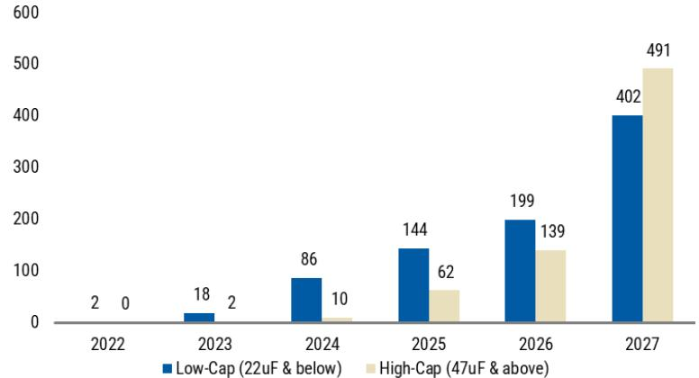

bar chart

| Year | Low-Cap (22uF & below) | High-Cap (47uF & above) |
| :--- | :--- | :--- |
| 2022 | 2 | 0 |
| 2023 | 18 | 2 |
| 2024 | 86 | 10 |
| 2025 | 144 | 62 |
| 2026 | 199 | 139 |
| 2027 | 402 | 491 |

AI Server will use significantly more high-cap (47uF+) MLCCs

Nvidia's Rubin System Uses More High-Cap MLCCs  
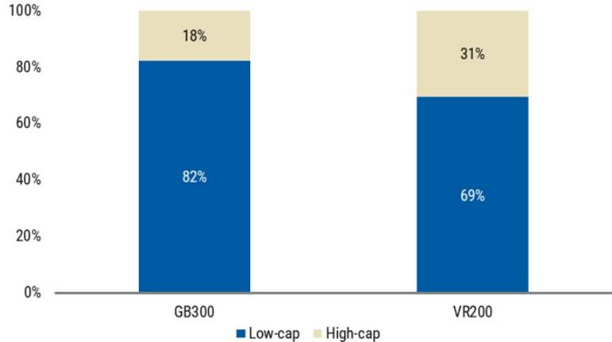

stacked bar chart

| Category | Low-cap (%) | High-cap (%) |
|---|---|---|
| GB300 | 82 | 18 |
| VR200 | 69 | 31 |

Source: IDC, MS. e = MS estimates.

AI Servers to drive significant MLCC TAM growth (US\$ M)  
AI Servers to drive significant MLCC TAM growth (US\$ M)  
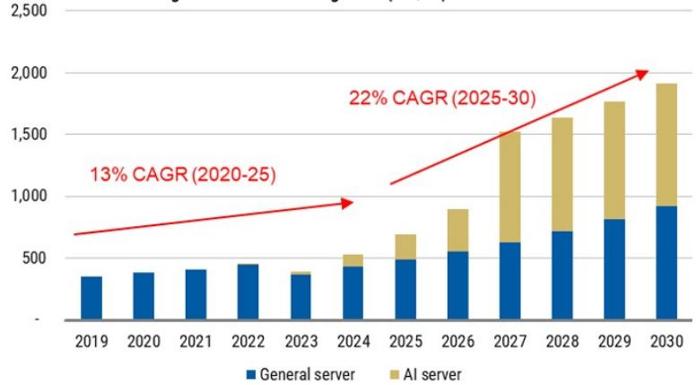

stacked bar chart

| Year | General server | AI server |
|---|---|---|
| 2019 | 350 | - |
| 2020 | 380 | - |
| 2021 | 400 | - |
| 2022 | 450 | - |
| 2023 | 360 | - |
| 2024 | 430 | 100 |
| 2025 | 490 | 270 |
| 2026 | 540 | 410 |
| 2027 | 620 | 850 |
| 2028 | 710 | 850 |
| 2029 | 790 | 850 |
| 2030 | 910 | 910 |
The chart includes two red arrows labeled: '13% CAGR (2020-25)' and '22% CAGR (2025-30)'. The Y-axis represents a numerical scale from 0 to 2,500.

AI Server MLCC is \~3% of Global Units but \~5% of Global Values

AI Server MLCCs (US\$ B) is \~5% of Global Demand (2027E)  
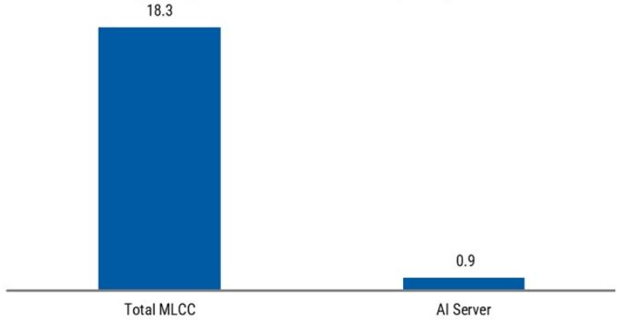

bar chart

| Category | Value |
|---|---|
| Total MLCC | 18.3 |
| AI Server | 0.9 |

## AI Servers to See the Largest MLCC Content Growth

<table><tr><td colspan="2">Server Assumptions</td><td colspan="2"># of MLCCs</td><td colspan="2">US$</td></tr><tr><td colspan="2">General server</td><td colspan="2">2,000</td><td colspan="2">30</td></tr><tr><td colspan="2">HGX Hopper AI server (8x GPU)</td><td colspan="2">22,000</td><td colspan="2">190</td></tr><tr><td>GPU module (OAM)</td><td>8x</td><td>1,300</td><td>10,400</td><td>10</td><td>80</td></tr><tr><td>GPU baseboard (UBB)</td><td>1x</td><td>4,900</td><td>4,900</td><td>45</td><td>45</td></tr><tr><td>CPU motherboard</td><td>1x</td><td>1,500</td><td>1,500</td><td>25</td><td>25</td></tr><tr><td>Peripheral boards</td><td>8x</td><td>650</td><td>5,200</td><td>5</td><td>40</td></tr><tr><td colspan="2">HGX B200 AI server (8x GPU)</td><td colspan="2">36,000</td><td colspan="2">317</td></tr><tr><td>GPU module (OAM)</td><td>8x</td><td>3,000</td><td>24,000</td><td>24</td><td>192</td></tr><tr><td>GPU baseboard (UBB)</td><td>1x</td><td>5,300</td><td>5,300</td><td>60</td><td>60</td></tr><tr><td>CPU motherboard</td><td>1x</td><td>1,500</td><td>1,500</td><td>25</td><td>25</td></tr><tr><td>Peripheral boards</td><td>8x</td><td>650</td><td>5,200</td><td>5</td><td>40</td></tr><tr><td colspan="2">HGX B300 AI server (8x GPU)</td><td colspan="2">48,000</td><td colspan="2">435</td></tr><tr><td>GPU module (OAM)</td><td>8x</td><td>4,400</td><td>35,200</td><td>40</td><td>320</td></tr><tr><td>GPU baseboard (UBB)</td><td>1x</td><td>6,100</td><td>6,100</td><td>50</td><td>50</td></tr><tr><td>CPU motherboard</td><td>1x</td><td>1,500</td><td>1,500</td><td>25</td><td>25</td></tr><tr><td>Peripheral boards</td><td>8x</td><td>650</td><td>5,200</td><td>5</td><td>40</td></tr><tr><td colspan="2">GB200 (NVL72)</td><td colspan="2">337,500</td><td colspan="2">1,710</td></tr><tr><td>Bianca</td><td>36x</td><td>6,800</td><td>244,800</td><td>30</td><td>1,080</td></tr><tr><td>Switch board</td><td>9x</td><td>3,800</td><td>34,200</td><td>20</td><td>180</td></tr><tr><td>Peripheral boards</td><td>90x</td><td>650</td><td>58,500</td><td>5</td><td>450</td></tr><tr><td colspan="2">GB300 (NVL72)</td><td colspan="2">319,500</td><td colspan="2">1,530</td></tr><tr><td>Bianca</td><td>36x</td><td>6,300</td><td>226,800</td><td>25</td><td>900</td></tr><tr><td>Switch board</td><td>9x</td><td>3,800</td><td>34,200</td><td>20</td><td>180</td></tr><tr><td>Peripheral boards</td><td>90x</td><td>650</td><td>58,500</td><td>5</td><td>450</td></tr><tr><td colspan="2">VR200 (NVL72)</td><td colspan="2">571,050</td><td colspan="2">4,320</td></tr><tr><td>Strata</td><td>36x</td><td>11,000</td><td>396,000</td><td>90</td><td>3,240</td></tr><tr><td>Switch board</td><td>9x</td><td>7,000</td><td>63,000</td><td>45</td><td>405</td></tr><tr><td>BlueField Module</td><td>18x</td><td>2,000</td><td>36,000</td><td>5</td><td>90</td></tr><tr><td>CX9 Orchid Module</td><td>72x</td><td>650</td><td>46,800</td><td>5</td><td>360</td></tr><tr><td>Peripheral boards</td><td>45x</td><td>650</td><td>29,250</td><td>5</td><td>225</td></tr><tr><td colspan="2">Vera Rack</td><td colspan="2">494,048</td><td colspan="2">3,060</td></tr><tr><td>Vera MGX</td><td>128x</td><td>3,316</td><td>424,448</td><td>20</td><td>2,560</td></tr><tr><td>Switch board</td><td>4x</td><td>7,000</td><td>28,000</td><td>45</td><td>180</td></tr><tr><td>Peripheral boards</td><td>64x</td><td>650</td><td>41,600</td><td>5</td><td>320</td></tr><tr><td colspan="2">STX Rack</td><td colspan="2">326,256</td><td colspan="2">2,415</td></tr><tr><td>Mainboard</td><td>16x</td><td>4,791</td><td>76,656</td><td>31</td><td>495</td></tr><tr><td>Peripheral boards</td><td>384x</td><td>650</td><td>249,600</td><td>5</td><td>1,920</td></tr><tr><td colspan="2">LPX Rack</td><td colspan="2">581,024</td><td colspan="2">4,326</td></tr><tr><td>LPX UBB</td><td>16x</td><td>5,374</td><td>85,984</td><td>35</td><td>559</td></tr><tr><td>LPX Module</td><td>256x</td><td>1,705</td><td>436,480</td><td>14</td><td>3,527</td></tr><tr><td>BF4</td><td>16x</td><td>2,000</td><td>32,000</td><td>5</td><td>80</td></tr><tr><td>x86 CPU Module</td><td>16x</td><td>1,660</td><td>26,560</td><td>10</td><td>160</td></tr></table>

Source: Company data. e = MS estimates.

General server MLCC supplier share (value)  
Yageo general server MLCC supplier share (value)  
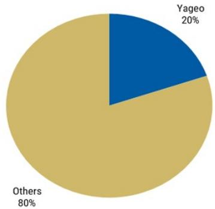

pie chart

| Category | Value (%) |
|---|---|
| Yageo | 20 |
| Others | 80 |

General PC MLCC supplier share (value)

Yageo general PC MLCC supplier share (value)  
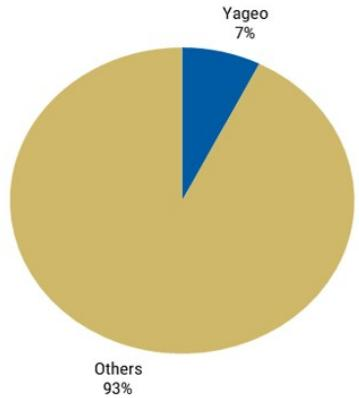

pie chart

| Category | Value (%) |
|---|---|
| Yageo | 7 |
| Others | 93 |

## All-time Survey-High Smartphone Upgrade Rates, Led Primarily By iPhone

- Based on our 2025 AlphaWise Smartphone Survey, next 12-month China and US smartphone upgrade rates are expected to expand 8 points and 3 points Y/Y, reaching an all-time survey (10+ years) high, while the same metrics are expected to decline 3-6 points Y/Y for EMEA (the UK and Germany).  
• On a global blended basis, smartphone upgrade rates are expected to improve 5ppt Y/Y to 43%, an all-time survey high.  
• However, Apple is the only smartphone OEM with positive and improving net switching rates in our 2025 AlphaWise Smartphone Survey, suggesting the upgrade rate momentum is primarily driven by iPhone strength.

Smartphone Upgrade Rates (Extremely Likely Upgraders) By Country  
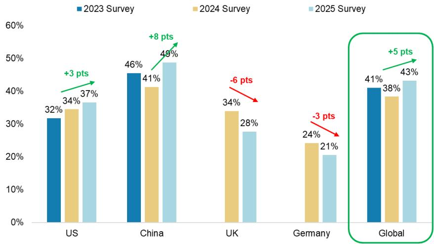

bar chart

| Region | 2023 Survey (%) | 2024 Survey (%) | 2025 Survey (%) |
| :--- | :--- | :--- | :--- |
| US | 32 | 34 | 37 |
| China | 46 | 41 | 49 |
| UK | - | 34 | 28 |
| Germany | - | 24 | 21 |
| Global | 41 | 38 | 43 |
+3 pts: US vs China; +8 pts: China vs UK; -6 pts: UK vs Germany; +5 pts: Global vs Germany

Global Smartphone Brand Net Switching Rates (The Higher The Better)  
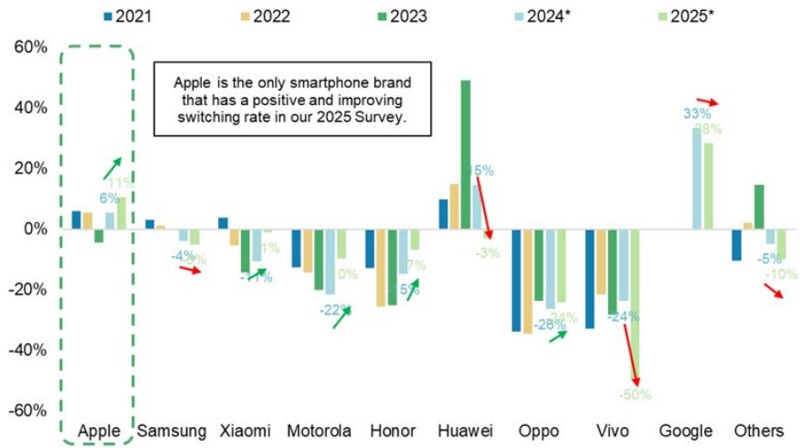

bar chart

| Brand | 2021 (%) | 2022 (%) | 2023 (%) | 2024* (%) | 2025* (%) |
|---|---|---|---|---|---|
| Apple | 6 | 4 | -5 | 6 | 11 |
| Samsung | 3 | -1 | -11 | -4 | -4 |
| Xiaomi | 4 | -5 | -17 | -11 | -1 |
| Motorola | -8 | -13 | -22 | -22 | 0 |
| Honor | -13 | -26 | -24 | -7 | -5 |
| Huawei | 10 | 15 | 49 | 15 | -3 |
| Oppo | -35 | -36 | -24 | -26 | -24 |
| Vivo | -35 | -20 | -24 | -24 | -50 |
| Google | 0 | 0 | 33 | 33 | 38 |
| Others | -10 | 2 | 15 | -5 | -10 |
Apple is the only smartphone brand that has a positive and improving switching rate in our 2025 Survey.

Source: AlphaWise, MS estimates. Note: 2024 and 2025 Survey results include UK and Germany (along with US and China) for the blended average; we believe Survey results in a certain year have implications to the estimates for the following year.

## The Reality Is – Smartphone OEMs Need To Pay for Higher Memory Prices

- Combining our checks and the Survey results on iPhone storage mix, we estimate average memory cost per iPhone will rise 150%+ Y/Y in 2026.  
- This means that even for Apple, smartphone OEMs would need to pay significantly higher memory prices and raise prices to partially mitigate the cost impact.  
- We believe this is particularly negative to Android players – smartphone gross margins are lower, the mix of memory cost within COGS is higher, and the customer base is more elastic (i.e., more sensitive to price increases).

Smartphone Gross Margin By OEM  
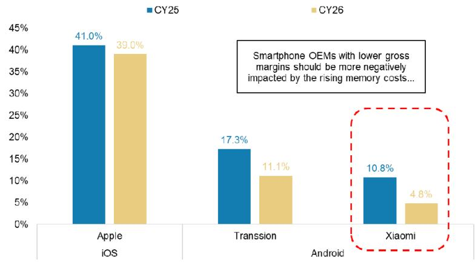

bar chart

| Device | CY25 (%) | CY26 (%) |
| :--- | :--- | :--- |
| Apple iOS | 41.0 | 39.0 |
| Transsion | 17.3 | 11.1 |
| Xiaomi | 10.8 | 4.8 |
Smartphone OEMs with lower gross margins should be more negatively impacted by the rising memory costs...

Memory Costs % of iPhone COGS  
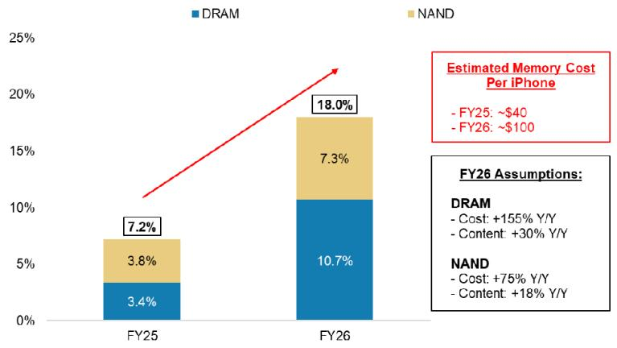

stacked bar chart

| Year | DRAM (%) | NAND (%) |
| :--- | :--- | :--- |
| FY25 | 3.4 | 3.8 |
| FY26 | 10.7 | 7.3 |
Estimated Memory Cost Per iPhone: FY25: ~$40; FY26: ~$100
FY26 Assumptions: DRAM - Cost: +155% Y/Y; Content: +30% Y/Y
NAND - Cost: +75% Y/Y; Content: +18% Y/Y

Smartphone COGS By OEM  
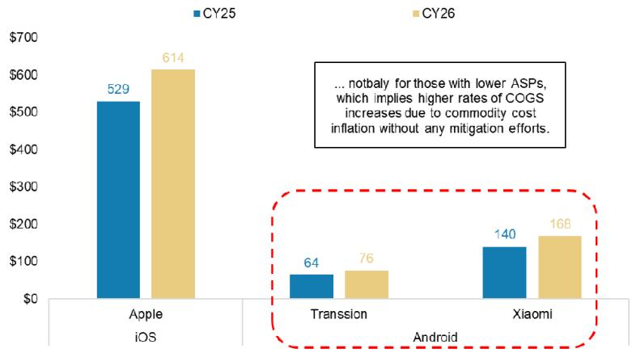

bar chart

| Platform | CY25 | CY26 |
| -------- | ---- | ---- |
| Apple iOS | 529 | 614 |
| Transsion | 64 | 76 |
| Xiaomi | 140 | 168 |

Source: AlphaWise, MS estimates.

## Combined, Global Smartphone Units Are Expected to Decline 11% Y/Y, Driven By Android

• We believe price hikes by smartphone brands are inevitable. This will lead to demand destruction, notably in the mid-range Android smartphone market, which faces a more demand elastic customer base. We forecast Android smartphone shipments to decline 15% Y/Y in 2026.  
- While the iPhone customer base is much less elastic than that of Android, we still expect shipments to decline in 2026, due primarily to changes in iPhone launch cadence.  
• Taken together, we expect global smartphone shipments to decline 13% Y/Y in 2026.

iOS vs. Android: Shipments, ASP, and Revenue In CY25-CY26  
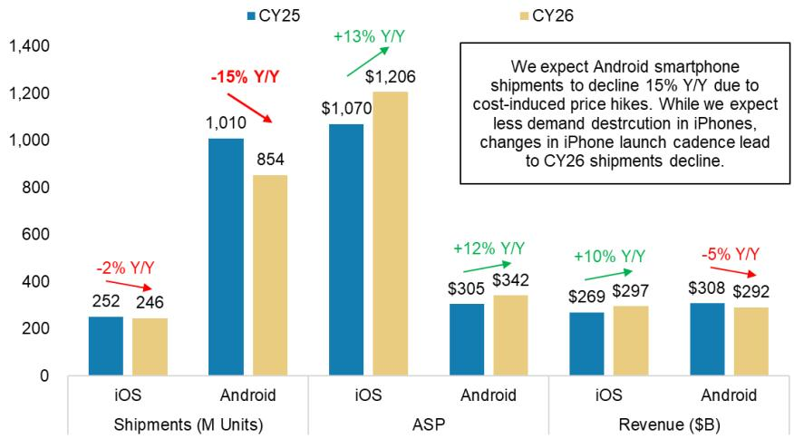

bar chart

| Category | Platform | CY25 (M Units) | CY26 (M Units) | Change (%) |
| :--- | :--- | :--- | :--- | :--- |
| Shipments | iOS | 252 | 246 | -2 |
| Shipments | Android | 1,010 | 854 | -15 |
| ASP | iOS | 1,070 | 1,206 | +13 |
| ASP | Android | 305 | 342 | +12 |
| Revenue ($B) | iOS | 269 | 297 | +10 |
| Revenue ($B) | Android | 308 | 292 | -5 |
We expect Android shipments to decline 15% Y/Y due to cost-induced price hikes. While we expect less demand destruction in iPhones, changes in iPhone launch cadence lead to CY26 shipments decline.

SMARTPHONE MODEL

<table><tr><td>Units (M)</td></tr><tr><td>Rest of Asia/Pacific</td></tr><tr><td>PRC</td></tr><tr><td>EMEA</td></tr><tr><td>North America</td></tr><tr><td>Latin America</td></tr><tr><td>India</td></tr><tr><td>Global Total</td></tr></table>

<table><tr><td colspan="3">CY26 Est.</td><td colspan="3">CY27 Est.</td></tr><tr><td>New</td><td>Old</td><td>Diff.</td><td>New</td><td>Old</td><td>Diff.</td></tr><tr><td>157</td><td>181</td><td>-13%</td><td>162</td><td>183</td><td>-12%</td></tr><tr><td>246</td><td>284</td><td>-14%</td><td>252</td><td>287</td><td>-12%</td></tr><tr><td>311</td><td>363</td><td>-14%</td><td>316</td><td>363</td><td>-13%</td></tr><tr><td>135</td><td>149</td><td>-9%</td><td>142</td><td>149</td><td>-5%</td></tr><tr><td>115</td><td>139</td><td>-18%</td><td>118</td><td>141</td><td>-16%</td></tr><tr><td>136</td><td>182</td><td>-25%</td><td>147</td><td>189</td><td>-22%</td></tr><tr><td>1,100</td><td>1,299</td><td>-15%</td><td>1,137</td><td>1,312</td><td>-13%</td></tr></table>

SMARTPHONE MODEL

<table><tr><td>Y/Y Unit Growth</td></tr><tr><td>Rest of Asia/Pacific</td></tr><tr><td>PRC</td></tr><tr><td>EMEA</td></tr><tr><td>North America</td></tr><tr><td>Latin America</td></tr><tr><td>India</td></tr><tr><td>Global Total</td></tr></table>

<table><tr><td colspan="3">CY26 Est.</td><td colspan="3">CY27 Est.</td></tr><tr><td>New</td><td>Old</td><td>Diff.</td><td>New</td><td>Old</td><td>Diff.</td></tr><tr><td>-14%</td><td>0%</td><td>-14.2pts</td><td>3%</td><td>1%</td><td>1.9pts</td></tr><tr><td>-14%</td><td>1%</td><td>-14.2pts</td><td>3%</td><td>1%</td><td>1.6pts</td></tr><tr><td>-15%</td><td>0%</td><td>-15.1pts</td><td>2%</td><td>0%</td><td>1.8pts</td></tr><tr><td>-6%</td><td>5%</td><td>-10.9pts</td><td>5%</td><td>0%</td><td>4.7pts</td></tr><tr><td>-13%</td><td>6%</td><td>-19.5pts</td><td>3%</td><td>1%</td><td>2.2pts</td></tr><tr><td>-10%</td><td>14%</td><td>-24.7pts</td><td>8%</td><td>4%</td><td>3.8pts</td></tr><tr><td>-12.8%</td><td>3.1%</td><td>-16.0pts</td><td>3.4%</td><td>1.0%</td><td>2.4pts</td></tr></table>

SMARTPHONE MODEL

<table><tr><td>Y/Y ASP Growth</td></tr><tr><td>Revenue (M)</td></tr><tr><td>Y/Y Revenue Growth</td></tr></table>

<table><tr><td colspan="3">CY26 Est.</td><td colspan="3">CY27 Est.</td></tr><tr><td>New</td><td>Old</td><td>Diff.</td><td>New</td><td>Old</td><td>Diff.</td></tr><tr><td>$535</td><td>$482</td><td>11%</td><td>$573</td><td>$501</td><td>14%</td></tr><tr><td>17%</td><td>6%</td><td>11.0pts</td><td>7%</td><td>4%</td><td>3.3pts</td></tr><tr><td>$ 588,225</td><td>$ 626,102</td><td>-6%</td><td>$ 651,991</td><td>$ 657,405</td><td>-1%</td></tr><tr><td>2%</td><td>10%</td><td>-8.0pts</td><td>11%</td><td>5%</td><td>5.8pts</td></tr></table>

Source: IDC, MS estimates. Note: iOS (iPhone) ASP and revenue here could be different from our AAPL model as the figures here are based on IDC's revenue estimates in CY25 along with our iPhone ASP growth forecasts in CY26.

## Alongside Battery Life & Camera, Software Is Becoming a More Important Upgrade Factor

• Similar to last year, we continue to see a focus on new models, advanced features, and access to Gen AI technologies. What is slightly different is increasing interest in better cameras, alongside deteriorating interest in battery life and storage.  
- AI remains a Top 5 reason for upgrading a smartphone, but without major advances in Edge AI or truly personalized digital assistants, we are not seeing much change in interest outside of China.

Global Smartphone: Reason for Upgrade (Among Smartphone Owners)  
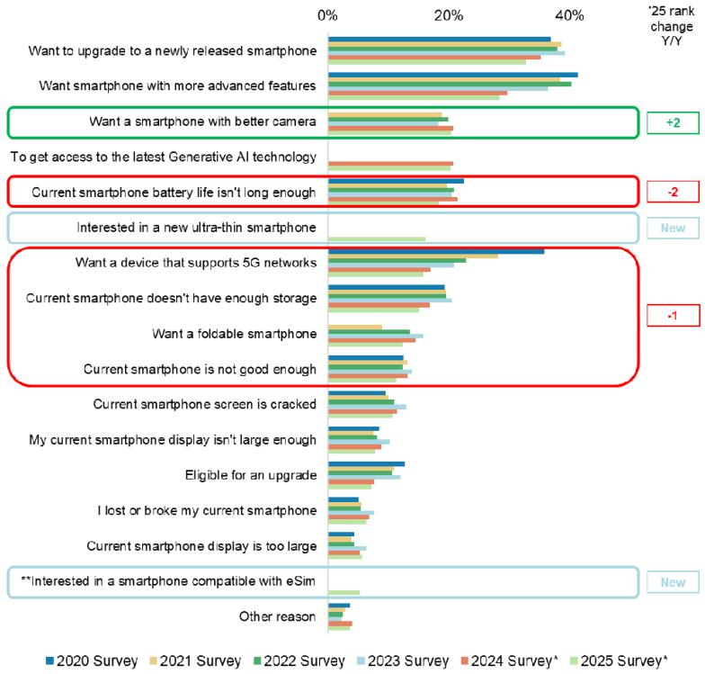

bar chart

| Reason | 2020 Survey (%) | 2021 Survey (%) | 2022 Survey (%) | 2023 Survey (%) | 2024 Survey* (%) | 2025 Survey* (%) |
|---|---|---|---|---|---|---|
| Want to upgrade to a newly released smartphone | 38 | 39 | 37 | 36 | 34 | - |
| Want smartphone with more advanced features | 41 | 40 | 39 | 35 | 31 | - |
| Want a smartphone with better camera | 20 | 20 | 19 | 19 | 19 | +2 |
| To get access to the latest Generative AI technology | 18 | 18 | 18 | 18 | 18 | - |
| Current smartphone battery life isn't long enough | 23 | 21 | 20 | 19 | 18 | -2 |
| Interested in a new ultra-thin smartphone | 16 | 17 | 16 | 16 | 16 | New |
| Want a device that supports 5G networks | 38 | 36 | 31 | 25 | 18 | - |
| Current smartphone doesn't have enough storage | 20 | 19 | 18 | 17 | 16 | - |
| Want a foldable smartphone | 15 | 14 | 13 | 14 | 14 | - |
| Current smartphone is not good enough | 15 | 15 | 14 | 14 | 14 | - |
| Current smartphone screen is cracked | 13 | 13 | 13 | 14 | 13 | -1 |
| My current smartphone display isn't large enough | 10 | 9 | 9 | 10 | 9 | - |
| Eligible for an upgrade | 15 | 14 | 13 | 13 | 9 | - |
| I lost or broke my current smartphone | 8 | 7 | 7 | 8 | 7 | - |
| Current smartphone display is too large | 7 | 6 | 6 | 7 | 6 | - |
| **Interested in a smartphone compatible with eSim | - | - | - | - | - | New |
| Other reason | 5 | - | - | - | - | - |
'25 rank change Y/Y

Access to AI Tech as The Ranking of Reasons to Upgrade Smartphone  
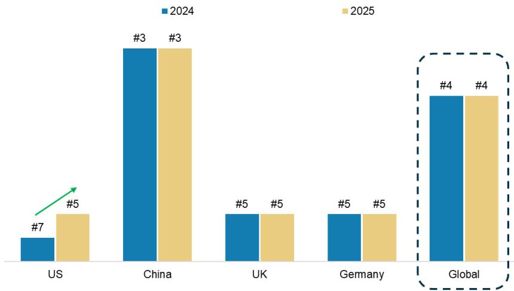

bar chart

| Region | 2024 | 2025 |
| :--- | :--- | :--- |
| US | #7 | #5 |
| China | #3 | #3 |
| UK | #5 | #5 |
| Germany | #5 | #5 |
| Global | #4 | #4 |

Given rising memory costs, we would also expect smartphone OEMs to reduce BOM – based on our Survey results, battery and storage could be areas that are at risk of de-specing.

Source: AlphaWise, MS estimates. Note: 2024 and 2025 Survey results include UK and Germany (along with US and China) for the blended average; “Interested in a smartphone compatible with eSIM” was only asked in China.

## We Favor Apple Supply Chain Over Android in 2026

• We expect the Android smartphone supply chain to be negatively affected by more meaningful volume declines, de-specing, and margin pressures, as OEMs attempt to save costs while raising prices.  
- While we don't expect to see iPhone de-specing, we do expect Apple to share increasing costs with non-memory suppliers while keeping prices unchanged for the iPhone 17 family. With robust shipments and a favorable model mix, Apple and its suppliers are in a better position (vs. Android counterparts) within the smartphone universe.  
- Consistent with our 2024 AlphaWise Survey takeaways, we maintain a relative preference for Apple/Apple supply chain over Android OEMs/supply chain.

<table><tr><td colspan="4">Most Favored</td><td colspan="4">Least Favored</td></tr><tr><td>Ticker</td><td>Company</td><td>MS Rating</td><td>% to MS PT</td><td>Ticker</td><td>Company</td><td>MS Rating</td><td>% to MS PT</td></tr><tr><td>005930.KS</td><td>Samsung</td><td>OW</td><td>68%</td><td>3105.TW</td><td>WIN Semi</td><td>UW</td><td>-76%</td></tr><tr><td>2317.TW</td><td>Hon Hai</td><td>OW</td><td>41%</td><td>300782.SZ</td><td>Maxscend</td><td>UW</td><td>-55%</td></tr><tr><td>0285.HK</td><td>BYDE</td><td>OW</td><td>38%</td><td>8086.TWO</td><td>AWSC</td><td>UW</td><td>-43%</td></tr><tr><td>601138.SS</td><td>FII</td><td>OW</td><td>36%</td><td>3034.TW</td><td>Novatek</td><td>UW</td><td>-22%</td></tr><tr><td>002475.SZ</td><td>Luxshare</td><td>OW</td><td>29%</td><td>603160.SS</td><td>Goodix</td><td>UW</td><td>-16%</td></tr><tr><td>6770.T</td><td>Alps Alpine</td><td>OW</td><td>28%</td><td>2382.HK</td><td>Sunny Optical</td><td>EW</td><td>-3%</td></tr><tr><td>6762.T</td><td>TDK</td><td>OW</td><td>22%</td><td>QCOM</td><td>Qualcomm</td><td>UW</td><td>-3%</td></tr><tr><td>6088.HK</td><td>FIT Hon Teng</td><td>OW</td><td>21%</td><td>QRVO</td><td>Qorvo</td><td>EW</td><td>3%</td></tr><tr><td>SWKS</td><td>Skyworks</td><td>EW</td><td>17%</td><td>688036.SS</td><td>Transsion</td><td>EW</td><td>14%</td></tr><tr><td>AAPL</td><td>Apple</td><td>OW</td><td>17%</td><td>603501.SS</td><td>OmniVision</td><td>EW</td><td>19%</td></tr><tr><td>3017.TW</td><td>AVC</td><td>OW</td><td>15%</td><td></td><td></td><td></td><td></td></tr><tr><td>6981.T</td><td>Murata</td><td>OW</td><td>11%</td><td></td><td></td><td></td><td></td></tr><tr><td>2018.HK</td><td>AAC</td><td>OW</td><td>10%</td><td></td><td></td><td></td><td></td></tr><tr><td>2454.TW</td><td>MediaTek</td><td>OW</td><td>3%</td><td></td><td></td><td></td><td></td></tr><tr><td>601231.SS</td><td>USI</td><td>OW</td><td>0%</td><td></td><td></td><td></td><td></td></tr><tr><td>STMPA.PA</td><td>STMicro</td><td>OW</td><td>-3%</td><td></td><td></td><td></td><td></td></tr></table>

Source: FactSet, MS. Prices as of 17 April, 2026.

2Q26 iPhone Build Estimates of 52mn Units (-7% QoQ, +12% YoY)

<table><tr><td>mn units</td><td>1Q23</td><td>2Q23</td><td>3Q23</td><td>4Q23</td><td>2023</td><td>1Q24</td><td>2Q24</td><td>3Q24</td><td>4Q24</td><td>2024</td><td>1Q25</td><td>2Q25</td><td>3Q25</td><td>4Q25</td><td>2025</td><td>1Q26e</td><td>2Q26e</td></tr><tr><td>iPhone Sell-in</td><td colspan="4"></td><td></td><td colspan="4"></td><td></td><td colspan="4"></td><td></td><td colspan="2"></td></tr><tr><td>iPhone SE3 / SE 5G / 16e / 17e</td><td>1.0</td><td>2.5</td><td>5.0</td><td>3.0</td><td>11.5</td><td>1.0</td><td>2.0</td><td>5.0</td><td>3.0</td><td>11.0</td><td>4.0</td><td>9.0</td><td>4.0</td><td>1.0</td><td>18.0</td><td>2.0</td><td>10.0</td></tr><tr><td>iPhone XR</td><td>-</td><td>-</td><td>-</td><td>-</td><td>-</td><td>-</td><td>-</td><td>-</td><td>-</td><td>-</td><td>-</td><td>-</td><td>-</td><td>-</td><td>-</td><td>-</td><td>-</td></tr><tr><td>iPhone 11</td><td>-</td><td>-</td><td>-</td><td>-</td><td>-</td><td>-</td><td>-</td><td>-</td><td>-</td><td>-</td><td>-</td><td>-</td><td>-</td><td>-</td><td>-</td><td>-</td><td>-</td></tr><tr><td>iPhone 12 mini (5.4&quot;)</td><td>-</td><td>-</td><td>-</td><td>-</td><td>-</td><td>-</td><td>-</td><td>-</td><td>-</td><td>-</td><td>-</td><td>-</td><td>-</td><td>-</td><td>-</td><td>-</td><td>-</td></tr><tr><td>iPhone 12 (6.1&quot;)</td><td>0.5</td><td>0.5</td><td>-</td><td>-</td><td>1.0</td><td>-</td><td>-</td><td>-</td><td>-</td><td>-</td><td>-</td><td>-</td><td>-</td><td>-</td><td>-</td><td>-</td><td>-</td></tr><tr><td>iPhone 12 Pro (6.1&quot;)</td><td>0.5</td><td>-</td><td>-</td><td>-</td><td>0.5</td><td>-</td><td>-</td><td>-</td><td>-</td><td>-</td><td>-</td><td>-</td><td>-</td><td>-</td><td>-</td><td>-</td><td>-</td></tr><tr><td>iPhone 12 Pro Max (6.7&quot;)</td><td>0.5</td><td>-</td><td>-</td><td>-</td><td>0.5</td><td>-</td><td>-</td><td>-</td><td>-</td><td>-</td><td>-</td><td>-</td><td>-</td><td>-</td><td>-</td><td>-</td><td>-</td></tr><tr><td>iPhone 13 mini (5.4&quot;)</td><td>1.0</td><td>0.5</td><td>-</td><td>-</td><td>1.5</td><td>-</td><td>-</td><td>-</td><td>-</td><td>-</td><td>-</td><td>-</td><td>-</td><td>-</td><td>-</td><td>-</td><td>-</td></tr><tr><td>iPhone 13 (6.1&quot;)</td><td>1.0</td><td>0.5</td><td>-</td><td>-</td><td>1.5</td><td>-</td><td>-</td><td>-</td><td>-</td><td>-</td><td>-</td><td>-</td><td>-</td><td>-</td><td>-</td><td>-</td><td>-</td></tr><tr><td>iPhone 13 Pro (6.1&quot;)</td><td>1.0</td><td>2.0</td><td>1.0</td><td>-</td><td>4.0</td><td>0.5</td><td>0.5</td><td>-</td><td>-</td><td>1.0</td><td>-</td><td>-</td><td>-</td><td>-</td><td>-</td><td>-</td><td>-</td></tr><tr><td>iPhone 13 Pro Max (6.7&quot;)</td><td>2.0</td><td>2.0</td><td>1.0</td><td>-</td><td>5.0</td><td>0.5</td><td>0.5</td><td>-</td><td>-</td><td>1.0</td><td>-</td><td>-</td><td>-</td><td>-</td><td>-</td><td>-</td><td>-</td></tr><tr><td>iPhone 14 (6.1&quot;)</td><td>7.0</td><td>4.0</td><td>5.0</td><td>2.0</td><td>18.0</td><td>1.0</td><td>0.5</td><td>-</td><td>-</td><td>1.5</td><td>-</td><td>-</td><td>-</td><td>-</td><td>-</td><td>-</td><td>-</td></tr><tr><td>iPhone 14 Plus (6.7&quot;)</td><td>5.0</td><td>3.0</td><td>1.0</td><td>1.0</td><td>10.0</td><td>1.0</td><td>0.5</td><td>-</td><td>-</td><td>1.5</td><td>-</td><td>-</td><td>-</td><td>-</td><td>-</td><td>-</td><td>-</td></tr><tr><td>iPhone 14 Pro (6.1&quot;)</td><td>15.0</td><td>12.0</td><td>7.0</td><td>3.0</td><td>37.0</td><td>2.0</td><td>2.0</td><td>1.0</td><td>1.0</td><td>6.0</td><td>1.0</td><td>1.0</td><td>1.0</td><td>-</td><td>3.0</td><td>-</td><td>-</td></tr><tr><td>iPhone 14 Pro Max (6.7&quot;)</td><td>19.5</td><td>14.0</td><td>9.0</td><td>4.0</td><td>46.5</td><td>2.0</td><td>2.0</td><td>1.0</td><td>1.0</td><td>6.0</td><td>1.0</td><td>1.0</td><td>1.0</td><td>-</td><td>3.0</td><td>-</td><td>-</td></tr><tr><td>iPhone 15 (6.1&quot;)</td><td></td><td></td><td>6.0</td><td>12.0</td><td>18.0</td><td>6.0</td><td>5.0</td><td>4.0</td><td>1.0</td><td>16.0</td><td>1.0</td><td>0.5</td><td>0.5</td><td>0.5</td><td>2.5</td><td>-</td><td>-</td></tr><tr><td>iPhone 15 Plus (6.7&quot;)</td><td></td><td></td><td>5.0</td><td>10.0</td><td>15.0</td><td>4.0</td><td>3.0</td><td>1.0</td><td>1.0</td><td>9.0</td><td>1.0</td><td>0.5</td><td>0.5</td><td>0.5</td><td>2.5</td><td>-</td><td>-</td></tr><tr><td>iPhone 15 Pro (6.1&quot;)</td><td></td><td></td><td>8.0</td><td>16.0</td><td>24.0</td><td>12.0</td><td>10.0</td><td>8.5</td><td>2.0</td><td>32.5</td><td>2.0</td><td>2.0</td><td>2.0</td><td>1.0</td><td>7.0</td><td>1.0</td><td>1.0</td></tr><tr><td>iPhone 15 Pro Max (6.7&quot;)</td><td></td><td></td><td>2.0</td><td>24.0</td><td>26.0</td><td>18.0</td><td>13.0</td><td>10.5</td><td>3.0</td><td>44.5</td><td>3.0</td><td>3.0</td><td>2.0</td><td>1.0</td><td>9.0</td><td>1.0</td><td>1.0</td></tr><tr><td>iPhone 16 (6.1&quot;)</td><td></td><td></td><td></td><td></td><td></td><td>-</td><td>-</td><td>6.0</td><td>12.0</td><td>18.0</td><td>5.0</td><td>4.0</td><td>4.0</td><td>1.0</td><td>14.0</td><td>2.0</td><td>2.0</td></tr><tr><td>iPhone 16 Plus (6.7&quot;)</td><td></td><td></td><td></td><td></td><td></td><td>-</td><td>-</td><td>5.0</td><td>6.0</td><td>11.0</td><td>4.0</td><td>3.0</td><td>1.0</td><td>-</td><td>8.0</td><td>-</td><td>-</td></tr><tr><td>iPhone 16 Pro (6.3&quot;)</td><td></td><td></td><td></td><td></td><td></td><td>-</td><td>-</td><td>8.0</td><td>17.0</td><td>25.0</td><td>11.5</td><td>9.5</td><td>4.0</td><td>2.0</td><td>27.0</td><td>2.0</td><td>2.0</td></tr><tr><td>iPhone 16 Pro Max (6.9&quot;)</td><td></td><td></td><td></td><td></td><td></td><td>-</td><td>-</td><td>4.0</td><td>26.0</td><td>30.0</td><td>16.5</td><td>13.0</td><td>10.0</td><td>4.0</td><td>43.5</td><td>5.0</td><td>3.0</td></tr><tr><td>iPhone 17 (6.1&quot;)</td><td></td><td></td><td></td><td></td><td></td><td>-</td><td>-</td><td>-</td><td>-</td><td>-</td><td>-</td><td>-</td><td>6.0</td><td>16.0</td><td>22.0</td><td>10.0</td><td>8.0</td></tr><tr><td>iPhone Air (6.7&quot;)</td><td></td><td></td><td></td><td></td><td></td><td>-</td><td>-</td><td>-</td><td>-</td><td>-</td><td>-</td><td>-</td><td>4.0</td><td>4.0</td><td>8.0</td><td>-</td><td>-</td></tr><tr><td>iPhone 17 Pro (6.3&quot;)</td><td></td><td></td><td></td><td></td><td></td><td>-</td><td>-</td><td>-</td><td>-</td><td>-</td><td>-</td><td>-</td><td>8.0</td><td>22.0</td><td>30.0</td><td>18.0</td><td>13.0</td></tr><tr><td>iPhone 17 Pro Max (6.9&quot;)</td><td></td><td></td><td></td><td></td><td></td><td>-</td><td>-</td><td>-</td><td>-</td><td>-</td><td>-</td><td>-</td><td>7.0</td><td>23.0</td><td>30.0</td><td>15.0</td><td>12.0</td></tr><tr><td>Total</td><td>54.0</td><td>41.0</td><td>50.0</td><td>75.0</td><td>220.0</td><td>48.0</td><td>39.0</td><td>54.0</td><td>73.0</td><td>214.0</td><td>50.0</td><td>46.5</td><td>55.0</td><td>76.0</td><td>227.5</td><td>56.0</td><td>52.0</td></tr><tr><td>YoY</td><td>0%</td><td>-9%</td><td>0%</td><td>-3%</td><td>-3%</td><td>-11%</td><td>-5%</td><td>8%</td><td>-3%</td><td>-3%</td><td>4%</td><td>19%</td><td>2%</td><td>4%</td><td>6%</td><td>12%</td><td>12%</td></tr><tr><td>QoQ</td><td>-30%</td><td>-24%</td><td>22%</td><td>50%</td><td></td><td>-36%</td><td>-19%</td><td>38%</td><td>35%</td><td></td><td>-32%</td><td>-7%</td><td>18%</td><td>38%</td><td></td><td>-26%</td><td>-7%</td></tr></table>

• For full-year 2026, our supply-chain checks suggest total iPhone build volume could be up in the high single digits YoY.  
- For foldable iPhone model in 2H26, our checks suggest sampling production of mechanical components already kicked off in March and still target launch in September.  
Source: Company data, MS. e = MS estimates.

## Supply Chain Reorientation

2019-2022

Phase 1

China + 1

(Assembly)

2022-2025

Phase 2

Regional Production Set-up (including components)

2025 & Beyond

Phase 3

Onshoring production in the US

2018

88%

US Imports from China

2024

74% ↓

## More Reorientation Required

  
iphone

Only 12% of US

iPhone demand is

made outside of

China as of YE24

  
Notebooks

Only 35% of US NB demand is made outside of China as of YE24

## Onshoring production into the US

US labor cost

is 5.5x of

China's

With component tariff, iPhone would be

1.41x more

expensive and notebook

would be 1.38x more expensive

Without full supply

chain ecosystem

support, the only viable

products to onshore

would be low volume,

high value-add servers

and AI servers

## USMCA

Servers and switches produced in Mexico are considered USMCA-compliant goods and therefore exempt from tariffs. The current USMCA expires in July 2036.

US Imports Data Shows Supply Chain Reorientation Is Happening  
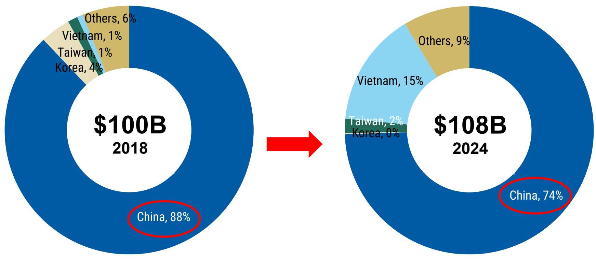

pie chart

| Country | 2018 Value | 2024 Value |
| :--- | :--- | :--- |
| China | 88% | 74% |
| Vietnam | 1% | 15% |
| Taiwan | 1% | 2% |
| Korea | 4% | 0% |
| Others | 6% | 9% |

Supply chain reorientation is happening: In 2018, China accounted for 88% of US tech imports (notebooks, smartphones and game consoles) or \~US\$88bn, but by 2024, China dropped to 74%, or \~US\$80bn.  
Source: US Comtrade, MS.  
Note: Import data includes notebook, smartphones, and game consoles.

## How Much USA Imports from Different Countries by Major Tech Products

<table><tr><td rowspan="2"></td><td>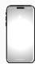</td><td>[SAXK]</td><td>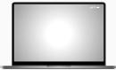</td><td></td><td></td><td>[CAT4]</td><td>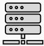</td></tr><tr><td>Smartphone</td><td>iPad</td><td>Notebook</td><td>AirPods</td><td>Apple Watch</td><td>Game Console</td><td>Server</td></tr><tr><td>China</td><td>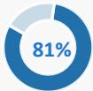</td><td>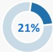</td><td>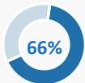</td><td>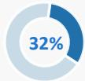</td><td>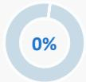</td><td>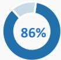</td><td></td></tr><tr><td>Vietnam</td><td>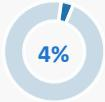</td><td></td><td>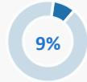</td><td>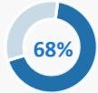</td><td></td><td></td><td></td></tr><tr><td>Thailand</td><td></td><td></td><td>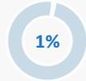</td><td></td><td></td><td>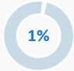</td><td>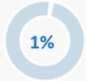</td></tr><tr><td>India</td><td>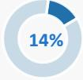</td><td></td><td></td><td></td><td></td><td></td><td></td></tr><tr><td>Mexico</td><td></td><td>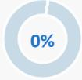</td><td></td><td></td><td></td><td>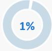</td><td>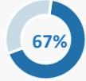</td></tr></table>

US still imports the majority of smartphones, notebooks, and game consoles from China, but Vietnam has become the main exporter of iPads, AirPods, and Apple Watches to the US. We are seeing more notebook production ramping up in Vietnam and Thailand, so these two countries will become more important for the US in the coming years. And for smartphones, we expect India to become a bigger contributor in the coming years as well. And for servers, we think Mexico will continue to be important as servers imported from Mexico into the US is USMCA-eligible for 0% tariff.

## Disclosure Section

The information and opinions in MS were prepared or are disseminated by MS Asia Limited (which accepts the responsibility for its contents) and/or MS Asia (Singapore) Pte. (Registration number 199206298Z) and/or MS Asia (Singapore) Securities Pte Ltd (Registration number 200008434H), regulated by the Monetary Authority of Singapore (which accepts legal responsibility for its contents and should be contacted with respect to any matters arising from, or in connection with, MS), and/or MS Taiwan Limited and/or MS & Co International plc, Seoul Branch, and/or MS Australia Limited (A.B.N. 67 003 734 576, holder of Australian financial services license No. 233742, which accepts responsibility for its contents), and/or MS Wealth Management Australia Pty Ltd (A.B.N. 19 009 145 555, holder of Australian financial services license No. 240813, which accepts responsibility for its contents), and/or MS India Company Private Limited having Corporate Identification No (CIN) U22990MH1998PTC115305, regulated by the Securities and Exchange Board of India ("SEBI") and holder of licenses as a Research Analyst (SEBI Registration No. INH000001105); Stock Broker (SEBI Stock Broker Registration No. INZ000244438), Merchant Banker (SEBI Registration No. INM000011203), and depository participant with National Securities Depository Limited (SEBI Registration No. IN-DP-NSDL-567-2021) having registered office at Altimus, Level 39 & 40, Pandurang Budhkar Marg, Worli, Mumbai 400018, India; Telephone no. +91-22-61181000; Compliance Officer Details: Mr. Tejarshi Hardas, Tel. No.: +91-22-61181000 or Email: tejarshi.hardas@morganstanley.com; Grievance officer details: Mr. Tejarshi Hardas, Tel. No.: +91-22-61181000 or Email: msic-compliance@morganstanley.com which accepts the responsibility for its contents and should be contacted with respect to any matters arising from, or in connection with, MS, and their affiliates (collectively, "MS"). MS India Company Private Limited (MSICPL) may use AI tools in providing research services. All recommendations contained herein are made by the duly qualified research analysts.

For important disclosures, stock price charts and equity rating histories regarding companies that are the subject of this report, please see the MS Disclosure Website at www.morganstanley.com/eqr/disclosures/webapp/generalresearch, or contact your investment representative or MS at 1585 Broadway, (Attention: Research Management), New York, NY, 10036 USA.

For valuation methodology and risks associated with any recommendation, rating or price target referenced in this research report, please contact the Client Support Team as follows: US/Canada +1800 303-2495; Hong Kong +852 2848-5999; Latin America +1718 754-5444 (U.S.); London +44 (0)20-7425-8169; Singapore +65 6834-6860; Sydney +61(0)2-9770-1505; Tokyo +81(0)3-6836-9000. Alternatively you may contact your investment representative or MS at 1585 Broadway, (Attention: Research Management), New York, NY 10036 USA.

## Analyst Certification

The following analysts hereby certify that their views about the companies and their securities discussed in this report are accurately expressed and that they have not received and will not receive direct or indirect compensation in exchange for expressing specific recommendations or views in this report: Howard Kao; Sharon Shih.

## Global Research Conflict Management Policy

MS has been published in accordance with our conflict management policy, which is available at www.morganstanley.com/institutional/research/conflictpolicies. A Portuguese version of the policy can be found at www.morganstanley.com.br

## Important Regulatory Disclosures on Subject Companies

As of May 29, 2026, MS beneficially owned 1% or more of a class of common equity securities of the following companies covered in MS: AAC Technologies Holdings, Accelink Technologies Co. Ltd., Acer Inc., Advanced Wireless Semiconductor Co, AirTAC International, ALPS ALPINE, Apple, Inc., Arm Holdings plc, Asia Vital Components Co. Ltd., AU Optronics, Auras Technology Co Ltd, Bizlink, Catcher Technology, Chenbro, Compal Electronics, Delta Electronics Inc., E Ink Holdings Inc., Eoptolink Technology Inc Ltd, Fositek Corp, Genius Electronic Optical Co. Ltd., Giga-Byte Technology Co. Ltd., Gold Circuit Electronics Ltd., Hiwin Technologies Corp., Innolux, LandMark Optoelectronics Corporation, Lite-On Technology, MediaTek, Murata Manufacturing, Nan Ya PCB, Pegatron Corporation, Qorvo Inc, Qualcomm Inc., Skyworks Solutions Inc, Sunny Optical, Sunonwealth Electric Machine Industry Co, Suzhou TFC Optical Communication Co Ltd., TCL Corp., TDK, Tong Hsing, Unimicron, Visual Photonics Epitaxy Co Ltd, WIN Semiconductors Corp, Wistron Corporation, Wiwynn Corp, Wuhan Jingce Electronic Group Co Ltd, Xiaomi Corp, Yageo Corp., Zhejiang Crystal-Optech Co Ltd, Zhen Ding, Zhongji Innolight Co Ltd, ZTE Corporation. Within the last 12 months, MS managed or co-managed a public offering (or 144A offering) of securities of Samsung Electronics, Wistron Corporation, Wiwynn Corp, Zhen Ding.

Within the last 12 months, MS has received compensation for investment banking services from Lenovo, Wistron Corporation, Wiwynn Corp, Xiaomi Corp, Yageo Corp., Zhen Ding.

In the next 3 months, MS expects to receive or intends to seek compensation for investment banking services from AAC Technologies Holdings, Accton Technology Corporation, Acer Inc., Advantech, AirTAC International, ALPS ALPINE, Apple, Inc., Arm Holdings plc, Asia Vital Components Co. Ltd., Asustek Computer Inc., AU Optronics, Bizlink, Catcher Technology, Chenbro, Compal Electronics, Delta Electronics Inc., E Ink Holdings Inc., Ennostar Inc, Eoptolink Technology Inc Ltd, FIT Hon Teng Ltd, Giga-Byte Technology Co. Ltd., GoerTek Inc, Gold Circuit Electronics Ltd., Hon Hai Precision, Innolux, Lenovo, Lens Technology, Lingyi Itech Guangdong Co, Lite-On Technology, Luxshare Precision Industry Co., Ltd., MediaTek, Murata Manufacturing, Novatek, Pegatron Corporation, Q Technology (Group) Company Ltd, Qualcomm Inc., Quanta Computer Inc., Samsung Electronics, Sanan Optoelectronics, Shenzhen Transsion Holdings Co Ltd, Skyworks Solutions Inc, Suzhou TFC Optical Communication Co Ltd., TCL Corp., TDK, Unimicron, Wistron Corporation, Wiwynn Corp, Xiaomi Corp, Yageo Corp., Yangtze Optical Fibre and Cable JSC Ltd, Zhen Ding, Zhongji Innolight Co Ltd.

Within the last 12 months, MS has received compensation for products and services other than investment banking services from AAC Technologies Holdings, Accton Technology Corporation, Acer Inc., Apple, Inc., Asustek Computer Inc., AU Optronics, BYD Electronics, Compal Electronics, E Ink Holdings Inc., Eoptolink Technology Inc Ltd, Foxconn Technology, Giga-Byte Technology Co. Ltd., GoerTek Inc, Hon Hai Precision, Innolux, Lenovo, Lingyi Itech Guangdong Co, MediaTek, Novatek, Qualcomm Inc., Quanta Computer Inc., Universal Scientific Ind. (Shanghai), Xiaomi Corp, Yageo Corp..

Within the last 12 months, MS has provided or is providing investment banking services to, or has an investment banking client relationship with, the following company: AAC Technologies Holdings, Accton Technology Corporation, Acer Inc., Advantech, AirTAC International, Apple, Inc., Arm Holdings plc, Asia Vital Components Co. Ltd., Asustek Computer Inc., AU Optronics, Bizlink, Catcher Technology, Chenbro, Compal Electronics, Delta Electronics Inc., E Ink Holdings Inc., Ennostar Inc, Eoptolink Technology Inc Ltd, FIT Hon Teng Ltd, Giga-Byte Technology Co. Ltd., GoerTek Inc, Gold Circuit Electronics Ltd., Hon Hai Precision, Innolux, Lenovo, Lens Technology, Lingyi Itech Guangdong Co., Lite-On Technology, Luxshare Precision Industry Co., Ltd., MediaTek,

Murata Manufacturing, Novatek, Pegatron Corporation, Q Technology (Group) Company Ltd, Qualcomm Inc., Quanta Computer Inc., Samsung Electronics, Sanan Optoelectronics, Shenzhen Transsion Holdings Co Ltd, Skyworks Solutions Inc, Suzhou TFC Optical Communication Co Ltd., TCL Corp., TDK, Unimicron, Wistron Corporation, Wiwynn Corp, Xiaomi Corp, Yageo Corp., Yangtze Optical Fibre and Cable JSC Ltd, Zhen Ding, Zhongji Innolight Co Ltd.

Within the last 12 months, MS has either provided or is providing non-investment banking, securities-related services to and/or in the past has entered into an agreement to provide services or has a client relationship with the following company: AAC Technologies Holdings, Accton Technology Corporation, Acer Inc., Apple, Inc., Asustek Computer Inc., AU Optronics, BYD Electronics, Compal Electronics, E Ink Holdings Inc., Eoptolink Technology Inc Ltd, Foxconn Technology, Giga-Byte Technology Co. Ltd., GoerTek Inc, Hon Hai Precision, Innolux, Lenovo, Lingyi Itech Guangdong Co, MediaTek, Novatek, Qualcomm Inc., Quanta Computer Inc., Universal Scientific Ind. (Shanghai), Xiaomi Corp, Yageo Corp., Zhen Ding.

The equity research analysts or strategists principally responsible for the preparation of MS have received compensation based upon various factors, including quality of research, investor client feedback, stock picking, competitive factors, firm revenues and overall investment banking revenues. Equity Research analysts' or strategists' compensation is not linked to investment banking or capital markets transactions performed by MS or the profitability or revenues of particular trading desks.

MS and its affiliates do business that relates to companies/instruments covered in MS, including market making, providing liquidity, fund management, commercial banking, extension of credit, investment services and investment banking. MS sells to and buys from customers the securities/instruments of companies covered in MS on a principal basis. MS may have a position in the debt of the Company or instruments discussed in this report. MS trades or may trade as principal in the debt securities (or in related derivatives) that are the subject of the debt research report.

Certain disclosures listed above are also for compliance with applicable regulations in non-US jurisdictions.

## STOCK RATINGS

MS uses a relative rating system using terms such as Overweight, Equal-weight, Not-Rated or Underweight (see definitions below). MS does not assign ratings of Buy, Hold or Sell to the stocks we cover. Overweight, Equal-weight, Not-Rated and Underweight are not the equivalent of buy, hold and sell. Investors should carefully read the definitions of all ratings used in MS. In addition, since MS contains more complete information concerning the analyst's views, investors should carefully read MS, in its entirety, and not infer the contents from the rating alone. In any case, ratings (or research) should not be used or relied upon as investment advice. An investor's decision to buy or sell a stock should depend on individual circumstances (such as the investor's existing holdings) and other considerations.

## Global Stock Ratings Distribution

(as of May 31, 2026)

The Stock Ratings described below apply to MS's Fundamental Equity Research and do not apply to Debt Research produced by the Firm.

For disclosure purposes only (in accordance with FINRA requirements), we include the category headings of Buy, Hold, and Sell alongside our ratings of Overweight, Equal-weight, Not-Rated and Underweight. MS does not assign ratings of Buy, Hold or Sell to the stocks we cover. Overweight, Equal-weight, Not-Rated and Underweight are not the equivalent of buy, hold, and sell but represent recommended relative weightings (see definitions below). To satisfy regulatory requirements, we correspond Overweight, our most positive stock rating, with a buy recommendation; we correspond Equal-weight and Not-Rated to hold and Underweight to sell recommendations, respectively.

<table><tr><td></td><td colspan="2">Coverage Universe</td><td colspan="3">Investment Banking Clients (IBC)</td><td colspan="2">Other Material Investment Services Clients (MISC)</td></tr><tr><td>Stock Rating Category</td><td>Count</td><td>% of Total</td><td>Count</td><td>% of Total IBC</td><td>% of Rating Category</td><td>Count</td><td>% of Total Other MISC</td></tr><tr><td>Overweight/Buy</td><td>1542</td><td>42%</td><td>465</td><td>51%</td><td>30%</td><td>707</td><td>43%</td></tr><tr><td>Equal-weight/Hold</td><td>1571</td><td>43%</td><td>369</td><td>40%</td><td>23%</td><td>723</td><td>44%</td></tr><tr><td>Not-Rated/Hold</td><td>3</td><td>0%</td><td>0</td><td>0%</td><td>0%</td><td>1</td><td>0%</td></tr><tr><td>Underweight/Sell</td><td>551</td><td>15%</td><td>86</td><td>9%</td><td>16%</td><td>201</td><td>12%</td></tr><tr><td>Total</td><td>3,667</td><td></td><td>920</td><td></td><td></td><td>1632</td><td></td></tr></table>

Data include common stock and ADRs currently assigned ratings. Investment Banking Clients are companies from whom MS received investment banking compensation in the last 12 months. Due to rounding off of decimals, the percentages provided in the "% of total" column may not add up to exactly 100 percent.

## Analyst Stock Ratings

Overweight (O). The stock's total return is expected to exceed the average total return of the analyst's industry (or industry team's) coverage universe, on a risk-adjusted basis, over the next 12-18 months.

Equal-weight (E). The stock's total return is expected to be in line with the average total return of the analyst's industry (or industry team's) coverage universe, on a risk-adjusted basis, over the next 12-18 months.

Not-Rated (NR). Currently the analyst does not have adequate conviction about the stock's total return relative to the average total return of the analyst's industry (or industry team's) coverage universe, on a risk-adjusted basis, over the next 12-18 months.

Underweight (U). The stock's total return is expected to be below the average total return of the analyst's industry (or industry team's) coverage universe, on a risk-adjusted basis, over the next 12-18 months.

Unless otherwise specified, the time frame for price targets included in MS is 12 to 18 months.

## Analyst Industry Views

Attractive (A): The analyst expects the performance of his or her industry coverage universe over the next 12-18 months to be attractive vs. the relevant broad market benchmark, as indicated below.

In-Line (I): The analyst expects the performance of his or her industry coverage universe over the next 12-18 months to be in line with the relevant broad market benchmark, as indicated below.

Cautious (C): The analyst views the performance of his or her industry coverage universe over the next 12-18 months with caution vs. the relevant broad market benchmark, as indicated below.

Benchmarks for each region are as follows: North America - S&P 500; Latin America - relevant MSCI country index or MSCI Latin America Index; Europe - MSCI Europe; Japan - TOPIX; Asia - relevant MSCI country index or MSCI sub-regional index or MSCI AC Asia Pacific ex Japan Index.

Stock Price, Price Target and Rating History (See Rating Definitions)

Samsung Electronics (005930.KS) - As of 06/14/26 GMT in KRW  
Industry : S. Korea Technology  
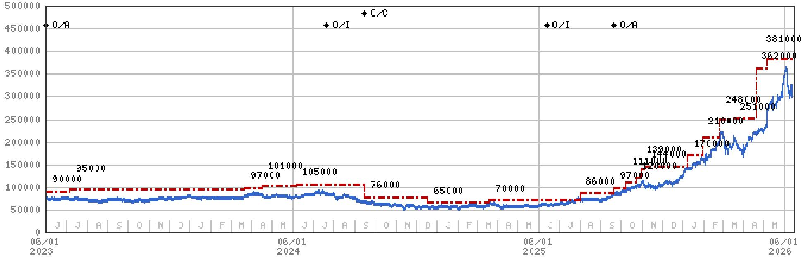

line chart

| Date       | Value   |
| ---------- | ------- |
| 06/01 2023 | 90000   |
| 06/01 2023 | 95000   |
| 06/01 2023 | 97000   |
| 06/01 2023 | 101000  |
| 06/01 2023 | 105000  |
| 06/01 2023 | 76000   |
| 06/01 2023 | 65000   |
| 06/01 2023 | 70000   |
| 06/01 2023 | 86000   |
| 06/01 2023 | 97000   |
| 06/01 2023 | 111000  |
| 06/01 2023 | 133000  |
| 06/01 2023 | 144000  |
| 06/01 2023 | 170000  |
| 06/01 2023 | 217000  |
| 06/01 2023 | 248000  |
| 06/01 2023 | 251000  |
| 06/01 2023 | 362000  |
| 06/01 2023 | 381000  |

Stock Rating History: 6/1/21 : 0/A; 7/19/21 : 0/I; 8/12/21 : 0/C; 10/4/22 : 0/A; 7/21/24 : 0/I; 9/15/24 : 0/C; 6/13/25 : 0/I;  
9/21/25 : 0/A  
Price Target History: 5/18/21 : 93000; 6/8/21 : 98000; 8/12/21 : 89000; 9/15/21 : 95000; 12/3/21 : 97000; 3/18/22 : 95000;  
4/28/22 : 85000; 6/10/22 : 80000; 7/5/22 : 75000; 7/22/22 : 70000; 9/17/22 : 68000; 3/21/23 : 70000; 5/30/23 : 90000; 7/7/23 : 95000;  
3/22/24 : 97000; 4/16/24 : 101000; 6/6/24 : 105000; 9/15/24 : 76000; 12/18/24 : 65000; 3/19/25 : 70000; 8/1/25 : 86000;  
9/21/25 : 97000; 10/8/25 : 111000; 10/23/25 : 120000; 10/30/25 : 139000; 11/5/25 : 144000; 1/8/26 : 170000; 1/30/26 : 210000;  
2/24/26 : 248000; 3/18/26 : 251000; 4/19/26 : 362000; 5/6/26 : 381000  
Source: MS Date Format : MM/DD/YYYY Price Target No Price Target Assigned (NA)  
Stock Price (Not Covered by Current Analyst) Stock Price (Covered by Current Analyst)  
Stock and Industry Ratings (abbreviations below) appear as \* Stock Rating/Industry View  
Stock Ratings: Overweight (O) Equal-weight (E) Underweight (U) Not-Rated (NR) No Rating Available (NA)  
Industry View: Attractive (A) In-line (I) Cautious (C) No Rating (NR)  
Effective January 13, 2014, the stocks covered by MS Asia Pacific will be rated relative to the analyst's industry (or industry team's) coverage.  
Effective January 13, 2014, the industry view benchmarks for MS Asia Pacific are as follows: relevant MSCI country index or MSCI sub-regional index or MSCI AC Asia Pacific ex Japan Index.

## Important Disclosures for MS Smith Barney LLC Customers

Important disclosures regarding any material conflict of interest that can reasonably be expected to have influenced MS Smith Barney LLC's choice of a third-party research provider or the subject company of a third-party research report, are available on the MS Wealth Management disclosure website at www.morganstanley.com/online/researchdisclosures. For MS specific disclosures, you may refer to https://www.morganstanley.com/eqr/disclosures/webapp/generalresearch.

Each MS report is reviewed and approved on behalf of MS Smith Barney LLC. This review and approval is conducted by the same person who reviews the research report on behalf of MS. This could create a conflict of interest.

## Other Important Disclosures

A member of Research who had or could have had access to the research prior to completion owns securities (or related derivatives) in the Apple, Inc.. This person is not a research analyst or a member of research analyst's household.

MS policy is to update research reports as and when the Research Analyst and Research Management deem appropriate, based on developments with the issuer, the sector, or the market that may have a material impact on the research views or opinions stated therein. In addition, certain Research publications are intended to be updated on a regular periodic basis (weekly/monthly/quarterly/annual) and will ordinarily be updated with that frequency, unless the Research Analyst and Research Management determine that a different publication schedule is appropriate based on current conditions.

MS is not acting as a municipal advisor and the opinions or views contained herein are not intended to be, and do not constitute, advice within the meaning of Section 975 of the Dodd-Frank Wall Street Reform and Consumer Protection Act. MS produces an equity research product called a "Tactical Idea." Views contained in a "Tactical Idea" on a particular stock may be contrary to the recommendations or views expressed in research on the same stock. This may be the result of differing time horizons, methodologies, market events, or other factors. For all research available on a particular stock, please contact your sales representative or go to Matrix at http://www.morganstanley.com/matrix.

MS is provided to our clients through our proprietary research portal on Matrix and also distributed electronically by MS to clients. Certain, but not all, MS products are also made available to clients through third-party vendors or redistributed to clients through alternate electronic means as a convenience. For access to all available MS, please contact your sales representative or go to Matrix at http://www.morganstanley.com/matrix.Any access and/or use of MS is subject to MS's Terms of Use (http://www.morganstanley.com/terms.html). By accessing and/or using MS, you are indicating that you have read and agree to be bound by our Terms of Use (http://www.morganstanley.com/terms.html). In addition you consent to MS processing your personal data and using cookies in accordance with our Privacy Policy and our Global Cookies Policy (http://www.morganstanley.com/privacy\_pledge.html), including for the purposes of setting your preferences and to collect readership data so that we can deliver better and more personalized service and products to you. To find out more information about how MS processes personal data, how we use cookies and how to reject cookies see our Privacy Policy and our Global Cookies Policy (http://www.morganstanley.com/privacy\_pledge.html). Please use the provided link to review the Terms and Conditions and Most Important Terms and Conditions for MS India Company Private Limited (https://www.morganstanley.com/assets/pdfs/about-us-global-offices/india/Terms\_and\_conditions.pdf) and the following link to review the audit report (https://ny.matrix.ms.com/eqr/research/webapp/researchdocs/MSICPL\_Morgan\_Stanley\_Research\_Audit\_Report.pdf).

If you do not agree to our Terms of Use and/or if you do not wish to provide your consent to MS processing your personal data or using cookies please do not access our research.

MS does not provide individually tailored investment advice. MS has been prepared without regard to the circumstances and objectives of those who receive it. MS recommends that investors independently evaluate particular investments and strategies, and encourages investors to seek the advice of a financial adviser. The appropriateness of an investment or strategy will depend on an investor's circumstances and objectives. The securities, instruments, or strategies discussed in MS may not be suitable for all investors, and certain investors may not be eligible to purchase or participate in some or all of them. MS is not an offer to buy or sell or the solicitation of an offer to buy or sell any security/instrument or to participate in any particular trading strategy. The value of and income from your investments may vary because of changes in interest rates, foreign exchange rates, default rates, prepayment rates, securities/instruments prices, market indexes, operational or financial conditions of companies or other factors. There may be time limitations on the exercise of options or other rights in securities/instruments transactions. Past performance is not necessarily a guide to future performance. Estimates of future performance are based on assumptions that may not be realized. If provided, and unless otherwise stated, the closing price on the cover page is that of the primary exchange for the subject company's securities/instruments.

The fixed income research analysts, strategists or economists principally responsible for the preparation of MS have received compensation based upon various factors, including quality, accuracy and value of research, firm profitability or revenues (which include fixed income trading and capital markets profitability or revenues), client feedback and competitive factors. Fixed Income Research analysts', strategists' or economists' compensation is not linked to investment banking or capital markets transactions performed by MS or the profitability or revenues of particular trading desks.

The "Important Regulatory Disclosures on Subject Companies" section in MS lists all companies mentioned where MS owns 1% or more of a class of common equity securities of the companies. For all other companies mentioned in MS, MS may have an investment of less than 1% in securities/instruments or derivatives of securities/instruments of companies and may trade them in ways different from those discussed in MS. Employees of MS not involved in the preparation of MS may have investments in securities/instruments or derivatives of securities/instruments of companies mentioned and may trade them in ways different from those discussed in MS. Derivatives may be issued by MS or associated persons.

With the exception of information regarding MS, MS is based on public information. MS makes every effort to use reliable, comprehensive information, but we make no representation that it is accurate or complete. We have no obligation to tell you when opinions or information in MS change apart from when we intend to discontinue equity research coverage of a subject company. Facts and views presented in MS have not been reviewed by, and may not reflect information known to, professionals in other MS business areas, including investment banking personnel.

MS personnel may participate in company events such as site visits and are generally prohibited from accepting payment by the company of associated expenses unless pre-approved by authorized members of Research management.

MS may make investment decisions that are inconsistent with the recommendations or views in this report.

To our readers based in Taiwan or trading in Taiwan securities/instruments: Information on securities/instruments that trade in Taiwan is distributed by MS Taiwan Limited ("MSTL"). Such information is for your reference only. The reader should independently evaluate the investment risks and is solely responsible for their investment decisions. MS may not be distributed to the public media or quoted or used by the public media without the express written consent of MS. Any non-customer reader within the scope of Article 7-1 of the Taiwan Stock Exchange Recommendation Regulations accessing and/or receiving MS is not permitted to provide MS to any third party (including but not limited to related parties, affiliated companies and any other third parties) or engage in any activities regarding MS which may create or give the appearance of creating a conflict of interest. Information on securities/instruments that do not trade in Taiwan is for informational purposes only and is not to be construed as a recommendation or a solicitation to trade in such securities/instruments. MSTL may not execute transactions for clients in these securities/instruments.

Certain information in MS was sourced by employees of the Shanghai Representative Office of MS Asia Limited for the use of MS Asia Limited.

MS is not incorporated under PRC law and the research in relation to this report is conducted outside the PRC. MS does not constitute an offer to sell or the solicitation of an offer to buy any securities in the PRC. PRC investors shall have the relevant qualifications to invest in such securities and shall be responsible for obtaining all relevant approvals, licenses, verifications and/or registrations from the relevant governmental authorities themselves. Neither this report nor any part of it is intended as, or shall constitute, provision of any consultancy or advisory service of securities investment as defined under PRC law. Such information is provided for your reference only.

MS is disseminated in Brazil by MS C.T.V.M. S.A. located at Av. Brigadeiro Faria Lima, 3600, 6th floor, São Paulo - SP, Brazil; and is regulated by the Comissão de Valores Mobiliários; in Mexico by MS México, Casa de Bolsa, S.A. de C.V which is regulated by Comision Nacional Bancaria y de Valores. Paseo de los Tamarindos 90, Torre 1, Col. Bosques de las Lomas Floor 29, 05120 Mexico City; in Japan by MS MUFG Securities Co., Ltd. and, for Commodities related research reports only, MS Capital Group Japan Co., Ltd; in Hong Kong by MS Asia Limited (which accepts responsibility for its contents) and by MS Bank Asia Limited; in Singapore by MS Asia (Singapore) Pte. (Registration number 199206298Z) and/or MS Asia (Singapore) Securities Pte Ltd (Registration number 200008434H), regulated by the Monetary Authority of Singapore (which accepts legal responsibility for its contents and should be contacted with respect to any matters arising from, or in connection with, MS) and by MS Bank Asia Limited, Singapore Branch (Registration number T14FC0118); in Australia to "wholesale clients" within the meaning of the Australian Corporations Act by MS Australia Limited A.B.N. 67 003 734 576, holder of Australian financial services license No. 23374-2, which accepts responsibility for its contents; in Australia to "wholesale clients" and "retail clients" within the meaning of the Australian Corporations Act by MS Wealth Management Australia Pty Ltd (A.B.N. 19 009 145 555, holder of Australian financial services license No. 240813, which accepts responsibility for its contents; in Korea by MS & Co International plc, Seoul Branch; in India by MS India Company Private Limited having Corporate Identification No (CIN) U22990MH1998PTC115305, regulated by the Securities and Exchange Board of India ("SEBI") and holder of licenses as a Research Analyst (SEBI Registration No. INH000001105); Stock Broker (SEBI Stock Broker Registration No. INZ000244438), Merchant Banker (SEBI Registration No. INM000011203), and depository participant with National Securities Depository Limited (SEBI Registration No. IN-DP-NSDL-567-2021) having registered office at Altimus, Level 39 & 40, Pandurang Budhkar Marg, Worli, Mumbai 400018, India; Telephone no. +91-22-61181000; Compliance Officer Details: Mr. Tejarshi Hardas, Tel. No.: +91-22-61181000 or Email: tejarshi.hardas@morganstanley.com; Grievance officer details: Mr. Tejarshi Hardas, Tel. No.: +91-22-61181000 or Email: msic-compliance@morganstanley.com. MS India Company Private Limited (MSICPL) may use AI tools in providing research services. All recommendations contained herein are made by the duly qualified research analysts; in Canada by MS Canada Limited; in Germany and the European Economic Area where required by MS Europe S.E., authorised and regulated by Bundesanstalt fuer Finanzdienstleistungsaufsicht (BaFin) under the reference number 149169; in the US by MS & Co. LLC, which accepts responsibility for its contents. MS & Co. International plc, authorized by the Prudential Regulation Authority and regulated by the Financial Conduct Authority and the Prudential Regulation Authority, disseminates in the UK research that it has prepared, and research which has been prepared by any of its affiliates, only to persons who (i) are investment professionals falling within Article 19(5) of the Financial Services and Markets Act 2000 (Financial Promotion) Order 2005 (as amended, the "Order"); (ii) are persons who are high net worth entities falling within Article 49(2)(a) to (d) of the Order; or (iii) are persons to whom an invitation or inducement to engage in investment activity (within the meaning of section 21 of the Financial Services and Markets Act 2000, as amended) may otherwise lawfully be communicated or caused to be communicated. RMB MS Proprietary Limited is a member of the JSE Limited and A2X (Pty) Ltd. RMB MS Proprietary Limited is a joint venture owned equally by MS International Holdings Inc. and RMB Investment Advisory (Proprietary) Limited, which is wholly owned by FirstRand Limited. The information in MS is being disseminated by MS Saudi Arabia, regulated by the Capital Market Authority in the Kingdom of Saudi Arabia, and is directed at Sophisticated investors only.

MS Hong Kong Securities Limited is the liquidity provider/market maker for securities of AAC Technologies Holdings, BYD Electronics, FIT Hon Teng Ltd, Hon Hai Precision, Lenovo, Lens Technology, Sunny Optical, Xiaomi Corp, Yangtze Optical Fibre and Cable JSC Ltd, ZTE Corporation listed on the Stock Exchange of Hong Kong Limited. An updated list can be found on HKEx website: http://www.hkex.com.hk.

The information in MS is being communicated by MS & Co. International plc (DIFC Branch), regulated by the Dubai Financial Services Authority (the DFSA) or by MS & Co. International plc (ADGM Branch), regulated by the Financial Services Regulatory Authority Abu Dhabi (the FSRA), and is directed at Professional Clients only, as defined by the DFSA or the FSRA, respectively. The financial products or financial services to which this research relates will only be made available to a customer who we are satisfied meets the regulatory criteria of a Professional Client. A distribution of the different MS Research ratings or recommendations, in percentage terms for Investments in each sector covered, is available upon request from your sales representative.

The information in MS is being communicated by MS & Co. International plc (QFC Branch), regulated by the Qatar Financial Centre Regulatory Authority (the QFCRA), and is directed at business customers and market counterparties only and is not intended for Retail Customers as defined by the QFCRA.

As required by the Capital Markets Board of Turkey, investment information, comments and recommendations stated here, are not within the scope of investment advisory activity. Investment advisory service is provided exclusively to persons based on their risk and income preferences by the authorized firms. Comments and recommendations stated here are general in nature. These opinions may not fit to your financial status, risk and return preferences. For this reason, to make an investment decision by relying solely to this information stated here may not bring about outcomes that fit your expectations.

The following companies do business in countries which are generally subject to comprehensive sanctions programs administered or enforced by the U.S. Department of the Treasury's Office of Foreign Assets Control ("OFAC") and by other countries and multi-national bodies: Samsung Electronics.

The trademarks and service marks contained in MS are the property of their respective owners. Third-party data providers make no warranties or representations relating to the accuracy, completeness, or timeliness of the data they provide and shall not have liability for any damages relating to such data. The Global Industry Classification Standard (GICS) was developed by and is the exclusive property of MSCI and S&P.

MS, or any portion thereof may not be reprinted, sold or redistributed without the written consent of MS.

Indicators and trackers referenced in MS may not be used as, or treated as, a benchmark under Regulation EU 2016/1011, or any other similar framework.

The issuers and/or fixed income products recommended or discussed in certain fixed income research reports may not be continuously followed. Accordingly, investors should regard those fixed income research reports as providing stand-alone analysis and

should not expect continuing analysis or additional reports relating to such issuers and/or individual fixed income products.

MS may hold, from time to time, material financial and commercial interests regarding the company subject to the Research report.

Registration granted by SEBI and certification from the National Institute of Securities Markets (NISM) in no way guarantee performance of the intermediary or provide any assurance of returns to investors. Investment in securities market are subject to market risks. Read all the related documents carefully before investing.

INDUSTRY COVERAGE: Greater China Technology Hardware

<table><tr><td>COMPANY (TICKER)</td><td>RATING (AS OF)</td><td>PRICE* (06/12/2026)</td></tr><tr><td colspan="3">Andy Meng, CFA</td></tr><tr><td>AAC Technologies Holdings (2018.HK)</td><td>O (01/29/2024)</td><td>HK$42.92</td></tr><tr><td>Accelink Technologies Co. Ltd. (002281.SZ)</td><td>U (05/12/2022)</td><td>Rmb204.97</td></tr><tr><td>BYD Electronics (0285.HK)</td><td>O (04/28/2023)</td><td>HK$24.78</td></tr><tr><td>China TransInfo Technology Co Ltd (002373.SZ)</td><td>E (07/18/2023)</td><td>Rmb7.40</td></tr><tr><td>Dahua Technology Co. Ltd. (002236.SZ)</td><td>E (12/12/2024)</td><td>Rmb15.95</td></tr><tr><td>Eoptolink Technology Inc Ltd (300502.SZ)</td><td>O (02/27/2026)</td><td>Rmb506.46</td></tr><tr><td>Genius Electronic Optical Co. Ltd. (3406.TW)</td><td>E (04/23/2025)</td><td>NT$662.00</td></tr><tr><td>Gosuncn Technology Group Co Ltd (300098.SZ)</td><td>U (11/07/2022)</td><td>Rmb4.96</td></tr><tr><td>HIKVision Digital Technology (002415.SZ)</td><td>E (12/12/2024)</td><td>Rmb30.24</td></tr><tr><td>Largan Precision (3008.TW)</td><td>E (10/17/2025)</td><td>NT$4,020.00</td></tr><tr><td>LianChuang Electronic Technology Co Ltd (002036.SZ)</td><td>U (06/12/2024)</td><td>Rmb7.86</td></tr><tr><td>OFILM Group Co Ltd (002456.SZ)</td><td>U (06/12/2024)</td><td>Rmb8.70</td></tr><tr><td>Q Technology (Group) Company Ltd (1478.HK)</td><td>U (03/23/2026)</td><td>HK$8.13</td></tr><tr><td>Quectel Wireless Solutions Co Ltd (603236.SS)</td><td>E (10/09/2024)</td><td>Rmb55.50</td></tr><tr><td>Shanghai Conant Optical Co Ltd (2276.HK)</td><td>O (04/10/2026)</td><td>HK$38.58</td></tr><tr><td>Shenzhen Transsion Holdings Co Ltd (688036.SS)</td><td>E (03/23/2026)</td><td>Rmb53.67</td></tr><tr><td>Sunny Optical (2382.HK)</td><td>E (03/23/2026)</td><td>HK$71.55</td></tr><tr><td>Suzhou TFC Optical Communication Co Ltd. (300394.SZ)</td><td>E (11/06/2025)</td><td>Rmb280.95</td></tr><tr><td>Wingtech Technology Co Ltd (600745.SS)</td><td>U (05/18/2026)</td><td>Rmb17.36</td></tr><tr><td>Xiaomi Corp (1810.HK)</td><td>O (04/14/2021)</td><td>HK$26.20</td></tr><tr><td>Yangtze Optical Fibre and Cable JSC Ltd (601869.SS)</td><td>U (10/13/2021)</td><td>Rmb436.50</td></tr><tr><td>Yangtze Optical Fibre and Cable JSC Ltd (6869.HK)</td><td>E (04/20/2023)</td><td>HK$226.60</td></tr><tr><td>Yongxin Optics Co Ltd (603297.SS)</td><td>E (11/15/2022)</td><td>Rmb117.30</td></tr><tr><td>Zhejiang Crystal-Optech Co Ltd (002273.SZ)</td><td>O (11/15/2022)</td><td>Rmb32.39</td></tr><tr><td>Zhongji Innolight Co Ltd (300308.SZ)</td><td>++</td><td>Rmb1,149.00</td></tr><tr><td>ZTE Corporation (0763.HK)</td><td>O (06/04/2026)</td><td>HK$26.00</td></tr><tr><td>ZTE Corporation (000063.SZ)</td><td>E (06/04/2026)</td><td>Rmb36.35</td></tr><tr><td colspan="3">Derrick Yang</td></tr><tr><td>Accton Technology Corporation (2345.TW)</td><td>O (06/06/2024)</td><td>NT$2,335.00</td></tr><tr><td>Advantech (2395.TW)</td><td>O (01/20/2021)</td><td>NT$473.00</td></tr><tr><td>AirTAC International (1590.TW)</td><td>O (04/16/2025)</td><td>NT$1,290.00</td></tr><tr><td>AU Optronics (2409.TW)</td><td>E (02/10/2026)</td><td>NT$23.50</td></tr><tr><td>Bizlink (3665.TW)</td><td>O (03/10/2025)</td><td>NT$2,310.00</td></tr><tr><td>BOE Technology (000725.SZ)</td><td>O (09/06/2019)</td><td>Rmb5.57</td></tr><tr><td>Chenbro (8210.TW)</td><td>O (07/23/2025)</td><td>NT$1,475.00</td></tr><tr><td>Chroma Ate Inc. (2360.TW)</td><td>O (10/05/2021)</td><td>NT$2,295.00</td></tr><tr><td>E Ink Holdings Inc. (8069.TWO)</td><td>O (05/11/2026)</td><td>NT$196.00</td></tr><tr><td>Ennostar Inc (3714.TW)</td><td>U (09/23/2022)</td><td>NT$64.40</td></tr><tr><td>Hiwin Technologies Corp. (2049.TW)</td><td>O (03/30/2026)</td><td>NT$323.50</td></tr><tr><td>Innolux (3481.TW)</td><td>E (04/07/2025)</td><td>NT$48.55</td></tr><tr><td>King Slide Works Co. Ltd. (2059.TW)</td><td>O (11/08/2023)</td><td>NT$6,910.00</td></tr><tr><td>Lens Technology (300433.SZ)</td><td>E (07/22/2020)</td><td>Rmb41.14</td></tr><tr><td>Radiant Opto-Electronics Corporation (6176.TW)</td><td>E (03/01/2024)</td><td>NT$91.30</td></tr><tr><td>Sanan Optoelectronics (600703.SS)</td><td>U (08/21/2023)</td><td>Rmb13.92</td></tr><tr><td>TCL Corp. (000100.SZ)</td><td>E (04/07/2025)</td><td>Rmb4.55</td></tr><tr><td>Tianma Microelectronics (000050.SZ)</td><td>U (01/24/2018)</td><td>Rmb7.51</td></tr><tr><td>Wuhan Jingce Electronic Group Co Ltd (300567.SZ)</td><td>E (11/26/2021)</td><td>Rmb196.30</td></tr></table>

Howard Kao

<table><tr><td>Acer Inc. (2353.TW)</td><td>U (04/23/2025)</td><td>NT$36.70</td></tr><tr><td>Asustek Computer Inc. (2357.TW)</td><td>U (11/16/2025)</td><td>NT$785.00</td></tr><tr><td>Compal Electronics (2324.TW)</td><td>U (04/23/2025)</td><td>NT$36.35</td></tr><tr><td>FIT Hon Teng Ltd (6088.HK)</td><td>O (11/03/2025)</td><td>HK$7.36</td></tr><tr><td>Giga-Byte Technology Co. Ltd. (2376.TW)</td><td>E (11/16/2025)</td><td>NT$342.00</td></tr><tr><td>Gold Circuit Electronics Ltd. (2368.TW)</td><td>O (10/06/2022)</td><td>NT$1,320.00</td></tr><tr><td>Inspur Electronic Information (000977.SZ)</td><td>E (08/28/2023)</td><td>Rmb57.86</td></tr><tr><td>Lenovo (0992.HK)</td><td>E (11/16/2025)</td><td>HK$22.34</td></tr><tr><td>Lotes Co. Ltd. (3533.TW)</td><td>E (05/12/2025)</td><td>NT$2,240.00</td></tr><tr><td>Nan Ya PCB (8046.TW)</td><td>O (02/23/2026)</td><td>NT$819.00</td></tr><tr><td>Pegatron Corporation (4938.TW)</td><td>E (03/25/2026)</td><td>NT$93.10</td></tr><tr><td>Quanta Computer Inc. (2382.TW)</td><td>O (05/01/2023)</td><td>NT$372.00</td></tr><tr><td>Shengyi Technology Co Ltd. (600183.SS)</td><td>E (05/26/2022)</td><td>Rmb151.28</td></tr><tr><td>Shennan Circuits Co Ltd (002916.SZ)</td><td>E (08/24/2023)</td><td>Rmb379.50</td></tr><tr><td>Unimicron (3037.TW)</td><td>O (02/23/2026)</td><td>NT$902.00</td></tr><tr><td>Wistron Corporation (3231.TW)</td><td>O (07/12/2023)</td><td>NT$156.00</td></tr><tr><td>Wiwynn Corp (6669.TW)</td><td>O (11/10/2025)</td><td>NT$4,850.00</td></tr><tr><td>Yageo Corp. (2327.TW)</td><td>O (10/28/2025)</td><td>NT$855.00</td></tr><tr><td>Zhen Ding (4958.TW)</td><td>O (05/18/2026)</td><td>NT$552.00</td></tr></table>

Sharon Shih

<table><tr><td>Asia Vital Components Co. Ltd. (3017.TW)</td><td>O (07/30/2024)</td><td>NT$2,405.00</td></tr><tr><td>Auras Technology Co Ltd (3324.TWO)</td><td>E (05/04/2023)</td><td>NT$1,055.00</td></tr><tr><td>Catcher Technology (2474.TW)</td><td>U (11/17/2025)</td><td>NT$205.50</td></tr><tr><td>Delta Electronics Inc. (2308.TW)</td><td>O (07/13/2017)</td><td>NT$2,215.00</td></tr><tr><td>Fositek Corp (6805.TW)</td><td>O (06/25/2025)</td><td>NT$1,825.00</td></tr><tr><td>Foxconn Industrial Internet Co. Ltd. (601138.SS)</td><td>O (07/10/2019)</td><td>Rmb70.13</td></tr><tr><td>Foxconn Technology (2354.TW)</td><td>U (04/23/2025)</td><td>NT$57.00</td></tr><tr><td>GoerTek Inc (002241.SZ)</td><td>U (04/23/2025)</td><td>Rmb23.01</td></tr><tr><td>Hon Hai Precision (2317.TW)</td><td>O (03/15/2024)</td><td>NT$260.50</td></tr><tr><td>LandMark Optoelectronics Corporation (3081.TWO)</td><td>E (03/26/2026)</td><td>NT$2,195.00</td></tr><tr><td>Lingyi Itech Guangdong Co (002600.SZ)</td><td>U (04/23/2025)</td><td>Rmb14.01</td></tr><tr><td>Lite-On Technology (2301.TW)</td><td>E (01/15/2025)</td><td>NT$217.00</td></tr><tr><td>Luxshare Precision Industry Co., Ltd. (002475.SZ)</td><td>O (10/24/2016)</td><td>Rmb63.76</td></tr><tr><td>Sunonwealth Electric Machine Industry Co (2421.TW)</td><td>E (02/23/2024)</td><td>NT$144.00</td></tr><tr><td>Tong Hsing (6271.TW)</td><td>E (03/18/2019)</td><td>NT$238.50</td></tr><tr><td>Visual Photonics Epitaxy Co Ltd (2455.TW)</td><td>E (09/11/2023)</td><td>NT$352.00</td></tr></table>

Stock Ratings are subject to change. Please see latest research for each company.  
\* Historical prices are not split adjusted.

© 2026 MS