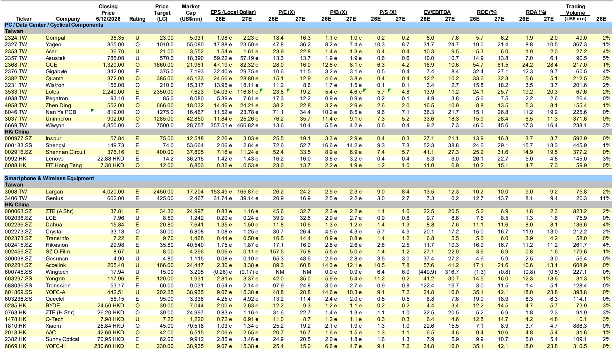
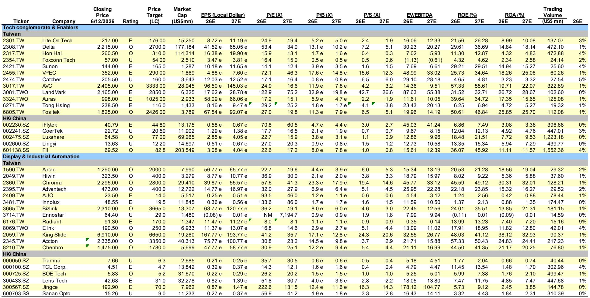
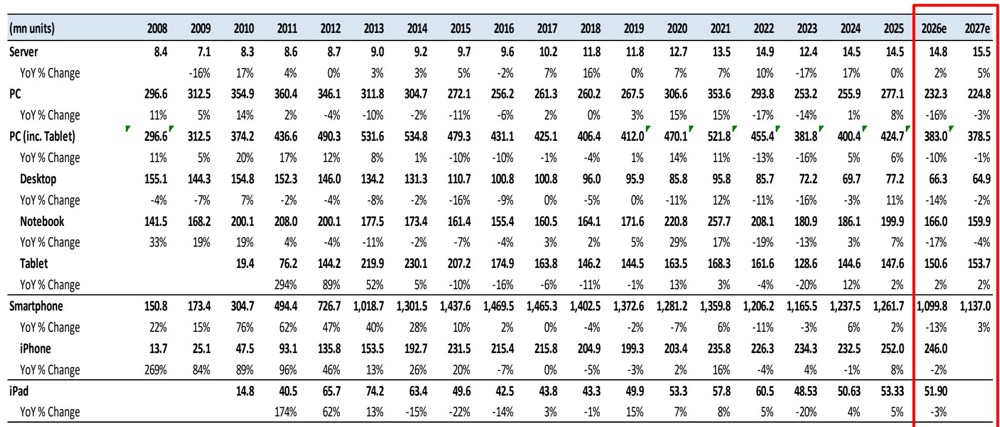

# AI Infrastructure Is No Longer Just About GPU Supply: The Next Investment Cycle Belongs to the Rack, the Power System, and the Component Bottleneck

The prevailing narrative in AI hardware investing has been simple: buy the GPU, bet on the chip. That thesis is now incomplete. As the latest Asia Pacific technology hardware research from a major global investment bank makes clear, the next phase of value creation in AI infrastructure is shifting from the silicon itself to the entire system that surrounds it. The server rack, the power delivery architecture, the interconnect fabric, and the printed circuit board substrates are where the most compelling risk-reward profiles now reside. This is not a marginal shift. It is a structural re-rating of the hardware supply chain, driven by design upgrades that are far more consequential for component makers than for chip designers.

The report, focused on Greater China technology hardware, identifies a clear inflection point. The upcoming Vera Rubin platform, the Kyber architecture, and the LPX/Vera CPU rack represent not incremental improvements but fundamental redesigns of how AI compute is packaged and powered. For investors who have been waiting for the "second derivative" opportunity in AI hardware, this is it. The GPU remains the engine, but the chassis, the cooling, the power conversion, and the high-speed interconnect are becoming the binding constraints on system performance. And where constraints emerge, pricing power follows.

What follows is a structured interpretation of the report's core arguments, extended into strategic implications that go beyond the data disclosed. The goal is not to summarize, but to synthesize: to show why the next 18 months in AI hardware investing will look very different from the last 18 months, and to identify the analytical questions that remain unresolved.

## The Vera Rubin and Kyber Design Upgrades Are Not Just Product Cycles; They Are Supply Chain Rewrites

The most important single sentence in the report is buried in the investment summary: "Major design upgrades for upcoming Vera Rubin platform, Kyber architecture and LPX/Vera CPU rack." To the casual reader, this sounds like a routine product roadmap update. It is anything but. These platforms represent a shift from a GPU-centric architecture to a system-centric one, where the physical integration of compute, memory, interconnect, and power determines real-world performance.

What does this mean for the supply chain? In a GPU-centric world, the primary value accrues to the chip designer and the foundry. In a system-centric world, value migrates to the companies that solve the integration challenges. The rack becomes a product, not a container. The power supply becomes a competitive differentiator, not a commodity. The printed circuit board becomes a high-performance substrate that must handle unprecedented signal integrity and thermal demands.

The report explicitly calls out the opportunities in "AI GPU and ASIC server/rack design upgrades." This is not a vague endorsement. It is a directional call that the hardware ecosystem is about to undergo a re-architecture that will reward companies with design-in capabilities, not just manufacturing scale. The implication is clear: investors who continue to overweight pure GPU exposure are missing the most dynamic segment of the value chain.

## The Supply Chain Is Shifting from a Volume Game to a Complexity Game, and That Changes the Margin Structure

For the past two years, the AI server supply chain has been driven by one thing: volume. Hyperscalers ordered as many GPU servers as they could get, and the ODM ecosystem responded with brute-force manufacturing capacity. The report now signals a transition. The focus is shifting to "AI server power solution (800 VDC), PCB/ABF substrate supply tightness, data network/interconnect/CPO upgrade."

Each of these items represents a technical bottleneck that, if unresolved, limits the performance of the entire system. The move to 800 VDC power distribution is not a minor specification change. It requires new power conversion architectures, new connectors, new safety certifications, and new thermal management solutions. The ABF substrate supply tightness is already well known, but the report suggests it will persist and intensify as the new platforms require larger, more complex substrates with higher layer counts.

The strategic insight here is that the margin structure of the supply chain is improving exactly where these bottlenecks exist. Companies that can deliver differentiated solutions for power, substrate, and interconnect are moving from single-digit margins toward mid-to-high-teens margins. The report's valuation comparison table shows multiple companies trading at P/E multiples that do not yet reflect this margin expansion. For example, Delta Electronics at 53.4x 2026E earnings looks expensive until one considers that its power solutions are becoming mission-critical for the 800 VDC transition. The multiple is a premium for scarcity, not for growth.

## The GB300 Rack Delivery Cycle Is a Litmus Test for Execution, and the Market Is Underpricing the Risk

The report identifies "smooth GB300 server rack delivery plus attractive risk-reward for AI server ODMs" as a key opportunity. This is a carefully hedged statement. The word "smooth" is doing a lot of work. The GB300 rack is the first major platform that requires full system-level integration from the ODM, including power, cooling, networking, and mechanical design. It is not a simple motherboard-in-a-box. It is a mini data center in a rack.

The risk that the report does not fully elaborate is execution. The ODMs that have historically excelled at high-volume, low-complexity assembly are now being asked to deliver systems that require thermal simulation, power integrity analysis, and firmware integration. The report mentions "supply shortage impact could potentially delay the shipment pace," but the deeper risk is that the complexity of the GB300 rack overwhelms the design and test capabilities of the traditional ODM ecosystem.

This is where the report's stock picks become interesting. The list includes Wistron, FII/Hon Hai, Wiwynn, Quanta, and Delta Electronics. These are not the same companies. Wistron and Quanta have deep experience in system integration. Hon Hai has scale and vertical integration. Delta has power expertise. The market is likely to differentiate sharply between those who execute and those who do not. The report's "attractive risk-reward" call is conditional on execution, and the variance of outcomes is wider than the consensus assumes.

## The Report's Blind Spot: The Geopolitical Risk to AI Infrastructure Spending Is Under-Analyzed

The report acknowledges "geopolitical tension that impacts AI data center infrastructure spending" as a potential risk, but it does not develop the argument. This is a meaningful gap. The AI infrastructure buildout is not occurring in a vacuum. It is happening against a backdrop of export controls, technology decoupling, and shifting alliance structures. The Greater China supply chain is both a beneficiary and a target of these dynamics.

Consider the following unresolved question: If export controls on advanced chips tighten further, what happens to the demand for server racks and power systems in China? The report assumes a baseline of continued spending, but the scenario where Chinese hyperscalers are forced to reduce their AI infrastructure plans due to chip supply constraints is not modeled. The ODMs that have diversified into non-China markets, such as Quanta and Wiwynn with their Southeast Asia capacity, are better positioned. The report hints at this by including Luxshare and Lenovo in the "Edge AI" category, but it does not connect the dots between geopolitical risk and supply chain diversification.

Another blind spot is the commodity price risk. The report mentions "raw material price hike (copper, nickel) and supply tightness a margin headwind," but it does not quantify the exposure. Power cables, connectors, and thermal solutions are copper-intensive. A sustained copper price rally would compress margins for companies like BizLink and FIT Hon Teng. The report's valuation multiples do not appear to incorporate this risk. Investors would be wise to stress-test the margin assumptions for the component suppliers, especially those with high copper content in their bill of materials.

## A Decision Framework for Navigating the AI Hardware Supply Chain in 2026-2027

The report provides a wealth of data but does not offer a structured framework for decision-making. The following framework is derived from the report's logic and is intended to help investors allocate capital across the supply chain with a clear risk-reward lens.

First, classify each company by its exposure to the three key bottlenecks: power architecture, substrate supply, and system integration. Companies that sit at the intersection of two or more bottlenecks have the highest pricing power and the lowest risk of commoditization. Delta Electronics (power architecture and system integration) and Unimicron (substrate supply and PCB) are examples.

Second, assess the company's diversification away from consumer electronics. The report warns that "consumer electronics (smartphones/PC) demand and margin impact in 2H impacted by memory inflation." Companies with high consumer exposure, such as Luxshare and Lenovo, face a headwind that is independent of their AI server business. The market is likely to penalize mixed models in the near term.

Third, evaluate the company's geographic production footprint. The report does not emphasize this, but it is critical. Companies with manufacturing capacity outside of Taiwan and China, particularly in Vietnam, Thailand, and Mexico, have a structural advantage in serving hyperscalers that are increasingly demanding supply chain resilience. Wistron and Quanta have made significant investments in Southeast Asia. Hon Hai has global scale. Smaller ODMs may lack this optionality.

Fourth, look at the valuation relative to the earnings growth trajectory. The report's P/E multiples for 2026E range from 8.0x (Radiant Opto) to 222.6x (Jingce). The dispersion is enormous, and it reflects not just growth expectations but also market structure. Companies with high multiples, such as Delta at 53.4x and LandMark at 122.9x, are pricing in a perfect execution scenario. Companies with low multiples, such as Wistron at 11.2x and Compal at 18.4x, may be undervaluing the upside from the GB300 cycle. The framework suggests a barbell approach: own the high-multiple bottleneck companies for structural growth and the low-multiple ODMs for cyclical re-rating.

## The Unanswered Questions That Make the Full Report Essential

No single report can answer every question, and this one leaves several meaningful open issues that should drive further analysis. First, the report does not quantify the revenue uplift from the Vera Rubin and Kyber platforms for individual ODMs. The "design upgrade" language is directional, but the magnitude matters. A 10% increase in server rack value for a company like Wistron is very different from a 30% increase.

Second, the report does not address the competitive dynamics in the ASIC server market. It mentions "AI ASIC server upgrade and volume expansion magnitude - mainly TPU and Trainium platform," but it does not analyze how the ASIC supply chain differs from the GPU supply chain. ASIC servers tend to have lower power requirements and different cooling needs, which could benefit a different set of component suppliers.

Third, the report does not model the impact of a potential slowdown in hyperscaler capital expenditure. The current cycle is driven by Meta, Microsoft, Amazon, and Google. If any of these companies signals a capex pause, the entire supply chain would be affected. The report's "Industry View In-Line" rating suggests a neutral stance, but it does not provide a downside scenario.

Finally, the report does not explore the second-order implications of the 800 VDC power architecture transition. This is not just a component change. It affects the entire data center electrical infrastructure, from the UPS to the busway to the rack power distribution unit. The companies that benefit from this transition may not be the ones the market is currently focused on.

## Join the Community to Read the Full Report and Review the Original Charts

The analysis above is derived from a single research report, but the data, valuation tables, and stock ratings contain far more granularity than can be covered here. The original report includes detailed financial projections, peer comparisons, and a comprehensive list of stock ratings and price targets that are essential for building a complete investment thesis.

For serious investors who want to go beyond the summary and engage with the underlying data, the full report is available in the community. The valuation comparison tables alone are worth the read: they show P/E, P/B, P/S, EV/EBITDA, ROE, and ROA for over 50 companies across Taiwan, China, and Hong Kong. These are not publicly available in this consolidated format anywhere else.

Join the community to read the full report and review the original charts.

*This article is for learning and discussion only and does not constitute investment advice.*

Personal reading notes and learning share only. Not investment advice.

