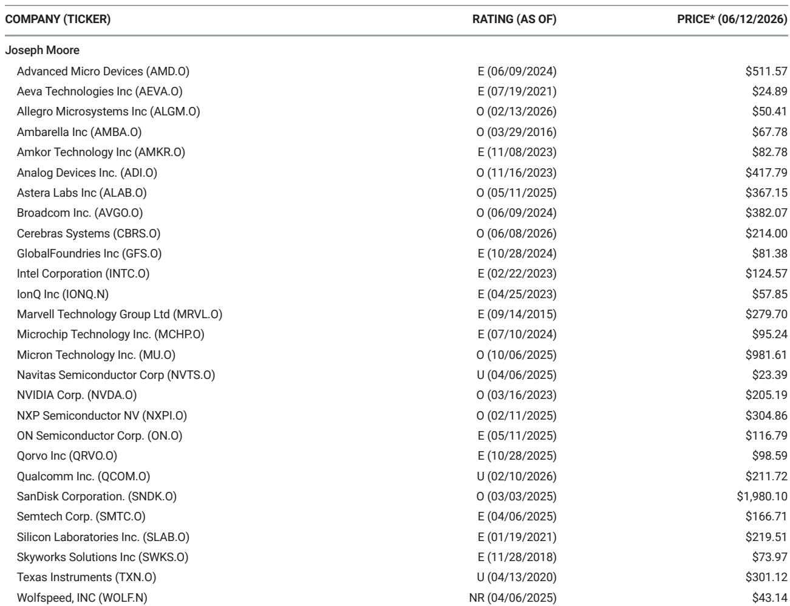
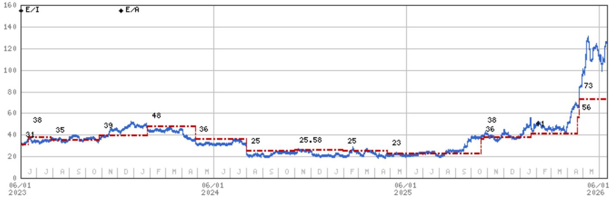
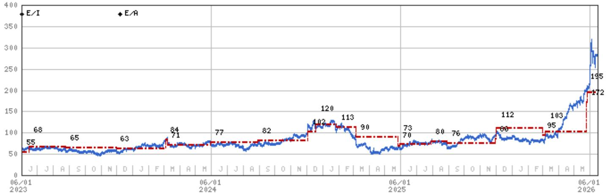

# 摩根斯坦利：AI互联正在从“规模扩张”转向“架构重构”，市场低估了互联层定价权的转移

这份摩根斯坦利半导体团队在2026年6月发布的巴士巡回路演纪要不是一份常规的企业拜访汇总。它传递了一个更值得关注的结构性信号：AI基础设施的投资重心，正在从算力芯片的比拼，转向互联架构的决定性博弈。三位CEO——Astera Labs、Marvell、Intel——不约而同地将叙事焦点放在互联层，而非单纯的算力性能上。这并非巧合，而是AI基础设施从粗放扩张进入精细化架构优化的必然产物。

研报的核心判断可以概括为：互联层正在从“必要组件”升级为“系统架构的定义者”。谁能在光学互联、PCIe生态、定制SerDes和先进封装上同时建立优势，谁就能在下一阶段的AI基础设施投资中占据定价权。而目前市场对这一转变的定价，仍然偏保守。

以下是基于该报告提炼的五个关键洞察，以及一个报告尚未完全回答的关键问题。

## 1. 互联层从“被动跟随”变为“主动定义”，Astera和Marvell正在争夺架构主导权

过去两年，AI基础设施的投资叙事几乎完全由GPU的算力密度和内存带宽主导。互联层（Scale-up与Scale-out网络）被视为“跟着GPU走”的附属品。但这份报告中的两个信号表明，情况正在逆转。

首先，Astera Labs管理层明确表示，其PCIe交换机正在被客户称为“开放生态的NVSwitch”。这不是一个营销话术，而是一个架构信号。NVSwitch是NVIDIA用于GPU间高速互联的专有技术。当客户开始将第三方PCIe交换机类比为NVSwitch时，意味着互联层正在从“标准化连接”走向“架构差异化”。Astera正在定义开放生态中的互联标准，而非仅仅提供兼容性产品。

其次，Marvell管理层将公司定位为“少数几家同时覆盖DCI、die-to-die IP、Scale-out交换、Scale-up交换、光学、SerDes、CXL、NIC和定制芯片的供应商”。这不仅是产品线广度的问题，更是系统集成能力的体现。当客户面对供应链约束和异构计算集成复杂性时，一个能提供“全栈互联”的供应商，其议价权远高于单一组件供应商。

这一转变的含义是：互联层的价值捕获正在从“按组件定价”转向“按架构价值定价”。市场对Astera和Marvell的估值模型，可能需要从“半导体公司”切换到“基础设施架构公司”。

## 2. PCIe的生命周期比市场预期的更长，中国市场的结构性机会被低估

市场普遍认为，随着AI工作负载向更高带宽的互联协议（如UAL、NVLink）迁移，PCIe将逐渐被边缘化。但这份报告提供了两个相反的论据。

第一，Astera管理层预计PCIe至少还会继续增长几年。原因在于，并非所有工作负载和协议都会迁移到新标准。在推理端，尤其是KV-cache offload驱动的CXL需求中，PCIe的兼容性和成熟度仍然是不可替代的。

第二，中国市场的特殊性被严重低估。由于中国许多AI系统基于Add-in-Card架构，这些系统天然是PCIe原生的。更关键的是，中国使用的GPU通常算力密度较低，需要更多的互联来弥补单卡性能的不足。这意味着，中国AI基础设施对PCIe的依赖程度和需求强度，可能高于美国市场。Astera管理层明确表示，虽然中国市场规模不会超过美国，但这是一个“有意义的增量机会”。

这一洞察对投资者的含义是：PCIe相关供应链（尤其是Astera的PCIe交换机）的需求韧性可能比市场预期的更强。市场对“PCIe被淘汰”的叙事可能过于线性，而低估了其在特定场景和地理市场中的结构性价值。

## 3. 光学互联的拐点正在到来，但路径并非单一的CPO，NPO可能成为中间态

光学互联（尤其是共封装光学CPO和近封装光学NPO）是AI基础设施互联层最受关注的技术方向之一。但这份报告揭示了两个重要的路径细节。

第一，Astera管理层认为，拥有“可以连接光学的交换机产品”是进入光学互联的首要条件，而非光学技术本身。这意味着，光学互联的竞争门槛不在于光学技术，而在于交换机生态的掌控力。Astera在Computex上展示了PCIe 6 over LPO，并预计NPO部署将在2027年实现，而CPO更大规模的应用可能在2028年之后。

第二，NPO可能成为CPO之前的过渡形态。如果NPO被证明有效，它可能推迟部分客户对CPO的采纳，而NVIDIA则可能直接跳到CPO。这意味着，光学互联的供应链格局不是线性的“CPO取代NPO”，而是两条并行路径，各自服务于不同的客户群体和部署场景。

这一洞察的关键在于：光学互联的TAM（总可寻址市场）被普遍看好，但市场对“谁将在哪个时间点捕获价值”的定价仍然模糊。Astera通过收购aiXscale获得了电IC、PIC和光学引擎的整合能力，这使其在光学互联的价值链中具有更完整的定位。但报告也承认，CPO对Astera而言更可能是2028年之后的机会。投资者需要区分“技术叙事”和“收入落地”之间的时间差。

## 4. Intel的转折点不在于CPU份额，而在于14A工艺能否成为“可信的备选”

Intel的叙事在这份报告中发生了有趣的转变。新任CEO Lip-Bu Tan的优先级已经从“文化重塑”转向“业务增长和产品路线图执行”。但报告的核心判断是：Intel的短期股价上涨更多来自先进制程短缺带来的CPU供应紧张，而非市场份额的结构性恢复。

报告指出，Intel在CPU端的主要动作是“停止丢失份额”，而非“重新夺回份额”。管理层认为，如果执行到位，Intel可以在大约九个月内停止份额流失。但报告同时警告，AMD拥有更充足的晶圆供应来支持其领先的Venice产品，因此Intel的份额恢复预期“似乎为时过早”。

真正值得关注的变量是14A工艺。报告披露了几个关键数据：当前缺陷密度约为0.5，良率约为40%，目标是在明年一季度达到0.1-0.2的缺陷密度。0.5 PDK已经发布，0.9 PDK预计在10月发布。风险生产目标在2028年，量产在2029年，时间节点与TSMC的先进制程大致可比。

如果14A能够如期实现，Intel将拥有一个“可信的备选制造平台”，这对客户信心和议价权至关重要。但报告也坦诚，Intel仍需证明增量资本支出能够转化为客户订单、产能利用率和利润率恢复。目前，管理层更关注产能和客户信心，而非利润率——这是一个合理的优先级排序，但也意味着盈利拐点仍然遥远。

对投资者而言，Intel的叙事正在从“CPU份额故事”转向“先进制程备选故事”。但后者的兑现周期在2028-2029年，且存在显著的执行风险。近期的股价上涨更多是“供应短缺红利”，而非结构性拐点。

## 5. 定制芯片与互联的融合正在重塑价值链，但“赢家通吃”并不适用于所有环节

报告中最具战略含义的洞察来自Marvell和Astera对定制芯片与互联关系的描述。Marvell的管理层将公司模型拆解为：定制芯片从约40亿美元增长到约100亿美元，传统业务以约25亿美元为基数缓慢增长，互联业务约100亿美元且增速约70%。这一模型暗示，Marvell的增长引擎正在从“定制芯片”转向“互联业务”，而定制芯片更多是“获取客户入口”而非“利润中心”。

Astera的管理层则更清晰地划分了边界：公司专注于PCIe和UAL领域，认为这两个市场的TAM各约100亿美元，而NVL和ICI解决方案是更大市场的一部分。Astera明确表示不会“什么都投”，而是聚焦于自己能够赢的领域。这种战略聚焦与Marvell的“全栈覆盖”形成了有趣的对比。

这一对比揭示了互联层的一个关键特征：它不是一个“赢家通吃”的市场。在交换机层面，Astera管理层认为UAL机会不会是赢家通吃。在光学互联层面，Marvell认为自己是“Merchant Solutions的第一”，但这也意味着市场存在多个供应商的共存空间。在定制芯片层面，Broadcom仍然通过COT项目拥有影响力，但Astera正在通过NVL Fusion切入。

这意味着，互联层的投资逻辑需要从“选择赢家”转向“选择赢家所在的细分环节”。市场对这些公司的估值差异，可能反映了对不同细分环节“可赢性”的不同判断。

## 报告尚未完全回答的关键问题：互联层的“可替代性”究竟有多低？

尽管报告展示了互联层的战略价值，但它也留下了一个尚未完全回答的问题：这些互联产品的“可替代性”有多高？更直白地说，如果NVIDIA选择在下一代产品中进一步封闭其互联协议，或者如果AVGO通过COT项目施加更强的架构控制，Astera和Marvell的互联业务是否会面临被架空的风险？

报告提到，Astera的客户正在将其PCIe交换机视为“开放生态的NVSwitch”，但“开放生态”本身就是一个脆弱的护城河。如果行业最终收敛到2-3个主导的互联协议，且这些协议由少数几家巨头控制，那么第三方互联供应商的议价权可能会被压缩。

同样，Marvell的“全栈覆盖”优势在客户选择“单一供应商”时成立，但如果客户倾向于“最佳组合”而非“全栈”，Marvell的集成优势可能被削弱。

这个问题在报告中以“估值疑虑”的形式出现：摩根斯坦利分析师对Marvell的估值（2.5倍NVIDIA的市盈率）提出质疑，认为其尚未证明能够持续跑赢NVIDIA。对于Astera，报告也承认“股价的强劲上涨创造了较高的预期”。

这些疑虑指向一个更深层的问题：互联层的战略价值是结构性的，还是周期性的？如果是结构性的，那么当前估值可能仍有空间；如果是周期性的，那么当AI资本支出增速放缓时，互联层可能面临比算力芯片更大的估值修正。

---

上述五个洞察只是这份摩根斯坦利报告的冰山一角。报告还包含了大量关于光学互联的SerDes策略、CXL在推理场景中的具体用例、Intel EMIB先进封装的技术细节和客户验证进展，以及Marvell对Agentic AI如何影响CPU需求的内部模型。这些内容在报告中都有详实的访谈记录和财务数据支撑，但受限于篇幅，我们无法在此一一展开。

如果你对以下问题感兴趣——Astera的CXL收入何时能落地？Marvell的互联业务能否持续70%的增速？Intel的14A工艺缺陷密度目标是否可信？——欢迎来星球微信群里继续讨论。我们会在群内分享完整的原始报告PDF和我们的逐段解读笔记，并定期组织线上讨论，围绕这些尚未完全定价的变量进行更深入的推演。

Personal reading notes and learning share only. Not investment advice.

