CHINA TRANSPORTATION

# Assessing a Hormuz reopening scenario; Prefer Tankers, Airlines and Shipbuilders

## Asia Transportation

Identifying imbalance and inflections across passenger and cargo transportation in Asia Explore >

natural_image

Illustration of global shipping and logistics with cargo ships, cranes, and trucks (no text or symbols)

On Jun 14 $^{th}$ , Reuters news reported that the US and Iran have agreed on a framework to end the war which started in late Feb. While the memorandum of understanding is scheduled to be officially signed on Jun 19 $^{th}$ in Switzerland, with a final deal to be discussed in the 60 days following agreement by the two sides, of the reported elements, two possible that could introduce material impacts to the China Transportation sector include: 1) the reopening of Strait of Hormuz, and 2) potential removal of the sanction on Iranian oil. While the situation remains fluid, we conduct an illustrative scenario analysis, assuming our Commodities teams' Benign scenario (see the team's note here) and revisit our extreme (or bluesky) scenario which assumes sanctions on Iranian oil are lifted (see Feb-26 report), to assess the potential impact to our China Transportation names.

The analyses suggest:

1) Covered Oil Tankers and COSCO Energy (1138.HK / 600026.SS) could see the greatest upside among our Transportation sector given: i) potential reversal of over-supply of 9/11ppts amid closure of Hormuz for crude / product oil tanker shipping; ii) further 5% oil restocking demand potential could make up for global crude inventory draw-down (705 mn bbls) resulting from the Hormuz closure, in a scenario where Gulf exports normalize by end-July. By combining a higher price elasticity (US\$20k on 1ppt net demand change) due to more concentrated VLCC market amid SinoKor's aggressive consolidation (see Mar-26 report), we believe the VLCC TCE could reach to US\$250k / day in the first year after a Hormuz reopening scenario (implies an upside scenario vs. our base case at US\$150k/day and share price implied US\$110k/day), and earnings could see 57% upside (Exhibit 8). And in a bluesky scenario, where the sanction over Iranian oil is lifted, we estimate another 5ppts shipping demand could be shifted from shadow fleet to compliant fleet (see Feb-26 report). This scenario could push VLCC TCE even higher to US\$350k/day in the first year after a Hormuz reopening scenario, implying earnings could see 114% upside potential, all else equal (Exhibit 8). Even after we apply a lower P/E valuation multiple of 10x / 8x for COSCO Shipping Energy A/H

## Herbert Lu

+852-2978-0726 | herbert.lu@gs.com

GS (Asia) L.L.C.

## Simon Cheung, CFA

+852-2978-6102

simon.cheung@gs.com

GS (Asia) L.L.C.

## Wing Huang

+852-2978-0415 | ying.huang@gs.com

GS (Asia) L.L.C.

(from assuming a 25% discount to target P/E), to factor in a higher supply from 2028E due to Chinese shipyards' capacity expansion (see our trip takeaways), the implied valuation from the Benign and extreme scenarios suggest 113%/189% share price upside for COSCO Energy-H (Exhibit 8).

2) Airlines: Our Commodities team estimates a US\$10/bbl lower for oil price by factoring in normalization shifting to end-July in their base case vs. end-August previously. With this, we estimate that covered Airlines earnings could improve by 16%-26% for the big three, 4% for Spring on both lower fuel cost and better demand (driven by a lower fuel surcharge), and 4% upside for Eastern Air Logistic (Exhibit 12). If Gulf exports normalize by end-July'26 this suggests the big three airlines' H-shares could see c.60%-70% share price upside potential.

3) Shipbuilding: Although a reopening of Hormuz would likely not materially affect the near-term earnings for shipbuilders given their limited exposures, we believe an elevated freight rate (Exhibit 14) and a higher visibility of trade could incentivize shippers' to place new ship orders, and re-accelerate the order momentum from May's slow-down (Exhibit 13), which could be a positive share price driver to covered shipbuilders. Among our covered Shipbuilders, we prefer Songfa (603268.SS) with its primary asset Hengli Heavy on its fast expansion and stronger order momentum amid the upcycle.

4) We also see moderate downside risk to Container Shipping and COSCO Shipping Holdings (1919.HK / 601919.SS), considering a higher effective capacity from: 1) higher vessel speed due on a lower bunker price; 2) potential reopening of Red Sea could free up c.10% effective capacity on shorter shipping routes.

Exhibit 1: We believe tanker shipping will benefit the most from reopening of Strait of Hormuz and removal of Iranian oil sanctions, followed by airlines/shipbuilding/air freight; while container shipping could have downside from a potential reopening of Red Sea

<table><tr><td rowspan="2">Impact</td><td rowspan="2">Sector</td><td rowspan="2">Company</td><td rowspan="2">Ticker</td><td rowspan="2">Ratings</td><td colspan="4">Base case</td><td colspan="5">Upside scenario: Gulf exports normalize by End-July&#x27;26</td><td colspan="4">Blue sky scenario: 
Gulf exports normalize by end Jul&#x27;26 + 
Removal of sanction on Iranian oil</td></tr><tr><td>Peak earnings Rmb mn</td><td>Implied P/E X</td><td>Target market cap Rmb bn</td><td>Upside/Downside vs. last close, %</td><td>Scenario earnings Rmb mn</td><td>Scenario multiple X</td><td>Implied market cap Rmb bn</td><td>Upside/Downside vs. last close, %</td><td>Scenario earnings Rmb mn</td><td>Scenario multiple X</td><td>Implied market cap Rmb bn</td><td>Upside/Downside vs. last close, %</td><td>Scenario multiple X</td></tr><tr><td rowspan="2">(+)</td><td rowspan="2">Tanker Shipping</td><td>COSCO Shipping Energy (A)</td><td>600026.SS</td><td>Buy</td><td>13,770</td><td>13.1X</td><td>180</td><td>71%</td><td>21,653</td><td>10.0X</td><td>217</td><td>106%</td><td>20%</td><td>29,423</td><td>10.0X</td><td>294</td><td>180%</td></tr><tr><td>COSCO Shipping Energy (H)</td><td>1138.HK</td><td>Buy</td><td>13,770</td><td>10.5X</td><td>144</td><td>77%</td><td>21,653</td><td>8.0X</td><td>173</td><td>113%</td><td>20%</td><td>29,423</td><td>8.0X</td><td>235</td><td>189%</td></tr><tr><td rowspan="7">(+)</td><td rowspan="7">Airlines</td><td>Air China (H)</td><td>0753.HK</td><td>Buy</td><td>13,354</td><td>11.2X</td><td>150</td><td>49%</td><td>15,466</td><td>11.2X</td><td>174</td><td>73%</td><td>16%</td><td></td><td></td><td></td><td></td></tr><tr><td>Air China (A)</td><td>601111.SS</td><td>Buy</td><td>13,354</td><td>8.4X</td><td>113</td><td>32%</td><td>15,466</td><td>8.4X</td><td>131</td><td>53%</td><td>16%</td><td></td><td></td><td></td><td></td></tr><tr><td>China Eastern Airlines (H)</td><td>0670.HK</td><td>Buy</td><td>10,396</td><td>9.3X</td><td>97</td><td>34%</td><td>12,307</td><td>9.3X</td><td>115</td><td>59%</td><td>18%</td><td></td><td></td><td></td><td></td></tr><tr><td>China Eastern Airlines (A)</td><td>600115.SS</td><td>Buy</td><td>10,396</td><td>11.9X</td><td>124</td><td>36%</td><td>12,307</td><td>11.9X</td><td>147</td><td>61%</td><td>18%</td><td></td><td></td><td></td><td></td></tr><tr><td>China Southern Airlines (H)</td><td>1055.HK</td><td>Buy</td><td>9,035</td><td>9.3X</td><td>84</td><td>36%</td><td>11,376</td><td>9.3X</td><td>106</td><td>71%</td><td>26%</td><td></td><td></td><td></td><td></td></tr><tr><td>China Southern Airlines (A)</td><td>600029.SS</td><td>Neutral</td><td>9,035</td><td>12.0X</td><td>109</td><td>10%</td><td>11,376</td><td>12.0X</td><td>137</td><td>38%</td><td>28%</td><td></td><td></td><td></td><td></td></tr><tr><td>Spring Airlines</td><td>601021.SS</td><td>Buy</td><td>3,631</td><td>15.1X</td><td>55</td><td>18%</td><td>3,793</td><td>15.1X</td><td>57</td><td>23%</td><td>4%</td><td></td><td></td><td></td><td></td></tr><tr><td rowspan="2">(+)</td><td rowspan="2">Shipbuilding</td><td>Guangdong Songfa Ceramics</td><td>603268.SS</td><td>Buy</td><td>14,927</td><td>12.0X</td><td>179</td><td>17%</td><td></td><td></td><td></td><td></td><td></td><td></td><td></td><td></td><td></td></tr><tr><td>Yangzijiang Shipbuilding</td><td>YAZG.SI</td><td>Buy</td><td>13,314</td><td>15.1X</td><td>99</td><td>31%</td><td></td><td></td><td></td><td></td><td></td><td></td><td></td><td></td><td></td></tr></table>

As of Jun 15, 2026. Peak earnings: tanker in 2026E; airlines and shipbuilding in 2028E. For EAL, we show 2028E net profit as peak earnings.  
Source: Datastream, GS Global Investment Research

## A look at our illustrative scenarios

Our illustrative scenario analysis assumes our Commodities teams' Benign Scenario which assumes exports normalize by end-July. We also revisit our bluesky scenario which assumes sanctions on Iranian oil are lifted (see Feb-26 report). The scenario analyses suggests the following implications to our China Transportation subsectors:

## Tankers

VLCC TCE (China) has declined from the US200k/day pre-war level to c.US90k-100k/day as of Jun 12 $^{th}$ , 2026 due to a temporary 9/11ppts oversupply for crude / product tanker shipping amid the closure of Hormuz (in line with our Mar-26 report). We believe the VLCC TCE could reach US\$250k/day in the first year after a Hormuz reopening scenario — this upside scenario compares to our base case or US\$150k/day (uses our Commodities teams' SoH flows base case). Our bluesky scenario, which assumes sanctions over Iranian oil are lifted, implies another 5ppts shipping demand could be shifted from shadow fleet to compliant fleet (see Feb-26 report), and we believe this could push VLCC TCE even higher to US\$350k/day in the first year after a Hormuz reopening. Our scenarios are based on:

Crude inventory restocking demand: Based our US Commodities teams' forecasts, global crude inventory are c.705mn barrels below Feb-26 level as of Jun-26 end. Assuming it takes one year to make up for the drawdown, this implies a further 4.8% restocking demand under a scenario where Gulf exports normalize by end of Jul-26 (Benign Scenario).  
□ Shipping demand shifting from shadow fleet to compliant fleet: As discussed in our note on geopolitical scenarios for Tankers, if sanctions on Iranian oil were completely removed, this could further accelerate the exit of shadow fleet capacity, as unsanctioned oil would no longer need a shadow fleet for transportation, which would imply a potential shift of 4.8ppts shipping demand from shadow fleet to compliant fleet (e.g. COSCO Energy).  
☐ Price elasticity of US\$20k/day on 1ppt net demand change for VLCC: Amid SinoKor's active expansion of late (e.g. acquired and leased old ships from the secondary market), VLCC market concentration has increased with the top 10 compliant players controlling 68% market shr vs. 47% in 2025 (see our Mar-26 report). As a result, VLCC operators have had stronger pricing power. Our price elasticity analysis suggests that every 1ppt increase in crude tanker net demand led to a US\$6k hike in daily VLCC-TCE (China) during 2021-25; this price elasticity enlarges to US\$20k in 2M2026 assuming the latest the industry consolidation (Exhibit 3).

For COSCO Shipping Energy (A/H), VLCC TCE sensitivity suggest Rmb806mn incremental net profit from every US\$10k increase in VLCC TCE. With this, we estimate the company's peak earnings could increase from c.Rmb13.8bn in 2026E under our base case to c.Rmb21.7bn assuming Gulf exports normalize by end Jul'26, and to c.Rmb29.4bn assuming Gulf exports normalize by end Jul'26 and the removal of sanctions on Iranian oil. Amid these scenarios, a 2026E peak earnings analysis (Exhibit 8) suggests 106%/113% to 180%/189% upside potential for COSCO Shipping Energy A/H in a Benign and bluesky scenario respectively. We apply a c.25% discount to COSCO Shipping Energy A/H target P/Es arriving at target P/Es of 10x/8x, factoring in a higher growth capacity in 2028E vs. Mar-26 update (see Mar-26 report) which implies higher capacity growth in no. of VLCCs to be delivered in 2027E/2028E at 7%/11% of YE2025 fleet capacity.

Exhibit 2: We estimate that restocking could add 4.8% of global seaborne crude oil trade demand if Gulf exports normalize by end of Jul'26  
Global crude inventory change vs. Feb'26  
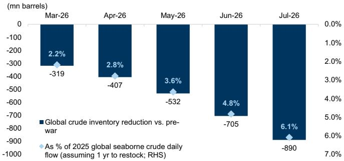

bar chart

| Month   | Global crude inventory reduction vs. pre-war (mn barrels) | As % of 2025 global seaborne crude daily flow (mm barrels) |
|---------|----------------------------------------------------------|---------------------------------------------------------------|
| Mar-26  | -319                                                     | 2.2%                                                          |
| Apr-26  | -407                                                     | 2.8%                                                          |
| May-26  | -532                                                     | 3.6%                                                          |
| Jun-26  | -705                                                     | 4.8%                                                          |
| Jul-26  | -890                                                     | 6.1%                                                          |

Global crude inventory is based on our GS Commodities teams' Global Oil Supply and Demand model as of Jun 11, 2026. 2025 global seaborne crude oil trade was 40.2mbpd based on Clarksons data.

Source: GS Global Investment Research, Clarksons

Exhibit 4: Sensitivity analysis of TCE and COSCO Shipping Energy net profit

<table><tr><td>Fleet type</td><td>Incremental net profit from every US$10k increase in VLCC TCE (Rmb mn)</td><td>Fleet type</td><td>Incremental net profit from every US$10k increase in LR2 TCE (Rmb mn)</td></tr><tr><td>Crude</td><td>806</td><td>Product</td><td>315</td></tr><tr><td>VLCC</td><td>714</td><td>LR2</td><td>142</td></tr><tr><td>Suezmax</td><td>19</td><td>LR1</td><td>146</td></tr><tr><td>Aframax</td><td>61</td><td>MR</td><td>27</td></tr><tr><td>Panamax</td><td>5</td><td></td><td></td></tr><tr><td>MR</td><td>8</td><td></td><td></td></tr></table>

Fleet data as of end-1Q26. TCE change of different crude / product fleet type based on DWT change vs. VLCC / LR2. Assumes a 25% tax rate.

Source: Company data, GS Global Investment Research

Exhibit 3: VLCC TCE elasticity to crude tanker net demand / (supply)  
VLCC TCE (China)'s elasticity (US\$'000/day) to crude tanker S-D change  
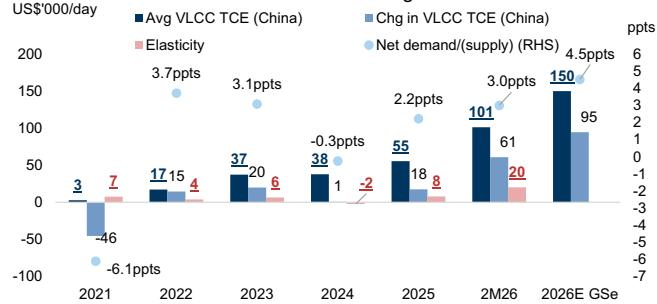

bar-line hybrid chart

| Year | Avg VLCC TCE (China) (US$'000/day) | Chg in VLCC TCE (China) (US$'000/day) | Elasticity (ppts) | Net demand/(supply) (RHS) (ppts) |
| :--- | :--- | :--- | :--- | :--- |
| 2021 | 3 | -46 | 7 | -6.1 |
| 2022 | 17 | 15 | 4 | 3.7 |
| 2023 | 37 | 20 | 6 | 3.1 |
| 2024 | 38 | 1 | -2 | -0.3 |
| 2025 | 55 | 18 | 8 | 2.2 |
| 2M26 | 101 | 61 | 20 | 3.0 |
| 2026E GSe | 150 | 95 | | 4.5 |
The chart displays a bar for Avg VLCC TCE (China) and a line for Chg in VLCC TCE (China), with a pink dot indicating Elasticity at the bottom of each bar. The line values are annotated with ppts (parts per ton).

Elasticity denotes change of VLCC TCE (China) (US\$'000/day) to every percentage point change in crude tanker net demand/(supply). VLCC TCE (China) refers to the average of TCEs on routes TD3C, TD15, TD22.

Source: Clarksons, Bloomberg, GS Global Investment Research

Exhibit 5: VLCC delivery based on Jun'26 orderbook vs. Mar'26 orderbook  
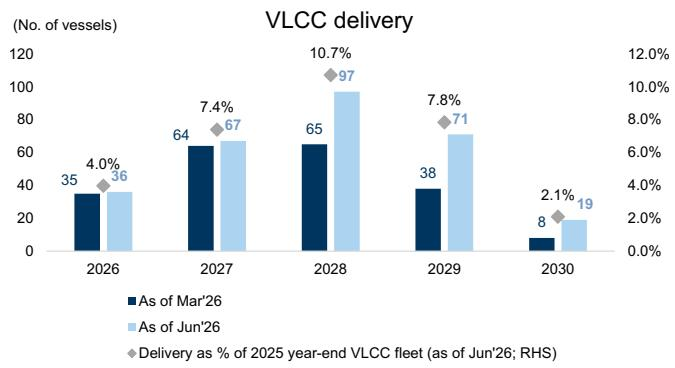

bar chart

| Year | As of Mar'26 | As of Jun'26 | Delivery as % of 2025 year-end VLCC fleet (as of Jun'26; RHS) |
|------|--------------|--------------|------------------------------------------------------------------------|
| 2026 | 35           | 36           | 4.0%                                                                   |
| 2027 | 64           | 67           | 7.4%                                                                   |
| 2028 | 65           | 97           | 10.7%                                                                  |
| 2029 | 38           | 71           | 7.8%                                                                   |
| 2030 | 8            | 19           | 2.1%                                                                   |

Source: Clarksons

Exhibit 6: VLCC delivery in 2026-30 vs. no. of vessels above 20yrs  
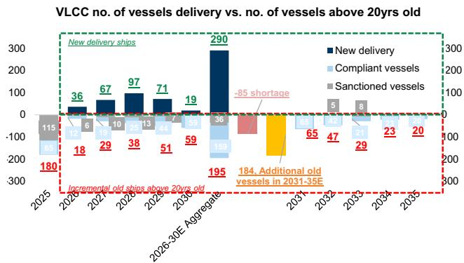

bar chart

| Year | New delivery ships | Compliant vessels | Sanctioned vessels |
|------|---------------------|-------------------|--------------------|
| 2025 | 180                 | 65                | 115                |
| 2026 | 36                  | 12                | 6                  |
| 2027 | 67                  | 18                | 10                 |
| 2028 | 97                  | 29                | 25                 |
| 2029 | 71                  | 44                | 13                 |
| 2030 | 19                  | 59                | 7                  |
| 2031-35E Aggregate | 290              | 195               | 36                 |
| 2032-          |                   |                   |                    |
| 2033-          |                   |                   |                    |
| 2034-          |                   |                   |                    |
| 2035-          |                   |                   |                    |

As of Jun 7, 2026.  
Source: Clarksons, Data compiled by GS Global Investment Research

Exhibit 7: Crude tanker / product tanker shipping demand breakdown  
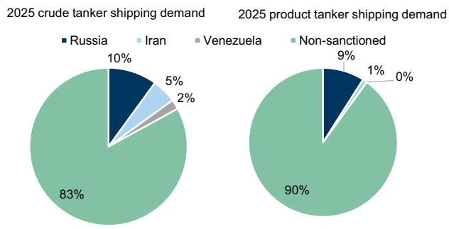

pie chart

2025 crude tanker shipping demand
| Category | 2025 crude tanker shipping demand (%) | 2025 product tanker shipping demand (%) |
| :--- | :--- | :--- |
| Russia | 10 | 9 |
| Iran | 5 | 1 |
| Venezuela | 2 | 0 |
| Non-sanctioned | 83 | 90 |

Source: Clarksons, Bloomberg, Reuters, Data compiled by GS Global Investment Research

Exhibit 8: COSCO Shipping Energy peak earnings scenario analysis

<table><tr><td rowspan="2" colspan="2"></td><td rowspan="2">VLCC TCE(China)US$/day</td><td rowspan="2">Peak earningsRmb mn</td><td rowspan="2" colspan="2">600026.SS Target P/EX X</td><td rowspan="2" colspan="2">1138.HKTarget market capRmb bn Rmb bn</td><td rowspan="2" colspan="2">600026.SS Upside vs. current shareprice% %</td></tr><tr></tr><tr><td colspan="2">Base</td><td>150,000</td><td>13,770</td><td>13.1X</td><td>10.5X</td><td>180</td><td>144</td><td>71%</td><td>77%</td></tr><tr><td colspan="2">Scenario</td><td>Chg in net demandpp</td><td>VLCC TCE(China)US$/day</td><td>Peak earningsassume flownormalize for 1 yrRmb mn</td><td colspan="2">Scenario P/E multipleX X</td><td>Implied market valueRmb bn Rmb bn</td><td colspan="2">Upside vs. current shareprice% %</td></tr><tr><td>Upside</td><td>Normalize by end Jul&#x27;26</td><td>4.8</td><td>247,814</td><td>21,653</td><td>10.0X</td><td>8.0X</td><td>217</td><td>173</td><td>106%</td></tr><tr><td>Blue Sky</td><td>Normalize by end Jul&#x27;26 +Removal of sanction on Iranian oil</td><td>9.6</td><td>344,233</td><td>29,423</td><td>10.0X</td><td>8.0X</td><td>294</td><td>235</td><td>180%</td></tr></table>

Last close H-share of HK\$16.95/ share, A-share of Rmb19.25/ share, as of Jun 15, 2026. VLCC TCE (China) elasticity assume 1pp change in crude tanker net demand/(supply) leads to US\$20k/day increase in VLCC TCE (China). Earnings Sensitivity: We assume an incremental profit after tax from every US\$10k increase in VLCC TCE of Rmb806mn based on the sensitivity to fleet capacity as of 1Q26.  
Source: GS Global Investment Research, Datastream

## Airlines & Airfreight

A lower oil price could reduce fuel costs for airlines and air freight. Our earnings sensitivity analysis suggests China Southern Airlines earnings could see the greatest upside to an oil price decrease. In our Commodities teams' Benign scenario, they assume Gulf exports normalize by Jul-26 end, one month earlier than their base case (by end of Aug-26), which leads to a US\$10/bbl decline in oil price. Under such a scenario (Exhibit 12), our calculation suggests 2028E peak net profit for China South Airlines would be c.26% higher than our base case, followed by China Eastern Airlines/Air China at +18%/+16% above our base case, all else equal; For EAL, we expect c.4% earnings upside vs. base case (Exhibit 12).

Exhibit 9: Airlines & Airfreight: Sensitivity to oil price with / without fuel surcharge  
  
The above exhibits shows the negative / positive impact to net profit for every US\$1/bbl higher / lower in oil price.  
Source: Company data, GS Global Investment Research

Exhibit 10: Chinese airlines fuel surcharge coverage  
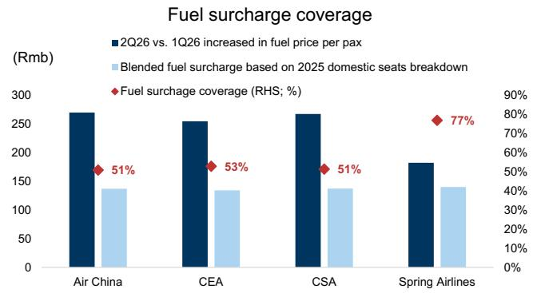

bar chart

| Airline       | 2Q26 vs. 1Q26 increased in fuel price per pax (Rmb) | Blended fuel surcharge based on 2025 domestic seats breakdown (%) | Fuel surcharge coverage (RHS; %) |
| ------------- | -------------------------------------------------- | --------------------------------------------------------------- | ------------------------------- |
| Air China     | 270                                                | 140                                                             | 51%                             |
| CEA           | 250                                                | 135                                                             | 53%                             |
| CSA           | 265                                                | 140                                                             | 51%                             |
| Spring Airlines | 180                                              | 140                                                             | 77%                             |

Source: WIND, OAG, Company data, GS Global Investment Research

Exhibit 12: Chinese Airlines and Airfreight 2028E peak earnings assuming Gulf exports normalize by Jul'26

<table><tr><td rowspan="2"></td><td colspan="3">Upside scenario: Gulf exports normalize by End-July&#x27;26</td></tr><tr><td>Chg in oil price vs. base case US$/bbl</td><td>Scenario peak net profit Rmb mn</td><td>Scenario peak net profit vs. base case %</td></tr><tr><td>Air China</td><td>-10</td><td>15,466</td><td>16%</td></tr><tr><td>CEA</td><td>-10</td><td>12,307</td><td>18%</td></tr><tr><td>CSA</td><td>-10</td><td>11,376</td><td>26%</td></tr><tr><td>Spring</td><td>-10</td><td>3,793</td><td>4%</td></tr><tr><td>EAL</td><td>-10</td><td>2,510</td><td>4%</td></tr></table>

Airlines peak earnings in 2028E. For EAL, 2028E net income is peak earnings.  
Source: GS Global Investment Research

## Shipbuilding

Exhibit 11: EAL fuel surcharge for contract freight rate  
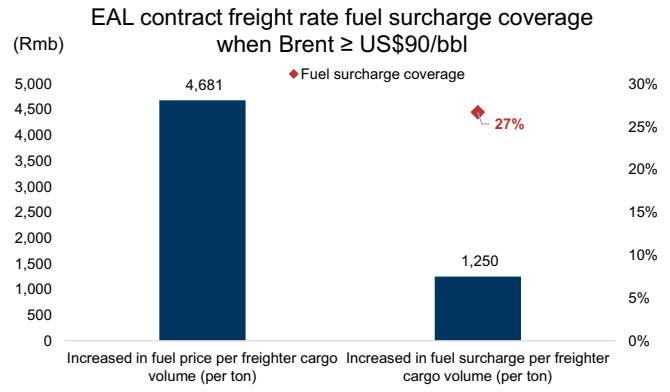

bar chart

| Category | Value (Rmb) | Percentage |
| -------- | ----------- | ---------- |
| Increased in fuel price per freighter cargo volume (per ton) | 4,681 | - |
| Increased in fuel surcharge per freighter cargo volume (per ton) | 1,250 | 27% |

Source: Datastream, Company data, GS Global Investment Research

Exhibit 13: Global Shipbuilding key monthly data overview

<table><tr><td></td><td>Jan-25</td><td>Feb-25</td><td>Mar-25</td><td>Apr-25</td><td>May-25</td><td>Jun-25</td><td>Jul-25</td><td>Aug-25</td><td>Sep-25</td><td>Oct-25</td><td>Nov-25</td><td>Dec-25</td><td>Jan-26</td><td>Feb-26</td><td>Mar-26</td><td>Apr-26</td><td>May-26</td></tr><tr><td>New contract order volume (mn CGT)</td><td>5.6</td><td>4.6</td><td>3.2</td><td>5.4</td><td>2.4</td><td>5.3</td><td>4.6</td><td>4.9</td><td>6.8</td><td>4.0</td><td>7.4</td><td>10.4</td><td>8.1</td><td>7.5</td><td>5.4</td><td>8.2</td><td>4.5</td></tr><tr><td>MoM%</td><td>10%</td><td>-18%</td><td>-30%</td><td>69%</td><td>-56%</td><td>122%</td><td>-15%</td><td>8%</td><td>37%</td><td>-40%</td><td>82%</td><td>41%</td><td>-22%</td><td>-7%</td><td>-29%</td><td>53%</td><td>-45%</td></tr><tr><td>YoY%</td><td>-29%</td><td>-22%</td><td>-42%</td><td>-35%</td><td>-47%</td><td>-62%</td><td>-9%</td><td>-31%</td><td>2%</td><td>-18%</td><td>40%</td><td>105%</td><td>46%</td><td>64%</td><td>67%</td><td>51%</td><td>88%</td></tr><tr><td>New contract value ($m)</td><td>14,353</td><td>15,015</td><td>9,468</td><td>17,917</td><td>8,679</td><td>16,974</td><td>13,645</td><td>12,472</td><td>19,027</td><td>13,488</td><td>23,579</td><td>33,029</td><td>24,001</td><td>21,650</td><td>14,968</td><td>25,358</td><td>16,562</td></tr><tr><td>MoM%</td><td>-11%</td><td>5%</td><td>-37%</td><td>89%</td><td>-52%</td><td>96%</td><td>-20%</td><td>-9%</td><td>53%</td><td>-29%</td><td>75%</td><td>40%</td><td>-27%</td><td>-10%</td><td>-31%</td><td>69%</td><td>-35%</td></tr><tr><td>YoY%</td><td>-21%</td><td>-6%</td><td>-35%</td><td>-34%</td><td>-53%</td><td>-56%</td><td>-13%</td><td>-41%</td><td>3%</td><td>-4%</td><td>48%</td><td>105%</td><td>67%</td><td>44%</td><td>58%</td><td>42%</td><td>91%</td></tr><tr><td>Clarksons newbuilding price index</td><td>189</td><td>188</td><td>187</td><td>187</td><td>187</td><td>187</td><td>187</td><td>186</td><td>186</td><td>185</td><td>184</td><td>185</td><td>184</td><td>182</td><td>182</td><td>183</td><td>185</td></tr><tr><td>MoM%</td><td>0.1%</td><td>-0.5%</td><td>-0.5%</td><td>-0.2%</td><td>-0.2%</td><td>0.2%</td><td>-0.2%</td><td>-0.2%</td><td>-0.4%</td><td>-0.4%</td><td>-0.3%</td><td>0.2%</td><td>-0.2%</td><td>-1.2%</td><td>0.0%</td><td>0.7%</td><td>0.9%</td></tr><tr><td>YoY%</td><td>5%</td><td>4%</td><td>2%</td><td>2%</td><td>0%</td><td>0%</td><td>-1%</td><td>-2%</td><td>-2%</td><td>-3%</td><td>-3%</td><td>-2%</td><td>-3%</td><td>-3%</td><td>-3%</td><td>-2%</td><td>-1%</td></tr></table>

Source: Clarksons, Company data, GS Global Investment Research

Exhibit 14: Dynamic ROI vs. orderbook by ship type  
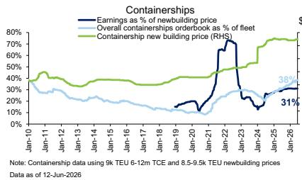

line chart

| Date    | Earnings as % of new building price | Overall containership orderbook as % of fleet | Containership new building price (RHS) |
|---------|-------------------------------------|-----------------------------------------------|----------------------------------------|
| Jan-26  | 31%                                 | 38%                                           | 38%                                    |

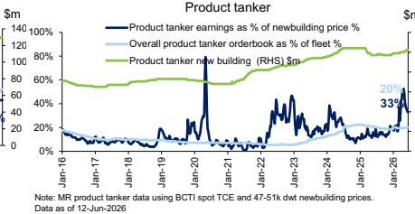

line chart

| Date    | Product tanker earnings as % of newbuilding price % | Overall product tanker orderbook as % of fleet (%) | Product tanker new building ($m) |
|---------|------------------------------------------------------|-----------------------------------------------------|----------------------------------|
| Jan-16  | 0%                                                   | 0%                                                  | 0                                |
| Jan-17  | 0%                                                   | 0%                                                  | 0                                |
| Jan-18  | 0%                                                   | 0%                                                  | 0                                |
| Jan-19  | 0%                                                   | 0%                                                  | 0                                |
| Jan-20  | 140%                                                 | 0%                                                  | 0                                |
| Jan-21  | 0%                                                   | 0%                                                  | 0                                |
| Jan-22  | 0%                                                   | 0%                                                  | 0                                |
| Jan-23  | 0%                                                   | 0%                                                  | 0                                |
| Jan-24  | 0%                                                   | 0%                                                  | 0                                |
| Jan-25  | 0%                                                   | 0%                                                  | 0                                |
| Jan-26  | 33%                                                  | 20%                                                 | 47.5k                            |

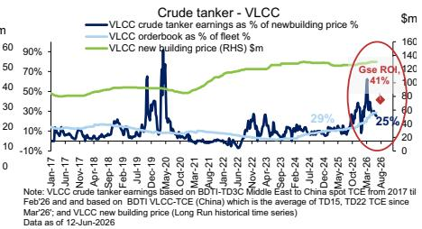

line chart

| Date       | VLCC crude tanker earnings as % of newbuilding price % | VLCC orderbook as % of fleet | VLCC new building price (RHS) $m |
|------------|--------------------------------------------------------|------------------------------|----------------------------------|
| Jan-17     | ~0%                                                    | ~0%                          | ~0%                              |
| Jun-17     | ~0%                                                    | ~0%                          | ~0%                              |
| Nov-17     | ~0%                                                    | ~0%                          | ~0%                              |
| Feb-18     | ~0%                                                    | ~0%                          | ~0%                              |
| May-18     | ~0%                                                    | ~0%                          | ~0%                              |
| Sep-18     | ~0%                                                    | ~0%                          | ~0%                              |
| Dec-18     | ~0%                                                    | ~0%                          | ~0%                              |
| Mar-19     | ~0%                                                    | ~0%                          | ~0%                              |
| Jun-19     | ~0%                                                    | ~0%                          | ~0%                              |
| Sep-19     | ~0%                                                    | ~0%                          | ~0%                              |
| Dec-19     | ~0%                                                    | ~0%                          | ~0%                              |
| Mar-20     | ~0%                                                    | ~0%                          | ~0%                              |
| Jun-20     | ~0%                                                    | ~0%                          | ~0%                              |
| Sep-20     | ~0%                                                    | ~0%                          | ~0%                              |
| Dec-20     | ~0%                                                    | ~0%                          | ~0%                              |
| Mar-21     | ~0%                                                    | ~0%                          | ~0%                              |
| Jun-21     | ~0%                                                    | ~0%                          | ~0%                              |
| Sep-21     | ~0%                                                    | ~0%                          | ~0%                              |
| Dec-21     | ~0%                                                    | ~0%                          | ~0%                              |
| Mar-22     | ~0%                                                    | ~0%                          | ~0%                              |
| Jun-22     | ~0%                                                    | ~0%                          | ~0%                              |
| Sep-22     | ~0%                                                    | ~0%                          | ~0%                              |
| Dec-22     | ~0%                                                    | ~0%                          | ~0%                              |
| Mar-23     | ~0%                                                    | ~0%                          | ~0%                              |
| Jun-23     | ~0%                                                    | ~0%                          | ~0%                              |
| Sep-23     | ~0%                                                    | ~0%                          | ~0%                              |
| Dec-23     | ~0%                                                    | ~0%                          | ~0%                              |
| Mar-24     | ~0%                                                    | ~0%                          | ~0%                              |
| Jun-24     | ~0%                                                    | ~0%                          | ~0%                              |
| Sep-24     | ~0%                                                    | ~0%                          | ~0%                              |
| Dec-24     | ~0%                                                    | ~0%                          | ~0%                              |
| Mar-25     | ~0%                                                    | ~0%                          | ~0%                              |
| Jun-25     | ~0%                                                    | ~0%                          | ~0%                              |
| Sep-25     | ~0%                                                    | ~0%                          | ~0%                              |
| Dec-25     | ~0%                                                    | ~0%                          | ~0%                              |
| Mar-26     | 25%                                                    | 25%                          | 160                              |
| Jun-26     | 41%                                                    | 41%                          | 160                              |
Note: VLCC crude tanker earnings based on BDTI-TD3C Middle East to China Spat TCE from 2017 to Feb/26 and based on BDTI-VLCC-TCE (China) which is the average of TD15, TD22 TCE since 2026. Data as of 12-Jun-2026.

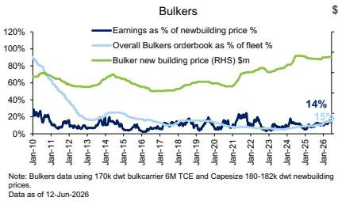

line chart

| Date   | Earnings as % of newbuilding price % | Overall Bulkers orderbook as % of fleet | Bulker new building price (RHS) $m |
|--------|--------------------------------------|------------------------------------------|-------------------------------------|
| Jan-10 | ~90%                                 | ~90%                                     | ~70%                                |
| Jan-11 | ~50%                                 | ~50%                                     | ~60%                                |
| Jan-12 | ~30%                                 | ~30%                                     | ~55%                                |
| Jan-13 | ~20%                                 | ~20%                                     | ~50%                                |
| Jan-14 | ~15%                                 | ~15%                                     | ~45%                                |
| Jan-15 | ~10%                                 | ~10%                                     | ~40%                                |
| Jan-16 | ~5%                                  | ~5%                                      | ~35%                                |
| Jan-17 | ~5%                                  | ~5%                                      | ~30%                                |
| Jan-18 | ~5%                                  | ~5%                                      | ~25%                                |
| Jan-19 | ~5%                                  | ~5%                                      | ~20%                                |
| Jan-20 | ~5%                                  | ~5%                                      | ~15%                                |
| Jan-21 | ~5%                                  | ~5%                                      | ~10%                                |
| Jan-22 | ~5%                                  | ~5%                                      | ~5%                                 |
| Jan-23 | ~5%                                  | ~5%                                      | ~5%                                 |
| Jan-24 | ~5%                                  | ~5%                                      | ~5%                                 |
| Jan-25 | ~5%                                  | ~5%                                      | ~5%                                 |
| Jan-26 | 14%                                  | 14%                                      | ~5%                                 |

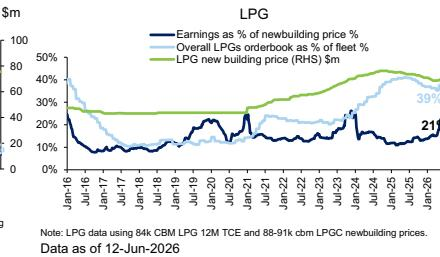

line chart

| Date   | Earnings as % of newbuilding price % | Overall LPGs orderbook as % of fleet % | LPG new building price (RHS) $m |
|--------|--------------------------------------|------------------------------------------|----------------------------------|
| Jan-16 | ~50%                                 | ~50%                                     | ~30%                             |
| Jul-17 | ~10%                                 | ~30%                                     | ~30%                             |
| Jan-18 | ~10%                                 | ~20%                                     | ~30%                             |
| Jul-19 | ~15%                                 | ~25%                                     | ~30%                             |
| Jan-20 | ~20%                                 | ~30%                                     | ~30%                             |
| Jul-21 | ~30%                                 | ~35%                                     | ~30%                             |
| Jan-22 | ~25%                                 | ~40%                                     | ~30%                             |
| Jul-23 | ~20%                                 | ~45%                                     | ~30%                             |
| Jan-24 | ~25%                                 | ~50%                                     | ~30%                             |
| Jul-25 | ~30%                                 | ~55%                                     | ~30%                             |
| Jan-26 | 21%                                  | ~60%                                     | 39%                              |

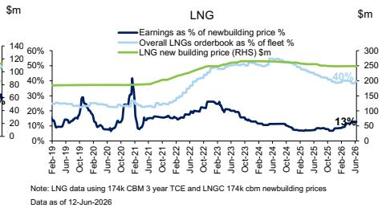

line chart

| Date     | Earnings as % of newbuilding price % | Overall LNGs orderbook as % of fleet price | LNG new building price (RHS) $m |
|----------|----------------------------------------|-----------------------------------------------|----------------------------------|
| Feb-19   | ~10%                                   | ~30%                                          | ~300                             |
| Jun-19   | ~20%                                   | ~35%                                          | ~300                             |
| Oct-19   | ~30%                                   | ~40%                                          | ~300                             |
| Feb-20   | ~10%                                   | ~35%                                          | ~300                             |
| Jun-20   | ~5%                                    | ~30%                                          | ~300                             |
| Oct-20   | ~140%                                  | ~40%                                          | ~300                             |
| Feb-21   | ~20%                                   | ~50%                                          | ~300                             |
| Jun-21   | ~10%                                   | ~60%                                          | ~300                             |
| Oct-21   | ~5%                                    | ~70%                                          | ~300                             |
| Feb-22   | ~10%                                   | ~80%                                          | ~300                             |
| Jun-22   | ~15%                                   | ~90%                                          | ~300                             |
| Oct-22   | ~20%                                   | ~100%                                         | ~300                             |
| Feb-23   | ~25%                                   | ~110%                                         | ~300                             |
| Jun-23   | ~20%                                   | ~120%                                         | ~300                             |
| Oct-23   | ~15%                                   | ~130%                                         | ~300                             |
| Feb-24   | ~10%                                   | ~140%                                         | ~300                             |
| Jun-24   | ~5%                                    | ~150%                                         | ~300                             |
| Oct-24   | ~5%                                    | ~160%                                         | ~300                             |
| Feb-25   | ~5%                                    | ~170%                                         | ~300                             |
| Jun-25   | ~5%                                    | ~180%                                         | ~300                             |
| Oct-25   | ~5%                                    | ~190%                                         | ~300                             |
| Feb-26   | 13%                                    | ~200%                                         | 40%                              |
| Jun-26   | 13%                                    | ~210%                                         | 40%                              |

VLCC Gse ROI based on our base case forecast for VLCC TCE (China) at US\$150k/day.  
Source: Clarksons, GS Global Investment Research

## Container shipping

Though Containers have much smaller exposure to the Strait of Hormuz with only 4% of global seaborne trade transiting the Strait, we expect the reopening of the Strait of Hormuz could ease port congestion in other alternate ports and lower vessel speed, which could introduce downside risk to the shipping rate. We see downside potential to container shipping should major liners resume their plans to return to the Red Sea, which were suspended amid geopolitical escalation per Maersk and CMA CGM. Under a scenario where a full re-routing from the Cape to the Suez route, we estimate containership TEU-mile demand could be reduced by c.10% (see Dec-25 report). Under this scenario, we calculate that COSCO Shipping Holdings could see a lower unit cost of US\$30/TEU benefiting from its cost advantage vs. peers while peers can likely only achieve break-even, and with this, estimate that COSCO could achieve a net profit of Rmb6bn after factoring in the contribution from ongoing stable port operations and interest income and investment income despite a loss from container shipping; which implies -48%/-3% net income/BVPS downside to our base case, all else equal. This translates to 0.8x/0.6x P/Bs for COSCO Shipping Holdings A/H shs (one s.d. below mid-cycle), implying 20%/32% downside as of Jun 15 $^{th}$ , 2026.

Exhibit 15: COSCO Shipping Holdings scenario analysis assuming Red Sea reopening

<table><tr><td>Rmb mn (unless stated otherwise)</td><td>2026E</td><td>2027E</td></tr><tr><td>Base case net profit</td><td>20,980</td><td>10,948</td></tr><tr><td>Red Sea reopening case net profit</td><td></td><td>5,804</td></tr><tr><td>Container shipping</td><td></td><td>(2,687)</td></tr><tr><td>COSCO Shipping Port (1199.HK)</td><td></td><td>1,709</td></tr><tr><td>Net interest income</td><td></td><td>1,265</td></tr><tr><td>Investment income from associate/ JV(mainly contributed by stable port business)</td><td></td><td>5,517</td></tr><tr><td>Base case BVPS (Rmb)</td><td>15.54</td><td>15.80</td></tr><tr><td>Red Sea reopening case BVPS (Rmb)</td><td></td><td>15.40</td></tr></table>

Source: GS Global Investment Research

## Price Target Risks and Methodology

## Price Target Risks and Methodology - COSCO Shipping Holdings

We are Sell rated on COSCO Shipping Holding H/A. Our 12m price targets of HK\$10.9/Rmb12.9 for CSH H/A are based on 0.6x/0.8x FY26E target P/BV multiples, which are lower than the historical average of 1.0X/0.6X to reflect a downcycle ahead. Key upside risks: 1) Stronger-than-expected cargo volume or slower supply growth; 2) Short-term disruption to the effective capacity and freight amid the reversal of rerouting; 3) Attractive dividend yield in 2026E and share buyback.

## Price Target Risks and Methodology - Yangzijiang Shipbuilding

We are Buy rated on Yangzijiang and derive our 12-month target price of SGD 4.70 based on P/B vs. ROE valuation. We apply a target P/B multiple of 2.5x to our end-2026E BVPS. We derive the target P/B based on the cycle-average ROE of 24% and Cost of Equity of 10.2% with long-term growth of 1%.

Key risks: 1) Higher-than-expected steel prices; 2) More stringent regulations from USTR targeting Chinese-built vessels; 3) Larger-than-expected ASP decline; 4) Faster-than-expected capacity expansion from other shipyards.

## Price Target Risks and Methodology - Guangdong Songfa Ceramics Co

Our 12-m target price of Rmb185/share is based on a 2028E P/E of 12x, based on the average of Chinese and Korean shipyards. Risks: Delays in ship delivery or new capacity release; Higher-than-expected steel prices; Less-than-expected new order wins; Lower-than-expected ASP; Stronger-than-expected RMB appreciation vs. USD; Faster-than-expected capacity expansion from other shipyards.

## Price target methodology and risks - Eastern Air Logistics

Valuation methodology: We are Sell rated on Eastern Air. We derive our 12-month price target of Rmb12.0 based on a P/E of 7.5x our 2026E earnings. Our target multiple is based on a downcycle valuation of 7.5x (1 S.D. below the historical average) which represents a 25% discount to the upcycle valuation (10x). We adopt a P/E methodology in line with global peers (incl. major US airfreight carriers).

Key upside risks: 1) Higher-than-expected China outbound freight rate; 2) US de minimis exemptions for <US\$800 packages from mainland China; 3) Higher-than-expected jet fuel price.

## Price Target Risks and Methodology - Spring Airlines Co.

Valuation methodology: We are Buy rated on Spring Airlines with a 12-month target price of Rmb57.1. Our target price is based on an upcycle valuation 2026E P/B of 2.8x.

Key risks: 1) Macro uncertainties; 2) Slower-than-expected penetration into lower-tier markets; 3) Sustainability of subsidy; and 4) ESG regulations.

## Price Target Risks and Methodology - China Southern Airlines

Valuation methodology: For CSA-H, we have a 12-month target price of HK\$5.3 based on a 2.4x 2026E P/BV. For CSA-A, we have a 12-month target price of Rmb6.0 based on a 3.1x 2026E P/BV. We derive our target P/B multiples from our peak ROE forecast of

21% for the A-share; we then apply a target A/H premium of 46% to derive our H-share target P/B. We are Neutral rated on CSA-A and Buy rated on CSA-H.

Key upside risks (A share): 1) Slower-than-expected aircraft delivery; 2)

Lower-than-expected jet fuel cost

Key downside risks: 1) Weaker-than-expected airfare performance, 2)

Higher-than-expected jet fuel cost, 3) Worse-than-expected cargo yield.

## Price Target Risks and Methodology - China Eastern Airlines

Valuation methodology: Our 12-month target price of HK\$5.0 for CEA H is based on a 3.3x FY26E P/BV. For CEA-A, we have a 12-month target price of Rmb5.60 based on a 2.6x FY26E P/BV. We derive our target A-share P/B multiple from our peak ROE forecast of 22%; we then apply a target A/H premium of 50% to derive our H-share target P/B. We are Buy rated on CEA-A/H.

Downside risks: (1) Recovery uncertainties; (2) Supply higher than expectations; (3) Sustainability of subsidies.

## Price Target Risks and Methodology - Air China

Valuation methodology: For Air China-A, we have a 12-month target price of Rmb8.6 based on a 3.6x 2026E P/BV. For Air China-H, we have a 12-month target price of HK\$7.3 based on a 2.7x 2026E P/BV. We forecast a peak ROE of 24.6% and derive our target P/B multiple for the A-share, then apply a target A/H premium of 33% to derive our H-share target P/B. We are Buy rated on the A/H share.

Downside risks: 1) Slower-than-expected business travel recovery, 2)

Weaker-than-expected earnings contribution from Cathay Pacific, 3)

Higher-than-expected jet fuel cost, 4) Weaker-than-expected airfare performance.

## Price Target Risks and Methodology - COSCO Shipping Energy

We are Buy rated on COSCO Shipping Energy A/H (600026.SS/1138.HK) with 12-month target prices of Rmb33.0/HK\$30.0. We derive our TPs using a P/B methodology, using an estimated sustainable ROE to arrive at a theoretical target FY26E P/B of 3.1x for the A-shares. We then apply an H/A-share discount (20%) to derive our H-share target P/B of 2.5x.

Key downside risks: (1) OPEC output reduction; (2) More-than-expected capacity delivery; and (3) Softer oil consumption demand due to the weaker macro environment.

## Disclosure Appendix

## Reg AC

We, Herbert Lu and Wing Huang, hereby certify that all of the views expressed in this report accurately reflect our personal views about the subject company or companies and its or their securities. We also certify that no part of our compensation was, is or will be, directly or indirectly, related to the specific recommendations or views expressed in this report.

Unless otherwise stated, the individuals listed on the cover page of this report are analysts in GS' Global Investment Research division.

Contributing Authors: Herbert Lu GS (Asia) L.L.C., Simon Cheung, CFA GS (Asia) L.L.C., Wing Huang GS (Asia) L.L.C..

Unless otherwise stated, the individuals listed in the Contributing Authors disclosure of this report are analysts in GS' Global Investment Research division.

## GS Factor Profile

The GS Factor Profile provides investment context for a stock by comparing key attributes to the market (i.e. our universe of rated stocks) and its sector peers. The four key attributes depicted are: Growth, Financial Returns, Multiple (e.g. valuation) and Integrated (a composite of Growth, Financial Returns and Multiple). Growth, Financial Returns and Multiple are calculated by using normalized ranks for specific metrics for each stock. The normalized ranks for the metrics are then averaged and converted into percentiles for the relevant attribute. The precise calculation of each metric may vary depending on the fiscal year, industry and region, but the standard approach is as follows:

Growth is based on a stock's forward-looking sales growth, EBITDA growth and EPS growth (for financial stocks, only EPS and sales growth), with a higher percentile indicating a higher growth company. Financial Returns is based on a stock's forward-looking ROE, ROCE and CROCI (for financial stocks, only ROE), with a higher percentile indicating a company with higher financial returns. Multiple is based on a stock's forward-looking P/E, P/B, price/dividend (P/D), EV/EBITDA, EV/FCF and EV/Debt Adjusted Cash Flow (DACF) (for financial stocks, only P/E, P/B and P/D), with a higher percentile indicating a stock trading at a higher multiple. The Integrated percentile is calculated as the average of the Growth percentile, Financial Returns percentile and (100% - Multiple percentile).

Financial Returns and Multiple use the GS analyst forecasts at the fiscal year-end at least three quarters in the future. Growth uses inputs for the fiscal year at least seven quarters in the future compared with the year at least three quarters in the future (on a per-share basis for all metrics).

For a more detailed description of how we calculate the GS Factor Profile, please contact your GS representative.

## M&A Rank

Across our global coverage, we examine stocks using an M&A framework, considering both qualitative factors and quantitative factors (which may vary across sectors and regions) to incorporate the potential that certain companies could be acquired. We then assign a M&A rank as a means of scoring companies under our rated coverage from 1 to 3, with 1 representing high (30%-50%) probability of the company becoming an acquisition target, 2 representing medium (15%-30%) probability and 3 representing low (0%-15%) probability. For companies ranked 1 or 2, in line with our standard departmental guidelines we incorporate an M&A component into our target price. M&A rank of 3 is considered immaterial and therefore does not factor into our price target, and may or may not be discussed in research.

## Quantum

Quantum is GS' proprietary database providing access to detailed financial statement histories, forecasts and ratios. It can be used for in-depth analysis of a single company, or to make comparisons between companies in different sectors and markets.

## Disclosures

## Other disclosures

## Clarkson Research Services Limited (CRSL)

Clarkson Research Services Limited (CRSL) have not reviewed the context of any of the statistics or information contained in the commentaries and all statistics and information were obtained by GS & Co. from standard CRSL published sources. Furthermore, CRSL have not carried out any form of due diligence exercise on the information, as would be the case with finance raising documentation such as Initial Public Offerings (IPOs) or Bond Placements. Therefore, reliance on the statistics and information contained within the commentaries will be for the risk of the party relying on the information and CRSL does not accept any liability whatsoever for relying on the statistics or information. Insofar as the statistical and graphical market information comes from CRSL, CRSL points out that such information is drawn from the CRSL database and other sources. CRSL has advised that: (i) some information in CRSL's database is derived from estimates or subjective judgments; and (ii) the information in the database of other maritime data collection agencies may differ from the information in CRSL's database; and (iii) whilst CRSL has taken reasonable care in the compilation of that statistical and graphical information and believes it to be accurate and correct, data compilation is subject to limited audit and validation procedures and may accordingly contain errors; and (iv) CRSL, its agents, officers and employees do not accept liability for any loss suffered in consequence of reliance on such information or in any other manner; and (v) the provision of such information does not obviate any need to make appropriate further enquiries; and (vi) the provision of such information is not an endorsement of any commercial policies and/or any conclusions by CRSL; and (vii) shipping is a variable and cyclical business and any forecasting concerning it cannot be very accurate.

Iran is subject to comprehensive sanctions by the United States.

## Rating and pricing information

Air China (A) (Buy, Rmb6.52), Air China (H) (Buy, HK\$4.90), COSCO SHIPPING Holdings (A) (Sell, Rmb14.49), COSCO SHIPPING Holdings (H) (Sell, HK\$14.35), COSCO Shipping Energy (A) (Buy, Rmb19.25), COSCO Shipping Energy (H) (Buy, HK\$16.95), China Eastern Airlines (A) (Buy, Rmb4.12), China Eastern Airlines (H) (Buy, HK\$3.72), China Southern Airlines (A) (Neutral, Rmb5.46), China Southern Airlines (H) (Buy, HK\$3.90), Eastern Air Logistics (Sell, Rmb17.26), Guangdong Songfa Ceramics Co (Buy, Rmb158.40), Spring Airlines Co. (Buy, Rmb48.41) and Yangzijiang Shipbuilding (Buy, S\$3.60)

The rating(s) for Air China (A), Air China (H), COSCO SHIPPING Holdings (A), COSCO SHIPPING Holdings (H), COSCO Shipping Energy (A), COSCO Shipping Energy (H), China Eastern Airlines (A), China Eastern Airlines (H), China Southern Airlines (A), China Southern Airlines (H), Eastern Air Logistics, Guangdong Songfa Ceramics Co, Spring Airlines Co. and Yangzijiang Shipbuilding is/are relative to the other companies in its/their coverage universe: Air China (A), Air China (H), COSCO SHIPPING Holdings (A), COSCO SHIPPING Holdings (H), COSCO Shipping Energy (A), COSCO Shipping Energy (H), COSCO Shipping Ports Ltd., China Eastern Airlines (A), China Eastern Airlines (H), China Merchants Port Holdings, China Southern

Airlines (A), China Southern Airlines (H), Eastern Air Logistics, Guangdong Songfa Ceramics Co, Guangzhou Baiyun Intl Airport Co., Hainan Meilan Intl Airport, Hutchison Port Holdings, Shanghai International Port, Shanghai Intl Airport, Spring Airlines Co., Yangzijiang Shipbuilding

## Company-specific regulatory disclosures

Compendium report: please see disclosures at https://www.gs.com/research/hedge.html. Disclosures applicable to the companies included in this compendium can be found in the latest relevant published research

## Distribution of ratings/investment banking relationships

GS Investment Research global Equity coverage universe

<table><tr><td rowspan="2"></td><td colspan="3">Rating Distribution</td><td colspan="3">Investment Banking Relationships</td></tr><tr><td>Buy</td><td>Hold</td><td>Sell</td><td>Buy</td><td>Hold</td><td>Sell</td></tr><tr><td>Global</td><td>50%</td><td>34%</td><td>16%</td><td>65%</td><td>60%</td><td>45%</td></tr></table>

As of April 1, 2026, GS Global Investment Research had investment ratings on 3,074 equity securities. GS assigns stocks as Buys and Sells on various regional Investment Lists; stocks not so assigned are deemed Neutral. Such assignments equate to Buy, Hold and Sell for the purposes of the above disclosure required by the FINRA Rules. See ‘Ratings, Coverage universe and related definitions’ below. The Investment Banking Relationships chart reflects the percentage of subject companies within each rating category for whom GS has provided investment banking services within the previous twelve months.

## Price target and rating history chart(s)

Compendium report: please see disclosures at https://www.gs.com/research/hedge.html. Disclosures applicable to the companies included in this compendium can be found in the latest relevant published research

Target price history table(s)  
Yangzijiang Shipbuilding (YAZG.SI)

<table><tr><td>Date of report</td><td>Target price (S$)</td><td>Closing price (S$)</td></tr><tr><td>21-May-26</td><td>4.70</td><td>3.70</td></tr><tr><td>26-Feb-26</td><td>4.70</td><td>3.92</td></tr><tr><td>20-Jan-26</td><td>4.25</td><td>3.48</td></tr><tr><td>18-Dec-25</td><td>4.00</td><td>3.47</td></tr><tr><td>31-Aug-25</td><td>4.00</td><td>2.91</td></tr></table>

COSCO Shipping Energy (A) (600026.SS)

<table><tr><td>Date of report</td><td>Target price (Rmb)</td><td>Closing price (Rmb)</td></tr><tr><td>27-Apr-26</td><td>33.00</td><td>21.50</td></tr><tr><td>22-Mar-26</td><td>32.00</td><td>23.46</td></tr><tr><td>03-Feb-26</td><td>18.00</td><td>15.87</td></tr><tr><td>18-Dec-25</td><td>16.30</td><td>11.85</td></tr><tr><td>30-Apr-25</td><td>14.70</td><td>10.29</td></tr><tr><td>27-Mar-25</td><td>15.70</td><td>11.41</td></tr><tr><td>19-Mar-25</td><td>16.00</td><td>11.39</td></tr><tr><td>10-Jan-25</td><td>14.90</td><td>12.12</td></tr><tr><td>01-Nov-24</td><td>16.00</td><td>13.22</td></tr><tr><td>02-Sep-24</td><td>18.00</td><td>14.42</td></tr><tr><td>14-May-24</td><td>19.50</td><td>17.96</td></tr><tr><td>01-Apr-24</td><td>17.50</td><td>16.73</td></tr><tr><td>24-Jan-24</td><td>16.30</td><td>13.22</td></tr><tr><td>27-Nov-23</td><td>16.70</td><td>13.63</td></tr><tr><td>27-Oct-23</td><td>16.50</td><td>13.53</td></tr><tr><td>24-Sep-23</td><td>16.60</td><td>14.02</td></tr></table>

COSCO SHIPPING Holdings (A) (601919.SS)

<table><tr><td>Date of report</td><td>Target price (Rmb)</td><td>Closing price (Rmb)</td></tr><tr><td>30-Apr-26</td><td>12.90</td><td>14.12</td></tr><tr><td>23-Mar-26</td><td>13.50</td><td>15.38</td></tr><tr><td>18-Dec-25</td><td>13.30</td><td>15.37</td></tr><tr><td>04-Nov-25</td><td>16.00</td><td>15.03</td></tr><tr><td>03-Sep-25</td><td>14.70</td><td>15.16</td></tr><tr><td>07-Apr-25</td><td>14.20</td><td>12.74</td></tr><tr><td>27-Mar-25</td><td>15.40</td><td>14.49</td></tr><tr><td>19-Mar-25</td><td>15.30</td><td>14.26</td></tr><tr><td>12-Jan-25</td><td>15.20</td><td>14.14</td></tr><tr><td>03-Nov-24</td><td>15.10</td><td>15.44</td></tr><tr><td>01-Oct-24</td><td>13.80</td><td>15.71</td></tr><tr><td>14-Jul-24</td><td>10.30</td><td>13.54</td></tr><tr><td>14-May-24</td><td>9.90</td><td>13.96</td></tr><tr><td>02-Apr-24</td><td>8.90</td><td>10.57</td></tr><tr><td>09-Jan-24</td><td>8.60</td><td>9.71</td></tr><tr><td>09-Oct-23</td><td>8.40</td><td>9.79</td></tr><tr><td>31-Aug-23</td><td>8.50</td><td>9.80</td></tr><tr><td>04-Jul-23</td><td>8.40</td><td>10.13</td></tr></table>

COSCO SHIPPING Holdings (H) (1919.HK)

<table><tr><td>Date of report</td><td>Target price (HK$)</td><td>Closing price (HK$)</td></tr><tr><td>30-Apr-26</td><td>10.90</td><td>14.40</td></tr><tr><td>23-Mar-26</td><td>10.60</td><td>15.08</td></tr><tr><td>18-Dec-25</td><td>10.40</td><td>13.69</td></tr><tr><td>04-Nov-25</td><td>12.50</td><td>13.67</td></tr><tr><td>03-Sep-25</td><td>11.50</td><td>13.75</td></tr><tr><td>07-Apr-25</td><td>11.10</td><td>9.96</td></tr><tr><td>27-Mar-25</td><td>12.10</td><td>12.20</td></tr><tr><td>19-Mar-25</td><td>12.00</td><td>12.02</td></tr><tr><td>12-Jan-25</td><td>11.90</td><td>11.60</td></tr><tr><td>03-Nov-24</td><td>11.80</td><td>12.46</td></tr><tr><td>01-Oct-24</td><td>10.70</td><td>13.04</td></tr><tr><td>01-Sep-24</td><td>7.90</td><td>10.70</td></tr><tr><td>14-Jul-24</td><td>8.00</td><td>11.50</td></tr><tr><td>14-May-24</td><td>7.60</td><td>12.56</td></tr><tr><td>01-May-24</td><td>6.90</td><td>10.16</td></tr><tr><td>02-Apr-24</td><td>6.80</td><td>8.44</td></tr><tr><td>09-Jan-24</td><td>6.70</td><td>8.02</td></tr><tr><td>09-Oct-23</td><td>6.50</td><td>7.85</td></tr></table>

COSCO SHIPPING Holdings (A) (601919.SS)

<table><tr><td>Date of report</td><td>Target price (Rmb)</td><td>Closing price (Rmb)</td></tr></table>

COSCO SHIPPING Holdings (H) (1919.HK)

<table><tr><td>Date of report</td><td>Target price (HK$)</td><td>Closing price (HK$)</td></tr><tr><td>31-Aug-23</td><td>6.60</td><td>8.05</td></tr><tr><td>04-Jul-23</td><td>6.70</td><td>7.70</td></tr></table>

China Eastern Airlines (H) (0670.HK)

<table><tr><td>Date of report</td><td>Target price (HK$)</td><td>Closing price (HK$)</td></tr><tr><td>06-May-26</td><td>5.00</td><td>4.09</td></tr><tr><td>21-Apr-26</td><td>5.10</td><td>4.22</td></tr><tr><td>02-Feb-26</td><td>5.80</td><td>5.40</td></tr><tr><td>18-Dec-25</td><td>5.10</td><td>5.35</td></tr><tr><td>15-Sep-25</td><td>3.70</td><td>2.94</td></tr><tr><td>05-May-25</td><td>3.30</td><td>2.33</td></tr><tr><td>14-Apr-25</td><td>3.50</td><td>2.41</td></tr><tr><td>19-Mar-25</td><td>3.40</td><td>2.72</td></tr><tr><td>07-Nov-24</td><td>3.00</td><td>2.37</td></tr><tr><td>22-Sep-24</td><td>2.70</td><td>1.77</td></tr><tr><td>01-Apr-24</td><td>3.00</td><td>1.95</td></tr><tr><td>06-Feb-24</td><td>3.20</td><td>1.91</td></tr><tr><td>29-Oct-23</td><td>3.70</td><td>2.68</td></tr><tr><td>07-Sep-23</td><td>4.10</td><td>2.67</td></tr></table>

Guangdong Songfa Ceramics Co (603268.SS)

<table><tr><td>Date of report</td><td>Target price (Rmb)</td><td>Closing price (Rmb)</td></tr><tr><td>27-Apr-26</td><td>185.00</td><td>138.92</td></tr><tr><td>02-Apr-26</td><td>169.00</td><td>116.99</td></tr></table>

COSCO Shipping Energy (H) (1138.HK)

<table><tr><td>Date of report</td><td>Target price (HK$)</td><td>Closing price (HK$)</td></tr><tr><td>27-Apr-26</td><td>30.00</td><td>17.73</td></tr><tr><td>22-Mar-26</td><td>29.00</td><td>19.21</td></tr><tr><td>03-Feb-26</td><td>16.00</td><td>14.20</td></tr><tr><td>18-Dec-25</td><td>10.80</td><td>9.92</td></tr><tr><td>30-Apr-25</td><td>8.80</td><td>6.16</td></tr><tr><td>27-Mar-25</td><td>9.40</td><td>6.84</td></tr><tr><td>19-Mar-25</td><td>9.60</td><td>6.60</td></tr><tr><td>10-Jan-25</td><td>8.90</td><td>6.74</td></tr><tr><td>01-Nov-24</td><td>9.60</td><td>7.43</td></tr><tr><td>02-Sep-24</td><td>10.60</td><td>8.68</td></tr><tr><td>14-May-24</td><td>11.50</td><td>10.80</td></tr><tr><td>01-Apr-24</td><td>10.30</td><td>8.11</td></tr><tr><td>24-Jan-24</td><td>9.60</td><td>7.65</td></tr><tr><td>27-Nov-23</td><td>9.80</td><td>7.84</td></tr><tr><td>27-Oct-23</td><td>9.70</td><td>8.12</td></tr><tr><td>24-Sep-23</td><td>9.80</td><td>8.57</td></tr></table>

Air China (A) (601111.SS)

<table><tr><td>Date of report</td><td>Target price (Rmb)</td><td>Closing price (Rmb)</td></tr><tr><td>06-May-26</td><td>8.60</td><td>6.84</td></tr><tr><td>21-Apr-26</td><td>9.40</td><td>7.15</td></tr><tr><td>02-Feb-26</td><td>10.90</td><td>8.19</td></tr><tr><td>18-Dec-25</td><td>10.30</td><td>8.94</td></tr><tr><td>15-Sep-25</td><td>9.60</td><td>7.79</td></tr><tr><td>05-May-25</td><td>8.60</td><td>7.07</td></tr><tr><td>19-Mar-25</td><td>8.80</td><td>7.44</td></tr><tr><td>07-Nov-24</td><td>7.10</td><td>7.75</td></tr><tr><td>22-Sep-24</td><td>6.40</td><td>6.30</td></tr><tr><td>05-May-24</td><td>7.10</td><td>7.38</td></tr><tr><td>01-Apr-24</td><td>7.40</td><td>7.51</td></tr><tr><td>06-Feb-24</td><td>8.10</td><td>7.17</td></tr><tr><td>29-Oct-23</td><td>9.10</td><td>7.73</td></tr><tr><td>07-Sep-23</td><td>9.80</td><td>8.24</td></tr></table>

Air China (H) (0753.HK)

<table><tr><td>Date of report</td><td>Target price (HK$)</td><td>Closing price (HK$)</td></tr><tr><td>06-May-26</td><td>7.30</td><td>5.00</td></tr><tr><td>21-Apr-26</td><td>8.00</td><td>5.29</td></tr><tr><td>02-Feb-26</td><td>9.20</td><td>6.80</td></tr><tr><td>18-Dec-25</td><td>8.20</td><td>7.05</td></tr><tr><td>15-Sep-25</td><td>7.30</td><td>5.19</td></tr><tr><td>05-May-25</td><td>6.50</td><td>4.65</td></tr><tr><td>19-Mar-25</td><td>6.70</td><td>5.32</td></tr><tr><td>07-Nov-24</td><td>5.50</td><td>4.65</td></tr><tr><td>22-Sep-24</td><td>4.90</td><td>3.04</td></tr><tr><td>05-May-24</td><td>5.50</td><td>3.99</td></tr><tr><td>01-Apr-24</td><td>5.60</td><td>3.80</td></tr><tr><td>06-Feb-24</td><td>6.20</td><td>4.28</td></tr><tr><td>29-Oct-23</td><td>6.90</td><td>5.31</td></tr><tr><td>07-Sep-23</td><td>7.50</td><td>5.68</td></tr></table>

China Southern Airlines (H) (1055.HK)

<table><tr><td>Date of report</td><td>Target price (HK$)</td><td>Closing price (HK$)</td></tr><tr><td>06-May-26</td><td>5.30</td><td>4.16</td></tr><tr><td>21-Apr-26</td><td>5.70</td><td>4.28</td></tr><tr><td>02-Feb-26</td><td>6.60</td><td>5.79</td></tr><tr><td>18-Dec-25</td><td>5.80</td><td>5.88</td></tr><tr><td>15-Sep-25</td><td>4.60</td><td>3.78</td></tr><tr><td>05-May-25</td><td>4.10</td><td>3.20</td></tr><tr><td>19-Mar-25</td><td>4.40</td><td>3.99</td></tr><tr><td>07-Nov-24</td><td>3.20</td><td>3.52</td></tr><tr><td>22-Sep-24</td><td>2.90</td><td>2.43</td></tr><tr><td>05-May-24</td><td>3.30</td><td>2.91</td></tr><tr><td>01-Apr-24</td><td>3.10</td><td>2.81</td></tr><tr><td>06-Feb-24</td><td>3.50</td><td>2.92</td></tr><tr><td>29-Oct-23</td><td>4.00</td><td>3.57</td></tr><tr><td>07-Sep-23</td><td>4.30</td><td>4.05</td></tr></table>

China Eastern Airlines (A) (600115.SS)

<table><tr><td>Date of report</td><td>Target price (Rmb)</td><td>Closing price (Rmb)</td></tr><tr><td>06-May-26</td><td>5.60</td><td>4.42</td></tr><tr><td>21-Apr-26</td><td>5.80</td><td>4.63</td></tr><tr><td>02-Feb-26</td><td>6.70</td><td>5.48</td></tr><tr><td>18-Dec-25</td><td>6.60</td><td>5.73</td></tr><tr><td>15-Sep-25</td><td>5.10</td><td>3.98</td></tr><tr><td>05-May-25</td><td>4.60</td><td>3.69</td></tr><tr><td>14-Apr-25</td><td>4.80</td><td>3.74</td></tr><tr><td>19-Mar-25</td><td>4.70</td><td>3.76</td></tr><tr><td>07-Nov-24</td><td>4.30</td><td>4.04</td></tr><tr><td>22-Sep-24</td><td>4.00</td><td>3.54</td></tr><tr><td>05-May-24</td><td>4.50</td><td>3.84</td></tr><tr><td>01-Apr-24</td><td>4.60</td><td>3.71</td></tr><tr><td>06-Feb-24</td><td>4.70</td><td>3.75</td></tr><tr><td>29-Oct-23</td><td>5.20</td><td>4.24</td></tr><tr><td>07-Sep-23</td><td>5.70</td><td>4.29</td></tr></table>

Eastern Air Logistics (601156.SS)

<table><tr><td>Date of report</td><td>Target price (Rmb)</td><td>Closing price (Rmb)</td></tr><tr><td>06-May-26</td><td>12.00</td><td>16.34</td></tr><tr><td>21-Apr-26</td><td>11.60</td><td>17.18</td></tr><tr><td>18-Dec-25</td><td>11.80</td><td>17.86</td></tr><tr><td>02-Oct-25</td><td>10.70</td><td>15.75</td></tr><tr><td>24-Apr-25</td><td>9.90</td><td>12.38</td></tr><tr><td>07-Apr-25</td><td>9.40</td><td>12.50</td></tr><tr><td>19-Mar-25</td><td>9.60</td><td>14.28</td></tr><tr><td>05-Nov-24</td><td>17.20</td><td>17.77</td></tr><tr><td>24-Sep-24</td><td>17.70</td><td>15.72</td></tr></table>

Spring Airlines Co. (601021.SS)

<table><tr><td>Date of report</td><td>Target price (Rmb)</td><td>Closing price (Rmb)</td></tr><tr><td>06-May-26</td><td>57.10</td><td>47.17</td></tr><tr><td>21-Apr-26</td><td>59.20</td><td>48.70</td></tr><tr><td>02-Feb-26</td><td>61.10</td><td>55.21</td></tr><tr><td>18-Dec-25</td><td>59.20</td><td>55.45</td></tr><tr><td>15-Sep-25</td><td>63.30</td><td>52.46</td></tr><tr><td>05-May-25</td><td>60.50</td><td>53.68</td></tr><tr><td>19-Mar-25</td><td>62.30</td><td>52.31</td></tr><tr><td>07-Nov-24</td><td>64.50</td><td>58.91</td></tr><tr><td>22-Sep-24</td><td>60.80</td><td>49.50</td></tr><tr><td>05-May-24</td><td>67.50</td><td>56.79</td></tr><tr><td>06-Feb-24</td><td>64.80</td><td>53.68</td></tr><tr><td>14-Nov-23</td><td>65.20</td><td>52.59</td></tr><tr><td>31-Oct-23</td><td>62.10</td><td>54.75</td></tr><tr><td>07-Sep-23</td><td>58.40</td><td>54.25</td></tr></table>

China Southern Airlines (A) (600029.SS)

<table><tr><td>Date of report</td><td>Target price (Rmb)</td><td>Closing price (Rmb)</td></tr><tr><td>06-May-26</td><td>6.00</td><td>5.51</td></tr><tr><td>21-Apr-26</td><td>6.50</td><td>5.78</td></tr><tr><td>18-Dec-25</td><td>7.40</td><td>7.59</td></tr><tr><td>15-Sep-25</td><td>6.20</td><td>6.03</td></tr><tr><td>05-May-25</td><td>5.50</td><td>5.62</td></tr><tr><td>14-Apr-25</td><td>5.90</td><td>5.74</td></tr><tr><td>19-Mar-25</td><td>6.00</td><td>5.92</td></tr><tr><td>07-Nov-24</td><td>4.30</td><td>6.37</td></tr><tr><td>22-Sep-24</td><td>4.10</td><td>5.39</td></tr><tr><td>05-May-24</td><td>4.60</td><td>5.67</td></tr><tr><td>01-Apr-24</td><td>4.40</td><td>5.73</td></tr><tr><td>06-Feb-24</td><td>4.90</td><td>5.63</td></tr><tr><td>29-Oct-23</td><td>5.70</td><td>6.09</td></tr><tr><td>07-Sep-23</td><td>6.20</td><td>6.25</td></tr></table>

Price targets shown in table(s) are unadjusted for corporate actions.

## Regulatory disclosures

## Disclosures required by United States laws and regulations

See company-specific regulatory disclosures above for any of the following disclosures required as to companies referred to in this report: manager or co-manager in a pending transaction; 1% or other ownership; compensation for certain services; types of client relationships; managed/co-managed public offerings in prior periods; directorships; for equity securities, market making and/or specialist role. GS trades or may trade as a principal in debt securities (or in related derivatives) of issuers discussed in this report.

The following are additional required disclosures: Ownership and material conflicts of interest: GS policy prohibits its analysts, professionals reporting to analysts and members of their households from owning securities of any company in the analyst's area of coverage. Analyst compensation: Analysts are paid in part based on the profitability of GS, which includes investment banking revenues. Analyst as officer or director: GS policy generally prohibits its analysts, persons reporting to analysts or members of their households from serving as an officer, director or advisor of any company in the analyst's area of coverage. Non-U.S. Analysts: Non-U.S. analysts may not be associated persons of GS & Co. LLC and therefore may not be subject to FINRA Rule 2241 or FINRA Rule 2242 restrictions on communications with a subject company, public appearances and trading in securities covered by the analysts.

Distribution of ratings: See the distribution of ratings disclosure above. Price chart: See the price chart, with changes of ratings and price targets in prior periods, above, or, if electronic format or if with respect to multiple companies which are the subject of this report, on the GS website at https://www.gs.com/research/hedge.html.

## Additional disclosures required under the laws and regulations of jurisdictions other than the United States

The following disclosures are those required by the jurisdiction indicated, except to the extent already made above pursuant to United States laws and regulations. Australia: GS Australia Pty Ltd and its affiliates are not authorised deposit-taking institutions (as that term is defined in the Banking Act 1959 (Cth)) in Australia and do not provide banking services, nor carry on a banking business, in Australia. This research, and any access to it, is intended only for “wholesale clients” within the meaning of the Australian Corporations Act, unless otherwise agreed by GS. In producing research reports, members of Global Investment Research of GS Australia may attend site visits and other meetings hosted by the companies and other entities which are the subject of its research reports. In some instances the costs of such site visits or meetings may be met in part or in whole by the issuers concerned if GS Australia considers it is appropriate and reasonable in the specific circumstances relating to the site visit or meeting. To the extent that the contents of this document contains any financial product advice, it is general advice only and has been prepared by GS without taking into account a client’s objectives, financial situation or needs. A client should, before acting on any such advice, consider the appropriateness of the advice having regard to the client’s own objectives, financial situation and needs. A copy of certain

GS Australia and New Zealand disclosure of interests and a copy of GS' Australian Sell-Side Research Independence Policy Statement are available at: https://www.goldmansachs.com/disclosures/australia-new-zealand/index.html. Brazil: Disclosure information in relation to CVM Resolution n. 20 is available at https://www.gs.com/worldwide/brazil/area/gir/index.html. Where applicable, the Brazil-registered analyst primarily responsible for the content of this research report, as defined in Article 20 of CVM Resolution n. 20, is the first author named at the beginning of this report, unless indicated otherwise at the end of the text. Canada: This information is being provided to you for information purposes only and is not, and under no circumstances should be construed as, an advertisement, offering or solicitation by GS & Co. LLC for purchasers of securities in Canada to trade in any Canadian security. GS & Co. LLC is not registered as a dealer in any jurisdiction in Canada under applicable Canadian securities laws and generally is not permitted to trade in Canadian securities and may be prohibited from selling certain securities and products in certain jurisdictions in Canada. If you wish to trade in any Canadian securities or other products in Canada please contact GS Canada Inc., an affiliate of The GS Group Inc., or another registered Canadian dealer. Hong Kong: Further information on the securities of covered companies referred to in this research may be obtained on request from GS (Asia) L.L.C. India: Further information on the subject company or companies referred to in this research may be obtained from GS (India) Securities Private Limited, Research Analyst - SEBI Registration Number INH000001493, 10th Floor, Ascent-Worli, Sudam Kalu Ahire Marg, Worli, Mumbai-400 025, India, Corporate Identity Number U74140MH2006FTC160634, Phone +91 22 6616 9000, Fax +91 22 6616 9001. GS may beneficially own 1% or more of the securities (as such term is defined in clause 2 (h) the Indian Securities Contracts (Regulation) Act, 1956) of the subject company or companies referred to in this research report. Investment in securities market are subject to market risks. Read all the related documents carefully before investing. Registration granted by SEBI and certification from NISM in no way guarantee performance of the intermediary or provide any assurance of returns to investors. GS (India) Securities Private Limited compliance officer and investor grievance contact details can be found at: https://www.goldmansachs.com/worldwide/india/documents/Grievance-Redressal-and-Escalation-Matrix.pdf, and a copy of the annual audit compliance report can be found at this link: https://publishing.gs.com/content/site/india-annual-compliance-report.html. Japan: See below. Korea: This research, and any access to it, is intended only for “professional investors” within the meaning of the Financial Services and Capital Markets Act, unless otherwise agreed by GS. Further information on the subject company or companies referred to in this research may be obtained from GS (Asia) L.L.C., Seoul Branch. New Zealand: GS New Zealand Limited and its affiliates are neither “registered banks” nor “deposit takers” (as defined in the Reserve Bank of New Zealand Act 1989) in New Zealand. This research, and any access to it, is intended for “wholesale clients” (as defined in the Financial Advisers Act 2008) unless otherwise agreed by GS. A copy of certain GS Australia and New Zealand disclosure of interests is available at: https://www.goldmansachs.com/disclosures/australia-new-zealand/index.html. Russia: Research reports distributed in the Russian Federation are not advertising as defined in the Russian legislation, but are information and analysis not having product promotion as their main purpose and do not provide appraisal within the meaning of the Russian legislation on appraisal activity. Research reports do not constitute a personalized investment recommendation as defined in Russian laws and regulations, are not addressed to a specific client, and are prepared without analyzing the financial circumstances, investment profiles or risk profiles of clients. GS assumes no responsibility for any investment decisions that may be taken by a client or any other person based on this research report. Singapore: GS (Singapore) Pte. (Company Number: 198602165W), which is regulated by the Monetary Authority of Singapore, accepts legal responsibility for this research, and should be contacted with respect to any matters arising from, or in connection with, this research. Taiwan: This material is for reference only and must not be reprinted without permission. Investors should carefully consider their own investment risk. Investment results are the responsibility of the individual investor. United Kingdom: Persons who would be categorized as retail clients in the United Kingdom, as such term is defined in the rules of the Financial Conduct Authority, should read this research in conjunction with prior GS on the covered companies referred to herein and should refer to the risk warnings that have been sent to them by GS International. A copy of these risks warnings, and a glossary of certain financial terms used in this report, are available from GS International on request.

European Union and United Kingdom: Disclosure information in relation to Article 6 (2) of the European Commission Delegated Regulation (EU) (2016/958) supplementing Regulation (EU) No 596/2014 of the European Parliament and of the Council (including as that Delegated Regulation is implemented into United Kingdom domestic law and regulation following the United Kingdom's departure from the European Union and the European Economic Area) with regard to regulatory technical standards for the technical arrangements for objective presentation of investment recommendations or other information recommending or suggesting an investment strategy and for disclosure of particular interests or indications of conflicts of interest is available at https://www.gs.com/disclosures/europeanpolicy.html which states the European Policy for Managing Conflicts of Interest in Connection with Investment Research.

Japan: GS Japan Co., Ltd. is a Financial Instrument Dealer registered with the Kanto Financial Bureau under registration number Kinsho 69, and a member of Japan Securities Dealers Association, Financial Futures Association of Japan Type II Financial Instruments Firms Association, and Investment Management Association of Japan. Sales and purchase of equities are subject to commission pre-determined with clients plus consumption tax. See company-specific disclosures as to any applicable disclosures required by Japanese stock exchanges, the Japanese Securities Dealers Association or the Japanese Securities Finance Company.

## Ratings, coverage universe and related definitions

Buy (B), Neutral (N), Sell (S) Analysts recommend stocks as Buys or Sells for inclusion on various regional Investment Lists. Being assigned a Buy or Sell on an Investment List is determined by a stock's total return potential relative to its coverage universe. Any stock not assigned as a Buy or a Sell on an Investment List with an active rating (i.e., a stock that is not Rating Suspended, Not Rated, Early-Stage Biotech, Coverage Suspended or Not Covered), is deemed Neutral. Each region manages Regional Conviction Lists, which are selected from Buy rated stocks on the respective region's Investment Lists and represent investment recommendations focused on the size of the total return potential and/or the likelihood of the realization of the return across their respective areas of coverage. The addition or removal of stocks from such Conviction Lists are managed by the Investment Review Committee or other designated committee in each respective region and do not represent a change in the analysts' investment rating for such stocks.

Total return potential represents the upside or downside differential between the current share price and the price target, including all paid or anticipated dividends, expected during the time horizon associated with the price target. Price targets are required for all covered stocks. The total return potential, price target and associated time horizon are stated in each report adding or reiterating an Investment List membership.

Coverage Universe: A list of all stocks in each coverage universe is available by primary analyst, stock and coverage universe at https://www.gs.com/research/hedge.html.

Not Rated (NR). The investment rating, target price and earnings estimates (where relevant) are removed pursuant to GS policy when GS is acting in an advisory capacity in a merger or in a strategic transaction involving this company, when there are legal, regulatory or policy constraints due to GS' involvement in a transaction, and in certain other circumstances. Early-Stage Biotech (ES). An investment rating and a target price are not assigned pursuant to GS policy when this company has neither a drug, treatment or medical device that has passed a Phase II clinical trial nor a license to distribute a post-Phase II drug, treatment or medical device. Rating Suspended (RS). GS has suspended the investment rating and price target for this stock, because there is not a sufficient fundamental basis for determining an investment rating or target price. The previous investment rating and target price, if any, are no longer in effect for this stock and should not be relied upon. Coverage Suspended (CS). GS has suspended coverage of this company. Not Covered (NC). GS does not cover this company.

## Global product; distributing entities

GS Global Investment Research produces and distributes research products for clients of GS on a global basis. Analysts based in GS offices around the world produce research on industries and companies, and research on macroeconomics, currencies, commodities and portfolio strategy. This research is disseminated in Australia by GS Australia Pty Ltd (ABN 21 006 797 897); in Brazil by GS do Brasil Corretora de Títulos e Valores Mobiliários S.A.; Public Communication Channel GS Brazil: 0800 727 5764 and / or contatogoldmanbrasil@gs.com. Available Weekdays (except holidays), from 9am to 6pm. Canal de Comunicação com o Público GS Brasil: 0800 727 5764 e/ou contatogoldmanbrasil@gs.com. Horário de funcionamento: segunda-feira à sexta-feira (exceto feriados), das 9h às 18h; in Canada by GS & Co. LLC; in Hong Kong by GS (Asia) L.L.C.; in India by GS (India) Securities Private Ltd.; in Japan by GS Japan Co., Ltd.; in the Republic of Korea by GS (Asia) L.L.C., Seoul Branch; in New Zealand by GS New Zealand Limited; in Russia by OOO GS; in Singapore by GS (Singapore) Pte. (Company Number: 198602165W); and in the United States of America by GS & Co. LLC. GS International has approved this research in connection with its distribution in the United Kingdom.

GS International (“GSI”), authorised by the Prudential Regulation Authority (“PRA”) and regulated by the Financial Conduct Authority (“FCA”) and the PRA, has approved this research in connection with its distribution in the United Kingdom.

European Economic Area: GS Bank Europe SE (“GSBE”) is a credit institution incorporated in Germany and, within the Single Supervisory Mechanism, subject to direct prudential supervision by the European Central Bank and in other respects supervised by German Federal Financial Supervisory Authority (Bundesanstalt für Finanzdienstleistungsaufsicht, BaFin) and Deutsche Bundesbank and disseminates research within the European Economic Area.

## General disclosures

This research is for our clients only. Other than disclosures relating to GS, this research is based on current public information that we consider reliable, but we do not represent it is accurate or complete, and it should not be relied on as such. The information, opinions, estimates and forecasts contained herein are as of the date hereof and are subject to change without prior notification. We seek to update our research as appropriate, but various regulations may prevent us from doing so. Other than certain industry reports published on a periodic basis, the large majority of reports are published at irregular intervals as appropriate in the analyst's judgment.

GS conducts a global full-service, integrated investment banking, investment management, and brokerage business. We have investment banking and other business relationships with a substantial percentage of the companies covered by Global Investment Research. GS & Co. LLC, the United States broker dealer, is a member of SIPC (https://www.sipc.org).

Our salespeople, traders, and other professionals may provide oral or written market commentary or trading strategies to our clients and principal trading desks that reflect opinions that are contrary to the opinions expressed in this research. Our asset management area, principal trading desks and investing businesses may make investment decisions that are inconsistent with the recommendations or views expressed in this research.

The analysts named in this report may have from time to time discussed with our clients, including GS salespersons and traders, or may discuss in this report, trading strategies that reference catalysts or events that may have a near-term impact on the market price of the equity securities discussed in this report, which impact may be directionally counter to the analyst's published price target expectations for such stocks. Any such trading strategies are distinct from and do not affect the analyst's fundamental equity rating for such stocks, which rating reflects a stock's return potential relative to its coverage universe as described herein.

We and our affiliates, officers, directors, and employees will from time to time have long or short positions in, act as principal in, and buy or sell, the securities or derivatives, if any, referred to in this research, unless otherwise prohibited by regulation or GS policy.

The views attributed to third party presenters at GS arranged conferences, including individuals from other parts of GS, do not necessarily reflect those of Global Investment Research and are not an official view of GS.

Any third party referenced herein, including any salespeople, traders and other professionals or members of their household, may have positions in the products mentioned that are inconsistent with the views expressed by analysts named in this report.

This research is not an offer to sell or the solicitation of an offer to buy any security in any jurisdiction where such an offer or solicitation would be illegal. It does not constitute a personal recommendation or take into account the particular investment objectives, financial situations, or needs of individual clients. Clients should consider whether any advice or recommendation in this research is suitable for their particular circumstances and, if appropriate, seek professional advice, including tax advice. The price and value of investments referred to in this research and the income from them may fluctuate. Past performance is not a guide to future performance, future returns are not guaranteed, and a loss of original capital may occur. Fluctuations in exchange rates could have adverse effects on the value or price of, or income derived from, certain investments.

Certain transactions, including those involving futures, options, and other derivatives, give rise to substantial risk and are not suitable for all investors. Investors should review current options and futures disclosure documents which are available from GS sales representatives or at https://www.theocc.com/about/publications/character-risks.jsp and https://www.goldmansachs.com/disclosures/cftc\_fcm\_disclosures. Transaction costs may be significant in option strategies calling for multiple purchase and sales of options such as spreads. Supporting documentation will be supplied upon request.

Differing Levels of Service provided by Global Investment Research: The level and types of services provided to you by GS Global Investment Research may vary as compared to that provided to internal and other external clients of GS, depending on various factors including your individual preferences as to the frequency and manner of receiving communication, your risk profile and investment focus and perspective (e.g., marketwide, sector specific, long term, short term), the size and scope of your overall client relationship with GS, and legal and regulatory constraints. As an example, certain clients may request to receive notifications when research on specific securities is published, and certain clients may request that specific data underlying analysts' fundamental analysis available on our internal client websites be delivered to them electronically through data feeds or otherwise. No change to an analyst's fundamental research views (e.g., ratings, price targets, or material changes to earnings estimates for equity securities), will be communicated to any client prior to inclusion of such information in a research report broadly disseminated through electronic publication to our internal client websites or through other means, as necessary, to all clients who are entitled to receive such reports.

All research reports are disseminated and available to all clients simultaneously through electronic publication to our internal client websites. Not all research content is redistributed to our clients or available to third-party aggregators, nor is GS responsible for the redistribution of our research by third party aggregators. For research, models or other data related to one or more securities, markets or asset classes (including related services) that may be available to you, please contact your GS representative or go to https://research.gs.com.

Disclosure information is also available at https://www.gs.com/research/hedge.html or from Research Compliance, 200 West Street, New York, NY 10282.

## © 2026 GS.

You are permitted to store, display, analyze, modify, reformat, and print the information made available to you via this service only for your own use. You may not resell or reverse engineer this information to calculate or develop any index for disclosure and/or marketing or create any other derivative works or commercial product(s), data or offering(s) without the express written consent of GS. You are not permitted to publish, transmit, or otherwise reproduce this information, in whole or in part, in any format to any third party without the express written consent of GS. This foregoing restriction includes, without limitation, using, extracting, downloading or retrieving this information, in whole or in part, to train or finetune a machine learning or artificial intelligence system, or to provide or reproduce this information, in whole or in part, as a prompt or input to any such system.