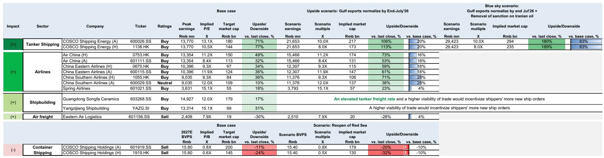
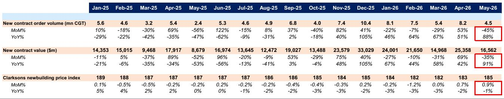
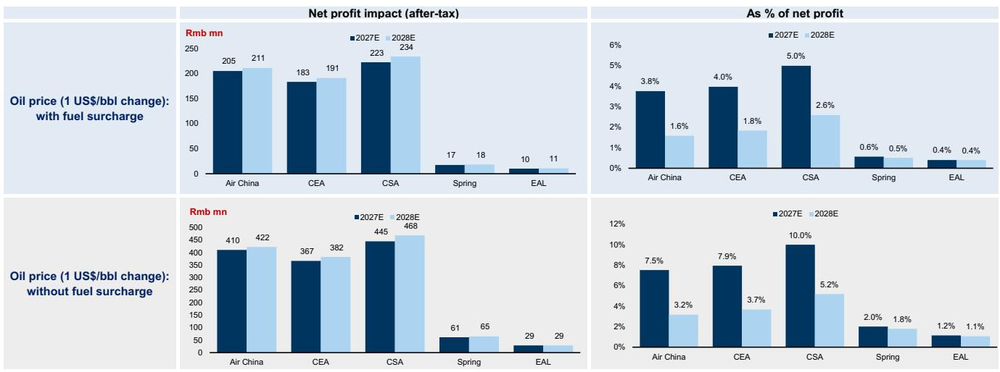

# The Strait of Hormuz Reopening Will Reshape Asian Transport—But the Biggest Winners Are Not Who You Expect

The reopening of the Strait of Hormuz, if it materializes, will not simply reverse the disruptions of the past months. It will create a new equilibrium in global shipping and air transport—one that rewards operators with concentrated market power, punishes those reliant on distressed asset values, and forces investors to recalibrate their assumptions about peak earnings, capacity discipline, and geopolitical risk premia.

A global investment bank report, published in mid-June 2026, offers a detailed scenario analysis of what happens if Gulf oil exports normalize by end-July 2026, and if Iranian sanctions are removed. The headline conclusion is clear: tanker shipping, airlines, and shipbuilders stand to gain, while container shipping faces moderate downside. But the real insight lies not in the direction of the impact—it is in the magnitude, the asymmetry, and the second-order effects that most market participants are overlooking.

The report makes an argument that is both contrarian and empirically grounded: the tanker sector, which has suffered the most from the Hormuz closure, may actually have the most to gain from its reopening. This is not a simple mean-reversion story. It is a story about structural changes in market concentration, pricing power, and the hidden demand created by inventory restocking. The airlines, meanwhile, benefit from lower fuel costs, but the report shows that the upside is concentrated among the "big three" state-owned carriers, not the low-cost operators. And shipbuilders, often seen as lagging indicators, may see a reacceleration of order momentum precisely because the reopening restores confidence in trade flows.

This article will unpack the report's logic, extend its implications into a decision framework for investors, and identify the critical uncertainties that remain unanswered.

## Tanker Shipping Faces the Most Asymmetric Upside Because the Market Has Become More Concentrated, Not Less

The conventional wisdom would suggest that a reopening of the Strait of Hormuz removes the supply disruption that had been supporting tanker rates, and therefore tanker stocks should fall. The report turns this logic on its head. The key insight is that the Hormuz closure did not just reduce supply—it also destroyed demand by preventing crude oil from reaching the market, and it forced a massive drawdown of global crude inventories. When the strait reopens, the demand shock from restocking could be larger than the supply shock from normalization.

The report estimates that global crude inventories are roughly 705 million barrels below pre-war levels as of end-June 2026. If Gulf exports normalize by end-July, and assuming it takes one year to replenish, this implies an additional 4.8% of global seaborne crude oil trade demand. That is a structural demand boost, not a temporary bump.

But the more powerful driver is the change in market structure. The report highlights that the VLCC market has become far more concentrated due to aggressive consolidation by Korean and Chinese operators. The top 10 compliant players now control 68% of the market, up from 47% in 2025. This concentration has increased pricing power dramatically. The report's elasticity analysis shows that every 1 percentage point increase in net crude tanker demand now lifts VLCC TCE by USD 20,000 per day, compared to just USD 6,000 in the 2021-2025 period.

This is the crux of the argument: the same demand increase that would have been modestly beneficial in a fragmented market becomes transformative in a concentrated one. The report estimates that VLCC TCE could reach USD 250,000 per day in the first year after reopening, versus a base case of USD 150,000. In a "blue sky" scenario where Iranian sanctions are also lifted, and shadow fleet capacity shifts to compliant operators, TCE could hit USD 350,000 per day.

For COSCO Shipping Energy, which the report covers, this translates to peak earnings of RMB 21.7 billion in the benign reopening scenario and RMB 29.4 billion in the blue sky scenario, compared to a base case of RMB 13.8 billion. Even after applying a 25% discount to target P/E multiples to account for higher supply from Chinese shipyards in 2028, the implied upside is 106-113% for the A and H shares in the benign scenario, and 180-189% in the blue sky scenario.

The "so what" here is profound: the tanker sector is not a simple beta play on oil prices or geopolitical risk. It is a structural story about market power that has been hiding in plain sight. Investors who treat tanker stocks as cyclical commodities are missing the fact that the industry has undergone a permanent change in its competitive dynamics.

## Airlines Benefit from Lower Fuel Costs, But the Distribution of Gains Is Highly Uneven

The report's analysis of airlines is more straightforward but no less important. The commodities team estimates that a normalization of Gulf exports by end-July would reduce oil prices by roughly USD 10 per barrel relative to a base case that assumed normalization by end-August. This directly lowers fuel costs, which are the single largest operating expense for airlines.

The report estimates that the "big three" Chinese airlines—Air China, China Eastern, and China Southern—could see earnings improvements of 16% to 26%. In contrast, Spring Airlines, the low-cost carrier, sees only a 4% improvement. This disparity is not random. It reflects the fact that the big three have more fuel-intensive long-haul operations and less flexibility to pass on fuel costs to passengers. When fuel prices fall, their margins expand disproportionately.

But the report also introduces a second channel: better demand driven by lower fuel surcharges. This is a subtle but important point. Fuel surcharges in China are a visible cost to passengers, and when they decline, demand elasticity kicks in. The big three, with their extensive domestic and international networks, capture more of this demand benefit than Spring Airlines, which already operates at lower fares and higher load factors.

The implied share price upside is striking. The report suggests that the big three airlines' H-shares could see roughly 60-70% upside potential in the reopening scenario. This is not just a fuel cost story; it is a margin expansion story that combines cost relief with demand stimulation.

However, the report leaves an open question that deserves scrutiny: how much of this upside is already priced in? The base case already assumes some normalization. The scenario analysis is explicitly conditional on a specific timeline. If markets have already discounted a reopening by end-July, the actual upside may be smaller. Investors need to assess whether the consensus view on oil prices and airline earnings is already factoring in this scenario.

## Shipbuilders Are a Second-Order Play on Confidence, Not Immediate Earnings

The report's treatment of shipbuilders is the most nuanced and, in some ways, the most interesting. On the surface, a reopening of Hormuz does not directly affect shipbuilders' near-term earnings. Their order books are already full, and their revenue recognition is backward-looking. The report explicitly states that the reopening "would likely not materially affect the near-term earnings for shipbuilders given their limited exposures."

But the report argues that the real impact is on order momentum. An elevated freight rate environment and higher visibility of trade could incentivize shippers to place new orders, re-accelerating the order momentum that slowed in May 2026. This is a confidence-driven effect, not a fundamental demand effect.

The report highlights Songfa, which owns Hengli Heavy, as its preferred shipbuilder due to "fast expansion and stronger order momentum amid the upcycle." This is a bet on the cyclical upswing continuing, not on a specific catalyst from the Hormuz reopening.

The unanswered question here is whether shipbuilders are already pricing in a prolonged upcycle. The order book data in the report shows significant deliveries scheduled for 2027 and 2028, with 97 VLCCs to be delivered in 2028 alone, representing 10.7% of the year-end 2025 fleet. If the reopening accelerates orders, it could extend the upcycle but also increase future supply. The report acknowledges this tension by applying a lower P/E multiple to tanker stocks to account for higher capacity growth in 2028. The same logic should apply to shipbuilders, but the report does not explicitly adjust their valuations.

## A Decision Framework for Investors: Three Scenarios, Three Strategies

The report implicitly provides a decision framework that investors can use to position themselves, even if the exact timing of the reopening remains uncertain.

**Scenario 1: Hormuz reopens by end-July 2026, but Iranian sanctions remain.** In this case, the most asymmetric upside is in tanker shipping, particularly COSCO Shipping Energy. The concentration-driven pricing power and the restocking demand create a powerful earnings tailwind. Airlines also benefit, but the upside is more evenly distributed across the sector. Shipbuilders see a moderate positive from order momentum. Container shipping faces downside from higher effective capacity due to lower bunker prices and potential Red Sea reopening.

**Scenario 2: Hormuz reopens and Iranian sanctions are lifted.** This is the blue sky scenario. Tanker shipping sees an even larger boost as shadow fleet capacity shifts to compliant operators. The report estimates this could push VLCC TCE to USD 350,000 per day. Airlines benefit from even lower oil prices. Shipbuilders see continued order momentum. Container shipping faces more pronounced downside.

**Scenario 3: The reopening is delayed or does not happen.** In this case, the current environment persists. Tanker rates remain depressed by the temporary oversupply. Airlines continue to face high fuel costs. Shipbuilders may see order momentum slow further. The report does not model this scenario explicitly, but it is the implicit baseline against which the upside scenarios are measured.

The key strategic insight is that the reopening is not binary. The magnitude of the impact depends on the timeline and the scope of the deal. Investors should be prepared to adjust their positions as new information emerges about the negotiations.

## What the Report Does Not Fully Answer: The Sustainability of the Tanker Upside

For all its analytical rigor, the report leaves several critical questions unanswered. The most important is the sustainability of the tanker earnings boost. The report focuses on peak earnings in 2026, but it does not fully address what happens in 2027 and 2028.

The report acknowledges that Chinese shipyards are expanding capacity, and that VLCC deliveries in 2027 and 2028 are significant. It applies a 25% discount to target P/E multiples to account for this, but it does not model the full supply-demand balance beyond the first year after reopening. If the restocking demand is a one-time event, and if new supply comes online in 2027 and 2028, the tanker upcycle could be shorter than the market expects.

The report also does not address the regulatory and environmental risks. As the shadow fleet exits, compliant operators gain market share, but they also face stricter emissions regulations. The cost of compliance could erode some of the pricing power gains.

Another unresolved question is the behavior of OPEC+ and other oil producers. If Iranian sanctions are lifted, Iran could increase its oil exports, potentially putting downward pressure on oil prices and reducing the demand for tanker shipping from other producers. The report assumes that the demand boost from restocking and shadow fleet shift dominates, but it does not model the supply response from OPEC+.

Finally, the report does not address the political risk of the reopening itself. The framework agreement reported in June 2026 is not a final deal. The 60-day negotiation period could break down. Investors need to assess the probability of the scenario materializing and the potential for adverse outcomes.

## The Final Question That Should Drive Readers to the Full Report

The report is a masterclass in scenario analysis, but it is also a reminder that the most important questions cannot be answered by models alone. The report's scenarios are internally consistent and empirically grounded, but they rest on assumptions about political timelines, market behavior, and regulatory outcomes that are inherently uncertain.

The most compelling reason to read the full report is not to get the numbers—it is to understand the logic chain that connects a geopolitical event to a stock price. The report shows how market concentration transforms a demand shock into a pricing power windfall. It shows how fuel cost relief combines with demand elasticity to create margin expansion for airlines. It shows how confidence, not just orders, drives shipbuilder valuations.

But the report also leaves room for debate. Is the tanker market really more concentrated than the data suggests, or is the consolidation temporary? Will the restocking demand be as large as the model assumes, or will producers and consumers adjust their behavior? Will the shadow fleet truly exit, or will it find new routes and new cargoes?

These are the questions that separate a good analysis from a great investment decision. The report provides the framework. The full report provides the data, the charts, and the detailed calculations that allow investors to test their own assumptions.

Join the community to read the full report and review the original charts.

*This article is for learning and discussion only and does not constitute investment advice.*

Personal reading notes and learning share only. Not investment advice.

