TRACKING U.S. SUPPLY CHAIN CONGESTION

# GS Supply Chain Congestion Scale: June 15th; Index Lower W/W, Bottleneck Scale Unchanged at '2'

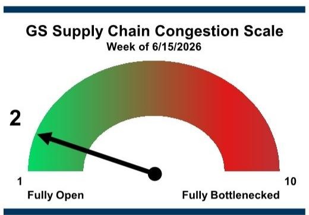

gauge chart

| Rating        | Value |
| ------------- | ----- |
| Fully Open    | 1     |
| Fully Bottlenecked | 10   |

Scale is based solely off weekly metrics to give more granularity on high frequency data indications; see Appendix for scale that combines weekly and monthly metrics

Source: GS Global Investment Research

## Our weekly bottleneck scale remained at '2' this week, reflecting the absolute level of the congestion index decreasing moderately on a sequential basis (-4% w/w; Exhibit 2).

For this week's scale and index, the number of container ships waiting to dock and unload goods along the West Coast remained unchanged at 1, while backlogs along the East Coast were unchanged at 5 (Exhibit 6). West Coast rail intermodal traffic growth accelerated versus last week (+16% YoY vs +10% YoY last week; Exhibit 7), while

## Jordan Alliger

+1(212)357-4913

jordan.alliger@gs.com

GS & Co. LLC

## Andrzej Tomczyk, CFA

+1(212)357-4445

andrzej.tomczyk@gs.com

GS & Co. LLC

## Paul Stoddard

+1(801)744-3761

paul.x.stoddard@gs.com

GS & Co. LLC

rail service metrics were mixed. Chassis dwell times decreased slightly on average at US ports (Exhibit 9), while ocean container shipping rate growth (China to US West Coast) rose WoW but decelerated YoY (-12% YoY Exhibit 10).

Exhibit 1: Our weekly composite index increased in the most recent week (-4% w/w); the bottleneck scale remained at '2'; overall bottleneck levels remain well below peak congestion levels when scale was at '10' and now imply levels in line with pre-Covid fluidity GS Weekly Bottleneck Index, Feb 2020 - June 2026  
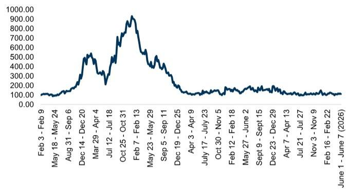

line chart

| Date       | Value   |
| ---------- | ------- |
| Feb 3 - Feb 9 | 100.00  |
| May 18 - May 24 | 150.00  |
| Aug 31 - Sep 6 | 250.00  |
| Dec 14 - Dec 20 | 500.00  |
| Mar 29 - Apr 4 | 450.00  |
| Jul 12 - Jul 18 | 250.00  |
| Oct 25 - Oct 31 | 750.00  |
| Feb 7 - Feb 13 | 950.00  |
| May 23 - May 29 | 500.00  |
| Sep 5 - Sep 11 | 350.00  |
| Dec 19 - Dec 25 | 200.00  |
| Apr 3 - Apr 9 | 150.00  |
| July 17 - July 23 | 150.00 |
| Oct 30 - Nov 5 | 150.00 |
| Feb 12 - Feb 18 | 150.00 |
| May 27 - June 2 | 150.00 |
| Sept 9 - Sept 15 | 150.00 |
| Dec 23 - Dec 29 | 150.00 |
| Apr 7 - Apr 13 | 150.00 |
| Jul 21 - Jul 27 | 150.00 |
| Nov 3 - Nov 9 | 150.00 |
| Feb 16 - Feb 22 | 150.00 |
| June 1 - June 7 (2026) | 150.00 |

Source: GS Global Investment Research  
Exhibit 2: Our average weekly bottleneck score in June is tracking at 2.0; this result is down significantly from the Dec21/Jan22 peak of congestion and close to in line with the pre-Covid baseline  
GS Weekly Congestion Scale, Scored by Month\*

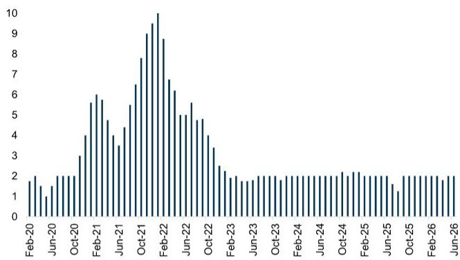

bar chart

| Date | Value |
|---|---|
| Feb-20 | 1.8 |
| Mar-20 | 1.5 |
| Apr-20 | 1.3 |
| May-20 | 1.9 |
| Jun-20 | 2.0 |
| Jul-20 | 2.1 |
| Aug-20 | 2.3 |
| Sep-20 | 3.0 |
| Oct-20 | 4.0 |
| Nov-20 | 5.6 |
| Dec-20 | 5.8 |
| Jan-21 | 4.7 |
| Feb-21 | 3.8 |
| Mar-21 | 4.3 |
| Apr-21 | 5.5 |
| May-21 | 6.5 |
| Jun-21 | 7.9 |
| Jul-21 | 9.5 |
| Aug-21 | 10.0 |
| Sep-21 | 9.0 |
| Oct-21 | 6.8 |
| Nov-21 | 6.2 |
| Dec-21 | 5.0 |
| Jan-22 | 4.9 |
| Feb-22 | 5.6 |
| Mar-22 | 4.8 |
| Apr-22 | 3.4 |
| May-22 | 3.0 |
| Jun-22 | 2.5 |
| Jul-22 | 2.0 |
| Aug-22 | 1.8 |
| Sep-22 | 1.9 |
| Oct-22 | 1.8 |
| Nov-22 | 1.9 |
| Dec-22 | 1.8 |
| Jan-23 | 1.9 |
| Feb-23 | 1.8 |
| Mar-23 | 1.9 |
| Apr-23 | 1.8 |
| May-23 | 1.9 |
| Jun-23 | 1.8 |
| Jul-23 | 1.9 |
| Aug-23 | 1.8 |
| Sep-23 | 1.9 |
| Oct-23 | 1.8 |
| Nov-23 | 1.9 |
| Dec-23 | 1.8 |
| Jan-24 | 1.9 |
| Feb-24 | 1.8 |
| Mar-24 | 1.9 |
| Apr-24 | 1.8 |
| May-24 | 1.9 |
| Jun-24 | 1.8 |
| Jul-24 | 1.9 |
| Aug-24 | 1.8 |
| Sep-24 | 1.9 |
| Oct-24 | 1.8 |
| Nov-24 | 1.9 |
| Dec-24 | 1.8 |
| Jan-25 | 1.9 |
| Feb-25 | 1.8 |
| Mar-25 | 1.9 |
| Apr-25 | 1.8 |
| May-25 | 1.9 |
| Jun-25 | 1.8 |
| Jul-25 | 1.9 |
| Aug-25 | 1.8 |
| Sep-25 | 1.9 |
| Oct-25 | 1.8 |
| Nov-25 | 1.9 |
| Dec-25 | 1.8 |
| Jan-26 | 1.9 |
| Feb-26 | 1.8 |
| Mar-26 | 1.9 |
| Apr-26 | 1.8 |
| May-26 | 1.9 |
| Jun-26 | 1.8 |

\*Numbers reflect the average weekly score seen in each respective month  
Source: GS Global Investment Research

As a reminder (and to help reiterate why and how we construct the index), please refer to the Appendix following Exhibit 17. Additionally, for further clarity on tracked congestion metrics, please refer to the glossary following Exhibit 19.

## Transport Subsectors to Watch as Congestion Remains Muted

The key question remains as to what impact tariffs and geopolitical conflicts will have on demand and timing of freight flows, as well as ability to normalize around global trade. Please see our recent tariff impact tracker for additional commentary. Should supply chain pressures broadly continue to mitigate, then it is conceivable we could see the index remaining more consistently in ‘1’ territory in 2026.

Of the metrics we track (Exhibit 3), we provide updates for the weekly and monthly variables below (Exhibit 4 - Exhibit 5).

Exhibit 3: Tracked Congestion Metrics

<table><tr><td colspan="2">Tracked Metrics</td></tr><tr><td>Weekly VariablesContainer Ships Waiting to Dock at LA/LBContainer Ships Waiting Along to U.S. Gulf/East CoastUNP Intermodal TrafficUNP Intermodal VelocityUNP Intermodal DwellBNSF Intermodal TrafficBNSF Intermodal VelocityBNSF Intermodal DwellOcean Shipping Rates, East Asia to U.S. West Coast Chassis Street Dwell, 20ft ContainersChassis Street Dwell, 40/45ft ContainersChassis Terminal Dwell Time, 20ft ContainersChassis Terminal Dwell Time, 40/45ft Containers</td><td>Monthly VariablesContainer Weighted Average Dwell (San Pedro&#x27;s Bay)Containers Dwelling &gt;5 days (San Pedro&#x27;s Bay)PMI Manufacturing Supplier Delivery TimeBig Three&#x27; West Coast Ports&#x27; Inbound Loaded ContainersLMI Transportation CapacityLMI Warehousing CapacityLMI Warehousing UtilizationDoor to Door Shipping Days, China to USClass 8 Trucking Driver Count GrowthRail Container Dwell (San Pedro&#x27;s Bay)</td></tr></table>

Source: GS Global Investment Research

Exhibit 4: Bottleneck metrics indicated more improved results this week versus last

<table><tr><td></td><td>Mar 23 - Mar 29</td><td>Mar 30 - Apr 5</td><td>Apr 6 - Apr 12</td><td>Apr 13 - Apr 19</td><td>Apr 20 - Apr 26</td><td>Apr 27 - May 3</td><td>May 4 - May 10</td><td>May 11 - May 17</td><td>May 18 - May 24</td><td>May 25 - May 31</td><td>Jun 1 - Jun 7</td></tr><tr><td>Container Ships Waiting to Dock at LA/LB</td><td>1</td><td>0</td><td>1</td><td>0</td><td>1</td><td>1</td><td>0</td><td>1</td><td>1</td><td>1</td><td>1</td></tr><tr><td>Container Ship Backup (East and Gulf Coast)*</td><td>5</td><td>4</td><td>4</td><td>1</td><td>2</td><td>2</td><td>4</td><td>5</td><td>4</td><td>5</td><td>5</td></tr><tr><td>UNP Intermodal Traffic (YoY Growth)</td><td>-8.7%</td><td>-9.0%</td><td>-8.2%</td><td>-4.3%</td><td>-2.0%</td><td>-0.3%</td><td>-0.8%</td><td>8.4%</td><td>8.4%</td><td>8.3%</td><td>15.6%</td></tr><tr><td>UNP Intermodal Velocity (YoY Growth)</td><td>8.5%</td><td>5.0%</td><td>8.3%</td><td>7.4%</td><td>8.3%</td><td>3.9%</td><td>2.5%</td><td>4.2%</td><td>2.9%</td><td>0.0%</td><td>-1.9%</td></tr><tr><td>UNP System Dwell (Hours)</td><td>20.3</td><td>20.1</td><td>19.9</td><td>19.6</td><td>19.4</td><td>20.0</td><td>20</td><td>19.9</td><td>19.5</td><td>19.8</td><td>19.7</td></tr><tr><td>BNSF Intermodal Traffic (YoY Growth)</td><td>1.9%</td><td>2.6%</td><td>2.3%</td><td>5.7%</td><td>4.7%</td><td>7.7%</td><td>7.8%</td><td>9.7%</td><td>18.7%</td><td>11.5%</td><td>15.9%</td></tr><tr><td>BNSF Intermodal Velocity (YoY Growth)</td><td>3.3%</td><td>-3.1%</td><td>-1.6%</td><td>-2.4%</td><td>-2.1%</td><td>-3.9%</td><td>-0.6%</td><td>-3.7%</td><td>6.9%</td><td>-8.6%</td><td>-10.3%</td></tr><tr><td>BNSF System Dwell (Hours)</td><td>22.6</td><td>22.5</td><td>22.1</td><td>22.7</td><td>22.3</td><td>22.1</td><td>22.3</td><td>23.0</td><td>22.8</td><td>22.6</td><td>22.2</td></tr><tr><td>Ocean Shipping Rates, East Asia to U.S. West Coast (YoY Growth)</td><td>-0.1%</td><td>7.7%</td><td>0.9%</td><td>13.2%</td><td>14.9%</td><td>17.4%</td><td>18.1%</td><td>14.3%</td><td>14.1%</td><td>15.6%</td><td>(11.9%)</td></tr><tr><td>Chassis Street Dwell, 20ft Containers (Days)</td><td>5.3</td><td>4.9</td><td>4.4</td><td>4.2</td><td>5.4</td><td>4.5</td><td>4.2</td><td>4.9</td><td>4.4</td><td>4.7</td><td>4.7</td></tr><tr><td>Chassis Street Dwell, 40/45ft Containers (Days)</td><td>6.5</td><td>6.9</td><td>5.7</td><td>5.8</td><td>6.0</td><td>5.5</td><td>5.7</td><td>5.6</td><td>5.5</td><td>5.8</td><td>6.2</td></tr><tr><td>Chassis Terminal Dwell Time, 20ft Containers (Days)</td><td>10.6</td><td>10.6</td><td>9.4</td><td>9.1</td><td>11.4</td><td>10.3</td><td>10.2</td><td>11.5</td><td>12.0</td><td>12.4</td><td>10.8</td></tr><tr><td>Chassis Terminal Dwell Time, 40/45ft Containers (Days)</td><td>7.2</td><td>7.7</td><td>6.3</td><td>6.1</td><td>6.5</td><td>6.2</td><td>6.2</td><td>6.3</td><td>5.5</td><td>5.5</td><td>5.2</td></tr></table>

As of 3/28/22, we added and backdated our estimates for the East and Gulf Coast container ship backlog.

Source: Marine Exchange of Southern California, AAR, STB, Freightos, Pool of Pools, Pacific Merchant Shipping Association, Port of Long Beach, Port of Oakland, Port of Los Angeles, LMI, US Bureau of Labor Statistics, IHS Markit, Refinitiv Eikon, compiled by GS Global Investment Research

Exhibit 5: Lagged monthly bottleneck metrics for April indicated mixed results vs March

<table><tr><td>Monthly Variables</td><td>Jan-25</td><td>Feb-25</td><td>Mar-25</td><td>Apr-25</td><td>May-25</td><td>Jun-25</td><td>Jul-25</td><td>Aug-25</td><td>Sep-25</td><td>Oct-25</td><td>Nov-25</td><td>Dec-25</td><td>Jan-26</td><td>Feb-26</td><td>Mar-26</td><td>Apr-26</td></tr><tr><td>Container Weighted Average Dwell (Days)</td><td>3.3</td><td>2.8</td><td>2.8</td><td>2.8</td><td>3.0</td><td>2.6</td><td>2.9</td><td>2.7</td><td>2.8</td><td>2.7</td><td>2.6</td><td>2.5</td><td>2.8</td><td>2.6</td><td>2.6</td><td>2.6</td></tr><tr><td>% of Containers Dwelling &gt; 5 days</td><td>8%</td><td>8%</td><td>8%</td><td>8%</td><td>8%</td><td>8%</td><td>8%</td><td>8%</td><td>8%</td><td>8%</td><td>8%</td><td>8%</td><td>8%</td><td>8%</td><td>8%</td><td>8%</td></tr><tr><td>Rail Container Dwell (Days)</td><td>7.1</td><td>8.0</td><td>6.8</td><td>4.7</td><td>4.7</td><td>3.3</td><td>5.2</td><td>5.0</td><td>4.0</td><td>3.3</td><td>3.7</td><td>5.1</td><td>6.1</td><td>5.1</td><td>4.4</td><td>5.1</td></tr><tr><td>Big Three Inbound Loaded Containers (YoY)</td><td>23.6%</td><td>5.8%</td><td>11.6%</td><td>9.5%</td><td>-10.0%</td><td>-4.6%</td><td>8.6%</td><td>-2.1%</td><td>-7.3%</td><td>-11.5%</td><td>-9.5%</td><td>-7.1%</td><td>-11.6%</td><td>0.6%</td><td>-2.0%</td><td>-1.0%</td></tr><tr><td>LMI Transportation Capacity</td><td>52.6</td><td>55.1</td><td>53.6</td><td>55.2</td><td>54.7</td><td>52.4</td><td>52.6</td><td>57.3</td><td>55.1</td><td>54.5</td><td>50.0</td><td>36.9</td><td>47.1</td><td>41.0</td><td>39.2</td><td>28.4</td></tr><tr><td>LMI Warehousing Capacity</td><td>51.7</td><td>50.5</td><td>52.3</td><td>55.4</td><td>50.0</td><td>47.8</td><td>51.1</td><td>50.5</td><td>51.6</td><td>52.0</td><td>54.8</td><td>61.2</td><td>50.0</td><td>50.0</td><td>46.0</td><td>45.5</td></tr><tr><td>LMI Warehousing Utilization</td><td>68.3</td><td>65.5</td><td>59.7</td><td>60.1</td><td>62.5</td><td>62.2</td><td>59.4</td><td>62.1</td><td>65.3</td><td>56.5</td><td>47.5</td><td>42.9</td><td>54.4</td><td>60.3</td><td>59.8</td><td>64.4</td></tr><tr><td>Door to Door Shipping Days, China to US</td><td>50</td><td>51</td><td>54</td><td>49</td><td>48</td><td>50</td><td>46</td><td>44</td><td>46</td><td>47</td><td>47</td><td>47</td><td>47</td><td>47</td><td>47</td><td>47</td></tr><tr><td>Class 8 Driver Count</td><td>1493.1</td><td>1487.6</td><td>1491.4</td><td>1490.6</td><td>1487.7</td><td>1482.7</td><td>1482.5</td><td>1480.2</td><td>1472.3</td><td>1472.6</td><td>1467.8</td><td>1467.2</td><td>1465.6</td><td>1465.1</td><td>1465.3</td><td>1469.6</td></tr><tr><td>PMI Manufacturing Supplier Delivery Time (YoY)</td><td>0.8</td><td>11.6</td><td>6.1</td><td>6.2</td><td>9.8</td><td>-0.3</td><td>-4.7</td><td>2.3</td><td>10.8</td><td>-0.5</td><td>0.1</td><td>5.5</td><td>-0.4</td><td>4.6</td><td>6.3</td><td>10.7</td></tr></table>

Source: Marine Exchange of Southern California, AAR, STB, Freightos, Pool of Pools, Pacific Merchant Shipping Association, Port of Long Beach, Port of Oakland, Port of Los Angeles, LMI, US Bureau of Labor Statistics, IHS Markit, compiled by GS Global Investment Research

## Weekly Indicator Update

## Anchored Container Ships

■ West Coast container ship backlogs remained flat at 1 in the most recent week while East Coast backlogs remained unchanged at 5.

Exhibit 6: 5/1\* container ships backed up this week on the East/West Coast  
West vs. East Coast Container Ship Backlog, Weekly Average, Feb 2020 - June 2026  
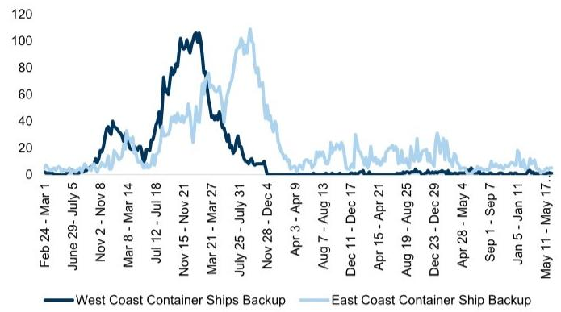

line chart

| Date Range       | West Coast Container Ships Backup | East Coast Container Ship Backup |
| ---------------- | ---------------------------------- | --------------------------------- |
| Feb 24 - Mar 1   | 0                                  | 0                                 |
| June 29 - July 5 | 0                                  | 0                                 |
| Nov 2 - Nov 8    | 0                                  | 0                                 |
| Mar 8 - Mar 14   | 0                                  | 0                                 |
| Jul 12 - Jul 18  | 0                                  | 0                                 |
| Nov 15 - Nov 21  | 0                                  | 0                                 |
| Mar 21 - Mar 27  | 0                                  | 0                                 |
| July 25 - July 31| 0                                  | 0                                 |
| Nov 28 - Dec 4   | 0                                  | 0                                 |
| Apr 3 - Apr 9     | 0                                  | 0                                 |
| Aug 7 - Aug 13   | 0                                  | 0                                 |
| Dec 11 - Dec 17  | 0                                  | 0                                 |
| Apr 15 - Apr 21  | 0                                  | 0                                 |
| Aug 19 - Aug 25  | 0                                  | 0                                 |
| Dec 23 - Dec 29  | 0                                  | 0                                 |
| Apr 28 - May 4   | 0                                  | 0                                 |
| Sep 1 - Sep 7     | 0                                  | 0                                 |
| Jan 5 - Jan 11   | 0                                  | 0                                 |
| May 11 - May 17  | 0                                  | 0                                 |

\*East Coast is estimated via satellite data - includes container ships sitting for more than 3 days within 140 miles of US ports to the right of longitude 100 (i.e., Gulf and East Coast)  
Source: Marine Exchange of Southern California, Refinitiv Eikon, GS Global Investment Research

## Rail Intermodal Trends

West Coast Class 1 Rails' (Union Pacific and Burlington Northern Santa Fe) average intermodal traffic growth accelerated to +16% last week versus +10% in the prior week.

☐ BNSF intermodal traffic at +16% YoY this week vs. +12% YoY last week; UNP intermodal traffic at +16% YoY vs. +8.3% YoY last week.  
□ See average BNSF/UNP growth trends in Exhibit 7.

Exhibit 7: West Coast Class 1 Rails' Intermodal Volume Growth, Week 1 - Week 52  
YoY % growth  
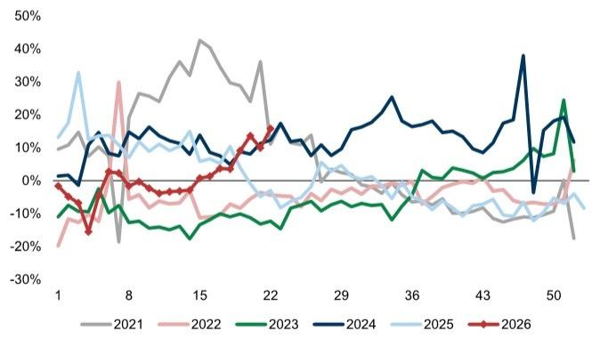

line chart

| X-Axis | 2021 (%) | 2022 (%) | 2023 (%) | 2024 (%) | 2025 (%) | 2026 (%) |
|---|---|---|---|---|---|---|
| 1 | 10 | -20 | -10 | 0 | 15 | -5 |
| 8 | 15 | 30 | -15 | 15 | 35 | -15 |
| 15 | 45 | -5 | -20 | 10 | 10 | 0 |
| 22 | 35 | -5 | -15 | 15 | 5 | 15 |
| 29 | 10 | -5 | -10 | 10 | 0 | 0 |
| 36 | 5 | -5 | 0 | 25 | -5 | 0 |
| 43 | -10 | -5 | 5 | 10 | -10 | 0 |
| 50 | -20 | -5 | 25 | 15 | -10 | 0 |

Source: AAR, Data compiled by GS Global Investment Research

Exhibit 8: West Coast intermodal carload growth (UNP and BNSF) is tracking up \~16% YoY on average in June  
West Coast Class 1 Rail Intermodal Traffic YoY % Growth  
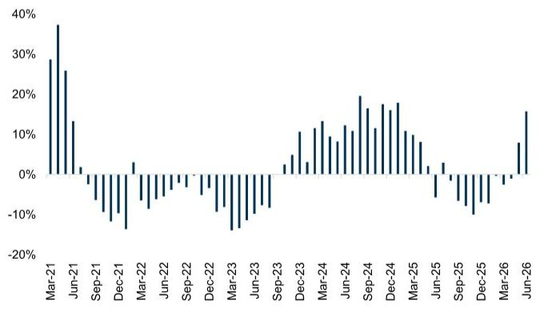

bar chart

| Date | Value (%) |
|---|---|
| Mar-21 | 29 |
| Jun-21 | 38 |
| Sep-21 | 26 |
| Dec-21 | -13 |
| Mar-22 | -14 |
| Jun-22 | -7 |
| Sep-22 | -5 |
| Dec-22 | -3 |
| Mar-23 | -14 |
| Jun-23 | -10 |
| Sep-23 | -8 |
| Dec-23 | 4 |
| Mar-24 | 11 |
| Jun-24 | 13 |
| Sep-24 | 19 |
| Dec-24 | 17 |
| Mar-25 | 18 |
| Jun-25 | -5 |
| Sep-25 | -10 |
| Dec-25 | -8 |
| Mar-26 | -3 |
| Jun-26 | 16 |

Source: AAR, Data compiled by GS Global Investment Research

■ West Coast Class 1 Rail terminal dwell and intermodal train speed were mixed in the recent week (detailed below).

☐ UNP terminal dwell decreased slightly to 19.7 hours in the most recent week; BNSF dwell decreased from 22.6 hours to 22.2 hours.

☐ On intermodal train speed, BNSF was at -10% YoY vs. -8.6% YoY last week; UNP was at -1.9% YoY vs. +0.0% last week.

## Chassis Dwell Time

\- Chassis dwell is down significantly when comparing June to peak congestion levels – as per Exhibit 9; dwell data for the most recent week implied mostly improved results vs last week.

☐ Average Street dwell time for 20ft shipping container chassis was at 4.7 days in week 23 of 2026, unchanged versus 4.7 days in the prior week.  
□ Street dwell time for 40/45ft container chassis was 6.2 days in week 23, up versus 5.8 days in the prior week.  
☐ Chassis terminal dwell time for 20/40ft containers was at 10.8/5.2 days in week 23 versus 12.4/5.5 days in the prior week.

Exhibit 9: Dwell for the more typical 20ft container chassis is well off peak congestion levels  
Chassis Street Dwell Time (20ft Containers)  
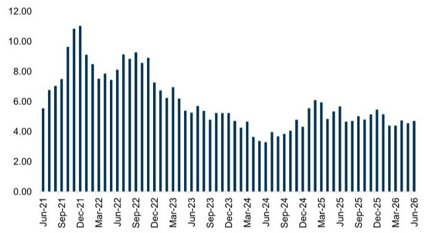

bar chart

| Date | Value |
|---|---|
| Jun-21 | 5.5 |
| Jul-21 | 6.7 |
| Aug-21 | 7.1 |
| Sep-21 | 7.5 |
| Oct-21 | 9.6 |
| Nov-21 | 10.8 |
| Dec-21 | 11.0 |
| Jan-22 | 9.0 |
| Feb-22 | 8.5 |
| Mar-22 | 7.5 |
| Apr-22 | 7.3 |
| May-22 | 7.4 |
| Jun-22 | 8.0 |
| Jul-22 | 8.3 |
| Aug-22 | 9.1 |
| Sep-22 | 9.3 |
| Oct-22 | 8.7 |
| Nov-22 | 8.6 |
| Dec-22 | 7.3 |
| Jan-23 | 6.7 |
| Feb-23 | 6.3 |
| Mar-23 | 6.9 |
| Apr-23 | 5.5 |
| May-23 | 5.3 |
| Jun-23 | 5.7 |
| Jul-23 | 5.4 |
| Aug-23 | 5.0 |
| Sep-23 | 5.1 |
| Oct-23 | 5.1 |
| Nov-23 | 4.7 |
| Dec-23 | 4.6 |
| Jan-24 | 4.5 |
| Feb-24 | 3.6 |
| Mar-24 | 3.6 |
| Apr-24 | 3.3 |
| May-24 | 3.9 |
| Jun-24 | 3.8 |
| Jul-24 | 3.8 |
| Aug-24 | 4.0 |
| Sep-24 | 4.0 |
| Oct-24 | 4.8 |
| Nov-24 | 4.4 |
| Dec-24 | 5.5 |
| Jan-25 | 6.0 |
| Feb-25 | 5.9 |
| Mar-25 | 5.0 |
| Apr-25 | 5.6 |
| May-25 | 4.7 |
| Jun-25 | 4.7 |
| Jul-25 | 4.9 |
| Aug-25 | 5.0 |
| Sep-25 | 5.1 |
| Oct-25 | 5.4 |
| Nov-25 | 5.3 |
| Dec-25 | 4.3 |
| Jan-26 | 4.4 |
| Feb-26 | 4.6 |
| Mar-26 | 4.5 |
| Apr-26 | 4.6 |
| May-26 | 4.6 |

Dwell time shown in days  
Source: Pool of Pools

## Ocean Shipping Rates

\- The prior week saw ocean container rates at \~\$4.84k (-12% YoY) vs \~\$3.20k in the previous week (+16% YoY).

Exhibit 10: Ocean Container Shipping Rates, China/East Asia to North America West Coast  
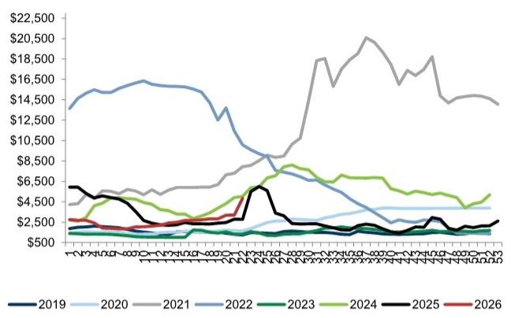

line chart

| Year | 2019 | 2020 | 2021 | 2022 | 2023 | 2024 | 2025 | 2026 |
| --- | --- | --- | --- | --- | --- | --- | --- | --- |
| Series 1 | $500 | $500 | $14,500 | $16,500 | $500 | $6,500 | $5,000 | $3,000 |
| Series 2 | $500 | $500 | $14,500 | $16,500 | $500 | $6,500 | $5,000 | $3,000 |
| Series 3 | $500 | $500 | $14,500 | $16,500 | $500 | $6,500 | $5,000 | $3,000 |
| Series 4 | $500 | $500 | $14,500 | $16,500 | $500 | $6,500 | $5,000 | $3,000 |
| Series 5 | $500 | $500 | $14,500 | $16,500 | $500 | $6,500 | $5,000 | $3,000 |
| Series 6 | $500 | $500 | $14,500 | $16,500 | $500 | $6,500 | $5,000 | $3,000 |
| Series 7 | $500 | $500 | $14,500 | $16,500 | $500 | $6,500 | $5,000 | $3,000 |
| Series 8 | $500 | $500 | $14,500 | $16,500 | $500 | $6,500 | $5,000 | $3,000 |
| Series 9 | $500 | $500 | $14,500 | $16,500 | $500 | $6,500 | $5,000 | $3,000 |
| Series 10 | $500 | $500 | $14,500 | $16,500 | $500 | $6,500 | $5,000 | $3,000 |
| Series 11 | $500 | $500 | $14,500 | $16,500 | $500 | $6,500 | $5,000 | $3,000 |
| Series 12 | $500 | $500 | $14,500 | $16,500 | $5,256 | $6,588 | $2,777 | $3,277 |
| Series 13 | $5,277 | $2,777 | $14,588 | $16,888 | $2.777 | $6,888 | $2.777 | $3.333 |
| Series 14 | $2.777 | $2.777 | $14,888 | $17.188 | $2.777 | $6.888 | $2.777 | $3.333 |
| Series 15 | $2.777 | $2.777 | $14.888 | $17.488 | $2.777 | $6.888 | $2.777 | $3.333 |
| Series 16 | $2.777 | $2.777 | $14.888 | $17.788 | $2.777 | $6.888 | $2.777 | $3.333 |
| Series 17 | $2.777 | $2.777 | $14.888 | $18.188 | $2.777 | $6.888 | $2.777 | $3.333 |
| Series 18 | $2.777 | $2.777 | $14.888 | $18.488 | $2.777 | $6.888 | $2.777 | $3.333 |
| Series 19 | $2.777 | $2.777 | $14.888 | $18.888 | $2.777 | $6.888 | $2.777 | $3.333 |

Rate is \$ per FEU (Forty-Foot Equivalent Unit)  
Source: FBX

## Lagged Monthly Indicators (April Data)

## San Pedro's Bay Container Dwell

- Container weighted average dwell time was \~2.6 days in April, unchanged versus \~2.6 days in March.  
Rail container dwell was higher in April at 5.1 days vs 4.4 days in March; this result for dwell remains far below 2022's peak rail container dwell of \~16 days.

Exhibit 11: Container Weighted Average Dwell Time at San Pedro's Bay, Days  
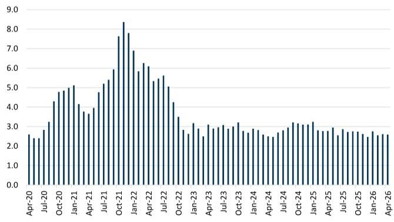

bar chart

| Date | Value |
|---|---|
| Apr-20 | 2.5 |
| Jul-20 | 2.4 |
| Oct-20 | 3.1 |
| Jan-21 | 4.3 |
| Apr-21 | 4.8 |
| Jul-21 | 5.0 |
| Oct-21 | 5.1 |
| Jan-22 | 4.1 |
| Apr-22 | 3.7 |
| Jul-22 | 3.9 |
| Oct-22 | 4.8 |
| Jan-23 | 5.3 |
| Apr-23 | 5.9 |
| Jul-23 | 7.7 |
| Oct-23 | 8.4 |
| Jan-24 | 7.8 |
| Apr-24 | 6.9 |
| Jul-24 | 5.8 |
| Oct-24 | 6.3 |
| Jan-25 | 5.4 |
| Apr-25 | 5.6 |
| Jul-25 | 5.1 |
| Oct-25 | 4.3 |
| Jan-26 | 3.4 |
| Apr-26 | 2.8 |
| Apr-26 (end) | 2.6 |
The data is already in the required format for visualizing the metric 'Value' over time. The values are estimated based on the provided code.

Source: Pacific Merchant Shipping Association

Exhibit 12: % of Containers Dwelling More than 5 Days  
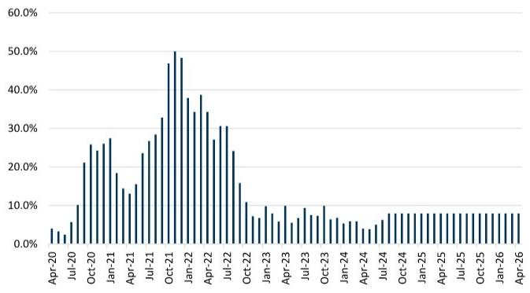

bar chart

| Month | Value (%) |
|---|---|
| Apr-20 | 3.5 |
| Jul-20 | 4.8 |
| Oct-20 | 21.0 |
| Jan-21 | 25.5 |
| Apr-21 | 27.0 |
| Jul-21 | 18.0 |
| Oct-21 | 24.0 |
| Jan-22 | 47.0 |
| Apr-22 | 50.0 |
| Jul-22 | 48.0 |
| Oct-22 | 38.0 |
| Jan-23 | 34.0 |
| Apr-23 | 39.0 |
| Jul-23 | 33.0 |
| Oct-23 | 27.0 |
| Jan-24 | 30.0 |
| Apr-24 | 16.0 |
| Jul-24 | 10.0 |
| Oct-24 | 8.0 |
| Jan-25 | 9.0 |
| Apr-25 | 8.0 |
| Jul-25 | 8.0 |
| Oct-25 | 8.0 |
| Jan-26 | 8.0 |
| Apr-26 | 8.0 |

Source: Pacific Merchant Shipping Association

Exhibit 13: Rail Container Dwell Time, Days  
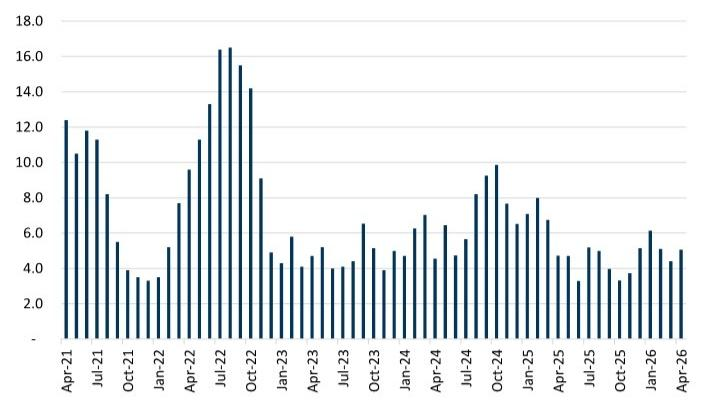

bar chart

| Month | Value |
|---|---|
| Apr-21 | 12.3 |
| May-21 | 10.5 |
| Jun-21 | 11.4 |
| Jul-21 | 11.2 |
| Aug-21 | 8.1 |
| Sep-21 | 5.5 |
| Oct-21 | 3.7 |
| Nov-21 | 3.4 |
| Dec-21 | 3.3 |
| Jan-22 | 3.4 |
| Feb-22 | 5.2 |
| Mar-22 | 7.6 |
| Apr-22 | 9.6 |
| May-22 | 11.3 |
| Jun-22 | 13.3 |
| Jul-22 | 16.4 |
| Aug-22 | 16.5 |
| Sep-22 | 15.5 |
| Oct-22 | 14.2 |
| Nov-22 | 9.0 |
| Dec-22 | 4.8 |
| Jan-23 | 4.3 |
| Feb-23 | 5.8 |
| Mar-23 | 4.0 |
| Apr-23 | 4.3 |
| May-23 | 5.3 |
| Jun-23 | 4.0 |
| Jul-23 | 4.0 |
| Aug-23 | 4.3 |
| Sep-23 | 6.5 |
| Oct-23 | 5.1 |
| Nov-23 | 4.0 |
| Dec-23 | 4.8 |
| Jan-24 | 4.8 |
| Feb-24 | 6.3 |
| Mar-24 | 7.0 |
| Apr-24 | 4.5 |
| May-24 | 6.5 |
| Jun-24 | 4.8 |
| Jul-24 | 5.7 |
| Aug-24 | 8.1 |
| Sep-24 | 9.3 |
| Oct-24 | 9.9 |
| Nov-24 | 7.7 |
| Dec-24 | 6.7 |
| Jan-25 | 7.1 |
| Feb-25 | 8.0 |
| Mar-25 | 6.7 |
| Apr-25 | 4.8 |
| May-25 | 4.8 |
| Jun-25 | 3.3 |
| Jul-25 | 5.1 |
| Aug-25 | 5.0 |
| Sep-25 | 4.0 |
| Oct-25 | 3.6 |
| Nov-25 | 3.7 |
| Dec-25 | 5.1 |
| Jan-26 | 6.1 |
| Feb-26 | 5.0 |
| Mar-26 | 4.3 |
| Apr-26 | 5.0 |

Source: Pacific Merchant Shipping Association

"Big Three" West Coast Ports' Inbound Loaded Containers

■ Total inbound containers for the Ports of LA, Long Beach, and Oakland -1.0% YoY in April. See our Big Three Note.

Exhibit 14: West Coast Ports' Inbound Loaded Containers -1.0% YoY in April  
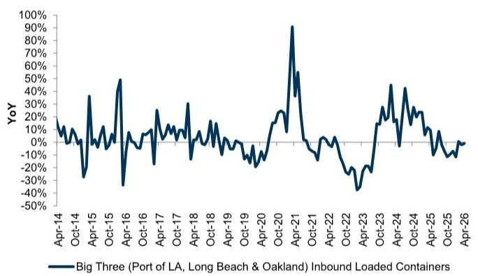

line chart

| Date    | YoY (%) |
|---------|---------|
| Apr-14  | ~10%    |
| Oct-14  | ~0%     |
| Apr-15  | ~30%    |
| Oct-15  | ~50%    |
| Apr-16  | ~-30%   |
| Oct-16  | ~10%    |
| Apr-17  | ~20%    |
| Oct-17  | ~30%    |
| Apr-18  | ~10%    |
| Oct-18  | ~0%     |
| Apr-19  | ~-10%   |
| Oct-19  | ~-20%   |
| Apr-20  | ~20%    |
| Oct-20  | ~90%    |
| Apr-21  | ~-10%   |
| Oct-21  | ~-30%   |
| Apr-22  | ~-20%   |
| Oct-22  | ~-40%   |
| Apr-23  | ~20%    |
| Oct-23  | ~40%    |
| Apr-24  | ~30%    |
| Oct-24  | ~10%    |
| Apr-25  | ~0%     |
| Oct-25  | ~-10%   |
| Apr-26  | ~0%     |

Source: Port of Long Beach, Port of Los Angeles, Port of Oakland

## Door to Door Shipping, China to US

It was taking an average of 47 days to ship (door to door) from China to the US in October, much closer to average pre-pandemic transit times when compared to peak congestion at 80+ days, and largely unchanged MoM vs 46 days in September. We assumed unchanged transit times in Nov-April for index updating purposes (given limited updates from data provider).

Exhibit 15: Door to Door Shipping Days, China to US  
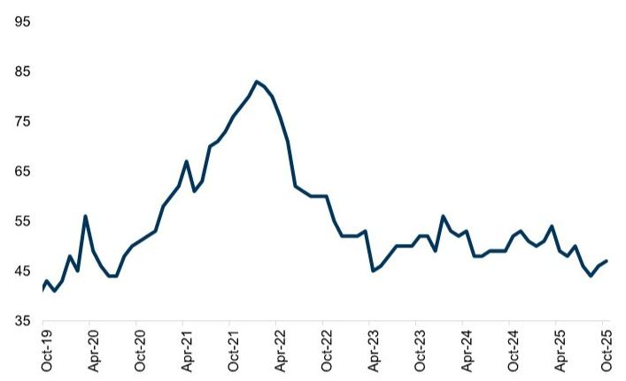

line chart

| Date   | Value |
|--------|-------|
| Oct-19 | 40    |
| Apr-20 | 55    |
| Oct-20 | 45    |
| Apr-21 | 65    |
| Oct-21 | 75    |
| Apr-22 | 85    |
| Oct-22 | 60    |
| Apr-23 | 45    |
| Oct-23 | 50    |
| Apr-24 | 55    |
| Oct-24 | 45    |
| Apr-25 | 50    |
| Oct-25 | 45    |

Source: Freightos

## Trucking Employee Count

Truck transportation employee count was implied to be below pre-pandemic highs in March (-4.2% below pre-Covid); YoY growth has averaged -1.7% over the past six months. March's employee count was +0.3% sequentially.

Exhibit 16: Total Truck Transportation Employee Count, Seasonally Adjusted  
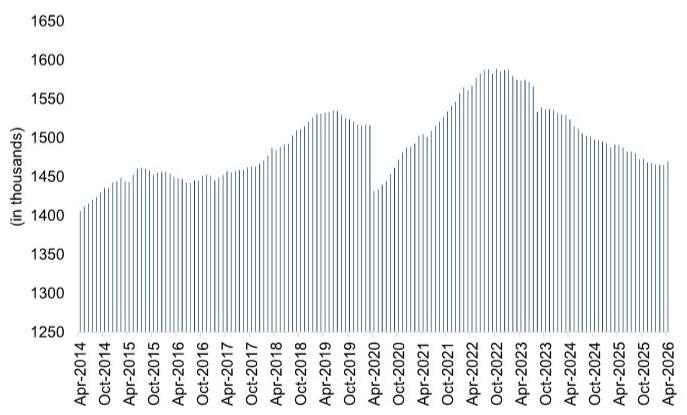

bar chart

| Date | Value (in thousands) |
|---|---|
| Apr-2014 | 1400 |
| Oct-2014 | 1420 |
| Apr-2015 | 1430 |
| Oct-2015 | 1440 |
| Apr-2016 | 1450 |
| Oct-2016 | 1440 |
| Apr-2017 | 1450 |
| Oct-2017 | 1460 |
| Apr-2018 | 1470 |
| Oct-2018 | 1490 |
| Apr-2019 | 1530 |
| Oct-2019 | 1520 |
| Apr-2020 | 1430 |
| Oct-2020 | 1470 |
| Apr-2021 | 1500 |
| Oct-2021 | 1530 |
| Apr-2022 | 1580 |
| Oct-2022 | 1590 |
| Apr-2023 | 1570 |
| Oct-2023 | 1540 |
| Apr-2024 | 1520 |
| Oct-2024 | 1500 |
| Apr-2025 | 1480 |
| Oct-2025 | 1470 |
| Apr-2026 | 1460 |

Source: US Bureau of Labor Statistics

## LMI Capacity and Utilization

## ■ LMI Transportation Capacity Index

Transportation capacity contracted in April given the 28.4 reading; the reading decreased relative to March's 39.2 reading (implying more contraction

of capacity).

## LMI Warehouse Capacity Index

□ Warehouse capacity was contracting in April given the 45.5 reading; this result was down from March (indicating less available overall warehouse capacity).

## LMI Warehouse Utilization Index

□ Warehouse utilization showed expansion in April at a higher pace compared to March (64.4 reading vs 59.8 in March).

## PMI Supplier Delivery Times

\- Delivery times were expanding in April (i.e., below 50 indicates expanding delivery times) given the 42.4 reading; the April supplier delivery PMI index was $+10.7\%$ YoY.

Exhibit 17: PMI: Manufacturing Suppliers' Delivery Times, YoY, Seasonally Adjusted  
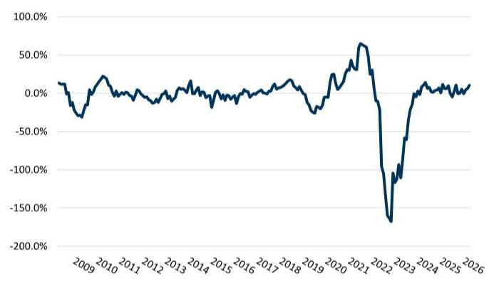

line chart

| Year | Value     |
|------|-----------|
| 2009 | -50.0%    |
| 2010 | 25.0%     |
| 2011 | 0.0%      |
| 2012 | -10.0%    |
| 2013 | 10.0%     |
| 2014 | 5.0%      |
| 2015 | 0.0%      |
| 2016 | -5.0%     |
| 2017 | 10.0%     |
| 2018 | 25.0%     |
| 2019 | -25.0%    |
| 2020 | 30.0%     |
| 2021 | 60.0%     |
| 2022 | -180.0%   |
| 2023 | -100.0%   |
| 2024 | 10.0%     |
| 2025 | 5.0%      |
| 2026 | 15.0%     |

Source: IHS Markit

## Appendix

Given the importance supply chain fluidity has on retailers, consumer goods companies, inflationary pricing, etc., we think this scale's importance is tied most directly to the pace at which supply chain congestion is on the mend. To this end, we look at a variety of variables that we think tie directly, or in some cases indirectly, to overall congestion; including ships at anchor, days to deliver, various dwell times, intermodal volume and velocity statistics amongst others. Aggregating this data, we create the Supply Chain Congestion Scale – an attempt to quantify the balance between supply chains being “Fully Bottlenecked” and “Fully Open,” relative to the pre-pandemic benchmark we chose as Feb $3^{rd}$ , 2020. Basically, how fluid is the overall transport logistics network.

To determine the position of the Legacy Congestion Scale (1-10), we calculate growth or decline in each category (monthly and weekly variables) relative to pre-congestion levels, overweighting certain categories we deem most directly tied to supply chain bottlenecks (i.e., ships anchored off the ports of LA and Long Beach, shipping container and chassis street dwell times, door-to-door shipping days from China to US), and scale it based on our Composite Scale (Exhibit 19).

We publish the weekly scale on Monday PM/Tuesday AM to relay leading edge data that will inform the roughly one month lagged composite (i.e., we will update the weekly scale every week and the legacy scale will be updated monthly). Looking at the two charts, it is generally clear that the weekly composite should have good predictive ability as to the eventual direction of the monthly composite (which includes more encompassing variables than pure weekly ones to provide strong confirmation on congestion direction), and this is confirmed by the similar R^2 values seen in Exhibit 18.

Exhibit 18: The weekly composite index (light blue) leads the monthly (dark blue); expect future monthly updates to confirm recent weekly trends  
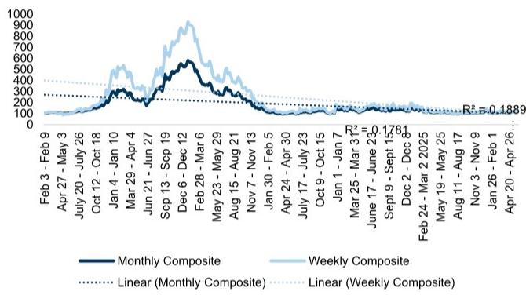

line chart

| Date       | Monthly Composite | Weekly Composite |
|------------|-------------------|------------------|
| Feb 3 - Feb 9 | 100               | 100              |
| Apr 27 - May 3 | 150             | 150              |
| July 20 - July 26 | 200           | 200              |
| Oct 12 - Oct 18 | 250           | 250              |
| Jan 4 - Jan 10 | 300           | 300              |
| Mar 29 - Apr 4 | 350           | 350              |
| Jun 21 - Jun 27 | 400           | 400              |
| Sep 13 - Sep 19 | 450           | 450              |
| Dec 6 - Dec 12 | 500           | 500              |
| Feb 28 - Mar 6 | 450           | 450              |
| May 23 - May 29 | 400           | 400              |
| Aug 15 - Aug 21 | 350           | 350              |
| Nov 7 - Nov 13 | 300           | 300              |
| Jan 30 - Feb 5 | 250           | 250              |
| Apr 24 - Apr 30 | 200           | 200              |
| Jul 17 - Jul 23 | 150           | 150              |
| Oct 9 - Oct 15 | 100           | 100              |
| Jan 1 - Jan 7 | 100           | 100              |
| Mar 25 - Mar 31* | 150         | 150              |
| June 17 - June 23* | 200         | 200              |
| Sept 9 - Sept 15* | 250         | 250              |
| Dec 2 - Dec 8   | 300         | 300              |
| Feb 24 - Mar 2-2025 | 350        | 350              |
| May 19 - May 25    | 400         | 400              |
| Aug 11 - Aug 17    | 450         | 450              |
| Nov 3 - Nov 9      | 500         | 500              |
| Jan 26 - Feb 1      | 550         | 550              |
| Apr 20 - Apr 26... | 600       | 600              |

Source: GS Global Investment Research

Exhibit 19: Our combined scale averaged '108' in April, indicating a bottleneck score of '2' but close to '1' when looking at all metrics (weekly and monthly combined) Weekly + Monthly Combined Congestion Scale\*  
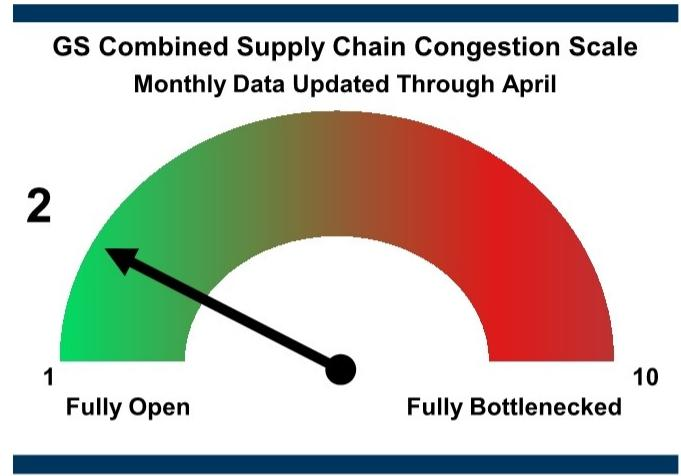

gauge chart

| Category           | Value |
| ------------------ | ----- |
| Fully Open         | 1     |
| Fully Bottlenecked | 10    |

\*We rescaled our index on 3/28/2022 to account for higher-than-anticipated peak bottleneck levels  
Source: GS Global Investment Research

Exhibit 20: GS Legacy Supply Chain Congestion Scale (incorporates monthly and weekly data)

<table><tr><td>Composite Scale</td><td>Fluidity Scale</td></tr><tr><td>&lt;101</td><td>1</td></tr><tr><td>101-153</td><td>2</td></tr><tr><td>154-206</td><td>3</td></tr><tr><td>207-259</td><td>4</td></tr><tr><td>260-313</td><td>5</td></tr><tr><td>314-366</td><td>6</td></tr><tr><td>367-419</td><td>7</td></tr><tr><td>420-472</td><td>8</td></tr><tr><td>473-526</td><td>9</td></tr><tr><td>&gt;526</td><td>10</td></tr></table>

Source: GS Global Investment Research

Exhibit 21: GS Weekly Supply Chain Congestion Scale (High-Frequency Data)

<table><tr><td>Composite Scale</td><td>Fluidity Scale</td></tr><tr><td>&lt;101</td><td>1</td></tr><tr><td>101-192</td><td>2</td></tr><tr><td>193-284</td><td>3</td></tr><tr><td>285-376</td><td>4</td></tr><tr><td>377-468</td><td>5</td></tr><tr><td>469-560</td><td>6</td></tr><tr><td>561-652</td><td>7</td></tr><tr><td>653-745</td><td>8</td></tr><tr><td>746-837</td><td>9</td></tr><tr><td>&gt;838</td><td>10</td></tr></table>

Source: GS Global Investment Research

## Glossary:

1. West Coast container ship backlog: tracks the number of container ships waiting to dock at the ports of LA and Long Beach; we add the number of ships anchored within 40 miles of the coast to the number of ships slow-steaming to port (AKA: ships loitering farther offshore) to get a better depiction of the true container ship backlog.

2. East Coast container ship backlog: estimates the number of container ships waiting to dock at the East and Gulf Coast ports in the US; based on satellite image data technology (Eikon), we add the number of container ships sitting for at least three days within 140 miles of a US port (accounts for ships to the right of 100 degrees of longitude to account for East Coast).

3. Intermodal traffic: tracks Y/Y intermodal carload volume growth for West Coast Class 1 Rails (BNSF and UNP). Accelerating volumes would indicate a more fluid supply chain for our purposes as more goods get moved through the system.

4. Intermodal velocity: tracks the average speed of the intermodal railcars (BNSF and UNP).

5. Intermodal dwell: tracks the average number of hours an intermodal railcar is idle (i.e., how long the car spends waiting at a terminal).

6. Chassis dwell: refers to the average time for chassis waiting on-terminal and on-street.

7. Rail container dwell: refers to the number of days a container waits to depart from a rail facility after being unloaded from an ocean carrier.

8. Container weighted average dwell: refers to the number of days a container stays at a marine terminal after being unloaded from an ocean carrier and taken off the premises by a truck.

9. Ocean shipping rates: refers to the average cost of shipping a container by ocean; we specifically track the cost of shipping from East Asia to the US West Coast via the FBX01 index from Freightos.

10. Big Three West Coast Ports' inbound loaded containers: refers to the Y/Y growth that the Big Three West Coast ports (LA, Long Beach, and Oakland) see in inbound loaded containers (i.e., how many more goods are moving through the port versus the same period last year).

11. PMI manufacturing supplier delivery time index: readings of 50 indicate no change in delivery times versus the prior month; readings above 50 indicate delivery times improved (faster supply chain) and readings below 50 indicated delivery times deteriorated sequentially (more delayed supply chain). The index is a result of IHS Markit's PMI business survey which asks purchasing managers, "Are your suppliers' delivery times slower, faster or unchanged on average than one month ago?"

12. China-to-US door-to-door shipping transit time: sourced from Freightos, this metric tracks the number of days it takes for a good to reach final destination (on average) once an order is placed and accepted (i.e., door-to-door shipping is not necessarily port-to-port as it also captures delivery times from port to final destination).

GS Data Works leverages alternative data sources and advanced analysis techniques to create unique data-driven insights across Global Investment Research. GS Data Works analysis (East Coast container ship backlog estimates) provided by Dan Duggan, Ph.D., Aditi Singh, and Parag Agrawal.

## Disclosure Appendix

## Reg AC

We, Jordan Alliger, Andrzej Tomczyk, CFA and Paul Stoddard, hereby certify that all of the views expressed in this report accurately reflect our personal views about the subject company or companies and its or their securities. We also certify that no part of our compensation was, is or will be, directly or indirectly, related to the specific recommendations or views expressed in this report.

Unless otherwise stated, the individuals listed on the cover page of this report are analysts in GS' Global Investment Research division.

Contributing Authors: Jordan Alliger GS & Co. LLC, Andrzej Tomczyk, CFA GS & Co. LLC, Paul Stoddard GS & Co. LLC.

Unless otherwise stated, the individuals listed in the Contributing Authors disclosure of this report are analysts in GS' Global Investment Research division.

## GS Factor Profile

The GS Factor Profile provides investment context for a stock by comparing key attributes to the market (i.e. our universe of rated stocks) and its sector peers. The four key attributes depicted are: Growth, Financial Returns, Multiple (e.g. valuation) and Integrated (a composite of Growth, Financial Returns and Multiple). Growth, Financial Returns and Multiple are calculated by using normalized ranks for specific metrics for each stock. The normalized ranks for the metrics are then averaged and converted into percentiles for the relevant attribute. The precise calculation of each metric may vary depending on the fiscal year, industry and region, but the standard approach is as follows:

Growth is based on a stock's forward-looking sales growth, EBITDA growth and EPS growth (for financial stocks, only EPS and sales growth), with a higher percentile indicating a higher growth company. Financial Returns is based on a stock's forward-looking ROE, ROCE and CROCI (for financial stocks, only ROE), with a higher percentile indicating a company with higher financial returns. Multiple is based on a stock's forward-looking P/E, P/B, price/dividend (P/D), EV/EBITDA, EV/FCF and EV/Debt Adjusted Cash Flow (DACF) (for financial stocks, only P/E, P/B and P/D), with a higher percentile indicating a stock trading at a higher multiple. The Integrated percentile is calculated as the average of the Growth percentile, Financial Returns percentile and (100% - Multiple percentile).

Financial Returns and Multiple use the GS analyst forecasts at the fiscal year-end at least three quarters in the future. Growth uses inputs for the fiscal year at least seven quarters in the future compared with the year at least three quarters in the future (on a per-share basis for all metrics).

For a more detailed description of how we calculate the GS Factor Profile, please contact your GS representative.

## M&A Rank

Across our global coverage, we examine stocks using an M&A framework, considering both qualitative factors and quantitative factors (which may vary across sectors and regions) to incorporate the potential that certain companies could be acquired. We then assign a M&A rank as a means of scoring companies under our rated coverage from 1 to 3, with 1 representing high (30%-50%) probability of the company becoming an acquisition target, 2 representing medium (15%-30%) probability and 3 representing low (0%-15%) probability. For companies ranked 1 or 2, in line with our standard departmental guidelines we incorporate an M&A component into our target price. M&A rank of 3 is considered immaterial and therefore does not factor into our price target, and may or may not be discussed in research.

## Quantum

Quantum is GS' proprietary database providing access to detailed financial statement histories, forecasts and ratios. It can be used for in-depth analysis of a single company, or to make comparisons between companies in different sectors and markets.

## Disclosures

## Distribution of ratings/investment banking relationships

GS Investment Research global Equity coverage universe

<table><tr><td rowspan="2"></td><td colspan="3">Rating Distribution</td><td colspan="3">Investment Banking Relationships</td></tr><tr><td>Buy</td><td>Hold</td><td>Sell</td><td>Buy</td><td>Hold</td><td>Sell</td></tr><tr><td>Global</td><td>50%</td><td>34%</td><td>16%</td><td>65%</td><td>60%</td><td>45%</td></tr></table>

As of April 1, 2026, GS Global Investment Research had investment ratings on 3,074 equity securities. GS assigns stocks as Buys and Sells on various regional Investment Lists; stocks not so assigned are deemed Neutral. Such assignments equate to Buy, Hold and Sell for the purposes of the above disclosure required by the FINRA Rules. See 'Ratings, Coverage universe and related definitions' below. The Investment Banking Relationships chart reflects the percentage of subject companies within each rating category for whom GS has provided investment banking services within the previous twelve months.

## Regulatory disclosures

## Disclosures required by United States laws and regulations

See company-specific regulatory disclosures above for any of the following disclosures required as to companies referred to in this report: manager or co-manager in a pending transaction; $1\%$ or other ownership; compensation for certain services; types of client relationships; managed/co-managed public offerings in prior periods; directorships; for equity securities, market making and/or specialist role. GS trades or may trade as a principal in debt securities (or in related derivatives) of issuers discussed in this report.

The following are additional required disclosures: Ownership and material conflicts of interest: GS policy prohibits its analysts, professionals reporting to analysts and members of their households from owning securities of any company in the analyst's area of coverage. Analyst compensation: Analysts are paid in part based on the profitability of GS, which includes investment banking revenues. Analyst as officer or director: GS policy generally prohibits its analysts, persons reporting to analysts or members of their households from serving as an officer, director or advisor of any company in the analyst's area of coverage. Non-U.S. Analysts: Non-U.S. analysts may not be associated persons of GS & Co. LLC and therefore may not be subject to FINRA Rule 2241 or FINRA Rule 2242 restrictions on communications with a subject company, public appearances and trading in securities covered by the analysts.

Distribution of ratings: See the distribution of ratings disclosure above. Price chart: See the price chart, with changes of ratings and price targets in prior periods, above, or, if electronic format or if with respect to multiple companies which are the subject of this report, on the GS website at https://www.gs.com/research/hedge.html.

## Additional disclosures required under the laws and regulations of jurisdictions other than the United States

The following disclosures are those required by the jurisdiction indicated, except to the extent already made above pursuant to United States laws and regulations. Australia: GS Australia Pty Ltd and its affiliates are not authorised deposit-taking institutions (as that term is defined in the Banking Act 1959 (Cth)) in Australia and do not provide banking services, nor carry on a banking business, in Australia. This research, and any access to it, is intended only for “wholesale clients” within the meaning of the Australian Corporations Act, unless otherwise agreed by GS. In producing research reports, members of Global Investment Research of GS Australia may attend site visits and other meetings hosted by the companies and other entities which are the subject of its research reports. In some instances the costs of such site visits or meetings may be met in part or in whole by the issuers concerned if GS Australia considers it is appropriate and reasonable in the specific circumstances relating to the site visit or meeting. To the extent that the contents of this document contains any financial product advice, it is general advice only and has been prepared by GS without taking into account a client’s objectives, financial situation or needs. A client should, before acting on any such advice, consider the appropriateness of the advice having regard to the client’s own objectives, financial situation and needs. A copy of certain GS Australia and New Zealand disclosure of interests and a copy of GS’ Australian Sell-Side Research Independence Policy Statement are available at: https://www.goldmansachs.com/disclosures/australia-new-zealand/index.html. Brazil: Disclosure information in relation to CVM Resolution n. 20 is available at https://www.gs.com/worldwide/brazil/area/gir/index.html. Where applicable, the Brazil-registered analyst primarily responsible for the content of this research report, as defined in Article 20 of CVM Resolution n. 20, is the first author named at the beginning of this report, unless indicated otherwise at the end of the text. Canada: This information is being provided to you for information purposes only and is not, and under no circumstances should be construed as, an advertisement, offering or solicitation by GS & Co. LLC for purchasers of securities in Canada to trade in any Canadian security. GS & Co. LLC is not registered as a dealer in any jurisdiction in Canada under applicable Canadian securities laws and generally is not permitted to trade in Canadian securities and may be prohibited from selling certain securities and products in certain jurisdictions in Canada. If you wish to trade in any Canadian securities or other products in Canada please contact GS Canada Inc., an affiliate of The GS Group Inc., or another registered Canadian dealer. Hong Kong: Further information on the securities of covered companies referred to in this research may be obtained on request from GS (Asia) L.L.C. India: Further information on the subject company or companies referred to in this research may be obtained from GS (India) Securities Private Limited, Research Analyst - SEBI Registration Number INH000001493, 10th Floor, Ascent-Worli, Sudam Kalu Ahire Marg, Worli, Mumbai-400 025, India, Corporate Identity Number U74140MH2006FTC160634, Phone +91 22 6616 9000, Fax +91 22 6616 9001. GS may beneficially own 1% or more of the securities (as such term is defined in clause 2 (h) the Indian Securities Contracts (Regulation) Act, 1956) of the subject company or companies referred to in this research report. Investment in securities market are subject to market risks. Read all the related documents carefully before investing. Registration granted by SEBI and certification from NISM in no way guarantee performance of the intermediary or provide any assurance of returns to investors. GS (India) Securities Private Limited compliance officer and investor grievance contact details can be found at: https://www.goldmansachs.com/worldwide/india/documents/Grievance-Redressal-and-Escalation-Matrix.pdf, and a copy of the annual audit compliance report can be found at this link: https://publishing.gs.com/content/site/india-annual-compliance-report.html. Japan: See below. Korea: This research, and any access to it, is intended only for “professional investors” within the meaning of the Financial Services and Capital Markets Act, unless otherwise agreed by GS. Further information on the subject company or companies referred to in this research may be obtained from GS (Asia) L.L.C., Seoul Branch. New Zealand: GS New Zealand Limited and its affiliates are neither “registered banks” nor “deposit takers” (as defined in the Reserve Bank of New Zealand Act 1989) in New Zealand. This research, and any access to it, is intended for “wholesale clients” (as defined in the Financial Advisers Act 2008) unless otherwise agreed by GS. A copy of certain GS Australia and New Zealand disclosure of interests is available at: https://www.goldmansachs.com/disclosures/australia-new-zealand/index.html. Russia: Research reports distributed in the Russian Federation are not advertising as defined in the Russian legislation, but are information and analysis not having product promotion as their main purpose and do not provide appraisal within the meaning of the Russian legislation on appraisal activity. Research reports do not constitute a personalized investment recommendation as defined in Russian laws and regulations, are not addressed to a specific client, and are prepared without analyzing the financial circumstances, investment profiles or risk profiles of clients. GS assumes no responsibility for any investment decisions that may be taken by a client or any other person based on this research report. Singapore: GS (Singapore) Pte. (Company Number: 198602165W), which is regulated by the Monetary Authority of Singapore, accepts legal responsibility for this research, and should be contacted with respect to any matters arising from, or in connection with, this research. Taiwan: This material is for reference only and must not be reprinted without permission. Investors should carefully consider their own investment risk. Investment results are the responsibility of the individual investor. United Kingdom: Persons who would be categorized as retail clients in the United Kingdom, as such term is defined in the rules of the Financial Conduct Authority, should read this research in conjunction with prior GS on the covered companies referred to herein and should refer to the risk warnings that have been sent to them by GS International. A copy of these risks warnings, and a glossary of certain financial terms used in this report, are available from GS International on request.

European Union and United Kingdom: Disclosure information in relation to Article 6 (2) of the European Commission Delegated Regulation (EU) (2016/958) supplementing Regulation (EU) No 596/2014 of the European Parliament and of the Council (including as that Delegated Regulation is implemented into United Kingdom domestic law and regulation following the United Kingdom's departure from the European Union and the European Economic Area) with regard to regulatory technical standards for the technical arrangements for objective presentation of investment recommendations or other information recommending or suggesting an investment strategy and for disclosure of particular interests or indications of conflicts of interest is available at https://www.gs.com/disclosures/europeanpolicy.html which states the European Policy for Managing Conflicts of Interest in Connection with Investment Research.

Japan: GS Japan Co., Ltd. is a Financial Instrument Dealer registered with the Kanto Financial Bureau under registration number Kinsho 69, and a member of Japan Securities Dealers Association, Financial Futures Association of Japan Type II Financial Instruments Firms Association, and Investment Management Association of Japan. Sales and purchase of equities are subject to commission pre-determined with clients plus consumption tax. See company-specific disclosures as to any applicable disclosures required by Japanese stock exchanges, the Japanese Securities Dealers Association or the Japanese Securities Finance Company.

## Ratings, coverage universe and related definitions

Buy (B), Neutral (N), Sell (S) Analysts recommend stocks as Buys or Sells for inclusion on various regional Investment Lists. Being assigned a Buy or Sell on an Investment List is determined by a stock's total return potential relative to its coverage universe. Any stock not assigned as a Buy or a Sell on an Investment List with an active rating (i.e., a stock that is not Rating Suspended, Not Rated, Early-Stage Biotech, Coverage Suspended or Not Covered), is deemed Neutral. Each region manages Regional Conviction Lists, which are selected from Buy rated stocks on the respective region's Investment Lists and represent investment recommendations focused on the size of the total return potential and/or the likelihood of the realization of the return across their respective areas of coverage. The addition or removal of stocks from such Conviction Lists are managed by the Investment Review Committee or other designated committee in each respective region and do not represent a change in the analysts' investment rating for such stocks.

Total return potential represents the upside or downside differential between the current share price and the price target, including all paid or anticipated dividends, expected during the time horizon associated with the price target. Price targets are required for all covered stocks. The total return potential, price target and associated time horizon are stated in each report adding or reiterating an Investment List membership.

Coverage Universe: A list of all stocks in each coverage universe is available by primary analyst, stock and coverage universe at https://www.gs.com/research/hedge.html.

Not Rated (NR). The investment rating, target price and earnings estimates (where relevant) are removed pursuant to GS policy when GS is acting in an advisory capacity in a merger or in a strategic transaction involving this company, when there are legal, regulatory or policy constraints due to GS' involvement in a transaction, and in certain other circumstances. Early-Stage Biotech (ES). An investment rating and a target price are not assigned pursuant to GS policy when this company has neither a drug, treatment or medical device that has passed a Phase II clinical trial nor a license to distribute a post-Phase II drug, treatment or medical device. Rating Suspended (RS). GS has suspended the investment rating and price target for this stock, because there is not a sufficient fundamental basis for determining an investment rating or target price. The previous investment rating and target price, if any, are no longer in effect for this stock and should not be relied upon. Coverage Suspended (CS). GS has suspended coverage of this company. Not Covered (NC). GS does not cover this company.

## Global product; distributing entities

GS Global Investment Research produces and distributes research products for clients of GS on a global basis. Analysts based in GS offices around the world produce research on industries and companies, and research on macroeconomics, currencies, commodities and portfolio strategy. This research is disseminated in Australia by GS Australia Pty Ltd (ABN 21 006 797 897); in Brazil by GS do Brasil Corretora de Títulos e Valores Mobiliários S.A.; Public Communication Channel GS Brazil: 0800 727 5764 and / or contatogoldmanbrasil@gs.com. Available Weekdays (except holidays), from 9am to 6pm. Canal de Comunicação com o Público GS Brasil: 0800 727 5764 e/ou contatogoldmanbrasil@gs.com. Horário de funcionamento: segunda-feira à sexta-feira (exceto feriados), das 9h às 18h; in Canada by GS & Co. LLC; in Hong Kong by GS (Asia) L.L.C.; in India by GS (India) Securities Private Ltd.; in Japan by GS Japan Co., Ltd.; in the Republic of Korea by GS (Asia) L.L.C., Seoul Branch; in New Zealand by GS New Zealand Limited; in Russia by OOO GS; in Singapore by GS (Singapore) Pte. (Company Number: 198602165W); and in the United States of America by GS & Co. LLC. GS International has approved this research in connection with its distribution in the United Kingdom.

GS International (“GSI”), authorised by the Prudential Regulation Authority (“PRA”) and regulated by the Financial Conduct Authority (“FCA”) and the PRA, has approved this research in connection with its distribution in the United Kingdom.

European Economic Area: GS Bank Europe SE (“GSBE”) is a credit institution incorporated in Germany and, within the Single Supervisory Mechanism, subject to direct prudential supervision by the European Central Bank and in other respects supervised by German Federal Financial Supervisory Authority (Bundesanstalt für Finanzdienstleistungsaufsicht, BaFin) and Deutsche Bundesbank and disseminates research within the European Economic Area.

## General disclosures

This research is for our clients only. Other than disclosures relating to GS, this research is based on current public information that we consider reliable, but we do not represent it is accurate or complete, and it should not be relied on as such. The information, opinions, estimates and forecasts contained herein are as of the date hereof and are subject to change without prior notification. We seek to update our research as appropriate, but various regulations may prevent us from doing so. Other than certain industry reports published on a periodic basis, the large majority of reports are published at irregular intervals as appropriate in the analyst's judgment.

GS conducts a global full-service, integrated investment banking, investment management, and brokerage business. We have investment banking and other business relationships with a substantial percentage of the companies covered by Global Investment Research. GS & Co. LLC, the United States broker dealer, is a member of SIPC (https://www.sipc.org).

Our salespeople, traders, and other professionals may provide oral or written market commentary or trading strategies to our clients and principal trading desks that reflect opinions that are contrary to the opinions expressed in this research. Our asset management area, principal trading desks and investing businesses may make investment decisions that are inconsistent with the recommendations or views expressed in this research.

The analysts named in this report may have from time to time discussed with our clients, including GS salespersons and traders, or may discuss in this report, trading strategies that reference catalysts or events that may have a near-term impact on the market price of the equity securities discussed in this report, which impact may be directionally counter to the analyst's published price target expectations for such stocks. Any such trading strategies are distinct from and do not affect the analyst's fundamental equity rating for such stocks, which rating reflects a stock's return potential relative to its coverage universe as described herein.

We and our affiliates, officers, directors, and employees will from time to time have long or short positions in, act as principal in, and buy or sell, the securities or derivatives, if any, referred to in this research, unless otherwise prohibited by regulation or GS policy.

The views attributed to third party presenters at GS arranged conferences, including individuals from other parts of GS, do not necessarily reflect those of Global Investment Research and are not an official view of GS.

Any third party referenced herein, including any salespeople, traders and other professionals or members of their household, may have positions in the products mentioned that are inconsistent with the views expressed by analysts named in this report.

This research is not an offer to sell or the solicitation of an offer to buy any security in any jurisdiction where such an offer or solicitation would be illegal. It does not constitute a personal recommendation or take into account the particular investment objectives, financial situations, or needs of individual clients. Clients should consider whether any advice or recommendation in this research is suitable for their particular circumstances and, if appropriate, seek professional advice, including tax advice. The price and value of investments referred to in this research and the income from them may fluctuate. Past performance is not a guide to future performance, future returns are not guaranteed, and a loss of original capital may occur. Fluctuations in exchange rates could have adverse effects on the value or price of, or income derived from, certain investments.

Certain transactions, including those involving futures, options, and other derivatives, give rise to substantial risk and are not suitable for all investors. Investors should review current options and futures disclosure documents which are available from GS sales representatives or at https://www.theocc.com/about/publications/character-risks.jsp and https://www.goldmansachs.com/disclosures/cftc\_fcm\_disclosures. Transaction costs may be significant in option strategies calling for multiple purchase and sales of options such as spreads. Supporting documentation will be supplied upon request.

Differing Levels of Service provided by Global Investment Research: The level and types of services provided to you by GS Global Investment Research may vary as compared to that provided to internal and other external clients of GS, depending on various factors including your individual preferences as to the frequency and manner of receiving communication, your risk profile and investment focus and perspective (e.g., marketwide, sector specific, long term, short term), the size and scope of your overall client relationship with GS, and legal and regulatory constraints. As an example, certain clients may request to receive notifications when research on specific securities is published, and certain clients may request that specific data underlying analysts' fundamental analysis available on our internal client websites be delivered to them electronically through data feeds or otherwise. No change to an analyst's fundamental research views (e.g., ratings, price targets, or material changes to earnings estimates for equity securities), will be communicated to any client prior to inclusion of such information in a research report broadly disseminated through electronic publication to our internal client websites or through other means, as necessary, to all clients who are entitled to receive such reports.

All research reports are disseminated and available to all clients simultaneously through electronic publication to our internal client websites. Not all research content is redistributed to our clients or available to third-party aggregators, nor is GS responsible for the redistribution of our research by third party aggregators. For research, models or other data related to one or more securities, markets or asset classes (including related services) that may be available to you, please contact your GS representative or go to https://research.gs.com.

Disclosure information is also available at https://www.gs.com/research/hedge.html or from Research Compliance, 200 West Street, New York, NY 10282.

## © 2026 GS.

You are permitted to store, display, analyze, modify, reformat, and print the information made available to you via this service only for your own use. You may not resell or reverse engineer this information to calculate or develop any index for disclosure and/or marketing or create any other derivative works or commercial product(s), data or offering(s) without the express written consent of GS. You are not permitted to publish, transmit, or otherwise reproduce this information, in whole or in part, in any format to any third party without the express written consent of GS. This foregoing restriction includes, without limitation, using, extracting, downloading or retrieving this information, in whole or in part, to train or finetune a machine learning or artificial intelligence system, or to provide or reproduce this information, in whole or in part, as a prompt or input to any such system.