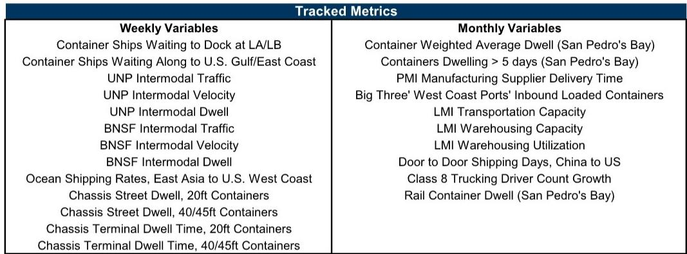
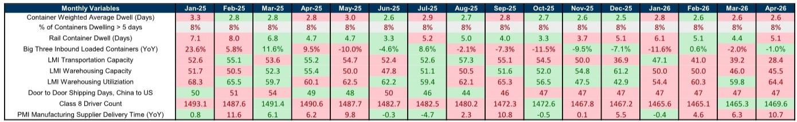
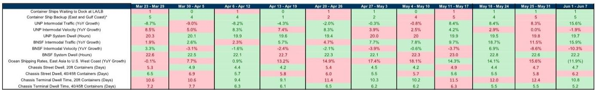

# GS：美国供应链的“新常态”比市场预期的更早到来

当所有人还在讨论关税冲击和地缘冲突是否会引爆新一轮供应链危机时，GS的最新周度追踪指数给出了一组反直觉的信号：截至2026年6月中旬，其供应链拥堵综合指数环比下降4%，瓶颈评分连续多周维持在“2”的水平。这个数字意味着什么？在2021年峰值时期，该评分为“10”，而疫情前的基线水平约为“1.8”到“2.0”。换言之，美国供应链的拥堵程度，已经基本回到了疫情前的“正常”状态。

这不是一个关于“好转”的新闻，而是一个关于“结构性重置”的起点。市场目前对供应链风险的定价，依然停留在“高波动、易中断”的旧叙事中。但GS的数据暗示，一个更稳定、更可预测的供应链新常态可能已经提前到来。如果这一判断成立，那么它对全球贸易流、企业库存策略、航运运价以及资产定价的重新校准，将远比一次简单的数据改善更为深远。

这份报告最值得关注的判断，并非拥堵改善本身，而是改善的“质量”：它不是由需求崩溃驱动的被动去库存，而是在贸易流仍保持一定活跃度下的系统效率提升。这背后，是港口基建投资、铁路运营优化以及集装箱周转率的结构性改善。这意味着，即使未来关税政策或地缘局势出现扰动，供应链的韧性也可能比预期更强。

## 1. 拥堵指数回归“2”并非偶然，而是系统效率提升的累积结果

GS的周度瓶颈指数在2026年6月降至“2”，这是自2022年7月以来首次稳定在这一水平。从月度平均评分来看，自2024年初至今，该指数几乎一直围绕“1.8”到“2.0”的区间窄幅波动。相比之下，2021年8月至10月间，该指数曾连续三个月维持在“9”至“10”的极端水平。

这种长期、低波动率的改善，与2022年下半年的“假性正常化”有本质区别。当时拥堵缓解的主要驱动力是需求的急剧放缓——消费者从商品消费转向服务消费，零售商库存积压导致进口订单锐减。而当前的环境不同：GS追踪的西海岸铁路多式联运货运量同比增速在6月初加速至16%，较前一周的10%明显提升；东海岸集装箱船等待数量维持在5艘，西海岸等待数量仅为1艘。这说明贸易活动本身并未萎缩，拥堵的缓解是基础设施和运营效率提升的结果。

对于企业决策者而言，这意味着“库存安全垫”的逻辑需要重新审视。过去几年，许多企业为了对冲供应链中断风险，被迫维持高于正常水平的库存。如果供应链的流动性确实已回归疫情前水平，那么这些超额库存将不再具备风险溢价，反而可能成为资金占用的成本。那些率先调整库存策略的企业，将在资本效率和运营弹性上获得双重优势。

## 2. 集装箱底盘周转时间下降，是港口堵点真正疏通的关键证据

在供应链拥堵的所有指标中，集装箱底盘（chassis）的周转时间是最能反映“毛细血管”通畅程度的指标。底盘是连接码头、铁路和公路运输的核心设备，其周转时间直接决定了集装箱从船舶到最终目的地的效率。

GS的数据显示，20英尺集装箱底盘的街道停留时间在6月初为4.7天，与上周持平；40/45英尺底盘的街道停留时间为6.2天，较前一周的5.8天略有上升。但更值得关注的是终端停留时间：20英尺底盘从12.4天降至10.8天，40/45英尺底盘从5.5天降至5.2天。这些数字虽然仍有波动，但整体趋势是向下的，且远低于2021年峰值时期的15-20天。

底盘周转时间的改善，意味着港口拥堵的“最后一公里”瓶颈正在被系统性地解决。这背后是港口运营商的设备投资、底盘池的共享机制优化，以及铁路公司对多式联运节点的协调。报告没有详细拆解这些改善的具体来源，但一个合理的推论是，过去几年美国港口和铁路公司的资本开支开始产生回报。

这对航运公司和物流企业的含义是：运力的“硬约束”正在软化。过去，即使船舶运力充足，底盘和铁路的瓶颈也会人为制造拥堵，推高即期运费。如果这些瓶颈持续缓解，那么航运市场的供给弹性将显著增加，运价的高波动性可能随之下降。对于长期投资者而言，这意味着航运股的周期性溢价需要重新定价。

## 3. 铁路多式联运量增长加速，但运营速度却出现分化

西海岸两大一级铁路公司——联合太平洋（UNP）和伯灵顿北方圣达菲（BNSF）的多式联运货运量在6月初同比增速均达到16%左右。BNSF的增速从上周的12%提升至16%，UNP从8.3%提升至16%。这是自2024年以来最强的增长表现之一。

然而，货运量的增长并未同步转化为运营速度的提升。BNSF的多式联运列车速度同比下滑10.3%，UNP也下降1.9%。这是一个需要警惕的信号。一般来说，货运量增长初期，铁路公司可以通过优化调度来维持速度，但当量增长超过一定阈值，网络拥堵效应就会开始显现。当前的数据表明，铁路网络可能正在接近其当前产能的“甜蜜点”——量在增长，但效率提升的空间已经有限。

GS的报告没有展开讨论这一点，但它引出了一个关键问题：如果货运量继续增长，铁路公司是否需要进一步增加资本开支来扩容？如果答案是肯定的，那么铁路公司的资本回报率和自由现金流将面临压力。反之，如果铁路公司能够通过数字化调度和资产共享来消化增量，那么其运营杠杆将非常可观。这个问题的答案，将直接影响投资者对铁路股的估值判断。

## 4. 报告尚未完全回答的关键问题：关税和地缘政治如何改变“新常态”的时间线

GS在报告的开头部分明确提出了这个悬而未决的问题：“关税和地缘冲突将对货运需求、时间节奏以及全球贸易正常化能力产生什么影响？”这是整份报告最诚实也最关键的伏笔。

报告指出，如果供应链压力继续缓解，指数有可能在2026年进入“1”的区间——这意味着比疫情前还要更流畅的流动性。但这一判断的前提是“没有重大外部冲击”。而现实是，美国大选后的贸易政策走向、中东局势对红海航线的持续影响，以及全球供应链“近岸化”和“去风险化”的结构性调整，都可能打破这一线性预测。

具体来说，有两个变量是当前模型难以完全量化的。其一，关税的预期效应。如果企业预期关税将大幅提高，他们可能会提前抢运，导致短期内货运量激增，人为制造拥堵。其二，红海危机导致的绕航效应。大量船舶绕行好望角，虽然增加了运输时间，但也吸收了部分运力，支撑了即期运价。如果红海航线恢复，大量运力将回流，可能导致运价暴跌和港口吞吐量的剧烈波动。

GS的报告给出了一个清晰的“基准情景”，但对这些“尾部风险”的讨论相对有限。这正是独立分析的价值所在——读者需要自己判断，在基准情景之外，哪些风险被低估了，哪些机会被忽视了。

## 5. 对投资者的观察框架：从“拥堵指数”到“结构性成本曲线”

基于GS的数据和逻辑，一个更实用的分析框架是：将供应链拥堵指数从一个“短期交易信号”升级为“结构性成本曲线的代理变量”。

当拥堵指数在“8”以上时，供应链成本是“离散的”——一次港口关闭或一艘船延误就可以导致成本指数级上升。当指数在“4”到“6”之间时，成本是“线性的”——拥堵程度与成本基本成正比。而当指数回到“2”以下时，成本开始变得“边际递减”——额外的效率提升对总成本的影响越来越小，因为大多数瓶颈已经被消除。

当前指数处于“2”的区间，意味着供应链成本已经进入“边际递减”阶段。在这个阶段，企业竞争力的来源将从“谁能避免中断”转变为“谁能以最低的物流成本运营”。那些在基建、数字化和供应商关系上已经提前投入的企业，将享受到成本曲线的结构性下移。而那些仍然依赖“加急运费”和“安全库存”的企业，将面临成本劣势的扩大。

对于投资者而言，这意味着需要重新审视物流、航运和制造业公司的成本结构。那些在报告中提到的“铁路多式联运量增长”和“底盘周转时间改善”等微观指标，最终都会反映在企业的单位物流成本上。谁能在这一轮成本重构中胜出，谁就将在下一个周期中享有持续的竞争优势。

---

GS的这份周度报告，用一组看似平淡的数据，描绘了一个正在发生的结构性转变。美国供应链正在从“危机模式”切换回“运营模式”。但切换的速度和深度，仍取决于那些尚未被充分定价的变量——关税、地缘政治、以及企业自身的适应速度。

这些未解问题，正是我们星球微信群中持续讨论的核心议题。我们不会满足于复述研报的结论，而是会结合更多的一手数据和行业经验，去推演那些“报告没有说透”的二阶效应。如果你想深入了解铁路运营数据背后的产能瓶颈、底盘周转时间改善的真实驱动力，以及不同行业在“新常态”下的差异化应对策略，欢迎来星球微信群里继续讨论。我们会定期组织专题分享，也会针对会员提出的具体问题，进行深度的数据拆解和逻辑推演。

Personal reading notes and learning share only. Not investment advice.

