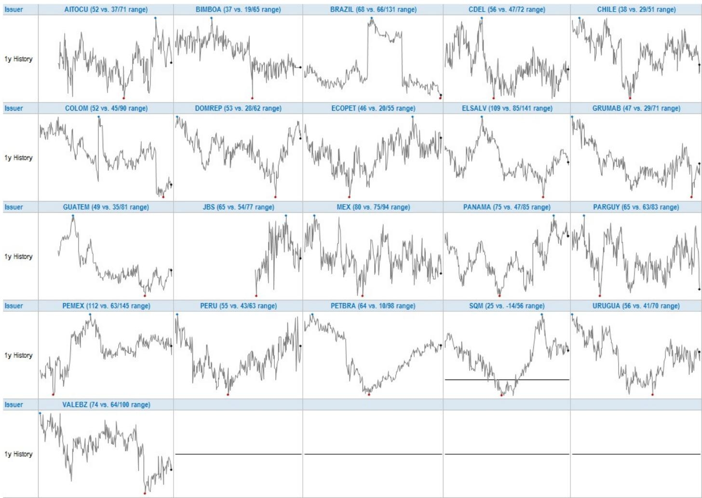
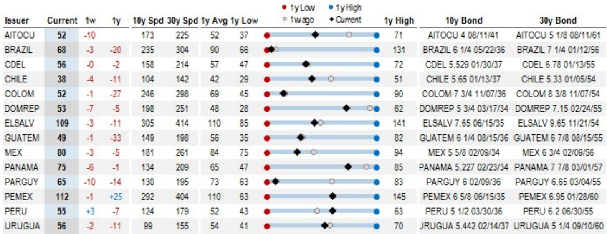
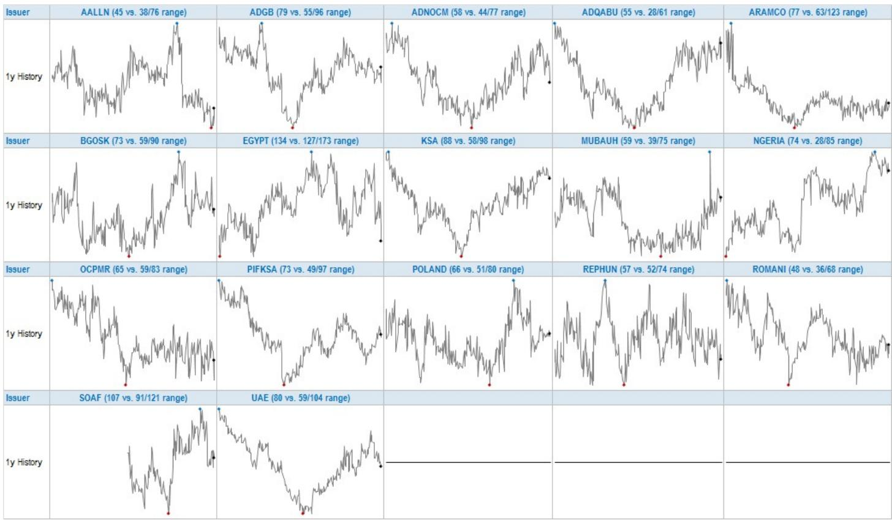

# The EM Curve Story Is No Longer About Level: It Is About Dispersion and Regime Change

The conventional narrative in emerging market credit has long been driven by spread levels. Investors ask whether EM is cheap or expensive relative to history, whether yields compensate for risk, and whether the asset class is in a tightening or widening cycle. Those questions remain relevant, but they are no longer sufficient. The most important signal in EM credit today is not the level of spreads but the shape of the curve—specifically, the 10s30s spread curve—and what it reveals about investor conviction, duration appetite, and regime differentiation across regions, ratings, and issuer types.

According to a weekly analytics report on the EM USD 10s30s Spread Curve, the EM aggregate 10s30s curve currently sits at 67 basis points. That number, by itself, is not extreme. It is near its one-year average of 67 bps and well within the range of 58 to 77 bps observed over the past twelve months. But the stability of the aggregate masks a deeper and far more consequential story. Beneath the surface, the curve is compressing in some segments, steepening in others, and behaving in ways that challenge the assumption that EM is a monolithic asset class.

This report argues that the EM 10s30s curve is entering a phase of structural flattening in investment-grade and sovereign segments, even as high-yield and select idiosyncratic names remain steep. The dispersion between the steepest and flattest curves is at a level that demands a more granular, issuer-by-issuer approach to duration management. The era of trading EM duration as a single-beta trade is over. What is emerging is a regime in which curve positioning, not just spread duration, is the primary source of alpha and risk.

## The Aggregate EM Curve Is Flatter Than It Looks, and That Flattening Is Not a Cyclical Blip

The EM aggregate 10s30s curve has declined by 10 basis points over the past year. The EM IG curve has flattened by 14 bps, while the EM HY curve has been essentially unchanged, down only 3 bps. This divergence is the first and most important signal. It tells us that the flattening is concentrated in the higher-quality, more liquid parts of the market. Investors are not simply reducing duration across the board. They are compressing the term premium in IG names while maintaining or even extending it in HY.

This pattern is not what one would expect from a typical risk-on or risk-off cycle. In a risk-on environment, investors typically extend duration in higher-quality names, which would steepen the curve. In a risk-off environment, they shorten duration, which flattens it. But here, the flattening in IG is occurring alongside a relatively stable HY curve, suggesting that the compression is not driven by fear but by a structural reassessment of the term premium in higher-rated EM credit.

What might explain this? One plausible interpretation is that the investor base for EM IG has shifted toward longer-dated liability-driven investors and insurance companies who are less sensitive to short-term spread volatility and more focused on carry. At the same time, the supply of long-dated EM IG paper has increased, particularly from quasi-sovereign and corporate issuers in Asia and the Middle East. The combination of structural demand and increased supply at the long end is compressing the 10s30s spread in a way that is likely to persist.

The implication for portfolio construction is clear: if the flattening in EM IG is structural, then investors who are long the curve in IG are not just taking a tactical view on rate expectations. They are betting against a regime shift in the term structure of EM credit. That is a much higher-conviction trade than it appears.

## The Dispersion Between Steepest and Flattest Curves Is a Map of Idiosyncratic Risk, Not Just Rating

The report identifies the steepest and flattest 10s30s curves in EM credit. Egypt sits at the top of the steepest list with a curve of 134 bps, followed by Pemex at 112 bps, El Salvador at 109 bps, and South Africa at 107 bps. At the flattest end, Indonesia is at 8 bps, SQM at 25 bps, and Chile at 38 bps. The range from 8 to 134 bps is extraordinary.

What is striking is that this dispersion is not simply a function of credit rating. Indonesia is investment grade and flat. Chile is investment grade and relatively flat. But Egypt, Pemex, and El Salvador are all below investment grade, and their curves are steep. That pattern is intuitive: distressed or high-beta names tend to have steeper curves because the market demands a higher premium for taking long-duration exposure to uncertain credits.

But the relationship is not mechanical. South Africa, which is also below investment grade, is steep but not as steep as Egypt. Pemex, which is quasi-sovereign but deeply troubled, is steeper than many sovereigns. And within the flattest group, Indonesia is not the only IG name; Chile and SQM are also IG or IG-adjacent, yet their curves are far flatter than the EM IG aggregate of 61 bps. This suggests that country-specific factors—fiscal trajectory, political stability, external vulnerability, and investor access—are dominating the curve shape in ways that a simple rating-based model cannot capture.

For a portfolio manager, this dispersion is both a warning and an opportunity. The warning is that curve positioning cannot be delegated to a beta or a rating bucket. The opportunity is that the steepest curves may offer attractive roll-down and carry for investors who have the conviction and the research depth to take idiosyncratic duration risk. But the key question is whether the steepness is a compensation for genuine risk or a mispricing that will correct. The report does not answer that question, but it provides the data to ask it.

## The Sovereign Curve Has Decoupled from the Corporate Curve, and That Decoupling Is Accelerating

One of the most important structural features of the current EM credit landscape is the divergence between the EMBIG sovereign curve and the CEMBI corporate curve. According to the report, the EMBIG sovereign 10s30s curve is at 68 bps, while the CEMBI corporate curve is at 58 bps. The sovereign curve has flattened by 8 bps over the past year, while the corporate curve has flattened by 17 bps.

This divergence is not new, but it is widening. Historically, sovereign and corporate curves in EM have moved together, reflecting common factors such as global risk appetite, US Treasury rates, and EM macro conditions. The current decoupling suggests that the two markets are being driven by different forces. Sovereign curves are being shaped by fiscal and political risk, especially in CEEMEA and Latin America. Corporate curves, by contrast, are being influenced by sector-specific dynamics, particularly in energy, metals, and technology.

The widening gap also reflects a shift in investor composition. The sovereign market is increasingly dominated by dedicated EM debt funds and official sector investors who are sensitive to macro narratives. The corporate market, especially in Asia, is seeing growing participation from insurance companies and pension funds who are buying long-dated paper for liability matching. These different investor bases have different duration preferences and different sensitivities to spread changes.

The implication is that investors cannot assume that a flattening in sovereign curves will be mirrored in corporates, or vice versa. Duration decisions must be made separately for each segment. A long-duration position in EM sovereigns is a bet on macro convergence and fiscal credibility. A long-duration position in EM corporates is a bet on corporate fundamentals and sector resilience. These are fundamentally different trades.

## The Relationship Between Curve Slope and Spread Level Is Breaking Down in Ways That Challenge Conventional Heuristics

The report includes scatterplots that map the relationship between the 10s30s curve slope and the 10-year spread level across EM indices, as well as the one-week changes in both variables. The data reveal that the traditional relationship—flatter curves at tighter spreads and steeper curves at wider spreads—is not holding uniformly across the EM universe.

In some segments, such as EM HY, the curve remains steep even as spreads have tightened. In others, such as CEMBI Asia, the curve has steepened even as spreads have widened, which is the opposite of what one would expect in a bear steepening scenario. This breakdown suggests that the curve is being driven by factors that are orthogonal to the credit cycle—specifically, supply dynamics, investor technicals, and idiosyncratic issuer events.

For example, the CEMBI Asia curve steepened by 3 bps over the past week even as 10-year spreads widened by 2.5 bps. That is a bear steepening pattern, but it is occurring in a region that has been relatively stable. This may reflect a technical factor: a large new issue in the long end of the corporate curve, or a shift in investor preference toward shorter-dated paper in response to local rate expectations. Whatever the cause, it is a reminder that the curve is not a simple function of credit quality.

For investors who rely on curve steepness as a proxy for risk, this breakdown is a challenge. A steep curve may indicate high risk, but it may also indicate a supply imbalance or a temporary technical dislocation. Conversely, a flat curve may indicate low risk, but it may also indicate a lack of liquidity or a structural compression that is masking underlying vulnerabilities. The report provides the data to make these distinctions, but the interpretation requires judgment.

## What the Report Does Not Fully Answer: The Role of US Treasury Dynamics and the Sustainability of Curve Compression

The report provides extensive data on EM curves, but it does not fully explore the interaction between EM curves and US Treasury dynamics. The US Treasury 10s30s yield curve is currently at 49 bps, having steepened by 3 bps over the past week. This is a significant level, and it has direct implications for EM curves.

When the US Treasury curve steepens, it typically puts upward pressure on EM curves, especially in IG names that are sensitive to duration. But the data show that EM IG curves have been flattening even as the US Treasury curve has steepened. This suggests that EM IG curves are being driven by credit-specific factors that are overpowering the US Treasury influence. But how long can that decoupling persist? If the US Treasury curve continues to steepen, at what point does it become the dominant driver of EM curves?

The report also does not answer whether the compression in EM IG curves is sustainable. The one-year average for EM IG is 62 bps, and the current level is 61 bps. That is close to the average, but the one-year low is 52 bps. If compression continues, the curve could approach that low, which would imply a term premium that is historically cheap. Is that a buying opportunity for long-duration investors, or a warning that the market is ignoring fundamental risks?

These are the open questions that make the full report essential reading. The data in the weekly update provide the raw material for analysis, but the monthly commentary and the detailed regional breakdowns are where the interpretive framework is built.

## A Decision Framework for Curve Positioning in EM Credit

For investors who want to translate the data in this report into actionable decisions, the following framework may be useful. It is not a recommendation; it is a method for organizing the information.

First, determine whether your curve positioning is active or passive. If you are running a benchmark-aware portfolio, the EM aggregate curve is your reference point. But the aggregate masks significant regional and rating-based dispersion. A passive approach to curve positioning may leave you exposed to flattening in IG and steepening in HY that you have not explicitly chosen.

Second, assess the source of curve steepness or flatness in each position. Is the steepness driven by credit risk, supply technicals, or liquidity? If it is driven by credit risk, then the steepness is compensation for a genuine probability of default or restructuring. If it is driven by supply, then the steepness may be a temporary dislocation that will normalize as the new issue is absorbed. If it is driven by liquidity, then the steepness may be a trap: the curve may look attractive on paper, but the cost of trading in and out may erode the carry.

Third, consider the interaction between curve positioning and spread duration. A steep curve in a high-spread name offers high carry and roll-down, but it also means that you are taking significant spread duration. If the name underperforms, the combination of spread widening and duration can lead to large losses. Conversely, a flat curve in a low-spread name offers low carry but also low duration risk. The trade-off is not symmetrical.

Fourth, monitor the one-week changes in curves and spreads. The report shows that the largest one-week steepeners and flatteners are often concentrated in a few names. Egypt flattened by 18 bps in one week, while Indonesia steepened by 7 bps. These moves are large relative to the aggregate, and they suggest that the market is repricing duration risk in real time. If you are not monitoring these changes, you are flying blind.

Finally, use the regional and index-level data to identify where the curve is misaligned with fundamentals. The CEMBI LatAm curve is at 54 bps, which is near the low end of its one-year range. The CEMBI CEEMEA curve is at 63 bps, which is also near the low end. But the fundamental outlook for these regions is very different. LatAm has benefited from commodity prices and fiscal discipline in some countries, while CEEMEA faces geopolitical risk and fiscal pressure. The flatness of the CEEMEA curve may be a warning that the market is complacent.

## The Full Report Offers the Depth Needed to Act on These Signals

This weekly update provides the data. The monthly report, which includes commentary and detailed regional analysis, provides the context. For investors who are serious about curve positioning in EM credit, the combination of both is essential.

The weekly data allows you to track changes in real time. The monthly commentary allows you to interpret those changes within a coherent framework. Without the commentary, the data is just numbers. Without the data, the commentary is just opinion. Together, they form a decision-support system that is rare in the EM credit market.

The report also includes historical charts that show the evolution of curves over the past five years. These charts reveal that the current curve environment is unusual. The EM aggregate curve has been in a range of 58 to 77 bps over the past year, but the longer-term history shows much wider swings. In 2022, the curve inverted sharply during the EM sell-off. In 2021, it was above 100 bps. The current level is compressed relative to history, but the compression is not uniform.

Understanding why the compression is happening, and where it is likely to break, is the central analytical challenge for EM credit investors today. The report provides the data to begin that analysis. The full report provides the tools to complete it.

Join the community to read the full report and review the original charts.

*This article is for learning and discussion only and does not constitute investment advice.*

Personal reading notes and learning share only. Not investment advice.

