## GDW Asia

EMAX: From “hiking from weakness” to “hiking from strength”

## EMAX: From “hiking from weakness” to “hiking from strength”

The two central banks in Asia that have been forced into hiking thus far have done so to preserve macroeconomic stability. Sustained pressure on the currency meant that Bank Indonesia (BI) surprised with an off-cycle 25bp hike this week after the USD/IDR surged to a new record high of $\sim 18,200$ . This was complemented by a package of regulatory measures to address rising FX risks. FX pressures have eased since then, but remain elevated enough to warrant another 25 bps hike at next week's regularly scheduled meeting, though this is now a closer call.

For its part, the Philippines has seen the largest surge in headline inflation in the region. Despite the softer May headline inflation print (6.8% oya), inflation remains uncomfortably elevated. Therefore, we expect the BSP to deliver a 50bp rate hike next week after hiking 25bp in April, as a preemptive measure to anchor rising inflation expectations and contain second-round effects. That said, while our baseline forecast is for a 50bp hike, the decision is likely to be close, with a 25bp hike plausible, given the recent decline in global crude prices.

However, another class of central banks is emerging in the region. Booming tech, greater-than-expected insulation from the Middle East crisis and fiscal policy supports have resulted in growth continuing to surprise to the upside. This week, 1Q growth in Korea was revised up to 7.5%, and the large terms-of-trade shock facing Asian tech exporters has led us to mark up full-year growth to 3.7%. Similarly, continued strength in tech and a recovery in non-tech have resulted in a large upgrade to 2Q GDP tracking in Taiwan. “Boomy” growth and a growing risk of inflation are likely to induce several central banks to consider hiking from a position of strength, in our view. The Bank of Korea struck a hawkish tone recently, and we now expect 100 bps of hikes over the next year. As growth continues to hold up, we expect similar pivots from Taiwan and Singapore. Next week’s CBC meeting should therefore be closely watched in Taiwan. May CPI was slightly above expectations, with headline inflation at 2.2% oya and core at 2.1% oya, driven by energy, fuel-linked transport costs and firmer food prices, while PPI surged 14.1% oya, raising pass-through and margin-squeeze risks. While a hike next week is a tail risk event for now, the key is whether the CBC signals that energy costs are feeding into core inflation and expectations, raising the likelihood of a rate hike before year-end.

## China: AI tech lift masks narrower production impulse, 2Q downside risks persist

China's May trade and inflation data point to a growing role for AI tech. Exports beat expectations, underpinned by a lift in high-tech exports, with rising price gains in memory chips/modules and new energy products contributing to nominal gains. The implication, however, is that the trade impulse is narrower and increasingly price-driven, which limits what headline export strength implies for domestic production. The read-through to IP and net export contribution to growth is therefore less clear and more sensitive to relative price moves and product mix. More generally, as tech is becoming a more important driver of China's trade and price dynamics, and because a majority of the boost reflects higher prices, rather than broad-based volume gains, export headline strength tends to overstate the

See page 5 for analyst certification and important disclosures.

## Emerging Markets Asia, Economic and Policy Research

## Sajjid Z Chinoy

(91-22) 6157-3386

sajjid.z.chinoy@JPM.com

JPM Chase Bank, N.A., Mumbai Branch

## Anusha Mital

(91-22) 6157-4113

anusha.mital@jpmchase.com

JPM India Private Limited

Contents

<table><tr><td colspan="2">Data Watches</td></tr><tr><td>Japan</td><td>5</td></tr><tr><td>Japan Focus: The energy subsidy price tag</td><td>9</td></tr><tr><td>Australia and New Zealand</td><td>10</td></tr><tr><td>Greater China</td><td>12</td></tr><tr><td>Korea</td><td>16</td></tr><tr><td>ASEAN</td><td>18</td></tr><tr><td>India</td><td>20</td></tr><tr><td>Regional Data Calendars</td><td>22</td></tr></table>

impulse to real industrial activity. We look for May IP to rise 0.5%m/m sa next week, partially offsetting the 1% decline in April. Retail sales should remain weak, with only a 0.1%m/m sa uptick, while year-to-date FAI likely stayed in contraction. If realized, this would suggest only a partial recovery from a weak April print and leave 2Q growth risks tilted to the downside.

Part of the 2Q weakness also reflects the scaling back of fiscal policy support, however, suggesting less payback in 2H than previously expected. Furthermore, the recent slowdown could prompt a faster deployment of fiscal funding in the coming months. Meanwhile, on the external side, the 2H export outlook should be supported by resilient global demand and a broadening of capex beyond tech, though this is likely to be partly offset by renewed US tariff uncertainty (a pivot toward Sections 301/232) and a tougher EU stance toward China. All told, however, as 2Q GDP risks are skewed to the downside, upside risks exist for the second half of the year, in our view.

Table 1: EM Asia data release

<table><tr><td>Date</td><td colspan="2">Market</td><td>Data</td><td>Period</td><td>Unit</td><td>JPM</td><td>Consensus</td><td>Previous</td></tr><tr><td rowspan="2">Mon, 15-Jun</td><td>IN</td><td>Trade balance</td><td></td><td>May</td><td>US$bn</td><td>-27.5</td><td>-27.0</td><td>-28.4</td></tr><tr><td>IN</td><td>WPI</td><td></td><td>May</td><td>%oya</td><td>10.1</td><td>9.5</td><td>8.3</td></tr><tr><td rowspan="7">Tue, 16-Jun</td><td>KR</td><td>Export price index</td><td></td><td>May</td><td>%oya</td><td>46.5</td><td>-</td><td>40.8</td></tr><tr><td>KR</td><td>Import price index</td><td></td><td>May</td><td>%oya</td><td>22.5</td><td>-</td><td>20.2</td></tr><tr><td>CN</td><td>IP</td><td></td><td>May</td><td>%oya</td><td>4.9</td><td>4.3</td><td>4.1</td></tr><tr><td>CN</td><td>FAI</td><td></td><td>May</td><td>%oya, ytd</td><td>-1.1</td><td>-2.3</td><td>-1.6</td></tr><tr><td>CN</td><td>Retail sales</td><td></td><td>May</td><td>%oya</td><td>0.3</td><td>-0.5</td><td>0.2</td></tr><tr><td>KR</td><td>Money supply</td><td></td><td>Apr</td><td>%oya</td><td>5.6</td><td>-</td><td>5.6</td></tr><tr><td>HK</td><td>Unemployment rate</td><td></td><td>May</td><td>%, SA, 3mma</td><td>3.7</td><td>3.7</td><td>3.7</td></tr><tr><td>Wed, 17-Jun</td><td>SG</td><td>NODX</td><td></td><td>May</td><td>%oya</td><td>34.1</td><td>-</td><td>29.1</td></tr><tr><td rowspan="3">Thu, 18-Jun</td><td>TW</td><td>Policy rate</td><td></td><td>Jun</td><td>%p.a.</td><td>2.00</td><td>2.00</td><td>2.00</td></tr><tr><td>ID</td><td>Policy rate</td><td></td><td>Jun</td><td>%p.a.</td><td>5.75</td><td>5.75</td><td>5.50</td></tr><tr><td>PH</td><td>Policy rate</td><td></td><td>Jun</td><td>%p.a.</td><td>5.00</td><td>4.75</td><td>4.50</td></tr><tr><td rowspan="5">Fri, 19-Jun</td><td>KR</td><td>PPI</td><td></td><td>May</td><td>%oya</td><td>6.9</td><td>-</td><td>6.9</td></tr><tr><td>MY</td><td>CPI</td><td></td><td>May</td><td>%oya</td><td>2.1</td><td>2.1</td><td>1.9</td></tr><tr><td>MY</td><td>Trade balance</td><td></td><td>May</td><td>US$bn</td><td>5.1</td><td>5.8</td><td>7.2</td></tr><tr><td>MY</td><td>Exports</td><td></td><td>May</td><td>%oya</td><td>57.0</td><td>39.4</td><td>51.9</td></tr><tr><td>MY</td><td>Imports</td><td></td><td>May</td><td>%oya</td><td>40.6</td><td>20.5</td><td>38.7</td></tr></table>

Source: Bloomberg Finance L.P. and JPM forecasts

Regional Economic Outlook in Summary

<table><tr><td rowspan="3"></td><td colspan="3">2021 Nominal GDP, US$</td><td colspan="3">Real GDP</td><td colspan="3">Consumer prices</td></tr><tr><td rowspan="2">Total billion</td><td rowspan="2">% of region</td><td rowspan="2">per capita</td><td colspan="3">% year-on-year</td><td colspan="3">% year-on-year</td></tr><tr><td>2024</td><td>2025</td><td>2026</td><td>2024</td><td>2025</td><td>2026</td></tr><tr><td>Japan</td><td>4,935</td><td>n.a.</td><td>40,114</td><td>-0.2</td><td>1.1</td><td>0.6</td><td>2.7</td><td>3.2</td><td>2.0</td></tr><tr><td>Australia</td><td>1,634</td><td>n.a.</td><td>64,327</td><td>1.0</td><td>2.0</td><td>2.0</td><td>3.2</td><td>2.8</td><td>4.6</td></tr><tr><td>New Zealand</td><td>247</td><td>n.a.</td><td>48,861</td><td>-0.3</td><td>0.2</td><td>1.9</td><td>2.9</td><td>2.8</td><td>3.7</td></tr><tr><td>Emerging Asia</td><td>26,963</td><td>100.0</td><td>8,048</td><td>4.9</td><td>5.1</td><td>4.9</td><td>1.2</td><td>0.6</td><td>1.9</td></tr><tr><td>ex China and India</td><td>6,175</td><td>22.9</td><td>10,794</td><td>3.9</td><td>4.0</td><td>4.7</td><td>2.1</td><td>1.6</td><td>2.9</td></tr><tr><td>China</td><td>17,706</td><td>65.7</td><td>12,572</td><td>4.9</td><td>5.0</td><td>4.7</td><td>0.2</td><td>0.0</td><td>1.0</td></tr><tr><td>Hong Kong SAR, China</td><td>368</td><td>1.4</td><td>49,849</td><td>2.6</td><td>3.6</td><td>3.4</td><td>1.7</td><td>1.4</td><td>1.6</td></tr><tr><td>Taiwan, China</td><td>777</td><td>2.9</td><td>33,071</td><td>5.3</td><td>8.8</td><td>9.9</td><td>2.2</td><td>1.7</td><td>2.0</td></tr><tr><td>Korea</td><td>1,809</td><td>6.7</td><td>35,126</td><td>2.2</td><td>1.1</td><td>3.7</td><td>2.3</td><td>2.1</td><td>3.0</td></tr><tr><td>India</td><td>3,082</td><td>11.4</td><td>2,250</td><td>7.1</td><td>7.7</td><td>6.5</td><td>4.9</td><td>2.1</td><td>5.0</td></tr><tr><td>Indonesia</td><td>1,187</td><td>4.4</td><td>4,358</td><td>5.0</td><td>5.1</td><td>4.7</td><td>2.3</td><td>1.9</td><td>3.5</td></tr><tr><td>Malaysia</td><td>373</td><td>1.4</td><td>11,476</td><td>5.1</td><td>5.2</td><td>4.6</td><td>1.8</td><td>1.4</td><td>1.9</td></tr><tr><td>Philippines</td><td>393</td><td>1.5</td><td>3,576</td><td>5.7</td><td>4.4</td><td>4.0</td><td>3.2</td><td>1.6</td><td>6.3</td></tr><tr><td>Singapore</td><td>397</td><td>1.5</td><td>79,601</td><td>5.3</td><td>5.0</td><td>4.3</td><td>2.4</td><td>0.9</td><td>2.1</td></tr><tr><td>Thailand</td><td>506</td><td>1.9</td><td>7,237</td><td>2.9</td><td>2.4</td><td>2.1</td><td>0.4</td><td>-0.1</td><td>2.4</td></tr><tr><td>Vietnam</td><td>365</td><td>1.4</td><td>3,757</td><td>7.1</td><td>7.9</td><td>7.3</td><td>3.6</td><td>3.3</td><td>5.3</td></tr><tr><td rowspan="3"></td><td colspan="3">Current account balance</td><td colspan="3">Current account</td><td colspan="3">Foreign reserves</td></tr><tr><td colspan="3">US$ billion</td><td colspan="3">% of GDP</td><td colspan="3">US$ billion</td></tr><tr><td>2024</td><td>2025</td><td>2026</td><td>2024</td><td>2025</td><td>2026</td><td>2024</td><td>2025</td><td>2026</td></tr><tr><td>Japan</td><td>n.a.</td><td>n.a.</td><td>n.a.</td><td>4.6</td><td>4.8</td><td>3.6</td><td>n.a.</td><td>n.a.</td><td>n.a.</td></tr><tr><td>Australia</td><td>n.a.</td><td>n.a.</td><td>n.a.</td><td>-2.2</td><td>-2.7</td><td>-2.7</td><td>n.a.</td><td>n.a.</td><td>n.a.</td></tr><tr><td>New Zealand</td><td>n.a.</td><td>n.a.</td><td>n.a.</td><td>-4.8</td><td>-3.7</td><td>-4.2</td><td>n.a.</td><td>n.a.</td><td>n.a.</td></tr><tr><td>Emerging Asia</td><td>735.6</td><td>1088.3</td><td>1196.3</td><td>2.5</td><td>3.5</td><td>3.7</td><td>n.a.</td><td>n.a.</td><td>n.a.</td></tr><tr><td>ex China and India</td><td>386.9</td><td>457.1</td><td>601.3</td><td>5.4</td><td>6.1</td><td>8.2</td><td>n.a.</td><td>n.a.</td><td>n.a.</td></tr><tr><td>China</td><td>423.9</td><td>747.9</td><td>754.1</td><td>2.3</td><td>3.8</td><td>3.6</td><td>n.a.</td><td>n.a.</td><td>n.a.</td></tr><tr><td>Hong Kong SAR, China</td><td>52.5</td><td>54.7</td><td>47.3</td><td>12.9</td><td>12.8</td><td>10.5</td><td>421</td><td>426</td><td>428</td></tr><tr><td>Taiwan, China</td><td>112.7</td><td>139.3</td><td>135.2</td><td>14.1</td><td>15.1</td><td>13.6</td><td>578</td><td>585</td><td>592</td></tr><tr><td>Korea</td><td>100.0</td><td>123.1</td><td>300.8</td><td>5.3</td><td>6.5</td><td>14.8</td><td>409</td><td>422</td><td>426</td></tr><tr><td>India</td><td>-75.2</td><td>-116.8</td><td>-159.1</td><td>-2.0</td><td>-3.0</td><td>-3.9</td><td>n.a.</td><td>n.a.</td><td>n.a.</td></tr><tr><td>Indonesia</td><td>-8.7</td><td>-10.2</td><td>-14.8</td><td>-0.6</td><td>-0.8</td><td>-1.0</td><td>149</td><td>145</td><td>140</td></tr><tr><td>Malaysia</td><td>7.2</td><td>9.7</td><td>14.9</td><td>1.7</td><td>2.1</td><td>2.8</td><td>124</td><td>127</td><td>130</td></tr><tr><td>Philippines</td><td>-17.5</td><td>-16.3</td><td>-21.9</td><td>-3.8</td><td>-3.3</td><td>-4.4</td><td>95</td><td>91</td><td>74</td></tr><tr><td>Singapore</td><td>98.5</td><td>100.9</td><td>128.0</td><td>17.2</td><td>16.7</td><td>19.9</td><td>n.a.</td><td>n.a.</td><td>n.a.</td></tr><tr><td>Thailand</td><td>11.6</td><td>22.8</td><td>2.3</td><td>2.2</td><td>3.9</td><td>0.4</td><td>217</td><td>249</td><td>270</td></tr><tr><td>Vietnam</td><td>30.5</td><td>33.1</td><td>9.7</td><td>6.8</td><td>6.6</td><td>1.8</td><td>83</td><td>87</td><td>82</td></tr><tr><td rowspan="3"></td><td colspan="3">External debt</td><td colspan="3">Short-term foreign debt</td><td colspan="3">Government balance</td></tr><tr><td colspan="3">% of GDP, end of period</td><td colspan="3">US$ billion, end of period</td><td colspan="3">% of GDP, end of period</td></tr><tr><td>2024</td><td>2025</td><td>2026</td><td>2024</td><td>2025</td><td>2026</td><td>2024</td><td>2025</td><td>2026</td></tr><tr><td>Japan</td><td>n.a.</td><td>n.a.</td><td>n.a.</td><td>n.a.</td><td>n.a.</td><td>n.a.</td><td>-6.1</td><td>-6.7</td><td>-6.9</td></tr><tr><td>Australia</td><td>n.a.</td><td>n.a.</td><td>n.a.</td><td>n.a.</td><td>n.a.</td><td>n.a.</td><td>0.0</td><td>-0.4</td><td>-0.6</td></tr><tr><td>New Zealand</td><td>n.a.</td><td>n.a.</td><td>n.a.</td><td>n.a.</td><td>n.a.</td><td>n.a.</td><td>-2.6</td><td>-2.4</td><td>-2.7</td></tr><tr><td>China</td><td>n.a.</td><td>n.a.</td><td>n.a.</td><td>n.a.</td><td>n.a.</td><td>n.a.</td><td>-3.0</td><td>-4.0</td><td>-4.0</td></tr><tr><td>Hong Kong SAR, China</td><td>n.a.</td><td>n.a.</td><td>n.a.</td><td>n.a.</td><td>n.a.</td><td>n.a.</td><td>-1.8</td><td>0.1</td><td>0.6</td></tr><tr><td>Taiwan, China</td><td>26.2</td><td>23.5</td><td>22.5</td><td>207</td><td>213</td><td>221</td><td>-0.6</td><td>-1.0</td><td>-1.6</td></tr><tr><td>Korea</td><td>35.9</td><td>38.1</td><td>38.9</td><td>192</td><td>224</td><td>224</td><td>-1.7</td><td>-1.8</td><td>1.2</td></tr><tr><td>India</td><td>n.a.</td><td>n.a.</td><td>n.a.</td><td>n.a.</td><td>n.a.</td><td>n.a.</td><td>-8.3</td><td>-7.9</td><td>-7.7</td></tr><tr><td>Indonesia</td><td>27.4</td><td>25.3</td><td>23.6</td><td>43</td><td>43</td><td>43</td><td>-2.7</td><td>-2.9</td><td>-3.0</td></tr><tr><td>Malaysia</td><td>50.6</td><td>47.3</td><td>44.0</td><td>119</td><td>129</td><td>139</td><td>-4.3</td><td>-3.8</td><td>-3.5</td></tr><tr><td>Philippines</td><td>28.5</td><td>30.6</td><td>33.6</td><td>21</td><td>22</td><td>27</td><td>-5.7</td><td>-5.6</td><td>-6.0</td></tr><tr><td>Singapore</td><td>n.a.</td><td>n.a.</td><td>n.a.</td><td>n.a.</td><td>n.a.</td><td>n.a.</td><td>0.4</td><td>0.4</td><td>0.2</td></tr><tr><td>Thailand</td><td>37.0</td><td>34.1</td><td>32.1</td><td>86</td><td>75</td><td>75</td><td>-4.0</td><td>-4.7</td><td>-4.5</td></tr><tr><td>Vietnam</td><td>46.1</td><td>47.1</td><td>48.1</td><td>n.a.</td><td>n.a.</td><td>n.a.</td><td>-3.6</td><td>-3.8</td><td>-4.0</td></tr></table>

Source: National statistics authorities and JPM

Key economic statistics

<table><tr><td colspan="2"></td><td>1Q25</td><td>2Q25</td><td>3Q25</td><td>4Q25</td><td>1Q26</td><td>2Q26</td><td>3Q26</td><td>4Q26</td></tr><tr><td colspan="10">Real GDP, %-ch over 1 quarter, saar</td></tr><tr><td colspan="2">Japan</td><td>2.0</td><td>1.1</td><td>-2.3</td><td>0.7</td><td>1.8</td><td>0.2</td><td>1.0</td><td>0.8</td></tr><tr><td colspan="2">Australia</td><td>1.0</td><td>3.9</td><td>1.5</td><td>3.5</td><td>1.1</td><td>1.6</td><td>1.5</td><td>1.9</td></tr><tr><td colspan="2">New Zealand</td><td>4.5</td><td>-3.4</td><td>3.5</td><td>1.0</td><td>3.3</td><td>1.2</td><td>3.4</td><td>1.2</td></tr><tr><td colspan="2">Emerging Asia</td><td>4.7</td><td>5.0</td><td>4.4</td><td>5.8</td><td>6.7</td><td>3.9</td><td>3.4</td><td>3.5</td></tr><tr><td colspan="2">ex China and India</td><td>2.6</td><td>5.7</td><td>5.0</td><td>6.7</td><td>6.1</td><td>2.9</td><td>3.4</td><td>3.3</td></tr><tr><td colspan="2">China</td><td>4.9</td><td>4.2</td><td>3.7</td><td>5.2</td><td>6.7</td><td>4.0</td><td>3.2</td><td>3.2</td></tr><tr><td colspan="2">Hong Kong SAR, China</td><td>4.6</td><td>3.3</td><td>3.8</td><td>4.3</td><td>12.2</td><td>3.0</td><td>2.8</td><td>2.8</td></tr><tr><td colspan="2">Taiwan, China</td><td>3.7</td><td>16.3</td><td>6.7</td><td>28.7</td><td>6.9</td><td>4.5</td><td>3.2</td><td>3.2</td></tr><tr><td colspan="2">Korea</td><td>-0.7</td><td>2.6</td><td>5.6</td><td>-0.4</td><td>7.5</td><td>2.0</td><td>4.0</td><td>3.0</td></tr><tr><td colspan="2">India</td><td>7.2</td><td>8.5</td><td>7.5</td><td>7.5</td><td>8.0</td><td>5.1</td><td>5.0</td><td>6.2</td></tr><tr><td colspan="2">Indonesia</td><td>4.9</td><td>5.5</td><td>5.3</td><td>5.7</td><td>5.7</td><td>3.7</td><td>3.3</td><td>3.0</td></tr><tr><td colspan="2">Malaysia</td><td>5.3</td><td>6.1</td><td>7.6</td><td>6.2</td><td>1.4</td><td>5.0</td><td>4.5</td><td>4.0</td></tr><tr><td colspan="2">Philippines</td><td>4.9</td><td>3.7</td><td>1.4</td><td>2.4</td><td>3.8</td><td>4.9</td><td>5.7</td><td>8.2</td></tr><tr><td colspan="2">Singapore</td><td>2.5</td><td>7.3</td><td>7.8</td><td>5.2</td><td>3.9</td><td>3.0</td><td>2.0</td><td>2.0</td></tr><tr><td colspan="2">Thailand</td><td>1.9</td><td>2.2</td><td>-1.1</td><td>7.6</td><td>2.7</td><td>-1.1</td><td>1.2</td><td>2.0</td></tr><tr><td colspan="2">Vietnam</td><td>7.8</td><td>12.0</td><td>8.0</td><td>5.0</td><td>5.0</td><td>4.5</td><td>6.0</td><td>6.0</td></tr><tr><td colspan="10">Consumer prices, %oya, average</td></tr><tr><td colspan="2">Emerging Asia</td><td>1.9</td><td>0.7</td><td>0.4</td><td>0.9</td><td>1.4</td><td>1.9</td><td>2.2</td><td>2.0</td></tr><tr><td colspan="2">ex China and India</td><td>1.6</td><td>1.5</td><td>1.5</td><td>1.8</td><td>2.1</td><td>2.8</td><td>3.3</td><td>3.4</td></tr><tr><td colspan="2">China</td><td>-0.1</td><td>0.0</td><td>-0.2</td><td>0.6</td><td>0.8</td><td>1.2</td><td>1.3</td><td>0.9</td></tr><tr><td colspan="2">Hong Kong SAR, China</td><td>1.6</td><td>1.8</td><td>1.1</td><td>1.3</td><td>1.6</td><td>1.6</td><td>1.5</td><td>1.7</td></tr><tr><td colspan="2">Taiwan, China</td><td>2.2</td><td>1.6</td><td>1.5</td><td>1.3</td><td>1.2</td><td>2.1</td><td>2.3</td><td>2.2</td></tr><tr><td colspan="2">Korea</td><td>2.1</td><td>2.1</td><td>2.0</td><td>2.4</td><td>2.1</td><td>3.0</td><td>3.7</td><td>3.5</td></tr><tr><td colspan="2">India</td><td>3.9</td><td>3.1</td><td>1.9</td><td>0.8</td><td>3.1</td><td>4.1</td><td>4.9</td><td>5.6</td></tr><tr><td colspan="2">Indonesia</td><td>0.6</td><td>1.8</td><td>2.4</td><td>2.8</td><td>3.9</td><td>2.7</td><td>3.2</td><td>3.6</td></tr><tr><td colspan="2">Malaysia</td><td>1.5</td><td>1.3</td><td>1.3</td><td>1.4</td><td>1.6</td><td>2.0</td><td>2.0</td><td>2.1</td></tr><tr><td colspan="2">Philippines</td><td>2.2</td><td>1.4</td><td>1.4</td><td>1.7</td><td>2.8</td><td>6.9</td><td>7.5</td><td>8.1</td></tr><tr><td colspan="2">Singapore</td><td>1.0</td><td>0.8</td><td>0.6</td><td>1.2</td><td>1.5</td><td>1.9</td><td>2.6</td><td>2.4</td></tr><tr><td colspan="2">Thailand</td><td>1.1</td><td>-0.3</td><td>-0.7</td><td>-0.5</td><td>-0.5</td><td>2.8</td><td>3.6</td><td>3.9</td></tr><tr><td colspan="2">Vietnam</td><td>3.1</td><td>3.6</td><td>3.4</td><td>3.5</td><td>4.7</td><td>5.9</td><td>5.8</td><td>5.6</td></tr><tr><td colspan="2"></td><td>1Q25</td><td>2Q25</td><td>3Q25</td><td>4Q25</td><td>1Q26</td><td>2Q26</td><td>3Q26</td><td>4Q26</td></tr><tr><td colspan="10">Official interest rates, % p.a., end-period</td></tr><tr><td>Japan</td><td>Pol rate IOER1</td><td>0.48</td><td>0.48</td><td>0.48</td><td>0.73</td><td>0.73</td><td>1.00</td><td>1.00</td><td>1.25</td></tr><tr><td>Australia</td><td>Cash rate</td><td>4.10</td><td>3.85</td><td>3.60</td><td>3.60</td><td>4.10</td><td>4.35</td><td>4.35</td><td>4.35</td></tr><tr><td>New Zealand</td><td>Cash rate</td><td>3.75</td><td>3.25</td><td>3.00</td><td>2.25</td><td>2.25</td><td>2.25</td><td>2.75</td><td>3.00</td></tr><tr><td>China</td><td>7-day Reverse repo rate</td><td>1.50</td><td>1.40</td><td>1.40</td><td>1.40</td><td>1.40</td><td>1.40</td><td>1.30</td><td>1.30</td></tr><tr><td>Taiwan, China</td><td>Official discount rate</td><td>2.00</td><td>2.00</td><td>2.00</td><td>2.00</td><td>2.00</td><td>2.00</td><td>2.00</td><td>2.00</td></tr><tr><td>Korea</td><td>Base rate</td><td>2.75</td><td>2.50</td><td>2.50</td><td>2.50</td><td>2.50</td><td>2.50</td><td>2.75</td><td>3.00</td></tr><tr><td>India</td><td>Repo rate</td><td>6.25</td><td>5.50</td><td>5.50</td><td>5.25</td><td>5.25</td><td>5.25</td><td>5.25</td><td>5.25</td></tr><tr><td>Indonesia</td><td>BI RR rate</td><td>5.75</td><td>5.50</td><td>4.75</td><td>4.75</td><td>4.75</td><td>5.75</td><td>6.00</td><td>6.00</td></tr><tr><td>Malaysia</td><td>Overnight policy rate</td><td>3.00</td><td>3.00</td><td>2.75</td><td>2.75</td><td>2.75</td><td>2.75</td><td>2.75</td><td>2.75</td></tr><tr><td>Philippines</td><td>Reverse repo rate</td><td>5.75</td><td>5.25</td><td>5.00</td><td>4.50</td><td>4.25</td><td>5.00</td><td>5.50</td><td>6.00</td></tr><tr><td>Thailand</td><td>1-day repo rate</td><td>2.00</td><td>1.75</td><td>1.50</td><td>1.25</td><td>1.00</td><td>1.00</td><td>1.00</td><td>1.00</td></tr><tr><td>Vietnam</td><td>Refinancing rate</td><td>4.50</td><td>4.50</td><td>4.50</td><td>4.50</td><td>4.50</td><td>4.50</td><td>4.50</td><td>4.50</td></tr></table>

1. BoJ sets the policy rate on IOER (O/N) and targets 10-year JGB yields as policy guidance.  
Source: National statistics authorities and JPM.

## Japan

- BoJ to hike next week even in Governor Ueda's temporary absence  
- The BoJ may signal further hikes, but sounding hawkish will not be easy with markets already priced  
- SME sentiment picked up but price pressures continue to rise  
• Next week: BoJ to move, May trade and CPI

We expect the BoJ to raise the policy rate by 25bp to $1.0\%$ at next week's Monetary Policy Meeting. The core issue is no longer whether the BoJ can hike, but whether it can afford to keep waiting: a delayed move risks intensifying upward pressure on long-term yields and renewed yen weakness—both of which could weigh on the real economy. Against that backdrop, we do not expect emphatic opposition to the decision, either within the Policy Board or from the government.

Instead, what will determine how the meeting is judged is the package and the messaging beyond the 25bp step. Communication on the path ahead (pace and destination) and the conclusions of the review of the JGB purchase plan will be pivotal in shaping whether the overall outcome is perceived as hawkish or dovish. With additional hikes already priced in the market, even if the BoJ delivers a hike, the meeting could still be read as dovish if the balance-sheet normalization message softens—particularly if the BoJ decides to halt reducing JGB purchases after April 2027. In short, the rate decision is likely to be the easy part; the forward guidance on the hiking path and QT is the real market event.

## BoJ faces high bar to be seen as hawkish

The BoJ announced that Governor Ueda has been hospitalized for medical treatment and will be absent from next week's meeting. Deputy Governor Himino will serve as acting chair, and Deputy Governor Uchida will hold the press conference on the Governor's behalf. The hospitalization is expected to be short, and Ueda is scheduled to attend the July meeting.

We expect limited impact on the policy decision itself. The direction toward a hike appears broadly shared among board members, making a sharp split in votes unlikely. While Governor Ueda cannot vote during his absence, he is expected to provide his views in writing. If the vote were to end in a tie, Deputy Governor Himino, acting as chair, would cast the deciding vote, but that call is not expected to diverge from Governor Ueda's intentions. The main uncertainty is the press conference. Deputy Governor Uchida is often viewed as one of the more dovish members of the current board, but as a temporary stand-in he has little incentive to strongly press

personal preferences. Any difference may therefore be more about style than substance: whereas Governor Ueda, an academic by background, has tended to offer relatively theoretical explanations, Uchida may respond from a more practical perspective. If that comes through, the press conference could offer an unusually clear window into the BoJ's internal deliberations.

The broader backdrop remains challenging. With markets perceiving friction between the BoJ and the Takaichi administration over the course of policy normalization, renewed global inflation pressures linked to the Middle East conflict further complicate policy management. Governor Ueda has previously indicated that “by the time underlying inflation reaches 2%, the policy rate will have reached the neutral-rate range,” but policy has not tracked that trajectory to date, in part reflecting caution amid global uncertainty. As the BoJ’s core inflation measure (ex. fresh food and institutional factors) has risen to nearly 3%, the market has increasingly leaned toward the view that underlying inflation has already reached 2%. Even after a hike, however, the policy rate would only be 1.0%, which would merely reach the lower bound of the BoJ’s estimated neutral-rate range (and the BoJ itself acknowledges that this estimate may be biased downward by the legacy of past accommodative settings). In that context, if the BoJ were to halt reductions in JGB purchases—as recent media reports suggest the Bank may be considering—the meeting could be judged dovish overall even if it delivers a rate hike.

In April, Middle East-related uncertainty tilted the BoJ toward holding rates, and that uncertainty has not fully dissipated. Still, incoming data point to a resilient economy and rising upside risks to inflation. With the BoJ's stance still accommodative, extending the wait-and-see approach could increase the risk of adverse effects on the economy and markets, reinforcing the sense that the BoJ is behind the curve. The BoJ will likely attempt to strike a more hawkish tone to alleviate such concerns, and Uchida may refer to the possibility of additional hikes at the press conference. But because markets have already priced in further tightening, the bar for messaging to be perceived as hawkish is high; a meaningful hawkish surprise would likely require signaling either a faster pace of tightening or a path above neutral (i.e., beyond 2%), which still looks like a marginal risk case rather than the base case.

On the QT review, we expect the existing reduction plan through March 2027—continuing reductions of JPY200 billion per quarter and cutting monthly purchases to JPY2.1 trillion—to be maintained, with the market’s focus shifting to the purchase plan from April 2027 onward. We have argued that—given the need to balance balance-sheet normalization

with JGB market supply-demand concerns—it would be reasonable to slow the pace of reductions to JPY100 billion per quarter. However, a series of media reports have suggested the BoJ may be considering halting reductions and continuing monthly purchases of JPY2.1 trillion after April 2027, keeping the pace of QT broadly stable. If accurate, that would be a notable decision: while market participant feedback shows a wide dispersion of views, slightly more voices favored continuing reductions, so a halt could be interpreted as sensitivity to an administration increasingly shifting toward a more expansionary fiscal stance.

## 1Q GDP revised down on capex

1Q26 real GDP growth was revised down in the second estimate, from 2.1%q/q saar in the preliminary release to 1.8%. This was still stronger than our estimate of 1.2%. The downward revision was driven mainly by weaker capex, consistent with signals from last week's MoF corporate survey. While capex was revised down sharply into negative territory, private consumption was revised up, underscoring the resilience of domestic demand at the start of the year.

Business capex was downgraded from 1.1%q/q saar to -2.8%. We view this contraction as normalization after a 4.7% increase in 4Q25 and 2.1% y/y growth in 2025, rather than evidence of a broader slowdown in corporate activity. Indeed, the MoF corporate survey indicated that corporate sales and profits remained solid, particularly in manufacturing. Other domestic-demand components were also revised higher, including private consumption (from 1.1%q/q saar to 1.4%) and residential investment (from 2.1% to 3.7%). Public investment was revised up to 6.1%, its strongest increase since 1Q23. As a result, the contribution from domestic final sales was revised down by three-tenths to 0.9%pt, still above potential GDP growth (Figure 1). Meanwhile, the contribution from net exports was revised up by one-tenth to 1.0%pt, reflecting higher exports and lower imports.

Figure 1: Japan real GDP  
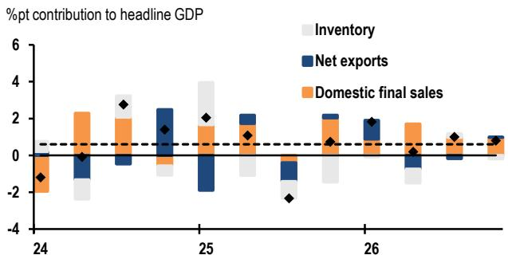

bar chart

| Year | Inventory | Net exports | Domestic final sales |
|------|-----------|-------------|----------------------|
| 24   | -2.5      | -1.5        | -1.0                 |
| 25   | 4.0       | -2.0        | 1.5                  |
| 26   | -1.0      | -0.5        | 1.0                  |

Source: CAO, JPM. Dotted line shows potential growth. JPM forecasts from 2Q26.

We expect GDP growth to slow this quarter as energy shocks intensify and begin to tighten supply constraints. That said, incoming data suggest that government subsidies aimed at curbing inflation and firm manufacturing demand—partly reflecting front-loaded demand—supported momentum through May. Moreover, the strong April consumption print points to continued underlying resilience, which should help the economy avoid a sharp growth slowdown.

## May SME sentiment picks up

In the May Economy Watchers Survey, sentiment among small and medium-sized enterprises (SMEs) regarding current conditions improved 2.8 points to 43.6, the highest reading since March (Figure 2). Even so, SME sentiment remains weighed down by energy price shocks, with the index still 5.3pts below February's level. However, the rebound was stronger than we had expected, suggesting that resilient demand is easing some concerns. The three-month outlook index also rose 1.3pts to 40.7, but it remains 9.3pts below February, indicating persistent concerns about supply constraints and elevated uncertainty around the outlook.

Figure 2: Economy Watchers Index  
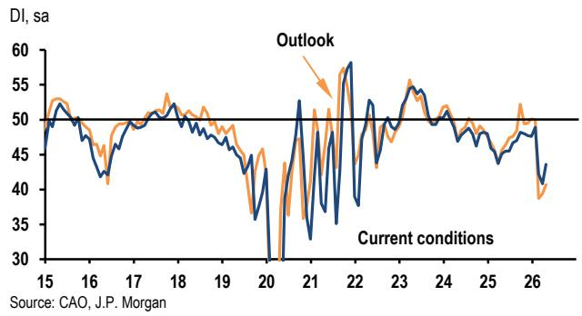

line chart

| Year | Current conditions | Outlook |
|------|---------------------|---------|
| 15   | ~50                 | ~52     |
| 16   | ~48                 | ~50     |
| 17   | ~50                 | ~52     |
| 18   | ~48                 | ~50     |
| 19   | ~45                 | ~48     |
| 20   | ~30                 | ~35     |
| 21   | ~50                 | ~55     |
| 22   | ~35                 | ~58     |
| 23   | ~50                 | ~55     |
| 24   | ~48                 | ~50     |
| 25   | ~45                 | ~48     |
| 26   | ~40                 | ~38     |

The household activity-related index rebounded 3.3pts to 43.8, consistent with the recovery in consumer confidence. Sub-indices improved broadly, led by a sharp recovery in the food sector index, which surged 9.9pts to 44.5. In the commentary, a significant number of respondents concern that rising prices are weighing on consumer demand. Some respondents in particular pointed to food prices, which are set to rise in the near term. These concerns were partly offset by solid demand for holiday-related services, durable goods, and apparel.

Figure 3: Economy Watchers Index, Current conditions index  
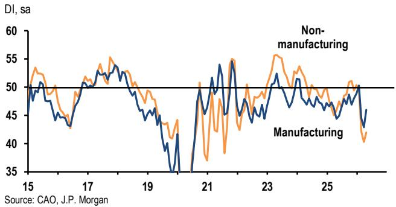

line chart

| Year | Non-manufacturing | Manufacturing |
|------|-------------------|---------------|
| 15   | ~53               | ~50           |
| 17   | ~54               | ~51           |
| 19   | ~48               | ~45           |
| 21   | ~55               | ~50           |
| 23   | ~56               | ~52           |
| 25   | ~50               | ~48           |
| 27   | ~45               | ~40           |

The business activity-related index rose 2.2 points to 43.7. As in the May PMI, performance diverged between manufacturing and non-manufacturing (Figure 3): the manufacturing index climbed 3.1pts to 46.0, while the non-manufacturing index improved only 1.7pts to 42.0. Respondents pointed to strong AI-related demand benefiting the tech sector. At the same time, many cited the adverse effects of the energy shock—higher input and output costs, tighter input availability (particularly naphtha), and slower delivery times. Against this backdrop, some respondents in oil, ceramics and construction flagged the risk of output cuts. More broadly, firms expressed growing concern about higher prices and increasingly view meaningful pass-through to output prices as unavoidable.

## Data releases and forecasts

Week of June 15 - 19

<table><tr><td>Wed</td><td colspan="5">Reuters Tankan survey</td></tr><tr><td>Jun 17</td><td colspan="5">Diffusion index</td></tr><tr><td>8:00am</td><td></td><td>Mar</td><td>Apr</td><td>May</td><td>Jun</td></tr><tr><td></td><td>Manufacturing</td><td>18</td><td>7</td><td>8</td><td>3</td></tr><tr><td></td><td>Nonmanufacturing</td><td>25</td><td>31</td><td>29</td><td>26</td></tr></table>

We expect both manufacturing and non-manufacturing sentiment to decline in June, reflecting tighter supply constraints, elevated cost pressures, and increased uncertainty about the global outlook.

<table><tr><td>Wed</td><td colspan="5">Customs-cleared international trade</td></tr><tr><td>Jun 17</td><td>%m/m sa</td><td></td><td></td><td></td><td></td></tr><tr><td>8:50am</td><td></td><td>Feb</td><td>Mar</td><td>Apr</td><td>May</td></tr><tr><td></td><td>Balance (JPY bn sa)</td><td>-357</td><td>95</td><td>236</td><td>-199</td></tr><tr><td></td><td>Exports</td><td>-5.4</td><td>1.4</td><td>1.4</td><td>1.8</td></tr><tr><td></td><td>Imports</td><td>3.3</td><td>-3.0</td><td>0.0</td><td>6.1</td></tr><tr><td></td><td>Balance (JPY bn nsa)</td><td>37</td><td>631</td><td>299</td><td>-859</td></tr><tr><td></td><td>Exports (%oya)</td><td>4.0</td><td>11.5</td><td>14.8</td><td>17.5</td></tr><tr><td></td><td>Imports (%oya)</td><td>10.3</td><td>11.0</td><td>9.8</td><td>18.4</td></tr><tr><td></td><td>BoJ real export index</td><td>-3.0</td><td>0.9</td><td>-2.8</td><td>0.5</td></tr><tr><td></td><td>BoJ real import index</td><td>5.5</td><td>-4.7</td><td>-3.9</td><td>3.0</td></tr></table>

Preliminary data suggest that the trade balance will turn to a deficit in May, driven by higher imports.

<table><tr><td>Wed</td><td colspan="5">Machinery orders</td></tr><tr><td>Jun 17</td><td>%m/m sa</td><td></td><td></td><td></td><td></td></tr><tr><td>8:50am</td><td></td><td>Jan</td><td>Feb</td><td>Mar</td><td>Apr</td></tr><tr><td></td><td>Total</td><td>-2.0</td><td>-5.0</td><td>4.3</td><td>—</td></tr><tr><td></td><td>Core private domestic orders $^{1}$ </td><td>-5.5</td><td>13.6</td><td>-9.4</td><td>-2.0</td></tr><tr><td></td><td>Manufacturing</td><td>-12.5</td><td>30.7</td><td>-14.2</td><td>—</td></tr><tr><td></td><td>Core nonmanufacturing</td><td>6.8</td><td>0.9</td><td>-6.0</td><td>—</td></tr><tr><td></td><td>Public</td><td>-13.1</td><td>-19.0</td><td>-14.5</td><td>—</td></tr><tr><td></td><td>Foreign</td><td>0.2</td><td>-5.1</td><td>31.0</td><td>—</td></tr></table>

1. Domestic private sector, ex for ships and from utilities

We expect monthly core private domestic orders to decline in April, reflecting greater business caution outside tech-related industries.

<table><tr><td rowspan="13">FriJun 198:30am</td><td colspan="5">Nationwide consumer prices</td></tr><tr><td colspan="5">2020-based</td></tr><tr><td></td><td>Feb</td><td>Mar</td><td>Apr</td><td>May</td></tr><tr><td>%oya</td><td></td><td></td><td></td><td></td></tr><tr><td>Overall</td><td>1.3</td><td>1.5</td><td>1.4</td><td>1.4</td></tr><tr><td>Core (ex. fresh food)</td><td>1.6</td><td>1.8</td><td>1.4</td><td>1.3</td></tr><tr><td>Core (ex. fresh food and energy)</td><td>2.5</td><td>2.4</td><td>1.9</td><td>1.8</td></tr><tr><td>Core (ex. food and energy)</td><td>1.4</td><td>1.4</td><td>1.1</td><td>1.1</td></tr><tr><td>%m/m, sa</td><td></td><td></td><td></td><td></td></tr><tr><td>Overall</td><td>-0.2</td><td>0.4</td><td>0.1</td><td>0.1</td></tr><tr><td>Core (ex. fresh food)</td><td>-0.3</td><td>0.5</td><td>0.0</td><td>0.1</td></tr><tr><td>Core (ex. fresh food and energy)</td><td>0.1</td><td>0.2</td><td>-0.2</td><td>0.0</td></tr><tr><td>Core (ex. food and energy)</td><td>0.1</td><td>0.2</td><td>-0.1</td><td>0.1</td></tr></table>

The May nationwide CPI inflation will likely continue to show the dampening effect of subsidies on energy inflation and a further deceleration in food inflation. Although producer prices have already turned to a sharp increase, the pass-through to consumer prices is not expected to have progressed as of May, and a shift in the underlying inflation trend is likely to become visible from June onward.

Review of the past week's data  
GDP - 2nd estimate (Jun 8)

<table><tr><td colspan="7">%q/q, saar</td></tr><tr><td></td><td>3Q25</td><td></td><td>4Q25</td><td></td><td>1Q26</td><td></td></tr><tr><td>Real GDP</td><td>-2.5</td><td>-2.3</td><td>0.8</td><td>0.7</td><td>1.2</td><td>1.8</td></tr><tr><td>Private consumption</td><td>2.1</td><td></td><td>0.2</td><td>0.3</td><td>1.1</td><td>1.4</td></tr><tr><td>Residential investment</td><td>-28.7</td><td>-28.4</td><td>21.3</td><td></td><td>2.1</td><td>3.7</td></tr><tr><td>Bus. capital investment</td><td>-0.4</td><td></td><td>5.6</td><td>4.7</td><td>4.0</td><td>-2.8</td></tr><tr><td>Government consumption</td><td>0.2</td><td>0.3</td><td>0.0</td><td>1.5</td><td>0.4</td><td>1.3</td></tr><tr><td>Public investment</td><td>-4.2</td><td>-4.0</td><td>-0.8</td><td>-0.5</td><td>5.7</td><td>6.1</td></tr><tr><td>Exports</td><td>-6.2</td><td>-6.1</td><td>0.7</td><td>0.8</td><td>7.1</td><td>7.4</td></tr><tr><td>Imports</td><td>-0.7</td><td></td><td>0.0</td><td></td><td>1.9</td><td>1.7</td></tr><tr><td colspan="7">%-pt contrib. to q/q saar GDP growth</td></tr><tr><td>Domestic final sales</td><td>-0.4</td><td></td><td>2.1</td><td>2.0</td><td>0.2</td><td>0.9</td></tr><tr><td>Net exports</td><td>-1.0</td><td></td><td>0.1</td><td></td><td>0.9</td><td>1.0</td></tr><tr><td>Inventories</td><td>-1.0</td><td>-0.9</td><td>-1.4</td><td></td><td>0.0</td><td>-0.1</td></tr><tr><td>GDP deflator (%oya)</td><td>3.4</td><td></td><td>3.4</td><td></td><td>3.4</td><td>3.2</td></tr></table>

See main essay.

Bank lending (Jun 8)

<table><tr><td>%oya</td><td>Mar</td><td>Apr</td><td colspan="2">May</td></tr><tr><td>Bank lending</td><td>5.2</td><td>6.0</td><td>5.9</td><td>6.3</td></tr><tr><td>%m/m, sa by JPM</td><td>0.4</td><td>0.6</td><td></td><td>0.8</td></tr></table>

Balance of payments (Jun 8)

<table><tr><td colspan="5">JPY bn, sa</td></tr><tr><td></td><td>Feb</td><td>Mar</td><td>Apr</td><td></td></tr><tr><td>Current account</td><td>2701</td><td>3901</td><td>3542</td><td>4211</td></tr><tr><td>Trade balance</td><td>-310</td><td>418</td><td>—</td><td>470</td></tr><tr><td>Exports</td><td>9839</td><td>10164</td><td>—</td><td>10191</td></tr><tr><td>Imports</td><td>10149</td><td>9746</td><td>—</td><td>9721</td></tr><tr><td>Services</td><td>-402</td><td>-614</td><td>—</td><td>272</td></tr><tr><td>Primary income</td><td>3738</td><td>4284</td><td>—</td><td>3689</td></tr><tr><td>Secondary income</td><td>-325</td><td>-188</td><td>—</td><td>-219</td></tr><tr><td>Current account (nsa)</td><td>3933</td><td>4681</td><td>3215</td><td>3908</td></tr></table>

Economy Watchers survey (Jun 8)

<table><tr><td colspan="5">DI, sa</td></tr><tr><td></td><td>Mar</td><td>Apr</td><td>May</td><td></td></tr><tr><td>Current conditions</td><td>42.2</td><td>40.8</td><td>41.3</td><td>43.6</td></tr><tr><td>Households</td><td>41.7</td><td>40.5</td><td>—</td><td>43.8</td></tr><tr><td>Business</td><td>43.1</td><td>41.5</td><td>—</td><td>43.7</td></tr><tr><td>Employment</td><td>43.1</td><td>41.4</td><td>—</td><td>41.5</td></tr></table>

See main essay.

Producer prices index (Jun 10)

<table><tr><td colspan="7">%oya, nsa, 2020-based</td></tr><tr><td></td><td>Mar</td><td></td><td>Apr</td><td></td><td>May</td><td></td></tr><tr><td>Domestic PPI</td><td>2.9</td><td>2.8</td><td>4.9</td><td>5.3</td><td>5.3</td><td>6.3</td></tr><tr><td>(%m/m)</td><td>0.8</td><td></td><td>1.8</td><td>2.2</td><td>0.5</td><td>1.0</td></tr><tr><td>Export prices</td><td>12.2</td><td></td><td>18.9</td><td>19.1</td><td>—</td><td>20.6</td></tr><tr><td>Import prices</td><td>8.0</td><td>8.1</td><td>17.5</td><td>21.0</td><td>—</td><td>25.5</td></tr></table>

The BoJ's Corporate Goods Price Index (CGPI) indicates that producer-side price pressures from energy and oil-derived inputs continued in May. Part of May's increase reflects the expiration of electricity and gas subsidies, but producer energy costs continued to climb: petroleum product prices rose $13.8\%$ oya, while naphtha prices remained extremely elevated at $79.4\%$ oya. Consistent with ongoing constraints in petrochemical-related inputs, chemical product prices increased $13.4\%$ oya and plastic product prices rose $4.3\%$ oya. Non-ferrous metal prices surged $42.2\%$ oya, the strongest increase since 2006. While these increases have not yet broadened meaningfully to other goods categories, higher transportation and packaging costs are likely to push broader goods prices higher over time.

Import-cost pressures are also continuing to build. The import price index rose 25.5% oya (yen basis) and 15.5% oya (contract-currency basis), driven largely by energy, which increased 47.0% oya on a yen basis. Higher global energy prices lifted import prices of crude oil (53.6% oya), naphtha (98.1% oya), and LNG (16.9% oya). Beyond energy and metals, tech-related products also continued to raise both import and export prices: electronics import prices rose 22.6% oya. On the export side, electronics export prices increased 35.6% oya, contributing materially to the surge in overall export prices.

Sources for all data tables: ADA, BoJ, CAO, JCSA, JDSA, JFA, JLM, VMA, Markit, METI, MHLW, MILT, MoF, Reuters, Statistics Bureau, JPM forecasts.

# Japan Focus: The energy subsidy price tag

The Diet last week enacted a JPY3.1 trillion supplementary budget to secure additional funding for energy subsidies. The funding will be financed by adjusting the existing JGB issuance plan, so there will be no increase in bond issuance. Fuel subsidies launched in late March have pushed up monthly outlays amid persistently high crude prices; without additional measures, the roughly JPY1 trillion carried over from last fiscal year was expected to be exhausted before early summer. The supplementary budget addresses this.

On a full-year basis, however, the budget does not materially expand FY26 spending, and the post-revision FY26 expenditure-to-GDP ratio is slightly below the pre-pandemic level (Figure 1). Nearly all of the package is earmarked for energy subsidies: JPY3 trillion to top up the reserve fund (likely for fuel subsidies and summer electricity/gas subsidies of around JPY500 billion) and JPY0.1 trillion for measures to lower business electricity bills.

Figure 1: General account budget  
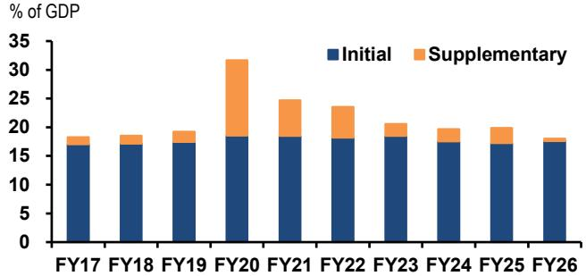

stacked bar chart

| Fiscal Year | Initial (% of GDP) | Supplementary (% of GDP) |
| :--- | :--- | :--- |
| FY17 | 17 | 1 |
| FY18 | 17 | 1 |
| FY19 | 17 | 1 |
| FY20 | 18 | 14 |
| FY21 | 18 | 7 |
| FY22 | 18 | 6 |
| FY23 | 18 | 2 |
| FY24 | 17 | 2 |
| FY25 | 17 | 2 |
| FY26 | 17 | 1 |

Source: MoF, JPM

Figure 2: Gasoline retail price  
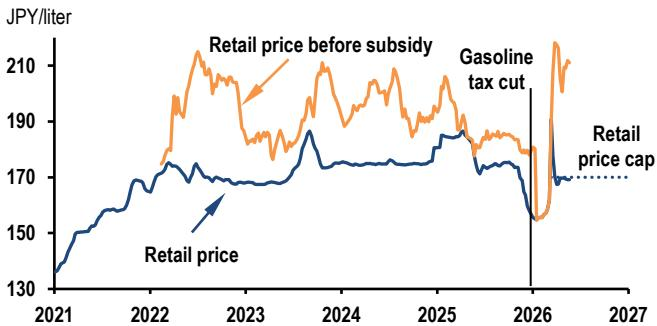

line chart

| Year | Retail price before subsidy (JPY/liter) | Retail price cap (JPY/liter) |
|------|----------------------------------------|-----------------------------|
| 2021 | ~150                                   | ~130                        |
| 2022 | ~190                                   | ~160                        |
| 2023 | ~210                                   | ~170                        |
| 2024 | ~190                                   | ~175                        |
| 2025 | ~185                                   | ~170                        |
| 2026 | ~150                                   | ~160                        |
| 2027 | ~170                                   | ~170                        |

Source: Agency for Natural Resources and Energy, JPM

Under the current gasoline price cap of JPY170 per liter, an average subsidy of about JPY41 per liter was paid in April (Figure 2), with monthly outlays of JPY310 billion. If crude prices remain broadly flat around USD100 per barrel, the

topped-up reserve will likely be used for gasoline subsidies within FY26 (Figure 3). If the government provides additional support for electricity and gas subsidies or supply-chain-related measures later this fiscal year, another supplementary budget would likely be required.

Figure 3: Subsidy fund outstandings by crude oil price scenario  
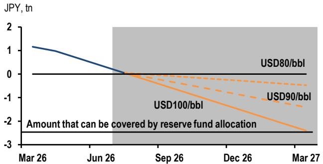

line chart

| Date   | USD80/bbl | USD90/bbl | USD100/bbl |
|--------|-----------|-----------|------------|
| Mar 26 | 1.0       | 0.0       | 0.0        |
| Jun 26 | 0.0       | 0.0       | 0.0        |
| Sep 26 | 0.0       | -1.0      | -1.0       |
| Dec 26 | 0.0       | -1.5      | -1.5       |
| Mar 27 | 0.0       | -2.0      | -2.5       |

Source: Administrative Reform of the Government, JPM

If crude oil prices remain elevated, as we expect, FY26 gasoline-related fiscal costs could become sizable. The government has already abolished the temporary gasoline surtax in early 2026 (about JPY1.5 trillion in effective tax cuts); adding an estimated JPY3.6 trillion in gasoline subsidies through fiscal year-end would push the total above JPY5 trillion (around 0.7% of GDP), well above the roughly JPY3 trillion in FY22 (Figure 4).

Figure 4: Fiscal spending to stabilize fuel prices  
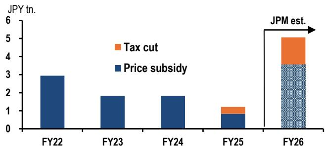

stacked bar chart

| Year | Price subsidy (JPY tn.) | Tax cut (JPY tn.) |
| :--- | :--- | :--- |
| FY22 | 3.0 | 0.0 |
| FY23 | 1.8 | 0.0 |
| FY24 | 1.8 | 0.0 |
| FY25 | 0.8 | 0.4 |
| FY26 | 3.5 | 1.7 |
JPM est. | - | - |

Note: FY26 subsidy assumes the May subsidy remains unchanged throughout the year  
Source: Administrative Reform of the Government, METI, MoF, JPM

Such concerns have been widely voiced in the Diet. In response, PM Takaichi said last week that she would consider, as necessary, revising the per-unit support level for gasoline subsidies. However, with inflation expected to trend higher into the summer, cuts to subsidies that could lead to higher retail gasoline prices are also likely to face a political backlash. The government is currently considering a large-scale growth investment budget and a reduction in the consumption tax on food from next fiscal year. If these generous energy subsidies are also forced to remain in place for longer, there is a risk that fiscal concerns will intensify in the second half of the year.

## Australia and New Zealand

- AU business confidence improves, but remains depressed  
- RBA expected to hold, with inflation above-target but activity data softening  
• NZ 1Q GDP expected to rebound +0.8%q/q

In this week's NAB survey, Australian business confidence rose 9pts in May to -14 after April's extreme weakness, but remains almost two standard deviations below its long-run average and continues to signal a deeply pessimistic business sector (Figure 1). Business conditions were unchanged at +3, consolidating last month's step down.

Figure 1: Business confidence and profitability  
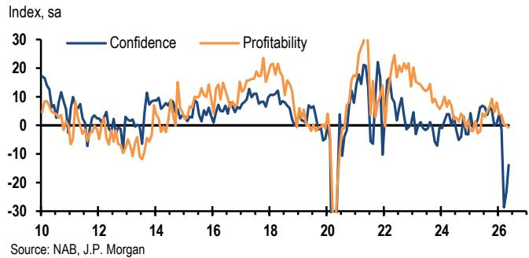

line chart

| Year | Confidence | Profitability |
|------|------------|---------------|
| 10   | ~15        | ~5            |
| 12   | ~5         | ~-5           |
| 14   | ~10        | ~10           |
| 16   | ~5         | ~15           |
| 18   | ~10        | ~20           |
| 20   | ~-30       | ~-30          |
| 22   | ~20        | ~30           |
| 24   | ~5         | ~10           |
| 26   | ~-30       | ~-5           |

Within conditions, the profitability component declined again in May and is now down \~10pts below its 3Q25 peak. The improvement observed through 2H25 has now been fully unwound, reflecting tightening financial conditions and more recently, the shock to energy prices. The profile aligns with our view that the 2H25 inflation uplift was disproportionately goods-driven, facilitated by a period of firmer demand that allowed margin expansion rather than reflecting a re-acceleration in broader cost pressures. This week, that view was corroborated by RBA liaison data, which documented reduced downward pressure on margins in 2H25 as demand improved.

Figure 2: Capacity utilisation and unemployment  
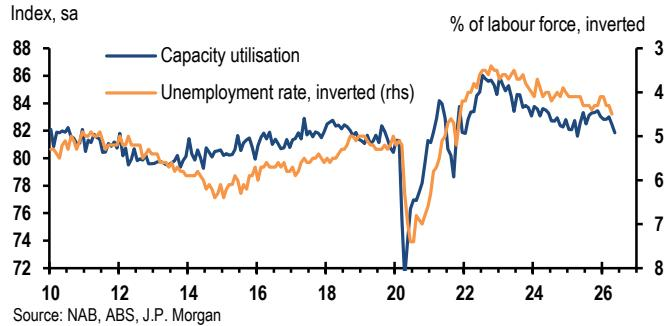

line chart

| Year | Capacity utilisation (sa) | Unemployment rate, inverted (rhs) |
|------|---------------------------|-----------------------------------|
| 10   | 82                        | 5                                 |
| 12   | 81                        | 5                                 |
| 14   | 80                        | 5                                 |
| 16   | 81                        | 5                                 |
| 18   | 82                        | 5                                 |
| 20   | 72                        | 5                                 |
| 22   | 86                        | 4                                 |
| 24   | 84                        | 4                                 |
| 26   | 82                        | 4                                 |

In other details, capacity utilisation fell a further 0.5%-pts to 81.9%, its lowest level in more than a year, consistent with our expectation that demand will soften through 2H26 and unemployment will drift gradually higher. With global energy supply chains still under strain, we see ongoing downside risks to business conditions.

## RBA likely to hold

After three consecutive hikes into a slowing economy and narrow inflation impulse, there is little need for further RBA tightening. The RBA's commentary had of course been clear on this a month ago, flagging a period of stability (Table 1). This sets up next week as a relatively low-impact RBA meeting, with only a couple of bp priced for a hike. A straightforward on-hold vote seems likely (9-0, 8-1, etc), though with the reminder that inflation is too high, and the board will need to stay alert to spillovers.

Table 1: RBA commentary around transitions to on-hold periods

<table><tr><td>Statement date and context</td><td>Quote introduced at that meeting</td></tr><tr><td>May 2026</td><td>&quot;having raised the cash rate three times, monetary policy is well placed...&quot;</td></tr><tr><td>Aug 2025, last cut of the cycle</td><td>“this takes the decline in the cash rate since the beginning of the year to 75bp”</td></tr><tr><td>Jul 2023, starting extended pause after hikes</td><td>“interest rates have been increased by 4%-pt since May last year”</td></tr><tr><td>Oct 2022, moving to +25bp after a string of +50bps hikes</td><td>“the cash rate has been increased substantially in a short period of time”</td></tr><tr><td>Sep 2016 after last cut of mini-cycle</td><td>“having eased monetary policy at its May and August meetings...”</td></tr><tr><td>May 2010, starting extended pause after hikes</td><td>“as a result of today&#x27;s decision, rates... will be around average levels. This represents a significant adjustment ...”</td></tr></table>

Source: RBA, JPM

In Governor Bullock's press conference, questions will be coming from all angles, given the negative news on housing, and inflationary fears from the minimum wage increase. We expect Bullock to err on the slightly hawkish side within this mix, but emphasize that policy is well-positioned for any eventuality after the recent tightening.

## NZ growth to lift

New Zealand's recovery narrative softened at the end of last year, with 4Q25 GDP rising 0.2%q/q, well below market and RBNZ expectations and signaling a more fragile growth backdrop than previously assumed (Figure 3). Early year momentum in business surveys has also faded, with PMI/PSI readings consistent with only moderate growth through the March quarter. Even so, the macro preconditions for a cyclical upturn remain largely intact. Monetary policy is accommodative, and labor market dynamics suggest unemployment likely peaked in 4Q25, which should support demand through 2026.

Figure 3: New Zealand GDP growth  
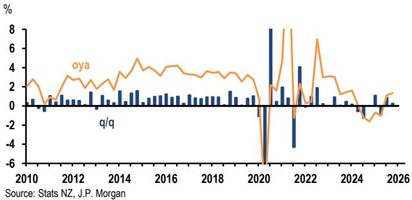

line chart

| Year | oya  | q/q  |
|------|------|------|
| 2010 | 3.0  | 0.5  |
| 2011 | 2.5  | -0.5 |
| 2012 | 3.5  | 0.5  |
| 2013 | 3.0  | 0.5  |
| 2014 | 4.0  | 1.0  |
| 2015 | 4.5  | 1.5  |
| 2016 | 4.0  | 1.0  |
| 2017 | 3.5  | 0.5  |
| 2018 | 3.0  | 0.5  |
| 2019 | 3.5  | 1.0  |
| 2020 | -6.0 | -6.0 |
| 2021 | 8.0  | 8.0  |
| 2022 | 7.0  | -4.0 |
| 2023 | 3.0  | 2.0  |
| 2024 | 1.5  | -1.0 |
| 2025 | -2.0 | -1.5 |
| 2026 | 1.0  | 0.5  |

Across the components, we expect household consumption to rebound after last quarter's contraction, with nominal card spending tracking a moderate gain. Gross fixed capital formation should be a near-term drag, as building work volumes have softened across both residential and non-residential activity, partially offset by a steadier net trade impulse. Recent GDP prints have also been affected by residual seasonality linked to COVID-era distortions, with the March quarter tending to outperform tracking signals. We forecast 1Q GDP at $+0.8\% \mathrm{q / q}$ , and expect growth to firm through the year, lifting towards $2.2\%$ oya by year end.

## Australia

## Data releases and forecasts

Week of June 15 - 19

<table><tr><td rowspan="2">TueJun 16</td><td colspan="5">RBA cash rate</td></tr><tr><td></td><td>Feb</td><td>Mar</td><td>May</td><td>Jun</td></tr><tr><td>2:30pm</td><td>%</td><td>3.85</td><td>4.10</td><td>4.35</td><td>4.35</td></tr></table>

See main text.

Review of past week's data

<table><tr><td colspan="4">Westpac consumer sentiment</td></tr><tr><td></td><td>Apr</td><td>May</td><td>Jun</td></tr><tr><td>Index, sa</td><td>80.1</td><td>83.0</td><td>80.6</td></tr><tr><td colspan="4">NAB business confidence</td></tr><tr><td></td><td>Mar</td><td>Apr</td><td>May</td></tr><tr><td>Confidence, sa</td><td>-28.7</td><td>-23.5</td><td>-13.8</td></tr><tr><td>Conditions, sa</td><td>5.6</td><td>2.8</td><td>3.0</td></tr><tr><td colspan="4">MI inflation expectations</td></tr><tr><td></td><td>Mar</td><td>Apr</td><td>May</td></tr><tr><td>% p.a.</td><td>5.9</td><td>5.6</td><td>5.5</td></tr></table>

## New Zealand

## Data releases and forecasts

Week of June 15 - 19

<table><tr><td>Mon</td><td colspan="5">BusinessNZ services index</td></tr><tr><td>Jun 15</td><td></td><td>Feb</td><td>Mar</td><td>Apr</td><td>May</td></tr><tr><td>8:30am</td><td>Index, sa</td><td>91.6</td><td>80.1</td><td>83.0</td><td></td></tr><tr><td>Wed</td><td colspan="5">Current account</td></tr><tr><td>Jun 17</td><td></td><td>2Q25</td><td>3Q24</td><td>4Q25</td><td>1Q26</td></tr><tr><td>8:45am</td><td>NZD bn, nsa</td><td>-1.30</td><td>-8.36</td><td>-5.98</td><td></td></tr><tr><td>Thu</td><td colspan="5">Gross domestic product</td></tr><tr><td>Jun 18</td><td></td><td>2Q25</td><td>3Q24</td><td>4Q25</td><td>1Q26</td></tr><tr><td>8:45am</td><td>%q/q, sa</td><td>-0.9</td><td>0.9</td><td>0.2</td><td>0.8</td></tr></table>

See main text.

<table><tr><td>Fri</td><td colspan="5">Merchandise trade balance</td></tr><tr><td>Jun 19</td><td></td><td>Feb</td><td>Mar</td><td>Apr</td><td>May</td></tr><tr><td>8:45am</td><td>NZD bn, nsa</td><td>-0.4</td><td>0.4</td><td>1.9</td><td></td></tr></table>

Review of past week's data

<table><tr><td colspan="4">BusinessNZ manufacturing index</td></tr><tr><td></td><td>Mar</td><td>Apr</td><td>May</td></tr><tr><td>Index, sa</td><td>52.8</td><td>50.4</td><td>49.9</td></tr></table>

Sources: ABS, Stats NZ, RBA, BusinessNZ, Westpac, NAB, Melbourne Institute, JPM

## Greater China

• China: Exports beat expectations, led by AI tech  
• CPI held steady, while PPI extended its upturn  
- Rising concerns on outbound investment regulation; loans remain the primary drag on credit growth  
- Taiwan: Exports strong across the spectrum; upgrade 2Q GDP growth forecast  
- Next week: China FAI, IP, retail sales, housing; Taiwan CBC meeting

May trade and inflation reports point to a rising role for AI tech. High-tech exports rose for a seventh consecutive month, while AI-related memory tightness also fed into communications tools CPI and broader IC/electronics PPI. The key caveat is that the trade strength appears narrower and increasingly price-driven, concentrated in memory ICs/modules, three new products (EVs, solar and batteries), which together accounted for around 60% of export growth, so the read-through to IP and net export contribution is less clear-cut than headline export growth suggests.

## AI-related high-tech boosted exports

China's May exports rose $3.1\% \mathrm{m / m}$ sa after an April jump, beating expectations by a wide margin and lifting annual growth to $19.4\%$ oya. High-tech shipments rose for the seventh consecutive month, at $8.0\% \mathrm{m / m}$ sa (Figure 1), led by mobile phones, electronic ICs and ADP, with prices likely providing a meaningful boost despite the official price-volume split still pending. Imports continued to expand for a sixth straight month after undershooting for most of 2025, rising $2.9\% \mathrm{m / m}$ sa (or $27.5\%$ oya). Import strength was driven more by AI supply chain needs and commodity stockpiling (i.e., coal) than a broad domestic-demand recovery. Crude oil imports continued to decline in May, partly reflecting last year's reserve build and a preference to draw on inventories.

Figure 1: China major export categories  
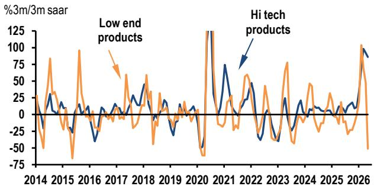

line chart

| Year | Low end products | Hi tech products |
|------|------------------|------------------|
| 2014 | ~0               | ~0               |
| 2015 | ~80              | ~30              |
| 2016 | ~-50             | ~-25             |
| 2017 | ~60              | ~50              |
| 2018 | ~40              | ~30              |
| 2019 | ~-25             | ~-10             |
| 2020 | ~-50             | ~-30             |
| 2021 | ~125             | ~75              |
| 2022 | ~-25             | ~-10             |
| 2023 | ~-50             | ~-30             |
| 2024 | ~-25             | ~-10             |
| 2025 | ~-10             | ~-5              |
| 2026 | ~100             | ~90              |

Source: China Customs; JPM

A granular breakdown suggests that the year-to-date export strength is more narrowly product-focused and increasingly price-driven, making production and net export contribution to growth less clear-cut. Uncertainty is compounded by the prospect of new Section 301 tariffs and a tougher EU stance against China. Yet global growth has held up despite the energy shock, and capex strength is broadening into non-tech spending, supporting China's export momentum and China-linked supply chains. Barring a sharp pullback, nominal export growth could reach high single digits (possibly above $10\%$ ), while firmer imports may outpace exports for the first time since 2021.

## Inflation broadly in line with expectations

Headline CPI stabilized at 1.2% oya in May, with a 0.1% m/m sa uptick (Figure 2). Communications tools prices edged higher (+1.5% m/m nsa) as AI-related memory tightness fed through, and education/culture/entertainment prices rose on Labor Day tourism. Persistent food deflation provided a partial offset. Ex-food/energy, core CPI eased to 1.1% oya (flat in %m/m). PPI extended its upturn, rising 0.8% m/m sa (3.9% oya), lifted by industrial upgrading and AI-driven compute demand, plus seasonal summer demand for coal, cooling appliances and power, while global oil price swings capped gains.

Figure 2: China's inflation dynamics  
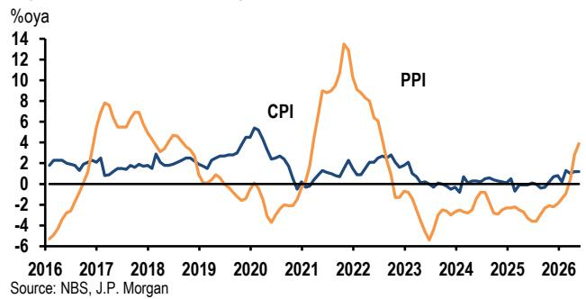

line chart

| Year | CPI  | PPI  |
|------|------|------|
| 2016 | ~2   | ~-5  |
| 2017 | ~3   | ~8   |
| 2018 | ~2   | ~6   |
| 2019 | ~3   | ~4   |
| 2020 | ~5   | ~2   |
| 2021 | ~0   | ~-4  |
| 2022 | ~3   | ~14  |
| 2023 | ~1   | ~-6  |
| 2024 | ~0   | ~-3  |
| 2025 | ~1   | ~-2  |
| 2026 | ~1   | ~4   |

Normalization from the energy shock will take time, as infrastructure repairs and logistics frictions could keep prices elevated above pre-conflict levels through year-end. AI-related cost pass-through is broadening into upstream semis and downstream electronics, adding to a more durable inflation tailwind. These forces point to some upside risk to PPI inflation, though excess capacity elsewhere and weak consumer demand should cap the upside, keeping CPI more anchored. The GDP deflator is likely to turn positive in 2Q, ending a three-year deflation streak and supporting the PBOC's price-recovery mandate and reflation expectations.

## Another strong beat on FX reserves

FX reserves rose US\$31.7bn, to \$3442.2bn in May, reflecting firmer-than-expected exports. Penciling in a wider current account surplus and a valuation loss amid a stronger USD,

implied capital outflows remain muted, at US\$20bn. PBOC accelerated gold purchases, while UST holdings declined. CFETS (+1.5%) and REER (+1%) strengthened in May, bringing the REER back to early-2025 levels (Figure 3). A firmer CNY basket could help ease geopolitical frictions and support RMB internationalization objectives under the 15th Five-Year Plan.

Figure 3: CNY exchange rates  
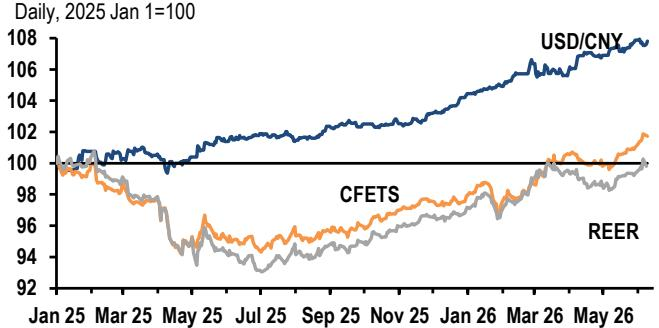

line chart

| Date   | USD/CNY | CFETS | REER |
|--------|---------|-------|------|
| Jan 25 | 100     | 100   | 100  |
| Mar 25 | 100     | 99    | 98   |
| May 25 | 100     | 96    | 94   |
| Jul 25 | 101     | 97    | 93   |
| Sep 25 | 102     | 98    | 94   |
| Nov 25 | 103     | 99    | 95   |
| Jan 26 | 104     | 100   | 96   |
| Mar 26 | 106     | 101   | 98   |
| May 26 | 108     | 102   | 100  |

Source: Bloomberg Finance L.P., JPM

Recent regulatory moves have raised questions about whether China is meaningfully tightening outbound capital flows. The cross-border enforcement aims to shut down illicit solicitation/servicing and re-route flows into supervised pathways, rather than imposing a blanket ban on offshore investing. Against the backdrop of easing near-term capital outflow pressure and CNY strengthening, the State Council's Regulations on Outbound Investment also appear to be less about restricting outbound investment, but to standardize governance and tighten enforcement around activities that already sit within existing rules. It should be read as part of a broader effort to build a comprehensive regime for the prudent management of cross-border flows, including talent, technology, data, capital, etc.

## Loans continued to drag on credit growth

New loan creation turned positive, at 520bn yuan, after April's contraction, but was still the weakest May print since 2009 (Figure 4). Corporate short-term loans and bill financing, a tool banks sometimes use to meet credit creation targets, provided the main lift. However, household loans and corporate medium- and long-term loans remained in contraction, signaling general demand weakness. Loan growth slowed to a new low of $5.5\%$ , dragging TSF growth down $0.1\%$ pt, to an historical low of $7.7\%$ . Bond issuance was broadly in line with our expectations, with government bond issuance accelerating to 1222bn yuan, driven mainly by CGBs, while special LGB issuance remained slow.

While the PBOC's 1Q26 monetary policy operations report struck a relatively more hawkish tone and points to a low probability of a near-term cut, recent weakness, especially the surprisingly soft April activity data and downside risks to 2Q GDP, should keep a rate cut on the table. A more hawkish Fed and other major central banks may complicate the external backdrop, but China's rate decision should remain driven by domestic conditions, particularly with CNY still resilient and the main pressure being to slow appreciation, rather than defend against depreciation. A cut could become more likely in 2H if growth headwinds intensify and outweigh inflation risks. As usual, a 10bp move would likely be more of a policy signal than a meaningful easing impulse.

Figure 4: Loan growth  
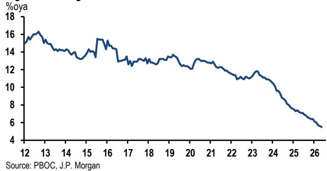

line chart

| Year | %oya |
| ---- | ---- |
| 12   | 15.0 |
| 13   | 16.0 |
| 14   | 14.5 |
| 15   | 13.5 |
| 16   | 15.5 |
| 17   | 13.0 |
| 18   | 13.5 |
| 19   | 13.0 |
| 20   | 12.5 |
| 21   | 12.0 |
| 22   | 11.5 |
| 23   | 11.0 |
| 24   | 9.0  |
| 25   | 7.0  |
| 26   | 5.0  |

## Taiwan: Broad-based export strength

Taiwan's May exports rebounded sharply, fully reversing April's pullback and showing broader strength beyond tech. Nominal exports (USD) rose $11.1\% \mathrm{m / m}$ sa, with both tech $(+11.3\%)$ and non-tech $(+10.5\%)$ strengthening (Figure 5). Annual growth accelerated to $51.7\%$ oya, and trend momentum stayed very strong, at $85.7\% 3\mathrm{m} / 3\mathrm{m}$ saar. Imports also surged. Price dynamics remained firm, with the export price trend pace accelerating to $40.7\% 3\mathrm{m} / 3\mathrm{m}$ saar. Import prices rose, as well, partly on higher energy and commodity costs.

Figure 5: Taiwan export breakdown by products  
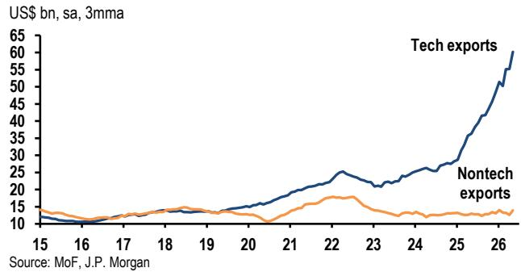

line chart

| Year | Tech exports | Nontech exports |
|------|--------------|-----------------|
| 15   | ~10          | ~10             |
| 16   | ~10          | ~10             |
| 17   | ~10          | ~10             |
| 18   | ~10          | ~10             |
| 19   | ~10          | ~10             |
| 20   | ~10          | ~10             |
| 21   | ~15          | ~10             |
| 22   | ~25          | ~15             |
| 23   | ~20          | ~15             |
| 24   | ~25          | ~15             |
| 25   | ~30          | ~15             |
| 26   | ~60          | ~15             |

The broadening of export strength from tech into non-tech is encouraging. Tech exports bounced across telecom products and electronic components. Non-tech extended a third-month upswing, led by machinery, electrical machinery, minerals and textiles. Import gains were broad-based, with mineral products up and chemicals rebounding. Crude oil imports

rose 76.4% oya amid Strait of Hormuz disruptions. By destination, exports to ASEAN and Mainland China/HK SAR led, while Europe fell.

## Revising up 2Q GDP

We upgrade our current-quarter growth outlook, as the rebound in real exports signals upside risk to near-term industrial production, even as elevated price effects complicate the read-through. The tech upcycle remains intact: TSMC's capex guidance is leaning toward US\$56bn, and management has not flagged conditions that would trigger a slowdown, consistent with demand-led investment amid an AI-driven supply shortfall that keeps utilization tight.

Despite the energy shock, several weaker links are firming. Export strength is broadening into non-tech, consistent with a global capex expansion that is spreading from tech to non-tech. Domestic demand indicators are also improving: Retail sales momentum accelerated, likely supported by equity wealth effects, better non-tech wage growth and lingering support from last year's cash handouts. The government's price stabilization framework has helped limit energy cost pass-through to CPI inflation, reducing the risk of a near-term squeeze on household purchasing power. A key offsetting risk is renewed tariff uncertainty tied to the USTR's Section 301 investigation, which could raise headline risk for some non-tech exports. Overall, we lift 2Q GDP by $2.3\%$ pts, to $4.5\%$ q/q saar, trim $0.4\%$ pt from each quarter in 2H, and raise the full-year forecast to $9.9\%$ y/y (Table 1).

Table 1: Taiwan GDP growth forecasts

<table><tr><td></td><td>2026</td><td>1Q26</td><td>2Q26</td><td>3Q26</td><td>4Q26</td></tr><tr><td colspan="6">%q/q, saar</td></tr><tr><td>Old</td><td></td><td>6.9</td><td>2.2</td><td>3.6</td><td>3.6</td></tr><tr><td>New</td><td></td><td></td><td>4.5</td><td>3.2</td><td>3.2</td></tr><tr><td colspan="6">%oya</td></tr><tr><td>Old</td><td>9.6</td><td>14.6</td><td>10.7</td><td>9.9</td><td>4.1</td></tr><tr><td>New</td><td>9.9</td><td></td><td>11.3</td><td>10.4</td><td>4.4</td></tr></table>

Source: DGBAS, J.P Morgan

## Global Economic Research

12 June 2026

## China

## Data releases and forecasts

Week of June 15-19

<table><tr><td rowspan="6">TueJun 169:30am</td><td>Housing prices% change</td><td></td><td></td><td></td><td></td></tr><tr><td></td><td>Feb</td><td>Mar</td><td>Apr</td><td>May</td></tr><tr><td>New home, %m/m</td><td>-0.3</td><td>-0.2</td><td>-0.2</td><td></td></tr><tr><td>%oya</td><td>-3.5</td><td>-3.6</td><td>-3.7</td><td></td></tr><tr><td>Secondary home, %m/m</td><td>-0.4</td><td>-0.2</td><td>-0.2</td><td></td></tr><tr><td>%oya</td><td>-6.3</td><td>-6.3</td><td>-6.2</td><td></td></tr><tr><td rowspan="4">TueJun 1610:00am</td><td>Fixed investment% change</td><td></td><td></td><td></td><td></td></tr><tr><td></td><td>Feb</td><td>Mar</td><td>Apr</td><td>May</td></tr><tr><td>%oya</td><td>1.8</td><td>1.6</td><td>-8.0</td><td>0.3</td></tr><tr><td>%oya, ytd</td><td>1.8</td><td>1.7</td><td>-1.6</td><td>-1.1</td></tr><tr><td rowspan="4">TueJun 1610:00am</td><td>Industrial production%</td><td></td><td></td><td></td><td></td></tr><tr><td></td><td>Feb</td><td>Mar</td><td>Apr</td><td>May</td></tr><tr><td>%oya</td><td>6.3</td><td>5.7</td><td>4.1</td><td>4.9</td></tr><tr><td>%m/m sa</td><td>0.5</td><td>0.3</td><td>-1.0</td><td>0.5</td></tr><tr><td rowspan="4">TueJun 1610:00am</td><td>Retail sales% change</td><td></td><td></td><td></td><td></td></tr><tr><td></td><td>Feb</td><td>Mar</td><td>Apr</td><td>May</td></tr><tr><td>%oya</td><td>2.8</td><td>1.7</td><td>0.2</td><td>0.3</td></tr><tr><td>%m/m sa</td><td>0.0</td><td>-0.1</td><td>-0.2</td><td>0.1</td></tr></table>

Review of past week's data

<table><tr><td colspan="5">FX reserves (7 Jun)</td></tr><tr><td colspan="5">US$bn</td></tr><tr><td></td><td>Mar</td><td>Apr</td><td>May</td><td></td></tr><tr><td>FX reserves</td><td>3342</td><td>3411</td><td>3405</td><td>3442</td></tr><tr><td colspan="5">Merchandise trade (9 Jun)</td></tr><tr><td colspan="5">US$bn</td></tr><tr><td></td><td>Mar</td><td>Apr</td><td>May</td><td></td></tr><tr><td>Balance</td><td>50.6</td><td>84.8</td><td>92.0</td><td>105.4</td></tr><tr><td>Exports</td><td>321.0</td><td>359.4</td><td>353.7</td><td>376.8</td></tr><tr><td>%oya</td><td>2.5</td><td>14.1</td><td>12.1</td><td>19.4</td></tr><tr><td>Imports</td><td>270.5</td><td>274.6</td><td>261.7</td><td>271.3</td></tr><tr><td>%oya</td><td>28.1</td><td>25.3</td><td>22.9</td><td>27.5</td></tr><tr><td colspan="5">Consumer prices (10 Jun)</td></tr><tr><td colspan="5">% change</td></tr><tr><td></td><td>Mar</td><td>Apr</td><td>May</td><td></td></tr><tr><td>%oya</td><td>1.0</td><td>1.2</td><td>1.3</td><td>1.2</td></tr><tr><td>%m/m, sa</td><td>0.2</td><td>0.2</td><td>0.2</td><td>0.1</td></tr></table>

Producer prices (NBS) (10 Jun)

<table><tr><td colspan="5">% change</td></tr><tr><td></td><td>Mar</td><td>Apr</td><td>May</td><td></td></tr><tr><td>%oya</td><td>0.5</td><td>2.8</td><td>3.8</td><td>3.9</td></tr><tr><td>%m/m sa</td><td>1.0</td><td>1.7</td><td>0.7</td><td>0.8</td></tr></table>

Monetary aggregates (12 Jun)

<table><tr><td colspan="5">%oya, bn yuan</td></tr><tr><td></td><td>Mar</td><td>Apr</td><td>May</td><td></td></tr><tr><td>New loan creation</td><td>2990</td><td>-10</td><td>605</td><td>520</td></tr><tr><td>%oya</td><td>5.7</td><td>5.6</td><td>5.6</td><td>5.5</td></tr><tr><td>TSF flow</td><td>5224</td><td>625</td><td>1885</td><td>2029</td></tr><tr><td>%oya</td><td>7.9</td><td>7.8</td><td>7.7</td><td></td></tr><tr><td>M2</td><td>8.5</td><td>8.6</td><td>8.7</td><td>8.6</td></tr></table>

## Hong Kong SAR

## Data releases and forecasts

## Week of June 15-19

<table><tr><td>Tue</td><td colspan="5">Labor market survey</td></tr><tr><td>Jun 16</td><td colspan="5">Sa, 3mma</td></tr><tr><td>4:30pm</td><td></td><td>Feb</td><td>Mar</td><td>Apr</td><td>May</td></tr><tr><td></td><td>Unemployment rate</td><td>3.8</td><td>3.7</td><td>3.7</td><td>3.7</td></tr></table>

## Review of past week's data

No data released.

## Taiwan

## Data releases and forecasts

## Week of June 15-19

<table><tr><td>Thu</td><td colspan="5">Central bank MPC meeting</td></tr><tr><td>Jun 18</td><td>% p.a.</td><td></td><td></td><td></td><td></td></tr><tr><td></td><td></td><td>25Q3</td><td>25Q4</td><td>26Q1</td><td>26Q2</td></tr><tr><td></td><td>Rediscount rate</td><td>2.000</td><td>2.000</td><td>2.000</td><td>2.000</td></tr></table>

## Review of past week's data

## Merchandise trade (9 Jun)

US\$bn

<table><tr><td></td><td>Mar</td><td>Apr</td><td>May</td><td></td></tr><tr><td>Balance</td><td>21.3</td><td>14.4</td><td>17.2</td><td>17.9</td></tr><tr><td>Exports</td><td>80.2</td><td>67.6</td><td>72.6</td><td>78.5</td></tr><tr><td>%oya</td><td>61.8</td><td>39.0</td><td>40.3</td><td>51.7</td></tr><tr><td>Imports</td><td>58.9</td><td>53.3</td><td>55.4</td><td>60.6</td></tr><tr><td>%oya</td><td>38.3</td><td>29.2</td><td>41.6</td><td>54.9</td></tr></table>

Source: NBS, China Customs, Hong Kong Census and Statistics Department, Taiwan Ministry of Economic Affairs, DGBAS, MoF, JPM forecasts. The long-form nomenclature for references to China; Hong Kong; and Taiwan within this research material is Mainland China; Hong Kong SAR (China); and Taiwan (China).

## Korea

- Terms of trade windfall lifts growth outlook: we now see 3.7% y/y growth for 2026  
• 10-day exports signal resilient tech momentum in June  
- Weak May employment with a partial fiscal buffer in consumer-facing services

This week's flash data were mixed. Early-June customs exports remained strong. While it will be difficult for triple-digit annualized growth to sustain as the level of exports keeps rising, the data still suggest that exports are in the midst of a tech-boom-driven level-shift-up. By contrast, labor market indicators were relatively weak, with employment declining for a third consecutive month—suggesting that, for now, the tech-sector windfall is having a disproportionate impact on corporate profits relative to household incomes. This divergence was also evident in the income-side national accounts data released this week.

That said, the tech windfall has been powerful enough to warrant a further upgrade to our headline growth momentum outlook, and we have therefore raised our 2026 growth forecast sharply from 3.0% to 3.7%. We are maintaining our monetary policy outlook for now: a move to a faster pace than 25bp per quarter would likely be driven less by growth upside and more by a sharp change in financial stability conditions. Given elevated market volatility, we think it is still too early to make that call.

## GDP revision implies stronger momentum

1Q GDP was revised higher, lifting real growth to 7.5% q/q saar, but the more important takeaway was the strength in nominal-side dynamics. A large positive terms-of-trade shock drove an outsized jump in the income measures—boosting the trade-goods component of GDI, the GDP deflator, and aggregate savings—suggesting the economy has moved onto a stronger nominal/income footing than the flash release implied. Given the scale of this income windfall, we upgrade our growth outlook meaningfully, raising our 2026 real GDP forecast to 3.7% y/y (from 3.0%) and 2027 to 2.7% (from 2.5%), alongside a higher nominal GDP trajectory.

The expenditure and production details reinforce a recovery that is becoming more broad-based, even if still led by manufacturing. Domestic demand improved as private consumption was revised up and facility investment was stronger, while construction was softer than initially reported and government consumption turned negative. Net exports remained a key pillar, with both exports and imports revised higher, but leaving the overall contribution broadly unchanged. On the production side, the rebound in manufacturing was led by the tech sector (and metals), services growth was revised up in line with firmer consumption, and petrochemicals contracted but within the prior range—consistent with a modest, manageable drag rather than a regime shift.

Figure 1: Distribution of income accounts  
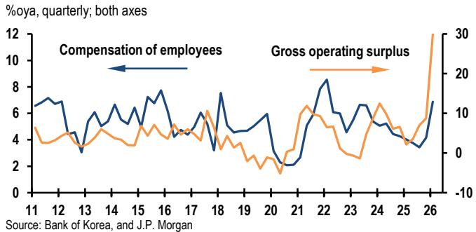

line chart

| Year | Compensation of employees (%oya, quarterly; both axes) | Gross operating surplus (%oya, quarterly; both axes) |
|------|--------------------------------------------------------|-----------------------------------------------------|
| 11   | ~7                                                     | ~4                                                  |
| 12   | ~6                                                     | ~5                                                  |
| 13   | ~4                                                     | ~3                                                  |
| 14   | ~6                                                     | ~4                                                  |
| 15   | ~7                                                     | ~5                                                  |
| 16   | ~8                                                     | ~4                                                  |
| 17   | ~5                                                     | ~6                                                  |
| 18   | ~7                                                     | ~4                                                  |
| 19   | ~5                                                     | ~2                                                  |
| 20   | ~3                                                     | ~-1                                                 |
| 21   | ~6                                                     | ~10                                                 |
| 22   | ~8                                                     | ~15                                                 |
| 23   | ~6                                                     | ~5                                                  |
| 24   | ~5                                                     | ~10                                                 |
| 25   | ~4                                                     | ~5                                                  |
| 26   | ~7                                                     | ~30                                                 |

Crucially, the income distribution suggests that the terms-of-trade gains are likely to translate into spending through profits and capex more than through wage-led consumption. The surge in income was concentrated in gross operating surplus rather than employee compensation (Figure 1), implying stronger corporate capacity to invest, while households saw only modest changes in net saving behavior. Putting these pieces together, we raise our quarterly growth profile as well: 2Q growth is revised up to 2.0% q/q saar from 1.0%, and the second-half pace is upgraded on the view that the confirmed income and terms-of-trade tailwinds should continue to support exports, investment, and spillovers into consumption—even as the oil-shock drag in 2Q appears modest so far.

## Early June exports remain strong

High-frequency customs data points to continued strength in the external sector, with 10-day exports up 85.9% oya and full-month growth estimated at 56.5% oya after adjusting for working days. Seasonally adjusted, early June exports rose 12.5% m/m, extending an eight-month streak of gains—the longest since the mid-1990s. This underscores the ongoing tech-driven upcycle, despite inherent volatility in high-frequency data. Imports also rose, with broad-based gains across energy and non-energy categories, and the customs trade surplus is on track to reach a new record in June. While sequential export growth may fade from recent highs, the annualized pace is expected to remain robust into 2Q, supporting our upgraded outlook for growth momentum.

## Employment fell for third month

May labor market data signaled continued softness, with employment declining by 0.3% m/m sa and the labor force also shrinking for a third consecutive month. The seasonally adjusted jobless rate held at 2.8%, but the underlying job trend growth has weakened. While fiscal support provided a partial buffer for consumer-facing services, non-services sectors—especially manufacturing and construction—remained under pressure, reflecting ongoing cost headwinds and supply disruptions. Manufacturing employment has repeatedly stalled and declined since February, and construction losses in May erased earlier gains. Although the tech-driven terms-of-trade windfall is expected to gradually benefit workers over time, the near-term outlook for overall employment recovery faces a downside risk in the absence of a more supportive geopolitical backdrop.

## Data releases and forecasts

Week of June 15-19

<table><tr><td>Tue</td><td colspan="5">Import and export prices</td></tr><tr><td>Jun 16</td><td colspan="5">%oya, in local currency terms</td></tr><tr><td>6am</td><td></td><td>Feb</td><td>Mar</td><td>Apr</td><td>May</td></tr><tr><td></td><td>Export prices</td><td>11.1</td><td>29.5</td><td>40.8</td><td>46.5</td></tr><tr><td></td><td>Import prices</td><td>1.6</td><td>20.4</td><td>20.2</td><td>22.5</td></tr></table>

Dubai oil prices lingering above \$100 in May are likely to be inflationary for import prices, but the monthly increase may be more moderate than the volatility seen in March-April. Meanwhile, the trade-weighted KRW depreciated slightly further last month.

<table><tr><td>Tue</td><td>Monetary aggregates</td><td></td><td></td><td></td><td></td></tr><tr><td>Jun 16</td><td>%oya, monthly average</td><td></td><td></td><td></td><td></td></tr><tr><td>12pm</td><td></td><td>Jan</td><td>Feb</td><td>Mar</td><td>Apr</td></tr><tr><td></td><td>M2</td><td>4.7</td><td>4.9</td><td>5.6</td><td>5.6</td></tr><tr><td></td><td>Lf</td><td>6.6</td><td>7.1</td><td>7.5</td><td>7.8</td></tr><tr><td>Fri</td><td>Producer prices</td><td></td><td></td><td></td><td></td></tr><tr><td>Jun 19</td><td>% change</td><td></td><td></td><td></td><td></td></tr><tr><td>6am</td><td></td><td>Feb</td><td>Mar</td><td>Apr</td><td>May</td></tr><tr><td></td><td>%oya</td><td>2.5</td><td>4.1</td><td>6.9</td><td>6.9</td></tr></table>

With the government's energy wholesale price cap unchanged since late March, the monthly change in the energy PPI is likely to be softer than April's spike. On the flip side, recent spillover to energy-exposed core components observed in CPI prints poses an upside risk to our expectations, with manufacturing PMI price indices remaining elevated in May.

<table><tr><td>Fri</td><td colspan="5">Stage of processing price index</td></tr><tr><td>Jun 19</td><td>% change</td><td></td><td></td><td></td><td></td></tr><tr><td>6am</td><td></td><td>Feb</td><td>Mar</td><td>Apr</td><td>May</td></tr><tr><td></td><td>%oya</td><td>1.4</td><td>3.8</td><td>9.9</td><td>11.3</td></tr></table>

Review of past week's data

<table><tr><td colspan="7">Real GDP 2nd estimate (Jun 9)</td></tr><tr><td rowspan="2"></td><td colspan="4">% change</td><td colspan="2">2nd</td></tr><tr><td></td><td>3Q25</td><td colspan="2">4Q25</td><td colspan="2">1Q26</td></tr><tr><td>%q/q, sa</td><td>4.3</td><td>1.4</td><td>-0.2</td><td>-0.1</td><td>1.7</td><td>1.8</td></tr><tr><td>%q/q, saar</td><td>5.4</td><td></td><td>-0.6</td><td></td><td>6.9</td><td>7.5</td></tr><tr><td>%oya</td><td>4.8</td><td>2.1</td><td>1.6</td><td></td><td>3.6</td><td>3.8</td></tr></table>

See main text.

Unemployment rate (Jun 11)

<table><tr><td colspan="5">% of labor force</td></tr><tr><td></td><td>Mar</td><td>Apr</td><td>May</td><td></td></tr><tr><td>Seasonally adjusted</td><td>2.7</td><td>2.8</td><td>2.7</td><td>2.8</td></tr><tr><td>Not seasonally adjusted</td><td>3.0</td><td>2.9</td><td>2.6</td><td>2.9</td></tr></table>

See main text.

Sources: BoK, NSO, and JPM forecasts.

## ASEAN

- BI surprised with an off-cycle 25bp hike, which was accompanied by FX defense measures  
- We expect BI to hike again by 25bp next week to 5.75% given the still-elevated FX pressures  
- We expect the BSP to hike by a more decisive 50bp to 5.00% to address rising inflation expectations

BI surprised with an off-cycle 25bp hike this week after the USD/IDR surged to a new record high of $\sim 18,200$ . The BI also announced a package of measures to complement the hike in addressing rising FX risks. We still expect the BI to hike again next week, by another 25bp, amid still-elevated FX pressure. We also maintain our forecast for the BSP to deliver a 50bp hike next week, given rising inflation expectations, but acknowledge a risk of a 25bp hike, arising from the easing inflation pressures from the latest CPI release.

## Indonesia: An off-cycle 25bp hike

BI delivered an unexpected off-cycle 25bp policy rate hike to 5.50%, in response to rising FX concerns. This was reflected by our BI-FX Pressure Index (BI-FXPI) rising further to 2.5 the day before the meeting, suggesting an extreme level of FX stress (Figure 1). The hike was complemented by higher SRBI yields, a 10% reduction in hedging swap costs, the reopening of the repo window and stepped-up FX intervention.

The package aims to attract portfolio inflows while limiting the impact of policy tightening on domestic liquidity. The measures came after the joint statement between BI and MOF over the weekend to boost the attractiveness of local asset yields to attract foreign portfolio inflows and support the IDR, without providing the details.

Figure 1: Indonesia - BI-FXPI versus change in policy rate  
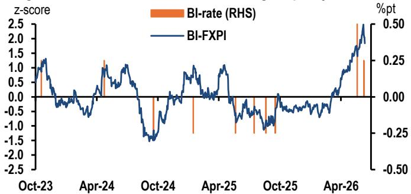

line chart

| Date   | z-score | %pt  |
|--------|---------|------|
| Oct-23 | 1.5     | 0.00 |
| Apr-24 | 1.0     | 0.00 |
| Oct-24 | -1.5    | -0.25|
| Apr-25 | 1.0     | 0.00 |
| Oct-25 | -1.0    | -0.25|
| Apr-26 | 2.5     | 0.50 |

Source: Bloomberg Finance L.P., JPM

## BI preview: Another 25bp hike

Given the still-elevated FX pressure, we still expect BI to hike again by another 25bp next week to 5.75%, before another 25bp hike in July to 6.00%. The elevated FX pressure is in part caused by gross FX reserves falling further to USD144.9bn in May from USD146.2bn in April (Figure 2). Assuming short-term FX liabilities and net forward positions remained unchanged, this implies that net FX reserves also fell further to USD84.5bn from USD85.8bn.

USD/IDR remained around 18,000 after the off-cycle hike, still significantly weaker than BI's 2026 forecast range of 16,200-16,800 and its 2027 forecast range of 16,800-17,500. This suggests that the BI may need to hike again to re-anchor rupiah expectations and attract durable portfolio inflows. The pickup in headline and core CPI inflation in May also suggests there is scope for further tightening.

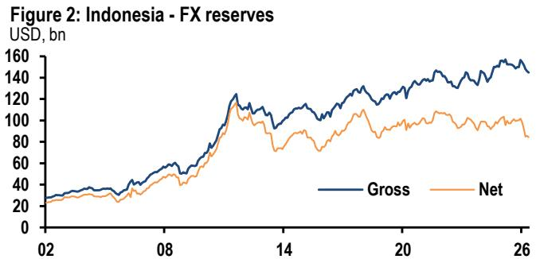

line chart

| Year | Gross (USD bn) | Net (USD bn) |
|------|----------------|--------------|
| 02   | ~25            | ~20          |
| 08   | ~60            | ~45          |
| 14   | ~110           | ~90          |
| 20   | ~140           | ~105         |
| 26   | ~150           | ~95          |

Source: CEIC, JPM. We estimate net FX reserves by subtracting short-term foreign currency liabilities and forward position from gross FX reserves

## BSP preview: We expect a 50bp hike

Despite the softer headline CPI print in May, we expect the BSP to deliver a 50bp rate hike next week to 5.00%, as a preemptive measure to anchor rising inflation expectations and contain second-round effects. Our projections still show a rising headline inflation trajectory (peaking at 8.5% oya in November), with broadening price pressures across the CPI basket, according to our CPI diffusion index (Figure 3). The risk is skewed towards a 25bp hike should the BSP decide to adopt a more measured and data-dependent approach to the tightening cycle. We maintain our forecast for the BSP to hike the policy rate to 6.00% by end-2026, pencilling in a further 100bp of hikes after the 50bp response next week.

Figure 3: Philippines headline CPI vs. diffusion index $^{1}$  
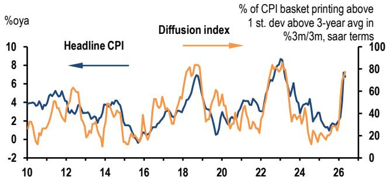

line chart

| Year | Headline CPI | Diffusion index |
|------|--------------|-----------------|
| 10   | ~4           | ~20             |
| 12   | ~5           | ~40             |
| 14   | ~4           | ~20             |
| 16   | ~2           | ~40             |
| 18   | ~7           | ~80             |
| 20   | ~3           | ~40             |
| 22   | ~8           | ~90             |
| 24   | ~5           | ~60             |
| 26   | ~7           | ~80             |

Source: CEIC, JPM estimates 1. Simple average

## Indonesia

## Data releases and forecasts

Week of Jun 15-19

<table><tr><td>Thu</td><td colspan="5">BI monetary policy meeting</td></tr><tr><td>18-Jun</td><td>% pa</td><td></td><td></td><td></td><td></td></tr><tr><td></td><td></td><td>Apr</td><td>May</td><td>Jun (offcycle)</td><td>Jun</td></tr><tr><td></td><td>BI rate</td><td>4.75</td><td>5.25</td><td>5.50</td><td>5.75</td></tr></table>

## Malaysia

## Data releases and forecasts

Week of Jun 15-19

<table><tr><td>Fri</td><td colspan="5">Consumer prices</td></tr><tr><td>19-Jun</td><td>% change</td><td></td><td></td><td></td><td></td></tr><tr><td>12:00pm</td><td></td><td>Feb</td><td>Mar</td><td>Apr</td><td>May</td></tr><tr><td></td><td>Total, %oya</td><td>1.5</td><td>1.7</td><td>1.9</td><td>2.1</td></tr><tr><td></td><td>%m/m, sa</td><td>0.1</td><td>0.4</td><td>0.5</td><td>0.1</td></tr><tr><td>Fri</td><td colspan="5">Merchandise trade</td></tr><tr><td>19-Sep</td><td>US$ bn, nsa</td><td></td><td></td><td></td><td></td></tr><tr><td>12:00pm</td><td></td><td>Feb</td><td>Mar</td><td>Apr</td><td>May</td></tr><tr><td></td><td>Trade balance</td><td>4.3</td><td>6.2</td><td>7.2</td><td>5.1</td></tr><tr><td></td><td>Exports</td><td>33.5</td><td>37.7</td><td>46.0</td><td>46.6</td></tr><tr><td></td><td>%oya</td><td>25.8</td><td>21.6</td><td>51.9</td><td>57.0</td></tr><tr><td></td><td>Imports</td><td>29.2</td><td>31.5</td><td>38.7</td><td>41.5</td></tr><tr><td></td><td>%oya</td><td>22.8</td><td>24.0</td><td>33.1</td><td>40.6</td></tr></table>

## Review of past week's data

No data released.

## Philippines

## Data releases and forecasts

Week of Jun 15-19

<table><tr><td>Thu</td><td colspan="5">BSP monetary policy meeting</td></tr><tr><td>18-Jun</td><td>% pa</td><td></td><td></td><td></td><td></td></tr><tr><td></td><td></td><td>Dec</td><td>Feb</td><td>Apr</td><td>Jun</td></tr><tr><td></td><td>Reverse repo rate</td><td>4.50</td><td>4.25</td><td>4.50</td><td>5.0</td></tr></table>

## Review of past week's data

No data released.

## Singapore

## Data releases and forecasts

Week of Jun 15-19

<table><tr><td>Wed</td><td colspan="5">Merchandise trade</td></tr><tr><td>17-Jun</td><td>US$ bn, nsa</td><td></td><td></td><td></td><td></td></tr><tr><td>8:30am</td><td></td><td>Feb</td><td>Mar</td><td>Apr</td><td>May</td></tr><tr><td></td><td>Trade balance</td><td>4.6</td><td>7.7</td><td>10.8</td><td>9.0</td></tr><tr><td></td><td>Exports</td><td>47.3</td><td>64.3</td><td>70.3</td><td>70.0</td></tr><tr><td></td><td>NODX</td><td>11.5</td><td>13.2</td><td>15.2</td><td>14.1</td></tr><tr><td></td><td>%m/m, sa, US$ terms</td><td>5.0</td><td>1.9</td><td>11.3</td><td>-1.8</td></tr><tr><td></td><td>%oya, US$ terms</td><td>10.6</td><td>20.3</td><td>29.1</td><td>34.1</td></tr></table>

## Review of past week's data

No data released.

## Thailand

## Data releases and forecasts

Week of Jun 15-19

No data releases.

## Review of past week's data

No data released.

Sources: Central Bureau of Statistics, Indonesia; Department of Statistics, Malaysia Coordination Board and National Statistics Office, Philippines, Singapore Statistics Department, Office for Industrial Economics, Thailand; Bank of Thailand; JPM forecasts

## India

- FY26 current account deficit benign at \$25 bn (0.5% of GDP)  
- Despite this, BoP is in deficit due to pressures on the capital account  
• Services exports growth remains strong, led by GCC  
• FY27 CAD expected at 2% of GDP

We have highlighted previously that India's BoP pressures so far have been driven by the capital account, with the current account remaining contained. FY26 BoP data underscored this dynamic: the current account deficit (CAD) came in at a benign $0.5\%$ of GDP, yet the overall BoP still printed a \$23bn deficit.

Furthermore, 1Q26 delivered a notable upside surprise on CAD. The current account moved into a \$7bn surplus (0.7% of GDP), versus expectations of a 0.3% of GDP deficit. As a result, the BoP also swung to a \$7bn surplus, a sharp recovery from a \$24bn deficit in 4Q25.

## 1Q26 CAB surprised to the upside

India’s 1Q26 current account balance (CAB) recorded a \$7bn surplus (0.7% of GDP), versus expectations of a 0.3% of GDP deficit and compared to a \$15.5bn deficit (1.5% of GDP) in 4Q25. Recall that, due to seasonality, the current account typically narrows sharply in 1Q.

The positive surprise in 1Q26 was driven by larger-than-expected private transfers (mainly remittances). Private transfers rose to a record \$41.5bn, up from \$35bn in 4Q25 growing at 28% oya in 1Q26, versus average growth of 12% over the prior three quarters. This jump could reflect the weaker INR and/or precautionary transfers by Indian workers in the Middle East. In the absence of a geographic breakdown of remittances, it is difficult to pin down the exact driver.

In the details: The goods trade deficit printed at \$83bn in 1Q26, narrowing from \$96bn in 4Q25, as non-oil, non-gold (NoNG) imports slowed to 9%oya in 1Q26 from 16% in 4Q25. The narrowing occurred despite non-oil exports softening to -1%oya in 1Q26 from 3% in 4Q25. In parallel, the surplus on invisibles increased to \$90bn in 1Q26 from \$80bn in the prior quarter (Table 1).

Table 1: CAD breakdown

<table><tr><td>($ billion, nsa)</td><td>Mar-25</td><td>Jun-25</td><td>Sep-25</td><td>Dec-25</td><td>Mar-26</td></tr><tr><td>Exports</td><td>116</td><td>113</td><td>109</td><td>111</td><td>113</td></tr><tr><td>Oil</td><td>14</td><td>18</td><td>13</td><td>12</td><td>12</td></tr><tr><td>Non-oil exports</td><td>102</td><td>95</td><td>96</td><td>100</td><td>101</td></tr><tr><td>Imports</td><td>176</td><td>182</td><td>198</td><td>207</td><td>197</td></tr><tr><td>Oil</td><td>44</td><td>49</td><td>43</td><td>43</td><td>39</td></tr><tr><td>Gold &amp; Silver</td><td>11</td><td>8</td><td>21</td><td>27</td><td>27</td></tr><tr><td>Non-oil non-gold</td><td>121</td><td>124</td><td>134</td><td>137</td><td>131</td></tr><tr><td>Invisibles</td><td>73</td><td>66</td><td>75</td><td>80</td><td>90</td></tr><tr><td>Services</td><td>53</td><td>48</td><td>51</td><td>57</td><td>60</td></tr><tr><td>Transfers</td><td>32</td><td>31</td><td>36</td><td>35</td><td>41</td></tr><tr><td>Net Investment Income</td><td>-12</td><td>-13</td><td>-12</td><td>-12</td><td>-11</td></tr><tr><td>Current Account Balance ($bn)</td><td>13.6</td><td>-2.9</td><td>-14.0</td><td>-15.5</td><td>7.0</td></tr><tr><td>% of GDP</td><td>1.4</td><td>-0.3</td><td>-1.5</td><td>-1.5</td><td>0.7</td></tr></table>

Source: RBI

On the capital account, 1Q26 recorded a net outflow of \$1bn, versus \$8bn in 4Q25, despite a surge in equity-driven portfolio outflows (\$12bn in 1Q26). The improvement was driven by higher net FDI and a sharp compression in other capital. Overall, India’s BoP recovered meaningfully to a \$7bn surplus in 1Q26, from a \$24bn deficit in 4Q25.

## FY26: BoP pressures capital-account led

As highlighted previously, India's BoP pressures since late 2024—unlike in past episodes—have been driven more by the capital account (especially FDI and FPI) than by the current account (Figure 1). In FY26 (year ending March 2026), the CAD was benign at \$25bn (0.6% of GDP), broadly in line with \~0.6% of GDP in FY25 and 0.7% of GDP in FY24.

Figure 1: FDI and FPI balance  
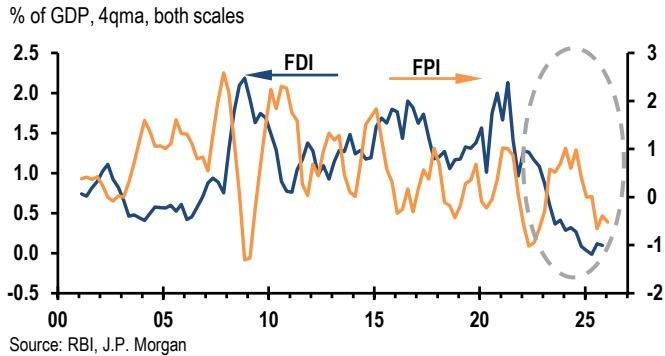

line chart

| Year | FDI (% of GDP) | FPI (% of GDP) |
|------|----------------|----------------|
| 00   | ~0.8           | ~0.9           |
| 05   | ~0.6           | ~1.5           |
| 10   | ~2.2           | ~2.0           |
| 15   | ~1.8           | ~1.7           |
| 20   | ~2.0           | ~1.3           |
| 25   | ~0.2           | ~-0.5          |

Despite the benign CAD, BoP was in a \$23bn deficit in FY26, widening from -\$5bn in FY25, reflecting capital-account pressures. Moreover, the RBI's actual intervention across spot and forward markets totaled \$71bn in FY26, materially larger than what the headline BoP deficit alone would imply.

## What kept the CAD contained in FY26?

The CAD remained contained despite a widening in the goods trade deficit (9% of GDP in FY26 vs 8.1% in FY25). The larger trade gap reflected:

• stronger gold and non-oil, non-gold (NONG) imports, with NONG imports growing 12.4% oya in FY26 vs. 4.3% in FY25;

- subdued non-oil exports, growing 3.8% oya in FY26 vs. 5.8% in FY25, reflecting (among other factors) the impact of U.S. tariffs; and  
- higher precious metals imports: gold and silver imports rose to \$84bn in FY26 from \$68bn in FY25 and \$51bn in FY24, reflecting higher gold prices.

Net oil imports were slightly lower in FY26 (\$113bn vs. \$123bn in FY25), though they are likely to rise in FY27 with elevated oil prices. Despite the higher goods deficit, the CAD stayed roughly flat because invisibles grew 19% oya in FY26, not far from 20.5% growth in FY25, driven by strong growth in net services exports (15%) and remittances (17%).

Table 2: India: Balance of Payments  
US\$ billion

<table><tr><td></td><td>FY22</td><td>FY23</td><td>FY24</td><td>FY25</td><td>FY26</td></tr><tr><td>Current a/c balance</td><td>-39</td><td>-67</td><td>-26</td><td>-23</td><td>-25</td></tr><tr><td>% of GDP</td><td>-1.2</td><td>-2.0</td><td>-0.7</td><td>-0.6</td><td>-0.6</td></tr><tr><td>Exports</td><td>430</td><td>456</td><td>441</td><td>442</td><td>446</td></tr><tr><td>Non-oil exports</td><td>362</td><td>357</td><td>357</td><td>378</td><td>393</td></tr><tr><td>Imports</td><td>619</td><td>721</td><td>686</td><td>729</td><td>783</td></tr><tr><td>Oil imports</td><td>162</td><td>209</td><td>181</td><td>186</td><td>166</td></tr><tr><td>Gold &amp; Silver</td><td>49</td><td>40</td><td>51</td><td>68</td><td>84</td></tr><tr><td>Non-oil-non-gold</td><td>408</td><td>472</td><td>455</td><td>474</td><td>533</td></tr><tr><td>Net Invisibles</td><td>151</td><td>198</td><td>219</td><td>264</td><td>313</td></tr><tr><td>services</td><td>108</td><td>143</td><td>163</td><td>189</td><td>217</td></tr><tr><td>transfers</td><td>80</td><td>101</td><td>106</td><td>123</td><td>144</td></tr><tr><td>investment income</td><td>-37</td><td>-46</td><td>-50</td><td>-48</td><td>-48</td></tr><tr><td>Capital a/c balance</td><td>86</td><td>58</td><td>90</td><td>18</td><td>2</td></tr><tr><td>Net FDI</td><td>39</td><td>28</td><td>10</td><td>1</td><td>3</td></tr><tr><td>Portfolio investment</td><td>-17</td><td>-5</td><td>44</td><td>4</td><td>-16</td></tr><tr><td>Loans</td><td>34</td><td>8</td><td>7</td><td>29</td><td>27</td></tr><tr><td>Banking capital</td><td>7</td><td>21</td><td>41</td><td>-10</td><td>6</td></tr><tr><td>Other capital</td><td>24</td><td>7</td><td>-12</td><td>-7</td><td>-22</td></tr><tr><td>E&amp;O</td><td>0</td><td>-1</td><td>0</td><td>2</td><td>0</td></tr><tr><td>Overall BOP</td><td>48</td><td>-9</td><td>64</td><td>-5</td><td>-23</td></tr></table>

Source: RBI

## Services exports remain resilient

Despite concerns about AI-led disruption, net services exports grew 15% oya in FY26, easing modestly from 16% in FY25. Within services exports:

- Software services (gross) grew 13% in FY26, up from 12% in FY25; and  
- GCC/business services exports grew 16% in FY26 vs. 21% in FY25 (Figure 2)

Figure 2: Gross service exports  
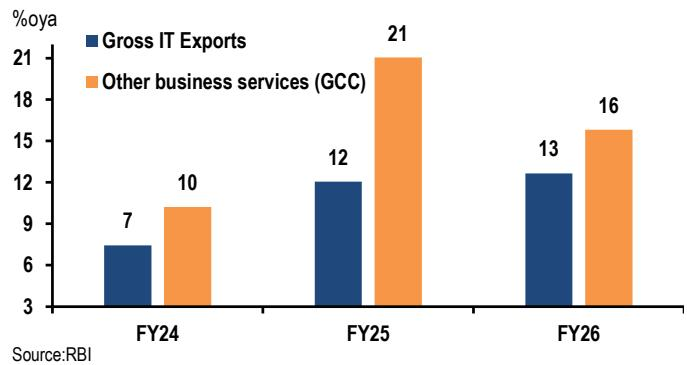

bar chart

| Year | Gross IT Exports (%) | Other business services (GCC) (%) |
| :--- | :--- | :--- |
| FY24 | 7 | 10 |
| FY25 | 12 | 21 |
| FY26 | 13 | 16 |
Source: RBI

## FY27 outlook: CAD expected to widen

Following this print, and assuming oil prices average \$95/bbl, we expect the FY27 CAD to be 2% of GDP.

## Data releases and forecasts

Week of June 15-19

<table><tr><td>Mon</td><td colspan="5">Trade balance</td></tr><tr><td>15-Jun</td><td>USD bn</td><td></td><td></td><td></td><td></td></tr><tr><td></td><td></td><td>Feb</td><td>Mar</td><td>Apr</td><td>May</td></tr><tr><td></td><td>Trade balance</td><td>-27.1</td><td>-20.7</td><td>-28.3</td><td>-27.5</td></tr></table>

We expect the trade deficit to print \~\$28bn, with an increase in oil imports offsetting a fall in NONG.

<table><tr><td>Mon</td><td>WPI</td></tr><tr><td>15-Jun</td><td>%oya</td></tr></table>

<table><tr><td>Feb</td><td>Mar</td><td>Apr</td><td>May</td></tr><tr><td>2.1</td><td>3.9</td><td>8.3</td><td>10.1</td></tr></table>

We expect WPI inflation in May to increase by 1.5%m/m, sa translating to a \~10.1%oya.

## Review of past week's data

Consumer prices (Jun 12)

<table><tr><td colspan="5">% oya</td></tr><tr><td></td><td>Feb</td><td>Mar</td><td>Apr</td><td>May</td></tr><tr><td>CPI</td><td>3</td><td>3.4</td><td>3.5</td><td>3.9</td></tr><tr><td>Core-Core</td><td>2.1</td><td>2.2</td><td>2.2</td><td>2.3</td></tr></table>

Headline inflation picked up from 3.5% to 3.9%, led by increases in vegetable prices as well as fuel price hikes in May.

Sources: MoSPI, RBI, JPM

Japan economic calendar

<table><tr><td>Monday</td><td>Tuesday</td><td>Wednesday</td><td>Thursday</td><td>Friday</td></tr><tr><td>15 JunTertiary sector activity index(1:30pm) AprBoJ Monetary Policy Meeting</td><td>16 JunBoJ Monetary Policy MeetingBoJ Governor Ueda&#x27;s press conference (3:30pm)</td><td>17 JunReuters Tankan(8:00am) JunMfg DI 3, Non-mfg DI 26Trade balance(8:50am) May -199 billion yenPrivate machinery orders(8:50am) Apr -2.0 %m/m, sa</td><td>18 JunReal exports and imports(2:00pm) MayReal exports 0.5%m/m, saReal imports 3.0%m/m, saAuction 1-year note</td><td>19 JunNationwide core CPI(8:30am) MayEx. fresh food 1.3 %oyaEx. fresh food and energy 1.8%oyaMinutes of Apr 27-28 BoJ Monetary Policy Meeting (8:50am)Auction 3-month bill</td></tr><tr><td colspan="5"></td></tr><tr><td>22 Jun</td><td>23 JunPMI manufacturing prelim(9:30am) JunPMI services prelim(9:30am) JunAuction 5-year note</td><td>24 JunCorporate service prices(8:50am) MaySummary of Opinions of Jun 15, 16 BoJ Monetary Policy Meeting(8:50am)</td><td>25 JunCoincident CI final(2:00pm) AprNationwide department store sales(2:30pm) MaySpeech by Board Member TAMURA at a meeting with local leaders in Hyogo (10:00am)Auction 20-year note</td><td>26 JunTokyo core CPI(8:30am) JunAuction 3-month bill</td></tr><tr><td>29 JunTotal retail sales(8:50am) May</td><td>30 JunJob offers to applicants ratio(8:30am) MayUnemployment rate(8:30am) MayIP prelim(8:50am) MayHousing starts(2:00pm) MayAuction 2-year note</td><td>1 JulBoJ Tankan(8:50am) 2QPMI manufacturing final(9:30am) JunConsumer sentiment(2:00pm) Jun</td><td>2 JulAuction 10-year note</td><td>3 JulPMI services final(9:30am) JunAuction 3-month bill</td></tr><tr><td>6 Jul</td><td>7 JulAll household spending(8:30am) MayEmployers&#x27; survey(8:30am) MayCoincident CI prelim(2:00pm) MayAuction 30-year note</td><td>8 JulBank lending(8:50am)JunCurrent account(8:50am) MayEconomy watchers survey(2:00pm) JunAuction 6-month bill</td><td>9 JulM2(8:50am) JunAuction 5-year note</td><td>10 JulCorporate goods prices(8:50am) JunAuction 3-month bill</td></tr></table>

Note: Times shown are local. Source: Private and public agencies and JPM. Further details available upon request.

Non-Japan Asia economic calendar

<table><tr><td>Monday</td><td>Tuesday</td><td>Wednesday</td><td>Thursday</td><td>Friday</td></tr><tr><td>15 JunIndiaWPI (12:00pm) May 10.1%oyaTrade balance May US$27.5bn</td><td>16 JunSouth KoreaExport price index (6:00am) May 46.5%oyaImport price index (6:00am) May 22.5%oyaMoney supply (12:00pm) Apr M2 5.6%oyaChinaIP (10:00am) May 4.9%oyaFAI (10:00am) May -1.1%oya, ytdRetail sales (10:00am) May 0.3%oyaAustraliaRBA official rate announcement no changeHong Kong SARUnemployment rate (4:30pm) May 3.7%, sa, 3mmaHoliday: Indonesia</td><td>17 JunNew ZealandCurrent account balance (10:45am) 1QSingaporeNODX (8:30am) May 34.1%oyaHoliday: Malaysia</td><td>18 JunNew ZealandGDP (10:45am) 1Q 0.8%q/q, saPhilippinesBSP monetary policy meeting 50bp hikeIndonesiaBI monetary policy meeting 25bp hikeTaiwanCBC monetary policy meeting no change</td><td>19 JunSouth KoreaPPI (6:00am) May 6.9%oyaNew ZealandTrade balance (10:45am) May MalaysiaCPI (12:00pm) May 2.1%oyaTrade balance (12:00pm) May US $5.1bnHoliday: China, Hong Kong SAR, Taiwan</td></tr><tr><td colspan="5">During the week: Thailand Trade balance May (21-26 Jun)</td></tr><tr><td>22 Jun</td><td>23 JunSouth KoreaConsumer survey (6:00am) JunSingaporeCPI (1:00pm) MayIndiaPMI mfg. prelim (10:30am) JunTaiwanExport orders (4:00pm) MayUnemployment rate (4:00pm) MayHong Kong SARCPI (4:30pm) May</td><td>24 JunThailandBOT monetary policy meetingTaiwanIP (4:00pm) May</td><td>25 JunAustraliaUnemployment rate (11:30am) MayHong Kong SARTrade balance (4:30pm) May</td><td>26 JunSingaporeIP (1:00pm) MayHoliday: India</td></tr><tr><td colspan="5">During the week: Thailand Mfg. Production May (27-29 Jun)</td></tr><tr><td>29 JunIndiaIP (4:00pm) May</td><td>30 JunSouth KoreaIP (8:00am) MayPhilippinesTrade balance (9:00am) May AustraliaPvt. sector credit (11:30am) MayChinaPMI mfg. (NBS) (9:30am) JunThailandPCI (2:30pm) MayPII (2:30pm) May</td><td>1 JulSouth KoreaTrade balance (9:00am) JunPMI mfg. (9:30am) JunTaiwanPMI mfg. (8:30am) JunChinaPMI Mfg. (9:45am) JunIndonesiaTrade balance (11:00am) May CPI (11:00am) JunIndiaPMI mfg. (10:30am) Holiday: Hong Kong SAR</td><td>2 JulNew ZealandBuilding permits (10:45am) JunSouth KoreaCPI (8:00am) JunAustraliaTrade balance (11:30am) MayHong Kong SARRetail sales (4:30pm) MaySingaporePMI (9:00pm) Jun</td><td>3 JulVietnamExports (9:05am) JunIndustrial output (9:05am) Jun CPI (9:05am) Jun</td></tr><tr><td>6 JulNew ZealandANZ commodity price (1:00pm) JunAustraliaANZ job advertisements (11:30am) JunThailandCPI (10:30am) Jun</td><td>7 JulPhilippinesCPI (9:00am) JunTaiwanCPI (4:00pm) JunChinaForeign Exchange Reserves Jun</td><td>8 JulSouth KoreaCurrent account balance (8:00am) JunNew ZealandRBNZ official rate announcement</td><td>9 JulChinaPPI (9:30am) JunCPI (9:30am) JunMalaysiaBNM monetary policy meeting TaiwanTrade balance (4:00pm) Jun</td><td>10 Jul</td></tr><tr><td colspan="5">During the week: China Money supply/TSF Jun (9-15 Jul) Singapore GDP flash 2Q (10-14 Jul)</td></tr></table>

Times shown are local. Source: Private and public agencies and JPM. Further details available upon request.

## Disclosures

Analyst Certification: The Research Analyst(s) denoted by an “AC” on the cover of this report certifies (or, where multiple Research Analysts are primarily responsible for this report, the Research Analyst denoted by an “AC” on the cover or within the document individually certifies, with respect to each security or issuer that the Research Analyst covers in this research) that: (1) all of the views expressed in this report accurately reflect the Research Analyst’s personal views about any and all of the subject securities or issuers; and (2) no part of any of the Research Analyst's compensation was, is, or will be directly or indirectly related to the specific recommendations or views expressed by the Research Analyst(s) in this report. For all Korea-based Research Analysts listed on the front cover, if applicable, they also certify, as per KOFIA requirements, that the Research Analyst’s analysis was made in good faith and that the views reflect the Research Analyst’s own opinion, without undue influence or intervention.

All authors named within this report are Research Analysts who produce independent research unless otherwise specified. In Europe, Sector Specialists (Sales and Trading) may be shown on this report as contacts but are not authors of the report or part of the Research Department.

Research excerpts: This material may include excerpts from previously published reports. For access to the full reports, including analyst certification and important disclosures, please contact your sales representative or the covering analyst's team, or visit https://www.JPMmarkets.com.

## Important Disclosures

Company-Specific Disclosures: Important disclosures, including price charts and credit opinion history tables (if applicable), are available for compendium reports and all JPM-covered companies, and certain non-covered companies, by visiting https://www.jpmm.com/research/disclosures, calling 1-800-477-0406, or e-mailing research.disclosure.inquiries@JPM.com with your request.

## History of Investment Recommendations:

A history of JPM investment recommendations disseminated during the preceding 12 months can be accessed on the Research & Commentary page of http://www.JPMmarkets.com where you can also search by analyst name, sector or financial instrument.

## Explanation of Emerging Markets Sovereign Research Ratings System and Valuation & Methodology:

Ratings System: JPM uses the following issuer portfolio weightings for Emerging Markets Sovereign Research: Overweight (over the next three months, the recommended risk position is expected to outperform the relevant index, sector, or benchmark credit returns); Marketweight (over the next three months, the recommended risk position is expected to perform in line with the relevant index, sector, or benchmark credit returns); and Underweight (over the next three months, the recommended risk position is expected to underperform the relevant index, sector, or benchmark credit returns). NR is Not Rated. In this case, JPM has removed the rating for this security because of either legal, regulatory or policy reasons or because of lack of a sufficient fundamental basis. The previous rating no longer should be relied upon. An NR designation is not a recommendation or a rating. NC is Not Covered. An NC designation is not a rating or a recommendation. Recommendations will be at the issuer level, and an issuer recommendation applies to all of the index-eligible bonds at the same level for the issuer. When we change the issuer-level rating, we are changing the rating for all of the issues covered, unless otherwise specified. Ratings for quasi-sovereign issuers in the EMBIG may differ from the ratings provided in EM corporate coverage.

Valuation & Methodology: For JPM's Emerging Markets Sovereign Research, we assign a rating to each sovereign issuer (Overweight, Marketweight or Underweight) based on our view of whether the combination of the issuer's fundamentals, market technicals, and the relative value of its securities will cause it to outperform, perform in line with, or underperform the credit returns of the EMBIGD index over the next three months. Our view of an issuer's fundamentals includes our opinion of whether the issuer is becoming more or less able to service its debt obligations when they become due and payable, as well as whether its willingness to service debt obligations is increasing or decreasing.

JPM Emerging Markets Sovereign Research Ratings Distribution, as of April 4, 2026

<table><tr><td></td><td>Overweight (buy)</td><td>Marketweight (hold)</td><td>Underweight (sell)</td></tr><tr><td>Emerging Markets Sovereign Research Universe*</td><td>6%</td><td>84%</td><td>10%</td></tr><tr><td>IB clients**</td><td>100%</td><td>86%</td><td>100%</td></tr></table>

\*Please note that the percentages may not add to 100% because of rounding.  
\*\*Percentage of subject issuers within each of the "Overweight, "Marketweight" and "Underweight" categories for which JPM has provided investment banking services within the previous 12 months.  
For purposes of FINRA ratings distribution rules only, our Overweight rating falls into a buy rating category; our Marketweight rating falls into a hold rating category; and our Underweight rating falls into a sell rating category. The Emerging Markets Sovereign Research Rating Distribution is at the issuer level. Issuers with an NR or an NC designation are not included in the table above. This information is current as of the end of the most recent calendar quarter.

Analysts' Compensation: The research analysts responsible for the preparation of this report receive compensation based upon various factors,

including the quality and accuracy of research, client feedback, competitive factors, and overall firm revenues.

Registration of non-US Analysts: Unless otherwise noted, the non-US analysts listed on the front of this report are employees of non-US affiliates of JPM Securities LLC, may not be registered as research analysts under FINRA rules, may not be associated persons of JPM Securities LLC, and may not be subject to FINRA Rule 2241 or 2242 restrictions on communications with covered companies, public appearances, and trading securities held by a research analyst account.

## Other Disclosures

JPM is a marketing name for investment banking businesses of JPM Chase & Co. and its subsidiaries and affiliates worldwide.

UK MIFID FICC research unbundling exemption: UK clients should refer to UK MIFID Research Unbundling exemption for details of JPM's implementation of the FICC research exemption and guidance on relevant FICC research categorisation.

Any long form nomenclature for references to China; Hong Kong; Taiwan; and Macau within this research material are Mainland China; Hong Kong SAR (China); Taiwan (China); and Macau SAR (China).

JPM may, from time to time, write on issuers or securities targeted by economic or financial sanctions imposed or administered by the governmental authorities of the U.S., EU, UK or other relevant jurisdictions (Sanctioned Securities). Nothing in this report is intended to be read or construed as encouraging, facilitating, promoting or otherwise approving investment or dealing in such Sanctioned Securities. Clients should be aware of their own legal and compliance obligations when making investment decisions.

Any digital or crypto assets discussed in this research report are subject to a rapidly changing regulatory landscape. For relevant regulatory advisories on crypto assets, including bitcoin and ether, please see https://www.JPM.com/disclosures/cryptoasset-disclosure.

The author(s) of this research report may not be licensed to carry on regulated activities in your jurisdiction and, if not licensed, do not hold themselves out as being able to do so.

Exchange-Traded Funds (ETFs): JPM Securities LLC (“JPMS”) acts as authorized participant for substantially all U.S.-listed ETFs. To the extent that any ETFs are mentioned in this report, JPMS may earn commissions and transaction-based compensation in connection with the distribution of those ETF shares and may earn fees for performing other trade-related services, such as securities lending to short sellers of the ETF shares. JPMS may also perform services for the ETFs themselves, including acting as a broker or dealer to the ETFs. In addition, affiliates of JPMS may perform services for the ETFs, including trust, custodial, administration, lending, index calculation and/or maintenance and other services.

Options and Futures related research: If the information contained herein regards options- or futures-related research, such information is available only to persons who have received the proper options or futures risk disclosure documents. Please contact your JPM Representative or visit https://www.theocc.com/components/docs/riskstoc.pdf for a copy of the Option Clearing Corporation's Characteristics and Risks of Standardized Options or https://www.finra.org/sites/default/files/2020-08/Security\_Futures\_Risk\_Disclosure\_Statement\_2020.pdf for a copy of the Security Futures Risk Disclosure Statement.

Changes to Interbank Offered Rates (IBORs) and other benchmark rates: Certain interest rate benchmarks are, or may in the future become, subject to ongoing international, national and other regulatory guidance, reform and proposals for reform. For more information, please consult: https://www.JPM.com/global/disclosures/interbank\_offered\_rates

Private Bank Clients: Where you are receiving research as a client of the private banking businesses offered by JPM Chase & Co. and its subsidiaries (“JPM Private Bank”), research is provided to you by JPM Private Bank and not by any other division of JPM, including, but not limited to, the JPM Corporate and Investment Bank and its Global Research division.

Legal entity responsible for the production and distribution of research: The legal entity identified below the name of the Reg AC Research Analyst who authored this material is the legal entity responsible for the production of this research. Where multiple Reg AC Research Analysts authored this material with different legal entities identified below their names, these legal entities are jointly responsible for the production of this research. Where more than one legal entity is listed under an analyst's name, the first legal entity is responsible for the production unless stated otherwise. Research Analysts from various JPM affiliates may have contributed to the production of this material but may not be licensed to carry out regulated activities in your jurisdiction (and do not hold themselves out as being able to do so). Unless otherwise stated below in the legal entity disclosures, this material has been distributed by the legal entity responsible for production, or where more than one legal entity is listed under the analyst's name, the first legal entity will be responsible for distribution. If you have any queries, please contact the relevant Research Analyst in your jurisdiction or the entity in your jurisdiction that has distributed this research material.

Legal Entities Disclosures and Country-/Region-Specific Disclosures:

Argentina: JPM Chase Bank N.A Sucursal Buenos Aires is regulated by Banco Central de la República Argentina (“BCRA”- Central Bank of Argentina) and Comisión Nacional de Valores (“CNV”- Argentinian Securities Commission - ALYC y AN Integral N°51).

Australia: JPM Securities Australia Limited (“JPMSAL”) (ABN 61 003 245 234/AFS Licence No: 238066) is regulated by the Australian Securities and Investments Commission and is a Market Participant of ASX Limited, a Clearing and Settlement Participant of ASX

Clear Pty Limited and a Clearing Participant of ASX Clear (Futures) Pty Limited. This material is issued and distributed in Australia by or on behalf of JPMSAL only to "wholesale clients" (as defined in section 761G of the Corporations Act 2001). A list of all financial products covered can be found by visiting https://www.jpmm.com/research/disclosures. JPM seeks to cover companies of relevance to the domestic and international investor base across all Global Industry Classification Standard (GICS) sectors, as well as across a range of market capitalisation sizes. If applicable, in the course of conducting public side due diligence on the subject company(ies), the Research Analyst team may at times perform such diligence through corporate engagements such as site visits, discussions with company representatives, management presentations, etc. Research issued by JPMSAL has been prepared in accordance with JPM Australia's Research Independence Policy which can be found at the following link: JPM Australia - Research Independence Policy.

Brazil: Banco JPM S.A. is regulated by the Comissao de Valores Mobiliarios (CVM) and by the Central Bank of Brazil. Ombudsman JPM: 0800-7700847 / 0800-7700810 (For Hearing Impaired) / ouvidoria.jp.morgan@jpmchase.com.

Canada: JPM Securities Canada Inc. is a registered investment dealer, regulated by the Canadian Investment Regulatory Organization and the Ontario Securities Commission and is the participating member on Canadian exchanges. This material is distributed in Canada by or on behalf of JPM Securities Canada Inc.

Chile: Inversiones JPM Limitada is an unregulated entity incorporated in Chile.

China: JPM Securities (China) Company Limited has been approved by CSRC to conduct the securities investment consultancy business.

Colombia: Banco JPM Colombia S.A. is supervised by the Superintendencia Financiera de Colombia (SFC). Any reference in this material to products or services offered abroad by entities other than the Bank in Colombia is included exclusively for descriptive purposes. Such references do not constitute, and should not be construed as, promotional activity or the provision of financial products or services within Colombian territory, as defined under applicable Colombian regulation.

Dubai International Financial Centre (DIFC): JPM Chase Bank, N.A., Dubai Branch is regulated by the Dubai Financial Services Authority (DFSA) and its registered address is Dubai International Financial Centre - The Gate, West Wing, Level 3 and 9 PO Box 506551, Dubai, UAE. This material has been distributed by JPM Chase Bank, N.A., Dubai Branch to persons regarded as professional clients or market counterparties as defined under the DFSA rules.

European Economic Area (EEA): Unless specified to the contrary, research is distributed in the EEA by JPM SE (“JPM SE”), which is authorised as a credit institution by the Federal Financial Supervisory Authority (Bundesanstalt für Finanzdienstleistungsaufsicht, BaFin) and jointly supervised by the BaFin, the German Central Bank (Deutsche Bundesbank) and the European Central Bank (ECB). JPM SE is a company headquartered in Frankfurt with registered address at TaunusTurm, Taunustor 1, Frankfurt am Main, 60310, Germany. The material has been distributed in the EEA to persons regarded as professional investors (or equivalent) pursuant to Art. 4 para. 1 no. 10 and Annex II of MiFID II and its respective implementation in their home jurisdictions (“EEA professional investors”). This material must not be acted on or relied on by persons who are not EEA professional investors. Any investment or investment activity to which this material relates is only available to EEA relevant persons and will be engaged in only with EEA relevant persons.

Hong Kong: JPM Securities (Asia Pacific) Limited (CE number AAJ321) is regulated by the Hong Kong Monetary Authority and the Securities and Futures Commission in Hong Kong, and JPM Broking (Hong Kong) Limited (CE number AAB027) is regulated by the Securities and Futures Commission in Hong Kong. JPM Chase Bank, N.A., Hong Kong Branch (CE Number AAL996) is regulated by the Hong Kong Monetary Authority and the Securities and Futures Commission, is organized under the laws of the United States with limited liability. Where the distribution of this material is a regulated activity in Hong Kong, the material is distributed in Hong Kong by or through JPM Securities (Asia Pacific) Limited and/or JPM Broking (Hong Kong) Limited.

India: JPM India Private Limited (Corporate Identity Number - U67120MH1992FTC068724), having its registered office at JPM Tower, Off. C.S.T. Road, Kalina, Santacruz - East, Mumbai – 400098, is registered with the Securities and Exchange Board of India (SEBI) as a 'Research Analyst' having registration number INH000001873. JPM India Private Limited is also registered with SEBI as a member of the National Stock Exchange of India Limited and the Bombay Stock Exchange Limited (SEBI Registration Number – INZ000239730) and as a Merchant Banker (SEBI Registration Number - MB/INM000002970). Telephone: 91-22-6157 3000, Facsimile: 91-22-6157 3990 and Website: http://www.jpmipl.com. JPM Chase Bank, N.A. - Mumbai Branch is licensed by the Reserve Bank of India (RBI) (Licence No. 53/Licence No. BY.4/94; SEBI - IN/CUS/014/ CDSL : IN-DP-CDSL-444-2008/ IN-DP-NSDL-285-2008/ INBI00000984/ INE231311239) as a Scheduled Commercial Bank in India, which is its primary license allowing it to carry on Banking business in India and other activities, which a Bank branch in India are permitted to undertake. For non-local research material, this material is not distributed in India by JPM India Private Limited. Compliance Officer: Ashutosh Sharma; ashutosh.j.sharma@jpmchase.com; +912261575002. Grievance Officer: Ramprasadh K, jpmipl.research.feedback@JPM.com; +912261573000. Registration granted by SEBI and certification from NISM in no way guarantee performance of the intermediary or provide any assurance of returns to investors. Please visit Terms and Conditions and Most Important Terms and Conditions (MITC). The annual Compliance audit report is available at http://www.jpmipl.com/#research.

Indonesia: PT JPM Sekuritas Indonesia is a member of the Indonesia Stock Exchange and is registered and supervised by the Otoritas Jasa Keuangan (OJK).

Korea: JPM Securities (Far East) Limited, Seoul Branch, is a member of the Korea Exchange (KRX). JPM Chase Bank, N.A., Seoul Branch, is licensed as a branch office of foreign bank (JPM Chase Bank, N.A.) in Korea. Both entities are regulated by the Financial

Services Commission (FSC) and the Financial Supervisory Service (FSS). For non-macro research material, the material is distributed in Korea by or through JPM Securities (Far East) Limited, Seoul Branch.

Japan: JPM Securities Japan Co., Ltd. and JPM Chase Bank, N.A., Tokyo Branch are regulated by the Financial Services Agency in Japan.

Malaysia: This material is issued and distributed in Malaysia by JPM Securities (Malaysia) Sdn Bhd (18146-X), which is a Participating Organization of Bursa Malaysia Berhad and holds a Capital Markets Services License issued by the Securities Commission in Malaysia.

Mexico: JPM Casa de Bolsa, S.A. de C.V., JPM Grupo Financiero is member of the Mexican Stock Exchange (“Bolsa Mexicana de Valores”) and the Institutional Stock Exchange (“Bolsa Institucional de Valores”), and it is authorized to act as a broker dealer by the National Banking and Securities Exchange Commission (“Comisión Nacional Bancaria y de Valores”).

New Zealand: This material is issued and distributed by JPMSAL in New Zealand only to "wholesale clients" (as defined in the Financial Markets Conduct Act 2013). JPMSAL is registered as a Financial Service Provider under the Financial Service providers (Registration and Dispute Resolution) Act of 2008.

Philippines: JPM Securities Philippines Inc. is a Trading Participant of the Philippine Stock Exchange and a member of the Securities Clearing Corporation of the Philippines and the Securities Investor Protection Fund. It is regulated by the Securities and Exchange Commission.

Singapore: This material is issued and distributed in Singapore by or through JPM Securities Singapore Private Limited (JPMSS) [MDDI (P) 057/08/2025 and Co. Reg. No.: 199405335R], which is a member of the Singapore Exchange Securities Trading Limited, and/or JPM Chase Bank, N.A., Singapore branch (JPMCB Singapore), both of which are regulated by the Monetary Authority of Singapore. This material is issued and distributed in Singapore only to accredited investors, expert investors and institutional investors, as defined in Section 4A of the Securities and Futures Act, Cap. 289 (SFA). This material is not intended to be issued or distributed to any retail investors or any other investors that do not fall into the classes of “accredited investors,” “expert investors” or “institutional investors,” as defined under Section 4A of the SFA. Recipients of this material in Singapore are to contact JPMSS or JPMCB Singapore in respect of any matters arising from, or in connection with, the material.

South Africa: JPM Equities South Africa Proprietary Limited and JPM Chase Bank, N.A., Johannesburg Branch are members of the Johannesburg Securities Exchange and are regulated by the Financial Services Conduct Authority (FSCA).

Taiwan: JPM Securities (Taiwan) Limited is a participant of the Taiwan Stock Exchange (company-type) and regulated by the Taiwan Securities and Futures Bureau. Material relating to equity securities is issued and distributed in Taiwan by JPM Securities (Taiwan) Limited, subject to the license scope and the applicable laws and the regulations in Taiwan. To the extent that JPM Securities (Taiwan) Limited produces research materials on securities not listed on the Taiwan Stock Exchange or Taipei Exchange (“Non-Taiwan Listed Securities”), these materials shall not constitute securities recommendations for the purpose of applicable Taiwan regulations, and, for the avoidance of doubt, JPM Securities (Taiwan) Limited does not act as broker for Non-Taiwan Listed Securities. According to Paragraph 2, Article 7-1 of Operational Regulations Governing Securities Firms Recommending Trades in Securities to Customers (as amended or supplemented) and/or other applicable laws or regulations, please note that the recipient of this material is not permitted to engage in any activities in connection with the material that may give rise to conflicts of interests, unless otherwise disclosed in the “Important Disclosures” in this material.

Thailand: This material is issued and distributed in Thailand by JPM Securities (Thailand) Ltd., which is a member of the Stock Exchange of Thailand and is regulated by the Ministry of Finance and the Securities and Exchange Commission. The registered address is 548 One City Center Building, 50th Floor, Ploenchit Road, Lymphini, Pathum Wan, Bangkok 10330.

UK: Research is produced in the UK by JPM Securities plc (“JPMS plc”) which is a member of the London Stock Exchange and is authorised by the Prudential Regulation Authority and regulated by the Financial Conduct Authority and the Prudential Regulation Authority or JPM Markets Limited (“JPMML Ltd”) which is authorised and regulated by the Financial Conduct Authority. Unless specified to the contrary, this material is distributed in the UK by JPMS plc and is directed in the UK only to: (a) persons having professional experience in matters relating to investments falling within article 19(5) of the Financial Services and Markets Act 2000 (Financial Promotion) (Order) 2005 (“the FPO”); (b) persons outlined in article 49 of the FPO (high net worth companies, unincorporated associations or partnerships, the trustees of high value trusts, etc.); or (c) any persons to whom this communication may otherwise lawfully be made; all such persons being referred to as "UK relevant persons". This material must not be acted on or relied on by persons who are not UK relevant persons. Any investment or investment activity to which this material relates is only available to UK relevant persons and will be engaged in only with UK relevant persons. A description of JPM EMEA’s policy for prevention and avoidance of conflicts of interest related to the production of Research can be found at the following link: JPM EMEA - Research Independence Policy.

U.S.: JPM Securities LLC (“JPMS”) is a member of the NYSE, FINRA, SIPC, and the NFA. JPM Chase Bank, N.A. is a member of the FDIC. Material published by non-U.S. affiliates is distributed in the U.S. by JPMS who accepts responsibility for its content.

General: Additional information is available upon request. The information in this material has been obtained from sources believed to be reliable. While all reasonable care has been taken to ensure that the facts stated in this material are accurate and that the forecasts, opinions and expectations contained herein are fair and reasonable, JPM Chase & Co. or its affiliates and/or subsidiaries (collectively JPM) make no representations or warranties whatsoever to the completeness or accuracy of the material provided, except with respect to any disclosures relative to JPM and the Research Analyst's involvement with the issuer that is the subject of the material. Accordingly, no reliance should be placed on the accuracy, fairness or completeness of the information contained in this material. There may be certain discrepancies with data and/or limited content in this material as a result of calculations, adjustments, translations to different languages, and/or local regulatory restrictions, as applicable. These discrepancies should not impact the overall investment analysis, views and/or recommendations of the subject company(ies) that may be discussed in the material. Artificial intelligence tools may have been used in the preparation of this material, including assisting in data analysis, pattern recognition, and content drafting for research material. JPM accepts no liability whatsoever for any loss arising from any use of this material or its contents, and neither JPM nor any of its respective directors, officers or employees, shall be in any way responsible for the contents hereof, apart from the liabilities and responsibilities that may be imposed on them by the relevant regulatory authority in the jurisdiction in question, or the regulatory regime thereunder. Opinions, forecasts or projections contained in this material represent JPM's current opinions or judgment as of the date of the material only and are therefore subject to change without notice. Periodic updates may be provided on companies/industries based on company-specific developments or announcements, market conditions or any other publicly available information. There can be no assurance that future results or events will be consistent with any such opinions, forecasts or projections, which represent only one possible outcome. Furthermore, such opinions, forecasts or projections are subject to certain risks, uncertainties and assumptions that have not been verified, and future actual results or events could differ materially. The value of, or income from, any investments referred to in this material may fluctuate and/or be affected by changes in exchange rates. All pricing is indicative as of the close of market for the securities discussed, unless otherwise stated. Past performance is not indicative of future results. Accordingly, investors may receive back less than originally invested. This material is not intended as an offer or solicitation for the purchase or sale of any financial instrument. The opinions and recommendations herein do not take into account individual client circumstances, objectives, or needs and are not intended as recommendations of particular securities, financial instruments or strategies to particular clients. This material may include views on structured securities, options, futures and other derivatives. These are complex instruments, may involve a high degree of risk and may be appropriate investments only for sophisticated investors who are capable of understanding and assuming the risks involved. The recipients of this material must make their own independent decisions regarding any securities or financial instruments mentioned herein and should seek advice from such independent financial, legal, tax or other adviser as they deem necessary. JPM may trade as a principal on the basis of the Research Analysts' views and research, and it may also engage in transactions for its own account or for its clients' accounts in a manner inconsistent with the views taken in this material, and JPM is under no obligation to ensure that such other communication is brought to the attention of any recipient of this material. Others within JPM, including Strategists, Sales staff and other Research Analysts, may take views that are inconsistent with those taken in this material. Employees of JPM not involved in the preparation of this material may have investments in the securities (or derivatives of such securities) mentioned in this material and may trade them in ways different from those discussed in this material. This material is not an advertisement for or marketing of any issuer, its products or services, or its securities in any jurisdiction.

Confidentiality and Security Notice: This transmission may contain information that is privileged, confidential, legally privileged, and/or exempt from disclosure under applicable law. If you are not the intended recipient, you are hereby notified that any disclosure, copying, distribution, or use of the information contained herein (including any reliance thereon) is STRICTLY PROHIBITED. Although this transmission and any attachments are believed to be free of any virus or other defect that might affect any computer system into which it is received and opened, it is the responsibility of the recipient to ensure that it is virus free and no responsibility is accepted by JPM Chase & Co., its subsidiaries and affiliates, as applicable, for any loss or damage arising in any way from its use. If you received this transmission in error, please immediately contact the sender and destroy the material in its entirety, whether in electronic or hard copy format. This message is subject to electronic monitoring: https://www.JPM.com/disclosures/email

MSCI: Certain information herein (“Information”) is reproduced by permission of MSCI Inc., its affiliates and information providers (“MSCI”) ©2026. No reproduction or dissemination of the Information is permitted without an appropriate license. MSCI MAKES NO EXPRESS OR IMPLIED WARRANTIES (INCLUDING MERCHANTABILITY OR FITNESS) AS TO THE INFORMATION AND DISCLAIMS ALL LIABILITY TO THE EXTENT PERMITTED BY LAW. No Information constitutes investment advice, except for any applicable Information from MSCI ESG Research. Subject also to msci.com/disclaimer

Sustainalytics: Certain information, data, analyses and opinions contained herein are reproduced by permission of Sustainalytics and: (1) includes the proprietary information of Sustainalytics; (2) may not be copied or redistributed except as specifically authorized; (3) do not constitute investment advice nor an endorsement of any product or project; (4) are provided solely for informational purposes; and (5) are not warranted to be complete, accurate or timely. Sustainalytics is not responsible for any trading decisions, damages or other losses related to it or its use. The use of the data is subject to conditions available at https://www.sustainalytics.com/legal-disclaimers. ©2026 Sustainalytics. All Rights Reserved.

"Other Disclosures" last revised May 16, 2026.

Copyright 2026 JPM Chase & Co. All rights reserved. This material or any portion hereof may not be reprinted, sold or redistributed without the written consent of JPM. It is strictly prohibited to use or share without prior written consent from JPM any research material received from JPM or an authorized third-party (“JPM Data”) in any third-party artificial intelligence (“AI”) systems or models when such JPM Data is accessible by a third-party.