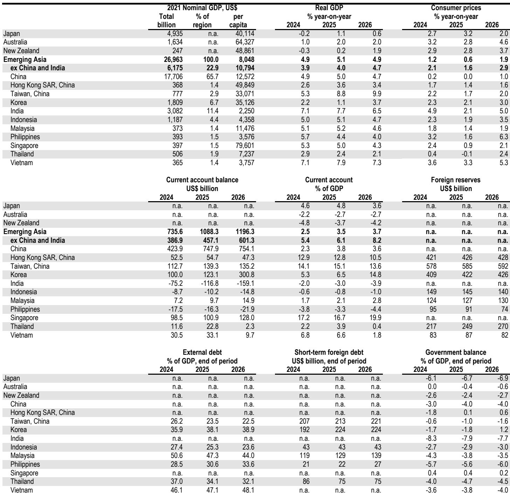
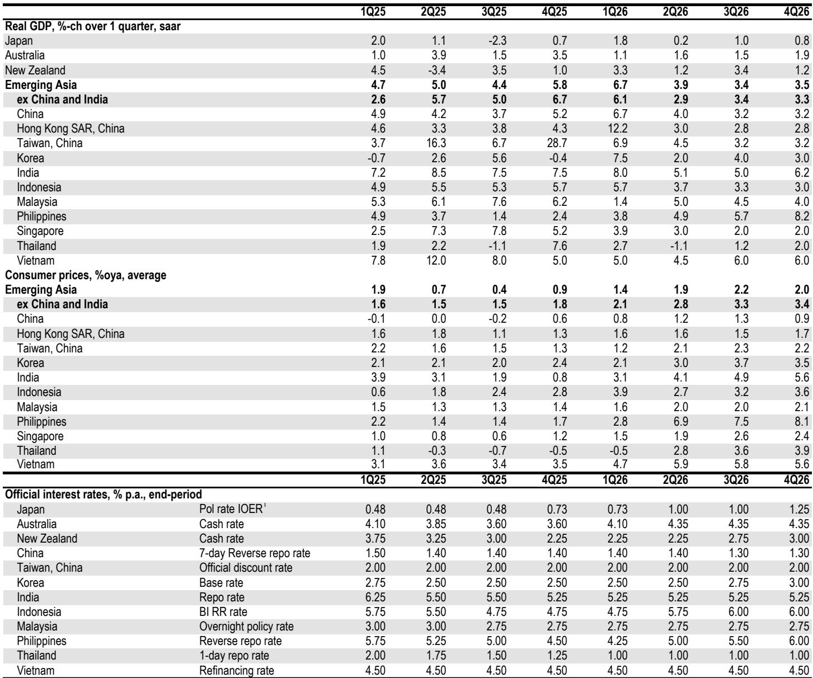

# JPM：亚洲正在从“被迫加息”转向“主动加息”，市场对此定价不足

亚洲央行的货币政策叙事正在经历一个被市场普遍低估的转折。JPM最新一期亚洲经济周报提出了一个核心判断：亚洲正从“弱势下的被动加息”阶段，进入“强势增长驱动的主动加息”阶段。这不是一个局部的、边缘的变化，而是一个结构性切换。印尼和菲律宾的加息属于前者——由汇率压力和通胀失控所迫；而韩国、台湾、新加坡正在酝酿的加息则属于后者——由科技繁荣、超预期的增长韧性和通胀传导风险所驱动。市场目前更多关注前者，对后者的定价仍不充分。

这份报告的关键信号在于：当增长本身成为加息的理由，而不是防御性工具时，资产定价的逻辑需要重新校准。对于关注亚洲市场的投资者而言，理解这两类加息的区别，比预测某一次会议的利率决议更重要。

---

## 1. 印尼和菲律宾的加息是“防御性”的，但市场可能低估了菲律宾的紧缩幅度

JPM明确指出，亚洲已经出现两类加息。第一类，也是市场相对熟悉的，是“弱势下的被动加息”。印尼央行在美元/印尼盾突破18200历史新高后，意外进行了25个基点的非周期加息，并辅以一系列监管措施应对汇率风险。菲律宾则是区域内通胀压力最大的经济体，尽管5月通胀数据略低于预期，但6.8%的同比水平仍然令人不安。JPM预计菲律宾央行将在下周加息50个基点，作为锚定通胀预期的预防性措施。

这里的关键洞察不在于加息本身，而在于两点。第一，印尼的加息虽然暂时缓解了汇率压力，但JPM认为压力仍然足以让央行在下次例行会议上再加25个基点。这意味着印尼的紧缩周期尚未结束，市场可能低估了其持续性的风险。第二，菲律宾的加息决策并非板上钉钉。报告坦诚地指出，尽管基线预测是50个基点，但考虑到全球原油价格近期下跌，25个基点的加息也是可能的。这种不确定性本身就意味着，市场对菲律宾央行鹰派程度的定价可能存在偏差。

这两者合在一起的含义是：对于印尼和菲律宾的资产，市场可能已经price in了“一次加息”，但没有充分price in“加息周期的持续性和不确定性”。尤其是菲律宾，如果最终加息幅度低于预期，反而可能引发通胀预期脱锚的更大担忧。

---

## 2. 韩国、台湾、新加坡的“主动加息”才是真正的结构变化，市场对此定价不足

报告最具启发性的部分，是提出了“另一类央行正在浮现”。这类央行的加息动机不是防御，而是主动管理。推动因素是科技出口繁荣、中东危机的意外绝缘效果以及财政政策的持续支持，共同导致经济增长持续超预期。

数据本身很有说服力。韩国一季度GDP被上修至7.5%的同比增速，JPM因此将全年增长预测上调至3.7%。台湾在科技和非科技领域同步走强的推动下，二季度GDP追踪数据被大幅上修。报告将这种增长形容为“boomy”，这个词本身就传递了超出“稳健”的意味。

JPM的判断是，这种“繁荣式增长”加上通胀风险上升，将促使多家央行考虑从强势地位出发进行加息。韩国央行已经转向鹰派，JPM预计未来12个月将加息100个基点。台湾和新加坡预计将出现类似的转向。台湾下周的央行会议因此值得高度关注——5月CPI略超预期，PPI则飙升14.1%，这带来了成本传导和利润率挤压的风险。

这里有一个容易被忽略的细节。报告提到，对于台湾下周的会议，“加息仍然是尾部风险事件”，但关键在于“央行是否发出信号，表明能源成本正在传导至核心通胀和通胀预期”。这意味着，即使下周不加息，央行释放的信号本身就会影响市场对年底前加息的概率定价。对于交易员而言，真正的变量不是利率决议本身，而是央行沟通的措辞。

---

## 3. 中国出口的“AI科技亮色”掩盖了生产动能的收窄，二季度GDP风险偏向下行

JPM对中国经济的分析同样提供了重要的结构性洞察。5月贸易和通胀数据指向AI科技的角色日益增强。出口超预期，背后是高技术出口的支撑，尤其是存储芯片/模组和新能源产品的价格上涨贡献了名义增长。

但报告紧接着给出了一个关键的“所以呢”：贸易脉冲正在变窄，且越来越由价格驱动。这意味着，出口数据的强劲程度对国内生产的传导效应是有限的。当出口增长主要来自价格上涨而非数量扩张时，其对工业增加值和净出口对增长的贡献的指示意义就变得模糊，且对相对价格变动和产品组合更加敏感。

报告的具体预测进一步佐证了这一判断。JPM预计5月工业增加值环比仅增长0.5%，只能部分弥补4月1%的环比下降。零售销售预计仅环比微增0.1%，固定资产投资年初至今可能仍处于收缩区间。如果这些预测兑现，二季度增长风险将明显偏向下行。

这一判断对于理解中国宏观叙事非常重要。市场可能被出口的“表面繁荣”所迷惑，但真正的工业生产动能和国内需求仍然疲弱。AI科技带来的价格推升，并不能等同于广泛的工业活动复苏。

---

## 4. 二季度疲软反而为下半年提供了政策空间，但外部不确定性正在上升

报告对中国经济的分析并非一味悲观。一个重要的结构性判断是，二季度的部分疲软反映了财政政策支持的阶段性退坡，这反而意味着下半年的“回吐”压力比此前预期的要小。更重要的是，近期的经济放缓可能促使政府在未来几个月加快财政资金的投放节奏。

同时，外部环境存在对冲因素。下半年出口应该受益于依然坚韧的全球需求，以及科技之外资本支出的扩大。但报告也坦诚地指出了风险：美国关税不确定性（转向301/232条款）以及欧盟对华更强硬的立场，都可能部分抵消这些正面因素。

综合来看，JPM对中国经济的判断是“二季度GDP风险偏向下行，但下半年存在上行风险”。这种表述本身就是一个重要的交易信号：市场对中国经济的悲观预期可能在下半年面临修正。但前提是，财政政策的加速投放能够及时落地，且外部关税冲击不超出预期。

---

## 5. 报告尚未完全回答的关键问题：主动加息对资产定价的影响路径

这份报告提出了一个有力的框架，但有一个关键问题尚未完全展开：当亚洲央行从“防御性加息”转向“主动加息”时，对不同类型资产的影响路径是什么？

从逻辑上推断，主动加息对股市的影响可能比防御性加息更复杂。防御性加息通常被视为负面信号——增长弱、货币弱、通胀失控。但主动加息发生在增长强劲的背景下，理论上对盈利预期是正面的。然而，如果加息幅度足够大，最终会压缩估值，尤其是对高估值科技股。韩国、台湾、新加坡的科技含量都很高，这恰恰是主动加息可能最先冲击的领域。

另一个未解问题是，主动加息对汇率的影响。防御性加息往往是为了稳定汇率，而主动加息可能吸引资本流入、推升汇率。但汇率升值本身又会反过来影响出口竞争力，尤其是在科技出口占主导的经济体中。这是一个二阶效应，报告没有展开。

对于债券市场，主动加息意味着收益率曲线的熊市陡化——短端因加息上行，长端则因增长预期和通胀预期而维持高位。这与防御性加息下的熊市平坦化（短端上行更快，长端受衰退预期压制）形成鲜明对比。

这些未解问题，恰恰是深入阅读完整报告、观察后续数据的关键所在。市场对亚洲央行动态的定价，可能仍停留在旧框架中。

---

## 6. 投资者的观察框架：如何区分“防御性加息”与“主动加息”的信号

基于这份报告的逻辑，我们可以提炼一个实用的观察框架。区分两类加息，关键看三个信号：

第一，增长是加息的“因”还是“果”。如果央行在加息声明中强调“强劲增长”和“通胀风险”，这更像是主动加息。如果强调“汇率压力”和“输入性通胀”，则更接近防御性加息。

第二，通胀的驱动因素。主动加息通常对应需求驱动的通胀，尤其是服务业和核心通胀的上行。防御性加息往往对应供给冲击，如能源和食品价格。

第三，央行的前瞻指引。主动加息的央行往往给出更清晰的路径预期，因为其政策空间更大。防御性加息的央行则倾向于保持模糊，因为其政策受外部条件约束。

投资者需要警惕的是，不要被“加息”这个动作本身所迷惑。同样是加息，在韩国和印尼的含义截然不同。JPM这份报告的核心贡献，就是提供了一个区分这两者的分析框架。而在这个框架下，当前亚洲市场最值得关注的，不是印尼和菲律宾的加息是否结束，而是韩国、台湾、新加坡的加息周期是否才刚刚开始。

---

报告的核心判断已经清晰：亚洲央行的叙事正在切换，但市场对这一切换的定价并不充分。防御性加息的故事已经接近尾声，而主动加息的故事才刚拉开序幕。对投资者而言，真正的挑战不是预测下一次加息时点，而是理解这两类加息对资产定价的差异化影响。这些未解问题，以及报告中更详细的数据表格和情景分析，欢迎来星球微信群里继续讨论，我们会在社群中分享完整报告解读和原始图表，并持续跟踪下周台湾、印尼、菲律宾的央行会议动态。

Personal reading notes and learning share only. Not investment advice.

