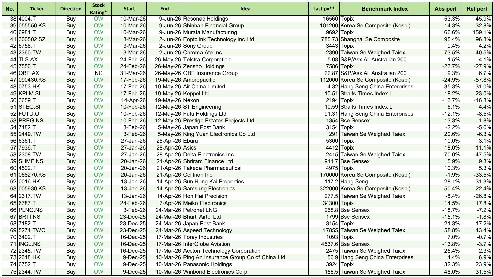
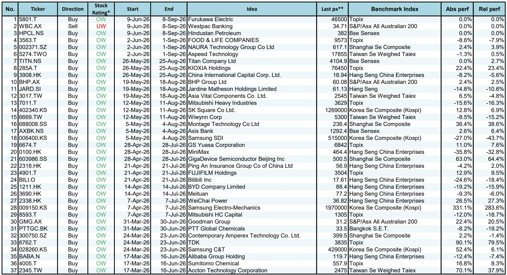
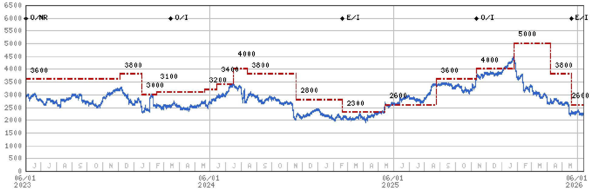

# 摩根斯坦利：市场低估的不是AI需求本身，而是需求在亚洲供应链中产生的结构性再定价

这份摩根斯坦利最新的“Three Actionable Ideas”报告，表面上给出了三个来自不同行业的买入建议，但其背后隐含着一个更深刻的判断：当前亚洲市场的定价逻辑，正在从“谁受益于AI需求”切换到“谁能在AI引发的供应链重构中，重新定义自己的议价权”。

报告选取的三家公司——臻鼎、华邦电、ONGC——分别来自PCB、存储芯片和能源上游三个看似不相关的领域。但将它们放在一起审视，一个清晰的图景浮现出来：摩根斯坦利认为，市场对AI主题的定价已经过于拥挤在少数几个环节，而真正的结构性机会，正在向那些被忽视的“瓶颈”和“再定价”环节扩散。这不是一个关于AI需求增速的讨论，而是一个关于供给结构如何被重塑、以及谁能在这一重塑中占据主动的问题。

以下是我们从这份报告中提炼出的五个核心洞察。

## 1. AI互连的物理瓶颈正在从芯片转向传输材料，PCB行业的价值分配将迎来拐点

报告将臻鼎列为PCB领域的首选受益者，背后的逻辑并非简单的“AI服务器出货量增长”，而是一个更具体的产业现象：随着数据传输速率从400G向800G乃至1.6T演进，PCB作为信号传输介质的物理瓶颈正在凸显。摩根斯坦利在另一份相关报告中详细讨论了“Optics Drives the Board”这一主题，其核心判断是：高速互联对PCB的材料、层数、制造精度提出了质变级要求，这不仅是量的增加，更是供应链格局的重新洗牌。

臻鼎被看好的原因，在于其有能力在这一技术切换过程中“capture meaningful share”。这意味着，市场此前对PCB行业的认知——一个依赖产能扩张的周期性行业——正在被颠覆。新的竞争壁垒在于对高频高速材料的理解、与下游光模块和交换芯片厂商的协同设计能力，以及良率控制的技术深度。对于投资者而言，这释放了一个明确的信号：在AI硬件投资中，关注点应从已经高度定价的GPU和HBM，逐步向下游的互连和传输环节延伸，那里可能隐藏着市场尚未充分定价的结构性变化。

## 2. 存储芯片的“供应问题”正在制造买入窗口，华邦电的短期波动掩盖了中期基本面的走强

报告对华邦电的推荐，基于一个看似矛盾的判断：“memory optimization on servers is more of a supply issue”。这句话的意思是，当前服务器内存的优化调整，更多是由供给端而非需求端驱动的。市场可能将近期存储芯片价格的波动解读为需求疲软，但摩根斯坦利认为，这本质上是供给端的库存消化和产能调配问题。

“Recent share price volatility should provide a good entry point”——这句判断的隐含前提是，市场对供给问题的反应过度，而忽视了华邦电所处的基本面正在改善。报告提到“data points suggest a stronger outlook”，但没有展开具体数据。这里的悬念在于：华邦电的竞争优势到底来自何处？是其在特定利基市场的份额增长，还是成本结构的改善？报告没有完全回答这个问题，但一个合理的推断是，随着AI服务器对内存容量的需求持续增长，以及非HBM类型的存储芯片在边缘计算和终端设备中的应用扩大，华邦电可能正站在一个需求结构多元化的起点上。

## 3. 能源安全与AI用电需求正在重塑上游能源资产的估值逻辑，ONGC的“增长”属性被严重低估

ONGC的推荐是三个想法中最具反直觉色彩的。摩根斯坦利指出，“energy security and Powering AI increase long-term 'g' for upstream energy producers”。这里的“g”是增长率。传统上，上游能源公司被视为价值股，其增长逻辑依赖于油价和天然气价格的周期性波动。但报告认为，AI带来的电力需求增长，以及各国对能源安全的重新重视，正在为上游能源生产商注入一个长期的、结构性的增长动力。

报告提到ONGC拥有“among the highest natural gas ASPs globally”（全球最高的天然气平均售价之一），并且“has returned capital to shareholders equal to where we see its market cap in 20 years”。这是一个极具冲击力的表述：它意味着ONGC在过去二十年里向股东返还的资本，已经相当于其当前市值的全部。这暗示着，市场可能仍在用传统的能源周期股框架来给ONGC定价，而忽略了其作为“AI基础设施受益者”和“能源安全战略资产”的双重属性。如果这一重估逻辑成立，那么ONGC的估值框架将需要从“周期股”切换到“成长股+高分红股”的混合模式。

## 4. 报告尚未完全回答的关键问题：台股与韩国市场的相对表现差异，是否隐含了更深层的产业周期错位？

报告给出的三个想法分别来自台湾、台湾和印度，但如果我们把视野扩大到整个亚洲，一个未被回答的问题是：为什么摩根斯坦利在近期推荐中，台湾科技股（如臻鼎、华邦电、Aspeed、Accton）的密集度远高于韩国？从Exhibit 4和Exhibit 5的业绩记录来看，韩国市场的一些推荐（如三星SDI、Amorepacific）表现显著落后，而台湾的PCB和半导体设备公司则表现强劲。

这背后可能反映了一个产业周期的错位：韩国经济高度依赖存储芯片和显示面板，这些领域正面临供给过剩和需求结构转型的双重压力；而台湾的科技产业在AI硬件互连、半导体设备和先进封装等环节，拥有更直接的需求拉动。报告没有直接对比这两个市场，但这一隐含的差异值得关注。对于投资者而言，这意味着在亚洲科技投资中，国别和产业链位置的筛选可能比行业选择更为关键。

## 5. 一个值得持续跟踪的分析框架：从“AI需求弹性”转向“供应链议价权再分配”

综合这三个想法，我们可以提炼出一个超越具体标的的分析框架。摩根斯坦利试图传递的核心信息是：AI投资的下一个阶段，不再是谁能提供更多产能，而是谁能在供给瓶颈中占据不可替代的位置。

这个框架包含三个维度：
第一，技术壁垒的不可复制性。臻鼎的例子表明，技术切换期的先发优势可以转化为持久的市场份额。
第二，供给结构的稀缺性。华邦电的案例说明，当市场错误地将供给问题归因为需求问题时，反而创造了买入机会。
第三，需求曲线的结构性上移。ONGC的推荐提醒我们，AI的影响正在从科技硬件向外溢，能源、电力等传统行业的需求曲线正在被永久性地抬高。

这三个维度共同指向一个问题：你持有的资产，是否拥有在供应链重构中被重新定价的潜力？

报告中的三个想法，只是这个框架的初步应用。更完整的逻辑推导、更详细的财务模型和风险分析，都在摩根斯坦利的原始报告之中。例如，臻鼎在高速PCB领域的具体份额目标是多少？华邦电的“stronger outlook”背后有哪些数据支撑？ONGC的天然气售价与全球同行的对比是如何计算的？这些细节，报告并未在摘要中完全展开。

如果你对这些未解问题感兴趣，或者希望获得更完整的行业图谱与数据支撑，欢迎来我们的星球和微信群里继续讨论。我们会在社群中分享这份报告的完整解读、原始图表，以及更多关于亚洲供应链重构的深度分析。

Personal reading notes and learning share only. Not investment advice.

