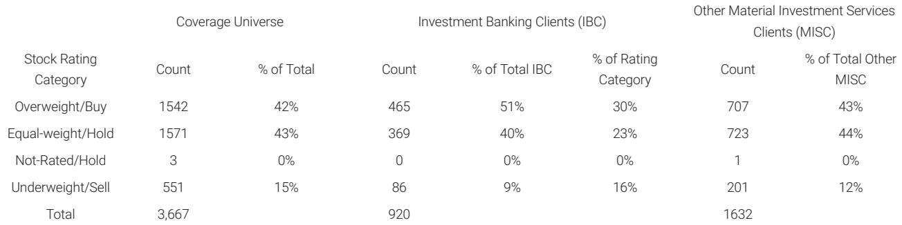

# 摩根斯坦利：AI基建的真正瓶颈不在资本，而在电力与结构性供给约束

市场上关于AI基础设施投资的讨论，大多集中在资本规模、算力需求、以及科技巨头的资本开支计划上。一个被广泛接受的叙事是：只要资金到位，算力就能跟上。但摩根斯坦利最新的一份宏观策略报告提出了一个更冷静的判断——AI基建的真正瓶颈不在融资端，而在供给端，尤其是电力基础设施的结构性约束。这份报告的核心洞察是：电力不再是数据中心建设的“配套条件”，而是与算力建设并列的核心约束变量。理解这一点，才能理解未来几年AI产业链的竞争格局、定价权分布，以及投资逻辑的重塑方向。

报告指出，电力变压器交货周期已从此前的12-16周拉长至平均128周，部分型号甚至达到144周。伯克利实验室的数据显示，截至2025年初，美国电网互联积压项目规模已超过美国现有装机容量的两倍。这些数字背后是一个简单的物理现实：AI驱动的电力需求增长，正在与一个无法快速响应的供给体系发生碰撞。这不是一个边际问题，而是一个系统性问题。

## 1. 电力约束正在从“配套条件”升级为“独立瓶颈”，数据中心选址逻辑因此重构

报告的核心判断之一是，电力供给的约束已经不再是数据中心建设中的一个“需要协调的变量”，而是成为一个前置性的、独立的瓶颈。过去，数据中心开发商的逻辑是：先确定需求、选址、建设，再协调电力接入。但现在，这个顺序正在被逆转——开发者必须首先确认电力可用性，才能推进项目。

这一变化的影响是深远的。它意味着数据中心的选址将从“靠近用户”转向“靠近电力”。那些拥有富余电力容量、或者能够快速接入电网的区域，将获得显著的竞争优势。同时，这也意味着数据中心建设的节奏将不再由资本开支计划决定，而是由电网扩容和发电设施建设的节奏决定。后者通常以年为单位，甚至以五年为单位。

从这个角度看，市场对AI资本开支的线性外推可能过于乐观。报告虽然没有直接给出具体的建设时间表修正，但它暗示了一个逻辑：如果电力基础设施的瓶颈持续存在，那么算力供给的增长曲线将比需求曲线更平缓、更波动。对于投资者而言，这意味着需要重新评估那些依赖“算力快速扩张”假设的资产定价。

## 2. 融资模式正在发生结构性变化：AI与能源的资本池正在合并

报告的另一个重要洞察是，AI基建的融资需求和能源基础设施的融资需求正在趋同。传统的融资模式中，数据中心和电力设施是分开的：数据中心由科技公司或数据中心REITs融资，电力设施由公用事业公司融资。但现在，这种边界正在模糊。

报告提到，AI公司本身正在越来越多地直接收购、签约或融资电力资产，而不是将其视为独立的、由公用事业主导的投资。这意味着，AI基建的融资模式正在从“分别融资、分别建设”转向“一体化融资、协同建设”。这种变化的驱动因素很直接：当电力供给成为瓶颈，AI公司必须主动介入，才能确保自己的算力建设计划不被搁置。

这种趋势对资本市场的含义是双重的。一方面，它意味着AI相关融资的总规模可能被低估——因为电力资产的投资需要被纳入AI基建的资本开支框架。另一方面，它也意味着AI公司的资本结构和资产负债表将变得更加复杂，因为它们需要同时承担科技资产和能源资产的双重风险。

## 3. 结构性约束不止于电力：劳动力、水资源与政策阻力正在形成叠加效应

报告没有止步于电力分析，而是进一步指出，电力只是最显性的约束之一。在劳动力方面，美国未来十年预计将面临约30万电工的短缺，而现有电工队伍中超过五分之一年龄在55岁以上，即将退休。这意味着即使电力设备到位，安装和维护的人力也可能不足。

水资源是另一个正在浮现的约束。标普的分析显示，全球43%的数据中心位于高水压力地区。数据中心的冷却系统对水资源有显著需求，在干旱频发的区域，这一约束可能成为限制扩张的硬性条件。

政策阻力也在加大。报告提到，纽约州正在审议暂停新建数据中心的立法草案，德克萨斯州州长已下令监管机构确保数据中心增量需求不会推高其他用户的电价，全美已有14个州在考虑某种形式的暂停令。这些政策信号表明，数据中心的扩张正在从“市场问题”变成“公共政策问题”，其不确定性正在上升。

将这些约束叠加在一起，报告的核心判断就清晰了：算力供给的增长速度将受到多重结构性约束的压制，而不仅仅是资本可得性。这意味着，市场对AI算力供给弹性的假设可能过于乐观。

## 4. 稀缺性正在重塑定价权：谁掌握“可交付的算力”，谁就掌握定价权

报告最引人深思的部分，是对算力市场供需失衡后果的分析。报告认为，在结构性约束持续存在的情况下，算力供给和需求之间可能出现结构性失衡，而稀缺性将成为市场的核心特征。在这种环境下，拥有规模化、可靠算力供给能力的玩家将获得显著的定价权——报告称之为“算力商人”（merchants of compute）。

更重要的是，报告指出，在当前周期阶段，需求的价格弹性相对较低，尤其是来自企业级应用的需求。这意味着，即使算力价格上涨，需求也不会显著放缓。如果有什么变化，那可能是价格上升会进一步推动算力向高价值应用集中，而低价值应用可能被挤出。

这个判断对投资者的含义是直接的：在算力供给受限的环境中，拥有稳定算力供给能力的公司，其议价能力和盈利能力可能被市场低估。相反，那些依赖“算力价格持续下降”假设的商业模式，可能需要重新审视。

## 5. 报告尚未完全回答的关键问题：约束的“临界点”在哪里？

尽管报告对结构性约束的分析非常透彻，但它并没有给出一个清晰的“临界点”判断——即这些约束何时会从“制约因素”变为“硬性天花板”。电力变压器交货周期拉长到128周，这是一个事实，但这是否意味着2026年、2027年的算力建设将显著低于预期？报告没有给出量化答案。

同样，报告提到了政策阻力在加大，但它没有分析这些政策阻力在多大程度上是“可逆的”——如果AI对经济增长的贡献变得更加明显，政策制定者是否会调整立场？这些问题不是报告的缺陷，而是它留下的开放问题，也是读者需要进一步深入阅读完整报告、结合更多数据来判断的地方。

对于决策者而言，这些未解问题恰恰是最值得关注的。它们意味着，当前市场对AI基建的预期可能仍然包含太多“线性外推”的假设，而忽略了结构性约束可能带来的非线性冲击。理解这些约束的具体边界和临界点，才是真正把握AI基建投资节奏的关键。

## 6. 一个观察框架：从“资本驱动”转向“供给约束”的视角切换

综合报告的分析，投资者和产业决策者可以建立一个更有效的观察框架。这个框架的核心是：将注意力从“AI资本开支计划有多大”转向“电力、劳动力、水资源和政策约束如何限制这些计划的落地”。

具体来说，可以关注以下几个信号：第一，电力设备交货周期是否开始下降，或者是否有替代方案（如分布式发电、离网方案）在加速落地。第二，数据中心选址是否正在向电力富余区域转移，以及这些区域的电力供给是否真的充足。第三，政策阻力的演变方向——是更多州加入暂停令行列，还是政策开始向“加速审批”方向调整。第四，劳动力市场的动态——电工培训计划是否在加速，工资是否在上涨，以及这些信号是否意味着供给正在改善。

这些信号比单纯的资本开支数字更能反映AI基建的真实节奏。报告虽然没有给出一个完整的“信号清单”，但它的分析框架已经足够清晰，让读者可以自己去追踪这些变量。

这些开放问题，正是我们希望在更深入的讨论中继续探索的方向。欢迎来知识星球的微信群中，与更多关注AI基建和全球宏观的读者一起，分享各自对电力约束、政策演变和算力定价权的观察与判断。

Personal reading notes and learning share only. Not investment advice.

