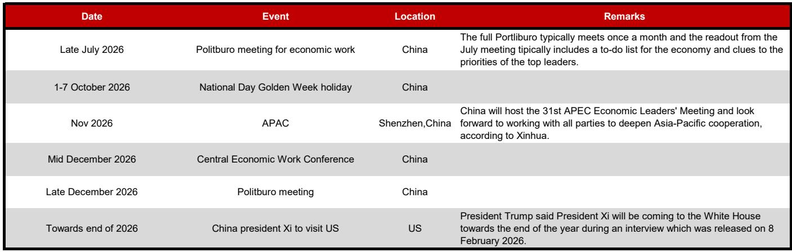
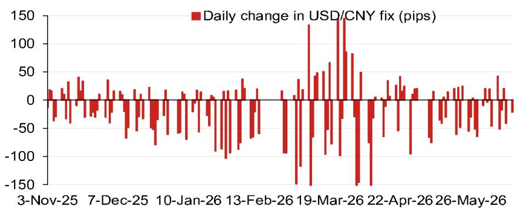
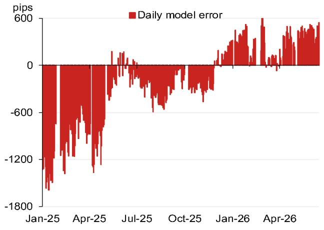

# NOM：人民币中间价模型正在发出一个被市场忽视的信号

市场对人民币汇率的讨论，大多仍然停留在“中美关系”、“出口压力”或“央行干预”这些宏观叙事层面。但一份来自NOM亚洲外汇策略团队的最新研报，通过其定价模型给出了一个更具体、也更值得推敲的判断：人民币中间价的模型预测值，正在出现系统性偏离。

这份报告的核心不在于预测一个具体的点位，而在于揭示一个机制层面的变化——中间价的形成逻辑，可能正在从“被动跟随”转向“主动引导”。这个变化，对于任何持有人民币资产、或关注中国资本流动的决策者来说，都值得重新审视。

报告提供了一个关键数据点：模型对USD/CNY中间价的预测值为6.7575，较上一期大幅下调了513个基点。而如果计入逆周期因子，预测值则为6.7800，仍较前次中间价低288个基点。这不是一个随机波动，而是一个系统性的、由多个因素共同推动的修正。

下面，我们拆解这份报告的核心逻辑，并尝试回答一个更重要的问题：这个信号，到底意味着什么？

## 1. 模型预测的偏离，揭示的不是点位，而是政策意图的转变

NOM这份报告最值得关注的，不是6.7575这个数字本身，而是模型预测值与实际中间价之间的“误差”。报告中的图2展示了模型误差的历史走势：从2025年初的-1800个基点（模型预测远低于实际中间价），逐步收窄，到2026年初接近零，甚至在今年4月转为正600个基点。

这个误差的演变，本质上反映的是“逆周期因子”的调节力度。当模型预测值显著低于实际中间价时，意味着央行在使用逆周期因子来“托底”汇率，防止人民币过快升值。而当误差收窄甚至转正，则意味着这种调节在减弱，或者方向在转变。

报告给出的最新模型预测（不含逆周期因子）为6.7575，比前次低513个基点。这本身就是一个强烈的信号：在当前的宏观环境下，市场力量本身就在推动人民币升值。而计入逆周期因子后的预测值6.7800，虽然仍低于前次中间价，但幅度已大幅收窄。这说明，央行没有完全放任市场力量，但也不再像过去那样强力干预。

**So what**：对于投资者而言，需要关注的不是人民币会升到多少，而是央行的“容忍区间”是否正在上移。误差收窄意味着政策干预的力度在下降，市场定价权在回归。这是一个结构性变化，而非短期波动。

## 2. 四个主要货币的贡献，暴露了人民币升值的“非对称”驱动力

NOM报告中的图1拆解了模型预测变化的四个最大贡献货币：欧元贡献了+13个基点，日元贡献了+5个基点，韩元贡献了-14个基点，卢布贡献了-18个基点。

这个分布非常有意思。欧元和日元对人民币中间价的贡献是正向的，意味着这些货币的走强在推动人民币升值。而韩元和卢布的负向贡献，则意味着这些货币的走弱在拖累人民币。

这揭示了一个关键事实：当前人民币的升值压力，并非来自中国自身的单一因素，而是全球货币格局分化的结果。欧元和日元因为各自的货币政策预期或地缘政治因素而走强，人民币被动跟随。而韩元和卢布的走弱，则反映了亚洲出口竞争和能源价格波动的影响。

**So what**：人民币汇率的驱动因素正在变得更加“非对称”。它不再仅仅取决于中美利差或贸易顺差，而是越来越多地受到全球主要货币之间相对强弱关系的影响。这意味着，单纯押注人民币单边升值的策略，风险正在上升。投资者需要同时关注欧元、日元、韩元等多个货币的走势，才能更好地判断人民币的短期方向。

## 3. 日历上的关键事件，正在为2026年下半年埋下定价变数

报告最后一部分列出了2026年下半年的关键事件日历。这些事件本身并不新奇，但将它们放在一起，并与中间价模型的信号联系起来，就能看出一个清晰的逻辑链条。

7月底的政治局会议、11月的APEC峰会、12月的中央经济工作会议，以及年底可能的中美领导人会晤——这些事件都指向一个方向：政策层可能在为下半年的一系列重要外交和经济议程，创造一个更稳定、也更有利的汇率环境。

如果模型预测的升值趋势在下半年得到延续，那么中间价可能会在这些关键时间点前后出现更明显的调整。尤其是在APEC和中美元首会晤前后，市场对汇率信号的解读将更加敏感。

**So what**：2026年下半年是一个“事件密集期”。每一个重要会议或会晤，都可能成为人民币汇率定价的催化剂。投资者需要提前布局，而不是在事件发生时被动应对。报告的模型预测，实际上是在为这些事件提前“定价”。

## 4. 报告尚未完全回答的关键问题：逆周期因子的“新常态”是什么？

尽管NOM的模型提供了清晰的数据，但报告本身并没有完全回答一个更根本的问题：在逆周期因子使用力度减弱的背景下，央行的“新常态”是什么？

报告展示了模型误差的收窄，但没有解释央行为何选择在这个时间点放松干预。是因为对人民币汇率的信心增强？还是因为干预成本上升？或者是为了应对国际压力？

此外，报告也没有讨论，如果模型预测的升值趋势在下半年加速，央行是否会重新加大逆周期因子的使用力度。从历史上看，央行在汇率快速升值时往往会有“恐高”心理，担心对出口造成冲击。

**So what**：对于深度参与者而言，真正的投资机会在于判断“政策容忍的边界”在哪里。NOM的模型给出了一个很好的起点，但最终的决定因素，仍然是央行对汇率波动的真实态度。这个态度，可能要到下半年的事件密集期才会真正明朗。

## 5. 对读者的观察框架：如何从这份报告中提炼自己的判断

基于NOM这份报告，我们可以建立一个简单的观察框架，帮助读者形成自己的判断，而不是被动接受结论。

**第一，关注模型误差的持续方向。** 如果未来几周，模型预测值继续低于实际中间价，且误差没有明显收窄，说明市场升值压力仍在积累。如果误差开始扩大，则可能意味着央行在重新加码干预。

**第二，关注欧元和日元的相对强弱。** 这两个货币是当前人民币升值的主要外部推手。如果欧元和日元出现回调，人民币的升值压力也会相应减弱。

**第三，关注7月底政治局会议的通告。** 这是下半年第一个关键政策窗口。会议对经济工作的表述，特别是对汇率和资本流动的措辞，将是判断央行意图的重要依据。

**第四，不要忽视韩元和卢布。** 这两个货币的走弱，实际上在“对冲”部分升值压力。如果韩元或卢布出现反弹，人民币的升值速度可能会加快。

这个框架并不复杂，但它能帮助读者从海量信息中抓住关键变量，而不是被每日的汇率波动牵着走。

## 6. 顺着这些未解问题，继续深入讨论

NOM的这份报告，本质上是一份“工具性”的研究。它提供了一个清晰的量化模型，但把最终的判断留给了读者。模型预测值与实际中间价的偏离、逆周期因子的真实意图、以及下半年密集事件对汇率的冲击，这些都不是一份报告能完全回答的问题。

如果你对这些问题感兴趣，欢迎来我们的星球微信群里继续讨论。我们会基于这份报告，结合更多一线数据和政策解读，持续跟踪人民币汇率的定价逻辑变化。群里不仅有更深入的讨论，还有原始报告的完整图表和后续更新。

Personal reading notes and learning share only. Not investment advice.

