## Americas Energy & Transition

# Bernstein Energy: Applying the 5 "W"s to an upstream capex supercycle...we are unconvinced

Bob Brackett, Ph.D.

+1 917 344 8422

bob.brackett@bernsteinsg.com

Minnie Xu

+1 917 344 8574

minnie.xu@bernsteinsg.com

Anshika Bajpai

+1 917 344 8306

anshika.bajpai@bernsteinsg.com

Today, we use our outlook for global upstream oil & gas capital expenditures (Bernstein Energy: Global Upstream Capex 2026...the quantity of capex falls now...does the quality of capex follow?) to consider the current environment. We still see a pullback of \~\$40 bln upstream capex in 2026 driven by lagging company conservatism in uncertain oil and geopolitical environment. Public E&Ps remain disciplined, OFS companies are not materially resetting FY26 guidance higher, shale productivity gains are harder to achieve, and a large share of discovered resources remains undeveloped because the barrels are long-cycle, politically difficult, or no longer cheap to develop.

In a post Strait of Hormuz world, we would expect perhaps \~\$560 bln in total upstream capex Exhibit 1, \~\$50 bln more from our previous forecast in Jan 2026, when Brent averaged \~\$70/bbl. Today, Brent is \~\$90/bbl, but we'd expect planning prices have risen to at most \$70/bbl.

In this note, we use the five-W framework to assess the likelihood of an upstream capex supercycle.

1. WHY invest? Cash flow is up, but reinvestment appetite is not. Higher Brent has improved E&P cash flow, but investors continue to reward capital discipline, buybacks and free cash flow durability over production growth (Exhibit 3 - Exhibit 7.  
2. WHAT barrels get developed? Roughly 1/3 of the discovered resources over the past century remains undeveloped (Exhibit 8) with deepwater + barrels leading discoveries. The problem is that those deepwater barrels are increasingly harder to convert into supply (Exhibit 9 and Exhibit 10). Shale barrels are content to plateau (Exhibit 12) while oil sands barrels (Exhibit 13) need more clarity.  
3. WHO will invest? NOCs, not public E&Ps, lead the next cycle. The marginal growth barrel is increasingly controlled by NOCs and state-directed players, not U.S. shale independents (Exhibit 14 - Exhibit 16).  
4. WHERE can capital go? The best geology is often in the worst jurisdictions. Many of the largest undeveloped barrels sit in countries with high fiscal take, political instability, sanctions or weak rule of law (Exhibit 17 - Exhibit 18)  
5. WHEN to invest? Usually, high oil prices trigger a sharp pickup in rig activity, but that pattern has broken down this time, and we have not yet seen any raise of guidance from oil services and equipment companies (Exhibit 19 - Exhibit 20). Upstream inflation also means companies are spending more simply to hold activity flat.

Finally, we highlight that oil price has outperformed E&P equities year to date (Exhibit 21). The thesis of higher for longer prices driving better than historic volume growth is not one that we find resonating.

Instead we'd suggest that as we exit the current crisis and the Strait reopens, the dominant theme will be a comfortable oil price with a powerful floor (refilling strategic reserves at \$70+?) where excess free cash flow is rapidly collected by E&Ps and returned to shareholders.

BERNSTEIN TICKER TABLE

<table><tr><td rowspan="2">Ticker</td><td rowspan="2">Rating</td><td colspan="3">12 Jun 2026</td><td colspan="2">TTMRel.</td><td colspan="4">Adjusted EPS</td><td colspan="3">Adjusted P/E (x)</td></tr><tr><td>Cur</td><td>Closing Price</td><td>Price Target</td><td>Target Perf.</td><td>Cur</td><td>2025A</td><td>2026E</td><td>2027E</td><td>2025A</td><td>2026E</td><td>2027E</td><td></td></tr><tr><td>APA (APA)</td><td>M</td><td>USD</td><td>37.02</td><td>40.00</td><td>62.6%</td><td>USD</td><td>2.83</td><td>7.20</td><td>6.42</td><td>13.1</td><td>5.1</td><td>5.8</td><td></td></tr><tr><td>COP (ConocoPhillips)</td><td>O</td><td>USD</td><td>116.98</td><td>121.00</td><td>0.6%</td><td>USD</td><td>6.18</td><td>13.89</td><td>10.88</td><td>18.9</td><td>8.4</td><td>10.8</td><td></td></tr><tr><td>CVX (Chevron)</td><td>M</td><td>USD</td><td>187.22</td><td>204.00</td><td>6.2%</td><td>USD</td><td>8.43</td><td>16.58</td><td>13.26</td><td>22.2</td><td>11.3</td><td>14.1</td><td></td></tr><tr><td>DVN (Devon Energy)</td><td>O</td><td>USD</td><td>45.31</td><td>59.00</td><td>9.1%</td><td>USD</td><td>4.17</td><td>10.06</td><td>8.43</td><td>10.9</td><td>4.5</td><td>5.4</td><td></td></tr><tr><td>FANG (Diamondback)</td><td>O</td><td>USD</td><td>192.13</td><td>241.00</td><td>5.7%</td><td>USD</td><td>4.57</td><td>32.21</td><td>27.22</td><td>42.0</td><td>6.0</td><td>7.1</td><td></td></tr><tr><td>EQT (EQT)</td><td>O</td><td>USD</td><td>51.94</td><td>69.00</td><td>(29.4)%</td><td>USD</td><td>3.31</td><td>8.15</td><td>8.58</td><td>8.0</td><td>5.0</td><td>4.8</td><td></td></tr><tr><td>EOG (EOG)</td><td>M</td><td>USD</td><td>136.65</td><td>155.00</td><td>(9.6)%</td><td>USD</td><td>9.88</td><td>18.93</td><td>16.25</td><td>13.8</td><td>7.2</td><td>8.4</td><td></td></tr><tr><td>KOS (Kosmos Energy)</td><td>M</td><td>USD</td><td>2.87</td><td>2.40</td><td>14.4%</td><td>USD</td><td>(1.58)</td><td>1.13</td><td>0.75</td><td>(1.8)</td><td>2.5</td><td>3.8</td><td></td></tr><tr><td>KOS.LN (Kosmos Energy)</td><td>M</td><td>GBp</td><td>217.00</td><td>177.00</td><td>28.9%</td><td>GBP</td><td>(1.17)</td><td>0.83</td><td>0.56</td><td>(1.9)</td><td>2.6</td><td>3.9</td><td></td></tr><tr><td>XOM (ExxonMobil)</td><td>O</td><td>USD</td><td>147.01</td><td>182.00</td><td>11.0%</td><td>USD</td><td>7.37</td><td>16.37</td><td>14.49</td><td>19.9</td><td>9.0</td><td>10.1</td><td></td></tr><tr><td>SPX</td><td></td><td></td><td>7,431.46</td><td></td><td></td><td></td><td></td><td></td><td></td><td></td><td></td><td></td><td></td></tr><tr><td>EDME</td><td></td><td></td><td>1,570.59</td><td></td><td></td><td></td><td></td><td></td><td></td><td></td><td></td><td></td><td></td></tr></table>

O - Outperform, M - Market-Perform, U - Underperform, NR - Not Rated, CS - Coverage Suspended  
EQT estimate is Reported EPS; EQT valuation is EV/EBITDA (x);  
Source: Bloomberg, Bernstein estimates and analysis.

## INVESTMENT IMPLICATIONS

Capex discipline and a normalizing price might be an attractive entry point for oily E&Ps. We have outperform ratings on FANG, COP and DVN.

## DETAILS

## SYNTHESIZING THE 5 "W"S ... WE EXPECT ONLY TWEAKS TO UPSTREAM CAPEX

It is reasonable to assume somewhat higher upstream capex than in our previous forecast, as stronger Brent prices have encouraged some less disciplined operators to step up investment, driving a gradual increase into 2027. Once Brent prices normalize to \$75/bbl in 2028 under our price deck, we expect upstream spending to trend lower again to our long run views.

Our capex model takes oil price assumptions as a strong driver, but despite the price on the screen (and risks of higher prices), we do not use, say, current \~\$90 Brent for our capex model as we don't believe planning prices have fundamentally changed in a post Strait of Hormuz world, especially given (1) the uncertainty, and (2) the strong desire for the market to want lower prices. We have always perhaps believed that inflation was closer to a popular delusion than a law of physics. Our favorite author, Philip K. Dick, argued “Reality is that which, when you stop believing in it, doesn't go away.” Apparently oil economics can defy reality for now.

In any case, we provide our (unimpressive) capex forecast below reflecting our view of the current situation.

Then we apply a 5 "W" framework to support our view.

EXHIBIT 1: We forecast \~\$560 bln in upstream capital expenditures in 2026 including \~\$56 bln toward exploration  
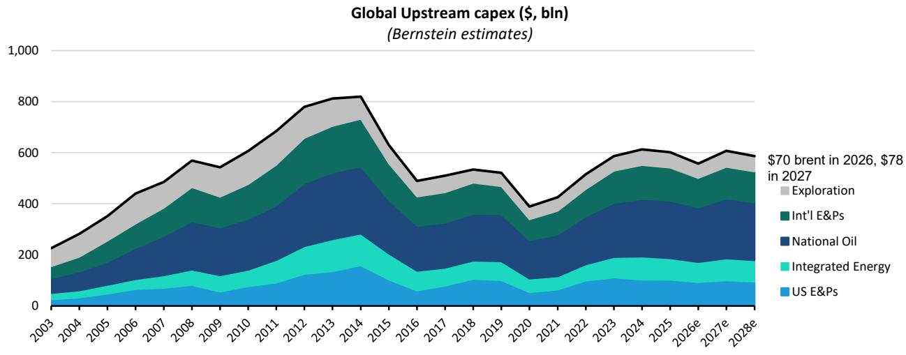

stacked area chart

| Year | Exploration | Int'l E&Ps | National Oil | Integrated Energy | US E&Ps |
|------|-------------|------------|--------------|-------------------|---------|
| 2026e | $70 brent | $78 | $78 | $78 | $78 |
| 2027e | $70 | $78 | $78 | $78 | $78 |

Source: Company reports, Rystad Energy, IEA, EIA, Bloomberg, Bernstein estimates and analysis

## WHY...

...INVEST IN UPSTREAM CAPEX?

## because reserve replacement ultimately matters

Reserve lives (ex long cycle projects such as LNG) are unimpressive amongst E&Ps and integrateds. Furthermore, shale ‘resources’ have created a comfort cushion that was lacking say 15 years ago (a strong internal conviction that resources can be migrated to reserves and then out the wellhead). While significant resources and reserves no doubt exist, we note that discoveries have collapsed in a world of shale and that the best days of deepwater and ultradeepwater are perhaps behind us.

EXHIBIT 2: The world has discovered abundant resources, largely in shale and shelf  
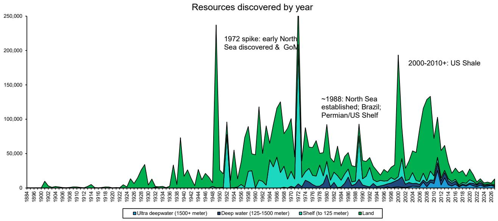

area chart

| Year | Ultra deepwater (1500+ meter) | Deep water (125-1500 meter) | Shelf (to 125 meter) | Land |
|------|-------------------------------|-----------------------------|----------------------|------|
| 1972 | ~30,000                       | ~10,000                     | ~250,000             | ~240,000 |
| 1988 | ~10,000                       | ~5,000                      | ~15,000              | ~15,000 |
| 2000-2010+ US Shale | ~15,000                   | ~5,000                      | ~15,000              | ~15,000 |

Source: Rystad, Bernstein and analysis

## because E&Ps have enjoyed higher cash flows for the last several years (partly due to consolidation)

While Middle East disruption is still a Q2 headwind to some company's production, the Iran conflict will ultimately case more overall cash flow due to higher Brent price. In any case, large cap E&P cash flows have been relatively impressive since Covid-19 days (in strong part due to industry consolidation).

EXHIBIT 3: US majors operating cash flow is rising thanks to supply discipline  
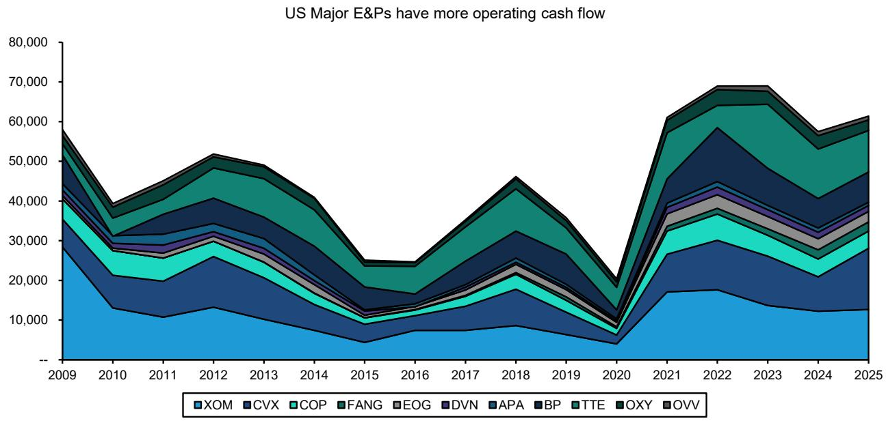

area chart

| Year | XOM   | CVX   | COP   | FANG  | EOG   | DVN   | APA   | BP    | TTE   | OXY   | OVV   |
|------|-------|-------|-------|-------|-------|-------|-------|-------|-------|-------|-------|
| 2009 | 30000 | 15000 | 10000 | 5000  | 3000  | 2000  | 1500  | 1000  | 5000  | 3000  | 2000  |
| 2010 | 25000 | 12000 | 8000  | 4000  | 2500  | 1500  | 1200  | 800   | 4000  | 2500  | 1500  |
| 2011 | 28000 | 13000 | 9000  | 4500  | 2800  | 1700  | 1300  | 900   | 4500  | 2800  | 1700  |
| 2012 | 32000 | 14000 | 10000 | 5000  | 3200  | 1800  | 1400  | 1000  | 5000  | 3200  | 1800  |
| 2013 | 35000 | 15000 | 11000 | 5500  | 3500  | 1900  | 1500  | 1100  | 5500  | 3500  | 1900  |
| 2014 | 38000 | 16000 | 12000 | 6000  | 3800  | 2100  | 1600  | 1200  | 6000  | 3800  | 2100  |
| 2015 | 42000 | 17000 | 13000 | 6500  | 4200  | 2300  | 1700  | 1300  | 6500  | 4200  | 2300  |
| 2016 | 45000 | 18000 | 14000 | 7000  | 4500  | 2400  | 1800  | 1400  | 7000  | 4500  | 2400  |
| 2017 | 48000 | 19000 | 15000 | 7500  | 4800  | 2500  | 1900  | 1500  | 7500  | 4800  | 2500  |
| 2018 | 52000 | 21000 | 16543| -     | -     | -     | -     | -     | -     | -     | -     |
| 2019 | -     | -     | -     | -     | -     | -     | -     | -     | -     | -     | -     |
| 2020 | -     | -     | -     | -     | -     | -     | -     | -     | -     | -     | -     |
| 2021 | -     | -     | -     | -     | -     | -     | -     | -     | -     | -     | -     |
| 2022 | -     | -     | -     | -     | -     | -     | -     | -     | -     | -     | -     |
| 2023E| -     | -     | -     | -     | -     | -     | -     | -     | -     | -     | -     |
| OXY                  | -     | -     | -     | -     | -     | -     | -     | -     | -     | -     | -     |
| OVV                  | -     | -     | -     | -     | -     | -     | -     | -     | -     | -     | -     |
| Total                | ~68,367| ~46,367| ~36,367| ~26,367| ~16,367| ~9,367| ~6,367| ~4,367| ~26,367| ~16,367| ~9,367|

Source: Rystad, Bloomberg, company reports, Bernstein and analysis

Despite the higher cash flow, capex spending has simply returned to near pre-Covid levels.

EXHIBIT 4: And they will try not to break this discipline  
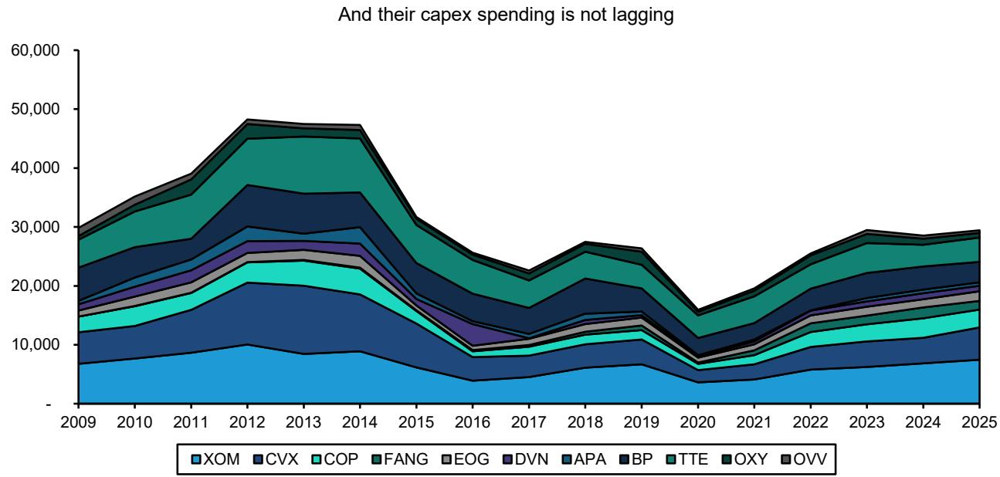

stacked area chart

| Year | XOM  | CVX  | COP  | FANG | EOG  | DVN  | APA  | BP   | TTE  | OXY  | OVV  |
|------|------|------|------|------|------|------|------|------|------|------|------|
| 2009 | 7000 | 5000 | 3000 | 4000 | 2000 | 1000 | 800  | 600  | 500  | 400  | 300  |
| 2010 | 7500 | 5500 | 3500 | 4500 | 2500 | 1200 | 900  | 650  | 550  | 450  | 350  |
| 2011 | 8000 | 6000 | 4000 | 5000 | 3000 | 1500 | 1100 | 700  | 600  | 500  | 400  |
| 2012 | 9000 | 7000 | 5000 | 6000 | 3500 | 1800 | 1300 | 750  | 650  | 550  | 450  |
| 2013 | 8500 | 6500 | 4500 | 5500 | 3200 | 1600 | 1200 | 720  | 620  | 520  | 420  |
| 2014 | 8800 | 6800 | 4800 | 6200 | 3300 | 1700 | 1350 | 780  | 680  | 580  | 480  |
| 2015 | 7500 | 5500 | 4200 | 5800 | 3100 | 1450 | 1250 | 730  | 630  | 530  | 430  |
| 2016 | 6500 | 4800 | 3800 | 5200 | 2900 | 1350 | 1150 | 680  | 580  | 480  | 380  |
| 2017 | 7800 | 5200 | 4100 | 5600 | 3250 | 1550 | 1350 | 735  | 635  | 535  | 435  |
| 2018 | 8200 | 5600 | 4400 | 6100 | 3450 | 1750 | 1550 | 785  | 675  | 575  | 475  |
| 2019 | 7900 | 5450 | 4350 | 5950 | 3450 | 1750 | 1550 | 785  | 675  | 575  | 475  |
| 2020 | 6800 | 4950 | 3950 | 5450 | 3150 | 1450 | 1350 | 695  | 615  | 495  | 415  |
| 2021 | 7250 | 5150 | 4150 | 5750 | 3350 | 1650 | 1450 | 735  | 645  | 535  | 445  |
| 2022 | 8125| -    | -     | -     | -     | -     | -    | -    | -    | -    | -    |
| 2023 | -     | -    | -     | -     | -     | -     | -    | -    | -    | -    | -    |
| 2024 | -     | -    | -     | -     | -     | -     | -    | -    | -    | -    | -    |
| 2025 | -     | -    | -     | -     | -     | -     | -    | -    | -    | -    | -    |
| Peak (approx.)<lcel><lcel><lcel><lcel><lcel><lcel><lcel><lcel><lcel><lcel><lcel><lcel><lcel><nl>

Source: Rystad, Bloomberg, company reports, Bernstein and analysis

## because shareholders want it?

If we track share price changes since the conflict, it shows the market ‘rewarded’ those returning less CFO to shareholders. We don’t truly believe the causality is correct.

Ultimately we believe that more levered names benefit the most from rising cash flow (allowing for deleveraging, etc.).

We don't believe this is anywhere near a signal to companies to spend.

EXHIBIT 5: Weak correlation, but companies that were less shareholder-friendly based on 1Q26 reporting have actually seen larger share-price gains since the war began.  
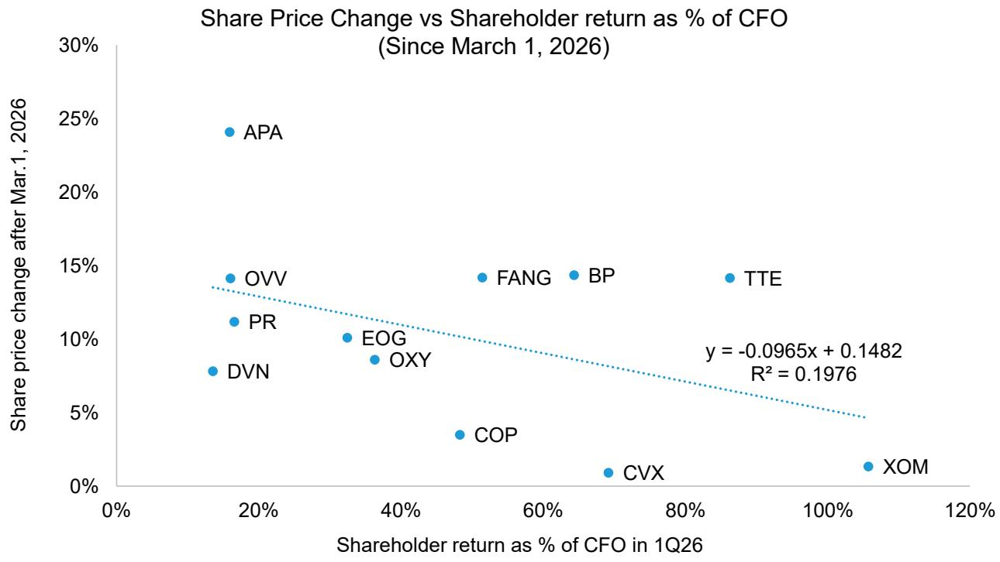

scatterplot

| Company | Shareholder return as % of CFO in 1Q26 | Share price change after Mar.1, 2026 |
|---------|----------------------------------------|--------------------------------------|
| APA     | ~18%                                   | ~24%                                 |
| OVV     | ~17%                                   | ~14%                                 |
| PR      | ~18%                                   | ~11%                                 |
| DVN     | ~13%                                   | ~8%                                  |
| EOG     | ~35%                                   | ~10%                                 |
| OXY     | ~38%                                   | ~9%                                  |
| COP     | ~50%                                   | ~4%                                  |
| FANG    | ~55%                                   | ~14%                                 |
| BP      | ~65%                                   | ~14%                                 |
| TTE     | ~85%                                   | ~14%                                 |
| CVX     | ~70%                                   | ~1%                                  |
| XOM     | ~105%                                  | ~1%                                  |

Source: Bloomberg, Bernstein and analysis

Similarly, if we look at the correlation between share price and shareholder return from 2023 to the outbreak of the war, there is no clear ‘signal’ from investors.

EXHIBIT 6: and the correlation is weaker before the war began  
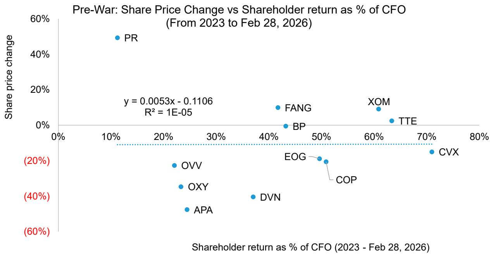

scatterplot

Pre-War: Share Price Change vs Shareholder Return as % of CFO (From 2023 to Feb 28, 2026)
| Company | Shareholder return as % of CFO (2023 - Feb 28, 2026) (%) | Share price change (%) |
| :--- | :--- | :--- |
| PR | 11 | 49 |
| FANG | 43 | 10 |
| BP | 45 | 0 |
| XOM | 61 | 8 |
| TTE | 64 | 2 |
| CVX | 71 | -15 |
| OVV | 23 | -18 |
| OXY | 24 | -35 |
| APA | 25 | -37 |
| DVN | 38 | -41 |
| EOG | 50 | -19 |
| COP | 51 | -19 |
The chart displays a scatter plot with labels indicating company codes (e.g., PR, FANG, TTE, CVX). The y-value is calculated as 0.0053x - 0.1106 (R² = 1E-05).

Source: Bloomberg, company reports, Bernstein and analysis

While there is a correlation between capex growth and shareholder returns, it is relatively weak and is underpinned by 3 names who have been aggressively consolidating the Permian Basin (XOM, FANG, and PR). If anything the market is rewarding reasonable deal making that creates larger enterprises that of course require larger capital programs (even for simply maintenance capex).

EXHIBIT 7: US E&P's high capex growth does not translate to high share price  
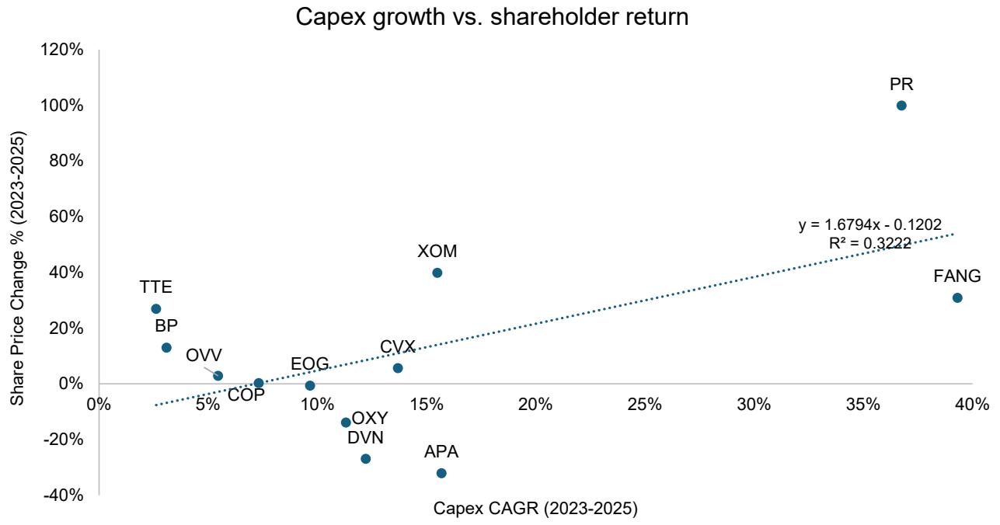

scatter plot

| Company | Capex CAGR (2023-2025) | Share Price Change % (2023-2025) |
|---------|--------------------------|----------------------------------|
| TTE     | ~2%                      | ~28%                             |
| BP      | ~3%                      | ~14%                             |
| OVV     | ~5%                      | ~3%                              |
| COP     | ~7%                      | ~0%                              |
| EOG     | ~10%                     | ~0%                              |
| CVX     | ~14%                     | ~6%                              |
| OXY     | ~12%                     | ~-15%                            |
| DVN     | ~13%                     | ~-28%                            |
| APA     | ~16%                     | ~-35%                            |
| XOM     | ~16%                     | ~40%                             |
| PR      | ~37%                     | ~100%                            |
| FANG    | ~39%                     | ~30%                             |

Source: Bloomberg, Bernstein and analysis

## WHAT...

...TYPE OF BARRELS TO INVEST IN?

## Deepwater and beyond

We highlight (in a slightly different layout) that in the same way that the shallow water took share of resources discovered from onshore, the deepwater, and then the ultradeepwater rose. The “freshest” discoveries are thus some of the most complicated.

EXHIBIT 8: The world needs more deepwater projects  
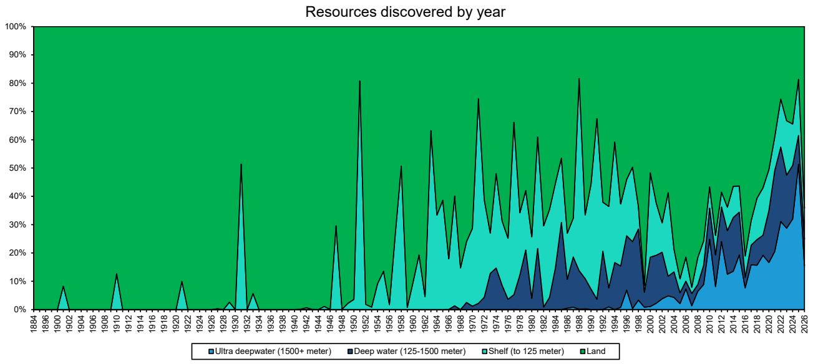

area chart

| Year | Ultra deepwater (1500+ meter) | Deep water (125-1500 meter) | Shelf (to 125 meter) | Land |
| --- | --- | --- | --- | --- |
| 1884 | 0% | 0% | 0% | 100% |
| 1896 | 0% | 0% | 0% | 100% |
| 1900 | 0% | 0% | 0% | 100% |
| 1902 | 0% | 0% | 0% | 100% |
| 1904 | 0% | 0% | 0% | 100% |
| 1906 | 0% | 0% | 0% | 100% |
| 1908 | 0% | 0% | 0% | 100% |
| 1910 | 0% | 0% | 0% | 100% |
| 1912 | 0% | 0% | 0% | 100% |
| 1914 | 0% | 0% | 0% | 100% |
| 1916 | 0% | 0% | 0% | 100% |
| 1918 | 0% | 0% | 0% | 100% |
| 1920 | 0% | 0% | 0% | 100% |
| 1922 | 0% | 0% | 0% | 100% |
| 1924 | 0% | 0% | 0% | 100% |
| 1926 | 0% | 0% | 0% | 100% |
| 1928 | 0% | 0% | 0% | 100% |
| 1930 | 0% | 50% | 0% | 100% |
| 1932 | 0% | 0% | 5% | 100% |
| 1934 | 0% | 0% | 5% | 100% |
| 1936 | 0% | 0% | 5% | 100% |
| 1938 | 0% | 0% | 5% | 100% |
| 1940 | 0% | 0% | 5% | 100% |
| 1942 | 0% | 0% | 5% | 100% |
| 1944 | 0% | 0% | 5% | 100% |
| 1946 | 0% | 30% | 5% | 100% |
| 1948 | 5% | 5% | 5% | 100% |
| 1950 | 5% | 5% | 5% | 100% |
| 1952 | 5% | 5% | 5% | 100% |
| 1954 | 5% | 5% | 5% | 100% |
| 1956 | 5% | 5% | 5% | 100% |
| 1958 | 5% | 5% | 5% | 100% |
| 1960 | 5% | 5% | 5% | 100% |
| 1962 | 5% | 5% | 5% | 100% |
| 1964 | 5% | 5% | 5% | 100% |
| 1966 | 5% | 5% | 5% | 100% |
| 1968 | 5% | 5% | 5% | 100% |
| 1970 | 5% | 5% | 5% | 100% |
| 1972 | 5% | 5% | 5% | 100% |
| 1974 | 5% | 5% | 5% | 100% |
| 1976 | 5% | 5% | 5% | 100% |
| 1978 | 5% | 5% | 5% | 100% |
| 1980 | 5% | 5% | 5% | 100% |
| 1982 | 5% | 5% | 5% | 100% |
| 1984 | 5% | 5% | 5% | 100% |
| 1986 | 5% | 5% | 5% | 100% |
| 1988 | 5% | 5% | 5% | 100% |
| 1990 | 5% | 5% | 5% | 100% |
| 1992 | 5% | 5% | 5% | 100% |
| 1994 | 5% | 5% | 5% | 100% |
| 1996 | 5% | 5% | 5% | 100% |
| 1998 | 5% | 5% | 5% | 100% |
| 2000 | - | - | - | - |
| 2002 | - | - | - | - |
| 2004 | - | - | - | - |
| 2006 | - | - | - | - |
| 2008 | - | - | - | - |
| 2010 | - | - | - | - |
| 2012 | - | - | - | - |
| 2014 | - | - | - | - |
| 2016 | - | - | - | - |
| 2018 | - | - | - | - |

Source: Rystad, Bernstein and analysis

Ultimately many past resource discoveries become producing fields (61%). And a small proportion are in progress. We do note a large inventory of discoveries that lie dormant and never move forward (despite improving technologies and periodically attractive oil prices).

EXHIBIT 9: Of the \~1.5 trillion bbl of resources discovered globally since 1900, about 32% remain idle (at the discovery stage).  
32% of discoveries in last century sit undeveloped Life cycle of total discoverd resources from 1900 to 2026  
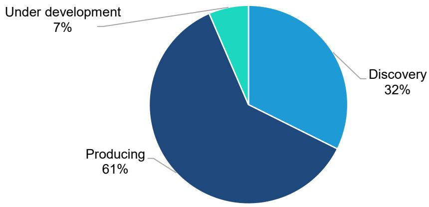

pie chart

| Category | Percentage (%) |
| :--- | :--- |
| Under development | 7 |
| Producing | 61 |
| Discovery | 32 |

Source: Rystad, Benjamin research and analysis

We don't believe in an inventory of “shovel ready” projects waiting for a more certain price. Ultimately we believe that most deepwater discoveries are binary outcomes. They are large enough to sanction relatively soon or were too small to be declared a resource. That suggests a relatively poor pipeline of “almost good enough” deepwater resources that suddenly move “into the money”.

[In our black book (Bernstein E&P Primer: Someday You'll Need This Book), we compare project cycles and execution challenges across different types of projects.]

A typical generic major project cycle in detail: Capex is spent for up to 10 years before first oil, which can then run for 15 - 30 years a t a fairly flat production profile.

EXHIBIT 10: Offshore projects require heavy capex before production  
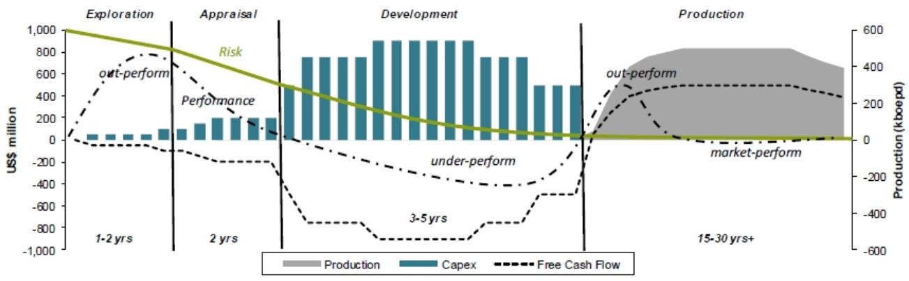

bar-line hybrid chart

| Category       | Capex (US$ million) | Free Cash Flow (kboepd) |
| -------------- | ------------------- | ----------------------- |
| Exploration    | ~0                  | ~1000                   |
| 1-2 yrs        | ~0                  | ~800                    |
| 2 yrs          | ~0                  | ~600                    |
| Development    | ~800                | ~400                    |
| 3-5 yrs        | ~-800               | ~-400                   |
| Production     | ~600                | ~400                    |
| 15-30 yrs+     | ~600                | ~200                    |

Source: Company reports, Bernstein analysis

## Shale

We observe that activity towards shale (as defined by frac spread counts and horizontal oil rigs) is well behaved. It rose following Covid-19 and plateaued during the heights of the invasion of Ukraine by Russia. It has tracked down since and is holding sub 400 even now months after hostilities in Iran.

EXHIBIT 11: Frac Spread & Hz Oil Rigs  
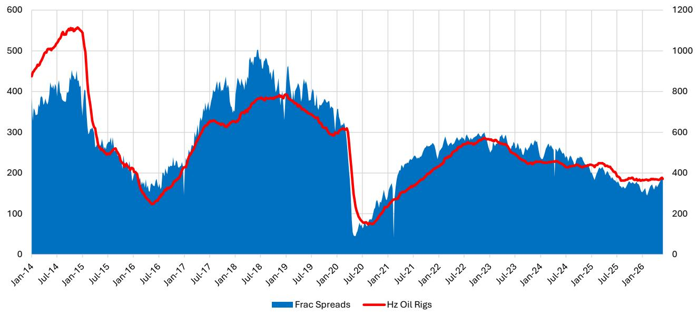

bar-line hybrid chart

| Date    | Frac Spreads | Hz Oil Rigs |
|---------|--------------|-------------|
| Jan-14  | ~350         | ~900        |
| Jul-14  | ~400         | ~1050       |
| Jan-15  | ~450         | ~1100       |
| Jul-15  | ~300         | ~700        |
| Jan-16  | ~250         | ~500        |
| Jul-16  | ~150         | ~300        |
| Jan-17  | ~200         | ~400        |
| Jul-17  | ~350         | ~600        |
| Jan-18  | ~450         | ~700        |
| Jul-18  | ~500         | ~750        |
| Jan-19  | ~450         | ~750        |
| Jul-19  | ~400         | ~700        |
| Jan-20  | ~350         | ~600        |
| Jul-20  | ~50          | ~150        |
| Jan-21  | ~150         | ~200        |
| Jul-21  | ~250         | ~300        |
| Jan-22  | ~280         | ~400        |
| Jul-22  | ~300         | ~500        |
| Jan-23  | ~320         | ~550        |
| Jul-23  | ~300         | ~500        |
| Jan-24  | ~280         | ~450        |
| Jul-24  | ~250         | ~450        |
| Jan-25  | ~220         | ~450        |
| Jul-25  | ~200         | ~450        |
| Jan-26  | ~180         | ~450        |

Source: EIA; Bloomberg; Bernstein analysis

The plateauing of activity combined with declines (and roughly flat productivity) have resulting in flat production.

EXHIBIT 12: Shale supply has plateaued at \~10 mln bopd  
Shale production by quarterly wedge  
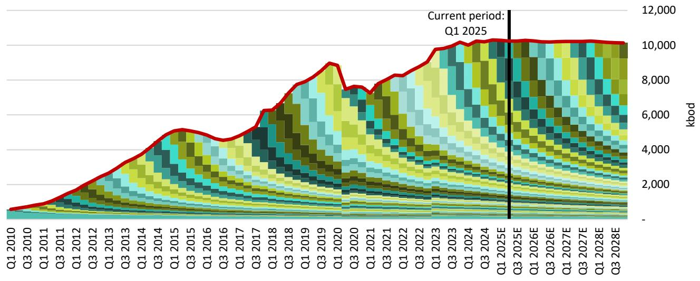

area chart

| Quarter     | Value (kbod) |
| ----------- | ------------ |
| Current period: Q1 2025 | 10,000       |

Source: Enverus, EIA, Baker Hughes, Primary Vision, Bernstein analysis and estimates

## Oil sands

One place to which capital could flow is into oil sands. Venezuela has the world's largest resource and clearly positive momentum is occurring there. Canada (in terms of bitumen) ranks second and has positive momentum as well (technologies focused on modular development are being deployed which have shortened cycle times and capital outlays at comparable returns).

In either case, such projects are typically integrated (upstream investment tied to midstream takeaway and perhaps downstream upgrading) and thus capital intensive, are long-lived (and so sensitive to price, risk and discount rates) and in the case of Venezuela geopolitically conflicted.

We'd measure the supply response from such regions in the 0.1 mln bopd scale in coming years and not 1.0 mln bopd scale.

EXHIBIT 13: Venezuela and Canada oil sands resources are massive  
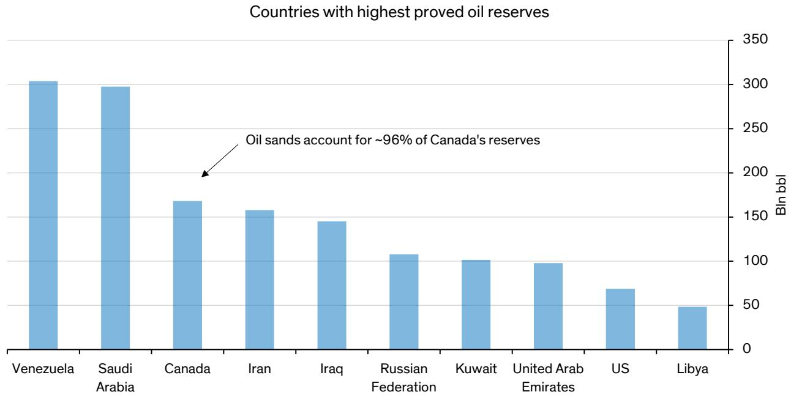

bar chart

| Country           | Oil Sands (bbl) |
| ----------------- | --------------- |
| Venezuela         | 300             |
| Saudi Arabia      | 295             |
| Canada            | 170             |
| Iran              | 160             |
| Iraq              | 145             |
| Russian Federation| 110             |
| Kuwait            | 100             |
| United Arab Emirates | 95          |
| US                | 70              |
| Libya             | 50              |

Source: El Statistical Review, Bernstein analysis

## Everything else

What else can be invested in? Ultimately what remains can be seen in the chart above - onshore OPEC+ producers. We tackle that below under “Where”.

## WHO...

## ...WILL INVEST?

National oils (NOCs) are the largest share of capex.

EXHIBIT 14: We expect development capex to tick up slightly in 2027, but remain broadly flat versus 2025 levels.  
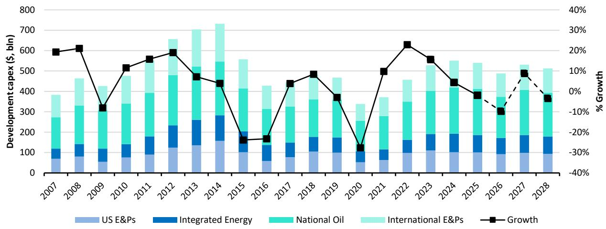

bar-line hybrid

| Year | US E&Ps | Integrated Energy | National Oil | International E&Ps | Growth |
|------|---------|-------------------|--------------|---------------------|--------|
| 2007 | ~70     | ~60               | ~150         | ~380                | ~60%   |
| 2008 | ~80     | ~70               | ~180         | ~450                | ~62%   |
| 2009 | ~70     | ~70               | ~150         | ~420                | ~-10%  |
| 2010 | ~80     | ~80               | ~180         | ~470                | ~15%   |
| 2011 | ~90     | ~90               | ~200         | ~500                | ~18%   |
| 2012 | ~120    | ~130              | ~220         | ~650                | ~25%   |
| 2013 | ~130    | ~150              | ~230         | ~700                | ~15%   |
| 2014 | ~150    | ~180              | ~250         | ~730                | ~12%   |
| 2015 | ~110    | ~110              | ~180         | ~550                | ~-25%  |
| 2016 | ~60     | ~70               | ~150         | ~420                | ~-25%  |
| 2017 | ~80     | ~80               | ~180         | ~350                | ~-15%  |
| 2018 | ~90     | ~90               | ~200         | ~380                | ~-5%   |
| 2019 | ~90     | ~90               | ~210         | ~450                | ~-15%  |
| 2020 | ~60     | ~60               | ~150         | ~330                | ~-35%  |
| 2021 | ~80     | ~80               | ~180         | ~370                | ~-15%  |
| 2022 | ~90     | ~90               | ~220         | ~450                | ~35%   |
| 2023 | ~90     | ~90               | ~230         | ~550                | ~35%   |
| 2024 | ~90     | ~90               | ~240         | ~580                | ~-5%   |
| 2025 | ~90     | ~90               | ~230         | ~550                | ~-15%  |
| 2026 | ~90     | ~90               | ~180         | ~480                | -35%   |
| 2027 | ~90     | ~90               | ~230         | ~530                | ~-15%  |
| 2028 | ~90     | ~90               | ~210         | ~510                | -35%   |

Source: Company reports, Rystad Energy, IEA, EIA, Bloomberg, Bernstein analysis and estimates

And are the largest component of capex growth.

EXHIBIT 15: Global Capex Forecast

<table><tr><td>$, bln</td><td>2020</td><td>2021</td><td>2022</td><td>2023</td><td>2024</td><td>2025</td><td>2026e</td><td>2027e</td></tr><tr><td>Development Capex</td><td>338</td><td>372</td><td>457</td><td>528</td><td>551</td><td>540</td><td>500</td><td>531</td></tr><tr><td>% YoY</td><td>-28%</td><td>10%</td><td>23%</td><td>16%</td><td>4%</td><td>-2%</td><td>-8%</td><td>6%</td></tr><tr><td>% Offshore</td><td>34%</td><td>32%</td><td>31%</td><td>32%</td><td>35%</td><td>35%</td><td>36%</td><td>37%</td></tr><tr><td>US E&amp;Ps</td><td>52</td><td>63</td><td>98</td><td>110</td><td>102</td><td>101</td><td>92</td><td>99</td></tr><tr><td>% YoY</td><td>-48%</td><td>21%</td><td>55%</td><td>12%</td><td>-8%</td><td>-1%</td><td>-9%</td><td>7%</td></tr><tr><td>Integrated Energy</td><td>55</td><td>52</td><td>64</td><td>81</td><td>91</td><td>85</td><td>79</td><td>87</td></tr><tr><td>% YoY</td><td>-27%</td><td>-4%</td><td>23%</td><td>26%</td><td>12%</td><td>-7%</td><td>-7%</td><td>10%</td></tr><tr><td>National Oil</td><td>149</td><td>163</td><td>188</td><td>212</td><td>226</td><td>226</td><td>214</td><td>221</td></tr><tr><td>% YoY</td><td>-19%</td><td>9%</td><td>15%</td><td>13%</td><td>7%</td><td>0%</td><td>-5%</td><td>3%</td></tr><tr><td>Reinvestment rate</td><td>44%</td><td>27%</td><td>22%</td><td>32%</td><td>36%</td><td>40%</td><td>36%</td><td>34%</td></tr><tr><td>International E&amp;Ps</td><td>82</td><td>92</td><td>106</td><td>125</td><td>132</td><td>128</td><td>114</td><td>124</td></tr><tr><td>% YoY</td><td>-24%</td><td>13%</td><td>15%</td><td>18%</td><td>5%</td><td>-3%</td><td>-11%</td><td>9%</td></tr><tr><td>Exploration Capex</td><td>51</td><td>54</td><td>59</td><td>58</td><td>62</td><td>62</td><td>58</td><td>62</td></tr><tr><td>% YoY</td><td>-5%</td><td>6%</td><td>8%</td><td>-1%</td><td>6%</td><td>0%</td><td>-6%</td><td>8%</td></tr><tr><td>% US onshore</td><td>13%</td><td>12%</td><td>11%</td><td>11%</td><td>10%</td><td>10%</td><td>8%</td><td>7%</td></tr><tr><td>% Offshore</td><td>50%</td><td>53%</td><td>50%</td><td>46%</td><td>48%</td><td>48%</td><td>49%</td><td>49%</td></tr></table>

Source: Company reports, Rystad Energy, IEA, EIA, Bloomberg, Bernstein analysis and estimates

We knew North America E&P remains disciplined. U.S. operators may raise capital selectively, but they are not abandoning capital discipline.

EXHIBIT 16: We expect the decline in US onshore capex seen in 2025 to accelerate in 2026  
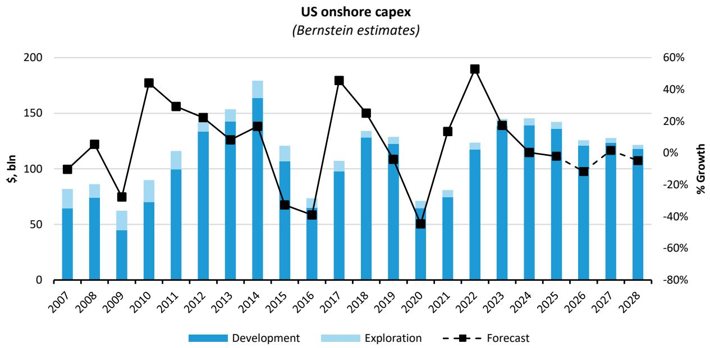

bar-line hybrid

US onshore capex (Bernstein estimates)
| Year | Development ($, bln) | Exploration ($, bln) | Forecast (% Growth) |
| :--- | :--- | :--- | :--- |
| 2007 | 65 | 30 | -10 |
| 2008 | 75 | 35 | 15 |
| 2009 | 45 | 35 | -25 |
| 2010 | 70 | 35 | 45 |
| 2011 | 100 | 45 | 30 |
| 2012 | 135 | 45 | 25 |
| 2013 | 145 | 55 | 15 |
| 2014 | 165 | 75 | 25 |
| 2015 | 105 | 45 | -30 |
| 2016 | 65 | 45 | -35 |
| 2017 | 95 | 45 | 45 |
| 2018 | 130 | 45 | 25 |
| 2019 | 125 | 45 | 10 |
| 2020 | 60 | 35 | -45 |
| 2021 | 75 | 35 | 15 |
| 2022 | 115 | 45 | 55 |
| 2023 | 135 | 45 | 15 |
| 2024 | 140 | 45 | 5 |
| 2025 | 135 | 45 | 5 |
| 2026 | 120 | 45 | -10 |
| 2027 | 125 | 45 | -5 |
| 2028 | 115 | 45 | -10 |

Source: Company reports, Rystad Energy, IEA, EIA, Bloomberg, Bernstein analysis and estimates

## WHERE...

## ...TO INVEST?

We argue that many places within OPEC+ with significant resources the most stringent fiscal terms in Bernstein Energy & Power: Is this the dumbest thing that big oil companies can do in 2026? .

EXHIBIT 17: Range of fiscal take by country  
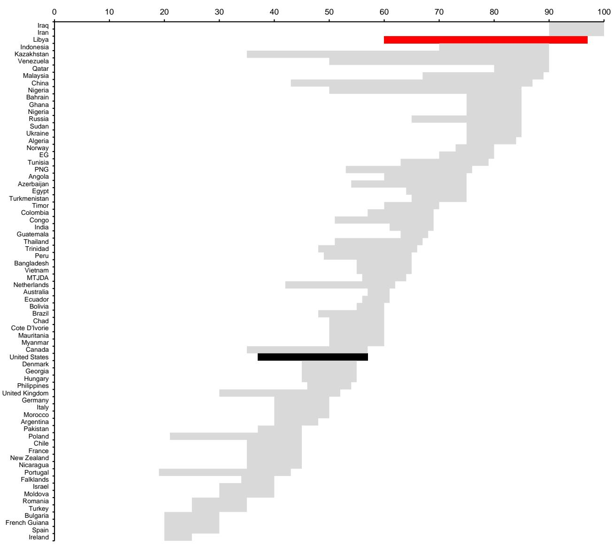

bar chart

| Country | Value |
| :--- | :--- |
| Iraq | 100 |
| Iran | 98 |
| Libya | 62 |
| Indonesia | 60 |
| Kazakhstan | 58 |
| Venezuela | 57 |
| Qatar | 56 |
| Malaysia | 55 |
| China | 54 |
| Nigeria | 53 |
| Bahrain | 52 |
| Ghana | 51 |
| Nigeria | 50 |
| Russia | 49 |
| Sudan | 48 |
| Ukraine | 47 |
| Algeria | 46 |
| Norway | 45 |
| EG | 44 |
| Tunisia | 43 |
| PNG | 42 |
| Angola | 41 |
| Azerbaijan | 40 |
| Egypt | 39 |
| Turkmenistan | 38 |
| Timor | 37 |
| Colombia | 36 |
| Congo | 35 |
| India | 34 |
| Guatemala | 33 |
| Thailand | 32 |
| Trinidad | 31 |
| Peru | 30 |
| Bangladesh | 29 |
| Vietnam | 28 |
| MTJDA | 27 |
| Netherlands | 26 |
| Australia | 25 |
| Ecuador | 24 |
| Bolivia | 23 |
| Brazil | 22 |
| Chad | 21 |
| Cote d'Ivoire | 20 |
| Mauritania | 19 |
| Myanmar | 18 |
| Canada | 17 |
| United States | 16 |
| Denmark | 15 |
| Georgia | 14 |
| Hungary | 13 |
| Philippines | 12 |
| United Kingdom | 11 |
| Germany | 10 |
| Italy | 9 |
| Morocco | 8 |
| Argentina | 7 |
| Pakistan | 6 |
| Poland | 5 |
| Chile | 4 |
| France | 3 |
| New Zealand | 2 |
| Nicaragua | 1 |
| Portugal | 0 |
| Falklands | -1 |
| Israel | -2 |
| Moldova | -3 |
| Romania | -4 |
| Turkey | -5 |
| Bulgaria | -6 |
| French Guiana | -7 |
| Spain | -8 |
| Ireland | -9 |

Source: Literature search; Bernstein estimates & analysis

And in some cases can have poor transparency.

EXHIBIT 18: Corruption Index by country  

bar chart

| Country | Value |
| :--- | :--- |
| Denmark | 90 |
| Singapore | 85 |
| Luxembourg | 82 |
| Switzerland | 80 |
| Netherlands | 78 |
| Iceland | 76 |
| Estonia | 74 |
| Canada | 72 |
| Hong Kong | 70 |
| Seychelles | 68 |
| United Kingdom | 66 |
| Barbados | 64 |
| Austria | 62 |
| Taiwan | 60 |
| United States | 58 |
| Korea, South | 56 |
| Lithuania | 54 |
| Cabo Verde | 52 |
| Slovenia | 50 |
| Qatar | 48 |
| Saudi Arabia | 46 |
| Botswana | 44 |
| Rwanda | 42 |
| Czechia | 40 |
| Spain | 38 |
| Oman | 36 |
| Bahrain | 34 |
| Poland | 32 |
| Malaysia | 30 |
| Greece | 28 |
| Namibia | 26 |
| Armenia | 24 |
| Kuwait | 22 |
| Montenegro | 20 |
| Benin | 18 |
| Sao Tome and Principe | 16 |
| Jamaica | 14 |
| Timor-Leste | 12 |
| China | 10 |
| Solomon Islands | 8 |
| Ghana | 6 |
| Cuba | 4 |
| South Africa | 2 |
| Trinidad and Tobago | 0 |
| North Macedonia | -2 |
| Vietnam | -4 |
| Guyana | -6 |
| Zambia | -8 |
| India | -10 |
| Argentina | -12 |
| Indonesia | -14 |
| Morocco | -16 |
| Serbia | -18 |
| Algeria | -20 |
| Malawi | -22 |
| Niger | -24 |
| Turkey | -26 |
| Bosnia and Herzegovina | -28 |
| Mongolia | -30 |
| Philippines | -32 |
| Angola | -34 |
| Kenya | -36 |
| Togo | -38 |
| Djibouti | -40 |
| Peru | -42 |
| El Salvador | -44 |
| Bolivia | -46 |
| Eswatini | -48 |
| Liberia | -50 |
| Pakistan | -52 |
| Iraq | -54 |
| Mexico | -56 |
| Uganda | -58 |
| Kyrgyzstan | -60 |
| Central African Republic | -62 |
| Bangladesh | -64 |
| Iran | -66 |
| Honduras | -68 |
| Russia | -70 |
| Chad | -72 |
| Guinea-Bissau | -74 |
| DR Congo | -76 |
| Afghanistan | -78 |
| Turkmenistan | -80 |
| Myanmar | -82 |
| Sudan | -84 |
| Equatorial Guinea | -86 |
| Libya | -88 |
| Syria | -90 |
| Somalia | -92 |

Source: Transparency.org, Bernstein analysis

The challenge is thus: Where one can invest in future oil supply doesn't match where one can profitably and safely invest.

## WHEN...

## ...TO INVEST

Historically, higher oil prices led to rapid activity growth. The current cycle has yet to show a comparable rig response.

EXHIBIT 19: Flag rig count in US and in the world.  
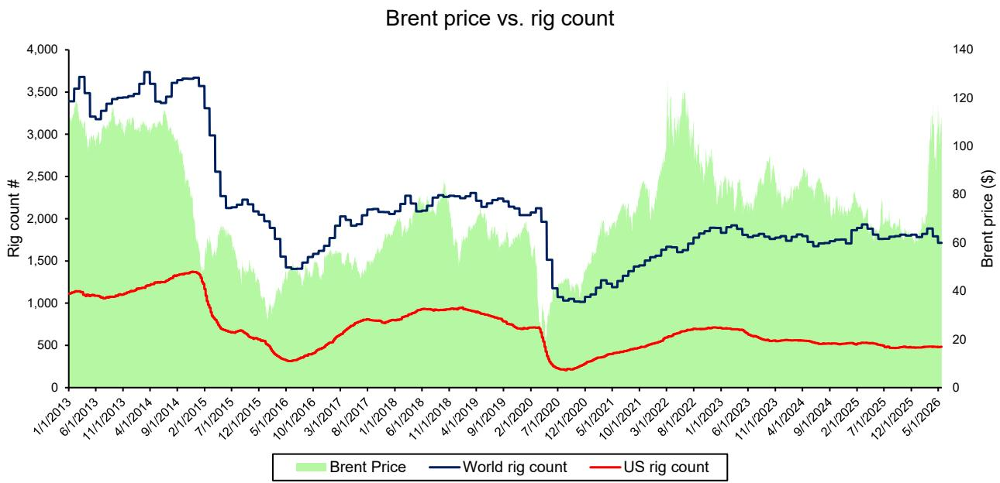

line chart

| Date       | Brent Price | World rig count | US rig count |
| ---------- | ----------- | --------------- | ------------ |
| 1/1/2013   | ~3,500      | ~3,700          | ~1,100       |
| 6/1/2013   | ~3,400      | ~3,600          | ~1,050       |
| 11/1/2013  | ~3,300      | ~3,500          | ~1,000       |
| 4/1/2014   | ~3,200      | ~3,400          | ~950         |
| 9/1/2014   | ~3,100      | ~3,300          | ~900         |
| 2/1/2015   | ~3,000      | ~3,200          | ~850         |
| 7/1/2015   | ~2,800      | ~3,100          | ~800         |
| 12/1/2015  | ~2,600      | ~3,000          | ~750         |
| 5/1/2016   | ~2,400      | ~2,900          | ~700         |
| 10/1/2016  | ~2,200      | ~2,800          | ~650         |
| 3/1/2017   | ~2,100      | ~2,700          | ~600         |
| 8/1/2017   | ~2,000      | ~2,600          | ~550         |
| 1/1/2018   | ~1,900      | ~2,500          | ~500         |
| 6/1/2018   | ~1,800      | ~2,400          | ~450         |
| 11/1/2018  | ~1,700      | ~2,300          | ~400         |
| 4/1/2019   | ~1,600      | ~2,200          | ~350         |
| 9/1/2019   | ~1,500      | ~2,100          | ~300         |
| 2/1/2020   | ~1,400      | ~2,000          | ~250         |
| 7/1/2020   | ~1,300      | ~1,900          | ~200         |
| 12/1/2020  | ~1,200      | ~1,800          | ~150         |
| 5/1/2021   | ~1,100      | ~1,700          | ~150         |
| 10/1/2021  | ~1,200      | ~1,800          | ~160         |
| 3/1/2022   | ~1,300      | ~1,900          | ~170         |
| 8/1/2022   | ~1,400      | ~2,000          | ~180         |
| 1/1/2023   | ~1,500      | ~2,100          | ~190         |
| 6/1/2023   | ~1,600      | ~2,200          | ~200         |
| 11/1/2023  | ~1,700      | ~2,300          | ~210         |
| 4/1/2024   | ~1,800      | ~2,400          | ~220         |
| 9/1/2024   | ~1,900      | ~2,500          | ~230         |
| 2/1/2025   | ~2,000      | ~2,600          | ~240         |
| 7/1/2025   | ~2,100      | ~2,700          | ~250         |
| 12/1/2025  | ~2,200      | ~2,800          | ~260         |
| 5/1/2026   | ~2,300      | ~2,900          | ~270         |

Source: Baker Hughes, Bloomberg, EIA, Bernstein and analysis

In prior supercycles, service companies were often among the earliest and most confident guides to raise expectations, but not this time... We did not see out sized profitability or an aggressive capex ramp.

EXHIBIT 20: Even companies closest to the spending cycle are not behaving as if a capex supercycle is underway.

<table><tr><td>FY2026 Guidance(Recent Q vs. previous Q)</td><td>Profitability</td><td>CAPEX</td></tr><tr><td>SLB</td><td>2Q margin negatively impacted</td><td>Flat</td></tr><tr><td>BKR</td><td>Flat</td><td>Flat</td></tr><tr><td>RIG</td><td>Revenue range slightly decreased</td><td>Increased to $150M from $130M</td></tr><tr><td>HAL</td><td>n/a (mentioned customer caution)</td><td>Flat</td></tr><tr><td>HP</td><td>Flat</td><td>Flat</td></tr></table>

Source: Comapny reports, Bernstein and analysis

Finally, we highlight that oil price has outperformed E&P equities year to date. The thesis of higher for longer prices driving better than historic volume growth is not one that we find resonating.

Instead we'd suggest that as we exit the current crisis and the Strait reopens, the dominant theme will be a comfortable oil price with a powerful floor (refilling strategic reserves at \$70+?) where excess free cash flow is rapidly collected by E&Ps and returned to shareholders.

EXHIBIT 21: Relative XOP lag supports a catch-up setup.  
Relatively performance of XOP & WTI YTD  
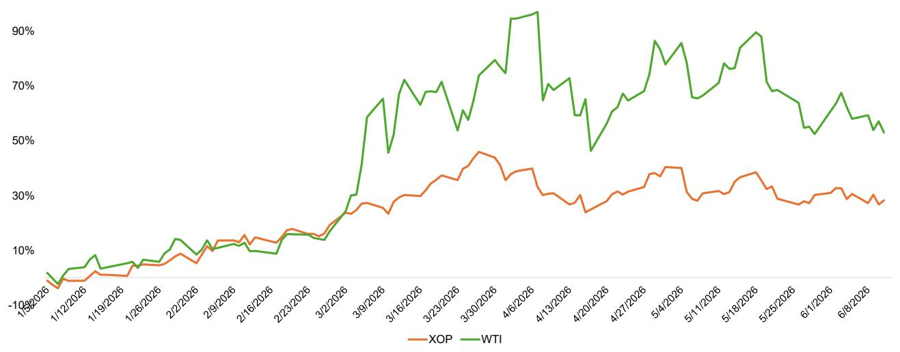

line chart

| Date       | XOP  | WTI  |
| ---------- | ---- | ---- |
| 1/1/2026   | -7%  | -5%  |
| 1/12/2026  | -5%  | -3%  |
| 1/19/2026  | -4%  | -2%  |
| 1/26/2026  | -3%  | -1%  |
| 2/2/2026   | -2%  | 0%   |
| 2/9/2026   | -1%  | 1%   |
| 2/16/2026  | 0%   | 2%   |
| 2/23/2026  | 1%   | 3%   |
| 3/2/2026   | 2%   | 4%   |
| 3/9/2026   | 3%   | 5%   |
| 3/16/2026  | 4%   | 6%   |
| 3/23/2026  | 5%   | 7%   |
| 3/30/2026  | 6%   | 8%   |
| 4/6/2026   | 7%   | 9%   |
| 4/13/2026  | 8%   | 10%  |
| 4/20/2026  | 9%   | 11%  |
| 4/27/2026  | 10%  | 12%  |
| 5/4/2026   | 11%  | 13%  |
| 5/11/2026  | 12%  | 14%  |
| 5/18/2026  | 13%  | 15%  |
| 5/25/2026  | 14%  | 16%  |
| 6/1/2026   | 15%  | 17%  |
| 6/8/2026   | 16%  | 18%  |

Source: Bloomberg, Bernstein and analysis

## I. REQUIRED DISCLOSURES

References to "Bernstein" or the "Firm" in these disclosures relate to the following entities: Bernstein Institutional Services LLC (April 1, 2024 onwards), Bernstein & Co., LLC (pre April 1, 2024), Bernstein Autonomous LLP, BSG France S.A. (April 1, 2024 onwards), Bernstein (Hong Kong) Limited 盛博香港有限公司, Bernstein (Canada) Limited, Bernstein (India) Private Limited (SEBI registration no. INH000006378), Bernstein (Singapore) Private Limited, Bernstein Japan KK (サンフォード・C・バーンスタイン株式会社) and analysts employed by SG Africa Technologies & Services to produce Bernstein under a Global Services Agreement in place between Bernstein and SG.

Bernstein is part of a joint venture between SG (SG) and AllianceBernstein, L.P. (AB). Unless specifically noted otherwise, for purposes of these disclosures, references to Bernstein's “affiliates” relate to both SG and AB and their respective affiliates.

## VALUATION METHODOLOGY

This research publication covers six or more companies. For valuation methodology and other company disclosures:

Please visit: https://bernstein-autonomous.bluematrix.com/sellside/Disclosures.action.

Or, you can also write to the Director of Compliance, Bernstein Institutional Services LLC, 245 Park Avenue, New York, NY 10167.

## RISKS

This research publication covers six or more companies. For risks and other company disclosures:

Please visit: https://bernstein-autonomous.bluematrix.com/sellside/Disclosures.action.

Or, you can also write to the Director of Compliance, Bernstein Institutional Services LLC, 245 Park Avenue, New York, NY 10167.

## RATINGS DEFINITIONS, BENCHMARKS AND DISTRIBUTION

## EQUITY RATINGS DEFINITIONS

## Bernstein brand

The Bernstein brand rates stocks based on forecasts of relative performance for the next 12 months versus the S&P 500 for stocks listed on the U.S. and Canadian exchanges, versus the Bloomberg Europe Developed Markets Large and Mid Cap Price Return Index EUR (EDME) for stocks listed on the European exchanges and emerging markets exchanges outside of the Asia Pacific region, versus the Bloomberg Japan Large and Mid Cap Price Return Index USD (JPL) for stocks listed on the Japanese exchanges, and versus the Bloomberg Asia ex-Japan Large and Mid Cap Price Return Index (ASIAX) for stocks listed on the Asian (ex-Japan) exchanges -unless otherwise specified.

The Bernstein brand has three categories of ratings:

- Outperform: Stock will outpace the market index by more than 15 pp  
• Market-Perform: Stock will perform in line with the market index to within +/-15 pp  
• Underperform: Stock will trail the performance of the market index by more than 15 pp

Coverage Suspended: Coverage of a company under the Bernstein brand has been suspended. Ratings and price targets are suspended temporarily, are no longer current, and should therefore not be relied upon.

Not Rated: A rating assigned when the stock cannot be accurately valued, or the performance of the company accurately predicted, at the present time. The covering analyst may continue to publish research reports on the company to update investors on events and developments.

Not Covered (NC) denotes companies that are not under coverage.

Bernstein brand stock ratings are based on a 12-month time horizon.

## Autonomous brand – common stocks

The Autonomous brand rates common stocks as indicated below. As our benchmarks we use the Bloomberg Europe 500 Banks And Financial Services Index (BEBANKS) and Bloomberg Europe Dev Mkt Financials Large and Mid Cap Price Ret Index EUR (EDMFI) index for developed European banks and Payments, the Bloomberg Europe 500 Insurance Index (BEINSUR) for European insurers, the S&P 500 and S&P Financials for US banks and Payments coverage, S5LIFE for US Insurance, the S&P Insurance Select Industry (SPSIINS) for US Non-Life Insurers coverage, and the Bloomberg Emerging Markets Financials Large, Mid and Small Cap Price Return Index (EMLSF) for emerging market banks and insurers and Payments. Ratings are stated relative to the sector (not the market).

The Autonomous brand has three categories of common stock ratings:

- Outperform (OP): Stock will outpace the relevant index by more than 10 pp  
- Neutral (N): Stock will perform in line with the market index to within +/-10 pp  
• Underperform (UP): Stock will trail the performance of the relevant index by more than 10 pp

Coverage Suspended: Coverage of a company under the Autonomous research brand has been suspended. Ratings and price targets are suspended temporarily, are no longer current, and should therefore not be relied upon.

Not Rated: A rating assigned when the stock cannot be accurately valued, or the performance of the company accurately predicted, at the present time. The covering analyst may continue to publish research reports on the company to update investors on events and developments.

Those denoted as ‘Feature’ (e.g., Feature Outperform FOP, Feature Under Outperform FUP) are our core ideas.

Not Covered (NC) denotes companies that are not under coverage.

Autonomous brand common stock ratings are based on a 12-month time horizon.

## Autonomous brand – preferred stocks

The Autonomous brand has three categories of preferred stock ratings:

- Outperform (OP): The total return of the preferred instrument is expected to outperform preferred securities of other issuers operating in similar sectors or rating categories over the next six months.  
- Neutral (N): The total return of the preferred instrument is expected to perform in line with preferred securities of other issuers operating in similar sectors or rating categories over the next six months.  
- Underperform (UP): The total return of the preferred instrument is expected to underperform preferred securities of other issuers operating in similar sectors or rating categories over the next six months.

Autonomous preferred stock ratings are based on a 6-month time horizon.

## AUTONOMOUS CREDIT RESEARCH

Where this report contains investment recommendations for credit instruments, as defined in article 3(1)(35) of the Market Abuse Regulation, the information below is presented to comply with its disclosure requirements.

The report may also include reference(s) to published opinions by other Autonomous or Bernstein analysts covering the equity securities of the issuer(s) referenced herein. Please note an investment recommendation for credit instruments published by the author(s) of this report may differ from the published view of the analyst covering equity securities for the issuer(s) contained in this report and vice versa.

## CREDIT RATINGS DEFINITIONS

The Autonomous brand has three categories of credit ratings:

\- Credit Outperform (C-OP): The total return of the Reference Credit Instrument is expected to outperform the credit spread of bonds of other issuers operating in similar sectors or rating categories over the next six months.

- Credit Neutral (C-N): The total return of the Reference Credit Instrument is expected to perform in line with the credit spread of bonds of other issuers operating in similar sectors or rating categories over the next six months.  
- Credit Underperform (C-UP): The total return of the Reference Credit Instrument is expected to underperform the credit spread of bonds of other issuers operating in similar sectors or rating categories over the next six months.

Autonomous credit ratings are based on a 6-month time horizon.

A list of all investment recommendations produced by the author(s) of this report alongside credit ratings history are available upon request.

It is at the sole discretion of the Firm as to when to initiate, update and cease research coverage. The Firm has established, maintains and relies on information barriers to control the flow of information contained in one or more areas (i.e. the private side) within the Firm, and into other areas, units, groups or affiliates (i.e. public side) of the Firm

DISTRIBUTION OF EQUITY RATINGS/INVESTMENT BANKING SERVICES

<table><tr><td>Equity Rating</td><td>Market Abuse Regulation (MAR) and FINRA Rating Category</td><td>Global Rating Distribution</td><td>Investment Banking Relationships*</td></tr><tr><td>Outperform</td><td>BUY</td><td>51.1%</td><td>16.5%</td></tr><tr><td>Market-Perform (Bernstein Brand) Neutral (Autonomous Brand)</td><td>HOLD</td><td>36.3%</td><td>17.8%</td></tr><tr><td>Underperform</td><td>SELL</td><td>12.6%</td><td>14.9%</td></tr></table>

\* These figures represent the percentage of companies within each equity rating category for which affiliates of Bernstein have provided investment banking services within the previous 12 months.  
As of March 31, 2026. All figures are updated quarterly.

Prior to April 1, 2024, Bernstein & Co., LLC. issued the ratings and price target information in the graph(s) below for the following companies: APA Corp, ConocoPhillips, Chevron Corp, Devon Energy Corp, EQT Corporation, EOG Resources Inc, Kosmos Energy Ltd and Exxon Mobil Corp.

## PRICE CHARTS/ RATINGS AND PRICE TARGET HISTORY

This research publication covers six or more companies. For price chart and other company disclosures, please visit https://bernstein-autonomous.bluematrix.com/sellside/Disclosures.action or you can write to the Director of Compliance, Bernstein Institutional Services LLC, 245 Park Avenue, New York, NY 10167.

EQT Corporation is covered by both the Autonomous and Bernstein brands. For the research ratings and price target history please go to https://bernstein-autonomous.bluematrix.com/sellside/Disclosures.action.

## CONFLICTS OF INTEREST

Bernstein Autonomous LLP or BSG France SA, beneficially, has either a net long or short position of 0.5% or more of the total issued share capital of a class of common equity securities of the following MiFID eligible securities: EOG Resources Inc.

AB and/or its affiliates beneficially own 1% or more of a class of common equity securities of the following company: EOG Resources Inc.

Bernstein and/or affiliates have received compensation for non-investment banking securities-related products or services in the previous twelve months from the following clients: Chevron Corp, Kosmos Energy Ltd and Exxon Mobil Corp.

An affiliate of Bernstein has received compensation for non-investment banking securities-related products or services in the previous twelve months from the following clients: Exxon Mobil Corp.

Certain affiliates of Bernstein act as market maker or liquidity provider in the equities securities of: APA Corp, ConocoPhillips, Chevron Corp, Devon Energy Corp, Diamondback Energy, Inc., EQT Corporation, EOG Resources Inc, Kosmos Energy Ltd and Exxon Mobil Corp.

Certain affiliates of Bernstein act as market maker or liquidity provider in the debt securities of: EQT Corporation.

## OTHER MATTERS

The legal entity(ies) employing the analyst(s) listed in this report, and their location, can be determined by the country code of their phone number, as follows:

+1 Bernstein Institutional Services LLC; New York, New York, USA

+44 Bernstein Autonomous LLP; London UK

+212 SG Africa Technologies & Services; Casablanca, Morocco

+33 BSG France S.A.; Paris, France

+34 BSG France S.A.; Madrid, Spain

+41 Bernstein Autonomous LLP; Geneva, Switzerland

+49 BSG France S.A.; Frankfurt, Germany

+91 Bernstein (India) Private Limited; Mumbai, India

+852 Bernstein (Hong Kong) Limited 盛博香港有限公司; Hong Kong, China

+65 Bernstein (Singapore) Private Limited; Singapore

+81 Bernstein Japan KK; Tokyo, Japan

Where this report has been prepared by research analyst(s) employed by a non-US affiliate, such analyst(s), is/are (unless otherwise expressly noted below) not registered as associated persons of Bernstein Institutional Services LLC or any other SEC-registered broker-dealer and are not licensed or qualified as research analysts with FINRA. Accordingly, such analyst(s) may not be subject to FINRA's restrictions regarding (among other things) communications by research analysts with a subject company, interactions between research analysts and investment banking personnel, participation by research analysts in solicitation and marketing activities relating to investment banking transactions, public appearances by research analysts, and trading securities held by a research analyst account.

Where this report has been prepared by research analyst(s) employed by SG Africa Technologies & Services (part of the SG group of companies), it has been prepared on behalf of a Bernstein company under a Global Services Agreement in place between Bernstein and SG.

## CERTIFICATION

Each research analyst listed in this report, who is primarily responsible for the preparation of the content of this report, certifies that all of the views expressed in this publication accurately reflect that analyst's personal views about any and all of the subject securities or issuers and that no part of that analyst's compensation was, is, or will be, directly or indirectly, related to the specific recommendations or views in this publication.

## II. ADDITIONAL GLOBAL CONFLICT DISCLOSURES

It is at the sole discretion of the Firm as to when to initiate, update and cease research coverage. The Firm has established, maintains and relies on information barriers to control the flow of information contained in one or more areas (i.e., the private side) within the Firm, and into other areas, units, groups or affiliates (i.e., public side) of the Firm.

## III. OTHER IMPORTANT INFORMATION AND DISCLOSURES

Separate branding is maintained for “Bernstein” and “Autonomous” research products.

- Bernstein produces a number of different types of research products including, among others, fundamental analysis and quantitative analysis under both the “Autonomous” and “Bernstein” brands. Recommendations contained within one type of research product may differ from recommendations contained within other types of research products, whether as a result of differing time horizons, methodologies or otherwise. Furthermore, views or recommendations within a research product issued under one brand may differ from views or recommendations under the same type of research product issued under the other brand. The Research Ratings System for the two brands and other information related to those Rating Systems are included in the previous section.  
- Autonomous operates as a separate business unit within the following entities: Bernstein Institutional Services LLC, Bernstein Autonomous LLP, Bernstein (Hong Kong) Limited 盛博香港有限公司 and Bernstein (India) Private Limited. For information relating to “Autonomous” branded products (including certain Sales materials) please visit: www.autonomous.com. For information relating to Bernstein branded products please visit: www.bernsteinresearch.com.

Analysts are compensated based on aggregate contributions to the research franchise as measured by account penetration, productivity and proactivity of investment ideas. No analysts are compensated based on performance in, or contributions to, generating investment banking revenues.

This report has been produced by an independent analyst as defined in Article 3 (1)(34)(i) of EU 596/2014 Market Abuse Regulation (“MAR”) and the same article of MAR as it forms part of United Kingdom domestic law by virtue of the European Union (Withdrawal) Act 2018.

To our readers in the United States: Bernstein Institutional Services LLC, a broker-dealer registered with the U.S. Securities and Exchange Commission (“SEC”) and a member of the U.S. Financial Industry Regulatory Authority, Inc. (“FINRA”) is distributing this publication in the United States and accepts responsibility for its contents. Where this material contains an analysis of debt product(s), such material is intended only for institutional investors and is not subject to the US independence and disclosure standards applicable to debt research prepared for retail investors.

Bernstein Institutional Services LLC may act as principal for its own account or as agent for another person (including an affiliate) in sales or purchases of any security which is a subject of this report. This report does not purport to meet the objectives or needs of any specific individuals, entities or accounts.

To our readers in Canada: If this publication pertains to a Canadian domiciled company, it is being distributed in Canada by Bernstein (Canada) Limited, which is licensed and regulated by the Canadian Investment Regulatory Organization. If the publication pertains to a non-Canadian domiciled company, it is being distributed by Bernstein Institutional Services LLC, which is licensed and regulated by both the SEC and FINRA, into Canada under the International Dealers Exemption.

This document may not be passed onto any person in Canada unless that person qualifies as "permitted client" as defined in Section 1.1 of NI 31-103.

To our readers in Brazil: This report has been prepared by Bernstein Institutional Services LLC, and Banco BTG Pactual S.A. ("BTG") is responsible for the distribution of this report in Brazil.

To readers in the United Kingdom: This publication has been issued or approved for issue in the United Kingdom by Bernstein Autonomous LLP, authorised and regulated by the Financial Conduct Authority and located at 60 London Wall, London EC2M 5SH, +44 (0)20-7170-5000. Registered in England & Wales No OC343985.

This document is for distribution only to persons who (i) have professional experience in matters relating to investments falling within Article 19(5) of the Financial Services and Markets Act 2000 (Financial Promotion) Order 2005 (as amended, the “Financial Promotion Order”), (ii) are persons falling within Article 49(2)(a) to (d) (“high net worth companies, unincorporated associations, etc.”) of the Financial Promotion Order, (iii) are outside the United Kingdom, or (iv) are persons to whom an invitation or inducement to engage in investment activity (within the meaning of section 21 of the FSMA) in connection with the issue or sale of any securities may otherwise lawfully be communicated or caused to be communicated (all such persons together being referred to as “relevant persons”). This document is directed only at relevant persons and must not be acted on or relied on by persons who are not relevant persons. Any investment or investment activity to which this document relates is available only to relevant persons and will be engaged in only with relevant persons.

To our readers in the member states of the EEA: This publication is being distributed by BSG France SA, which is authorised and regulated by the Autorité de Contrôle Prudentiel et de Résolution (ACPR) and Autorité des Marchés Financiers (AMF).

To our readers in Hong Kong: This publication is being distributed in Hong Kong by Bernstein (Hong Kong) Limited 盛博香港有限公司, which is licensed and regulated by the Hong Kong Securities and Futures Commission (Central Entity No. AXC846) to carry out Type 4 (Advising on Securities) regulated activities and subject to the licensing conditions mentioned in the SFC Public Register (https://www.sfc.hk/publicregWeb/corp/AXC846/details)). This publication is solely for professional investors, as defined in the Securities and Futures Ordinance (Cap. 571). The purpose of this report is solely to provide an analysis of the issuers referred to in this report and is not intended for any purpose contrary to the laws of Hong Kong.

To our readers in Singapore: This publication is being distributed in Singapore by Bernstein (Singapore) Private Limited, only to accredited investors or institutional investors, as defined in the Securities and Futures Act 2001 of Singapore ("SFA"). Recipients in Singapore should contact Bernstein (Singapore) Private Limited in respect of matters arising from, or in connection with, this publication. Bernstein (Singapore) Private Limited is regulated by the Monetary Authority of Singapore and licensed under the SFA as a capital markets services licence holder for dealing in capital markets products that are securities and collective investment schemes and an exempt financial adviser for advising on, issuing and promulgating analyses and reports on securities. Bernstein (Singapore) Private Limited is registered in Singapore with Company Registration No. 20213710W and located at 8 Marina Boulevard, #12-01, Marina Bay Financial Centre, Singapore 018981, +65-6326-7000.

To our readers in the People's Republic of China: The securities referred to in this document are not being offered or sold and may not be offered or sold, directly or indirectly, in the People's Republic of China (for such purposes, not including the Hong Kong and Macau Special Administrative Regions or Taiwan, the "PRC") in contravention of any applicable laws of the PRC.

This document does not constitute an offer to sell or the solicitation of an offer to buy any securities in the PRC to any person to whom it is unlawful to make the offer or solicitation in the PRC.

We do not represent that this document may be lawfully distributed, or that any securities may be lawfully offered, in compliance with any applicable registration or other requirements in the PRC, or pursuant to an exemption available thereunder, or assume any responsibility for facilitating any such distribution or offering. In particular, no action has been taken by us which would permit a public offering of any securities or distribution of this document in the PRC. Accordingly, the securities are not being offered or sold within the PRC by means of this document or any other document. Neither this document nor any advertisement or other offering material may be distributed or published in the PRC, except under circumstances that will result in compliance with any applicable laws and regulations.

To our readers in Japan: This publication is being distributed in Japan by Bernstein Japan KK (サンフォード・C・バーンスタイン株式会社), which is registered in Japan as a Financial Instruments Business Operator with the Kanto Local Finance Bureau (registration number: The Director-General of Kanto Local Finance Bureau (FIBO) No.3387) and regulated by the Financial Services Agency. It is also a member of Investment Management Association of Japan. This publication is solely for qualified institutional investors in Japan only, as defined in Article 2, paragraph (3), items (i) of the Financial Instruments and Exchange Act.

For the institutional client readers in Japan who have been granted access to the Bernstein website by Daiwa Group Inc. ("Daiwa"), your access to this document should not be construed as meaning that Bernstein is providing you with investment advice for any purposes. Whilst Bernstein has prepared this document, your relationship is, and will remain with, Daiwa, and Bernstein has neither any contractual relationship with you nor any obligations towards you.

To our readers in Australia: Bernstein (Hong Kong) Limited 盛博香港有限公司 is responsible for distributing research in Australia. It is regulated by the Securities and Exchange Commission under U.S. laws, by the Financial Conduct Authority under U.K. laws, which differs from Australian laws. Bernstein (Hong Kong) Limited 盛博香港有限公司 is exempt from the requirement to hold an Australian financial services license under the Corporations Act 2001 in respect of the provision of the following financial services to wholesale clients:

• providing financial product advice;  
• dealing in a financial product;  
• making a market for a financial product; and  
• providing a custodial or depository service.

To our readers in India: This publication is being distributed in India by Bernstein (India) Private Limited (SCB India) which is licensed and regulated by Securities and Exchange Board of India ("SEBI") as a research analyst entity under the SEBI (Research Analyst) Regulations, 2014, having registration no. INH000006378 and as a stock broker having registration no. INZ000213537. SCB India is currently engaged in the business of providing research and stock broking services. Please refer to www.bernsteinresearch.in for more information.

\- SCB India is a Private limited company incorporated under the Companies Act, 2013, on April 12, 2017 bearing corporate identification number U65999MH2017FTC293762, and registered office at Level 3A, 4th Floor, First International Financial

Centre, Plot Nos C-54 and C-55, G Block, Near CBI Office, Bandra Kurla Complex, Bandra (East), Mumbai 400098, Maharashtra, India (Phone No: +91-22-68421401).

- For details of Associates (i.e., affiliates/group companies) of SCB India, kindly email MUM-BERNSTEIN-InCompliance@bernsteinsg.com.  
• SCB India does not have any disciplinary history as on the date of this report.  
- Except as noted above, SCB India and/or its Associates (i.e., affiliates/group companies), the Research Analysts authoring this report, and their relatives

• do not have any financial interest in the subject company  
• do not have actual/beneficial ownership of one percent or more in securities of the subject company;  
- is not engaged in any investment banking activities for Indian companies, as such;  
• have not managed or co-managed a public offering in the past twelve months for any Indian companies;  
- have not received any compensation for investment banking services or merchant banking services from the subject company in the past 12 months;  
• have not received compensation for brokerage services from the subject company in the past twelve months;  
- have not received any compensation or other benefits from the subject company or third party related to the specific recommendations or views in this report; and  
- do not currently, but may in the future, act as a market maker in the financial instruments of the companies covered in the report.  
- do not have any conflict of interest in the subject company as of the date of this report.

\- Except as noted above, the subject company has not been a client of SCB India during twelve months preceding the date of distribution of this research report. Neither SCB India nor its Associates (i.e., affiliates/group companies) have received compensation for products or services other than investment banking, merchant banking or brokerage services from the subject company in the past twelve months.

\- The principal research analyst(s) who prepared this report, members of the analysts' team, and members of their households are not an officer, director, employee or advisory board member of the companies covered in the report.

\- Our Compliance officer / Grievance officer is Ms. Rupal Talati, who can be reached at +91-22-68421451, or MUM-BERNSTEIN-InCompliance@bernsteinsg.com / Scbin-investorgrievance@bernsteinsg.com

\- The Research investor charter and Terms & Conditions of SCB India are available on its website and may be accessed at Bernstein (India) Private Limited (https://bernsteinresearch.in/) for your reference.

\- Disclaimer: Registration granted by SEBI, and certification from NISM, is in no way a guarantee of performance of the intermediary or provide any assurance of returns to investors. Investments in securities market are subject to market risks. Read all the related documents carefully before investing.

To our readers in Switzerland: This document is provided in Switzerland by or through Bernstein Autonomous LLP, and is provided only to qualified investors as defined in article 10 of the Swiss Collective Investment Scheme Act (“CISA”) and related provisions of the Collective Investment Scheme Ordinance and in strict compliance with applicable Swiss law and regulations. The products mentioned in this document may not be suitable for all types of investors. This document is based on the Directives on the Independence of Financial Research issued by the Swiss Bankers Association (SBA) in January 2008.

To our readers in the Middle East: Bernstein Autonomous LLP, DIFC branch has its principal office at Gate Village 06, DIFC, Dubai, UAE. Bernstein Autonomous LLP, DIFC branch is regulated by the Dubai Financial Services Authority (DFSA) with the registration number CL10040 and is provisioned for Arranging Deals in Investments and Advising on Financial Products. All communications and services are directed at Professional Clients and Market Counterparties only (as defined in the DFSA rulebook). Persons other than Professional Clients and Market Counterparties, such as Retail Clients, are not the intended recipients of our communications or services.

## LEGAL

All research publications are disseminated to our clients through posting on the firm's password protected websites, bernsteinresearch.com and autonomous.com. Certain, but not all, research publications are also made available to clients through third-party vendors or redistributed to clients through alternate electronic means as a convenience.

This publication has been published and distributed in accordance with the Firm's policy for management of conflicts of interest in investment research, a copy of which is available from Bernstein Institutional Services LLC, Director of Compliance, 245 Park Avenue, New York, NY 10167. Additional disclosures and information regarding Bernstein's business are available on our website www.bernsteinresearch.com.

The securities described herein may not be eligible for sale in all jurisdictions or to certain categories of investors where that permission profile is not consistent with the licenses held by the entities noted herein. This document is for distribution only as may be permitted by law. This publication is not directed to, or intended for distribution to or use by, any person or entity who is a citizen or resident of, or located in any locality, state, country or other jurisdiction where such distribution, publication, availability or use would be contrary to law or regulation or which would subject any of the entities referenced herein or any of their subsidiaries or affiliates to any registration or licensing requirement within such jurisdiction. This publication is based upon public sources we believe to be reliable, but no representation is made by us that the publication is accurate or complete. We do not undertake to advise you of any change in the reported information or in the opinions herein. This publication was prepared and issued by entity referred to herein for distribution to eligible counterparties or professional clients. This publication is not an offer to buy or sell any security, and it does not constitute investment, legal or tax advice. The investments referred to herein may not be suitable for you. Investors must make their own investment decisions in consultation with their professional advisors in light of their specific circumstances. The value of investments may fluctuate, and investments that are denominated in foreign currencies may fluctuate in value as a result of exposure to exchange rate movements. Information about past performance of an investment is not necessarily a guide to, indicator of, or assurance of, future performance.

This report is directed to and intended only for our clients who are “eligible counterparties”, “professional clients”, “institutional investors” and/or “professional investors” as defined by the aforementioned regulators, and must not be redistributed to retail clients as defined by the aforementioned regulators. Retail clients who receive this report should note that the services of the entities noted herein are not available to them and should not rely on the material herein to make an investment decision. The result of such act will not hold the entities noted herein liable for any loss thus incurred as the entities noted herein are not registered/authorised/licensed to deal with retail clients and will not enter into any contractual agreement/arrangement with retail clients. This report is provided subject to the terms and conditions of any agreement that the clients may have entered into with the entities noted herein. All research reports are disseminated on a simultaneous basis to eligible clients through electronic publication to our client portal.

The information in this report was prepared by Bernstein solely for the internal business use of our clients. Clients may store, display, analyze, reformat and print the information in this report for this limited use only. Clients may not copy, alter, create derivative works, resell, reverse engineer, commercially exploit, share or distribute any part of the information contained herein for any purpose without Bernstein's express written consent. These restrictions include extracting data or using the content to develop indices or other products. Further, you may not use this report, or any portion of this report, to train or finetune any third-party machine learning or artificial intelligence system, or as a prompt or input into any such system. You also may not, without Bernstein's express written consent, do any of the foregoing in connection with your own internal machine learning or artificial intelligence system.

Bernstein may use artificial intelligence tools in the preparation of its materials. Any such materials are reviewed by Bernstein's research analysts prior to publication.

This report has been prepared for information purposes only and is based on current public information that we consider reliable, but the entities noted herein do not warrant or represent (express or implied) as to the sources of information or data contained herein are accurate, complete, not misleading or as to its fitness for the purpose intended even though the entities noted herein rely on reputable or trustworthy data providers, it should not be relied upon as such. Opinions expressed are the author(s)' current opinions as of the date appearing on the material only and we do not undertake to advise you of any change in the reported information or in the opinions herein.

Any references to SG herein are purely factual, based upon publicly available information, and included for comparative purposes only. They do not constitute an opinion or recommendation with respect to the securities of SG.

This publication was prepared and issued by the entity referred to herein for distribution to eligible counterparties or professional clients. The information in this report is intended for general circulation and does not constitute an offer to buy or sell any security, investment, legal or tax advice nor a personal recommendation, as defined by any of the aforementioned regulators. It does not take into account the particular investment objectives, financial situations, or needs of individual investors. The report has not been reviewed by any of the aforementioned regulators and does not represent any official recommendation from the aforementioned regulators. The investments referred to herein may not be suitable for you. Investors must make their own investment decisions in consultation with advice sought from a financial adviser regarding the suitability of the investment product, taking into account the specific investment objectives, financial situation or particular needs of any recipient of the recommendation, before the recipient makes a commitment to purchase the investment product.

The analysis contained herein is based on numerous assumptions. Different assumptions could result in materially different results. The information in this report does not constitute, or form part of, any offer to sell or issue, or any offer to purchase or subscribe for shares, or to induce engagement in any other investment activity. The value of any securities or financial instruments mentioned in this report may fluctuate subject to market conditions. Information about past performance of an investment is not necessarily a guide to, indicative of, or assurance of future performance. Estimates of future performance mentioned by the research analyst in this report are based on assumptions that may not be realized due to unforeseen factors like market volatility/fluctuation. In relation to securities or financial instruments denominated in a foreign currency other than the clients' home currency, movements in exchange rates will have an effect on the value, either favorable or unfavorable. Before acting on any recommendations in this report, recipients should consider the appropriateness of investing in the subject securities or financial instruments mentioned in this report and, if necessary, seek independent professional advice.

The securities described herein may not be eligible for sale in all jurisdictions or to certain categories of investors where that permission profile is not consistent with the licenses held by the entities noted herein. This document is for distribution only as may be permitted by law. It is not directed to, or intended for distribution to or use by, any person or entity who is a citizen or resident of or located in any locality, state, country or other jurisdiction where such distribution, publication, availability or use would be contrary to law or regulation or would subject the entities noted herein to any regulation or licensing requirement within such jurisdiction.

Source: Bloomberg Index Services Limited. BLOOMBERG® is a trademark and service mark of Bloomberg Finance L.P. and its affiliates (collectively “Bloomberg”). Bloomberg or Bloomberg’s licensors own all proprietary rights in the Bloomberg Indices. Neither Bloomberg nor Bloomberg’s licensors approves or endorses this material, or guarantees the accuracy or completeness of any information herein, or makes any warranty, express or implied, as to the results to be obtained therefrom and, to the maximum extent allowed by law, neither shall have any liability or responsibility for injury or damages arising in connection therewith.

No part of this material may be reproduced, distributed or transmitted or otherwise made available without prior consent of the entities noted herein. Copyright Bernstein Institutional Services LLC Bernstein Autonomous LLP, BSG France S.A., Bernstein (Hong Kong) Limited 盛博香港有限公司, Bernstein (Canada) Limited, Bernstein (India) Private Limited (SEBI registration no. INH000006378), Bernstein (Singapore) Private Limited and Bernstein Japan KK (サンフォード・C・バーンスタイン株式会社). All rights reserved. The trademarks and service marks contained herein are the property of their respective owners. Any unauthorized use or disclosure is strictly prohibited. The entities noted herein may pursue legal action if the unauthorized use results in any defamation and/or reputational risk to the entities noted herein and research published under the Bernstein and Autonomous brands.