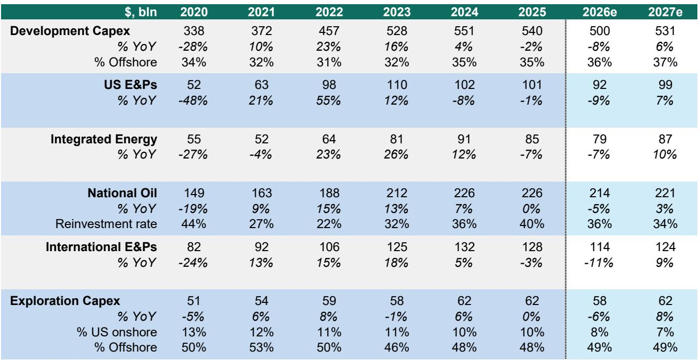
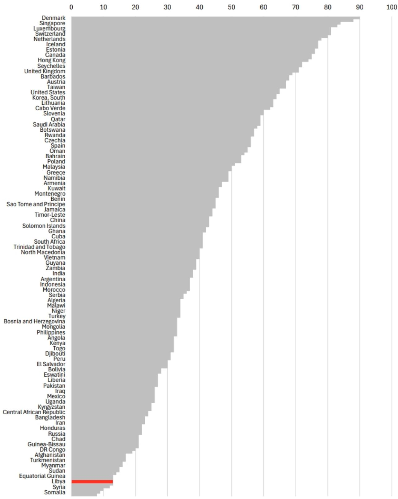

# The Upstream Capex Supercycle Is a Myth: Why Capital Discipline Will Outlast High Oil Prices

The narrative is seductive: oil prices surge, geopolitics tighten, and a massive wave of upstream capital expenditure must follow. The logic seems airtight—higher cash flows should trigger a reinvestment boom, ushering in a new supercycle of drilling and development. But this story, however compelling, collapses under scrutiny. The reality is that the global upstream oil and gas industry is not heading into a capex supercycle. It is heading into a period of modest, constrained spending that will disappoint those expecting a historic buildout.

A global investment bank report, applying a structured five-W framework to this question, arrives at a conclusion that many market participants will find uncomfortable: the expected $40 billion pullback in upstream capex in 2026 is not a temporary blip but a structural signal. Even with Brent crude trading near $90 per barrel, planning prices among producers have barely budged, likely capping out at $70 per barrel. The gap between spot prices and the prices companies use to plan their budgets is not a failure of forecasting—it is a deliberate strategic choice. This disconnect is the single most important feature of the current energy landscape, and it demands a complete rethinking of how investors should position themselves.

The argument for a supercycle fails because it confuses cyclical tailwinds with structural change. Higher oil prices have indeed improved cash flows, but the reinvestment appetite has not followed. Public exploration and production companies remain disciplined, oilfield service firms are not raising guidance, shale productivity gains are becoming harder to achieve, and a vast share of discovered resources remains undeveloped for reasons that have nothing to do with price. The barrels that are available are long-cycle, politically difficult, or no longer cheap to develop. In a post-Strait of Hormuz world, the report estimates total upstream capex at roughly $560 billion in 2026—only $50 billion above its previous forecast from January, when Brent averaged $70 per barrel. That is not a supercycle. That is a tweak.

## The Reinvestment Ratio Has Broken: Cash Flow Abundance Meets Capital Starvation

The most direct evidence that a capex supercycle is not coming lies in the behavior of the companies that control the capital. The report shows that operating cash flows for U.S. majors and large-cap E&Ps have risen impressively since the COVID-19 era, driven in part by industry consolidation and supply discipline. Yet capital spending has only returned to near pre-COVID levels, not exceeded them. This is not an accident. It is the result of a fundamental shift in how management teams and boards evaluate risk.

Investors have consistently rewarded capital discipline, buybacks, and free cash flow durability over production growth. The correlation between shareholder returns and share price performance is weak but revealing: companies that returned less cash flow to shareholders during the first quarter of 2026 actually saw larger share-price gains after the conflict began. The report does not argue causality here, but the pattern is telling. The market is not signaling that companies should spend more. If anything, it is signaling that leverage reduction and shareholder returns remain the priority.

This creates a paradox that the supercycle thesis cannot resolve. Higher oil prices generate more cash, but the very mechanism that generates that cash—discipline—also prevents its deployment. Companies are not maximizing production; they are maximizing free cash flow per share. Until that calculus changes, capex will remain constrained regardless of where spot prices trade.

## The Barrel Problem: What Remains Undeveloped Is Increasingly Undevelopable

The supercycle narrative assumes that there is a large, ready inventory of barrels waiting to be drilled. The report challenges this assumption directly by examining what barrels actually get developed. Roughly one-third of all discovered resources over the past century remains undeveloped. That sounds like a cushion, but the composition matters enormously.

Deepwater barrels have led discoveries in recent decades, but these barrels are increasingly harder to convert into supply. The best days of deepwater and ultradeepwater exploration are behind us, and the technological gains that once drove cost declines have plateaued. Shale barrels, which provided the revolution in U.S. production, are content to plateau rather than grow. The productivity gains that defined the shale era are becoming harder to achieve, and the remaining inventory is less attractive. Oil sands barrels require more clarity on policy and carbon costs before development can proceed.

The report's key insight here is that the "resource comfort cushion" created by shale has lulled the industry into a false sense of security. While significant resources and reserves no doubt exist, discoveries have collapsed in a world dominated by shale development. The migration of resources to reserves and then to production is not automatic. It requires capital, technology, and regulatory approval—all of which are becoming scarcer.

## The Who and Where: National Oil Companies Control the Marginal Barrel in the Worst Jurisdictions

If public E&Ps are not going to lead the next cycle, who will? The report identifies national oil companies and state-directed players as the marginal growth barrel controllers. This is a critical shift. NOCs operate under different incentives than public companies. They are not driven by shareholder returns or free cash flow optimization. They are driven by national energy security, fiscal revenue needs, and geopolitical strategy.

This introduces a second-order implication that the supercycle thesis ignores: the best geology is often in the worst jurisdictions. Many of the largest undeveloped barrels sit in countries with high fiscal take, political instability, sanctions, or weak rule of law. The report highlights this tension without resolving it, and that is precisely the point. Capital can flow to these jurisdictions, but it will flow more slowly, more expensively, and with greater risk of interruption. The marginal cost of developing these barrels is not just financial—it is political.

For investors, this means that the supply response to higher prices will be slower and more uncertain than historical models predict. The traditional relationship between oil prices and rig activity has broken down. The report notes that usually, high oil prices trigger a sharp pickup in rig activity, but that pattern has not materialized this time. Oilfield services and equipment companies have not raised guidance, and upstream inflation means companies are spending more simply to hold activity flat. The price signal is being absorbed by cost inflation rather than volume growth.

## What the Report Does Not Fully Answer: The Timing of the Discipline Break

The report makes a convincing case that the structural forces favoring capital discipline are powerful, but it leaves a critical question unresolved: what would break this discipline? The report suggests that as the current crisis exits and the Strait reopens, the dominant theme will be a comfortable oil price with a powerful floor, where excess free cash flow is rapidly collected by E&Ps and returned to shareholders. This is a plausible base case, but it is not the only possibility.

What if a prolonged geopolitical disruption keeps prices elevated for years rather than months? What if the U.S. government, facing strategic reserve depletion, actively incentivizes domestic production? What if technological breakthroughs in deepwater or arctic drilling change the cost structure of undeveloped barrels? The report does not explore these scenarios in depth, and that is a meaningful gap. The five-W framework is excellent for diagnosing the current state, but it is less helpful for modeling the conditions under which that state might change.

Investors should therefore treat the report's conclusion as a strong base case but not a certainty. The discipline that defines the current cycle could break if any of several triggers materialize: a sustained price above $100 per barrel, a coordinated government push for energy security, or a wave of consolidation that creates larger entities with different capital allocation priorities. The report's own data shows that consolidation has already played a role in boosting cash flows. Further consolidation could eventually change the calculus, particularly if the resulting entities are large enough to absorb the risk of long-cycle projects.

## A Decision Framework for Investors: Three Questions to Ask Before Betting on Volume Growth

The report's analysis can be distilled into a practical decision framework for investors evaluating energy exposure. Rather than trying to predict oil prices—a notoriously futile exercise—investors should focus on three structural questions.

First, is the company's reinvestment rate rising or falling? The report shows that the industry-wide reinvestment rate has declined, but individual company behavior varies. Companies that maintain or increase their reinvestment rate in this environment are making a strategic bet that the supercycle thesis is correct. Companies that are reducing reinvestment are betting on discipline. The divergence between these two strategies will determine relative performance.

Second, does the company's barrel inventory match its capital plan? The report shows that the quality of undeveloped resources varies dramatically. Companies with high-quality, short-cycle barrels in stable jurisdictions have a genuine growth option that their peers lack. Companies with long-cycle, politically exposed barrels are sitting on options that may never be exercised. The market is already pricing this difference, but the gap may widen as the supercycle thesis is tested.

Third, is the company's shareholder return policy sustainable at lower oil prices? The report suggests that planning prices have not risen despite higher spot prices. This implies that management teams are building their budgets around a $70 per barrel world, not a $90 per barrel world. Companies that are returning cash to shareholders based on $90 oil may need to cut dividends or buybacks if prices normalize. Companies that are conservative in their payout ratios have more room to maintain returns even in a downturn.

These three questions form a lens through which investors can evaluate individual names without relying on a macro oil price forecast. The report's ticker table, which includes outperform ratings on several large-cap E&Ps, suggests that discipline is being rewarded. But the framework applies beyond those specific names.

## The Unresolved Analytical Tension That Demands a Deeper Look

The report's most valuable contribution is not its forecast but its framing. By applying the five-W structure, it forces a systematic evaluation of the supercycle thesis that most market commentary lacks. But the very rigor of this framework reveals a tension that the report does not fully resolve: if the structural forces favoring discipline are so strong, why does the market continue to price in a higher-for-longer oil scenario?

The report notes that oil prices have outperformed E&P equities year to date. The thesis of higher prices driving better-than-historic volume growth is not resonating. This divergence between commodity prices and equity prices is a signal that something is broken in the transmission mechanism. Either oil prices will eventually fall to align with equity valuations, or equity valuations will eventually rise to reflect the cash flow potential of higher prices. The report leans toward the former view, but the evidence is not conclusive.

This is the unresolved analytical question that makes the full report worth reading. The charts on reserve life, discovered resources by water depth, and the breakdown of undeveloped barrels by jurisdiction contain nuances that a summary cannot capture. The report's analysis of which barrels are truly developable and at what cost is the kind of granular work that separates serious research from surface-level commentary.

Join the community to read the full report and review the original charts.

*This article is for learning and discussion only and does not constitute investment advice.*

Personal reading notes and learning share only. Not investment advice.

