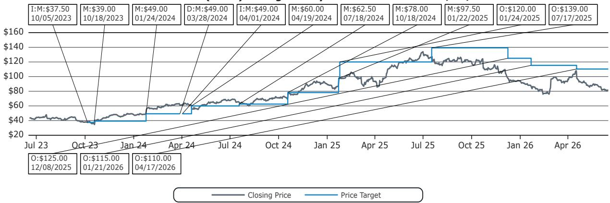
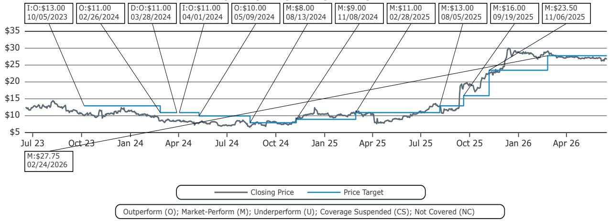
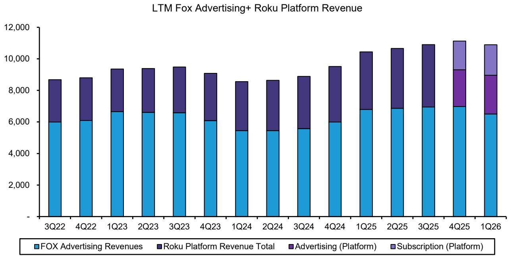

# Bernstein：福克斯收购Roku，战略逻辑成立但价格昂贵，市场低估了广告协同的潜力

这笔交易标志着传统媒体公司向流媒体转型的一次关键尝试，但其真正的价值不在于硬件或用户规模，而在于广告库存的重新定价。

Bernstein最新发布的研报，对福克斯（Fox）拟以约220亿美元收购Roku的交易进行了深入剖析。这不是一份简单的交易点评，而是一份关于“在流媒体时代，什么资产才真正具有战略稀缺性”的思考框架。报告的核心判断是：Roku是一个独特的战略资产，但福克斯可能并不需要“拥有”它来实现类似的商业结果。然而，如果广告协同效应能够兑现，这笔交易对福克斯股价的重估意义将远超财务数字本身。

在当前媒体行业估值普遍承压的背景下，这笔交易为投资者提供了一个重新审视“流媒体平台价值”的窗口。市场可能低估了Roku作为广告平台与福克斯优质内容结合后，在广告填充率和定价权上的潜在提升空间。这不仅是两家公司的交易，更是对“内容+分发”商业模式未来走向的一次压力测试。

**以下是这份Bernstein研报的核心洞察与延伸思考。**

## 1. 这笔交易真正的战略价值在于广告，而非订阅

许多分析将这笔交易视为福克斯获取流媒体分发渠道、加速数字订阅增长的手段。Bernstein承认这一逻辑存在，但指出“商业合作可能同样有效”。真正让这笔交易变得“战略”而非仅仅是“财务”的，是广告。

福克斯在过去两年新增了超过500家广告客户，其广告库存需求旺盛，CPM持续走高。而Roku拥有美国最大的智能电视操作系统市场份额（以2025年出货量计，约800万台，领先于三星Tizen和亚马逊Fire TV），并积累了大量的第一方用户数据。将福克斯的广告销售能力与Roku的库存和数据结合，意味着福克斯可以更有效地填充Roku的广告位，并针对特定受众收取更高溢价。

**这意味着什么？** 这笔交易的核心并非“让福克斯的内容在Roku上卖得更好”，而是“让Roku的广告位卖出福克斯级别的价格”。如果这一协同效应得以实现，Roku的广告收入利润率将显著提升，而这正是当前市场对Roku独立估值时尚未完全定价的部分。

## 2. 220亿美元的代价：战略资产从不便宜，但稀释效应不容忽视

Bernstein指出，这笔交易的价格（约220亿美元）相当于Roku NTM EBITDA的约30倍，NTM EPS的约60倍。在当前的媒体和科技估值环境中，这无疑是高昂的。报告明确表示，“战略资产从不便宜”，而“战略”往往就是“昂贵”的同义词。

根据Bernstein的测算，在60%现金、40%股票的支付结构下，福克斯的净杠杆率在交易完成后约为2.9倍，依然健康。但每股收益（EPS）在2028年（假设协同效应完全实现前）将面临约10%的稀释。这意味着一部分短期股东将承受EPS下降的压力。

**这意味着什么？** 这笔交易的财务回报并非立竿见影。Bernstein实际上在暗示，福克斯管理层愿意承受短期的EPS稀释和债务压力，来换取一个长期的结构性转型机会。对于投资者而言，需要关注的不是2028年的EPS数字，而是福克斯能否在2026-2027年证明其流媒体业务的增长能抵消传统线性业务的下滑，从而推动估值倍数（P/E）的重塑。

## 3. 监管风险可能被高估：流媒体市场的竞争格局远比想象中复杂

对于这笔交易可能面临的监管审查，Bernstein持相对乐观的态度。理由在于，无论是福克斯还是Roku，在当前的流媒体和操作系统（OS）市场中，都算不上是主导者。

从流媒体内容看，Netflix、Disney+、Amazon Prime Video等巨头占据主导。从操作系统看，Roku虽然在美国智能电视出货量中领先，但面临着来自Samsung Tizen、LG webOS、Amazon Fire TV、Google Android TV以及Walmart的SmartCast等众多竞争对手的激烈竞争。报告中的Exhibit 9清晰地展示了这一格局：Roku的市场份额虽为第一，但并未形成垄断。

**这意味着什么？** 监管机构不太可能将这笔交易视为“消灭一个潜在竞争对手”，而更可能将其视为“一个传统媒体公司购买一个流媒体平台以增强自身竞争力”。只要福克斯不试图利用Roku的操作系统地位来排挤其他流媒体服务（如Netflix或Disney+），这笔交易通过监管审批的概率较高。这为交易双方提供了确定性，也降低了交易失败的风险溢价。

## 4. 报告没有完全回答的关键问题：协同效应的规模与实现路径

Bernstein的研报对广告协同效应给予了高度关注，但并未给出具体的量化数字。报告提到“如果福克斯能证明在订阅和广告增长方面持续取得进展，其估值倍数可能重新设定”，但“现在或许还太早，不宜过于乐观”。

这里存在一个关键未解问题：广告协同效应的规模到底有多大？实现路径是否清晰？福克斯的广告销售团队能否有效渗透Roku的现有广告客户？Roku的第一方数据与福克斯的广告技术栈能否无缝整合？这些问题的答案将直接影响这笔交易最终是“战略胜利”还是“财务负担”。

**这意味着什么？** 市场目前对这笔交易的反应可能过于集中在“买贵了”或“EPS稀释”上，而对“广告协同”这一核心价值驱动因素的规模和可执行性缺乏深入理解。这正是专业投资者可以超越市场共识、形成独立判断的关键领域。

## 5. 谁会是下一个竞标者？这提供了一个观察行业整合的框架

Bernstein在报告中提出了一个有趣的问题：还有谁可能加入这场竞购？报告指出，能真正从Roku的分发规模和广告货币化中受益的公司“名单很短，在160美元/股的价格下更短”。

这为我们提供了一个观察行业整合的框架：一个潜在买家必须具备两个条件之一——要么需要Roku的用户规模来支撑其流媒体订阅增长，要么拥有强大的广告销售能力来提升Roku的广告变现效率。符合第一个条件的包括Amazon、Google、Apple等科技巨头，但它们各自已有自己的操作系统或平台。符合第二个条件的则可能包括Comcast（拥有NBCUniversal和广告技术）或Disney（拥有强大的广告销售团队和内容）。

**这意味着什么？** 如果福克斯成功收购Roku，它将消除一个潜在的竞争对手，并可能引发其他媒体或科技公司对类似“内容+分发”资产的重新审视。这笔交易可能成为一个催化剂，加速媒体行业的整合浪潮。投资者需要思考：下一个被收购的“Roku”会是谁？是拥有大量用户但广告变现不足的平台，还是拥有优质内容但缺乏分发渠道的媒体公司？

---

**这份Bernstein研报的价值，不仅仅在于对这笔交易本身的分析，更在于它揭示了流媒体时代一个核心矛盾：战略资产的价值难以用传统财务模型衡量，但高昂的收购价格又要求管理层必须证明其战略眼光能够转化为财务回报。**

对于希望深入理解这笔交易背后更广泛的行业逻辑、以及Bernstein对Netflix、Disney、Comcast等公司投资评级和估值方法的读者，我们欢迎您加入知识星球微信群继续讨论。在社群里，我们将分享这份报告的完整图表，并围绕“广告协同效应的量化测算”和“下一个可能的收购目标”这两个未解问题，进行更深入的推演。

Personal reading notes and learning share only. Not investment advice.

