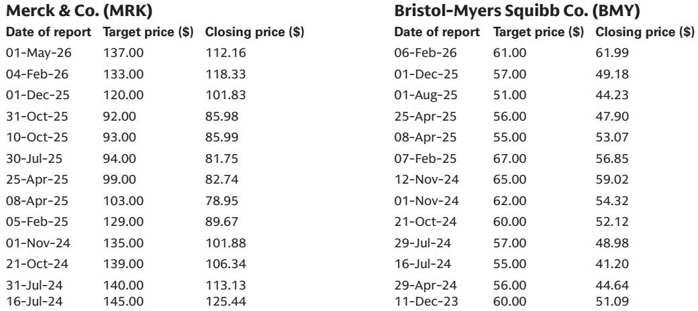
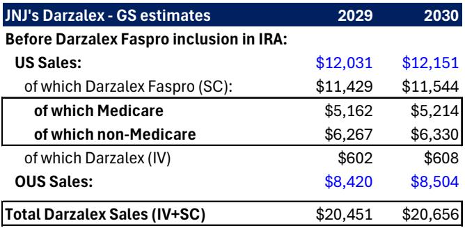
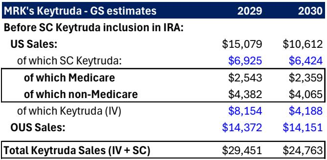

# The CMS Proposal to Include Subcutaneous Formulations in IRA Negotiation Is a Strategic Shift, Not a Financial Catastrophe

The Inflation Reduction Act's drug pricing machinery has just expanded its reach in a way that many investors underestimated. A proposed rule from the Centers for Medicare and Medicaid Services would treat fixed-dose combinations containing two or more active moieties—and specifically formulations including hyaluronidase—as a single drug for negotiation eligibility. This targets the subcutaneous versions of three of the most important oncology drugs in the world: Merck's Keytruda Qlex, Bristol-Myers Squibb's Opdivo Qvantig, and Johnson & Johnson's Darzalex Faspro. The market reaction was swift and predictable, with all three stocks underperforming the broader healthcare sector on the day of the announcement.

But the immediate stock price moves mask a more nuanced strategic picture. The financial impact, while real, is contained. A global investment bank's illustrative analysis estimates low-single-digit EBIT impacts for these companies in the 2029-2030 timeframe. For JNJ, the potential Darzalex Faspro inclusion implies roughly a 4% hit to adjusted EBIT. For MRK, the Keytruda Qlex impact sits around 3%. For BMY, Opdivo Qvantig exposure translates to approximately 2.5% of adjusted EBIT. These are not existential threats.

The real story lies elsewhere. This proposed rule represents a fundamental shift in how the IRA's negotiation framework will interact with pharmaceutical innovation strategies. Companies have been racing to develop subcutaneous formulations as a way to extend product lifecycles and improve patient convenience. Now, CMS is signaling that these formulation innovations will not provide an escape from price negotiation. The strategic implications for pipeline decisions, patent strategy, and commercial planning are far more significant than the near-term earnings impact.

This analysis unpacks what the proposed rule actually means, where the risks are concentrated, and what decision-makers should be watching as the comment period unfolds through mid-August.

## The Proposed Rule Targets a Specific Innovation Strategy That Drugmakers Thought Would Provide Negotiation Protection

The logic behind subcutaneous formulations has always been compelling from a patient and commercial standpoint. Converting intravenous infusions that require clinic visits into subcutaneous injections that patients can receive more quickly—or potentially administer themselves—improves adherence, reduces healthcare system burden, and extends market exclusivity through new patents. For Keytruda, Opdivo, and Darzalex, these subcutaneous versions represent the next chapter of their commercial stories.

What the CMS proposal makes clear is that this innovation strategy will not shield drugs from IRA negotiation. The specific mention of hyaluronidase is telling. Hyaluronidase is an enzyme used in many subcutaneous formulations to facilitate drug absorption. By calling it out explicitly, CMS is closing a potential loophole: drugmakers cannot argue that a subcutaneous formulation is a fundamentally different product simply because it contains an additional ingredient to enable subcutaneous delivery.

This matters because the IRA's negotiation program applies to drugs that have been approved for at least seven years (for small molecules) or eleven years (for biologics) without generic or biosimilar competition. The original IV formulations of these drugs are already on track for negotiation. The question was whether the subcutaneous versions would have separate negotiation timelines. CMS's answer is effectively no.

The companies' responses to the proposal reveal how they are processing this development. JNJ maintains its position that Darzalex Faspro should not face price setting before 2034, suggesting the company sees a path to argue for a separate timeline. BMY acknowledges the development was not unexpected and is preparing to engage during the comment period. MRK, perhaps most tellingly, notes that it has already priced the likelihood of Keytruda IV negotiation and biosimilar entry into its Qlex pricing strategy. The company explicitly states that inclusion would not create material financial impact and could theoretically create a tailwind from an access and coverage perspective.

This last point is worth dwelling on. MRK's framing suggests that having a negotiated price for Qlex could actually improve market access by removing uncertainty. If the drug is going to face price negotiation anyway, better to have it happen in a predictable framework than to face a chaotic post-biosimilar environment.

## The Financial Impact Is Real but Concentrated, and the Assumptions Matter More Than the Numbers

The illustrative impact analysis provides a useful framework, but the numbers should be read with caution. The analysis assumes a 36% net price discount based on the average from the first IRA negotiation class. It assumes the price impact applies only to Medicare and does not spill over into commercial or other segments. It uses 2023 CMS drug spending data to estimate Medicare exposure.

These assumptions matter because they define the range of possible outcomes. The 36% discount could be higher or lower depending on how CMS approaches these drugs specifically. The assumption of no commercial spillover is conservative but uncertain. If negotiated Medicare prices create reference pricing pressure in the commercial market, the impact could be significantly larger. Conversely, if companies successfully argue for smaller discounts based on the value of subcutaneous formulations, the impact could be less.

For JNJ, the analysis estimates roughly $1.9 billion in annual Darzalex sales impact by 2029-2030, representing about 9% of total Darzalex sales. For MRK, the Keytruda Qlex impact is approximately $900 million annually, or about 3% of total Keytruda sales. For BMY, the Opdivo Qvantig impact is roughly $270 million, or about 4% of Opdivo sales.

When viewed against total company sales, these impacts shrink to 1.4% for JNJ, 1.3% for MRK, and 0.8% for BMY. As percentages of adjusted EBIT, they range from 4% for JNJ down to 2.5% for BMY. These are manageable numbers for companies of this scale.

But the analysis also reveals something more important: the timing of these impacts matters enormously. The earliest effective date for negotiation under this proposed rule would be January 2029. For Keytruda, biosimilar competition is expected as early as December 2028 when the compound patent expires. This means Keytruda IV would likely face both biosimilar erosion and IRA negotiation simultaneously. The subcutaneous version's inclusion in negotiation would be an additional headwind on top of a fundamentally changing competitive landscape.

## The Unanswered Question Is Whether This Rule Creates a Broader Precedent for Combination Products and Formulation Innovation

The report raises a critical question that it does not fully answer: what happens to other combination products and formulation innovations that are currently in development? The proposed rule specifically targets combinations with two or more active moieties and those containing hyaluronidase. But the logic could extend further.

Consider the broader landscape of drug development. Fixed-dose combinations are increasingly common in oncology, cardiovascular disease, and infectious disease. Many of these combinations are designed to improve adherence by reducing pill burden. If CMS can treat a combination as equivalent to its components for negotiation purposes, what prevents it from applying similar logic to other combination products?

There is also the question of what constitutes a "new" drug for IRA purposes. The rule suggests that adding a delivery-enhancing ingredient like hyaluronidase does not reset the negotiation clock. Does this logic extend to other formulation changes? What about prodrugs, different salt forms, or extended-release formulations? The pharmaceutical industry has long used formulation innovation as a strategy to extend product lifecycles. This proposed rule challenges that strategy directly.

The report notes that this issue was raised last year in draft guidance for the IPAY 2028 class but was removed in the final guidance. Its reappearance suggests CMS is serious about closing this loophole. But the fact that it was removed once also suggests there is room for argument during the comment period. Companies will likely make the case that subcutaneous formulations represent genuine innovation that improves patient outcomes and should be treated differently.

## A Decision Framework for Investors: Three Scenarios and What Each Means for Portfolio Positioning

For investors trying to make sense of this development, the key is to move beyond the immediate stock price reaction and think in terms of scenarios. Three scenarios capture the range of likely outcomes.

Scenario one: the rule is finalized largely as proposed. In this case, the financial impacts outlined in the analysis become the baseline. The stocks have already partially adjusted, but there could be further modest downside as the market fully prices in the impact. The bigger question becomes what this means for pipeline decisions. Companies may become more cautious about investing in subcutaneous formulations for drugs approaching IRA negotiation eligibility. This could slow innovation in drug delivery.

Scenario two: the rule is modified during the comment period to exclude certain formulations or to phase in the impact more gradually. This is the most likely outcome given that the provision was removed from last year's final guidance. CMS may decide that including subcutaneous formulations creates too much uncertainty or that it oversteps congressional intent. In this scenario, the stocks would likely recover some of their losses, and the broader concern about formulation innovation would recede.

Scenario three: the rule is finalized but successfully challenged in court. The IRA has already faced multiple legal challenges, and while most have been unsuccessful, the legal landscape remains uncertain. A court ruling that the rule exceeds CMS's authority would be a positive catalyst for these stocks and would provide clarity for the industry.

The decision framework for investors should focus on three variables: the probability of each scenario, the magnitude of impact under each scenario, and the time horizon for resolution. The comment period runs through mid-August, with the final rule expected in fall 2026. The first drugs subject to this rule would not face negotiation until 2029. This gives investors time to observe how the situation develops and to adjust positions accordingly.

The most important variable that the report does not fully explore is the interaction between IRA negotiation and biosimilar entry. For Keytruda, the combination of biosimilar competition starting in December 2028 and IRA negotiation starting in January 2029 creates a concentrated period of pricing pressure. The question is whether the negotiated price becomes the floor or the ceiling. If Medicare sets a low negotiated price, biosimilar entrants may have to compete at even lower levels, accelerating the erosion of Keytruda's franchise value.

## What the Report Does Not Fully Answer: The Second-Order Effects on Pipeline Strategy and M&A

The report provides a rigorous analysis of the direct financial impact, but it leaves several important questions unanswered. The most significant is how this rule will affect pharmaceutical companies' decisions about which pipeline assets to develop and how to formulate them.

If subcutaneous formulations no longer provide protection from IRA negotiation, the incentive to invest in drug delivery innovation for drugs approaching their negotiation eligibility date is reduced. This could have knock-on effects for the contract development and manufacturing organizations that specialize in formulation development. It could also affect the valuation of pipeline assets that rely on formulation innovation as a key differentiator.

There is also the question of M&A strategy. Pharmaceutical companies have historically acquired assets with the expectation that formulation innovation could extend the commercial lifecycle. If that expectation is undermined, the valuation of certain pipeline assets may need to be reassessed. Companies that have built their growth strategies around subcutaneous versions of blockbuster drugs may need to revise their long-term planning.

The report also does not address the international implications. If the United States is setting a precedent that formulation innovation does not reset the pricing clock, other countries with reference pricing systems may follow suit. This could create a global headwind for the subcutaneous formulation strategy that goes far beyond the Medicare program.

## The Strategic Takeaway: This Is About the Rules of the Game, Not the Score

The CMS proposed rule on subcutaneous formulations is not a financial catastrophe for the affected companies. The EBIT impacts are manageable, and the companies have time to adapt. What it represents is a fundamental clarification of the rules of the game. Pharmaceutical companies can no longer assume that formulation innovation will provide an escape from IRA price negotiation.

This has implications that go well beyond Keytruda, Opdivo, and Darzalex. Every company with a drug approaching IRA negotiation eligibility must now reconsider whether investing in a subcutaneous formulation makes strategic sense. The calculus has shifted from "will this extend our pricing power?" to "will this improve patient outcomes enough to justify the investment, even if it does not protect pricing?"

For investors, the key insight is that the market is likely overreacting to the immediate financial impact while underappreciating the longer-term strategic implications. The stocks may have further to fall as the full implications become clear, but they may also present buying opportunities if the rule is modified or challenged successfully.

The most sophisticated investors will be watching not just the comment period and the final rule, but also the pipeline decisions that pharmaceutical companies make in response. If companies start deprioritizing subcutaneous formulation programs for drugs approaching IRA eligibility, that will tell you more about the rule's impact than any earnings model ever could.

Join the community to read the full report and review the original charts.

*This article is for learning and discussion only and does not constitute investment advice.*

Personal reading notes and learning share only. Not investment advice.

