## MS

June 14, 2026 10:00 PM GMT

natural_image

Abstract line drawing of DNA double helix and ECG waveform (no text or symbols)

# Finger On The Pulse

## US SMID Cap Biotech Beat

Edition 65: More M&A, back on track for a record year

What's new? i) M&A structural not episodic; ii) Stock Up/Stock Down: INCY SLN, CGEM; iii) Rates up, commercial better.

MS does and seeks to do business with companies covered in MS. As a result, investors should be aware that the firm may have a conflict of interest that could affect the objectivity of MS. Investors should consider MS as only a single factor in making their investment decision.

For analyst certification and other important disclosures, refer to the Disclosure Section, located at the end of this report.

natural_image

Portrait of a middle-aged man with gray hair wearing a dark suit and white shirt (no text or symbols visible)

Sean Laaman  
Equity Analyst  
sean.laaman@ms.com  
+1 212 761-4947

natural_image

Portrait of a man in business attire (no text or symbols visible)

Terence Flynn  
Equity Analyst  
terence.flynn@ms.com  
+1 212 761-2230

natural_image

Portrait of a bald man in a pinstripe suit and tie, no visible text or symbols

Judah Frommer  
Equity Analyst  
judah.frommer@ms.com  
+1 212 761-1270

natural_image

Portrait of a man in business attire (no visible text or symbols)

Michael Ulz  
Equity Analyst  
michael.ulz@ms.com  
+1 212 761-4650

natural_image

Portrait of a man in formal business attire (suit and tie), no visible text or symbols

Maxwell Skor  
Equity Analyst  
maxwell.skor@ms.com  
+1 212 761-4804

## MS SMID Cap Biotech Team

  
Sean Laaman

Equity Analyst

(212) 761-4947

sean.laaman@morganstanley.com

  
Terence Flynn

Equity Analyst

(212) 761-2230

terence.flynn@morganstanley.com

  
Mike Ulz

Equity Analyst

(212) 761-4650

mike.ulz@morganstanley.com

  
Judah Frommer

Equity Analyst

(212) 761-1270

judah.frommer@morganstanley.com

  
Maxwell Skor

Equity Analyst

(212) 761-4804

maxwell.skor@morganstanley.com

  
Rohit Bhasin

Research Associate

(212) 761-0534

rohit.bhasin@morganstanley.com

  
Natasha Arya

Research Associate

(212) 761-6294

natasha.arya@morganstanley.com

  
Nick Japhet

Research Associate

(212) 761-2721

nick.japhet@morganstanley.com

  
Avi Novick

Research Associate

(212) 761-2231

avi.novick@morganstanley.com

  
Parth Patel

Research Associate

(212) 761-5065

parth.patel@morganstanley.com

  
Michael Riad

Research Associate

(212) 761-1309

michael.riad@morganstanley.com

  
Katherine Sun

Research Associate

(212) 761-5968

katherine.sun@morganstanley.com

natural_image

Circular portrait photo of a smiling woman with long dark hair (no text or symbols visible)

Selena Zhang

Research Associate

(212) 761-1017

selena.zhang1@morganstanley.com

## In Case You Missed It

## Biotech Beat Series - Past Macro Outlook Editions

■ Edition 61: Q1 EPS Scorecard – Where Commercial Outlook Improved Most  
■ Edition 62: 1Q26 13Fs – Finding divergence  
■ Edition 63: Stock Up / Stock Down - ERAS, DYN, ABVX  
■ Edition 64: Rates are biting

## Podcasts, KOL Series and More...

■ Biopharma Beat – Recap of MS Pharma and Biotech Bus Tours  
■ Spring Training: Biotechnology  
MS SMID Cap Biotech KOL Series – Takeaways From Our KOL Call: R/M HNSCC  
MS SMID Cap Biotech KOL Series – Takeaways From Our KOL Call: The Evolving NMIBC Landscape  
MS SMID Cap Biotech KOL Series – Takeaways From Our KOL Call: TTR-CM Treatment Landscape  
MS SMID Cap Biotech KOL Series – Takeaways from gMG KOL call

## Relevant Notes

■ The Month Ahead – 2Q Catalysts  
■ Biopharma: Clinical Trial Pipeline Tracker  
Biotech Before the Bell: Takeaways from MS's Private Company Conference  
■ Biotechnology: Crossing the Molecule: Why 2026 Is the Make-or-Break Year for AI in Drug Discovery  
■ Healthcare Pulse Check Post 4Q  
■ Biotech AI: Looking for My MOM (Maximally Optimized Molecule) – Edition #2  
■ MS Japan Healthcare Tour (May 18-19) Takeaways

## Table Of Contents

## Key

New Slide

★ Refreshed Slide

<table><tr><td>Section</td><td>Page</td></tr><tr><td>Stock Up/Stock Down: Our 3 biggest movers of the week</td><td>5</td></tr><tr><td>Capital Markets – IPOs, Follow-Ons and M&amp;A</td><td>6</td></tr><tr><td>Cash Runways</td><td>13</td></tr><tr><td>13-F Ownership Updates</td><td>15</td></tr><tr><td>SMID Cap Biotech: Setting up for a renaissance</td><td>18</td></tr><tr><td>Macroeconomic factors</td><td>21</td></tr><tr><td>Negative EV Screen</td><td>22</td></tr><tr><td>NBI price performance &amp; valuation</td><td>24</td></tr><tr><td>Catalyst performance</td><td>26</td></tr><tr><td>First in Class 2026 Catalysts</td><td>27</td></tr><tr><td>Our Analysis &amp; Views Regarding FDA Changes &amp; Viewpoints From Ex-FDA Officials</td><td>29</td></tr><tr><td>FDA Decision Tracker - Approval Timelines, Accelerated Approvals</td><td>35</td></tr><tr><td>2026 Healthcare Industry Events</td><td>38</td></tr><tr><td>MS SMID Biotechnology Comp Sheet &amp; Coverage By Therapeutic Area</td><td>39</td></tr></table>

## Weekly Stock Up/Stock Down: Our 3 biggest movers of the week

<table><tr><td>Stock Up: INCY</td><td>Stock Up: SLN</td><td>Stock Down: CGEM</td></tr><tr><td>Rating: EWPT: $103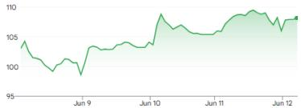% Move: +11%</td><td>Rating: OWPT: $25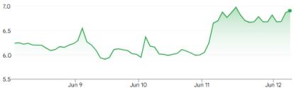% Move: +8%</td><td>Rating: OWPT: $30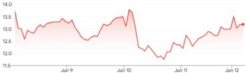% Move: -16%</td></tr><tr><td>Recap: Incyte announced on Monday that it entered into a definitive agreement to acquire Vega Therapeutics, a subsidiary of Star Therapeutics, for $1.25B upfront and will be eligible to receive up to $750M in sales-based milestones, bringing the total potential transaction value to ~$2.0B. The acquisition would add VGA039, a subcutaneous monoclonal antibody in Ph3 development for von Willebrand disease (VWD), the most common inherited bleeding disorder.</td><td>Recap: At the European Hematology Association (EHA) 2026 Annual Meeting (Stockholm, June 11–14), updated results from the Phase 1 PV study demonstrated meaningful improvements in patients&#x27; quality of life, while post-study follow-up confirmed a durable effect in reducing the need for phlebotomies. New analyses showed improvements in MPN-10 total symptom scores in most patients, including clinically relevant PV symptoms such as fatigue, pruritus (itching), and bone pain.</td><td>Recap:Cullinan (hosted an Immunology Day (June 10) to highlight the CD19xCD3 TCE CLN-978 data in SLE and BCMAxCD3 TCE RA (including initial multi-dose data in SLE), and early clinical velinotamig data. The EULAR dataset (~30 RA/SLE patients as of data cutoff) demonstrated clear on mechanism activity: peripheral B cells were &gt;80% depleted in ~82% of patients, with half of patients at ≥20μg achieving undetectable B cells. The safety profile was favorable, featuring mostly Gr1 CRS events confined to the initial 10μg step up dose, just one Gr3 CRS at 45 μg (leading the company to halt that dose cohort), and no ICANS (neurotoxicity) reported. Early efficacy signals were encouraging: ~70% of patients showed meaningful disease improvement within weeks of a single treatment, including ~71% of SLE patients with ≥4 point SLEDAI score reductions (five achieving formal remission) and 7/9 RA patients with clinical improvement (two reaching DAS28 ESR remission in heavily refractory RA). Immunology Day discussions reinforced these findings and noted initial multi dose regimen results (e.g., early RA patients on a 20μg weekly schedule also saw responses) while framing how CGEM&#x27;s portfolio aims to deliver short course &quot;immune reset&quot; therapies. Mgmt. highlighted that CLN 978 serves as an anchor for B cell mediated diseases (RA, SLE), and velinotamig is being developed in parallel to target plasma cell-driven diseases (pathogenic autoantibody conditions) as a complementary approach.</td></tr><tr><td>Our View: Management estimates potential annual net price in the ~$500K+ range for a $3.5B-$5B TAM in severe VWD for VGA03 and estimates peak sales potential of ~$1B+ and that the transaction will be accretive to growth post-2029, a key timepoint given the impending Jakafi LOE. Positive mgmt tone at a competitor conference and buyside positioning have been noted as well.</td><td>Our View: We believe updated data further confirm the best-in-class potential of divesiran and increase our confidence in the less frequent Q12W dosing cohort, supporting even greater differentiation. Ph2 SANRECO data is on track for August, which we expect to be positive and unlock substantial upside.</td><td>Our View:We view CLN 978&#x27;s emerging profile as validating the mechanism in SLE and RA, with compelling early efficacy (deep B cell clearance driving clinical improvements) and manageable safety that together meet our key initial benchmarks. In our view, the initial EULAR results aligned with expectations (both B cell depletion depth and tolerability cleared the proof of concept bar, with no red flags) and support CLN 978 as a potentially best in class CD19 TCE for autoimmunity. We think confirmation of the immune-reset potential and durability of response remains the crux of investor focus. KOL commentary emphasized that ~3-6 months of sustained B cell depletion (treatment free remission) is a key threshold for an immune reset effect, correlating with markedly better outcomes in autoimmune disease. While the current data are encouraging, we expect upcoming follow up disclosures (including longer term data in 2H26) to be pivotal in refining expectations around the therapeutic window and durability.</td></tr></table>

Source: MS, FactSet

## Capital Markets: IPOs

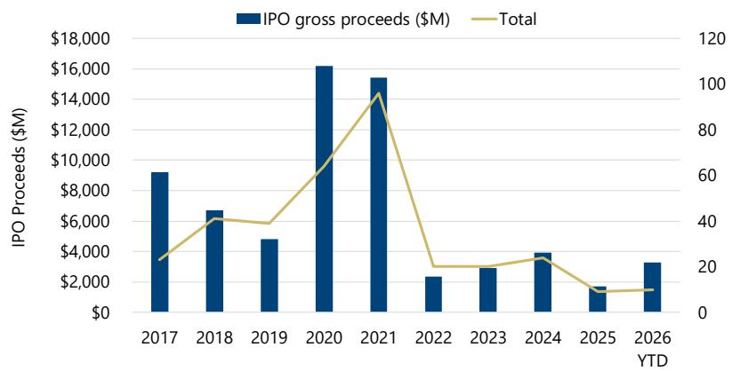

bar-line hybrid chart

| Year   | IPO gross proceeds ($M) | Total |
| ------ | ------------------------ | ----- |
| 2017   | 9000                     | 30    |
| 2018   | 6500                     | 45    |
| 2019   | 5000                     | 40    |
| 2020   | 16000                    | 70    |
| 2021   | 15500                    | 100   |
| 2022   | 2500                     | 20    |
| 2023   | 3000                     | 25    |
| 2024   | 4000                     | 35    |
| 2025   | 1500                     | 15    |
| 2026 YTD| 3500                     | 15    |

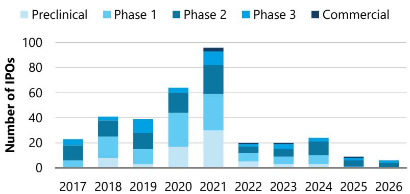

stacked bar chart

| Year | Preclinical | Phase 1 | Phase 2 | Phase 3 | Commercial |
|---|---|---|---|---|---|
| 2017 | 5 | 8 | 10 | 0 | 0 |
| 2018 | 8 | 15 | 12 | 2 | 0 |
| 2019 | 5 | 12 | 14 | 10 | 0 |
| 2020 | 17 | 25 | 15 | 3 | 0 |
| 2021 | 30 | 30 | 25 | 10 | 2 |
| 2022 | 5 | 8 | 5 | 0 | 0 |
| 2023 | 5 | 6 | 5 | 0 | 0 |
| 2024 | 10 | 8 | 10 | 0 | 0 |
| 2025 | 0 | 0 | 5 | 0 | 0 |
| 2026 | 0 | 0 | 0 | 0 | 0 |

Biotech IPOs – By Stage Of Development

<table><tr><td></td><td>2017</td><td>2018</td><td>2019</td><td>2020</td><td>2021</td><td>2022</td><td>2023</td><td>2024</td><td>2025</td><td>2026</td></tr><tr><td>Preclinical</td><td>0</td><td>8</td><td>3</td><td>17</td><td>30</td><td>5</td><td>3</td><td>3</td><td>0</td><td>0</td></tr><tr><td>Phase 1</td><td>6</td><td>17</td><td>12</td><td>27</td><td>29</td><td>7</td><td>6</td><td>7</td><td>1</td><td>0</td></tr><tr><td>Phase 2</td><td>12</td><td>13</td><td>13</td><td>16</td><td>23</td><td>5</td><td>6</td><td>11</td><td>5</td><td>7</td></tr><tr><td>Phase 3</td><td>5</td><td>3</td><td>11</td><td>4</td><td>11</td><td>2</td><td>4</td><td>3</td><td>2</td><td>3</td></tr><tr><td>Clinical-stage</td><td>23</td><td>33</td><td>36</td><td>47</td><td>63</td><td>14</td><td>16</td><td>21</td><td>8</td><td>10</td></tr><tr><td>Commercial</td><td>0</td><td>0</td><td>0</td><td>0</td><td>3</td><td>1</td><td>1</td><td>0</td><td>1</td><td>0</td></tr><tr><td>Total</td><td>23</td><td>41</td><td>39</td><td>64</td><td>96</td><td>20</td><td>20</td><td>24</td><td>9</td><td>10</td></tr><tr><td>IPO gross proceeds ($M)</td><td>$9,206</td><td>$6,704</td><td>$4,826</td><td>$16,203</td><td>$15,426</td><td>$2,369</td><td>$2,913</td><td>$3,927</td><td>$1,714</td><td>$3,295</td></tr><tr><td>IPO avg proceed ($M)</td><td>$400</td><td>$164</td><td>$124</td><td>$253</td><td>$161</td><td>$118</td><td>$146</td><td>$164</td><td>$190</td><td>$330</td></tr></table>

Key Takeaway: 1Q26 has already seen IPO volumes surpass last year. Average IPO proceed is up meaningfully.

<table><tr><td></td><td>Neurology/Endocrine</td><td>Cardiovascular/Oncology</td><td>Genetics&amp; Cell therapy</td><td>Immunology</td><td>Rare disease</td><td>Infectious Disease</td><td>Other</td></tr><tr><td>2017</td><td>3</td><td>0</td><td>11</td><td>0</td><td>2</td><td>2</td><td>1</td></tr><tr><td>2018</td><td>6</td><td>2</td><td>15</td><td>4</td><td>6</td><td>1</td><td>4</td></tr><tr><td>2019</td><td>8</td><td>2</td><td>13</td><td>0</td><td>4</td><td>1</td><td>2</td></tr><tr><td>2020</td><td>7</td><td>1</td><td>26</td><td>4</td><td>7</td><td>2</td><td>4</td></tr><tr><td>2021</td><td>12</td><td>9</td><td>38</td><td>2</td><td>18</td><td>3</td><td>6</td></tr><tr><td>2022</td><td>7</td><td>2</td><td>8</td><td>1</td><td>3</td><td>0</td><td>0</td></tr><tr><td>2023</td><td>2</td><td>3</td><td>5</td><td>0</td><td>1</td><td>1</td><td>1</td></tr><tr><td>2024</td><td>5</td><td>4</td><td>7</td><td>3</td><td>2</td><td>0</td><td>0</td></tr><tr><td>2025</td><td>3</td><td>3</td><td>1</td><td>0</td><td>1</td><td>0</td><td>0</td></tr><tr><td>2026</td><td>1</td><td>1</td><td>2</td><td>0</td><td>2</td><td>1</td><td>0</td></tr></table>

## Capital Markets: Follow Ons

US Biotech Follow-on Offerings (Quarterly)  
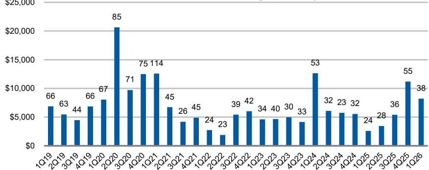

bar chart

| Quarter | Value ($) |
|---|---|
| 1Q19 | 66 |
| 2Q19 | 63 |
| 3Q19 | 44 |
| 4Q19 | 66 |
| 1Q20 | 67 |
| 2Q20 | 85 |
| 3Q20 | 71 |
| 4Q20 | 75 |
| 1Q21 | 114 |
| 2Q21 | 45 |
| 3Q21 | 26 |
| 4Q21 | 45 |
| 1Q22 | 24 |
| 2Q22 | 23 |
| 3Q22 | 39 |
| 4Q22 | 42 |
| 1Q23 | 34 |
| 2Q23 | 40 |
| 3Q23 | 30 |
| 4Q23 | 33 |
| 1Q24 | 53 |
| 2Q24 | 32 |
| 3Q24 | 23 |
| 4Q24 | 32 |
| 1Q25 | 24 |
| 2Q25 | 28 |
| 3Q25 | 36 |
| 4Q25 | 55 |
| 1Q26 | 38 |

US Biotech Follow-on Offerings  
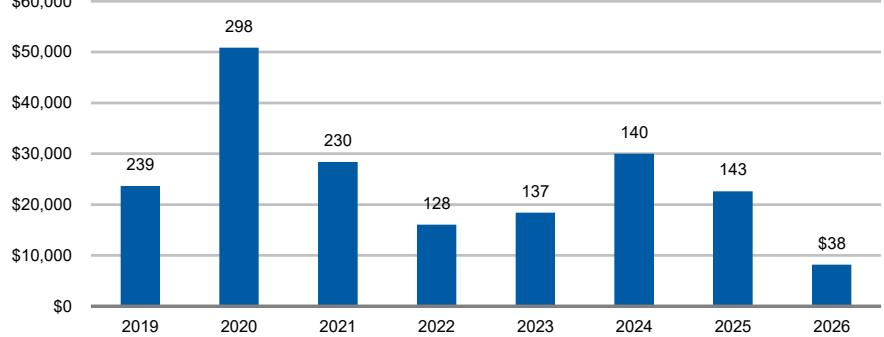

bar chart

| Year | Value ($) |
| :--- | :--- |
| 2019 | 239 |
| 2020 | 298 |
| 2021 | 230 |
| 2022 | 128 |
| 2023 | 137 |
| 2024 | 140 |
| 2025 | 143 |
| 2026 | 38 |

US Biotech Follow-on Offerings (Weekly)  
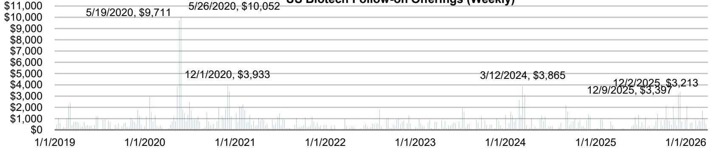

bar chart

US Biotech Follow-on Cherings (Weekly)
| Date | Price ($) |
| :--- | :--- |
| 5/19/2020 | 9,711 |
| 5/26/2020 | 10,052 |
| 12/1/2020 | 3,933 |
| 3/12/2024 | 3,865 |
| 12/9/2025 | 3,397 |
| 12/2/2025 | 3,213 |

Key Takeaway: The last two weeks of December 2025 saw net of \$6B in public equity follow on offerings for US Biotech.

## BioPharma M&A Coming Into Focus

BioPharma M&A Deals Announced in 2025 - 2026

<table><tr><td>Acquirer</td><td>Company acquired</td><td>Date of deal</td><td>Total consideration</td><td>Price per share</td><td>Premium*</td></tr><tr><td>GSK</td><td>Nuvalent</td><td>6/9/2026</td><td>$10,600.0</td><td>$124.0</td><td>40.0%</td></tr><tr><td>Incyte</td><td>Vega Therapeutics</td><td>6/8/2026</td><td>$2,000.0</td><td>N/A</td><td>N/A</td></tr><tr><td>Eli Lilly</td><td>Carevo</td><td>5/26/2026</td><td>$1,500.0</td><td>N/A</td><td>N/A</td></tr><tr><td>Eli Lilly</td><td>LimmaTech Biologics AG</td><td>5/26/2026</td><td>$780.0</td><td>N/A</td><td>N/A</td></tr><tr><td>Eli Lilly</td><td>Vaccine Company</td><td>5/26/2026</td><td>$1,550.0</td><td>N/A</td><td>N/A</td></tr><tr><td>Eli Lilly</td><td>Engage</td><td>5/20/2026</td><td>$202.0</td><td>N/A</td><td>N/A</td></tr><tr><td>Bayer</td><td>Perfuse</td><td>5/6/2026</td><td>$2,450.0</td><td>N/A</td><td>N/A</td></tr><tr><td>LEO Pharma</td><td>Replay</td><td>4/30/2026</td><td>$50.0</td><td>N/A</td><td>N/A</td></tr><tr><td>Teva</td><td>Emalex</td><td>4/29/2026</td><td>$700.0</td><td>N/A</td><td>N/A</td></tr><tr><td>Chiesi</td><td>KaVista Pharmaceuticals</td><td>4/29/2026</td><td>$1,900.0</td><td>$27.0</td><td>40.0%</td></tr><tr><td>Ligand Pharmaceuticals</td><td>Xoma Royalty</td><td>4/27/2026</td><td>$739.0</td><td>$39.0</td><td>3.0%</td></tr><tr><td>Sun Pharma</td><td>Organon</td><td>4/26/2026</td><td>$11,750.0</td><td>$14.0</td><td>24.0%</td></tr><tr><td>Amneat</td><td>Kashiv</td><td>4/22/2026</td><td>$750.0</td><td>N/A</td><td>N/A</td></tr><tr><td>Eli Lilly</td><td>Ajax Therapeutics</td><td>4/27/2026</td><td>$2,300.0</td><td>N/A</td><td>N/A</td></tr><tr><td>Eli Lilly</td><td>Ketonia Therapeutics</td><td>4/20/2026</td><td>$3,250.0</td><td>N/A</td><td>N/A</td></tr><tr><td>UCB</td><td>Neurona Therapeutics</td><td>4/17/2026</td><td>$850.0</td><td>N/A</td><td>N/A</td></tr><tr><td>Eli Lilly</td><td>CrossBridge</td><td>4/14/2026</td><td>$300.0</td><td>N/A</td><td>N/A</td></tr><tr><td>Gilead</td><td>Tubulis</td><td>4/7/2026</td><td>$3,150.0</td><td>N/A</td><td>N/A</td></tr><tr><td>Neurocrine</td><td>Soleno Therapeutics</td><td>4/6/2026</td><td>$2,900.0</td><td>$53.0</td><td>34.0%</td></tr><tr><td>Biogen</td><td>Apelitis</td><td>3/31/2026</td><td>$5,490.0</td><td>$41.0</td><td>86.0%</td></tr><tr><td>Eli Lilly</td><td>Centessa</td><td>3/31/2026</td><td>$6,300.0</td><td>$38.0</td><td>38.0%</td></tr><tr><td>Novartis</td><td>Excelergy</td><td>3/27/2026</td><td>$2,000.0</td><td>N/A</td><td>N/A</td></tr><tr><td>Obsuka Pharmaceutical</td><td>Transcend Therapeutics</td><td>3/27/2026</td><td>$700.0</td><td>N/A</td><td>N/A</td></tr><tr><td>Merck</td><td>Tern Pharmaceuticals</td><td>3/25/2026</td><td>$6,700.0</td><td>$53.0</td><td>31.0%</td></tr><tr><td>Gilead</td><td>Ouro Medicines</td><td>3/24/2026</td><td>$1,675.0</td><td>N/A</td><td>N/A</td></tr><tr><td>Servier</td><td>Day One Biopharmaceuticals</td><td>3/6/2026</td><td>$2,500.0</td><td>$21.5</td><td>86.0%</td></tr><tr><td>Gilead</td><td>Arcetix</td><td>2/23/2026</td><td>$7,800.0</td><td>$115.0</td><td>79.0%</td></tr><tr><td>Eli Lilly</td><td>Onna Therapeutics</td><td>2/9/2026</td><td>$2,400.0</td><td>N/A</td><td>N/A</td></tr><tr><td>GSK</td><td>RAP Therapeutics</td><td>1/20/2026</td><td>$2,200.0</td><td>$58.0</td><td>65.0%</td></tr><tr><td>Eli Lilly</td><td>Venty Biosciences</td><td>1/7/2026</td><td>$1,200.0</td><td>$14.0</td><td>2.0%</td></tr><tr><td>Sanofi</td><td>Dynavax</td><td>12/24/2025</td><td>$2,200.0</td><td>$15.5</td><td>39.0%</td></tr><tr><td>Biomarin Pharmaceutical</td><td>Amicus Therapeutics</td><td>12/19/2025</td><td>$4,800.0</td><td>$14.5</td><td>33.0%</td></tr><tr><td>Sobi</td><td>Arthrosi Therapeutics</td><td>12/13/2025</td><td>$950.0</td><td>N/A</td><td>N/A</td></tr><tr><td>Mirum Pharmaceuticals</td><td>Bluejay Therapeutics</td><td>12/8/2025</td><td>$620.0</td><td>N/A</td><td>N/A</td></tr><tr><td>Johnson &amp; Johnson</td><td>Hatda</td><td>11/17/2025</td><td>$3,050.0</td><td>N/A</td><td>N/A</td></tr><tr><td>Merck</td><td>Cidara Therapeutics</td><td>11/14/2025</td><td>$9,200.0</td><td>$221.5</td><td>108.0%</td></tr><tr><td>Pfizer</td><td>Metsera</td><td>11/10/2025</td><td>$7,000.0</td><td>$65.6</td><td>-</td></tr><tr><td>Novartis</td><td>Avidity</td><td>10/26/2025</td><td>$12,000.0</td><td>$72.0</td><td>46.0%</td></tr><tr><td>Eli Lilly</td><td>Adverum Biotechnologies</td><td>10/24/2025</td><td>$75.0</td><td>$3.6</td><td>0.0%</td></tr><tr><td>Alkermes</td><td>Avadel</td><td>10/22/2025</td><td>$2,100.0</td><td>$18.5</td><td>12.0%</td></tr><tr><td>BioCryst Pharma</td><td>Astria Therapeutics</td><td>10/14/2025</td><td>$700.0</td><td>$13.0</td><td>53.0%</td></tr><tr><td>Bristol Myers Squibb</td><td>Orbital Therapeutics</td><td>10/10/2025</td><td>$1,500.0</td><td>N/A</td><td>N/A</td></tr><tr><td>Novo Nordisk</td><td>Akero Therapeutics</td><td>10/9/2025</td><td>$4,700.0</td><td>$54.0</td><td>16.0%</td></tr><tr><td>Genmab</td><td>Merus</td><td>9/29/2025</td><td>$8,000.0</td><td>$97.0</td><td>41.0%</td></tr><tr><td>Roche</td><td>89Bio</td><td>9/18/2025</td><td>$2,400.0</td><td>$14.5</td><td>79.0%</td></tr><tr><td>Novartis</td><td>Tourmaline Bio</td><td>9/9/2025</td><td>$1,400.0</td><td>$48.0</td><td>59.0%</td></tr><tr><td>MannKind</td><td>scPharmaceuticals</td><td>8/25/2025</td><td>$303.0</td><td>$5.4</td><td>10.0%</td></tr><tr><td>SERB Pharmaceuticals</td><td>Y-mAbs Therapeutics</td><td>8/5/2025</td><td>$412.0</td><td>$8.6</td><td>105.0%</td></tr><tr><td>Bausch Health</td><td>Durect Corporation</td><td>7/29/2025</td><td>$63.0</td><td>$1.8</td><td>217.0%</td></tr><tr><td>Merck &amp; Co.</td><td>Verona Pharma</td><td>7/9/2025</td><td>$10,000.0</td><td>$107.0</td><td>23.0%</td></tr><tr><td>Eli Lilly</td><td>Verve Therapeutics</td><td>6/16/2025</td><td>$1,000.0</td><td>$10.5</td><td>67.0%</td></tr><tr><td>Supernus Pharmaceuticals</td><td>Sage</td><td>6/16/2025</td><td>$561.0</td><td>$8.5</td><td>27.0%</td></tr><tr><td>BioNTech</td><td>CareVac</td><td>6/12/2025</td><td>$1,250.0</td><td>$5.5</td><td>34.0%</td></tr><tr><td>Sanofi</td><td>Blueprint Medicines</td><td>6/2/2025</td><td>$9,100.0</td><td>$129.0</td><td>25.0%</td></tr><tr><td>Sanofi</td><td>Vigiti Neuroscience</td><td>5/21/2025</td><td>$480.0</td><td>$8.0</td><td>24.6%</td></tr><tr><td>Regeneron</td><td>23&amp;me</td><td>5/19/2025</td><td>$256.0</td><td>N/A</td><td>N/A</td></tr><tr><td>BioMarin Pharmaceutical</td><td>Inozyme Pharma</td><td>5/16/2025</td><td>$270.0</td><td>$4.0</td><td>18200.0%</td></tr><tr><td>Novartis</td><td>Regulus Therapeutics</td><td>4/30/2025</td><td>$800.0</td><td>$7.0</td><td>107.0%</td></tr><tr><td>Merck KGaA</td><td>SpringWorks Therapeutics</td><td>4/28/2025</td><td>$3,900.0</td><td>$9.0</td><td>50.0%</td></tr><tr><td>AstraZeneca</td><td>EsoBiotech</td><td>3/17/2025</td><td>$425.0</td><td>N/A</td><td>N/A</td></tr><tr><td>Taito Pharmaceutical</td><td>Araris Biotech</td><td>3/17/2025</td><td>$400.0</td><td>N/A</td><td>N/A</td></tr><tr><td>Knight Therapeutics</td><td>Paladin Pharma</td><td>3/11/2025</td><td>$83.0</td><td>N/A</td><td>N/A</td></tr><tr><td>Sun Pharma</td><td>Checkpoint therapeutics</td><td>3/10/2025</td><td>$355.0</td><td>$4.1</td><td>66.0%</td></tr><tr><td>Bristol Myers Squibb</td><td>2SeventyBio</td><td>3/10/2025</td><td>$286.0</td><td>$5.0</td><td>88.0%</td></tr><tr><td>Jazz Pharmaceuticals</td><td>Chimerix</td><td>3/5/2025</td><td>$935.0</td><td>$8.6</td><td>72.0%</td></tr><tr><td>Cosette</td><td>Maybe Pharma</td><td>2/20/2025</td><td>$430.0</td><td>$4.7</td><td>37.0%</td></tr><tr><td>Novartis</td><td>Anthos Therapeutics</td><td>2/11/2025</td><td>$925.0</td><td>N/A</td><td>N/A</td></tr><tr><td>Lantheus Holdings</td><td>Evergreen Theragnostics</td><td>1/28/2025</td><td>$250.0</td><td>N/A</td><td>N/A</td></tr><tr><td>Johnson &amp; Johnson</td><td>Intra-Cellular Therapies</td><td>1/13/2025</td><td>$14,600.0</td><td>$132.0</td><td>39.0%</td></tr><tr><td>GSK</td><td>IDRx</td><td>1/13/2025</td><td>$1,000.0</td><td>N/A</td><td>N/A</td></tr></table>

- 40 deals were announced in 2025, worth \~\$110bn in aggregate consideration  
- 30 deals has been announced so far in 2026, worth \~\$86bn in aggregate

■ LLY is outpacing other biopharma companies, covering $>33\%$ of 2026 M&A deals

- The 6/9/2026 deal announced (GSK/Nuvalent) worth \$10.6Bn is the largest deal announced since Feb '26  
- The largest M&A deal so far has been J&J's acquisition of ITCI for \$14.6bn, announced in Jan 2025, with the $2^{nd}$ largest deal (\~\$12bn) announced on 10/26

## BioPharma M&A Coming Into Focus

BioPharma M&A Deals Announced in 2025 - 2026

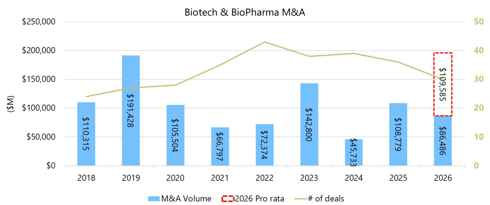

bar-line hybrid

Biotech & BioPharma M&A
| Year | M&A Volume ($) | # of deals |
| :--- | :--- | :--- |
| 2018 | 110,315 | 24 |
| 2019 | 191,428 | 27 |
| 2020 | 105,504 | 28 |
| 2021 | 66,797 | 33 |
| 2022 | 72,374 | 43 |
| 2023 | 142,800 | 38 |
| 2024 | 45,733 | 39 |
| 2025 | 108,779 | 36 |
| 2026 | 86,486 | 31 |
#2026 Pro rata; # of deals; Biotech & BioPharma M&A

## Capital Markets: M&A

USBiotechnology&A  
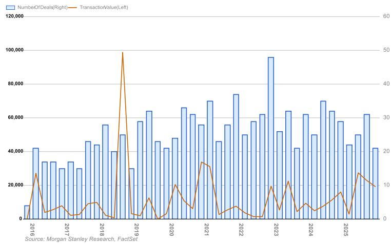

bar-line hybrid chart

| Year | Number of Deals(Right) | TransactionValue(Left) |
|------|------------------------|------------------------|
| 2016 | 42,000                 | 10                     |
| 2017 | 34,000                 | 5                      |
| 2018 | 56,000                 | 10                     |
| 2019 | 58,000                 | 5                      |
| 2020 | 66,000                 | 15                     |
| 2021 | 70,000                 | 35                     |
| 2022 | 74,000                 | 5                      |
| 2023 | 96,000                 | 15                     |
| 2024 | 62,000                 | 5                      |
| 2025 | 64,000                 | 15                     |
| 2026 | 61,000                 | 10                     |

USFederaFundsTargetRate  
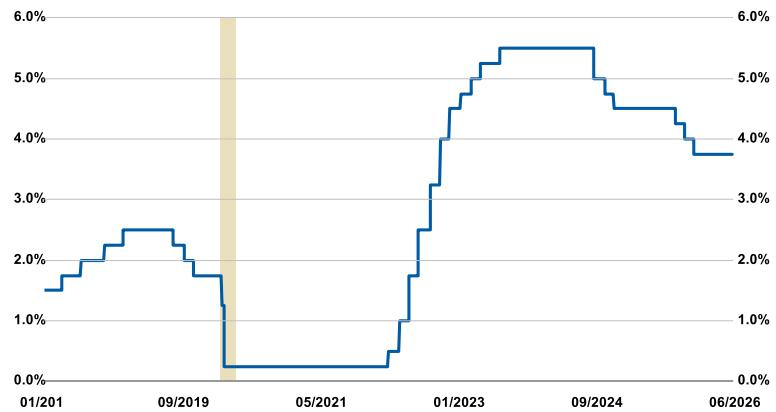

line chart

| Date     | Value |
| -------- | ----- |
| 01/2011  | 1.5%  |
| 09/2019  | 2.5%  |
| 05/2021  | 0.0%  |
| 01/2023  | 4.0%  |
| 09/2024  | 5.5%  |
| 06/2026  | 3.8%  |

Source: MS, FactSet

## Need for M&A

Outside of the interest rate outlook, we believe there remains a fundamental need for SMID Cap biotech M&A, which is driven by the patent expirations that the large cap Biopharma companies are expected to face at the end of this decade

## Discount Rate Impact

The need for M&A has been underscored by larger deals undertaken by multiple companies and others across the industry remaining active in bolt-ons, even during the higher rate regime of 2022-2023.

While the trend of M&A in life sciences has generally been positive over time, we observe a particular pick-up in the timeframes which coincided with rate lowering regimes.

Cash Runways: Precommercial SMID Cap Biotech Coverage (1/2)

<table><tr><td>Ticker</td><td>Company Name</td><td>Rating</td><td>PT</td><td>Cash (M)</td><td>Cash Runway</td><td>Guidance, Estimate, or Calculation?</td><td>Next Catalyst</td><td>Catalyst Timing</td><td>Covering Analyst</td></tr><tr><td>BIOA.O</td><td>BioAge Labs, Inc.</td><td>Equal-Weight</td><td>23.00</td><td>$411</td><td>Into 2029</td><td>Estimate</td><td>Complete Ph1 MAD data for BGE-102 in subjects with elevated hsCRP</td><td>1H26</td><td>Mike Ulz</td></tr><tr><td>KYTX.O</td><td>Kyverna Therapeutics, Inc.</td><td>Overweight</td><td>33.00</td><td>$279</td><td>Into 2028</td><td>Guidance</td><td>File BLA for miv-cel in SPS in 1H26; updated Ph2 MG data expected</td><td>2026</td><td>Mike Ulz</td></tr><tr><td rowspan="2">SLN.O</td><td rowspan="2">Silence Therapeutics PLC Sponsored ADR</td><td rowspan="2">Overweight</td><td rowspan="2">25.00</td><td></td><td></td><td></td><td></td><td></td><td></td></tr><tr><td>$102</td><td>Into 2028</td><td>Guidance</td><td>Ph2 SANRECO data in PV</td><td>3Q26</td><td>Mike Ulz</td></tr><tr><td>ARVN.O</td><td>Arvinas, Inc.</td><td>Equal-Weight</td><td>10.00</td><td>$788</td><td>2H28</td><td>Guidance</td><td>ARV-102 Ph1 MAD data in PD and ARV-393 interim Ph1 data (mono)</td><td>2026</td><td>Terence Flynn</td></tr><tr><td>BCAX.O</td><td>Bicara Therapeutics Inc.</td><td>Overweight</td><td>36.00</td><td>$408</td><td>Into 1H29</td><td>Guidance</td><td>Long-term follow-up data from Ph1b study of ficerafusp alfa in HNSCC</td><td>2Q26</td><td>Judah Frommer</td></tr><tr><td>KYMR.O</td><td>Kymera Therapeutics, Inc.</td><td>Overweight</td><td>127.00</td><td>$1,600</td><td>Into 2029</td><td>Guidance</td><td>Ph1 HV data for KT-579</td><td>2H26</td><td>Judah Frommer</td></tr><tr><td>CLDX.O</td><td>Celldex Therapeutics, Inc.</td><td>Overweight</td><td>43.00</td><td>$583</td><td>Through 2027</td><td>Guidance</td><td>OLE data from Ph2 CIndU study of barzolvolimab</td><td>1Q26</td><td>Judah Frommer</td></tr><tr><td>ACLX.O</td><td>Arcelix, Inc.</td><td>Overweight</td><td>111.00</td><td>$576</td><td>Into 2028</td><td>Guidance</td><td>FDA acceptance of anito-cel BLA</td><td>1Q26</td><td>Judah Frommer</td></tr><tr><td>ENGN.O</td><td>enGene Holdings Inc.</td><td>Overweight</td><td>19.00</td><td>$342</td><td>Into 2H28</td><td>Guidance</td><td>Additional Pivotal LEGEND data for detalimogene in NMIBC</td><td>2H26</td><td>Judah Frommer</td></tr><tr><td>FDMT.O</td><td>4D Molecular Therapeutics, Inc.</td><td>Equal-Weight</td><td>NA</td><td>$514</td><td>Into 2H28</td><td>Guidance</td><td>2-year Ph2b PRISM data for 4D-150 in wet AMD</td><td>mid-2026</td><td>Judah Frommer</td></tr><tr><td>ABSI.O</td><td>Absci Corporation</td><td>Equal-Weight</td><td>4.32</td><td>$153</td><td>Into 1H28</td><td>Guidance</td><td>Ph1/2a ABS-201 interim efficacy data readout in androgenetic alopecia</td><td>2H26</td><td>Sean Laaman</td></tr><tr><td>CTNM.O</td><td>Contineum Therapeutics, Inc. Class A</td><td>Equal-Weight</td><td>14.00</td><td>$182</td><td>Through 2028</td><td>Calculation</td><td>PIPE-307 Phase 2 VISTA</td><td>4Q25</td><td>Sean Laaman</td></tr><tr><td>ERAS.O</td><td>Erasca, Inc.</td><td>Equal-Weight</td><td>10.00</td><td>$288</td><td>Into 1H29</td><td>Guidance</td><td>Ph1 initial monotherapy data for ERAS-0015 and ERAS-4001</td><td>1H26/2H26</td><td>Sean Laaman</td></tr><tr><td>CGON.O</td><td>CG Oncology, Inc.</td><td>Overweight</td><td>93.00</td><td>$680</td><td>Into 1H28</td><td>Guidance</td><td>Phase 3 PIVOT-006 data for cretostimogene in IR NMIBC</td><td>1H26</td><td>Sean Laaman</td></tr><tr><td>CGEM.O</td><td>Cullinan Therapeutics, Inc.</td><td>Overweight</td><td>30.00</td><td>$333</td><td>Into 2029</td><td>Guidance</td><td>Ph1 initial clinical data for CLN-978 in SLE/RA</td><td>2Q26</td><td>Sean Laaman</td></tr><tr><td>DNLI.O</td><td>Denali Therapeutics Inc.</td><td>Overweight</td><td>40.00</td><td>$848</td><td>Into 2H28</td><td>Calculation</td><td>PDUFA date for tividenofusp alfa in MPS II</td><td>4/5/2026</td><td>Sean Laaman</td></tr><tr><td>IRON.O</td><td>Disc Medicine, Inc.</td><td>Overweight</td><td>75.00</td><td>$616</td><td>Into 2029</td><td>Guidance</td><td>Phase 3 APOLLO data for bitopertin in EPP</td><td>4Q26</td><td>Sean Laaman</td></tr><tr><td rowspan="2">RXRX.O</td><td rowspan="2">Recursion Pharmaceuticals, Inc. Class A</td><td rowspan="2">Equal-Weight</td><td rowspan="2">5.00</td><td></td><td>Through YE27</td><td>Guidance</td><td>Early Ph1 safety &amp; PK monotherapy data for REC-1245 in solid tumors &amp; lymphoma</td><td>1H26</td><td>Sean Laaman</td></tr><tr><td>$755</td><td></td><td></td><td></td><td></td><td></td></tr><tr><td>ALEC.O</td><td>Alector, Inc.</td><td>Underweight</td><td>0.90</td><td>$291</td><td>Through 2027</td><td>Guidance</td><td>AL101 Phase 3 interim analysis</td><td>1H26</td><td>Sean Laaman</td></tr><tr><td>TRVI.O</td><td>Trevi Therapeutics, Inc.</td><td>Overweight</td><td>19.00</td><td>$195</td><td>Into 2028</td><td>Guidance</td><td>EOP2 FDA meeting for IPF chronic cough program</td><td>1Q26</td><td>Judah Frommer</td></tr><tr><td>EVMN.N</td><td>Evommune, Inc.</td><td>Overweight</td><td>54.00</td><td>$374</td><td>Into 4Q28</td><td>Calculation</td><td>Ph2b data for EVO756 in CSU</td><td>1H26</td><td>Judah Frommer</td></tr><tr><td>BCYC.O</td><td>Bicycle Therapeutics Plc Sponsored ADR</td><td>Equal-Weight</td><td>13.00</td><td></td><td>Into 2028</td><td>Guidance</td><td>Report dose selection from the Ph2/3 Duravelo-2 in mUC</td><td>1Q26</td><td>Max Skor</td></tr><tr><td>AVIR.O</td><td>Atea Pharmaceuticals, Inc.</td><td>Equal-Weight</td><td>6.00</td><td>$649</td><td>Through 2027</td><td>Guidance</td><td>Ph3 HCV (C-BEYOND) topline results</td><td>mid-2026</td><td>Max Skor</td></tr></table>

## Key Observations:

\- Within MS's SMID cap biotech coverage universe, \~50% of pre-commercial biotech companies have >2 years cash on hand, while many (22/50; 44%) have 1-2 years of cash, and 4/50 (8%) have less than 1 year of cash and may need to raise capital more imminently.

## Important Notes:

- Cash runways were estimated by usage of 1) Company guidance (“Guidance”), 2) MS models (“Estimate”), or 3) “Calculations” as outlined below.  
- For all companies outside of CMPS and EVMN for which “Calculation” was used, methodology for determining cash runway was a simple formula of 3Q25 cash/FY24 cash used in operations.  
■ Cash balances reflect the most recently reported financial disclosures.

## Cash Runways: Precommercial SMID Cap Biotech Coverage (2/2)

<table><tr><td>Ticker</td><td>Company Name</td><td>Rating</td><td>PT</td><td>Cash (M)</td><td>Cash Runway</td><td>Guidance, Estimate, or Calculation?</td><td>Next Catalyst</td><td>Catalyst Timing</td><td>Covering Analyst</td></tr><tr><td>AARD.O</td><td>Aardvark Therapeutics, Inc.</td><td>Overweight</td><td>29.00</td><td>$126</td><td>Into 2027</td><td>Guidance</td><td>Ph3 HERO study in PWS</td><td>3Q26</td><td>Mike Ulz</td></tr><tr><td>DYN.O</td><td>Dyne Therapeutics Inc</td><td>Overweight</td><td>50.00</td><td>$792</td><td>3Q27</td><td>Guidance</td><td>z- basivarsen myotonic dystrophy type-1 (DM1) data</td><td>1Q27</td><td>Mike Ulz</td></tr><tr><td>GUTS.O</td><td>Fractyl Health, Inc.</td><td>Equal-Weight</td><td>2.00</td><td>$78</td><td>early 2027</td><td>Guidance</td><td>Pivotal topline 6-month randomized data from REMAIN-1 for Revita</td><td>2H26</td><td>Mike Ulz</td></tr><tr><td>ABVX.O</td><td>Abivax SA Sponsored ADR</td><td>Overweight</td><td>145.00</td><td>$692</td><td>Into 4Q27</td><td>Guidance</td><td>Topline Ph3 ABTECT maintenance data</td><td>Late 2Q26</td><td>Judah Frommer</td></tr><tr><td>TNYA.O</td><td>Tenaya Therapeutics, Inc.</td><td>Overweight</td><td>2.00</td><td>$116</td><td>mid-2027</td><td>Guidance</td><td>Updated data from TN-201 in HCM</td><td>1H26</td><td>Mike Ulz</td></tr><tr><td>RCKT.O</td><td>Rocket Pharmaceuticals, Inc.</td><td>Equal-Weight</td><td>5.00</td><td>$223</td><td>Into 2Q27</td><td>Guidance</td><td>Resumptions of Ph2 Pivotal trial for RP-A501 in Danon</td><td>1H26</td><td>Mike Ulz</td></tr><tr><td>VIR.O</td><td>Vir Biotechnology, Inc.</td><td>Overweight</td><td>20.00</td><td>$781</td><td>Into 4Q27</td><td>Guidance</td><td>Comprehensive Ph1 data update for VIR-5500 (PSMAxCD3) in mCPRC</td><td>1Q26</td><td>Mike Ulz</td></tr><tr><td>VKTX.O</td><td>Viking Therapeutics, Inc.</td><td>Overweight</td><td>99.00</td><td>$706</td><td>Into 2027</td><td>Estimate</td><td>Obesity maintainence study data</td><td>3Q26</td><td>Mike Ulz</td></tr><tr><td>ZNTL.O</td><td>Zentalis Pharmaceuticals, Inc.</td><td>Equal-Weight</td><td>4.00</td><td>$281</td><td>Into Late-2027</td><td>Guidance</td><td>DENALI Part 2 data in PROC</td><td>by YE26</td><td>Mike Ulz</td></tr><tr><td>ALMS.O</td><td>Alumis Inc.</td><td>Overweight</td><td>33.00</td><td>$378</td><td>4Q27</td><td>Guidance</td><td>Ph2b topline data in SLE</td><td>3Q26</td><td>Terence Flynn</td></tr><tr><td>BHVN.N</td><td>Biohaven Ltd.</td><td>Overweight</td><td>21.00</td><td>$261</td><td>Into 2027</td><td>Estimate</td><td>Opakalim Ph2/3 topline data in focal epilepsy</td><td>2H26</td><td>Terence Flynn</td></tr><tr><td>GPCR.O</td><td>Structure Therapeutics, Inc. Sponsored</td><td>Overweight</td><td>125.00</td><td>$799</td><td>Into 2027</td><td>Guidance</td><td>CTX321 (in vivo) Lp(a) program update</td><td>4Q25</td><td>Terence Flynn</td></tr><tr><td>NRIX.O</td><td>Nurix Therapeutics, Inc.</td><td>Equal-Weight</td><td>36.00</td><td>$593</td><td>Into 2028</td><td>Guidance</td><td>Bexobrutideg Ph1 data update and NX-3911/6791 Ph1 data in HV</td><td>2026</td><td>Terence Flynn</td></tr><tr><td>NTLA.O</td><td>Intellia Therapeutics, Inc.</td><td>Equal-Weight</td><td>11.00</td><td>$511</td><td>mid-2027</td><td>Guidance</td><td>Phase 3 HAELO topline data</td><td>mid-2026</td><td>Terence Flynn</td></tr><tr><td>RCUS.N</td><td>Arcus Biosciences, Inc.</td><td>Overweight</td><td>20.00</td><td>$831</td><td>2H28</td><td>Guidance</td><td>HIF-2a data (ARC-20) from additional cohorts and longer follow up</td><td>1H26</td><td>Terence Flynn</td></tr><tr><td>CMPS.O</td><td>COMPASS Pathways Plc Sponsored AD</td><td>Overweight</td><td>18.00</td><td>$336</td><td>Into Late 2027</td><td>Calculation</td><td>26-week data (Part B) from COMP006</td><td>Early 3Q26</td><td>Judah Frommer</td></tr><tr><td>RGNX.O</td><td>REGENXBIO, Inc.</td><td>Overweight</td><td>18.00</td><td>$302</td><td>Into early 2027</td><td>Guidance</td><td>Topline biomarker data from pivotal AFFINITY DUCHENNE study</td><td>Early 2Q26</td><td>Judah Frommer</td></tr><tr><td>PROK.O</td><td>ProKidney Corp. Class A</td><td>Equal-Weight</td><td>3.00</td><td>$272</td><td>Into mid-2027</td><td>Guidance</td><td>PROACT 1 enrollment completion for accelerated approval efficacy analysis</td><td>mid-2026</td><td>Judah Frommer</td></tr><tr><td>TCRX.O</td><td>TScan Therapeutics, Inc.</td><td>Equal-Weight</td><td>NA</td><td>$184</td><td>Into 2H27</td><td>Guidance</td><td>Additional Ph1 ALLOHA data testing TSC-100/-101 in AML/ALL/MDS</td><td>YE25</td><td>Max Skor</td></tr><tr><td>ADAG.O</td><td>Adagene, Inc. Sponsored ADR</td><td>Equal-Weight</td><td>NA</td><td>$75</td><td>Into late 2027</td><td>Guidance</td><td>Data update from Ph1b/2 study of muzastotug + pembrolizumab in 3L+ MSS CRC</td><td>1Q26</td><td>Max Skor</td></tr><tr><td>PHVS.O</td><td>Pharvaris N.V.</td><td>Overweight</td><td>41.00 USD</td><td>$386</td><td>Into 1H27</td><td>Guidance</td><td>Topline Ph3 CHAPTER-3 readout for the prophylactic treatment of HAE</td><td>3Q26</td><td>Max Skor</td></tr><tr><td>PRME.O</td><td>Prime Medicine, Inc.</td><td>Equal-Weight</td><td>$2-$7</td><td>$213</td><td>Into 2027</td><td>Guidance</td><td>IND or CTA for Wilson&#x27;s disease</td><td>1H26</td><td>Terence Flynn</td></tr><tr><td>ZBIO.O</td><td>Zenas BioPharma, Inc.</td><td>Equal-Weight</td><td>19.00</td><td>$422</td><td>Into 4Q26</td><td>Guidance</td><td>BLA submission for obexelimab in IgG4-RD</td><td>2Q26</td><td>Judah Frommer</td></tr><tr><td>SANA.O</td><td>Sana Biotechnology, Inc.</td><td>Overweight</td><td>12.00</td><td>$153</td><td>Into Late 2026</td><td>Guidance</td><td>SC451 IND filing</td><td>2026</td><td>Max Skor</td></tr><tr><td>CABA.O</td><td>Cabaletta Bio, Inc.</td><td>Overweight</td><td>14.00</td><td>$160</td><td>Into 2H26</td><td>Guidance</td><td>Complete data from Ph1/2 RESET trials in SLE, SSc and MG expected</td><td>1H26</td><td>Mike Ulz</td></tr><tr><td>IOBT.O</td><td>IO Biotech, Inc.</td><td>Underweight</td><td>0.36</td><td>$31</td><td>Through 1Q26</td><td>Guidance</td><td>Update on path forward</td><td>2026</td><td>Mike Ulz</td></tr></table>

## Important Notes:

- Cash runways were estimated by usage of 1) Company guidance (“Guidance”), 2) MS models (“Estimate”), or 3) “Calculations” as outlined below.  
- For all companies outside of CMPS and EVMN for which "Calculation" was used, methodology for determining cash runway was a simple formula of 3Q25 cash/FY24 cash used in operations.  
■ Cash balances reflect the most recently reported financial disclosures.

13-F Ownership updates – 1Q26 Part 1

<table><tr><td colspan="5">Hedge Fund</td><td colspan="3">Mutual Fund</td></tr><tr><td>Ticker</td><td>Name</td><td>3M</td><td>6M</td><td>12M</td><td>3M</td><td>6M</td><td>12M</td></tr><tr><td>ARGX-USA</td><td>argenx SE Sponsored ADR</td><td>-25.3%</td><td>-33.7%</td><td>-31.3%</td><td>-0.3%</td><td>-10.8%</td><td>-19.0%</td></tr><tr><td>ALNY-USA</td><td>Alnylam Pharmaceuticals, Inc</td><td>-6.2%</td><td>21.3%</td><td>56.9%</td><td>-1.8%</td><td>-0.2%</td><td>-2.9%</td></tr><tr><td>ONC-USA</td><td>BeOne Medicines Ltd. Sponsored ADR</td><td>6.4%</td><td>-8.8%</td><td>-6.8%</td><td>-9.0%</td><td>-13.2%</td><td>-42.9%</td></tr><tr><td>INSM-USA</td><td>Insmed Incorporated</td><td>-2.3%</td><td>-0.9%</td><td>7.6%</td><td>-7.8%</td><td>-11.1%</td><td>29.1%</td></tr><tr><td>INCY-USA</td><td>Incyte Corporation</td><td>-3.2%</td><td>-8.0%</td><td>4.1%</td><td>0.8%</td><td>1.1%</td><td>3.3%</td></tr><tr><td>GMAB-USA</td><td>Genmab A/S Sponsored ADR</td><td>23.5%</td><td>17.8%</td><td>73.7%</td><td>0.2%</td><td>2.4%</td><td>-22.0%</td></tr><tr><td>NBIX-USA</td><td>Neurocrine Biosciences, Inc.</td><td>-7.6%</td><td>-10.2%</td><td>4.0%</td><td>7.8%</td><td>6.2%</td><td>13.9%</td></tr><tr><td>ASND-USA</td><td>Ascendis Pharma A/S</td><td>1.5%</td><td>-1.8%</td><td>-2.5%</td><td>2.6%</td><td>5.1%</td><td>3.7%</td></tr><tr><td>JAZZ-USA</td><td>Jazz Pharmaceuticals Public Limited Company</td><td>1.1%</td><td>-1.9%</td><td>2.0%</td><td>-0.5%</td><td>9.5%</td><td>9.0%</td></tr><tr><td>BBIO-USA</td><td>BridgeBio Pharma, Inc.</td><td>12.5%</td><td>11.4%</td><td>33.6%</td><td>-4.5%</td><td>-17.6%</td><td>-16.3%</td></tr><tr><td>EXEL-USA</td><td>Exelixis, Inc.</td><td>6.1%</td><td>11.2%</td><td>-0.4%</td><td>-5.0%</td><td>-9.3%</td><td>-15.2%</td></tr><tr><td>IONS-USA</td><td>Ionis Pharmaceuticals, Inc.</td><td>8.2%</td><td>7.5%</td><td>-1.1%</td><td>-13.5%</td><td>-19.7%</td><td>49.6%</td></tr><tr><td>AXSM-USA</td><td>Axsome Therapeutics, Inc.</td><td>4.3%</td><td>14.4%</td><td>17.3%</td><td>-16.6%</td><td>-40.8%</td><td>-97.4%</td></tr><tr><td>ARWR-USA</td><td>Arrowhead Pharmaceuticals, Inc.</td><td>6.2%</td><td>11.3%</td><td>22.7%</td><td>-6.4%</td><td>3.6%</td><td>-4.4%</td></tr><tr><td>BMRN-USA</td><td>BioMarin Pharmaceutical Inc.</td><td>19.6%</td><td>2.0%</td><td>30.6%</td><td>-6.8%</td><td>-10.5%</td><td>-25.3%</td></tr><tr><td>ABVX-USA</td><td>Abivax SA Sponsored ADR</td><td>-7.7%</td><td>35.6%</td><td>55.1%</td><td>29.0%</td><td>189.0%</td><td>153.5%</td></tr><tr><td>HALO-USA</td><td>Halozyme Therapeutics, Inc.</td><td>-20.3%</td><td>38.1%</td><td>89.2%</td><td>1.9%</td><td>-12.1%</td><td>-28.2%</td></tr><tr><td>CELC-USA</td><td>Celcuity Inc.</td><td>13.0%</td><td>27.1%</td><td>35.7%</td><td>-218.9%</td><td>99.9%</td><td>68.2%</td></tr><tr><td>LNTH-USA</td><td>Lantheus Holdings Inc</td><td>73.2%</td><td>23.5%</td><td>36.2%</td><td>-10.9%</td><td>-17.7%</td><td>-10.3%</td></tr><tr><td>KYMR-USA</td><td>Kymera Therapeutics, Inc.</td><td>23.2%</td><td>41.1%</td><td>54.3%</td><td>8.3%</td><td>-1.1%</td><td>1.6%</td></tr><tr><td>CNTA-USA</td><td>Centessa Pharmaceuticals PLC ADR</td><td>25.8%</td><td>38.1%</td><td>48.4%</td><td>140.7%</td><td>58.8%</td><td>1.5%</td></tr><tr><td>RYTM-USA</td><td>Rhythm Pharmaceuticals, Inc.</td><td>-12.2%</td><td>2.2%</td><td>-6.4%</td><td>21.1%</td><td>57.0%</td><td>104.9%</td></tr><tr><td>MIRM-USA</td><td>Mirum Pharmaceuticals, Inc.</td><td>-3.6%</td><td>0.6%</td><td>-1.4%</td><td>20.8%</td><td>17.9%</td><td>29.9%</td></tr><tr><td>PTCT-USA</td><td>PTC Therapeutics, Inc.</td><td>-11.9%</td><td>-9.4%</td><td>-23.7%</td><td>9.7%</td><td>9.3%</td><td>14.3%</td></tr><tr><td>CGON-USA</td><td>CG Oncology, Inc.</td><td>16.8%</td><td>37.8%</td><td>46.7%</td><td>-20.3%</td><td>-14.6%</td><td>-36.3%</td></tr><tr><td>LEGN-USA</td><td>Legend Biotech Corp. Sponsored ADR</td><td>55.3%</td><td>32.9%</td><td>-24.9%</td><td>-28.3%</td><td>-29.7%</td><td>-61.4%</td></tr><tr><td>CRNX-USA</td><td>Crinetics Pharmaceuticals Inc</td><td>8.6%</td><td>15.5%</td><td>21.3%</td><td>-1.0%</td><td>5.0%</td><td>-1.6%</td></tr><tr><td>ACAD-USA</td><td>ACADIA Pharmaceuticals Inc.</td><td>-1.4%</td><td>-2.1%</td><td>19.4%</td><td>0.8%</td><td>2.4%</td><td>34.1%</td></tr><tr><td>VKTX-USA</td><td>Viking Therapeutics, Inc.</td><td>-10.6%</td><td>-15.3%</td><td>-31.4%</td><td>20.5%</td><td>33.8%</td><td>61.0%</td></tr><tr><td>ERAS-USA</td><td>Erasca, Inc.</td><td>3.9%</td><td>-4.3%</td><td>-20.1%</td><td>12.4%</td><td>3.5%</td><td>-9.5%</td></tr><tr><td>DNU-USA</td><td>Denali Therapeutics Inc.</td><td>8.1%</td><td>-11.4%</td><td>-15.7%</td><td>6.0%</td><td>22.5%</td><td>34.6%</td></tr><tr><td>DYN-USA</td><td>Dyne Therapeutics Inc</td><td>10.8%</td><td>43.5%</td><td>55.8%</td><td>-11.6%</td><td>6.4%</td><td>32.4%</td></tr><tr><td>GPCR-USA</td><td>Structure Therapeutics, Inc. Sponsored ADR</td><td>-5.3%</td><td>14.0%</td><td>30.3%</td><td>29.0%</td><td>19.1%</td><td>-31.8%</td></tr><tr><td>ARQT-USA</td><td>Arcutis Biotherapeutics Inc</td><td>3.6%</td><td>-4.5%</td><td>-15.6%</td><td>-16.1%</td><td>-15.5%</td><td>-13.3%</td></tr><tr><td>IDYA-USA</td><td>IDEAYA Biosciences, Inc.</td><td>12.6%</td><td>8.8%</td><td>-4.9%</td><td>-8.8%</td><td>-3.6%</td><td>4.1%</td></tr><tr><td>IRON-USA</td><td>Disc Medicine, Inc.</td><td>21.5%</td><td>25.7%</td><td>81.4%</td><td>30.5%</td><td>4.8%</td><td>42.0%</td></tr><tr><td>RARE-USA</td><td>Ultragenyx Pharmaceutical, Inc.</td><td>1.6%</td><td>4.6%</td><td>14.1%</td><td>8.9%</td><td>-7.2%</td><td>-10.9%</td></tr><tr><td>PHVS-USA</td><td>Pharvaris N.V.</td><td>-3.6%</td><td>44.9%</td><td>60.2%</td><td>11.4%</td><td>243.2%</td><td>451.4%</td></tr></table>

1) Sharp Divergence in High-Beta SMID Biotech (HF buyers vs MF sellers)

Clear pattern: HFs aggressively adding risk, MFs de-risking. Examples: i) AXSM: HF +4–17% across horizons vs MF-17% to -97%I ii) BBIO: HF +11–33% vs MF-16% to -18%; iii) BMRN: HF +20% (3M) vs MF-7% to -25%

HFs leaning into alpha/risk; MFs reducing exposure to volatile names, likely driven by drawdown sensitivity and liquidity preference.

2) Strong Mutual Fund Buying in Earlier-Stage / Turnaround Names (Opposite of HFs)

MFs accumulating beaten-down or speculative assets, often where HFs are neutral/negative: i) VKTX: MF +21% / +34% / +61% vs HF-11% to -31%; ii) ZNTL: MF +140%+ across horizons vs HF consistently negative; iii) CRVS: MF +62% / +71% / +155% vs HF-57% to -193%

MFs appear to be adding long-duration optionality, potentially averaging into dislocations vs HF tactical trading.

3) Consensus Longs (Both HF and MF Adding)

High-conviction overlap is rare but meaningful: i) KYTX: HF +165–280%, MF +88–136%; ii) ABSI: HF +60%+, MF +31–42%; iii) IVVD: HF +67%–302%, MF +133%–900%+; iv) NRIX: Positive across both cohorts

These represent crowded "beta to innovation" winners, likely tied to platform/technology optimism or recent catalysts.

## 13-F Ownership updates – 1Q26 Part 2

<table><tr><td colspan="5">Hedge Fund</td><td colspan="3">Mutual Fund</td></tr><tr><td>Ticker</td><td>Name</td><td>3M</td><td>6M</td><td>12M</td><td>3M</td><td>6M</td><td>12M</td></tr><tr><td>GLPG-USA</td><td>Lakefront Biotherapeutics Sponsored ADR</td><td>-2.0%</td><td>0.6%</td><td>30.7%</td><td>3.1%</td><td>196.8%</td><td>358.1%</td></tr><tr><td>NRIX-USA</td><td>Nurix Therapeutics, Inc.</td><td>42.3%</td><td>50.8%</td><td>72.6%</td><td>45.8%</td><td>7.7%</td><td>-7.1%</td></tr><tr><td>SRPT-USA</td><td>Sarepta Therapeutics, Inc.</td><td>13.1%</td><td>3.8%</td><td>41.7%</td><td>14.9%</td><td>11.1%</td><td>-11.7%</td></tr><tr><td>CMPS-USA</td><td>COMPASS Pathways Plc Sponsored ADR</td><td>-7.3%</td><td>-3.5%</td><td>83.0%</td><td>-39.8%</td><td>101.1%</td><td>127.2%</td></tr><tr><td>RXRX-USA</td><td>Recursion Pharmaceuticals, Inc. Class A</td><td>27.5%</td><td>49.7%</td><td>48.3%</td><td>36.4%</td><td>35.0%</td><td>-2.0%</td></tr><tr><td>VIR-USA</td><td>Vir Biotechnology, Inc.</td><td>4.2%</td><td>-2.5%</td><td>1.0%</td><td>17.1%</td><td>-10.8%</td><td>-8.4%</td></tr><tr><td></td><td>Immunocore Holdings Plc Shs Sponsored American Depositary Shares Repr</td><td></td><td></td><td></td><td></td><td></td><td></td></tr><tr><td>IMCR-USA</td><td>1 Sh</td><td>8.1%</td><td>15.6%</td><td>39.2%</td><td>7.5%</td><td>18.3%</td><td>-27.0%</td></tr><tr><td>BCAX-USA</td><td>Bicara Therapeutics Inc.</td><td>-9.5%</td><td>-12.1%</td><td>-5.5%</td><td>98.5%</td><td>67.9%</td><td>86.8%</td></tr><tr><td>CRVS-USA</td><td>Corvus Pharmaceuticals, Inc.</td><td>-56.7%</td><td>-74.6%</td><td>-192.8%</td><td>62.1%</td><td>71.1%</td><td>155.2%</td></tr><tr><td>SDGR-USA</td><td>Schrodinger, Inc.</td><td>3.4%</td><td>5.5%</td><td>6.9%</td><td>0.0%</td><td>0.0%</td><td>0.0%</td></tr><tr><td>SANA-USA</td><td>Sana Biotechnology, Inc.</td><td>9.0%</td><td>36.9%</td><td>-10.6%</td><td>-33.7%</td><td>-2.2%</td><td>2.7%</td></tr><tr><td>CGEM-USA</td><td>Cullinan Therapeutics, Inc.</td><td>26.2%</td><td>31.5%</td><td>33.9%</td><td>-7.7%</td><td>-22.2%</td><td>-40.3%</td></tr><tr><td>ABSI-USA</td><td>Absci Corporation</td><td>63.2%</td><td>59.8%</td><td>64.6%</td><td>41.7%</td><td>31.5%</td><td>39.4%</td></tr><tr><td>BIOA-USA</td><td>BioAge Labs, Inc.</td><td>0.7%</td><td>5.9%</td><td>-10.4%</td><td>26.0%</td><td>25.9%</td><td>318.8%</td></tr><tr><td>CABA-USA</td><td>Cabaletta Bio, Inc.</td><td>23.0%</td><td>5.3%</td><td>186.5%</td><td>3.3%</td><td>21.2%</td><td>53.2%</td></tr><tr><td>KYTX-USA</td><td>Kyverna Therapeutics, Inc.</td><td>279.5%</td><td>244.6%</td><td>165.9%</td><td>87.5%</td><td>96.0%</td><td>136.3%</td></tr><tr><td>CATX-USA</td><td>Perspective Therapeutics, Inc.</td><td>15.5%</td><td>3.5%</td><td>-16.7%</td><td>-3.2%</td><td>-4.0%</td><td>3.8%</td></tr><tr><td>CTNM-USA</td><td>Contineum Therapeutics, Inc. Class A</td><td>113.6%</td><td>239.7%</td><td>180.6%</td><td>12.5%</td><td>34.4%</td><td>19.2%</td></tr><tr><td>LYEL-USA</td><td>Lyell Immunopharma, Inc.</td><td>-2.3%</td><td>-1.8%</td><td>44.3%</td><td>140.4%</td><td>199.6%</td><td>83.5%</td></tr><tr><td>AVIR-USA</td><td>Atea Pharmaceuticals, Inc.</td><td>2.5%</td><td>2.7%</td><td>-12.7%</td><td>2.3%</td><td>-7.4%</td><td>3.0%</td></tr><tr><td>IMRX-USA</td><td>Immuneering Corp. Class A</td><td>25.7%</td><td>488.3%</td><td>287.9%</td><td>-101.8%</td><td>539.7%</td><td>1264.7%</td></tr><tr><td>RGNX-USA</td><td>REGENXBIO, Inc.</td><td>-6.4%</td><td>-19.2%</td><td>-25.6%</td><td>2.5%</td><td>-4.6%</td><td>-1.6%</td></tr><tr><td>IVVD-USA</td><td>Invivyd, Inc.</td><td>66.6%</td><td>302.8%</td><td>275.2%</td><td>132.7%</td><td>900.0%</td><td>294.1%</td></tr><tr><td>RCKT-USA</td><td>Rocket Pharmaceuticals, Inc.</td><td>-17.1%</td><td>-15.5%</td><td>-0.6%</td><td>15.1%</td><td>15.2%</td><td>-76.1%</td></tr><tr><td>SLN-USA</td><td>Silence Therapeutics PLC Sponsored ADR</td><td>15.2%</td><td>15.2%</td><td>-20.7%</td><td>4.4%</td><td>10.2%</td><td>14.2%</td></tr><tr><td>ZNTL-USA</td><td>Zentalis Pharmaceuticals, Inc.</td><td>-5.0%</td><td>-7.4%</td><td>-26.2%</td><td>163.9%</td><td>141.7%</td><td>137.9%</td></tr><tr><td>PRLD-USA</td><td>Prelude Therapeutics, Inc.</td><td>3.6%</td><td>10.4%</td><td>-8.4%</td><td>75.0%</td><td>6.3%</td><td>0.3%</td></tr><tr><td>FATE-USA</td><td>Fate Therapeutics, Inc.</td><td>-5.5%</td><td>23.7%</td><td>2.4%</td><td>12.5%</td><td>-23.1%</td><td>-17.0%</td></tr><tr><td>PROK-USA</td><td>ProKidney Corp. Class A</td><td>25.9%</td><td>33.0%</td><td>57.6%</td><td>0.0%</td><td>0.0%</td><td>0.0%</td></tr><tr><td>FHTX-USA</td><td>Foghorn Therapeutics, Inc.</td><td>0.5%</td><td>3.0%</td><td>1.2%</td><td>25.7%</td><td>10.7%</td><td>22.7%</td></tr><tr><td>ALEC-USA</td><td>Alector, Inc.</td><td>28.7%</td><td>26.0%</td><td>30.2%</td><td>-13.0%</td><td>-31.6%</td><td>-6.6%</td></tr><tr><td>BCYC-USA</td><td>Bicycle Therapeutics Plc Sponsored ADR</td><td>-2.0%</td><td>-18.7%</td><td>-27.5%</td><td>-18.5%</td><td>-39.5%</td><td>-18.5%</td></tr><tr><td>TNYA-USA</td><td>Tenaya Therapeutics, Inc.</td><td>97.6%</td><td>140.9%</td><td>266.6%</td><td>27.3%</td><td>26.9%</td><td>-34.8%</td></tr><tr><td>GUTS-USA</td><td>Fractyl Health, Inc.</td><td>5.5%</td><td>753.2%</td><td>769.1%</td><td>235.8%</td><td>1914.3%</td><td>1380.4%</td></tr><tr><td>ENGN-USA</td><td>enGene Therapeutics Inc.</td><td>47.5%</td><td>65.0%</td><td>39.8%</td><td>165.9%</td><td>168.6%</td><td>168.3%</td></tr><tr><td>TCRX-USA</td><td>TScan Therapeutics, Inc.</td><td>1.2%</td><td>0.1%</td><td>-11.7%</td><td>-97.3%</td><td>-117.4%</td><td>-177.7%</td></tr><tr><td>XLO-USA</td><td>Xilio Therapeutics Inc</td><td>775.0%</td><td>160.3%</td><td>328.1%</td><td>2.6%</td><td>7.3%</td><td>10.0%</td></tr><tr><td>CRVO-USA</td><td>CervoMed Inc.</td><td>3.9%</td><td>-5.4%</td><td>-101.8%</td><td>-6.5%</td><td>-9.7%</td><td>46.7%</td></tr></table>

## 4) Consensus Shorts / De-risking (Both Selling)

True agreement on exits is also limited but present: i) ARGX: Both reducing exposure (HF -25% to -31%, MF negative across horizons); ii) ARQT, BCYC: Both consistently negative Interpretation: These likely reflect either post-peak positioning unwind or fading conviction after catalyst cycles.

## 5) Hedge Funds React More Tactically to Catalysts

HFs show short-term (3M) positioning shifts not mirrored by MFs: i) ONC (BeOne): HF +6% (3M) vs MF -9% (3M) and -43% (12M); ii) IONS: HF +7–8% (3M/6M) vs MF heavy selling in 3–6M Interpretation: HF activity likely tied to event-driven positioning (data, regulatory developments).

## 6) Rotation Away from "Legacy Biotech Winners" Into Newer Themes

Selling pressure in older winners: i) NBIX: HF negative short-term vs MF positive → divergence; ii) INCY: HF negative 3–6M vs MF steadily positive
Buying concentrated in: New modalities (gene therapy, cell therapy, targeted protein degradation)

## SMID Cap Biotech: Setting Up For a Renaissance

1. Policy Uncertainty = underperformance... 2. ...valuations remain attractive...  
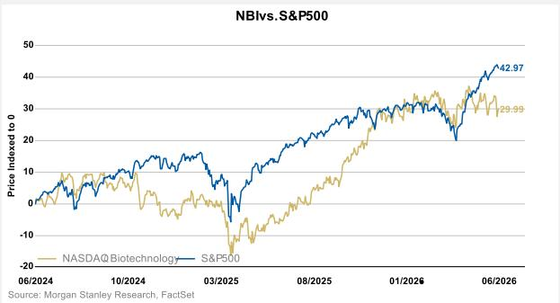

line chart

| Date     | NASDAQ Biotechnology | S&P500 |
| -------- | --------------------- | ------ |
| 06/2026  | 29.99                 | 42.97  |

3. ...with steep inflection in profitability...

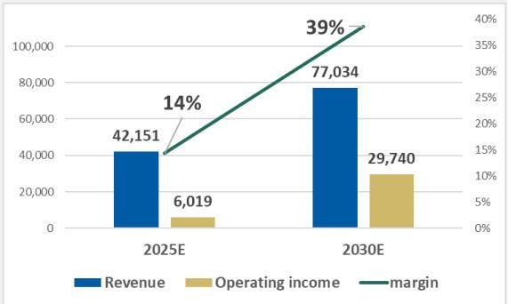

bar-line hybrid

| Year | Revenue | Operating income | margin (%) |
| :--- | :--- | :--- | :--- |
| 2025E | 42,151 | 6,019 | 14 |
| 2030E | 77,034 | 29,740 | 39 |

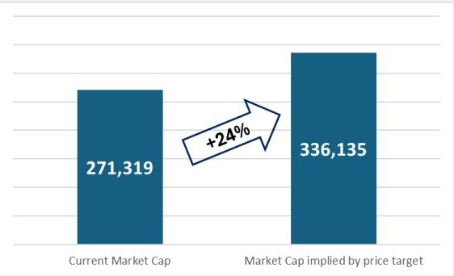

bar chart

| Category | Value |
|---|---|
| Current Market Cap | 271,319 |
| Market Cap implied by price target | 336,135 |
+24%

4. & concomitant, underappreciated cash build  
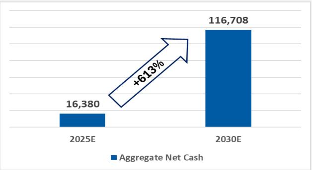

bar chart

| Year | Aggregate Net Cash |
| :--- | :--- |
| 2025E | 16,380 |
| 2030E | 116,708 |
+613%

## Key Points:

■ Focus on our 28 Commercial stage SMID Cap Biotech names  
■ Aggregate large improvement in profitability forecast  
■ May suggest valuations are conservative  
■ Revenue/margin growth drives large accumulation of cash on balance sheets  
■ Opportunity to build pipelines inorganic/organic  
- Note that Large Cap Biopharma faces LOE value of \~\$150bn out to 2030

## Our 4 Lenses for Commercial SMID Cap Biotech Coverage ('26E-'30E)

1 Lens 1 - Balanced Growers: Lesser dependence on both one product & the pipeline

ALNY, ARQT, BBIO, INSM, NBIX, ONC

2 Lens 2 - One Product Hits: \~90% growth driven by one product that has already launched

ARGX, ASND, CRNX, CYTK, IMCR, LEGN, RYTM, SRPT

3 Lens 3 - Pipeline dependent growers: Growth largely driven by yet-to-be-launched products

ARWR, AXSM, DNLI, EXEL, IONS, MIRM, PTCT, RARE

4 Lens 4 - Slower growers: Lowest growth to 2030 within our commercial stage coverage

ACAD, HALO, INCY, JAZZ

Lens 1 to 4 in order of increasing risk. Within each Lens, listed L to R from highest to lowest revenue growth.

Green = OW rated

MS Commercial Stage SMID Biotech Revenue Outlook (\$mn), Growth Rank & Assigned Investment Lens

<table><tr><td>Ticker</td><td>2026E</td><td>2027E</td><td>2028E</td><td>2029E</td><td>2030E</td><td>Rev. differential 2026E to 2030E</td><td>Growth 2026E to 2030E</td><td>Growth Rank</td><td>Quadrant</td></tr><tr><td>DNLI</td><td>4 e</td><td>45 e</td><td>98 e</td><td>180 e</td><td>313 e</td><td>309 e</td><td>7160%</td><td>1</td><td>III</td></tr><tr><td>CRNX</td><td>66 e</td><td>183 e</td><td>404 e</td><td>623 e</td><td>870 e</td><td>804 e</td><td>1221%</td><td>2</td><td>II</td></tr><tr><td>CYTK</td><td>182 e</td><td>506 e</td><td>951 e</td><td>1,320 e</td><td>1,904 e</td><td>1,722 e</td><td>944%</td><td>3</td><td>II</td></tr><tr><td>RYTM</td><td>274 e</td><td>478 e</td><td>758 e</td><td>1,091 e</td><td>1,431 e</td><td>1,157 e</td><td>423%</td><td>4</td><td>I</td></tr><tr><td>IONS</td><td>896 e</td><td>1,558 e</td><td>2,370 e</td><td>3,355 e</td><td>4,444 e</td><td>3,548 e</td><td>396%</td><td>5</td><td>I</td></tr><tr><td>BBIO</td><td>962 e</td><td>1,729 e</td><td>2,502 e</td><td>3,259 e</td><td>4,011 e</td><td>3,049 e</td><td>317%</td><td>6</td><td>I</td></tr><tr><td>INSM</td><td>1,695 e</td><td>2,710 e</td><td>3,437 e</td><td>4,324 e</td><td>5,808 e</td><td>4,112 e</td><td>243%</td><td>7</td><td>I</td></tr><tr><td>AXSM</td><td>928 e</td><td>1,500 e</td><td>2,052 e</td><td>2,587 e</td><td>3,091 e</td><td>2,163 e</td><td>233%</td><td>8</td><td>II</td></tr><tr><td>MIRM</td><td>670 e</td><td>740 e</td><td>944 e</td><td>1,340 e</td><td>1,775 e</td><td>1,105 e</td><td>165%</td><td>9</td><td>III</td></tr><tr><td>RARE</td><td>737 e</td><td>848 e</td><td>1,249 e</td><td>1,613 e</td><td>1,884 e</td><td>1,147 e</td><td>156%</td><td>10</td><td>I</td></tr><tr><td>ASND</td><td>1,275 e</td><td>1,977 e</td><td>2,396 e</td><td>2,759 e</td><td>3,139 e</td><td>1,864 e</td><td>146%</td><td>11</td><td>I</td></tr><tr><td>ARWR</td><td>448 e</td><td>280 e</td><td>553 e</td><td>1,259 e</td><td>1,099 e</td><td>651 e</td><td>145%</td><td>12</td><td>III</td></tr><tr><td>ARGX</td><td>5,771 e</td><td>7,016 e</td><td>8,980 e</td><td>11,084 e</td><td>13,011 e</td><td>7,239 e</td><td>125%</td><td>13</td><td>II</td></tr><tr><td>ARQT</td><td>495 e</td><td>663 e</td><td>816 e</td><td>934 e</td><td>1,032 e</td><td>536 e</td><td>108%</td><td>14</td><td>II</td></tr><tr><td>ALNY</td><td>5,568 e</td><td>6,955 e</td><td>8,629 e</td><td>9,807 e</td><td>10,875 e</td><td>5,307 e</td><td>95%</td><td>15</td><td>I</td></tr><tr><td>GMAB</td><td>4,340 e</td><td>5,475 e</td><td>7,027 e</td><td>8,215 e</td><td>8,303 e</td><td>3,962 e</td><td>91%</td><td>16</td><td>IV</td></tr><tr><td>PTCT</td><td>1,232 e</td><td>1,477 e</td><td>1,972 e</td><td>2,498 e</td><td>2,271 e</td><td>1,039 e</td><td>84%</td><td>17</td><td>III</td></tr><tr><td>LEGN</td><td>1,366 e</td><td>1,606 e</td><td>1,984 e</td><td>2,257 e</td><td>2,343 e</td><td>977 e</td><td>71%</td><td>18</td><td>II</td></tr><tr><td>IMCR</td><td>442 e</td><td>526 e</td><td>601 e</td><td>670 e</td><td>753 e</td><td>311 e</td><td>70%</td><td>19</td><td>IV</td></tr><tr><td>ONC</td><td>6,492 e</td><td>7,497 e</td><td>8,593 e</td><td>9,727 e</td><td>10,758 e</td><td>4,266 e</td><td>66%</td><td>20</td><td>II</td></tr><tr><td>ACAD</td><td>1,242 e</td><td>1,466 e</td><td>1,620 e</td><td>1,905 e</td><td>1,850 e</td><td>608 e</td><td>49%</td><td>21</td><td>III</td></tr><tr><td>BMRN</td><td>3,833 e</td><td>4,465 e</td><td>4,771 e</td><td>5,026 e</td><td>5,234 e</td><td>1,402 e</td><td>37%</td><td>22</td><td>III</td></tr><tr><td>NBIX</td><td>3,723 e</td><td>4,363 e</td><td>4,767 e</td><td>4,568 e</td><td>5,055 e</td><td>1,332 e</td><td>36%</td><td>23</td><td>III</td></tr><tr><td>EXEL</td><td>2,679 e</td><td>3,167 e</td><td>3,641 e</td><td>3,997 e</td><td>3,634 e</td><td>955 e</td><td>36%</td><td>24</td><td>IV</td></tr><tr><td>HALO</td><td>1,812 e</td><td>2,036 e</td><td>2,184 e</td><td>2,310 e</td><td>2,381 e</td><td>570 e</td><td>31%</td><td>25</td><td>III</td></tr><tr><td>JAZZ</td><td>4,468 e</td><td>4,740 e</td><td>4,897 e</td><td>5,095 e</td><td>5,202 e</td><td>735 e</td><td>16%</td><td>26</td><td>III</td></tr><tr><td>INCY</td><td>5,599 e</td><td>6,112 e</td><td>6,575 e</td><td>5,671 e</td><td>4,900 e</td><td>(700) e</td><td>(12%)</td><td>27</td><td>IV</td></tr><tr><td>SRPT</td><td>1,778 e</td><td>1,432 e</td><td>1,347 e</td><td>1,278 e</td><td>1,229 e</td><td>(549) e</td><td>(31%)</td><td>28</td><td>III</td></tr></table>

## Performance Across Our 4 Lenses ('25E – '30E)

## 1 Lens 1 - Balanced Growers

Lesser dependence on both one product & the pipeline
ALNY, ARQT, BBIO, INSM, NBIX, ONC

## 2 Lens 2 - One Product Hits

\~90% growth driven by one product that has already launched
ARGX, ASND, CRNX, CYTK, IMCR, LEGN, RYTM, SRPT

## 3 Lens 3 - Pipeline dependent growers

Growth largely driven by yet-to-be-launched products ARWR, AXSM, DNLI, EXEL, IONS, MIRM, PTCT, RARE

## 4 Lens 4 - Slower growers

Lowest growth to 2030 within our commercial stage coverage
ACAD, HALO, INCY, JAZZ

Lens 1 to 4 in order of increasing risk. Within each Lens, listed L to R from highest to lowest revenue growth.

Green = OW rated

4 Lenses for Commercial Stage SMID Biotech  
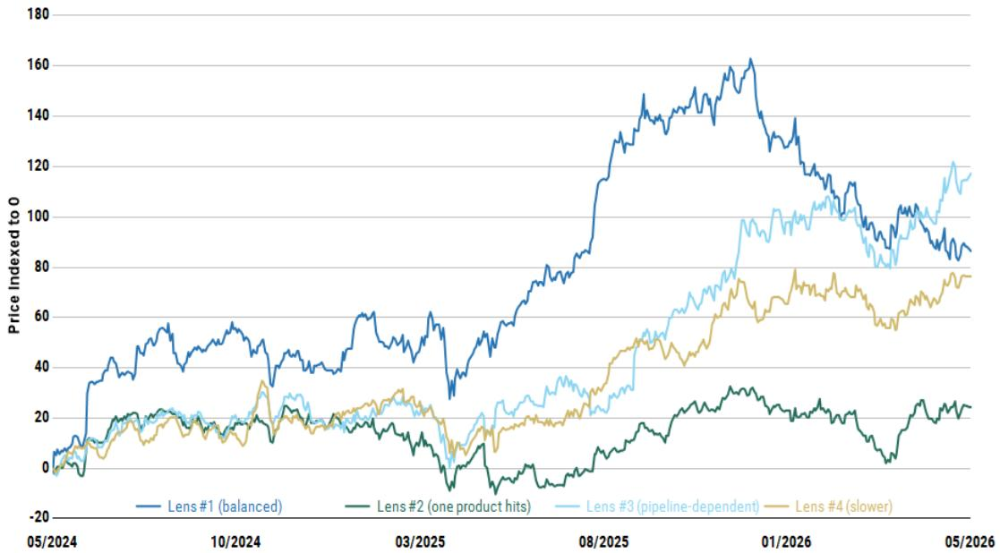

line chart

| Date       | Lens #1 (balanced) | Lens #2 (one product hits) | Lens #3 (pipeline-dependent) | Lens #4 (slower) |
| ---------- | ----------------- | -------------------------- | --------------------------- | ---------------- |
| 05/2024    | ~10               | ~5                         | ~5                          | ~5               |
| 10/2024    | ~50               | ~20                        | ~20                         | ~15              |
| 03/2025    | ~60               | ~10                        | ~30                         | ~20              |
| 08/2025    | ~140              | ~30                        | ~70                         | ~50              |
| 01/2026    | ~160              | ~35                        | ~100                        | ~70              |
| 05/2026    | ~90               | ~25                        | ~120                        | ~75              |

Source: MS, FactSet

## Lens 1 & 2: Beginning to outperform starting at the beginning of 2025-onwards

## Macroeconomic Factors: Rates and Valuations

The NBI demonstrates an inverse relationship with the 10Y yields and market interest rates. A few factors that we believe have caused this trading dynamic include: 1) discount rate impact, 2) access to cheaper cost of capital, and 3) risk-taking appetite

10YUSTreasuryYieldvs.NBI/S&P500  
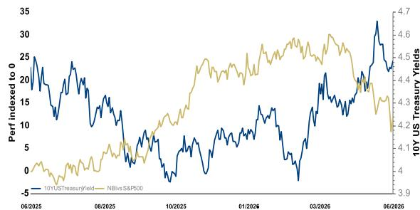

line chart

| Date     | 10Y US Treasury Yield | 10Y US S&P500 |
|----------|------------------------|----------------|
| 06/2025  | ~25                    | ~4.1           |
| 08/2025  | ~15                    | ~4.3           |
| 10/2025  | ~5                     | ~4.5           |
| 01/2026  | ~15                    | ~4.6           |
| 03/2026  | ~25                    | ~4.4           |
| 06/2026  | ~35                    | ~4.2           |

Source: MS, FactSet

NBICommercials.NBIPrecommercias.US10YR  
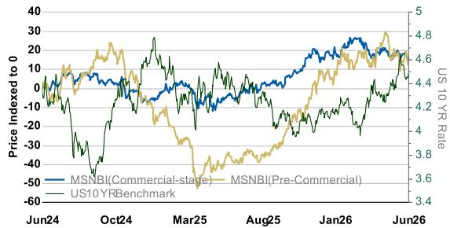

line chart

| Date   | Price Indexed to 0 | US 10 YR Rate |
|--------|--------------------|---------------|
| Jun24  | ~0                 | ~4.6          |
| Oct24  | ~10                | ~4.4          |
| Mar25  | ~-20               | ~3.6          |
| Aug25  | ~10                | ~4.2          |
| Jan26  | ~20                | ~4.6          |
| Jun26  | ~15                | ~4.8          |

Source: MS, FactSet

10YUSTreasuryYieldvs.NBlvsS&P500  
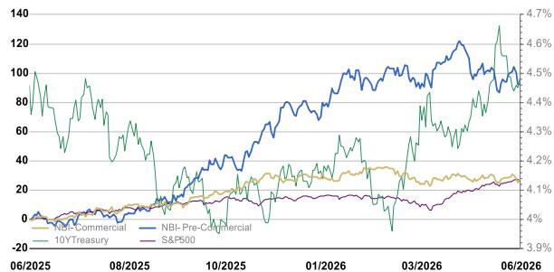

line chart

| Date     | NBI-Commercial | NBI-Pre-Commercial | 10YTreasury | S&P500 |
|----------|----------------|--------------------|--------------|--------|
| 06/2025  | ~0             | ~0                 | ~0           | ~0     |
| 08/2025  | ~5             | ~5                 | ~5           | ~5     |
| 10/2025  | ~15            | ~20                | ~15          | ~10    |
| 01/2026  | ~25            | ~40                | ~30          | ~15    |
| 03/2026  | ~30            | ~60                | ~40          | ~20    |
| 06/2026  | ~35            | ~120               | ~130         | ~4.1   |

Source: MS, FactSet

## ① Discount Rate Impact

Inverse relationship between rates and index performance/stock valuation is apparent. Forward looking projections on interest rates / treasury yields is on a downward trajectory which implies higher future intrinsic valuations in the sector and better index performance.

## ② Access To Cheaper Cost of Capital

The April FOMC Meeting resulted in another hold on interest rate cuts, maintaining the Fed policy rate at 3.5-3.75%. Our MS Economy team now looks for two rate cuts in January and March of 2027, bringing the terminal target range for the federal funds rate to 3.0-3.25%.

See our MS Economy Team's additional thoughts here.

## 3 Risk Taking Appetite

Lower rates often shift investor preference to riskier, speculative assets as safer investment classes will not yield sufficient returns. Investors may reallocate their resources to the clinical stage / pre-commercial companies in a lower interest rate environment. Historically, in a high-rate environment, investor preferences steer towards safer, income generating assets (e.g., commercial stage biotechs with 1+ drugs generating revenue)

## Negative EV Screen: Which Biotech Stocks Stand Out?

We screen our covered universe for biotech companies with low-to-negative enterprise value, i.e., companies trading below cash.

<table><tr><td>Analyst</td><td>Company</td><td>Ticker</td><td>Market Cap. ($mn)</td><td>YE cash ($mn)</td><td>YE debt ($mn)</td><td>EBITDA ($mn)</td><td>Enterprise Value ($mn)</td><td>YE cash burn ($mn)</td><td>Cash runway yrs (MSe)</td><td>Drug</td><td>Indication</td><td>Development Stage</td><td>Class</td></tr><tr><td>Frommer</td><td>Lakefront Biotherapeutics</td><td>LKFT</td><td>1,885</td><td>3,436</td><td>0</td><td>589</td><td>(1,551)</td><td>(222)</td><td>15.45</td><td>GLPG5101</td><td>Mantle cell lymphoma</td><td>Phase1/2</td><td>-</td></tr><tr><td>Skor</td><td>Bicycle Therapeutics Plc</td><td>BCYC</td><td>207</td><td>560</td><td>0</td><td>(277)</td><td>(353)</td><td>(250)</td><td>2.24</td><td>Zelenectide Pevedotin</td><td>Metastatic urothelial cancer (mUC)</td><td>Phase2/3</td><td>Best-in-Class</td></tr><tr><td>Frommer</td><td>enGene Holdings Inc.</td><td>ENGN</td><td>110</td><td>276</td><td>24</td><td>(123)</td><td>(142)</td><td>(99)</td><td>2.78</td><td>Detalimogene voraplasmid</td><td>BCG-unresponsive NMIBC</td><td>Phase1/2</td><td>-</td></tr><tr><td>Flynn</td><td>Arvinas Inc</td><td>ARVN</td><td>457</td><td>615</td><td>1</td><td>(110)</td><td>(157)</td><td>(274)</td><td>2.25</td><td>Vepdegestrant</td><td>ER+/HER2-Breast Cancer</td><td>Phase3</td><td>-</td></tr><tr><td>Skor</td><td>Tscan Therapeutics Inc</td><td>TCRX</td><td>56</td><td>128</td><td>32</td><td>(133)</td><td>(39)</td><td>(136)</td><td>0.94</td><td>TSC-101</td><td>AML/MDS/ALL</td><td>Phase2/3</td><td>-</td></tr><tr><td>Ulz</td><td>Aardvark Therapeutics Inc.</td><td>AARD</td><td>79</td><td>91</td><td>--</td><td>(63)</td><td>(12)</td><td>(54)</td><td>1.68</td><td>ARD-101</td><td>Prader-Willi Syndrome</td><td>Ph3</td><td>Best-in-Class</td></tr><tr><td>Laaman</td><td>Alector Inc</td><td>ALEC</td><td>174</td><td>207</td><td>10</td><td>(136)</td><td>(23)</td><td>(184)</td><td>1.12</td><td>AL101</td><td>Early AD</td><td>Phase 2</td><td>First-in-Class</td></tr><tr><td>Laaman</td><td>Eikon Therapeutics</td><td>EIKN</td><td>461</td><td>513</td><td>--</td><td>(315)</td><td>(51)</td><td>(189)</td><td>2.72</td><td>EIK1001</td><td>NSCLC/Melanoma</td><td>Ph2/3</td><td>Best-in-Class</td></tr></table>

## 8 companies with negative enterprise values with:

- Total \~\$3.4B in aggregate market value and \~\$5.8B in aggregate cash (last 12 mo)  
■ Represents a 39.0% discount vs 20% - 40% on aggregate cash suggesting these biotechs are now trading near all time low valuations relative to their underlying assets

Of these negative EV companies, these are the ones we see the most upside (names that's are best in class & first in class and have MS overweight ratings): EIKN (Best-in-Class)

## Negative EV Time Series

We screen our covered universe for biotech companies with low-to-negative enterprise value, i.e., companies trading below cash.

MS Biotechnology - Companies with negative enterprise value  
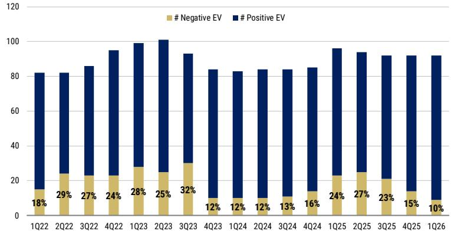

stacked bar chart

| Quarter | # Negative EV (%) | # Positive EV (%) |
| :--- | :--- | :--- |
| 1Q22 | 18 | 73 |
| 2Q22 | 29 | 70 |
| 3Q22 | 27 | 74 |
| 4Q22 | 24 | 85 |
| 1Q23 | 28 | 86 |
| 2Q23 | 25 | 93 |
| 3Q23 | 32 | 77 |
| 4Q23 | 12 | 84 |
| 1Q24 | 12 | 83 |
| 2Q24 | 12 | 84 |
| 3Q24 | 13 | 84 |
| 4Q24 | 16 | 85 |
| 1Q25 | 24 | 96 |
| 2Q25 | 27 | 88 |
| 3Q25 | 23 | 91 |
| 4Q25 | 15 | 91 |
| 1Q26 | 10 | 91 |

NASDAQ BIOTECHNOLOGY (NBI)- Companies with negative enterprise value  
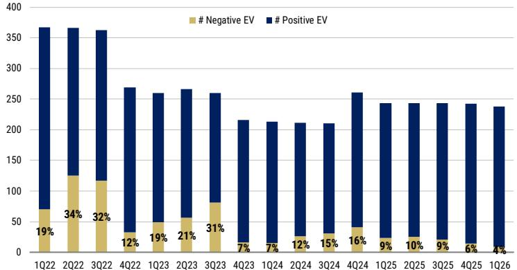

stacked bar chart

| Quarter | # Negative EV (%) | # Positive EV (%) |
| :--- | :--- | :--- |
| 1Q22 | 19 | 370 |
| 2Q22 | 34 | 365 |
| 3Q22 | 32 | 360 |
| 4Q22 | 12 | 270 |
| 1Q23 | 19 | 260 |
| 2Q23 | 21 | 268 |
| 3Q23 | 31 | 260 |
| 4Q23 | 7 | 215 |
| 1Q24 | 7 | 213 |
| 2Q24 | 12 | 211 |
| 3Q24 | 15 | 210 |
| 4Q24 | 16 | 260 |
| 1Q25 | 9 | 243 |
| 2Q25 | 10 | 243 |
| 3Q25 | 9 | 243 |
| 4Q25 | 6 | 243 |
| 1Q26 | 4 | 238 |

## MS SMID Cap Biotech Coverage

- Record number of companies with negative EV in 2Q23 coincided with Fed Funds approaching a peak (see slide 20)  
- Another peak in companies with negative EV in 1Q25 as uncertainty in rate & regulatory environment prevailed  
■ 2Q25:4Q25 trend indicated continued sector performance. Number of SMID Biotech companies trading below cash continues to trend down.

## NASDAQ Biotechnology Index (NBI)

■ Similar historic cyclical type trends as observed with MS SMID Cap Biotech coverage  
■ Also a spike in depressed valuations due to FDA regulatory uncertainty in 1Q25  
■ 2Q25:4Q25 trend indicated continued sector performance. Number of SMID Biotech companies trading below cash continues to trend down, although proportion of positive EV vs. negative EV names noticeably lower vs. MS coverage.

## NBI Price Performance and Valuation

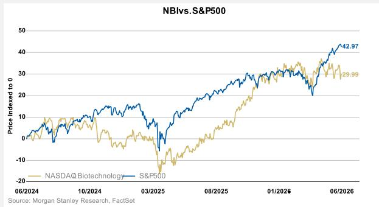

line chart

| Date     | NASDAQ Biotechnology | S&P500 |
| -------- | --------------------- | ------ |
| 06/2026  | 29.99                 | 42.97  |

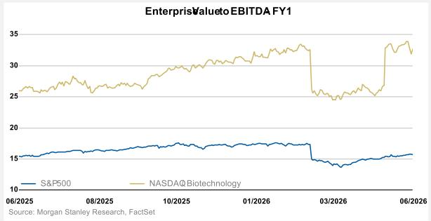

line chart

| Date     | S&P500 | NASDAQ Biotechnology |
| -------- | ------ | --------------------- |
| 06/2025  | 15.0   | 25.0                  |
| 08/2025  | 15.5   | 26.0                  |
| 10/2025  | 16.0   | 27.0                  |
| 01/2026  | 16.5   | 28.0                  |
| 03/2026  | 14.0   | 24.0                  |
| 06/2026  | 15.0   | 33.0                  |

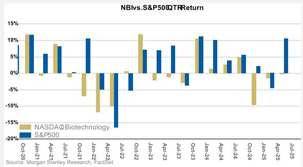

bar chart

NBIvs.S&P500QTRReturn
| Date | NASDAQBiotechnology (%) | S&P500 (%) |
|---|---|---|
| Oct-20 | 11.5 | 8.0 |
| Jan-21 | -1.5 | 6.0 |
| Apr-21 | 9.0 | 8.0 |
| Jul-21 | -1.0 | 0.0 |
| Oct-21 | -7.0 | 10.0 |
| Jan-22 | -13.0 | -5.0 |
| Apr-22 | -11.0 | -18.0 |
| Jul-22 | 0.5 | -4.0 |
| Oct-22 | 11.5 | 7.0 |
| Jan-23 | -2.0 | 7.0 |
| Apr-23 | -1.0 | 8.0 |
| Jul-23 | -3.0 | -4.0 |
| Oct-23 | 10.5 | 11.0 |
| Jan-24 | 1.5 | 10.0 |
| Apr-24 | 3.0 | 4.0 |
| Jul-24 | 5.0 | 5.5 |
| Oct-24 | -11.0 | 2.5 |
| Jan-25 | -1.5 | -4.5 |
| Apr-25 | -0.5 | 10.5 |
Source: MS, FactSet

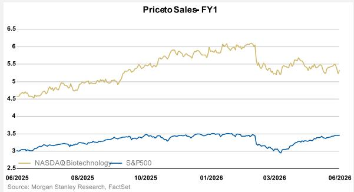

line chart

| Date     | NASDAQ Biotechnology | S&P500 |
| -------- | --------------------- | ------ |
| 06/25/2025 | 4.5                   | 3.0    |
| 08/25/2025 | 4.8                   | 3.1    |
| 10/25/2025 | 5.2                   | 3.3    |
| 01/26/2026 | 5.8                   | 3.4    |
| 03/26/2026 | 5.5                   | 3.0    |
| 06/26/2026 | 5.3                   | 3.4    |

Biotech Index recovery – With rates now stable-to-easing following the Fed’s 2H25 pivot, discount pressure on long-duration biotech cash flows has meaningfully declined, supporting improved valuations and risk appetite. At the same time, a reacceleration in M&A—driven by large pharma’s need to offset patent expirations—has provided an incremental tailwind. The current environment is more selective, with capital and performance increasingly concentrated in later-stage, de-risked assets, supporting a more durable, fundamentals-driven recovery.

Past Events (Catalyst Calendar) – Price Performance

<table><tr><td>Date</td><td>Ticker</td><td>Event</td><td>Day 1 Perf.</td><td>Follow Through Perf.</td><td>NBI Performance</td><td>Follow Through Perf. Vs NBI</td></tr><tr><td>2-Mar-26</td><td>EXEL</td><td>Competitor data readout in RCC (belzutifan + lenvatinib vs. cabozantinib results from Phase 3 LITESPARK-011)</td><td>-7%</td><td>-0.7%</td><td>-3%</td><td>3%</td></tr><tr><td>2-Mar-26</td><td>ASND</td><td>Approval of Yuviwel (TransCon CNP) in achondroplasia)</td><td>4%</td><td>-1.2%</td><td>-3%</td><td>2%</td></tr><tr><td>2-Mar-26</td><td>AARD</td><td>Voluntarily paused Ph3 HERO study of ARD-101 in PWS following cardiac observations in HVs</td><td>-56%</td><td>-10.4%</td><td>-3%</td><td>9%</td></tr><tr><td>9-Mar-26</td><td>DYN</td><td>Shared long term DMD data and Ph3 trial design for DM1</td><td>19%</td><td>11.8%</td><td>3%</td><td>3%</td></tr><tr><td>11-Mar-26</td><td>RGNX</td><td>RGX-202: Additional Ph1/2 data in DMD shared at MDA</td><td>-5%</td><td>-3.2%</td><td>-3%</td><td>-8%</td></tr><tr><td>11-Mar-26</td><td>BBIO</td><td>BBP-418 Interim Analysis Results from Ph3 FORTIFY study in LGMD2I/R9 presented at MDA</td><td>-4%</td><td>-4.8%</td><td>-3%</td><td>1%</td></tr><tr><td>12-Mar-26</td><td>HALO</td><td>Interim CFO announced: David Ramsay</td><td>-4%</td><td>0.2%</td><td>-3%</td><td>3%</td></tr><tr><td>17-Mar-26</td><td>RYTM</td><td>Data from the Ph3 EMANATE study (4 genetically-defined, rare MC4R pathway diseases)</td><td>-3%</td><td>-2.1%</td><td>-2%</td><td>-2%</td></tr><tr><td>17-Mar-26</td><td>BCYC</td><td>Ph2/3 Duravelo-2 (registrational) dose selectoin testing zelenectide (Nectin-4) + pembro for 1L/2L+ mUC</td><td>0%</td><td>-7.3%</td><td>-2%</td><td>-6%</td></tr><tr><td>20-Mar-26</td><td>RYTM</td><td>PDUFA date for setmelanotide in Hypothalmic Obesity</td><td>-3%</td><td>-3.2%</td><td>-2%</td><td>-10%</td></tr><tr><td>24-Mar-26</td><td>ABVX</td><td>Ph3 ABTECT DSMB update and announcement of hire for Chief Commercial Officer</td><td>-5%</td><td>0.5%</td><td>2%</td><td>2%</td></tr><tr><td>24-Mar-26</td><td>GLPG</td><td>Announcement of collaboration with GILD on Ouro Medicines acquisition and T cell engager development</td><td>-7%</td><td>2.8%</td><td>2%</td><td>-2%</td></tr><tr><td>30-Mar-26</td><td>BBIO</td><td>NDA submission announced for BBP-418 in LGMD2L/R9</td><td>0%</td><td>7.1%</td><td>5%</td><td>2%</td></tr><tr><td>30-Mar-26</td><td>BBIO</td><td>Long-term 54 week data presented for Attruby in ATTR-CM</td><td>0%</td><td>7.1%</td><td>5%</td><td>2%</td></tr><tr><td>31-Mar-26</td><td>APLS</td><td>Announcement of acquisition by BIIB</td><td>135%</td><td>0.4%</td><td>5%</td><td>-4%</td></tr><tr><td>1-Apr-26</td><td>AXSM</td><td>Axsome acquires selective PDE10A inhibitor balipodect from Takeda</td><td>2%</td><td>-1.9%</td><td>0%</td><td>3%</td></tr><tr><td>7-Apr-26</td><td>INSM</td><td>Topline Ph2b CEDAR data evaluating the efficacy of brensocatib in HS</td><td>0%</td><td>-1.7%</td><td>2%</td><td>-12%</td></tr><tr><td>7-Apr-26</td><td>HALO</td><td>Global exclusive collaboration with Vertex for Hypercon tech announced</td><td>1%</td><td>2.9%</td><td>2%</td><td>5%</td></tr><tr><td>9-Apr-26</td><td>ZNTL</td><td>Announced dose selection for pivotal Ph2 DENALI study</td><td>60%</td><td>49.5%</td><td>-1%</td><td>6%</td></tr><tr><td>20-Apr-26</td><td>ARGX</td><td>AAN data sets</td><td>-2%</td><td>-3.5%</td><td>-1%</td><td>-6%</td></tr><tr><td>20-Apr-26</td><td>KYTX</td><td>Updated Ph2 gMG data at AAN</td><td>13%</td><td>-13.7%</td><td>-1%</td><td>-21%</td></tr><tr><td>21-Apr-26</td><td>BIOA</td><td>Complete Ph1 MAD data for BGE-102</td><td>4%</td><td>-6.4%</td><td>-1%</td><td>-13%</td></tr><tr><td>22-Apr-26</td><td>KYTX</td><td>Complete pivotal Ph2 data in SPS at AAN</td><td>5%</td><td>-12.5%</td><td>-1%</td><td>-13%</td></tr><tr><td>27-Apr-26</td><td>MIRM</td><td>Interim Ph2b data from brelovitug in HDV</td><td>1%</td><td>1.6%</td><td>-1%</td><td>16%</td></tr><tr><td>29-Apr-26</td><td>ERAS</td><td>ERAS-0015 preliminary Phase 1 data in RASm solid tumors</td><td>-8%</td><td>16.9%</td><td>1%</td><td>14%</td></tr><tr><td>29-Apr-26</td><td>ALEC</td><td>Nivisnebart (AL101) in early AD discontinued following interim futility analysis</td><td>-4%</td><td>3.0%</td><td>1%</td><td>5%</td></tr><tr><td>29-Apr-26</td><td>PTCT</td><td>Votoplam: PIVOT-HD Long-Term Extension Study Topline Results</td><td>-8%</td><td>0.8%</td><td>1%</td><td>-1%</td></tr><tr><td>30-Apr-26</td><td>AXSM</td><td>Approval of Auvelity for Alzheimer&#x27;s disease agitation</td><td>13%</td><td>-0.6%</td><td>1%</td><td>4%</td></tr><tr><td>30-Apr-26</td><td>CTNM</td><td>PIPE-791 Phase 1b data in chronic pain</td><td>6%</td><td>3.0%</td><td>1%</td><td>13%</td></tr><tr><td>4-May-26</td><td>CABA</td><td>Updated data from rese-cel in PV without preconditioning</td><td>30%</td><td>8.4%</td><td>2%</td><td>-7%</td></tr><tr><td>4-May-26</td><td>MIRM</td><td>Topline Ph2b data from volixibat in PSC</td><td>10%</td><td>0.0%</td><td>2%</td><td>-1%</td></tr><tr><td>5-May-26</td><td>CYTK</td><td>Topline results from ACACIA-HCM</td><td>17%</td><td>-2.9%</td><td>2%</td><td>-2%</td></tr><tr><td>11-May-26</td><td>ARGX</td><td>Vyvgart label expansion approved for all gMG (anti-MuSK-Ab positive, anti-LRP4-Ab positive, and triple seronegative)</td><td>4%</td><td>-0.1%</td><td>1%</td><td>-3%</td></tr><tr><td>13-May-26</td><td>ONC</td><td>Accelerated approval of Beqalzi for R/R MCL</td><td>0%</td><td>-3.8%</td><td>0%</td><td>-2%</td></tr><tr><td>14-May-26</td><td>RGNX</td><td>RGX-202: Topline pivotal data in DMD</td><td>-38%</td><td>-8.4%</td><td>-3%</td><td>5%</td></tr><tr><td>14-May-26</td><td>IONS</td><td>Topline results from Ph2 CELIA study of BIIB-080 (partnered program)</td><td>-2%</td><td>-1.9%</td><td>-3%</td><td>3%</td></tr><tr><td>19-May-26</td><td>CGEM</td><td>Initial CLN-978 data in SLE and RA in EULAR 2026 abstract</td><td>-5%</td><td>1.1%</td><td>3%</td><td>6%</td></tr><tr><td>21-May-26</td><td>BMRN</td><td>Voxzogo positive Phase 3 pivotal study results in children with hypochondroplasia</td><td>8%</td><td>0.0%</td><td>1%</td><td>1%</td></tr><tr><td>22-May-26</td><td>DNLI</td><td>BIIB122 Phase 2b LUMA failure and discontinuation in idiopathic PD</td><td>-3%</td><td>4.0%</td><td>0%</td><td>4%</td></tr><tr><td>1-Jun-26</td><td>ABVX</td><td>Obefazimod: Ph3 ABTECT topline maintenance data</td><td>-2%</td><td>-44.1%</td><td>-5%</td><td>-16%</td></tr></table>

## Key Takeaways:

■ Stock performance post catalyst events across US SMID Cap biotech has been highly variable  
■ Pipeline data updates have driven large stock moves for some stocks immediately following the catalyst, while others appear to be priced in ahead of the event.  
■ Regulatory events appear to have sig. acute impact on stocks recently

## First In Class 2026 Catalysts

- In recent weeks, we have been seeing increased interest in potential first in class programs.  
• Below we have compiled 2026 catalysts (alphabetized by ticker) for potential first in class therapies in our SMid-Cap Biotech coverage.  
- These catalysts include programs with novel mechanisms of action or which represent new mechanisms for disease areas of high unmet need.

<table><tr><td>Company Ticker</td><td>Analyst Name</td><td>Asset in Development</td><td>Mechanism of Action/Target</td><td>Disease</td><td>Stage of Development</td><td>Timing for Key Update</td></tr><tr><td>ABVX</td><td>Judah Frommer</td><td>obefazimod</td><td>miR-124 enhancer</td><td>IBD</td><td>Ph3</td><td>Ph3 UC maintenance data in late 2Q26; Ph2b induction data in Crohn's expected in 4Q26</td></tr><tr><td>AGMB</td><td>Judah Frommer</td><td>Ontunisertib</td><td>ALK5 inhibitor</td><td>FSCD</td><td>Ph2a</td><td>Full Ph2a STENOVA OLE data in 2H26</td></tr><tr><td>AGMB</td><td>Judah Frommer</td><td>AGMB-447</td><td>ALK5 inhibitor</td><td>IPF</td><td>Ph1b</td><td>Initial IPF data in 2H26</td></tr><tr><td>ALNY</td><td>Mike Ulz</td><td>ALN-6400</td><td>siRNA targeting liver derived plasminogen</td><td>Bleeding disorders including HHT</td><td>Ph2</td><td>2H26</td></tr><tr><td>ALNY</td><td>Mike Ulz</td><td>ALN-HTT02</td><td>siRNA targeting HTT</td><td>Huntington's disease</td><td>Ph1</td><td>2H26</td></tr><tr><td>ARGX</td><td>Sean Laaman</td><td>empasiprubart</td><td>C2 targeting humanized sweeping antibody</td><td>Multifocal motor neuropathy</td><td>Ph3</td><td>4Q26</td></tr><tr><td>ARVN</td><td>Terence Flynn</td><td>ARV-806</td><td>KRAS G12D degrader</td><td>Solid tumors harboring KRAS G12D</td><td>Ph1</td><td>2026</td></tr><tr><td>ARVN</td><td>Terence Flynn</td><td>ARV-393</td><td>Small molecule degrader targeting BCL6</td><td>B-cell lymphomas</td><td>Ph1</td><td>2026</td></tr><tr><td>ARWR</td><td>Mike Ulz</td><td>ARO-ALK7</td><td>ALK7 targeting siRNA</td><td>Obesity related disorders</td><td>Ph1/2a</td><td>2H26</td></tr><tr><td>ARWR</td><td>Mike Ulz</td><td>ARO-Dimer-PA</td><td>siRNA targeting both PCSK9 and APOC3</td><td>Mixed hyperlipidemia</td><td>Ph1</td><td>3Q26</td></tr><tr><td>ARWR</td><td>Mike Ulz</td><td>ARO-MAPT</td><td>siRNA targeting tau with systemic administration</td><td>Alzheimer's disease</td><td>Ph1/2</td><td>HV data in late 3Q26/early 4Q26</td></tr><tr><td>BBOT</td><td>Sean Laaman</td><td>BBO-10203</td><td>RAS:P13Ka breaker</td><td>HER2+ BC, HR+/HER2-PIK3CAm BC and KRASm CRC</td><td>Ph1/1b</td><td>2H26</td></tr><tr><td>BCAX</td><td>Judah Frommer</td><td>ficerafusp alfa</td><td>EGFR and TGF-β bifunctional antibody</td><td>HPV-negative 1L R/M HNSCC in combo with pembro</td><td>Ph3</td><td>Long-term Ph1b update in 2Q26</td></tr><tr><td>BLTE</td><td>Judah Frommer</td><td>tinlarebant</td><td>RBP4 inhibitor</td><td>STGD1</td><td>NDA</td><td>Rolling NDA submission to FDA expected to be complete in</td></tr><tr><td>BNTX</td><td>Terence Flynn</td><td>BNT113</td><td>Off the shelf mRNA vaccine encoding HPV16 E6/E7 tumor antigens</td><td>CRC</td><td>Ph2</td><td>End of 2026</td></tr><tr><td>CGEM</td><td>Sean Laaman</td><td>CLN-049</td><td>FLT3 bispecific</td><td>AML/MDS</td><td>Ph1</td><td>2H26</td></tr><tr><td>CGON</td><td>Sean Laaman</td><td>cretostimogene</td><td>Type-5 oncolytic adenovirus</td><td>IR NMIBC</td><td>Ph3</td><td>Mid-2026</td></tr><tr><td>CLDX</td><td>Judah Frommer</td><td>barzolvolimab (anti-KIT mAb)</td><td>Anti-KIT mAb</td><td>Mast cell-mediated inflammatory conditions</td><td>Ph3 for CSU and ClndU Ph2 for PN and AD</td><td>Ph2 PN data in summer 2026 Ph2 AD data in late 2026 Ph3 CSU data in 4Q26</td></tr><tr><td>CMPS</td><td>Judah Frommer</td><td>COMP360</td><td>Novel synthetic formulation of psilocybin</td><td>26-week data in TRD</td><td>Ph3</td><td>2H26</td></tr><tr><td>CRNX</td><td>Max Skor</td><td>atumelnant</td><td>Oral MC2R antagonist</td><td>CAH</td><td>Ph3</td><td>2026</td></tr><tr><td>CRSP</td><td>Terence Flynn</td><td>CTX611</td><td>siRNA targeting Factor XI</td><td>Blood clots</td><td>Ph2</td><td>2H26</td></tr><tr><td>CRSP</td><td>Terence Flynn</td><td>CTX310</td><td>CRISPR/Cas9 therapy targeting ANGPLT3</td><td>sHTG and refractory hypercholesterolemia</td><td>Ph1b</td><td>2H26</td></tr><tr><td>Denali</td><td>Sean Laaman</td><td>DNL126</td><td>ETV:SGSH</td><td>MPS IIIA (Sanfilippo A)</td><td>Ph1/2</td><td>2026</td></tr><tr><td>ERAS</td><td>Sean Laaman</td><td>ERAS-4001</td><td>Pan-KRAS inhibitor</td><td>KRASm solid tumors</td><td>Ph1</td><td>2H26</td></tr><tr><td>EVMN</td><td>Judah Frommer</td><td>EVO756</td><td>MRGPRX2 antagonist</td><td>CSU and AD</td><td>Ph2b</td><td>Ph2b results in CSU in June 2026; Ph2b results in AD in 3Q26</td></tr><tr><td>EVMN</td><td>Judah Frommer</td><td>EVO301</td><td>IL-18 BP</td><td>AD</td><td>Ph2a</td><td>Additional Ph2a data in 2H26</td></tr><tr><td>GMAB</td><td>Judah Frommer</td><td>petosemtamab</td><td>LGR5xEGFR BsAb</td><td>r/m HNSCC</td><td></td><td>2H26</td></tr><tr><td>INCY</td><td>Judah Frommer</td><td>'058</td><td>JAK2 V617 inhibitor</td><td>MF</td><td>Initial data</td><td>2H26</td></tr><tr><td>INCY</td><td>Judah Frommer</td><td>989</td><td>Antibody targeting mutant CALR</td><td>2L ET/MF</td><td>Ph1</td><td>2H26</td></tr><tr><td>IONS</td><td>Mike Ulz</td><td>Tryngolza</td><td>Apoc-3 targeting ASO</td><td>SHTG</td><td>FDA approval</td><td>June 30 PDUFA</td></tr><tr><td>IONS</td><td>Mike Ulz</td><td>IONIS-MAPTRx/BIIB080</td><td>Tau targeting ASO</td><td>Alzheimer's disease</td><td>Ph2</td><td>Detailed data July 12-15</td></tr><tr><td>IONS</td><td>Mike Ulz</td><td>Pelacarsen</td><td>Lp(a) lowering ASO</td><td>Prevention of ASCVD associated with Lp(a)</td><td>Ph3</td><td>3Q26</td></tr><tr><td>IONS</td><td>Mike Ulz</td><td>zilganersen</td><td>ASO targeting GFAP</td><td>Alexander disease</td><td>FDA approval</td><td>September 22 PDUFA</td></tr><tr><td>IRON</td><td>Sean Laaman</td><td>bitopertin</td><td>Selective GlyT1 inhibitor</td><td>EPP/XLP</td><td>Ph3</td><td>4Q26</td></tr><tr><td>NTLA</td><td>Terence Flynn</td><td>lonvo-c</td><td>In-vivo CRISPR-based therapy targeting KLKB1</td><td>HAE</td><td>Ph3</td><td>1H27</td></tr><tr><td>Neurocrine</td><td>Sean Laaman</td><td>Osavampator</td><td>AMPA PAM</td><td>MDD</td><td>Ph3</td><td>2027</td></tr><tr><td>ONC</td><td>Sean Laaman</td><td>BGB-16673</td><td>BTK degrader</td><td>R/R CLL</td><td>Ph2</td><td>2H26</td></tr><tr><td>RARE</td><td>Max Skor</td><td>GTX-102</td><td>ASO</td><td>Angelman syndrome</td><td>Ph3</td><td>2H26</td></tr><tr><td>RARE</td><td>Max Skor</td><td>UX701</td><td>Gene therapy</td><td>Wilson disease</td><td>Cohort 4</td><td>2026</td></tr><tr><td>RXRX</td><td>Sean Laaman</td><td>REC-1245</td><td>RBM30 degrader</td><td>Biomarker-enriched solid</td><td>Ph1</td><td>2H26</td></tr><tr><td>RXRX</td><td>Sean Laaman</td><td>REC-617</td><td>CDK7 inhibitor</td><td>advanced solid tumors</td><td>Ph1/2</td><td>1H27</td></tr><tr><td>SANA</td><td>Max Skor</td><td>SC451</td><td>HIP-modified, iPSC-derived pancreatic islet cell therapy</td><td>T1D</td><td>Ph1</td><td>2026</td></tr><tr><td>SLN</td><td>Mike Ulz</td><td>divesiran</td><td>siRNA targeting TMPRSS6</td><td>polycythemia vera</td><td>Ph2</td><td>3Q26</td></tr><tr><td>TNYA</td><td>Mike Ulz</td><td>TN-201</td><td>AAV9 gene therapy targeting MYBPC3</td><td>MYBPC3-associated HCM</td><td>Ph1/2a</td><td>2026</td></tr><tr><td>ZBIO</td><td>Judah Frommer</td><td>obexelimab</td><td>CD19 and FcγRIIb bifunctional mAb</td><td>autoimmune conditions</td><td>BLA</td><td>BLA submission for IgG4-RD in 2Q26; topline Ph2 data in SLE</td></tr><tr><td>ZNTL</td><td>Mike Ulz</td><td>Azenosertib</td><td>WEE1 inhibitor</td><td>Cyclin E1-positive platinum-resistant ovarian cancer</td><td>Ph2</td><td>registrational topline results by YE26</td></tr></table>

Source: MS

## Our Analysis & Views Regarding FDA Changes

FDA Approval Timeline Tracker: SMID Cap Coverage (2025-2026)

<table><tr><td>Company</td><td>Ticker</td><td>Drug</td><td>Indication</td><td>PDUFA date (if known)</td><td>Application(NDA or BLA)</td><td>Status (FTD or BTD)(Fast Track or Breakthrough)</td><td>Review Classification(Standard, Priority Orphan)</td><td>Accelerated Approval?</td><td>First In Class / Best In Class?</td><td>Status</td></tr><tr><td>Argenx</td><td>ARGX</td><td>Vywgart PFS</td><td>CIDP &amp; MG</td><td>4/10/2025</td><td>--</td><td>--</td><td>--</td><td>--</td><td>First in class</td><td>Ontime</td></tr><tr><td>Argenx</td><td>ARGX</td><td>Vyvgart</td><td>Seronegative MG</td><td>5/10/2026</td><td>sBLA</td><td>--</td><td>--</td><td>--</td><td>--</td><td>Pending</td></tr><tr><td>Arcutis</td><td>ARQT</td><td>Zoryve foam</td><td>Scalp &amp; body psoriasis</td><td>5/22/2025</td><td>sNDA</td><td>--</td><td>Standard</td><td>--</td><td>--</td><td>Ontime</td></tr><tr><td>Ascendis</td><td>ASND</td><td>TransCon hGH</td><td>Adult GHD</td><td>7/27/2025</td><td>sBLA</td><td>--</td><td>Orphan</td><td>--</td><td>--</td><td>Ontime</td></tr><tr><td>Apellis</td><td>APLS</td><td>Empaveli</td><td>C3G and IC-MPGN</td><td>7/28/2025</td><td>sNDA</td><td>--</td><td>Priority</td><td>--</td><td>Best in class</td><td>Ontime</td></tr><tr><td>PTC Therapeutics</td><td>PTCT</td><td>sepiapterin</td><td>pediatric and adult phenylketonuria</td><td>7/29/2025</td><td>NDA</td><td>--</td><td>Standard</td><td>--</td><td>--</td><td>Ontime</td></tr><tr><td>Insmed</td><td>INSM</td><td>brensocatib</td><td>bronchiectasis</td><td>8/12/2025</td><td>NDA</td><td>BTD</td><td>Priority</td><td>No</td><td>First in class</td><td>Ontime</td></tr><tr><td>Jazz Pharmaceuticals</td><td>JAZZ</td><td>dordaviprone</td><td>recurrent H3 K27M-mutant diffuse glioma</td><td>8/18/2025</td><td>NDA</td><td>FTD</td><td>Priority</td><td>Yes</td><td>First in class</td><td>Ontime/Approved</td></tr><tr><td>PTC Therapeutics</td><td>PTCT</td><td>vatiquinone</td><td>Friedreich&#x27;s ataxia</td><td>8/19/2025</td><td>NDA</td><td>--</td><td>Priority</td><td>--</td><td>First in class</td><td>Ontime</td></tr><tr><td>Ionis</td><td>IONS</td><td>Donidalorsen</td><td>HAE</td><td>8/21/2025</td><td>NDA</td><td>--</td><td>Orphan</td><td>--</td><td>--</td><td>Ontime</td></tr><tr><td>Incyte</td><td>INCY</td><td>Ruxolitinib Cream</td><td>Pediatric AD</td><td>9/19/2025</td><td>sNDA</td><td>--</td><td>--</td><td>--</td><td>--</td><td>Ontime</td></tr><tr><td>Ionis</td><td>IONS</td><td>High Dose Spinraza</td><td>SMA</td><td>9/22/2025</td><td>sNDA</td><td>FTD</td><td>--</td><td>--</td><td>--</td><td>Pending</td></tr><tr><td>Crinetics</td><td>CRNX</td><td>paltusotine</td><td>acromegaly and neuroendocrine tumors</td><td>9/25/2024</td><td></td><td></td><td></td><td></td><td></td><td>Ontime</td></tr><tr><td>Cytokinetics</td><td>CYTK</td><td>aficamten</td><td>obstructive hypertrophic cardiomyopathy (HCM)</td><td>12/26/2025</td><td></td><td></td><td></td><td></td><td></td><td>Delayed</td></tr><tr><td>Rhythm Pharmaceuticals</td><td>RYTM</td><td>Setmelanotide</td><td>hypothalamic obesity</td><td>3/20/2026</td><td>sNDA</td><td>BTD</td><td>--</td><td>--</td><td>First in class</td><td>Delayed/Approved</td></tr><tr><td>Jazz Pharmaceuticals</td><td>JAZZ</td><td>Zepzelca</td><td>1L ES-SCLC</td><td>10/7/2025</td><td>sNDA</td><td>--</td><td>Priority</td><td>--</td><td>--</td><td>Ontime/Approved</td></tr><tr><td>Arcutis</td><td>ARQT</td><td>Zoryve cream</td><td>Atopic dermatitis (AD) patients ages 2-5</td><td>10/13/2025</td><td>sNDA</td><td>--</td><td>Standard</td><td>--</td><td>--</td><td>Ontime</td></tr><tr><td>REGENXBIO</td><td>RGNX</td><td>RGX-121</td><td>MPS II</td><td>2/8/2026</td><td>BLA</td><td>FTD</td><td>Priority</td><td>Yes</td><td>First in class</td><td>Ontime/CRL</td></tr><tr><td>Arrowhead</td><td>ARWR</td><td>Plozasiran</td><td>FCS</td><td>11/18/2025</td><td>NDA</td><td>FTD/BTD</td><td>Orphan</td><td>--</td><td>Best in class</td><td>Ontime</td></tr><tr><td>Ascendis</td><td>ASND</td><td>TransCon CNP</td><td>Achondroplasia</td><td>2/28/2026</td><td>NDA</td><td>--</td><td>Priority</td><td>--</td><td>--</td><td>Delayed/Approved</td></tr><tr><td>Genmab</td><td>GMAB</td><td>Epkinly</td><td>2L+ FL</td><td>11/30/2025</td><td>sBLA</td><td>--</td><td>Priority</td><td>--</td><td>--</td><td>Ontime</td></tr><tr><td>Arcutis</td><td>ARQT</td><td>Zoryve cream 0.3%</td><td>Plaque psoriasis ages 2-5</td><td>6/29/2026</td><td>sNDA</td><td>--</td><td>--</td><td>--</td><td>--</td><td>Pending</td></tr><tr><td>Denali Therapeutics</td><td>DNLI</td><td>tividenofusp alfa</td><td>MPS II</td><td>PDUFA April 5, 2026</td><td>BLA</td><td>FTD/BTD</td><td>--</td><td>--</td><td>Best in class</td><td>Pending</td></tr><tr><td>Biohaven</td><td>BHVN</td><td>Troriluzole</td><td>Spinocerebellar ataxia</td><td>4Q25</td><td>NDA</td><td>--</td><td>Priority</td><td></td><td></td><td>Ontime/CRL</td></tr><tr><td>BeOne Medicines</td><td>ONC</td><td>sonrotoclax</td><td>R/R MCL</td><td>1Q26</td><td>NDA</td><td>FTD</td><td>Priority</td><td>--</td><td>Best in class</td><td>Ontime</td></tr><tr><td>Cullinan Therapeutics</td><td>CGEM</td><td>zipalertinib</td><td>2L+ EGFR ex20ins NSCLC</td><td>2/27/2027</td><td>NDA</td><td>BTD</td><td>--</td><td>--</td><td>Best in class</td><td>Pending</td></tr><tr><td>CG Oncology</td><td>CGON</td><td>cretostimogene</td><td>HR BCG-unresponsive NMIBC</td><td>Complete rolling submission 4Q26</td><td>BLA</td><td>FTD/BTD</td><td>--</td><td>--</td><td>Best in class</td><td>Pending</td></tr><tr><td>Exelixis</td><td>EXEL</td><td>zanzalintinib</td><td>CRC</td><td>PDUFA December 3, 2026</td><td>NDA</td><td>--</td><td>--</td><td>--</td><td>--</td><td>Pending</td></tr><tr><td>Jazz Pharmaceuticals/BeOne</td><td>JAZZ/ONC</td><td>Zihera + Tevimbra</td><td>GEA</td><td>Accelerated approval November 6, 2025</td><td>sBLA</td><td>FTD</td><td>--</td><td>--</td><td>Best in class</td><td>Ontime</td></tr><tr><td>Rocket Pharmaceuticals</td><td>RCKT</td><td>KRESLADI</td><td>Severe LAD-I</td><td>Complete BLA submission in 2025</td><td>BLA</td><td>FTD</td><td>Orphan</td><td>--</td><td>First in class</td><td>Pending</td></tr><tr><td>Incyte</td><td>INCY</td><td>Retifanlimab</td><td>SCAC</td><td>Approved 5/15/25</td><td>sBLA</td><td>--</td><td>--</td><td>--</td><td>First in class</td><td>Ontime</td></tr><tr><td>Incyte</td><td>INCY</td><td>Tafasitamab</td><td>FL</td><td>Approved 6/18/25</td><td>sBLA</td><td>--</td><td>--</td><td>--</td><td>--</td><td>Ontime</td></tr><tr><td>BioMarin</td><td>BMRN</td><td>Palynziq</td><td>Adolescents with PKU</td><td>Regulatory filings in 2H25</td><td>--</td><td>--</td><td>Orphan</td><td>--</td><td>--</td><td>Pending</td></tr><tr><td>Incyte</td><td>INCY</td><td>Ruxolitinib XR</td><td>MF, PV, and GVHD</td><td>Approval mid-2026</td><td>NDA</td><td>--</td><td>--</td><td>--</td><td>--</td><td>Pending</td></tr><tr><td>Incyte</td><td>INCY</td><td>Povorcitinib</td><td>HS</td><td>NDA submission 1Q26</td><td>NDA</td><td>--</td><td>--</td><td>--</td><td>First in class</td><td>Pending</td></tr><tr><td>Axsome</td><td>AXSM</td><td>AXS-05</td><td>ADA</td><td>46142</td><td>sNDA</td><td>BTD</td><td>--</td><td>--</td><td>First in class</td><td>Ontime</td></tr><tr><td>Axsome</td><td>AXSM</td><td>AXS-12</td><td>Narcolepsy w/ cataplexy</td><td>NDA submission Jan 2026</td><td>NDA</td><td>BTD</td><td>--</td><td>--</td><td>--</td><td>Pending</td></tr><tr><td>Disc Medicine</td><td>IRON</td><td>Bitopertin</td><td>EPP</td><td>Received CRL (2/13/2026), resubmission expected YE26</td><td>NDA</td><td>CNPV</td><td>Orphan</td><td>Yes</td><td>First in class</td><td>Pending</td></tr><tr><td>Ionis</td><td>IONS</td><td>Olezarsen</td><td>severe hypertriglyceridemia</td><td>PDUFA 2026</td><td>sNDA</td><td>--</td><td>--</td><td>--</td><td>First in class</td><td>Pending</td></tr><tr><td>Kyverna Therapeutics</td><td>KYTX</td><td>KYV-101</td><td>SPS</td><td>BLA filing 2026</td><td>BLA</td><td>--</td><td>--</td><td>--</td><td>First in class</td><td>Pending</td></tr><tr><td>Dyne Therapeutics</td><td>DYN</td><td>DYNE-101</td><td>DM1</td><td>BLA filing late-2026</td><td>BLA</td><td>FTD</td><td>Orphan</td><td>--</td><td>First in class</td><td>Pending</td></tr><tr><td>Dyne Therapeutics</td><td>DYN</td><td>DYNE-251</td><td>DMD</td><td>BLA filing early 2026</td><td>BLA</td><td>FTD</td><td>Orphan</td><td>--</td><td>Best in class</td><td>Pending</td></tr><tr><td>Cytokinetics</td><td>CYTK</td><td>aficamten</td><td>obstructive hypertrophic cardiomyopathy (HCM)</td><td>MAPLE-HCM sNDA 11/14/2026</td><td>sNDA</td><td>--</td><td>--</td><td>--</td><td>--</td><td>Pending</td></tr><tr><td>Ultragenyx</td><td>RARE</td><td>DTX401</td><td>GSDla</td><td>8/23/2026</td><td>BLA</td><td>FTD</td><td>Priority</td><td>No</td><td>First in class</td><td>Pending</td></tr><tr><td>Ultragenyx</td><td>RARE</td><td>UX111</td><td>MPS IIIA</td><td>9/19/2026</td><td>BLA</td><td>FTD</td><td>Priority</td><td>Yes</td><td>First in class</td><td>Pending</td></tr></table>

## FDA Approval Tracker: 2019 Similar to 2024 But With Fewer Staff

FDA Center for Drug Evaluation and Research (CDER) Annual Novel Drug Approvals: 1993-2024  
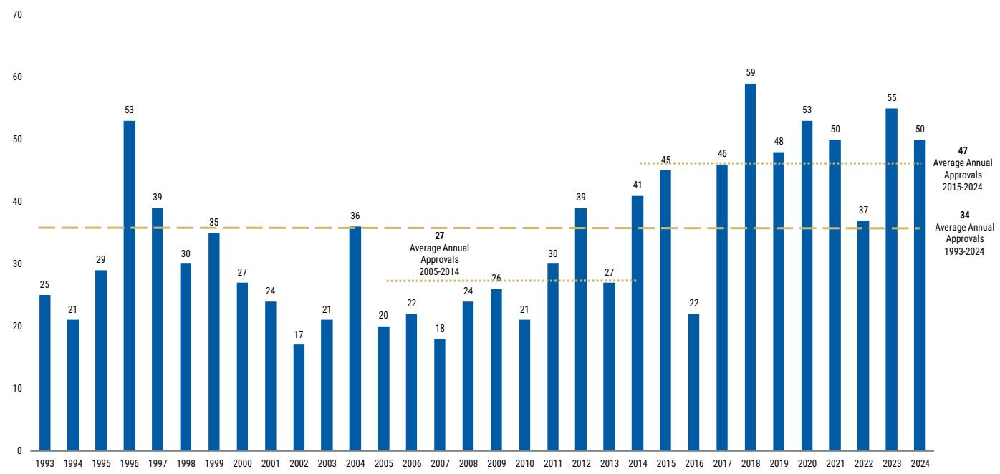

bar chart

| Year | Value |
|---|---|
| 1993 | 25 |
| 1994 | 21 |
| 1995 | 29 |
| 1996 | 53 |
| 1997 | 39 |
| 1998 | 30 |
| 1999 | 35 |
| 2000 | 27 |
| 2001 | 24 |
| 2002 | 17 |
| 2003 | 21 |
| 2004 | 36 |
| 2005 | 20 |
| 2006 | 22 |
| 2007 | 18 |
| 2008 | 24 |
| 2009 | 26 |
| 2010 | 21 |
| 2011 | 30 |
| 2012 | 39 |
| 2013 | 27 |
| 2014 | 41 |
| 2015 | 45 |
| 2016 | 22 |
| 2017 | 46 |
| 2018 | 59 |
| 2019 | 48 |
| 2020 | 53 |
| 2021 | 50 |
| 2022 | 37 |
| 2023 | 55 |
| 2024 | 50 |
Average Annual Approvals
2015-2024
Average Annual Approvals
1993-2024
Average Annual Approvals

## Methodology:

\- Drugs advance through several "phases" of clinical development before they reach the FDA for an approval decision.

■ While it is straightforward to track the number of approved drugs by company (i.e., the numerator), it is more challenging to measure the number of drugs a company advances into clinical development (i.e., the denominator).

■ We leveraged data available on the clinicaltrials.gov website to count the number of drugs each of our large cap companies advanced into clinical development (2007+)

## FDA's Accelerated Approval Pathway: Updates & Implications

## Background:

The FDA's accelerated approval process allows for earlier approval of drugs that treat serious conditions and fill an unmet medical need, based on a surrogate endpoint that is reasonably likely to predict clinical benefit.

- Products granted accelerated approval must meet the same statutory standards for safety and effectiveness as those granted traditional approval.
- As a condition of accelerated approval, the FDA generally requires sponsors to conduct additional post-approval confirmatory studies to verify and describe the product's clinical benefit.  
■ FDA may require, as appropriate, that confirmatory trials be underway prior to approval or within a specific time period after the date of approval for a product granted accelerated approval

<table><tr><td>Ticker</td><td>Company</td><td>Asset</td><td>Detail</td></tr><tr><td>SRPT</td><td>Sarepta Therapeutics</td><td>SRP-9003</td><td>Currently in a PH3 study for LGMD2E/R4 and biomarker data (beta-sarcoglycan protein) are expected in 2Q25. The company plans to file a BLA for accelerated approval in 2025</td></tr><tr><td>DYN</td><td>Dyne Therapeutics</td><td>DYN-101 / DYN-251</td><td>(Exon 51 skipping) data from a registrational cohort of the Ph1/2 DELIVER study in DMD are expected late 2025 with regulatory filing for accelerated approval expected in early 2026. DYNE-101 data from the registrational cohort of the Ph1/2 ACHIEVE study in DM1 are expected 1H26 with regulatory filing for accelerated approval also expected in 1H26. We note drug reviews for these products fall under the CDER rather CBER.</td></tr><tr><td>KYTX</td><td>Kyverna Therapeutics</td><td>KYV-101</td><td>(CD19 CAR-T) registrational Ph2 data in SPS expected 1H26 with BLA filing for accelerated approval expected in 2026.</td></tr><tr><td>RGNX</td><td>Regenxbio Inc</td><td>RGX-202</td><td>RGNX says their DMD gene therapy (RGX-202) should have the accelerated approval pathway open for them but they have not confirmed that they would file a BLA under the accelerated pathway yet. We&#x27;re still waiting on their pivotal trial which will read out next year.</td></tr><tr><td>PTCT</td><td>PTC Therapeutics</td><td>PTC518</td><td>Hopes that PTC518 can pursue accelerated approval, but they would have to help FDA define that pathway in Huntington&#x27;s and have a Ph2 readout in Q2 that could help with this</td></tr><tr><td>IRON</td><td>Disc Medicine</td><td>Bitopertin</td><td>Bitopertin for EPP, for which Disc Medicine expects to submit an NDA under the accelerated approval pathway in 2H25</td></tr><tr><td>ONC</td><td>BeiGene Ltd.</td><td>Sonrotoclax</td><td>(BCL2 inhibitor) Planned data readouts in R/R CLL and R/R MCL Phase 2 trials and potential accelerated approval submissions in the second half of 2025</td></tr><tr><td>DNLI</td><td>Denali Therapeutics Inc.</td><td>DNL310</td><td>Lead asset DNL310 shows strong biomarker data for Hunter syndrome, with plans for a BLA submission and accelerated approval by Q2 2025.</td></tr><tr><td>JAZZ</td><td>Jazz Pharmaceuticals</td><td>Dordaviprone</td><td>A New Drug Application (NDA) for accelerated approval of dordaviprone in recurrent H3 K27M-mutant diffuse glioma was recently accepted and granted Priority Review by FDA.</td></tr></table>

## January 29, 2025:

- The FDA issued two new guidance documents governing details of the Accelerated Approval Program, including a focus on product withdrawal and requirements for ongoing confirmatory trials.  
- The FDA solicited public comment on the Accelerated Approval Guidance until March 6, 2025, and on the Confirmatory Trial Guidance document until March 10, 2025.

# FDA Decision Tracking: Tracking Impact to Review Timelines (1/3)

Since Trump Inauguration: mostly on-time

<table><tr><td>Company Name</td><td>Drug</td><td>Filing</td><td>Event</td><td>Event Target Date</td><td>Event Outcome</td><td>Outcome Date</td></tr><tr><td>Biogen</td><td>Lecanemab</td><td>sBLA</td><td>FDA decision on lecanemab for IV maintenance dosing for the treatment of early Alzheimer&#x27;s disease</td><td>1/25/2025</td><td>Approved</td><td>1/26/2025</td></tr><tr><td>Vertex</td><td>Suzetrigine</td><td>NDA</td><td>FDA decision on suzetrigine for the treatment of moderate-to-severe acute pain</td><td>1/30/2025</td><td>Approved</td><td>1/30/2025</td></tr><tr><td>Axsome</td><td>AXS-07</td><td>Resubmitted NDA</td><td>FDA decision on AXS-07 for the acute treatment of migraine</td><td>1/31/2025</td><td>Approved</td><td>1/30/2025</td></tr><tr><td>Supernus</td><td>SPN-830</td><td>Resubmitted NDA</td><td>FDA decision on SPN-830 for continuous treatment of motor fluctuations in Parkinson&#x27;s disease</td><td>2/1/2025</td><td>Approved</td><td>2/4/2025</td></tr><tr><td>Lundbeck</td><td>Brexipiprazole</td><td>sNDA</td><td>FDA decision on Brexipiprazole in combination with Sertraline for the treatment of adults with PTSD</td><td>2/8/2025</td><td>Delayed</td><td>N/A</td></tr><tr><td>GSK</td><td>MenABCWY</td><td>BLA</td><td>FDA decision on 5-in-1 MenABCWY vaccine candidate</td><td>2/14/2025</td><td>Approved</td><td>2/17/2025</td></tr><tr><td>Ono</td><td>Vimseltinib</td><td>NDA</td><td>FDA decision on Vimseltinib for treatment of tenosynovial giant cell tumor</td><td>2/17/2025</td><td>Approved</td><td>2/14/2025</td></tr><tr><td>Novartis</td><td>Fabhalta</td><td>sNDA</td><td>FDA decision on Fabhalta for the treatment of adults with complement 3 glomerulopathy</td><td>2/24/2025</td><td>Approved</td><td>3/20/2025</td></tr><tr><td>SpringWorks</td><td>Mirdametinib</td><td>NDA</td><td>FDA decision of Mirdametinib for the treatment of NF1-PN</td><td>2/28/2025</td><td>Approved</td><td>2/11/2025</td></tr><tr><td>ARS Pharma</td><td>Neffy 1 mg</td><td>sNDA</td><td>FDA decision on neffy 1 mg for the treatment of Type I allergic reactions</td><td>3/6/2025</td><td>Approved</td><td>3/5/2025</td></tr><tr><td>Scienture</td><td>SCN-102</td><td>Resubmitted NDA</td><td>FDA decision on SCN-102 for the treatment of hypertension</td><td>3/17/2025</td><td>Approved</td><td>3/18/2025</td></tr><tr><td>Relay</td><td>Rivoceranib</td><td>NDA</td><td>FDA decision on Rivoceranib in combination with Camrelizumab as a therapy for advanced or metastatic</td><td>3/20/2025</td><td>CRL Issued</td><td>3/21/2025</td></tr><tr><td>Alnylam</td><td>Amvuttra</td><td>sNDA</td><td>FDA decision on Vutrisiran for the treatment of ATTR amyloidosis with cardiomyopathy</td><td>3/23/2025</td><td>Approved</td><td>3/20/2025</td></tr><tr><td>GSK</td><td>Gepotidacin</td><td>NDA</td><td>FDA decision on Gepotidacin for the treatment of female adults and adolescents with uncomplicated uri</td><td>3/26/2025</td><td>Approved</td><td>3/25/2025</td></tr><tr><td>Soleno</td><td>DCCR</td><td>NDA</td><td>FDA decision on DCCR for the treatment of Prader-Willi syndrome with hyperphagia.</td><td>3/27/2025</td><td>Approved</td><td>3/26/2025</td></tr><tr><td>Milestone Pharma</td><td>Cardamyst</td><td>NDA</td><td>FDA decision on Cardamyst nasal spray for the management of PSVT</td><td>3/27/2025</td><td>CRL Issued</td><td>3/28/2025</td></tr><tr><td>Mirum</td><td>Chenodiol</td><td>NDA</td><td>FDA decision on Chenodiol for the treatment of cerebrotendinous xanthomatosis</td><td>3/28/2025</td><td>Approved</td><td>2/24/2025</td></tr><tr><td>Sanofi</td><td>Fitusiran</td><td>NDA</td><td>FDA decision on Fitusiran for the treatment of hemophilia A or B in adults and adolescents with or with</td><td>3/28/2025</td><td>Approved</td><td>3/29/2025</td></tr><tr><td>Novavax</td><td>Nuvaxovid</td><td>BLA</td><td>FDA decision on Novavax&#x27;s Covid-19 Vaccine</td><td>4/1/2025</td><td>Approved with limited label</td><td>5/16/2025</td></tr><tr><td>Aldeyra</td><td>Reproxalap</td><td>NDA</td><td>FDA decision on Reproxalap for the treatment of the signs and symptoms of dry eye disease</td><td>4/2/2025</td><td>CRL Issued</td><td>4/3/2025</td></tr><tr><td>Amgen</td><td>Uplinza</td><td>sBLA</td><td>FDA decision on Uplizna for the treatment of Immunoglobulin G4-related disease</td><td>4/3/2025</td><td>Approved</td><td>4/3/2025</td></tr><tr><td>Exelixis</td><td>Cabometyx</td><td>sNDA</td><td>FDA decision on Cabometyx for expanded use in the treatment of advanced neuroendocrine tumors</td><td>4/3/2025</td><td>Approved</td><td>3/26/2025</td></tr><tr><td>Novartis</td><td>Atrasentan</td><td>NDA</td><td>FDA accelerated approval for Vanrafia® (atrasentan), the first and only selective endothelin A receptor ar</td><td>-</td><td>Approved</td><td>4/3/2025</td></tr><tr><td>Ocular Therapeutics</td><td>Dextenza</td><td>sNDA</td><td>FDA decision on Dextenza for ocular inflammation and pain after ophthalmic surgery and ocular itching a</td><td>-</td><td>Approved</td><td>4/7/2025</td></tr><tr><td>Bristol-Myers Squibb</td><td>Opdivo plus Yervoy</td><td>sBLA</td><td>FDA decision on Opdivo plus Yervoy for 1L unresectable MSI-H or dMMR CRC</td><td>6/23/2025</td><td>Approved</td><td>4/8/2025</td></tr><tr><td>argenx</td><td>Vyvgart SC prefilled syringe</td><td>sBLA</td><td>FDA decision on Vyvgart SC prefilled syringe for gMG and CIDP</td><td>4/10/2025</td><td>Approved</td><td>4/10/2025</td></tr><tr><td>Bristol-Myers Squibb</td><td>Opdivo plus Yervoy</td><td>sBLA</td><td>FDA decision on Opdivo plus Yervoy for 1L unresectable hepatocellular carcinoma</td><td>4/21/2025</td><td>Approved</td><td>4/11/2025</td></tr><tr><td>Regeneron</td><td>Dupixent</td><td>Resubmitted sBLA</td><td>FDA decision on Dupixent to treat patients with CSU not adequately controlled with H1 antihistamines</td><td>4/18/2025</td><td>Approved</td><td>4/18/2025</td></tr><tr><td>Akeso</td><td>penpulimab-kcqx</td><td>BLA</td><td>FDA decision to approve penpulimab-kcqx for the treatment of keratinizing nasopharyngeal carcinoma</td><td>-</td><td>Approved</td><td>4/23/2025</td></tr><tr><td>Abbvie</td><td>Rinvoq</td><td>sNDA</td><td>FDA decision to approve Rinvoq for giant cell arteritis</td><td>-</td><td>Approved</td><td>4/29/2025</td></tr><tr><td colspan="2">Stealth BioTherapeutic Elamipretide</td><td>NDA</td><td>FDA decision on elamipretide for the treatment of Barth syndrome</td><td>4/29/2025</td><td>CRL Issued</td><td>5/29/2025</td></tr><tr><td>Abeona</td><td>Pz-cel</td><td>Resubmitted BLA</td><td>FDA decision on Pz-cel for the treatment of recessive dystrophic epidermolysis bullos</td><td>4/29/2025</td><td>Approved</td><td>4/29/2025</td></tr><tr><td>GSK</td><td>Nucala</td><td>sBLA</td><td>FDA decision on Nucala as an add-on maintenance treatment for patients with COPD with an eosinophi</td><td>5/7/2025</td><td>Approved</td><td>5/22/2025</td></tr><tr><td>AbbVie</td><td>Emrelis</td><td>NDA</td><td>FDA decision to approve Emrelis in previously treated NSCLC with higher c-Met protein overexpression</td><td>5/14/2025</td><td>Approved</td><td>5/14/2025</td></tr><tr><td>Merck</td><td>Welireg</td><td>sNDA</td><td>FDA decision on Welirig for the treatment of patients with advanced PPGL</td><td>5/26/2025</td><td>Approved</td><td>5/14/2025</td></tr><tr><td>Incyte</td><td>Zynyz</td><td>BLA</td><td>FDA decision to approve Zynyz for 1L inoperable squamous cell carcinoma</td><td>5/15/2025</td><td>Approved</td><td>5/15/2025</td></tr><tr><td>Arcutis</td><td>Zoryve</td><td>sNDA</td><td>FDA decision on Zoryve foam for the treatment of scalp and body psoriasis</td><td>5/22/2025</td><td>Approved</td><td>5/22/2025</td></tr><tr><td>Sanofi</td><td>MenQuadfi</td><td>sBLA</td><td>FDA decision on MenQuadfi for potential extension of indication to include children aged 6-weeks to 23 r</td><td>5/23/2025</td><td>Approved</td><td>5/23/2025</td></tr><tr><td>Liquidia</td><td>Yutrepia</td><td>Resubmitted NDA</td><td>FDA decision on Yutrepia inhalation powder to treat PAH and pulmonary hypertension associated with ir</td><td>5/24/2025</td><td>Approved</td><td>5/23/2025</td></tr><tr><td>Eton Pharma</td><td>ET-400</td><td>NDA</td><td>FDA decision on ET-400 as an additional oral hydrocortisone treatment option</td><td>5/28/2025</td><td>Approved</td><td>5/28/2025</td></tr><tr><td>Moderna</td><td>mRNA-1283</td><td>BLA</td><td>FDA decision on mRNA-1283 for the treatment of Respiratory COVID-19 vaccine</td><td>5/31/2025</td><td>Approved</td><td>5/31/2025</td></tr><tr><td>Bayer</td><td>Nubeqa</td><td>sNDA</td><td>FDA decision on Nubeqa for the treatment of mCSPC</td><td>-</td><td>Approved</td><td>6/3/2025</td></tr><tr><td>Merck</td><td>Clesrovimab</td><td>BLA</td><td>FDA decision on clesrovimab, investigational long-acting monoclonal antibody designed to protect infai</td><td>6/10/2025</td><td>Approved</td><td>6/9/2025</td></tr><tr><td>Nuvation</td><td>Taletrectinib</td><td>NDA</td><td>FDA decision on Taletrectinib for the treatment of advanced ROS1-positive NSCLC</td><td>6/23/2025</td><td>Approved</td><td>6/11/2025</td></tr><tr><td>UroGen</td><td>UGN-102</td><td>NDA</td><td>FDA decision on UGN-102 for the treatment of low-grade intermediate-risk non-muscle invasive bladder</td><td>6/13/2025</td><td>Approved</td><td>6/12/2025</td></tr><tr><td>Merck</td><td>Keytruda</td><td>sBLA</td><td>FDA decision on KEYTRUDA plus standard of care as perioperative treatment for resectable locally advan</td><td>6/23/2025</td><td>Approved</td><td>6/12/2025</td></tr><tr><td>Moderna</td><td>mRNA-1345</td><td>BLA</td><td>FDA decision on mRNA-1345 for Respiratory syncytial virus (RSV) vaccine in high-risk adults aged 18-59</td><td>6/12/2025</td><td>Approved</td><td>6/12/2025</td></tr><tr><td>Regeneron</td><td>Eyelea HD</td><td>sBLA</td><td>FDA decision to potentially extend dosing intervals for EYLEA HD in wet AMD and diabetic macular edema</td><td>4/20/2025</td><td>Approved</td><td>4/18/2025</td></tr></table>

# FDA Decision Tracking: Tracking Impact to Review Timelines (2/3)

Since Trump Inauguration: mostly on-time

<table><tr><td></td><td>Drug</td><td>Filing</td><td>Event</td><td>Event Target Date</td><td>Event Outcome</td><td>Outcome Date</td></tr><tr><td>Gilead</td><td>Lenacapavir</td><td>NDA</td><td>FDA decision on twice-yearly Lenacapavir for HIV prevention</td><td>6/19/2025</td><td>Approved</td><td>6/18/2025</td></tr><tr><td>Regeneron</td><td>Dupixent</td><td>sBLA</td><td>FDA decision on Dupixent for treatment of bullous pemphigoid in adults</td><td>6/20/2025</td><td>Approved</td><td>6/20/2025</td></tr><tr><td>Daiichi Sankyo</td><td>Datroway</td><td>BLA</td><td>FDA decision on Datroway for previously-treated EGFR-mutated NSCLC</td><td>7/12/2025</td><td>Approved</td><td>6/23/2025</td></tr><tr><td>Unicycive</td><td>Oxylanthanum Carbonate</td><td>NDA</td><td>FDA decision on Oxylanthanum Carbonate for the treatment of hyperphosphatemia in patients with CKD</td><td>6/28/2025</td><td>Approved</td><td>6/30/2025</td></tr><tr><td>Verastem</td><td>Avutometinib combination</td><td>NDA</td><td>FDA decision on Avutometinib in combination with Defactinib for the treatment of Recurrent KRAS mutan</td><td>6/30/2025</td><td>Approved</td><td>5/8/2025</td></tr><tr><td>Regeneron</td><td>Linvoseltamab</td><td>BLA</td><td>FDA decision on Linvoseltamab for the treatment of adult patients with relapsed/refractory multiple myel</td><td>7/10/2025</td><td>Approved</td><td>7/2/2025</td></tr><tr><td>Dizal Pharma</td><td>Sunvozertinib</td><td>NDA</td><td>FDA decision on Sunvozertinib for the treatment of NSCLC with EGFR exon 20 insertion mutations</td><td>7/7/2025</td><td>Approved</td><td>7/2/2025</td></tr><tr><td>Capricor</td><td>Deramiocel</td><td>BLA</td><td>FDA decision on Deramiocel to treat Duchenne muscular dystrophy cardiomyopathy</td><td>8/31/2025</td><td>CRL Issued</td><td>7/11/2025</td></tr><tr><td>Ultragenyx</td><td>UX111 AAV</td><td>BLA</td><td>FDA decision on UX111 AAV gene therapy for treatment of Sanfilippo syndrome type A (MPS IIIA)</td><td>8/18/2025</td><td>CRL Issued</td><td>7/11/2025</td></tr><tr><td>Roche</td><td>Columnvi combination</td><td>sBLA</td><td>FDA decision on Columnvi in combination with gemcitabine and oxaliplatin for the treatment of relapsed</td><td>7/20/2025</td><td>CRL Issued</td><td>7/17/2025</td></tr><tr><td>Replimune</td><td>RP1 (vusolimogene oderparep) BLA</td><td>NDA</td><td>FDA decision on RP1 (vusolimogene oderparepvec) in combination with nivolumab for patients with adv</td><td>7/22/2025</td><td>CRL Issued</td><td>7/22/2025</td></tr><tr><td>LEO Pharma</td><td>Anzupgo</td><td>NDA</td><td>FDA decision on Anzupgo for the treatment of chronic hand eczma</td><td>7/23/2025</td><td>Approved</td><td>7/23/2025</td></tr><tr><td>GSK</td><td>Blenrep combinations</td><td>BLA</td><td>FDA decision on Blenrep in combinations with bortezomib plus dexamethasone and pomalidomide plus</td><td>7/23/2025</td><td>Approved</td><td>7/24/2025</td></tr><tr><td>Ascendis</td><td>TransCon hGH</td><td>sBLA</td><td>FDA decision on TransCon hGH for the Treatment of Adults with Growth Hormone Deficiency</td><td>7/27/2025</td><td>Approved</td><td>7/28/2025</td></tr><tr><td>PTC</td><td>Sepiapterin</td><td>NDA</td><td>FDA decision on Sepiapterin for the treatment of pediatric and adult patients with phenylketonuria</td><td>7/29/2025</td><td>Approved</td><td>7/28/2025</td></tr><tr><td>Regeneron</td><td>Odronextamab</td><td>Resubmitted BLA</td><td>FDA decision on odronextamab to treat relapsed/refractory (R/R) follicular lymphoma</td><td>7/30/2025</td><td>Delayed</td><td>N/A</td></tr><tr><td>Jazz</td><td>Dordaviprone</td><td>NDA</td><td>FDA decision on Dordaviprone for treatment of recurrent H3 K27M-Mutant diffuse glioma</td><td>8/18/2025</td><td>Approved</td><td>8/6/2025</td></tr><tr><td>LENZ</td><td>LNZ100</td><td>NDA</td><td>FDA decision on LNZ100 for the treatment of presbyopia</td><td>8/8/2025</td><td>Approved</td><td>7/31/2025</td></tr><tr><td>Insmend</td><td>Brensocatib</td><td>NDA</td><td>FDA decision on Brensocatib for Treatment of non-cystic fibrosis bronchiectasis</td><td>8/12/2025</td><td>Approved</td><td>8/12/2025</td></tr><tr><td>Tonix</td><td>TNX-102 SL</td><td>NDA</td><td>FDA decision on TNX-102 SL for the management of fibromyalgia</td><td>8/15/2025</td><td>Approved</td><td>8/15/2025</td></tr><tr><td>PTC</td><td>Vatiquinone</td><td>NDA</td><td>FDA decision on Vatiquinone for the treatment of children and adults with Friedreich&#x27;s ataxia</td><td>8/19/2025</td><td>CRL Issued</td><td>8/19/2025</td></tr><tr><td>Regeneron</td><td>Eylea HD</td><td>sBLA</td><td>FDA decision on Eylea HD om RVO and monthly dosing</td><td>8/19/2025</td><td>Delayed - approved in Nov</td><td>11/19/2025</td></tr><tr><td>JNJ</td><td>Darzakex Faspro</td><td>sBLA</td><td>FDA decision on Darzalex Faspro for sMM</td><td>8/20/2025</td><td>Delayed</td><td>N/A</td></tr><tr><td>Ionis</td><td>Donidalorsen</td><td>NDA</td><td>FDA decision on donidalorsen for the treatment of hereditary angioedema</td><td>8/21/2025</td><td>Approved</td><td>8/21/2025</td></tr><tr><td>Precigen</td><td>PRGN-2012</td><td>BLA</td><td>FDA decision on PRGN-2012 for the treatment of adults with recurrent respiratory papillomatosis</td><td>8/27/2025</td><td>Approved</td><td>8/15/2025</td></tr><tr><td>Outlook</td><td>ONS-5010</td><td>Resubmitted BLA</td><td>FDA decision on ONS-5010 in wet AMD</td><td>8/27/2025</td><td>CRL Issued</td><td>8/28/2025</td></tr><tr><td>Travere Therapeutics</td><td>Filspari</td><td>sNDA</td><td>FDA decision on REMS modification for Filspari</td><td>8/28/2025</td><td>Approved</td><td>8/27/2025</td></tr><tr><td>Sanofi</td><td>Rilzabrutinib</td><td>NDA</td><td>FDA decision on rilzabrutinib for treatment on ITP</td><td>8/29/2025</td><td>Approved</td><td>8/29/2025</td></tr><tr><td>Biogen</td><td>Lecanemab SC</td><td>sBLA</td><td>FDA decision on Lecanemab SC for weekly maintenance dosing for treating early Alzheimer&#x27;s</td><td>8/31/2025</td><td>Approved</td><td>8/29/2025</td></tr><tr><td>Agios</td><td>Pyrukynd</td><td>sNDA</td><td>FDA decision on Pyrukynd for the treatment of adult patients with non-transfusion-dependent and transf</td><td>9/7/2025</td><td>Delayed</td><td>N/A</td></tr><tr><td>Incyte</td><td>Ruxolitinib</td><td>sNDA</td><td>FDA decision on Ruxolitinib for atopic dermatitis in pediatric patients</td><td>9/19/2025</td><td>Approved</td><td>9/18/2025</td></tr><tr><td>Merck</td><td>Keytruda SC</td><td>BLA</td><td>FDA decision on Keytruda SC in solid tumors approved for Keytruda IV</td><td>9/23/2025</td><td>Approved</td><td>9/19/2025</td></tr><tr><td>Scholar Rock</td><td>Apitegromab</td><td>BLA</td><td>FDA decision on Apitegromab for treatment of SMA</td><td>9/22/2025</td><td>CRL Issued</td><td>9/22/2025</td></tr><tr><td>Biogen</td><td>High dose Spinraza</td><td>sNDA</td><td>FDA decision on high dose Spinraza in SMA</td><td>9/22/2025</td><td>CRL Issued</td><td>9/23/2025</td></tr><tr><td>Omeros</td><td>Narsoplimab</td><td>Resubmitted BLA</td><td>FDA decision on narsoplimab for the treatment of hematopoietic stem cell transplant-associated throml</td><td>9/25/2025</td><td>Delayed</td><td>8/15/2025</td></tr><tr><td>JNJ</td><td>TAR-200</td><td>NDA</td><td>FDA decision on TAR-200 for the treatment of high-risk non-muscle invasive bladder cancer</td><td>1/17/2026</td><td>Approved</td><td>9/9/2025</td></tr><tr><td>Crinetics</td><td>Paltusotine</td><td>NDA</td><td>FDA decision on Paltusotine for the treatment and long-term maintenance therapy of acromegaly in adult</td><td>9/25/2025</td><td>Approved</td><td>9/25/2025</td></tr><tr><td>Sanofi</td><td>Tolebrutinib</td><td>NDA</td><td>FDA decision on Tolebrutinib to treat non-relapsing secondary progressive multiple sclerosis</td><td>9/28/2025</td><td>Delayed</td><td>9/22/2025</td></tr><tr><td>Fortress</td><td>CUTX-101</td><td>NDA</td><td>FDA decision on CUTX-101 for the treatment of Menkes disease</td><td>9/30/2025</td><td>CRL Issued</td><td>9/30/2025</td></tr><tr><td>Biohaven</td><td>Troriluzole</td><td>NDA</td><td>FDA decision on Troriluzole for the treatment of Spinocerebellar Ataxia</td><td>3Q25</td><td>Delay - then CRL Issued</td><td>11/4/2025</td></tr><tr><td>Jazz</td><td>Zepzelca</td><td>sNDA</td><td>FDA decision on Zepzelca for the treatment of ES-SCLC</td><td>10/7/2026</td><td>Approved</td><td>10/2/2025</td></tr><tr><td>Arcutis</td><td>Zoryve</td><td>sNDA</td><td>FDA decision on ZORYVE cream 0.05% for topical treatment of mild to moderate AD in children 2 to 5 year</td><td>10/13/2025</td><td>Approved</td><td>10/6/2025</td></tr><tr><td>Regeneron</td><td>Libtayo</td><td>sBLA</td><td>FDA decision on Libtayo for the adjuvant treatment of high-risk cutaneous squamous cell carcinoma</td><td>Oct. 2025</td><td>Approved</td><td>10/8/2025</td></tr><tr><td>Denali</td><td>Tividenofusp alfa</td><td>BLA</td><td>FDA decision on tividenofusp alfa for the treatment of Hunter syndrome</td><td>1/5/2026</td><td>Delayed</td><td>10/13/2025</td></tr><tr><td>Amgen</td><td>Tezspire</td><td>sBLA</td><td>FDA decision on Tezspire in patients with chronic rhinosinusitis with nasal polyps</td><td>10/19/2025</td><td>Approved</td><td>10/17/2025</td></tr></table>

## FDA Decision Tracking: Tracking Impact to Review Timelines (3/3)

Since Trump Inauguration: mostly on-time

<table><tr><td>Company Name</td><td>Drug</td><td>Filing</td><td>Event</td><td>Event Target Date</td><td>Event Outcome</td><td>Outcome Date</td></tr><tr><td>Roche</td><td>Gazayva</td><td>sBLA</td><td>FDA decision on Gazayva for the treatment of lupus nephritis</td><td>Oct. 2025</td><td>Approved</td><td>10/20/2025</td></tr><tr><td>Glaukos</td><td>Epioxa</td><td>NDA</td><td>FDA decision on Epioxa for treatment of keratoconus</td><td>10/20/2025</td><td>Approved</td><td>10/20/2025</td></tr><tr><td>Syndax</td><td>Revuforj</td><td>sNDA</td><td>FDA decision on Revuforj for the treatment of r/r AML</td><td>10/25/20205</td><td>Approved</td><td>10/24/2025</td></tr><tr><td>Bayer</td><td>Elinzanetant</td><td>NDA</td><td>FDA decision on Elinzanetant for moderate-to-severe vasomotor symptoms (VMS) associated with meno</td><td>10/26/2025</td><td>Approved</td><td>10/24/2025</td></tr><tr><td>Merck</td><td>Winrevair</td><td>sBLA</td><td>FDA decision on Winrevair labeling to include the Ph3 ZENITH study</td><td>10/25/20205</td><td>Approved</td><td>10/27/2025</td></tr><tr><td>Rhythm Pharma</td><td>Setmelanotide</td><td>NDA</td><td>FDA decision on setmelanotide in HO</td><td>12.20/2025</td><td>Delayed</td><td>11/1/2025</td></tr><tr><td>Kura</td><td>Ziftomenib</td><td>NDA</td><td>FDA decision on Ziftmenib for the treatment of r/r AML</td><td>11/30/2025</td><td>Approved</td><td>11/13/2025</td></tr><tr><td>Arrowhead</td><td>Plozasiran</td><td>NDA</td><td>FDA decision on Plozasiran for the treatment of familial chylomicronemia syndrome</td><td>11/18/2025</td><td>Approved</td><td>11/18/2025</td></tr><tr><td>Bayer</td><td>Sevabertinib</td><td>NDA</td><td>FDA decision on Sevabertinib for the treatment of NSCLC with HER2 acitivating mutations</td><td>11/28/2025</td><td>Approved</td><td>11/20/2025</td></tr><tr><td>PFE/Astellas</td><td>Padcev</td><td>sBLA</td><td>FDA decision on Padcev + Keytruda for MIBC</td><td>4/7/2026</td><td>Approved</td><td>11/21/2025</td></tr><tr><td>Ascendis</td><td>TransCon CNP</td><td>NDA</td><td>FDA decision on TransCon CNP for achondroplasia</td><td>11/30/2025</td><td>Delayed</td><td>2/28/2026</td></tr><tr><td>Bristol-Myers Squibb</td><td>Breyanzi</td><td>sBLA</td><td>FDA decision to expand the use of Breyanzi as a potential treatment for adult patients with relapsed or re</td><td>12/5/2025</td><td>Approved</td><td>12/4/2025</td></tr><tr><td>AxoGen</td><td>Avance Nerve Graft</td><td>BLA</td><td>FDA decision on Avance Nerve Graft for surgical repair of severed peripheral nerves</td><td>12/5/2025</td><td>Approved</td><td>12/3/2025</td></tr><tr><td>GSK</td><td>Blujepa</td><td>sNDA</td><td>FDA decision on Gepotidacin for expanded use in treating uncomplicated urogenital gonorrhoea in patie</td><td>12/11/2025</td><td>Approved</td><td>12/11/2025</td></tr><tr><td>Amgen</td><td>Uplinza</td><td>sNDA</td><td>FDA decision on Uplizna for the treatment of patients with generalized myasthenia gravis (gMG)</td><td>12/14/2025</td><td>Approved</td><td>12/11/2025</td></tr><tr><td>Biocryst</td><td>Orledayo</td><td>NDA</td><td>FDA decision on ORLADEYO Oral Granules in pediatric patients with hereditary angioedema (HAE) aged 2</td><td>12/12/2025</td><td>Approved</td><td>12/12/2025</td></tr><tr><td>Innovia</td><td>Zoliflodacin</td><td>NDA</td><td>FDA decision on Zoliflodacin for the treatment of uncomplicated gonorrhea in adults and pediatric patie</td><td>12/15/2025</td><td>Approved</td><td>12/12/2025</td></tr><tr><td>Milestone Pharma</td><td>Cardamyst</td><td>NDA</td><td>FDA decision on Cardamyst nasal spray for the management of PSVT</td><td>12/13/2025</td><td>Approved</td><td>12/13/2025</td></tr><tr><td>GSK</td><td>Depemokimab</td><td>BLA</td><td>FDA decision on Depemokimab as add-on maintenance treatment of asthma in adult and pediatric patie</td><td>12/16/2026</td><td>Approved</td><td>12/16/2026</td></tr><tr><td>GSK</td><td>Depemokimab</td><td>BLA</td><td>FDA decision on Depemokimab for the treatment of chronic rhinosinusitis with nasal polyps (CRSwNP) i</td><td>12/16/2026</td><td>Approved</td><td>12/16/2026</td></tr><tr><td>AstraZenaca</td><td>ENHERTU</td><td>sBLA</td><td>FDA decision on ENHERTU in combination with Pertuzumab for the 1st-line treatment of adult patients wi</td><td>1/23/2026</td><td>Approved</td><td>12/16/2025</td></tr><tr><td>Aldeyra</td><td>Reproxalap</td><td>NDA</td><td>DA decision on Reproxalap for the treat of dry eye disease</td><td>12/16/2025</td><td>Delayed</td><td>12/16/2025</td></tr><tr><td>Cytokinetics</td><td>Aficamten</td><td>NDA</td><td>FDA decision on Aficamten for the treatment of obstructive hypertrophic cardiomyopathy</td><td>12/26/2025</td><td>Approved</td><td>12/19/2025</td></tr><tr><td>Agios</td><td>Pyrukynd</td><td>sNDA</td><td>FDA decision on Pyrukynd for the treatment of adult patients with non-transfusion-dependent and transf</td><td>12/7/2025</td><td>Approved</td><td>12/23/2025</td></tr><tr><td>Omeros</td><td>Narsoplimab</td><td>Resubmitted BLA</td><td>FDA decision on Narsoplimab for the treatment of hematopoietic stem cell transplant-associated throm</td><td>12/26/2025</td><td>Approved</td><td>12/24/2025</td></tr><tr><td>Sanofi</td><td>Tolebrutinib</td><td>NDA</td><td>FDA decision on Tolebrutinib to treat non-relapsing secondary progressive multiple sclerosis</td><td>12/28/2025</td><td>CRL Issued</td><td>12/24/2025</td></tr><tr><td>Vanda</td><td>Tradipitant</td><td>NDA</td><td>FDA decision on Tradipitant NDA for the treatment of motion sickness</td><td>12/30/2025</td><td>Approved</td><td>12/28/2025</td></tr><tr><td>Corcept</td><td>Relacorilant</td><td>NDA</td><td>FDA decision on Relacorilant to treat patients with endogenous hypercortisolism (Cushing&#x27;s syndrome)</td><td>12/30/2025</td><td>CRL Issued</td><td>12/30/2025</td></tr><tr><td>Outlook</td><td>ONS-5010</td><td>Resubmitted BLA</td><td>FDA decision on ONS-5010 in wet AMD</td><td>12/31/2025</td><td>Declined to approve</td><td>12/31/2025</td></tr><tr><td>Atara</td><td>Tabeleculecel</td><td>Resubmitted BLA</td><td>FDA decision on Tabeleculecel as monotherapy for the treatment of Epstein-Barr virus positive post-tran</td><td>1/10/2026</td><td>Declined to approve</td><td>1/9/2026</td></tr><tr><td>Travere Therapeutics</td><td>Filspari</td><td>sNDA</td><td>FDA decision on FILSPARI (sparsentan) for the treatment of focal segmental glomerulosclerosis (FSGS)</td><td>1/13/2026</td><td>Delayed to April 13</td><td>1/13/2026</td></tr><tr><td>Sanofi</td><td>Cerezyme</td><td>sBLA</td><td>FDA decision on Cerezyme to treat patients with Gaucher disease type 3 (GD3), with no age limitation for</td><td>1/13/2026</td><td>Delayed</td><td>N/A</td></tr><tr><td>Fortress Bio</td><td>CUTX-101</td><td>Resubmitted NDA</td><td>FDA decision on CUTX-101 to treat Menkes disease in pediatric patients.</td><td>1/14/2026</td><td>Approved</td><td>1/13/2026</td></tr><tr><td>Aquestive Therapeutics</td><td>Anaphylm</td><td>NDA</td><td>FDA decision on Anaphylm in the treatment of Type 1 allergic reactions, including anaphylaxis</td><td>1/31/2026</td><td>CRL Issued</td><td>2/2/2026</td></tr><tr><td>Pharming Group</td><td>Leniosilib</td><td>sNDA</td><td>FDA decision on expanded use of Leniolisib as a treatment for children aged 4 to 11 years with activated</td><td>1/31/2026</td><td>CRL Issued</td><td>2/1/2026</td></tr><tr><td>Regenx Bio</td><td>RGX-121</td><td>BLA</td><td>FDA decision on clemidsogene lanparvovec for the treatment of Mucopolysaccharidosis II (MPS II)</td><td>2/8/2026</td><td>CRL Issued</td><td>2/9/2026</td></tr><tr><td>Disc Medicine</td><td>Bitopertin</td><td>NDA</td><td>FDA decision on bitopertin for the treatment of EPP</td><td>late-Jan/early-Feb</td><td>CRL Issued</td><td>2/13/2026</td></tr><tr><td>Merck</td><td>Keytruda</td><td>sBLA</td><td>FDA decision on KEYTRUDA plus chemotherapy with or without bevacizumab for treatment of patients wi</td><td>2/20/2026</td><td>Approved</td><td>2/11/2026</td></tr><tr><td>Vanda</td><td>Bysanti</td><td>NDA</td><td>FDA decision on Bysanti (milsaperidone) for the acute treatment of bipolar I disorder and the treatment c</td><td>2/21/2026</td><td>Approved</td><td>2/20/2026</td></tr><tr><td>Eton Pharma</td><td>ET-600</td><td>NDA</td><td>FDA decision on ET-600 for the treatment of central diabetes insipidius, also known as arginine vasopre</td><td>2/25/2026</td><td>Approved</td><td>2/25/2026</td></tr><tr><td>Otsuka</td><td>INQOVI</td><td>sNDA</td><td>FDA decision on INQOVI plus venetoclax as a treatment for adults with newly diagnosed acute myeloid li</td><td>2/25/2026</td><td>Delayed</td><td>N/A</td></tr><tr><td>REGN/SNY</td><td>Dupixent</td><td>sBLA</td><td>FDA decision on Dupixent in adults and children aged 6 years and older with allergic fungal rhinosin</td><td>2/28/2026</td><td>Approved</td><td>2/26/2026</td></tr><tr><td>Ascendis</td><td>TransCon CNP</td><td>NDA</td><td>FDA decision on TransCon CNP (navepegritide) for the treatment of children with achondroplasia</td><td>2/28/2026</td><td>Approved</td><td>2/27/2026</td></tr><tr><td>Biomarin</td><td>PALYNZIQ</td><td>sBLA</td><td>FDA decision on PALYNZIQ to expand treatment to include adolescents aged 12-17 with phenylketonuria</td><td>2/28/2026</td><td>Approved</td><td>2/27/2026</td></tr><tr><td>Bristol-Myers Squibb</td><td>Sotyktu</td><td>sNDA</td><td>FDA decision on Sotyktu for the treatment of psoriatic arthritis</td><td>3/6/2026</td><td>Approved</td><td>3/6/2026</td></tr><tr><td>Aldeyra</td><td>Reproxalap</td><td>Resubmitted NDA</td><td>FDA decision on Reproxalap for dy eye disease</td><td>3/16/2026</td><td>Refused to approve</td><td>3/17/2026</td></tr><tr><td>Rhythm Pharma</td><td>Imcivree</td><td>sNDA</td><td>FDA decision on Imcivree for hypothalamic obesity</td><td>3/20/2026</td><td>Approved</td><td>3/19/2026</td></tr><tr><td>GSK</td><td>Linerixibat</td><td>NDA</td><td>FDA decision on linerixibat for PBC</td><td>3/24/2026</td><td>Approved</td><td>3/19/2026</td></tr><tr><td>Rocket Pharma</td><td>Krestadi</td><td>Resubmitted BLA</td><td>FDA decision on Krestadi for severe LAD-I</td><td>3/28/2026</td><td>Approved</td><td>3/27/2026</td></tr><tr><td>IONS/BIIB</td><td>Spinraza</td><td>sNDA</td><td>FDA decision on high dose Spinraza in SMA</td><td>4/3/2026</td><td>Approved</td><td>3/20/2026</td></tr><tr><td>Bristol-Myers Squibb</td><td>Opdivo plus chemo</td><td>sBLA</td><td>FDA decision on Opdivo + chemo for untreatedStage 3 or 4 Classical Hodgkin Lymphona</td><td>4/8/2026</td><td>Approved</td><td>3/20/2026</td></tr><tr><td>DNLI/RPRX</td><td>Tividenofusp alfa</td><td>BLA</td><td>FDA decision on tividenofusp alfa for the treatment of Hunter syndrome</td><td>4/5/2026</td><td>Approved</td><td>3/25/2026</td></tr><tr><td>Eli Lilly</td><td>Foundayo</td><td>NDA</td><td>FDA decision on Foundayo for obesity</td><td>1/20/2027</td><td>Approved</td><td>4/1/2026</td></tr><tr><td>Replimune</td><td colspan="2">RP1 (vusolimogene oderparep) Resubmitted BLA</td><td>FDA decision on RP1 + Opdivo in advanced melanoma</td><td>4/10/2026</td><td>CRL Issued</td><td>4/10/2026</td></tr><tr><td>Travere Therapeutics</td><td>Filspari</td><td>sNDA</td><td>FDA decision on FILSPARI (sparsentan) for the treatment of focal segmental glomerulosclerosis (FSGS)</td><td>4/13/2026</td><td>Approved</td><td>4/13/2026</td></tr></table>

Source: RTT New (FDA Calendar - RTTNews Premium)

Key

Within 3 Days Of Target Date

Over 3 Days Of Target Date

## 2026 Healthcare Industry Events

2026 Healthcare Industry Events

<table><tr><td>January▪ ASCO Gastrointestinal Cancers Symposium (1/8-1/10)▪ Crohn&#x27;s and Colitis Congress (1/22-1/24)</td><td>February▪ Tandem Transplantation &amp; Cellular Therapy Meeting (2/4-2/7)▪ Advisory Committee on Immunization Practices (ACIP) Meeting (2/25-2/26)▪ ASCO Genitourinary Cancer Symposium (2/26-2/28)</td><td>March▪ American College of Cardiology (ACC) (3/28-3/30)▪ Precision Med Tri-Con (TBA)</td></tr><tr><td>April▪ American Association for Cancer Research (AACR) Annual Meeting (4/17-4/22)▪ American Academy of Neurology (AAN) Annual Meeting (4/18-4/22)</td><td>May▪ American Society of Gene &amp; Cell Therapy (ASGCT) Annual Meeting (5/11-5/15)▪ European Association for the Study of Liver (EASL) Congress (5/27-5/30)▪ American Society of Clinical Oncology (ASCO) Annual Meeting (5/29-6/2)</td><td>June▪ European Alliance of Associations for Rheumatology (EULAR) (6/3-6/6)▪ European Hematology Association (EHA) Congress (6/11-6/14)▪ Advisory Committee on Immunization Practices (ACIP) Meeting (6/24-6/25)</td></tr><tr><td>July▪ ENDO (Endocrine Society) Annual Meeting (6/13-6/16)▪ American Society of Retina Specialists (ASRS) Annual Meeting (7/15-7/18)</td><td>August▪ European Society of Cardiology (ESC) Congress (8/28-8/31)</td><td>September▪ MS Global Healthcare Conference (TBA)▪ European Association for the Study of Diabetes (EASD) (9/28-10/2)</td></tr><tr><td>October▪ American Neurological Association (ANA) Annual Meeting (10/17-10/20)▪ Advisory Committee on Immunization Practices (ACIP) Meeting (10/21-10/22)▪ American Society of Nephrology (ASN) Kidney Week (10/21-10/25)▪ European Society for Medical Oncology (ESMO) Congress (10/23-10/27)</td><td>November▪ American Heart Association (AHA) Meeting (11/7-11/9)▪ American Society of Rheumatology (ACR) Convergence (11/6-11/11)▪ ObesityWeek (11/14-11/17)▪ EORTC-NCI-AACR Symposium (11/18-11/20)▪ American Association for the Study of Liver (AASLD) Liver Meeting (TBA)</td><td>December▪ San Antonio Breast Cancer Symposium (SABCS) (12/8-12/11)▪ American Society of Hematology (ASH) Annual Meeting (12/12-12/15)</td></tr></table>

Source: MS, FactSet.

## MS SMID Biotechnology Comp Sheet

  
Sean Laaman  
Biotechnology Coverage  
Sean.Laaman@morganstanley.com  
+1 212 761-4947

Friday, June 12, 2026

MS  
U.S. SMID Biotech - MS estimates

<table><tr><td rowspan="2">Ticker</td><td rowspan="2">Company Name</td><td rowspan="2">Rating</td><td rowspan="2">PT</td><td rowspan="2">Latest Price</td><td rowspan="2">% delta</td><td colspan="2">Price performance</td><td rowspan="2">Market Cap ($M)</td><td rowspan="2">Cash ($M)</td><td rowspan="2">Debt ($M)</td><td rowspan="2">Enterprise Value ($M)</td></tr><tr><td>2025</td><td>YTD</td></tr><tr><td>ABSI</td><td>Absci Corporation</td><td>Equal-Weight</td><td>4.10</td><td>$6.51</td><td>-37%</td><td>33%</td><td>86%</td><td>1,015</td><td>126</td><td>4</td><td>894</td></tr><tr><td>ACAD</td><td>ACADIA Pharmaceuticals Inc.</td><td>Equal-Weight</td><td>26.00</td><td>$21.39</td><td>22%</td><td>46%</td><td>-20%</td><td>3,663</td><td>851</td><td>51</td><td>2,862</td></tr><tr><td>ALEC</td><td>Alector, Inc.</td><td>Underweight</td><td>2.00</td><td>$1.57</td><td>27%</td><td>-17%</td><td>-1%</td><td>174</td><td>207</td><td>35</td><td>2</td></tr><tr><td>ARGX</td><td>argenx SE Sponsored ADR</td><td>Overweight</td><td>1,170.00</td><td>$898.94</td><td>30%</td><td>37%</td><td>7%</td><td>55,283</td><td>4,440</td><td>47</td><td>50,890</td></tr><tr><td>AXSM</td><td>Axsome Therapeutics, Inc.</td><td>Equal-Weight</td><td>242.00</td><td>$253.77</td><td>-5%</td><td>116%</td><td>40%</td><td>13,059</td><td>305</td><td>220</td><td>12,974</td></tr><tr><td>BBOT</td><td>BridgeBio Oncology Therapeutics, Inc.</td><td>Overweight</td><td>18.00</td><td>$7.46</td><td>141%</td><td>-</td><td>-39%</td><td>598</td><td>252</td><td>3</td><td>348</td></tr><tr><td>BBIO</td><td>BridgeBio Pharma, Inc.</td><td>Overweight</td><td>98.00</td><td>$67.55</td><td>45%</td><td>179%</td><td>-12%</td><td>13,230</td><td>941</td><td>3,385</td><td>15,675</td></tr><tr><td>BMRN</td><td>BioMarin Pharmaceutical Inc.</td><td>Overweight</td><td>119.00</td><td>$55.54</td><td>-</td><td>-10%</td><td>-6%</td><td>10,735</td><td>2,222</td><td>1,446</td><td>9,959</td></tr><tr><td>CGEM</td><td>Cullinan Therapeutics, Inc.</td><td>Overweight</td><td>30.00</td><td>$12.98</td><td>131%</td><td>-15%</td><td>29%</td><td>798</td><td>352</td><td>2</td><td>448</td></tr><tr><td>CGON</td><td>CG Oncology, Inc.</td><td>Overweight</td><td>93.00</td><td>$57.64</td><td>61%</td><td>-</td><td>45%</td><td>5,084</td><td>1,076</td><td>8</td><td>4,015</td></tr><tr><td>CNTA</td><td>Centessa Pharmaceuticals PLC ADR</td><td>++</td><td>++</td><td>$39.77</td><td>-</td><td>49%</td><td>59%</td><td>6,154</td><td>277</td><td>119</td><td>5,996</td></tr><tr><td>CTNM</td><td>Contineum Therapeutics, Inc. Class A</td><td>Equal-Weight</td><td>16.00</td><td>$11.86</td><td>35%</td><td>-</td><td>5%</td><td>388</td><td>246</td><td>7</td><td>149</td></tr><tr><td>DNLI</td><td>Denali Therapeutics Inc.</td><td>Overweight</td><td>35.00</td><td>$21.02</td><td>67%</td><td>-19%</td><td>30%</td><td>3,336</td><td>988</td><td>40</td><td>2,388</td></tr><tr><td>IRON</td><td>Disc Medicine, Inc.</td><td>Overweight</td><td>80.00</td><td>$68.08</td><td>18%</td><td>25%</td><td>-14%</td><td>2,601</td><td>730</td><td>31</td><td>1,901</td></tr><tr><td>EIKN</td><td>Eikon Therapeutics, Inc.</td><td>Overweight</td><td>32.00</td><td>$8.52</td><td>276%</td><td>-</td><td>-</td><td>461</td><td>513</td><td>255</td><td>204</td></tr><tr><td>ERAS</td><td>Erasca, Inc.</td><td>Equal-Weight</td><td>12.00</td><td>$14.01</td><td>-14%</td><td>48%</td><td>275%</td><td>4,357</td><td>244</td><td>46</td><td>4,159</td></tr><tr><td>EXEL</td><td>Exelixis, Inc.</td><td>Equal-Weight</td><td>50.00</td><td>$53.50</td><td>-7%</td><td>32%</td><td>21%</td><td>13,447</td><td>777</td><td>170</td><td>12,840</td></tr><tr><td>GENB</td><td>Generate Biomedicines, Inc.</td><td>Overweight</td><td>22.00</td><td>$12.93</td><td>70%</td><td>-</td><td>-</td><td>1,658</td><td>517</td><td>66</td><td>1,206</td></tr><tr><td>HALO</td><td>Halozyme Therapeutics, Inc.</td><td>Overweight</td><td>93.00</td><td>$70.73</td><td>31%</td><td>41%</td><td>4%</td><td>8,389</td><td>319</td><td>2,145</td><td>10,216</td></tr><tr><td>IMCR</td><td>Immunocore</td><td>Equal-Weight</td><td>40.00</td><td>$28.62</td><td>40%</td><td>18%</td><td>-17%</td><td>1,456</td><td>845</td><td>436</td><td>1,047</td></tr><tr><td>JAZZ</td><td>Jazz Pharmaceuticals Public Limited Company</td><td>Overweight</td><td>245.00</td><td>$236.17</td><td>4%</td><td>38%</td><td>37%</td><td>14,836</td><td>2,874</td><td>5,417</td><td>17,378</td></tr><tr><td>MPLT</td><td>MapLight Therapeutics, Inc.</td><td>Overweight</td><td>34.00</td><td>$30.35</td><td>12%</td><td>-</td><td>-</td><td>1,293</td><td>310</td><td>6</td><td>989</td></tr><tr><td>NBIX</td><td>Neurocrine Biosciences, Inc.</td><td>Equal-Weight</td><td>191.00</td><td>$162.71</td><td>17%</td><td>4%</td><td>13%</td><td>16,360</td><td>1,316</td><td>406</td><td>15,450</td></tr><tr><td>ONC</td><td>BeOne Medicines Ltd. Sponsored ADR</td><td>Overweight</td><td>395.00</td><td>$260.27</td><td>52%</td><td>64%</td><td>-13%</td><td>31,815</td><td>4,833</td><td>2,053</td><td>29,035</td></tr><tr><td>RXRX</td><td>Recursion Pharmaceuticals, Inc. Class A</td><td>Equal-Weight</td><td>5.50</td><td>$3.15</td><td>75%</td><td>-39%</td><td>-23%</td><td>1,653</td><td>660</td><td>72</td><td>1,065</td></tr><tr><td>SDGR</td><td>Schrodinger, Inc.</td><td>Equal-Weight</td><td>17.00</td><td>$14.60</td><td>16%</td><td>-7%</td><td>-19%</td><td>957</td><td>406</td><td>107</td><td>658</td></tr></table>

Source: MS.

natural_image

Portrait of a man in business attire (no text or symbols visible)

## Terence Flynn

Biotechnology Coverage

terence.flynn@morganstanley.com

+1 212 761-2230

Friday, June 12, 2026

## MS

U.S. SMID Biotech - MS estimates

<table><tr><td rowspan="2">Ticker</td><td rowspan="2">Company Name</td><td rowspan="2">Rating</td><td rowspan="2">PT</td><td rowspan="2">Latest Price</td><td rowspan="2">% delta</td><td colspan="2">Price performance</td><td rowspan="2">Market Cap ($M)</td><td rowspan="2">Cash ($M)</td><td rowspan="2">Debt ($M)</td><td rowspan="2">Enterprise Value ($M)</td></tr><tr><td>2025</td><td>YTD</td></tr><tr><td>ALMS</td><td>Alumis Inc.</td><td>Overweight</td><td>39.00</td><td>$20.90</td><td>87%</td><td>-</td><td>141%</td><td>2,580</td><td>523</td><td>36</td><td>2,092</td></tr><tr><td>ARVN</td><td>Arvinas, Inc.</td><td>Equal-Weight</td><td>11.00</td><td>$7.09</td><td>55%</td><td>-38%</td><td>-35%</td><td>457</td><td>615</td><td>9</td><td>(149)</td></tr><tr><td>BHVN</td><td>Biohaven Ltd.</td><td>Overweight</td><td>18.00</td><td>$11.37</td><td>58%</td><td>-70%</td><td>3%</td><td>1,712</td><td>350</td><td>286</td><td>1,649</td></tr><tr><td>CRSP</td><td>CRISPR Therapeutics AG</td><td>Equal-Weight</td><td>60.00</td><td>$50.23</td><td>19%</td><td>33%</td><td>-5%</td><td>4,845</td><td>2,442</td><td>788</td><td>3,190</td></tr><tr><td>GPCR</td><td>Structure Therapeutics, Inc. Sponsored ADR</td><td>Overweight</td><td>126.00</td><td>$43.30</td><td>191%</td><td>156%</td><td>-38%</td><td>3,078</td><td>1,459</td><td>6</td><td>1,625</td></tr><tr><td>LEGN</td><td>Legend Biotech Corp. Sponsored ADR</td><td>Overweight</td><td>48.00</td><td>$36.28</td><td>32%</td><td>-33%</td><td>64%</td><td>6,739</td><td>835</td><td>389</td><td>6,293</td></tr><tr><td>NRIX</td><td>Nurix Therapeutics, Inc.</td><td>Overweight</td><td>36.00</td><td>$16.98</td><td>112%</td><td>1%</td><td>-9%</td><td>1,756</td><td>541</td><td>59</td><td>1,274</td></tr><tr><td>NTLA</td><td>Intellia Therapeutics, Inc.</td><td>Equal-Weight</td><td>15.00</td><td>$12.35</td><td>21%</td><td>-23%</td><td>35%</td><td>1,726</td><td>376</td><td>80</td><td>1,430</td></tr><tr><td>PRME</td><td>Prime Medicine, Inc.</td><td>Equal-Weight</td><td>NA</td><td>$2.82</td><td>-</td><td>19%</td><td>-20%</td><td>509</td><td>135</td><td>115</td><td>488</td></tr><tr><td>RCUS</td><td>Arcus Biosciences, Inc.</td><td>Equal-Weight</td><td>22.00</td><td>$23.30</td><td>-6%</td><td>60%</td><td>-1%</td><td>2,931</td><td>822</td><td>113</td><td>2,222</td></tr></table>

natural_image

Portrait of a man in business attire (no visible text or symbols)

Michael Ulz  
Biotechnology Coverage  
michael.ulz@morganstanley.com  
+1 212 761-4650

Friday, June 12, 2026

MS

U.S. SMID Biotech - MS estimates

<table><tr><td rowspan="2">Ticker</td><td rowspan="2">Company Name</td><td rowspan="2">Rating</td><td rowspan="2">PT</td><td rowspan="2">Latest Price</td><td rowspan="2">% delta</td><td colspan="2">Price performance</td><td rowspan="2">Market Cap ($M)</td><td rowspan="2">Cash ($M)</td><td rowspan="2">Debt ($M)</td><td rowspan="2">Enterprise Value ($M)</td></tr><tr><td>2025</td><td>YTD</td></tr><tr><td>AARD</td><td>Aardvark Therapeutics, Inc.</td><td>Underweight</td><td>3.00</td><td>$3.64</td><td>-18%</td><td>-</td><td>-69%</td><td>79</td><td>91</td><td>0</td><td>(11)</td></tr><tr><td>ALNY</td><td>Alnylam Pharmaceuticals, Inc</td><td>Equal-Weight</td><td>370.00</td><td>$289.39</td><td>28%</td><td>69%</td><td>-29%</td><td>38,637</td><td>3,009</td><td>2,970</td><td>38,598</td></tr><tr><td>ARWR</td><td>Arrowhead Pharmaceuticals, Inc.</td><td>Overweight</td><td>100.00</td><td>$74.41</td><td>34%</td><td>253%</td><td>12%</td><td>10,481</td><td>1,784</td><td>1,373</td><td>10,070</td></tr><tr><td>BIOA</td><td>BioAge Labs, Inc.</td><td>Equal-Weight</td><td>23.00</td><td>$16.45</td><td>40%</td><td>144%</td><td>35%</td><td>731</td><td>383</td><td>4</td><td>352</td></tr><tr><td>CABA</td><td>Cabaletta Bio, Inc.</td><td>Overweight</td><td>13.00</td><td>$3.01</td><td>332%</td><td>-4%</td><td>34%</td><td>491</td><td>117</td><td>26</td><td>401</td></tr><tr><td>DYN</td><td>Dyne Therapeutics Inc</td><td>Overweight</td><td>47.00</td><td>$17.95</td><td>162%</td><td>-17%</td><td>-7%</td><td>2,967</td><td>972</td><td>175</td><td>2,170</td></tr><tr><td>GUTS</td><td>Fractyl Health Inc</td><td>Equal-Weight</td><td>2.00</td><td>$0.72</td><td>176%</td><td>-</td><td>-63%</td><td>115</td><td>63</td><td>61</td><td>112</td></tr><tr><td>IONS</td><td>Ionis Pharmaceuticals, Inc.</td><td>Overweight</td><td>130.00</td><td>$73.82</td><td>76%</td><td>126%</td><td>-7%</td><td>12,200</td><td>1,977</td><td>2,610</td><td>12,832</td></tr><tr><td>KYTX</td><td>Kyverna Therapeutics, Inc.</td><td>Overweight</td><td>33.00</td><td>$7.87</td><td>319%</td><td>213%</td><td>-14%</td><td>478</td><td>236</td><td>34</td><td>276</td></tr><tr><td>MIRM</td><td>Mirum Pharmaceuticals, Inc.</td><td>Overweight</td><td>150.00</td><td>$99.54</td><td>51%</td><td>91%</td><td>27%</td><td>6,070</td><td>386</td><td>324</td><td>6,008</td></tr><tr><td>RCKT</td><td>Rocket Pharmaceuticals, Inc.</td><td>Equal-Weight</td><td>5.00</td><td>$2.66</td><td>88%</td><td>-72%</td><td>-22%</td><td>290</td><td>144</td><td>25</td><td>171</td></tr><tr><td>RYTM</td><td>Rhythm Pharmaceuticals, Inc.</td><td>Overweight</td><td>136.00</td><td>$87.66</td><td>55%</td><td>91%</td><td>-17%</td><td>6,013</td><td>341</td><td>227</td><td>5,899</td></tr><tr><td>SLN</td><td>Silence Therapeutics PLC Sponsored ADR</td><td>Overweight</td><td>25.00</td><td>$6.68</td><td>274%</td><td>-12%</td><td>9%</td><td>316</td><td>70</td><td>0</td><td>246</td></tr><tr><td>SRPT</td><td>Sarepta Therapeutics, Inc.</td><td>Equal-Weight</td><td>25.00</td><td>$15.00</td><td>67%</td><td>-82%</td><td>-30%</td><td>1,584</td><td>653</td><td>1,037</td><td>1,967</td></tr><tr><td>TNYA</td><td>Tenaya Therapeutics, Inc.</td><td>Overweight</td><td>2.00</td><td>$0.72</td><td>178%</td><td>-50%</td><td>-1%</td><td>156</td><td>81</td><td>10</td><td>85</td></tr><tr><td>VIR</td><td>Vir Biotechnology, Inc.</td><td>Overweight</td><td>27.00</td><td>$8.52</td><td>217%</td><td>-18%</td><td>43%</td><td>1,437</td><td>478</td><td>96</td><td>1,054</td></tr><tr><td>VKTX</td><td>Viking Therapeutics, Inc.</td><td>Overweight</td><td>95.00</td><td>$28.61</td><td>232%</td><td>-13%</td><td>-17%</td><td>3,322</td><td>603</td><td>0</td><td>2,719</td></tr><tr><td>ZNTL</td><td>Zentalis Pharmaceuticals, Inc.</td><td>Equal-Weight</td><td>4.00</td><td>$3.52</td><td>14%</td><td>-55%</td><td>173%</td><td>251</td><td>212</td><td>39</td><td>77</td></tr></table>

natural_image

Portrait of a bald man in a suit and tie, no visible text or symbols

Judah Frommer, CFA

Biotechnology Coverage

Judah.Frommer@morganstanley.com

+1 212 761-1270

Friday, June 12, 2026

MS

U.S. SMID Biotech - MS estimates

<table><tr><td rowspan="2">Ticker</td><td rowspan="2">Company Name</td><td rowspan="2">Rating</td><td rowspan="2">PT</td><td rowspan="2">Latest Price</td><td rowspan="2">% delta</td><td colspan="2">Price performance</td><td rowspan="2">Market Cap ($M)</td><td rowspan="2">Cash ($M)</td><td rowspan="2">Debt ($M)</td><td rowspan="2">Enterprise Value ($M)</td></tr><tr><td>2025</td><td>YTD</td></tr><tr><td>ABVX</td><td>Abivax SA Sponsored ADR</td><td>Overweight</td><td>132.00</td><td>$7.00</td><td>1786%</td><td>1742%</td><td>-27%</td><td>7,824</td><td>566</td><td>39</td><td>7,297</td></tr><tr><td>AGMB</td><td>AgomAb Therapeutics NV ADR</td><td>Overweight</td><td>28.00 USD</td><td>$7.00</td><td>300%</td><td>-</td><td>-</td><td>487</td><td>137</td><td>1</td><td>351</td></tr><tr><td>ARQT</td><td>Arcutis Biotherapeutics Inc</td><td>Overweight</td><td>34.00</td><td>$24.59</td><td>38%</td><td>108%</td><td>-15%</td><td>3,076</td><td>224</td><td>115</td><td>2,966</td></tr><tr><td>AVLN</td><td>Avalyn Pharma Inc</td><td>Overweight</td><td>53.00</td><td>$28.07</td><td>89%</td><td>-</td><td>-</td><td>1,244</td><td>123</td><td>16</td><td>1,138</td></tr><tr><td>BLTE</td><td>Belite Bio, Inc. ADR</td><td>Overweight</td><td>201.00</td><td>$136.85</td><td>47%</td><td>154%</td><td>-14%</td><td>5,469</td><td>276</td><td>0</td><td>5,193</td></tr><tr><td>BCAX</td><td>Bicara Therapeutics Inc.</td><td>Overweight</td><td>37.00</td><td>$21.28</td><td>74%</td><td>-</td><td>28%</td><td>1,398</td><td>540</td><td>1</td><td>860</td></tr><tr><td>CLDX</td><td>Celldex Therapeutics, Inc.</td><td>Overweight</td><td>44.00</td><td>$29.96</td><td>47%</td><td>7%</td><td>12%</td><td>2,352</td><td>447</td><td>2</td><td>1,907</td></tr><tr><td>CMPS</td><td>COMPASS Pathways Plc Sponsored ADR</td><td>Overweight</td><td>17.00</td><td>$11.41</td><td>49%</td><td>83%</td><td>74%</td><td>1,540</td><td>466</td><td>53</td><td>1,127</td></tr><tr><td>ENGN</td><td>enGene Therapeutics Inc.</td><td>Equal-Weight</td><td>NA</td><td>$1.64</td><td>-</td><td>36%</td><td>-82%</td><td>110</td><td>276</td><td>33</td><td>(133)</td></tr><tr><td>EVMN</td><td>Evommune, Inc.</td><td>Overweight</td><td>55.00</td><td>$20.69</td><td>166%</td><td>-</td><td>-</td><td>745</td><td>211</td><td>9</td><td>543</td></tr><tr><td>FDMT</td><td>4D Molecular Therapeutics, Inc.</td><td>Equal-Weight</td><td>NA</td><td>$8.84</td><td>-</td><td>35%</td><td>20%</td><td>462</td><td>391</td><td>21</td><td>92</td></tr><tr><td>GMAB</td><td>Genmab A/S Sponsored ADR</td><td>Equal-Weight</td><td>33.00</td><td>$25.24</td><td>31%</td><td>48%</td><td>-19%</td><td>15,532</td><td>1,521</td><td>5,351</td><td>19,362</td></tr><tr><td>IMMX</td><td>Immix Biopharma, Inc.</td><td>Overweight</td><td>20.00</td><td>$8.10</td><td>147%</td><td>138%</td><td>62%</td><td>577</td><td>91</td><td>1</td><td>487</td></tr><tr><td>INCY</td><td>Incyte Corporation</td><td>Equal-Weight</td><td>103.00</td><td>$107.83</td><td>-4%</td><td>43%</td><td>10%</td><td>21,543</td><td>4,016</td><td>39</td><td>17,566</td></tr><tr><td>KYMR</td><td>Kymera Therapeutics, Inc.</td><td>Overweight</td><td>119.00</td><td>$82.96</td><td>43%</td><td>93%</td><td>11%</td><td>6,824</td><td>651</td><td>80</td><td>6,254</td></tr><tr><td>LKFT</td><td>Lakefront Biotherapeutics Sponsored ADR</td><td>NAV</td><td>NA</td><td>$28.94</td><td>-</td><td>19%</td><td>-12%</td><td>1,885</td><td>3,436</td><td>7</td><td>(1,543)</td></tr><tr><td>PROK</td><td>ProKidney Corp. Class A</td><td>Equal-Weight</td><td>3.00</td><td>$1.66</td><td>81%</td><td>33%</td><td>-26%</td><td>341</td><td>225</td><td>4</td><td>119</td></tr><tr><td>PTCT</td><td>PTC Therapeutics, Inc.</td><td>Overweight</td><td>94.00</td><td>$74.71</td><td>26%</td><td>68%</td><td>-1%</td><td>6,197</td><td>1,892</td><td>395</td><td>4,700</td></tr><tr><td>RGNX</td><td>REGENXBIO, Inc.</td><td>Overweight</td><td>16.00</td><td>$6.28</td><td>155%</td><td>86%</td><td>-54%</td><td>325</td><td>150</td><td>248</td><td>423</td></tr><tr><td>TRVI</td><td>Trevi Therapeutics, Inc.</td><td>Overweight</td><td>20.00</td><td>$13.46</td><td>49%</td><td>204%</td><td>16%</td><td>1,911</td><td>172</td><td>1</td><td>1,740</td></tr><tr><td>ZBIO</td><td>Zenas BioPharma, Inc.</td><td>Equal-Weight</td><td>22.00</td><td>$17.76</td><td>24%</td><td>-</td><td>-47%</td><td>1,121</td><td>717</td><td>352</td><td>756</td></tr></table>

Source: MS.

natural_image

Portrait of a man in business attire (no visible text or symbols)

Maxwell Skor

Biotechnology Coverage

maxwell.skor@morganstanley.com

+1 212 761-4804

Friday, June 12, 2026

MS

U.S. SMID Biotech - MS estimates

<table><tr><td rowspan="2">Ticker</td><td rowspan="2">Company Name</td><td rowspan="2">Rating</td><td rowspan="2">PT</td><td rowspan="2">Latest Price</td><td rowspan="2">% delta</td><td colspan="2">Price performance</td><td rowspan="2">Market Cap ($M)</td><td rowspan="2">Cash ($M)</td><td rowspan="2">Debt ($M)</td><td rowspan="2">Enterprise Value ($M)</td></tr><tr><td>2025</td><td>YTD</td></tr><tr><td>ADAG</td><td>Adagene, Inc. Sponsored ADR</td><td>Equal-Weight</td><td>NA</td><td>$3.58</td><td>NA</td><td>-5%</td><td>89%</td><td>237</td><td>75</td><td>6</td><td>168</td></tr><tr><td>ASND</td><td>Ascendis Pharma A/S</td><td>Overweight</td><td>256.00 USD</td><td>$215.60</td><td>19%</td><td>55%</td><td>4%</td><td>13,448</td><td>660</td><td>1,033</td><td>13,822</td></tr><tr><td>AVIR</td><td>Atea Pharmaceuticals, Inc.</td><td>Equal-Weight</td><td>6.00</td><td>$4.36</td><td>38%</td><td>7%</td><td>26%</td><td>349</td><td>256</td><td>1</td><td>94</td></tr><tr><td>BCYC</td><td>Bicycle Therapeutics Plc Sponsored ADR</td><td>Equal-Weight</td><td>12.00</td><td>$4.10</td><td>193%</td><td>-49%</td><td>-43%</td><td>207</td><td>560</td><td>16</td><td>(338)</td></tr><tr><td>CRNX</td><td>Crinetics Pharmaceuticals Inc</td><td>Overweight</td><td>80.00</td><td>$33.53</td><td>139%</td><td>-9%</td><td>-25%</td><td>3,535</td><td>1,291</td><td>48</td><td>2,292</td></tr><tr><td>CYTK</td><td>Cytokinetics, Incorporated</td><td>Overweight</td><td>103.00</td><td>$69.27</td><td>49%</td><td>35%</td><td>10%</td><td>8,619</td><td>822</td><td>1,289</td><td>9,087</td></tr><tr><td>INSM</td><td>Insmed Incorporated</td><td>Overweight</td><td>212.00</td><td>$96.72</td><td>119%</td><td>152%</td><td>-44%</td><td>20,964</td><td>1,224</td><td>748</td><td>20,489</td></tr><tr><td>MNPR</td><td>Monopar Therapeutics Inc</td><td>Overweight</td><td>115.00</td><td>$59.10</td><td>95%</td><td>197%</td><td>-9%</td><td>396</td><td>137</td><td>0</td><td>259</td></tr><tr><td>PHVS</td><td>Pharvaris N.V.</td><td>Overweight</td><td>41.00 USD</td><td>$32.20</td><td>27%</td><td>45%</td><td>15%</td><td>2,250</td><td>285</td><td>1</td><td>1,966</td></tr><tr><td>RARE</td><td>Ultragenyx Pharmaceutical, Inc.</td><td>Overweight</td><td>67.00</td><td>$23.98</td><td>179%</td><td>-45%</td><td>6%</td><td>2,362</td><td>421</td><td>1,200</td><td>3,141</td></tr><tr><td>SANA</td><td>Sana Biotechnology, Inc.</td><td>Overweight</td><td>12.00</td><td>$2.77</td><td>333%</td><td>150%</td><td>-33%</td><td>771</td><td>105</td><td>75</td><td>741</td></tr><tr><td>TCRX</td><td>TScan Therapeutics, Inc.</td><td>Equal-Weight</td><td>NA</td><td>$0.92</td><td>-</td><td>-67%</td><td>-9%</td><td>56</td><td>128</td><td>93</td><td>21</td></tr></table>

## MS US Biotech Analyst Coverage By Therapeutic Area

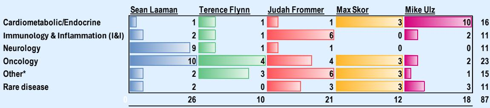

bar chart

| Category | Sean Laaman | Terence Flynn | Judah Frommer | Max Skor | Mike Ulz |
| :--- | :--- | :--- | :--- | :--- | :--- |
| Cardiometabolic/Endocrine | 1 | 3 | 1 | 3 | 10 |
| Immunology & Inflammation (I&I) | 2 | 3 | 1 | 6 | 2 |
| Neurology | 9 | 3 | 1 | 1 | 0 |
| Oncology | 10 | 4 | 21 | 4 | 3 |
| Other* | 2 | 3 | 21 | 6 | 3 |
| Rare disease | 2 | 0 | 10 | 3 | 3 |
| Total | 87 | 26 | 10 | 12 | 18 |

<table><tr><td>Cardiometabolic /Endocrine</td><td>Immunology &amp; Inflammation (I&amp;I)</td><td>Neurology</td><td>Oncology</td><td>Other*</td><td>Rare Disease</td></tr><tr><td>AARD</td><td>ABVX</td><td>ACAD</td><td>ADAG</td><td>ABSI</td><td>ASND</td></tr><tr><td>ALNY</td><td>ALMS</td><td>ALEC</td><td>ARVN</td><td>AGMB</td><td>BMRN</td></tr><tr><td>ARWR</td><td>ARGX</td><td>AXSM</td><td>BBOT</td><td>AVLN</td><td>DYN</td></tr><tr><td>BBIO</td><td>ARQT</td><td>BHVN</td><td>BCAX</td><td>AVIR</td><td>IMMX</td></tr><tr><td>BIOA</td><td>CABA</td><td>CMPS</td><td>BCYC</td><td>BLTE</td><td>MIRM</td></tr><tr><td>CRNX</td><td>CLDX</td><td>CNTA</td><td>CGEM</td><td>CRSP</td><td>PHVS</td></tr><tr><td>CYTK</td><td>EVMN</td><td>CTNM</td><td>CGON</td><td>FDMT</td><td>PTCT</td></tr><tr><td>GPCR</td><td>GENB</td><td>DNLI</td><td>E IKN</td><td>LKFT</td><td>RARE</td></tr><tr><td>GUTS</td><td>KYMR</td><td>JAZZ</td><td>ENGN</td><td>INSM</td><td>RGNX</td></tr><tr><td>IONS</td><td>KYTX</td><td>MPLT</td><td>ERAS</td><td>IRON</td><td>RXRX</td></tr><tr><td>PROK</td><td>ZBIO</td><td>NBIX</td><td>EXEL</td><td>MNPR</td><td>SRPT</td></tr><tr><td>RCKT</td><td></td><td></td><td>GMAB</td><td>NTLA</td><td></td></tr><tr><td>RYTM</td><td></td><td></td><td>HALO</td><td>PRME</td><td></td></tr><tr><td>SANA</td><td></td><td></td><td>IMCR</td><td>SLN</td><td></td></tr><tr><td>TNYA</td><td></td><td></td><td>INCY</td><td>TRVI</td><td></td></tr><tr><td>VKTX</td><td></td><td></td><td>LEGN</td><td></td><td></td></tr><tr><td></td><td></td><td></td><td>NRIX</td><td></td><td></td></tr><tr><td></td><td></td><td></td><td>ONC</td><td></td><td></td></tr><tr><td></td><td></td><td></td><td>RCUS</td><td></td><td></td></tr><tr><td></td><td></td><td></td><td>SDGR</td><td></td><td></td></tr><tr><td></td><td></td><td></td><td>TCRX</td><td></td><td></td></tr><tr><td></td><td></td><td></td><td>VIR</td><td></td><td></td></tr><tr><td></td><td></td><td></td><td>ZNTL</td><td></td><td></td></tr></table>

Note: Other includes dermatology, genetics, hematology, infectious disease, ophthalmology, pulmonology disease focuses.

## Disclosures

## Disclosure section

MS is acting as a financial advisor to Eli Lilly and Company (“Lilly”) in relation to their definitive agreement to acquire Centessa Pharmaceuticals, plc (“Centessa”), as announced on March 31, 2026. The transaction is subject to approval by Centessa stockholders, sanction by the High Court of Justice of England and Wales and satisfaction of other customary closing conditions, including regulatory approvals. This report and the information provided herein is not intended to (i) provide voting advice, (ii) serve as an endorsement of the proposed transaction, or (iii) result in the procurement, withholding or revocation of a proxy or any other action by a security holder. Lilly has agreed to pay fees to MS for its financial services, including transaction fees that are contingent upon the consummation of the transaction. Please refer to the notes at the end of the report.

MS is acting as financial advisor to Galapagos NV in relation to its binding agreement with Gilead Sciences following Gilead's definitive agreement to acquire all of the outstanding equity interests of Ouro Medicines, as announced on March 31, 2026. The proposed transaction is subject to customary closing conditions. Galapagos NV may pay fees to MS for its financial services, including transaction fees that are contingent upon the consummation of the proposed transaction. Please refer to the notes at the end of this report.

MS is acting as financial advisor to Organon & Co. (“Organon”) in relation to a definitive agreement to be acquired by Sun Pharmaceutical Industries Limited, as announced on April 26, 2026. The transaction is subject to customary closing conditions, including receipt of required regulatory approvals and approval by Organon stockholders. This report and the information provided herein is not intended to (i) provide voting advice, (ii) serve as an endorsement of the proposed transaction, or (iii) result in the procurement, withholding or revocation of a proxy or any other action by a security holder. Organon has agreed to pay fees to MS for its financial services. Please refer to the notes at the end of this report.

## Disclosure section

The information and opinions in MS were prepared by MS & Co. LLC, and/or MS C.T.V.M. S.A., and/or MS Mexico, Casa de Bolsa, S.A. de C.V., and/or MS Canada Limited. As used in this disclosure section, "MS" includes MS & Co. LLC, MS C.T.V.M. S.A., MS Mexico, Casa de Bolsa, S.A. de C.V., MS Canada Limited and their affiliates as necessary.

For important disclosures, stock price charts and equity rating histories regarding companies that are the subject of this report, please see the MS Disclosure Website at www.morganstanley.com/eqr/disclosures/webapp/generalresearch, or contact your investment representative or MS at 1585 Broadway, (Attention: Research Management), New York, NY, 10036 USA.

For valuation methodology and risks associated with any recommendation, rating or price target referenced in this research report, please contact the Client Support Team as follows: US/Canada +1 800 303-2495; Hong Kong +852 2848-5999; Latin America +1 718 754-5444 (U.S.); London +44 (0)20-7425-8169; Singapore +65 6834-6860; Sydney +61 (0)2-9770-1505; Tokyo +81 (0)3-6836-9000. Alternatively you may contact your investment representative or MS at 1585 Broadway, (Attention: Research Management), New York, NY 10036 USA.

## Analyst Certification

The following analysts hereby certify that their views about the companies and their securities discussed in this report are accurately expressed and that they have not received and will not receive direct or indirect compensation in exchange for expressing specific recommendations or views in this report: Terence C Flynn, Ph.D.; Judah C. Frommer, CFA; Sean Laaman, Ph.D.; Maxwell Skor; Michael E Ulz.

## Global Research Conflict Management Policy

MS has been published in accordance with our conflict management policy, which is available at www.morganstanley.com/institutional/research/conflictpolicies. A Portuguese version of the policy can be found at www.morganstanley.com.br

## Important Regulatory Disclosures on Subject Companies

As of May 29, 2026, MS beneficially owned 1% or more of a class of common equity securities of the following companies covered in MS: 4D Molecular Therapeutics Inc, Abivax, Acadia Pharmaceuticals Inc, Alnylam Pharmaceuticals Inc, Amgen Inc., Arcutis Biotherapeutics, Inc., argenx SE, Arvinas Inc, Ascendis Pharma A/S, Atea Pharmaceuticals Inc, Axsome Therapeutics, Belite Bio Inc, BeOne Medicines, Bicycle Therapeutics Plc, Biogen Inc, BridgeBio Pharma Inc, Centessa Pharmaceuticals, Inc, CG Oncology, Compass Pathways PLC, Crinetics Pharmaceuticals, CRISPR Therapeutics AG, Cytokinetics Inc, Exelixis Inc., Genmab A/S, Gilead Sciences Inc., Halozyme Therapeutics, Inc, Immunocore Holdings Ltd, Incyte Corp, Intellia Therapeutics Inc, Kyverna Therapeutics, Lakefront Biotherapeutics, Legend Biotech Corp, Mirum Pharmaceuticals, Moderna Inc, Neurocrine Biosciences Inc, Nurix Therapeutics Inc., ProKidney Corp, PTC Therapeutics, Regeneron Pharmaceuticals Inc., Regenxbio Inc, Rhythm Pharmaceuticals Inc, Rocket Pharmaceuticals Inc, Sarepta Therapeutics Inc, Schrodinger Inc., Structure Therapeutics Inc, United Therapeutics Corp, Vertex Pharmaceuticals, Viking Therapeutics Inc, Vir Biotechnology Inc.

Within the last 12 months, MS managed or co-managed a public offering (or 144A offering) of securities of ABSCI CORP, AgomAb Therapeutics NV, Alnylam Pharmaceuticals Inc, Alumis Inc., Amgen Inc., Avalyn Pharma Inc, Belite Bio Inc, Bicara Therapeutics, Biomarin Pharmaceutical Inc, Cytokinetics Inc, Denali Therapeutics Inc, Disc Medicine Inc, Dyne Therapeutics Inc, Eikon Therapeutics Inc, Erasca, Inc., Evommune Inc, Generate Biomedicines Inc, Genmab A/S, Gilead Sciences Inc., Halozyme Therapeutics, Inc, Immix Biopharma, Ionis Pharmaceuticals Inc, Kalaris Therapeutics, Kymera Therapeutics Inc, Kyverna Therapeutics, MapLight Therapeutics, Mirum Pharmaceuticals, Monopar Therapeutics, Pharvaris N.V., Rhythm Pharmaceuticals Inc, Sana Biotechnology, Inc, Structure Therapeutics Inc, Trevi Therapeutics Inc, Vertex Pharmaceuticals.

## Disclosure section (cont.)

Within the last 12 months, MS has received compensation for investment banking services from AgomAb Therapeutics NV, Alnylam Pharmaceuticals Inc, Alumis Inc., Amgen Inc., Avalyn Pharma Inc, Belite Bio Inc, BeOne Medicines, Bicara Therapeutics, Biomarin Pharmaceutical Inc, Cytokinetics Inc, Denali Therapeutics Inc, Disc Medicine Inc, Dyne Therapeutics Inc, Eikon Therapeutics Inc, Erasca, Inc., Evommune Inc, Generate Biomedicines Inc, Genmab A/S, Gilead Sciences Inc., Halozyme Therapeutics, Inc, Immix Biopharma, Ionis Pharmaceuticals Inc, Kalaris Therapeutics, Kymera Therapeutics Inc, Kyverna Therapeutics, Lakefront Biotherapeutics, Legend Biotech Corp, MapLight Therapeutics, Mirum Pharmaceuticals, Monopar Therapeutics, Pharvaris N.V., Rhythm Pharmaceuticals Inc, Sana Biotechnology, Inc, Structure Therapeutics Inc, Trevi Therapeutics Inc.

In the next 3 months, MS expects to receive or intends to seek compensation for investment banking services from 4D Molecular Therapeutics Inc, Aardvark Therapeutics Inc., Abivax, ABSCI CORP, Acadia Pharmaceuticals Inc, Adagene Inc., AgomAb Therapeutics NV, Alector Inc, Alnylam Pharmaceuticals Inc, Alumis Inc., Amgen Inc., Arcus Biosciences Inc., Arcutis Biotherapeutics, Inc., argenx SE, Arrowhead Pharmaceuticals Inc, Arvinas Inc, Ascendis Pharma A/S, Atea Pharmaceuticals Inc, Avalyn Pharma Inc, Axsome Therapeutics, Belite Bio Inc, BeOne Medicines, Bicara Therapeutics, BioAge Labs Inc, Biogen Inc, Biohaven Ltd, Biomarin Pharmaceutical Inc, BioNTech SE, BridgeBio Oncology Therapeutics, BridgeBio Pharma Inc, Cabaletta Bio Inc, Centessa Pharmaceuticals, Inc, CG Oncology, Compass Pathways PLC, Contineum Therapeutics, Crinetics Pharmaceuticals, CRISPR Therapeutics AG, Cullinan Therapeutics, Cytokinetics Inc, Denali Therapeutics Inc, Disc Medicine Inc, Dyne Therapeutics Inc, Eikon Therapeutics Inc, Erasca, Inc., Evommune Inc, Exelixis Inc., Fractyl Health Inc, Generate Biomedicines Inc, Genmab A/S, Gilead Sciences Inc., Halozyme Therapeutics, Inc, Immix Biopharma, Immunocore Holdings Ltd, Incyte Corp, Insmed Inc, Ionis Pharmaceuticals Inc, Kalaris Therapeutics, Kymera Therapeutics Inc, Kyverna Therapeutics, Lakefront Biotherapeutics, Legend Biotech Corp, MapLight Therapeutics, Mirum Pharmaceuticals, Moderna Inc, Monopar Therapeutics, Neurocrine Biosciences Inc, Nurix Therapeutics Inc., Pharvaris N.V., Prime Medicine Inc, ProKidney Corp, PTC Therapeutics, Recursion Pharmaceuticals Inc, Regeneron Pharmaceuticals Inc., Regenxbio Inc, Rhythm Pharmaceuticals Inc, Rocket Pharmaceuticals Inc, Sana Biotechnology, Inc, Sarepta Therapeutics Inc, Schrodinger Inc., Silence Therapeutics Plc, Structure Therapeutics Inc, Tenaya Therapeutics Inc, Trevi Therapeutics Inc, Tscan Therapeutics Inc, Ultragenyx Pharmaceutical Inc, Vertex Pharmaceuticals, Viking Therapeutics Inc, Vir Biotechnology Inc, Zenas Biopharma Inc, Zentalis Pharmaceuticals Inc.

Within the last 12 months, MS has received compensation for products and services other than investment banking services from Amgen Inc., Biogen Inc, Genmab A/S, Gilead Sciences Inc., Halozyme Therapeutics, Inc, Moderna Inc.

Within the last 12 months, MS has provided or is providing investment banking services to, or has an investment banking client relationship with, the following company: 4D Molecular Therapeutics Inc, Aardvark Therapeutics Inc., Abivax, ABSCI CORP, Acadia Pharmaceuticals Inc, Adagene Inc., AgomAb Therapeutics NV, Alector Inc, Alnylam Pharmaceuticals Inc, Alumis Inc., Amgen Inc., Arcus Biosciences Inc., Arcutis Biotherapeutics, Inc., argenx SE, Arrowhead Pharmaceuticals Inc, Arvinas Inc, Ascendis Pharma A/S, Atea Pharmaceuticals Inc, Avalyn Pharma Inc, Axsome Therapeutics, Belite Bio Inc, BeOne Medicines, Bicara Therapeutics, BioAge Labs Inc, Biogen Inc, Biohaven Ltd, Biomarin Pharmaceutical Inc, BioNTech SE, BridgeBio Oncology Therapeutics, BridgeBio Pharma Inc, Cabaletta Bio Inc, Centessa Pharmaceuticals, Inc, CG Oncology, Compass Pathways PLC, Contineum Therapeutics, Crinetics Pharmaceuticals, CRISPR Therapeutics AG, Cullinan Therapeutics, Cytokinetics Inc, Denali Therapeutics Inc, Disc Medicine Inc, Dyne Therapeutics Inc, Eikon Therapeutics Inc, Erasca, Inc., Evommune Inc, Exelixis Inc., Fractyl Health Inc, Generate Biomedicines Inc, Genmab A/S, Gilead Sciences Inc., Halozyme Therapeutics, Inc, Immix Biopharma, Immunocore Holdings Ltd, Incyte Corp, Insmed Inc, Ionis Pharmaceuticals Inc, Kalaris Therapeutics, Kymera Therapeutics Inc, Kyverna Therapeutics, Lakefront Biotherapeutics, Legend Biotech Corp, MapLight Therapeutics, Mirum Pharmaceuticals, Moderna Inc, Monopar Therapeutics, Neurocrine Biosciences Inc, Nurix Therapeutics Inc., Pharvaris N.V., Prime Medicine Inc, ProKidney Corp, PTC Therapeutics, Recursion Pharmaceuticals Inc, Regeneron Pharmaceuticals Inc., Regenxbio Inc, Rhythm Pharmaceuticals Inc, Rocket Pharmaceuticals Inc, Sana Biotechnology, Inc, Sarepta Therapeutics Inc, Schrodinger Inc., Silence Therapeutics Plc, Structure Therapeutics Inc, Tenaya Therapeutics Inc, Trevi Therapeutics Inc, Tscan Therapeutics Inc, Ultragenyx Pharmaceutical Inc, Vertex Pharmaceuticals, Viking Therapeutics Inc, Vir Biotechnology Inc, Zenas Biopharma Inc, Zentalis Pharmaceuticals Inc.

## Disclosure section (cont.)

Within the last 12 months, MS has either provided or is providing non-investment banking, securities-related services to and/or in the past has entered into an agreement to provide services or has a client relationship with the following company: Alnylam Pharmaceuticals Inc, Amgen Inc., Biogen Inc, BioNTech SE, Genmab A/S, Gilead Sciences Inc., Halozyme Therapeutics, Inc, Moderna Inc, Vertex Pharmaceuticals.

MS & Co. LLC makes a market in the securities of 4D Molecular Therapeutics Inc, ABSCI CORP, Acadia Pharmaceuticals Inc, Alector Inc, Arcus Biosciences Inc., Arcutis Biotherapeutics, Inc., Arrowhead Pharmaceuticals Inc, Arvinas Inc, Avalyn Pharma Inc, Axsome Therapeutics, Belite Bio Inc, Bicara Therapeutics, Bicycle Therapeutics Plc, BioAge Labs Inc, Biohaven Ltd, BridgeBio Oncology Therapeutics, Celldex Therapeutics Inc, Centessa Pharmaceuticals, Inc, CG Oncology, Compass Pathways PLC, Crinetics Pharmaceuticals, Cullinan Therapeutics, Denali Therapeutics Inc, Disc Medicine Inc, Dyne Therapeutics Inc, Generate Biomedicines Inc, Immunocore Holdings Ltd, Intellia Therapeutics Inc, Kalaris Therapeutics, Kymera Therapeutics Inc, Kyverna Therapeutics, MapLight Therapeutics, Mirum Pharmaceuticals, Nurix Therapeutics Inc., Pharvaris N.V., PTC Therapeutics, Regeneron Pharmaceuticals Inc., Regenxbio Inc, Rhythm Pharmaceuticals Inc, Rocket Pharmaceuticals Inc, Sana Biotechnology, Inc, Schrodinger Inc., Silence Therapeutics Plc, Trevi Therapeutics Inc, Ultragenyx Pharmaceutical Inc, Vir Biotechnology Inc, Zenas Biopharma Inc, Zentalis Pharmaceuticals Inc.

The equity research analysts or strategists principally responsible for the preparation of MS have received compensation based upon various factors, including quality of research, investor client feedback, stock picking, competitive factors, firm revenues and overall investment banking revenues. Equity Research analysts' or strategists' compensation is not linked to investment banking or capital markets transactions performed by MS or the profitability or revenues of particular trading desks.

MS and its affiliates do business that relates to companies/instruments covered in MS, including market making, providing liquidity, fund management, commercial banking, extension of credit, investment services and investment banking. MS sells to and buys from customers the securities/instruments of companies covered in MS on a principal basis. MS may have a position in the debt of the Company or instruments discussed in this report. MS trades or may trade as principal in the debt securities (or in related derivatives) that are the subject of the debt research report.

Certain disclosures listed above are also for compliance with applicable regulations in non-US jurisdictions.

## STOCK RATINGS

MS uses a relative rating system using terms such as Overweight, Equal-weight, Not-Rated or Underweight (see definitions below). MS does not assign ratings of Buy, Hold or Sell to the stocks we cover. Overweight, Equal-weight, Not-Rated and Underweight are not the equivalent of buy, hold and sell. Investors should carefully read the definitions of all ratings used in MS. In addition, since MS contains more complete information concerning the analyst's views, investors should carefully read MS, in its entirety, and not infer the contents from the rating alone. In any case, ratings (or research) should not be used or relied upon as investment advice. An investor's decision to buy or sell a stock should depend on individual circumstances (such as the investor's existing holdings) and other considerations.

## Global Stock Ratings Distribution

(as of May 31, 2026)

The Stock Ratings described below apply to MS's Fundamental Equity Research and do not apply to Debt Research produced by the Firm.

For disclosure purposes only (in accordance with FINRA requirements), we include the category headings of Buy, Hold, and Sell alongside our ratings of Overweight, Equal-weight, Not-Rated and Underweight. MS does not assign ratings of Buy, Hold or Sell to the stocks we cover. Overweight, Equal-weight, Not-Rated and Underweight are not the

## Disclosure section (cont.)

equivalent of buy, hold, and sell but represent recommended relative weightings (see definitions below). To satisfy regulatory requirements, we correspond Overweight, our most positive stock rating, with a buy recommendation; we correspond Equal-weight and Not-Rated to hold and Underweight to sell recommendations, respectively.

<table><tr><td rowspan="2">STOCK RATING CATEGORY</td><td colspan="2">COVERAGE UNIVERSE</td><td colspan="3">INVESTMENT BANKING CLIENTS (IBC)</td><td colspan="2">OTHER MATERIAL INVESTMENT SERVICES CLIENTS (MISC)</td></tr><tr><td>COUNT</td><td>% OF TOTAL</td><td>COUNT</td><td>% OF TOTAL IBC</td><td>% OF RATING CATEGORY</td><td>COUNT</td><td>% OF TOTAL OTHER MISC</td></tr><tr><td>Overweight/Buy</td><td>1542</td><td>42%</td><td>465</td><td>51%</td><td>30%</td><td>707</td><td>43%</td></tr><tr><td>Equal-weight/Hold</td><td>1571</td><td>43%</td><td>369</td><td>40%</td><td>23%</td><td>723</td><td>44%</td></tr><tr><td>Not-Rated/Hold</td><td>3</td><td>0%</td><td>0</td><td>0%</td><td>0%</td><td>1</td><td>0%</td></tr><tr><td>Underweight/Sell</td><td>551</td><td>15%</td><td>86</td><td>9%</td><td>16%</td><td>201</td><td>12%</td></tr><tr><td>TOTAL</td><td>3,667</td><td></td><td>920</td><td></td><td></td><td>1632</td><td></td></tr></table>

Data include common stock and ADRs currently assigned ratings. Investment Banking Clients are companies from whom MS received investment banking compensation in the last 12 months. Due to rounding off of decimals, the percentages provided in the "% of total" column may not add up to exactly 100 percent.

## Analyst Stock Ratings

Overweight (O). The stock's total return is expected to exceed the average total return of the analyst's industry (or industry team's) coverage universe, on a risk-adjusted basis, over the next 12-18 months.

Equal-weight (E). The stock's total return is expected to be in line with the average total return of the analyst's industry (or industry team's) coverage universe, on a risk-adjusted basis, over the next 12-18 months.

Not-Rated (NR). Currently the analyst does not have adequate conviction about the stock's total return relative to the average total return of the analyst's industry (or industry team's) coverage universe, on a risk-adjusted basis, over the next 12-18 months.

Underweight (U). The stock's total return is expected to be below the average total return of the analyst's industry (or industry team's) coverage universe, on a risk-adjusted basis, over the next 12-18 months.

Unless otherwise specified, the time frame for price targets included in MS is 12 to 18 months.

## Analyst Industry Views

Attractive (A): The analyst expects the performance of his or her industry coverage universe over the next 12-18 months to be attractive vs. the relevant broad market benchmark, as indicated below.

## Disclosure section (cont.)

In-Line (I): The analyst expects the performance of his or her industry coverage universe over the next 12-18 months to be in line with the relevant broad market benchmark, as indicated below.

Cautious (C): The analyst views the performance of his or her industry coverage universe over the next 12-18 months with caution vs. the relevant broad market benchmark, as indicated below.

Benchmarks for each region are as follows: North America - S&P 500; Latin America - relevant MSCI country index or MSCI Latin America Index; Europe - MSCI Europe; Japan - TOPIX; Asia - relevant MSCI country index or MSCI sub-regional index or MSCI AC Asia Pacific ex Japan Index.

## Important Disclosures for MS Smith Barney LLC Customers

Important disclosures regarding any material conflict of interest that can reasonably be expected to have influenced MS Smith Barney LLC's choice of a third-party research provider or the subject company of a third-party research report, are available on the MS Wealth Management disclosure website at www.morganstanley.com/online/researchdisclosures. For MS specific disclosures, you may refer to https://www.morganstanley.com/eqr/disclosures/webapp/generalresearch.

Each MS report is reviewed and approved on behalf of MS Smith Barney LLC. This review and approval is conducted by the same person who reviews the research report on behalf of MS. This could create a conflict of interest.

## Other Important Disclosures

MS policy is to update research reports as and when the Research Analyst and Research Management deem appropriate, based on developments with the issuer, the sector, or the market that may have a material impact on the research views or opinions stated therein. In addition, certain Research publications are intended to be updated on a regular periodic basis (weekly/monthly/quarterly/annual) and will ordinarily be updated with that frequency, unless the Research Analyst and Research Management determine that a different publication schedule is appropriate based on current conditions.

MS is not acting as a municipal advisor and the opinions or views contained herein are not intended to be, and do not constitute, advice within the meaning of Section 975 of the Dodd-Frank Wall Street Reform and Consumer Protection Act.

MS produces an equity research product called a "Tactical Idea." Views contained in a "Tactical Idea" on a particular stock may be contrary to the recommendations or views expressed in research on the same stock. This may be the result of differing time horizons, methodologies, market events, or other factors. For all research available on a particular stock, please contact your sales representative or go to Matrix at http://www.morganstanley.com/matrix.

MS is provided to our clients through our proprietary research portal on Matrix and also distributed electronically by MS to clients. Certain, but not all, MS products are also made available to clients through third-party vendors or redistributed to clients through alternate electronic means as a convenience. For access to all available MS, please contact your sales representative or go to Matrix at http://www.morganstanley.com/matrix.

Any access and/or use of MS is subject to MS's Terms of Use (http://www.morganstanley.com/terms.html). By accessing and/or using MS, you are indicating that you have read and agree to be bound by our Terms of Use (http://www.morganstanley.com/terms.html). In addition you consent to MS processing your personal data and using cookies in accordance with our Privacy Policy and our Global Cookies Policy (http://www.morganstanley.com/privacy\_pledge.html), including for the purposes of setting your preferences and to collect readership data so that we can deliver better and more personalized service and products to you. To find out

## Disclosure section (cont.)

more information about how MS processes personal data, how we use cookies and how to reject cookies see our Privacy Policy and our Global Cookies Policy (http://www.morganstanley.com/privacy\_pledge.html). Please use the provided link to review the Terms and Conditions and Most Important Terms and Conditions for MS India Company Private Limited (https://www.morganstanley.com/assets/pdfs/about-us-global-offices/india/Terms\_and\_conditions.pdf) and the following link to review the audit report (https://ny.matrix.ms.com/eqr/research/webapp/researchdocs/MSICPL\_Morgan\_Stanley\_Research\_Audit\_Report.pdf).

If you do not agree to our Terms of Use and/or if you do not wish to provide your consent to MS processing your personal data or using cookies please do not access our research.

MS does not provide individually tailored investment advice. MS has been prepared without regard to the circumstances and objectives of those who receive it. MS recommends that investors independently evaluate particular investments and strategies, and encourages investors to seek the advice of a financial adviser. The appropriateness of an investment or strategy will depend on an investor's circumstances and objectives. The securities, instruments, or strategies discussed in MS may not be suitable for all investors, and certain investors may not be eligible to purchase or participate in some or all of them. MS is not an offer to buy or sell or the solicitation of an offer to buy or sell any security/instrument or to participate in any particular trading strategy. The value of and income from your investments may vary because of changes in interest rates, foreign exchange rates, default rates, prepayment rates, securities/instruments prices, market indexes, operational or financial conditions of companies or other factors. There may be time limitations on the exercise of options or other rights in securities/instruments transactions. Past performance is not necessarily a guide to future performance. Estimates of future performance are based on assumptions that may not be realized. If provided, and unless otherwise stated, the closing price on the cover page is that of the primary exchange for the subject company's securities/instruments.

The fixed income research analysts, strategists or economists principally responsible for the preparation of MS have received compensation based upon various factors, including quality, accuracy and value of research, firm profitability or revenues (which include fixed income trading and capital markets profitability or revenues), client feedback and competitive factors. Fixed Income Research analysts', strategists' or economists' compensation is not linked to investment banking or capital markets transactions performed by MS or the profitability or revenues of particular trading desks.

The "Important Regulatory Disclosures on Subject Companies" section in MS lists all companies mentioned where MS owns 1% or more of a class of common equity securities of the companies. For all other companies mentioned in MS, MS may have an investment of less than 1% in securities/instruments or derivatives of securities/instruments of companies and may trade them in ways different from those discussed in MS. Employees of MS not involved in the preparation of MS may have investments in securities/instruments or derivatives of securities/instruments of companies mentioned and may trade them in ways different from those discussed in MS. Derivatives may be issued by MS or associated persons.

With the exception of information regarding MS, MS is based on public information. MS makes every effort to use reliable, comprehensive information, but we make no representation that it is accurate or complete. We have no obligation to tell you when opinions or information in MS change apart from when we intend to discontinue equity research coverage of a subject company. Facts and views presented in MS have not been reviewed by, and may not reflect information known to, professionals in other MS business areas, including investment banking personnel.

MS personnel may participate in company events such as site visits and are generally prohibited from accepting payment by the company of associated expenses unless pre-approved by authorized members of Research management.

MS may make investment decisions that are inconsistent with the recommendations or views in this report.

## Disclosure section (cont.)

To our readers based in Taiwan or trading in Taiwan securities/instruments: Information on securities/instruments that trade in Taiwan is distributed by MS Taiwan Limited ("MSTL"). Such information is for your reference only. The reader should independently evaluate the investment risks and is solely responsible for their investment decisions. MS may not be distributed to the public media or quoted or used by the public media without the express written consent of MS. Any non-customer reader within the scope of Article 7-1 of the Taiwan Stock Exchange Recommendation Regulations accessing and/or receiving MS is not permitted to provide MS to any third party (including but not limited to related parties, affiliated companies and any other third parties) or engage in any activities regarding MS which may create or give the appearance of creating a conflict of interest. Information on securities/instruments that do not trade in Taiwan is for informational purposes only and is not to be construed as a recommendation or a solicitation to trade in such securities/instruments. MSTL may not execute transactions for clients in these securities/instruments.

MS is not incorporated under PRC law and the research in relation to this report is conducted outside the PRC. MS does not constitute an offer to sell or the solicitation of an offer to buy any securities in the PRC. PRC investors shall have the relevant qualifications to invest in such securities and shall be responsible for obtaining all relevant approvals, licenses, verifications and/or registrations from the relevant governmental authorities themselves. Neither this report nor any part of it is intended as, or shall constitute, provision of any consultancy or advisory service of securities investment as defined under PRC law. Such information is provided for your reference only.

MS is disseminated in Brazil by MS C.T.V.M. S.A. located at Av. Brigadeiro Faria Lima, 3600, 6th floor, São Paulo - SP, Brazil; and is regulated by the Comissão de Valores Mobiliários; in Mexico by MS México, Casa de Bolsa, S.A. de C.V which is regulated by Comision Nacional Bancaria y de Valores. Paseo de los Tamarindos 90, Torre 1, Col. Bosques de las Lomas Floor 29, 05120 Mexico City; in Japan by MS MUFG Securities Co., Ltd. and, for Commodities related research reports only, MS Capital Group Japan Co., Ltd; in Hong Kong by MS Asia Limited (which accepts responsibility for its contents) and by MS Bank Asia Limited; in Singapore by MS Asia (Singapore) Pte. (Registration number 199206298Z) and/or MS Asia (Singapore) Securities Pte Ltd (Registration number 200008434H), regulated by the Monetary Authority of Singapore (which accepts legal responsibility for its contents and should be contacted with respect to any matters arising from, or in connection with, MS) and by MS Bank Asia Limited, Singapore Branch (Registration number T14FC0118J); in Australia to "wholesale clients" within the meaning of the Australian Corporations Act by MS Australia Limited A.B.N. 67 003 734 576, holder of Australian financial services license No. 233742, which accepts responsibility for its contents; in Australia to "wholesale clients" and "retail clients" within the meaning of the Australian Corporations Act by MS Wealth Management Australia Pty Ltd (A.B.N. 19 009 145 555, holder of Australian financial services license No. 240813, which accepts responsibility for its contents; in Korea by MS & Co International plc, Seoul Branch; in India by MS India Company Private Limited having Corporate Identification No (CIN) U22990MH1998PTC115305, regulated by the Securities and Exchange Board of India ("SEBI") and holder of licenses as a Research Analyst (SEBI Registration No. INH000001105); Stock Broker (SEBI Stock Broker Registration No. INZ000244438), Merchant Banker (SEBI Registration No. INM000011203), and depository participant with National Securities Depository Limited (SEBI Registration No. IN-DP-NSDL-567-2021) having registered office at Altimus, Level 39 & 40, Pandurang Budhkar Marg, Worli, Mumbai 400018, India; Telephone no. +91-22-61181000; Compliance Officer Details: Mr. Tejarshi Hardas, Tel. No.: +91-22-61181000 or Email: tejarshi.hardas@morganstanley.com; Grievance officer details: Mr. Tejarshi Hardas, Tel. No.: +91-22-61181000 or Email: msic-compliance@morganstanley.com. MS India Company Private Limited (MSICPL) may use AI tools in providing research services. All recommendations contained herein are made by the duly qualified research analysts; in Canada by MS Canada Limited; in Germany and the European Economic Area where required by MS Europe S.E., authorised and regulated by Bundesanstalt fuer Finanzdienstleistungsaufsicht (BaFin) under the reference number 149169; in the US by MS & Co. LLC, which accepts responsibility for its contents. MS & Co. International plc, authorized by the Prudential Regulation Authority and regulated by the Financial Conduct Authority and the Prudential Regulation Authority, disseminates in the UK research that it has prepared, and research which has been prepared by any of its affiliates, only to persons who (i) are investment professionals falling within Article 19(5) of the Financial Services and Markets Act 2000

## Disclosure section (cont.)

(Financial Promotion) Order 2005 (as amended, the "Order"); (ii) are persons who are high net worth entities falling within Article 49(2)(a) to (d) of the Order; or (iii) are persons to whom an invitation or inducement to engage in investment activity (within the meaning of section 21 of the Financial Services and Markets Act 2000, as amended) may otherwise lawfully be communicated or caused to be communicated. RMB MS Proprietary Limited is a member of the JSE Limited and A2X (Pty) Ltd. RMB MS Proprietary Limited is a joint venture owned equally by MS International Holdings Inc. and RMB Investment Advisory (Proprietary) Limited, which is wholly owned by FirstRand Limited. The information in MS is being disseminated by MS Saudi Arabia, regulated by the Capital Market Authority in the Kingdom of Saudi Arabia, and is directed at Sophisticated investors only.

MS Hong Kong Securities Limited is the liquidity provider/market maker for securities of BeOne Medicines listed on the Stock Exchange of Hong Kong Limited. An updated list can be found on HKEx website: http://www.hkex.com.hk.

The information in MS is being communicated by MS & Co. International plc (DIFC Branch), regulated by the Dubai Financial Services Authority (the DFSA) or by MS & Co. International plc (ADGM Branch), regulated by the Financial Services Regulatory Authority Abu Dhabi (the FSRA), and is directed at Professional Clients only, as defined by the DFSA or the FSRA, respectively. The financial products or financial services to which this research relates will only be made available to a customer who we are satisfied meets the regulatory criteria of a Professional Client. A distribution of the different MS Research ratings or recommendations, in percentage terms for Investments in each sector covered, is available upon request from your sales representative.

The information in MS is being communicated by MS & Co. International plc (QFC Branch), regulated by the Qatar Financial Centre Regulatory Authority (the QFCRA), and is directed at business customers and market counterparties only and is not intended for Retail Customers as defined by the QFCRA.

As required by the Capital Markets Board of Turkey, investment information, comments and recommendations stated here, are not within the scope of investment advisory activity. Investment advisory service is provided exclusively to persons based on their risk and income preferences by the authorized firms. Comments and recommendations stated here are general in nature. These opinions may not fit to your financial status, risk and return preferences. For this reason, to make an investment decision by relying solely to this information stated here may not bring about outcomes that fit your expectations.

The trademarks and service marks contained in MS are the property of their respective owners. Third-party data providers make no warranties or representations relating to the accuracy, completeness, or timeliness of the data they provide and shall not have liability for any damages relating to such data. The Global Industry Classification Standard (GICS) was developed by and is the exclusive property of MSCI and S&P.

MS, or any portion thereof may not be reprinted, sold or redistributed without the written consent of MS.

Indicators and trackers referenced in MS may not be used as, or treated as, a benchmark under Regulation EU 2016/1011, or any other similar framework.

The issuers and/or fixed income products recommended or discussed in certain fixed income research reports may not be continuously followed. Accordingly, investors should regard those fixed income research reports as providing stand-alone analysis and should not expect continuing analysis or additional reports relating to such issuers and/or individual fixed income products.

MS may hold, from time to time, material financial and commercial interests regarding the company subject to the Research report.

Registration granted by SEBI and certification from the National Institute of Securities Markets (NISM) in no way guarantee performance of the intermediary or provide any assurance of returns to investors. Investment in securities market are subject to market risks. Read all the related documents carefully before investing.

## Disclosure section (cont.)

INDUSTRY COVERAGE: Biotechnology

<table><tr><td>COMPANY (TICKER)</td><td>RATING (AS OF)</td><td>PRICE* (06/11/2026)</td></tr><tr><td colspan="3">Judah C. Frommer, CFA</td></tr><tr><td>4D Molecular Therapeutics Inc (FDMT.O)</td><td>E (11/06/2025)</td><td>$8.84</td></tr><tr><td>Abivax (ABVX.O)</td><td>O (07/23/2025)</td><td>$100.87</td></tr><tr><td>AgomAb Therapeutics NV (AGMB.O)</td><td>O (03/03/2026)</td><td>$9.88</td></tr><tr><td>Arcutis Biotherapeutics, Inc. (ARQT.O)</td><td>O (07/02/2025)</td><td>$24.59</td></tr><tr><td>Avalyn Pharma Inc (AVLN.O)</td><td>O (05/25/2026)</td><td>$28.07</td></tr><tr><td>Belite Bio Inc (BLTE.O)</td><td>O (01/06/2026)</td><td>$136.85</td></tr><tr><td>Bicara Therapeutics (BCAX.O)</td><td>O (10/08/2024)</td><td>$21.28</td></tr><tr><td>Celldex Therapeutics Inc (CLDX.O)</td><td>O (03/20/2025)</td><td>$29.96</td></tr><tr><td>Compass Pathways PLC (CMPS.O)</td><td>O (08/08/2025)</td><td>$11.41</td></tr><tr><td>enGene Holdings Inc. (ENGN.O)</td><td>E (05/07/2026)</td><td>$1.64</td></tr><tr><td>Evommune Inc (EVMN.N)</td><td>O (12/01/2025)</td><td>$20.69</td></tr><tr><td>Genmab A/S (GMAB.O)</td><td>E (02/16/2026)</td><td>$25.24</td></tr><tr><td>Immix Biopharma (IMMX.O)</td><td>O (03/25/2026)</td><td>$8.10</td></tr><tr><td>Incyte Corp (INCY.O)</td><td>E (07/02/2025)</td><td>$107.83</td></tr><tr><td>Kalaris Therapeutics (KLRS.O)</td><td>O (04/16/2026)</td><td>$4.36</td></tr><tr><td>Kymera Therapeutics Inc (KYMR.O)</td><td>O (07/02/2025)</td><td>$82.96</td></tr><tr><td>Lakefront Biotherapeutics (LKFT.O)</td><td></td><td>$28.94</td></tr><tr><td>ProKidney Corp (PROK.O)</td><td>E (11/10/2022)</td><td>$1.66</td></tr><tr><td>PTC Therapeutics (PTCT.O)</td><td>O (03/06/2025)</td><td>$74.71</td></tr><tr><td>Regenxbio Inc (RGNX.O)</td><td>O (11/15/2024)</td><td>$6.28</td></tr><tr><td>Trevi Therapeutics Inc (TRVI.O)</td><td>O (08/21/2025)</td><td>$13.46</td></tr><tr><td>Zenas Biopharma Inc (ZBIO.O)</td><td>E (01/05/2026)</td><td>$17.76</td></tr></table>

Maxwell Skor

<table><tr><td>Adagene Inc. (ADAG.O)</td><td>E (01/30/2025)</td><td>$3.58</td></tr><tr><td>Ascendis Pharma A/S (ASND.O)</td><td>O (05/05/2025)</td><td>$215.60</td></tr><tr><td>Atea Pharmaceuticals Inc (AVIR.O)</td><td>E (08/12/2024)</td><td>$4.36</td></tr><tr><td>Bicycle Therapeutics Plc (BCYC.O)</td><td>E (02/14/2022)</td><td>$4.10</td></tr><tr><td>Crinetics Pharmaceuticals (CRNX.O)</td><td>O (01/16/2024)</td><td>$33.53</td></tr><tr><td>CRISPR Therapeutics AG (CRSP.O)</td><td>E (06/11/2026)</td><td>$50.23</td></tr><tr><td>Cytokinetics Inc (CYTK.O)</td><td>O (02/13/2025)</td><td>$69.27</td></tr><tr><td>Insmed Inc (INSM.O)</td><td>O (03/30/2026)</td><td>$96.72</td></tr><tr><td>Monopar Therapeutics (MNPR.O)</td><td>O (01/09/2026)</td><td>$59.10</td></tr><tr><td>Pharvaris N.V. (PHVS.O)</td><td>O (08/15/2023)</td><td>$32.20</td></tr><tr><td>Sana Biotechnology, Inc (SANA.O)</td><td>O (03/01/2021)</td><td>$2.77</td></tr><tr><td>Tscan Therapeutics Inc (TCRX.O)</td><td>E (11/13/2025)</td><td>$0.92</td></tr><tr><td>Ultragenyx Pharmaceutical Inc (RARE.O)</td><td>O (03/27/2019)</td><td>$23.98</td></tr></table>

## Disclosure section (cont.)

Michael E Ulz

<table><tr><td>Aardvark Therapeutics Inc. (AARD.O)</td><td>U (05/15/2026)</td><td>$3.64</td></tr><tr><td>Alnylam Pharmaceuticals Inc (ALNY.O)</td><td>E (09/09/2022)</td><td>$289.39</td></tr><tr><td>Arrowhead Pharmaceuticals Inc (ARWR.O)</td><td>O (04/21/2026)</td><td>$74.41</td></tr><tr><td>BioAge Labs Inc (BIOA.O)</td><td>E (12/05/2025)</td><td>$16.45</td></tr><tr><td>Cabaletta Bio Inc (CABA.O)</td><td>O (01/27/2023)</td><td>$3.01</td></tr><tr><td>Dyne Therapeutics Inc (DYN.O)</td><td>O (04/30/2024)</td><td>$17.95</td></tr><tr><td>Fractyl Health Inc (GUTS.O)</td><td>E (01/29/2026)</td><td>$0.72</td></tr><tr><td>Ionis Pharmaceuticals Inc (IONS.O)</td><td>O (07/30/2025)</td><td>$73.82</td></tr><tr><td>Kyverna Therapeutics (KYTX.O)</td><td>O (03/04/2024)</td><td>$7.87</td></tr><tr><td>Mirum Pharmaceuticals (MIRM.O)</td><td>O (11/13/2023)</td><td>$99.54</td></tr><tr><td>Rhythm Pharmaceuticals Inc (RYTM.O)</td><td>O (12/19/2023)</td><td>$87.66</td></tr><tr><td>Rocket Pharmaceuticals Inc (RCKT.O)</td><td>E (05/27/2025)</td><td>$2.66</td></tr><tr><td>Sarepta Therapeutics Inc (SRPT.O)</td><td>E (06/16/2025)</td><td>$15.00</td></tr><tr><td>Silence Therapeutics Plc (SLN.O)</td><td>O (05/08/2023)</td><td>$6.68</td></tr><tr><td>Tenaya Therapeutics Inc (TNYA.O)</td><td>O (08/24/2021)</td><td>$0.72</td></tr><tr><td>Viking Therapeutics Inc (VKTX.O)</td><td>O (06/27/2024)</td><td>$28.61</td></tr><tr><td>Vir Biotechnology Inc (VIR.O)</td><td>O (01/08/2025)</td><td>$8.52</td></tr><tr><td>Zentalis Pharmaceuticals Inc (ZNTL.O)</td><td>E (06/18/2024)</td><td>$3.52</td></tr></table>

Sean Laaman, Ph.D.

<table><tr><td>ABSCI CORP (ABSI.O)</td><td>E (01/08/2026)</td><td>$6.51</td></tr><tr><td>Acadia Pharmaceuticals Inc (ACAD.O)</td><td>E (08/06/2024)</td><td>$21.39</td></tr><tr><td>Alector Inc (ALEC.O)</td><td>U (11/26/2024)</td><td>$1.57</td></tr><tr><td>argenx SE (ARGX.O)</td><td>O (07/02/2025)</td><td>$898.94</td></tr><tr><td>Axsome Therapeutics (AXSM.O)</td><td>E (01/08/2026)</td><td>$253.77</td></tr><tr><td>BeOne Medicines (ONC.O)</td><td>O (12/02/2024)</td><td>$260.27</td></tr><tr><td>Biomarin Pharmaceutical Inc (BMRN.O)</td><td>O (04/27/2026)</td><td>$55.54</td></tr><tr><td>BridgeBio Oncology Therapeutics (BBOT.O)</td><td>O (12/05/2025)</td><td>$7.46</td></tr><tr><td>BridgeBio Pharma Inc (BBIO.O)</td><td>O (01/06/2026)</td><td>$67.55</td></tr><tr><td>Centessa Pharmaceuticals, Inc (CNTA.O)</td><td>++</td><td>$39.77</td></tr><tr><td>CG Oncology (CGON.O)</td><td>O (02/19/2024)</td><td>$57.64</td></tr><tr><td>Contineum Therapeutics (CTNM.O)</td><td>E (01/08/2026)</td><td>$11.86</td></tr><tr><td>Cullinan Therapeutics (CGEM.O)</td><td>O (03/06/2025)</td><td>$12.98</td></tr><tr><td>Denali Therapeutics Inc (DNLI.O)</td><td>O (03/06/2025)</td><td>$21.02</td></tr><tr><td>Disc Medicine Inc (IRON.O)</td><td>O (11/04/2024)</td><td>$68.08</td></tr><tr><td>Eikon Therapeutics Inc (EIKN.O)</td><td>O (03/02/2026)</td><td>$8.52</td></tr><tr><td>Erasca, Inc. (ERAS.O)</td><td>E (08/17/2025)</td><td>$14.01</td></tr><tr><td>Exelixis Inc. (EXEL.O)</td><td>E (01/08/2026)</td><td>$53.50</td></tr><tr><td>Generate Biomedicines Inc (GENB.O)</td><td>O (03/24/2026)</td><td>$12.93</td></tr><tr><td>Halozyme Therapeutics, Inc (HALO.O)</td><td>O (08/05/2025)</td><td>$70.73</td></tr><tr><td>Immunocore Holdings Ltd (IMCR.O)</td><td>E (12/12/2024)</td><td>$28.62</td></tr><tr><td>MapLight Therapeutics (MPLT.O)</td><td>O (11/21/2025)</td><td>$30.35</td></tr><tr><td>Neurocrine Biosciences Inc (NBIX.O)</td><td>E (01/08/2026)</td><td>$162.71</td></tr><tr><td>Recursion Pharmaceuticals Inc (RXRX.O)</td><td>E (05/22/2023)</td><td>$3.15</td></tr><tr><td>Schrodinger Inc. (SDGR.O)</td><td>E (11/19/2021)</td><td>$14.60</td></tr></table>

## Disclosure section (cont.)

Terence C Flynn, Ph.D.

<table><tr><td>Alumis Inc. (ALMS.O)</td><td>O (05/30/2025)</td><td>$20.90</td></tr><tr><td>Amgen Inc. (AMGN.O)</td><td>E (10/16/2023)</td><td>$354.06</td></tr><tr><td>Arcus Biosciences Inc. (RCUS.N)</td><td>E (01/08/2026)</td><td>$23.30</td></tr><tr><td>Arvinas Inc (ARVN.O)</td><td>E (04/06/2022)</td><td>$7.09</td></tr><tr><td>Biogen Inc (BIIB.O)</td><td>E (10/31/2024)</td><td>$199.96</td></tr><tr><td>Biohaven Ltd (BHVN.N)</td><td>O (07/24/2024)</td><td>$11.37</td></tr><tr><td>BioNTech SE (BNTX.O)</td><td>O (09/23/2024)</td><td>$89.54</td></tr><tr><td>Gilead Sciences Inc. (GILD.O)</td><td>O (01/10/2025)</td><td>$125.87</td></tr><tr><td>Intellia Therapeutics Inc (NTLA.O)</td><td>E (01/26/2025)</td><td>$12.35</td></tr><tr><td>Legend Biotech Corp (LEGN.O)</td><td>O (01/31/2022)</td><td>$36.28</td></tr><tr><td>Moderna Inc (MRNA.O)</td><td>E (12/16/2020)</td><td>$49.64</td></tr><tr><td>Nurix Therapeutics Inc. (NRIX.O)</td><td>O (01/08/2026)</td><td>$16.98</td></tr><tr><td>Prime Medicine Inc (PRME.O)</td><td>E (11/14/2022)</td><td>$2.82</td></tr><tr><td>Regeneron Pharmaceuticals Inc. (REGN.O)</td><td>E (12/03/2025)</td><td>$611.48</td></tr><tr><td>Structure Therapeutics Inc (GPCR.O)</td><td>O (09/22/2024)</td><td>$43.30</td></tr><tr><td>United Therapeutics Corp (UTHR.O)</td><td>E (07/11/2024)</td><td>$545.40</td></tr><tr><td>Vertex Pharmaceuticals (VRTX.O)</td><td>O (12/03/2025)</td><td>$445.04</td></tr></table>

Stock Ratings are subject to change. Please see latest research for each company.  
\* Historical prices are not split adjusted.

## The Americas

1585 Broadway

New York, NY 10036-8293

United States

+1 212 761 4000

## Europe

20 Bank Street, Canary Wharf

London E14 4AD

United Kingdom

+44 (0)20 7425 8000

## Japan

1-9-7 Otemachi, Chiyoda-ku

Tokyo 100-8109

Japan

+81 (0) 3 6836 5000

## Asia/Pacific

1 Austin Road West

Kowloon

Hong Kong

+852 2848 5200