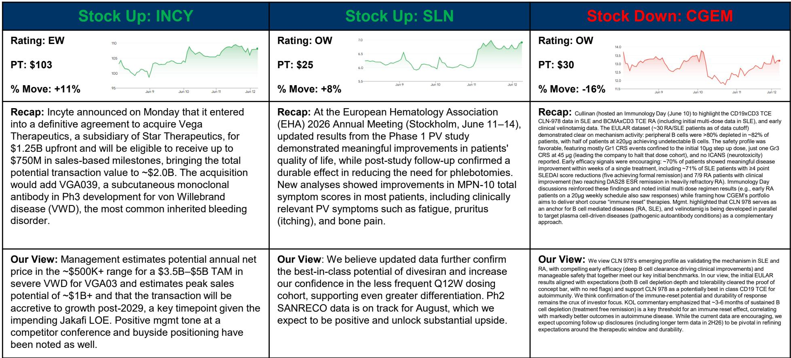
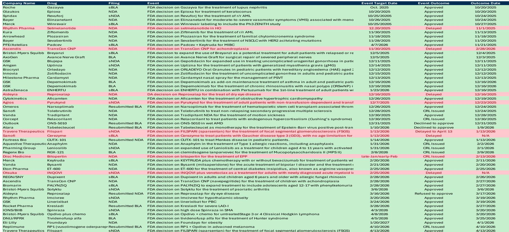
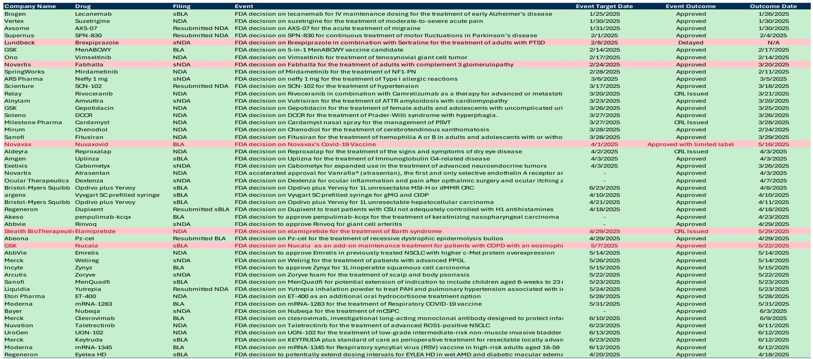

# 摩根斯坦利：生物科技并购不是脉冲，而是结构性的重新定价

这份报告来自摩根斯坦利SMID Cap生物科技团队的第65期周报。标题“Finger On The Pulse”暗示了团队对行业脉搏的持续追踪。在阅读完整份报告后，我们认为最值得提炼的判断不是某只股票的涨跌，而是：**并购正在从偶发事件变为系统性力量，而市场对2026年生物科技资产定价的逻辑，可能仍低估了这一结构性变化的深度。**

这份报告发布于2026年6月14日。此时，市场正处在一个微妙的窗口期：利率环境虽未大幅改善，但已趋于稳定；IPO市场在经历了2025年的极度低迷后，2026年年初至今的融资额已经超过了2025年全年；更重要的是，大型药企的并购动作正在加速。摩根斯坦利的团队没有简单地将这些信号归结为“市场回暖”，而是试图拆解这些现象背后真正驱动行业重新定价的力量。

以下是我们从这份报告中提炼出的四个关键层次，以及一个报告尚未完全回答的关键问题。

## 1. 2026年的并购不是在追赶潮流，而是在填补未来5年的产品线缺口

报告中最具冲击力的图表之一是“BioPharma M&A Deals Announced in 2025 - 2026”列表。短短一个多月内，GSK以106亿美元收购Nuvalent，Incyte以20亿美元收购Vega Therapeutics，Bayer以24.5亿美元收购Perfuse，再加上Eli Lilly在5月26日单日宣布的三笔收购。这些交易的密集程度，已经超出了简单的“行业整合”叙事。

摩根斯坦利团队在报告中给出了一个关键判断：并购是结构性的，而非偶发性的。这句话的分量在于，它指向了大药企正在面临的专利悬崖压力。以Incyte收购Vega Therapeutics为例，报告明确指出，这笔交易将在2029年后对Incyte的增长产生增值作用，而2029年正是其核心产品Jakafi面临专利到期的关键时间点。这不是一次战术性补强，而是战略性的管线重置。

更深一层的含义是，大型药企正在用资产负债表上的现金和低成本的融资，去购买那些经过初步临床验证、但尚未商业化的资产。这种行为模式的变化意味着，中小型生物科技公司的估值锚点正在从“能否独立上市”转向“能否成为大药企管线中的关键拼图”。对于投资者来说，这意味着评估一家SMID Cap生物科技公司的框架需要调整：不应只看其现金跑道和商业化能力，更要看其核心资产是否具备成为“大药企并购标的”的稀缺性和不可替代性。

## 2. IPO市场的回暖是真实的，但质量信号比数量信号更重要

报告中的IPO数据图表显示，2026年年初至今，生物科技IPO的总融资额已经达到35亿美元，超过了2025年全年的17亿美元。更值得注意的是，平均IPO融资额从2025年的1.9亿美元跃升至3.3亿美元。这是一个值得细读的信号。

摩根斯坦利团队在“Key Takeaway”中写道：“1Q26 has already seen IPO volumes surpass last year. Average IPO proceed is up meaningfully.” 这句话的潜台词是，市场正在重新向那些拥有更成熟数据、更大市场空间的资产敞开大门。2026年至今的10个IPO中，有7个处于临床二期、3个处于临床三期，没有一个是临床前或一期资产。这与2021年泡沫期大量临床前公司蜂拥上市形成了鲜明对比。

这种结构性变化意味着，投资者对生物科技的风险偏好正在修复，但修复的方向是“质量优先”。那些拥有清晰临床路径、明确监管路径和可观市场规模的资产，正在获得资本市场的溢价。而那些仍停留在概念验证阶段的资产，即便市场回暖，也未必能获得同等的融资机会。对于产业决策者而言，这个信号指向了一个更务实的策略：与其追求IPO的窗口期，不如先确保核心资产进入临床二期或三期，再考虑公开市场融资。

## 3. 免疫重置疗法的数据验证了机制，但持续性的验证才是定价的关键

报告在“Stock Down”部分详细分析了Cullinan Therapeutics（CGEM）在EULAR会议上公布的CD19xCD3 TCE药物CLN-978的数据。从数据本身来看，结果相当积极：约82%的患者外周B细胞清除率超过80%，约70%的患者在单次治疗后数周内出现有意义的疾病改善。然而，报告明确指出，市场对CGEM的反应是股价下跌16%。

摩根斯坦利团队给出了一个非常克制的判断：“We view CLN 978‘s emerging profile as validating the mechanism in SLE and RA... but confirmation of the immune-reset potential and durability of response remains the crux of investor focus.” 这里的关键词是“immune-reset potential”（免疫重置潜力）。KOL（关键意见领袖）的评论进一步揭示了市场的担忧：大约3-6个月的持续性B细胞清除，是实现免疫重置效应的关键阈值。而当前的数据尚无法证明这一点。

这个案例揭示了当前生物科技定价中的一个核心矛盾：机制验证（Proof of Mechanism）已经不再是推动股价上涨的充分条件，投资者正在要求更持久、更可重复的临床终点数据。对于任何一家处于类似阶段的公司来说，单次治疗后的短期应答已经不够，市场需要看到的是“治疗性停药后的持久缓解”。这个门槛的提高，正在重塑整个自身免疫疾病治疗领域的估值逻辑。

## 4. 利率环境正在从“逆风”转向“中性”，但商业化的质量才是真正的胜负手

报告在“Macroeconomic factors”部分以及“Rates up, commercial better”的注释中，暗示了一个被市场忽视的转变：利率上升对生物科技的影响正在从负面转向中性，甚至在某些细分领域转为正面。为什么？因为更高的利率环境正在加速低质量资产的出清，同时也迫使那些拥有真正商业价值资产的公司更早地证明其盈利能力。

摩根斯坦利团队在“Biotech Beat Series”的过往版本中已经多次讨论过利率对生物科技的影响。第64期甚至直接以“Rates are biting”为题。但在第65期中，团队的语调出现了微妙的变化。报告中的“Commercial better”部分暗示，在利率稳定的环境下，那些已经拥有商业化产品或接近商业化产品的公司，其估值逻辑正在从“未来现金流折现”转向“当期收入增长与利润率的平衡”。

这意味着，对于SMID Cap生物科技公司而言，商业化的质量——包括定价能力、市场准入、医生渗透率——正在成为比管线深度更重要的估值驱动因素。那些能够证明其产品正在被真实世界采用、并产生可重复收入的公司，将获得比同行更高的估值倍数。

## 报告尚未完全回答的关键问题：并购溢价能否持续，以及谁将是下一个被收购的目标？

尽管报告详细列举了近期的大型并购交易，但有一个关键变量没有被充分展开：这些并购交易的高溢价（例如GSK收购Nuvalent的溢价为40%，Chiesi收购KaVista的溢价也为40%）是否可持续？如果大药企的并购热情降温，或者资本市场对并购后的协同效应产生怀疑，那么当前被并购溢价支撑的整个SMID Cap板块估值，将面临重新调整的风险。

此外，报告虽然列出了“Cash Runways”和“Negative EV Screen”等筛选工具，但没有直接回答一个投资者最关心的问题：在当前的交易环境下，哪些公司最有可能成为下一个并购标的？是那些拥有临床三期数据、但尚未商业化的公司，还是那些拥有平台技术、但资产仍处于早期阶段的公司？这个问题的答案，可能需要结合更深入的管线分析、专利到期时间表和大药企的战略优先级来综合判断。

## 顺着这些未解问题继续读完整报告

摩根斯坦利这份65页的报告，远不止于我们上面讨论的四个层次。它还包括了详细的13-F持仓变化追踪、FDA决策时间表、催化剂日历、以及覆盖公司的完整财务模型。对于希望深入理解SMID Cap生物科技板块定价逻辑的读者来说，这些内容才是真正的“矿藏”。

那些关于现金跑道如何影响公司谈判地位、FDA审批节奏如何影响股价波动、以及关键意见领袖对特定治疗领域的看法，都是我们在这篇导读中无法完整展开的。如果你对这些未解问题感到好奇，欢迎来我们的知识星球微信群里继续讨论。我们会定期分享对这些报告的深度拆解，以及如何将这些投行级分析框架应用到自己的投资决策中。

Personal reading notes and learning share only. Not investment advice.

