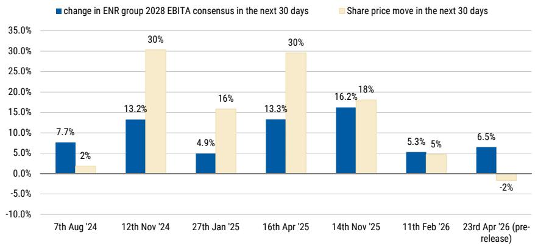
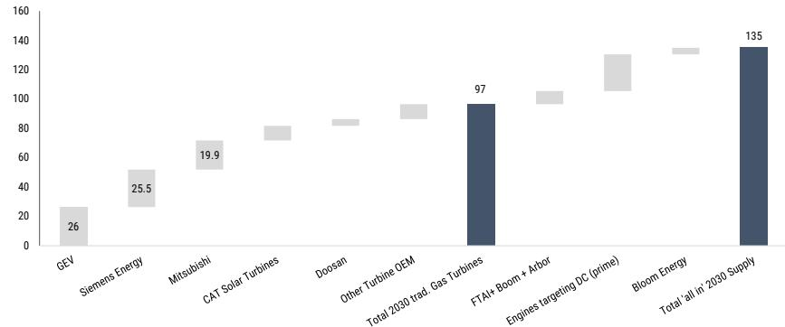
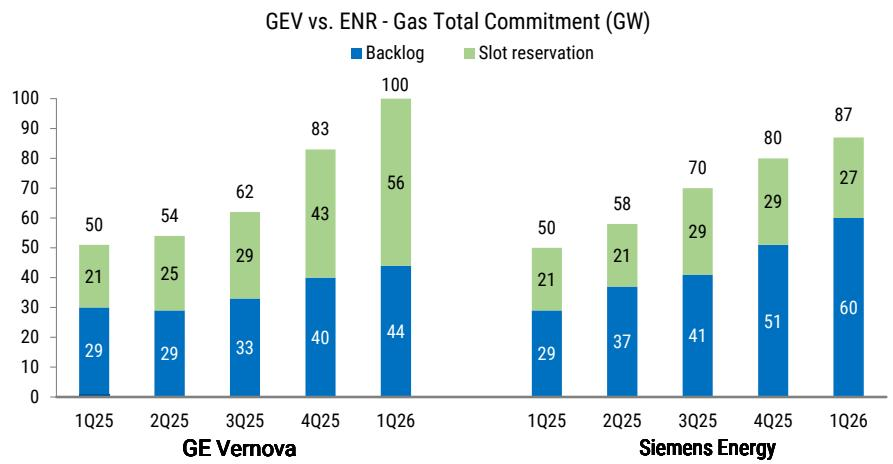
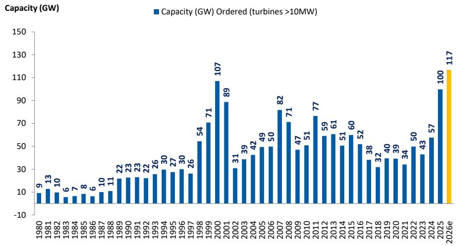
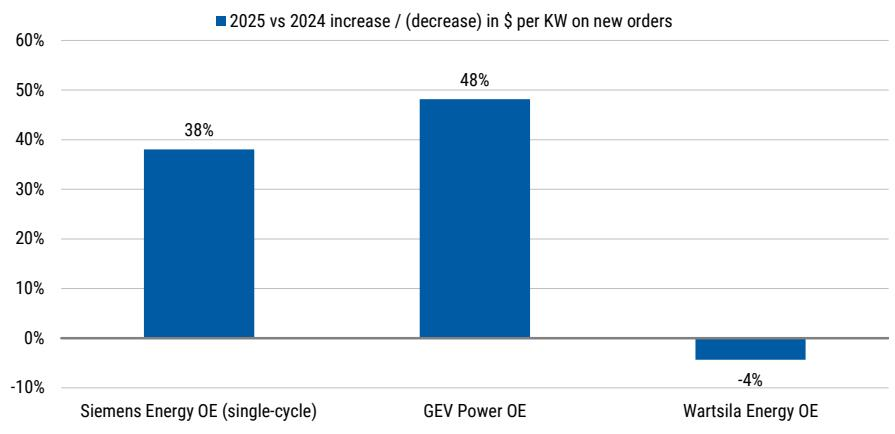
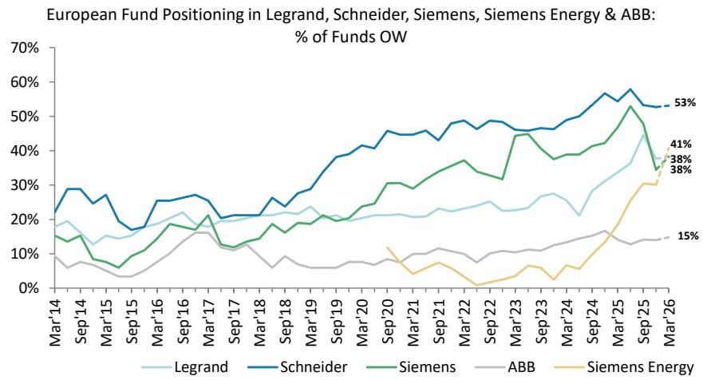
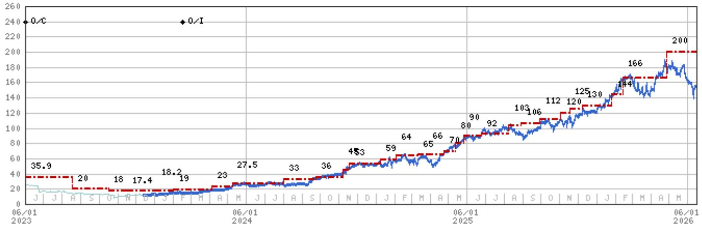

## Siemens Energy AG | Europe

# Investor feedback from our Gas turbine supply / demand report

After a busy week of discussions on our supply / demand report, we aim to summarize investor feedback below. It is clear that the stock is still very well owned, and mostly we received fairly wide-ranging push back to our supply demand view in 2030.

## Key Takeaways

Despite recent underperformance, we think ENR is still a consensus long. Some had used the May / June pull back to €150 to re-enter the stock.  
Investors reasons for owning here. (1) Consensus still too low in 2030, (2) Grid underappreciated, (3) Gas turbine order can grow into 2027, (4) Valuation.  
On Supply demand. We were surprised that the supply side Gas turbine capacity was not better understood. Many disagree that 2026 is peak (GW) orders.  
Where we agree, is that the supply / demand thesis playing out is a slow-burn, and turbine pricing is still strong today. In part, why we keep ENR OW.  
Overall view: Stock still range-bound through fiscal 3Q26 results, with potential for new 2030 targets (11th Nov) to act as the final clear positive catalyst.

Exhibit 1: Change to 2028 consensus EBITA following results and the 2025 CMD (14th Nov), and change in share price in the next 30 days. More recently, as consensus has moved higher, the rate of consensus upgrades has been decreasing. This has resulted in less share price follow through, which is a natural reaction as the 'rate of change' diminishes. We expect mid-single digit upgrades to 2030 consensus EBITA to be triggered by new 2030 targets (11th November)  

bar chart

| Date | Change in ENR group 2028 EBITA consensus in the next 30 days (%) | Share price move in the next 30 days (%) |
| :--- | :--- | :--- |
| 7th Aug '24 | 7.7 | 2 |
| 12th Nov '24 | 13.2 | 30 |
| 27th Jan '25 | 4.9 | 16 |
| 16th Apr '25 | 13.3 | 30 |
| 14th Nov '25 | 16.2 | 18 |
| 11th Feb '26 | 5.3 | 5 |
| 23rd Apr '26 (pre-release) | 6.5 | -2 |

Source: Visible alpha consensus. Refinitiv

We published an update of our Gas turbine supply model last week (Exhibit 2) in a report: Siemens Energy. Caught in multiple crosswinds. Supply demand dynamics are a valid concern for 2030

MS & CO. INTERNATIONAL PLC+

## Max R Yates

Equity Analyst

Max.Yates@morganstanley.com +44 20 7425-1917

## Sara Chemello

Research Associate

Sara.Chemello@morganstanley.com +44 20 7425-2931

Siemens Energy AG (ENR1n.DE, ENR GY)  
Capital Goods | Germany

<table><tr><td>Stock Rating</td><td>Overweight</td></tr><tr><td>Industry View</td><td>In-Line</td></tr><tr><td>Price target</td><td>€200.00</td></tr><tr><td>Shr price, close (Jun 12, 2026)</td><td>€153.58</td></tr><tr><td>52-Week Range</td><td>€191.66-82.72</td></tr><tr><td>Mkt cap, curr (mn)</td><td>€111,598</td></tr><tr><td>Net debt (09/26e) (mn)*</td><td>€(8,010)</td></tr><tr><td>EV, curr (mn)*</td><td>€107,182</td></tr></table>

\* = GAAP or approximated based on GAAP

<table><tr><td>Fiscal Year Ending</td><td>09/25</td><td>09/26e</td><td>09/27e</td><td>09/28e</td></tr><tr><td>Sales / Revenue (€mn)**</td><td>39,077</td><td>44,002</td><td>49,407</td><td>54,637</td></tr><tr><td>EBITDA (€mn)**</td><td>3,350</td><td>6,604</td><td>8,608</td><td>10,909</td></tr><tr><td>EBIT (€mn)**</td><td>2,355</td><td>5,059</td><td>7,061</td><td>9,333</td></tr><tr><td>EPS (€)**</td><td>1.78</td><td>4.32</td><td>6.28</td><td>8.52</td></tr><tr><td>Prior EPS (€)**</td><td>-</td><td>-</td><td>-</td><td>-</td></tr><tr><td>ModelWare EPS (€)</td><td>1.78</td><td>4.32</td><td>6.28</td><td>8.52</td></tr><tr><td>EPS (€)§</td><td>1.58</td><td>4.38</td><td>6.01</td><td>7.68</td></tr><tr><td>P/E**</td><td>55.7</td><td>35.6</td><td>24.5</td><td>18.0</td></tr><tr><td>EV/revenue*</td><td>2.1</td><td>2.4</td><td>2.0</td><td>1.7</td></tr><tr><td>EV/EBITDA**</td><td>24.9</td><td>15.8</td><td>11.5</td><td>8.6</td></tr><tr><td>EV/EBIT**</td><td>35.4</td><td>20.6</td><td>14.1</td><td>10.1</td></tr><tr><td>DPS (€)</td><td>0.70</td><td>2.07</td><td>3.04</td><td>4.16</td></tr><tr><td>Div yld (%)</td><td>0.7</td><td>1.3</td><td>2.0</td><td>2.7</td></tr><tr><td>FCF yld ratio (%)*</td><td>4.4</td><td>5.8</td><td>5.3</td><td>6.2</td></tr><tr><td>Net debt (€mn)*</td><td>(5,196)</td><td>(8,010)</td><td>(10,789)</td><td>(13,838)</td></tr><tr><td>Net debt/EBITDA**</td><td>NM</td><td>NM</td><td>NM</td><td>NM</td></tr><tr><td>RNOA (%)**</td><td>18.2</td><td>90.4</td><td>(7,749.7)</td><td>(420.2)</td></tr><tr><td>ROE (%)**</td><td>17.3</td><td>35.9</td><td>54.7</td><td>62.4</td></tr></table>

Unless otherwise noted, all metrics are based on MS ModelWare  
framework  
\*\* = Based on consensus methodology  
§ = Consensus data is provided by Refinitiv Estimates  
\* = GAAP or approximated based on GAAP  
e = MS estimates

MS does and seeks to do business with companies covered in MS. As a result, investors should be aware that the firm may have a conflict of interest that could affect the objectivity of MS. Investors should consider MS as only a single factor in making their investment decision.

## For analyst certification and other important disclosures, refer to the Disclosure Section, located at the end of this report.

+= Analysts employed by non-U.S. affiliates are not registered with FINRA, may not be associated persons of the member and may not be subject to FINRA restrictions on communications with a subject company, public appearances and trading securities held by a research analyst account.

For other recent Siemens Energy reports, see (1) 1Q26 Gas turbine orders. A step-change in DC bookings (May-26) (2) Siemens Energy. Getting into thin air. Stay OW (April-26), (3) Siemens Energy: Remove as a top-pick, but stay OW (March-26).

Backdrop. Since we removed Siemens Energy as a top-pick (March-26) our message on Siemens Energy has become more nuanced, despite keeping the overweight. As a recap of our view today, our thoughts on the stock are as follows. In our view, Siemens Energy is an earnings momentum story in end markets have historically been highly cyclical (see Exhibit 4) from a demand and profitability stand-point. For Siemens Energy, we think we are in the latter part of the earnings upgrades story, as we are now only 5% ahead of consensus for 2030 EBITA (for much of 2024-25 we were 20% ahead of consensus 2028 EBITA). In addition, the rate of change in the equity story across a number of areas is slowing down. We think the size of consensus upgrades is becoming smaller (see Exhibit 1), and the quarterly rate of increases in customer commitments (slot reservations and backlog) has also peaked (Exhibit 3). We also think Gas turbine (new unit GW orders) in FY27 will be flat YOY at best, but more likely lower YOY for Siemens Energy than in FY26. Finally, we disagree with the idea that Gas turbine aftermarket alone can carry the equity story into next decade as we expect this to only account for 20-25% of group EBITA in 2030.

The risk that longer-term investors need to grapple with is whether EBITA margin normalization in Gas services new equipment and Grid tech will offset the further EBIT growth in the services business into the 2030s. Ultimately, the key debate on the stock in our mind is on whether Siemens Energy can continue to generate mid-to-high single digit earnings growth in 2030-35, or earnings growth flattens out beyond 2030, and what the appropriate multiple for the stock on 2030 is in both those scenarios.

Our logic for keeping the Overweight in last week's report was largely for three reasons. The first was that when we wrote the report, we felt the risk reward overall was still skewed positively into year end. We argued in that report for a floor in the stock at €138, and we felt that the shares could have a run-up towards our €200 target price into year end around the new targets issued on 11th November. Second, we noted there was another catalyst for the stock into year end - the new targets which would trigger further consensus upgrade, albeit lower upgrades than what was seen with the last 2025 CMD. Equally, we did not think that we would immediately see signs of Gas turbine pricing plateauing, or even moderating for some of the engine companies this fiscal year. Higher slot reservation pricing alone should underpin better pricing on new orders for the next twelve months. Finally, we wrote that one of the reasons Siemens Energy had lagged GEV, and the valuation gap had widened, was concerns around Siemens Energy's Middle East exposure. If we were to see a US deal signed around the Iran conflict we felt this would help the relative valuation of Siemens Energy versus GE Vernova in the near-term, given Siemens Energy has relatively higher middle east exposure.

Shifting to investor feedback, from our conversations, we found that ownership of Siemens Energy across all types of investors is still relatively high. We have previously discussed (Exhibit6) that European long-only positioning in Siemens Energy now reflects other large-cap Electrical stocks in our coverage. We also found that a few investors we spoke with had used the May/ June pull-back in the stock (before last week) to turn more positive. It remains clear that the region with the highest investor optimism on the broader gas turbine cycle, and scope for orders to continue to move higher, was across US investors. A couple of points that surprised us from our discussions were as follows. We were surprised that we received so many requests for our gas turbine supply model (>50 requests) which suggests that supply dynamics have received less focus compared to demand until now. We also were surprised that the discussions with investors were very 'bottom up focused' and were surprised that we were not having more discussions linking the bigger picture risk of data center build out delays to the gas turbine stocks and specifically phasing of order intake.

## The five main discussion / push back points we had with investors last week on our report.

(1) A debate on how much of our 135GW Gas turbine / power supply solutions would materialize. We spent a lot of last week discussion how much of our 135GW of tracked power solutions would materialize. In our chart in Exhibit 2, there was agreement that the 97GW of Gas turbine capacity was largely underpinned. However, some investors argued that the newer solutions may not actually materialize, and therefore the eventual capacity could be lower than our calculation. We would argue that the 'non-Gas turbine' solutions are seeing success given recent primary power order wins across CAT, Wartsila and Hyundai in primary power, as well as recent Bloom Energy successes. Similarly, as Stephen Byrd observes in his recent report, Bitcoin miners also continue to play an active role in solving the time to power equation in the US (Link to report). In our view, this highlights that 'lead times' and 'time to power' remain the primary driver of decision making when it comes to behind the meter power solutions for data centers. Ultimately, there is a sharp increase in small gas turbine capacity and engine capacity that is all competing for the same behind the meter opportunity, and this will in our view have implications for pricing and profitability down the line.

(2) The consensus view is that the demand from data centers will eventually accrue to the Gas turbine manufacturers, as gas turbines replaced some of the 'bridging solutions' and more data centers receive grid connections in the medium term. We frequently encountered the view that the data center demand would eventually accrue to the gas turbine manufacturers in the form of larger turbines. The consensus view is that gas turbines will either eventually be connected to the grid (and served by large utility gas turbines), or that some of the bridging power solutions would be replaced by more permanent turbines. We agree that this is directionally correct, though speed and timing of this trend is difficult to know. Equally, in the meantime, we can also find that alternative behind the meter solutions initially continue to take share, and then in the medium term potentially drive some over-supply. We think behind the meter smaller gas turbine orders has been a very profitable market for the gas turbine manufacturers, and this is not immune from pressure. However, we also think in this scenario Wartsila would start to look quite vulnerable from a pricing perspective, hence our underweight rating on the stock. Ultimately, we think it is the capacity additions from the non-turbine makers which are arguably causing the bigger risks, as opposed to the capacity

additions made by the large gas turbine makers.

(3) Some investors argue for stronger for longer demand and gas turbine orders, which would more than offset supply side capacity additions. We found it interesting from our conversations that there was quite often a fairly simplistic link that was made from a high level of demand for compute and tokens, to Gas turbines orders continuing to grow out to the end of the decade. Our observation would be that the data center build out can only occur was fast as the weakest part of the supply chain will allow (ie permitting and labour). We would simply argue that a lot of data center behind the meter solutions have been ordered, relative to what can actually be built in the US by the end of the decade. In the end, we think there will not be unlimited gas turbine orders added to backlogs if the rate of actual data center build cannot keep up. Ultimately, we think the constraint for data center build is shifting from being power solutions (ie Gas turbines), and is increasingly areas like Engineering and construction, labour and permitting.

(4) Investors view was that the company commentary / industry channel checks on leading edge gas turbine pricing remained positive. We found investors still felt that industry commentary on gas turbine pricing remained positive. This is fair as our own discussions with industry analysts of US customers still point to resilient pricing. Equally, we also expect the companies to point to resilient pricing on slot reservations in the next 1-2 quarter. What we would expect is that the first cracks start to appear in behind the meter solutions pricing, particularly as companies like Wartsila (and others expanding capacity) start to open up bookings for 2030 with enlarged capacity. We would argue that price points across the likes of Wartsila and other engine makers like Hyundai (as we have flagged in previous reports) remain comparatively underwhelming to what we hear from Gas turbine manufacturers.

(5) We are finding that a large part of the narrative for the Gas turbines OEMs has become about shifting the debate more towards the upside of the Grid division (as opposed to the debate previously focusing on 'just' gas turbines). As a starting point for grid, we would start by saying that numbers have moved up a long way already. For context, consensus EBITA for Grid tech in 2029 is €5bn, and this is up \~100% from where 2029 consensus expectations were at the start of 2025. Consensus margins are expected to be 23.5% in 2030 (vs MSe at 25%) and versus a previous cyclical peak of 15%. Finally, order intake will land at around €25bn in 2026, compared to €7.3bn in 2021, and consensus assumes this continues to grow mid-single digit percentage for 2027-28. We agree the US is earlier on in its Grid investment cycle, but in contrast, we think a lot of the order intake for the European grid build out is already in the order-book. We see European order intake for Siemens Grid tech as more a case of stabilizing at a high level. Simply put, we also think the positive surprises in Grid are also diminishing, just by a function of expectations also having moved up significantly for this division. In addition, we also argue there is a limit to where revenues in this division can get to as a result of capacity constraints. We expect a 2029-30 deceleration in Grid technology revenue growth, after \~20% growth per year in 2026-28. Finally, as a result of lower barriers to entry, more volatile margins across the cycle, and limited aftermarket, we are cautious about making arguments about placing similar multiples on the grid tech business as either the Gas services multiple, or other Electrification companies like

Schneider and Eaton.

Valuation. After a volatile week in the share price, Siemens Energy is left trading on 12.3x 2028 EV/EBITA, which is a small discount to the broader Cap Goods sector on 13x 2028 EV/EBITA. In absolute, Siemens Energy is trading on a 6.2% FCF yield. Siemens Energy is also trading at a 42% discount to GE Vernova (21.2x), and this compares to a recent discount of 25-50%. Finally, it also compares to Wartsila trading on 14.6x 2028 EV/EBITA, and we think Wartsila remains comparatively expensive and we retain an Underweight here. We found from our conversations there was sympathy towards our more cautious view on Wartsila, but equally a hesitancy to be outright negative ahead of what we know will be a very good quarter for Energy orders given already announced data center contracts.

Exhibit 2: MS Gas turbine / power solutions supply model. We have updated our supply model for recent announcements, and the potential 2030 supply rises to 135GW by 2030 (we forecast 116GW supply in our Jan 2026 report: The capacity conundrum). The traditional gas turbine capacity in 2030 (97GW) looks broadly consistent with where orders should stabilize in 2027-30, but increasingly there are alternative solutions (engines and fuel-cells) that are competing in the 'behind the meter' data center primary power market.

Total Gas turbine + Primary engine + Fuel cell Supply (GW)  

bar chart

| Company | Value |
| :--- | :--- |
| GEV | 26 |
| Siemens Energy | 25.5 |
| Mitsubishi | 19.9 |
| CAT Solar Turbines | 78 |
| Doosan | 84 |
| Other Turbine OEM | 92 |
| Total 2030 trad. Gas Turbines | 97 |
| FTA+ Boom + Arbor | 102 |
| Engines targeting DC (prime) | 130 |
| Bloom Energy | 135 |
| Total 'all in '2030 Supply | 135 |

Source: Company data. MS Gas turbine supply model estimates.

Exhibit 3: GE Vernova (single cycle) and Siemens Energy (combined cycle) customer commitments (based on calendar dates). Siemens Energy have guided to 'customer commitments' ending fiscal 2026 at 100GW. This would mean that the 'rate of change' in the customer commitments is also continuing to moderate. Based off calendar dates, Siemens Energy saw a 12GW increase in customer commitments in 3Q25, 10GW in 4Q25 and 7GW in 1Q26.  

stacked bar chart

GEV vs. ENR - Gas Total Commitment (GW)
| Quarter | GE Vernova Backlog (GW) | GE Vernova Slot reservation (GW) | Siemens Energy Backlog (GW) | Siemens Energy Slot reservation (GW) |
| :--- | :--- | :--- | :--- | :--- |
| 1Q25 | 29 | 21 | 29 | 50 |
| 2Q25 | 29 | 25 | 37 | 58 |
| 3Q25 | 33 | 29 | 41 | 70 |
| 4Q25 | 40 | 43 | 51 | 80 |
| 1Q26 | 44 | 56 | 60 | 87 |

Source: Company data

Exhibit 4: Gas turbine order – 2025 full year order intake landed at 100GW (single cycle). Second-highest order level in history (since 2000). We expect a record year in order intake in 2026, and 1Q26 is annualizing at 117 GW.  

bar chart

| Year | Capacity (GW) Ordered (turbines >10MW) |
| --- | --- |
| 1980 | 9 |
| 1981 | 13 |
| 1982 | 10 |
| 1983 | 6 |
| 1984 | 7 |
| 1985 | 8 |
| 1986 | 6 |
| 1987 | 10 |
| 1988 | 11 |
| 1989 | 22 |
| 1990 | 23 |
| 1991 | 23 |
| 1992 | 22 |
| 1993 | 26 |
| 1994 | 30 |
| 1995 | 27 |
| 1996 | 30 |
| 1997 | 26 |
| 1998 | 54 |
| 1999 | 71 |
| 2000 | 107 |
| 2001 | 89 |
| 2002 | 31 |
| 2003 | 39 |
| 2004 | 42 |
| 2005 | 49 |
| 2006 | 50 |
| 2007 | 82 |
| 2008 | 71 |
| 2009 | 47 |
| 2010 | 51 |
| 2011 | 77 |
| 2012 | 59 |
| 2013 | 61 |
| 2014 | 51 |
| 2015 | 60 |
| 2016 | 52 |
| 2017 | 38 |
| 2018 | 32 |
| 2019 | 40 |
| 2020 | 39 |
| 2021 | 34 |
| 2022 | 50 |
| 2023 | 43 |
| 2024 | 57 |
| 2025e | 100 |

Source: McCoy data, MS estimates (e)

Exhibit 5: Price increase YOY on 2025 order intake. We have seen much sharper step-ups in pricing on new Power plant equipment orders at GEV and ENR, compared to Wartsila.  

bar chart

| Company | 2025 vs 2024 increase / (decrease) in $ per KW on new orders (%) |
|---|---|
| Siemens Energy OE (single-cycle) | 38 |
| GEV Power OE | 48 |
| Wartsila Energy OE | -4 |

Source: Company data

Exhibit6: Cap Goods positioning data as of 31st Mar 2026. % of EU Funds overweight Schneider is relatively unchanged at 53% vs 18mths ago (but Global LOs have increased Schneider positions). Siemens Energy's EU LO ownership has closed the gap with other Electricals. ABB fund OW positioning is still low (15%), but will have risen in April - May (after the data is collected) given share price performance. However, as we saw with ENR, it takes more than a year (even with strong share price performance) for Long-only ownership to fully close the gap with other Electrical names (eg Schneider and Legrand).  

line chart

| Date   | Legrand | Schneider | Siemens | ABB  | Siemens Energy |
|--------|---------|-----------|---------|------|----------------|
| Mar'26 | 38%     | 53%       | 41%     | 15%  | 38%            |

Source: FactSet, MS. Note: Our sample group of funds varies month to month, so is not directly comparable, though there is a c. 90% overlap in funds; March data for European funds are preliminary.

## Valuation Methodology and Risks

## Siemens Energy AG (ENR1n.DE)

Our price target is the average of two valuation methods: 1) a 2028 SOTP approach in which we benchmark Gas Services, Grid Technologies and Transformation of Industries against key peers such as GE Vernova, Mitsubishi and Hitachi. Our derived EV value is an average of applying 2028 EV/EBIT multiples (averaging out at 19.3x); and 2) a DCF valuation, assuming an 7.8% WACC and 2% terminal growth rate.

## Risks to Upside

■ Accelerated coal-to-gas transition, particularly in large markets such as China  
■ Higher than anticipated cost savings  
■ Favourable regulatory changes, e.g. on hydrogen and wind

## Risks to Downside

■ Timing delays in contract awards due to permitting processes, policy and other geopolitical factors  
■ Project risks, particularly on large generation projects and at SGRE  
■ Accelerated shift from coal to renewables vs coal to gas

## Wartsila Oyj Abp (WRT1V.HE)

Our PT is an average of: 1) a SOTP valuation where we apply peer multiples to our 2027e forecasts. Our aggregate target multiple on Wartsila is 16.5x, and 2) a DCF using a 8.4% WACC and a terminal growth rate of 2%.

## Risks to Upside

Energy margins increasing faster than we expect, and a re-acceleration in the Marine equipment cycle. Also, increased adoption of Wartsila solutions in Energy to data center applications, thereby increasing Wartsila&#39;s market share in Energy.

## Risks to Downside

The greatest downside risk is pricing pressure due to over-capacity in Energy markets. Also, execution of the relatively large backlog.

## Disclosure Section

The information and opinions in MS were prepared or are disseminated by MS Europe S.E., regulated by Bundesanstalt fuer Finanzdienstleistungsaufsicht (BaFin) and/or MS & Co. International plc, authorized by the Prudential Regulation Authority and regulated by the Financial Conduct Authority and the Prudential Regulation Authority. MS & Co. International plc disseminates in the UK research that it has prepared, and which has been prepared by any of its affiliates, only to persons who (i) are investment professionals falling within Article 19(5) of the Financial Services and Markets Act 2000 (Financial Promotion) Order 2005 (as amended, the "Order"); (ii) are persons who are high net worth entities falling within Article 49(2)(a) to (d) of the Order; or (iii) are persons to whom an invitation or inducement to engage in investment activity (within the meaning of section 21 of the Financial Services and Markets Act 2000, as amended) may otherwise lawfully be communicated or caused to be communicated. As used in this disclosure section, MS includes RMB MS Proprietary Limited, MS Europe S.E., MS & Co International plc and its affiliates.

For important disclosures, stock price charts and equity rating histories regarding companies that are the subject of this report, please see the MS Disclosure Website at www.morganstanley.com/eqr/disclosures/webapp/generalresearch, or contact your investment representative or MS at 1585 Broadway, (Attention: Research Management), New York, NY, 10036 USA.

For valuation methodology and risks associated with any recommendation, rating or price target referenced in this research report, please contact the Client Support Team as follows: US/Canada +1 800 303-2495; Hong Kong +852 2848-5999; Latin America +1 718 754-5444 (U.S.); London +44 (0)20-7425-8169; Singapore +65 6834-6860; Sydney +61 (0)2-9770-1505; Tokyo +81 (0)3-6836-9000. Alternatively you may contact your investment representative or MS at 1585 Broadway, (Attention: Research Management), New York, NY 10036 USA.

## Analyst Certification

The following analysts hereby certify that their views about the companies and their securities discussed in this report are accurately expressed and that they have not received and will not receive direct or indirect compensation in exchange for expressing specific recommendations or views in this report: Max R Yates.

## Global Research Conflict Management Policy

MS has been published in accordance with our conflict management policy, which is available at www.morganstanley.com/institutional/research/conflictpolicies. A Portuguese version of the policy can be found at www.morganstanley.com.br

## Important Regulatory Disclosures on Subject Companies

As of May 29, 2026, MS beneficially owned 1% or more of a class of common equity securities of the following companies covered in MS: Alstom, Assa Abloy AB, Atlas Copco, Epiroc AB, GEA Group AG, Halma PLC, KION Group AG, Legrand, Prysmian SpA, Rotork PLC, Schindler Holding AG, Schneider Electric, Siemens, Siemens Energy AG, Signify NV, SKF, Spirax Group PLC, Weir Group PLC.

Within the last 12 months, MS managed or co-managed a public offering (or 144A offering) of securities of Schneider Electric.

Within the last 12 months, MS has received compensation for investment banking services from AutoStore Holdings Ltd-W/I, Schneider Electric, Siemens.

In the next 3 months, MS expects to receive or intends to seek compensation for investment banking services from ABB, Alfa Laval AB, Alstom, Assa Abloy AB, Atlas Copco, AutoStore Holdings Ltd-W/I, Epiroc AB, GEA Group AG, Halma PLC, KION Group AG, Knorr Bremse AG, Kone Oyj, Legrand, Metso Corporation, Prysmian SpA, Rotork PLC, Sandvik, Schindler Holding AG, Schneider Electric, Siemens, Siemens Energy AG, SKF, Spirax Group PLC, Wartsila Oyj Abp, Weir Group PLC.

Within the last 12 months, MS has received compensation for products and services other than investment banking services from ABB, Alstom, AutoStore Holdings Ltd-W/I, KION Group AG, Legrand, Prysmian SpA, Schneider Electric, Siemens, Siemens Energy AG, Signify NV.

Within the last 12 months, MS has provided or is providing investment banking services to, or has an investment banking client relationship with, the following company: ABB, Alfa Laval AB, Alstom, Assa Abloy AB, Atlas Copco, AutoStore Holdings Ltd-W/I, Epiroc AB, GEA Group AG, Halma PLC, KION Group AG, Knorr Bremse AG, Kone Oyj, Legrand, Metso Corporation, Prysmian SpA, Rotork PLC, Sandvik, Schindler Holding AG, Schneider Electric, Siemens, Siemens Energy AG, SKF, Spirax Group PLC, Wartsila Oyj Abp, Weir Group PLC.

Within the last 12 months, MS has either provided or is providing non-investment banking, securities-related services to and/or in the past has entered into an agreement to provide services or has a client relationship with the following company: ABB, Alstom, AutoStore Holdings Ltd-W/I, KION Group AG, Legrand, Prysmian SpA, Schneider Electric, Siemens, Siemens Energy AG, Signify NV.

MS & Co. International plc is a corporate broker to Halma PLC, Spirax Group PLC.

The equity research analysts or strategists principally responsible for the preparation of MS have received compensation based upon various factors, including quality of research, investor client feedback, stock picking, competitive factors, firm revenues and overall investment banking revenues. Equity Research analysts' or strategists' compensation is not linked to investment banking or capital markets transactions performed by MS or the profitability or revenues of particular trading desks.

MS and its affiliates do business that relates to companies/instruments covered in MS, including market making, providing liquidity, fund management, commercial banking, extension of credit, investment services and investment banking. MS sells to and buys from customers the securities/instruments of companies covered in MS on a principal basis. MS may have a position in the debt of the Company or instruments discussed in this report. MS trades or may trade as principal in the debt securities (or in related derivatives) that are the subject of the debt research report.

Certain disclosures listed above are also for compliance with applicable regulations in non-US jurisdictions.

## STOCK RATINGS

MS uses a relative rating system using terms such as Overweight, Equal-weight, Not-Rated or Underweight (see definitions below). MS does not assign ratings of Buy, Hold or Sell to the stocks we cover. Overweight, Equal-weight, Not-Rated and Underweight are not the equivalent of buy, hold and sell. Investors should carefully read the definitions of all ratings used in MS. In addition, since MS contains more complete information concerning the analyst's views, investors should carefully read MS, in its entirety, and not infer the contents from the rating alone. In any case, ratings (or research) should not be used or relied upon as investment advice. An investor's decision to buy or sell a stock should depend on individual circumstances (such as the investor's existing holdings) and other considerations.

## Global Stock Ratings Distribution

(as of May 31, 2026)

The Stock Ratings described below apply to MS's Fundamental Equity Research and do not apply to Debt Research produced by the Firm.

For disclosure purposes only (in accordance with FINRA requirements), we include the category headings of Buy, Hold, and Sell alongside our ratings of Overweight, Equal-weight, Not-Rated and Underweight. MS does not assign ratings of Buy, Hold or Sell to the stocks we cover. Overweight, Equal-weight, Not-Rated and Underweight are not the equivalent of buy, hold, and sell but represent recommended relative weightings (see definitions below). To satisfy regulatory requirements, we correspond Overweight, our most positive stock rating, with a buy recommendation; we correspond Equal-weight and Not-Rated to hold and Underweight to sell recommendations, respectively.

<table><tr><td></td><td colspan="2">Coverage Universe</td><td colspan="3">Investment Banking Clients (IBC)</td><td colspan="2">Other Material Investment ServicesClients (MISC)</td></tr><tr><td>Stock RatingCategory</td><td>Count</td><td>% of Total</td><td>Count</td><td>% of Total IBC</td><td>% of RatingCategory</td><td>Count</td><td>% of Total OtherMISC</td></tr><tr><td>Overweight/Buy</td><td>1542</td><td>42%</td><td>465</td><td>51%</td><td>30%</td><td>707</td><td>43%</td></tr><tr><td>Equal-weight/Hold</td><td>1571</td><td>43%</td><td>369</td><td>40%</td><td>23%</td><td>723</td><td>44%</td></tr><tr><td>Not-Rated/Hold</td><td>3</td><td>0%</td><td>0</td><td>0%</td><td>0%</td><td>1</td><td>0%</td></tr><tr><td>Underweight/Sell</td><td>551</td><td>15%</td><td>86</td><td>9%</td><td>16%</td><td>201</td><td>12%</td></tr><tr><td>Total</td><td>3,667</td><td></td><td>920</td><td></td><td></td><td>1632</td><td></td></tr></table>

Data include common stock and ADRs currently assigned ratings. Investment Banking Clients are companies from whom MS received investment banking compensation in the last 12 months. Due to rounding off of decimals, the percentages provided in the "% of total" column may not add up to exactly 100 percent.

## Analyst Stock Ratings

Overweight (O). The stock's total return is expected to exceed the average total return of the analyst's industry (or industry team's) coverage universe, on a risk-adjusted basis, over the next 12-18 months.

Equal-weight (E). The stock's total return is expected to be in line with the average total return of the analyst's industry (or industry team's) coverage universe, on a risk-adjusted basis, over the next 12-18 months.

Not-Rated (NR). Currently the analyst does not have adequate conviction about the stock's total return relative to the average total return of the analyst's industry (or industry team's) coverage universe, on a risk-adjusted basis, over the next 12-18 months.

Underweight (U). The stock's total return is expected to be below the average total return of the analyst's industry (or industry team's) coverage universe, on a risk-adjusted basis, over the next 12-18 months.

Unless otherwise specified, the time frame for price targets included in MS is 12 to 18 months.

## Analyst Industry Views

Attractive (A): The analyst expects the performance of his or her industry coverage universe over the next 12-18 months to be attractive vs. the relevant broad market benchmark, as indicated below.

In-Line (I): The analyst expects the performance of his or her industry coverage universe over the next 12-18 months to be in line with the relevant broad market benchmark, as indicated below. Cautious (C): The analyst views the performance of his or her industry coverage universe over the next 12-18 months with caution vs. the relevant broad market benchmark, as indicated below. Benchmarks for each region are as follows: North America - S&P 500; Latin America - relevant MSCI country index or MSCI Latin America Index; Europe - MSCI Europe; Japan - TOPIX; Asia - relevant MSCI country index or MSCI sub-regional index or MSCI AC Asia Pacific ex Japan Index.

## Stock Price, Price Target and Rating History (See Rating Definitions)

Siemens Energy AG (ENR1n.DE) - As of 06/15/26 GMT in EUR Industry : Capital Goods  

line chart

| Date       | Value |
| ---------- | ----- |
| 06/01 2023 | 35.9  |
| 06/01 2023 | 20    |
| 06/01 2023 | 18    |
| 06/01 2023 | 17.4  |
| 06/01 2023 | 18.2  |
| 06/01 2023 | 19    |
| 06/01 2023 | 23    |
| 06/01 2023 | 27.5  |
| 06/01 2023 | 33    |
| 06/01 2023 | 36    |
| 06/01 2023 | 45    |
| 06/01 2023 | 59    |
| 06/01 2023 | 64    |
| 06/01 2023 | 65    |
| 06/01 2023 | 66    |
| 06/01 2023 | 70    |
| 06/01 2023 | 80    |
| 06/01 2023 | 90    |
| 06/01 2023 | 92    |
| 06/01 2023 | 103   |
| 06/01 2023 | 106   |
| 06/01 2023 | 112   |
| 06/01 2023 | 120   |
| 06/01 2023 | 125   |
| 06/01 2023 | 130   |
| 06/01 2023 | 144   |
| 06/01 2023 | 166   |
| 06/01 2023 | 200   |

Stock Rating History: 6/1/21 : 0/C; 2/4/22 : E/C; 5/30/22 : NA/C; 4/3/23 : 0/C; 2/16/24 : 0/I  
Price Target History: 3/3/21 : 40; 7/1/21 : 42; 8/4/21 : 38.9; 11/10/21 : 35.1; 1/13/22 : 32; 2/4/22 : 22.6; 4/5/22 : 22;  
5/30/22 : NA; 4/3/23 : 33.2; 5/15/23 : 35.9; 8/18/23 : 20; 10/16/23 : 18; 11/16/23 : 17.4; 1/2/24 : 18.2; 2/1/24 : 19; 4/4/24 : 23;  
5/8/24 : 27.5; 8/1/24 : 33; 9/24/24 : 36; 11/7/24 : 45; 11/18/24 : 53; 1/8/25 : 59; 2/3/25 : 64; 3/12/25 : 65; 3/27/25 : 66;  
4/23/25 : 70; 5/13/25 : 80; 5/27/25 : 90; 6/25/25 : 92; 8/8/25 : 103; 8/29/25 : 106; 9/29/25 : 112; 11/3/25 : 120; 11/17/25 : 125;  
12/8/25 : 130; 1/26/26 : 144; 2/13/26 : 166; 4/27/26 : 200  
Source: MS Date Format : MM/DD/YY Price Target = No Price Target Assigned (NA)  
Stock Price (Not Covered by Current Analyst) — Stock Price (Covered by Current Analyst)  
Stock and Industry Ratings (abbreviations below) appear as ♦ Stock Rating/Industry View  
Stock Ratings: Overweight (O) Equal-weight (E) Underweight (U) Not-Rated (NR) No Rating Available (NA)  
Industry View: Attractive (A) In-line (I) Cautious (C) No Rating (NR)  
Effective January 13, 2014, the stocks covered by MS Asia Pacific will be rated relative to the analyst's industry (or industry team's) coverage.  
Effective January 13, 2014, the industry view benchmarks for MS Asia Pacific are as follows: relevant MSCI country index or MSCI sub-regional index or MSCI AC Asia Pacific ex Japan Index.

Wartsila Oyj Abp (WRT1V.HE) - As of 06/15/26 GMT in EUR
Industry : Capital Goods  

line chart

| Date       | Blue Line | Red Dashed Line |
|------------|-----------|-----------------|
| 06/01 2023 | 11.4      | 11.4            |
|            | 12.2      | 12.2            |
|            | 12        | 12              |
|            | 12.2      | 12.2            |
|            | 11.2      | 11.2            |
|            | 12.2      | 12.2            |
|            | 14.5      | 14.5            |
|            | 15.1      | 15.1            |
|            | 15.4      | 15.4            |
|            | 17        | 17              |
|            | 17.6      | 17.6            |
|            | 17.8      | 17.8            |
|            | 19.5      | 19.5            |
|            | 19        | 19              |
|            | 17.2      | 17.2            |
|            | 18        | 18              |
|            | 19.5      | 19.5            |
|            | 21.4      | 21.4            |
|            | 23.5      | 23.5            |
|            | 30        | 30              |
|            | 29        | 29              |

Stock Rating History: 6/1/21 : E/C; 4/5/23 : 0/C; 12/12/23 : U/C; 2/16/24 : U/I; 11/11/24 : E/I; 3/3/26 : U/I  
Price Target History: 4/26/21 : 9; 6/25/21 : 9.8; 7/20/21 : 10.2; 9/27/21 : 10.6; 10/27/21 : 11; 1/12/22 : 12; 4/5/22 : 10.9;  
4/28/22 : 10.1; 6/30/22 : 9.3; 10/3/22 : 8; 10/26/22 : 7.8; 1/11/23 : 8.3; 2/10/23 : 9.8; 4/5/23 : 10.2; 4/26/23 : 11.4;  
7/24/23 : 12.2; 10/6/23 : 12; 11/1/23 : 12.2; 12/12/23 : 11.2; 2/5/24 : 12.2; 4/4/24 : 12.3; 4/30/24 : 14.5; 7/3/24 : 15.1;  
7/26/24 : 15.4; 10/7/24 : 17; 11/11/24 : 17.6; 1/10/25 : 17.8; 2/5/25 : 19.5; 3/31/25 : 19; 4/28/25 : 17.2; 6/19/25 : 18;  
7/21/25 : 19.5; 10/6/25 : 21.4; 10/31/25 : 23.5; 3/3/26 : 30; 4/7/26 : 29  
Source: MS Date Format : MM/DD/YY Price Target = No Price Target Assigned (NA)  
Stock Price (Not Covered by Current Analyst) — Stock Price (Covered by Current Analyst)  
Stock and Industry Ratings (abbreviations below) appear as ♦ Stock Rating/Industry View  
Stock Ratings: Overweight (O) Equal-weight (E) Underweight (U) Not-Rated (NR) No Rating Available (NA)  
Industry View: Attractive (A) In-line (I) Cautious (C) No Rating (NR)  
Effective January 13, 2014, the stocks covered by MS Asia Pacific will be rated relative to the analyst's industry (or industry team's) coverage.  
Effective January 13, 2014, the industry view benchmarks for MS Asia Pacific are as follows: relevant MSCI country index or MSCI sub-regional index or MSCI AC Asia Pacific ex Japan Index.

## Important Disclosures for MS Smith Barney LLC Customers

Important disclosures regarding any material conflict of interest that can reasonably be expected to have influenced MS Smith Barney LLC's choice of a third-party research provider or the subject company of a third-party research report, are available on the MS Wealth Management disclosure website at www.morganstanley.com/online/researchdisclosures. For MS specific disclosures, you may refer to https://www.morganstanley.com/eqr/disclosures/webapp/generalresearch.

Each MS report is reviewed and approved on behalf of MS Smith Barney LLC. This review and approval is conducted by the same person who reviews the research report on behalf of MS. This could create a conflict of interest.

## Other Important Disclosures

MS policy is to update research reports as and when the Research Analyst and Research Management deem appropriate, based on developments with the issuer, the sector, or the market that may have a material impact on the research views or opinions stated therein. In addition, certain Research publications are intended to be updated on a regular periodic basis (weekly/monthly/quarterly/annual) and will ordinarily be updated with that frequency, unless the Research Analyst and Research Management determine that a different publication schedule is appropriate based on current conditions.

MS is not acting as a municipal advisor and the opinions or views contained herein are not intended to be, and do not constitute, advice within the meaning of Section 975 of the Dodd-Frank Wall Street Reform and Consumer Protection Act.

MS produces an equity research product called a "Tactical Idea." Views contained in a "Tactical Idea" on a particular stock may be contrary to the recommendations or views expressed in research on the same stock. This may be the result of differing time horizons, methodologies, market events, or other factors. For all research available on a particular stock, please contact your sales representative or go to Matrix at http://www.morganstanley.com/matrix.

MS is provided to our clients through our proprietary research portal on Matrix and also distributed electronically by MS to clients. Certain, but not all, MS products are also made available to clients through third-party vendors or redistributed to clients through alternate electronic means as a convenience. For access to all available MS, please contact your sales representative or go to Matrix at http://www.morganstanley.com/matrix.

Any access and/or use of MS is subject to MS's Terms of Use (http://www.morganstanley.com/terms.html). By accessing and/or using MS, you are indicating that you have read and agree to be bound by our Terms of Use (http://www.morganstanley.com/terms.html). In addition you consent to MS processing your personal data and using cookies in accordance with our Privacy Policy and our Global Cookies Policy (http://www.morganstanley.com/privacy\_pledge.html), including for the purposes of setting your preferences and to collect readership data so that we can deliver better and more personalized service and products to you. To find out more information about how MS processes personal data, how we use cookies and how to reject cookies see our Privacy Policy and our Global Cookies Policy (http://www.morganstanley.com/privacy\_pledge.html). Please use the provided link to review the Terms and Conditions and Most Important Terms and Conditions for MS India Company Private Limited (https://www.morganstanley.com/assets/pdfs/about-us-global-offices/india/Terms\_and\_conditions.pdf) and the following link to review the audit report (https://ny.matrix.ms.com/eqr/research/webapp/researchdocs/MSICPL\_Morgan\_Stanley\_Research\_Audit\_Report.pdf).

If you do not agree to our Terms of Use and/or if you do not wish to provide your consent to MS processing your personal data or using cookies please do not access our research.

MS does not provide individually tailored investment advice. MS has been prepared without regard to the circumstances and objectives of those who receive it. MS recommends that investors independently evaluate particular investments and strategies, and encourages investors to seek the advice of a financial adviser. The appropriateness of an investment or strategy will depend on an investor's circumstances and objectives. The securities, instruments, or strategies discussed in MS may not be suitable for all investors, and certain investors may not be eligible to purchase or participate in some or all of them. MS is not an offer to buy or sell or the solicitation of an offer to buy or sell any security/instrument or to participate in any particular trading strategy. The value of and income from your investments may vary because of changes in interest rates, foreign exchange rates, default rates, prepayment rates, securities/instruments prices, market indexes, operational or financial conditions of companies or other factors. There may be time limitations on the exercise of options or other rights in securities/instruments transactions. Past performance is not necessarily a guide to future performance. Estimates of future performance are based on assumptions that may not be realized. If provided, and unless otherwise stated, the closing price on the cover page is that of the primary exchange for the subject company's securities/instruments.

The fixed income research analysts, strategists or economists principally responsible for the preparation of MS have received compensation based upon various factors, including quality, accuracy and value of research, firm profitability or revenues (which include fixed income trading and capital markets profitability or revenues), client feedback and competitive factors. Fixed Income Research analysts', strategists' or economists' compensation is not linked to investment banking or capital markets transactions performed by MS or the profitability or revenues of particular trading desks.

The "Important Regulatory Disclosures on Subject Companies" section in MS lists all companies mentioned where MS owns 1% or more of a class of common equity securities of the companies. For all other companies mentioned in MS, MS may have an investment of less than 1% in securities/instruments or derivatives of securities/instruments of companies and may trade them in ways different from those discussed in MS. Employees of MS not involved in the preparation of MS may have investments in securities/instruments or derivatives of securities/instruments of companies mentioned and may trade them in ways different from those discussed in MS. Derivatives may be issued by MS or associated persons.

With the exception of information regarding MS, MS is based on public information. MS makes every effort to use reliable, comprehensive information, but we make no representation that it is accurate or complete. We have no obligation to tell you when opinions or information in MS change apart from when we intend to discontinue equity research coverage of a subject company. Facts and views presented in MS have not been reviewed by, and may not reflect information known to, professionals in other MS business areas, including investment banking personnel.

MS personnel may participate in company events such as site visits and are generally prohibited from accepting payment by the company of associated expenses unless pre-approved by authorized members of Research management.

MS may make investment decisions that are inconsistent with the recommendations or views in this report.

To our readers based in Taiwan or trading in Taiwan securities/instruments: Information on securities/instruments that trade in Taiwan is distributed by MS Taiwan Limited ("MSTL"). Such information is for your reference only. The reader should independently evaluate the investment risks and is solely responsible for their investment decisions. MS may not be distributed to the public media or quoted or used by the public media without the express written consent of MS. Any non-customer reader within the scope of Article 7-1 of the Taiwan Stock Exchange Recommendation Regulations accessing and/or receiving MS is not permitted to provide MS to any third party (including but not limited to related parties, affiliated companies and any other third parties) or engage in any activities regarding MS which may create or give the appearance of creating a conflict of interest. Information on securities/instruments that do not trade in Taiwan is for informational purposes only and is not to be construed as a recommendation or a solicitation to trade in such securities/instruments. MSTL may not execute transactions for clients in these securities/instruments.

MS is not incorporated under PRC law and the research in relation to this report is conducted outside the PRC. MS does not constitute an offer to sell or the solicitation of an offer to buy any securities in the PRC. PRC investors shall have the relevant qualifications to invest in such securities and shall be responsible for obtaining all relevant approvals, licenses, verifications and/or registrations from the relevant governmental authorities themselves. Neither this report nor any part of it is intended as, or shall constitute, provision of any consultancy or advisory service of securities investment as defined under PRC law. Such information is provided for your reference only.

MS is disseminated in Brazil by MS C.T.V.M. S.A. located at Av. Brigadeiro Faria Lima, 3600, 6th floor, São Paulo - SP, Brazil; and is regulated by the Comissão de Valores Mobiliários; in Mexico by MS México, Casa de Bolsa, S.A. de C.V which is regulated by Comision Nacional Bancaria y de Valores. Paseo de los Tamarindos 90, Torre 1, Col. Bosques de las Lomas Floor 29, 05120 Mexico City; in Japan by MS MUFG Securities Co., Ltd. and, for Commodities related research reports only, MS Capital Group Japan Co., Ltd; in Hong Kong by MS Asia Limited (which accepts responsibility for its contents) and by MS Bank Asia Limited; in Singapore by MS Asia (Singapore) Pte. (Registration number 199206298Z) and/or MS Asia (Singapore) Securities Pte Ltd (Registration number 200008434H), regulated by the Monetary Authority of Singapore (which accepts legal responsibility for its contents and should be contacted with respect to any matters arising from, or in connection with, MS) and by MS Bank Asia Limited, Singapore Branch (Registration number T14FC0118); in Australia to "wholesale clients" within the meaning of the Australian Corporations Act by MS Australia Limited A.B.N. 67 003 734 576, holder of Australian financial services license No. 233742, which accepts responsibility for its contents; in Australia to "wholesale clients" and "retail clients" within the meaning of the Australian Corporations Act by MS Wealth Management Australia Pty Ltd (A.B.N. 19 009 145 555, holder of Australian financial services license No. 240813, which accepts responsibility for its contents; in Korea by MS & Co International plc, Seoul Branch; in India by MS India Company Private Limited having Corporate Identification No (CIN) U22990MH1998PTC115305, regulated by the Securities and Exchange Board of India ("SEBI") and holder of licenses as a Research Analyst (SEBI Registration No. INH000001105); Stock Broker (SEBI Stock Broker Registration No. INZ000244438), Merchant Banker (SEBI Registration No. INM000011203), and depository participant with National Securities Depository Limited (SEBI Registration No. IN-DP-NSDL-567-2021) having registered office at Altimus, Level 39 & 40, Pandurang Budhkar Marg, Worli, Mumbai 400018, India; Telephone no. +91-22-61181000; Compliance Officer Details: Mr. Tejarshi Hardas, Tel. No.: +91-22-61181000 or Email: tejarshi.hardas@morganstanley.com; Grievance officer details: Mr. Tejarshi Hardas, Tel. No.: +91-22-61181000 or Email: msic-compliance@morganstanley.com. MS India Company Private Limited (MSICPL) may use AI tools in providing research services. All recommendations contained herein are made by the duly qualified research analysts; in Canada by MS Canada Limited; in Germany and the European Economic Area where required by MS Europe S.E., authorised and regulated by Bundesanstalt fuer Finanzdienstleistungsaufsicht (BaFin) under the reference number 149169; in the US by MS & Co. LLC, which accepts responsibility for its contents. MS & Co. International plc, authorized by the Prudential Regulation Authority and regulated by the Financial Conduct Authority and the Prudential Regulation Authority, disseminates in the UK research that it has prepared, and research which has been prepared by any of its affiliates, only to persons who (i) are investment professionals falling within Article 19(5) of the Financial Services and Markets Act 2000 (Financial Promotion) Order 2005 (as amended, the "Order"); (ii) are persons who are high net worth entities falling within Article 49(2)(a) to (d) of the Order; or (iii) are persons to whom an invitation or inducement to engage in investment activity (within the meaning of section 21 of the Financial Services and Markets Act 2000, as amended) may otherwise lawfully be communicated or caused to be communicated. RMB MS Proprietary Limited is a member of the JSE Limited and A2X (Pty) Ltd. RMB MS Proprietary Limited is a joint venture owned equally by MS International Holdings Inc. and RMB Investment Advisory (Proprietary) Limited, which is wholly owned by FirstRand Limited. The information in MS is being disseminated by MS Saudi Arabia, regulated by the Capital Market Authority in the Kingdom of Saudi Arabia, and is directed at Sophisticated investors only.

The information in MS is being communicated by MS & Co. International plc (DIFC Branch), regulated by the Dubai Financial Services Authority (the DFSA) or by MS & Co. International plc (ADGM Branch), regulated by the Financial Services Regulatory Authority Abu Dhabi (the FSRA), and is directed at Professional Clients only, as defined by the DFSA or the FSRA, respectively. The financial products or financial services to which this research relates will only be made available to a customer who we are satisfied meets the regulatory criteria of a Professional Client. A distribution of the different MS Research ratings or recommendations, in percentage terms for Investments in each sector covered, is available upon request from your sales representative.

The information in MS is being communicated by MS & Co. International plc (QFC Branch), regulated by the Qatar Financial Centre Regulatory Authority (the QFCRA), and is directed at business customers and market counterparties only and is not intended for Retail Customers as defined by the QFCRA.

As required by the Capital Markets Board of Turkey, investment information, comments and recommendations stated here, are not within the scope of investment advisory activity. Investment advisory service is provided exclusively to persons based on their risk and income preferences by the authorized firms. Comments and recommendations stated here are general in nature. These opinions may not fit to your financial status, risk and return preferences. For this reason, to make an investment decision by relying solely to this information stated here may not bring about outcomes that fit your expectations.

The trademarks and service marks contained in MS are the property of their respective owners. Third-party data providers make no warranties or representations relating to the accuracy, completeness, or timeliness of the data they provide and shall not have liability for any damages relating to such data. The Global Industry Classification Standard (GICS) was developed by and is the exclusive property of MSCI and S&P.

MS, or any portion thereof may not be reprinted, sold or redistributed without the written consent of MS.

Indicators and trackers referenced in MS may not be used as, or treated as, a benchmark under Regulation EU 2016/1011, or any other similar framework.

The issuers and/or fixed income products recommended or discussed in certain fixed income research reports may not be continuously followed. Accordingly, investors should regard those fixed income research reports as providing stand-alone analysis and should not expect continuing analysis or additional reports relating to such issuers and/or individual fixed income products. MS may hold, from time to time, material financial and commercial interests regarding the company subject to the Research report.

Registration granted by SEBI and certification from the National Institute of Securities Markets (NISM) in no way guarantee performance of the intermediary or provide any assurance of returns to investors. Investment in securities market are subject to market risks. Read all the related documents carefully before investing.

INDUSTRY COVERAGE: Capital Goods

<table><tr><td>COMPANY (TICKER)</td><td>RATING (AS OF)</td><td>PRICE* (06/12/2026)</td></tr><tr><td>Arthur Sitbon, CFA</td><td></td><td></td></tr><tr><td>ITM Power (ITM.L)</td><td>O (04/29/2026)</td><td>129p</td></tr><tr><td>Luke Holbrook</td><td></td><td></td></tr><tr><td>AutoStore Holdings Ltd-W/I (AUTO.OL)</td><td>E (08/15/2025)</td><td>NKr 11.36</td></tr><tr><td>Max R Yates</td><td></td><td></td></tr><tr><td>ABB (ABBN.S)</td><td>E (12/09/2024)</td><td>SFr 81.62</td></tr><tr><td>Alfa Laval AB (ALFA.ST)</td><td>E (03/05/2026)</td><td>SKr 530.80</td></tr><tr><td>Alstom (ALSO.PA)</td><td>E (12/07/2022)</td><td>€16.19</td></tr><tr><td>Assa Abloy AB (ASSAb.ST)</td><td>E (03/16/2020)</td><td>SKr 332.40</td></tr><tr><td>Atlas Copco (ATCOa.ST)</td><td>O (12/08/2025)</td><td>SKr 185.95</td></tr><tr><td>Epiroc AB (EPIRa.ST)</td><td>O (03/12/2026)</td><td>SKr 266.50</td></tr><tr><td>GEA Group AG (G1AG.DE)</td><td>U (12/08/2025)</td><td>€55.90</td></tr><tr><td>Halma PLC (HLMA.L)</td><td>E (11/22/2018)</td><td>3,898p</td></tr><tr><td>KION Group AG (KGX.DE)</td><td>E (03/10/2023)</td><td>€37.28</td></tr><tr><td>Knorr Bremse AG (KBX.DE)</td><td>O (12/08/2025)</td><td>€101.80</td></tr><tr><td>Kone Oyj (KNEBV.HE)</td><td>U (12/09/2024)</td><td>€48.72</td></tr><tr><td>Legrand (LEGD.PA)</td><td>O (03/28/2024)</td><td>€133.55</td></tr><tr><td>Metso Corporation (METSO.HE)</td><td>E (12/07/2022)</td><td>€14.80</td></tr><tr><td>Prysmian SpA (PRY.MI)</td><td>E (11/05/2024)</td><td>€143.90</td></tr><tr><td>Rexel S.A. (RXL.PA)</td><td>O (12/09/2024)</td><td>€36.42</td></tr><tr><td>Rotork PLC (ROR.L)</td><td>E (12/08/2025)</td><td>306p</td></tr><tr><td>Sandvik (SAND.ST)</td><td>E (03/12/2026)</td><td>SKr 378.60</td></tr><tr><td>Schindler Holding AG (SCHP.S)</td><td>E (12/08/2025)</td><td>SFr 262.60</td></tr><tr><td>Schneider Electric (SCHN.PA)</td><td>O (10/27/2025)</td><td>€265.30</td></tr><tr><td>Siemens (SIEGn.DE)</td><td>E (10/14/2025)</td><td>€264.50</td></tr><tr><td>Siemens Energy AG (ENR1n.DE)</td><td>O (04/03/2023)</td><td>€153.58</td></tr><tr><td>Signify NV (LIGHT.AS)</td><td>U (12/08/2025)</td><td>€20.42</td></tr><tr><td>SKF (SKFb.ST)</td><td>++</td><td>SKr 237.90</td></tr><tr><td>Spirax Group PLC (SPX.L)</td><td>O (12/09/2024)</td><td>6,810p</td></tr><tr><td>Vestas Wind Systems A/S (VWS.CO)</td><td>E (05/05/2020)</td><td>DKr 166.10</td></tr><tr><td>Wartsila Oyj Abp (WRT1V.HE)</td><td>U (03/03/2026)</td><td>€33.06</td></tr><tr><td>Weir Group PLC (WEIR.L)</td><td>E (05/12/2025)</td><td>2,324p</td></tr></table>

Stock Ratings are subject to change. Please see latest research for each company.  
\* Historical prices are not split adjusted.

© 2026 MS