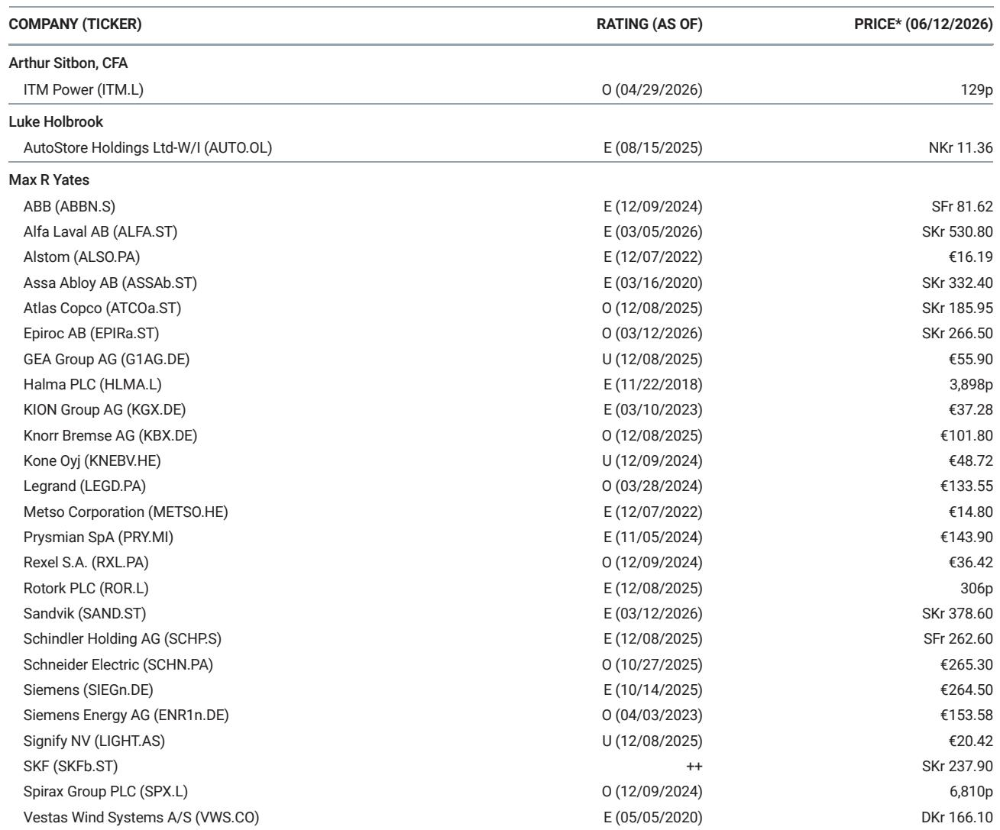
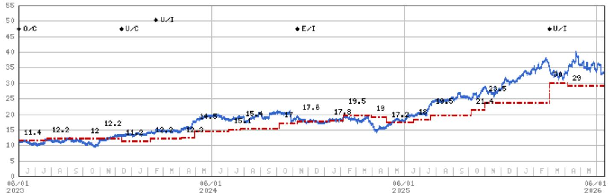

# The Gas Turbine Thesis Is Slowing: Why Siemens Energy's Next Catalyst May Be the Last Easy One

The consensus long on Siemens Energy is still crowded, but the underlying narrative is shifting beneath it. After a busy week of investor discussions following a key report on gas turbine supply and demand dynamics, one conclusion stands out clearly: the stock remains heavily owned, yet the pushback against the 2030 supply-demand outlook is both wide-ranging and revealing. Investors who used the May-to-June pullback to re-enter near EUR 150 are now betting on four pillars: consensus earnings estimates that they believe are still too low for 2030, an underappreciated Grid business, further gas turbine order growth into 2027, and valuation support. These are not unreasonable arguments, but they are increasingly backward-looking. The real question is whether the rate of change in each of these drivers is about to decelerate meaningfully.

The market is now grappling with a nuanced reality. The supply side of the gas turbine equation is far less understood than demand, and this asymmetry creates both risk and opportunity. Our analysis suggests that 2026 may represent the peak year for gas turbine order intake in gigawatt terms, a view that many investors contest. Yet where we find common ground is the recognition that the supply-demand thesis is a slow-burn dynamic, and that turbine pricing remains robust today. That is precisely why we maintain an overweight rating. But the stock remains range-bound through the fiscal third-quarter 2026 results, and the next clear positive catalyst is the new 2030 targets expected on 11 November. The question is whether that catalyst will be powerful enough to break the range, or whether it will be the last easy upgrade the market gets.

The pattern of consensus upgrades and share price reactions tells the story. When consensus for 2028 EBITA moved sharply higher, the share price followed with enthusiasm. But as the rate of upgrades has diminished, the price response has become more muted. The upcoming 2030 targets are expected to trigger mid-single-digit upgrades to consensus EBITA, but that is a far cry from the double-digit upgrades that drove the stock in prior cycles. The market is beginning to price in diminishing marginal returns to positive news. The strategic question for long-term holders is whether the earnings story can sustain itself into the next decade, or whether the easy phase of the cycle is behind us.

## The Supply-Demand Debate Is Misplaced: The Real Risk Is Not Oversupply but Timing of Demand Realization

The most contested point in our recent investor conversations revolves around our supply model, which now tracks 135 gigawatts of total power solutions by 2030. The traditional gas turbine capacity of 97 gigawatts is broadly accepted as underpinned. The pushback centers on whether the newer solutions, such as engine-based primary power and fuel cells, will actually materialize. Some investors argue that these alternatives may not fully come online, implying that eventual capacity could be lower than our calculation. This is a reasonable objection, but it misses the more important dynamic.

The success of recent primary power order wins across Caterpillar, Wartsila, Hyundai, and Bloom Energy demonstrates that time to power remains the dominant decision-making criterion for data center operators. Lead times are the bottleneck, not the availability of gas turbines themselves. The sharp increase in small gas turbine capacity and engine capacity is all competing for the same behind-the-meter opportunity. This is not a problem of too much supply in an absolute sense; it is a problem of too much capacity chasing a finite set of near-term installations. The implication for pricing and profitability down the line is significant, and it is not captured by simply debating whether 135 gigawatts is the right number.

The more concerning scenario is not that supply overwhelms demand, but that demand itself is front-loaded relative to the actual pace of data center construction. The constraint on data center build-out is shifting from power solutions to engineering, construction, labor, and permitting. A lot of behind-the-meter solutions have been ordered relative to what can realistically be built in the United States by the end of the decade. If the rate of actual data center construction cannot keep pace, unlimited gas turbine orders will not continue to flow into backlogs. The supply-demand debate is therefore a distraction from the more critical question of demand timing.

## The Grid Division Is the New Narrative, but Its Upside Is Diminishing Faster Than Investors Assume

A significant portion of the bullish case for Siemens Energy has shifted from gas turbines to the Grid technology division. This is understandable. Consensus EBITA for Grid tech in 2029 has nearly doubled from where it stood at the start of 2025, and margins are expected to reach 23.5 percent in 2030, well above the previous cyclical peak of 15 percent. Order intake has surged from EUR 7.3 billion in 2021 to an expected EUR 25 billion in 2026. Investors are understandably excited about this trajectory.

But the rate of positive surprise is also diminishing here. European order intake for Grid technology is already in the order book, and further growth in that region is more about stabilization at a high level than acceleration. The U.S. is earlier in its grid investment cycle, which provides some upside, but capacity constraints will limit how much revenue the division can ultimately generate. We expect a deceleration in Grid technology revenue growth by 2029-2030, following roughly 20 percent growth per year in 2026-2028. The market is extrapolating a linear trend that will almost certainly bend.

More importantly, the valuation argument for Grid technology is weaker than investors assume. Lower barriers to entry, more volatile margins across the cycle, and a limited aftermarket make it inappropriate to apply the same multiples to Grid tech as one would to Gas services or to electrification companies like Schneider and Eaton. The Grid division is a good business, but it is not the structural growth engine that some investors are pricing in. The positive surprises in Grid are diminishing, and the market has already moved expectations up significantly.

## The Aftermarket Argument Is Insufficient to Carry the Equity Story Into the Next Decade

A common refrain from investors is that the gas turbine aftermarket will sustain earnings growth even after the new equipment cycle peaks. This argument has surface-level appeal. Aftermarket revenues are typically more stable and higher-margin than new equipment sales, and a growing installed base provides a natural tailwind. But the math does not support the thesis that aftermarket alone can carry the equity story.

Our analysis indicates that gas turbine aftermarket will account for only 20 to 25 percent of group EBITA in 2030. That is not enough to offset the potential deceleration in new equipment profitability, especially if pricing begins to moderate. The risk is not that aftermarket growth disappoints, but that it is simply too small a share of the overall earnings mix to compensate for headwinds elsewhere. The key debate for long-term investors is whether Siemens Energy can continue to generate mid-to-high single-digit earnings growth from 2030 to 2035, or whether earnings growth flattens out beyond 2030. The aftermarket argument does not resolve this question.

The more important dynamic to watch is whether EBITA margin normalization in Gas services, new equipment, and Grid tech will offset the further EBIT growth in the services business. This is not a binary outcome. It is a gradual process that will play out over several years. But the direction of travel is becoming clearer. The easy upgrades are behind us, and the next phase of the cycle will require more fundamental analysis of margin trajectories and competitive dynamics.

## What the Report Does Not Fully Answer: The Interaction Between Data Center Build-Out Delays and Gas Turbine Order Phasing

One of the most striking observations from our investor conversations is how few discussions touched on the bigger-picture risk of data center build-out delays and their implications for gas turbine order phasing. The conversations were overwhelmingly bottom-up, focused on specific orders, pricing, and capacity. The macro risk that a slowdown in data center construction could cascade through the entire gas turbine supply chain was largely absent from the debate.

This is a meaningful gap. The data center build-out can only proceed as fast as the weakest part of the supply chain allows. Permitting, labor availability, and engineering capacity are now the binding constraints, not the availability of gas turbines. If these constraints cause delays, the orders that have already been placed will not necessarily be cancelled, but the pace of new orders will slow. The phasing of order intake matters enormously for earnings visibility and valuation multiples.

The report does not fully resolve how quickly these constraints will ease, or whether the current wave of behind-the-meter solutions will be replaced by larger utility-scale gas turbines as grid connections become available. The consensus view is that gas turbines will eventually accrue the demand from data centers, either through grid connections or through replacement of bridging solutions. This is directionally correct, but the speed and timing are unknowable. In the meantime, alternative behind-the-meter solutions will continue to take share, potentially creating a temporary oversupply that pressures pricing for smaller turbines. This is a risk that the market is not fully discounting.

## A Decision Framework for Investors: Three Scenarios and What They Mean for Positioning

The current environment demands a structured decision framework rather than a simple bullish or bearish stance. Investors should evaluate Siemens Energy across three scenarios, each with distinct implications for positioning and risk management.

In the first scenario, the new 2030 targets on 11 November trigger a fresh wave of consensus upgrades, the grid narrative continues to build, and gas turbine orders hold steady through 2027. In this case, the stock is likely to re-rate toward the EUR 200 price target, and the current overweight is justified. This is the base case that underpins our recommendation, but it is also the scenario that requires the most precise timing.

In the second scenario, the 2030 targets are met with a muted response because the market has already priced in the upgrades. The rate of change in Grid technology begins to decelerate, and gas turbine orders show signs of peaking. In this scenario, the stock remains range-bound, and the risk-reward becomes less attractive. Investors should consider trimming positions into strength and waiting for a better entry point.

In the third scenario, the supply-demand dynamics shift more quickly than expected. Behind-the-meter pricing shows the first cracks, data center build-out delays become more apparent, and the Grid division hits capacity constraints sooner than anticipated. In this scenario, earnings growth flattens beyond 2030, and the valuation multiple compresses. The stock could test the EUR 138 floor we have identified, and the overweight would need to be reassessed.

The critical variable that differentiates these scenarios is the rate of change in consensus upgrades. The market has already demonstrated that it rewards acceleration and penalizes deceleration. Investors should monitor the quarterly rate of increase in customer commitments, the trajectory of Grid technology order intake, and the pricing environment for behind-the-meter solutions. These leading indicators will provide more timely signals than backward-looking earnings data.

The next twelve months will determine whether Siemens Energy is a structural growth story or a cyclical peak. The November targets are important, but they are not the end of the analysis. The real work begins after the catalyst fades.

Join the community to read the full report and review the original charts.

*This article is for learning and discussion only and does not constitute investment advice.*

Personal reading notes and learning share only. Not investment advice.

