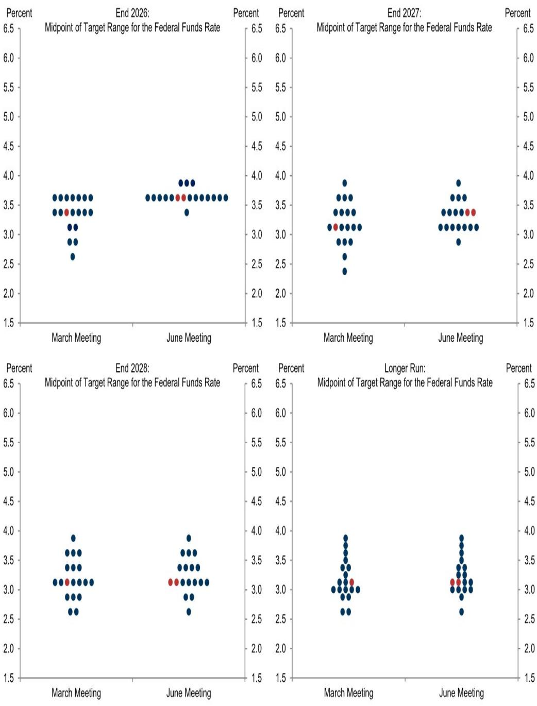
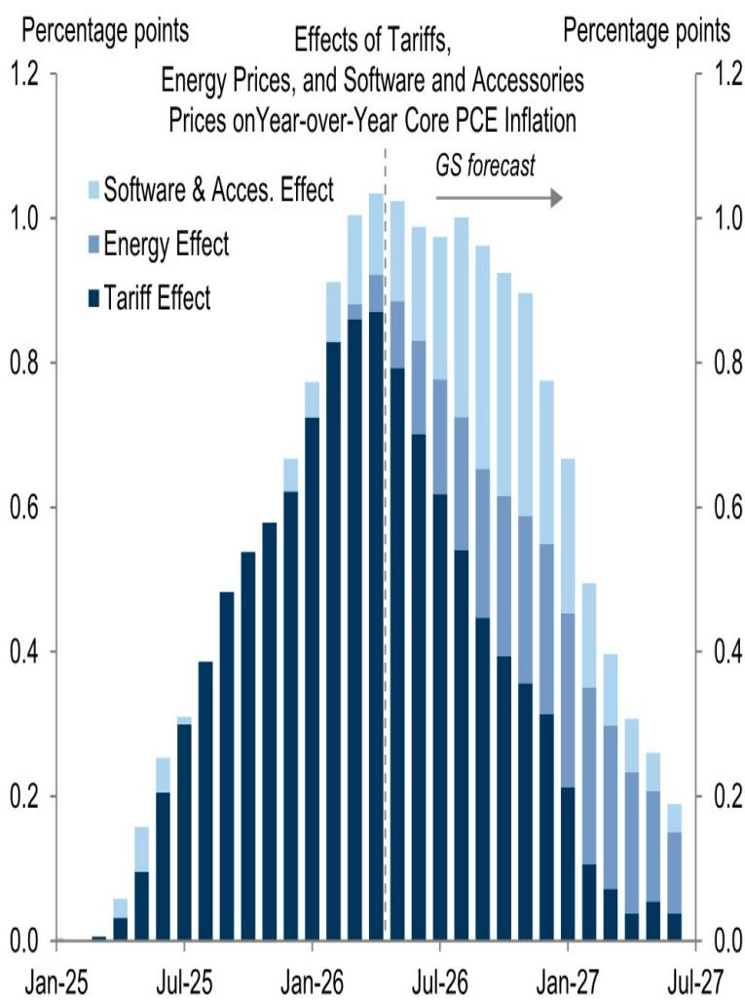
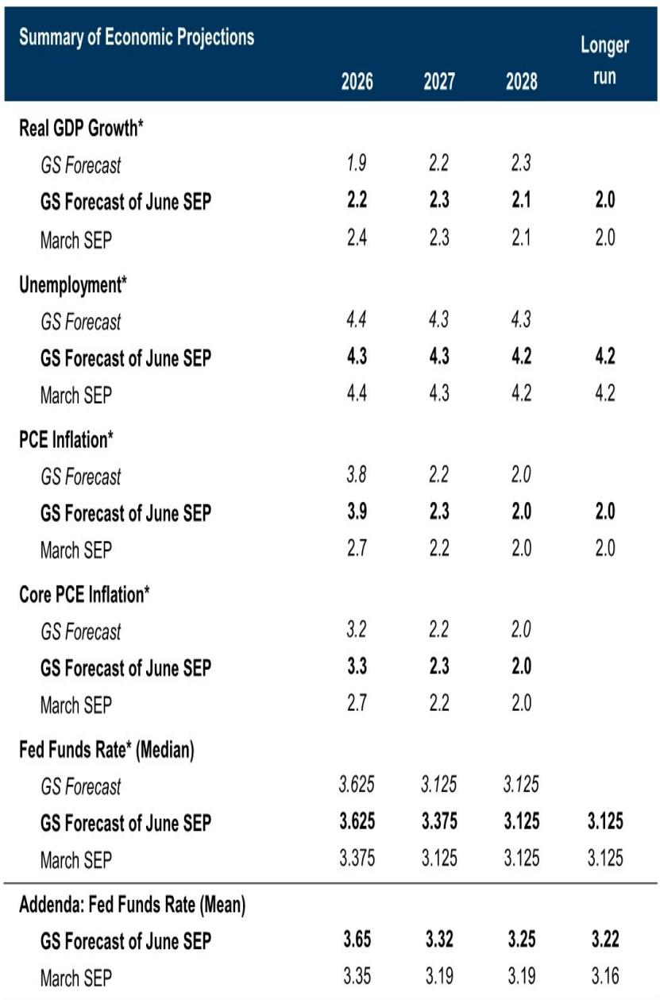

# The Fed Will Not Hike Despite Sticky Inflation: Why This Cycle Is Different and What Investors Should Prepare For

The Federal Reserve faces its most complicated policy dilemma in years. Inflation is running well above target, core PCE is projected to remain above 3 percent through the end of 2026, and the combination of tariffs, energy prices, and semiconductor costs is creating persistent upward pressure on consumer prices. Yet the most likely outcome is not a rate hike. It is a prolonged pause followed by two modest cuts in 2027. This is not a forecast of complacency. It is a recognition that the inflationary impulse driving current readings is structurally different from the demand-driven overheating that forced the Fed into aggressive tightening in 2022-2023.

The argument rests on three pillars that the market has not fully priced. First, the labor market is sending genuinely mixed signals. The recent pickup in job growth provides reassurance, but the underlying trend remains well below the pace that historically triggers wage-driven inflation. Second, the inflation itself is largely supply-side in origin. Tariffs, oil prices, and memory chip costs are one-time price level adjustments, not self-reinforcing wage-price spirals. Third, the Fed's own historical behavior shows a clear reluctance to tighten in response to energy-driven inflation, especially when the labor market is moving toward balance rather than overheating.

The strategic implication for investors is uncomfortable. The most probable path involves rates staying higher for longer than current market pricing suggests, but not because the Fed is hawkish. It is because the Fed is patient. The risk of a hike is real but asymmetric: it requires a breakdown in inflation expectations or a broadening of price pressures into services and wages. Neither condition is met today. The bigger risk, and the one the market may be underestimating, is that the Fed's patience could be mistaken for tolerance, allowing inflation to become entrenched at a higher baseline. That scenario would force a much more painful adjustment later.

## The Labor Market Is Stabilizing, Not Tightening, Which Removes the Primary Trigger for a Hawkish Pivot

The most important data point in the current cycle is not the inflation print. It is the trajectory of the labor market. After a prolonged period of cooling that saw monthly job growth fall to near zero in late 2025, the recent acceleration to 130,000 in May 2026 has provided genuine relief. But the context matters enormously. The underlying trend, as estimated by a smoothed composite of payroll and household employment, remains below 40,000 per month. That is well below the pace needed to sustain a tightening labor market.

The unemployment rate has stabilized in the 4.4 to 4.5 percent range, up from its trough of 3.4 percent in early 2023. More importantly, the Fed's own measure of labor market slack has moved decisively into neutral territory. Wage growth has moderated from the 5.5 percent peak in 2024 to an estimated 3.5 percent by 2027. This is not a labor market that is generating inflationary pressure. It is a labor market that has rebalanced without a recession, which is precisely the soft landing outcome the Fed has been targeting.

The so what is straightforward. The Fed's dual mandate gives it two objectives: maximum employment and price stability. When the labor market is tight and inflation is high, the trade-off forces the Fed to prioritize inflation. But when the labor market is balanced, the Fed has more room to look through supply-driven inflation. The current configuration of moderate job growth, stable unemployment, and decelerating wages means the employment side of the mandate is not flashing red. That removes the most powerful argument for a rate hike.

## The Inflation Overshoot Is Supply-Driven and Self-Correcting, Which Historically Does Not Trigger Fed Tightening

The composition of current inflation is more important than its level. The report decomposes the core PCE overshoot into three components: tariffs, energy prices, and computer memory prices. Together, these account for roughly 1.0 to 1.2 percentage points of the 3.3 percent core inflation forecast for 2026. These are not demand-driven price increases. They are relative price adjustments caused by policy changes, geopolitical events, and semiconductor supply dynamics.

Tariffs are a tax on imports. They raise the price level once, and the effect fades as the base effect drops out. Oil prices are volatile and mean-reverting. Computer memory prices are cyclical and already showing signs of peaking. The report shows the tariff contribution peaking in mid-2026 and then declining sharply through 2027. The energy contribution follows a similar pattern. By mid-2027, the combined effect of these three factors is projected to be near zero.

The historical evidence supports the view that the Fed does not hike in response to supply shocks. An analysis of Fed and ECB behavior shows that the probability of hawkish language following an oil price increase is only 2.5 percent for the Fed when the oil shock is supply-related, compared to 36.5 percent for the ECB. The difference reflects the Fed's historical willingness to look through energy-driven inflation, provided that inflation expectations remain anchored and the labor market is not overheating.

The critical question is whether this time is different. The answer depends on whether the supply shocks become self-sustaining through second-round effects on wages and services inflation. The report's wage tracker suggests this is not happening. Wage growth is decelerating, not accelerating. The breadth of inflation across categories, which was extraordinarily high in 2023, has narrowed significantly. The share of categories with inflation above 6 percent has fallen from over 60 percent to around 20 percent. This is a normalization, not a broadening.

## The Fed's Guidance Shift Is a Signal of Patience, Not a Prelude to Easing

The report anticipates that the FOMC will modify its forward guidance by removing the phrase "the extent and timing of additional" from its statement. This is a subtle but meaningful change. The current language implies that the Committee is actively considering further adjustments, which could be either hikes or cuts. Removing that phrase signals that the Committee sees the current rate level as appropriate for the foreseeable future.

This is consistent with the broader pattern of the statement being simplified and shortened. The post-meeting statement has become increasingly formulaic, but the changes matter. The removal of forward guidance on the direction of rates gives the Fed maximum flexibility. It can hold steady without appearing committed to a particular path, and it can react quickly if conditions change without having to reverse a previous signal.

The economic projections reinforce this message. The median dot for 2026 is unchanged at 3.625 percent, implying no rate change this year. The 2027 dot moves to 3.375 percent, implying one cut. The 2028 dot moves to 3.125 percent, implying another cut. This is a flat path with a very gradual easing bias. It is not a dovish pivot. It is a recognition that rates need to stay restrictive for longer to ensure inflation returns to target, but that the terminal rate is likely lower than current levels.

The market pricing tells a different story. The probability-weighted Fed forecast from the report shows a more dovish path than market pricing, reflecting skepticism about the likelihood of hikes. The market is pricing in a higher probability of hikes than the report's analysts consider justified. This divergence creates an opportunity for investors who understand the Fed's reaction function. If the Fed does not hike, the market will have to reprice lower. If the Fed does hike, it will be because inflation expectations have broken higher, which would be a much more damaging scenario for risk assets.

## What the Report Does Not Fully Answer: The Conditions That Would Force a Hike

The report makes a compelling case that a hike is unlikely, but it leaves several open questions that are critical for investors to monitor. The most important is the threshold for action. The report states that "concerning signals from inflation expectations or the breadth of high inflation across categories would make hikes more likely." But it does not specify what constitutes a concerning signal.

The Fed's index of common inflation expectations is currently at 2.3 percent, which is above the 2 percent target but not alarming. The question is whether this index can drift higher without triggering a response. If it moves above 2.5 percent, the Fed's credibility would be at stake. Similarly, the breadth of inflation has narrowed, but it could broaden again if tariffs lead to domestic price increases in non-traded goods and services. The report does not provide a clear framework for when the Fed would view the inflation as self-sustaining rather than transitory.

Another open question is the role of financial conditions. The Fed has been reluctant to tighten in response to supply shocks, but it has also been sensitive to financial stability risks. If inflation remains sticky and the economy continues to grow, financial conditions could ease further, creating a self-reinforcing cycle of higher asset prices and higher inflation. The report does not address how the Fed would respond to a situation where the economy is growing above trend, inflation is above target, and financial conditions are loose.

Finally, the report does not fully explore the political and institutional dynamics. The Fed is under pressure from both sides. Fiscal policy is expansionary, with tariffs acting as a de facto tax increase that reduces aggregate demand while raising prices. The Fed's independence is being tested by political demands for lower rates. The report's analysis is technically sound, but it assumes that the Fed will remain purely data-dependent. That assumption may be tested in ways the report does not anticipate.

## A Decision Framework for Investors: How to Position Across Four Scenarios

The report's probability-weighted forecast provides a useful starting point for scenario analysis. The analysts assign a 30 percent probability to their baseline of cuts in June and December 2027, a 25 percent probability to higher inflation and a higher terminal rate, a 25 percent probability to a recession, and a 20 percent probability to rate hikes. This framework can be translated into concrete portfolio positioning.

In the baseline scenario of patience followed by gradual cuts, the yield curve should steepen as the front end stays anchored and the back end prices in lower future rates. Duration should be added gradually, with a focus on the intermediate part of the curve. Credit spreads should remain tight as the economy avoids recession and default rates stay low. Equities should perform well, with cyclical sectors benefiting from stable growth and falling rates.

In the higher inflation and higher terminal rate scenario, the curve would flatten or invert as the Fed is forced to keep rates higher for longer. Cash and short-duration bonds would outperform. Inflation-linked bonds would provide a hedge. Equities would face headwinds from higher discount rates, but value and commodity-related sectors could benefit from the inflation itself.

In the recession scenario, the curve would steepen dramatically as the Fed cuts aggressively. Long-duration bonds would be the best performer. Credit spreads would widen, and high-yield bonds would underperform. Equities would decline, with defensive sectors and quality stocks providing relative protection.

In the hike scenario, which the report considers the least likely, the curve would invert and risk assets would sell off sharply. Cash would be the only safe haven. The Fed would be tightening into a slowing economy, which is historically the worst environment for both bonds and equities.

The key insight from this framework is that the probability-weighted path is more dovish than market pricing. If the market is overpricing hikes, then the correct trade is to be long duration and long risk assets, with a hedge against the recession scenario. If the market is underpricing the risk of higher inflation, then the correct trade is to be short duration and long inflation protection. The report's analysis suggests the former is more likely, but the latter cannot be dismissed.

## The Unresolved Analytical Question That Demands Further Study

The most intellectually honest conclusion from this report is that the Fed's path is more uncertain than the baseline forecast suggests. The report does an excellent job of explaining why a hike is unlikely, but it does not fully resolve the tension between supply-driven inflation and the risk of second-round effects. The tariffs are a one-time price level shock, but they interact with an economy that is still operating above potential in some sectors. The oil price increase is transitory, but it comes at a time when inflation expectations are already elevated.

The critical variable to watch is not the headline inflation number. It is the behavior of services inflation ex-housing, which is the most domestically determined and wage-sensitive component of core PCE. If this measure starts to accelerate, it would signal that the supply shocks are feeding through into domestic pricing behavior. That would be the trigger for a more aggressive Fed response. The report's data shows this is not happening yet, but the risk is real.

Investors who want to understand the full picture need to dive into the original charts and data. The report contains detailed projections for the composition of inflation, the trajectory of wage growth, and the evolution of labor market slack. These are the inputs that will determine whether the Fed's patience is rewarded or punished. The summary above provides the strategic framework, but the tactical decisions require a granular understanding of the data.

Join the community to read the full report and review the original charts.

*This article is for learning and discussion only and does not constitute investment advice.*

Personal reading notes and learning share only. Not investment advice.

