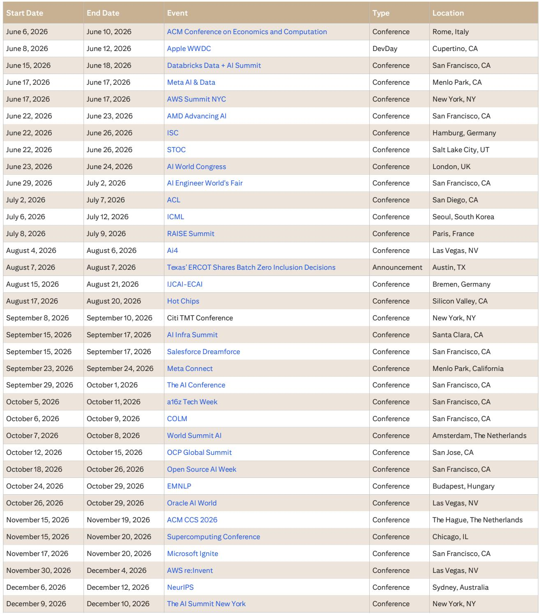
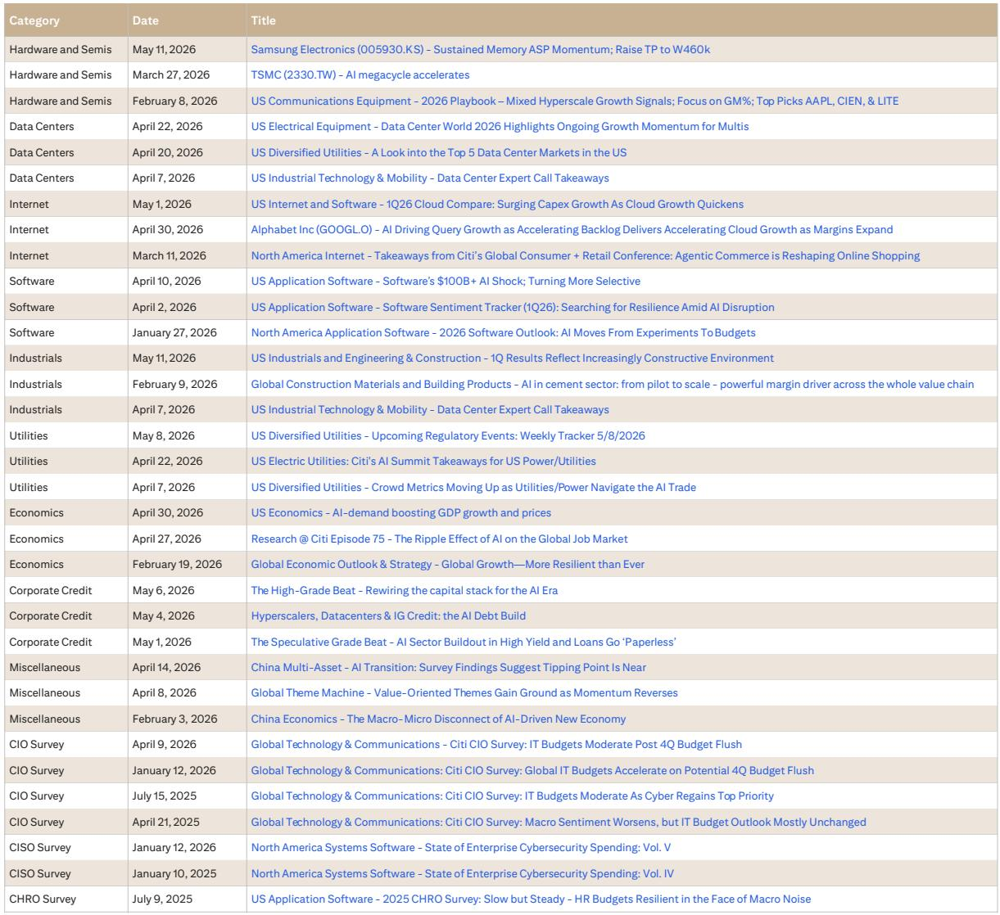
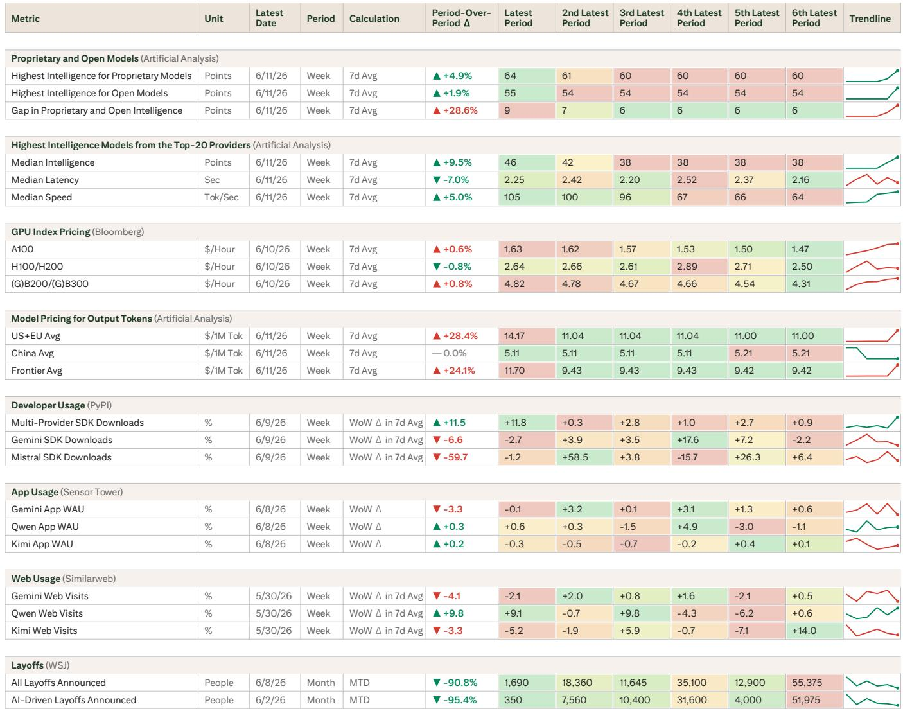

# Citi：AI推理层正在从“成本竞赛”转向“稀缺性定价”，市场低估了中间层的结构性机会

这份来自Citi的最新AI行业周报，揭示了一个正在发生的关键转变：AI基础设施的定价逻辑，正在从“算力成本下降驱动应用爆发”的线性叙事，转向一个更复杂、也更有利可图的结构——**稀缺性正在被货币化，而货币化的速度超过了稀缺性被解决的速度。**

这不是一个关于“大模型军备竞赛”的故事，而是一个关于“中间层如何捕获价值”的故事。Citi用六周的数据追踪，给出了一个清晰的信号：市场对AI的关注点，应该从“谁的模型最强”转向“谁在控制推理的分配权”。

以下是这份报告的核心洞察。

## 1. 稀缺性正在成为AI基础设施的定价锚，而不是成本

Citi的数据显示，最前沿模型的推理价格在六周内几乎翻倍，而性能只提升了4个点。这并非技术进步放缓，而是一种主动的定价策略。报告明确指出，模型提供商已经开始将“配给”作为产品特征——新的顶级模型在6月22日后被置于使用积分之后，这意味着用户无法无限量按需调用。

与此同时，上一代A100 GPU的租赁价格在过去六周内上涨了11%，而高端B200/B300的价格也在稳步攀升。这与市场普遍预期的“算力成本持续下降”形成了鲜明对比。

**这意味着什么？** 算力不再是纯粹的“commodity”，而是正在被分层定价。稀缺性（无论是物理GPU的稀缺，还是顶级模型推理能力的稀缺）正在成为定价的决定性因素。对于依赖推理成本假设来构建商业模型的投资者和企业决策者来说，这是一个需要重新校准的关键变量。

## 2. 最前沿的模型正在主动拉大与开源模型的差距，而非被动降价

一个反直觉的数据是：专有模型与开源模型之间的智能差距，在六周内从6个点扩大到了9个点。这意味着，前沿模型提供商（如报告提及的Google等）选择在“智能”这个维度上建立结构性壁垒，而不是在价格上与开源模型进行消耗战。

同时，中位数的推理速度在六周内从64 tok/s提升到了105 tok/s，而中位数的延迟则下降了7%。**速度正在向中端市场聚集，而智能则向上游集中。** 这形成了一个清晰的“智能-速度-价格”三角分化：顶级模型卖的是智能，中端模型卖的是速度，低端模型卖的是价格。

**对于企业用户而言，这意味着“一刀切”的模型选择策略将失效。** 不同任务需要匹配不同的模型，而能够高效完成这种匹配的中间层——即报告所称的“推理编排层”——将获得巨大的价值。

## 3. 推理编排层正在成为AI价值链中价值最集中的环节

Citi报告中最具洞察力的判断之一是：由模型分层定价创造的租金和节省，正在向“拥有推理编译和性能剖析数据”的中间层集中。这个中间层知道：哪个模型、在何种量化水平、在何种硬件上、对哪个子任务能产生可接受的输出。

这本质上是一个“路由”问题。报告指出，挑战在于如何在捕获这些数据并实现高效路由的同时，不泄露企业IP或PII。这是一项极高的技术壁垒和数据壁垒。

**这意味着，未来的AI竞争，将从“谁拥有最好的模型”转向“谁拥有最好的路由数据”。** 拥有跨模型、跨硬件的性能剖析数据，并能够基于这些数据做出实时路由决策的中间层，将拥有对上游模型提供商和下游企业的议价权。Databricks和AWS的峰会，正是观察这一趋势如何落地的关键窗口。

## 4. 数据中心的选址逻辑正在发生根本性变化：电力从运营成本变为资本成本

Citi报告提供了两个关于数据中心选址的关键图表。第一，数据中心集群集中在零售电价9-12美分/千瓦时的区域。第二，可再生能源占比超过25%的州吸引了不成比例的数据中心容量。

这背后是一个更深层的变化：**电力成本正在从“建成后的运营成本”转变为“建设前的资本成本”。** 报告引用了一个案例：一家私有云服务商签约了4.9GW的电力，但其总规划管道超过40GW。12%的签约/规划比例，意味着这些管道更像是开发商持有的“期权”，而非确定的建设计划。

**对于投资者而言，这意味着数据中心的真实供给弹性远低于市场预期。** 电力获取、环保承诺和审批周期，正在成为比芯片供应更硬的约束。那些能够提前锁定低成本、高可再生能源占比电力的数据中心运营商和云服务商，将获得持续的竞争优势。

## 5. 报告尚未完全回答的关键问题：路由数据的壁垒到底有多高？

Citi报告指出了路由层的重要性，但并未完全展开一个关键问题：**这些路由数据的获取和积累，是否存在规模效应或网络效应？** 换言之，一旦某个中间层服务商掌握了足够多的路由数据，它是否会形成“赢家通吃”的局面？

这里的判断仍需谨慎。一方面，数据越多，路由算法越精准，这确实构成正反馈。但另一方面，企业IP和PII的保护要求，可能限制数据的跨客户流动，从而削弱网络效应。此外，模型本身也在快速迭代，今天积累的路由数据，是否适用于明天的模型，也是一个开放问题。

**这个未解问题，直接关系到“路由层”是否是一个可持续的投资主题，还是一个阶段性套利机会。** 这需要更深入的竞争格局分析和数据积累观察。

## 6. 一个值得跟踪的观察框架：关注“三个顶点”的动态平衡

Citi报告提出了一个简洁而有力的分析框架：**“智能-速度-价格”三角。** 目前没有一家提供商能够同时占据三个顶点。前沿模型在智能上领先，中端模型在速度上优化，开源模型在价格上竞争。

对于产业决策者和投资者，这个框架提供了一个持续跟踪的坐标：
- 如果某个提供商（例如Google的Gemini 3.5 Pro，报告称其“仍在事件视界上”）能够同时提升智能和速度，同时不显著推高价格，那么它将打破现有的平衡，重塑竞争格局。
- 如果智能差距持续扩大，那么企业将更愿意为顶级模型支付溢价，推理编排层的价值将进一步提升。
- 如果开源模型在智能上取得突破，那么整个“智能溢价”的定价逻辑将受到挑战。

**这个框架的价值在于，它提供了一个超越单周数据的、结构性的观察视角。** 每一周的更新，都可以在这个三角中找到位置，从而判断趋势是短期的波动还是长期的拐点。

---

Citi这份报告的价值，不在于给出了一个确定的结论，而在于提供了一个更精确的、基于数据的分析框架。它告诉我们，AI基础设施的竞争，正在从“谁跑得快”转向“谁的路由更聪明”。而路由的胜负手，在于数据，而不在于模型。

报告中的多个图表（如数据中心选址与电价的关联、GPU租赁价格的分化、模型智能-速度-价格的三角分布）都值得反复推敲。这些图表背后的一阶和二阶影响，在本文中只能触及皮毛。

如果你对“推理编排层”的竞争格局、路由数据的商业壁垒、或者电力成本如何重塑数据中心投资回报率等话题有进一步的兴趣，欢迎来我们的星球微信群里继续讨论。那里有更完整的报告原文解读、原始数据的讨论，以及更多来自一线从业者和投资者的视角。

Personal reading notes and learning share only. Not investment advice.

