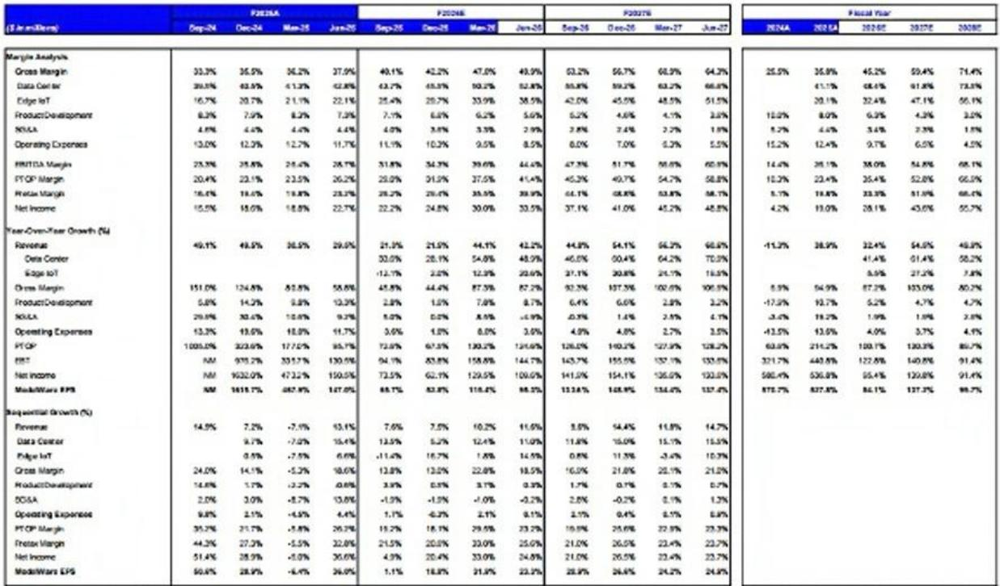
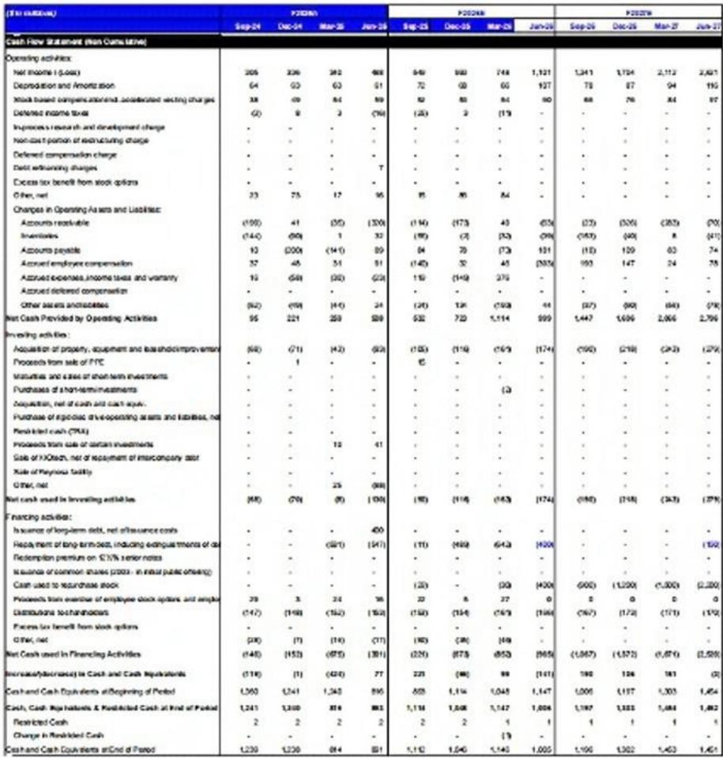
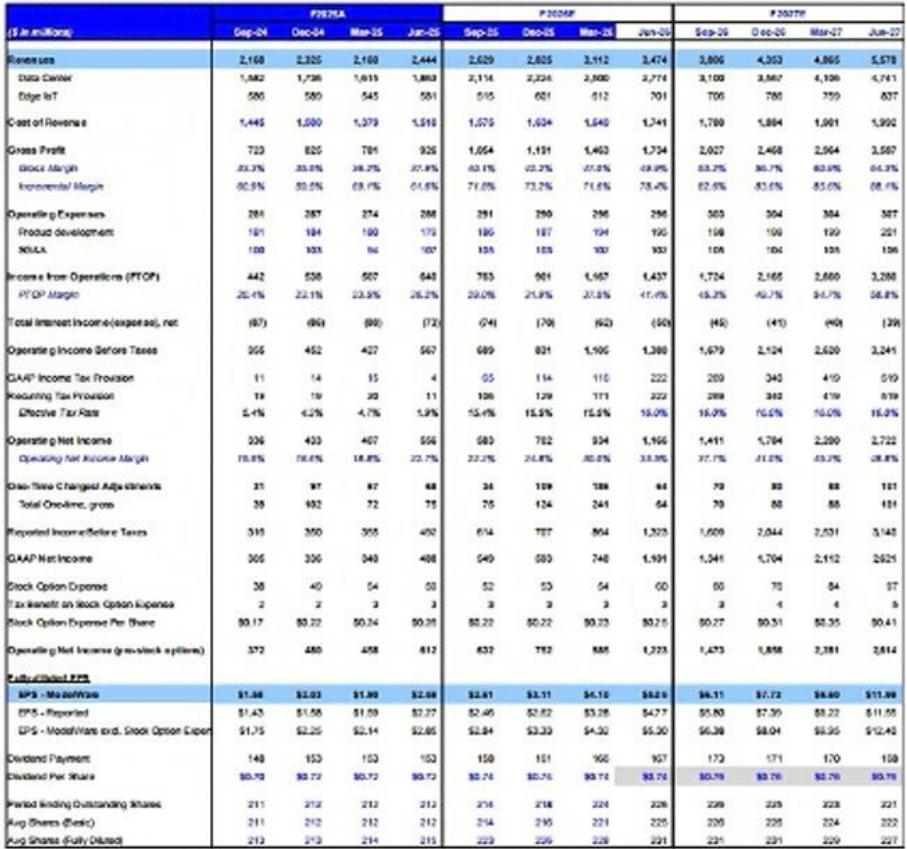

# 摩根斯坦利：市场正在严重低估HDD周期的长度与定价弹性

这份来自摩根斯坦利的研报，核心判断只有一句话：硬盘驱动器（HDD）的繁荣周期远未结束，恰恰相反，市场对它的长度和盈利弹性都严重低估了。

报告基于过去三周在亚洲的密集调研——包括台湾AI峰会、Computex展会以及西部数据亚洲路演——得出了一个清晰的结论：HDD的供需缺口正在扩大，定价权正在向供应商转移，而这一趋势至少将持续到2028年。

摩根斯坦利因此大幅上调了希捷科技（Seagate Technology）和西部数据（Western Digital）的盈利预测与目标价。希捷目标价从767美元上调至1035美元，西部数据从488美元上调至650美元。更重要的是，报告指出，在乐观情景下，这两家公司可能在2025至2028年间实现EPS的10倍增长。

这不是一个关于“周期高点”的故事。这是一个关于结构性供需失衡、供应商理性定价以及AI推理需求意外拉动传统存储的故事。对于关注科技硬件和AI基础设施的投资者来说，这可能是当前最具预期差的机会之一。

## 1. 供需缺口正在扩大，而不是收窄——短缺至少延续到2028年

市场对HDD周期的一个常见误判是认为这轮需求高峰已经过去。摩根斯坦利的最新调研完全推翻了这一假设。

报告明确指出，HDD需求正在以每年40-50%的速度增长，而供给（以EB计）的增长仅为30-35%。这意味着供需缺口不仅存在，而且在持续扩大。具体数据是：2026年近线HDD供给将比需求少300EB（约10-15%的缺口），2027年和2028年缺口将进一步扩大至400EB。

为什么需求如此强劲？报告给出了两个关键驱动因素。第一，核心云服务的增长超出了预期。第二，AI推理和智能体（agents）的需求正在拉动通用服务器出货量，进而带动HDD需求。值得注意的是，调研显示超大规模云服务商目前部署HDD的比例接近100%，而历史平均水平约为70%。这意味着云服务商手中几乎没有库存缓冲。同时，ODM厂商的HDD库存仅有1-2周。整个供应链处于极度紧张的状态。

供给端则受到严格约束。HDD供应商没有新建产能的计划。过去几年行业经历了痛苦的整合与产能出清，供应商已经形成了高度理性的资本纪律。这意味着未来2-3年近线EB的增长将完全由供给决定，而供给增速被锁定在30-35%的CAGR。需求增速远超供给增速，结果是短缺的持续加深。

这一判断的含义是：HDD的景气周期不是几个季度的事情，而是一个将持续至少三年的结构性机会。市场若仍以“周期股”的框架来估值HDD公司，很可能错过了最核心的定价逻辑变化。

## 2. 定价弹性被严重低估——每TB价格可能翻倍，而增量利润几乎全部落到底线

供需缺口只是第一层逻辑。真正让摩根斯坦利大幅上调盈利预测的，是定价端的巨大弹性。

报告提供了几个关键数据点。目前希捷和西部数据的混合近线HDD每TB价格在14.30-14.90美元。今年4月，调研显示供应商可能在2027-2028年实现每TB 20美元的价格。而最新的台湾调研显示，供应商的目标是每TB 25-30美元。更值得注意的是，现货市场（非长期协议客户）的HDD价格已经比此前高出约30%，部分分销商的售价已达到每TB 30-35美元。

这些数字意味着什么？摩根斯坦利做了清晰的量化分析。如果混合近线每TB价格在2027年达到25美元、2028年达到30美元——与台湾调研一致——希捷在2027年的EPS可能超过70美元，2028年超过100美元；西部数据2027年EPS可能超过40美元，2028年超过70美元。作为参照，这两家公司2025年的EPS分别约为10.24美元和6.95美元。这意味着三年内EPS可能增长10倍。

需要强调的是，报告并没有把这种极端情景作为基准。摩根斯坦利的新基准预测是2027年每TB价格约19-19.5美元，2028年约22美元。即便如此，新预测下希捷2028年EPS为70.64美元，西部数据为43.47美元，分别比市场共识高出74%和66%。

定价弹性之所以如此重要，是因为HDD行业的成本结构决定了增量定价几乎全部转化为利润。每TB价格每上涨1美元，扣除税费后几乎全部进入EPS。这和半导体或NAND行业不同——那些行业需要持续的大规模资本支出来支撑增长，而HDD供应商的资本支出已经高度可控。报告明确表示，所有增量定价的盈利弹性都是“税后全部利润”。

## 3. 供应商正在主动重塑定价权——拒绝超长期协议，控制商业条款

这一轮HDD周期的另一个独特之处在于，供应商不再是被动接受价格，而是主动管理定价权和商业条款。

报告揭示了一个非常有意思的细节：虽然超大规模云服务商希望签订长达2032年的长期协议（LTA），但HDD供应商并不愿意签署这么长的合同。原因有三。第一，HDD的应用场景（尤其是冷存储）正在拓宽，供应商对未来需求的可见性在增强，因此不愿意过早锁定不利的价格。第二，短缺在加剧，TCO（总拥有成本）相对于NAND的竞争优势在显著改善。第三，HDD的替代技术目前不存在。

这意味着供应商正在利用供需紧张的结构性优势，主动控制商业条款。他们愿意为客户提供5年的产能和技术路线图可见性，但不急于在12个月以上锁定商业条件。这种策略的核心目的是在未来几年内逐步实现更高的定价，而不是一次性锁定在可能偏低的水平。

这背后反映的是HDD行业竞争格局的根本性变化。经过多年的整合，希捷和西部数据已经形成了高度理性的双寡头格局。报告指出，HDD供应商在供给端极为自律，没有任何新建产能的意愿。这种供给纪律是过去十年行业痛苦的产物，也是当前定价权的基础。

## 4. 新进入者的威胁被严重高估——技术和供应链壁垒极高

当投资者看到HDD价格可能翻倍时，第一个问题往往是：为什么没有新进入者来抢夺这个市场？摩根斯坦利在与西部数据CEO Irving Tan的交流中得到了一个非常清晰的回答。

新进入者的挑战不在于资本，而在于三项几乎不可逾越的壁垒。第一，技术迁移的时间成本极高。从上一代技术迁移到下一代领先节点（如HAMR热辅助磁记录）需要超过10年的验证周期。第二，HDD技术横跨磁学、材料科学、光子学、纳米制造等多个截然不同的学科领域，新进入者几乎不可能在短期内实现垂直整合。第三，供应链高度集中且已满负荷运转。HDD供应链几乎没有闲置产能，新进入者即使有技术，也无法找到可用的供应链资源。

报告特别提到，中国厂商曾尝试开发冷存储替代方案（如华为的磁电盘），但收效甚微。这一信息虽然来自公司管理层，但结合行业常识，HDD的制造壁垒确实是全球半导体和精密制造领域中最高的之一。

这意味着，在未来3-5年内，HDD的供给格局不会发生根本性变化。希捷和西部数据将继续享受寡头定价权。这一判断对估值至关重要——如果供给端没有破坏性竞争，那么当前的高盈利水平就具有可持续性。

## 5. 报告尚未完全回答的关键问题：需求端的可持续性与NAND的竞争边界

尽管摩根斯坦利的论证非常有力，但一份好报告的价值不仅在于它回答了什么问题，更在于它留下了哪些值得深思的未解问题。

第一个未解问题是：AI推理和智能体对HDD的需求拉动到底有多可持续？报告指出AI推理正在拉动通用服务器出货，进而带动HDD需求。但AI推理本身是一个快速演进的领域。如果未来AI工作负载更多地转向专用硬件（如ASIC）或更高性能的存储层级，HDD的需求增速是否会放缓？报告没有给出明确答案。

第二个未解问题是：NAND价格暴涨的可持续性。报告提到，NAND价格的大幅上涨是HDD供应商敢于提价的重要背景之一。但NAND价格本身具有高度周期性。如果NAND价格在未来某个时点回落，HDD的TCO优势是否会减弱？这直接关系到HDD定价弹性的上限。

第三个未解问题是：超大规模云服务商的议价能力。报告指出供应商正在拒绝超长期协议，但云服务商也不是被动的。如果AWS、微软Azure和谷歌云联合施压，或者加速自研存储方案，HDD供应商的定价权是否会受到挑战？这是一个需要持续跟踪的动态博弈。

这些问题并不否定报告的核心判断，但它们决定了投资者应该如何构建自己的观察框架。

## 6. 投资者的观察框架：三个核心变量

基于以上分析，投资者需要关注的不是HDD行业的“是或否”，而是三个核心变量的演变。

第一个变量是每TB价格的实际走势。摩根斯坦利的基准预测与乐观情景之间相差约50%的EPS。投资者需要持续跟踪每季度供应商的定价公告、合同续签情况以及现货市场价格。这是最直接的盈利驱动因素。

第二个变量是供给增速是否出现意外变化。目前供应商的资本纪律非常严格，但如果有任何一家打破自律、启动新建产能，供需平衡的逻辑就会发生变化。关注希捷和西部数据的资本支出指引。

第三个变量是NAND价格的相对走势。HDD的定价弹性在很大程度上取决于NAND是否保持高位。如果NAND价格大幅下跌，HDD的TCO优势将被削弱，云服务商可能会重新考虑存储架构的分配。

这三个变量构成了一个简单的判断框架：只要每TB价格上涨趋势不变、供给纪律维持、NAND价格不出现断崖式下跌，HDD的盈利故事就依然成立。

## 7. 顺着这些未解问题，继续深入讨论

这份摩根斯坦利研报的价值在于，它把HDD从一个被市场忽视的“夕阳行业”重新拉回了投资者的视野。供需缺口、定价弹性、供给纪律、进入壁垒——这四个因素的共振创造了一个罕见的盈利周期。

但正如上文所述，这份报告也留下了几个关键的未解问题。AI需求的可持续性、NAND价格的走向、云服务商的博弈策略，这些变量将决定这个周期最终能走多远。

如果你对这些未解问题感兴趣，或者希望看到完整的原始图表和更详细的财务模型拆解，欢迎加入我们的星球微信群。我们会持续跟踪这些关键变量，并在第一时间分享来自一线调研和深度分析的最新判断。

Personal reading notes and learning share only. Not investment advice.

