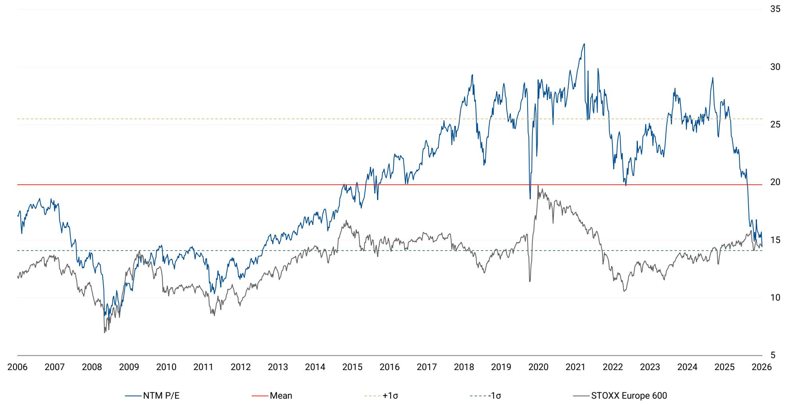
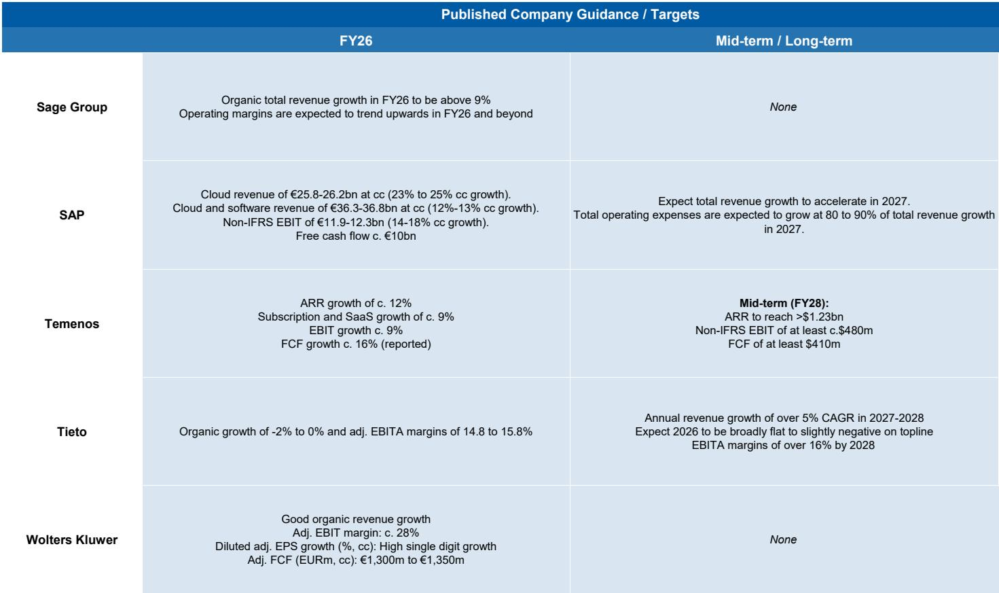

# The Software Drawdown Is Not a Replay of 2000 — But It Demands a New Investment Playbook

The European software sector has entered its longest stretch without a new all-time high in nearly two decades, and the scale of the drawdown now rivals the Global Financial Crisis. According to a recent analysis by a global investment bank, an equal-weighted basket of over 50 mid-to-large cap software stocks listed since 2005 has now gone approximately 1,700 days without surpassing its late-2021 peak. The aggregate decline from that peak exceeds 35%. This is not a garden-variety correction. It is a structural repricing that has persisted through two distinct macro regimes — the rate-hiking cycle of 2022-2023 and the AI-driven recovery narrative of 2024-2025. The fact that the basket failed to reclaim its highs even as enthusiasm around generative AI reached a fever pitch tells investors something critical: the market is not simply waiting for lower rates or better earnings. It is recalibrating what software companies are worth in a world where AI is both a growth driver and a competitive threat.

The drawdown has not been uniform. While application software has borne the brunt of the selling, data infrastructure and cybersecurity names have recently rallied, with some stocks posting gains of 15% to 58% in a single month. This dispersion is the first signal that the market is beginning to discriminate — but it also raises a deeper question. If the software sector as a whole is still 35% below its peak, and the AI narrative is now several years old, what catalyst could plausibly lift the entire basket back to its former highs? The answer may be that no single catalyst exists, and that the sector is undergoing a permanent re-rating that demands a new framework for stock selection.

The purpose of this article is not to summarize the report's findings. It is to argue that the current drawdown represents a regime change, not a cyclical trough, and that investors must adopt a much more granular approach to software investing — one that separates companies with durable AI moats from those whose business models are being disrupted by the very technology they are selling.

## The 1,700-Day Drawdown Is a Structural Signal, Not a Cyclical One

The most striking data point in the analysis is the duration and depth of the current drawdown. The basket of software stocks peaked during the COVID-era boom in late 2021, when lockdown-driven digitization pulled forward years of demand into months. Since then, the index has declined more than 35% and has not come close to reclaiming its highs, even during the AI-driven rally of late 2024 and early 2025. To put this in historical context, the only comparable episodes were the Global Financial Crisis and the rate-hike and multiple-compression period that followed the COVID reopening. Both of those drawdowns were eventually resolved by macro recoveries. This one has not been.

The critical difference is that the current drawdown has persisted through a period of extraordinary technological advancement. Generative AI has been widely adopted by enterprises, cloud spending has accelerated, and software companies have reported strong revenue growth. Yet the market has refused to re-rate the sector. This suggests that the problem is not cyclical — it is structural. The market is pricing in a permanent reduction in the terminal value of many software businesses, likely because AI is compressing the competitive moats that once justified premium multiples. If a startup can build an application in days using an AI-powered platform, the switching costs and network effects that protected incumbents are worth less than they were.

The implication is clear: waiting for a macro recovery to lift all boats is a losing strategy. The sector is unlikely to return to its 2021 valuation regime, and investors must accept that the "software eats the world" thesis has been fundamentally disrupted by the very technology that was supposed to extend it.

## Application Software Faces a Disruption Wave That Incumbents May Not Survive

The report's discussion of the accounting automation wave provides a useful microcosm of the broader challenge facing application software. The accounting industry is embracing AI to address a structural shortage of qualified professionals and increasing regulatory complexity. According to a recent survey, over a third of tax firms and corporate tax departments have already deployed generative AI at an organizational level. This is not a future trend — it is happening now.

The report notes that while AI-native startups are attacking individual workflow steps, the core tax engine market is expected to remain dominated by incumbents like Wolters Kluwer and Thomson Reuters. This may be true in the near term, but it raises a strategic question that the report does not fully answer: how long can incumbents defend their position when the underlying technology stack is being commoditized? The barriers to entry in tax and accounting software have historically been high because of regulatory complexity, trust, and embedded workflows. But AI is eroding those barriers. If a startup can deliver 80% of the functionality at 50% of the cost, the remaining 20% may not matter to a cost-conscious CFO.

The broader point is that application software companies across verticals — from legal to healthcare to enterprise resource planning — face a similar dynamic. The report's London Tech Week takeaways reinforce this: enterprise AI adoption is still early, daily usage remains limited, and measurable productivity gains are not yet broadly proven. But the direction of travel is unmistakable. Every quarter, more enterprises deploy AI tools, and every quarter, the cost of building custom software declines. For application software companies, the question is not whether disruption will come, but whether they will be the disruptor or the disrupted.

## Data Infrastructure Is the One Segment Where the AI Thesis Is Actually Working

While application software has languished, data infrastructure names have rallied sharply. The report notes that Snowflake's stock is up approximately 58% over the past month, MongoDB approximately 15%, and Datadog approximately 17%. This is not random noise. It reflects a market that is beginning to understand that the first-order beneficiaries of AI are not the applications that use AI, but the platforms that store, process, and orchestrate the data that AI requires.

This is a critical insight for portfolio construction. The AI value chain is not linear. The largest revenue pools are likely to accrue to infrastructure providers — cloud platforms, data warehouses, observability tools, and model deployment services — rather than to application-layer companies that are competing with AI-native startups. The report's mention of Databricks reportedly raising funds at a valuation above $165 billion, up from $134 billion in February, underscores this point. Data infrastructure is where the money is flowing, and the market is rewarding it.

For investors, this means that a simple "buy software" strategy is no longer viable. The sector must be decomposed into its constituent layers: infrastructure, platform, and application. Each layer faces a different competitive dynamic and a different valuation regime. Infrastructure providers benefit from AI-driven demand growth and high switching costs. Application providers face margin compression and disruption risk. The dispersion in performance between these layers is likely to widen, not narrow, as AI adoption accelerates.

## The Report Leaves a Critical Question Unanswered: How Should Investors Value Software in an AI-Native World?

The report provides extensive valuation charts for individual companies, showing that many are trading at or below their historical multiples. Amadeus, Capgemini, Dassault Systemes, and others are all well below their long-term average P/E ratios. This might suggest that the sector is cheap. But cheap is not the same as undervalued. The market may be correctly pricing in lower future growth and higher disruption risk.

The report does not offer a framework for determining whether current multiples are justified. It documents the drawdown, describes the dispersion, and highlights specific opportunities like Sage's tailwind from UK digital filing requirements. But it does not answer the question that matters most: at what multiple should a software company trade when its competitive advantage is being eroded by AI?

This is the open question that the full report likely addresses in more depth. The data presented suggests that the market is still struggling to find an answer. The NTM P/E for the European software coverage group has compressed from over 30x in 2021 to around 15x in 2026. That is a 50% multiple compression. Some of that is due to higher interest rates, but not all of it. The market is telling us that software companies are worth less, even in a low-rate scenario, because their future cash flows are less certain.

Investors who want to navigate this environment need a decision framework that goes beyond traditional valuation metrics. They need to assess which companies have genuine AI moats — proprietary data, unique workflows, or regulatory barriers — and which are simply renting their market position until a cheaper alternative arrives.

## A Decision Framework for Software Investing in the Age of AI

Based on the patterns in the report, a three-part framework emerges for evaluating software investments. First, assess the company's position in the AI value chain. Infrastructure and platform companies that provide the tools for AI deployment are likely to see sustained demand growth and pricing power. Application companies that sell to end-users face a more uncertain future, unless they have proprietary data or workflows that cannot be easily replicated.

Second, evaluate the company's ability to defend its margins. The report's discussion of the accounting industry shows that incumbents with trusted compliance systems and embedded customer workflows have durable advantages. But those advantages are not infinite. Investors should look for companies that are actively integrating AI into their own products, rather than waiting to be disrupted. The report's London Tech Week takeaways note that banks and asset managers are moving from AI experimentation toward targeted, ROI-focused deployments. The same discipline should apply to software companies themselves.

Third, consider the regulatory and structural tailwinds that are independent of AI. The report's analysis of Sage's tailwind from UK digital filing requirements is a good example. From April 2028, all UK companies will need to file annual accounts using commercial software. This is a regulatory mandate that will drive adoption regardless of the competitive landscape. Similar tailwinds exist in other verticals — healthcare digitization, ESG reporting, and government modernization — and they provide a floor for revenue growth that is not dependent on AI hype.

The framework is not exhaustive, but it provides a starting point for distinguishing between companies that are cheap for a reason and companies that are undervalued because the market has not yet appreciated their structural advantages.

## The Full Report Contains the Charts and Data That Make This Argument Actionable

The analysis presented here is based on a single report from a global investment bank, but the implications extend across the entire software sector. The drawdown is real, it is structural, and it demands a new investment playbook. The report contains detailed valuation charts for individual companies, a visualisation of the 20-year performance basket, and specific analysis of the accounting automation wave that provides a template for understanding disruption in other verticals.

The charts are not decorative. They are the raw material for the kind of bottom-up analysis that will separate winners from losers in the coming years. Investors who rely on broad sector ETFs or simple "buy the dip" strategies are likely to be disappointed. Those who dig into the data, understand the dispersion, and build a portfolio around companies with genuine AI moats and regulatory tailwinds have a much better chance of generating alpha.

Join the community to read the full report and review the original charts.

*This article is for learning and discussion only and does not constitute investment advice.*

Personal reading notes and learning share only. Not investment advice.

