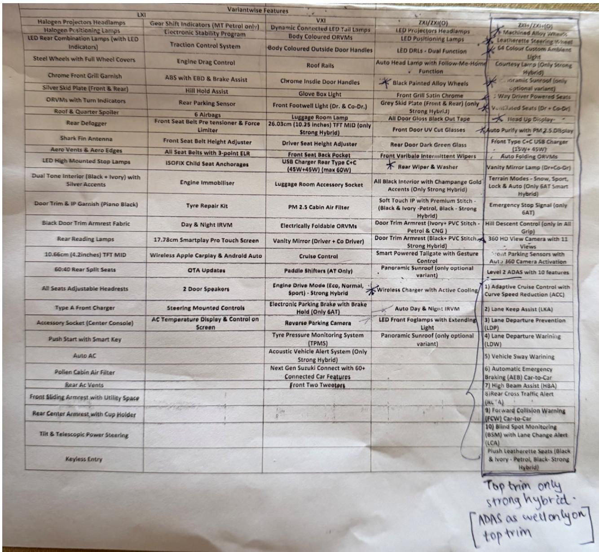
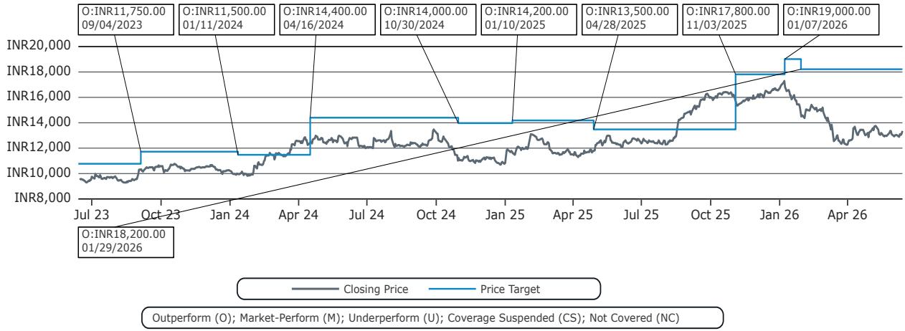
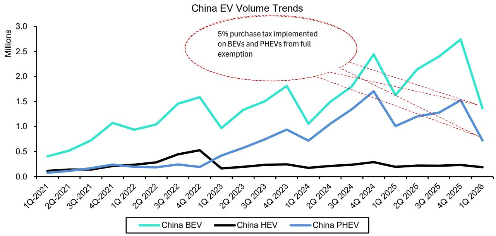

# India's Hybrid Inflection Is Real, But It Belongs to the OEMs That Built Powertrain Optionality, Not Conviction

The most important data point about India's automotive market in 2025 is not the headline growth of electric vehicles. It is the fact that strong hybrids grew 83% from just eight models, taxed at 40% with no central subsidy, while competing against 35-40 battery electric vehicles taxed at 5%. That is not a policy-driven outcome. That is revealed preference. Indian buyers are voting with their wallets for a technology that the regulatory framework actively penalizes, and they are doing so at a pace that demands a fundamental reassessment of how the powertrain transition will unfold.

The conventional narrative has been that India will leapfrog hybrids and move directly to EVs, following a China-style trajectory. That narrative is collapsing under the weight of its own assumptions. The hybrid segment is not small because demand is weak. It is small because supply is virtually nonexistent. Only eight strong-hybrid nameplates are on sale in a market that supports over 200 passenger vehicle variants. The correlation between model availability and penetration is nearly perfect across global markets, and India sits in the bottom-left corner of that chart with the fewest doors. When those doors open, the volume will follow.

The inflection point is not hypothetical. It is scheduled. By FY28, the hybrid catalog will more than double, driven by Maruti's in-house series-hybrid system, Hyundai's confirmed eight-model plan, and a wave of Korean and Japanese launches targeting the INR 1-2.5 million sweet spot. Maruti is not waiting for policy to turn favorable. It is engineering its way around the tax disadvantage by targeting the 18% small-car GST slab with sub-4 meter bodies that deliver 35+ kmpl. That is a structural unlock, not a promotional campaign.

The strategic question for investors is not whether hybrids will grow. They will. The question is which OEMs are positioned to capture that growth without being trapped by their own narratives. Maruti has built powertrain optionality by design, targeting a mix of 35% CNG, 25% ICE, 25% hybrid, and 15% EV by FY31. It does not need to be right about which technology wins. It only needs the war to be fought. Mahindra, by contrast, has staked its public positioning on an EV-first strategy, classifying hybrids under "petrol" and opposing hybrid incentives. Its hybrid hedge is real but thinner and later, and the asymmetry of outcomes is worth examining closely.

## The Hybrid Segment Is Small Because the Catalog Is Small, Not Because Demand Is Absent

The 83% growth in strong-hybrid sales during 2025 is routinely dismissed with three objections: it is off a low base, it is a Toyota story, and it is concentrated in SUV-MPV body styles where the market is moving anyway. Each objection is factually correct and analytically misleading. Low bases compound, and 83% growth from an already established base of 57,600 units in 2024 is not a statistical artifact. Toyota holds over 80% of the segment, but that is not evidence that only Toyota buyers want hybrids. It is evidence that, until recently, only Toyota was selling them at scale. The concentration in SUVs and MPVs is real, but that is where the models are. The segment is not narrow because demand is narrow. It is narrow because the product lineup is narrow.

The clinching evidence comes from Maruti. When Maruti introduced hybrid-only top trims on the Victoris, reserving features like the panoramic sunroof, 360-degree camera, ADAS, and ventilated seats exclusively for the hybrid variant, demand appeared. That is not a coincidence. Maruti understood that it could not compete on fuel efficiency alone against a tax-disadvantaged powertrain, so it competed on features. The hybrid became the premium option, and buyers responded. The strategy worked because it addressed the real constraint: customers needed a reason to pay more for a hybrid, and Maruti gave them one.

Step back to the cross-country view and the relationship between catalog size and penetration becomes unmistakable. Japan runs at approximately 34% hybrid penetration off 35-40 models. Europe is at roughly 34% off 50-60 lineups. The United States sits at 12-13% off 35-40 models. India is at 2.3% off eight models. The pattern is not a coincidence. It is a supply-side equation. India is not a different kind of market. It is the same kind of market with the fewest doors. When the doors multiply, the penetration will follow.

## The Catalog Will Double by FY28, and the New Models Target the Market's Center of Gravity

The upcoming launch wave is not a roadmap slide or a management aspiration. It is a dense, front-loaded cohort of confirmed and advanced-stage programs. Maruti's in-house series-hybrid system debuts on the Fronx in 2027 and spreads to the Swift and Baleno. This is the decisive move because it does two things simultaneously. It strips out the Toyota licensing cost that has kept strong hybrids at a premium-SUV price point, and it targets the 18% small-car GST slab with sub-4 meter bodies that deliver 35+ kmpl. That combination drags the strong hybrid down toward INR 1-1.5 million, into the heart of the Indian market for the first time.

Hyundai has confirmed an eight-model hybrid plan by 2030, starting with the Creta hybrid. Kia will follow with the Seltos hybrid. Renault is bringing the Duster E-Tech. Mahindra is developing a strong-hybrid XUV 3XO for 2026 and range-extenders for the BE 6 and XEV 9e. The catalog goes from eight nameplates in 2025 to roughly 27 by 2030. The expansion is concentrated in the volume segments where Indian buyers already spend their money.

The implications for market structure are significant. Currently, Toyota dominates the hybrid segment because it is the only OEM with a mature strong-hybrid system at scale. That dominance is about to erode, not because Toyota will lose share, but because the pie will grow faster than any single player can capture. Maruti, with its in-house system and distribution network, is the most obvious beneficiary. Hyundai and Kia bring global hybrid platforms and established brand equity in the SUV segment. The competitive dynamic shifts from a monopoly to an oligopoly, and that shift will accelerate adoption by increasing consumer awareness and dealer commitment.

The tax wall remains real. GST 2.0 keeps hybrids aligned with ICE at 40% for large vehicles and 18% for small vehicles. But the thesis does not rely on policy turning favorable. It relies on OEMs engineering around the tax disadvantage, which is exactly what Maruti is doing with its sub-4 meter series-hybrid strategy. The gap between hybrids and EVs on tax is wide, but the gap on total cost of ownership is narrowing, especially when depreciation and residual values are factored in.

## Residual Values and Running Costs Are the Underappreciated Structural Tailwinds

The financial case for hybrids in India is stronger than the sticker price suggests, and the market is beginning to price that in. Hybrids depreciate approximately 35% over five years, compared to over 60% for BEVs. In a fast-formalizing used-car market, that predictability is a structural advantage. Buyers who finance their vehicles care about total cost of ownership, not just the purchase price, and the used-car market is becoming sophisticated enough to reflect that reality.

The running cost advantage is also underappreciated. Hybrids deliver significantly better fuel efficiency than ICE vehicles in Indian driving conditions, where stop-and-go traffic is the norm. The efficiency gap widens in urban environments, which is exactly where most Indian passenger vehicles operate. Combined with the depreciation advantage, the total cost of ownership for a hybrid can undercut both ICE and BEV alternatives over a five-year holding period, even before factoring in charging constraints.

The charging infrastructure constraint is not going away quickly. India added approximately 10,000 public charging stations in 2025, but that is still a fraction of what is needed for mass EV adoption. Apartment dwellers, who constitute a large and growing share of urban buyers, face particular challenges with home charging. Hybrids solve that problem without requiring behavioral change. They refuel at existing stations, they deliver superior efficiency in city driving, and they offer a familiar ownership experience. That is not a niche value proposition. It is a mass-market value proposition.

## The Policy Risk Is Real but Not Symmetric, and Global Signals Are Instructive

The most significant risk to the hybrid thesis is policy. GST 2.0 could be revised to widen the gap between hybrids and EVs, or states could follow Kerala and Karnataka in rolling back EV tax benefits, which would narrow it. The direction of policy is uncertain, but the asymmetry is clear. If policy turns against hybrids, the impact is concentrated on the segment's growth rate. If policy turns against EVs, the impact is concentrated on the entire BEV investment thesis.

Global signals are instructive. In the United States and Europe, hybrids have outpaced BEVs as subsidies have faded. In Japan, hybrids remain the dominant alternative to ICE, with BEV penetration still in single digits. China is the exception, where policy has effectively switched off the hybrid market in favor of BEVs. But China's approach is not easily replicable. India's fiscal constraints, infrastructure limitations, and consumer preferences are different. The central government has shown no appetite for the kind of aggressive BEV mandates that China deployed.

The more relevant comparison is with Europe, where the regulatory push toward BEVs has created a hybrid resurgence as consumers and OEMs seek practical alternatives. India's regulatory environment is less prescriptive, which gives hybrids more room to grow organically. The risk is not that policy will switch off hybrids. The risk is that policy will not switch on enough BEV infrastructure to make the EV transition work at scale, leaving hybrids as the default alternative to ICE.

## The Decision Framework: Three Questions Every Investor Must Answer

The hybrid thesis reduces to three questions, and the answers determine positioning.

First, does the catalog expansion materialize on schedule? The launch wave is confirmed, but execution risk is real. Maruti's in-house series-hybrid system is a new platform, and new platforms carry development and production risks. Hyundai and Kia have global hybrid experience, but local sourcing and homologation add complexity. Mahindra's range-extender strategy is unproven at scale. The base case is that the catalog doubles by FY28, but the timing could slip by six to twelve months.

Second, does the tax wall hold? GST 2.0 could be revised, but the direction is uncertain. A widening of the tax gap would slow hybrid adoption. A narrowing would accelerate it. The base case is that the tax wall holds through FY30, because the fiscal cost of reducing EV incentives is lower than the political cost of raising hybrid taxes. But this is the variable that could break the thesis.

Third, does BEV cost decline arrive before or after the hybrid catalog matures? If BEV costs fall to parity with hybrids by 2028, the hybrid window closes quickly. If BEV costs remain elevated through 2030, the hybrid window stays open for the entire decade. The base case is that BEV costs decline gradually, not dramatically, because battery costs are driven by global commodity prices and local manufacturing scale, both of which are moving in the right direction but not fast enough to close the gap before 2030.

The answers to these questions determine which OEMs are positioned to win. Maruti wins in any scenario where the catalog expands and the tax wall holds, because its powertrain optionality allows it to capture hybrid growth without cannibalizing its ICE and CNG base. Mahindra wins only if BEV costs decline faster than expected, because its EV-first strategy is a bet on that outcome. If hybrids inflect on schedule while BEV costs remain elevated, Mahindra faces asymmetric downside. Its public EV conviction raises the cost of being wrong, and its hybrid hedge, while real, is later and thinner than Maruti's.

## What the Report Does Not Fully Answer Yet

The report establishes a strong case for hybrid growth through FY30, but it leaves several meaningful questions unresolved.

The first is the pace of BEV cost decline. The report assumes gradual decline, but the range of outcomes is wide. If Chinese battery manufacturers achieve the cost reductions they are targeting, the BEV cost curve could steepen faster than the report models. India's domestic battery production is nascent, and the global battery supply chain is shifting rapidly. The report's conviction is deliberately anchored to the back half of the decade, but that anchor could drag if BEV economics improve faster than expected.

The second is the behavior of the used-car market. The depreciation advantage for hybrids is a key part of the thesis, but the used-car market in India is still formalizing. The data on hybrid residuals is limited because the segment is young. The report's estimates are reasonable, but they are projections, not observations. If the used-car market does not price hybrid advantages as expected, the total cost of ownership case weakens.

The third is the response of the incumbent ICE manufacturers. The report focuses on the OEMs that are adding hybrid models, but it does not fully address what happens if Toyota, Honda, and others accelerate their hybrid plans beyond the current launch wave. A faster-than-expected expansion of the catalog could compress margins as competition intensifies. The volume growth is real, but the profit pool allocation is uncertain.

The fourth is the regulatory trajectory for CNG. Maruti's stated ambition includes 35% CNG/CBG by FY31, and CNG is currently the most cost-effective alternative to petrol in India. If CNG infrastructure expands faster than hybrid adoption, the hybrid thesis faces competition from a cheaper, simpler technology. The report acknowledges this but does not fully model the interaction between CNG and hybrid growth.

These are not flaws in the analysis. They are the natural boundaries of a thesis that extends through 2030. The report is honest about its limitations, and that honesty is a strength.

## The Strategic Takeaway: Build Optionality, Not Conviction

The hybrid inflection in India is real, but it is not a call to bet on a single technology. It is a call to bet on the OEMs that have built the organizational and engineering capacity to pivot. Maruti is the clearest example of this strategy. Its powertrain mix target of 35% CNG, 25% ICE, 25% hybrid, and 15% EV is not a forecast. It is a hedge. Maruti does not need to be right about which technology wins. It needs only for the war to be fought, because it is the only OEM with credible positions in all four powertrain categories.

Mahindra is the more interesting case because its positioning is more exposed. Its EV-first strategy is a conviction bet, and conviction bets carry asymmetric outcomes. If BEV costs decline on schedule, Mahindra will be vindicated. If hybrids inflect faster than BEVs, Mahindra will face a difficult repositioning. The range-extender strategy for the BE 6 and XEV 9e is a partial hedge, but it is later and thinner than Maruti's optionality.

The broader lesson for investors is that the powertrain transition in India will not follow a single path. It will be a multi-technology competition shaped by policy, infrastructure, consumer preferences, and OEM strategy. The winners will be the companies that have built the flexibility to compete on multiple fronts, not the ones that have placed a single bet. The hybrid inflection is real, but it is a phase, not a destination. The destination is a market where multiple powertrains coexist, and the OEMs that are prepared for that outcome will capture the value.

Join the community to read the full report and review the original charts.

*This article is for learning and discussion only and does not constitute investment advice.*

Personal reading notes and learning share only. Not investment advice.

