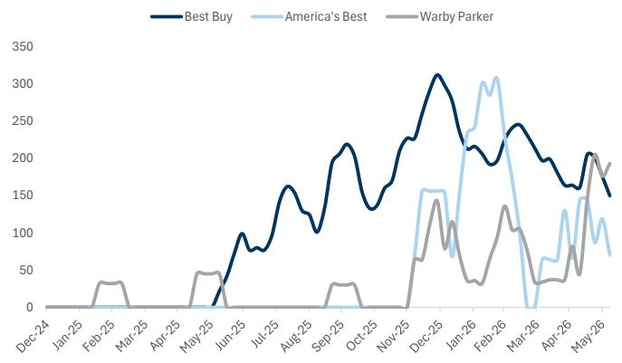
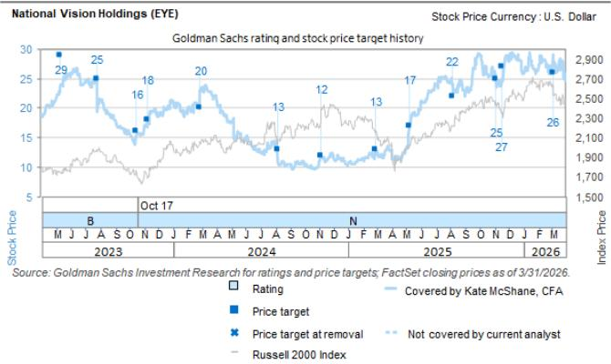
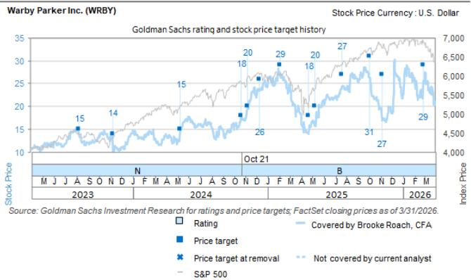
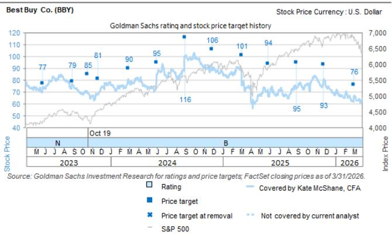

# Americas Retail: Specialty Hardlines: Analyzing the impact of Best Buy and Meta's partnership on eyewear retailers

On June 8th, Best Buy announced a partnership with Meta to open Meta Labs across more than 50 store locations. These experiential spaces provide customers the opportunity to explore Meta's AI glasses and VR headsets through interactive demos, smart mirrors, personalized fittings, and more. In this note, we assess the partnership's potential impact on eyewear retailers (EYE, WRBY, ESLX) by analyzing each retailer's product offerings, store proximity to Best Buy locations, and IR commentary following the announcement.

Bottom line: We are encouraged to see Best Buy and Meta's partnership, and its potential to expand adoption of AI smart glasses across the industry. For EYE, we do not view the partnership as a meaningful risk, given National Vision's differentiation vs. Best Buy with its seamless eye exam, prescription, lens, and frames offering for the Ray-Ban Meta glasses. For WRBY, we believe the announcement will increase focus on the company's ability to capture traffic ahead of its AI glasses launch this fall. We do not view the partnership as a risk given WRBY's integrated prescription and lens capabilities and broad store distribution across \~337 owned locations and digital channels. For ESLX, we view the announcement favourably - expanding distribution and providing additional resources to support consumer education is a helpful step to broadening adoption of smart glasses.

## Details on the Best Buy and Meta partnership

On June 8th, Best Buy announced a partnership with Meta to open Meta Labs across more than 50 store locations. These 900 sq. ft experiential spaces will provide customers the opportunity to explore Meta's AI product lineup, including the Ray-Ban Meta, Meta Ray-Ban Display, Oakley Meta, Meta Quest 3, and Meta Quest 3S VR headsets. Each Meta Lab will also feature dedicated Meta Sales Specialists to help guide the customer experience. Customers can engage with the assortment through a variety of methods, including immersive demos, built-in prompts, and tech-forward displays that allow shoppers to virtually try on different frames and styles.

Best Buy noted that over $50\%$ of their customers want to see Meta's AI glasses in person before making a purchase, and these labs will offer a hands-on experience that cannot be found at other retailers. The first few Meta Lab locations will launch in Best Buy stores this June, with additional locations rolling out through the summer and into the holiday season.

Kate McShane, CFA

+1(212)902-6740

kate.mcshane@gs.com

GS & Co. LLC

Brooke Roach, CFA

+1(212)357-2421

brooke.roach@gs.com

GS & Co. LLC

Richard Felton, CFA

+44(20)7552-7872

richard.felton@gs.com

GS International

Mark Jordan, CFA

+1(617)772-7951

mark.jordan@gs.com

GS & Co. LLC

Emily Ghosh

+1(713)658-2632

emily.ghosh@gs.com

GS & Co. LLC

Nishi Agarwal

+1(332)245-7668

nishi.agarwal@gs.com

GS India SPL

Grace Chee

+1(212)357-9730 | grace.chee@gs.com

GS & Co. LLC

Mentesnot Adamu

+1(801)744-0630

mentesnot.adamu@gs.com

GS & Co. LLC

Samantha Chiang

+1(212)357-7992

samantha.chiang@gs.com

GS & Co. LLC

Carly Chasen

+1(212)902-2327

carly.chasen@gs.com

GS & Co. LLC

Dan Duggan, Ph.D.

+1(212)902-4726

dan.duggan@gs.com

GS & Co. LLC

Sreenya Chitluri

+1(332)245-7761

sreenya.chitluri@gs.com

GS India SPL

We spoke with management following the announcement, who noted they are excited about the expanding partnership with Meta, and plan to test the initial 50 locations before committing to a broader store rollout. Within the labs, management expects a wide assortment of styles and colors, given the large \~900 sq. ft. format. They also highlighted that they would expect to work with additional vendors in the future to expand the assortment for smart glasses and related AI products.

## Implications for the eyewear retailers

We evaluate the partnership's potential impact by analyzing the store proximity between Best Buy and each retailer. In our analysis, we assess store base proximity across all Best Buy locations, assuming that Meta Labs are eventually rolled out across the full fleet. While Best Buy plans to implement the Meta Labs in only 50 stores initially, we note management only disclosed a list of five locations on the press release.

Among the three eyewear retailers, Warby Parker had the highest share of stores within a three-mile radius of a Best Buy and continued to have the highest store penetration beyond that radius. Specifically, 49% of ESLX's stores, 53% of EYE's stores, and 54% of WRBY's stores are within three miles of a Best Buy location. For stores within a one mile radius of Best Buy, EYE had the highest penetration. In contrast, Best Buy has the highest percentage of its store base near an EYE location and the lowest percentage of its store base near a Warby Parker location.

Exhibit 1: Retailers' % of stores within all Best Buy locations, if Meta shop in shops were to be opened in every store

<table><tr><td>stores within x miles of target company</td><td>&lt; 0.1 Mi.</td><td>&lt; 0.5 Mi.</td><td>&lt; 1.0 Mi.</td><td>&lt; 3.0 Mi.</td><td>&lt; 5.0 Mi.</td><td>&lt; 10.0 Mi.</td><td>&lt; 25.0 Mi.</td></tr><tr><td>ESLX w/in BBY</td><td>2%</td><td>19%</td><td>30%</td><td>49%</td><td>68%</td><td>87%</td><td>96%</td></tr><tr><td>EYE w/in BBY</td><td>4%</td><td>23%</td><td>36%</td><td>53%</td><td>70%</td><td>91%</td><td>98%</td></tr><tr><td>WRBY w/in BBY</td><td>0%</td><td>12%</td><td>19%</td><td>54%</td><td>78%</td><td>98%</td><td>99%</td></tr></table>

<table><tr><td>target company stores within x miles</td><td>&lt; 0.1 Mi.</td><td>&lt; 0.5 Mi.</td><td>&lt; 1.0 Mi.</td><td>&lt; 3.0 Mi.</td><td>&lt; 5.0 Mi.</td><td>&lt; 10.0 Mi.</td><td>&lt; 25.0 Mi.</td></tr><tr><td>BBY w/in ESLX</td><td>1%</td><td>13%</td><td>20%</td><td>29%</td><td>40%</td><td>60%</td><td>79%</td></tr><tr><td>BBY w/in EYE</td><td>4%</td><td>27%</td><td>41%</td><td>57%</td><td>68%</td><td>78%</td><td>84%</td></tr><tr><td>BBY w/in WRBY</td><td>0%</td><td>2%</td><td>3%</td><td>7%</td><td>11%</td><td>26%</td><td>51%</td></tr></table>

EYE locations contain America's Best and Eyeglass World while ESLX locations contain Sunglass Hut and LensCrafter  
Source: GS Global Investment Research, Placer.ai, DataWorks

Exhibit 2: AI glasses comparison table for EYE/WRBY/BBY/ESLX

<table><tr><td></td><td>EYE</td><td>WRBY</td><td>BBY</td><td>ESLX</td></tr><tr><td>Company</td><td>National Vision / America&#x27;s Best</td><td>Warby Parker</td><td>Best Buy</td><td>EssilorLuxottica</td></tr><tr><td>What they do</td><td>Optical retailer (eye exams + glasses + Rx fulfillment)</td><td>Optical retailer / eyewear brand (AI glasses launching this fall)</td><td>Electronics retailer / distributor</td><td>Eyewear + lens manufacturer / brand owner / optical retail ecosystem</td></tr><tr><td>AI glasses</td><td>Ray Ban Meta, Oakley Meta</td><td>Intelligent Eyewear with Google/Samsung (pre-launch)</td><td>Ray Ban Meta, Meta Ray Ban Display, Oakley Meta, PRIMEPLUS, Miro, BleeqUp, Azpen</td><td>Ray Ban Meta, Meta Ray Ban Display, Oakley Meta</td></tr><tr><td>Styles</td><td>Ray Ban Meta: Blayzer, Scriber, Skyler, Wayfarer; Oakley Meta: HSTN</td><td>TBD</td><td>Ray Ban Meta: Wayfarer, Skyler, Headliner; Meta Ray Ban Display; Oakley Meta: HSTN, Vanguard; PRIMEPLUS: Bluetooth Smart Glasses, Cycling Smart Glasses; Miro: iVision6, W5; Bleequp GLCG00A Ranger Ai Sports; Azpen VUEX</td><td>Ray Ban Meta: Wayfarer, Blayzer, Scriber, Skyler, Headliner, x Coperni Limited Edition; Oakley Meta: HSTN, Vanguard</td></tr><tr><td>Style count</td><td>5</td><td>TBD</td><td>12</td><td>8</td></tr><tr><td>Entry price tier</td><td>~$379 entry for Wayfarer; Oakley HSTN ~$399</td><td>TBD</td><td>$119 Miro; ~$247 Ray Ban Gen 1 / ~$379 Ray Ban Gen 2</td><td>~$247 Wayfarer Gen 1; ~$399 Oakley HSTN</td></tr><tr><td>Premium price tier</td><td>~$499 for Scriber/Blayzer</td><td>TBD</td><td>~$799 for Meta Ray-Ban Display; ~ $499 for Oakley Vanguard</td><td>~$499 Scriber/Blayzer Gen 2; ~$499 Oakley Vanguard</td></tr><tr><td>Color counts</td><td>Ray Ban: 5; Oakley: 1</td><td>TBD</td><td>Ray Ban: 6; Meta Display: 2; Oakley: 3; PRIMEPLUS: 3; Miro: 1; BleeqUp: 1; Azpen: 1</td><td>Ray Ban: 8; Oakley: 6</td></tr><tr><td>One-stop-shop / Rx fulfillment</td><td>Strongest one-stop-shop angle (exam + Rx + AI glasses in optical setting)</td><td>Core optical one-stop-shop; AI-glasses-specific workflow still TBD until launch</td><td>Product sold at retail, but Rx configuration is routed to Meta&#x27;s Rx website</td><td>Strongest ecosystem / brand + lens + optical retail infrastructure</td></tr></table>

Source: Company data, Data compiled by GS Global Investment Research

We also looked at Google search trends around AI glasses at Best Buy, America's Best, and Warby Parker. Searches for Best Buy AI glasses have largely outpaced peers for the majority of 2025/26, though the searches have been steadily declining since its Dec 2025 peak. Meanwhile, we have observed an uptick in searches for Warby Parker AI glasses in recent weeks.

## Exhibit 3: Search intensity for Best Buy AI glasses has largely led peers, though we see an uptick in Warby Parker trends in recent weeks

Trailing 4 week search intensity for: ai glasses best buy (US); america's best meta (US); ai glasses warby (US)

line chart

| Month    | Best Buy | America's Best | Warby Parker |
|----------|----------|----------------|--------------|
| Dec-24   | 0        | 0              | 0            |
| Jan-25   | 0        | 0              | 0            |
| Feb-25   | 0        | 0              | 30           |
| Mar-25   | 0        | 0              | 0            |
| Apr-25   | 0        | 0              | 0            |
| May-25   | 0        | 0              | 40           |
| Jun-25   | 100      | 0              | 0            |
| Jul-25   | 80       | 0              | 0            |
| Aug-25   | 160      | 0              | 0            |
| Sep-25   | 100      | 0              | 30           |
| Oct-25   | 130      | 0              | 0            |
| Nov-25   | 170      | 0              | 60           |
| Dec-25   | 310      | 160            | 140          |
| Jan-26   | 240      | 310            | 30           |
| Feb-26   | 190      | 310            | 140          |
| Mar-26   | 240      | 0              | 40           |
| Apr-26   | 160      | 130            | 80           |
| May-26   | 150      | 70             | 190          |

Source: Google Trends (https://www.google.com/trends), Data compiled by GS Global Investment Research

We utilized GS Data Works for the store overlap analysis. GS Data Works leverages alternative data sources and advanced analysis techniques to create unique data-driven insights across

equity, credit and macro research.

GS Data Works analysis provided by Dan Duggan, Ph.D and Sreenya Chitluri.

## EYE

National Vision initially launched Ray-Ban Meta glasses in 50 of its stores in 2Q25, before completing a full roll-out across all locations by April 2026. Management highlighted in March that the Meta glasses are the fastest turning SKUs in their assortment, with sell-through exceeding expectations. Additionally, they noted that Ray-Ban Meta consumers carry some of the highest average transaction values within their portfolio.

In our conversations with management, they noted that they are not concerned about Best Buy's partnership with Meta, as National Vision is able to offer a seamless shopping experience that Best Buy cannot replicate. Specifically, National Vision can fulfill the eye exam, lenses, and frames for the customer all within a single visit. In contrast, if a Best Buy customer requires different lenses, they have to send their glasses off to a lab, creating an inconvenient process. National Vision highlighted that they offer demo experiences in their stores as well, and are expanding associate training for Meta glasses across the full customer journey (purchase through pick-up).

## WRBY

We believe the Meta x Best Buy partnership is positive for the intelligent eyewear category in aggregate, as expanded distribution and consumer education efforts help broaden awareness and adoption of smart glasses. That said, as we move into the holiday season, this announcement will increase focus on WRBY's ability to capture share of traffic as the company prepares to launch its AI glasses in partnership with Google and Samsung in Fall 2026.

In our conversations with the company, WRBY noted the product will be sold only through WRBY's \~337 owned stores (across 103 markets / 256 cities) and select digital channels on launch (no initial wholesale to third party retailers). This enables sharp control over the consumer experience and initial introduction to the product, and also provides an opportunity for WRBY to offer holistic visioncare services and drive prescription / lens attachment rates. WRBY has invested in its store and customer experience teams to drive a smooth rollout of the product this year. Importantly, WRBY's store fleet footprint is broad-based across 44 states, in all major cities, and accessible to the majority of the US population. Economics by channel are also a consideration. Over time, management has indicated an interest in scaling distribution over time to potential wholesale doors, but has indicated they will be thoughtful in their approach.

We expect investor focus to remain centered on the company's upcoming fall product launch, consumer receptivity to the WRBY product vs. competitor items (Gentle Monster / Ray Ban and Oakley Meta), the pace at which unit sales can scale, and the broader halo that these intelligent eyewear products can provide on the broader WRBY ecosystem (traffic / conversion / fixed cost leverage).

## ESLX

From the perspective of EssilorLuxottica, we view the announcement between Meta and Best Buy favourably. Expanding distribution and providing additional resources to support consumer education is a helpful step to broadening adoption of smart glasses – especially for Rayban Meta Display for availability of product demonstrations appointments had been a bottleneck for growth in recent quarters. We do see incremental benefits from selling through EssilorLuxottica's DTC network or specialist optical retailer rather than a retail such as Best Buy – for instance higher attachment rates of prescription or photochromic lenses which come with more favourable economics vs frames – but also note that management had pointed to third party sales of AI glasses as incremental.

## Valuations & Risks

## BBY

We are Sell rated on BBY. Our 12-month price target is \$62 with downside/base/upside case EV/EBITDA multiples at 5.0x/5.5x/6.0x.

Upside risks include if the company receives incremental sales from pull-forward purchases and tax refunds; if the company is able to mitigate memory supply shortages better than expected; if the company's marketplace and advertising initiatives more than offset memory margin pressure; if more consumers trade up to premium devices, improving product margin; if the housing market improves, and BBY's appliances sales improves; if BBY gains share relative to other retailers; if innovation in consumer electronics and mobile phones / computing helps accelerate the top line.

## EYE

We are Neutral rated on EYE. Our 12-month price target is \$24 with downside/base/upside case EV/EBITDA multiples of 8.5x/9.5x/10.5x.

Upside risks include better-than-expected demand for eye care and eyeglasses following softer trends in recent years; a meaningful acceleration in trade down trends; if margins recover faster than expected; and the potential for a multiple re-rating if sentiment improves following better-than-expected top line results and a clear pathway to margin recovery.

Downside risks include a slower-than-expected top line recovery as lower-income and uninsured customers defer demand, or if certain consumers exit the market altogether; less-than-expected trade down; continued exam capacity headwinds; margin headwinds due to higher wages; increased competition; and the risk that certain costs remain elevated.

## WRBY

We are Buy rated on WRBY with a 12-month price target of \$31 based on 22.0x Q5-Q8 EV/EBITDA valuation methodology.

Downside risks include: (1) Slow growth of new customers or limited in-network utilization; (2) Slower growth in e-commerce; (3) Terminal margin uncertainty; and (4) Weaker store productivity.

## ESLX

Our 12-month price target of €260 is derived using an equal blend of a DCF and a multiples-based valuation (using our annualised Q5-Q8 estimates). Our DCF implies an intrinsic value of €264 per share and uses a WACC of 8.3% and terminal growth rate of +3.5%. Our multiples-based approach applies a 34x P/E multiple to our annualised Q5-Q8 EPS estimates and implies a value of €255 per share.

Downside risks: (1) Slowdown in new launches or delayed rollout; (2)

Lower-than-expected operational leverage; (3) Retail network disruption; and (4)

Weaker-than-expected consumer confidence.

## Disclosure Appendix

## Reg AC

We, Kate McShane, CFA, Brooke Roach, CFA, Richard Felton, CFA, Mark Jordan, CFA, Emily Ghosh, Nishi Agarwal, Grace Chee, Mentesnot Adamu, Samantha Chiang and Carly Chasen, hereby certify that all of the views expressed in this report accurately reflect our personal views about the subject company or companies and its or their securities. We also certify that no part of our compensation was, is or will be, directly or indirectly, related to the specific recommendations or views expressed in this report.

We, Dan Duggan, Ph.D. and Sreenya Chitluri, hereby certify that all of the views expressed in this report accurately reflect our personal views, which have not been influenced by considerations of the firm's business or client relationships.

Unless otherwise stated, the individuals listed on the cover page of this report are analysts in GS' Global Investment Research division.

Contributing Authors: Kate McShane, CFA GS & Co. LLC, Brooke Roach, CFA GS & Co. LLC, Richard Felton, CFA GS International, Mark Jordan, CFA GS & Co. LLC, Emily Ghosh GS & Co. LLC, Nishi Agarwal GS India SPL, Grace Chee GS & Co. LLC, Mentesnot Adamu GS & Co. LLC, Samantha Chiang GS & Co. LLC, Carly Chasen GS & Co. LLC, Dan Duggan, Ph.D. GS & Co. LLC, Sreenya Chitluri GS India SPL.

Unless otherwise stated, the individuals listed in the Contributing Authors disclosure of this report are analysts in GS' Global Investment Research division.

## GS Factor Profile

The GS Factor Profile provides investment context for a stock by comparing key attributes to the market (i.e. our universe of rated stocks) and its sector peers. The four key attributes depicted are: Growth, Financial Returns, Multiple (e.g. valuation) and Integrated (a composite of Growth, Financial Returns and Multiple). Growth, Financial Returns and Multiple are calculated by using normalized ranks for specific metrics for each stock. The normalized ranks for the metrics are then averaged and converted into percentiles for the relevant attribute. The precise calculation of each metric may vary depending on the fiscal year, industry and region, but the standard approach is as follows:

Growth is based on a stock's forward-looking sales growth, EBITDA growth and EPS growth (for financial stocks, only EPS and sales growth), with a higher percentile indicating a higher growth company. Financial Returns is based on a stock's forward-looking ROE, ROCE and CROCI (for financial stocks, only ROE), with a higher percentile indicating a company with higher financial returns. Multiple is based on a stock's forward-looking P/E, P/B, price/dividend (P/D), EV/EBITDA, EV/FCF and EV/Debt Adjusted Cash Flow (DACF) (for financial stocks, only P/E, P/B and P/D), with a higher percentile indicating a stock trading at a higher multiple. The Integrated percentile is calculated as the average of the Growth percentile, Financial Returns percentile and (100% - Multiple percentile).

Financial Returns and Multiple use the GS analyst forecasts at the fiscal year-end at least three quarters in the future. Growth uses inputs for the fiscal year at least seven quarters in the future compared with the year at least three quarters in the future (on a per-share basis for all metrics).

For a more detailed description of how we calculate the GS Factor Profile, please contact your GS representative.

## M&A Rank

Across our global coverage, we examine stocks using an M&A framework, considering both qualitative factors and quantitative factors (which may vary across sectors and regions) to incorporate the potential that certain companies could be acquired. We then assign a M&A rank as a means of scoring companies under our rated coverage from 1 to 3, with 1 representing high (30%-50%) probability of the company becoming an acquisition target, 2 representing medium (15%-30%) probability and 3 representing low (0%-15%) probability. For companies ranked 1 or 2, in line with our standard departmental guidelines we incorporate an M&A component into our target price. M&A rank of 3 is considered immaterial and therefore does not factor into our price target, and may or may not be discussed in research.

## Quantum

Quantum is GS' proprietary database providing access to detailed financial statement histories, forecasts and ratios. It can be used for in-depth analysis of a single company, or to make comparisons between companies in different sectors and markets.

## Disclosures

## Rating and pricing information

Best Buy Co. (Sell, \$78.53), EssilorLuxottica (Buy, €182.70), National Vision Holdings (Neutral, \$18.61) and Warby Parker Inc. (Buy, \$26.46)

The rating(s) for EssilorLuxottica is/are relative to the other companies in its/their coverage universe: Alcon Inc., Carl Zeiss Meditec AG, Coloplast, ConvaTec Plc, Demant, Elekta AB, EssilorLuxottica, Fresenius Medical Care, Fresenius SE, Ottobock SE & Co., Philips, Siemens Healthineers AG, Smith & Nephew, Sonova Holdings, Straumann AG

The rating(s) for Warby Parker Inc. is/are relative to the other companies in its/their coverage universe: Amer Sports Inc., Burlington Stores Inc., Canada Goose Holdings, Capri Holdings, Crocs Inc., Deckers Outdoor Corp., FIGS Inc., Gap Inc., Kohl's Corp., Kontoor Brands Inc., Levi Strauss & Co., Lululemon Athletica Inc., Macy's Inc., Nike Inc., PVH Corp., Ralph Lauren Corp., Ross Stores Inc., Savers Value Village Inc., SharkNinja, Inc., TJX Cos., Tapestry Inc., Torrid Holdings Inc., Under Armour Inc., Urban Outfitters Inc., VF Corp., Victoria's Secret & Co., Warby Parker Inc., YETI Holdings

The rating(s) for Best Buy Co. and National Vision Holdings is/are relative to the other companies in its/their coverage universe: Academy Sports & Outdoors Inc., Advance Auto Parts Inc., AutoZone Inc., BJ's Wholesale Club Holdings, Bath & Body Works Inc., Best Buy Co., Bob's Discount Furniture Inc., Boyd Group, Costco Wholesale, Dick's Sporting Goods, Dollar General Corp., Dollar Tree Stores Inc., Driven Brands Holdings, Five Below Inc., Floor & Decor Holdings, Genuine Parts Co., Home Depot Inc., Life Time Group Holdings, Lithia Motors Inc., Lowe's Cos., National Vision Holdings, O'Reilly Automotive Inc., Ollie's Bargain Outlet Inc., Petco Health and Wellness Co., RH, Target Corp., Tractor Supply Co., Ulta Beauty Inc., Valvoline Inc., Walmart Inc., Williams-Sonoma Inc.

## Company-specific regulatory disclosures

The following disclosures relate to relationships between The GS Group, Inc. (with its affiliates, “GS”) and companies covered by GS Global Investment Research and referred to in this research.

GS beneficially owned 1% or more of common equity (excluding positions managed by affiliates and business units not required to be aggregated under US securities law) as of the month end preceding this report: Best Buy Co. $78.53$ , National Vision Holdings $18.61$ and Warby

Parker Inc. (\$26.46)

GS has received compensation for investment banking services in the past 12 months: Best Buy Co. (\$78.53), EssilorLuxottica (€182.70), National Vision Holdings (\$18.61) and Warby Parker Inc. (\$26.46)

GS expects to receive or intends to seek compensation for investment banking services in the next 3 months: Best Buy Co. (\$78.53), EssilorLuxottica (€182.70), National Vision Holdings (\$18.61) and Warby Parker Inc. (\$26.46)

GS has received compensation for non-investment banking services during the past 12 months: Best Buy Co. (\$78.53)

GS had an investment banking services client relationship during the past 12 months with: Best Buy Co. (\$78.53), EssilorLuxottica (€182.70), National Vision Holdings (\$18.61) and Warby Parker Inc. (\$26.46)

GS had a non-investment banking securities-related services client relationship during the past 12 months with: Best Buy Co. (\$78.53) and National Vision Holdings (\$18.61)

GS had a non-securities services client relationship during the past 12 months with: Best Buy Co. (\$78.53), EssilorLuxottica (€182.70) and National Vision Holdings (\$18.61)

GS makes a market in the securities or derivatives thereof: Best Buy Co. $78.53$ , National Vision Holdings $18.61$ and Warby Parker Inc. $26.46$

## Distribution of ratings/investment banking relationships

GS Investment Research global Equity coverage universe

<table><tr><td rowspan="2"></td><td colspan="3">Rating Distribution</td><td colspan="3">Investment Banking Relationships</td></tr><tr><td>Buy</td><td>Hold</td><td>Sell</td><td>Buy</td><td>Hold</td><td>Sell</td></tr><tr><td>Global</td><td>50%</td><td>34%</td><td>16%</td><td>65%</td><td>60%</td><td>45%</td></tr></table>

As of April 1, 2026, GS Global Investment Research had investment ratings on 3,074 equity securities. GS assigns stocks as Buys and Sells on various regional Investment Lists; stocks not so assigned are deemed Neutral. Such assignments equate to Buy, Hold and Sell for the purposes of the above disclosure required by the FINRA Rules. See ‘Ratings, Coverage universe and related definitions’ below. The Investment Banking Relationships chart reflects the percentage of subject companies within each rating category for whom GS has provided investment banking services within the previous twelve months.

Price target and rating history chart(s)  

line chart

| Date       | Stock Price | Rating | Price Target |
|------------|-------------|--------|--------------|
| Oct 17     | ~29         | 29     |              |
|            | ~25         | 25     |              |
|            | ~18         | 18     |              |
|            | ~20         | 20     |              |
|            | ~13         | 13     |              |
|            | ~12         | 12     |              |
|            | ~13         | 13     |              |
|            | ~17         | 17     |              |
|            | ~22         | 22     |              |
|            | ~25         | 25     |              |
|            | ~27         | 27     |              |
|            | ~26         | 26     |              |

The price targets shown should be considered in the context of all prior published GS, which may or may not have included price targets, as well as developments relating to the company, its industry and financial markets.

line chart

| Date       | Stock Price | Index Price | Rating |
|------------|-------------|-------------|--------|
| Oct 21     | 15          | 4,000       | 15     |
| Oct 21     | 14          | 4,500       | 14     |
| Oct 21     | 15          | 5,000       | 15     |
| Oct 21     | 18          | 5,500       | 18     |
| Oct 21     | 20          | 6,000       | 20     |
| Oct 21     | 26          | 6,500       | 26     |
| Oct 21     | 29          | 7,000       | 29     |
| Oct 21     | 31          | 6,500       | 31     |
| Oct 21     | 27          | 6,000       | 27     |
| Oct 21     | 29          | 5,500       | 29     |

The price targets shown should be considered in the context of all prior published GS, which may or may not have included price targets, as well as developments relating to the company, its industry and financial markets.

line chart

| Date | Rating | Price Target | Price Target at Removal | FTSE World Europe (EUR) |
| --- | --- | --- | --- | --- |
| M 2023 | 194 |  |  |  |
| J 2023 | 190 |  |  |  |
| J 2023 | 190 |  |  |  |
| A 2023 |  |  |  |  |
| S 2023 |  |  |  |  |
| O 2023 |  |  |  |  |
| N 2023 |  |  |  |  |
| D 2023 |  |  |  |  |
| J 2024 |  |  |  |  |
| F 2024 |  |  |  |  |
| M 2024 |  |  |  |  |
| A 2024 |  |  |  |  |
| M 2024 |  |  |  |  |
| J 2024 |  |  |  |  |
| A 2024 |  |  |  |  |
| S 2024 |  |  |  |  |
| O 2024 |  |  |  |  |
| N 2024 |  |  |  |  |
| D 2024 |  |  |  |  |
| J 2025 |  |  |  |  |
| F 2025 |  |  |  |  |
| M 2025 |  |  |  |  |
| A 2025 |  |  |  |  |
| M 2025 |  |  |  |  |
| J 2025 |  |  |  |  |
| A 2025 |  |  |  |  |
| J 2025 |  |  |  |  |
| A 2025 |  |  |  |  |
| S 2025 |  |  |  |  |
| O 2025 |  |  |  |  |
| N 2025 |  |  |  |  |
| D 2025 |  |  |  |  |
| J 2026 |  |  |  |  |
| F 2026 |  |  |  |  |
| M 2026 |  |  |  |  |
| B 2026 |  |  |  |  |
|  |  |  |  |  |
|  |  |  |  |  |
|  |  |  |  |  |
|  |  |  |  |  |
|  |  |  |  |  |
|  |  |  |  |  |
|  |  |  |  |  |
|  |  |  |  |  |
|  |  |  |  |  |
|  |  |  |  |  |

The price targets shown should be considered in the context of all prior published GS, which may or may not have included price targets, as well as developments relating to the company, its industry and financial markets.

line chart

| Date       | Stock Price | Index Price | Rating |
|------------|-------------|-------------|--------|
| Oct 19     | 77          | 4000        | N      |
|            | 79          | 5000        |        |
|            | 81          | 5500        |        |
|            | 90          | 6000        |        |
|            | 95          | 6500        |        |
|            | 116         | 7000        |        |
|            | 106         | 6500        |        |
|            | 101         | 6000        |        |
|            | 94          | 5500        |        |
|            | 95          | 5000        |        |
|            | 93          | 4500        |        |
|            | 76          | 4000        |        |

The price targets shown should be considered in the context of all prior published GS, which may or may not have included price targets, as well as developments relating to the company, its industry and financial markets.

Target price history table(s)  
National Vision Holdings (EYE)

<table><tr><td>Date of report</td><td>Target price ($)</td><td>Closing price ($)</td></tr><tr><td>13-May-26</td><td>24.00</td><td>16.92</td></tr><tr><td>05-Mar-26</td><td>26.00</td><td>29.07</td></tr><tr><td>18-Nov-25</td><td>27.00</td><td>24.91</td></tr><tr><td>06-Nov-25</td><td>25.00</td><td>23.48</td></tr><tr><td>07-Aug-25</td><td>22.00</td><td>24.17</td></tr><tr><td>08-May-25</td><td>17.00</td><td>16.68</td></tr><tr><td>27-Feb-25</td><td>13.00</td><td>12.37</td></tr><tr><td>07-Nov-24</td><td>12.00</td><td>11.63</td></tr><tr><td>08-Aug-24</td><td>13.00</td><td>10.94</td></tr><tr><td>28-Feb-24</td><td>20.00</td><td>22.90</td></tr><tr><td>10-Nov-23</td><td>18.00</td><td>18.43</td></tr><tr><td>17-Oct-23</td><td>16.00</td><td>15.28</td></tr><tr><td>27-Jul-23</td><td>25.00</td><td>19.31</td></tr></table>

EssilorLuxottica (ESLX.PA)

<table><tr><td>Date of report</td><td>Target price (€)</td><td>Closing price (€)</td></tr><tr><td>23-Apr-26</td><td>260.00</td><td>191.80</td></tr><tr><td>08-Apr-26</td><td>265.00</td><td>200.70</td></tr><tr><td>04-Dec-25</td><td>350.00</td><td>303.20</td></tr><tr><td>17-Oct-25</td><td>315.00</td><td>312.50</td></tr><tr><td>21-Sep-25</td><td>305.00</td><td>273.70</td></tr><tr><td>11-Jul-25</td><td>277.00</td><td>242.40</td></tr><tr><td>24-Apr-25</td><td>285.00</td><td>252.00</td></tr><tr><td>09-Apr-25</td><td>290.00</td><td>233.90</td></tr><tr><td>12-Mar-25</td><td>305.00</td><td>270.00</td></tr><tr><td>12-Feb-25</td><td>295.00</td><td>276.00</td></tr><tr><td>15-Jan-25</td><td>260.00</td><td>236.70</td></tr><tr><td>30-Sep-24</td><td>250.00</td><td>212.60</td></tr><tr><td>26-Jul-24</td><td>205.00</td><td>207.10</td></tr><tr><td>18-Apr-24</td><td>206.00</td><td>204.70</td></tr><tr><td>28-Mar-24</td><td>210.00</td><td>209.70</td></tr><tr><td>14-Nov-23</td><td>202.00</td><td>179.98</td></tr><tr><td>20-Oct-23</td><td>195.00</td><td>163.06</td></tr><tr><td>11-Oct-23</td><td>196.00</td><td>166.52</td></tr><tr><td>17-Jul-23</td><td>190.00</td><td>175.08</td></tr></table>

Best Buy Co. (BBY)

<table><tr><td>Date of report</td><td>Target price ($)</td><td>Closing price ($)</td></tr><tr><td>28-May-26</td><td>62.00</td><td>74.74</td></tr><tr><td>13-Apr-26</td><td>59.00</td><td>60.85</td></tr><tr><td>04-Mar-26</td><td>76.00</td><td>67.39</td></tr><tr><td>25-Nov-25</td><td>93.00</td><td>79.66</td></tr><tr><td>29-Aug-25</td><td>95.00</td><td>73.64</td></tr><tr><td>30-May-25</td><td>94.00</td><td>66.28</td></tr><tr><td>04-Mar-25</td><td>101.00</td><td>75.20</td></tr><tr><td>27-Nov-24</td><td>106.00</td><td>88.17</td></tr><tr><td>30-Aug-24</td><td>116.00</td><td>100.40</td></tr><tr><td>31-May-24</td><td>95.00</td><td>84.82</td></tr><tr><td>29-Feb-24</td><td>90.00</td><td>80.88</td></tr><tr><td>22-Nov-23</td><td>81.00</td><td>68.03</td></tr><tr><td>19-Oct-23</td><td>85.00</td><td>69.50</td></tr><tr><td>29-Aug-23</td><td>79.00</td><td>76.93</td></tr></table>

Warby Parker Inc. (WRBY)

<table><tr><td>Date of report</td><td>Target price ($)</td><td>Closing price ($)</td></tr><tr><td>08-May-26</td><td>31.00</td><td>29.55</td></tr><tr><td>27-Feb-26</td><td>29.00</td><td>25.01</td></tr><tr><td>07-Nov-25</td><td>27.00</td><td>17.22</td></tr><tr><td>03-Oct-25</td><td>31.00</td><td>26.22</td></tr><tr><td>21-Jul-25</td><td>27.00</td><td>24.29</td></tr><tr><td>09-May-25</td><td>20.00</td><td>15.75</td></tr><tr><td>22-Apr-25</td><td>18.00</td><td>14.38</td></tr><tr><td>05-Feb-25</td><td>29.00</td><td>26.91</td></tr><tr><td>10-Dec-24</td><td>26.00</td><td>23.53</td></tr><tr><td>08-Nov-24</td><td>20.00</td><td>19.51</td></tr><tr><td>21-Oct-24</td><td>18.00</td><td>18.20</td></tr><tr><td>10-May-24</td><td>15.00</td><td>14.79</td></tr><tr><td>09-Nov-23</td><td>14.00</td><td>10.16</td></tr><tr><td>09-Aug-23</td><td>15.00</td><td>13.89</td></tr></table>

Price targets shown in table(s) are unadjusted for corporate actions.

## Regulatory disclosures

## Disclosures required by United States laws and regulations

See company-specific regulatory disclosures above for any of the following disclosures required as to companies referred to in this report: manager or co-manager in a pending transaction; 1% or other ownership; compensation for certain services; types of client relationships; managed/co-managed public offerings in prior periods; directorships; for equity securities, market making and/or specialist role. GS trades or may trade as a principal in debt securities (or in related derivatives) of issuers discussed in this report.

The following are additional required disclosures: Ownership and material conflicts of interest: GS policy prohibits its analysts, professionals reporting to analysts and members of their households from owning securities of any company in the analyst's area of coverage. Analyst compensation: Analysts are paid in part based on the profitability of GS, which includes investment banking revenues. Analyst as officer or director: GS policy generally prohibits its analysts, persons reporting to analysts or members of their households from serving as an officer, director or advisor of any company in the analyst's area of coverage. Non-U.S. Analysts: Non-U.S. analysts may not be associated persons of GS & Co. LLC and therefore may not be subject to FINRA Rule 2241 or FINRA Rule 2242 restrictions on communications with a subject company, public appearances and trading in securities covered by the analysts.

Distribution of ratings: See the distribution of ratings disclosure above. Price chart: See the price chart, with changes of ratings and price targets in prior periods, above, or, if electronic format or if with respect to multiple companies which are the subject of this report, on the GS website at https://www.gs.com/research/hedge.html.

## Additional disclosures required under the laws and regulations of jurisdictions other than the United States

The following disclosures are those required by the jurisdiction indicated, except to the extent already made above pursuant to United States laws and regulations. Australia: GS Australia Pty Ltd and its affiliates are not authorised deposit-taking institutions (as that term is defined in the Banking Act 1959 (Cth)) in Australia and do not provide banking services, nor carry on a banking business, in Australia. This research, and any access to it, is intended only for “wholesale clients” within the meaning of the Australian Corporations Act, unless otherwise agreed by GS. In

producing research reports, members of Global Investment Research of GS Australia may attend site visits and other meetings hosted by the companies and other entities which are the subject of its research reports. In some instances the costs of such site visits or meetings may be met in part or in whole by the issuers concerned if GS Australia considers it is appropriate and reasonable in the specific circumstances relating to the site visit or meeting. To the extent that the contents of this document contains any financial product advice, it is general advice only and has been prepared by GS without taking into account a client's objectives, financial situation or needs. A client should, before acting on any such advice, consider the appropriateness of the advice having regard to the client's own objectives, financial situation and needs. A copy of certain GS Australia and New Zealand disclosure of interests and a copy of GS' Australian Sell-Side Research Independence Policy Statement are available at: https://www.goldmansachs.com/disclosures/australia-new-zealand/index.html. Brazil: Disclosure information in relation to CVM Resolution n. 20 is available at https://www.gs.com/worldwide/brazil/area/gir/index.html. Where applicable, the Brazil-registered analyst primarily responsible for the content of this research report, as defined in Article 20 of CVM Resolution n. 20, is the first author named at the beginning of this report, unless indicated otherwise at the end of the text. Canada: This information is being provided to you for information purposes only and is not, and under no circumstances should be construed as, an advertisement, offering or solicitation by GS & Co. LLC for purchasers of securities in Canada to trade in any Canadian security. GS & Co. LLC is not registered as a dealer in any jurisdiction in Canada under applicable Canadian securities laws and generally is not permitted to trade in Canadian securities and may be prohibited from selling certain securities and products in certain jurisdictions in Canada. If you wish to trade in any Canadian securities or other products in Canada please contact GS Canada Inc., an affiliate of The GS Group Inc., or another registered Canadian dealer. Hong Kong: Further information on the securities of covered companies referred to in this research may be obtained on request from GS (Asia) L.L.C. India: Further information on the subject company or companies referred to in this research may be obtained from GS (India) Securities Private Limited, Research Analyst - SEBI Registration Number INH000001493, 10th Floor, Ascent-Worli, Sudam Kalu Ahire Marg, Worli, Mumbai-400 025, India, Corporate Identity Number U74140MH2006FTC160634, Phone +91 22 6616 9000, Fax +91 22 6616 9001. GS may beneficially own 1% or more of the securities (as such term is defined in clause 2 (h) the Indian Securities Contracts (Regulation) Act, 1956) of the subject company or companies referred to in this research report. Investment in securities market are subject to market risks. Read all the related documents carefully before investing. Registration granted by SEBI and certification from NISM in no way guarantee performance of the intermediary or provide any assurance of returns to investors. GS (India) Securities Private Limited compliance officer and investor grievance contact details can be found at: https://www.goldmansachs.com/worldwide/india/documents/Grievance-Redressal-and-Escalation-Matrix.pdf, and a copy of the annual audit compliance report can be found at this link: https://publishing.gs.com/content/site/india-annual-compliance-report.html. Japan: See below. Korea: This research, and any access to it, is intended only for “professional investors” within the meaning of the Financial Services and Capital Markets Act, unless otherwise agreed by GS. Further information on the subject company or companies referred to in this research may be obtained from GS (Asia) L.L.C., Seoul Branch. New Zealand: GS New Zealand Limited and its affiliates are neither “registered banks” nor “deposit takers” (as defined in the Reserve Bank of New Zealand Act 1989) in New Zealand. This research, and any access to it, is intended for “wholesale clients” (as defined in the Financial Advisers Act 2008) unless otherwise agreed by GS. A copy of certain GS Australia and New Zealand disclosure of interests is available at: https://www.goldmansachs.com/disclosures/australia-new-zealand/index.html. Russia: Research reports distributed in the Russian Federation are not advertising as defined in the Russian legislation, but are information and analysis not having product promotion as their main purpose and do not provide appraisal within the meaning of the Russian legislation on appraisal activity. Research reports do not constitute a personalized investment recommendation as defined in Russian laws and regulations, are not addressed to a specific client, and are prepared without analyzing the financial circumstances, investment profiles or risk profiles of clients. GS assumes no responsibility for any investment decisions that may be taken by a client or any other person based on this research report. Singapore: GS (Singapore) Pte. (Company Number: 198602165W), which is regulated by the Monetary Authority of Singapore, accepts legal responsibility for this research, and should be contacted with respect to any matters arising from, or in connection with, this research. Taiwan: This material is for reference only and must not be reprinted without permission. Investors should carefully consider their own investment risk. Investment results are the responsibility of the individual investor. United Kingdom: Persons who would be categorized as retail clients in the United Kingdom, as such term is defined in the rules of the Financial Conduct Authority, should read this research in conjunction with prior GS on the covered companies referred to herein and should refer to the risk warnings that have been sent to them by GS International. A copy of these risks warnings, and a glossary of certain financial terms used in this report, are available from GS International on request.

European Union and United Kingdom: Disclosure information in relation to Article 6 (2) of the European Commission Delegated Regulation (EU) (2016/958) supplementing Regulation (EU) No 596/2014 of the European Parliament and of the Council (including as that Delegated Regulation is implemented into United Kingdom domestic law and regulation following the United Kingdom's departure from the European Union and the European Economic Area) with regard to regulatory technical standards for the technical arrangements for objective presentation of investment recommendations or other information recommending or suggesting an investment strategy and for disclosure of particular interests or indications of conflicts of interest is available at https://www.gs.com/disclosures/europeanpolicy.html which states the European Policy for Managing Conflicts of Interest in Connection with Investment Research.

Japan: GS Japan Co., Ltd. is a Financial Instrument Dealer registered with the Kanto Financial Bureau under registration number Kinsho 69, and a member of Japan Securities Dealers Association, Financial Futures Association of Japan Type II Financial Instruments Firms Association, and Investment Management Association of Japan. Sales and purchase of equities are subject to commission pre-determined with clients plus consumption tax. See company-specific disclosures as to any applicable disclosures required by Japanese stock exchanges, the Japanese Securities Dealers Association or the Japanese Securities Finance Company.

## Ratings, coverage universe and related definitions

Buy (B), Neutral (N), Sell (S) Analysts recommend stocks as Buys or Sells for inclusion on various regional Investment Lists. Being assigned a Buy or Sell on an Investment List is determined by a stock's total return potential relative to its coverage universe. Any stock not assigned as a Buy or a Sell on an Investment List with an active rating (i.e., a stock that is not Rating Suspended, Not Rated, Early-Stage Biotech, Coverage Suspended or Not Covered), is deemed Neutral. Each region manages Regional Conviction Lists, which are selected from Buy rated stocks on the respective region's Investment Lists and represent investment recommendations focused on the size of the total return potential and/or the likelihood of the realization of the return across their respective areas of coverage. The addition or removal of stocks from such Conviction Lists are managed by the Investment Review Committee or other designated committee in each respective region and do not represent a change in the analysts' investment rating for such stocks.

Total return potential represents the upside or downside differential between the current share price and the price target, including all paid or anticipated dividends, expected during the time horizon associated with the price target. Price targets are required for all covered stocks. The total return potential, price target and associated time horizon are stated in each report adding or reiterating an Investment List membership.

Coverage Universe: A list of all stocks in each coverage universe is available by primary analyst, stock and coverage universe at https://www.gs.com/research/hedge.html.

Not Rated (NR). The investment rating, target price and earnings estimates (where relevant) are removed pursuant to GS policy when GS is acting in an advisory capacity in a merger or in a strategic transaction involving this company, when there are legal, regulatory or policy constraints due to GS' involvement in a transaction, and in certain other circumstances. Early-Stage Biotech (ES). An investment rating and a target price are not assigned pursuant to GS policy when this company has neither a drug, treatment or medical device that has passed a Phase II clinical trial nor a license to distribute a post-Phase II drug, treatment or medical device. Rating Suspended (RS). GS has suspended the investment rating and price target for this stock, because there is not a sufficient fundamental basis for determining an

investment rating or target price. The previous investment rating and target price, if any, are no longer in effect for this stock and should not be relied upon. Coverage Suspended (CS). GS has suspended coverage of this company. Not Covered (NC). GS does not cover this company.

## Global product; distributing entities

GS Global Investment Research produces and distributes research products for clients of GS on a global basis. Analysts based in GS offices around the world produce research on industries and companies, and research on macroeconomics, currencies, commodities and portfolio strategy. This research is disseminated in Australia by GS Australia Pty Ltd (ABN 21 006 797 897); in Brazil by GS do Brasil Corretora de Títulos e Valores Mobiliários S.A.; Public Communication Channel GS Brazil: 0800 727 5764 and / or contatogoldmanbrasil@gs.com. Available Weekdays (except holidays), from 9am to 6pm. Canal de Comunicação com o Público GS Brasil: 0800 727 5764 e/ou contatogoldmanbrasil@gs.com. Horário de funcionamento: segunda-feira à sexta-feira (exceto feriados), das 9h às 18h; in Canada by GS & Co. LLC; in Hong Kong by GS (Asia) L.L.C.; in India by GS (India) Securities Private Ltd.; in Japan by GS Japan Co., Ltd.; in the Republic of Korea by GS (Asia) L.L.C., Seoul Branch; in New Zealand by GS New Zealand Limited; in Russia by OOO GS; in Singapore by GS (Singapore) Pte. (Company Number: 198602165W); and in the United States of America by GS & Co. LLC. GS International has approved this research in connection with its distribution in the United Kingdom.

GS International (“GSI”), authorised by the Prudential Regulation Authority (“PRA”) and regulated by the Financial Conduct Authority (“FCA”) and the PRA, has approved this research in connection with its distribution in the United Kingdom.

European Economic Area: GS Bank Europe SE (“GSBE”) is a credit institution incorporated in Germany and, within the Single Supervisory Mechanism, subject to direct prudential supervision by the European Central Bank and in other respects supervised by German Federal Financial Supervisory Authority (Bundesanstalt für Finanzdienstleistungsaufsicht, BaFin) and Deutsche Bundesbank and disseminates research within the European Economic Area.

## General disclosures

This research is for our clients only. Other than disclosures relating to GS, this research is based on current public information that we consider reliable, but we do not represent it is accurate or complete, and it should not be relied on as such. The information, opinions, estimates and forecasts contained herein are as of the date hereof and are subject to change without prior notification. We seek to update our research as appropriate, but various regulations may prevent us from doing so. Other than certain industry reports published on a periodic basis, the large majority of reports are published at irregular intervals as appropriate in the analyst's judgment.

GS conducts a global full-service, integrated investment banking, investment management, and brokerage business. We have investment banking and other business relationships with a substantial percentage of the companies covered by Global Investment Research. GS & Co. LLC, the United States broker dealer, is a member of SIPC (https://www.sipc.org).

Our salespeople, traders, and other professionals may provide oral or written market commentary or trading strategies to our clients and principal trading desks that reflect opinions that are contrary to the opinions expressed in this research. Our asset management area, principal trading desks and investing businesses may make investment decisions that are inconsistent with the recommendations or views expressed in this research.

The analysts named in this report may have from time to time discussed with our clients, including GS salespersons and traders, or may discuss in this report, trading strategies that reference catalysts or events that may have a near-term impact on the market price of the equity securities discussed in this report, which impact may be directionally counter to the analyst's published price target expectations for such stocks. Any such trading strategies are distinct from and do not affect the analyst's fundamental equity rating for such stocks, which rating reflects a stock's return potential relative to its coverage universe as described herein.

We and our affiliates, officers, directors, and employees will from time to time have long or short positions in, act as principal in, and buy or sell, the securities or derivatives, if any, referred to in this research, unless otherwise prohibited by regulation or GS policy.

The views attributed to third party presenters at GS arranged conferences, including individuals from other parts of GS, do not necessarily reflect those of Global Investment Research and are not an official view of GS.

Any third party referenced herein, including any salespeople, traders and other professionals or members of their household, may have positions in the products mentioned that are inconsistent with the views expressed by analysts named in this report.

This research is not an offer to sell or the solicitation of an offer to buy any security in any jurisdiction where such an offer or solicitation would be illegal. It does not constitute a personal recommendation or take into account the particular investment objectives, financial situations, or needs of individual clients. Clients should consider whether any advice or recommendation in this research is suitable for their particular circumstances and, if appropriate, seek professional advice, including tax advice. The price and value of investments referred to in this research and the income from them may fluctuate. Past performance is not a guide to future performance, future returns are not guaranteed, and a loss of original capital may occur. Fluctuations in exchange rates could have adverse effects on the value or price of, or income derived from, certain investments.

Certain transactions, including those involving futures, options, and other derivatives, give rise to substantial risk and are not suitable for all investors. Investors should review current options and futures disclosure documents which are available from GS sales representatives or at https://www.theocc.com/about/publications/character-risks.jsp and https://www.goldmansachs.com/disclosures/cftc\_fcm\_disclosures. Transaction costs may be significant in option strategies calling for multiple purchase and sales of options such as spreads. Supporting documentation will be supplied upon request.

Differing Levels of Service provided by Global Investment Research: The level and types of services provided to you by GS Global Investment Research may vary as compared to that provided to internal and other external clients of GS, depending on various factors including your individual preferences as to the frequency and manner of receiving communication, your risk profile and investment focus and perspective (e.g., marketwide, sector specific, long term, short term), the size and scope of your overall client relationship with GS, and legal and regulatory constraints. As an example, certain clients may request to receive notifications when research on specific securities is published, and certain clients may request that specific data underlying analysts' fundamental analysis available on our internal client websites be delivered to them electronically through data feeds or otherwise. No change to an analyst's fundamental research views (e.g., ratings, price targets, or material changes to earnings estimates for equity securities), will be communicated to any client prior to inclusion of such information in a research report broadly disseminated through electronic publication to our internal client websites or through other means, as necessary, to all clients who are entitled to receive such reports.

All research reports are disseminated and available to all clients simultaneously through electronic publication to our internal client websites. Not all research content is redistributed to our clients or available to third-party aggregators, nor is GS responsible for the redistribution of our research by third party aggregators. For research, models or other data related to one or more securities, markets or asset classes (including related services) that may be available to you, please contact your GS representative or go to https://research.gs.com.

Disclosure information is also available at https://www.gs.com/research/hedge.html or from Research Compliance, 200 West Street, New York, NY 10282.

## © 2026 GS.

You are permitted to store, display, analyze, modify, reformat, and print the information made available to you via this service only for your own use. You may not resell or reverse engineer this information to calculate or develop any index for disclosure and/or marketing or create any other derivative works or commercial product(s), data or offering(s) without the express written consent of GS. You are not permitted to publish, transmit, or otherwise reproduce this information, in whole or in part, in any format to any third party without the express written consent of GS. This foregoing restriction includes, without limitation, using, extracting, downloading or retrieving this information, in whole or in part, to train or finetune a machine learning or artificial intelligence system, or to provide or reproduce this information, in whole or in part, as a prompt or input to any such system.