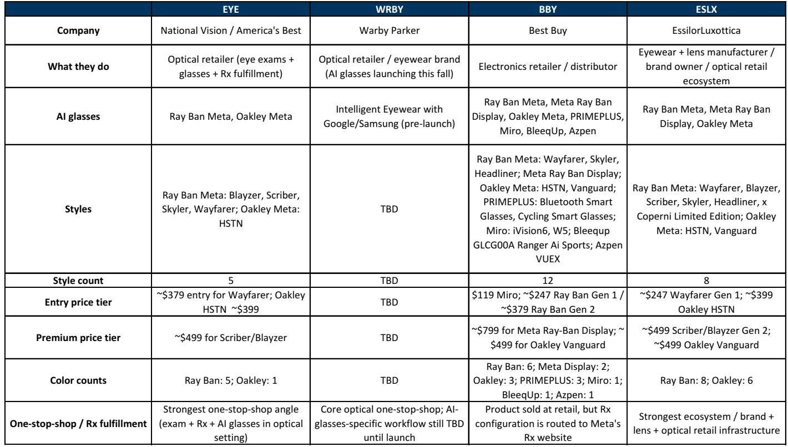
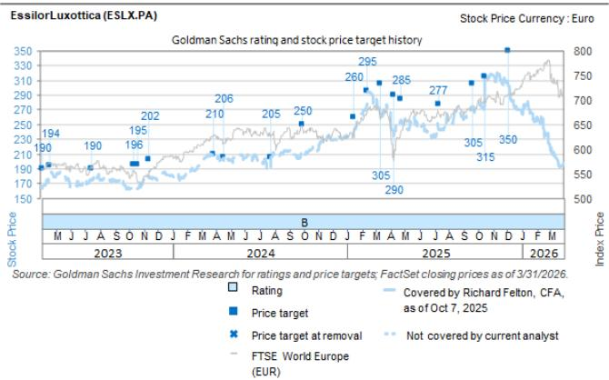
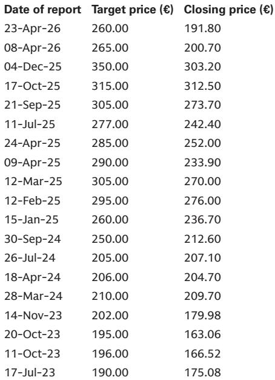

# GS：AI眼镜渠道扩容的真正赢家不是Best Buy，而是能完成处方闭环的零售商

当Best Buy宣布与Meta合作，在50多家门店内开设“Meta Lab”体验空间时，市场的第一反应往往是：电子产品零售商要抢眼镜店的生意了。这个直觉并不错，但它忽略了一个更关键的结构性事实——AI眼镜的购买决策，正在从“电子消费品”向“视力健康产品”迁移。而在这个迁移过程中，真正构成竞争壁垒的，不是门店数量或展示面积，而是能否在同一个场景里完成验光、处方、镜片定制和框架适配的闭环。

GS在6月发布的一份专题研报中，系统评估了Best Buy与Meta合作对美国主要眼镜零售商的影响。结论清晰且反直觉：对于National Vision（EYE）和Warby Parker（WRBY）而言，这个合作并非威胁；对于EssilorLuxottica（ESLX）而言，反而是利好。真正需要关注的，是当渠道扩容加速了消费者教育之后，谁有能力将“尝鲜流量”转化为“处方收入”。

这份报告的价值不在于它判断了股价涨跌，而在于它提供了一个分析框架：在AI眼镜从极客玩具走向大众消费品的过程中，竞争壁垒的构成要素正在被重新定义。

## 1. 消费者对AI眼镜的首要需求不是“体验”，而是“配好”

GS在报告中披露了一个关键数据：超过50%的Best Buy消费者希望在购买AI眼镜前能够亲眼看到实物。这个数据本身并不令人意外，真正重要的是它揭示的消费者决策链条——人们走进门店，不只是为了摸一摸产品，而是为了确认“这副眼镜戴在我脸上是否合适、是否可以配上我的处方”。

这正是眼镜零售商与电子产品零售商之间最本质的差异。National Vision在美国拥有超过1000家门店，每家门店都配备了验光师和现场镜片加工能力。当消费者走进America‘s Best或Eyeglass World，他们可以在一次到店中完成：验光、选择Ray-Ban Meta框架、定制处方镜片、当场取货。而Best Buy的消费者如果需要处方镜片，则必须将眼镜寄送到Meta指定的在线验光平台，再等待镜片制作完成后寄回。

这个流程差异直接决定了转化率和客单价。GS报告引用National Vision管理层的话指出，Ray-Ban Meta已经成为其门店中周转最快的SKU，且购买Meta眼镜的消费者贡献了最高的平均交易价值。这背后的逻辑很清楚：当验光、镜片和框架可以在一个场景中解决时，消费者的决策成本大幅降低，同时零售商获得了镜片这一高毛利附加品的收入。

对于Best Buy而言，它的竞争优势在于展示和体验，但一旦消费者进入“我需要配一副能日常佩戴的眼镜”这个决策阶段，Best Buy的体验优势就会转化为体验断层。GS的判断是：National Vision提供的无缝体验是Best Buy无法复制的。

## 2. 门店密度不是护城河，服务密度才是

GS用Placer.ai和DataWorks的数据做了一个有趣的地理分析：将三家眼镜零售商的门店位置与Best Buy门店进行叠加，计算彼此在1英里、3英里、5英里半径内的重叠率。结果显示，Warby Parker有54%的门店位于Best Buy周边3英里范围内，National Vision为53%，EssilorLuxottica为49%。从物理距离上看，三者与Best Buy的重叠度大致相当。

但物理距离的重叠并不意味着客流竞争的同质化。GS的分析揭示了一个更微妙的格局：当消费者在Best Buy体验了AI眼镜后，如果需要完成处方配置，他们会去哪里？答案是，他们会去最近的一家能提供验光和镜片服务的眼镜店。而在这个维度上，National Vision和Warby Parker的“服务密度”远高于Best Buy。

Warby Parker目前拥有约337家自有门店，覆盖44个州的主要城市。更重要的是，Warby Parker的核心商业模式就是“验光+处方+框架”的一站式服务。GS在报告中特别指出，Warby Parker即将在今年秋季与Google和Samsung合作推出自有品牌的AI眼镜，初期仅通过自有渠道销售，不做批发分销。这意味着Warby Parker可以完全控制从体验、验光到交付的整个消费者旅程，而不需要依赖第三方零售商来获取流量。

对于EssilorLuxottica而言，情况略有不同。作为Ray-Ban Meta眼镜的品牌方和授权制造商，EssilorLuxottica对Best Buy的合作持积极态度，因为任何能扩大消费者教育和产品触达的渠道，最终都会增加其品牌授权收入和镜片销售。但GS也谨慎地指出，通过Best Buy销售的AI眼镜，其处方镜片附加率可能低于通过EssilorLuxottica自有零售网络（如Sunglass Hut和LensCrafters）销售的产品。这意味着一部分增量收入是以牺牲利润率换来的。

## 3. 搜索趋势揭示了一个被忽视的信号：Warby Parker正在获得消费者心智

GS在报告中引用了Google Trends的数据，追踪了过去18个月消费者对“Best Buy AI glasses”、“America’s Best Meta”和“Warby Parker AI glasses”的搜索热度。结果值得玩味。

Best Buy的搜索热度在2025年6月之后迅速攀升，并在12月达到峰值，随后开始回落。而Warby Parker的搜索热度在2026年5月出现了明显的逆势上升，达到190的近期高点（以峰值100为基准）。这个趋势的变化时间点，恰好与Warby Parker宣布其AI眼镜即将在秋季发布的时间窗口吻合。

搜索趋势的变化通常领先于实际购买行为。它在暗示一个重要的消费者认知迁移：当AI眼镜从“Best Buy里的一件新奇电子产品”转变为“Warby Parker店里的一副真正可以日常佩戴的眼镜”时，消费者的搜索行为会从渠道导向转向品牌导向。Warby Parker在消费者心智中建立了一个独特的定位——它既是眼镜品牌，也是科技产品，同时还能完成处方服务。这个三重身份的结合，是Best Buy无法通过开设Meta Lab复制的。

GS报告虽然没有直接给出这个判断，但从其引用的搜索数据和管理层访谈中可以清晰地推导出：Warby Parker正在利用AI眼镜的产品发布窗口期，强化自己作为“智能眼镜一站式解决方案”的品牌认知。而Best Buy的Meta Lab，虽然在短期内拉高了品类热度，但长期来看，可能反而为Warby Parker和National Vision这样的专业零售商做了消费者教育。

## 4. 报告尚未完全回答的关键问题：AI眼镜的“处方附加率”能否持续提升

GS这份报告的分析框架非常清晰，但它也留下了一个尚未完全回答的问题：AI眼镜的处方镜片附加率，能否随着产品迭代和渠道扩容而持续提升？

目前，Ray-Ban Meta眼镜的处方配置主要依赖第三方在线验光平台，消费者需要自行上传处方信息，然后由Meta合作的镜片加工商完成定制。这个流程的转化率远低于在眼镜店内完成的现场验光+处方+取货闭环。GS报告承认，通过Best Buy销售的AI眼镜，其处方镜片附加率可能低于通过专业零售商销售的产品。

但这里存在一个尚未被充分讨论的变量：如果Meta在未来版本的AI眼镜中，直接集成自适应变焦镜片或电子处方调节功能，那么“处方”这个环节的物理属性可能会发生根本性变化。消费者可能不再需要去眼镜店验光，而是通过眼镜自身的自动调节功能来适配视力需求。如果这个技术路径成为现实，那么Best Buy的渠道优势将大幅提升，而眼镜零售商的“验光壁垒”将受到侵蚀。

GS报告没有讨论这个技术假设，因为它超出了当前产品路线图的范围。但对于投资者和产业观察者而言，这是一个需要持续追踪的关键变量。AI眼镜的竞争，最终可能不是渠道之争，而是“处方能力”的技术化之争。

## 5. 投资者的观察框架：从“渠道覆盖”转向“服务闭环能力”

基于GS的分析逻辑，我们可以提炼出一个更通用的观察框架，用于评估AI眼镜产业链上不同参与者的竞争地位。

第一个维度是“体验深度”。Best Buy的Meta Lab提供了沉浸式展示和互动体验，但它无法完成验光和处方配置。National Vision和Warby Parker提供的是一站式服务闭环，从体验到交付全部在场内完成。EssilorLuxottica作为品牌方，拥有最完整的产品矩阵和零售网络，但其对终端消费者体验的控制力不如自有渠道零售商。

第二个维度是“处方能力”。这包括验光师网络、镜片加工能力和处方数据库。National Vision拥有最大的验光师团队和最广泛的现场镜片加工能力，Warby Parker则通过数字化手段提升了处方配置的效率。Best Buy在这个维度上几乎为零。

第三个维度是“消费者生命周期价值”。购买AI眼镜的消费者，如果同时完成了处方镜片的配置，其后续的镜片更换、框架升级和视力检查将形成一个持续的收入流。GS报告虽然没有直接计算这个指标，但从其引用的“Ray-Ban Meta消费者平均交易价值最高”的数据可以推断，处方附加率是提升消费者生命周期价值的关键杠杆。

这三个维度叠加在一起，可以解释为什么GS对三家眼镜零售商的判断是“非风险”或“利好”，而不是“威胁”。在AI眼镜的早期普及阶段，渠道扩容带来的品类热度提升，对专业零售商而言是净利好。只有当AI眼镜变成完全不需要处方的消费品时，Best Buy这样的通用电子零售商才会构成真正的威胁。而那个时刻，至少目前还没有到来。

---

这份GS报告的价值，不在于它给出了具体的股价目标，而在于它提供了一个分析AI眼镜竞争格局的框架。真正的洞察往往隐藏在那些没有被直接说出来的推论里：当渠道扩容加速了消费者教育，真正受益的不是渠道本身，而是那些能在消费场景中完成服务闭环的零售商。

报告中对三家零售商的风险评估和估值逻辑，以及关于AI眼镜产品路线图的更多细节，我们将在社群内继续展开讨论。如果你对AI眼镜的产业竞争格局、处方镜片的技术演进路径、以及各公司的估值模型感兴趣，欢迎来星球微信群里继续交流。我们会在群内分享完整的研报原文和GS的原始数据图表，并围绕报告中尚未完全回答的关键问题进行深度讨论。

Personal reading notes and learning share only. Not investment advice.

