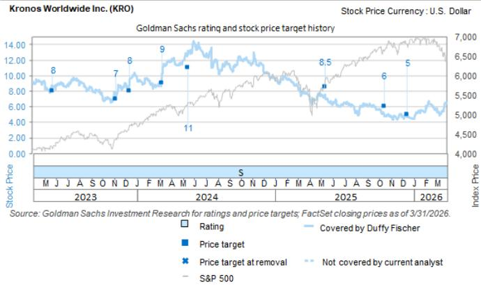
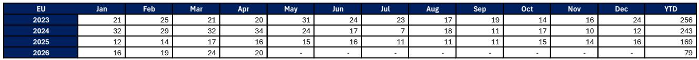
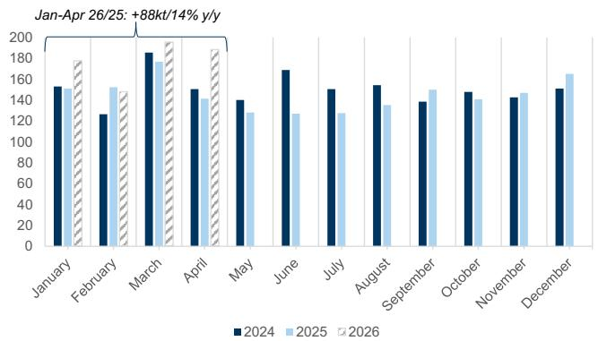

# Chinese TiO2 Exports Are Reshaping Global Pricing Dynamics, and Western Producers Are Running Out of Room for Error

The global titanium dioxide market is entering a period of structural tension that most investors have not fully priced in. Chinese net exports of TiO2 have remained persistently elevated through the first four months of this year, rising 88 kilotons year-over-year, a 14 percent increase that defies the conventional narrative that raw material constraints would curb Chinese supply. This is not a temporary blip. It is a signal that Chinese producers have built a more resilient production system than the market anticipated, and that resilience is now directly undermining the pricing power of Western producers such as Kronos Worldwide, Chemours, and Tronox Holdings. The implications extend beyond a single earnings revision. They point to a fundamental rebalancing of global TiO2 supply chains, one in which Chinese capacity becomes the marginal price setter in markets that were once considered safe havens for Western margins.

The report from a global investment bank makes this case with unusual clarity. The data on Chinese exports to the European Union and India is particularly striking. Year-to-date exports to the EU have increased 32 percent, while exports to India have risen 28 percent. These are not marginal markets. The EU represents a high-value region where Western producers have historically enjoyed pricing premiums and stable demand. India, meanwhile, had been expected to benefit from anti-dumping duties that could have shielded local and Western producers from Chinese competition. But those duties remain suspended, and without bonded warehouse infrastructure in India, any reinstatement would have an immediate and disruptive market impact. The report notes that in April alone, Chinese exports to India jumped 14 kilotons to 32 kilotons, a level that suggests Chinese producers are aggressively building market share in a country that was supposed to be a buffer zone.

The strategic question for investors is straightforward: if Chinese supply is this resilient, and if demand in the dominant end market for TiO2, paints and coatings, is starting to show signs of weakness, then what happens to the pricing assumptions embedded in current valuations? The report suggests the answer is a downward revision. It states plainly that the TiO2 market will soften by the end of the summer and that pricing increases will likely be weaker than expected. This is not a forecast of collapse, but it is a forecast of compression. And compression is the most dangerous environment for high-cost, high-fixed-cost producers like Kronos.

## Chinese Production Resilience Has Broken the Traditional Supply Constraint Logic

The most important analytical finding in this report is that the sulfur-related production issues that were expected to constrain Chinese TiO2 output have not materialized as a meaningful bottleneck. The industry narrative had been that Chinese producers, particularly those using the sulfate process, were vulnerable to sulfur supply disruptions and that this would naturally limit export volumes. The data tells a different story. Chinese net exports in April remained elevated, and the year-to-date trajectory shows no sign of moderation. This suggests that Chinese producers have either secured alternative sulfur sources, shifted more production to the chloride process, or simply absorbed higher input costs to maintain market share.

The consequence is that the traditional supply-demand logic that Western producers have relied on for pricing power is breaking down. In previous cycles, when Chinese exports rose, they were often offset by domestic demand absorption or raw material constraints. That is no longer the case. Chinese producers are now structurally capable of exporting at levels that directly compete with Western producers in their core markets. The report's exhibit on Chinese net exports shows that the current run rate is significantly above the pre-2020 average, and the trajectory continues to climb. This is not a cyclical surge. It is a structural shift in the global supply curve.

For investors in Western TiO2 producers, the implication is that the margin floor has moved lower. If Chinese supply remains elevated, any demand weakness will be magnified in pricing, because Western producers will have to choose between losing volume and cutting prices. The report's analysis of paint volumes, which are weaker than expected to start the year, adds a second layer of concern. When supply is high and demand is softening, the equilibrium price falls. The only question is how fast and how far.

## The European Union and India Are the Front Lines of a Market Share War

The geographic breakdown of Chinese export flows reveals a deliberate strategy of market penetration. The EU and India are not random destinations. They are the two regions where Western producers have the most to lose. In the EU, Chinese exports have grown from a year-to-date total of 60 kilotons in 2023 to 79 kilotons in the first four months of this year. That is a 32 percent increase, and it comes at a time when European demand is already under pressure from weak construction and industrial activity. The report does not speculate on whether this is price-driven or relationship-driven, but the volume data is unambiguous. Chinese producers are gaining share in a market that Western producers had considered relatively insulated.

India presents an even more complex picture. The suspension of anti-dumping duties had created a window for Chinese exports, and Chinese producers have exploited it aggressively. Year-to-date exports to India have reached 149 kilotons, compared to 257 kilotons for all of 2025. At the current run rate, 2026 will likely exceed 2025 levels by a wide margin. The report notes that because China lacks bonded warehouses in India, any reinstatement of the anti-dumping duty would have an immediate market impact. But the timing of that reinstatement remains uncertain, and in the meantime, Chinese producers are building customer relationships and distribution networks that will persist even if duties are reimposed. The window of opportunity may close, but the structural damage to Western market share has already been done.

The strategic lesson for investors is that geography no longer provides protection. The global TiO2 market is becoming a single, integrated battleground, and Chinese producers have the cost structure and the export capacity to compete anywhere. Western producers must now defend margins not just in their home regions but in every region where Chinese exporters choose to compete.

## Kronos's Operational Recovery Is Real, but It Is Not a Strategic Solution

The report updates estimates for Kronos Worldwide and raises near-term EBITDA forecasts significantly. Second-quarter 2026 EBITDA is revised upward by 86 percent, and full-year 2026 EBITDA is raised by 66 percent. This revision reflects the benefit of lower operating rates in late 2025, which reduced fixed cost absorption losses, as well as structural cost actions and some improvement in ore costs. On the surface, this looks like good news. Kronos is seeing the payoff from difficult operational decisions.

But the revision must be placed in context. The improvement is largely a recovery from a depressed base. Kronos's fourth-quarter loss was a direct result of high fixed costs that could not be absorbed at low production volumes. The company ran at lower rates to avoid producing at a loss, and now it is benefiting from the comparison. The report also notes that later in the year, Kronos's production rates could catch up with sales volumes, which have been under since the second quarter of 2025. That implies the current margin improvement may be temporary. Once production normalizes, the fixed cost absorption issue will return, and the company will again be exposed to the pricing headwinds created by Chinese exports.

The more fundamental concern is that Kronos's cost structure is not competitive with Chinese producers on a sustained basis. The report's own valuation framework uses a 9.0x EV/EBITDA multiple on 2027 estimates, down from 14x on 2026 estimates previously. That multiple compression reflects the market's recognition that the earnings recovery is cyclical, not structural. The report also notes that the company has only about 20 percent float, which limits institutional investor interest and reduces the likelihood of a valuation re-rating. Even if the operational turnaround continues, the stock may remain range-bound because the structural headwinds from Chinese supply are not going away.

The unanswered question is whether Kronos can achieve a cost structure that allows it to compete in a world where Chinese exports remain elevated. The report does not provide a definitive answer, and that uncertainty is itself a risk factor. Investors who focus only on the upward EBITDA revision may miss the larger strategic challenge.

## What the Report Does Not Fully Answer: The Second-Order Effects of Chinese Export Persistence

The report is rigorous in its data analysis and clear in its near-term implications. But it leaves several important questions unresolved, and these are the questions that should drive deeper analysis for any serious investor.

First, the report does not fully explain why Chinese exports have remained elevated despite the sulfur issues. Is it because Chinese producers have found workarounds, or because they are willing to accept lower margins to maintain market share? The answer matters enormously for forecasting. If it is the former, then Chinese supply is structurally higher, and Western producers must permanently adjust their cost bases. If it is the latter, then Chinese exports may moderate once domestic demand improves or input costs rise further. The report leans toward the structural interpretation, but it does not provide the evidence to prove it.

Second, the report does not analyze the impact of Chinese exports on downstream TiO2 derivatives and specialty grades. The data focuses on net exports of TiO2 pigment, but the competitive dynamics may differ for higher-value products where Western producers still have technological advantages. If Chinese producers are primarily exporting commodity-grade pigment, then Western producers may retain pricing power in premium segments. But if Chinese producers are moving up the value chain, the threat is even greater than the headline numbers suggest.

Third, the report does not model the scenario in which the Indian anti-dumping duty is reinstated. It notes that the impact would be immediate, but it does not quantify the potential market disruption. If duties are reinstated, Chinese exports to India would likely drop sharply, and that volume would have to be redirected to other markets, potentially including the EU and the Americas. That could create a second wave of pricing pressure even as Western producers are still absorbing the first wave.

Fourth, the report does not address the environmental and regulatory risks facing Chinese TiO2 producers. The sulfate process, which is widely used in China, generates significant waste and has attracted regulatory scrutiny. If Chinese environmental enforcement tightens, production costs could rise, and export volumes could fall. That is a potential upside risk for Western producers, but the timing and probability are highly uncertain.

These open questions are not weaknesses in the report. They are invitations to further analysis. Any investor who relies solely on the reported data without considering these second-order effects is taking a view that is incomplete.

## A Decision Framework for Investors in TiO2-Exposed Equities

For investors who need to make a decision today, the report provides enough information to construct a clear framework. The framework has three dimensions: supply persistence, demand trajectory, and producer cost position.

On supply persistence, the key metric is Chinese net exports. If exports continue at or above current levels through the third quarter, the pricing outlook for the second half of the year will be materially worse than current consensus estimates. Investors should monitor monthly Chinese export data as a leading indicator. A sustained decline in exports would be a positive signal for Western producer margins. A continued increase would confirm the structural shift.

On demand trajectory, the critical variable is paint and coatings volumes, which are the dominant end market for TiO2. The report notes that paint volumes are weaker than expected to start the year. If this weakness persists, it will compound the supply-side pressure. Investors should track industrial production data in the EU and the United States, as well as housing starts and existing home sales, which are shown in the report as remaining subdued. The report's exhibit on existing home sales shows a flat-to-declining trend, which is consistent with weak demand for architectural coatings.

On producer cost position, the framework requires a comparison of each Western producer's cost structure relative to Chinese export prices. Kronos, with its high fixed costs and exposure to purchased titanium ore, is more vulnerable than more integrated peers. The report notes that a decline in titanium ore costs would benefit Kronos disproportionately, but that is an exogenous variable that investors cannot control. The more actionable insight is that Kronos's recent operational improvements may not be sustainable if Chinese exports remain elevated and pricing weakens.

The decision framework can be summarized as follows: if Chinese exports remain high and paint demand remains weak, then Western TiO2 producers will face margin compression, and current valuations are too optimistic. If either variable improves, the margin outlook becomes more favorable. Investors should position accordingly, with a bias toward caution until the data provides clearer directional signals.

## Join the Community to Read the Full Report and Review the Original Charts

The analysis presented here is based on a detailed parsing of a recent investment bank report on the Americas chemicals sector, with a specific focus on Chinese TiO2 export data and its implications for Kronos Worldwide. The original report contains exhibits on Chinese net exports, export flows to the EU and India, EBITDA revisions, and housing market data that are essential for forming a complete picture of the competitive dynamics. These charts provide the visual evidence that supports the analytical conclusions, and they are best understood in their original format.

To access the full report with all exhibits and to join a community of serious investors who debate the implications of this data in real time, click the link below. The community provides access to original research, data updates, and peer discussion that cannot be replicated in a single article. If you are making investment decisions in the chemicals sector, you need to see the charts for yourself.

Join the community to read the full report and review the original charts.

*This article is for learning and discussion only and does not constitute investment advice.*

Personal reading notes and learning share only. Not investment advice.

