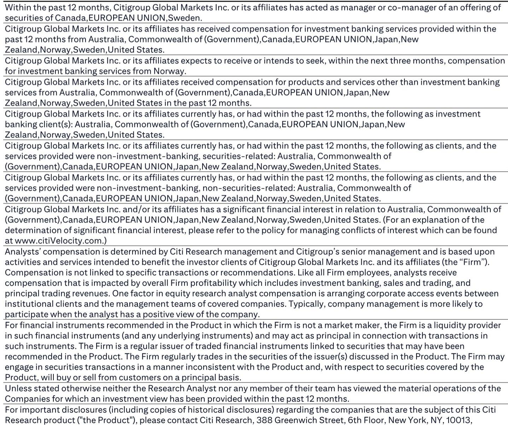
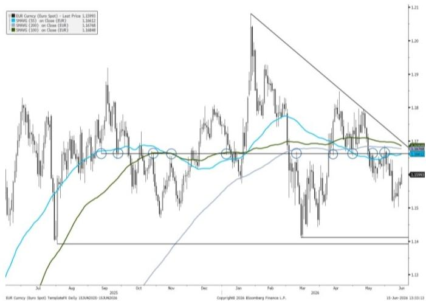
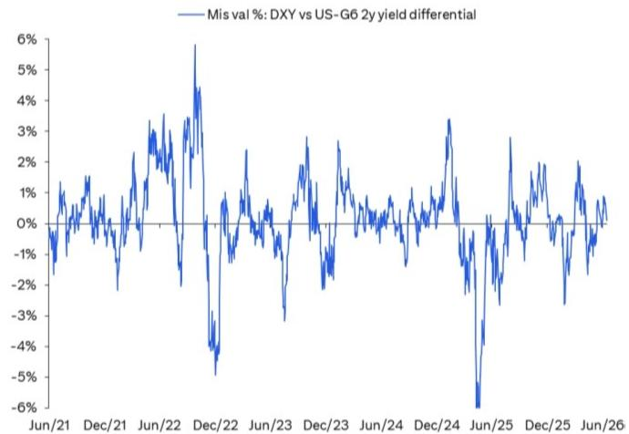

# The Dollar’s Range-Bound Prison: Why the Fed’s Next Move Will Not Free It

The U.S. dollar has been trapped in its tightest 12-month trading range in years, and the most anticipated Federal Reserve meeting in a generation is unlikely to be the key that unlocks the door. Markets are bracing for new Fed Chair Kevin Warsh’s first policy decision with expectations of a hawkish statement and revised economic projections, but the real story is that these adjustments are already priced into the currency. The dollar’s fate hinges not on what the Fed says, but on what it does not say—and on forces far beyond the committee room.

The controlling insight for foreign exchange investors is this: the medium-term trajectory of the dollar is determined by relative growth differentials, not by the tactical noise of a single meeting. While the market obsesses over whether the Fed will signal one hike or two, the underlying architecture of the global economy is shifting in ways that make a sustained dollar breakout unlikely. A potential US-Iran deal, easing commodity inflation, and a Fed chair who prefers ambiguity over guidance are combining to create a regime where the dollar remains range-bound, and where savvy investors should be selling rallies rather than chasing breakouts.

The asymmetry of risk, however, cuts both ways. If Warsh surprises by endorsing market pricing of a hike, the dollar could finally break higher. But that is not the base case, and positioning data shows that speculative USD longs have already been unwound ahead of the meeting. The market is positioned for disappointment, not for a hawkish revolution. The question is whether the data will cooperate with either scenario, and that is where the report’s analysis becomes most valuable.

## The Market Has Already Priced the Hawkish Statement, Leaving the Real Uncertainty in Warsh’s Ambiguity

The Federal Open Market Committee is expected to deliver a statement that drops its easing bias, a Summary of Economic Projections that raises core PCE forecasts, and a dot plot that shifts to no change for 2026—possibly with a dot or two moving toward a hike. These are meaningful changes in any normal context, but they are not the kind of surprises that move currencies. The market has already discounted them.

The real uncertainty lies in what Warsh says during the press conference, and more importantly, in what he refuses to say. The new chair has a well-documented skepticism of forward guidance, and his base case appears to be providing ambiguous answers about the current market pricing of 18 basis points of hikes through year-end, with the first full hike priced for March 2027. This ambiguity is itself a policy stance: it gives the Fed room to look past goods and energy inflation, especially if a US-Iran deal materializes and weakens the commodity price impulse.

For currency investors, the implications are clear. If Warsh delivers a neutral-to-dovish message, the dollar is unlikely to rally, but it may also not sell off sharply because DXY is already near its short-term fair value relative to US-G6 two-year yield differentials. This is not a market that is mispriced; it is a market that is waiting for a catalyst that does not exist yet. The report’s analysis suggests that any knee-jerk USD selling following a neutral Warsh would be limited, and that the more attractive trade is to fade EUR rallies toward the 1.1660–1.1680 resistance zone.

## A Potential US-Iran Deal and Weaker CPI Give the Fed Cover to Look Past Inflation, Reinforcing the Dollar’s Range

The most underappreciated factor in the dollar’s near-term outlook is the increasing likelihood of a US-Iran agreement. This is not merely a geopolitical headline; it is a structural shift that alters the Fed’s reaction function. If the Strait of Hormuz flows resume relatively quickly, normalizing by mid-to-late July as Citi Commodities projects, the commodity-induced inflation surprises that have kept the Fed on edge will fade. Combined with weaker CPI data, this gives the Fed—and particularly a new chair who wants to establish his independence from market pricing—the cover to look past inflationary pressures.

This is a classic example of why currency forecasting requires a multi-factor framework. The dollar’s range is not a function of Fed policy alone; it is the intersection of monetary policy, geopolitical risk, commodity prices, and relative growth expectations. A US-Iran deal reduces geopolitical risk premia, lowers oil prices, and weakens the inflation narrative that would otherwise justify a hawkish Fed. The net effect is to reinforce the dollar’s range, not to break it.

For investors, this means that the tactical bearish risk sentiment that emerged in early June is fading. The combination of a potential deal, a successful major tech IPO, and a banal Fed meeting creates a backdrop where risk assets can stabilize and rally. In FX, this supports carry trades, which the report recommends funding with EUR and CAD. These are not high-conviction longs; they are tactical expressions of a regime where the dollar does not have a clear directional catalyst.

## The Dollar’s Breakout Requires a Hawkish Warsh Surprise, But the Asymmetry Favors a Range-Bound Outcome

The most analytically rigorous part of the report is its assessment of the asymmetry of risks. While the base case is for a neutral-to-dovish Warsh that keeps the dollar in its range, the report correctly identifies that the upside risk to the dollar is larger than the downside risk. If Warsh endorses market pricing—or even signals that a hike and a cut are equally likely—the dollar could rally materially as markets price in not just one hike but potentially a second.

This is not a prediction; it is a risk assessment. The report’s framework is explicitly probabilistic, and it acknowledges that a hawkish surprise could finally break DXY out of its 12-month consolidation at the base of the long-term channel uptrend. Historically, such breakouts should be chased if confirmed on a multi-day basis. But the report also notes that the bar for the market to price out hikes is high, even if the hawkish risks do not materialize. This requires data that first shows inflation breadth is peaking, which is not yet evident.

The asymmetry, therefore, is not symmetrical. The dollar can stay range-bound for longer than most investors expect, but if it breaks, it breaks higher. This is a classic pattern in currency markets: ranges are persistent, breakouts are violent. The report’s recommendation to fade EUR rallies toward resistance is a bet on persistence, not on a breakout. It is a tactical trade that acknowledges the range while positioning for the most likely outcome.

## What the Report Does Not Fully Answer: The Timing and Triggers for a Regime Change in the Dollar

For all its analytical rigor, the report leaves several meaningful open questions that should make any serious investor want the full analysis. The most important is the timing of a potential regime change. The report identifies the conditions for a dollar breakout—a hawkish Warsh surprise, a sustained shift in inflation breadth, or a re-escalation of geopolitical risk—but it does not assign probabilities to these scenarios or provide a clear timeline.

Second, the report does not fully explore the implications of a US-Iran deal on the dollar’s structural trajectory. If the deal reduces geopolitical risk premia permanently, does that weaken the dollar’s safe-haven bid in a way that shifts the medium-term outlook? Or is the dollar’s safe-haven status resilient enough to absorb this shock? The report suggests that a deal would support risk assets and weaken the dollar tactically, but it does not extend this logic to a multi-quarter horizon.

Third, the report raises but does not resolve the question of how the MoF’s potential intervention in USDJPY interacts with the dollar’s broader range. If the MoF uses a knee-jerk USD selling episode to intervene, as it did in July 2024, this could create a tactical opportunity in USDJPY that is independent of the dollar’s overall direction. But the report does not provide a framework for sizing this trade or for distinguishing between intervention-driven moves and fundamental shifts.

These open questions are not weaknesses; they are invitations. The report is honest about what it does not know, and it provides a framework for investors to make their own judgments. That is the hallmark of serious research.

## A Decision Framework for Navigating the Dollar’s Range: Fade Rallies, Monitor the Data, and Prepare for a Breakout

For investors who want to translate this analysis into action, the report implies a clear decision framework. The first step is to recognize that the dollar is in a regime of low volatility and high persistence. This is not a market for directional bets; it is a market for tactical trades around resistance and support levels.

The second step is to monitor three key data points: the trajectory of core PCE, the progress of US-Iran negotiations, and Warsh’s communication style in subsequent speeches. If inflation breadth peaks and core PCE begins to decline, the case for a dollar breakout weakens. If the Iran deal is finalized and oil prices normalize, the dollar’s safe-haven premium erodes. If Warsh continues to provide ambiguous guidance, the market will remain in a holding pattern.

The third step is to prepare for the breakout when it comes. The report’s historical analysis suggests that breakouts from long-term consolidations should be chased if confirmed on a multi-day basis. This means that investors should have a plan for adding to dollar longs if DXY breaks above its 12-month range, and for cutting EUR shorts if the breakout fails. The key is to distinguish between a false breakout and a genuine regime change, which requires patience and a willingness to let the market confirm the move.

The most actionable trade in the current environment is to sell EURUSD rallies toward the 1.1660–1.1680 resistance zone, funding the trade with CAD or EUR as the report recommends. This is not a high-conviction short; it is a tactical expression of a range-bound regime. But it is also a trade that acknowledges the asymmetry: if the dollar breaks higher, the downside in EURUSD could be substantial, and the risk/reward of being short at resistance is attractive.

## The Full Picture Requires the Data and Charts That Only the Original Report Provides

This article has synthesized the core arguments of the report, but it cannot replicate the analytical depth of the original. The charts showing USD positioning, DXY fair value, EURUSD resistance levels, and the long-term channel uptrend are essential for understanding the precise entry and exit points that the report recommends. The full report also includes detailed analysis of the tactical indicators that turned positive alongside the stock rally, and the commodity team’s oil forecast that underpins the geopolitical scenario.

Join the community to read the full report and review the original charts. The data on speculative positioning, yield differentials, and historical breakout patterns are too nuanced to summarize in a single article. For investors who want to trade this analysis rather than just read it, the original charts are indispensable.

*This article is for learning and discussion only and does not constitute investment advice.*

Personal reading notes and learning share only. Not investment advice.

