## Global Metals & Mining

# Global Metals & Mining: Copper Taco or Boco Season Finale - U.S. policy is distorting copper price but what can we do about it?

Bob Brackett, Ph.D.

+1 917 344 8422

bob.brackett@bernsteinsg.com

Andrianto Guntoro, CFA

+44 20 7676 6825

andrianto.guntoro@bernsteinsg.com

We approach the deadline (June 30th) for the White House to decide on tariffs on refined copper. In previous notes, we expressed our TACO view of no tariffs. Trade deals were promised (Trump Directs Negotiations to Adjust Imports of Processed Critical Minerals) but haven't arrived from, say, Chile or Indonesia. In this note, we evaluate potential paths for copper prices. Bernstein Occasionally Chickens Out?

Copper prices have surged over the past year due to: (1) supply disruptions at major mines, (2) increased financial speculation (Exhibit 1), (3) additional demand from US inventory stockpiling, as traders anticipate a 15% tariff on refined copper by January 2027, and potentially 30% by January 2028 (Exhibit 2 to Exhibit 3).

The potential tariff stems from the Trump's desire to achieve “resource independence” by ensuring sufficient domestic refining capacity and the market for refined copper in the US (Exhibit 5).

Our base case scenario assumes a definitive announcement that refined copper will not be subject to tariffs. Inventories from US warehouses might flow back to RoW if LME prices are sufficiently higher than Comex prices. Otherwise, US inventory levels will normalize as stocks are drawn to meet domestic US demand. In this scenario, we foresee gradual decline in copper prices to reach \$11,000/t due to incremental supply released from Comex warehouse.

Bull case scenario could unfold through three pathways, listed in order of increasing bullishness for copper prices: (1) extended review period (i.e., decision will be made in the future), (2) Trump introduces 15% tariff, with no firm guidance on potential tariff increases in 2028, (3) Trump announces both 15% tariff starting January 2027 and 30% tariff starting January 2028.

We estimate that the cost to finance and move copper from Western Europe to the US is about \$400/t to \$754/t depending on storage duration (Exhibit 7). Potential upside if Trump introduces 15% tariff is >\$2,000/t. This skewed risk/reward ratio creates incentives for traders to keep piling copper in Comex warehouses. Hence, in all bull case scenario, we are likely to see 10kt per week incremental US copper inventories, which accumulates to 250-300kt for a 6-mo period (bull case no. 1), and as much as 700-800kt for a 1.5 year period (bull case no. 3).

Assuming stable macro environment, copper prices might reclaim its all-time-high level in bull case scenario, even without mine supply failure.

Across our coverage, copper price sensitivity (Exhibit 18 to Exhibit 21) is most pronounced for FCX and ANTO (c.1.5x and 1.4x beta to copper, respectively). This is followed by AAL (c.1.1x), with BHP exhibiting a more moderate sensitivity (c.0.7x).

BERNSTEIN TICKER TABLE

<table><tr><td rowspan="2">Ticker</td><td rowspan="2">Rating</td><td colspan="3">15 Jun 2026</td><td rowspan="2">TTMRel.</td><td colspan="4">Adjusted EPS</td><td colspan="3">Adjusted P/E (x)</td></tr><tr><td>Cur</td><td>Closing Price</td><td>Price Target</td><td>Cur</td><td>2025A</td><td>2026E</td><td>2027E</td><td>2025A</td><td>2026E</td><td>2027E</td></tr><tr><td>AAL.LN (Anglo American)</td><td>M</td><td>GBp</td><td>4,088.00</td><td>2,650.00</td><td>77.3%</td><td>USD</td><td>0.54</td><td>1.64</td><td>1.77</td><td>101.5</td><td>33.4</td><td>30.9</td></tr><tr><td>OLD</td><td></td><td></td><td></td><td>2,350.00</td><td></td><td></td><td></td><td>1.54</td><td>1.56</td><td></td><td></td><td></td></tr><tr><td>ANTO.LN (Antofagasta)</td><td>M</td><td>GBp</td><td>4,290.00</td><td>2,800.00</td><td>123.4%</td><td>USD</td><td>1.29</td><td>1.75</td><td>1.51</td><td>44.5</td><td>33.0</td><td>38.2</td></tr><tr><td>FCX (Freeport-McMoRan)</td><td>M</td><td>USD</td><td>68.41</td><td>58.50</td><td>43.4%</td><td>USD</td><td>1.53</td><td>2.10</td><td>2.81</td><td>44.8</td><td>32.6</td><td>24.3</td></tr><tr><td>EDME</td><td></td><td></td><td>1,573.57</td><td></td><td></td><td></td><td></td><td></td><td></td><td></td><td></td><td></td></tr><tr><td>SPX</td><td></td><td></td><td>7,554.29</td><td></td><td></td><td></td><td></td><td></td><td></td><td></td><td></td><td></td></tr></table>

## PRICE TARGET CHANGE / ESTIMATE CHANGE IN BOLD

O - Outperform, M - Market-Perform, U - Underperform, NR - Not Rated, CS - Coverage Suspended

FCX estimate is Reported EPS; FCX valuation is Reported P/E (x);

Source: Bloomberg, Bernstein estimates and analysis.

## INVESTMENT IMPLICATIONS

We maintain our Market-Perform rating on Anglo American, Antofagasta and Freeport McMoRan

AAL (Market-Perform)

We increase our price target from GBP 23.50 to GBP 26.50 to reflect our latest FX and copper price deck. We continue to use an unchanged 25/75 combination of DCF and an EV/EBITDA multiple of 7.0x against our forward 2027 EBITDA estimate.

## DETAILS

## HOW DO WE GET HERE? - A BRIEF RECAP

Copper rose significantly last year from \$8,691/t in January 2025 to reach \$12,598/t on 30 December 2025. It ran further north this year and hit an all-time-high \$14,109/t in mid-May. Several factors have contributed to this sharp rise:

1. Supply disruptions at major copper mines, such as at Kamoa-Kakula and Grasberg (e.g., FCX announcement that production from Grasberg would be negatively impacted by mud-rush incident pushed copper prices past \$10,000/t in September).  
2. Increased financial speculation, with net futures positioning currently at elevated levels. We believe this helped fuel copper's rise from \$11,000/t to \$13,000/t in December.

EXHIBIT 1: Net COT positioning had climbed significantly in late Q4 2025, helping copper price to reach \$13,000/t in December.  
Copper Prices vs. COT Investment Funds Positioning  
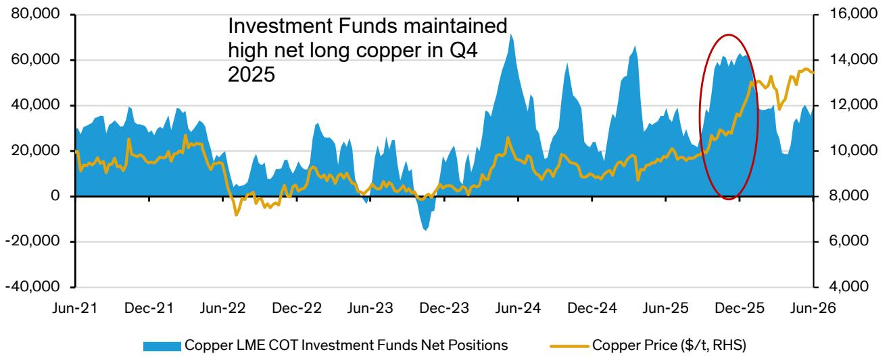

line chart

| Date    | Copper LME COT Investment Funds Net Positions | Copper Price ($/t, RHS) |
|---------|-----------------------------------------------|--------------------------|
| Jun-21  | ~30,000                                       | ~9,000                   |
| Dec-21  | ~35,000                                       | ~10,000                  |
| Jun-22  | ~15,000                                       | ~7,000                   |
| Dec-22  | ~25,000                                       | ~8,000                   |
| Jun-23  | ~10,000                                       | ~7,500                   |
| Dec-23  | ~-15,000                                      | ~8,000                   |
| Jun-24  | ~70,000                                       | ~10,000                  |
| Dec-24  | ~55,000                                       | ~9,500                   |
| Jun-25  | ~65,000                                       | ~11,000                  |
| Dec-25  | ~60,000                                       | ~13,000                  |
| Jun-26  | ~40,000                                       | ~14,000                  |

Source: Bloomberg, Bernstein analysis

3. Additional demand from inventory stockpiling (i.e., channel stuffing) in the US, as traders anticipate a 15% tariff on refined copper by January 2027, and 30% by January 2028. Overall, we saw copper exchange inventory rose by 267kt in 2025, with the rise in Comex 344kt. Year-to-date 2026, copper inventory in LME, SHFE and Comex has increased by 224kt, 58kt and 152kt, respectively, making total exchange inventory to rise by 434kt.

EXHIBIT 2: Comex copper inventories have steadily risen since April 2025 with an average of c.9kt incremental inventories per week.  
Comex Copper Inventories (short ton) vs. Weekly Change  
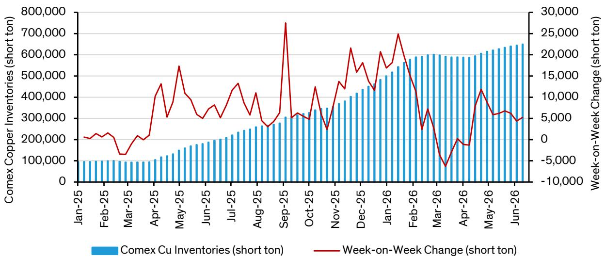

bar-line hybrid chart

| Month    | Comex Copper Inventories (short ton) | Week-on-Week Change (short ton) |
|----------|--------------------------------------|---------------------------------|
| Jan-25   | ~100,000                             | ~2,000                          |
| Feb-25   | ~100,000                             | ~2,500                          |
| Mar-25   | ~100,000                             | ~-5,000                         |
| Apr-25   | ~120,000                             | ~4,500                          |
| May-25   | ~150,000                             | ~5,500                          |
| Jun-25   | ~180,000                             | ~3,500                          |
| Jul-25   | ~200,000                             | ~4,500                          |
| Aug-25   | ~250,000                             | ~3,500                          |
| Sep-25   | ~300,000                             | ~7,500                          |
| Oct-25   | ~350,000                             | ~3,500                          |
| Nov-25   | ~380,000                             | ~4,500                          |
| Dec-25   | ~420,000                             | ~6,500                          |
| Jan-26   | ~480,000                             | ~15,000                         |
| Feb-26   | ~600,000                             | ~25,000                         |
| Mar-26   | ~620,000                             | ~-8,000                         |
| Apr-26   | ~630,000                             | ~-5,000                         |
| May-26   | ~640,000                             | ~12,500                         |
| Jun-26   | ~650,000                             | ~3,500                          |

Source: Bloomberg, Bernstein analysis

EXHIBIT 3: Copper comex inventories have risen steadily by c.10,000 tonnes per week since summer 2025 as traders anticipate US tariffs on refined copper.  
Copper Inventory (t, LHS) vs Copper Price (\$/t, RHS)  
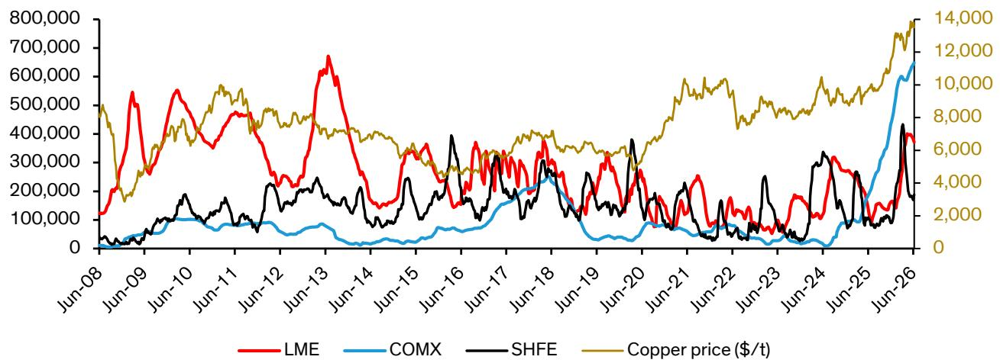

line chart

| Date   | LME    | COMX   | SHFE   | Copper price ($/t) |
|--------|--------|--------|--------|---------------------|
| Jun-08 | 100,000| 0      | 0      | 50,000              |
| Jun-09 | 550,000| 50,000 | 50,000 | 30,000              |
| Jun-10 | 550,000| 100,000| 100,000| 45,000              |
| Jun-11 | 450,000| 150,000| 150,000| 55,000              |
| Jun-12 | 250,000| 150,000| 25,000 | 55,000              |
| Jun-13 | 650,000| 25,000 | 25,000 | 45,000              |
| Jun-14 | 150,000| 5,000  | 15,000 | 45,000              |
| Jun-15 | 350,000| 15,000 | 25,000 | 45,000              |
| Jun-16 | 350,000| 25,000 | 35,000 | 45,000              |
| Jun-17 | 350,000| 25,000 | 35,000 | 45,000              |
| Jun-18 | 350,000| 25,000 | 35,000 | 45,000              |
| Jun-19 | 350,000| 25,000 | 35,000 | 45,000              |
| Jun-20 | 35,000 | 25,000 | 35,000 | 45,000              |
| Jun-21 | 35,000 | 25,000 | 35,000 | 45,000              |
| Jun-22 | 35,000 | 25,000 | 35,000 | 45,000              |
| Jun-23 | 35,000 | 25,000 | 35,000 | 45,000              |
| Jun-24 | 35,000 | 25,000 | 35,000 | 45,000              |
| Jun-25 | 35,000 | 25,000 | 35,000 | 45,000              |
| Jun-26 | 45,757.7| 62.757.7| 42.757.7| 14.166             |

Source: Bloomberg, Bernstein analysis

4. The last stretch to \$14,100/t was partly due to improved risk sentiment as major stock indexes hit their all-time-high levels (Exhibit 4). Widening spread between LME and Comex also helps to maintain positive sentiment in the copper market (Exhibit 10).

EXHIBIT 4: Positive sentiment in the stock market has helped copper to break past \$14,000/t level in mid-May. Widening spread between LME and Comex also helps to maintain positive sentiment in the copper market.  
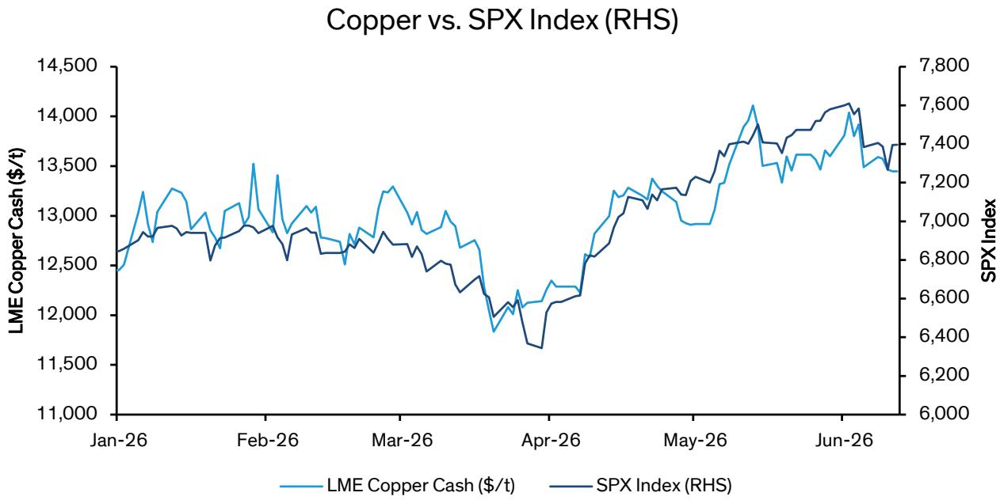

line chart

| Date   | LME Copper Cash ($/t) | SPX Index |
|--------|------------------------|---------|
| Jan-26 | 12,500                 | 6,800   |
| Feb-26 | 13,500                 | 7,000   |
| Mar-26 | 13,000                 | 6,900   |
| Apr-26 | 12,000                 | 6,400   |
| May-26 | 13,500                 | 7,200   |
| Jun-26 | 14,000                 | 7,600   |

Source: Bloomberg, Bernstein analysis

## WHERE ARE WE GOING NEXT? - TARIFFS RISKS

The additional demand from US inventory stockpiling is still ongoing. The origin of this phenomenon is the desire of the Trump's administration to achieve “resource independence” by ensuring sufficient domestic refining capacity and the market for refined copper in the US (Exhibit 5). Instead of US government stockpiling copper, Trump let traders do the job by introducing potential 15% tariffs starting on January 2027. The deadline for tariffs policy announcement is coming in less than 3 weeks.

## EXHIBIT 5: We'll get more clarity on section 232 investigations results by June 2026 with a potential of $15\%$ tariffs starting in January 2027 and $30\%$ tariffs starting in January 2028.

(7) The Secretary shall continue to monitor imports of copper and its derivatives. The Secretary shall, from time to time, in consultation with any senior executive branch officials the Secretary deems appropriate, review the status of copper and copper derivative imports with respect to national security. The Secretary shall inform the President of any circumstances that, in the Secretary's opinion, might indicate the need for further action by the President under section 232. By June 30, 2026, the Secretary shall provide the President with an update on domestic copper markets, including refining capacity and the market for refined copper in the United States, so that the President may determine whether imposing a phased universal import duty on refined copper of 15 percent starting on January 1, 2027, and 30 percent starting on January 1, 2028, as recommended by the June 30, 2025, report, is warranted to ensure that copper imports do not continue to threaten to impair the national security. The Secretary shall also inform the President of any circumstance that, in the Secretary's opinion, might indicate that the duty rate provided for in this proclamation, or any actions modifying this proclamation, is no longer necessary.

Adjusting Imports of Copper into the United States – The White House

Source: White House, Bernstein analysis

Since last summer, we have maintained our view that Trump is unlikely to impose tariffs on refined copper. Our full thesis is set out in Global Metals & Mining: Copper Taco, Part Deux - US policy is distorting copper price and Quick Take: Don't reach for the copper taco.

To date, there have been no observable copper agreements between the US and Chile - an outcome we had expected as a logical step to secure supply for the domestic market.

Looking ahead, we see two primary scenarios:

- Base case (no tariffs): A definitive announcement confirms that refined copper will not be subject to tariffs.  
- Bull case: This could unfold through three pathways, listed in order of increasing bullishness for copper prices:

1. Extended review period: A delay in the decision effectively prolongs uncertainty.  
2. Moderate tariff framework: A 15% tariff is introduced from January 2027, with no firm guidance on potential increases in 2028.  
3. Escalating tariff structure: A 15% tariff in 2027 followed by a 30% tariff in 2028.

We outline the implications of each scenario below.

EXHIBIT 6: US copper tariffs scenario and their implications to copper prices

<table><tr><td colspan="6">Scenario</td></tr><tr><td>15% tariffs from Jan 2027</td><td>30% tariffs from Jan 2028</td><td>Implication to Copper Flow</td><td>Implication to Copper Prices</td><td>Potential Incremental Inventories to US (kt)</td><td>Note</td></tr><tr><td></td><td></td><td>Inventories the US might flow back to RoW after announcement if LME trades at a premium to CME. We might see inventory levels normalize as stocks are drawn down to meet domestic US demand, likely reducing US copper import until next year.</td><td>---</td><td>0</td><td>Copper under pressure, likely to gradually ramp down to $11,000/t</td></tr><tr><td>[B247]</td><td></td><td>Inventories continue flowing into the US until the new decision deadline</td><td>+</td><td>250kt to 300kt (assuming January 2027 deadline)</td><td>Copper prices continue to rise in H2 2026 as traders continue to weigh the potential of 15% tariffs in 2027</td></tr><tr><td></td><td>-</td><td>Inventories continue flowing into the US until end of 2027 as the market would anticipate 30% potential tariffs in 2028.</td><td>++</td><td>700kt to 800kt</td><td>Copper prices are likely to be supported in 2027 as supply continue to pile in the US, causing shortage in ex-US regions. This might be offset by demand pullback and substitution.</td></tr><tr><td></td><td></td><td>Even more inventories to flow into the US until end of 2027 given the certainty of 30% tariffs in 2028</td><td>+++</td><td>700kt to 800kt</td><td>Copper prices are likely to be supported in 2027 as supply continue to pile in the US, causing shortage in ex-US regions. This might be offset by demand pullback and substitution.</td></tr></table>

Source: Bernstein analysis and estimates

## NO TARIFFS ON REFINED COPPER - OUR BASE CASE

A key driver of the \~500kt build in Comex inventories since last year has been trader positioning ahead of a potential >\$2,000/t windfall (15% x \$14,000/t price assumption) under a 15% tariff scenario.

Without tariffs, the economic rationale for holding excess copper in the US weakens materially. Inventories would likely be gradually released either into the domestic market or redirected to ex-US buyers. In practice, a relatively oversupplied US market could see the LME move to a premium over Comex, incentivising flows back to international fabricators. In both cases, the release of excess US inventories would add incremental supply to the market and exert downward pressure on prices.

## 15% TARIFFS FROM JANUARY 2027

Traders are incentivised to redirect all available non-contracted copper to the US, given the prospect of crystallising \~15% returns within six months with limited financial risk.

Current arbitrage economics remain compelling. The West European Grade A premium stands at \$168/t (May 2026), with freight to the US at \~\$100/t. Once landed in the US, storage and handling costs in a CME warehouse range from \~\$95/t (1-month) to \~\$175/t (6-month) (Exhibit 8). Financing, assumed at \~4.75% p.a. (SOFR + 100bps), adds c.\$320/t over six months at a \$13,500/t copper price.

In aggregate, this implies a total carry cost of \~\$754/t for a six-month arbitrage trade - well below the implied tariff-driven upside, which is expected to be higher than \$2,000/t (Exhibit 7).

EXHIBIT 7: All-in costs (above LME-benchmark) to deliver European cathode into CME warehouses are \~\$400/t for 1-month and \~\$754/t for 6-month trades, versus >\$2,000/t upside under a tariff scenario.

<table><tr><td rowspan="2">Cost Items ($/mt)</td><td colspan="3">Duration</td></tr><tr><td>1-mo</td><td>3-mo</td><td>6-mo</td></tr><tr><td>W.Europe Physical Premium</td><td>168</td><td>168</td><td>168</td></tr><tr><td>Europe to US Shipping Cost</td><td>100</td><td>100</td><td>100</td></tr><tr><td>Storage Costs</td><td>84</td><td>118</td><td>165</td></tr><tr><td>Financing Costs (SOFR + 100bps)</td><td>52</td><td>157</td><td>321</td></tr><tr><td>Total Costs</td><td>404</td><td>544</td><td>754</td></tr></table>

torage duration will be about 20 days shorter than financing duration due to shipment time between western europe and the US (west coast).

Source: CME, Bloomberg, Bernstein analysis and estimates

EXHIBIT 8: Storing copper in a CME warehouse costs approximately \$95/mt for a one-month period, rising to as much as \$175/mt over six months.

<table><tr><td>Copper Charges for 6-mo storage ($/short ton)</td><td>Truck</td><td>Rail Car</td><td>Container</td></tr><tr><td>Monthly indoor storage charge per short ton</td><td>87</td><td>87</td><td>87</td></tr><tr><td>Inbound handling per short ton (truck &amp; rail)</td><td>6</td><td>6</td><td>6</td></tr><tr><td>Outbound handling per short ton</td><td>49</td><td>51</td><td>51</td></tr><tr><td>Blocking and bracing per short ton</td><td>8</td><td>9</td><td>9</td></tr><tr><td>Weighing charges per short ton</td><td>7</td><td>7</td><td>7</td></tr><tr><td>TOTAL Storage Costs for 6-mo ($/short ton)</td><td>158</td><td>160</td><td>160</td></tr><tr><td>TOTAL Storage Costs for 6-mo ($/metric tonne)</td><td>174</td><td>177</td><td>176</td></tr></table>

<table><tr><td>1mo storage costs ($/mt)</td><td>94</td><td>97</td><td>96</td></tr><tr><td>2mo storage costs ($/mt)</td><td>110</td><td>113</td><td>112</td></tr><tr><td>3mo storage costs ($/mt)</td><td>126</td><td>129</td><td>128</td></tr><tr><td>4mo storage costs ($/mt)</td><td>142</td><td>145</td><td>144</td></tr><tr><td>5mo storage costs ($/mt)</td><td>158</td><td>161</td><td>160</td></tr><tr><td>6mo storage costs ($/mt)</td><td>174</td><td>177</td><td>176</td></tr></table>

Source: CME, Bernstein analysis

A breakdown of CME warehousing-related charges is shown below (Exhibit 9).

EXHIBIT 9: Details of charges to store copper in CME Warehouse

<table><tr><td>Copper Charges (in USD)</td><td>Average Charges(12 CME Warehouses)</td></tr><tr><td colspan="2">Type of Charge</td></tr><tr><td>Monthly indoor storage charge per short ton</td><td>14.5</td></tr><tr><td>Minimum storage charge per month for less than one lot (partial lots)</td><td>106.4</td></tr><tr><td>Inbound handling per short ton (truck &amp; rail)</td><td>6.4</td></tr><tr><td>Outbound handling to truck per short ton</td><td>49.0</td></tr><tr><td>Blocking and bracing per short ton (truck)</td><td>8.4</td></tr><tr><td>Outbound handling to rail car per short ton</td><td>51.1</td></tr><tr><td>Blocking and bracing per short ton (rail car)</td><td>8.9</td></tr><tr><td>Outbound handling to container per short ton</td><td>50.6</td></tr><tr><td>Blocking and bracing per short ton (container)</td><td>9.0</td></tr><tr><td>Outbound handling to flatbed per short ton</td><td>49.9</td></tr><tr><td>Weighing charges per short ton</td><td>6.9</td></tr><tr><td>Facility receipt (issue &amp; replacement)</td><td>72.9</td></tr><tr><td>Bill of lading</td><td>25.4</td></tr><tr><td>Additional labor per man hour</td><td>85.0</td></tr><tr><td>Restocking fee per short ton for cancelled/changed orders</td><td>5.5</td></tr><tr><td>Cancellation charge per shipment cancelled</td><td>129.1</td></tr></table>

Source: CME, Bernstein analysis

EXHIBIT 10: The CME copper contract is a duty paid, customs cleared contract. Hence, when the section 212 investigation on copper begun in Q1 2025, the market started pricing in potential tariffs.  
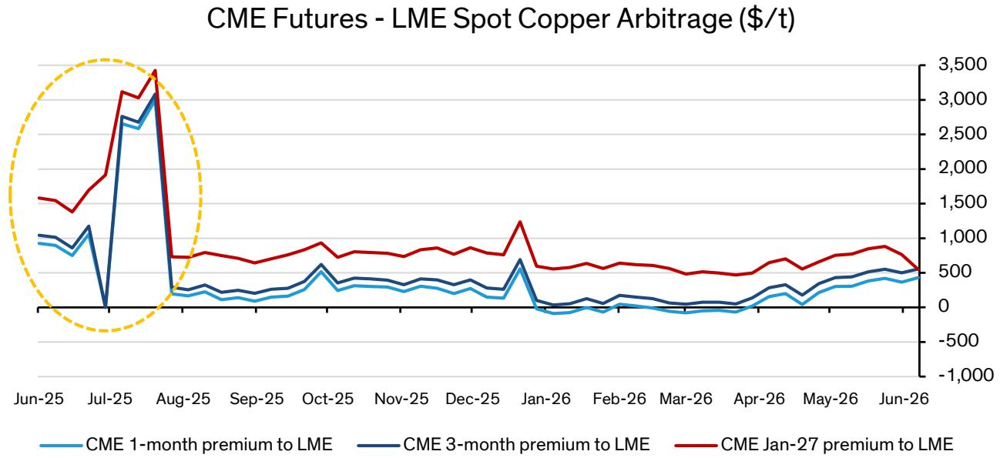

line chart

| Date   | CME 1-month premium to LME | CME 3-month premium to LME | CME Jan-27 premium to LME |
|--------|----------------------------|----------------------------|---------------------------|
| Jun-25 | ~1,000                     | ~1,000                     | ~1,500                    |
| Jul-25 | ~2,800                     | ~3,000                     | ~3,400                    |
| Aug-25 | ~200                       | ~200                       | ~700                      |
| Sep-25 | ~150                       | ~150                       | ~700                      |
| Oct-25 | ~300                       | ~400                       | ~900                      |
| Nov-25 | ~250                       | ~300                       | ~800                      |
| Dec-25 | ~200                       | ~300                       | ~800                      |
| Jan-26 | ~600                       | ~700                       | ~1,200                    |
| Feb-26 | ~100                       | ~100                       | ~600                      |
| Mar-26 | ~100                       | ~100                       | ~600                      |
| Apr-26 | ~150                       | ~200                       | ~600                      |
| May-26 | ~300                       | ~400                       | ~800                      |
| Jun-26 | ~400                       | ~500                       | ~600                      |

Source: Bloomberg, Bernstein analysis

Assuming we see 10ktpa inflow into the US per week - which was the average inventory addition rate in the past year - we would tie up additional 250kt to 300kt copper in inventory in 2H 2026 alone.

CME warehouse capacity is unlikely to be an immediate constraint. Total registered US capacity is \~1Mt, with over half concentrated in Louisiana, where the New Orleans hub is reportedly approaching utilization limits.

However, capacity is expanding at the margin. Kodiak Warehouse LLC applied in February to register copper deliverable against Comex futures in Lemont, Illinois, and was included in the CME system by May - implying a relatively short \~3-month onboarding timeline.

As such, warehouse availability is unlikely to materially constrain further arbitrage flows.

EXHIBIT 11: Space availability in CME copper warehouse is unlikely to be the limiting factor for further arbitrage trading  
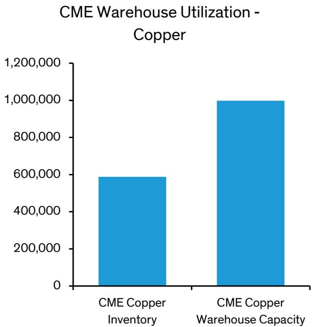

bar chart

| Category                     | Value     |
| ---------------------------- | --------- |
| CME Copper Inventory         | 600,000   |
| CME Copper Warehouse Capacity | 1,000,000 |

Source: CME, Bernstein analysis

## Could CME price converge with LME after tariffs announcement?

Intuitively, copper pricing is set by the marginal unit of supply. For the US, that marginal unit is imported copper.

The US remains structurally short, relying on imports for c.50% of its copper consumption (Exhibit 12). This dependence is critical in framing the pricing dislocation risk between COMEX and LME.

EXHIBIT 12: The US relies on imports for half its copper

<table><tr><td>Period</td><td>Primaryefined copper production</td><td>Copper in old scrap</td><td>Refined imports for</td><td>Refined exports</td><td>Refined stock</td><td>Apparent consumption</td></tr><tr><td colspan="7">2023</td></tr><tr><td>December</td><td>70,100</td><td>11,300</td><td>26,800</td><td>-3,540</td><td>-16,800</td><td>122,000</td></tr><tr><td>January–December</td><td>843,000</td><td>147,000</td><td>771,000</td><td>-33,200</td><td>43,900</td><td>1,680,000</td></tr><tr><td colspan="7">2024</td></tr><tr><td>January</td><td>75,100</td><td>13,100</td><td>90,100</td><td>-4,540</td><td>-25,800</td><td>200,000</td></tr><tr><td>February</td><td>72,000</td><td>12,400</td><td>39,700</td><td>-4,870</td><td>-7,080</td><td>126,000</td></tr><tr><td>March</td><td>73,400</td><td>12,400</td><td>50,100</td><td>-4,780</td><td>-6,400</td><td>138,000</td></tr><tr><td>April</td><td>72,100</td><td>12,600</td><td>43,800</td><td>-5,880</td><td>-22,700</td><td>145,000</td></tr><tr><td>May</td><td>72,500</td><td>12,700</td><td>70,000</td><td>-4,430</td><td>-14,100</td><td>165,000</td></tr><tr><td>June</td><td>72,400</td><td>11,800</td><td>52,500</td><td>-3,320</td><td>-11,700</td><td>145,000</td></tr><tr><td>July</td><td>72,200</td><td>11,700</td><td>106,000</td><td>-6,450</td><td>8,310</td><td>175,000</td></tr><tr><td>August</td><td>72,500</td><td>12,600</td><td>117,000</td><td>-8,020</td><td>24,600</td><td>169,000</td></tr><tr><td>September</td><td>71,600</td><td>12,500</td><td>121,000</td><td>-7,340</td><td>25,800</td><td>172,000</td></tr><tr><td>October</td><td>76,700</td><td>13,300</td><td>59,900</td><td>-5,920</td><td>20,700</td><td>123,000</td></tr><tr><td>November</td><td>74,300</td><td>13,300</td><td>63,400</td><td>-8,870</td><td>-3,440</td><td>146,000</td></tr><tr><td>December</td><td>77,600</td><td>11,500</td><td>94,400</td><td>-7,360</td><td>6,660</td><td>169,000</td></tr><tr><td>January–December</td><td>882,000</td><td>150,000</td><td>908,000</td><td>-71,800</td><td>-5,270</td><td>1,870,000</td></tr><tr><td>as % of 2024</td><td>47%</td><td>8%</td><td>49%</td><td>-4%</td><td>0%</td><td>100%</td></tr></table>

Source: USGS, Bloomberg, Bernstein analysis

As of 10 June 2026, visible inventories stand at \~600kt on Comex and \~122kt on the LME, which is about \~80% of US annual import in 2024 (i.e., the last “normal” year).

Exhibit 13 highlights that off-exchange inventories in the US are negligible. These were \~30kt in Q1 2025 and declined sharply to \~8kt by September 2025. We expect current levels to remain within this range.

Combining exchange and non-exchange inventories, total refined copper availability remains insufficient to fully cover annual import needs. In other words, the system still depends on a continued inflow of imported metal to clear demand.

Under a 15% tariff regime, the economics for imports require Comex prices to be higher than LME prices. To incentivise flows into the US, imported copper must price at a minimum of LME + tariff ( $\sim$ 15%) + logistics costs (Exhibit 7). Anything below that threshold fails to attract marginal supply.

Hence, convergence of LME and Comex prices is therefore unlikely because the tariff structurally embeds a wedge between the two benchmarks, with COMEX needing to remain elevated to incentivise imports and balance domestic demand.

EXHIBIT 13: Refined stocks/inventories outside exchanges make up a small portion of total inventories. There's an interesting trend in Q3 2025 when non-exchange inventories tightened considerably.

<table><tr><td>Refined stock in the US (metric kt)</td><td>COMEX</td><td>LME (US Warehouse)</td><td>Others</td><td>TOTAL</td></tr><tr><td>Jan-25</td><td>97,965</td><td>100</td><td>29,935</td><td>128,000</td></tr><tr><td>Feb-25</td><td>95,469</td><td>0</td><td>35,531</td><td>131,000</td></tr><tr><td>Mar-25</td><td>93,958</td><td>0</td><td>30,042</td><td>124,000</td></tr><tr><td>Apr-25</td><td>129,473</td><td>0</td><td>38,527</td><td>168,000</td></tr><tr><td>May-25</td><td>179,954</td><td>0</td><td>29,046</td><td>209,000</td></tr><tr><td>Jun-25</td><td>206,192</td><td>0</td><td>n/a</td><td>n/a</td></tr><tr><td>Jul-25</td><td>245,829</td><td>0</td><td>26,171</td><td>272,000</td></tr><tr><td>Aug-25</td><td>274,288</td><td>0</td><td>13,712</td><td>288,000</td></tr><tr><td>Sep-25</td><td>319,648</td><td>0</td><td>8,352</td><td>328,000</td></tr></table>

Others refer to stocks of refined copper at brass mills, refineries, wire-rod mills, and other manufacturers
Source: USGS, LME, Bloomberg, Bernstein analysis

EXHIBIT 14: Traders expect the US might add import taxes on refined copper. Unlike the CME, the LME delivers metal only to duty-free zones. If a trader's long position expires on the LME, they get a warrant but must pay duty to bring the metal into the US.  
Copper Forward Curves (as of 11 June 2026)  
LME vs. CME (\$/mt)  
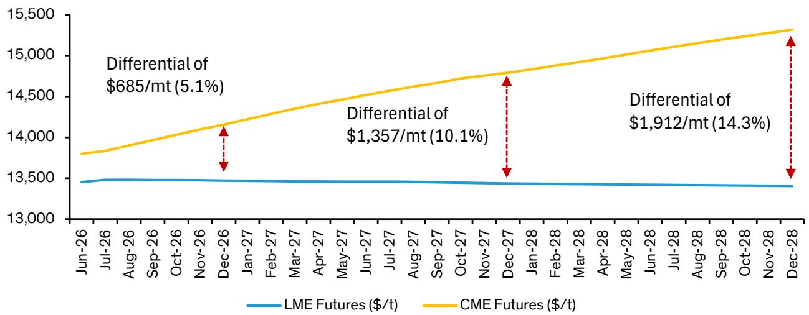

line chart

| Date    | LME Futures ($/t) | CME Futures ($/t) |
|---------|-------------------|-------------------|
| Jun-26  | ~13,400           | ~13,800           |
| Dec-26  | ~13,400           | ~14,100           |
| Dec-27  | ~13,400           | ~14,700           |
| Dec-28  | ~13,400           | ~15,300           |

Source: Bloomberg, Bernstein analysis

## POSTPONING TARIFFS DECISION

In this scenario, White House extends the deadline for the US secretary of commerce to provide update on the US copper market. This would introduce another period of uncertainty on tariffs. Incentivized by potential upside from tariffs, traders might continue to send copper inventories into Comex warehouses.

Assuming the decision will be postponed until January 2027, and traders send 10kt per week into Comex warehouses, we'd tie up another 250kt-300kt of copper in 2H 2026. Absent any major negative macro events, this should be sufficient to propel copper to \$14,000/t level.

EXHIBIT 15: We have less than 3 weeks before the deadline for US secretary of commerce to provide update on US copper markets, which will determine whether there will be tariffs on refined copper.

<table><tr><td>Dates</td><td>Company</td><td>Key Events</td></tr><tr><td>30-Jun-26</td><td>n/a</td><td>Deadline for US secretary of commerce to provide update on US copper markets</td></tr><tr><td>01-Jan-27</td><td>n/a</td><td>Potential start of a 15% universal import duty on refined copper</td></tr><tr><td>01-Jan-28</td><td>n/a</td><td>Potential start of a 30% universal import duty on refined copper</td></tr></table>

Source: White House, Bernstein analysis

## CONCLUSION

If our base case holds - Trump does not proceed with a 15% tariff on refined copper - then the near-term balance points to incremental supply emerging from Comex inventories. These tonnes are unlikely to leave the US outright unless a clear arb

opens, with LME prices meaningfully above Comex prices.

However, even without significant physical outflows, a softer US import requirement would incrementally loosen the global balance, exerting a gradual downward pressure on prices, with the market gravitating toward the \~\$11,000/t level.

Our latest price deck shown below.

EXHIBIT 16: Copper price forecasts - consensus and Bernstein estimates

<table><tr><td rowspan="2"></td><td colspan="9">Copper</td></tr><tr><td>2022</td><td>2023</td><td>2024</td><td>2025</td><td>2026e</td><td>2027e</td><td>2028e</td><td>2029e</td><td>2030e</td></tr><tr><td>Historical</td><td>8,822</td><td>8,484</td><td>9,150</td><td>9,947</td><td></td><td></td><td></td><td></td><td></td></tr><tr><td>Low</td><td></td><td></td><td></td><td>9,947</td><td>9,697</td><td>9,918</td><td>10,138</td><td>9,257</td><td>8,998</td></tr><tr><td>Mid</td><td></td><td></td><td></td><td>9,947</td><td>12,253</td><td>12,058</td><td>12,266</td><td>12,026</td><td>11,519</td></tr><tr><td>High</td><td></td><td></td><td></td><td>9,947</td><td>13,136</td><td>13,444</td><td>13,863</td><td>13,863</td><td>14,326</td></tr><tr><td>Bernstein</td><td></td><td></td><td></td><td>9,947</td><td>12,281</td><td>11,000</td><td>10,600</td><td>10,700</td><td>10,700</td></tr><tr><td>Spot</td><td></td><td></td><td></td><td></td><td>13,448</td><td></td><td></td><td></td><td></td></tr></table>

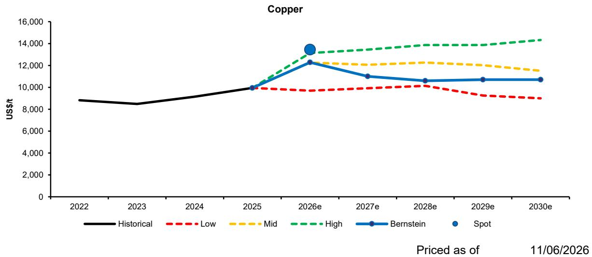

line chart

| Year   | Historical | Low  | Mid  | High | Bernstein | Spot |
|--------|------------|------|------|------|-----------|------|
| 2022   | 8,800      | -    | -    | -    | -         | -    |
| 2023   | 8,400      | -    | -    | -    | -         | -    |
| 2024   | 8,900      | -    | -    | -    | -         | -    |
| 2025   | 10,000     | 10,000 | 10,000 | 10,000 | 10,000    | 10,000 |
| 2026e  | -          | 9,800  | 12,200 | 13,500 | 12,500    | 13,500 |
| 2027e  | -          | 9,900  | 12,100 | 13,800 | 11,000    | -    |
| 2028e  | -          | 10,100 | 12,200 | 14,000 | 10,500    | -    |
| 2029e  | -          | 9,500  | 12,100 | 14,200 | 10,700    | -    |
| 2030e  | -          | 9,000  | 11,500 | 14,500 | 10,700    | -    |

Source: Bloomberg, S&P Global, Bernstein analysis and estimates

If we are wrong - either because Trump delays the decision or proceeds with a 15% tariff - the near-term response is likely to be continuous inflows into the US. This could tie up roughly 250-300kt of inventories just in 2H 2026.

Moreover, if market participants anticipate a potential escalation in tariffs (e.g., to 30% by 2028), the incentive to pre-position metal would likely extend into 2027, lifting cumulative inventory absorption to as much as 700 to 800kt. This is comparable to removing a full year of output from a major mine like Grasberg.

The implication is a materially tighter ex-US balance, which would translate to a renewed price leg higher. Under this scenario, copper is likely to retest and exceed prior highs, with prices sustaining \~\$14,000/t over the foreseeable future.

## EQUITY SENSITIVITY ANALYSIS

Across our coverage, copper price sensitivity is most pronounced for FCX and ANTO(c.1.5x and 1.4x beta to copper, respectively). This is followed by AAL (c.1.1x), with BHP shows a more moderate sensitivity (c.0.7x). Other names like RIO, GLEN, BOL and VALE would be impacted to a lesser degree. Meanwhile, ABX and NEM are expected to see only minimal impact.

EXHIBIT 17: Coverage Exposure by Commodity  
Coverage Exposure by Commodity (2027e EBITDA\*)  
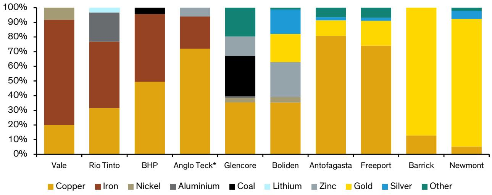

stacked bar chart

| Company      | Copper | Iron  | Nickel | Aluminium | Coal | Lithium | Zinc | Gold | Silver | Other |
| ------------ | ------ | ----- | ------ | --------- | ---- | ------- | ---- | ---- | ------ | ----- |
| Vale         | 20%    | 75%   | 10%    | 0%        | 0%   | 0%      | 0%   | 0%   | 0%     | 0%    |
| Rio Tinto    | 30%    | 40%   | 0%     | 20%       | 0%   | 5%      | 0%   | 0%   | 0%     | 0%    |
| BHP          | 48%    | 45%   | 0%     | 0%        | 5%   | 0%      | 0%   | 0%   | 0%     | 0%    |
| Anglo Teck*  | 72%    | 25%   | 0%     | 0%        | 0%   | 5%      | 5%   | 0%   | 0%     | 0%    |
| Glencore     | 35%    | 0%    | 5%     | 5%        | 35%  | 0%      | 15%  | 0%   | 0%     | 25%   |
| Boliden      | 35%    | 0%    | 5%     | 25%       | 0%   | 0%      | 25%  | 25%  | 15%    | 5%    |
| Antofagasta  | 80%    | 0%    | 0%     | 0%        | 0%   | 0%      | 0%   | 15%  | 0%     | 10%   |
| Freeport     | 75%    | 0%    | 0%     | 0%        | 0%   | 0%      | 15%  | 25%  | 5%     | 10%   |
| Barrick      | 12%    | 0%    | 0%     | 0%        | 0%   | 0%      | 95%  | 0%   | 0%     | 0%    |
| Newmont      | 5%     | 0%    | 0%     | 0%        | 0%   | 0%      | 95%  | 0%   | 10%    | 5%    |

We use revenue (instead of EBITDA) for BOL, ANTO, FCX, NEM and ABX  
\*AngloTeck proforma EBITDA  
Source: Company reports, Bernstein analysis and estimates

EXHIBIT 18: ANTO has 1.4 beta to copper prices  
Daily Price Changes
ANTO vs. LME Copper (2025-2026)  
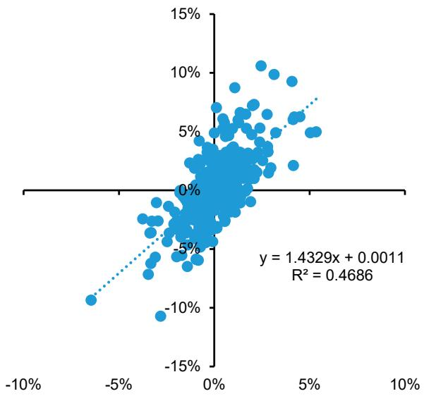

scatterplot

| x     | y     |
|-------|-------|
| -10%  | -10%  |
| 0%    | 0%    |
| 5%    | 5%    |
| 10%   | 10%   |

Source: Bloomberg, Bernstein analysis

EXHIBIT 19: FCX has 1.5 beta to copper prices  
Daily Price Changes
FCX vs. LME Copper (2026)  
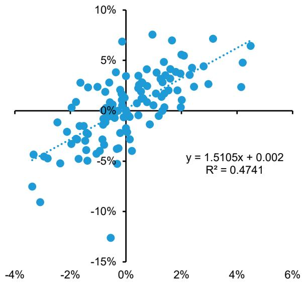

scatterplot

| x     | y     |
|-------|-------|
| -4%   | -15%  |
| 0%    | 0%    |
| 2%    | 5%    |
| 4%    | 10%   |
| 6%    | 5%    |

Source: Bloomberg, Bernstein analysis

EXHIBIT 20: AAL has a decent 1.1 beta to copper prices but with slightly lower R sq  
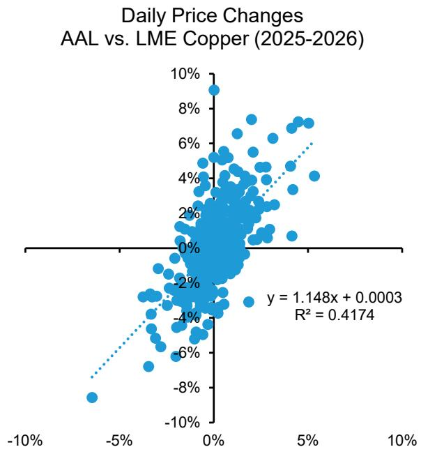

scatter plot

| x      | y      |
| ------ | ------ |
| -10%   | -8%    |
| 0%     | 0%     |
| 5%     | 4%     |
| 10%    | 8%     |

Source: Bloomberg, Bernstein analysis

EXHIBIT 21: BHP has 0.7 beta to copper prices  
Daily Price Changes
BHP vs. LME Copper (2025-2026)  
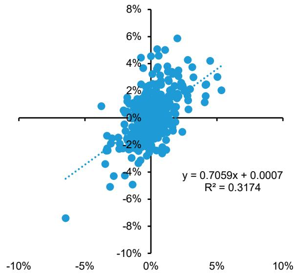

scatterplot

| x     | y     |
|-------|-------|
| -5%   | -8%   |
| 0%    | 0%    |
| 5%    | 2%    |
| 10%   | 4%    |
| 5%    | 6%    |
| 0%    | 8%    |

Source: Bloomberg, Bernstein analysis

## EQUITY VALUATIONS AND SUMMARIES

## ANGLO AMERICAN

EXHIBIT 22: Anglo American Summary  
Anglo American

<table><tr><td colspan="2"></td><td>2025A</td><td>2026E</td><td>2027E</td><td>2028E</td><td>2029E</td></tr><tr><td colspan="7">Financials</td></tr><tr><td>Revenues</td><td>USDm</td><td>18,546</td><td>19,444</td><td>19,395</td><td>19,853</td><td>20,436</td></tr><tr><td>EBITDA (incl JVs / assocs)</td><td>USDm</td><td>6,484</td><td>8,041</td><td>8,410</td><td>8,278</td><td>8,467</td></tr><tr><td>EBITDA (from subsidiaries)</td><td>USDm</td><td>6,201</td><td>7,680</td><td>8,059</td><td>7,922</td><td>8,096</td></tr><tr><td>DD&amp;A</td><td>USDm</td><td>-2,595</td><td>-2,556</td><td>-2,736</td><td>-2,903</td><td>-3,005</td></tr><tr><td>EBIT (incl JVs / assocs)</td><td>USDm</td><td>3,889</td><td>5,485</td><td>5,673</td><td>5,374</td><td>5,462</td></tr><tr><td>Net interest / FX / other</td><td>USDm</td><td>-492</td><td>-653</td><td>-844</td><td>-889</td><td>-911</td></tr><tr><td>PBT (incl JVs / assocs)</td><td>USDm</td><td>883</td><td>4,665</td><td>4,666</td><td>4,320</td><td>4,381</td></tr><tr><td>Tax</td><td>USDm</td><td>-1,587</td><td>-2,103</td><td>-1,966</td><td>-1,694</td><td>-1,717</td></tr><tr><td>Underlying profit</td><td>USDm</td><td>610</td><td>1,935</td><td>2,090</td><td>1,996</td><td>2,010</td></tr><tr><td>Underlying EPS</td><td>USD/sh</td><td>0.54</td><td>1.64</td><td>1.77</td><td>1.69</td><td>1.71</td></tr><tr><td>DPS</td><td>USD/sh</td><td>0.23</td><td>0.66</td><td>0.71</td><td>0.68</td><td>0.68</td></tr><tr><td>Capex (Anglo definition)</td><td>USDm</td><td>-3,316</td><td>-3,626</td><td>-3,366</td><td>-4,140</td><td>-4,551</td></tr><tr><td>PP&amp;E</td><td>USDm</td><td>34,253</td><td>35,610</td><td>36,327</td><td>37,651</td><td>39,288</td></tr><tr><td>Non-current assets</td><td>USDm</td><td>37,883</td><td>41,555</td><td>39,753</td><td>40,903</td><td>42,364</td></tr><tr><td>Cash and equivalents</td><td>USDm</td><td>6,436</td><td>7,134</td><td>10,514</td><td>10,425</td><td>10,067</td></tr><tr><td>Current assets</td><td>USDm</td><td>13,521</td><td>14,217</td><td>17,597</td><td>17,508</td><td>17,150</td></tr><tr><td>Total assets</td><td>USDm</td><td>55,994</td><td>58,027</td><td>59,605</td><td>60,666</td><td>61,769</td></tr><tr><td>Retained earnings</td><td>USDm</td><td>28,212</td><td>29,360</td><td>29,867</td><td>30,181</td><td>30,577</td></tr><tr><td>Total equity</td><td>USDm</td><td>24,117</td><td>26,235</td><td>27,575</td><td>28,401</td><td>29,264</td></tr><tr><td>Long term debt</td><td>USDm</td><td>14,406</td><td>13,672</td><td>13,883</td><td>14,091</td><td>14,305</td></tr><tr><td>Non-current liabilities</td><td>USDm</td><td>23,624</td><td>22,890</td><td>23,101</td><td>23,309</td><td>23,523</td></tr><tr><td>Short term debt</td><td>USDm</td><td>1,075</td><td>1,724</td><td>1,751</td><td>1,777</td><td>1,804</td></tr><tr><td>Current liabilities</td><td>USDm</td><td>6,840</td><td>7,489</td><td>7,516</td><td>7,542</td><td>7,569</td></tr><tr><td>Equity and liabilities</td><td>USDm</td><td>55,994</td><td>58,027</td><td>59,605</td><td>60,666</td><td>61,769</td></tr><tr><td>Net debt / (cash)</td><td>USDm</td><td>8,571</td><td>8,227</td><td>5,085</td><td>5,409</td><td>6,007</td></tr><tr><td>ND:EBITDA</td><td>x</td><td>1.4x</td><td>1.0x</td><td>0.6x</td><td>0.7x</td><td>0.7x</td></tr><tr><td>Free cash flow</td><td>USDm</td><td>1,222</td><td>1,256</td><td>4,039</td><td>1,053</td><td>783</td></tr><tr><td>CFO before int / tax</td><td>USDm</td><td>7,005</td><td>7,680</td><td>8,059</td><td>7,922</td><td>8,096</td></tr><tr><td>Net CFO</td><td>USDm</td><td>5,511</td><td>5,618</td><td>6,143</td><td>6,278</td><td>6,432</td></tr><tr><td>CFI</td><td>USDm</td><td>-1,908</td><td>-2,948</td><td>-662</td><td>-3,801</td><td>-4,216</td></tr><tr><td>CFF</td><td>USDm</td><td>-5,491</td><td>-1,972</td><td>-2,101</td><td>-2,567</td><td>-2,573</td></tr><tr><td>Inc/(dec) in cash</td><td>USDm</td><td>-1,888</td><td>698</td><td>3,380</td><td>-89</td><td>-357</td></tr></table>

<table><tr><td colspan="2"></td><td>2025A</td><td>2026E</td><td>2027E</td><td>2028E</td><td>2029E</td></tr><tr><td colspan="7">Commodity and FX assumptions</td></tr><tr><td>Diamonds</td><td>USD/ct</td><td>142</td><td>142</td><td>154</td><td>158</td><td>161</td></tr><tr><td>Copper</td><td>USD/lb</td><td>4.76</td><td>5.53</td><td>4.99</td><td>4.81</td><td>4.85</td></tr><tr><td>Copper</td><td>USD/t</td><td>10,493</td><td>12,190</td><td>11,000</td><td>10,600</td><td>10,700</td></tr><tr><td>Iron ore (62%, fines, fob)</td><td>USD/t</td><td>93</td><td>90</td><td>87</td><td>86</td><td>85</td></tr><tr><td>Met coal (HCC, fob)</td><td>USD/t</td><td>163</td><td>217</td><td>215</td><td>215</td><td>220</td></tr><tr><td>Thermal coal (RB, fob)</td><td>USD/t</td><td>108</td><td>127</td><td>105</td><td>105</td><td>105</td></tr></table>

Production overview

<table><tr><td>Diamonds - recovered</td><td>mcts</td><td>21.7</td><td>23.5</td><td>22.4</td><td>25.3</td><td>26.7</td></tr><tr><td>Copper - Chile</td><td>kt</td><td>385</td><td>407</td><td>454</td><td>508</td><td>531</td></tr><tr><td>Copper - Peru</td><td>kt</td><td>310</td><td>325</td><td>324</td><td>316</td><td>296</td></tr><tr><td>Iron ore - Kumba</td><td>dmt</td><td>36.1</td><td>32.0</td><td>36.0</td><td>35.6</td><td>36.0</td></tr><tr><td>Iron ore - Minas-Rio</td><td>wmt</td><td>24.8</td><td>25.1</td><td>24.8</td><td>24.4</td><td>25.0</td></tr><tr><td>Met coal Aus (HCC + PCI)</td><td>mt</td><td>8.2</td><td>9.2</td><td>0.0</td><td>0.0</td><td>0.0</td></tr><tr><td>Nickel production</td><td>kt</td><td>39.7</td><td>18.7</td><td>0.0</td><td>0.0</td><td>0.0</td></tr></table>

Market Valuation

<table><tr><td>EV/EBITDA</td><td>x</td><td>9.2x</td><td>9.9x</td><td>9.4x</td><td>9.6x</td><td>9.4x</td></tr><tr><td>Dividend yield (announced)</td><td>%</td><td>0.6%</td><td>1.2%</td><td>1.3%</td><td>1.3%</td><td>1.3%</td></tr><tr><td>FCF yield</td><td>%</td><td>2.0%</td><td>1.6%</td><td>5.1%</td><td>1.3%</td><td>1.0%</td></tr><tr><td>ROIC</td><td>%</td><td>4.7%</td><td>6.3%</td><td>6.7%</td><td>6.5%</td><td>6.5%</td></tr></table>

Valuation - PT based on 25% 1.0x NPV and 75% 7.0x EV/EBITDA

<table><tr><td>Attr. NPV (as at Dec-27)</td><td>GBP/sh</td><td>EBITDA (12m to Dec-27)</td><td>GBP/sh</td></tr><tr><td>Diamonds</td><td>1.24</td><td>Diamonds</td><td>0.22</td></tr><tr><td>PGMs</td><td>0.00</td><td>Copper</td><td>3.13</td></tr><tr><td>Copper</td><td>9.16</td><td>Iron Ore</td><td>1.68</td></tr><tr><td>Iron Ore</td><td>4.44</td><td>Steelmaking Coal</td><td>0.00</td></tr><tr><td>Steelmaking Coal</td><td>1.58</td><td>Nickel and Manganese</td><td>0.11</td></tr><tr><td>Nickel and Manganese</td><td>0.66</td><td>Crop Nutrients - Woodsmith</td><td>0.22</td></tr><tr><td>Crop Nutrients - Woodsmith</td><td>3.24</td><td>EBITDA (incl JVs and associates)</td><td>5.36</td></tr><tr><td>Corporate &amp; others</td><td>2.19</td><td>EV at 7.00x</td><td>37.50</td></tr><tr><td>Net debt / (cash)</td><td>3.24</td><td>Valtera</td><td>0.00</td></tr><tr><td>Equity Value</td><td>19.27</td><td>Net Debt &amp; NCI</td><td>8.27</td></tr><tr><td>NPV multiple</td><td>0.00</td><td>Equity Value</td><td>29.23</td></tr><tr><td>NPV valuation</td><td>0.01</td><td>Price Target (GBP/sh)</td><td>26.50</td></tr></table>

Note: Priced as of 12th June 2026  
Source: Company reports, Bloomberg, Bernstein analysis and estimates

EXHIBIT 23: Anglo American Valuation and TP basis  
Anglo American

<table><tr><td>Attr. NPV (as at Dec-27)</td><td>USDm</td><td>GBP/sh</td><td>EBITDA (12m to Dec-27)</td><td>USDm</td><td>GBP/sh</td></tr><tr><td>De Beers</td><td>1,955</td><td>1.24</td><td>De Beers</td><td>343</td><td>0.22</td></tr><tr><td>Valterra</td><td>0</td><td>0.00</td><td>Copper - Chile</td><td>2,480</td><td>1.57</td></tr><tr><td>Copper - Chile</td><td>10,720</td><td>6.79</td><td>Copper - Peru</td><td>2,464</td><td>1.56</td></tr><tr><td>Copper - Peru</td><td>3,753</td><td>2.38</td><td>Iron Ore - Kumba</td><td>1,417</td><td>0.90</td></tr><tr><td>Iron Ore - Kumba</td><td>3,207</td><td>2.03</td><td>Iron Ore - Minas Rio</td><td>1,231</td><td>0.78</td></tr><tr><td>Iron Ore - Minas Rio</td><td>3,804</td><td>2.41</td><td>Steelmaking Coal</td><td>0</td><td>0.00</td></tr><tr><td>Steelmaking Coal</td><td>2,501</td><td>1.58</td><td>Nickel</td><td>0</td><td>0.00</td></tr><tr><td>Nickel</td><td>0</td><td>0.00</td><td>Manganese</td><td>172</td><td>0.11</td></tr><tr><td>Manganese</td><td>1,043</td><td>0.66</td><td>Crop Nutrients - Woodsmith</td><td>-100</td><td>-0.06</td></tr><tr><td>Crop Nutrients - Woodsmith</td><td>5,120</td><td>3.24</td><td>Corporate &amp; others</td><td>454</td><td>0.29</td></tr><tr><td>Corporate &amp; others</td><td>3,454</td><td>2.19</td><td>EBITDA (incl JVs and associates)</td><td>8,461</td><td>5.36</td></tr><tr><td>Net debt / (cash)</td><td>5,120</td><td>3.24</td><td>EV at 7.00x</td><td>59,230</td><td>37.50</td></tr><tr><td>Equity Value</td><td>30,437</td><td>19.27</td><td>Valtera</td><td>0</td><td>0.00</td></tr><tr><td>NPV multiple</td><td>1.0</td><td>0.00</td><td>Net Debt &amp; NCI</td><td>13,065</td><td>8.27</td></tr><tr><td>NPV valuation</td><td>30,437</td><td>19.27</td><td>Equity Value</td><td>46,165</td><td>29.23</td></tr></table>

<table><tr><td rowspan="2"></td><td>Price Target</td><td>42,233</td><td>26.50</td></tr><tr><td>Dividend</td><td>836</td><td>0.53</td></tr><tr><td>Note: Priced as of 12th June 2026</td><td>Upside / (downside)</td><td></td><td>-32.5%</td></tr></table>

Source: Bloomberg, Company reports, Bernstein analysis and estimates

## I. REQUIRED DISCLOSURES

References to "Bernstein" or the "Firm" in these disclosures relate to the following entities: Bernstein Institutional Services LLC (April 1, 2024 onwards), Bernstein & Co., LLC (pre April 1, 2024), Bernstein Autonomous LLP, BSG France S.A. (April 1, 2024 onwards), Bernstein (Hong Kong) Limited 盛博香港有限公司, Bernstein (Canada) Limited, Bernstein (India) Private Limited (SEBI registration no. INH000006378), Bernstein (Singapore) Private Limited, Bernstein Japan KK (サンフォード・C・バーンスタイン株式会社) and analysts employed by SG Africa Technologies & Services to produce Bernstein under a Global Services Agreement in place between Bernstein and SG.

Bernstein is part of a joint venture between SG (SG) and AllianceBernstein, L.P. (AB). Unless specifically noted otherwise, for purposes of these disclosures, references to Bernstein's “affiliates” relate to both SG and AB and their respective affiliates.

## VALUATION METHODOLOGY

## Anglo American PLC

We set a GBP26.50 price target using a 75/25 combination of an EV/EBITDA multiple of 7.00x against our forward 2027 EBITDA estimate and a DCF with a WACC of 10.00% and a NPV multiple of 1.0x

## Antofagasta PLC

We set a GBP 28.00 price target using a 75/25 combination of an EV/EBITDA multiple of 8.0x against our forward 2027 EBITDA estimate and a DCF with a WACC of 10.00% and a NPV multiple of 1.0x

## Freeport-McMoRan Inc

We set a USD58.50 price target by applying EV/EBITDA multiple of 7.00x against our forward 2027 EBITDA estimate

## RISKS

## Anglo American PLC

Upside risks to our Anglo American price target include (1) diamond, copper, iron ore, met coal prices performing better than expected, (2) diamond sale/IPO valuation is higher than expected

Downside risks to our Anglo American price target include (1) further disruption in DeBeers caused by synthetic diamond, (2) legal or regulatory instability in South Africa, (3) lower than expected valuation for De Beers and met coal divisions

## Antofagasta PLC

Upside risks to our price target on Antofagasta PLC include (1) copper, gold prices performing better than expected.

Downside risks to our price target on Antofagasta PLC include (1) copper prices performing worse than expected, (2) production growing slower than expected due to challenges in Centinela second concentrator project, and (3) Centinela project capex is higher than expected

## Freeport-McMoRan Inc

Upside risks to our price target on Freeport-McMoRan Inc include (1) better than expected Americas leaching initiatives, (2) better than expected copper and gold prices

Downside risks to our price target on Freeport-McMoRan Inc include (1) Grasberg repair cost is higher than expected, (2) IUPK extension in Indonesia is delayed further

## RATINGS DEFINITIONS, BENCHMARKS AND DISTRIBUTION

## EQUITY RATINGS DEFINITIONS

## Bernstein brand

The Bernstein brand rates stocks based on forecasts of relative performance for the next 12 months versus the S&P 500 for stocks listed on the U.S. and Canadian exchanges, versus the Bloomberg Europe Developed Markets Large and Mid Cap Price Return Index EUR (EDME) for stocks listed on the European exchanges and emerging markets exchanges outside of the Asia Pacific region, versus the Bloomberg Japan Large and Mid Cap Price Return Index USD (JPL) for stocks listed on the Japanese exchanges, and versus the Bloomberg Asia ex-Japan Large and Mid Cap Price Return Index (ASIAX) for stocks listed on the Asian (ex-Japan) exchanges -unless otherwise specified.

The Bernstein brand has three categories of ratings:

- Outperform: Stock will outpace the market index by more than 15 pp  
• Market-Perform: Stock will perform in line with the market index to within +/-15 pp  
• Underperform: Stock will trail the performance of the market index by more than 15 pp

Coverage Suspended: Coverage of a company under the Bernstein brand has been suspended. Ratings and price targets are suspended temporarily, are no longer current, and should therefore not be relied upon.

Not Rated: A rating assigned when the stock cannot be accurately valued, or the performance of the company accurately predicted, at the present time. The covering analyst may continue to publish research reports on the company to update investors on events and developments.

Not Covered (NC) denotes companies that are not under coverage.

Bernstein brand stock ratings are based on a 12-month time horizon.

## Autonomous brand – common stocks

The Autonomous brand rates common stocks as indicated below. As our benchmarks we use the Bloomberg Europe 500 Banks And Financial Services Index (BEBANKS) and Bloomberg Europe Dev Mkt Financials Large and Mid Cap Price Ret Index EUR (EDMFI) index for developed European banks and Payments, the Bloomberg Europe 500 Insurance Index (BEINSUR) for European insurers, the S&P 500 and S&P Financials for US banks and Payments coverage, S5LIFE for US Insurance, the S&P Insurance Select Industry (SPSIINS) for US Non-Life Insurers coverage, and the Bloomberg Emerging Markets Financials Large, Mid and Small Cap Price Return Index (EMLSF) for emerging market banks and insurers and Payments. Ratings are stated relative to the sector (not the market).

The Autonomous brand has three categories of common stock ratings:

- Outperform (OP): Stock will outpace the relevant index by more than 10 pp  
- Neutral (N): Stock will perform in line with the market index to within +/-10 pp  
• Underperform (UP): Stock will trail the performance of the relevant index by more than 10 pp

Coverage Suspended: Coverage of a company under the Autonomous research brand has been suspended. Ratings and price targets are suspended temporarily, are no longer current, and should therefore not be relied upon.

Not Rated: A rating assigned when the stock cannot be accurately valued, or the performance of the company accurately predicted, at the present time. The covering analyst may continue to publish research reports on the company to update investors on events and developments.

Those denoted as ‘Feature’ (e.g., Feature Outperform FOP, Feature Under Outperform FUP) are our core ideas.

Not Covered (NC) denotes companies that are not under coverage.

Autonomous brand common stock ratings are based on a 12-month time horizon.

## Autonomous brand – preferred stocks

The Autonomous brand has three categories of preferred stock ratings:

- Outperform (OP): The total return of the preferred instrument is expected to outperform preferred securities of other issuers operating in similar sectors or rating categories over the next six months.  
- Neutral (N): The total return of the preferred instrument is expected to perform in line with preferred securities of other issuers operating in similar sectors or rating categories over the next six months.  
- Underperform (UP): The total return of the preferred instrument is expected to underperform preferred securities of other issuers operating in similar sectors or rating categories over the next six months.

Autonomous preferred stock ratings are based on a 6-month time horizon.

## AUTONOMOUS CREDIT RESEARCH

Where this report contains investment recommendations for credit instruments, as defined in article 3(1)(35) of the Market Abuse Regulation, the information below is presented to comply with its disclosure requirements.

The report may also include reference(s) to published opinions by other Autonomous or Bernstein analysts covering the equity securities of the issuer(s) referenced herein. Please note an investment recommendation for credit instruments published by the author(s) of this report may differ from the published view of the analyst covering equity securities for the issuer(s) contained in this report and vice versa.

## CREDIT RATINGS DEFINITIONS

The Autonomous brand has three categories of credit ratings:

- Credit Outperform (C-OP): The total return of the Reference Credit Instrument is expected to outperform the credit spread of bonds of other issuers operating in similar sectors or rating categories over the next six months.  
- Credit Neutral (C-N): The total return of the Reference Credit Instrument is expected to perform in line with the credit spread of bonds of other issuers operating in similar sectors or rating categories over the next six months.  
- Credit Underperform (C-UP): The total return of the Reference Credit Instrument is expected to underperform the credit spread of bonds of other issuers operating in similar sectors or rating categories over the next six months.

Autonomous credit ratings are based on a 6-month time horizon.

A list of all investment recommendations produced by the author(s) of this report alongside credit ratings history are available upon request.

It is at the sole discretion of the Firm as to when to initiate, update and cease research coverage. The Firm has established, maintains and relies on information barriers to control the flow of information contained in one or more areas (i.e. the private side) within the Firm, and into other areas, units, groups or affiliates (i.e. public side) of the Firm

DISTRIBUTION OF EQUITY RATINGS/INVESTMENT BANKING SERVICES

<table><tr><td>Equity Rating</td><td>Market Abuse Regulation (MAR) and FINRA Rating Category</td><td>Global Rating Distribution</td><td>Investment Banking Relationships*</td></tr><tr><td>Outperform</td><td>BUY</td><td>51.1%</td><td>16.5%</td></tr><tr><td>Market-Perform (Bernstein Brand) Neutral (Autonomous Brand)</td><td>HOLD</td><td>36.3%</td><td>17.8%</td></tr><tr><td>Underperform</td><td>SELL</td><td>12.6%</td><td>14.9%</td></tr></table>

\* These figures represent the percentage of companies within each equity rating category for which affiliates of Bernstein have provided investment banking services within the previous 12 months.  
As of March 31, 2026. All figures are updated quarterly.

## PRICE CHARTS / RATINGS AND PRICE TARGET HISTORY

Prior to April 1, 2024, Bernstein & Co., LLC. issued the ratings and price target information in the graph(s) below for the following companies: Anglo American PLC, Antofagasta PLC and Freeport-McMoRan Inc.

Anglo American PLC (AAL.LN) Rating History for Bernstein as of 06/15/2026  

line chart

| Date | Closing Price | Price Target |
| --- | --- | --- |
| 07/07/2023 | 2,460.00p | - |
| 09/07/2023 | 2,520.00p | - |
| 09/11/2023 | 2,540.00p | - |
| 09/26/2023 | 2,620.00p | - |
| 10/16/2023 | 2,660.00p | - |
| 10/26/2023 | 2,640.00p | - |
| 11/09/2023 | 2,480.00p | - |
| 11/17/2023 | 2,680.00p | - |
| 11/23/2023 | 2,700.00p | - |
| 01/08/2024 | 2,100.00p | - |
| 02/15/2024 | 2,080.00p | - |
| 03/28/2024 | 2,080.00p | - |
| 04/01/2024 | 2,080.00p | - |
| 04/08/2024 | 2,100.00p | - |
| 04/25/2024 | 2,020.00p | - |
| 06/05/2024 | 2,080.00p | - |
| 06/06/2024 | 2,020.00p | - |
| 06/11/2024 | 2,700.00p | - |
| 08/15/2024 | 2,500.00p | - |
| 10/23/2024 | 2,400.00p | - |
| 01/23/2025 | 2,600.00p | - |
| 01/27/2025 | 2,600.00p | - |
| 03/18/2025 | 2,300.00p | - |
| 05/19/2025 | 2,200.00p | - |
| 07/07/2025 | 1,850.00p | - |
| 08/14/2025 | 1,950.00p | - |
| 10/14/2025 | 2,250.00p | - |
| 11/13/2025 | 2,200.00p | - |
| 01/07/2026 | 2,450.00p | - |
| 02/09/2026 | 2,400.00p | - |
| 1Q18/2026 | 3,555.55p | - |
| 4Q18/2026 | 3,555.55p | - |
| 4Q18/26 | 4,555.55p | - |
| 4Q18/26 | 4,555.55p | - |
| 4Q18/26 | 4,555.55p | - |
| 4Q18/26 | 4,555.55p | - |
| 4Q18/27 | 4,555.55p | - |
| 4Q18/27 | 4,555.55p | - |
| 4Q18/27 | 4,555.55p | - |
| 4Q18/27 | 4,555.55p | - |
| 4Q3/27 | 4,555.55p | - |
| 4Q3/27 | 4,555.55p | - |
| 4Q3/27 | 4,555.55p | - |
| 4Q3/27 | 4,555.55p | - |
| 4Q4/27 | 4,555.55p | - |
| 4Q4/27 | 4,555.55p | - |
| 4Q4/27 | 4,555.55p | - |
| 4Q4/27 | 4,555.55p | - |
| 4Q3/31 | 4,555.55p | - |
| 4Q3/31 | 4,555.55p | - |
| 4Q3/31 | 4,555.55p | - |
| 4Q3/31 | 4,555.55p | - |
| 4Q3/33 | 4,555.55p | - |
| 4Q3/33 | 4,555.55p | - |
| 4Q3/33 | 4,555.55p | - |
| 4Q3/33 | 4,555.55p | - |
| 4Q3/36 | 4,555.55p | - |
| 4Q3/36 | 4,555.55p | - |
| 4Q3/36 | 4,555.55p | - |
| 4Q3/36 | 4,555.55p | - |
| 4Q3/39 | 4,555.55p | - |
| 4Q3/39 | 4,555.55p | - |
| 4Q3/39 | 4,555.55p | - |
| 4Q3/39 | 4,555.55p | - |
| 4Q3/31 | 4,555.55p | - |
| 4Q3/31 | 4,555.55p | - |
| 4Q3/31 | 4,555.56p | - |
| 4Q3/31 | 4,666.66p | - |
| 4Q3/31 | 4,666.66p | - |
| 4Q3/31 | 4,666.66p | - |
| 4Q3/31 | 4,666.66p | - |
| 4Q3/33 | 4,666.66p | - |
| 4Q3/33 | 4,666.66p | - |
| 4Q3/33 | 4,666.66p | - |
| 4Q3/33 | 4,666.66p | - |
| 4Q3/36 | 4,666.66p | - |
| 4Q3/36 | 4,666.66p | - |
| 4Q3/36 | 4,666.66p | - |
| 4Q3/36 | 4,666.66p | - |
| 4Q3/39 | 4,666.66p | - |
| 4Q3/39 | 4,666.66p | - |
| 4Q3/39 | 4,666.66p | - |
| 4Q3/39 | 4,666.66p | - |
| 4Q3/31 | 4,666.66p | - |
| 4Q3/31 | 4,666.66p | - |
| 4Q3/31 | 4,666.67p | - |
| 4Q3/31 | 4,666.67p | - |
| Q1/A | - | - |
| Q1/A | - | - |
| Q1/A | - | - |
| Q1/A | - | - |
| Q1/A | - | - |
| Q1/A | - | - |
| Q1/A | - | - |
| Q1/A | - | - |
| Q1/A | - | - |

Antofagasta PLC (ANTO.LN) Rating History for Bernstein as of 06/15/2026  
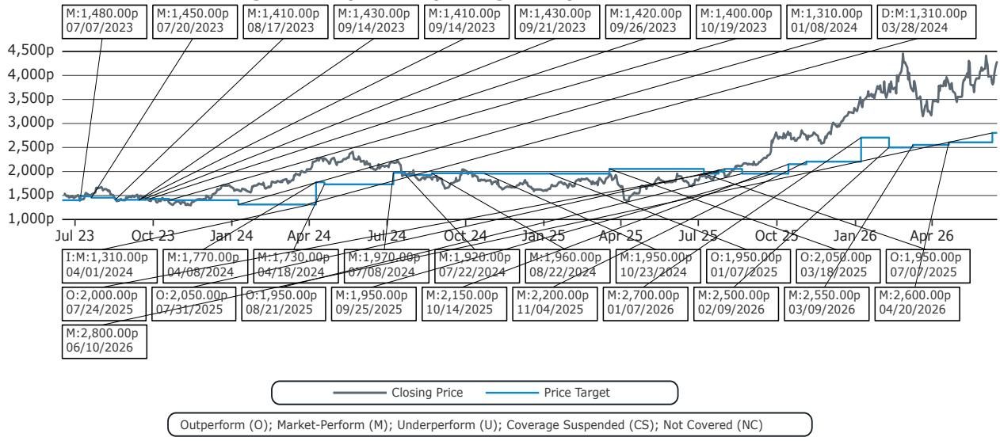

line chart

| 31/31/ | - | - |
| --- | --- | --- |
| 31/31/ | - | - |
| 31/31/ | - | - |
| 31/31/ | - | - |
| 31/31/ | - | - |
| 31/31/ | - | - |
| ... | ... | ... |
| ... | ... | ... |
| ... | ... | ... |
| ... | ... | ... |
| ... | ... | ... |
| ... | ... | ... |
| ... | ... | ... |
| ... | ... | ... |
| ... | ... | ... |
| ... | ... | ... |
| ... | ... | ... |
| ... | ... | ... |
| ... | ... | ... |
| ... | ... | ... |
| ... | ... | ... |
| ... | ... | ... |
| ... | ... | ... |
| ... | ... | ... |
| ... | ... | ... |
| ... | ... | ... |
| ... | ... | ... |
| ... | ... | ... |
| ... | ... | ... |
| ... | ... | ... |
| ... | ... | ... |
| ... | ... | ... |
| ... | ... | ... |
| ... | ... | ... |
| ... | ... | ... |
| ... | ... | ... |
| ... | ... | ... |
| ... | ... | ... |
| ... | ... | ... |
| ... | ... | ... |
| ... | ... | ... |
| ... | ... | ... |
| ... | ... | ... |
| ... | ... | ... |
| ... | ... | ... |
| ... | ... | ... |
| ... | ... | ... CCA |
| ... | ... | ... CCA |
| ... | ... | ... CCA |
| ... | ... | ... CCA |
| ... | ... | ... CCA |
| ... | ... | ... CCA |
| ... | ... | ... CCA |
| ... | ... | ... CCA |
| ... | ... | ... CCA |

Freeport-McMoRan Inc (FCX) Rating History for Bernstein as of 06/15/2026  
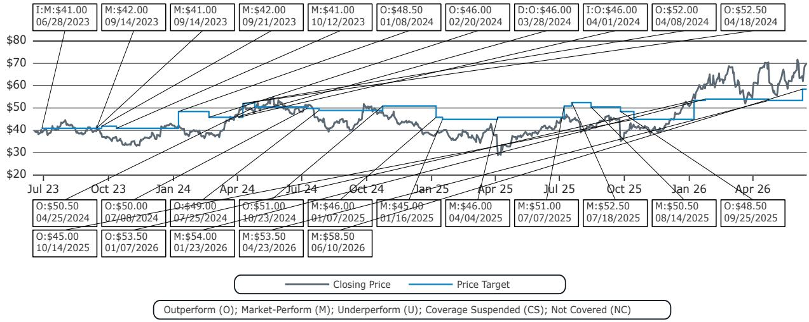

line chart

| Date       | Closing Price | Price Target |
|------------|---------------|--------------|
| 06/28/2023 | $41.00        | -            |
| 09/14/2023 | $42.00        | -            |
| 09/14/2023 | $41.00        | -            |
| 09/21/2023 | $42.00        | -            |
| 10/12/2023 | $41.00        | -            |
| 01/08/2024 | $48.50        | -            |
| 02/20/2024 | $46.00        | -            |
| 03/28/2024 | $46.00        | -            |
| 04/01/2024 | $46.00        | -            |
| 04/08/2024 | $52.00        | -            |
| 04/18/2024 | $52.50        | -            |
| 04/25/2024 | $50.50        | -            |
| 07/08/2024 | $50.00        | -            |
| 07/25/2024 | $49.00        | -            |
| 10/23/2024 | $51.00        | -            |
| 01/07/2025 | $46.00        | -            |
| 01/16/2025 | $45.00        | -            |
| 04/04/2025 | $46.00        | -            |
| 07/07/2025 | $51.00        | -            |
| 07/18/2025 | $52.50        | -            |
| 08/14/2025 | $50.50        | -            |
| 09/25/2025 | $48.50        | -            |
| 10/14/2025 | $45.00        | -            |
| 01/07/2026 | $53.50        | -            |
| 01/23/2026 | $54.00        | -            |
| 04/23/2026 | $53.50        | -            |
| 06/10/2026 | $58.50        | -            |

All price target and closing price data in the chart(s) above are denominated in the currency noted in the Ticker Table of this report.

## CONFLICTS OF INTEREST

SG and/or its affiliates beneficially own 1% or more of a class of common equity securities of the following company: Anglo American PLC.

Bernstein Autonomous LLP or BSG France SA, beneficially, has either a net long or short position of 0.5% or more of the total issued share capital of a class of common equity securities of the following MiFID eligible securities: Anglo American PLC.

Bernstein and/or affiliates have received compensation for non-investment banking securities-related products or services in the previous twelve months from the following clients: Anglo American PLC, Antofagasta PLC and Freeport-McMoRan Inc.

Bernstein and/or affiliates expect to receive or intend to seek compensation for investment banking services in the next three months from Anglo American PLC.

Certain affiliates of Bernstein act as market maker or liquidity provider in the equities securities of: Anglo American PLC, Antofagasta PLC and Freeport-McMoRan Inc.

Bernstein and/or affiliates had an investment banking client relationship during the past twelve months with Anglo American PLC.

Certain affiliates of Bernstein act as market maker or liquidity provider in the debt securities of: Anglo American PLC.

## OTHER MATTERS

The legal entity(ies) employing the analyst(s) listed in this report, and their location, can be determined by the country code of their phone number, as follows:

+1 Bernstein Institutional Services LLC; New York, New York, USA  
+44 Bernstein Autonomous LLP; London UK  
+212 SG Africa Technologies & Services; Casablanca, Morocco  
+33 BSG France S.A.; Paris, France  
+34 BSG France S.A.; Madrid, Spain  
+41 Bernstein Autonomous LLP; Geneva, Switzerland

+49 BSG France S.A.; Frankfurt, Germany

+91 Bernstein (India) Private Limited; Mumbai, India

+852 Bernstein (Hong Kong) Limited 盛博香港有限公司; Hong Kong, China

+65 Bernstein (Singapore) Private Limited; Singapore

+81 Bernstein Japan KK; Tokyo, Japan

Where this report has been prepared by research analyst(s) employed by a non-US affiliate, such analyst(s), is/are (unless otherwise expressly noted below) not registered as associated persons of Bernstein Institutional Services LLC or any other SEC-registered broker-dealer and are not licensed or qualified as research analysts with FINRA. Accordingly, such analyst(s) may not be subject to FINRA's restrictions regarding (among other things) communications by research analysts with a subject company, interactions between research analysts and investment banking personnel, participation by research analysts in solicitation and marketing activities relating to investment banking transactions, public appearances by research analysts, and trading securities held by a research analyst account.

Where this report has been prepared by research analyst(s) employed by SG Africa Technologies & Services (part of the SG group of companies), it has been prepared on behalf of a Bernstein company under a Global Services Agreement in place between Bernstein and SG.

## CERTIFICATION

Each research analyst listed in this report, who is primarily responsible for the preparation of the content of this report, certifies that all of the views expressed in this publication accurately reflect that analyst's personal views about any and all of the subject securities or issuers and that no part of that analyst's compensation was, is, or will be, directly or indirectly, related to the specific recommendations or views in this publication.

## II. ADDITIONAL GLOBAL CONFLICT DISCLOSURES

It is at the sole discretion of the Firm as to when to initiate, update and cease research coverage. The Firm has established, maintains and relies on information barriers to control the flow of information contained in one or more areas (i.e., the private side) within the Firm, and into other areas, units, groups or affiliates (i.e., public side) of the Firm.

## III. OTHER IMPORTANT INFORMATION AND DISCLOSURES

Separate branding is maintained for “Bernstein” and “Autonomous” research products.

- Bernstein produces a number of different types of research products including, among others, fundamental analysis and quantitative analysis under both the “Autonomous” and “Bernstein” brands. Recommendations contained within one type of research product may differ from recommendations contained within other types of research products, whether as a result of differing time horizons, methodologies or otherwise. Furthermore, views or recommendations within a research product issued under one brand may differ from views or recommendations under the same type of research product issued under the other brand. The Research Ratings System for the two brands and other information related to those Rating Systems are included in the previous section.  
- Autonomous operates as a separate business unit within the following entities: Bernstein Institutional Services LLC, Bernstein Autonomous LLP, Bernstein (Hong Kong) Limited 盛博香港有限公司 and Bernstein (India) Private Limited. For information relating to “Autonomous” branded products (including certain Sales materials) please visit: www.autonomous.com. For information relating to Bernstein branded products please visit: www.bernsteinresearch.com.

Analysts are compensated based on aggregate contributions to the research franchise as measured by account penetration, productivity and proactivity of investment ideas. No analysts are compensated based on performance in, or contributions to, generating investment banking revenues.

This report has been produced by an independent analyst as defined in Article 3 (1)(34)(i) of EU 596/2014 Market Abuse Regulation (“MAR”) and the same article of MAR as it forms part of United Kingdom domestic law by virtue of the European Union (Withdrawal) Act 2018.

To our readers in the United States: Bernstein Institutional Services LLC, a broker-dealer registered with the U.S. Securities and Exchange Commission (“SEC”) and a member of the U.S. Financial Industry Regulatory Authority, Inc. (“FINRA”) is distributing this publication in the United States and accepts responsibility for its contents. Where this material contains an analysis of debt product(s), such material is intended only for institutional investors and is not subject to the US independence and disclosure standards applicable to debt research prepared for retail investors.

Bernstein Institutional Services LLC may act as principal for its own account or as agent for another person (including an affiliate) in sales or purchases of any security which is a subject of this report. This report does not purport to meet the objectives or needs of any specific individuals, entities or accounts.

To our readers in Canada: If this publication pertains to a Canadian domiciled company, it is being distributed in Canada by Bernstein (Canada) Limited, which is licensed and regulated by the Canadian Investment Regulatory Organization. If the publication pertains to a non-Canadian domiciled company, it is being distributed by Bernstein Institutional Services LLC, which is licensed and regulated by both the SEC and FINRA, into Canada under the International Dealers Exemption.

This document may not be passed onto any person in Canada unless that person qualifies as "permitted client" as defined in Section 1.1 of NI 31-103.

To our readers in Brazil: This report has been prepared by Bernstein Institutional Services LLC, and Banco BTG Pactual S.A. ("BTG") is responsible for the distribution of this report in Brazil.

To readers in the United Kingdom: This publication has been issued or approved for issue in the United Kingdom by Bernstein Autonomous LLP, authorised and regulated by the Financial Conduct Authority and located at 60 London Wall, London EC2M 5SH, +44 (0)20-7170-5000. Registered in England & Wales No OC343985.

This document is for distribution only to persons who (i) have professional experience in matters relating to investments falling within Article 19(5) of the Financial Services and Markets Act 2000 (Financial Promotion) Order 2005 (as amended, the “Financial Promotion Order”), (ii) are persons falling within Article 49(2)(a) to (d) (“high net worth companies, unincorporated associations, etc.”) of the Financial Promotion Order, (iii) are outside the United Kingdom, or (iv) are persons to whom an invitation or inducement to engage in investment activity (within the meaning of section 21 of the FSMA) in connection with the issue or sale of any securities may otherwise lawfully be communicated or caused to be communicated (all such persons together being referred to as “relevant persons”). This document is directed only at relevant persons and must not be acted on or relied on by persons who are not relevant persons. Any investment or investment activity to which this document relates is available only to relevant persons and will be engaged in only with relevant persons.

To our readers in the member states of the EEA: This publication is being distributed by BSG France SA, which is authorised and regulated by the Autorité de Contrôle Prudentiel et de Résolution (ACPR) and Autorité des Marchés Financiers (AMF).

To our readers in Hong Kong: This publication is being distributed in Hong Kong by Bernstein (Hong Kong) Limited 盛博香港有限公司, which is licensed and regulated by the Hong Kong Securities and Futures Commission (Central Entity No. AXC846) to carry out Type 4 (Advising on Securities) regulated activities and subject to the licensing conditions mentioned in the SFC Public Register (https://www.sfc.hk/publicregWeb/corp/AXC846/details)). This publication is solely for professional investors, as defined in the Securities and Futures Ordinance (Cap. 571). The purpose of this report is solely to provide an analysis of the issuers referred to in this report and is not intended for any purpose contrary to the laws of Hong Kong.

To our readers in Singapore: This publication is being distributed in Singapore by Bernstein (Singapore) Private Limited, only to accredited investors or institutional investors, as defined in the Securities and Futures Act 2001 of Singapore ("SFA"). Recipients in Singapore should contact Bernstein (Singapore) Private Limited in respect of matters arising from, or in connection with, this publication. Bernstein (Singapore) Private Limited is regulated by the Monetary Authority of Singapore and licensed under the SFA as a capital markets services licence holder for dealing in capital markets products that are securities and collective investment schemes and an exempt financial adviser for advising on, issuing and promulgating analyses and reports on securities. Bernstein (Singapore) Private Limited is registered in Singapore with Company Registration No. 20213710W and located at 8 Marina Boulevard, #12-01, Marina Bay Financial Centre, Singapore 018981, +65-6326-7000.

To our readers in the People's Republic of China: The securities referred to in this document are not being offered or sold and may not be offered or sold, directly or indirectly, in the People's Republic of China (for such purposes, not including the Hong Kong and Macau Special Administrative Regions or Taiwan, the "PRC") in contravention of any applicable laws of the PRC.

This document does not constitute an offer to sell or the solicitation of an offer to buy any securities in the PRC to any person to whom it is unlawful to make the offer or solicitation in the PRC.

We do not represent that this document may be lawfully distributed, or that any securities may be lawfully offered, in compliance with any applicable registration or other requirements in the PRC, or pursuant to an exemption available thereunder, or assume any responsibility for facilitating any such distribution or offering. In particular, no action has been taken by us which would permit a public offering of any securities or distribution of this document in the PRC. Accordingly, the securities are not being offered or sold within the PRC by means of this document or any other document. Neither this document nor any advertisement or other offering material may be distributed or published in the PRC, except under circumstances that will result in compliance with any applicable laws and regulations.

To our readers in Japan: This publication is being distributed in Japan by Bernstein Japan KK (サンフォード・C・バーンスタイン株式会社), which is registered in Japan as a Financial Instruments Business Operator with the Kanto Local Finance Bureau (registration number: The Director-General of Kanto Local Finance Bureau (FIBO) No.3387) and regulated by the Financial Services Agency. It is also a member of Investment Management Association of Japan. This publication is solely for qualified institutional investors in Japan only, as defined in Article 2, paragraph (3), items (i) of the Financial Instruments and Exchange Act.

For the institutional client readers in Japan who have been granted access to the Bernstein website by Daiwa Group Inc. ("Daiwa"), your access to this document should not be construed as meaning that Bernstein is providing you with investment advice for any purposes. Whilst Bernstein has prepared this document, your relationship is, and will remain with, Daiwa, and Bernstein has neither any contractual relationship with you nor any obligations towards you.

To our readers in Australia: Bernstein (Hong Kong) Limited 盛博香港有限公司 is responsible for distributing research in Australia. It is regulated by the Securities and Exchange Commission under U.S. laws, by the Financial Conduct Authority under U.K. laws, which differs from Australian laws. Bernstein (Hong Kong) Limited 盛博香港有限公司 is exempt from the requirement to hold an Australian financial services license under the Corporations Act 2001 in respect of the provision of the following financial services to wholesale clients:

• providing financial product advice;  
• dealing in a financial product;  
• making a market for a financial product; and  
• providing a custodial or depository service.

To our readers in India: This publication is being distributed in India by Bernstein (India) Private Limited (SCB India) which is licensed and regulated by Securities and Exchange Board of India ("SEBI") as a research analyst entity under the SEBI (Research Analyst) Regulations, 2014, having registration no. INH000006378 and as a stock broker having registration no. INZ000213537. SCB India is currently engaged in the business of providing research and stock broking services. Please refer to www.bernsteinresearch.in for more information.

\- SCB India is a Private limited company incorporated under the Companies Act, 2013, on April 12, 2017 bearing corporate identification number U65999MH2017FTC293762, and registered office at Level 3A, 4th Floor, First International Financial Centre, Plot Nos C-54 and C-55, G Block, Near CBI Office, Bandra Kurla Complex, Bandra (East), Mumbai 400098, Maharashtra, India (Phone No: +91-22-68421401).

\- For details of Associates (i.e., affiliates/group companies) of SCB India, kindly email MUM-BERNSTEIN-InCompliance@bernsteinsg.com.

• SCB India does not have any disciplinary history as on the date of this report.

\- Except as noted above, SCB India and/or its Associates (i.e., affiliates/group companies), the Research Analysts authoring this report, and their relatives

• do not have any financial interest in the subject company  
• do not have actual/beneficial ownership of one percent or more in securities of the subject company;  
- is not engaged in any investment banking activities for Indian companies, as such;  
• have not managed or co-managed a public offering in the past twelve months for any Indian companies;  
- have not received any compensation for investment banking services or merchant banking services from the subject company in the past 12 months;  
• have not received compensation for brokerage services from the subject company in the past twelve months;

- have not received any compensation or other benefits from the subject company or third party related to the specific recommendations or views in this report; and  
- do not currently, but may in the future, act as a market maker in the financial instruments of the companies covered in the report.  
- do not have any conflict of interest in the subject company as of the date of this report.

\- Except as noted above, the subject company has not been a client of SCB India during twelve months preceding the date of distribution of this research report. Neither SCB India nor its Associates (i.e., affiliates/group companies) have received compensation for products or services other than investment banking, merchant banking or brokerage services from the subject company in the past twelve months.

\- The principal research analyst(s) who prepared this report, members of the analysts' team, and members of their households are not an officer, director, employee or advisory board member of the companies covered in the report.

\- Our Compliance officer / Grievance officer is Ms. Rupal Talati, who can be reached at +91-22-68421451, or MUM-BERNSTEIN-InCompliance@bernsteinsg.com / Scbin-investorgrievance@bernsteinsg.com

\- The Research investor charter and Terms & Conditions of SCB India are available on its website and may be accessed at Bernstein (India) Private Limited (https://bernsteinresearch.in/) for your reference.

\- Disclaimer: Registration granted by SEBI, and certification from NISM, is in no way a guarantee of performance of the intermediary or provide any assurance of returns to investors. Investments in securities market are subject to market risks. Read all the related documents carefully before investing.

To our readers in Switzerland: This document is provided in Switzerland by or through Bernstein Autonomous LLP, and is provided only to qualified investors as defined in article 10 of the Swiss Collective Investment Scheme Act (“CISA”) and related provisions of the Collective Investment Scheme Ordinance and in strict compliance with applicable Swiss law and regulations. The products mentioned in this document may not be suitable for all types of investors. This document is based on the Directives on the Independence of Financial Research issued by the Swiss Bankers Association (SBA) in January 2008.

To our readers in the Middle East: Bernstein Autonomous LLP, DIFC branch has its principal office at Gate Village 06, DIFC, Dubai, UAE. Bernstein Autonomous LLP, DIFC branch is regulated by the Dubai Financial Services Authority (DFSA) with the registration number CL10040 and is provisioned for Arranging Deals in Investments and Advising on Financial Products. All communications and services are directed at Professional Clients and Market Counterparties only (as defined in the DFSA rulebook). Persons other than Professional Clients and Market Counterparties, such as Retail Clients, are not the intended recipients of our communications or services.

## LEGAL

All research publications are disseminated to our clients through posting on the firm's password protected websites, bernsteinresearch.com and autonomous.com. Certain, but not all, research publications are also made available to clients through third-party vendors or redistributed to clients through alternate electronic means as a convenience.

This publication has been published and distributed in accordance with the Firm's policy for management of conflicts of interest in investment research, a copy of which is available from Bernstein Institutional Services LLC, Director of Compliance, 245 Park Avenue, New York, NY 10167. Additional disclosures and information regarding Bernstein's business are available on our website www.bernsteinresearch.com.

The securities described herein may not be eligible for sale in all jurisdictions or to certain categories of investors where that permission profile is not consistent with the licenses held by the entities noted herein. This document is for distribution only as may be permitted by law. This publication is not directed to, or intended for distribution to or use by, any person or entity who is a citizen or resident of, or located in any locality, state, country or other jurisdiction where such distribution, publication, availability or use would be contrary to law or regulation or which would subject any of the entities referenced herein or any of their subsidiaries or affiliates to any registration or licensing requirement within such jurisdiction. This publication is based upon public sources we believe to be reliable, but no representation is made by us that the publication is accurate or complete. We do not undertake to advise you of any change in the reported information or in the opinions herein. This publication was prepared and issued by entity referred to herein for distribution to eligible counterparties or professional clients. This publication is not an offer to buy or sell any security, and it does not constitute investment, legal or tax advice. The investments referred to herein may not be suitable for you. Investors must make their own investment decisions in consultation with their professional advisors in light of their specific circumstances. The value of investments may fluctuate, and investments that are denominated in foreign currencies may fluctuate in value as a result of exposure to exchange rate movements. Information about past performance of an investment is not necessarily a guide to, indicator of, or assurance of, future performance.

This report is directed to and intended only for our clients who are “eligible counterparties”, “professional clients”, “institutional investors” and/or “professional investors” as defined by the aforementioned regulators, and must not be redistributed to retail clients as defined by the aforementioned regulators. Retail clients who receive this report should note that the services of the entities noted herein are not available to them and should not rely on the material herein to make an investment decision. The result of such act will not hold the entities noted herein liable for any loss thus incurred as the entities noted herein are not registered/authorised/licensed to deal with retail clients and will not enter into any contractual agreement/arrangement with retail clients. This report is provided subject to the terms and conditions of any agreement that the clients may have entered into with the entities noted herein. All research reports are disseminated on a simultaneous basis to eligible clients through electronic publication to our client portal.

The information in this report was prepared by Bernstein solely for the internal business use of our clients. Clients may store, display, analyze, reformat and print the information in this report for this limited use only. Clients may not copy, alter, create derivative works, resell, reverse engineer, commercially exploit, share or distribute any part of the information contained herein for any purpose without Bernstein's express written consent. These restrictions include extracting data or using the content to develop indices or other products. Further, you may not use this report, or any portion of this report, to train or finetune any third-party machine learning or artificial intelligence system, or as a prompt or input into any such system. You also may not, without Bernstein's express written consent, do any of the foregoing in connection with your own internal machine learning or artificial intelligence system.

Bernstein may use artificial intelligence tools in the preparation of its materials. Any such materials are reviewed by Bernstein's research analysts prior to publication.

This report has been prepared for information purposes only and is based on current public information that we consider reliable, but the entities noted herein do not warrant or represent (express or implied) as to the sources of information or data contained herein are accurate, complete, not misleading or as to its fitness for the purpose intended even though the entities noted herein rely on reputable or trustworthy data providers, it should not be relied upon as such. Opinions expressed are the author(s)' current opinions as of the date appearing on the material only and we do not undertake to advise you of any change in the reported information or in the opinions herein.

Any references to SG herein are purely factual, based upon publicly available information, and included for comparative purposes only. They do not constitute an opinion or recommendation with respect to the securities of SG.

This publication was prepared and issued by the entity referred to herein for distribution to eligible counterparties or professional clients. The information in this report is intended for general circulation and does not constitute an offer to buy or sell any security, investment, legal or tax advice nor a personal recommendation, as defined by any of the aforementioned regulators. It does not take into account the particular investment objectives, financial situations, or needs of individual investors. The report has not been reviewed by any of the aforementioned regulators and does not represent any official recommendation from the aforementioned regulators. The investments referred to herein may not be suitable for you. Investors must make their own investment decisions in consultation with advice sought from a financial adviser regarding the suitability of the investment product, taking into account the specific investment objectives, financial situation or particular needs of any recipient of the recommendation, before the recipient makes a commitment to purchase the investment product.

The analysis contained herein is based on numerous assumptions. Different assumptions could result in materially different results. The information in this report does not constitute, or form part of, any offer to sell or issue, or any offer to purchase or subscribe for shares, or to induce engagement in any other investment activity. The value of any securities or financial instruments mentioned in this report may fluctuate subject to market conditions. Information about past performance of an investment is not necessarily a guide to, indicative of, or assurance of future performance. Estimates of future performance mentioned by the research analyst in this report are based on assumptions that may not be realized due to unforeseen factors like market volatility/fluctuation. In relation to securities or financial instruments denominated in a foreign currency other than the clients' home currency, movements in exchange rates will have an effect on the value, either favorable or unfavorable. Before acting on any recommendations in this report, recipients should consider the appropriateness of investing in the subject securities or financial instruments mentioned in this report and, if necessary, seek independent professional advice.

The securities described herein may not be eligible for sale in all jurisdictions or to certain categories of investors where that permission profile is not consistent with the licenses held by the entities noted herein. This document is for distribution only as may be permitted by law. It is not directed to, or intended for distribution to or use by, any person or entity who is a citizen or resident of or located in any locality, state, country or other jurisdiction where such distribution, publication, availability or use would be contrary to law or regulation or would subject the entities noted herein to any regulation or licensing requirement within such jurisdiction.

Source: Bloomberg Index Services Limited. BLOOMBERG® is a trademark and service mark of Bloomberg Finance L.P. and its affiliates (collectively “Bloomberg”). Bloomberg or Bloomberg’s licensors own all proprietary rights in the Bloomberg Indices. Neither Bloomberg nor Bloomberg’s licensors approves or endorses this material, or guarantees the accuracy or completeness of any information herein, or makes any warranty, express or implied, as to the results to be obtained therefrom and, to the maximum extent allowed by law, neither shall have any liability or responsibility for injury or damages arising in connection therewith.

No part of this material may be reproduced, distributed or transmitted or otherwise made available without prior consent of the entities noted herein. Copyright Bernstein Institutional Services LLC Bernstein Autonomous LLP, BSG France S.A., Bernstein (Hong Kong) Limited 盛博香港有限公司, Bernstein (Canada) Limited, Bernstein (India) Private Limited (SEBI registration no. INH000006378), Bernstein (Singapore) Private Limited and Bernstein Japan KK (サンフォード・C・バーンスタイン株式会社). All rights reserved. The trademarks and service marks contained herein are the property of their respective owners. Any unauthorized use or disclosure is strictly prohibited. The entities noted herein may pursue legal action if the unauthorized use results in any defamation and/or reputational risk to the entities noted herein and research published under the Bernstein and Autonomous brands.