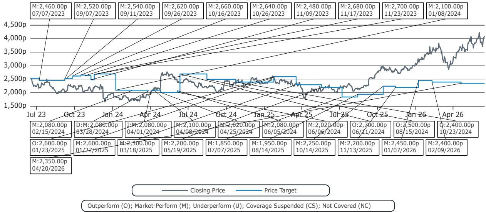
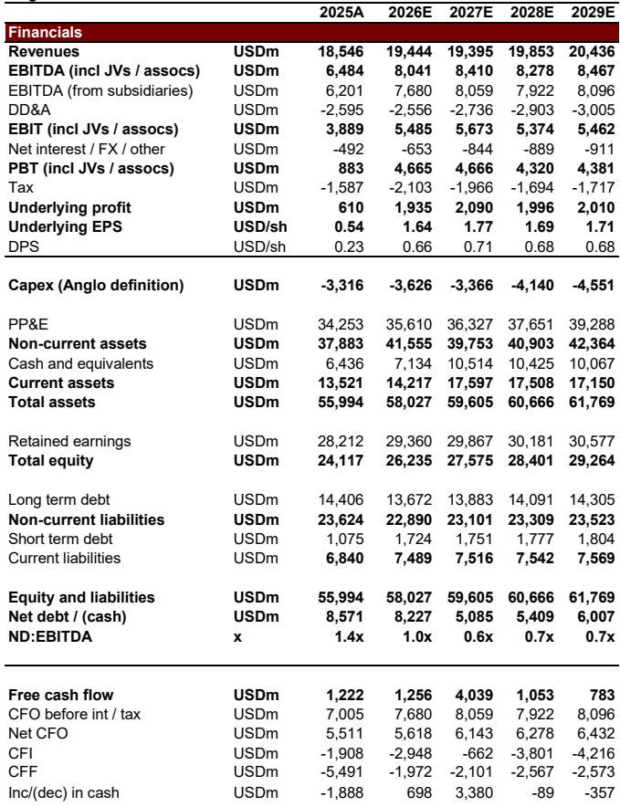

# The Copper Tariff Decision Will Reshape Global Metal Flows, Not Just Prices

The most consequential policy event for the global copper market in the next decade arrives by June 30th, when the White House must decide whether to impose tariffs on refined copper. This is not merely a trade policy question. It is a structural decision that will determine the direction of capital flows, inventory allocation, and relative pricing between the US and the rest of the world for years to come.

Copper prices have already surged past $14,000 per tonne, driven by supply disruptions, financial speculation, and one uniquely policy-driven factor: the mass stockpiling of copper in US warehouses by traders anticipating a 15% tariff by January 2027 and potentially 30% by January 2028. Since summer 2025, Comex inventories have risen by roughly 10,000 tonnes per week, accumulating over 500,000 tonnes of additional stock. This is not organic demand. This is a hedge against policy risk.

The core question facing investors is not whether copper is fundamentally tight. It is whether the US government will follow through on its tariff threat, and what that means for the global distribution of copper supply. The answer will separate commodity traders who understand policy from those who only understand supply-demand math.

The report from which this analysis is drawn lays out a clear framework: a base case of no tariffs, and three increasingly bullish bull-case pathways. But the real insight lies in the second-order implications that most market participants are not yet pricing.

## The Tariff Threat Is Not About Trade Deficits; It Is About Forcing Domestic Refining Capacity

The stated logic behind the potential copper tariff is US "resource independence." The administration wants to ensure sufficient domestic refining capacity and a reliable market for refined copper within the United States. This is a supply-chain sovereignty argument, not a traditional protectionist one.

The mechanism is clever. Rather than having the US government directly stockpile copper or subsidize domestic smelters, the administration is letting private traders do the work. By threatening a 15% tariff, they create an incentive for traders to pre-position copper in US warehouses. This effectively forces the private sector to build a strategic stockpile at no cost to the government.

The question is whether this strategy will succeed. If the tariff is imposed, US refineries will have a protected market and a guaranteed price premium. If the tariff is not imposed, the stockpiled copper will flow back to the rest of the world, depressing global prices. The administration faces a delicate balance: they want the capacity, but they may not want the price distortion that comes with a permanent tariff.

What the report does not fully explore is the geopolitical dimension. The US has not secured observable copper supply agreements with Chile, a logical step if the goal was to ensure stable supply without tariffs. The absence of such deals suggests either that the administration is serious about tariffs, or that negotiations are occurring behind closed doors. Either way, the uncertainty itself is a powerful market force.

## The Cost to Finance and Move Copper Creates a Skewed Risk-Reward That Incentivizes Continued Stockpiling

The report estimates that the cost to finance and move copper from Western Europe to the US ranges from $400 to $754 per tonne, depending on storage duration. Against a potential tariff windfall of over $2,000 per tonne under a 15% tariff, the arithmetic is compelling.

This skewed risk-reward ratio is the engine driving the current inventory build. Traders face a limited downside if tariffs are not imposed: they can sell the copper back into the global market, absorbing the financing and logistics cost. But the upside is enormous if tariffs are imposed: they capture the full tariff premium.

The implication is that even in the absence of a definitive tariff announcement, the inventory flow will continue. The report projects that in any bull case scenario, US inventories could accumulate at 10,000 tonnes per week, reaching 250,000 to 300,000 tonnes over six months in an extended review scenario, and as much as 700,000 to 800,000 tonnes over 18 months in the escalating tariff scenario.

This is not a marginal effect. These volumes represent a significant fraction of global annual copper consumption. The market is effectively being bifurcated into two pools: US-priced copper and rest-of-world copper. The spread between LME and Comex prices is the key signal to watch. If that spread widens, it confirms that the tariff risk is being priced in. If it narrows, it suggests the market expects a resolution.

## A Definitive No-Tariff Announcement Would Trigger a Sharp Price Correction, But the Path Is Not Linear

The report's base case assumes that if the White House definitively announces no tariffs, inventories will gradually flow back to the rest of the world, and copper prices will decline to around $11,000 per tonne. This is the cleanest scenario for investors to understand, but it is also the most deceptive.

The problem is that the inventory release will not happen instantly. If LME prices are sufficiently higher than Comex prices, traders will have an incentive to move copper out of US warehouses. But if the spread is narrow, they may simply hold and sell into the US domestic market. The speed of the price decline depends on the relative pricing between the two exchanges, not just the policy decision.

Moreover, a no-tariff decision does not eliminate the underlying supply tightness that drove copper prices higher in the first place. Mine supply disruptions at Kamoa-Kakula and Grasberg are real. Financial speculation is real. The no-tariff scenario simply removes the policy-driven inventory premium. The fundamental floor for copper remains structurally higher than pre-2025 levels.

Investors should therefore distinguish between a correction and a collapse. A move to $11,000 per tonne is a correction from current levels, not a return to the $8,000 per tonne world of early 2025. The base case is bearish relative to current prices, but bullish relative to historical norms.

## The Bull Case Scenarios Imply That Copper Could Reclaim All-Time Highs Without Any Mine Supply Failure

The report outlines three bull case pathways, each progressively more bullish. An extended review period prolongs uncertainty and keeps inventories flowing. A 15% tariff with no guidance on 2028 creates a clear incentive to stockpile through 2027. A 15% tariff followed by a 30% tariff in 2028 would trigger a massive inventory build over 18 months, potentially pulling 700,000 to 800,000 tonnes of copper into US warehouses.

The most striking conclusion is that under any bull case scenario, copper prices could reclaim their all-time high level without any additional mine supply failure. This is a critical insight. The market is currently pricing in both supply tightness and tariff risk. If tariffs are imposed, the price premium from inventory hoarding alone could push prices higher, even if mine supply remains stable.

This creates a paradox. The tariff is designed to protect US refining capacity, but it may also create a shortage in the rest of the world. As copper is pulled into US warehouses, ex-US regions face tighter physical supply. This could lead to demand destruction or substitution in non-US markets, which would ultimately cap the price upside. The report acknowledges this offset, but the timing and magnitude remain uncertain.

The key question for investors is whether the tariff premium is already fully priced. If the market has already discounted a 15% tariff, the actual announcement may have limited upside. If the market is still pricing in uncertainty, a clear tariff decision could trigger a significant re-rating.

## What the Report Does Not Fully Answer: The Demand Response and Substitution Risk

The report focuses heavily on supply-side dynamics and policy-driven inventory flows. What it does not fully address is the demand response at elevated prices. Copper at $14,000 per tonne is not just a cyclical high; it is a structural shock to end-users.

At these prices, substitution becomes economically viable in several key applications. Aluminum can replace copper in certain electrical applications. Fiber optics can replace copper in telecommunications. The construction and automotive sectors can redesign systems to reduce copper intensity. These substitution effects take time, but they are real.

The report also does not fully explore the impact of a potential US recession or global economic slowdown on copper demand. The current price surge is occurring against a backdrop of relatively stable macroeconomic conditions. If the macro environment deteriorates, the demand side of the equation changes dramatically, and the inventory build could become a burden rather than a support.

Investors should consider that the bullish scenarios in the report assume a stable macro environment. If that assumption breaks, the entire framework shifts. The report is a tool for understanding policy-driven price dynamics, not a comprehensive forecast of all possible outcomes.

## A Decision Framework for Investors: Three Questions to Guide Positioning

The report provides the raw material for a structured decision framework. Here is how investors can apply it:

First, assess the probability of each tariff scenario. The report does not assign explicit probabilities, but the base case of no tariffs appears to be the analysts' preferred view. However, the absence of observable copper agreements with Chile suggests that the administration may be more serious about tariffs than the base case assumes. Investors should form their own view based on political signals, trade negotiations, and the administration's broader resource independence agenda.

Second, map the scenario to your portfolio's copper exposure. The report identifies Freeport-McMoRan and Antofagasta as having the highest beta to copper prices, at approximately 1.5x and 1.4x, respectively. Anglo American follows at 1.1x, while BHP has a more moderate sensitivity at 0.7x. In a bull case scenario, these stocks could see significant upside. In a base case scenario, they are vulnerable to the price correction.

Third, consider the time horizon. The report's scenarios play out over 6 to 18 months. The inventory build is not a one-time event; it is a process. Investors with a short-term horizon should focus on the June 30th announcement and the immediate price reaction. Investors with a longer horizon should consider the structural implications for US refining capacity, global copper flows, and the long-term equilibrium price.

The most important insight from the report is that the copper market is now a two-market system. The US price is determined by tariff expectations and inventory flows. The rest-of-world price is determined by fundamental supply and demand, minus the copper pulled into US warehouses. These two prices will diverge or converge depending on policy. Investors who understand this dynamic have a clear edge over those who treat copper as a single global commodity.

## Join the community to read the full report and review the original charts.

The full report includes detailed exhibits on inventory trends, cost curves, scenario analysis, and company-specific sensitivity analysis that cannot be fully captured in this article. The original charts show the precise trajectory of Comex inventories, the spread between LME and Comex prices, and the historical relationship between copper prices and fund positioning. These visuals are essential for understanding the magnitude of the current distortion.

The report also includes the analysts' price targets and rating changes for the major copper producers, which provide a concrete reference point for portfolio construction. Without access to the full data, investors are making decisions based on incomplete information.

The copper market is at an inflection point. The next three weeks will determine whether the current price surge is a speculative bubble or the beginning of a new structural regime. The answer lies in the White House, not the mine site.

*This article is for learning and discussion only and does not constitute investment advice.*

Personal reading notes and learning share only. Not investment advice.

