## Global Semiconductors

# Global Semis: The CPU Renaissance? Beneficiaries of a \$223bn TAM...

David Dai, CFA

+852 2918 5704

david.dai@bernsteinsg.com

Stacy A. Rasgon, Ph.D.

+1 213 559 5917

stacy.rasgon@bernsteinsg.com

Qingyuan Lin, Ph.D.

+852 2123 2654

qingyuan.lin@bernsteinsg.com

Mark Li

+852 2123 2645

mark.li@bernsteinsg.com

Juho Hwang

+852 2123 2632

juho.hwang@bernsteinsg.com

Jack Lin

+852 2123 2683

jack.lin@bernsteinsg.com

Carmine Milano, CFA

+44 20 7762 1857

carmine.milano@bernsteinsg.com

Alrick Shaw

+1 917 344 8454

alrick.shaw@bernsteinsg.com

Arpad von Nemes

+1 917 344 8461

arpad.vonnemes@bernsteinsg.com

Francis Ma

+852 2123 2626

francis.ma@bernsteinsg.com

The shift from gen AI paradigm from 1.0 (chatbot) to 2.0 (agent) greatly increases server CPU demand. As discussed in SoftBank, Arm: From GenAI to Agentic AI; Initiating with Outperform Ratings, Agentic AI involves heavily autonomous task orchestration and execution, which boosts the CPU workload vs. GPU. With the shift from chatbot to agentic AI, the CPU:GPU ratio for AI data center is surging from 1:4 or 1:8 to 1:1 or higher.

We raise server CPU TAM to \$223bn (\$137bn in 2030 in the base case, 6x of the 2025 TAM of \$37bn. This assumes \$3.5tn of AI data center capex, and 1:1 CPU:GPU pairing ratio for inference. An alternative approach with 120mn CPU cores/GW yields similar TAM. Our previous forecast of \$137bn is now the bear case (assuming \$3tn AI capex, 1:2 CPU:GPU), while the upside now sits at \$330bn (\$4tn AI capex, 1.5:1 CPU:GPU).

Raising Arm PT to \$500, as Arm is the structural beneficiary of the renaissance of CPUs for agentic AI. Arm architecture is suitable for agentic AI workload given its unparalleled power efficiency. In addition, Arm is shifting from just IP provider to CPU maker, aiming to capture \$15bn revenue by CY2030, but we now forecast \$22bn as we revise CPU TAM to \$223bn in 2030 (from \$137bn). Arm's 2030 EPS (FYE31) is now lifted to \$11.79 (\$9.83 prior). Based on 42x P/E (40x prior), we lift Arm's PT to \$500 (21% upside). Given the lifted PT of Arm, we also raise SoftBank PT to ¥11,200 (58% upside), based on 30% discount to pro-forma NAV of \$572bn.

Updating numbers, raising AMD and INTC PTs. Both companies should benefit from stronger (and more sustained) server demand, though AMD's products remain superior for now (and we believe they will continue their share gain trajectory). Our existing AMD model was already consistent with a stronger server CPU environment and estimates move marginally, however we are now bringing our INTC model inline with those assumptions and are raising estimates more materially; we also roll valuation horizon forward for both to CY27/28 avg (vs CY27 prior) given we are about halfway through the year. Our AMD PT moves to \$600; INTC to \$100. We rate AMD OP, INTC MP.

Hygon will benefit from strong x86 CPU demand and gain share in China. We expect China to outpace global x86 growth from 2028 onward, with the easing of advanced-node supply constraints in China and accelerating AI investment unlocking CPU potential. We expect Hygon to steadily expand its share of China's x86 server CPU market, exceeding $35\%$ by 2030, as it increasingly penetrates into CSPs, beyond its traditional customer base of government and SOEs, supported by improved interoperability with domestic AI chips and potentially constrained supply from global vendors. We updated Hygon projection to reflect that, revising up 2027/2028 EPS to CNY 3.6 / 6.3, raising PT to CNY 450.

What could go wrong? We're still assessing if foundry/memory capacity will be sufficient to support the CPU growth. Additionally, the value of GPU/accelerator embeds the value of HBM & the markup charged by NVDA, etc. now but the high cost of memory including HBM may prompt hyperscalers to source directly from memory suppliers. Our projection is based on CPU/accelerator value & will have a downside risk if that happens.

BERNSTEIN TICKER TABLE

<table><tr><td rowspan="2">Ticker</td><td rowspan="2">Rating</td><td colspan="3">15 Jun 2026</td><td colspan="2">TTM</td><td colspan="4">Adjusted EPS</td><td colspan="3">Adjusted P/E (x)</td></tr><tr><td>Cur</td><td>Closing Price</td><td>Price Target</td><td>Rel. Perf.</td><td>Cur</td><td>2025A</td><td>2026E</td><td>2027E</td><td>2025A</td><td>2026E</td><td>2027E</td><td></td></tr><tr><td>ARM (ARM Holdings)</td><td>O</td><td>USD</td><td>412.55</td><td>500.00</td><td>160.6%</td><td>USD</td><td>1.77</td><td>2.25</td><td>3.21</td><td>233.1</td><td>183.3</td><td>128.6</td><td></td></tr><tr><td>OLD</td><td></td><td></td><td></td><td>300.00</td><td></td><td></td><td></td><td>2.28</td><td>3.12</td><td></td><td></td><td></td><td></td></tr><tr><td>9984.JP (SoftBank)</td><td>O</td><td>JPY</td><td>7,102.00</td><td>11,200</td><td>180.6%</td><td>JPY</td><td>872.47</td><td>282.49</td><td>159.10</td><td>8.1</td><td>25.1</td><td>44.6</td><td></td></tr><tr><td>OLD</td><td></td><td></td><td></td><td>8,200.00</td><td></td><td></td><td></td><td>251.35</td><td>152.44</td><td></td><td></td><td></td><td></td></tr><tr><td>688041.CH (Hygon)</td><td>O</td><td>CNY</td><td>294.31</td><td>450.00</td><td>72.0%</td><td>CNY</td><td>1.10</td><td>2.04</td><td>3.59</td><td>267.6</td><td>144.0</td><td>81.9</td><td></td></tr><tr><td>OLD</td><td></td><td></td><td></td><td>280.00</td><td></td><td></td><td></td><td>2.42</td><td>3.48</td><td></td><td></td><td></td><td></td></tr><tr><td>AMD (Advanced Micro)</td><td>O</td><td>USD</td><td>547.26</td><td>600.00</td><td>290.9%</td><td>USD</td><td>4.17</td><td>6.98</td><td>14.61</td><td>131.1</td><td>78.5</td><td>37.4</td><td></td></tr><tr><td>OLD</td><td></td><td></td><td></td><td>525.00</td><td></td><td></td><td></td><td>6.95</td><td>14.60</td><td></td><td></td><td></td><td></td></tr><tr><td>INTC (Intel)</td><td>M</td><td>USD</td><td>127.86</td><td>100.00</td><td>457.2%</td><td>USD</td><td>0.43</td><td>1.07</td><td>1.50</td><td>299.9</td><td>119.4</td><td>85.0</td><td></td></tr><tr><td>OLD</td><td></td><td></td><td></td><td>65.00</td><td></td><td></td><td></td><td>1.04</td><td>1.35</td><td></td><td></td><td></td><td></td></tr><tr><td>NVDA (NVIDIA)</td><td>O</td><td>USD</td><td>212.45</td><td>315.00</td><td>20.4%</td><td>USD</td><td>4.77</td><td>9.19</td><td>12.52</td><td>44.5</td><td>23.1</td><td>17.0</td><td></td></tr><tr><td>SPX</td><td></td><td></td><td>7,511.35</td><td></td><td></td><td></td><td></td><td></td><td></td><td></td><td></td><td></td><td></td></tr><tr><td>JPL</td><td></td><td></td><td>2,631.42</td><td></td><td></td><td></td><td></td><td></td><td></td><td></td><td></td><td></td><td></td></tr><tr><td>ASIAX</td><td></td><td></td><td>2,032.93</td><td></td><td></td><td></td><td></td><td></td><td></td><td></td><td></td><td></td><td></td></tr></table>

## PRICE TARGET CHANGE / ESTIMATE CHANGE IN BOLD

O - Outperform, M - Market-Perform, U - Underperform, NR - Not Rated, CS - Coverage Suspended

688041.CH estimate is Reported EPS; 688041.CH valuation is Reported P/E (x); ARM, NVDA base year is 2026;

In the ticker table, 2026 represents FY27/3 for SoftBank and FY26/3 for ARM.

Source: Bloomberg, Bernstein estimates and analysis.

## INVESTMENT IMPLICATIONS

We rate SoftBank (PT=¥11,200) and Arm (PT=\$500.00) Outperform.

AMD (Outperform, \$600.00): Expectations remain high, but exposure to AI demand driving both a CPU and GPU story can provide substantial growth.

INTC (Market-Perform, \$100.00): Server strength is helping the company get back on their feet, and narrative/headlines may fuel the vibe for now.

NVDA (Outperform, \$315.00): The datacenter opportunity is enormous, and still early.

We rate Hygon (PT=CNY 450.00) Outperform: we raise our PT from CNY 280 to CNY 450, based on 2028E EPS of CNY 6.30 (+32% vs Bern. Old) and 71x P/E (Previously was Outperform, 80x P/E based on 2027E EPS CNY 3.48, PT CNY 280).

## DETAILS

We raise our 2030 server CPU TAM to \$223bn on the back of higher AI investments and strong CPU:GPU pairing ratio, and our prior forecast of \$137bn is now moved to the bear case (Exhibit 1). On the back of that, we raise PTs for Arm, SoftBank, AMD, Intel, Hygon. Our Server CPU Industry model can be downloaded here: Server CPU Industry Model. Updated Arm financial model can be downloaded here: Arm (Arm.US).

EXHIBIT 1: We believe 2030 server CPU TAM will be \$223bn in the base case of \$3.5tn AI capex.

<table><tr><td>CY</td><td>2025</td><td>2030 Base</td><td>2030 Bull</td><td>2030 Bear</td></tr><tr><td>AI GW additions</td><td>15</td><td>70</td><td>80</td><td>60</td></tr><tr><td>AI capex intensity (bn / GW)</td><td>40</td><td>50</td><td>50</td><td>50</td></tr><tr><td>AI capex ($ bn)</td><td>600</td><td>3,500</td><td>4,000</td><td>3,000</td></tr><tr><td>AI GPU/accelerator TAM ($ bn)</td><td>240</td><td>1,575</td><td>1,800</td><td>1,350</td></tr><tr><td>Inference ratio</td><td>35%</td><td>70%</td><td>70%</td><td>70%</td></tr><tr><td>AI GPU for inferencing ($ bn)</td><td>84</td><td>1,103</td><td>1,260</td><td>945</td></tr><tr><td>CPU:GPU ratio (inference)</td><td>0.25x</td><td>1.0x</td><td>1.5x</td><td>0.5x</td></tr><tr><td>AI GPU for training ($ bn)</td><td>156</td><td>473</td><td>540</td><td>405</td></tr><tr><td>CPU:GPU ratio (training)</td><td>0.25x</td><td>0.50x</td><td>0.50x</td><td>0.50x</td></tr><tr><td>CPU:GPU cost ratio</td><td>10.0%</td><td>13.0%</td><td>13.0%</td><td>13.0%</td></tr><tr><td>CPU for agentic AI ($ bn)</td><td>6.0</td><td>174.0</td><td>280.8</td><td>87.8</td></tr><tr><td>CPU for general CPU server ($ bn)</td><td>31.3</td><td>49.4</td><td>49.4</td><td>49.4</td></tr><tr><td>CPU TAM ($ bn)</td><td>37.3</td><td>223.4</td><td>330.2</td><td>137.2</td></tr></table>

Source: Company disclosures, Mercury, Bernstein estimates and analysis.

## RENAISSANCE OF CPU IN THE AGENTIC AI PARADIGM

Since the rise of LLM, GPU/ASIC accelerators have been the core of AI computing. While training clusters once required a dense 4:1 ratio to handle heavy data-loading, the focus shifted toward eliminating the 'CPU tax' that plagued high-scale inferencing. In custom inference-optimized deployments like Google's TPU v6e and Meta's Grand Teton, the GPU-to-CPU socket ratio moved to 8:1.

Agentic AI is pushing the CPU back to center stage (Exhibit 2) because AI systems are no longer just running a model once and returning an answer. The GPU still performs the dens maths, but the CPU increasingly determines whether the system as a whole can orchestrate the surrounding workflow efficiently — feeding data, scheduling tasks, coordinating tool calls, manage memory and avoid accelerator idling.

This is why the next generation of AI infrastructure is likely to see more balance in terms of hardware pairing, meaning CPU is no longer a small support component attached to a large pool of accelerators in the agentic era. We expect the GPU-to-CPU ratio potentially narrowing back to 1:1 from a very GPU-heavy 4:1 or 8:1 configurations. The 2026 hardware roadmaps are already moving in that direction:

• AMD Venice: 1 CPU to 4 MI455X GPUs per compute tray.  
• NVIDIA Vera: 1 CPU to 2 Rubin GPUs (4 GPU dies) per superchip.  
- Google TPU7x: 1 CPU to 4 TPU chips per scale-up unit.

The GPU/CPU pairing is especially important in agentic workloads because inference is turning into a loop instead of a single pass. A request may trigger retrieval, planning, tool use, intermediate reasoning, another model call, and then action, which means the GPU does the heavy compute while the CPU keeps the workflow moving efficiently; if the CPU is weak, expensive GPUs can sit underutilized, and the overall system becomes slower and less efficient.

Agentic AI also increases pressure on networking and distributed infrastructure, which strengthens the CPU's role even further (Exhibit 3, Exhibit 4). As workloads stretch across servers, clusters, and locations, the system has to move state, manage traffic, and coordinate resources in real time, so the CPU becomes critical not only inside the server but across the wider data-center fabric that supports autonomous AI execution.

Arm CPUs stand out in this environment because the new bottleneck is not only peak performance but efficient orchestration under power and space limits. As operators need more CPU capacity to support growing numbers of AI agents, Arm's pitch around performance per watt, high core density, and scalable data-center compute becomes more compelling, which is why agentic AI is helping bring CPUs back into focus and giving Arm a stronger strategic role in the next phase of AI infrastructure.

EXHIBIT 2: Arm argues that agentic AI shifts more work back to the CPU: accelerators generate tokens, but CPUs orchestrate the agents, memory and workflows needed to deliver answers, making Arm's efficient CPU architecture increasingly critical in AI data centers  
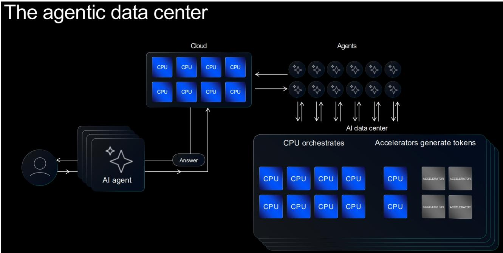

flowchart

```mermaid
graph TD
  A["User"] --> B["AI agent"]
  B --> C["Answer"]
  C --> D["Cloud"]
  D --> E["Agents"]
  E --> F["AI data center"]
  F --> G["Accelerators generate tokens"]
  G --> H["CPU orchestrates"]
  H --> I["ACCELERATOR"]
  H --> J["ACCELERATOR"]
  H --> K["ACCELERATOR"]
  H --> L["ACCELERATOR"]
  H --> M["ACCELERATOR"]
  H --> N["ACCELERATOR"]
  H --> O["ACCELERATOR"]
  H --> P["ACCELERATOR"]
  H --> Q["ACCELERATOR"]
  H --> R["ACCELERATOR"]
  H --> S["ACCELERATOR"]
  H --> T["ACCELERATOR"]
  H --> U["ACCELERATOR"]
  H --> V["ACCELERATOR"]
  H --> W["ACCELERATOR"]
  H --> X["ACCELERATOR"]
  H --> Y["ACCELERATOR"]
  H --> Z["ACCELERATOR"]
  H --> AA["ACCELERATOR"]
  H --> AB["ACCELERATOR"]
  H --> AC["ACCELERATOR"]
  H --> AD["ACCELERATOR"]
  H --> AE["ACCELERATOR"]
  H --> AF["ACCELERATOR"]
  H --> AG["ACCELERATOR"]
  H --> AH["ACCELERATOR"]
  H --> AI["ACCELERATOR"]
  H --> AJ["ACCELERATOR"]
  H --> AK["ACCELERATOR"]
  H --> AL["ACCELERATOR"]
  H --> AM["ACCELERATOR"]
  H --> AN["ACCELERATOR"]
  H --> AO["ACCELERATOR"]
  H --> AP["ACCELERATOR"]
  H --> AQ["ACCELERATOR"]
  H --> AR["ACCELERATOR"]
  H --> AS["ACCELERATOR"]
  H --> AT["ACCELERATOR"]
  H --> AU["ACCELERATOR"]
  H --> AV["ACCELERATOR"]
  H --> AW["ACCELERATOR"]
  H --> AX["ACCELERATOR"]
  H --> AY["ACCELERATOR"]
  H --> AZ["ACCELERATOR"]
  H --> BA["ACCELERATOR"]
  H --> BB["ACCELERATOR"]
  H --> BC["ACCELERATOR"]
  H --> BD["ACCELERATOR"]
  H --> BE["ACCELERATOR"]
  H --> BF["ACCELERATOR"]
  H --> BG["ACCELERATOR"]
  H --> BH["ACCELERATOR"]
  H --> BI["ACCELERATOR"]
  H --> BJ["ACCELERATOR"]
  H --> BK["ACCELERATOR"]
  H --> BL["ACCELERATOR"]
  H --> BM["ACCELERATOR"]
  H --> BN["ACCELERATOR"]
  H --> BO["ACCELERATOR"]
  H --> BP["ACCELERATOR"]
  H --> BQ["ACCELERATOR"]
  H --> BR["ACCELERATOR"]
  H --> BS["ACCELERATOR"]
  H --> BT["ACCELERATOR"]
  H --> BU["ACCELERATOR"]
  H --> BV["ACCELERATOR"]
  H --> BW["ACCELERATOR"]
  H --> BX["ACCELERATOR"]
  H --> BYB["ACCELERATOR"]
  H --> BZ["BX"]
```

Source: Arm

EXHIBIT 3: CPU is expected to play a more important role within inference, in the agentic area.  
2020-2029E: Average GPU-to-CPU ratio in CSP inference clusters  
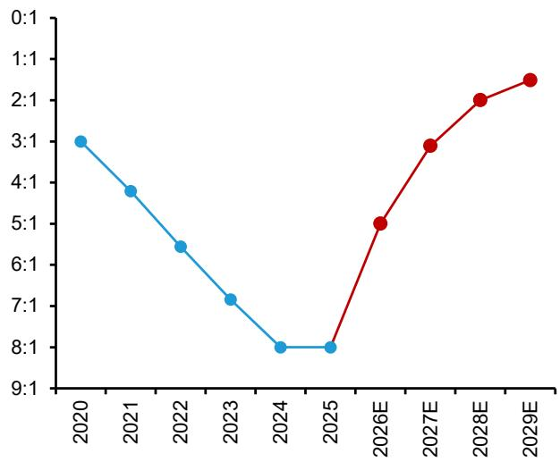

line chart

| Year | Value |
| :--- | :--- |
| 2020 | 3:1 |
| 2021 | 4:1 |
| 2022 | 6:1 |
| 2023 | 7:1 |
| 2024 | 8:1 |
| 2025 | 8:1 |
| 2026E | 5:1 |
| 2027E | 3:1 |
| 2028E | 2:1 |
| 2029E | 2:1 |

Source: Ciena estimates, Bernstein analysis.

EXHIBIT 4: Agentic AI shifts compute balance toward CPUs, with CPU share rising from \~14% in Traditional LLMs to 50%, highlighting CPUs' growing orchestration role alongside GPUs in AI workloads at scale  
CPU:GPU ratio shift in Agentic AI  
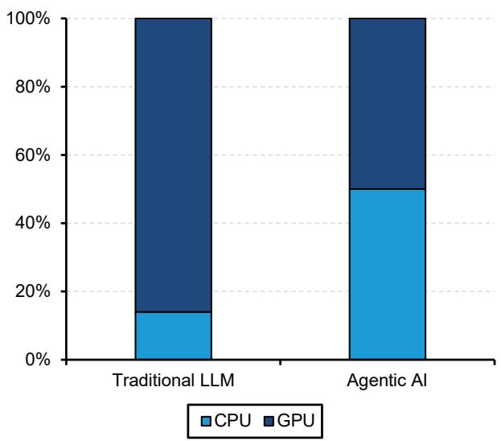

stacked bar chart

| Category | CPU (%) | GPU (%) |
| :--- | :--- | :--- |
| Traditional LLM | 14 | 87 |
| Agentic AI | 50 | 49 |

Source: TrendForce, Bernstein analysis

EXHIBIT 5: AI infrastructure TAM expands sharply by CY30, led by data center accelerators reaching \$1T, while data center CPU also quadruples from \$33bn to \$137bn.  
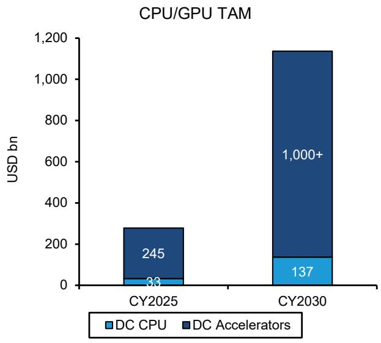

stacked bar chart

CPU/GPU TAM
| Year | DC CPU (USD bn) | DC Accelerators (USD bn) |
| :--- | :--- | :--- |
| CY2025 | 33 | 245 |
| CY2030 | 137 | 1000+ |

Source: Mercury, Company reports, Bernstein estimates and analysis.

EXHIBIT 6: We expect the server CPU market to grow from US\$37bn in 2025 to US\$223bn in 2030, accelerating at a 43% CAGR, driven by Agentic AI adoption.  
2020-2030E: Server CPU Market Size  
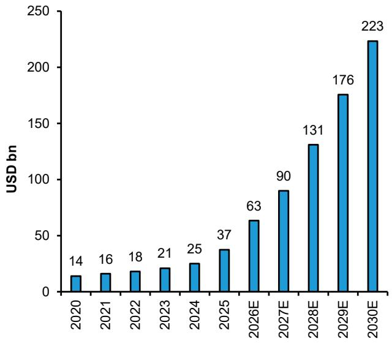

bar chart

| Year | Value (USD bn) |
| :--- | :--- |
| 2020 | 14 |
| 2021 | 16 |
| 2022 | 18 |
| 2023 | 21 |
| 2024 | 25 |
| 2025 | 37 |
| 2026E | 63 |
| 2027E | 90 |
| 2028E | 131 |
| 2029E | 176 |
| 2030E | 223 |

Source: Mercury, Company reports, Bernstein analysis and estimates

## RAISING 2030 SERVER CPU TAM FORECAST TO \$223BN

Within our initiation of Arm, we forecast the CY30 data center CPU TAM of \$137bn, well above both Arm's own estimates of \$100bn and AMD's \$120bn, on the basis that agentic workloads require much more CPU intensity.

Since our initiation, there are quite a few incremental developments, including better-than-expected agentic AI adoption, and higher-than-expected AI GW and capex spending. Nvidia also guided for a \$20bn revenue from Vera CPU which should also be positive for Arm. The other notable data point that was provided by Nvidia was the annual AI infrastructure spending forecasts of over \$1tn by 2027 and \$3-4tn towards the end of the decade.

Based on these data points, we revise our top-down estimates for the server CPU TAM to \$223bn (Exhibit 7), with the following assumptions:

- AI capex of \$3.5 tn in 2030, implying 70 GW AI data center deployment at \$50bn / GW  
- AI GPU (including ASIC accelerator) market of \$1.6 tn, or 45% of AI DC capex  
• CPU:GPU unit ratio of 1:1 for inferencing and 0.5:1 for training, and CPU ASP as 13% of GPU  
- This results in server CPU TAM of \$223bn, including \$174bn for agentic AI workload and \$49bn for non-AI workload

We also did a sanity check based on an alternative method of CPU core count:

- According to Arm, agentic AI workload requires 120mn CPU cores / GW, vs. traditional data center requiring only 30mn cores / GW  
- This translates into 8.4bn server CPU cores for 70 GW AI data center deployment in 2030  
- AI CPU TAM would be \$168bn in 2030 assuming \$20/core (likely conservative), similar to the \$174bn calculated above

Our sensitivity analyses suggest that even a rather conservative take of this figure implies a meaningful agentic CPU opportunity.

- In the bear case, the main assumptions are \$3tn AI capex, combined with a CPU-to-GPU ratio of 0.5x for inference. The server CPU TAM then would be \$137bn, matching our previous forecast which now looks somewhat conservative.  
- In the bull case, we assume \$4tn AI capex, combined with a CPU-to-GPU ratio of 1.5x for inference. The resulting server CPU TAM would be \$330bn.

A sensitivity table for various assumptions is also listed in (Exhibit 8). Investors can play with these assumptions in the updated CPU TAM model.

EXHIBIT 7: We believe 2030 server CPU TAM will be \$223bn in the base case of \$3.5tn AI capex.

<table><tr><td>CY</td><td>2025</td><td>2030 Base</td><td>2030 Bull</td><td>2030 Bear</td></tr><tr><td>AI GW additions</td><td>15</td><td>70</td><td>80</td><td>60</td></tr><tr><td>AI capex intensity (bn / GW)</td><td>40</td><td>50</td><td>50</td><td>50</td></tr><tr><td>AI capex ($ bn)</td><td>600</td><td>3,500</td><td>4,000</td><td>3,000</td></tr><tr><td>AI GPU/accelerator TAM ($ bn)</td><td>240</td><td>1,575</td><td>1,800</td><td>1,350</td></tr><tr><td>Inference ratio</td><td>35%</td><td>70%</td><td>70%</td><td>70%</td></tr><tr><td>AI GPU for inferencing ($ bn)</td><td>84</td><td>1,103</td><td>1,260</td><td>945</td></tr><tr><td>CPU:GPU ratio (inference)</td><td>0.25x</td><td>1.0x</td><td>1.5x</td><td>0.5x</td></tr><tr><td>AI GPU for training ($ bn)</td><td>156</td><td>473</td><td>540</td><td>405</td></tr><tr><td>CPU:GPU ratio (training)</td><td>0.25x</td><td>0.50x</td><td>0.50x</td><td>0.50x</td></tr><tr><td>CPU:GPU cost ratio</td><td>10.0%</td><td>13.0%</td><td>13.0%</td><td>13.0%</td></tr><tr><td>CPU for agentic AI ($ bn)</td><td>6.0</td><td>174.0</td><td>280.8</td><td>87.8</td></tr><tr><td>CPU for general CPU server ($ bn)</td><td>31.3</td><td>49.4</td><td>49.4</td><td>49.4</td></tr><tr><td>CPU TAM ($ bn)</td><td>37.3</td><td>223.4</td><td>330.2</td><td>137.2</td></tr></table>

Source: Company disclosures, Mercury, Bernstein estimates and analysis.

## EXHIBIT 8: Our sensitivity analysis on CPU tie ratio and AI infra TAM suggests a range of \$137bn-\$330bn.

Total Server CPU TAM (USD bn)

<table><tr><td rowspan="7">CPU-to-GPU Tie ratio</td><td rowspan="2">(USD bn)</td><td colspan="5">AI infrastructure TAM (USD bn)</td></tr><tr><td>2,500</td><td>3,000</td><td>3,500</td><td>4,000</td><td>4,500</td></tr><tr><td>0.5:1</td><td>123</td><td>137</td><td>152</td><td>166</td><td>181</td></tr><tr><td>1.0:1</td><td>174</td><td>199</td><td>223</td><td>248</td><td>273</td></tr><tr><td>1.5:1</td><td>225</td><td>260</td><td>295</td><td>330</td><td>365</td></tr><tr><td>2.0:1</td><td>276</td><td>321</td><td>367</td><td>412</td><td>457</td></tr><tr><td>2.5:1</td><td>327</td><td>383</td><td>438</td><td>494</td><td>550</td></tr></table>

This sensitivity assumes non-AI CPU CAGR of 9.5%.  
Source: Bernstein estimates and analysis.

## ARM: STRUCTURAL BENEFICIARY OF SERVER CPU TAM

## ARM'S SHARE GAIN IN SERVER CPU

## Why Arm could gain share from x86 in server CPU?

The core economic case is performance per watt and total cost of ownership. AWS states Graviton delivers up to 40% better price performance versus comparable x86 instances, up to 20% lower cost, and up to 60% lower energy consumption for equivalent workloads on certain use cases. Microsoft Azure notes that each vCPU on Cobalt 100 maps to a full physical core, making performance more predictable for server workloads versus x86 designs that use hyperthreading to inflate vCPU counts.

Beyond economics, hyperscalers gain architectural control. Designing in-house CPUs lets them shape the memory subsystem, I/O, accelerator interconnects, and security offload to fit their own infrastructure rather than relying on the roadmap of a merchant silicon vendor. This is why each major CSP has now committed to a multi-generation internal CPU program built on Arm Neoverse cores.

Above all, power consumption is one of the biggest reasons that Arm CPUs are much more likely to be adopted in AI data centers. The world is facing an energy issue that not enough electricity is available to power the new data centers. According to our forecast, AI accelerator power will almost 3x to reach 37 GW to be deployed in 2028. Including the power for CPU, memory, networking, etc, the total power consumption of AI data center would surpass 50 GW. As we can't do much to cut down power consumption of GPU/AI accelerators, using Arm server to reduce power consumption becomes the only viable choice.

EXHIBIT 9: We estimate AI accelerator GPU power reaches \~37GW in 2028 versus 12.8GW in 2025, a 43% CAGR over 2025–2028E. If we assume GPUs to account for \~70% of server power, total AI data center demand scales from \~18GW in 2025 to \~53GW in 2028.  
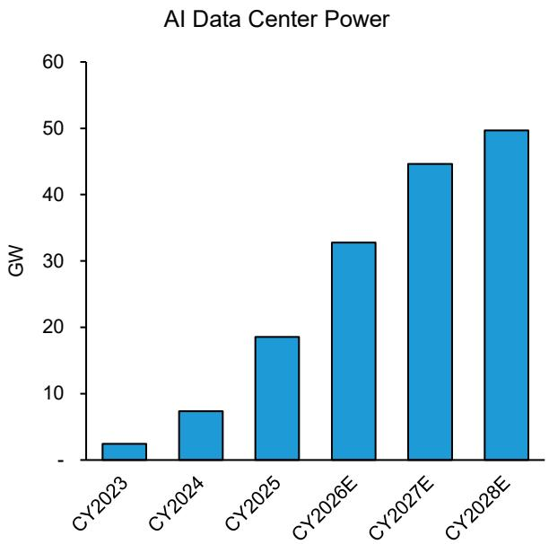

bar chart

| Fiscal Year | AI Data Center Power (GW) |
| ----------- | ------------------------- |
| CY2023      | 3                         |
| CY2024      | 7                         |
| CY2025      | 18                        |
| CY2026E     | 33                        |
| CY2027E     | 45                        |
| CY2028E     | 50                        |

Source: Company reports, Bernstein analysis and estimates

EXHIBIT 10: CPU represents between 40% and 60% of power consumption in a general server, but only 5–10% in an AI server, where most power is consumed by AI accelerators.  
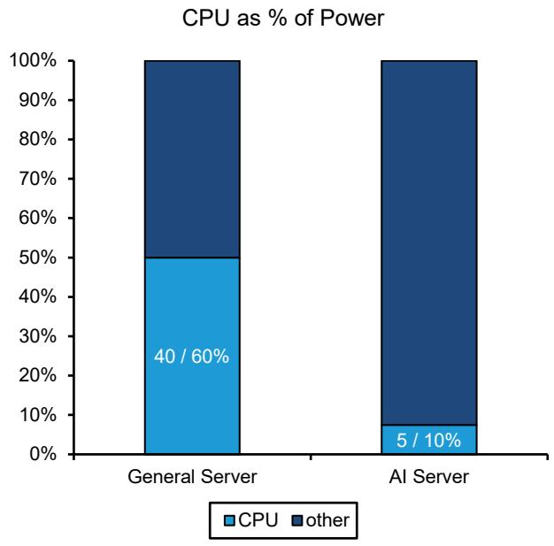

stacked bar chart

CPU as % of Power
| Server Type | CPU (%) | other (%) |
| :--- | :--- | :--- |
| General Server | 40 / 60 | 50 / 35 |
| AI Server | 5 / 10 | 95 / 0 |

Source: Bernstein analysis and estimates

## CSP CPU Roadmaps and Arm Penetration

AWS, Microsoft, and Google have each built Arm-based CPU programs (Exhibit 1.1) that are deepening Arm's data center presence across generations. According to Arm, their penetration at data centers has surpassed 50% among top hyperscalers with over 1bn Neoverse cores deployed.

- AWS: As the largest IaaS provider with 47% market share as of 2024, AWS is also the dominant deployer of Arm-based instances, with 57.2% of Arm instances across the public cloud as of 2024 year-end being deployed at AWS. AWS was the first mover to deploy Arm processors on public cloud, debuting their first arm-based instance back in 2018. As of December 24, according to Liftr Insights, Arm-based Graviton represented 25% of the total instances deployed at AWS.  
- Microsoft Azure: As the second largest IaaS provider with 17% market share as of 2024, Azure also heavily deploys Arm-based instances, with an estimated 33% of chips being Arm-based as of Q4 2024. This is a rapid ramp considering their first Arm processor Cobalt 100 debuted only in 2024. (What performance and efficiency does Microsoft Azure Cobalt 100 VMs deliver using Arm Neoverse performance? - Arm Newsroom)  
- Google GCP: Google was the third biggest IaaS provider as of 2024 with 7% market share, and they too have ramped Arm instances rapidly, with an estimated 21% share of all instances being Axion, which was introduced in 2024.

## Why Nvidia uses Arm CPUs

Nvidia's motivation for Arm is distinct from the hyperscalers: in AI and HPC systems, the critical bottleneck is more in data movement between the CPU, memory pool, and GPU - rather than raw CPU instruction throughput or enterprise application compatibility. Nvidia says its Grace CPU (72 Neoverse V2 cores per die, 144 cores in the Grace CPU Superchip using dual-die NVLink-C2C delivering up to 1.0 TB/s of LPDDR5X memory bandwidth) benefits from the NVLink-C2C interconnect that carries up to 900 GB/s bidirectional bandwidth between the CPU and Blackwell GPU - versus PCIe Gen 5's \~128 GB/s. The second-generation NVLink-C2C used in GB200 racks achieves 1.8 TB/s of bidirectional bandwidth, 7x faster than PCIe Gen 6. (NVIDIA Grace CPU Delivers World-Class Data Center Performance and Breakthrough Energy Efficiency | NVIDIA Technical Blog, NVIDIA Grace CPU and Arm Architecture | NVIDIA)

Grace was first deployed in the GH200 Grace-Hopper Superchip for HPC/AI clusters starting in 2023. The major inflection came in 2025 when Nvidia standardized on the DGX GB200 rack form factor - bundling one Grace CPU with two Blackwell GPUs per Superchip, with each DGX GB200 rack containing 36 Grace CPUs and 72 Blackwell GPUs, totaling 2,592 Arm Neoverse V2 cores per rack. This shift from the standalone HGX/MGX GPU tray format toward integrated DGX rack-scale deployment materially increased Arm CPU unit volume in AI server shipments.

The Nvidia Vera CPU (successor to Grace, launching with Rubin GPUs in 2026) further raises the bar: Vera delivers up to 1.2 TB/s of memory bandwidth — twice the bandwidth at half the power compared to traditional x86 CPUs - and is built on Nvidia's proprietary Olympus CPU cores, a custom Arm architecture designed for Reinforcement Learning and agentic AI workloads. Vera enables software environments to run up to 50% faster with twice the efficiency of conventional CPU infrastructure. (Next Gen Data Center CPU | NVIDIA Vera CPU)

EXHIBIT 11: Compariison of Server CPU specifications for Arm ASICs, Nvidia custom CPUs and x86.

<table><tr><td rowspan="2">Specification</td><td colspan="3">Arm Cloud ASICs</td><td>NVIDIA</td><td colspan="2">x86 Flagships</td></tr><tr><td>Microsoft Cobalt 200</td><td>Google Axion C4A</td><td>AWS Graviton 5</td><td>NVIDIA Vera</td><td>Intel Xeon 6 6980P</td><td>AMD EPYC 9965</td></tr><tr><td>ISA</td><td>Arm v9</td><td>Arm v9</td><td>Arm v9</td><td>Arm v9</td><td>x86-64</td><td>x86-64</td></tr><tr><td>Microarchitecture</td><td>Neoverse V3 (CSS)</td><td>Neoverse V2</td><td>Neoverse V3</td><td>Nvidia Olympus (Custom)</td><td>Granite Rapids</td><td>Turin Zen 5c</td></tr><tr><td>Process Node</td><td>TSMC 3nm</td><td>TSMC 5nm</td><td>TSMC 3nm</td><td>TSMC 3nm</td><td>Intel 3 (~4nm)</td><td>TSMC 3nm</td></tr><tr><td>Deployment</td><td>Cloud (Azure)</td><td>Cloud (GCP)</td><td>Cloud (AWS)</td><td>Universal</td><td>Universal</td><td>Universal</td></tr><tr><td>Release Date</td><td>Nov 2025</td><td>Oct 2024</td><td>Dec 2025</td><td>2H 2026</td><td>Sep 2024</td><td>Oct 2024</td></tr><tr><td>Physical Cores</td><td>132</td><td>72</td><td>192</td><td>88</td><td>128</td><td>192</td></tr></table>

Source: Company disclosures, Bernstein analysis.

EXHIBIT 12: We expect Arm's market share to continue the strong trend of growth.  
2020-2030E: Arm Server CPU market share % (Chip Value)  
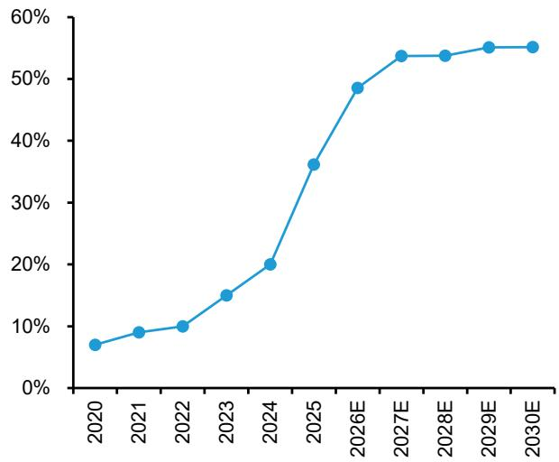

line chart

| Year | Value (%) |
|---|---|
| 2020 | 7 |
| 2021 | 9 |
| 2022 | 10 |
| 2023 | 15 |
| 2024 | 20 |
| 2025 | 36 |
| 2026E | 48 |
| 2027E | 53 |
| 2028E | 53 |
| 2029E | 54 |
| 2030E | 54 |

Source: Company disclosures, Bernstein estimates and analysis.

EXHIBIT 13: Roadmap of CPUs based on Arm IP  
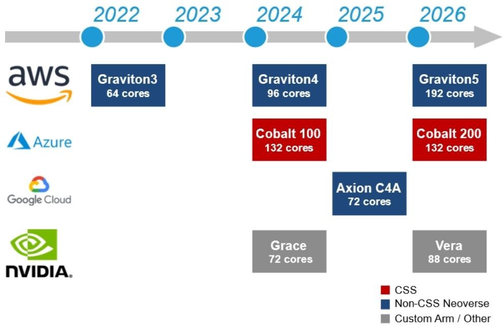

timeline chart

| Year | Provider | Core Count |
|---|---|---|
| 2022 | AWS | 64 cores |
| 2023 | AWS | 96 cores |
| 2024 | Graviton3 | 64 cores |
| 2024 | Cobalt 100 | 132 cores |
| 2025 | Graviton4 | 96 cores |
| 2025 | Axion C4A | 72 cores |
| 2025 | Grace | 72 cores |
| 2025 | Graviton5 | 192 cores |
| 2025 | Cobalt 200 | 132 cores |
| 2026 | NASA | 88 cores |
The chart includes a legend for product types: CSS (red), Non-CSS Neoverse (blue), Custom Arm / Other (gray). The timeline is shown in years along the horizontal axis.

Source: Company disclosures, Bernstein analysis

## ARM AGI CPU: DRASTIC CHANGE IN BUSINESS MODEL TO CAPTURE THE GROWING OPPORTUNITY

At Arm Everywhere event in March 2026, Arm announced an important strategic move to provide their own silicon, the Arm AGI CPU, after decades of monetizing primarily through IP licensing and royalties, making clear that the silicon offering will complement - rather than replace - its existing IP and CSS businesses.

Their rationale was that not every client can design CPUs of their own, so companies like Meta, - which Arm identified as the first customer, lead partner and co-developer - and OpenAI can just buy Arm's CPUs, while other CSPs such as Amazon, Google and Microsoft who can keep licensing Arm IPs for their CPU endeavours. Alongside Meta and OpenAI, they also confirmed many other partners including Cerebras, Cloudflare, F5, Positron, Rebellions, SAP and SK Telecom. These customers are expected to deploy Arm AGI CPU for agentic usage. Arm partners with OEMs and ODMs, as well as other supply chain partners across cloud, memory, networking, manufacturing and many other aspects, such as AWS, Broadcom, Google, Marvell, Micron, Nvidia, Samsung, SK hynix and TSMC among many others.

Financially, the model change is clearly margin dilutive in percentage terms, but very likely accretive in gross profit dollars and operating profit dollars. Management's event target was for the AGI CPU business to reach \$15bn of revenue by FY31, with total company revenue of \$25bn and non-GAAP EPS of \$9, with AGI CPU OPM is expected to exceed 30% by FY31. We believe the key point is that Arm is choosing to trade some margin rate for a dramatically larger profit pool. Just as importantly, management said the required engineering investment is already largely embedded in today's cost base, meaning the near-term P&L is already carrying much of the R&D burden, while the revenue opportunity from silicon only starts to appear from much later on to bring the operating leverage once volume scales.

Our estimate bases on a more aggressive assumption and we forecast \$22bn chip value as of FY31 (Exhibit 14) which roughly equates to c. 4.9mn CPU units based on \$4.6k ASP in FY31. We believe Arm silicon should generate \$7.7bn OP (or 52% of corporate OP) in FY31 in our forecast (Exhibit 15).

## How we frame the server CPU model for Arm

Our key assumptions on how we think of the server CPU demand are as follows. First of all, we assume that the big 3 CSPs (AWS / Google Cloud / Azure) continue to mainly use their own captive ASIC CPU chips.

Also, for Nvidia, we believe that aside from the CPUs bundled within the superchips (CPUs packaged with GPUs), Nvidia is to release standalone CPU racks for agentic workloads, but the important distinction being these will be entirely sold in rack-scale and as a system, rather than bare-metal CPUs.

Lastly, Arm AGI CPU will address the need for merchant CPU for any CSPs and/or customers who elect to build their own systems based on Arm architected CPUs, instead of buying a full system from a third-party vendor (including Nvidia), to suit their specific computing needs.

EXHIBIT 14: We now forecast Arm AGI CPU sales to reach \$22bn by FY31.  
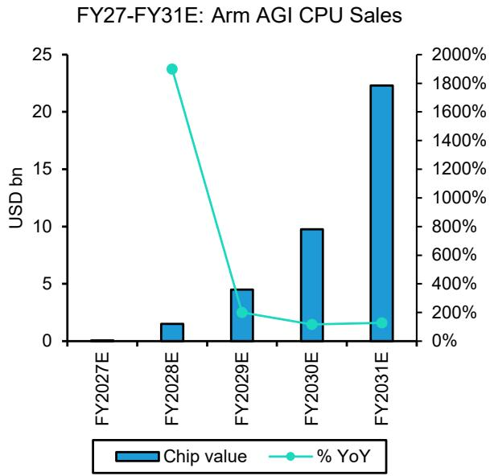

bar-line hybrid

FY27-FY31E: Arm AGI CPU Sales
| Fiscal Year | Chip value (USD bn) | % YoY (%) |
| :--- | :--- | :--- |
| FY2027E | 0.1 | |
| FY2028E | 1.5 | 1950 |
| FY2029E | 4.5 | 250 |
| FY2030E | 9.8 | 150 |
| FY2031E | 22.3 | 160 |

EXHIBIT 15: We believe OP contribution from Arm silicon could go as high as \$7.7bn as of FY31.  
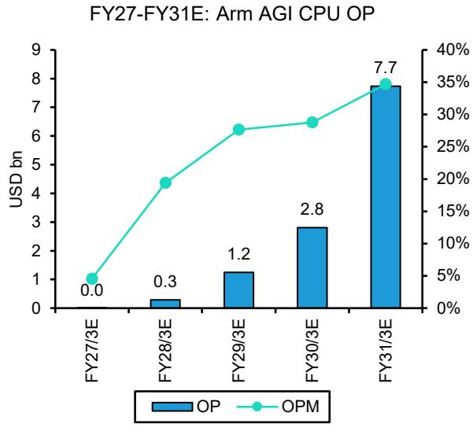

bar-line hybrid

FY27-FY31E: Arm AGI CPU OP
| Period | OP (USD bn) | OPM (%) |
|---|---|---|
| FY27/3E | 0.0 | 5.0 |
| FY28/3E | 0.3 | 19.0 |
| FY29/3E | 1.2 | 28.0 |
| FY30/3E | 2.8 | 30.0 |
| FY31/3E | 7.7 | 34.0 |

Source: Company disclosures, Bernstein estimates and analysis.  
Source: Company disclosures, Bernstein estimates and analysis.

Our Arm server CPU model is built bottom-up across four distinct sets of demand: 1. Nvidia-related Arm CPUs, 2. hyperscaler in-house CPUs, 3. Arm's own CPU silicon business, and 4. other merchant / enterprise Arm CPUs. We believe this segmentation enables us to identify the different adoption driver, volume logic, royalty profile as well as strategic implications for Arm. At a high level, we estimate the server CPU TAM rising sharply towards the end of the decade as agentic demand shifts the balance between accelerators and CPUs. Our bottom-up 2030 server CPU TAM is \$223bn, of which we estimate Arm to take \$123bn (Exhibit 16).

In terms of the different demands, firstly on Nvidia, we break it down further into GPU-attached racks and standalone CPU racks. The former is based largely on our CoWoS-based GPU estimates and the attach rate (or rather, how much GPU is sold in rack-scale instead of standalone), and the latter is based on how much agentic demand will be met by Nvidia CPUs, and how many CPUs are to be attached as a result. We model it to grow significantly from 1.2mn units in CY25 to 6.1mn units in CY30 (Exhibit 17).

EXHIBIT 16: We estimate a 2030 server CPU TAM of \$223bn, of which we believe Arm will be around \$123bn.  
EXHIBIT 17: We estimate Nvidia-related Arm CPU units to grow by 5x by 2030.  
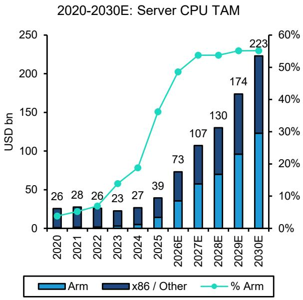

bar-line hybrid

2020-2030E: Server CPU TAM
| Year | Arm (USD bn) | x86 / Other (USD bn) | % Arm (%) |
| :--- | :--- | :--- | :--- |
| 2020 | 26 | 26 | 5 |
| 2021 | 28 | 28 | 7 |
| 2022 | 26 | 26 | 9 |
| 2023 | 23 | 23 | 14 |
| 2024 | 27 | 27 | 18 |
| 2025 | 39 | 39 | 31 |
| 2026E | 73 | 73 | 49 |
| 2027E | 107 | 107 | 53 |
| 2028E | 130 | 130 | 53 |
| 2029E | 174 | 174 | 55 |
| 2030E | 223 | 223 | 56 |

Source: Company disclosures, Mercury, Bernstein estimates and analysis.

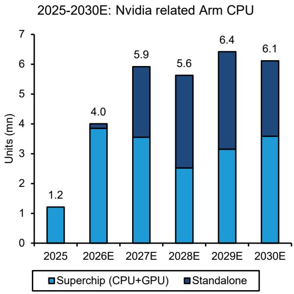

stacked bar chart

2025-2030E: Nvidia related Arm CPU
| Year | Superchip (CPU+GPU) (mn) | Standalone (mn) |
| :--- | :--- | :--- |
| 2025 | 1.2 | 0 |
| 2026E | 4.0 | 0.1 |
| 2027E | 3.5 | 3.1 |
| 2028E | 2.5 | 4.1 |
| 2029E | 3.1 | 4.4 |
| 2030E | 3.5 | 3.1 |

Source: Company disclosures, Bernstein estimates and analysis.

For hyperscaler in-house CPUs, such as AWS Graviton and Google Axion, we model it as a function of server unit assumptions as well as ODM-direct server exposures, and applying Arm penetration within the CSP server base. In our model, we assume Arm penetration to grow from 25% in CY25 to 36% in CY30 (Exhibit 18).

Including other / merchant Arm CPUs including Arm's own AGI CPU, our bottom up TAM estimates for 2030 closely matches the top-down \$123bn, of which in Nvidia related demand comprises \$58bn, CSP ASIC portion \$39bn, Arm AGI CPU \$22bn (Exhibit 19), with the majority still being Nvidia / CSP-related custom chip demand.

EXHIBIT 18: We expect a stable increase in Arm's share within CSP CPUs, reaching 36% in 2030.  
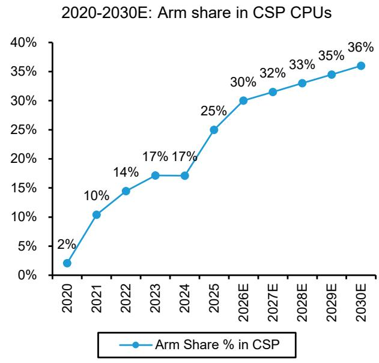

line chart

2020-2030E: Arm share in CSP CPUs
| Year | Arm Share % in CSP (%) |
| :--- | :--- |
| 2020 | 2 |
| 2021 | 10 |
| 2022 | 14 |
| 2023 | 17 |
| 2024 | 17 |
| 2025 | 25 |
| 2026E | 30 |
| 2027E | 32 |
| 2028E | 33 |
| 2029E | 35 |
| 2030E | 36 |

Source: Company disclosures, Mercury, IDC, Bernstein estimates and analysis.

EXHIBIT 19: Within the estimated 2030 TAM of \$123bn, Nvidia / CSP demand comprises the majority.  
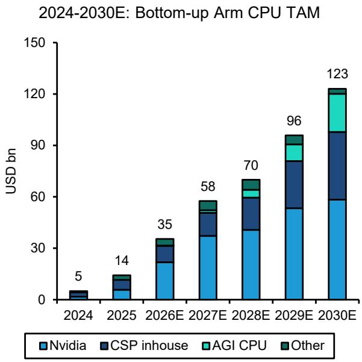

stacked bar chart

| Year   | Nvidia | CSP inhouse | AGI CPU | Other |
| ------ | ------ | ----------- | ------- | ----- |
| 2024   | 5      | 1           | 0       | 0     |
| 2025   | 14     | 5           | 0       | 0     |
| 2026E  | 35     | 10          | 0       | 0     |
| 2027E  | 58     | 15          | 0       | 0     |
| 2028E  | 70     | 20          | 5       | 0     |
| 2029E  | 96     | 30          | 10      | 5     |
| 2030E  | 123    | 40          | 20      | 5     |

Source: Company disclosures, Bernstein estimates and analysis.

## ARM'S ROYALTY IN SERVER CPUS

## Royalty increase in Arm server CPUs driven by core count and increased royalty rate

Even before the AGI CPU contribution, Arm's cloud CPU royalty model is already becoming materially more attractive. Arm said in its Q3 2026 earnings that cloud AI / general-purpose data-center royalty revenue grew more than $100\%$ YoY, Neoverse deployments surpassed 1bn cores, and Arm's share among top hyperscalers was expected to approach $50\%$ .

The first driver is that core counts are rising fast (Exhibit 20). AWS Graviton 5 now has 192 cores, up 2x versus Graviton 4; NVIDIA Vera has 88 Arm-based cores versus 72 for Grace; and Microsoft's Cobalt 200 has 132 cores. At Arm Everywhere event, management indicated that the next wave of cloud CPUs could move into the 200-300 core range and, in some cases, toward 500 cores over time.

We think the underlying reason is the same one driving the AGI CPU opportunity: the workload mix is changing. Agentic and always-on inference shifts more of the bottleneck toward orchestration, memory handling and coordination work, which in turn increases the need for higher core count, power-efficient CPUs in AI clusters. Arm themselves said the shift toward agent-based inference is redefining AI data-center designs and raising demand for CPU chips with even more power-efficient cores.

EXHIBIT 20: Core count for server-side CPUs is increasing.  
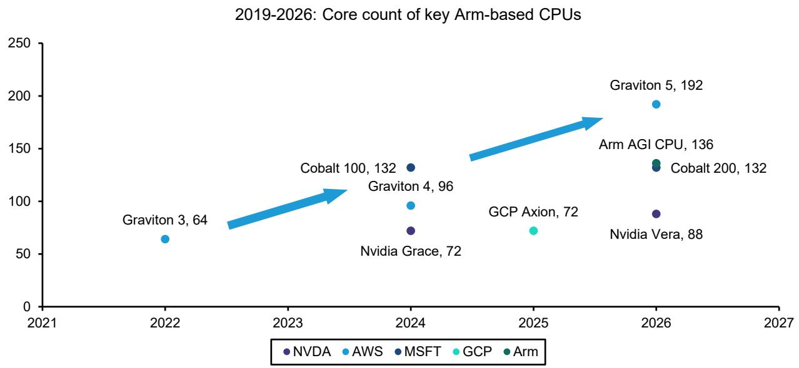

scatterplot

2019-2026: Core count of key Arm-based CPUs
| CPU Name | Year | Core Count |
| :--- | :--- | :--- |
| Graviton 3 | 2022 | 64 |
| Cobalt 100 | 2024 | 132 |
| Graviton 4 | 2024 | 96 |
| Nvidia Grace | 2024 | 72 |
| GCP Axion | 2025 | 72 |
| Nvidia Vera | 2026 | 88 |
| Graviton 5 | 2026 | 192 |
| Arm AGI CPU | 2026 | 136 |
| Cobalt 200 | 2026 | 132 |

Source: Company disclosures, Bernstein analysis.

The second driver is higher royalty per core. Currently, Arm's licensees pay roughly \$0.50/core for first-generation v9 server CPUs, around \$1/core for first-generation CSS (Compute Subsystem), and potentially \$1.50/core for later CSS generations, with more upside in future generations. In other words, Arm is not only getting paid on more cores, but on more valuable cores, and CSS is central to that step-up.

Arm describes CSS as pre-integrated, pre-validated, performance-validated subsystem products that help partners reach production silicon faster. In other words, CSS sits above the core level: it wraps CPU cores with coherent interconnect, MMU/NOC system IP, memory channels, and I/O so a chip company does not have to assemble the whole server platform from scratch.

The company has said CSS adoption is a major tailwind to royalty growth, and customers can save substantial engineering effort and accelerate time-to-market by up to roughly a year. Arm also says CSS customers have reported getting from kickoff to working silicon in 13 months and saving 80 engineering years by offloading non-differentiated design and validation work. That higher value proposition is what allows Arm to charge materially higher royalties than for core IP alone.

CSS includes more than Neoverse cores alone, bundling the cores with CMN mesh, system IP, system management, power management, software, and development tools needed to bring a platform to market quickly. Arm positions this as the fastest path to production silicon for cloud, AI, 5G, and networking chips because partners can focus on customization instead of rebuilding the common infrastructure around the cores.

The cadence of product refreshes also matters. Management's notes suggest server CPUs used to refresh every two to three years, but increasingly move on an annual cadence, which in practice makes CSS more valuable because customers need faster turn times to stay on the latest node and architecture. That dynamic should support both more frequent licensing activity and a faster mix shift toward higher-royalty generations.

In cloud specifically, the early evidence of that shift is already visible. Microsoft's Cobalt family is explicitly built on Neoverse CSS. Company also mentioned that CSS should exceed 10% of cloud AI royalty by FY27, and rise above 30% by FY29 and exceed 50% by FY31. If that progression is broadly right, the royalty mix should keep skewing toward higher-value server designs over the next several years.

In conclusion, we see strong growth in Arm's server royalty revenue (Exhibit 22), reaching \$1.8bn in FY31 from \~\$135mn in FY25, driven by the increasing core count as well as higher per-core royalty rate, resulting in as structural server CPU royalty growth even before giving Arm any credit for its own AGI CPU silicon revenue.

EXHIBIT 21: We expect per-chip royalty to drop in FY26-FY27 due to Grace / Vera, but expect strong growth going forward due to increase in royalty rate.  
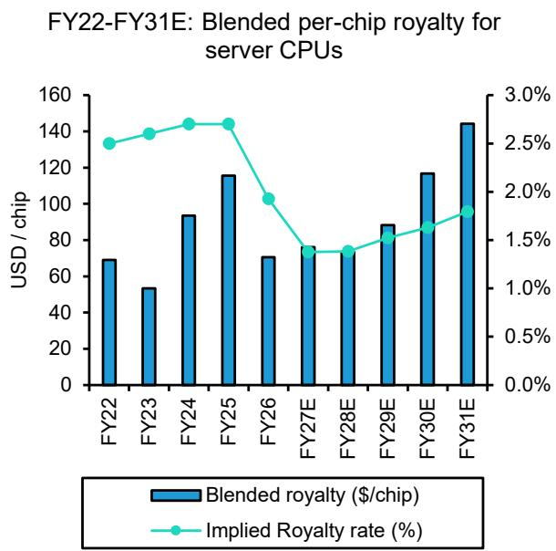

bar-line hybrid chart

FY22-FY31E: Blended per-chip royalty for server CPUs
| Fiscal Year | Blended royalty ($/chip) | Implied Royalty rate (%) |
| :--- | :--- | :--- |
| FY22 | 69 | 2.4 |
| FY23 | 53 | 2.5 |
| FY24 | 93 | 2.6 |
| FY25 | 116 | 2.7 |
| FY26 | 70 | 1.8 |
| FY27E | 75 | 1.4 |
| FY28E | 73 | 1.4 |
| FY29E | 88 | 1.5 |
| FY30E | 117 | 1.6 |
| FY31E | 144 | 1.8 |

Source: Company disclosures, IDC, Mercury, Bernstein estimates and analysis.

EXHIBIT 22: We expect a strong growth in cloud royalty revenue.  
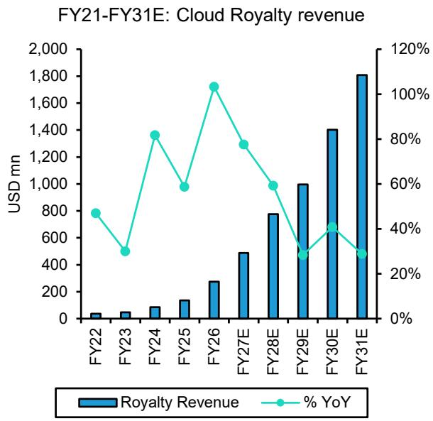

bar-line hybrid

FY21-FY31E: Cloud Royalty revenue
| Fiscal Year | Royalty Revenue (USD mn) | % YoY (%) |
| :--- | :--- | :--- |
| FY22 | 40 | 50 |
| FY23 | 60 | 30 |
| FY24 | 90 | 85 |
| FY25 | 140 | 50 |
| FY26 | 280 | 105 |
| FY27E | 490 | 75 |
| FY28E | 780 | 60 |
| FY29E | 1000 | 30 |
| FY30E | 1420 | 45 |
| FY31E | 1820 | 30 |

Source: Company disclosures, Bernstein estimates and analysis.

## FINANCIALS AND VALUATION CHANGE

Exhibit 23 summarizes our estimate changes. We keep our estimates for all the segments other than server CPUs.

In terms of valuation, Arm has rerated significantly over the past month, and Arm's current share price now implies 174x multiple on 1-year forward P/E, which is near +5 $\sigma$ of historical trading range (Exhibit 24). As such, we believe it to be more sensible to value Arm on FY31E financials, when the Arm AGI CPU business is expected to normalize to some degree. CY2030 is also where most of the discussion on CPU TAM anchors on including Arm's TAM estimates as well as our own.

Therefore, we shift the valuation anchor from our usual Q5-Q8 EPS framework to FY31E EPS, as the market debate is increasingly centred on the company's FY31 opportunities. We value the IP businesses at 70x and silicon businesses at 40x (30x prior, raised in expectation of acceleration in CPU market growth) respectively, blend the multiples by net income contribution to derive a 54.5x FY31E P/E, and discount that back 2.75 years at a 10% WACC to reconcile the anchor year with our usual 24-month forward valuation horizon.

## Put simply, we use the equivalent multiple of 42x on FY31 EPS of \$11.86 to derive the PT of \$500 (Exhibit 28) and reiterate Outperform.

Within this valuation framework, we believe two of the biggest swing factor for Arm would be how much the total AI capex spending would be, as well as how much market share Arm silicon is able to take. Our sensitivity analyses (Exhibit 26, Exhibit 27) suggest an FY31E EPS range of \$9-\$16, and a valuation range of \$379-\$677.

EXHIBIT 23: Arm: Summary of estimate changes

<table><tr><td>Arm: change in estimates</td><td>FY26/3</td><td>1Q27E</td><td>2Q27E</td><td>3Q27E</td><td>4Q27E</td><td>FY27/3E</td><td>FY28/3E</td><td>FY29/3E</td></tr><tr><td colspan="9">Revenue (USD mn)</td></tr><tr><td>Bernstein - Old</td><td>4,920.0</td><td>1,282.7</td><td>1,353.2</td><td>1,609.4</td><td>1,934.1</td><td>6,179.5</td><td>8,180.8</td><td>10,352.2</td></tr><tr><td>Growth YoY</td><td>22.8%</td><td>21.8%</td><td>19.2%</td><td>29.6%</td><td>29.8%</td><td>25.6%</td><td>32.4%</td><td>26.5%</td></tr><tr><td>Bernstein - New</td><td>4,920.0</td><td>1,275.6</td><td>1,353.0</td><td>1,609.5</td><td>1,908.6</td><td>6,146.7</td><td>8,636.6</td><td>12,743.8</td></tr><tr><td>Growth YoY</td><td>22.8%</td><td>21.1%</td><td>19.2%</td><td>29.6%</td><td>28.1%</td><td>24.9%</td><td>40.5%</td><td>47.6%</td></tr><tr><td>Consensus</td><td></td><td>1,264.3</td><td>1,351.2</td><td>1,527.2</td><td>1,860.3</td><td>6,007.1</td><td>7,931.9</td><td>10,163.9</td></tr><tr><td>Growth YoY</td><td></td><td>20.1%</td><td>19.0%</td><td>23.0%</td><td>24.9%</td><td>22.1%</td><td>32.0%</td><td>28.1%</td></tr><tr><td>New vs. old</td><td></td><td>-0.6%</td><td>0.0%</td><td>0.0%</td><td>-1.3%</td><td>-0.5%</td><td>5.6%</td><td>23.1%</td></tr><tr><td>Bernstein vs. consensus</td><td></td><td>0.9%</td><td>0.1%</td><td>5.4%</td><td>2.6%</td><td>2.3%</td><td>8.9%</td><td>25.4%</td></tr><tr><td colspan="9">Operating profit (USD mn)</td></tr><tr><td>Bernstein - Old</td><td>2,115.0</td><td>497.6</td><td>535.3</td><td>717.5</td><td>991.3</td><td>2,741.6</td><td>3,794.3</td><td>4,837.1</td></tr><tr><td>Growth YoY</td><td>13.0%</td><td>358.7%</td><td>371.3%</td><td>393.2%</td><td>581.5%</td><td>29.6%</td><td>38.4%</td><td>27.5%</td></tr><tr><td>Margin</td><td>43.0%</td><td>38.8%</td><td>39.6%</td><td>44.6%</td><td>51.3%</td><td>44.4%</td><td>46.4%</td><td>46.7%</td></tr><tr><td>Bernstein - New</td><td>2,115.0</td><td>490.6</td><td>535.1</td><td>717.6</td><td>966.2</td><td>2,709.5</td><td>3,894.1</td><td>5,611.8</td></tr><tr><td>Growth YoY</td><td>13.0%</td><td>352.2%</td><td>371.1%</td><td>368.7%</td><td>531.0%</td><td>28.1%</td><td>43.7%</td><td>44.1%</td></tr><tr><td>Margin</td><td>43.0%</td><td>38.5%</td><td>39.5%</td><td>44.6%</td><td>50.6%</td><td>44.1%</td><td>45.1%</td><td>44.0%</td></tr><tr><td>Consensus</td><td></td><td>480.4</td><td>537.0</td><td>672.9</td><td>940.1</td><td>2,550.6</td><td>3,473.6</td><td>4,567.6</td></tr><tr><td>Growth YoY</td><td></td><td>287.5%</td><td>395.0%</td><td>492.5%</td><td>514.0%</td><td>20.6%</td><td>36.2%</td><td>31.5%</td></tr><tr><td>Margin</td><td></td><td>38.0%</td><td>39.7%</td><td>44.1%</td><td>50.5%</td><td>42.5%</td><td>43.8%</td><td>44.9%</td></tr><tr><td>New vs. old</td><td></td><td>-1.4%</td><td>0.0%</td><td>0.0%</td><td>-2.5%</td><td>-1.2%</td><td>2.6%</td><td>16.0%</td></tr><tr><td>Bernstein vs. consensus</td><td></td><td>2.1%</td><td>-0.4%</td><td>6.6%</td><td>2.8%</td><td>6.2%</td><td>12.1%</td><td>22.9%</td></tr><tr><td colspan="9">EPS (USD)</td></tr><tr><td>Bernstein - Old</td><td>1.77</td><td>0.42</td><td>0.45</td><td>0.60</td><td>0.82</td><td>2.28</td><td>3.12</td><td>3.94</td></tr><tr><td>Growth YoY</td><td>8.6%</td><td>6.7%</td><td>4.0%</td><td>-0.7%</td><td>-53.8%</td><td>28.7%</td><td>37.1%</td><td>26.3%</td></tr><tr><td>Bernstein - New</td><td>1.77</td><td>0.41</td><td>0.45</td><td>0.60</td><td>0.80</td><td>2.25</td><td>3.21</td><td>4.58</td></tr><tr><td>Growth YoY</td><td>8.6%</td><td>5.3%</td><td>4.0%</td><td>-0.6%</td><td>-54.9%</td><td>27.2%</td><td>42.5%</td><td>42.9%</td></tr><tr><td>Consensus</td><td></td><td>0.40</td><td>0.45</td><td>0.55</td><td>0.78</td><td>2.20</td><td>3.03</td><td>3.85</td></tr><tr><td>Growth YoY</td><td></td><td>15.4%</td><td>14.1%</td><td>28.8%</td><td>29.8%</td><td>24.4%</td><td>37.7%</td><td>27.0%</td></tr><tr><td>New vs. old</td><td></td><td>-1.4%</td><td>0.0%</td><td>0.0%</td><td>-2.5%</td><td>-1.1%</td><td>2.7%</td><td>16.3%</td></tr><tr><td>Bernstein vs. consensus</td><td></td><td>1.7%</td><td>0.5%</td><td>7.6%</td><td>2.5%</td><td>2.2%</td><td>5.8%</td><td>19.0%</td></tr></table>

Source: Company disclosures, Bloomberg, Bernstein estimates and analysis.

EXHIBIT 24: Arm has rerated significantly over the past month, and is currently valued at +5SD of historical range, on a 1-year forward P/E basis.  
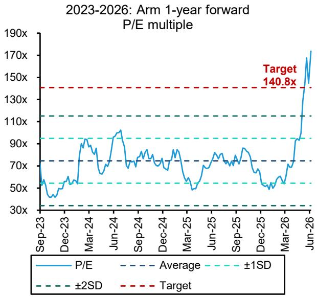

line chart

| Date    | P/E Multiple |
|---------|--------------|
| Jun-26  | 140.8x       |

Source: Bloomberg, Bernstein analysis and estimates

EXHIBIT 25: As such, we feel it's more sensible to value Arm on FY31E EPS, on which the company anchors their projection. On FY31E EPS, the stock currently trades at 44x, close to +3SD of YTD range.  
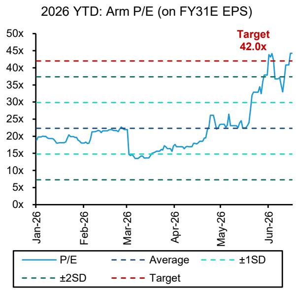

line chart

| Date   | P/E  |
|--------|------|
| Jun-26 | 42.0x |

Source: Bloomberg, Bernstein analysis.

EXHIBIT 26: Our sensitivity analysis implies FYE31 EPS range of \$9.0-\$16.1.  
Sensitivity analysis - Arm EPS

<table><tr><td rowspan="2" colspan="2"></td><td colspan="5">CY30 Server CPU TAM (USD bn)</td></tr><tr><td>122.5</td><td>173.7</td><td>223.4</td><td>295.1</td><td>330.2</td></tr><tr><td rowspan="5">Arm Silicon Market Share</td><td rowspan="2">(USD)</td><td>5.0%</td><td>6.9</td><td>7.9</td><td>8.8</td><td>10.1</td></tr><tr><td>7.5%</td><td>7.7</td><td>9.0</td><td>10.3</td><td>12.1</td></tr><tr><td>10.0%</td><td>8.6</td><td>10.2</td><td>11.8</td><td>14.1</td><td>15.3</td></tr><tr><td>12.5%</td><td>9.4</td><td>11.4</td><td>13.3</td><td>16.1</td><td>17.5</td></tr><tr><td>15.0%</td><td>10.2</td><td>12.6</td><td>14.9</td><td>18.2</td><td>19.8</td></tr></table>

Source: Company disclosures, Bernstein estimates and analysis.

EXHIBIT 27: Our sensitivity analysis implies a valuation range of \$379-\$677 as a result.  
Sensitivity analysis - Arm Valuation

<table><tr><td rowspan="2" colspan="2"></td><td colspan="5">CY30 Server CPU TAM (USD bn)</td></tr><tr><td>(USD)</td><td>122.5</td><td>173.7</td><td>223.4</td><td>295.1</td></tr><tr><td rowspan="5">Arm Silicon Market Share</td><td>5%</td><td>290</td><td>330</td><td>368</td><td>424</td><td>452</td></tr><tr><td>8%</td><td>324</td><td>379</td><td>432</td><td>509</td><td>546</td></tr><tr><td>10%</td><td>359</td><td>429</td><td>496</td><td>593</td><td>640</td></tr><tr><td>13%</td><td>394</td><td>478</td><td>560</td><td>677</td><td>734</td></tr><tr><td>15%</td><td>429</td><td>528</td><td>623</td><td>761</td><td>828</td></tr></table>

Source: Company disclosures, Bernstein estimates and analysis.

EXHIBIT 28: Taking the blended average of P/E multiple for the two segments yields an implied target P/E of 42x, and a target price of \$500.

<table><tr><td>FY31E Financials</td><td>IP / CSS</td><td>Arm Silicon</td></tr><tr><td>Segment OP</td><td>7,209</td><td>7,733</td></tr><tr><td>PF Net Income (USD mn)</td><td>6,128</td><td>6,573</td></tr><tr><td>1-year Forward P/E</td><td>70x</td><td>40x</td></tr><tr><td>PF Market Cap (USD mn)</td><td>428,941</td><td>262,934</td></tr><tr><td>Arm PF Market Cap</td><td></td><td>691,874</td></tr><tr><td>Arm PF Net Income (USD mn)</td><td></td><td>12,701</td></tr><tr><td>PF Blended Fwd P/E (FY31E)</td><td></td><td>54.5x</td></tr><tr><td>Discount Factor (2.75y, WACC=10%)</td><td></td><td>1.30</td></tr><tr><td>Implied P/E (Discounted to 2y Fwd)</td><td></td><td>41.9x</td></tr><tr><td>Arm EPS (SCBe)</td><td></td><td>$11.86</td></tr><tr><td>Target Price</td><td></td><td>$500</td></tr></table>

Source: Company disclosures, Bernstein estimates and analysis.

## SOFTBANK: AN INDIRECT BENEFICIARY OF AGENTIC AI CPU

Following the uplift to our forecasts and price target for Arm, we correspondingly raise our estimates for SoftBank's NAV, given Arm remains one of its largest consolidated subsidiaries. Excluding Arm and share price movements in SoftBank's listed equity holdings, we keep the rest of our SoftBank forecasts unchanged (Exhibit 29, Exhibit 30). Reflecting the higher NAV, we raise our price target to ¥11,200 (vs. ¥8,200 previously), based on a 30% NAV discount. We reiterate our Outperform rating on the stock.

EXHIBIT 29: SoftBank: Summary of estimate changes

<table><tr><td>SoftBank: summary of estimate changes</td><td>FY26/3</td><td>1Q27/3E</td><td>2Q27/3E</td><td>3Q27/3E</td><td>4Q27/3E</td><td>FY27/3E</td><td>FY28/3E</td><td>FY29/3E</td></tr><tr><td colspan="9">Revenue (JPY bn)</td></tr><tr><td>Bernstein - Old</td><td>7,798.7</td><td>1,947.1</td><td>2,055.0</td><td>2,156.0</td><td>2,261.4</td><td>8,419.5</td><td>9,054.1</td><td>9,369.3</td></tr><tr><td>Growth YoY</td><td>7.7%</td><td>7.0%</td><td>7.2%</td><td>8.8%</td><td>8.8%</td><td>8.0%</td><td>7.5%</td><td>3.5%</td></tr><tr><td>Bernstein - New</td><td>7,798.7</td><td>1,961.0</td><td>2,068.8</td><td>2,169.5</td><td>2,274.1</td><td>8,473.5</td><td>9,178.3</td><td>10,060.9</td></tr><tr><td>Growth YoY</td><td>7.7%</td><td>7.7%</td><td>7.9%</td><td>9.4%</td><td>9.4%</td><td>8.7%</td><td>8.3%</td><td>9.6%</td></tr><tr><td>Consensus</td><td></td><td>1,970.2</td><td>2,014.9</td><td>2,133.6</td><td>2,259.1</td><td>8,319.0</td><td>8,857.7</td><td>9,504.9</td></tr><tr><td>Growth YoY</td><td></td><td>8.2%</td><td>5.1%</td><td>7.6%</td><td>8.6%</td><td>6.7%</td><td>6.5%</td><td>7.3%</td></tr><tr><td>New vs. old</td><td></td><td>0.7%</td><td>0.7%</td><td>0.6%</td><td>0.6%</td><td>0.6%</td><td>1.4%</td><td>7.4%</td></tr><tr><td>Bernstein vs. consensus</td><td></td><td>-0.5%</td><td>2.7%</td><td>1.7%</td><td>0.7%</td><td>1.9%</td><td>3.6%</td><td>5.8%</td></tr><tr><td colspan="9">Pretax profit (JPY bn)</td></tr><tr><td>Bernstein - Old</td><td>6,134.9</td><td>985.3</td><td>341.3</td><td>352.5</td><td>326.2</td><td>2,012.5</td><td>1,220.6</td><td>1,447.9</td></tr><tr><td>Growth YoY</td><td>259.9%</td><td>42.8%</td><td>-88.6%</td><td>-27.0%</td><td>-83.4%</td><td>-67.2%</td><td>-39.3%</td><td>18.6%</td></tr><tr><td>Margin</td><td>78.7%</td><td>50.6%</td><td>16.6%</td><td>16.4%</td><td>14.4%</td><td>23.9%</td><td>13.5%</td><td>15.5%</td></tr><tr><td>Bernstein - New</td><td>6,134.9</td><td>1,085.3</td><td>394.3</td><td>405.5</td><td>381.9</td><td>2,261.9</td><td>1,273.9</td><td>1,647.2</td></tr><tr><td>Growth YoY</td><td>259.9%</td><td>57.3%</td><td>-86.8%</td><td>-16.0%</td><td>-80.6%</td><td>-63.1%</td><td>-43.7%</td><td>29.3%</td></tr><tr><td>Margin</td><td>78.7%</td><td>55.3%</td><td>19.1%</td><td>18.7%</td><td>16.8%</td><td>26.7%</td><td>13.9%</td><td>16.4%</td></tr><tr><td>Consensus</td><td></td><td>456.9</td><td>227.6</td><td>376.9</td><td>132.6</td><td>1,247.7</td><td>1,099.0</td><td>1,214.7</td></tr><tr><td>Growth YoY</td><td></td><td>-33.8%</td><td>-92.4%</td><td>-21.9%</td><td>-93.3%</td><td>-79.7%</td><td>-11.9%</td><td>10.5%</td></tr><tr><td>Margin</td><td></td><td>23.2%</td><td>11.3%</td><td>17.7%</td><td>5.9%</td><td>15.0%</td><td>12.4%</td><td>12.8%</td></tr><tr><td>New vs. old</td><td></td><td>10.1%</td><td>15.5%</td><td>15.0%</td><td>17.1%</td><td>12.4%</td><td>4.4%</td><td>13.8%</td></tr><tr><td>Bernstein vs. consensus</td><td></td><td>137.5%</td><td>73.2%</td><td>7.6%</td><td>188.0%</td><td>81.3%</td><td>15.9%</td><td>35.6%</td></tr><tr><td colspan="9">EPS (JPY)</td></tr><tr><td>Bernstein - Old</td><td>872.5</td><td>122.5</td><td>43.2</td><td>44.6</td><td>40.0</td><td>251.3</td><td>152.4</td><td>180.8</td></tr><tr><td>Growth YoY</td><td>349.8%</td><td>68.3%</td><td>-90.1%</td><td>6.1%</td><td>-87.5%</td><td>-71.2%</td><td>-39.4%</td><td>18.6%</td></tr><tr><td>Bernstein - New</td><td>872.5</td><td>135.4</td><td>49.1</td><td>50.5</td><td>47.5</td><td>282.5</td><td>159.1</td><td>205.7</td></tr><tr><td>Growth YoY</td><td>349.8%</td><td>85.9%</td><td>-88.8%</td><td>19.9%</td><td>-85.1%</td><td>-67.6%</td><td>-43.7%</td><td>29.3%</td></tr><tr><td>Consensus</td><td></td><td>36.2</td><td>14.0</td><td>32.1</td><td>16.7</td><td>131.4</td><td>101.6</td><td>102.4</td></tr><tr><td>Growth YoY</td><td></td><td>-50.3%</td><td>-96.8%</td><td>-23.7%</td><td>-94.8%</td><td>-84.9%</td><td>-22.7%</td><td>0.8%</td></tr><tr><td>New vs. old</td><td></td><td>10.5%</td><td>13.5%</td><td>13.1%</td><td>18.9%</td><td>12.4%</td><td>4.4%</td><td>13.8%</td></tr><tr><td>Bernstein vs. consensus</td><td></td><td>273.9%</td><td>251.4%</td><td>57.2%</td><td>184.7%</td><td>115.0%</td><td>56.6%</td><td>100.9%</td></tr></table>

Source: Company disclosures, Bloomberg, Bernstein estimates and analysis.

EXHIBIT 30: SoftBank Valuation: Scenario Analysis

<table><tr><td colspan="3">Softbank&#x27;s 1-year NAV to valuation (USDbn)</td></tr><tr><td></td><td>Pro Forma</td><td>Current</td></tr><tr><td>Arm per share value (USD)</td><td>500.00</td><td>412.55</td></tr><tr><td>Share Count (mn)</td><td>1,052</td><td>1,052</td></tr><tr><td>Market cap (USD bn)</td><td>526,000</td><td>434,003</td></tr><tr><td>% holding</td><td>86.9%</td><td>86.9%</td></tr><tr><td>OpenAI Valuation (USD bn)</td><td>852</td><td>852</td></tr><tr><td>% holding</td><td>10.7%</td><td>10.7%</td></tr><tr><td colspan="3">Future NAV (USD bn)</td></tr><tr><td>Arm</td><td>457.0</td><td>377.1</td></tr><tr><td>OpenAI</td><td>91.6</td><td>91.6</td></tr><tr><td>Others</td><td>23.7</td><td>23.7</td></tr><tr><td>Total</td><td>572.3</td><td>492.3</td></tr><tr><td>Total (JPY tn)</td><td>91.1</td><td>78.4</td></tr><tr><td>Discount</td><td>30%</td><td>48%</td></tr><tr><td>Share Count (mn)</td><td>5,699</td><td>5,699</td></tr><tr><td>Target Price (JPY)</td><td>11,200</td><td>n.a.</td></tr><tr><td>Current Price (JPY)</td><td>7,102</td><td>7,102</td></tr><tr><td>Upside/Downside</td><td>58%</td><td>n.a.</td></tr></table>

SoftBank's share price as of 16th June 2026; Arm's share price as of $15^{\text{th}}$ June 2026.  
Source: Company disclosures, Bloomberg, Bernstein estimates and analysis.

## X86 WILL ALSO ENJOY THE TAILWIND FROM AGENTIC AI SERVER CPU WORKLOAD

Intel and AMD are currently benefitting from incredibly strong server demand, a function of both cyclical recovery following several years of post-COVID shortfalls as well as (more recent) a sharp upward revision in demand related to agentic AI requirements (Exhibit 31) with both Intel and AMD benefitting.

We note the company's response (or even awareness) of the potential for agentic AI to drive CPU demand differed. Intel appeared caught significantly off-guard (they were in fact selling off supposedly “excess” tooling last July on the belief that demand would remain subdued, and were surprised at the end of last year where they had to scramble (suffering shortfalls in Q1 though they are in the process of correcting their mistake now). AMD was more proactive in securing capacity, and their sequential x86 share gains accelerated in Q1 as Intel found themselves constrained (Exhibit 32). However, Intel also benefited from the demand environment, that was so strong in fact that they managed to sell previously-written-off parts they had (presumably) trashed, but which still found homes as customers proved willing to buy up anything they could get their hands on.

At their analyst day in November AMD laid out expectations for a \~\$60B CPU TAM by 2030 on the rise of agentic AI. Clearly the pace and trajectory of the ramp surprised them as well though as they doubled the number in May on their Q126 earnings call to \$120B. And the company is also benefitting not only from the demand environment but also their competitive positioning as they continue to take share given their superior product portfolio (Intel hopes to close the gap in a few years on the launch of Coral Rapids, but admits that their current offerings leave something to be desired).

We update numbers and price targets for AMD and Intel today. Both companies should benefit from stronger (and more sustained) server demand, though AMD's products remain superior for now (and we believe they will continue their share gain trajectory). Changes to our estimates can be found in Exhibit 33 (AMD) and Exhibit 34 (Intel). Our existing AMD model was already consistent with a stronger server CPU environment and estimates move marginally, however we are now bringing our INTC model inline with those assumptions and are raising estimates more materially; we also roll valuation horizon forward for both to CY27/28 avg (vs CY27 prior) given we are about halfway through the year. Our AMD PT moves to \$600; INTC to \$100. We rate AMD OP, INTC MP.

EXHIBIT 31: Agentic AI has driven a sharp upward revision in x86 server CPU growth this year  
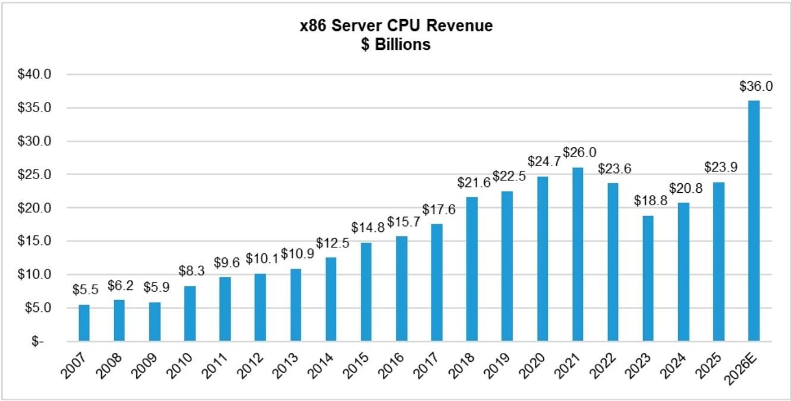

bar chart

x86 Server CPU Revenue
| Year | Revenue ($ Billions) |
| :--- | :--- |
| 2007 | 5.5 |
| 2008 | 6.2 |
| 2009 | 5.9 |
| 2010 | 8.3 |
| 2011 | 9.6 |
| 2012 | 10.1 |
| 2013 | 10.9 |
| 2014 | 12.5 |
| 2015 | 14.8 |
| 2016 | 15.7 |
| 2017 | 17.6 |
| 2018 | 21.6 |
| 2019 | 22.5 |
| 2020 | 24.7 |
| 2021 | 26.0 |
| 2022 | 23.6 |
| 2023 | 18.8 |
| 2024 | 20.8 |
| 2025 | 23.9 |
| 2026E | 36.0 |

Source: Mercury Research, Bernstein estimates and analysis

EXHIBIT 32: AMD's x86 share gains accelerated in Q1 as Intel found themselves constrained  
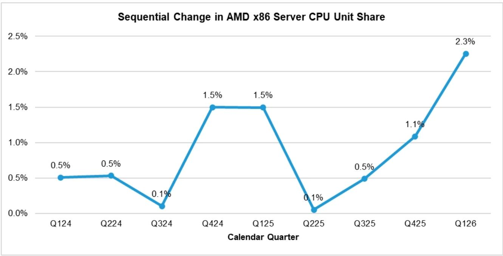

line chart

| Calendar Quarter | Sequential Change in AMD x86 Server CPU Unit Share |
| ---------------- | ------------------------------------------------- |
| Q124             | 0.5%                                              |
| Q224             | 0.5%                                              |
| Q324             | 0.1%                                              |
| Q424             | 1.5%                                              |
| Q125             | 1.5%                                              |
| Q225             | 0.1%                                              |
| Q325             | 0.5%                                              |
| Q425             | 1.1%                                              |
| Q126             | 2.3%                                              |

Source: Mercury Research, Bernstein analysis

EXHIBIT 33: AMD - Bernstein annual changes to estimates

<table><tr><td rowspan="2">Year</td><td colspan="3">2026E</td><td colspan="3">2027E</td><td colspan="3">2028E</td></tr><tr><td>New</td><td>Old</td><td>Change</td><td>New</td><td>Old</td><td>Change</td><td>New</td><td>Old</td><td>Change</td></tr><tr><td>Revenue</td><td>$47,944</td><td>$47,899</td><td>0.1%</td><td>$82,189</td><td>$82,206</td><td>0.0%</td><td>$107,210</td><td>$107,053</td><td>0.1%</td></tr><tr><td>Pro-Forma Gross Margin</td><td>55.6%</td><td>55.6%</td><td>5bps</td><td>54.9%</td><td>54.9%</td><td>5bps</td><td>56.2%</td><td>56.1%</td><td>6bps</td></tr><tr><td>Pro-Forma Opex</td><td>$13,495</td><td>$13,495</td><td>0.0%</td><td>$15,700</td><td>$15,700</td><td>0.0%</td><td>$17,450</td><td>$17,450</td><td>0.0%</td></tr><tr><td>Non-GAAP Operating Margin</td><td>27.5%</td><td>27.4%</td><td>7bps</td><td>35.8%</td><td>35.8%</td><td>4bps</td><td>39.9%</td><td>39.8%</td><td>9bps</td></tr><tr><td>Non-GAAP Diluted EPS</td><td>$6.98</td><td>$6.95</td><td>0.4%</td><td>$14.61</td><td>$14.60</td><td>0.1%</td><td>$19.53</td><td>$19.46</td><td>0.4%</td></tr></table>

Source: Bernstein estimates and analysis

EXHIBIT 34: Intel - Bernstein annual changes to estimates

<table><tr><td rowspan="2">Year</td><td colspan="3">2026E</td><td colspan="3">2027E</td><td colspan="3">2028E</td></tr><tr><td>New</td><td>Old</td><td>Change</td><td>New</td><td>Old</td><td>Change</td><td>New</td><td>Old</td><td>Change</td></tr><tr><td>Non-GAAP Revenue</td><td>$57,604</td><td>$57,249</td><td>0.6%</td><td>$63,339</td><td>$61,176</td><td>3.5%</td><td>$68,799</td><td>$64,944</td><td>5.9%</td></tr><tr><td>Pro-Forma Gross Margin</td><td>40.9%</td><td>40.9%</td><td>1bps</td><td>43.2%</td><td>43.3%</td><td>-8bps</td><td>44.7%</td><td>44.3%</td><td>37bps</td></tr><tr><td>Non-GAAP Opex</td><td>$16,502</td><td>$16,502</td><td>0.0%</td><td>$17,300</td><td>$17,300</td><td>0.0%</td><td>$17,800</td><td>$17,800</td><td>0.0%</td></tr><tr><td>Non-GAAP Operating Margin</td><td>12.2%</td><td>12.1%</td><td>19bps</td><td>15.9%</td><td>15.0%</td><td>89bps</td><td>18.8%</td><td>16.9%</td><td>191bps</td></tr><tr><td>Non-GAAP Diluted EPS</td><td>$1.07</td><td>$1.04</td><td>2.5%</td><td>$1.50</td><td>$1.35</td><td>11.2%</td><td>$1.96</td><td>$1.63</td><td>20.2%</td></tr></table>

Source: Bernstein estimates and analysis

## WHAT COULD GO WRONG?

Our projection above does not consider production capacity, but it is possible that capacity of TSMC and Intel, and to a lesser degree Samsung may be insufficient to support the projected growth. The capacity at TSMC is particularly critical, as most suppliers find TSMC their top choice given TSMC's leading technology, efficiency and execution. At the same time, nearly all GPU/accelerator suppliers are using TSMC for production too and they also find TSMC's capacity insufficient to fulfill their needs. TSMC and these customers together need to strike a balance between these needs, as AI needs both CPU and GPU/accelerator to grow.

Memory capacity can be another bottleneck. CPU needs to be paired with an adequate amount of memory to perform its functions, and so does GPU/accelerator too. Memory capacity hence can be another bottleneck that makes our projection above too high.

We are trying to answer both questions now and will update investors with any notable findings.

Another important but less known consideration is HBM is packaged together with GPU/accelerator. The cost of HBM is therefore part of the COGS of these chips. This cost is then “marked up” by NVIDIA, etc. so that these GPU/accelerator suppliers can command high margins, often as high as 60s to 70s% gross margin, on the entire packaged chip. For AI hyperscalers, the burden from this “markup” was smaller before, but is becoming much heavier quickly as memory price surge is propagating to HBM too. Hyperscalers hence will attempt to source HBM directly from memory suppliers to avoid this “markup”. Alchip and MediaTek are offering this business model in their ASIC business currently. They perform necessary qualification & test to ensure HBM sourced by hyperscalers is compatible with the rest of ASIC chips, and have proven this business model is technologically feasible. Should hyperscalers adopt this model broadly, HBM value will be removed and the size of GPU/accelerator will become smaller. Since our CPU projection above anchors on GPU/accelerator market size, the business model of hyperscalers sourcing HBM directly is a downside risk to our projection.

## CHINA X86 SERVER CPU MARKET DYNAMICS

## CHINA TAM VS GLOBAL TAM

China's share of global x86 server CPU TAM is entering a period of near-term compression before a structurally driven recovery over the medium term. Historically steady at \~30% during 2020–2024, we expect China's share will decline to a trough of \~21–23% in 2026–2027, as illustrated in Exhibit 35. We attribute this near-term compression primarily to structural constraints in China's AI server build-out. Limited access to AI chips, driven by export control on leading global GPUs as well as supply shortages of domestic alternatives due to foundry capacity constraints, has slowed the pace of AI infrastructure deployment in China. Moreover, China CSP capex expansion has been comparatively more moderate than US hyperscalers, which are aggressively investing in AI infrastructure, particularly rapid deployment of servers for agentic AI workloads. This dynamic is further amplified by global CPU vendors prioritizing supply allocation toward large US CSPs and AI labs, where demand visibility and monetization pathways are stronger, thereby boosting CPU attach rates for AMD and Intel in those markets. As a result, China's TAM growth lags that of the Rest of World in the early phase of the cycle (China +30.6% CAGR in 2025–2028 vs. RoW +34.8%), leading to a temporary demand share loss. However, we expect this dynamic to reverse in the outer years: as domestic AI chip supply improves and AI investment accelerates, China's TAM growth re-accelerates (+36.3% CAGR in 2028–2030 vs. RoW +26.6%), driving a recovery in share to \~27% by 2030. Overall, the chart highlights a near-term dislocation followed by a catch-up phase, with China remaining a meaningful contributor to global x86 server CPU demand over the medium term.

EXHIBIT 35: China's share of global x86 server CPU TAM is entering a period of near-term compression, before structurally recovery after 2027  
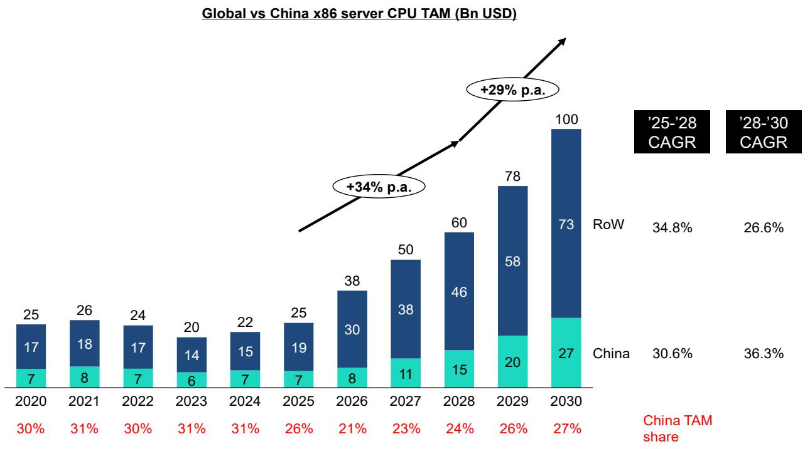

stacked bar chart

Global vs China x86 server CPU TAM (Bn USD)
| Year | Total Revenue (Bn USD) | China Revenue (Bn USD) | RoW (%) | China TAM Share (%) |
| :--- | :--- | :--- | :--- | :--- |
| 2020 | 25 | 7 | 17 | 30 |
| 2021 | 26 | 8 | 18 | 31 |
| 2022 | 24 | 7 | 17 | 30 |
| 2023 | 20 | 6 | 14 | 31 |
| 2024 | 22 | 7 | 15 | 31 |
| 2025 | 25 | 7 | 19 | 26 |
| 2026 | 38 | 8 | 30 | 21 |
| 2027 | 50 | 11 | 38 | 23 |
| 2028 | 60 | 15 | 46 | 24 |
| 2029 | 78 | 20 | 58 | 26 |
| 2030 | 100 | 27 | 73 | 27 |
'25-'28 CAGR
'28-'30 CAGR
China TAM share

Source: Gartner, Mercury, Bernstein analysis and estimates

## INCREASING LOCALIZATION SHARE

The China x86 server CPU market is undergoing a steady shift toward domestic substitution, with Hygon consistently gaining share and poised for further acceleration. Exhibit 36 shows Hygon's share has increased from LSD in the early 2020s to \~20% by 2026–2027, primarily driven by localization requirements from government and state-owned enterprise (SoE) customers. This policy-driven adoption has provided a stable foundation for domestic CPU penetration, even as overall China TAM growth remains constrained in the near term. Looking ahead, we expect Hygon's share gains to accelerate

meaningfully from 2028 onward, with domestic share rising to \~35% by 2029–2030. This inflection is underpinned by continued product improvements (e.g., performance and ecosystem compatibility) and, importantly, better interoperability with domestic AI accelerators, which should make Hygon platforms increasingly viable for cloud service providers (CSPs) beyond the traditional government/SoE customer base. At the same time, tight global supply conditions are likely to persist, with AMD and Intel prioritizing higher-value and more strategic US customers. This supply allocation dynamic further reinforces the opportunity for Hygon to expand its footprint in China, driving a structurally higher level of self-sufficiency in the domestic x86 server CPU market over the medium term.

EXHIBIT 36: Hygon has been consistently gaining share and poised for further acceleration after 2027  
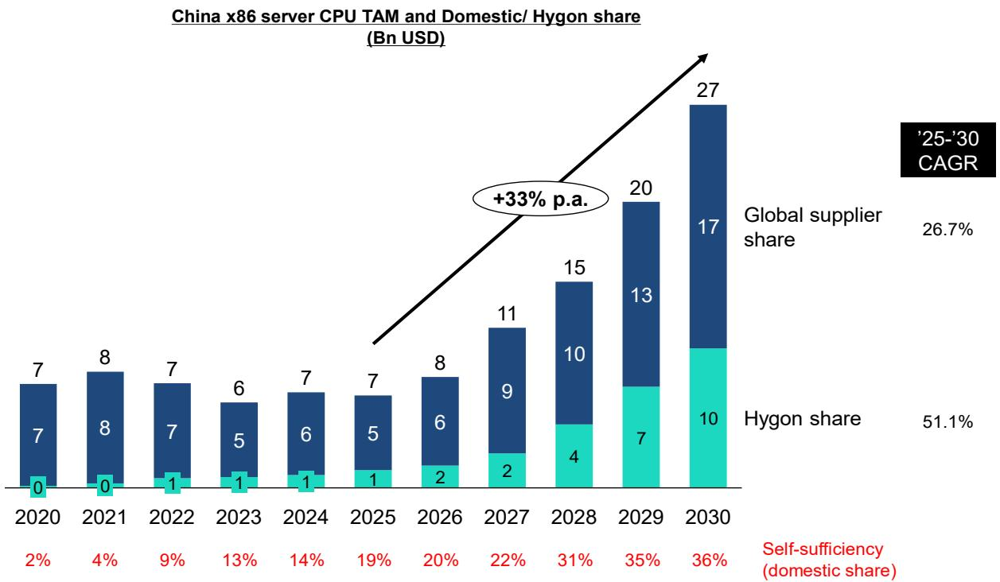

stacked bar chart

China x86 server CPU TAM and Domestic/ Hygon share (Bn USD)
| Year | Total Share (Bn USD) | Hygon Share (Bn USD) | Self-sufficiency (domestic share) (%) |
| :--- | :--- | :--- | :--- |
| 2020 | 7 | 0 | 2 |
| 2021 | 8 | 0 | 4 |
| 2022 | 7 | 1 | 9 |
| 2023 | 6 | 1 | 13 |
| 2024 | 7 | 1 | 14 |
| 2025 | 7 | 1 | 19 |
| 2026 | 8 | 2 | 20 |
| 2027 | 11 | 2 | 22 |
| 2028 | 15 | 4 | 31 |
| 2029 | 20 | 7 | 35 |
| 2030 | 27 | 10 | 36 |

| Year | Global supplier share (Bn USD) | Hygon share (Bn USD) |
| :--- | :--- | :--- |
| '25-'30 CAGR
Global supplier share: 26.7%
Self-sufficiency (domestic share): 36%

Source: Mercury, companies reports, Bernstein analysis and estimates

## APPENDIX - FINANCIAL FORECASTS

EXHIBIT 37: Arm: Income Statement

<table><tr><td>USD mn</td><td>FY26/3</td><td>1Q27E</td><td>2Q27E</td><td>3Q27E</td><td>4Q27E</td><td>FY27/3E</td><td>FY28/3E</td><td>FY29/3E</td><td>FY30/3E</td><td>FY31/3E</td></tr><tr><td>Revenue</td><td>4,920.0</td><td>1,275.6</td><td>1,353.0</td><td>1,609.5</td><td>1,908.6</td><td>6,146.7</td><td>8,636.6</td><td>12,743.8</td><td>19,285.2</td><td>33,186.7</td></tr><tr><td>Gross profit</td><td>4,832.0</td><td>1,252.3</td><td>1,327.9</td><td>1,579.3</td><td>1,830.0</td><td>5,989.6</td><td>7,603.4</td><td>10,131.7</td><td>14,032.1</td><td>22,439.5</td></tr><tr><td>SG&amp;A</td><td>806.0</td><td>218.3</td><td>215.2</td><td>245.6</td><td>280.3</td><td>959.4</td><td>1,133.3</td><td>1,492.4</td><td>1,940.1</td><td>2,719.9</td></tr><tr><td>R&amp;D</td><td>1,911.0</td><td>543.4</td><td>577.7</td><td>616.1</td><td>583.5</td><td>2,320.7</td><td>2,576.0</td><td>3,027.5</td><td>3,882.7</td><td>4,777.2</td></tr><tr><td>Other opex</td><td>0.0</td><td>0.0</td><td>0.0</td><td>0.0</td><td>0.0</td><td>0.0</td><td>0.0</td><td>0.0</td><td>0.0</td><td>0.0</td></tr><tr><td>Operating profit</td><td>2,115.0</td><td>490.6</td><td>535.1</td><td>717.6</td><td>966.2</td><td>2,709.5</td><td>3,894.1</td><td>5,611.8</td><td>8,209.3</td><td>14,942.4</td></tr><tr><td>D&amp;A</td><td>249.0</td><td>60.8</td><td>64.5</td><td>76.7</td><td>90.9</td><td>292.9</td><td>411.5</td><td>607.3</td><td>919.0</td><td>1,493.4</td></tr><tr><td>EBITDA</td><td>2,364.0</td><td>551.4</td><td>599.6</td><td>794.3</td><td>1,057.2</td><td>3,002.4</td><td>4,305.7</td><td>6,219.1</td><td>9,128.2</td><td>16,435.8</td></tr><tr><td>Non-OP income / (expense)</td><td>107.0</td><td>25.5</td><td>27.1</td><td>32.2</td><td>38.2</td><td>122.9</td><td>172.7</td><td>254.9</td><td>385.7</td><td>663.7</td></tr><tr><td>Pretax Income</td><td>2,222.0</td><td>516.1</td><td>562.1</td><td>749.8</td><td>1,004.4</td><td>2,832.4</td><td>4,066.8</td><td>5,866.7</td><td>8,595.0</td><td>15,606.2</td></tr><tr><td>Income tax expense</td><td>253.0</td><td>77.4</td><td>84.3</td><td>112.5</td><td>150.7</td><td>424.9</td><td>610.0</td><td>880.0</td><td>1,289.2</td><td>2,340.9</td></tr><tr><td>Net income before minority interest</td><td>1,889.0</td><td>438.7</td><td>477.8</td><td>637.3</td><td>853.7</td><td>2,407.5</td><td>3,456.8</td><td>4,986.7</td><td>7,305.7</td><td>13,265.2</td></tr><tr><td>Net Income</td><td>1,889.0</td><td>438.7</td><td>477.8</td><td>637.3</td><td>853.7</td><td>2,407.5</td><td>3,456.8</td><td>4,986.7</td><td>7,305.7</td><td>13,265.2</td></tr><tr><td>Diluted EPS (USD)</td><td>1.77</td><td>0.41</td><td>0.45</td><td>0.60</td><td>0.80</td><td>2.25</td><td>3.21</td><td>4.58</td><td>6.63</td><td>11.86</td></tr><tr><td colspan="11">Margins</td></tr><tr><td>Gross profit</td><td>98.2%</td><td>98.2%</td><td>98.1%</td><td>98.1%</td><td>95.9%</td><td>97.4%</td><td>88.0%</td><td>79.5%</td><td>72.8%</td><td>67.6%</td></tr><tr><td>Operating profit</td><td>43.0%</td><td>38.5%</td><td>39.5%</td><td>44.6%</td><td>50.6%</td><td>44.1%</td><td>45.1%</td><td>44.0%</td><td>42.6%</td><td>45.0%</td></tr><tr><td>EBITDA</td><td>48.0%</td><td>43.2%</td><td>44.3%</td><td>49.3%</td><td>55.4%</td><td>48.8%</td><td>49.9%</td><td>48.8%</td><td>47.3%</td><td>49.5%</td></tr><tr><td>Profit before tax</td><td>45.2%</td><td>40.5%</td><td>41.5%</td><td>46.6%</td><td>52.6%</td><td>46.1%</td><td>47.1%</td><td>46.0%</td><td>44.6%</td><td>47.0%</td></tr><tr><td>Net income</td><td>38.4%</td><td>34.4%</td><td>35.3%</td><td>39.6%</td><td>44.7%</td><td>39.2%</td><td>40.0%</td><td>39.1%</td><td>37.9%</td><td>40.0%</td></tr><tr><td colspan="11">Growth YoY</td></tr><tr><td>Revenue</td><td>22.8%</td><td>-68.2%</td><td>28.5%</td><td>41.8%</td><td>53.7%</td><td>24.9%</td><td>40.5%</td><td>47.6%</td><td>51.3%</td><td>72.1%</td></tr><tr><td>Gross profit</td><td>23.3%</td><td>-68.1%</td><td>28.8%</td><td>41.6%</td><td>49.9%</td><td>24.0%</td><td>26.9%</td><td>33.3%</td><td>38.5%</td><td>59.9%</td></tr><tr><td>Operating profit</td><td>13.0%</td><td>-73.8%</td><td>29.9%</td><td>53.7%</td><td>91.3%</td><td>28.1%</td><td>43.7%</td><td>44.1%</td><td>46.3%</td><td>82.0%</td></tr><tr><td>EBITDA</td><td>15.1%</td><td>-73.2%</td><td>27.0%</td><td>52.2%</td><td>86.1%</td><td>27.0%</td><td>43.4%</td><td>44.4%</td><td>46.8%</td><td>80.1%</td></tr><tr><td>Profit before tax</td><td>11.3%</td><td>-74.2%</td><td>27.8%</td><td>52.7%</td><td>87.0%</td><td>27.5%</td><td>43.6%</td><td>44.3%</td><td>46.5%</td><td>81.6%</td></tr><tr><td>Net income</td><td>8.8%</td><td>-74.7%</td><td>27.8%</td><td>52.8%</td><td>86.8%</td><td>27.5%</td><td>43.6%</td><td>44.3%</td><td>46.5%</td><td>81.6%</td></tr></table>

Source: Company disclosures, Bernstein estimates and analysis.

EXHIBIT 38: Arm: Balance Sheet

<table><tr><td>USD mn</td><td>FY24/3</td><td>FY25/3</td><td>FY26/3</td><td>FY27/3E</td><td>FY28/3E</td><td>FY29/3E</td><td>FY30/3E</td><td>FY31/3E</td></tr><tr><td>Cash and cash equivalents</td><td>2,923.0</td><td>2,825.0</td><td>3,601.0</td><td>6,245.8</td><td>9,787.0</td><td>14,209.8</td><td>20,219.3</td><td>30,838.6</td></tr><tr><td>Accounts receivable</td><td>781.0</td><td>1,107.0</td><td>1,300.0</td><td>1,258.4</td><td>1,768.1</td><td>2,444.0</td><td>3,698.5</td><td>5,455.3</td></tr><tr><td>Contract assets - Current</td><td>336.0</td><td>642.0</td><td>977.0</td><td>1,251.5</td><td>1,440.4</td><td>2,229.2</td><td>3,321.4</td><td>5,496.9</td></tr><tr><td>Other current assets</td><td>157.0</td><td>256.0</td><td>358.0</td><td>362.0</td><td>362.0</td><td>362.0</td><td>362.0</td><td>362.0</td></tr><tr><td>Total current assets</td><td>4,197.0</td><td>4,830.0</td><td>6,236.0</td><td>9,117.7</td><td>13,357.6</td><td>19,245.0</td><td>27,601.2</td><td>42,152.8</td></tr><tr><td>Property, plant and equipment, net</td><td>420.0</td><td>714.0</td><td>1,220.0</td><td>1,418.8</td><td>1,525.5</td><td>1,555.4</td><td>1,600.7</td><td>1,268.9</td></tr><tr><td>Long-term investments</td><td>741.0</td><td>565.0</td><td>387.0</td><td>387.0</td><td>387.0</td><td>387.0</td><td>387.0</td><td>387.0</td></tr><tr><td>Other non-current assets</td><td>2,569.0</td><td>2,823.0</td><td>2,860.0</td><td>2,949.9</td><td>3,011.8</td><td>3,270.1</td><td>3,627.9</td><td>4,340.4</td></tr><tr><td>Total assets</td><td>7,927.0</td><td>8,932.0</td><td>10,703.0</td><td>13,873.4</td><td>18,281.8</td><td>24,457.6</td><td>33,216.8</td><td>48,149.1</td></tr><tr><td>ST Debt and Lease Obligations</td><td>27.0</td><td>30.0</td><td>39.0</td><td>39.0</td><td>39.0</td><td>39.0</td><td>39.0</td><td>39.0</td></tr><tr><td>Other current liabilities</td><td>1,478.0</td><td>899.0</td><td>1,001.0</td><td>1,001.0</td><td>1,001.0</td><td>1,001.0</td><td>1,001.0</td><td>1,001.0</td></tr><tr><td>Total current liabilities</td><td>1,505.0</td><td>929.0</td><td>1,040.0</td><td>1,040.0</td><td>1,040.0</td><td>1,040.0</td><td>1,040.0</td><td>1,040.0</td></tr><tr><td>LT Debt and Lease Obligations</td><td>194.0</td><td>316.0</td><td>393.0</td><td>393.0</td><td>393.0</td><td>393.0</td><td>393.0</td><td>393.0</td></tr><tr><td>Other non-current liabilities</td><td>933.0</td><td>848.0</td><td>984.0</td><td>984.0</td><td>984.0</td><td>984.0</td><td>984.0</td><td>984.0</td></tr><tr><td>Total liabilities</td><td>2,632.0</td><td>2,093.0</td><td>2,417.0</td><td>2,417.0</td><td>2,417.0</td><td>2,417.0</td><td>2,417.0</td><td>2,417.0</td></tr><tr><td>Shareholders&#x27; equity</td><td>5,295.0</td><td>6,839.0</td><td>8,286.0</td><td>11,456.4</td><td>15,864.8</td><td>22,040.6</td><td>30,799.8</td><td>45,732.1</td></tr><tr><td>Total liabilities &amp; shareholders&#x27; equity</td><td>7,927.0</td><td>8,932.0</td><td>10,703.0</td><td>13,873.4</td><td>18,281.8</td><td>24,457.6</td><td>33,216.8</td><td>48,149.1</td></tr></table>

Source: Company reports, Bernstein analysis and estimates

EXHIBIT 39: Arm: Cash Flow Statement

<table><tr><td>USD mn</td><td>FY24/3</td><td>FY25/3</td><td>FY26/3</td><td>FY27/3E</td><td>FY28/3E</td><td>FY29/3E</td><td>FY30/3E</td><td>FY31/3E</td></tr><tr><td>Net Income</td><td>1,324.0</td><td>1,737.0</td><td>1,889.0</td><td>2,407.5</td><td>3,456.8</td><td>4,986.7</td><td>7,305.7</td><td>13,265.2</td></tr><tr><td>D&amp;A</td><td>162.0</td><td>183.0</td><td>249.0</td><td>292.9</td><td>411.5</td><td>607.3</td><td>919.0</td><td>1,493.4</td></tr><tr><td>Changes in working capital</td><td>-757.8</td><td>-1,483.0</td><td>190.0</td><td>-322.7</td><td>-760.6</td><td>-1,723.0</td><td>-2,704.4</td><td>-4,644.9</td></tr><tr><td>Other adjustments</td><td>361.8</td><td>-860.0</td><td>-804.0</td><td>1,036.5</td><td>1,292.9</td><td>1,615.5</td><td>1,974.7</td><td>2,265.0</td></tr><tr><td>Cash flow from operations</td><td>1,090.0</td><td>-423.0</td><td>1,524.0</td><td>3,414.2</td><td>4,400.6</td><td>5,486.4</td><td>7,495.0</td><td>12,378.8</td></tr><tr><td>Capex</td><td>-92.0</td><td>-219.0</td><td>-545.0</td><td>-491.7</td><td>-518.2</td><td>-637.2</td><td>-964.3</td><td>-1,161.5</td></tr><tr><td>Other</td><td>-424.0</td><td>184.0</td><td>220.0</td><td>0.0</td><td>0.0</td><td>0.0</td><td>0.0</td><td>0.0</td></tr><tr><td>Cash flow from investments</td><td>-516.0</td><td>-35.0</td><td>-325.0</td><td>-491.7</td><td>-518.2</td><td>-637.2</td><td>-964.3</td><td>-1,161.5</td></tr><tr><td>Cash flow from financing</td><td>-208.0</td><td>-202.0</td><td>-548.0</td><td>-277.6</td><td>-341.3</td><td>-426.4</td><td>-521.3</td><td>-597.9</td></tr><tr><td>Net effect of exchange rate changes</td><td>3.0</td><td>2.0</td><td>15.0</td><td>0.0</td><td>0.0</td><td>0.0</td><td>0.0</td><td>0.0</td></tr><tr><td>Net change in cash</td><td>-568.0</td><td>-660.0</td><td>651.0</td><td>2,644.8</td><td>3,541.2</td><td>4,422.8</td><td>6,009.5</td><td>10,619.3</td></tr></table>

Source: Company reports, Bernstein analysis and estimates

EXHIBIT 40: SoftBank: Income Statement

<table><tr><td>JPY bn</td><td>FY23/3</td><td>FY24/3</td><td>FY25/3</td><td>FY26/3</td><td>FY27/3E</td><td>FY28/3E</td><td>FY29/3E</td></tr><tr><td>Revenue</td><td>6,570.4</td><td>6,756.5</td><td>7,243.8</td><td>7,798.7</td><td>8,473.5</td><td>9,178.3</td><td>10,060.9</td></tr><tr><td>Gross profit</td><td>3,328.0</td><td>3,542.4</td><td>3,754.2</td><td>4,016.1</td><td>4,415.8</td><td>4,838.1</td><td>5,388.7</td></tr><tr><td>SG&amp;A</td><td>2,695.3</td><td>2,982.4</td><td>3,024.4</td><td>4,020.9</td><td>5,744.9</td><td>3,992.5</td><td>4,376.5</td></tr><tr><td>Non-operating income</td><td>-266.8</td><td>57.1</td><td>-2,726.2</td><td>-1,146.8</td><td>-2,102.6</td><td>-2,086.1</td><td>-2,086.1</td></tr><tr><td>Pretax Income</td><td>-469.1</td><td>57.8</td><td>1,704.7</td><td>6,134.9</td><td>2,261.9</td><td>1,273.9</td><td>1,647.2</td></tr><tr><td>Income tax expense</td><td>320.7</td><td>-151.4</td><td>101.6</td><td>502.9</td><td>565.5</td><td>318.5</td><td>411.8</td></tr><tr><td>Net income before minority interest</td><td>-789.8</td><td>209.2</td><td>1,603.1</td><td>5,632.0</td><td>1,696.4</td><td>955.4</td><td>1,235.4</td></tr><tr><td>Net Income</td><td>-970.1</td><td>-227.6</td><td>1,153.3</td><td>5,002.3</td><td>1,617.1</td><td>910.8</td><td>1,177.7</td></tr><tr><td>Diluted EPS (JPY)</td><td>-154.6</td><td>-44.2</td><td>194.0</td><td>872.5</td><td>282.5</td><td>159.1</td><td>205.7</td></tr><tr><td colspan="8">Margins</td></tr><tr><td>Gross profit</td><td>50.7%</td><td>52.4%</td><td>51.8%</td><td>51.5%</td><td>52.1%</td><td>52.7%</td><td>53.6%</td></tr><tr><td>EBITDA</td><td>59.9%</td><td>60.3%</td><td>121.3%</td><td>153.7%</td><td>111.5%</td><td>96.0%</td><td>95.7%</td></tr><tr><td>Profit before tax</td><td>-7.1%</td><td>0.9%</td><td>23.5%</td><td>78.7%</td><td>26.7%</td><td>13.9%</td><td>16.4%</td></tr><tr><td>Net income</td><td>-14.8%</td><td>-3.4%</td><td>15.9%</td><td>64.1%</td><td>19.1%</td><td>9.9%</td><td>11.7%</td></tr><tr><td colspan="8">Growth YoY</td></tr><tr><td>Revenue</td><td>5.6%</td><td>2.8%</td><td>7.2%</td><td>7.7%</td><td>8.7%</td><td>8.3%</td><td>9.6%</td></tr><tr><td>Gross profit</td><td>1.9%</td><td>6.4%</td><td>6.0%</td><td>7.0%</td><td>10.0%</td><td>9.6%</td><td>11.4%</td></tr><tr><td>EBITDA</td><td>261.7%</td><td>3.6%</td><td>115.7%</td><td>36.4%</td><td>-21.1%</td><td>-6.7%</td><td>9.2%</td></tr><tr><td>Profit before tax</td><td>N.M.</td><td>N.M.</td><td>2849.3%</td><td>259.9%</td><td>-63.1%</td><td>-43.7%</td><td>29.3%</td></tr><tr><td>Net income</td><td>N.M.</td><td>N.M.</td><td>N.M.</td><td>333.7%</td><td>-67.7%</td><td>-43.7%</td><td>29.3%</td></tr></table>

Source: Company disclosures, Bernstein estimates and analysis.

EXHIBIT 41: SoftBank: Balance Sheet

<table><tr><td>JPY bn</td><td>FY23/3</td><td>FY24/3</td><td>FY25/3</td><td>FY26/3</td><td>FY27/3E</td><td>FY28/3E</td><td>FY29/3E</td></tr><tr><td>Cash and cash equivalents</td><td>7,105.4</td><td>6,437.8</td><td>3,976.2</td><td>5,362.2</td><td>-1,996.1</td><td>-145.5</td><td>2,051.7</td></tr><tr><td>Accounts receivable</td><td>2,358.9</td><td>2,562.1</td><td>2,679.7</td><td>3,302.6</td><td>3,611.9</td><td>3,912.3</td><td>4,288.5</td></tr><tr><td>Inventories</td><td>163.8</td><td>161.9</td><td>198.3</td><td>240.2</td><td>257.5</td><td>275.4</td><td>296.5</td></tr><tr><td>Other current assets</td><td>958.4</td><td>2,279.6</td><td>2,578.8</td><td>2,910.7</td><td>2,910.7</td><td>2,910.7</td><td>2,910.7</td></tr><tr><td>Total current assets</td><td>10,586.5</td><td>11,441.4</td><td>9,432.9</td><td>11,815.6</td><td>4,783.9</td><td>6,952.9</td><td>9,547.3</td></tr><tr><td>Property, plant and equipment, net</td><td>2,639.7</td><td>2,642.2</td><td>3,688.1</td><td>4,368.2</td><td>6,504.7</td><td>5,349.7</td><td>4,431.8</td></tr><tr><td>Long-term investments</td><td>18,196.2</td><td>20,076.5</td><td>19,597.5</td><td>27,760.3</td><td>38,166.6</td><td>38,166.6</td><td>38,166.6</td></tr><tr><td>Other non-current assets</td><td>12,513.9</td><td>12,564.2</td><td>12,295.2</td><td>16,805.4</td><td>16,805.4</td><td>16,805.4</td><td>16,805.4</td></tr><tr><td>Total assets</td><td>43,936.4</td><td>46,724.2</td><td>45,013.8</td><td>60,749.5</td><td>66,260.6</td><td>67,274.6</td><td>68,951.2</td></tr><tr><td>Accounts payable and accrued expenses</td><td>3,081.1</td><td>3,232.2</td><td>3,038.1</td><td>3,799.2</td><td>4,073.1</td><td>4,356.6</td><td>4,689.9</td></tr><tr><td>ST Debt and Lease Obligations</td><td>5,313.2</td><td>8,420.9</td><td>5,795.0</td><td>7,436.3</td><td>7,436.3</td><td>7,436.3</td><td>7,436.3</td></tr><tr><td>Other current liabilities</td><td>2,186.5</td><td>2,367.1</td><td>3,768.6</td><td>3,598.1</td><td>3,598.1</td><td>3,598.1</td><td>3,598.1</td></tr><tr><td>Total current liabilities</td><td>10,580.7</td><td>14,020.3</td><td>12,601.7</td><td>14,833.5</td><td>15,107.5</td><td>15,391.0</td><td>15,724.3</td></tr><tr><td>LT Debt and Lease Obligations</td><td>15,002.0</td><td>12,941.1</td><td>13,118.3</td><td>18,227.3</td><td>21,602.3</td><td>21,602.3</td><td>21,602.3</td></tr><tr><td>Other non-current liabilities</td><td>7,704.4</td><td>6,525.7</td><td>5,340.7</td><td>7,220.3</td><td>7,220.3</td><td>7,220.3</td><td>7,220.3</td></tr><tr><td>Total liabilities</td><td>33,287.2</td><td>33,487.1</td><td>31,060.7</td><td>40,281.1</td><td>43,930.0</td><td>44,213.6</td><td>44,546.9</td></tr><tr><td>Shareholders&#x27; equity</td><td>10,649.2</td><td>13,237.2</td><td>13,953.0</td><td>20,468.4</td><td>22,330.6</td><td>23,061.0</td><td>24,404.3</td></tr><tr><td>Total liabilities &amp; shareholders&#x27; equity</td><td>43,936.4</td><td>46,724.2</td><td>45,013.8</td><td>60,749.5</td><td>66,260.6</td><td>67,274.6</td><td>68,951.2</td></tr></table>

Source: Company disclosures, Bernstein estimates and analysis.

EXHIBIT 42: SoftBank: Cash Flow Statement

<table><tr><td>JPY bn</td><td>FY23/3</td><td>FY24/3</td><td>FY25/3</td><td>FY26/3</td><td>FY27/3E</td><td>FY28/3E</td><td>FY29/3E</td></tr><tr><td>Net Income</td><td>-970.1</td><td>-227.6</td><td>1,153.3</td><td>5,002.3</td><td>1,617.1</td><td>910.8</td><td>1,177.7</td></tr><tr><td>D&amp;A</td><td>893.5</td><td>858.6</td><td>866.8</td><td>918.8</td><td>1,027.2</td><td>1,112.7</td><td>1,219.7</td></tr><tr><td>Changes in working capital</td><td>4,241.5</td><td>-1,870.1</td><td>-124.1</td><td>-1,448.9</td><td>-52.7</td><td>-34.8</td><td>-64.0</td></tr><tr><td>Other adjustments</td><td>-3,423.5</td><td>1,489.7</td><td>-1,692.5</td><td>-4,901.0</td><td>-5,693.6</td><td>0.0</td><td>0.0</td></tr><tr><td>Cash flow from operations</td><td>741.3</td><td>250.5</td><td>203.6</td><td>-428.8</td><td>-3,101.9</td><td>1,988.6</td><td>2,333.3</td></tr><tr><td>Capex</td><td>-633.8</td><td>-622.6</td><td>-854.2</td><td>-1,733.8</td><td>-2,846.0</td><td>-275.3</td><td>-301.8</td></tr><tr><td>Other</td><td>1,181.3</td><td>-218.8</td><td>-777.4</td><td>-2,773.3</td><td>-4,712.7</td><td>0.0</td><td>0.0</td></tr><tr><td>Cash flow from investments</td><td>547.6</td><td>-841.5</td><td>-1,631.5</td><td>-4,507.2</td><td>-7,558.7</td><td>-275.3</td><td>-301.8</td></tr><tr><td>Cash flow from financing</td><td>191.5</td><td>-606.2</td><td>-1,116.4</td><td>6,377.3</td><td>3,302.3</td><td>137.4</td><td>165.6</td></tr><tr><td>Net effect of exchange rate changes</td><td>211.7</td><td>529.5</td><td>82.7</td><td>-55.3</td><td>0.0</td><td>0.0</td><td>0.0</td></tr><tr><td>Net change in cash</td><td>1,692.1</td><td>-667.6</td><td>-2,544.3</td><td>1,441.3</td><td>-7,358.3</td><td>1,850.6</td><td>2,197.1</td></tr></table>

Source: Company disclosures, Bernstein estimates and analysis.

EXHIBIT 43: Bernstein AMD Income Statement

<table><tr><td colspan="17">AMD: Income Statement ($M)</td></tr><tr><td>AMD (Calendar)</td><td>2025</td><td>2026E</td><td>2027E</td><td>2028E</td><td>Q125</td><td>Q225</td><td>Q325</td><td>Q425</td><td>Q126</td><td>Q226E</td><td>Q326E</td><td>Q426E</td><td>Q127E</td><td>Q227E</td><td>Q327E</td><td>Q427E</td></tr><tr><td>Revenue</td><td>$ 34,639.0</td><td>$ 47,943.8</td><td>$ 82,189.4</td><td>$ 107,210.2</td><td>$ 7,438.0</td><td>$ 7,685.0</td><td>$ 9,246.0</td><td>$ 10,270.0</td><td>$ 10,253.0</td><td>$ 11,233.0</td><td>$ 11,730.2</td><td>$ 14,727.6</td><td>$ 18,885.3</td><td>$ 19,670.5</td><td>$ 21,401.8</td><td>$ 22,231.9</td></tr><tr><td>COGS</td><td>$ 17,487.0</td><td>$ 22,226.3</td><td>$ 37,957.5</td><td>$ 47,901.1</td><td>$ 3,702.0</td><td>$ 4,626.0</td><td>$ 4,466.0</td><td>$ 4,693.0</td><td>$ 4,837.0</td><td>$ 5,162.3</td><td>$ 5,379.5</td><td>$ 6,847.5</td><td>$ 8,806.5</td><td>$ 9,077.4</td><td>$ 9,851.3</td><td>$ 10,222.4</td></tr><tr><td>Gross Profit</td><td>$ 17,152.0</td><td>$ 25,717.4</td><td>$ 44,231.9</td><td>$ 59,309.1</td><td>$ 3,736.0</td><td>$ 3,059.0</td><td>$ 4,780.0</td><td>$ 5,577.0</td><td>$ 5,416.0</td><td>$ 6,070.7</td><td>$ 6,350.8</td><td>$ 7,880.0</td><td>$ 10,078.8</td><td>$ 10,593.1</td><td>$ 11,550.5</td><td>$ 12,009.5</td></tr><tr><td>R&amp;D</td><td>$ 8,091.0</td><td>$ 10,447.0</td><td>$ 12,200.0</td><td>$ 13,700.0</td><td>$ 1,728.0</td><td>$ 1,894.0</td><td>$ 2,139.0</td><td>$ 2,330.0</td><td>$ 2,397.0</td><td>$ 2,550.0</td><td>$ 2,700.0</td><td>$ 2,800.0</td><td>$ 2,900.0</td><td>$ 3,000.0</td><td>$ 3,100.0</td><td>$ 3,200.0</td></tr><tr><td>SG&amp;A</td><td>$ 4,144.0</td><td>$ 5,053.0</td><td>$ 5,700.0</td><td>$ 6,150.0</td><td>$ 886.0</td><td>$ 991.0</td><td>$ 1,069.0</td><td>$ 1,198.0</td><td>$ 1,253.0</td><td>$ 1,250.0</td><td>$ 1,250.0</td><td>$ 1,300.0</td><td>$ 1,350.0</td><td>$ 1,400.0</td><td>$ 1,450.0</td><td>$ 1,500.0</td></tr><tr><td>Amortization of Intangibles</td><td>$ 1,223.0</td><td>$ 1,160.0</td><td>$ 1,160.0</td><td>$ 1,160.0</td><td>$ 316.0</td><td>$ 308.0</td><td>$ 302.0</td><td>$ 297.0</td><td>$ 290.0</td><td>$ 290.0</td><td>$ 290.0</td><td>$ 290.0</td><td>$ 290.0</td><td>$ 290.0</td><td>$ 290.0</td><td>$ 290.0</td></tr><tr><td>Licensing (Gain)</td><td>$ -</td><td>$ -</td><td>$ -</td><td>$ -</td><td>$ -</td><td>$ -</td><td>$ -</td><td>$ -</td><td>$ -</td><td>$ -</td><td>$ -</td><td>$ -</td><td>$ -</td><td>$ -</td><td>$ -</td><td>$ -</td></tr><tr><td>Other Operating Expense/(Income)</td><td>$ -</td><td>$ -</td><td>$ -</td><td>$ -</td><td>$ -</td><td>$ -</td><td>$ -</td><td>$ -</td><td>$ -</td><td>$ -</td><td>$ -</td><td>$ -</td><td>$ -</td><td>$ -</td><td>$ -</td><td>$ -</td></tr><tr><td>Total GAAP Operating Expenses</td><td>$ 13,458.0</td><td>$ 16,660.0</td><td>$ 19,060.0</td><td>$ 21,010.0</td><td>$ 2,930.0</td><td>$ 3,193.0</td><td>$ 3,510.0</td><td>$ 3,825.0</td><td>$ 3,940.0</td><td>$ 4,090.0</td><td>$ 4,240.0</td><td>$ 4,390.0</td><td>$ 4,540.0</td><td>$ 4,690.0</td><td>$ 4,840.0</td><td>$ 4,990.0</td></tr><tr><td>Total Pro-Forma Operating Expenses</td><td>$ 10,397.0</td><td>$ 13,495.0</td><td>$ 15,700.0</td><td>$ 17,450.0</td><td>$ 2,213.0</td><td>$ 2,429.0</td><td>$ 2,754.0</td><td>$ 3,001.0</td><td>$ 3,145.0</td><td>$ 3,300.0</td><td>$ 3,450.0</td><td>$ 3,600.0</td><td>$ 3,700.0</td><td>$ 3,850.0</td><td>$ 4,000.0</td><td>$ 4,150.0</td></tr><tr><td>Operating Income</td><td>$ 3,694.0</td><td>$ 9,057.4</td><td>$ 25,171.9</td><td>$ 38,299.1</td><td>$ 806.0</td><td>$ (134.0)</td><td>$ 1,270.0</td><td>$ 1,752.0</td><td>$ 1,476.0</td><td>$ 1,980.7</td><td>$ 2,110.8</td><td>$ 3,490.0</td><td>$ 5,538.8</td><td>$ 5,903.1</td><td>$ 6,710.5</td><td>$ 7,019.5</td></tr><tr><td>Net Interest Income (Loss)</td><td>$ 6.0</td><td>$ (44.0)</td><td>$ 60.0</td><td>$ 60.0</td><td>$ 19.0</td><td>$ 60.0</td><td>$ (37.0)</td><td>$ (36.0)</td><td>$ (37.0)</td><td>$ (37.0)</td><td>$ 15.0</td><td>$ 15.0</td><td>$ 15.0</td><td>$ 15.0</td><td>$ 15.0</td><td>$ 15.0</td></tr><tr><td>Other Non-operating Income (Loss)</td><td>$ 440.0</td><td>$ 262.0</td><td>$ -</td><td>$ -</td><td>$ -</td><td>$ -</td><td>$ 82.0</td><td>$ 358.0</td><td>$ 165.0</td><td>$ 97.0</td><td>$ -</td><td>$ -</td><td>$ -</td><td>$ -</td><td>$ -</td><td>$ -</td></tr><tr><td>EBT before equity investment</td><td>$ 4,140.0</td><td>$ 9,275.4</td><td>$ 25,231.9</td><td>$ 38,359.1</td><td>$ 825.0</td><td>$ (74.0)</td><td>$ 1,315.0</td><td>$ 2,074.0</td><td>$ 1,604.0</td><td>$ 2,040.7</td><td>$ 2,125.8</td><td>$ 3,505.0</td><td>$ 5,553.8</td><td>$ 5,918.1</td><td>$ 6,725.5</td><td>$ 7,034.5</td></tr><tr><td>Equity in net income (loss) of investee</td><td>$ 15.0</td><td>$ 6.0</td><td>$ -</td><td>$ -</td><td>$ 7.0</td><td>$ 8.0</td><td>$ -</td><td>$ -</td><td>$ 6.0</td><td>$ -</td><td>$ -</td><td>$ -</td><td>$ -</td><td>$ -</td><td>$ -</td><td>$ -</td></tr><tr><td>Income Before Taxes</td><td>$ 4,155.0</td><td>$ 9,281.4</td><td>$ 25,231.9</td><td>$ 38,359.1</td><td>$ 832.0</td><td>$ (66.0)</td><td>$ 1,315.0</td><td>$ 2,074.0</td><td>$ 1,610.0</td><td>$ 2,040.7</td><td>$ 2,125.8</td><td>$ 3,505.0</td><td>$ 5,553.8</td><td>$ 5,918.1</td><td>$ 6,725.5</td><td>$ 7,034.5</td></tr><tr><td>Provision for Income Taxes</td><td>$ (103.0)</td><td>$ 1,235.3</td><td>$ 3,280.2</td><td>$ 4,986.7</td><td>$ 123.0</td><td>$ (834.0)</td><td>$ 153.0</td><td>$ 455.0</td><td>$ 238.0</td><td>$ 265.3</td><td>$ 276.4</td><td>$ 455.7</td><td>$ 722.0</td><td>$ 769.4</td><td>$ 874.3</td><td>$ 914.5</td></tr><tr><td>Equity in income (loss) of ATMP JV</td><td>$ -</td><td>$ -</td><td>$ -</td><td>$ -</td><td>$ -</td><td>$ 104.0</td><td>$ 81.0</td><td>$ (108.0)</td><td>$ 11.0</td><td>$ -</td><td>$ -</td><td>$ -</td><td>$ -</td><td>$ -</td><td>$ -</td><td>$ -</td></tr><tr><td>GAAP Net Income</td><td>$ 4,258.0</td><td>$ 8,046.2</td><td>$ 21,951.8</td><td>$ 33,372.4</td><td>$ 709.0</td><td>$ 872.0</td><td>$ 1,243.0</td><td>$ 1,511.0</td><td>$ 1,383.0</td><td>$ 1,775.4</td><td>$ 1,849.4</td><td>$ 3,049.4</td><td>$ 4,831.8</td><td>$ 5,148.8</td><td>$ 5,851.2</td><td>$ 6,120.0</td></tr><tr><td>Pro Forma Reconciliation</td><td></td><td></td><td></td><td></td><td></td><td></td><td></td><td></td><td></td><td></td><td></td><td></td><td></td><td></td><td></td><td></td></tr><tr><td>*Amortization of Intangibles</td><td>$ 1,223.0</td><td>$ 1,160.0</td><td>$ 1,160.0</td><td>$ 1,160.0</td><td>$ 316.0</td><td>$ 308.0</td><td>$ 302.0</td><td>$ 297.0</td><td>$ 290.0</td><td>$ 290.0</td><td>$ 2,90.0</td><td>$ 290.0</td><td>$ 290.0</td><td>$ 290.0</td><td>$ 290.0</td><td>$ 290.0</td></tr><tr><td>Share Based Compensation</td><td>$ 1,612.0</td><td>$ 1,979.0</td><td>$ 2,200.0</td><td>$ 2,400.0</td><td>$ 359.0</td><td>$ 363.0</td><td>$ 412.0</td><td>$ 478.0</td><td>$ 479.0</td><td>$ 500.0</td><td>$ 500.0</td><td>$ 500.0</td><td>$ 550.0</td><td>$ 550.0</td><td>$ 550.0</td><td>$ 550.0</td></tr><tr><td>Other Adjustments</td><td>$ (339.0)</td><td>$ 392.2</td><td>$ 346.2</td><td>$ 320.2</td><td>$ 182.0</td><td>$ (762.0)</td><td>$ 8.0</td><td>$ 233.0</td><td>$ 113.0</td><td>$ 93.1</td><td>$ 93.1</td><td>$ 93.0</td><td>$ 86.5</td><td>$ 86.6</td><td>$ 86.6</td><td>$ 86.6</td></tr><tr><td>Pro-Forma Net Income</td><td>$ 6,831.0</td><td>$ 11,588.3</td><td>$ 25,658.0</td><td>$ 37,252.6</td><td>$ 1,566.0</td><td>$ 781.0</td><td>$ 1,965.0</td><td>$ 2,519.0</td><td>$ 2,265.0</td><td>$ 2,658.4</td><td>$ 2,732.5</td><td>$ 3,932.4</td><td>$ 5,758.4</td><td>$ 6,075.3</td><td>$ 6,777.7</td><td>$ 7,046.6</td></tr><tr><td>GAAP Basic EPS ($)</td><td>$ 2.62</td><td>$ 4.90</td><td>$ 12.91</td><td>$ 19.34</td><td>$ 0.44</td><td>$ 0.54</td><td>$ 0.76</td><td>$ 0.93</td><td>$ 0.85</td><td>$ 1.08</td><td>$ 1.12</td><td>$ 1.85</td><td>$ 2.84</td><td>$ 3.03</td><td>$ 3.44</td><td>$ 3.60</td></tr><tr><td>GAAP Diluted EPS ($)</td><td>$ 2.60</td><td>$ 4.85</td><td>$ 12.66</td><td>$ 17.95</td><td>$ 0.44</td><td>$ 0.53</td><td>$ 0.76</td><td>$ 0.92</td><td>$ 0.84</td><td>$ 1.07</td><td>$ 1.11</td><td>$ 1.83</td><td>$ 2.80</td><td>$ 2.98</td><td>$ 3.37</td><td>$ 3.51</td></tr><tr><td>PF Basic EPS ($)</td><td>$ 4.20</td><td>$ 7.05</td><td>$ 15.08</td><td>$ 21.58</td><td>$ 0.97</td><td>$ 0.48</td><td>$ 1.21</td><td>$ 1.55</td><td>$ 1.39</td><td>$ 1.62</td><td>$ 1.66</td><td>$ 2.38</td><td>$ 3.39</td><td>$ 3.57</td><td>$ 3.98</td><td>$ 4.14</td></tr><tr><td>PF Diluted EPS ($)</td><td>$ 4.17</td><td>$ 6.98</td><td>$ 14.61</td><td>$ 19.53</td><td>$ 0.96</td><td>$ 0.48</td><td>$ 1.20</td><td>$ 1.53</td><td>$ 1.37</td><td>$ 1.60</td><td>$ 1.65</td><td>$ 2.35</td><td>$ 3.32</td><td>$ 3.47</td><td>$ 3.85</td><td>$ 3.97</td></tr><tr><td>Weighted Average Basic Shares</td><td></td><td></td><td></td><td></td><td></td><td></td><td></td><td></td><td></td><td></td><td></td><td></td><td></td><td></td><td></td><td></td></tr><tr><td>Weighted Average Diluted Shares</td><td>1,625</td><td>1,644</td><td>1,701</td><td>1,726</td><td>1,620</td><td>1,623</td><td>1,626</td><td>1,630</td><td>1,631</td><td>1,641</td><td>1,651</td><td>1,651</td><td>1,701</td><td>1,701</td><td>1,701</td><td>1,701</td></tr><tr><td></td><td></td><td></td><td></td><td></td><td></td><td></td><td></td><td></td><td></td><td></td><td></td><td></td><td></td><td></td><td></td><td></td></tr><tr><td>Margins</td><td>2025</td><td>2026E</td><td>2027E</td><td>2028E</td><td>Q125</td><td>Q225</td><td>Q325</td><td>Q425</td><td>Q126</td><td>Q226E</td><td>Q326E</td><td>Q426E</td><td>Q127E</td><td>Q227E</td><td>Q327E</td><td>Q427E</td></tr><tr><td>Gross Margin</td><td>49.5%</td><td>53.6%</td><td>53.8%</td><td>55.3%</td><td>50.2%</td><td>39.8%</td><td>51.7%</td><td>54.3%</td><td>52.8%</td><td>54.0%</td><td>54.1%</td><td>53.5%</td><td>53.4%</td><td>53.9%</td><td>54.0%</td><td>54.0%</td></tr><tr><td>PF Gross Margin</td><td>52.4%</td><td>55.6%</td><td>54.9%</td><td>56.2%</td><td>53.7%</td><td>43.3%</td><td>54.0%</td><td>57.0%</td><td>55.4%</td><td>56.0%</td><td>56.1%</td><td>55.0%</td><td>54.6%</td><td>55.0%</td><td>55.0%</td><td>55.0%</td></tr><tr><td>GAAP R&amp;D % of Sales</td><td>23.4%</td><td>21.8%</td><td>14.8%</td><td>12.8%</td><td>23.2%</td><td>24.6%</td><td>23.1%</td><td>22.7%</td><td>23.4%</td><td>22.7%</td><td>23.0%</td><td>19.0%</td><td>15.4%</td><td>15.3%</td><td>14.5%</td><td>14.4%</td></tr><tr><td>GAAP SG&amp;A % of Sales</td><td>12.0%</td><td>10.5%</td><td>6.9%</td><td>5.7%</td><td>11.9%</td><td>12.9%</td><td>11.6%</td><td>11.7%</td><td>12.2%</td><td>11.1%</td><td>10.7%</td><td>8.8%</td><td>7.1%</td><td>7.1%</td><td>6.8%</td><td>6.7%</td></tr><tr><td>Pro-Forma Opex % of Sales</td><td>30.0%</td><td>28.1%</td><td>19.1%</td><td>16.3%</td><td>29.8%</td><td>31.6%</td><td>29.8%</td><td>29.2%</td><td>30.7%</td><td>29.4%</td><td>29.4%</td><td>24.4%</td><td>19.6%</td><td>19.6%</td><td>18.7%</td><td>18.7%</td></tr><tr><td>GAAP Operating Margin</td><td>10.7%</td><td>18.9%</td><td>30.6%</td><td>35.7%</td><td>10.8%</td><td>-1.7%</td><td>13.7%</td><td>17.1%</td><td>14.4%</td><td>17.6%</td><td>18.0%</td><td>23.7%</td><td>29.3%</td><td>30.0%</td><td>31.4%</td><td>31.6%</td></tr><tr><td>Pro-Forma Operating Margin</td><td>22.4%</td><td>27.5%</td><td>35.8%</td><td>39.9%</td><td>23.9%</td><td>11.7%</td><td>24.2%</td><td>27.8%</td><td>24.8%</td><td>26.7%</td><td>26.6%</td><td>30.6%</td><td>35.0%</td><td>35.4%</td><td>36.3%</td><td>36.4%</td></tr><tr><td>Tax Rate</td><td>-2.5%</td><td>13.3%</td><td>13.0%</td><td>13.0%</td><td>14.8%</td><td>1263.6%</td><td>11.6%</td><td>21.9%</td><td>14.8%</td><td>13.0%</td><td>13.0%</td><td>13.0%</td><td>13.0%</td><td>13.0%</td><td>13.0%</td><td>13.0%</td></tr><tr><td>Pro-Forma Net Margin</td><td>19.7%</td><td>24.2%</td><td>31.2%</td><td>34.7%</td><td>21.1%</td><td>10.2%</td><td>21.3%</td><td>24.5%</td><td>22.1%</td><td>23.7%</td><td>23.3%</td><td>26.7%</td><td>30.5%</td><td>30.9%</td><td>31.7%</td><td>31.7%</td></tr><tr><td>GAAP Net Margin</td><td>12.3%</td><td>16.8%</td><td>26.7%</td><td>31.1%</td><td>9.5%</td><td>11.3%</td><td>13.4%</td><td>14.7%</td><td>13.5%</td><td>15.8%</td><td>15.8%</td><td>20.7%</td><td>25.6%</td><td>26.2%</td><td>27.3%</td><td>27.5%</td></tr><tr><td></td><td></td><td></td><td></td><td></td><td></td><td></td><td></td><td></td><td></td><td></td><td></td><td></td><td></td><td></td><td></td><td></td></tr><tr><td>Year-over-Year Change (%)</td><td>2025</td><td>2026E</td><td>2027E</td><td>2028E</td><td>Q125</td><td>Q225</td><td>Q325</td><td>Q425</td><td>Q126</td><td>Q226E</td><td>Q326E</td><td>Q426E</td><td>Q127E</td><td>Q227E</td><td>Q327E</td><td>Q427E</td></tr><tr><td>Total Revenues</td><td>34.3%</td><td>38.4%</td><td>71.4%</td><td>30.4%</td><td>35.9%</td><td>31.7%</td><td>35.6%</td><td>34.1%</td><td>37.8%</td><td>46.2%</td><td>26.9%</td><td>43.4%</td><td>84.2%</td><td>75.1%</td><td>82.4%</td><td>51.0%</td></tr><tr><td>Pro-Forma Gross Margin</td><td>(92)bp</td><td>317 bp</td><td>(70)bp</td><td>125 bp</td><td>140 bp</td><td>(987)bp</td><td>36 bp</td><td>295 bp</td><td>178 bp</td><td>1,277 bp</td><td>207 bp</td><td>(198)bp</td><td>(89)bp</td><td>(105)bp</td><td>(104)bp</td><td>(0)bp</td></tr><tr><td>GAAP Research and Development</td><td>25.3%</td><td>29.1%</td><td>16.8%</td><td>12.3%</td><td>13.3%</td><td>19.6%</td><td>30.7%</td><td>36.1%</td><td>38.7%</td><td>34.6%</td><td>26.2%</td><td>20.2%</td><td>21.0%</td><td>17.6%</td><td>14.8%</td><td>14.3%</td></tr><tr><td>GAAP Selling, General and Administrative</td><td>48.9%</td><td>21.9%</td><td>12.8%</td><td>7.9%</td><td>42.9%</td><td>52.5%</td><td>48.3%</td><td>51.3%</td><td>41.4%</td><td>26.1%</td><td>16.9%</td><td>8.5%</td><td>7.7%</td><td>12.0%</td><td>16.0%</td><td>15.4%</td></tr><tr><td>GAAP Operating Expenses</td><td>24.3%</td><td>23.8%</td><td>14.4%</td><td>10.2%</td><td>15.5%</td><td>22.6%</td><td>29.6%</td><td>34.9%</td><td>34.5%</td><td>28.1%</td><td>20.8%</td><td>14.8%</td><td>15.2%</td><td>14.7%</td><td>14.2%</td><td>13.7%</td></tr><tr><td>GAAP Operating Margin</td><td>330 bp</td><td>823 bp</td><td>1,173 bp</td><td>510 bp</td><td>1,018 bp</td><td>(635)bp</td><td>312 bp</td><td>326 bp</td><td>356 bp</td><td>1,938 bp</td><td>426 bp</td><td>664 bp</td><td>1,493 bp</td><td>1,238 bp</td><td>1,336 bp</td><td>788 bp</td></tr><tr><td>Pro-Forma Net Margin</td><td>(130)bp</td><td>445 bp</td><td>705 bp</td><td>353 bp</td><td>255 bp</td><td>(913)bp</td><td>(79)bp</td><td>132 bp</td><td>104 bp</td><td>1,350 bp</td><td>204 bp</td><td>217 bp</td><td>840 bp</td><td>722 bp</td><td>837 bp</td><td>499 bp</td></tr><tr><td>GAAP Net Margin</td><td>593 bp</td><td>449 bp</td><td>993 bp</td><td>442 bp</td><td>728 bp</td><td>681 bp</td><td>214 bp</td><td>599 bp</td><td>396 bp</td><td>446 bp</td><td>232 bp</td><td>599 bp</td><td>1,210 bp</td><td>1,037 bp</td><td>1,157 bp</td><td>682 bp</td></tr><tr><td>Pro-Forma Diluted EPS</td><td>26.0%</td><td>67.1%</td><td>109.5%</td><td>33.7%</td><td>55.8%</td><td>-30.3%</td><td>30.3%</td><td>40.5%</td><td>42.6%</td><td>234.2%</td><td>37.4%</td><td>53.8%</td><td>141.6%</td><td>116.9%</td><td>133.8%</td><td>69.0%</td></tr><tr><td>PF incl Share based comp Diluted EPS</td><td>29.4%</td><td>81.6%</td><td></td><td></td><td></td><td></td><td></td><td></td><td></td><td></td><td></td><td></td><td></td><td></td><td></td><td></td></tr></table>

Source: Company reports, Bernstein estimates and analysis

EXHIBIT 44: Bernstein AMD Balance Sheet and Cash Flow Statement

<table><tr><td colspan="5">AMD: Balance Sheet ($ MM)</td><td colspan="4"></td><td colspan="4"></td><td colspan="4"></td></tr><tr><td>AMD (Calendar)</td><td>2025</td><td>2026E</td><td>2027E</td><td>2028E</td><td>Q125</td><td>Q225</td><td>Q325</td><td>Q425</td><td>Q126</td><td>Q226E</td><td>Q326E</td><td>Q426E</td><td>Q127E</td><td>Q227E</td><td>Q327E</td><td>Q427E</td></tr><tr><td>Cash &amp; Short Term Investments</td><td>$ 10,552.0</td><td>$ 14,781.4</td><td>$ 29,796.6</td><td>$ 59,311.6</td><td>$ 7,310.0</td><td>$ 5,867.0</td><td>$ 7,243.0</td><td>$ 10,552.0</td><td>$ 12,347.0</td><td>$ 12,821.6</td><td>$ 14,049.4</td><td>$ 14,781.4</td><td>$ 15,519.5</td><td>$ 20,271.5</td><td>$ 24,436.8</td><td>$ 29,796.6</td></tr><tr><td>Accounts Receivable</td><td>$ 6,315.0</td><td>$ 8,668.8</td><td>$ 13,085.9</td><td>$ 16,101.8</td><td>$ 5,443.0</td><td>$ 5,115.0</td><td>$ 6,201.0</td><td>$ 6,315.0</td><td>$ 6,035.0</td><td>$ 6,611.8</td><td>$ 6,904.5</td><td>$ 8,668.8</td><td>$ 11,116.0</td><td>$ 11,578.2</td><td>$ 12,597.2</td><td>$ 13,085.9</td></tr><tr><td>Inventories</td><td>$ 7,920.0</td><td>$ 10,301.7</td><td>$ 15,551.5</td><td>$ 18,394.8</td><td>$ 6,416.0</td><td>$ 6,677.0</td><td>$ 7,313.0</td><td>$ 7,920.0</td><td>$ 8,045.0</td><td>$ 8,777.5</td><td>$ 9,163.5</td><td>$ 10,301.7</td><td>$ 13,348.9</td><td>$ 13,770.4</td><td>$ 14,974.2</td><td>$ 15,551.5</td></tr><tr><td>Other Current Assets</td><td>$ 2,160.0</td><td>$ 3,681.9</td><td>$ 5,558.0</td><td>$ 6,838.9</td><td>$ 2,426.0</td><td>$ 6,860.0</td><td>$ 6,243.0</td><td>$ 2,160.0</td><td>$ 2,201.0</td><td>$ 2,471.3</td><td>$ 2,932.6</td><td>$ 3,681.9</td><td>$ 4,721.3</td><td>$ 4,917.6</td><td>$ 5,350.4</td><td>$ 5,558.0</td></tr><tr><td>Total Current Assets</td><td>$ 26,947.0</td><td>$ 37,433.8</td><td>$ 63,992.0</td><td>$ 100,647.1</td><td>$ 21,595.0</td><td>$ 24,519.0</td><td>$ 27,000.0</td><td>$ 26,947.0</td><td>$ 28,628.0</td><td>$ 30,682.2</td><td>$ 33,049.9</td><td>$ 37,433.8</td><td>$ 44,705.8</td><td>$ 50,537.7</td><td>$ 57,358.7</td><td>$ 63,992.0</td></tr><tr><td>Net PP&amp;E</td><td>$ 2,312.0</td><td>$ 2,751.4</td><td>$ 3,338.7</td><td>$ 4,175.1</td><td>$ 1,921.0</td><td>$ 2,128.0</td><td>$ 2,205.0</td><td>$ 2,312.0</td><td>$ 2,723.0</td><td>$ 2,704.5</td><td>$ 2,697.7</td><td>$ 2,751.4</td><td>$ 2,883.4</td><td>$ 3,019.4</td><td>$ 3,177.8</td><td>$ 3,338.7</td></tr><tr><td>Investment in GLOBALFOUNDRIES</td><td>$ -</td><td>$ -</td><td>$ -</td><td>$ -</td><td>$ -</td><td>$ -</td><td>$ -</td><td>$ -</td><td>$ -</td><td>$ -</td><td>$ -</td><td>$ -</td><td>$ -</td><td>$ -</td><td>$ -</td><td>$ -</td></tr><tr><td>Acquisition-related intangible assets, net</td><td>$ 16,705.0</td><td>$ 15,284.0</td><td>$ 14,124.0</td><td>$ 12,964.0</td><td>$ 18,363.0</td><td>$ 17,812.0</td><td>$ 17,250.0</td><td>$ 16,705.0</td><td>$ 16,154.0</td><td>$ 15,864.0</td><td>$ 15,574.0</td><td>$ 15,284.0</td><td>$ 14,994.0</td><td>$ 14,704.0</td><td>$ 14,414.0</td><td>$ 14,124.0</td></tr><tr><td>Goodwill</td><td>$ 25,126.0</td><td>$ 25,344.0</td><td>$ 25,344.0</td><td>$ 25,344.0</td><td>$ 24,839.0</td><td>$ 25,083.0</td><td>$ 25,083.0</td><td>$ 25,126.0</td><td>$ 25,344.0</td><td>$ 25,344.0</td><td>$ 25,344.0</td><td>$ 25,344.0</td><td>$ 25,344.0</td><td>$ 25,344.0</td><td>$ 25,344.0</td><td>$ 25,344.0</td></tr><tr><td>Other Long-Term Assets</td><td>$ 5,836.0</td><td>$ 9,070.0</td><td>$ 13,786.2</td><td>$ 16,963.7</td><td>$ 4,832.0</td><td>$ 5,278.0</td><td>$ 5,353.0</td><td>$ 5,836.0</td><td>$ 6,793.0</td><td>$ 7,010.9</td><td>$ 7,137.5</td><td>$ 9,070.0</td><td>$ 11,855.2</td><td>$ 12,177.0</td><td>$ 13,221.6</td><td>$ 13,786.2</td></tr><tr><td>Total Long-Term Assets</td><td>$ 49,979.0</td><td>$ 52,449.3</td><td>$ 56,592.9</td><td>$ 59,446.7</td><td>$ 49,955.0</td><td>$ 50,301.0</td><td>$ 49,891.0</td><td>$ 49,979.0</td><td>$ 51,014.0</td><td>$ 50,923.4</td><td>$ 50,753.2</td><td>$ 52,449.3</td><td>$ 55,076.6</td><td>$ 55,244.4</td><td>$ 56,157.4</td><td>$ 56,592.9</td></tr><tr><td>Total Assets</td><td>76,926.0</td><td>89,883.2</td><td>120,584.9</td><td>160,093.8</td><td>71,550.0</td><td>74,820.0</td><td>76,891.0</td><td>76,926.0</td><td>79,642.0</td><td>81,605.6</td><td>83,803.1</td><td>89,883.2</td><td>99,782.4</td><td>105,782.1</td><td>113,516.1</td><td>120,584.9</td></tr><tr><td>Accounts Payable</td><td>$ 2,929.0</td><td>$ 4,563.7</td><td>$ 7,034.6</td><td>$ 8,690.4</td><td>$ 2,206.0</td><td>$ 3,080.0</td><td>$ 3,483.0</td><td>$ 2,929.0</td><td>$ 2,997.0</td><td>$ 3,805.1</td><td>$ 3,791.7</td><td>$ 4,563.7</td><td>$ 5,968.5</td><td>$ 6,333.4</td><td>$ 6,801.1</td><td>$ 7,034.6</td></tr><tr><td>Accounts payable to GLOBALFOUNDRIES</td><td>$ -</td><td>$ -</td><td>$ -</td><td>$ -</td><td>$ -</td><td>$ -</td><td>$ -</td><td>$ -</td><td>$ -</td><td>$ -</td><td>$ -</td><td>$ -</td><td>$ -</td><td>$ -</td><td>$ -</td><td>$ -</td></tr><tr><td>Current portion of long-term debt and capital lease obligations</td><td>$ 874.0</td><td>$ -</td><td>$ -</td><td>$ -</td><td>$ 947.0</td><td>$ -</td><td>$ 873.0</td><td>$ 874.0</td><td>$ 874.0</td><td>$ -</td><td>$ -</td><td>$ -</td><td>$ -</td><td>$ -</td><td>$ -</td><td>$ -</td></tr><tr><td>Other current liabilities</td><td>$ 5,652.0</td><td>$ 9,180.7</td><td>$ 13,950.9</td><td>$ 17,177.0</td><td>$ 4,550.0</td><td>$ 6,763.0</td><td>$ 7,344.0</td><td>$ 5,652.0</td><td>$ 6,635.0</td><td>$ 7,108.0</td><td>$ 7,334.6</td><td>$ 9,180.7</td><td>$ 11,924.4</td><td>$ 12,357.2</td><td>$ 13,420.3</td><td>$ 13,950.9</td></tr><tr><td>Total Current Liabilities</td><td>$ 9,455.0</td><td>$ 13,744.4</td><td>$ 20,985.4</td><td>$ 25,867.4</td><td>$ 7,703.0</td><td>$ 9,843.0</td><td>$ 11,700.0</td><td>$ 9,455.0</td><td>$ 10,506.0</td><td>$ 10,913.2</td><td>$ 11,126.3</td><td>$ 13,744.4</td><td>$ 17,892.9</td><td>$ 18,690.6</td><td>$ 20,221.4</td><td>$ 20,985.4</td></tr><tr><td>Long-Term Debt and Capital Lease</td><td>$ 2,973.0</td><td>$ 2,350.0</td><td>$ 2,350.0</td><td>$ 2,350.0</td><td>$ 3,217.0</td><td>$ 3,886.0</td><td>$ 2,347.0</td><td>$ 2,973.0</td><td>$ 2,350.0</td><td>$ 2,350.0</td><td>$ 2,350.0</td><td>$ 2,350.0</td><td>$ 2,350.0</td><td>$ 2,350.0</td><td>$ 2,350.0</td><td>$ 2,350.0</td></tr><tr><td>Other Long-Term Liabilities</td><td>$ 1,499.0</td><td>$ 2,652.6</td><td>$ 3,961.5</td><td>$ 4,816.1</td><td>$ 2,749.0</td><td>$ 1,426.0</td><td>$ 2,054.0</td><td>$ 1,499.0</td><td>$ 2,324.0</td><td>$ 2,105.1</td><td>$ 2,240.0</td><td>$ 2,652.6</td><td>$ 3,521.5</td><td>$ 3,524.8</td><td>$ 3,826.8</td><td>$ 3,961.5</td></tr><tr><td>Total Liabilities</td><td>$ 13,927.0</td><td>$ 18,747.0</td><td>$ 27,297.0</td><td>$ 33,033.5</td><td>$ 13,669.0</td><td>$ 15,155.0</td><td>$ 16,101.0</td><td>$ 13,927.0</td><td>$ 15,180.0</td><td>$ 15,368.2</td><td>$ 15,716.3</td><td>$ 18,747.0</td><td>$ 23,764.4</td><td>$ 24,565.4</td><td>$ 26,398.2</td><td>$ 27,297.0</td></tr><tr><td>Shareholders&#x27; Equity</td><td>$ 62,999.0</td><td>$ 71,136.2</td><td>$ 93,287.9</td><td>$ 127,060.3</td><td>$ 57,881.0</td><td>$ 59,665.0</td><td>$ 60,790.0</td><td>$ 62,999.0</td><td>$ 64,462.0</td><td>$ 66,237.4</td><td>$ 68,086.8</td><td>$ 71,136.2</td><td>$ 76,018.0</td><td>$ 81,216.7</td><td>$ 87,117.9</td><td>$ 93,287.9</td></tr><tr><td>Total Liabilities &amp; Shareholders&#x27; Equity</td><td>$ 76,926.0</td><td>$ 89,883.2</td><td>$ 120,584.9</td><td>$ 160,093.8</td><td>$ 71,550.0</td><td>$ 74,820.0</td><td>$ 76,891.0</td><td>$ 76,926.0</td><td>$ 79,642.0</td><td>$ 81,605.6</td><td>$ 83,803.1</td><td>$ 89,883.2</td><td>$ 99,782.4</td><td>$ 105,782.1</td><td>$ 113,516.1</td><td>$ 120,584.9</td></tr></table>

<table><tr><td colspan="16">AMD: Cash Flow Statement ($MM)</td></tr><tr><td>AMD (Calendar)</td><td>2025</td><td>2026E</td><td>2027E</td><td>2028E</td><td>Q125</td><td>Q225</td><td>Q325</td><td>Q425</td><td>Q126</td><td>Q226E</td><td>Q326E</td><td>Q426E</td><td>Q127E</td><td>Q227E</td><td>Q327E</td></tr><tr><td>Net Income</td><td>$ 4,258.0</td><td>$ 8,046.2</td><td>$ 21,951.8</td><td>$ 33,372.4</td><td>$ 709.0</td><td>$ 872.0</td><td>$ 1,243.0</td><td>$ 1,511.0</td><td>$ 1,383.0</td><td>$ 1,775.4</td><td>$ 1,849.4</td><td>$ 3,049.4</td><td>$ 4,831.8</td><td>$ 5,148.8</td><td>$ 5,851.2</td></tr><tr><td>D&amp;A</td><td>$ 3,004.0</td><td>$ 2,352.5</td><td>$ 2,216.4</td><td>$ 2,467.9</td><td>$ 742.0</td><td>$ 757.0</td><td>$ 754.0</td><td>$ 751.0</td><td>$ 757.0</td><td>$ 533.1</td><td>$ 531.5</td><td>$ 530.9</td><td>$ 535.7</td><td>$ 547.4</td><td>$ 559.6</td></tr><tr><td>Other</td><td>$ 447.0</td><td>$ (1,881.4)</td><td>$ (5,509.2)</td><td>$ (2,181.1)</td><td>$ (512.0)</td><td>$ 382.0</td><td>$ 162.0</td><td>$ 338.0</td><td>$ 815.0</td><td>$ (235.2)</td><td>$ (418.6)</td><td>$ (2,053.6)</td><td>$ (3,751.7)</td><td>$ (50.8)</td><td>$ (1,317.4)</td></tr><tr><td>Cash Flow From Operations</td><td>$ 7,709.0</td><td>$ 8,517.2</td><td>$ 18,659.0</td><td>$ 33,659.1</td><td>$ 939.0</td><td>$ 2,011.0</td><td>$ 2,159.0</td><td>$ 2,600.0</td><td>$ 2,955.0</td><td>$ 2,073.3</td><td>$ 1,962.3</td><td>$ 1,526.6</td><td>$ 1,615.8</td><td>$ 5,645.4</td><td>$ 5,093.3</td></tr><tr><td>Capex</td><td>$ (974.0)</td><td>$ (1,142.8)</td><td>$ (1,643.8)</td><td>$ (2,144.2)</td><td>$ (212.0)</td><td>$ (282.0)</td><td>$ (258.0)</td><td>$ (222.0)</td><td>$ (389.0)</td><td>$ (224.7)</td><td>$ (234.6)</td><td>$ (294.6)</td><td>$ (377.7)</td><td>$ (393.4)</td><td>$ (428.0)</td></tr><tr><td>Other</td><td>$ (4,559.0)</td><td>$ (2,176.0)</td><td>$ -</td><td>$ -</td><td>$ (145.0)</td><td>$ (2,016.0)</td><td>$ (1,079.0)</td><td>$ (1,319.0)</td><td>$ (2,176.0)</td><td>$ -</td><td>$ -</td><td>$ -</td><td>$ -</td><td>$ -</td><td>$ -</td></tr><tr><td>Cash Flow From Investments</td><td>$ (5,533.0)</td><td>$ (3,318.8)</td><td>$ (1,643.8)</td><td>$ (2,144.2)</td><td>$ (357.0)</td><td>$ (2,298.0)</td><td>$ (1,337.0)</td><td>$ (1,541.0)</td><td>$ (2,565.0)</td><td>$ (224.7)</td><td>$ (234.6)</td><td>$ (294.6)</td><td>$ (377.7)</td><td>$ (393.4)</td><td>$ (428.0)</td></tr><tr><td>Net Stock Issuance (Repurchase)</td><td>(1,031.0)</td><td>(1,716.0)</td><td>(2,000.0)</td><td>(2,000.0)</td><td>(745.0)</td><td>(323.0)</td><td>(79.0)</td><td>116.0</td><td>(216.0)</td><td>(500.0)</td><td>(500.0)</td><td>(500.0)</td><td>(500.0)</td><td>(500.0)</td><td>(500.0)</td></tr><tr><td>Change in long-term debt and capital lease obligations</td><td>$ 1,494.0</td><td>$ (874.0)</td><td>$ -</td><td>$ -</td><td>$ 1,494.0</td><td>$ -</td><td>$ -</td><td>$ -</td><td>$ -</td><td>$ (874.0)</td><td>$ -</td><td>$ -</td><td>$ -</td><td>$ -</td><td>$ -</td></tr><tr><td>Other</td><td>$ (894.0)</td><td>$ (134.0)</td><td>$ -</td><td>$ -</td><td>$ 917.0</td><td>$ (996.0)</td><td>$ (371.0)</td><td>$ (444.0)</td><td>$ (134.0)</td><td>$ -</td><td>$ -</td><td>$ -</td><td>$ -</td><td>$ -</td><td>$ -</td></tr><tr><td>Cash Flow From Financing</td><td>$ (431.0)</td><td>$ (2,724.0)</td><td>$ (2,000.0)</td><td>$ (2,000.0)</td><td>$ 1,666.0</td><td>$ (1,319.0)</td><td>$ (450.0)</td><td>$ (328.0)</td><td>$ (350.0)</td><td>$ (1,374.0)</td><td>$ (500.0)</td><td>$ (500.0)</td><td>$ (500.0)</td><td>$ (500.0)</td><td>$ (500.0)</td></tr><tr><td>Cash, Short, and Long Term Investments at Beginning of Period</td><td>5,132.0</td><td>10,552.0</td><td>14,781.4</td><td>29,796.6</td><td>5,132.0</td><td>7,310.0</td><td>5,867.0</td><td>7,243.0</td><td>10,552.0</td><td>12,347.0</td><td>12,821.6</td><td>14,049.4</td><td>14,781.4</td><td>15,519.5</td><td>20,271.5</td></tr><tr><td>Cash, Short, and Long Term Investments at End of Period</td><td>10,552.0</td><td>14,781.4</td><td>29,796.6</td><td>59,311.6</td><td>7,310.0</td><td>5,867.0</td><td>7,243.0</td><td>10,552.0</td><td>12,347.0</td><td>12,821.6</td><td>14,049.4</td><td>14,781.4</td><td>15,519.5</td><td>20,271.5</td><td>24,436.8</td></tr></table>

<table><tr><td>AMD (Calendar)</td><td>2025</td><td>2026E</td><td>2027E</td><td>2028E</td><td>Q125</td><td>Q225</td><td>Q325</td><td>Q425</td><td>Q126</td><td>Q226E</td><td>Q326E</td><td>Q426E</td><td>Q127E</td><td>Q227E</td><td>Q327E</td><td>Q427E</td></tr><tr><td>Cash Flow from Operations</td><td>$ 7,160.0</td><td>$ 8,517.2</td><td>$ 18,659.0</td><td>$ 33,659.1</td><td>$ 939.0</td><td>$ 1,462.0</td><td>$ 2,159.0</td><td>$ 2,600.0</td><td>$ 2,955.0</td><td>$ 2,073.3</td><td>$ 1,962.3</td><td>$ 1,526.6</td><td>$ 1,615.8</td><td>$ 5,645.4</td><td>$ 5,093.3</td><td>$ 6,304.4</td></tr><tr><td>subtract Capex</td><td>$ (974.0)</td><td>$ (1,142.8)</td><td>$ (1,643.8)</td><td>$ (2,144.2)</td><td>$ (212.0)</td><td>$ (282.0)</td><td>$ (258.0)</td><td>$ (222.0)</td><td>$ (389.0)</td><td>$ (224.7)</td><td>$ (234.6)</td><td>$ (294.6)</td><td>$ (377.7)</td><td>$ (393.4)</td><td>$ (428.0)</td><td>$ (444.6)</td></tr><tr><td>FCF</td><td>$ 6,186.0</td><td>$ 7,374.4</td><td>$ 17,015.2</td><td>$ 31,514.9</td><td>$ 727.0</td><td>$ 1,180.0</td><td>$ 1,901.0</td><td>$ 2,378.0</td><td>$ 2,566.0</td><td>$ 1,848.6</td><td>$ 1,727.7</td><td>$ 1,232.1</td><td>$ 1,238.1</td><td>$ 5,252.0</td><td>$ 4,665.3</td><td>$ 5,859.8</td></tr><tr><td>Operating Income</td><td>$ 3,694.0</td><td>$ 9,057.4</td><td>$ 25,171.9</td><td>$ 38,299.1</td><td>$ 806.0</td><td>$ (134.0)</td><td>$ 1,270.0</td><td>$ 1,752.0</td><td>$ 1,476.0</td><td>$ 1,980.7</td><td>$ 2,110.8</td><td>$ 3,490.0</td><td>$ 5,538.8</td><td>$ 5,903.1</td><td>$ 6,710.5</td><td>$ 7,019.5</td></tr><tr><td>add back D&amp;A</td><td>$ 3,004.0</td><td>$ 2,352.5</td><td>$ 2,216.4</td><td>$ 2,467.9</td><td>$ 742.0</td><td>$ 757.0</td><td>$ 754.0</td><td>$ 751.0</td><td>$ 757.0</td><td>$ 533.1</td><td>$ 531.5</td><td>$ 530.9</td><td>$ 535.7</td><td>$ 547.4</td><td>$ 559.6</td><td>$ 573.7</td></tr><tr><td>EBITDA</td><td>$ 6,698.0</td><td>$ 11,409.9</td><td>$ 27,388.4</td><td>$ 40,766.9</td><td>$ 1,548.0</td><td>$ 623.0</td><td>$ 2,024.0</td><td>$ 2,503.0</td><td>$ 2,233.0</td><td>$ 2,513.8</td><td>$ 2,642.2</td><td>$ 4,020.9</td><td>$ 6,074.5</td><td>$ 6,450.6</td><td>$ 7,270.1</td><td>$ 7,593.3</td></tr></table>

Source: Company reports, Bernstein estimates and analysis

## EXHIBIT 45: Bernstein INTC Income Statement

Intel: Income Statement (\$M)

<table><tr><td>INTC (Calendar)</td><td>2025</td><td>2026E</td><td>2027E</td><td>2028E</td><td>Q125</td><td>Q225</td><td>Q325</td><td>Q425</td><td>Q126</td><td>Q226E</td><td>Q326E</td><td>Q426E</td><td>Q127E</td><td>Q227E</td><td>Q327E</td><td>Q427E</td></tr><tr><td>GAAP Revenue</td><td>52,853.0</td><td>57,603.7</td><td>63,339.3</td><td>68,799.1</td><td>12,667.0</td><td>12,859.0</td><td>13,653.0</td><td>13,674.0</td><td>13,577.0</td><td>14,310.9</td><td>14,864.8</td><td>14,851.0</td><td>15,166.1</td><td>15,388.0</td><td>16,321.9</td><td>16,463.3</td></tr><tr><td>Non-GAAP Revenue</td><td>52,853.0</td><td>57,603.7</td><td>63,339.3</td><td>68,799.1</td><td>12,667.0</td><td>12,859.0</td><td>13,653.0</td><td>13,674.0</td><td>13,577.0</td><td>14,310.9</td><td>14,864. 8</td><td>14,851.0</td><td>15,166.1</td><td>15,388.0</td><td>16,321.9</td><td>16,463.3</td></tr><tr><td>COGS</td><td>34,478.0</td><td>35,082.3</td><td>37,250.7</td><td>39,427.8</td><td>7,995.0</td><td>9,317.0</td><td>8,435.0</td><td>8,731.0</td><td>8,230.0</td><td>8,950.4</td><td>9,069.7</td><td>8,832.2</td><td>9,098.4</td><td>9,194.3</td><td>9,434.3</td><td>9,523.7</td></tr><tr><td>GAAP Gross Profit</td><td>18,375.0</td><td>22,521.4</td><td>26,088.7</td><td>29,371.2</td><td>4,672.0</td><td>3,542.0</td><td>5,218.0</td><td>4,943.0</td><td>5,347.0</td><td>5,360.5</td><td>5,795.1</td><td>6,018.8</td><td>6,067.7</td><td>6,193.7</td><td>6,887.6</td><td>6,939.6</td></tr><tr><td>Non-GAAP Gross Profit</td><td>19,410.0</td><td>23,553.3</td><td>27,355.4</td><td>30,747.2</td><td>4,961.0</td><td>3,813.0</td><td>5,456.0</td><td>5,180.0</td><td>5,570.0</td><td>5,575.1</td><td>6,092.4</td><td>6,315.8</td><td>6,371.1</td><td>6,501.5</td><td>7,214.1</td><td>7,268.8</td></tr><tr><td>R&amp;D</td><td>13,774.0</td><td>14,025.0</td><td>14,750.0</td><td>15,350.0</td><td>3,640.0</td><td>3,684.0</td><td>3,231.0</td><td>3,219.0</td><td>3,375.0</td><td>3,500.0</td><td>3,550.0</td><td>3,600.0</td><td>3,650.0</td><td>3,650.0</td><td>3,700.0</td><td>3,750.0</td></tr><tr><td>SG&amp;A</td><td>4,624.0</td><td>4,563.0</td><td>4,850.0</td><td>4,950.0</td><td>1,177.0</td><td>1,144.0</td><td>1,129.0</td><td>1,174.0</td><td>1,038.0</td><td>1,125.0</td><td>1,200.0</td><td>1,200.0</td><td>1,200.0</td><td>1,200.0</td><td>1,225.0</td><td>1,225.0</td></tr><tr><td>Other Operating Expenses</td><td>2,191.0</td><td>4,070.0</td><td>-</td><td>-</td><td>156.0</td><td>1,890.0</td><td>175.0</td><td>(30.0)</td><td>4,070.0</td><td>-</td><td>-</td><td>-</td><td>-</td><td>-</td><td>-</td><td>-</td></tr><tr><td>Total GAAP Operating Expenses</td><td>20,589.0</td><td>22,658.0</td><td>19,600.0</td><td>20,300.0</td><td>4,973.0</td><td>6,718.0</td><td>4,535.0</td><td>4,363.0</td><td>8,483.0</td><td>4,625.0</td><td>4,750.0</td><td>4,800.0</td><td>4,850.0</td><td>4,850.0</td><td>4,925.0</td><td>4,975.0</td></tr><tr><td>Total Non-GAAP Operating Expenses</td><td>16,494.0</td><td>16,502.0</td><td>17,300.0</td><td>17,800.0</td><td>4,271.0</td><td>4,316.0</td><td>3,932.0</td><td>3,975.0</td><td>3,902.0</td><td>4,100.0</td><td>4,225.0</td><td>4,275.0</td><td>4,275.0</td><td>4,275.0</td><td>4,350.0</td><td>4,400.0</td></tr><tr><td>GAAP Operating Income</td><td>(2,214.0)</td><td>(136.6)</td><td>6,488.7</td><td>9,071.2</td><td>(301.0)</td><td>(3,176.0)</td><td>683.0</td><td>580.0</td><td>(3,136.0)</td><td>735.5</td><td>1,045.1</td><td>1,218.8</td><td>1,217.7</td><td>1,343.7</td><td>1,962.6</td><td>1,964.6</td></tr><tr><td>Non-GAAP Operating Income</td><td>2,916.0</td><td>7,051.3</td><td>10,055.4</td><td>12,947.2</td><td>690.0</td><td>(503.0)</td><td>1,524.0</td><td>1,205.0</td><td>1,668.0</td><td>1,475.1</td><td>1,867.4</td><td>2,040.8</td><td>2,096.1</td><td>2,226.5</td><td>2,864.1</td><td>2,868.8</td></tr><tr><td>Gains (losses) on Investments, Net</td><td>514.0</td><td>(72.0)</td><td>-</td><td>-</td><td>(112.0)</td><td>502.0</td><td>221.0</td><td>(97.0)</td><td>(72.0)</td><td>-</td><td>-</td><td>-</td><td>-</td><td>-</td><td>-</td><td>-</td></tr><tr><td>Other Non-operating Income (Loss)</td><td>3,257.0</td><td>(788.0)</td><td>-</td><td>-</td><td>(173.0)</td><td>(95.0)</td><td>3,670.0</td><td>(145.0)</td><td>(738.0)</td><td>(50.0)</td><td>-</td><td>-</td><td>-</td><td>-</td><td>-</td><td>-</td></tr><tr><td>Pre-Tax Income</td><td>1,557.0</td><td>(996.6)</td><td>6,488.7</td><td>9,071.2</td><td>(586.0)</td><td>(2,769.0)</td><td>4,574.0</td><td>338.0</td><td>(3,946.0)</td><td>685.5</td><td>1,045.1</td><td>1,218.8</td><td>1,217.7</td><td>1,343.7</td><td>1,962.6</td><td>1,964.6</td></tr><tr><td>Income Tax Provision</td><td>1,531.0</td><td>611.4</td><td>713.8</td><td>997.8</td><td>301.0</td><td>255.0</td><td>304.0</td><td>671.0</td><td>335.0</td><td>27.4</td><td>115.0</td><td>134.1</td><td>134.0</td><td>147.8</td><td>215.9</td><td>216.1</td></tr><tr><td>Adjustments / Non-Controlling Interest</td><td>(293.0)</td><td>(197.0)</td><td>(1,100.0)</td><td>(1,100.0)</td><td>66.0</td><td>106.0</td><td>(207.0)</td><td>(258.0)</td><td>553.0</td><td>(250.0)</td><td>(250.0)</td><td>(250.0)</td><td>(275.0)</td><td>(275.0)</td><td>(275.0)</td><td>(275.0)</td></tr><tr><td>GAAP Net Income</td><td>(267.0)</td><td>(1,805.1)</td><td>4,674.9</td><td>6,973.4</td><td>(821.0)</td><td>(2,918.0)</td><td>4,063.0</td><td>(591.0)</td><td>(3,728.0)</td><td>408.1</td><td>680.1</td><td>834.7</td><td>808.8</td><td>920.9</td><td>1,471.7</td><td>1,473.5</td></tr><tr><td>Non-GAAP tax rate adjustment and other</td><td>267.9</td><td>3,664.5</td><td>3,174.4</td><td>3,449.6</td><td>1,263.7</td><td>813.8</td><td>(3,194.0)</td><td>1,384.4</td><td>1,590.7</td><td>610.3</td><td>731.8</td><td>731.6</td><td>781.7</td><td>785.7</td><td>802.3</td><td>804.8</td></tr><tr><td>Acquisition-related Opex (tax adjusted)</td><td>-</td><td>-</td><td>-</td><td>-</td><td>-</td><td>-</td><td>-</td><td>-</td><td>-</td><td>-</td><td>-</td><td>-</td><td>-</td><td>-</td><td>-</td><td>-</td></tr><tr><td>Acquisition-Related Amortization and Restructuring(tax a</td><td>1,928.1</td><td>3,622.3</td><td>-</td><td>-</td><td>137.3</td><td>1,663.2</td><td>154.0</td><td>(26.4)</td><td>3,622.3</td><td>-</td><td>-</td><td>-</td><td>-</td><td>-</td><td>-</td><td>-</td></tr><tr><td>Acquisition-Related Charges in GM (tax adjusted)</td><td>-</td><td>-</td><td>-</td><td>-</td><td>0.0</td><td>0.0</td><td>0.0</td><td>0.0</td><td>0.0</td><td>0.0</td><td>0.0</td><td>0.0</td><td>0.0</td><td>0.0</td><td>0.0</td><td>0.0</td></tr><tr><td>Non-GAAP Net Income</td><td>1,929.0</td><td>5,481.7</td><td>7,849.3</td><td>10,423.0</td><td>580.0</td><td>(441.0)</td><td>1023.0</td><td>767.0</td><td>1485.0</td><td>1018.4</td><td>1412.0</td><td>1566.3</td><td>1590.5</td><td>1706.6</td><td>2274.0</td><td>2278.3</td></tr><tr><td>GAAP Basic EPS ($)</td><td>$ (0.08)</td><td>$ (0.36)</td><td>$ 0.89</td><td>$ 1.31</td><td>$ (0.19)</td><td>$ (0.67)</td><td>$ 0.90</td><td>$ (0.12)</td><td>$ (0.73)</td><td>$ 0.08</td><td>$ 0.13</td><td>$ 0.16</td><td>$ 0.16</td><td>$ 0.18</td><td>$ 0.28</td><td>$ 0.28</td></tr><tr><td>GAAP Diluted EPS ($)</td><td>$ (0.08)</td><td>$ (0.36)</td><td>$ 0.89</td><td>$ 1.31</td><td>$ (0.19)</td><td>$ (0.67)</td><td>$ 0.90</td><td>$ (0.12)</td><td>$ (0.73)</td><td>$ 0.08</td><td>$ 0.13</td><td>$ 0.16</td><td>$ 0.16</td><td></td><td></td><td></td></tr><tr><td>Non-GAAP Diluted EPS</td><td>$ 0.43</td><td>$ 1.07</td><td>$ 1.50</td><td>$ 1.96</td><td>$ 0.13</td><td>$ (0.10)</td><td>$ 0.23</td><td>$ 0.16</td><td>$ 0.29</td><td>$ 0.20</td><td>$ 0.28</td><td>$ 0.30</td><td>$ 0.31</td><td></td><td></td><td></td></tr><tr><td>Incl Share-Based Compensation</td><td>$ (0.06)</td><td>$ 0.70</td><td>$ 1.13</td><td>$ 1.56</td><td>$ (0.01)</td><td>$ (0.23)</td><td>$ 0.12</td><td>$ 0.06</td><td>$ 0.18</td><td>$ 0.11</td><td>$ 0.19</td><td>$ 0.22</td><td>$ 0.21</td><td></td><td></td><td></td></tr><tr><td>Weighted Average Basic Shares</td><td>4,521</td><td>5,121</td><td>5,221</td><td>5,321</td><td>4,343</td><td>4,369</td><td>4,514</td><td>4,856</td><td>5,083</td><td>5,108</td><td>5,133</td><td>5,158</td><td>5,183</td><td></td><td></td><td></td></tr><tr><td>Weighted Average Diluted Shares</td><td>4,525</td><td>5,121</td><td>5,221</td><td>5,321</td><td>4,343</td><td>4,369</td><td>4,531</td><td>4,856</td><td>5,083</td><td>5,108</td><td>5,133</td><td>5,158</td><td>5,183</td><td></td><td></td><td></td></tr></table>

<table><tr><td>Margins</td><td>2025</td><td>2026E</td><td>2027E</td><td>2028E</td><td>Q125</td><td>Q225</td><td>Q325</td><td>Q425</td><td>Q126</td><td>Q226E</td><td>Q326E</td><td>Q426E</td><td>Q127E</td><td>Q227E</td><td>Q327E</td><td>Q427E</td></tr><tr><td>GAAP Gross Margin</td><td>34.8%</td><td>39.1%</td><td>41.2%</td><td>42.7%</td><td>36.9%</td><td>27.5%</td><td>38.2%</td><td>36.1%</td><td>39.4%</td><td>37.5%</td><td>39.0%</td><td>40.5%</td><td>40.0%</td><td>40.3%</td><td>42.2%</td><td>42.2%</td></tr><tr><td>Pro-Forma Gross Margin</td><td>36.7%</td><td>40.9%</td><td>43.2%</td><td>44.7%</td><td>39.2%</td><td>29.7%</td><td>40.0%</td><td>37.9%</td><td>41.0%</td><td>39.0%</td><td>41.0%</td><td>42.5%</td><td>42.0%</td><td>42.3%</td><td>44.2%</td><td>44.2%</td></tr><tr><td>R&amp;D % of Sales</td><td>26.1%</td><td>24.3%</td><td>23.3%</td><td>22.3%</td><td>28.7%</td><td>28.6%</td><td>23.7%</td><td>23.5%</td><td>24.9%</td><td>24.5%</td><td>23.9%</td><td>24.2%</td><td>24.1%</td><td>23.7%</td><td>22.7%</td><td>22.8%</td></tr><tr><td>SG&amp;A % of Sales</td><td>8.7%</td><td>7.9%</td><td>7.7%</td><td>7.2%</td><td>9.3%</td><td>8.9%</td><td>8.3%</td><td>8.6%</td><td>7.6%</td><td>7.9%</td><td>8.1%</td><td>8.1%</td><td>7.9%</td><td>7.8%</td><td>7.5%</td><td>7.4%</td></tr><tr><td>GAAP Operating Margin</td><td>-4.2%</td><td>-0.2%</td><td>10.2%</td><td>13.2%</td><td>-2.4%</td><td>-24.7%</td><td>5.0%</td><td>4.2%</td><td>-23.1%</td><td>5.1%</td><td>7.0%</td><td>8.2%</td><td>8.0%</td><td>8.7%</td><td>12.0%</td><td>11.9%</td></tr><tr><td>Non-GAAP Operating Margin</td><td>5.5%</td><td>12.2%</td><td>15.9%</td><td>18.8%</td><td>5.4%</td><td>-3.9%</td><td>11.2%</td><td>8.8%</td><td>12.3%</td><td>10.3%</td><td>12.6%</td><td>13.7%</td><td>13.8%</td><td>14.5%</td><td>17.5%</td><td>17.4%</td></tr><tr><td>GAAP Tax Rate</td><td>98.3%</td><td>-61.4%</td><td>11.0%</td><td>11.0%</td><td>-51.4%</td><td>-9.2%</td><td>6.6%</td><td>198.5%</td><td>-8.5%</td><td>4.0%</td><td>11.0%</td><td>11.0%</td><td>11.0%</td><td>11.0%</td><td>11.0%</td><td>11.0%</td></tr><tr><td>Non-GAAP Tax Rate</td><td>12.0%</td><td>11.0%</td><td>11.0%</td><td>11.0%</td><td>12.0%</td><td>12.0%</td><td>12.0%</td><td>12.0%</td><td>11.0%</td><td>11.0%</td><td>11.0%</td><td>11.0%</td><td>11.0%</td><td>11.0%</td><td>11.0%</td><td>11.0%</td></tr><tr><td>GAAP Net Margin</td><td>-0.5%</td><td>-3.1%</td><td>7.4%</td><td>10.1%</td><td>-6.5%</td><td>-22.7%</td><td>29.8%</td><td>-4.3%</td><td>-27.5%</td><td>2.9%</td><td>4.6%</td><td>5.6%</td><td>5.3%</td><td>6.0%</td><td>9.0%</td><td>9.0%</td></tr><tr><td>Non-GAAP Net Margin</td><td>3.6%</td><td>9.5%</td><td>12.4%</td><td>15.1%</td><td>4.6%</td><td>-3.4%</td><td>7.5%</td><td>5.6%</td><td>10.9%</td><td>7.1%</td><td>9.5%</td><td>10.5%</td><td>10.5%</td><td>11.1%</td><td>13.9%</td><td>13.8%</td></tr></table>

<table><tr><td>Year-over-Year Change (%)</td><td>2025</td><td>2026E</td><td>2027E</td><td>2028E</td><td>Q125</td><td>Q225</td><td>Q325</td><td>Q425</td><td>Q126</td><td>Q226E</td><td>Q326E</td><td>Q426E</td><td>Q127E</td><td>Q227E</td><td>Q327E</td><td>Q427E</td></tr><tr><td>Total Revenues</td><td>-0.5%</td><td>9.0%</td><td>10.0%</td><td>8.6%</td><td>-0.4%</td><td>0.2%</td><td>2.8%</td><td>-4.1%</td><td>7.2%</td><td>11.3%</td><td>8.9%</td><td>8.6%</td><td>11.7%</td><td>7.5%</td><td>9.8%</td><td>10.9%</td></tr><tr><td>GAAP Gross Margin</td><td>210 bp</td><td>433 bp</td><td>209 bp</td><td>150 bp</td><td>(412)bp</td><td>(789)bp</td><td>2,319 bp</td><td>(301)bp</td><td>250 bp</td><td>991 bp</td><td>77 bp</td><td>438 bp</td><td>63 bp</td><td>279 bp</td><td>321 bp</td><td>162 bp</td></tr><tr><td>Non-GAAP Gross Margin</td><td>76 bp</td><td>416 bp</td><td>230 bp</td><td>150 bp</td><td>(594)bp</td><td>(904)bp</td><td>2,195 bp</td><td>(420)bp</td><td>186 bp</td><td>930 bp</td><td>102 bp</td><td>465 bp</td><td>98 bp</td><td>329 bp</td><td>321 bp</td><td>162 bp</td></tr><tr><td>R&amp;D</td><td>-16.8%</td><td>1.8%</td><td>5.2%</td><td>4.1%</td><td>-16.9%</td><td>-13.1%</td><td>-20.2%</td><td>-17.0%</td><td>-7.3%</td><td>-5.0%</td><td>9.9%</td><td>11.8%</td><td>8.1%</td><td>4.3%</td><td>4.2%</td><td>4.2%</td></tr><tr><td>SG&amp;A</td><td>-16.0%</td><td>-1.3%</td><td>6.3%</td><td>2.1%</td><td>-24.4%</td><td>-13.9%</td><td>-18.4%</td><td>-5.2%</td><td>-11.8%</td><td>-1.7%</td><td>6.3%</td><td>2.2%</td><td>15.6%</td><td>6.7%</td><td>2.1%</td><td>2.1%</td></tr><tr><td>GAAP Operating Expenses</td><td>-29.1%</td><td>10.0%</td><td>-13.5%</td><td>3.6%</td><td>-20.9%</td><td>3.2%</td><td>-59.0%</td><td>-15.6%</td><td>70.6%</td><td>-31.2%</td><td>4.7%</td><td>10.0%</td><td>-42.8%</td><td>4.9%</td><td>3.7%</td><td>3.6%</td></tr><tr><td>Non-GAAP Operating Expenses</td><td>-14.8%</td><td>0.0%</td><td>4.8%</td><td>2.9%</td><td>-14.9%</td><td>-12.7%</td><td>-17.4%</td><td>-14.2%</td><td>-8.6%</td><td>-5.0%</td><td>7.5%</td><td>7.5%</td><td>9.6%</td><td>4.3%</td><td>3.0%</td><td>2.9%</td></tr><tr><td>GAAP Operating Margin</td><td>1,780 bp</td><td>395 bp</td><td>1,048 bp</td><td>294 bp</td><td>603 bp</td><td>(939)bp</td><td>7,318 bp</td><td>135 bp</td><td>(2,072)bp</td><td>2,984 bp</td><td>203 bp</td><td>397 bp</td><td>3,113 bp</td><td>359 bp</td><td>499 bp</td><td>373 bp</td></tr><tr><td>Non-GAAP Operating Margin</td><td>600 bp</td><td>672 bp</td><td>363 bp</td><td>294 bp</td><td>(23)bp</td><td>(410)bp</td><td>2,900 bp</td><td>(78)bp</td><td>684 bp</td><td>1,422 bp</td><td>140 bp</td><td>493 bp</td><td>154 bp</td><td>416 bp</td><td>498 bp</td><td>368 bp</td></tr><tr><td>GAAP Net Margin</td><td>3,482 bp</td><td>(263)bp</td><td>1,051 bp</td><td>276 bp</td><td>(349)bp</td><td>(1,015)bp</td><td>15,501 bp</td><td>(344)bp</td><td>(2,098)bp</td><td>2,554 bp</td><td>(2,518)bp</td><td>994 bp</td><td>3,279 bp</td><td>313 bp</td><td>444 bp</td><td>333 bp</td></tr><tr><td>Non-GAAP Net Margin</td><td>472 bp</td><td>587 bp</td><td>288 bp</td><td>276 bp</td><td>(139)bp</td><td>(408)bp</td><td>2,237 bp</td><td>163 bp</td><td>636 bp</td><td>1,055 bp</td><td>201 bp</td><td>494 bp</td><td>(45)bp</td><td>397 bp</td><td>443 bp</td><td>329 bp</td></tr><tr><td>Diluted GAAP EPS</td><td>-98.1%</td><td>338.5%</td><td>-349.0%</td><td>46.4%</td><td>110.5%</td><td>77.0%</td><td>-123.1%</td><td>317.2%</td><td>288.0%</td><td>-112.0%</td><td>-85.2%</td><td>-233.0%</td><td>-121.3%</td><td>121.3%</td><td>112.3%</td><td>73.2%</td></tr><tr><td>Diluted Non-GAAP EPS</td><td>-422.4%</td><td>151.1%</td><td>40.4%</td><td>30.3%</td><td>-25.4%</td><td>-618.9%</td><td>-149.0%</td><td>20.1%</td><td>118.8%</td><td>-297.5%</td><td>21.8%</td><td>92.3%</td><td>5.0%</td><td>64.4%</td><td>58.0%</td><td>42.7%</td></tr><tr><td>Weighted Average Diluted Shares</td><td>244.8</td><td>595.7</td><td>100.0</td><td>100.0</td><td>101.0</td><td>102.0</td><td>239.0</td><td>537.0</td><td>740.0</td><td>739.0</td><td>602.0</td><td>302.0</td><td>100.0</td><td>100.0</td><td>100.0</td><td>100.0</td></tr></table>

Source: Company reports, Bernstein estimates and analysis

EXHIBIT 46: Bernstein INTC Balance Sheet and Cash Flow Statement

<table><tr><td colspan="17">Intel: Balance Sheet ($ MM)</td></tr><tr><td>INTC (Calendar)</td><td>2025</td><td>2026E</td><td>2027E</td><td>2028E</td><td>Q125</td><td>Q225</td><td>Q325</td><td>Q425</td><td>Q126</td><td>Q226E</td><td>Q326E</td><td>Q426E</td><td>Q127E</td><td>Q227E</td><td>Q327E</td><td>Q427E</td></tr><tr><td>Cash &amp; Short Term Investments</td><td>37,416.0</td><td>26,980.9</td><td>30,917.2</td><td>33,901.4</td><td>21,048.0</td><td>21,206.0</td><td>30,935.0</td><td>37,416.0</td><td>32,789.0</td><td>23,328.5</td><td>25,114.6</td><td>26,980.9</td><td>27,645.4</td><td>28,301.3</td><td>29,796.4</td><td>30,917.2</td></tr><tr><td>Accounts Receivable</td><td>3,839.0</td><td>4,066.0</td><td>4,066.0</td><td>4,066.0</td><td>3,064.0</td><td>2,360.0</td><td>3,202.0</td><td>3,839.0</td><td>4,066.0</td><td>4,066.0</td><td>4,066.0</td><td>4,066.0</td><td>4,066.0</td><td>4,066.0</td><td>4,066.0</td><td>4,066.0</td></tr><tr><td>Inventories</td><td>11,618.0</td><td>11,776.3</td><td>12,698.3</td><td>13,503.9</td><td>12,281.0</td><td>11,377.0</td><td>11,489.0</td><td>11,618.0</td><td>12,426.0</td><td>12,431.1</td><td>12,092.9</td><td>11,776.3</td><td>12,636.6</td><td>12,769.9</td><td>12,579.1</td><td>12,698.3</td></tr><tr><td>Other Current Assets</td><td>10,815.0</td><td>12,876.0</td><td>12,876.0</td><td>12,876.0</td><td>5,741.0</td><td>8,432.0</td><td>6,105.0</td><td>10,815.0</td><td>12,876.0</td><td>12,876.0</td><td>12,876.0</td><td>12,876.0</td><td>12,876.0</td><td>12,876.0</td><td>12,876.0</td><td>12,876.0</td></tr><tr><td>Total Current Assets</td><td>63,688.0</td><td>55,699.2</td><td>60,557.5</td><td>64,347.3</td><td>42,134.0</td><td>43,375.0</td><td>51,731.0</td><td>63,688.0</td><td>62,157.0</td><td>52,701.6</td><td>54,149.6</td><td>55,699.2</td><td>57,224.0</td><td>58,013.1</td><td>59,317.5</td><td>60,557.5</td></tr><tr><td>Net PP&amp;E</td><td>105,414.0</td><td>109,109.7</td><td>117,451.4</td><td>127,835.0</td><td>109,763.0</td><td>109,510.0</td><td>105,047.0</td><td>105,414.0</td><td>104,458.0</td><td>105,942.5</td><td>107,499.6</td><td>109,109.7</td><td>110,768.7</td><td>112,950.5</td><td>115,167.9</td><td>117,451.4</td></tr><tr><td>Goodwill</td><td>23,912.0</td><td>20,465.0</td><td>20,465.0</td><td>20,465.0</td><td>24,693.0</td><td>23,912.0</td><td>23,912.0</td><td>23,912.0</td><td>20,465.0</td><td>20,465.0</td><td>20,465.0</td><td>20,465.0</td><td>20,465.0</td><td>20,465.0</td><td>20,465.0</td><td>20,465.0</td></tr><tr><td>Other Long-Term Assets</td><td>18,415.0</td><td>18,252.0</td><td>18,252.0</td><td>18,252.0</td><td>15,652.0</td><td>15,723.0</td><td>23,824.0</td><td>18,415.0</td><td>18,252.0</td><td>18,252.0</td><td>18,252.0</td><td>18,252.0</td><td>18,252.0</td><td>18,252.0</td><td>18,252.0</td><td>18,252.0</td></tr><tr><td>Total Long-Term Assets</td><td>147,741.0</td><td>147,826.7</td><td>156,168.4</td><td>166,552.0</td><td>150,108.0</td><td>149,145.0</td><td>152,783.0</td><td>147,741.0</td><td>143,175.0</td><td>144,659.5</td><td>146,216.6</td><td>147,826.7</td><td>149,485.7</td><td>151,667.5</td><td>153,884.9</td><td>156,168.4</td></tr><tr><td>Total Assets</td><td>211,429.0</td><td>203,525.9</td><td>216,725.8</td><td>230,899.2</td><td>192,242.0</td><td>192,520.0</td><td>204,514.0</td><td>211,429.0</td><td>205,332.0</td><td>197,361.1</td><td>200,366.2</td><td>203,525.9</td><td>206,709.7</td><td>209,680.6</td><td>213,202.3</td><td>216,725.8</td></tr><tr><td>Accounts Payable</td><td>9,882.0</td><td>7,159.0</td><td>7,159.0</td><td>7,159.0</td><td>10,896.0</td><td>10,666.0</td><td>10,268.0</td><td>9,882.0</td><td>7,159.0</td><td>7,159.0</td><td>7,159.0</td><td>7,159.0</td><td>7,159.0</td><td>7,159.0</td><td>7,159.0</td><td>7,159.0</td></tr><tr><td>Short-Term Debt</td><td>2,499.0</td><td>-</td><td>-</td><td>-</td><td>5,240.0</td><td>6,731.0</td><td>2,496.0</td><td>2,499.0</td><td>2,004.0</td><td>-</td><td>-</td><td>-</td><td>-</td><td>-</td><td>-</td><td>-</td></tr><tr><td>Other Current Liabilities</td><td>19,194.0</td><td>17,722.0</td><td>17,722.0</td><td>17,722.0</td><td>16,038.0</td><td>17,569.0</td><td>19,533.0</td><td>19,194.0</td><td>17,722.0</td><td>17,722.0</td><td>17,722.0</td><td>17,722.0</td><td>17,722.0</td><td>17,722.0</td><td>17,722.0</td><td>17,722.0</td></tr><tr><td>Total Current Liabilities</td><td>31,575.0</td><td>24,881.0</td><td>24,881.0</td><td>24,881.0</td><td>32,174.0</td><td>34,966.0</td><td>32,297.0</td><td>31,575.0</td><td>26,885.0</td><td>24,881.0</td><td>24,881.0</td><td>24,881.0</td><td>24,881.0</td><td>24,881.0</td><td>24,881.0</td><td>24,881.0</td></tr><tr><td>Long-Term Debt</td><td>44,086.0</td><td>48,527.0</td><td>48,527.0</td><td>48,527.0</td><td>44,911.0</td><td>44,026.0</td><td>44,057.0</td><td>44,086.0</td><td>43,027.0</td><td>48,527.0</td><td>48,527.0</td><td>48,527.0</td><td>48,527.0</td><td>48,527.0</td><td>48,527.0</td><td>48,527.0</td></tr><tr><td>Other Long-Term Liabilities</td><td>9,408.0</td><td>10,431.0</td><td>10,431.0</td><td>10,431.0</td><td>8,744.0</td><td>7,777.0</td><td>11,430.0</td><td>9,408.0</td><td>10,431.0</td><td>10,431.0</td><td>10,431.0</td><td>10,431.0</td><td>10,431.0</td><td>10,431.0</td><td>10,431.0</td><td>10,431.0</td></tr><tr><td>Total Liabilities</td><td>85,069.0</td><td>83,839.0</td><td>83,839.0</td><td>83,839.0</td><td>85,829.0</td><td>86,769.0</td><td>87,784.0</td><td>85,069.0</td><td>80,343.0</td><td>83,839.0</td><td>83,839.0</td><td>83,839.0</td><td>83,839.0</td><td>83,839.0</td><td>83,839.0</td><td>83,839.0</td></tr><tr><td>Shareholders&#x27; Equity</td><td>126,360.0</td><td>119,686.9</td><td>132,886.8</td><td>147,060.2</td><td>106,413.0</td><td>105,751.0</td><td>116,730.0</td><td>126,360.0</td><td>124,989.0</td><td>113,522.1</td><td>116,527.2</td><td>119,686.9</td><td>122,870.7</td><td>125,841.6</td><td>129,363.3</td><td>132,886.8</td></tr><tr><td>Total Liabilities &amp; Shareholders&#x27; Equity</td><td>211,429.0</td><td>203,525.9</td><td>216,725.8</td><td>230,899.2</td><td>192,242.0</td><td>192,520.0</td><td>204,514.0</td><td>211,429.0</td><td>205,332.0</td><td>197,361. 1</td><td>200,366.2</td><td>203,525.9</td><td>206,709.7</td><td>209,680.6</td><td>213,202.3</td><td>216,725.8</td></tr></table>

<table><tr><td colspan="9">Intel: Cash Flow Statement ($MM)</td><td colspan="4"></td><td colspan="4"></td></tr><tr><td>INTC (Calendar)</td><td>2025</td><td>2026E</td><td>2027E</td><td>2028E</td><td>Q125</td><td>Q225</td><td>Q325</td><td>Q425</td><td>Q126</td><td>Q226E</td><td>Q326E</td><td>Q426E</td><td>Q127E</td><td>Q227E</td><td>Q327E</td><td>Q427E</td></tr><tr><td>Net Income</td><td>26.0</td><td>(2,358.1)</td><td>4,674.9</td><td>6,973.4</td><td>(887.0)</td><td>(3,024.0)</td><td>4,270.0</td><td>(333.0)</td><td>(4,281.0)</td><td>408.1</td><td>680.1</td><td>834.7</td><td>808.8</td><td>920.9</td><td>1,471.7</td><td>1,473.5</td></tr><tr><td>Depreciation &amp; Amortization</td><td>11,706.0</td><td>12,239.7</td><td>12,726.8</td><td>13,632.4</td><td>2,674.0</td><td>3,013.0</td><td>2,992.0</td><td>3,027.0</td><td>3,136.0</td><td>2,997.8</td><td>3,034.0</td><td>3,071.9</td><td>3,111.2</td><td>3,151.7</td><td>3,204.9</td><td>3,259.0</td></tr><tr><td>Other</td><td>(2,035.0)</td><td>4,390.7</td><td>1,278.0</td><td>1,594.4</td><td>(974.0)</td><td>2,061.0</td><td>(4,716.0)</td><td>1,594.0</td><td>2,241.0</td><td>494.9</td><td>838.2</td><td>816.6</td><td>(310.3)</td><td>416.7</td><td>740.8</td><td>430.8</td></tr><tr><td>Cash Flow From Operations</td><td>9,697.0</td><td>14,272.3</td><td>18,679.7</td><td>22,200.1</td><td>813.0</td><td>2,050.0</td><td>2,546.0</td><td>4,288.0</td><td>1,096.0</td><td>3,900.7</td><td>4,552.3</td><td>4,723.3</td><td>3,609.7</td><td>4,489.3</td><td>5,417.4</td><td>5,163.2</td></tr><tr><td>Gross Capex</td><td>(14,646.0)</td><td>(16,041.3)</td><td>(19,268.4)</td><td>(22,215.9)</td><td>(5,183.0)</td><td>(3,550.0)</td><td>(2,425.0)</td><td>(3,488.0)</td><td>(3,636.0)</td><td>(4,032.2)</td><td>(4,141.1)</td><td>(4,232.0)</td><td>(4,320.3)</td><td>(4,883.4)</td><td>(4,972.3)</td><td>(5,092.5)</td></tr><tr><td>Other</td><td>(175.0)</td><td>(7,471.0)</td><td>-</td><td>-</td><td>5,264.0</td><td>1,464.0</td><td>(3,825.0)</td><td>(3,078.0)</td><td>6,729.0</td><td>(14,200.0)</td><td>-</td><td>-</td><td>-</td><td>-</td><td>-</td><td>-</td></tr><tr><td>Cash Flow From Investments</td><td>(14,821.0)</td><td>(23,512.3)</td><td>(19,268.4)</td><td>(22,215.9)</td><td>81.0</td><td>(2,086.0)</td><td>(6,250.0)</td><td>(6,566.0)</td><td>3,093.0</td><td>(18,232.2)</td><td>(4,141.1)</td><td>(4,232.0)</td><td>(4,320.3)</td><td>(4,883.4)</td><td>(4,972.3)</td><td>(5,092.5)</td></tr><tr><td>Net Stock Repurchase</td><td>-</td><td>-</td><td>-</td><td>-</td><td>-</td><td>-</td><td>-</td><td>-</td><td>-</td><td>-</td><td>-</td><td>-</td><td>-</td><td>-</td><td>-</td><td>-</td></tr><tr><td>Dividends</td><td>-</td><td>-</td><td>-</td><td>-</td><td>-</td><td>-</td><td>-</td><td>-</td><td>-</td><td>-</td><td>-</td><td>-</td><td>-</td><td>-</td><td>-</td><td>-</td></tr><tr><td>Partner Contributions</td><td>5,108.0</td><td>5,439.0</td><td>3,525.0</td><td>2,000.0</td><td>955.0</td><td>1,283.0</td><td>1,414.0</td><td>1,456.0</td><td>2,064.0</td><td>1,125.0</td><td>1,125.0</td><td>1,125.0</td><td>1,125.0</td><td>800.0</td><td>800.0</td><td>800.0</td></tr><tr><td>Other</td><td>(4,173.0)</td><td>3,173.0</td><td>1,000.0</td><td>1,000.0</td><td>(1,151.0)</td><td>(501.0)</td><td>3,738.0</td><td>4,393.0</td><td>(3,270.0)</td><td>3,746.0</td><td>250.0</td><td>250.0</td><td>250.0</td><td>250.0</td><td>250.0</td><td>250.0</td></tr><tr><td>Cash at End of Period</td><td></td><td></td><td></td><td></td><td>8,947.0</td><td>9,693.0</td><td>11,141.0</td><td>14,712.0</td><td>17,695.0</td><td>8,234.5</td><td>10,020.6</td><td>11,886.9</td><td>12,551.4</td><td>13,207.3</td><td>14,702.4</td><td>15,823.2</td></tr></table>

<table><tr><td>INTC (Calendar)</td><td>2025</td><td>2026E</td><td>2027E</td><td>2028E</td><td>Q125</td><td>Q225</td><td>Q325</td><td>Q425</td><td>Q126</td><td>Q226E</td><td>Q326E</td><td>Q426E</td><td>Q127E</td><td>Q227E</td><td>Q327E</td><td>Q427E</td></tr><tr><td>Cash Flow from Operations</td><td>9,697.0</td><td>14,272.3</td><td>18,679.7</td><td>22,200.1</td><td>813.0</td><td>2,050.0</td><td>2,546.0</td><td>4,288.0</td><td>1,096.0</td><td>3,900.7</td><td>4,552.3</td><td>4,723.3</td><td>3,609.7</td><td>4,489.3</td><td>5,417.4</td><td>5,163.2</td></tr><tr><td>subtract Capex</td><td>(14,646.0)</td><td>(16,041.3)</td><td>(19,268.4)</td><td>(22,215.9)</td><td>(5,183.0)</td><td>(3,550.0)</td><td>(2,425.0)</td><td>(3,488.0)</td><td>(3,636.0)</td><td>(4,032.2)</td><td>(4,141.1)</td><td>(4,232.0)</td><td>(4,320.3)</td><td>(4,883.4)</td><td>(4,972.3)</td><td>(5,092.5)</td></tr><tr><td>FCF</td><td>(4,949.0)</td><td>(1,769.1)</td><td>(588.8)</td><td>(15.8)</td><td>(4,370.0)</td><td>(1,500.0)</td><td>121.0</td><td>800.0</td><td>(2,540.0)</td><td>(131.5)</td><td>411.2</td><td>491.3</td><td>(710.6)</td><td>(394.1)</td><td>445.2</td><td>70.7</td></tr><tr><td>Operating Income</td><td>(2,214.0)</td><td>(136.6)</td><td>6,488.7</td><td>9,071.2</td><td>(301.0)</td><td>(3,176.0)</td><td>683.0</td><td>580.0</td><td>(3,136.0)</td><td>735.5</td><td>1,045.1</td><td>1,218.8</td><td>1,217.7</td><td>1,343.7</td><td>1,962.6</td><td>1,964.6</td></tr><tr><td>add back D&amp;A</td><td>11,706.0</td><td>12,239.7</td><td>12,726.8</td><td>13,632.4</td><td>2,674.0</td><td>3,013.0</td><td>2,992.0</td><td>3,027.0</td><td>3,136.0</td><td>2,997.8</td><td>3,034.0</td><td>3,071.9</td><td>3,111.2</td><td>3,151.7</td><td>3,204.9</td><td>3,259.0</td></tr><tr><td>EBITDA</td><td>9,492.0</td><td>12,103.0</td><td>19,215.4</td><td>22,703.6</td><td>2,373.0</td><td>(163.0)</td><td>3,675.0</td><td>3,607.0</td><td>-</td><td>3,733.2</td><td>4,079.1</td><td>4,290.7</td><td>4,329.0</td><td>4,495.4</td><td>5,167.5</td><td>5,223.5</td></tr></table>

## EXHIBIT 47: Bernstein NVDA Income Statement

NVIDIA: Income Statement

<table><tr><td>Calendar QuarterFiscal Quarter</td><td>20252026</td><td>2026E2027E</td><td>2027E2028E</td><td>2028E2029E</td></tr><tr><td>GAAP Revenue</td><td>215,938</td><td>398,818</td><td>539,563</td><td>622,987</td></tr><tr><td>COGS</td><td>62,475</td><td>100,076</td><td>144,398</td><td>168,206</td></tr><tr><td>GAAP Gross Profit</td><td>153,463</td><td>298,742</td><td>395,165</td><td>454,780</td></tr><tr><td>R&amp;D</td><td>18,497</td><td>27,745</td><td>32,374</td><td>36,820</td></tr><tr><td>SG&amp;A</td><td>4,579</td><td>6,582</td><td>7,618</td><td>8,329</td></tr><tr><td>Other</td><td>-</td><td>-</td><td>-</td><td>-</td></tr><tr><td>Total Opex</td><td>23,076</td><td>34,327</td><td>39,992</td><td>45,149</td></tr><tr><td>GAAP Operating Profit</td><td>130,387</td><td>264,415</td><td>355,173</td><td>409,631</td></tr><tr><td>Net Interest Expense / Other</td><td>11,062</td><td>19,146</td><td>8,155</td><td>16,735</td></tr><tr><td>Pre Tax Income</td><td>141,449</td><td>283,561</td><td>363,328</td><td>426,366</td></tr><tr><td>Taxes</td><td>(21,382)</td><td>(47,904)</td><td>(61,766)</td><td>(72,482)</td></tr><tr><td>Net Income</td><td>120,067</td><td>235,657</td><td>301,562</td><td>353,883</td></tr><tr><td colspan="5">Non-GAAP Metrics</td></tr><tr><td>Gross Profit</td><td>153,994</td><td>299,159</td><td>395,489</td><td>455,104</td></tr><tr><td>Opex</td><td>16,695</td><td>33,905</td><td>39,892</td><td>45,049</td></tr><tr><td>Operating Profit</td><td>137,299</td><td>265,254</td><td>355,597</td><td>410,055</td></tr><tr><td>Net Income</td><td>116,996</td><td>223,376</td><td>301,914</td><td>354,235</td></tr><tr><td>GAAP Diluted Share Count</td><td>24,515</td><td>24,331</td><td>24,171</td><td>24,011</td></tr><tr><td>Non-GAAP Diluted Share Count</td><td>24,515</td><td>24,316</td><td>24,116</td><td>23,916</td></tr><tr><td>GAAP Diluted EPS</td><td>$4.90</td><td>$9.69</td><td>$12.48</td><td>$14.74</td></tr><tr><td>Non-GAAP Diluted EPS</td><td>$4.77</td><td>$9.19</td><td>$12.52</td><td>$14.81</td></tr></table>

<table><tr><td>Growth and Margins</td><td>2026</td><td>2027E</td><td>2028E</td><td>2029E</td></tr><tr><td>QoQ Revenue Growth</td><td>-</td><td>-</td><td>-</td><td>-</td></tr><tr><td>YoY Revenue Growth</td><td>65.5%</td><td>84.7%</td><td>35.3%</td><td>15.5%</td></tr><tr><td>GAAP Gross Margin %</td><td>71.1%</td><td>74.9%</td><td>73.2%</td><td>73.0%</td></tr><tr><td>Non-GAAP Gross Margin %</td><td>71.3%</td><td>75.0%</td><td>73.3%</td><td>73.1%</td></tr><tr><td>R&amp;D as % of Sales</td><td>8.6%</td><td>7.0%</td><td>6.0%</td><td>5.9%</td></tr><tr><td>SG&amp;A as % of Sales</td><td>2.1%</td><td>1.7%</td><td>1.4%</td><td>1.3%</td></tr><tr><td>GAAP Opex as % of Sales</td><td>10.7%</td><td>8.6%</td><td>7.4%</td><td>7.2%</td></tr><tr><td>Non-GAAP Opex as % of sales</td><td>7.7%</td><td>8.5%</td><td>7.4%</td><td>7.2%</td></tr><tr><td>GAAP Operating Margin</td><td>60.4%</td><td>66.3%</td><td>65.8%</td><td>65.8%</td></tr><tr><td>Non-GAAP Operating Margin</td><td>63.6%</td><td>66.5%</td><td>65.9%</td><td>65.8%</td></tr><tr><td>GAAP Tax Rate</td><td>(15.1%)</td><td>(16.9%)</td><td>(17.0%)</td><td>(17.0%)</td></tr><tr><td>GAAP Net Margin</td><td>55.6%</td><td>59.1%</td><td>55.9%</td><td>56.8%</td></tr><tr><td>Non-GAAP Net Margin</td><td>54.2%</td><td>56.0%</td><td>56.0%</td><td>56.9%</td></tr></table>

<table><tr><td>Q125Q126</td><td>Q225Q226</td><td>Q325Q326</td><td>Q425Q426</td><td>Q126Q127</td><td>Q226EQ227E</td><td>Q326EQ327E</td><td>Q426EQ427E</td><td>Q127EQ128E</td><td>Q227EQ228E</td><td>Q327EQ328E</td><td>Q427EQ428E</td></tr><tr><td>44,062</td><td>46,743</td><td>57,006</td><td>68,127</td><td>81,615</td><td>91,000</td><td>102,683</td><td>123,521</td><td>128,375</td><td>134,241</td><td>136,171</td><td>140,775</td></tr><tr><td>17,394</td><td>12,890</td><td>15,157</td><td>17,034</td><td>20,458</td><td>22,841</td><td>25,773</td><td>31,004</td><td>33,378</td><td>36,245</td><td>36,766</td><td>38,009</td></tr><tr><td>26,668</td><td>33,853</td><td>41,849</td><td>51,093</td><td>61,157</td><td>68,159</td><td>76,910</td><td>92,517</td><td>94,998</td><td>97,996</td><td>99,405</td><td>102,766</td></tr><tr><td>3,989</td><td>4,291</td><td>4,705</td><td>5,512</td><td>6,321</td><td>6,825</td><td>7,188</td><td>7,411</td><td>7,703</td><td>8,054</td><td>8,170</td><td>8,446</td></tr><tr><td>1,041</td><td>1,122</td><td>1,134</td><td>1,282</td><td>1,300</td><td>1,684</td><td>1,746</td><td>1,853</td><td>1,861</td><td>1,879</td><td>1,906</td><td>1,971</td></tr><tr><td>5,030</td><td>5,413</td><td>5,839</td><td>6,794</td><td>7,621</td><td>8,509</td><td>8,933</td><td>9,264</td><td>9,564</td><td>9,934</td><td>10,077</td><td>10,417</td></tr><tr><td>21,638</td><td>28,440</td><td>36,010</td><td>44,299</td><td>53,536</td><td>59,651</td><td>67,976</td><td>83,253</td><td>85,434</td><td>88,062</td><td>89,328</td><td>92,348</td></tr><tr><td>272</td><td>2,766</td><td>1,926</td><td>6,098</td><td>16,367</td><td>765</td><td>895</td><td>1,118</td><td>1,406</td><td>1,814</td><td>2,233</td><td>2,703</td></tr><tr><td>21,910</td><td>31,206</td><td>37,936</td><td>50,397</td><td>69,903</td><td>60,416</td><td>68,871</td><td>84,371</td><td>86,839</td><td>89,876</td><td>91,562</td><td>95,051</td></tr><tr><td>(3,135)</td><td>(4,784)</td><td>(6,026)</td><td>(7,437)</td><td>(11,582)</td><td>(10,271)</td><td>(11,708)</td><td>(14,343)</td><td>(14,763)</td><td>(15,279)</td><td>(15,566)</td><td>(16,159)</td></tr><tr><td>18,775</td><td>26,422</td><td>31,910</td><td>42,960</td><td>58,321</td><td>50,145</td><td>57,163</td><td>70,028</td><td>72,077</td><td>74,597</td><td>75,996</td><td>78,892</td></tr><tr><td colspan="12"></td></tr><tr><td>26,858</td><td>33,960</td><td>41,967</td><td>51,209</td><td>61,232</td><td>68,273</td><td>77,024</td><td>92,631</td><td>95,079</td><td>98,077</td><td>99,486</td><td>102,847</td></tr><tr><td>3,583</td><td>3,795</td><td>4,215</td><td>5,102</td><td>7,449</td><td>8,309</td><td>8,908</td><td>9,239</td><td>9,539</td><td>9,909</td><td>10,052</td><td>10,392</td></tr><tr><td>23,275</td><td>30,165</td><td>37,752</td><td>46,107</td><td>53,783</td><td>59,965</td><td>68,115</td><td>83,392</td><td>85,540</td><td>88,168</td><td>89,434</td><td>92,454</td></tr><tr><td>19,894</td><td>25,783</td><td>31,767</td><td>39,552</td><td>45,548</td><td>50,406</td><td>57,278</td><td>70,143</td><td>72,165</td><td>74,685</td><td>76,084</td><td>78,980</td></tr><tr><td colspan="12"></td></tr><tr><td>24,611</td><td>24,532</td><td>24,483</td><td>24,432</td><td>24,391</td><td>24,351</td><td>24,311</td><td>24,271</td><td>24,231</td><td>24,191</td><td>24,151</td><td>24,111</td></tr><tr><td>24,611</td><td>24,532</td><td>24,483</td><td>24,432</td><td>24,391</td><td>24,341</td><td>24,291</td><td>24,241</td><td>24,191</td><td>24,141</td><td>24,091</td><td>24,041</td></tr><tr><td colspan="12"></td></tr><tr><td>$0.76</td><td>$1.08</td><td>$1.30</td><td>$1.76</td><td>$2.39</td><td>$2.06</td><td>$2.35</td><td>$2.89</td><td>$2.97</td><td>$3.08</td><td>$3.15</td><td>$3.27</td></tr><tr><td>$0.81</td><td>$1.05</td><td>$1.30</td><td>$1.62</td><td>$1.87</td><td>$2.07</td><td>$2.36</td><td>$2.89</td><td>$2.98</td><td>$3.09</td><td>$3.16</td><td>$3.29</td></tr></table>

<table><tr><td>Q126</td><td>Q226</td><td>Q326</td><td>Q426</td><td>Q127</td><td>Q227E</td><td>Q327E</td><td>Q427E</td><td>Q128E</td><td>Q228E</td><td>Q328E</td><td>Q428E</td></tr><tr><td>12.0%</td><td>6.1%</td><td>22.0%</td><td>19.5%</td><td>19.8%</td><td>11.5%</td><td>12.8%</td><td>20.3%</td><td>3.9%</td><td>4.6%</td><td>1.4%</td><td>3.4%</td></tr><tr><td>69.2%</td><td>55.6%</td><td>62.5%</td><td>73.2%</td><td>85.2%</td><td>94.7%</td><td>80.1%</td><td>81.3%</td><td>57.3%</td><td>47.5%</td><td>32.6%</td><td>14.0%</td></tr><tr><td>60.5%</td><td>72.4%</td><td>73.4%</td><td>75.0%</td><td>74.9%</td><td>74.9%</td><td>74.9%</td><td>74.9%</td><td>74.0%</td><td>73.0%</td><td>73.0%</td><td>73.0%</td></tr><tr><td>61.0%</td><td>72.7%</td><td>73.6%</td><td>75.2%</td><td>75.0%</td><td>75.0%</td><td>75.0%</td><td>75.0%</td><td>74.1%</td><td>73.1%</td><td>73.1%</td><td>73.1%</td></tr><tr><td>9.1%</td><td>9.2%</td><td>8.3%</td><td>8.1%</td><td>7.7%</td><td>7.5%</td><td>7.0%</td><td>6.0%</td><td>6.0%</td><td>6.0%</td><td>6.0%</td><td>6.0%</td></tr><tr><td>2.4%</td><td>2.4%</td><td>2.0%</td><td>1.9%</td><td>1.6%</td><td>1.9%</td><td>1.7%</td><td>1.5%</td><td>1.5%</td><td>1.4%</td><td>1.4%</td><td>1.4%</td></tr><tr><td>11.4%</td><td>11.6%</td><td>10.2%</td><td>10.0%</td><td>9.3%</td><td>9.4%</td><td>8.7%</td><td>7.5%</td><td>7.5%</td><td>7.4%</td><td>7.4%</td><td>7.4%</td></tr><tr><td>8.1%</td><td>8.1%</td><td>7.4%</td><td>7.5%</td><td>9.1%</td><td>9.1%</td><td>8.7%</td><td>7.5%</td><td>7.4%</td><td>7.4%</td><td>7.4%</td><td>7.4%</td></tr><tr><td>49.1%</td><td>60.8%</td><td>63.2%</td><td>65.0%</td><td>65.6%</td><td>65.6%</td><td>66.2%</td><td>67.4%</td><td>66.6%</td><td>65.6%</td><td>65.6%</td><td>65.6%</td></tr><tr><td>52.8%</td><td>64.5%</td><td>66.2%</td><td>67.7%</td><td>65.9%</td><td>65.9%</td><td>66.3%</td><td>67.5%</td><td>66.6%</td><td>65.7%</td><td>65.7%</td><td>65.7%</td></tr><tr><td>(14.3%)</td><td>(15.3%)</td><td>(15.9%)</td><td>(14.8%)</td><td>(16.6%)</td><td>(17.0%)</td><td>(17.0%)</td><td>(17.0%)</td><td>(17.0%)</td><td>(17.0%)</td><td>(17.0%)</td><td>(17.0%)</td></tr><tr><td>42.6%</td><td>56.5%</td><td>56.0%</td><td>63.1%</td><td>71.5%</td><td>55.1%</td><td>55.7%</td><td>56.7%</td><td>56.1%</td><td>55.6%</td><td>55.8%</td><td>56.0%</td></tr><tr><td>45.2%</td><td>55.2%</td><td>55.7%</td><td>58.1%</td><td>55.8%</td><td>55.4%</td><td>55.8%</td><td>56.8%</td><td>56.2%</td><td>55.6%</td><td>55.9%</td><td>56.1%</td></tr></table>

Source: Company reports, Bernstein estimates and analysis

## EXHIBIT 48: Bernstein NVDA Balance Sheet

NVIDIA: Balance Sheet

<table><tr><td>Calendar Quarter</td><td>2025</td><td>2026E</td><td>2027E</td><td>2028E</td></tr><tr><td>Fiscal Quarter</td><td>2026</td><td>2027E</td><td>2028E</td><td>2029E</td></tr><tr><td>Assets</td><td></td><td></td><td></td><td></td></tr><tr><td>Current Assets:</td><td></td><td></td><td></td><td></td></tr><tr><td>Cash</td><td>10,605</td><td>80,626</td><td>267,689</td><td>556,276</td></tr><tr><td>Short Term Investments</td><td>51,951</td><td>67,335</td><td>67,335</td><td>67,335</td></tr><tr><td>Net accounts receivable</td><td>38,466</td><td>67,936</td><td>77,426</td><td>81,124</td></tr><tr><td>Inventory</td><td>21,403</td><td>38,612</td><td>47,410</td><td>56,844</td></tr><tr><td>Prepaid expenses</td><td>3,180</td><td>3,916</td><td>3,916</td><td>3,916</td></tr><tr><td>Other current assets</td><td>-</td><td>-</td><td>-</td><td>-</td></tr><tr><td>Total Current Assets</td><td>125,605</td><td>258,426</td><td>463,776</td><td>765,494</td></tr><tr><td>Non Current Assets:</td><td></td><td></td><td></td><td></td></tr><tr><td>Property, plant and equipment, net</td><td>10,383</td><td>15,832</td><td>21,406</td><td>21,431</td></tr><tr><td>Goodwill</td><td>20,832</td><td>20,894</td><td>20,894</td><td>20,894</td></tr><tr><td>Intangible assets, net</td><td>3,306</td><td>2,463</td><td>2,313</td><td>2,163</td></tr><tr><td>Other long-term assets</td><td>46,677</td><td>72,062</td><td>72,062</td><td>72,062</td></tr><tr><td>Total Non Current Assets</td><td>81,198</td><td>111,251</td><td>116,675</td><td>116,550</td></tr><tr><td>Total Assets</td><td>206,803</td><td>369,677</td><td>580,451</td><td>882,045</td></tr><tr><td>Liabilities and equity</td><td></td><td></td><td></td><td></td></tr><tr><td>Current liabilities:</td><td></td><td></td><td></td><td></td></tr><tr><td>Accounts payable</td><td>9,812</td><td>18,953</td><td>23,391</td><td>26,967</td></tr><tr><td>Accrued Liabilities</td><td>21,352</td><td>29,787</td><td>29,787</td><td>29,787</td></tr><tr><td>Convertible Short Term Debt</td><td>999</td><td>-</td><td>-</td><td>-</td></tr><tr><td>Other Current Liabilities</td><td>-</td><td>-</td><td>-</td><td>-</td></tr><tr><td>Total current liabilities</td><td>32,163</td><td>48,740</td><td>53,178</td><td>56,754</td></tr><tr><td>Long-term liabilities:</td><td></td><td></td><td></td><td></td></tr><tr><td>Long-term debt</td><td>7,469</td><td>7,470</td><td>7,470</td><td>7,470</td></tr><tr><td>Capital Lease Obligations, LT</td><td>2,572</td><td>3,878</td><td>3,878</td><td>3,878</td></tr><tr><td>Deferred tax liability</td><td>-</td><td>-</td><td>-</td><td>-</td></tr><tr><td>Other long-term liabilities</td><td>7,306</td><td>8,768</td><td>8,768</td><td>8,768</td></tr><tr><td>Total non-current liabilities</td><td>17,347</td><td>20,116</td><td>20,116</td><td>20,116</td></tr><tr><td>Total liabilities</td><td>49,510</td><td>68,856</td><td>73,294</td><td>76,870</td></tr><tr><td>Shareholders&#x27; equity:</td><td></td><td></td><td></td><td></td></tr><tr><td>Ordinary shares</td><td>24</td><td>24</td><td>24</td><td>24</td></tr><tr><td>Additional Paid-In Capital</td><td>10,118</td><td>16,440</td><td>25,280</td><td>33,320</td></tr><tr><td>Treasury Stock</td><td>-</td><td>(60,000)</td><td>(140,000)</td><td>(180,000)</td></tr><tr><td>Accumulated other comp loss</td><td>178</td><td>137</td><td>137</td><td>137</td></tr><tr><td>Retained earnings</td><td>146,973</td><td>344,220</td><td>621,716</td><td>951,694</td></tr><tr><td>Total Shareholders&#x27; equity</td><td>157,293</td><td>300,821</td><td>507,157</td><td>805,175</td></tr><tr><td>Total liabilities and shareholders&#x27; equity</td><td>206,803</td><td>369,677</td><td>580,451</td><td>882,045</td></tr></table>

<table><tr><td>Q125Q126</td><td>Q225Q226</td><td>Q325Q326</td><td>Q425Q426</td><td>Q126Q127</td><td>Q226EQ227E</td><td>Q326EQ327E</td><td>Q426EQ427E</td><td>Q127EQ128E</td><td>Q227EQ228E</td><td>Q327EQ328E</td><td>Q427EQ428E</td></tr><tr><td>15,234</td><td>11,639</td><td>11,486</td><td>10,605</td><td>13,237</td><td>26,877</td><td>50,381</td><td>80,626</td><td>123,584</td><td>167,764</td><td>217,148</td><td>267,689</td></tr><tr><td>38,457</td><td>45,152</td><td>49,122</td><td>51,951</td><td>67,335</td><td>67,335</td><td>67,335</td><td>67,335</td><td>67,335</td><td>67,335</td><td>67,335</td><td>67,335</td></tr><tr><td>22,132</td><td>27,808</td><td>33,391</td><td>38,466</td><td>40,710</td><td>50,050</td><td>56,476</td><td>67,936</td><td>70,606</td><td>73,833</td><td>74,894</td><td>77,426</td></tr><tr><td>11,333</td><td>14,962</td><td>19,784</td><td>21,403</td><td>25,797</td><td>28,409</td><td>32,074</td><td>38,612</td><td>41,621</td><td>45,205</td><td>45,857</td><td>47,410</td></tr><tr><td>2,779</td><td>2,658</td><td>2,709</td><td>3,180</td><td>3,916</td><td>3,916</td><td>3,916</td><td>3,916</td><td>3,916</td><td>3,916</td><td>3,916</td><td>3,916</td></tr><tr><td>-</td><td>-</td><td>-</td><td>-</td><td>-</td><td>-</td><td>-</td><td>-</td><td>-</td><td>-</td><td>-</td><td>-</td></tr><tr><td>89,935</td><td>102,219</td><td>116,492</td><td>125,605</td><td>150,995</td><td>176,587</td><td>210,182</td><td>258,426</td><td>307,062</td><td>358,053</td><td>409,150</td><td>463,776</td></tr><tr><td>7,136</td><td>9,141</td><td>9,780</td><td>10,383</td><td>12,403</td><td>13,305</td><td>14,400</td><td>15,832</td><td>17,245</td><td>18,675</td><td>20,045</td><td>21,406</td></tr><tr><td>5,498</td><td>5,755</td><td>6,261</td><td>20,832</td><td>20,894</td><td>20,894</td><td>20,894</td><td>20,894</td><td>20,894</td><td>20,894</td><td>20,894</td><td>20,894</td></tr><tr><td>769</td><td>755</td><td>936</td><td>3,306</td><td>3,120</td><td>2,901</td><td>2,682</td><td>2,463</td><td>2,426</td><td>2,388</td><td>2,351</td><td>2,313</td></tr><tr><td>21,916</td><td>22,870</td><td>27,679</td><td>46,677</td><td>72,062</td><td>72,062</td><td>72,062</td><td>72,062</td><td>72,062</td><td>72,062</td><td>72,062</td><td>72,062</td></tr><tr><td>35,319</td><td>38,521</td><td>44,656</td><td>81,198</td><td>108,479</td><td>109,162</td><td>110,038</td><td>111,251</td><td>112,627</td><td>114,019</td><td>115,352</td><td>116,675</td></tr><tr><td>125,254</td><td>140,740</td><td>161,148</td><td>206,803</td><td>259,474</td><td>285,749</td><td>320,220</td><td>369,677</td><td>419,689</td><td>472,072</td><td>524,502</td><td>580,451</td></tr><tr><td>7,331</td><td>9,064</td><td>8,624</td><td>9,812</td><td>13,097</td><td>14,233</td><td>15,538</td><td>18,953</td><td>20,710</td><td>22,308</td><td>22,543</td><td>23,391</td></tr><tr><td>19,211</td><td>15,193</td><td>16,452</td><td>21,352</td><td>29,787</td><td>29,787</td><td>29,787</td><td>29,787</td><td>29,787</td><td>29,787</td><td>29,787</td><td>29,787</td></tr><tr><td>-</td><td>-</td><td>999</td><td>999</td><td>1,000</td><td>-</td><td>-</td><td>-</td><td>-</td><td>-</td><td>-</td><td>-</td></tr><tr><td>-</td><td>-</td><td>-</td><td>-</td><td>-</td><td>-</td><td>-</td><td>-</td><td>-</td><td>-</td><td>-</td><td>-</td></tr><tr><td>26,542</td><td>24,257</td><td>26,075</td><td>32,163</td><td>43,884</td><td>44,020</td><td>45,325</td><td>48,740</td><td>50,497</td><td>52,095</td><td>52,330</td><td>53,178</td></tr><tr><td>8,464</td><td>8,466</td><td>7,468</td><td>7,469</td><td>7,470</td><td>7,470</td><td>7,470</td><td>7,470</td><td>7,470</td><td>7,470</td><td>7,470</td><td>7,470</td></tr><tr><td>1,521</td><td>1,831</td><td>2,014</td><td>2,572</td><td>3,878</td><td>3,878</td><td>3,878</td><td>3,878</td><td>3,878</td><td>3,878</td><td>3,878</td><td>3,878</td></tr><tr><td>-</td><td>-</td><td>-</td><td>-</td><td>-</td><td>-</td><td>-</td><td>-</td><td>-</td><td>-</td><td>-</td><td>-</td></tr><tr><td>4,884</td><td>6,055</td><td>6,694</td><td>7,306</td><td>8,768</td><td>8,768</td><td>8,768</td><td>8,768</td><td>8,768</td><td>8,768</td><td>8,768</td><td>8,768</td></tr><tr><td>14,869</td><td>16,352</td><td>16,176</td><td>17,347</td><td>20,116</td><td>20,116</td><td>20,116</td><td>20,116</td><td>20,116</td><td>20,116</td><td>20,116</td><td>20,116</td></tr><tr><td>41,411</td><td>40,609</td><td>42,251</td><td>49,510</td><td>64,000</td><td>64,136</td><td>65,441</td><td>68,856</td><td>70,613</td><td>72,211</td><td>72,446</td><td>73,294</td></tr><tr><td>24</td><td>24</td><td>24</td><td>24</td><td>24</td><td>24</td><td>24</td><td>24</td><td>24</td><td>24</td><td>24</td><td>24</td></tr><tr><td>11,475</td><td>11,200</td><td>10,626</td><td>10,118</td><td>10,275</td><td>12,330</td><td>14,385</td><td>16,440</td><td>18,650</td><td>20,860</td><td>23,070</td><td>25,280</td></tr><tr><td>-</td><td>-</td><td>-</td><td>-</td><td>-</td><td>(20,000)</td><td>(40,000)</td><td>(60,000)</td><td>(80,000)</td><td>(100,000)</td><td>(120,000)</td><td>(140,000)</td></tr><tr><td>186</td><td>170</td><td>339</td><td>178</td><td>137</td><td>137</td><td>137</td><td>137</td><td>137</td><td>137</td><td>137</td><td>137</td></tr><tr><td>72,158</td><td>88,737</td><td>107,908</td><td>146,973</td><td>185,038</td><td>229,122</td><td>280,233</td><td>344,220</td><td>410,265</td><td>478,841</td><td>548,825</td><td>621,716</td></tr><tr><td>83,843</td><td>100,131</td><td>118,897</td><td>157,293</td><td>195,474</td><td>221,613</td><td>254,779</td><td>300,821</td><td>349,076</td><td>399,862</td><td>452,056</td><td>507,157</td></tr><tr><td>125,254</td><td>140,740</td><td>161,148</td><td>206,803</td><td>259,474</td><td>285,749</td><td>320,220</td><td>369,677</td><td>419,689</td><td>472,072</td><td>524,502</td><td>580,451</td></tr></table>

Source: Company reports, Bernstein estimates and analysis

## EXHIBIT 49: Bernstein NVDA Cash Flow Statement

NVIDIA: Cash Flow Statement

<table><tr><td>Calendar Quarter</td><td>2025</td><td>2026E</td><td>2027E</td><td>2028E</td></tr><tr><td>Fiscal Quarter</td><td>2026</td><td>2027E</td><td>2028E</td><td>2029E</td></tr><tr><td colspan="5">Cash flows from operating activities:</td></tr><tr><td>GAAP Net income</td><td>120,067</td><td>235,657</td><td>301,562</td><td>353,883</td></tr><tr><td colspan="5">Adjustments to reconcile net income to net cash provided by operating activities:</td></tr><tr><td>Depreciation and amortization</td><td>2,843</td><td>4,569</td><td>5,367</td><td>6,355</td></tr><tr><td>Share-based compensation</td><td>6,386</td><td>8,093</td><td>8,840</td><td>8,040</td></tr><tr><td>Restructuring / Other</td><td>-</td><td>-</td><td>-</td><td>-</td></tr><tr><td>Amortization of debt discount</td><td>-</td><td>-</td><td>-</td><td>-</td></tr><tr><td>Net gain on sale/disposal of long-lived assets/investments</td><td>-</td><td>(15,936)</td><td>-</td><td>-</td></tr><tr><td>Loss on early debt conversions</td><td>-</td><td>-</td><td>-</td><td>-</td></tr><tr><td>Deferred income taxes</td><td>(1,424)</td><td>1,584</td><td>-</td><td>-</td></tr><tr><td>Tax benefit from stock-based compensation</td><td>-</td><td>-</td><td>-</td><td>-</td></tr><tr><td>Other</td><td>(287)</td><td>(94)</td><td>-</td><td>-</td></tr><tr><td colspan="5">Changes in assets and liabilities, net of acquisitions:</td></tr><tr><td>Accounts receivable, net</td><td>(15,399)</td><td>(29,469)</td><td>(9,490)</td><td>(3,698)</td></tr><tr><td>Inventory</td><td>(11,324)</td><td>(17,235)</td><td>(8,798)</td><td>(9,433)</td></tr><tr><td>Prepaid expenses/other assets</td><td>577</td><td>(983)</td><td>-</td><td>-</td></tr><tr><td>Accounts payable</td><td>3,096</td><td>8,066</td><td>4,438</td><td>3,576</td></tr><tr><td>Accrued and other current liabilities</td><td>5,257</td><td>7,763</td><td>-</td><td>-</td></tr><tr><td>Other long-term liabilities</td><td>1,844</td><td>1,217</td><td>-</td><td>-</td></tr><tr><td>Net cash provided by operating activities</td><td>102,718</td><td>203,232</td><td>301,920</td><td>358,723</td></tr><tr><td colspan="5">Cash flows from investing activities:</td></tr><tr><td>Net Proceeds from sale of marketable securities</td><td>(31,651)</td><td>(24,585)</td><td>-</td><td>-</td></tr><tr><td>Proceeds from sale of long-lived assets/investments</td><td>-</td><td>-</td><td>-</td><td>-</td></tr><tr><td>Purchases of property, plant and equipment</td><td>(6,042)</td><td>(8,101)</td><td>(10,791)</td><td>(6,230)</td></tr><tr><td>Acquisitions</td><td>(14,535)</td><td>(87)</td><td>-</td><td>-</td></tr><tr><td>Reimbursement of HQ building development costs</td><td>-</td><td>-</td><td>-</td><td>-</td></tr><tr><td>Other</td><td>-</td><td>-</td><td>-</td><td>-</td></tr><tr><td>Net cash used in investing activities</td><td>(52,228)</td><td>(32,773)</td><td>(10,791)</td><td>(6,230)</td></tr><tr><td colspan="5">Cash flows from financing activities:</td></tr><tr><td>Proceeds from issuance of notes, net</td><td>-</td><td>-</td><td>-</td><td>-</td></tr><tr><td>Payments related to repurchases of common stock</td><td>(40,086)</td><td>(79,312)</td><td>(80,000)</td><td>(40,000)</td></tr><tr><td>Repayment of convertible notes</td><td>-</td><td>(1,000)</td><td>-</td><td>-</td></tr><tr><td>Dividends paid</td><td>(974)</td><td>(18,398)</td><td>(24,066)</td><td>(23,906)</td></tr><tr><td>Other</td><td>(110)</td><td>(114)</td><td>-</td><td>-</td></tr><tr><td>Net cash (used in) provided by financing activities</td><td>(48,474)</td><td>(100,438)</td><td>(104,066)</td><td>(63,906)</td></tr><tr><td>Free Cash Flow</td><td>96,676</td><td>195,131</td><td>291,128</td><td>352,493</td></tr></table>

<table><tr><td>Q125Q126</td><td>Q225Q226</td><td>Q325Q326</td><td>Q425Q426</td><td>Q126Q127</td><td>Q226EQ227E</td><td>Q326EQ327E</td><td>Q426EQ427E</td><td>Q127EQ128E</td><td>Q227EQ228E</td><td>Q327EQ328E</td><td>Q427EQ428E</td></tr><tr><td>18,775</td><td>26,422</td><td>31,910</td><td>42,960</td><td>58,321</td><td>50,145</td><td>57,163</td><td>70,028</td><td>72,077</td><td>74,597</td><td>75,996</td><td>78,892</td></tr><tr><td>611</td><td>668</td><td>752</td><td>812</td><td>997</td><td>1,137</td><td>1,177</td><td>1,257</td><td>1,192</td><td>1,292</td><td>1,391</td><td>1,492</td></tr><tr><td>1,474</td><td>1,624</td><td>1,655</td><td>1,633</td><td>1,928</td><td>2,055</td><td>2,055</td><td>2,055</td><td>2,210</td><td>2,210</td><td>2,210</td><td>2,210</td></tr><tr><td>-</td><td>-</td><td>-</td><td>-</td><td>-</td><td>-</td><td>-</td><td>-</td><td>-</td><td>-</td><td>-</td><td>-</td></tr><tr><td>-</td><td>(2,247)</td><td>(1,354)</td><td>(5,317)</td><td>(15,936)</td><td>-</td><td>-</td><td>-</td><td>-</td><td>-</td><td>-</td><td>-</td></tr><tr><td>(2,177)</td><td>18</td><td>124</td><td>611</td><td>1,584</td><td></td><td></td><td></td><td></td><td></td><td></td><td></td></tr><tr><td>-</td><td>-</td><td>-</td><td>-</td><td>-</td><td>-</td><td>-</td><td>-</td><td>-</td><td>-</td><td>-</td><td>-</td></tr><tr><td>77</td><td>(100)</td><td>(80)</td><td>(184)</td><td>(94)</td><td>-</td><td>-</td><td>-</td><td>-</td><td>-</td><td>-</td><td>-</td></tr><tr><td>933</td><td>(5,675)</td><td>(5,583)</td><td>(5,074)</td><td>(2,243)</td><td>(9,340)</td><td>(6,426)</td><td>(11,461)</td><td>(2,670)</td><td>(3,226)</td><td>(1,062)</td><td>(2,532)</td></tr><tr><td>(1,258)</td><td>(3,622)</td><td>(4,823)</td><td>(1,621)</td><td>(4,420)</td><td>(2,612)</td><td>(3,666)</td><td>(6,538)</td><td>(3,009)</td><td>(3,585)</td><td>(651)</td><td>(1,554)</td></tr><tr><td>560</td><td>387</td><td>(89)</td><td>(281)</td><td>(983)</td><td>-</td><td>-</td><td>-</td><td>-</td><td>-</td><td>-</td><td>-</td></tr><tr><td>941</td><td>1,314</td><td>(223)</td><td>1,064</td><td>2,210</td><td>1,136</td><td>1,305</td><td>3,415</td><td>1,757</td><td>1,598</td><td>235</td><td>849</td></tr><tr><td>7,128</td><td>(4,053)</td><td>1,129</td><td>1,053</td><td>7,763</td><td>-</td><td>-</td><td>-</td><td>-</td><td>-</td><td>-</td><td>-</td></tr><tr><td>350</td><td>629</td><td>332</td><td>533</td><td>1,217</td><td>-</td><td>-</td><td>-</td><td>-</td><td>-</td><td>-</td><td>-</td></tr><tr><td>27,414</td><td>15,365</td><td>23,750</td><td>36,189</td><td>50,344</td><td>42,521</td><td>51,609</td><td>58,757</td><td>71,557</td><td>72,886</td><td>78,119</td><td>79,357</td></tr><tr><td colspan="12"></td></tr><tr><td>(3,606)</td><td>(4,592)</td><td>(6,694)</td><td>(16,759)</td><td>(24,585)</td><td>-</td><td>-</td><td>-</td><td>-</td><td>-</td><td>-</td><td>-</td></tr><tr><td>-</td><td>-</td><td>-</td><td>-</td><td>-</td><td>-</td><td>-</td><td>-</td><td>-</td><td>-</td><td>-</td><td>-</td></tr><tr><td>(1,227)</td><td>(1,894)</td><td>(1,637)</td><td>(1,284)</td><td>(1,757)</td><td>(1,820)</td><td>(2,054)</td><td>(2,470)</td><td>(2,568)</td><td>(2,685)</td><td>(2,723)</td><td>(2,815)</td></tr><tr><td>(383)</td><td>(294)</td><td>(694)</td><td>(13,164)</td><td>(87)</td><td></td><td></td><td></td><td></td><td></td><td></td><td></td></tr><tr><td colspan="12"></td></tr><tr><td>-</td><td>(346)</td><td>-</td><td>346</td><td>-</td><td></td><td></td><td></td><td></td><td></td><td></td><td></td></tr><tr><td>(5,216)</td><td>(7,126)</td><td>(9,025)</td><td>(30,861)</td><td>(26,429)</td><td>(1,820)</td><td>(2,054)</td><td>(2,470)</td><td>(2,568)</td><td>(2,685)</td><td>(2,723)</td><td>(2,815)</td></tr><tr><td colspan="12"></td></tr><tr><td>-</td><td>-</td><td>-</td><td>-</td><td>-</td><td>-</td><td>-</td><td>-</td><td>-</td><td>-</td><td>-</td><td>-</td></tr><tr><td>(14,095)</td><td>(9,721)</td><td>(12,456)</td><td>(3,814)</td><td>(19,312)</td><td>(20,000)</td><td>(20,000)</td><td>(20,000)</td><td>(20,000)</td><td>(20,000)</td><td>(20,000)</td><td>(20,000)</td></tr><tr><td>-</td><td>-</td><td>-</td><td>-</td><td>-</td><td>(1,000)</td><td>-</td><td>-</td><td>-</td><td>-</td><td>-</td><td>-</td></tr><tr><td>(244)</td><td>(244)</td><td>(243)</td><td>(243)</td><td>(243)</td><td>(6,062)</td><td>(6,052)</td><td>(6,042)</td><td>(6,032)</td><td>(6,022)</td><td>(6,012)</td><td>(6,002)</td></tr><tr><td>(52)</td><td>(21)</td><td>(24)</td><td>(13)</td><td>(114)</td><td>-</td><td>-</td><td>-</td><td>-</td><td>-</td><td>-</td><td>-</td></tr><tr><td>(15,553)</td><td>(11,834)</td><td>(14,878)</td><td>(6,209)</td><td>(21,283)</td><td>(27,062)</td><td>(26,052)</td><td>(26,042)</td><td>(26,032)</td><td>(26,022)</td><td>(26,012)</td><td>(26,002)</td></tr><tr><td colspan="12"></td></tr><tr><td>26,187</td><td>13,471</td><td>22,113</td><td>34,905</td><td>48,587</td><td>40,701</td><td>49,556</td><td>56,287</td><td>68,989</td><td>70,201</td><td>75,396</td><td>76,542</td></tr></table>

Source: Company reports, Bernstein estimates and analysis

## EXHIBIT 50: Bernstein NVDA Revenue Model

NVDA: Revenue Model (\$M)

<table><tr><td>Calendar YearFiscal Year ends January</td><td colspan="4">CY2025FY2026</td><td colspan="4">CY2026EFY2027E</td><td colspan="4">CY2027EFY2028E</td></tr><tr><td>Fiscal Quarter (FYE Jan):</td><td>Q126</td><td>Q226</td><td>Q326</td><td>Q426</td><td>Q127</td><td>Q227E</td><td>Q327E</td><td>Q427E</td><td>Q128E</td><td>Q228E</td><td>Q328E</td><td>Q428E</td></tr><tr><td>Revenue by End Market</td><td></td><td></td><td></td><td></td><td></td><td></td><td></td><td></td><td></td><td></td><td></td><td></td></tr><tr><td>Gaming</td><td>3,763</td><td>4,287</td><td>4,265</td><td>3,727</td><td>3,548</td><td>3,448</td><td>3,348</td><td>3,278</td><td>2,973</td><td>3,333</td><td>3,712</td><td>3,642</td></tr><tr><td>Professional Visualization</td><td>509</td><td>601</td><td>760</td><td>1,321</td><td>1,974</td><td>1,974</td><td>2,072</td><td>2,176</td><td>1,964</td><td>2,062</td><td>2,165</td><td>2,273</td></tr><tr><td>Datacenter</td><td>39,112</td><td>41,096</td><td>51,215</td><td>62,314</td><td>75,246</td><td>84,673</td><td>96,327</td><td>117,054</td><td>122,328</td><td>127,675</td><td>129,110</td><td>133,587</td></tr><tr><td>Automotive</td><td>567</td><td>586</td><td>592</td><td>604</td><td>665</td><td>721</td><td>742</td><td>830</td><td>903</td><td>963</td><td>965</td><td>1,065</td></tr><tr><td>OEM</td><td>111</td><td>173</td><td>174</td><td>161</td><td>182</td><td>184</td><td>193</td><td>183</td><td>207</td><td>209</td><td>220</td><td>208</td></tr><tr><td>IP</td><td>-</td><td>-</td><td>-</td><td>-</td><td>-</td><td>-</td><td>-</td><td>-</td><td>-</td><td>-</td><td>-</td><td>-</td></tr><tr><td>Total Revenues</td><td>44,062</td><td>46,743</td><td>57,006</td><td>68,127</td><td>81,615</td><td>91,000</td><td>102,683</td><td>123,521</td><td>128,375</td><td>134,241</td><td>136,171</td><td>140,775</td></tr></table>

<table><tr><td rowspan="2">Calendar YearFiscal Year ends January</td><td colspan="4">CY2025FY2026</td><td colspan="4">CY2026EFY2027E</td><td colspan="4">CY2027EFY2028E</td></tr><tr><td>Q126</td><td>Q226</td><td>Q326</td><td>Q426</td><td>Q127</td><td>Q227E</td><td>Q327E</td><td>Q427E</td><td>Q128E</td><td>Q228E</td><td>Q328E</td><td>Q428E</td></tr><tr><td>Fiscal Quarter (FYE Jan):</td><td></td><td></td><td></td><td></td><td></td><td></td><td></td><td></td><td></td><td></td><td></td><td></td></tr><tr><td>QoQ Growth</td><td></td><td></td><td></td><td></td><td></td><td></td><td></td><td></td><td></td><td></td><td></td><td></td></tr><tr><td>Gaming</td><td>47.9%</td><td>13.9%</td><td>-0.5%</td><td>(12.6%)</td><td>(4.8%)</td><td>(2.8%)</td><td>(2.9%)</td><td>(2.1%)</td><td>(9.3%)</td><td>12.1%</td><td>11.4%</td><td>(1.9%)</td></tr><tr><td>Professional Visualization</td><td>(0.4%)</td><td>18.1%</td><td>26.5%</td><td>73.8%</td><td>49.4%</td><td>0.0%</td><td>5.0%</td><td>5.0%</td><td>(9.7%)</td><td>5.0%</td><td>5.0%</td><td>5.0%</td></tr><tr><td>Datacenter</td><td>9.9%</td><td>5.1%</td><td>24.6%</td><td>21.7%</td><td>20.8%</td><td>12.5%</td><td>13.8%</td><td>21.5%</td><td>4.5%</td><td>4.4%</td><td>1.1%</td><td>3.5%</td></tr><tr><td>Automotive</td><td>(0.5%)</td><td>3.4%</td><td>1.0%</td><td>2.0%</td><td>10.0%</td><td>8.4%</td><td>3.0%</td><td>11.8%</td><td>8.8%</td><td>6.6%</td><td>0.2%</td><td>10.4%</td></tr><tr><td>OEM</td><td>(11.9%)</td><td>55.9%</td><td>0.6%</td><td>(7.5%)</td><td>13.3%</td><td>1.0%</td><td>5.0%</td><td>(5.5%)</td><td>13.3%</td><td>1.0%</td><td>5.0%</td><td>(5.5%)</td></tr><tr><td>IP</td><td></td><td></td><td></td><td></td><td></td><td></td><td></td><td></td><td></td><td></td><td></td><td></td></tr><tr><td>Total Revenues</td><td>12.0%</td><td>6.1%</td><td>22.0%</td><td>19.5%</td><td>19.8%</td><td>11.5%</td><td>12.8%</td><td>20.3%</td><td>3.9%</td><td>4.6%</td><td>1.4%</td><td>3.4%</td></tr></table>

<table><tr><td>Calendar YearFiscal Year ends January</td><td colspan="4">CY2025EFY2026E</td><td colspan="4">CY2026EFY2027E</td><td colspan="4">CY2027EFY2028E</td></tr><tr><td>YoY Growth</td><td>Q126</td><td>Q226</td><td>Q326</td><td>Q426</td><td>Q127</td><td>Q227E</td><td>Q327E</td><td>Q427E</td><td>Q128E</td><td>Q228E</td><td>Q328E</td><td>Q428E</td></tr><tr><td>Revenue by End Market</td><td></td><td></td><td></td><td></td><td></td><td></td><td></td><td></td><td></td><td></td><td></td><td></td></tr><tr><td>Gaming</td><td>42.2%</td><td>48.9%</td><td>30.1%</td><td>46.5%</td><td>-5.7%</td><td>-19.6%</td><td>-21.5%</td><td>-12.0%</td><td>-16.2%</td><td>-3.4%</td><td>10.9%</td><td>11.1%</td></tr><tr><td>Professional Visualization</td><td>19.2%</td><td>32.4%</td><td>56.4%</td><td>158.5%</td><td>287.8%</td><td>228.4%</td><td>172.7%</td><td>64.7%</td><td>-0.5%</td><td>4.5%</td><td>4.5%</td><td>4.5%</td></tr><tr><td>Datacenter</td><td>73.3%</td><td>56.4%</td><td>66.4%</td><td>75.1%</td><td>92.4%</td><td>106.0%</td><td>88.1%</td><td>87.8%</td><td>62.6%</td><td>50.8%</td><td>34.0%</td><td>14.1%</td></tr><tr><td>Automotive</td><td>72.3%</td><td>69.4%</td><td>31.8%</td><td>6.0%</td><td>17.2%</td><td>23.0%</td><td>25.3%</td><td>37.4%</td><td>35.8%</td><td>33.6%</td><td>30.1%</td><td>28.3%</td></tr><tr><td>OEM</td><td>42.3%</td><td>96.6%</td><td>79.4%</td><td>27.8%</td><td>64.3%</td><td>6.5%</td><td>11.2%</td><td>13.5%</td><td>13.5%</td><td>13.5%</td><td>13.5%</td><td>13.5%</td></tr><tr><td>IP</td><td></td><td></td><td></td><td></td><td></td><td></td><td></td><td></td><td></td><td></td><td></td><td></td></tr><tr><td>Total Revenues</td><td>69.2%</td><td>55.6%</td><td>62.5%</td><td>73.2%</td><td>85.2%</td><td>94.7%</td><td>80.1%</td><td>81.3%</td><td>57.3%</td><td>47.5%</td><td>32.6%</td><td>14.0%</td></tr></table>

<table><tr><td>Calendar Year</td><td>2025</td><td>2026E</td><td>2027E</td><td>2028E</td></tr><tr><td>FYE Jan:</td><td>2026</td><td>2027E</td><td>2028E</td><td>2029E</td></tr><tr><td colspan="5">Revenue by Segment</td></tr><tr><td>Gaming</td><td>16,042</td><td>13,623</td><td>13,660</td><td>14,405</td></tr><tr><td>Professional Visualization</td><td>3,191</td><td>8,196</td><td>8,464</td><td>8,842</td></tr><tr><td>Datacenter</td><td>193,737</td><td>373,300</td><td>512,700</td><td>593,905</td></tr><tr><td>Automotive</td><td>2,349</td><td>2,957</td><td>3,895</td><td>4,877</td></tr><tr><td>OEM</td><td>619</td><td>743</td><td>844</td><td>958</td></tr><tr><td>IP</td><td>-</td><td>-</td><td>-</td><td>-</td></tr><tr><td>Total Revenues</td><td>215,938</td><td>398,818</td><td>539,563</td><td>622,987</td></tr></table>

<table><tr><td>Calendar Year</td><td>2025</td><td>2026E</td><td>2027E</td><td>2028E</td></tr><tr><td>FYE Jan:</td><td>2026</td><td>2027E</td><td>2028E</td><td>2029E</td></tr></table>

QoQ Growth

<table><tr><td>Gaming</td></tr><tr><td>Professional Visualization</td></tr><tr><td>Datacenter</td></tr><tr><td>Automotive</td></tr><tr><td>OEM</td></tr><tr><td>IP</td></tr></table>

Total Revenues

<table><tr><td>Calendar Year</td><td>2025</td><td>2026E</td><td>2027E</td><td>2028E</td></tr><tr><td>FYE Jan:</td><td>2026</td><td>2027E</td><td>2028E</td><td>2029E</td></tr><tr><td colspan="5">YoY Growth</td></tr><tr><td>Gaming</td><td>41.3%</td><td>-15.1%</td><td>0.3%</td><td>5.5%</td></tr><tr><td>Professional Visualization</td><td>69.9%</td><td>156.8%</td><td>3.3%</td><td>4.5%</td></tr><tr><td>Datacenter</td><td>68.2%</td><td>92.7%</td><td>37.3%</td><td>15.8%</td></tr><tr><td>Automotive</td><td>38.7%</td><td>25.9%</td><td>31.7%</td><td>25.2%</td></tr><tr><td>OEM</td><td>59.1%</td><td>20.0%</td><td>13.5%</td><td>13.5%</td></tr><tr><td colspan="5">IP</td></tr><tr><td>Total Revenues</td><td>65.5%</td><td>84.7%</td><td>35.3%</td><td>15.5%</td></tr></table>

Source: Company reports, Bernstein estimates and analysis

EXHIBIT 51: Bernstein Hygon Income Statement

<table><tr><td>Net income statement</td><td>2025</td><td>2026E</td><td>2027E</td><td>2028E</td><td>2029E</td><td>2030E</td></tr><tr><td>Revenue</td><td>14,377</td><td>23,477</td><td>39,667</td><td>65,921</td><td>102,869</td><td>148,978</td></tr><tr><td>Revenue YoY</td><td>57%</td><td>63%</td><td>69%</td><td>66%</td><td>56%</td><td>45%</td></tr><tr><td>Cost of sales (enter as -)</td><td>(6,063)</td><td>(9,134)</td><td>(15,237)</td><td>(24,995)</td><td>(38,700)</td><td>(55,751)</td></tr><tr><td>Gross Profit</td><td>8,314</td><td>14,343</td><td>24,430</td><td>40,925</td><td>64,169</td><td>93,226</td></tr><tr><td>Gross profit margin%</td><td>57.8%</td><td>61.1%</td><td>61.6%</td><td>62.1%</td><td>62.4%</td><td>62.6%</td></tr><tr><td>YoY Bp Δ</td><td>-589 bps</td><td>326 bps</td><td>49 bps</td><td>50 bps</td><td>30 bps</td><td>20 bps</td></tr><tr><td>Selling Expenses</td><td>(633)</td><td>(702)</td><td>(1,064)</td><td>(1,570)</td><td>(2,224)</td><td>(2,994)</td></tr><tr><td>General &amp; admin expenses</td><td>(134)</td><td>(279)</td><td>(427)</td><td>(644)</td><td>(952)</td><td>(1,319)</td></tr><tr><td>Total SG&amp;A</td><td>(767)</td><td>(981)</td><td>(1,491)</td><td>(2,215)</td><td>(3,176)</td><td>(4,313)</td></tr><tr><td>Research and development expenses</td><td>(4,145)</td><td>(6,363)</td><td>(10,617)</td><td>(16,977)</td><td>(26,358)</td><td>(37,405)</td></tr><tr><td>Financial income / (expense)</td><td>175</td><td>139</td><td>207</td><td>245</td><td>448</td><td>824</td></tr><tr><td>Net income / (loss) from investment</td><td>(4)</td><td>0</td><td>0</td><td>0</td><td>0</td><td>0</td></tr><tr><td>Other gain / (loss)</td><td>33</td><td>16</td><td>53</td><td>71</td><td>120</td><td>168</td></tr><tr><td>Total operating expenses</td><td>(4,709)</td><td>(7,188)</td><td>(11,848)</td><td>(18,875)</td><td>(28,966)</td><td>(40,726)</td></tr><tr><td colspan="7">Ratio analysis &amp; assumptions</td></tr><tr><td>Selling Expense Ratio</td><td>(4%)</td><td>(3%)</td><td>(3%)</td><td>(2%)</td><td>(2%)</td><td>(2%)</td></tr><tr><td>Admin Expense Ratio</td><td>(1%)</td><td>(1%)</td><td>(1%)</td><td>(1%)</td><td>(1%)</td><td>(1%)</td></tr><tr><td>SG&amp;A Ratio</td><td>(5%)</td><td>(4%)</td><td>(4%)</td><td>(3%)</td><td>(3%)</td><td>(3%)</td></tr><tr><td>R&amp;D Ratio</td><td>(29%)</td><td>(27%)</td><td>(27%)</td><td>(26%)</td><td>(26%)</td><td>(25%)</td></tr><tr><td>Financial Ratio</td><td>1%</td><td>1%</td><td>1%</td><td>0%</td><td>0%</td><td>1%</td></tr><tr><td>Financial expenses as % of beginning balance of net debt (annualized)</td><td>(3%)</td><td>(3%)</td><td>(2%)</td><td>(2%)</td><td>(2%)</td><td>(2%)</td></tr><tr><td>Investment income as % of beginning balance of LT Investment (annualized)</td><td>(20%)</td><td>1%</td><td>1%</td><td>1%</td><td>1%</td><td>1%</td></tr><tr><td>Other gain / (loss) as of sales</td><td>0%</td><td>0%</td><td>0%</td><td>0%</td><td>0%</td><td>0%</td></tr><tr><td>Total Operating Expenses Ratio</td><td>(33%)</td><td>(31%)</td><td>(30%)</td><td>(29%)</td><td>(28%)</td><td>(27%)</td></tr><tr><td>Selling Expense Ratio</td><td>4%</td><td>3%</td><td>3%</td><td>2%</td><td>2%</td><td>2%</td></tr><tr><td>Admin Expense Ratio</td><td>1%</td><td>1%</td><td>1%</td><td>1%</td><td>1%</td><td>1%</td></tr><tr><td>R&amp;D Ratio</td><td>29%</td><td>27%</td><td>27%</td><td>26%</td><td>26%</td><td>25%</td></tr><tr><td>Financial, Investment and Other Gain/Loss Ratio</td><td>-1%</td><td>-1%</td><td>-1%</td><td>0%</td><td>-1%</td><td>-1%</td></tr><tr><td>Operating profit margin%</td><td>25%</td><td>30%</td><td>32%</td><td>33%</td><td>34%</td><td>35%</td></tr><tr><td>Operating profit</td><td>3,605</td><td>7,154</td><td>12,582</td><td>22,050</td><td>35,203</td><td>52,500</td></tr><tr><td>Operating profit margin%</td><td>25.1%</td><td>30.5%</td><td>31.7%</td><td>33.4%</td><td>34.2%</td><td>35.2%</td></tr><tr><td>Non-operating activities</td><td>(9)</td><td>--</td><td>--</td><td>--</td><td>--</td><td>--</td></tr><tr><td>Pretax profit</td><td>3,596</td><td>7,154</td><td>12,582</td><td>22,050</td><td>35,203</td><td>52,500</td></tr><tr><td>Taxes (enter expense as -)</td><td>23</td><td>(715)</td><td>(1,258)</td><td>(2,205)</td><td>(3,520)</td><td>(5,250)</td></tr><tr><td>Effective tax rate</td><td>0.6%</td><td>(10.0%)</td><td>(10.0%)</td><td>(10.0%)</td><td>(10.0%)</td><td>(10.0%)</td></tr><tr><td>Net Profit</td><td>3,619</td><td>6,439</td><td>11,324</td><td>19,845</td><td>31,682</td><td>47,250</td></tr><tr><td>Loss/(gain) attributable to the noncontrolling interest</td><td>1,074</td><td>1,706</td><td>3,001</td><td>5,259</td><td>8,396</td><td>12,521</td></tr><tr><td>Minority interest as % of net profit</td><td>29.7%</td><td>26.5%</td><td>26.5%</td><td>26.5%</td><td>26.5%</td><td>26.5%</td></tr><tr><td>Profit attributable to equity owners of tr</td><td>2,545</td><td>4,733</td><td>8,323</td><td>14,586</td><td>23,287</td><td>34,729</td></tr><tr><td>Net profit margin%</td><td>17.7%</td><td>20.2%</td><td>21.0%</td><td>22.1%</td><td>22.6%</td><td>23.3%</td></tr><tr><td>Net Profit YoY</td><td>32%</td><td>86%</td><td>76%</td><td>75%</td><td>60%</td><td>49%</td></tr><tr><td>Basic EPS</td><td>1.10</td><td>2.04</td><td>3.59</td><td>6.30</td><td>10.05</td><td>14.99</td></tr><tr><td>Diluted EPS</td><td>1.10</td><td>2.04</td><td>3.59</td><td>6.30</td><td>10.05</td><td>14.99</td></tr><tr><td>Basic EPS YoY</td><td>32.5%</td><td>85.7%</td><td>75.9%</td><td>75.2%</td><td>59.6%</td><td>49.1%</td></tr><tr><td>Dividends</td><td>556</td><td>947</td><td>1,665</td><td>2,917</td><td>4,657</td><td>6,946</td></tr><tr><td>DPS</td><td>0.24</td><td>0.41</td><td>0.72</td><td>1.26</td><td>2.01</td><td>3.00</td></tr><tr><td>% payout ratio</td><td>22%</td><td>20%</td><td>20%</td><td>20%</td><td>20%</td><td>20%</td></tr></table>

Source: WIND, Bernstein analysis and estimates

EXHIBIT 52: Bernstein Hygon Balance Sheet

<table><tr><td>Balance sheet</td><td>2025</td><td>2026E</td><td>2027E</td><td>2028E</td><td>2029E</td><td>2030E</td></tr><tr><td colspan="7">Assets</td></tr><tr><td>Cash &amp; equivalents</td><td>8,874</td><td>13,719</td><td>15,766</td><td>21,747</td><td>38,762</td><td>66,421</td></tr><tr><td>Financial assets held for trading</td><td>--</td><td>--</td><td>--</td><td>--</td><td>--</td><td>--</td></tr><tr><td>Accounts &amp; other receivables, prepayments</td><td>7,153</td><td>9,790</td><td>13,901</td><td>21,908</td><td>31,009</td><td>39,167</td></tr><tr><td>Inventories</td><td>6,406</td><td>6,770</td><td>13,017</td><td>18,405</td><td>25,684</td><td>35,560</td></tr><tr><td>Other current assets</td><td>2,641</td><td>1,337</td><td>2,775</td><td>5,574</td><td>7,249</td><td>11,171</td></tr><tr><td>Total current assets</td><td>25,074</td><td>31,617</td><td>45,459</td><td>67,635</td><td>102,705</td><td>152,318</td></tr><tr><td></td><td>--</td><td>--</td><td>--</td><td>--</td><td>--</td><td>--</td></tr><tr><td>Total PP&amp;E, intangible assets, ROU and investment property</td><td>4,286</td><td>3,863</td><td>3,540</td><td>3,389</td><td>3,241</td><td>3,157</td></tr><tr><td>Long-term equity investment</td><td>32</td><td>32</td><td>32</td><td>32</td><td>32</td><td>32</td></tr><tr><td>Goodwill</td><td>--</td><td>--</td><td>--</td><td>--</td><td>--</td><td>--</td></tr><tr><td>Other non-current assets</td><td>6,247</td><td>6,247</td><td>6,247</td><td>6,247</td><td>6,247</td><td>6,247</td></tr><tr><td>Total non-current assets</td><td>10,565</td><td>10,142</td><td>9,819</td><td>9,668</td><td>9,520</td><td>9,436</td></tr><tr><td>Total assets</td><td>35,638</td><td>41,759</td><td>55,278</td><td>77,303</td><td>112,225</td><td>161,754</td></tr><tr><td colspan="7">Liabilities and Shareholder&#x27;s Equity</td></tr><tr><td>Accounts payables and other payables</td><td>2,375</td><td>3,073</td><td>5,032</td><td>7,257</td><td>11,089</td><td>15,048</td></tr><tr><td>Short-term borrowings</td><td>3,450</td><td>3,450</td><td>3,450</td><td>3,450</td><td>3,450</td><td>3,450</td></tr><tr><td>Contract Liabilities</td><td>2,019</td><td>2,149</td><td>3,823</td><td>6,353</td><td>9,826</td><td>14,330</td></tr><tr><td>Other current liabilities</td><td>470</td><td>382</td><td>707</td><td>1,149</td><td>1,792</td><td>2,602</td></tr><tr><td>Total Current Liabilities</td><td>8,314</td><td>9,053</td><td>13,012</td><td>18,209</td><td>26,156</td><td>35,431</td></tr><tr><td></td><td>-</td><td>-</td><td>-</td><td>-</td><td>-</td><td>-</td></tr><tr><td>Long-term borrowings</td><td>500</td><td>400</td><td>300</td><td>200</td><td>150</td><td>100</td></tr><tr><td>Other non-current liabilities</td><td>856</td><td>856</td><td>856</td><td>856</td><td>856</td><td>856</td></tr><tr><td>Total Non Current Liabilities</td><td>1,356</td><td>1,256</td><td>1,156</td><td>1,056</td><td>1,006</td><td>956</td></tr><tr><td>Total liabilities</td><td>9,670</td><td>10,309</td><td>14,168</td><td>19,265</td><td>27,162</td><td>36,386</td></tr><tr><td></td><td>-</td><td>-</td><td>-</td><td>-</td><td>-</td><td>-</td></tr><tr><td colspan="7">Capital Reserve &amp; Additional Add-in</td></tr><tr><td>Capital</td><td>17,138</td><td>17,138</td><td>17,138</td><td>17,138</td><td>17,138</td><td>17,138</td></tr><tr><td>Less: Treasury Stock</td><td>(332)</td><td>(332)</td><td>(332)</td><td>(332)</td><td>(332)</td><td>(332)</td></tr><tr><td>Retained earnings / (accumulated deficit)</td><td>5,677</td><td>9,463</td><td>16,122</td><td>27,791</td><td>46,420</td><td>74,203</td></tr><tr><td>Other comprehensive income / (loss)</td><td>10</td><td>--</td><td>--</td><td>--</td><td>--</td><td>--</td></tr><tr><td>Other equity tools</td><td>--</td><td>--</td><td>--</td><td>--</td><td>--</td><td>--</td></tr><tr><td>Total Shareholders Equity</td><td>22,493</td><td>26,269</td><td>32,928</td><td>44,597</td><td>63,226</td><td>91,009</td></tr><tr><td>Minority shareholders&#x27; interest</td><td>3,475</td><td>5,182</td><td>8,182</td><td>13,441</td><td>21,837</td><td>34,359</td></tr><tr><td>Total Equity</td><td>25,968</td><td>31,450</td><td>41,110</td><td>58,038</td><td>85,063</td><td>125,368</td></tr><tr><td>Total Liabilities &amp; Equity</td><td>35,638</td><td>41,759</td><td>55,278</td><td>77,303</td><td>112,225</td><td>161,754</td></tr></table>

Source: WIND, Bernstein analysis and estimates

EXHIBIT 53: Bernstein Hygon Cash Flow Statement

<table><tr><td>Cash flow statement</td><td>2025</td><td>2026E</td><td>2027E</td><td>2028E</td><td>2029E</td><td>2030E</td></tr><tr><td>Net Income</td><td>3,619</td><td>6,439</td><td>11,324</td><td>19,845</td><td>31,682</td><td>47,250</td></tr><tr><td>Depreciation and Amortization</td><td>1,860</td><td>1,433</td><td>1,366</td><td>1,226</td><td>1,190</td><td>1,137</td></tr><tr><td>Others</td><td>897</td><td>--</td><td>--</td><td>--</td><td>--</td><td>--</td></tr><tr><td>Working capital assets</td><td>16,200</td><td>17,897</td><td>29,693</td><td>45,887</td><td>63,942</td><td>85,898</td></tr><tr><td>Working capital liabilities</td><td>5,720</td><td>6,459</td><td>10,418</td><td>15,615</td><td>23,562</td><td>32,836</td></tr><tr><td>Net working capital</td><td>10,480</td><td>11,439</td><td>19,275</td><td>30,273</td><td>40,381</td><td>53,061</td></tr><tr><td>Change in net working capital</td><td>(4,279)</td><td>(958)</td><td>(7,836)</td><td>(10,998)</td><td>(10,108)</td><td>(12,681)</td></tr><tr><td>Cash from operating activities</td><td>2,097</td><td>6,914</td><td>4,853</td><td>10,073</td><td>22,765</td><td>35,707</td></tr><tr><td>Net capex</td><td>(1,170)</td><td>(1,011)</td><td>(1,042)</td><td>(1,074)</td><td>(1,043)</td><td>(1,053)</td></tr><tr><td>Cash paid for equity investment</td><td>(12)</td><td>--</td><td>--</td><td>--</td><td>--</td><td>--</td></tr><tr><td>Other investments</td><td>(2,750)</td><td>--</td><td>--</td><td>--</td><td>--</td><td>--</td></tr><tr><td>Cash from investing activities</td><td>(3,931)</td><td>(1,011)</td><td>(1,042)</td><td>(1,074)</td><td>(1,043)</td><td>(1,053)</td></tr><tr><td>Change in debt</td><td>1,537</td><td>(100)</td><td>(100)</td><td>(100)</td><td>(50)</td><td>(50)</td></tr><tr><td>Change in equity</td><td>290</td><td>--</td><td>--</td><td>--</td><td>--</td><td>--</td></tr><tr><td>Cash Paid for Distribution of Dividends,Profit and Repayment of Interest</td><td>(416)</td><td>(947)</td><td>(1,665)</td><td>(2,917)</td><td>(4,657)</td><td>(6,946)</td></tr><tr><td>Other Cash Paid Related to FinancingActivities</td><td>(326)</td><td>(10)</td><td>--</td><td>--</td><td>--</td><td>--</td></tr><tr><td>Cash from financing activities</td><td>1,085</td><td>(1,057)</td><td>(1,765)</td><td>(3,017)</td><td>(4,707)</td><td>(6,996)</td></tr><tr><td>Exchange Gains (losses) on Net Cash</td><td>--</td><td>--</td><td>--</td><td>--</td><td>--</td><td>--</td></tr><tr><td>Net change in cash during period</td><td>(750)</td><td>4,846</td><td>2,046</td><td>5,982</td><td>17,015</td><td>27,658</td></tr></table>

Source: WIND, Bernstein analysis and estimates

## I. REQUIRED DISCLOSURES

References to "Bernstein" or the "Firm" in these disclosures relate to the following entities: Bernstein Institutional Services LLC (April 1, 2024 onwards), Bernstein & Co., LLC (pre April 1, 2024), Bernstein Autonomous LLP, BSG France S.A. (April 1, 2024 onwards), Bernstein (Hong Kong) Limited 盛博香港有限公司, Bernstein (Canada) Limited, Bernstein (India) Private Limited (SEBI registration no. INH000006378), Bernstein (Singapore) Private Limited, Bernstein Japan KK (サンフォード・C・バーンスタイン株式会社) and analysts employed by SG Africa Technologies & Services to produce Bernstein under a Global Services Agreement in place between Bernstein and SG.

Bernstein is part of a joint venture between SG (SG) and AllianceBernstein, L.P. (AB). Unless specifically noted otherwise, for purposes of these disclosures, references to Bernstein's “affiliates” relate to both SG and AB and their respective affiliates.

## VALUATION METHODOLOGY

## ARM Holdings PLC

For Arm, we apply a 42x multiple to our FY31 EPS estimate of \$11.86 to get a PT of \$500.

## SoftBank Group Corp

For SoftBank, we apply a 30% discount to our one-year forward net asset value (NAV) of \$572bn, with a USD/JPY of 159.21, to derive our PT of ¥11,200.

## Hygon Information Technology Co Ltd

We value Hygon (PT of CNY 450), based on 2028E EPS of CNY 6.30 and 71x P/E.

## Advanced Micro Devices Inc

For AMD, we apply a \~35x multiple to the average of our FY27/FY28 non-GAAP EPS estimate (\~\$17.07) equating to a \$600 price target.

## Intel Corp

For INTC, we assign a \~8x EV multiple to the average of our FY27/FY28 sales estimate (\~\$66.1B) to arrive at a price target of \$100.

## NVIDIA Corp

We apply a \~25x multiple to our FY28 (CY27) non-GAAP EPS estimate of \$12.52 and set our price target at \$315.

## RISKS

## ARM Holdings PLC

Downside risks to our price target for Arm include slower growth in the new AGI CPU business and a lack of market share gains in the server CPU market; a slower increase in royalty rates across different end-markets; slower v9 and CSS penetration; higher-than-expected costs to ramp up the AGI CPU business; and higher OPEX required to sustain the massive projected growth.

## SoftBank Group Corp

Downside risks to our price target for SoftBank include: (1) lower-than-expected valuation for Arm, driven by slower growth in its emerging AGI CPU business and limited market share gains in the server CPU segment; (2) potential market share loss at OpenAI amid intensifying competition; (3) execution risk in OpenAI's monetization strategy, particularly its ability to scale revenues to offset rising operating expenses and computing costs; and (4) financial stability risks, including potential credit-rating downgrades, stemming from continued large-scale investments in OpenAI and other strategic initiatives.

## Hygon Information Technology Co Ltd

## Downside risks:

- Failure to develop future generation of server CPU products or keep up with the technology iteration with Intel/AMD.  
- Supply chain risks associated with AMD technology authorization and advanced node foundry capacity due to Hygon being added to the US BIS' Entity List.  
- The risks associated with slowing down of China's Xinchuang server deployment in coming years, due to a weaker than expected China macroeconomics.  
- Given Hygon is on the Entity List, the US and its Western allies may continue to impose increasingly stringent sanctions on the company.

## Advanced Micro Devices Inc

Downside risks include PC market declines esp in the 2H, AI GPU customer concentration, share trends, margin pressures, and/or overall sustainability of the AI spending environment.

## Intel Corp

Upside risk to our price target on INTC includes greater than expected PC or datacenter growth, microprocessor ASP strength, substantial success in adjacent businesses, further share gains, or possible strategic / structural moves. Downside risks include macro headwinds, further roadmap slippages, larger margin headwinds, or greater share losses.

## NVIDIA Corp

Downside risks to our price target include potential for lumpiness in near-term business trends, slower than expected revenue growth in key end markets (impacting the stock's multiple and reducing opex leverage), risk of competitors pressuring share or pricing, customers migrating to internal silicon, and/or regulatory risks around technology exports.

## RATINGS DEFINITIONS, BENCHMARKS AND DISTRIBUTION

## EQUITY RATINGS DEFINITIONS

## Bernstein brand

The Bernstein brand rates stocks based on forecasts of relative performance for the next 12 months versus the S&P 500 for stocks listed on the U.S. and Canadian exchanges, versus the Bloomberg Europe Developed Markets Large and Mid Cap Price Return Index EUR (EDME) for stocks listed on the European exchanges and emerging markets exchanges outside of the Asia Pacific region, versus the Bloomberg Japan Large and Mid Cap Price Return Index USD (JPL) for stocks listed on the Japanese exchanges, and versus the Bloomberg Asia ex-Japan Large and Mid Cap Price Return Index (ASIAX) for stocks listed on the Asian (ex-Japan) exchanges -unless otherwise specified.

The Bernstein brand has three categories of ratings:

- Outperform: Stock will outpace the market index by more than 15 pp  
• Market-Perform: Stock will perform in line with the market index to within +/-15 pp  
• Underperform: Stock will trail the performance of the market index by more than 15 pp

Coverage Suspended: Coverage of a company under the Bernstein brand has been suspended. Ratings and price targets are suspended temporarily, are no longer current, and should therefore not be relied upon.

Not Rated: A rating assigned when the stock cannot be accurately valued, or the performance of the company accurately predicted, at the present time. The covering analyst may continue to publish research reports on the company to update investors on events and developments.

Not Covered (NC) denotes companies that are not under coverage.

Bernstein brand stock ratings are based on a 12-month time horizon.

## Autonomous brand – common stocks

The Autonomous brand rates common stocks as indicated below. As our benchmarks we use the Bloomberg Europe 500 Banks And Financial Services Index (BEBANKS) and Bloomberg Europe Dev Mkt Financials Large and Mid Cap Price Ret Index EUR (EDMFI) index for developed European banks and Payments, the Bloomberg Europe 500 Insurance Index (BEINSUR) for European insurers, the S&P 500 and S&P Financials for US banks and Payments coverage, S5LIFE for US Insurance, the S&P Insurance Select Industry (SPSIINS) for US Non-Life Insurers coverage, and the Bloomberg Emerging Markets Financials Large, Mid and Small Cap Price Return Index (EMLSF) for emerging market banks and insurers and Payments. Ratings are stated relative to the sector (not the market).

The Autonomous brand has three categories of common stock ratings:

\- Outperform (OP): Stock will outpace the relevant index by more than 10 pp

\- Neutral (N): Stock will perform in line with the market index to within +/-10 pp

• Underperform (UP): Stock will trail the performance of the relevant index by more than 10 pp

Coverage Suspended: Coverage of a company under the Autonomous research brand has been suspended. Ratings and price targets are suspended temporarily, are no longer current, and should therefore not be relied upon.

Not Rated: A rating assigned when the stock cannot be accurately valued, or the performance of the company accurately predicted, at the present time. The covering analyst may continue to publish research reports on the company to update investors on events and developments.

Those denoted as ‘Feature’ (e.g., Feature Outperform FOP, Feature Under Outperform FUP) are our core ideas.

Not Covered (NC) denotes companies that are not under coverage.

Autonomous brand common stock ratings are based on a 12-month time horizon.

## Autonomous brand – preferred stocks

The Autonomous brand has three categories of preferred stock ratings:

- Outperform (OP): The total return of the preferred instrument is expected to outperform preferred securities of other issuers operating in similar sectors or rating categories over the next six months.  
- Neutral (N): The total return of the preferred instrument is expected to perform in line with preferred securities of other issuers operating in similar sectors or rating categories over the next six months.  
- Underperform (UP): The total return of the preferred instrument is expected to underperform preferred securities of other issuers operating in similar sectors or rating categories over the next six months.

Autonomous preferred stock ratings are based on a 6-month time horizon.

## AUTONOMOUS CREDIT RESEARCH

Where this report contains investment recommendations for credit instruments, as defined in article 3(1)(35) of the Market Abuse Regulation, the information below is presented to comply with its disclosure requirements.

The report may also include reference(s) to published opinions by other Autonomous or Bernstein analysts covering the equity securities of the issuer(s) referenced herein. Please note an investment recommendation for credit instruments published by the author(s) of this report may differ from the published view of the analyst covering equity securities for the issuer(s) contained in this report and vice versa.

## CREDIT RATINGS DEFINITIONS

The Autonomous brand has three categories of credit ratings:

- Credit Outperform (C-OP): The total return of the Reference Credit Instrument is expected to outperform the credit spread of bonds of other issuers operating in similar sectors or rating categories over the next six months.  
- Credit Neutral (C-N): The total return of the Reference Credit Instrument is expected to perform in line with the credit spread of bonds of other issuers operating in similar sectors or rating categories over the next six months.  
- Credit Underperform (C-UP): The total return of the Reference Credit Instrument is expected to underperform the credit spread of bonds of other issuers operating in similar sectors or rating categories over the next six months.

Autonomous credit ratings are based on a 6-month time horizon.

A list of all investment recommendations produced by the author(s) of this report alongside credit ratings history are available upon request.

It is at the sole discretion of the Firm as to when to initiate, update and cease research coverage. The Firm has established, maintains and relies on information barriers to control the flow of information contained in one or more areas (i.e. the private side) within the Firm, and into other areas, units, groups or affiliates (i.e. public side) of the Firm

DISTRIBUTION OF EQUITY RATINGS/INVESTMENT BANKING SERVICES

<table><tr><td>Equity Rating</td><td>Market Abuse Regulation (MAR) and FINRA Rating Category</td><td>Global Rating Distribution</td><td>Investment Banking Relationships*</td></tr><tr><td>Outperform</td><td>BUY</td><td>51.1%</td><td>16.5%</td></tr><tr><td>Market-Perform (Bernstein Brand) Neutral (Autonomous Brand)</td><td>HOLD</td><td>36.3%</td><td>17.8%</td></tr><tr><td>Underperform</td><td>SELL</td><td>12.6%</td><td>14.9%</td></tr></table>

\* These figures represent the percentage of companies within each equity rating category for which affiliates of Bernstein have provided investment banking services within the previous 12 months.  
As of March 31, 2026. All figures are updated quarterly.

## PRICE CHARTS / RATINGS AND PRICE TARGET HISTORY

Prior to April 1, 2024, Bernstein & Co., LLC. issued the ratings and price target information in the graph(s) below for the following companies: Advanced Micro Devices Inc, Intel Corp and NVIDIA Corp.

ARM Holdings PLC (ARM) Rating History for Bernstein as of 06/16/2026  
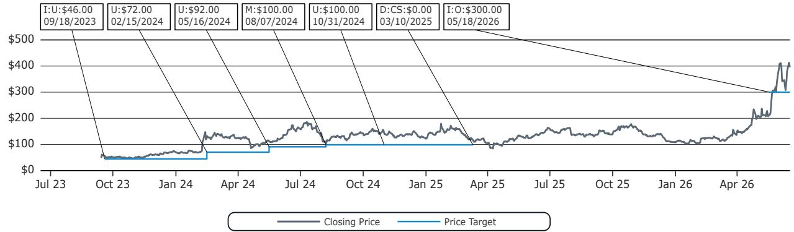

line chart

| Date       | Closing Price | Price Target |
| ---------- | ------------- | ------------ |
| 09/18/2023 | $46.00        | -            |
| 02/15/2024 | $72.00        | -            |
| 05/16/2024 | $92.00        | -            |
| 08/07/2024 | $100.00       | -            |
| 10/31/2024 | $100.00       | -            |
| 03/10/2025 | $0.00         | -            |
| 05/18/2026 | $300.00       | -            |

Outperform (O); Market-Perform (M); Underperform (U); Coverage Suspended (CS); Not Covered (NC)

SoftBank Group Corp (9984.JP) Rating History for Bernstein as of 06/16/2026  
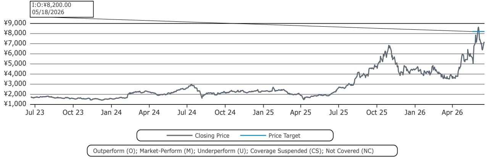

line chart

| Date       | Closing Price | Price Target |
| ---------- | ------------- | ------------ |
| 05/18/2026 | ¥8,200.00     | -            |

Hygon Information Technology Co Ltd (688041.CH) Rating History for Bernstein as of 06/16/2026  
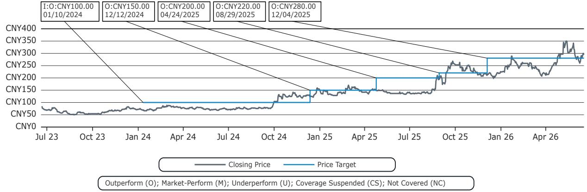

line chart

| Date       | Closing Price | Price Target |
| ---------- | ------------- | ------------ |
| 01/10/2024 | CNY100.00     | CNY100.00    |
| 12/12/2024 | CNY150.00     | CNY150.00    |
| 04/24/2025 | CNY200.00     | CNY200.00    |
| 08/29/2025 | CNY220.00     | CNY220.00    |
| 12/04/2025 | CNY280.00     | CNY280.00    |

Advanced Micro Devices Inc (AMD) Rating History for Bernstein as of 06/16/2026  
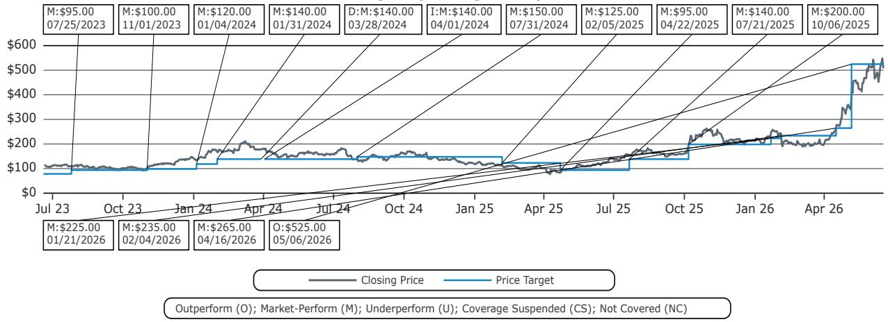

line chart

| Date       | Closing Price | Price Target |
|------------|---------------|--------------|
| 07/25/2023 | $95.00        | -            |
| 11/01/2023 | $100.00       | -            |
| 01/04/2024 | $120.00       | -            |
| 01/31/2024 | $140.00       | -            |
| D:M:2024   | $140.00       | -            |
| 04/01/2024 | $140.00       | -            |
| 07/31/2024 | $150.00       | -            |
| 02/05/2025 | $125.00       | -            |
| 04/22/2025 | $95.00        | -            |
| 07/21/2025 | $140.00       | -            |
| 10/06/2025 | $200.00       | -            |
| 01/21/2026 | $225.00       | -            |
| 02/04/2026 | $235.00       | -            |
| 04/16/2026 | $265.00       | -            |
| 05/06/2026 | $525.00       | -            |

Intel Corp (INTC) Rating History for Bernstein as of 06/16/2026  
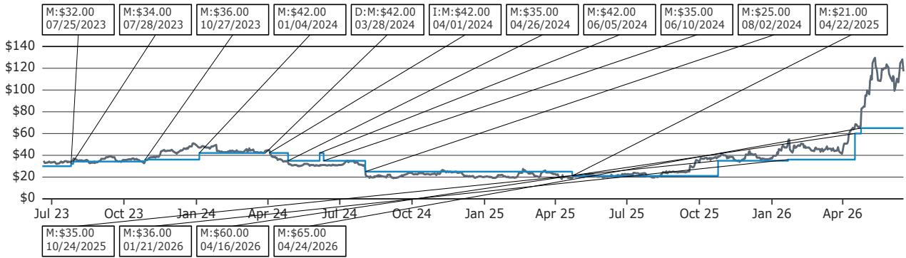

line chart

| Date       | Value  |
| ---------- | ------ |
| 07/25/2023 | $32.00 |
| 07/28/2023 | $34.00 |
| 10/27/2023 | $36.00 |
| 01/04/2024 | $42.00 |
| 03/28/2024 | $42.00 |
| 04/01/2024 | $42.00 |
| 04/26/2024 | $35.00 |
| 06/05/2024 | $42.00 |
| 06/10/2024 | $35.00 |
| 08/02/2024 | $25.00 |
| 04/22/2025 | $21.00 |
| 10/24/2025 | $35.00 |
| 01/21/2026 | $36.00 |
| 04/16/2026 | $60.00 |
| 04/24/2026 | $65.00 |

text_image

Closing Price
Price Target
Outperform (O); Market-Perform (M); Underperform (U); Coverage Suspended (CS); Not Covered (NC)

NVIDIA Corp (NVDA) Rating History for Bernstein as of 06/16/2026  
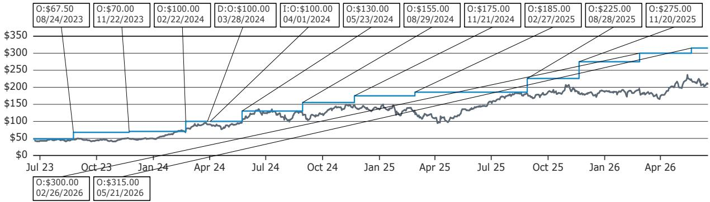

line chart

| Date       | Value   |
| ---------- | ------- |
| 08/24/2023 | $67.50  |
| 11/22/2023 | $70.00  |
| 02/22/2024 | $100.00 |
| 03/28/2024 | $100.00 |
| 04/01/2024 | $100.00 |
| 05/23/2024 | $130.00 |
| 08/29/2024 | $155.00 |
| 11/21/2024 | $175.00 |
| 02/27/2025 | $185.00 |
| 08/28/2025 | $225.00 |
| 11/20/2025 | $275.00 |
| 02/26/2026 | $300.00 |
| 05/21/2026 | $315.00 |

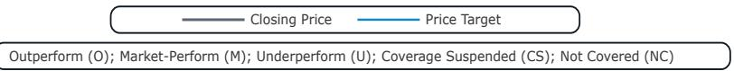

text_image

Closing Price
Price Target
Outperform (O); Market-Perform (M); Underperform (U); Coverage Suspended (CS); Not Covered (NC)

All price target and closing price data in the chart(s) above are denominated in the currency noted in the Ticker Table of this report.

## CONFLICTS OF INTEREST

All statements in this report attributable to Gartner represent Bernstein's interpretation of data, research opinion or viewpoints published as part of a syndicated subscription service by Gartner, Inc., and have not been reviewed by Gartner. Each Gartner publication speaks as of its original publication date (and not as of the date of this report). The opinions expressed in Gartner publications are not representations of fact, and are subject to change without notice.

Stacy A. Rasgon maintains long positions in various crypto currencies.

Bernstein and/or affiliates have received compensation for investment banking services in the past twelve months from SoftBank Group Corp.

Bernstein and/or affiliates have received compensation for non-investment banking securities-related products or services in the previous twelve months from the following clients: ARM Holdings PLC, SoftBank Group Corp and Intel Corp.

Bernstein has received compensation for non-investment banking securities-related products or services in the previous twelve months from the following clients: NVIDIA Corp.

Bernstein and/or affiliates expect to receive or intend to seek compensation for investment banking services in the next three months from SoftBank Group Corp.

Certain affiliates of Bernstein act as market maker or liquidity provider in the equities securities of: ARM Holdings PLC, Advanced Micro Devices Inc, Intel Corp and NVIDIA Corp.

Certain affiliates of Bernstein act as market maker or liquidity provider in the debt securities of: ARM Holdings PLC, SoftBank Group Corp and Intel Corp.

Bernstein and/or affiliates had an investment banking client relationship during the past twelve months with SoftBank Group Corp.

Affiliates of Bernstein managed or co-managed in the past twelve months a public offering of securities of SoftBank Group Corp.

## OTHER MATTERS

The legal entity(ies) employing the analyst(s) listed in this report, and their location, can be determined by the country code of their phone number, as follows:

+1 Bernstein Institutional Services LLC; New York, New York, USA

+44 Bernstein Autonomous LLP; London UK

+212 SG Africa Technologies & Services; Casablanca, Morocco

+33 BSG France S.A.; Paris, France

+34 BSG France S.A.; Madrid, Spain

+41 Bernstein Autonomous LLP; Geneva, Switzerland

+49 BSG France S.A.; Frankfurt, Germany

+91 Bernstein (India) Private Limited; Mumbai, India

+852 Bernstein (Hong Kong) Limited 盛博香港有限公司; Hong Kong, China

+65 Bernstein (Singapore) Private Limited; Singapore

+81 Bernstein Japan KK; Tokyo, Japan

Where this report has been prepared by research analyst(s) employed by a non-US affiliate, such analyst(s), is/are (unless otherwise expressly noted below) not registered as associated persons of Bernstein Institutional Services LLC or any other SEC-registered broker-dealer and are not licensed or qualified as research analysts with FINRA. Accordingly, such analyst(s) may not be subject to FINRA's restrictions regarding (among other things) communications by research analysts with a subject company, interactions between research analysts and investment banking personnel, participation by research analysts in solicitation and marketing activities relating to investment banking transactions, public appearances by research analysts, and trading securities held by a research analyst account.

Where this report has been prepared by research analyst(s) employed by SG Africa Technologies & Services (part of the SG group of companies), it has been prepared on behalf of a Bernstein company under a Global Services Agreement in place between Bernstein and SG.

## CERTIFICATION

Each research analyst listed in this report, who is primarily responsible for the preparation of the content of this report, certifies that all of the views expressed in this publication accurately reflect that analyst's personal views about any and all of the subject securities or issuers and that no part of that analyst's compensation was, is, or will be, directly or indirectly, related to the specific recommendations or views in this publication.

## II. ADDITIONAL GLOBAL CONFLICT DISCLOSURES

It is at the sole discretion of the Firm as to when to initiate, update and cease research coverage. The Firm has established, maintains and relies on information barriers to control the flow of information contained in one or more areas (i.e., the private side) within the Firm, and into other areas, units, groups or affiliates (i.e., public side) of the Firm.

## III. OTHER IMPORTANT INFORMATION AND DISCLOSURES

Separate branding is maintained for “Bernstein” and “Autonomous” research products.

- Bernstein produces a number of different types of research products including, among others, fundamental analysis and quantitative analysis under both the “Autonomous” and “Bernstein” brands. Recommendations contained within one type of research product may differ from recommendations contained within other types of research products, whether as a result of differing time horizons, methodologies or otherwise. Furthermore, views or recommendations within a research product issued under one brand may differ from views or recommendations under the same type of research product issued under the other brand. The Research Ratings System for the two brands and other information related to those Rating Systems are included in the previous section.  
- Autonomous operates as a separate business unit within the following entities: Bernstein Institutional Services LLC, Bernstein Autonomous LLP, Bernstein (Hong Kong) Limited 盛博香港有限公司 and Bernstein (India) Private Limited. For information relating to “Autonomous” branded products (including certain Sales materials) please visit: www.autonomous.com. For information relating to Bernstein branded products please visit: www.bernsteinresearch.com.

Analysts are compensated based on aggregate contributions to the research franchise as measured by account penetration, productivity and proactivity of investment ideas. No analysts are compensated based on performance in, or contributions to, generating investment banking revenues.

This report has been produced by an independent analyst as defined in Article 3 (1)(34)(i) of EU 596/2014 Market Abuse Regulation (“MAR”) and the same article of MAR as it forms part of United Kingdom domestic law by virtue of the European Union (Withdrawal) Act 2018.

To our readers in the United States: Bernstein Institutional Services LLC, a broker-dealer registered with the U.S. Securities and Exchange Commission (“SEC”) and a member of the U.S. Financial Industry Regulatory Authority, Inc. (“FINRA”) is distributing this publication in the United States and accepts responsibility for its contents. Where this material contains an analysis of debt product(s), such material is intended only for institutional investors and is not subject to the US independence and disclosure standards applicable to debt research prepared for retail investors.

Bernstein Institutional Services LLC may act as principal for its own account or as agent for another person (including an affiliate) in sales or purchases of any security which is a subject of this report. This report does not purport to meet the objectives or needs of any specific individuals, entities or accounts.

To our readers in Canada: If this publication pertains to a Canadian domiciled company, it is being distributed in Canada by Bernstein (Canada) Limited, which is licensed and regulated by the Canadian Investment Regulatory Organization. If the publication pertains to a non-Canadian domiciled company, it is being distributed by Bernstein Institutional Services LLC, which is licensed and regulated by both the SEC and FINRA, into Canada under the International Dealers Exemption.

This document may not be passed onto any person in Canada unless that person qualifies as "permitted client" as defined in Section 1.1 of NI 31-103.

To our readers in Brazil: This report has been prepared by Bernstein Institutional Services LLC, and Banco BTG Pactual S.A. ("BTG") is responsible for the distribution of this report in Brazil.

To readers in the United Kingdom: This publication has been issued or approved for issue in the United Kingdom by Bernstein Autonomous LLP, authorised and regulated by the Financial Conduct Authority and located at 60 London Wall, London EC2M 5SH, +44 (0)20-7170-5000. Registered in England & Wales No OC343985.

This document is for distribution only to persons who (i) have professional experience in matters relating to investments falling within Article 19(5) of the Financial Services and Markets Act 2000 (Financial Promotion) Order 2005 (as amended, the “Financial Promotion Order”), (ii) are persons falling within Article 49(2)(a) to (d) (“high net worth companies, unincorporated associations, etc.”) of the Financial Promotion Order, (iii) are outside the United Kingdom, or (iv) are persons to whom an invitation or inducement to engage in investment activity (within the meaning of section 21 of the FSMA) in connection with the issue or sale of any securities may otherwise lawfully be communicated or caused to be communicated (all such persons together being referred to as “relevant persons”). This document is directed only at relevant persons and must not be acted on or relied on by persons who are not relevant persons. Any investment or investment activity to which this document relates is available only to relevant persons and will be engaged in only with relevant persons.

To our readers in the member states of the EEA: This publication is being distributed by BSG France SA, which is authorised and regulated by the Autorité de Contrôle Prudentiel et de Résolution (ACPR) and Autorité des Marchés Financiers (AMF).

To our readers in Hong Kong: This publication is being distributed in Hong Kong by Bernstein (Hong Kong) Limited 盛博香港有限公司, which is licensed and regulated by the Hong Kong Securities and Futures Commission (Central Entity No. AXC846) to carry out Type 4 (Advising on Securities) regulated activities and subject to the licensing conditions mentioned in the SFC Public Register (https://www.sfc.hk/publicregWeb/corp/AXC846/details)). This publication is solely for professional investors, as defined in the Securities and Futures Ordinance (Cap. 571). The purpose of this report is solely to provide an analysis of the issuers referred to in this report and is not intended for any purpose contrary to the laws of Hong Kong.

To our readers in Singapore: This publication is being distributed in Singapore by Bernstein (Singapore) Private Limited, only to accredited investors or institutional investors, as defined in the Securities and Futures Act 2001 of Singapore ("SFA"). Recipients in Singapore should contact Bernstein (Singapore) Private Limited in respect of matters arising from, or in connection with, this publication. Bernstein (Singapore) Private Limited is regulated by the Monetary Authority of Singapore and licensed under the SFA as a capital markets services licence holder for dealing in capital markets products that are securities and collective investment schemes and an exempt financial adviser for advising on, issuing and promulgating analyses and reports on securities. Bernstein (Singapore) Private Limited is registered in Singapore with Company Registration No. 20213710W and located at 8 Marina Boulevard, #12-01, Marina Bay Financial Centre, Singapore 018981, +65-6326-7000.

To our readers in the People's Republic of China: The securities referred to in this document are not being offered or sold and may not be offered or sold, directly or indirectly, in the People's Republic of China (for such purposes, not including the Hong Kong and Macau Special Administrative Regions or Taiwan, the "PRC") in contravention of any applicable laws of the PRC.

This document does not constitute an offer to sell or the solicitation of an offer to buy any securities in the PRC to any person to whom it is unlawful to make the offer or solicitation in the PRC.

We do not represent that this document may be lawfully distributed, or that any securities may be lawfully offered, in compliance with any applicable registration or other requirements in the PRC, or pursuant to an exemption available thereunder, or assume any responsibility for facilitating any such distribution or offering. In particular, no action has been taken by us which would permit a public offering of any securities or distribution of this document in the PRC. Accordingly, the securities are not being offered or sold within the PRC by means of this document or any other document. Neither this document nor any advertisement or other offering material may be distributed or published in the PRC, except under circumstances that will result in compliance with any applicable laws and regulations.

To our readers in Japan: This publication is being distributed in Japan by Bernstein Japan KK (サンフォード・C・バーンスタイン株式会社), which is registered in Japan as a Financial Instruments Business Operator with the Kanto Local Finance Bureau (registration number: The Director-General of Kanto Local Finance Bureau (FIBO) No.3387) and regulated by the Financial Services Agency. It is also a member of Investment Management Association of Japan. This publication is solely for qualified institutional investors in Japan only, as defined in Article 2, paragraph (3), items (i) of the Financial Instruments and Exchange Act.

For the institutional client readers in Japan who have been granted access to the Bernstein website by Daiwa Group Inc. ("Daiwa"), your access to this document should not be construed as meaning that Bernstein is providing you with investment advice for any purposes. Whilst Bernstein has prepared this document, your relationship is, and will remain with, Daiwa, and Bernstein has neither any contractual relationship with you nor any obligations towards you.

To our readers in Australia: Bernstein (Hong Kong) Limited 盛博香港有限公司 is responsible for distributing research in Australia. It is regulated by the Securities and Exchange Commission under U.S. laws, by the Financial Conduct Authority under U.K. laws, which differs from Australian laws. Bernstein (Hong Kong) Limited 盛博香港有限公司 is exempt from the requirement to hold an Australian financial services license under the Corporations Act 2001 in respect of the provision of the following financial services to wholesale clients:

• providing financial product advice;  
• dealing in a financial product;  
• making a market for a financial product; and  
• providing a custodial or depository service.

To our readers in India: This publication is being distributed in India by Bernstein (India) Private Limited (SCB India) which is licensed and regulated by Securities and Exchange Board of India ("SEBI") as a research analyst entity under the SEBI (Research Analyst) Regulations, 2014, having registration no. INH000006378 and as a stock broker having registration no. INZ000213537. SCB India is currently engaged in the business of providing research and stock broking services. Please refer to www.bernsteinresearch.in for more information.

\- SCB India is a Private limited company incorporated under the Companies Act, 2013, on April 12, 2017 bearing corporate identification number U65999MH2017FTC293762, and registered office at Level 3A, 4th Floor, First International Financial

Centre, Plot Nos C-54 and C-55, G Block, Near CBI Office, Bandra Kurla Complex, Bandra (East), Mumbai 400098, Maharashtra, India (Phone No: +91-22-68421401).

- For details of Associates (i.e., affiliates/group companies) of SCB India, kindly email MUM-BERNSTEIN-InCompliance@bernsteinsg.com.  
• SCB India does not have any disciplinary history as on the date of this report.  
- Except as noted above, SCB India and/or its Associates (i.e., affiliates/group companies), the Research Analysts authoring this report, and their relatives

• do not have any financial interest in the subject company  
• do not have actual/beneficial ownership of one percent or more in securities of the subject company;  
- is not engaged in any investment banking activities for Indian companies, as such;  
• have not managed or co-managed a public offering in the past twelve months for any Indian companies;  
- have not received any compensation for investment banking services or merchant banking services from the subject company in the past 12 months;  
• have not received compensation for brokerage services from the subject company in the past twelve months;  
- have not received any compensation or other benefits from the subject company or third party related to the specific recommendations or views in this report; and  
- do not currently, but may in the future, act as a market maker in the financial instruments of the companies covered in the report.  
- do not have any conflict of interest in the subject company as of the date of this report.

\- Except as noted above, the subject company has not been a client of SCB India during twelve months preceding the date of distribution of this research report. Neither SCB India nor its Associates (i.e., affiliates/group companies) have received compensation for products or services other than investment banking, merchant banking or brokerage services from the subject company in the past twelve months.

\- The principal research analyst(s) who prepared this report, members of the analysts' team, and members of their households are not an officer, director, employee or advisory board member of the companies covered in the report.

\- Our Compliance officer / Grievance officer is Ms. Rupal Talati, who can be reached at +91-22-68421451, or MUM-BERNSTEIN-InCompliance@bernsteinsg.com / Scbin-investorgrievance@bernsteinsg.com

\- The Research investor charter and Terms & Conditions of SCB India are available on its website and may be accessed at Bernstein (India) Private Limited (https://bernsteinresearch.in/) for your reference.

\- Disclaimer: Registration granted by SEBI, and certification from NISM, is in no way a guarantee of performance of the intermediary or provide any assurance of returns to investors. Investments in securities market are subject to market risks. Read all the related documents carefully before investing.

To our readers in Switzerland: This document is provided in Switzerland by or through Bernstein Autonomous LLP, and is provided only to qualified investors as defined in article 10 of the Swiss Collective Investment Scheme Act (“CISA”) and related provisions of the Collective Investment Scheme Ordinance and in strict compliance with applicable Swiss law and regulations. The products mentioned in this document may not be suitable for all types of investors. This document is based on the Directives on the Independence of Financial Research issued by the Swiss Bankers Association (SBA) in January 2008.

To our readers in the Middle East: Bernstein Autonomous LLP, DIFC branch has its principal office at Gate Village 06, DIFC, Dubai, UAE. Bernstein Autonomous LLP, DIFC branch is regulated by the Dubai Financial Services Authority (DFSA) with the registration number CL10040 and is provisioned for Arranging Deals in Investments and Advising on Financial Products. All communications and services are directed at Professional Clients and Market Counterparties only (as defined in the DFSA rulebook). Persons other than Professional Clients and Market Counterparties, such as Retail Clients, are not the intended recipients of our communications or services.

## LEGAL

All research publications are disseminated to our clients through posting on the firm's password protected websites, bernsteinresearch.com and autonomous.com. Certain, but not all, research publications are also made available to clients through third-party vendors or redistributed to clients through alternate electronic means as a convenience.

This publication has been published and distributed in accordance with the Firm's policy for management of conflicts of interest in investment research, a copy of which is available from Bernstein Institutional Services LLC, Director of Compliance, 245 Park Avenue, New York, NY 10167. Additional disclosures and information regarding Bernstein's business are available on our website www.bernsteinresearch.com.

The securities described herein may not be eligible for sale in all jurisdictions or to certain categories of investors where that permission profile is not consistent with the licenses held by the entities noted herein. This document is for distribution only as may be permitted by law. This publication is not directed to, or intended for distribution to or use by, any person or entity who is a citizen or resident of, or located in any locality, state, country or other jurisdiction where such distribution, publication, availability or use would be contrary to law or regulation or which would subject any of the entities referenced herein or any of their subsidiaries or affiliates to any registration or licensing requirement within such jurisdiction. This publication is based upon public sources we believe to be reliable, but no representation is made by us that the publication is accurate or complete. We do not undertake to advise you of any change in the reported information or in the opinions herein. This publication was prepared and issued by entity referred to herein for distribution to eligible counterparties or professional clients. This publication is not an offer to buy or sell any security, and it does not constitute investment, legal or tax advice. The investments referred to herein may not be suitable for you. Investors must make their own investment decisions in consultation with their professional advisors in light of their specific circumstances. The value of investments may fluctuate, and investments that are denominated in foreign currencies may fluctuate in value as a result of exposure to exchange rate movements. Information about past performance of an investment is not necessarily a guide to, indicator of, or assurance of, future performance.

This report is directed to and intended only for our clients who are “eligible counterparties”, “professional clients”, “institutional investors” and/or “professional investors” as defined by the aforementioned regulators, and must not be redistributed to retail clients as defined by the aforementioned regulators. Retail clients who receive this report should note that the services of the entities noted herein are not available to them and should not rely on the material herein to make an investment decision. The result of such act will not hold the entities noted herein liable for any loss thus incurred as the entities noted herein are not registered/authorised/licensed to deal with retail clients and will not enter into any contractual agreement/arrangement with retail clients. This report is provided subject to the terms and conditions of any agreement that the clients may have entered into with the entities noted herein. All research reports are disseminated on a simultaneous basis to eligible clients through electronic publication to our client portal.

The information in this report was prepared by Bernstein solely for the internal business use of our clients. Clients may store, display, analyze, reformat and print the information in this report for this limited use only. Clients may not copy, alter, create derivative works, resell, reverse engineer, commercially exploit, share or distribute any part of the information contained herein for any purpose without Bernstein's express written consent. These restrictions include extracting data or using the content to develop indices or other products. Further, you may not use this report, or any portion of this report, to train or finetune any third-party machine learning or artificial intelligence system, or as a prompt or input into any such system. You also may not, without Bernstein's express written consent, do any of the foregoing in connection with your own internal machine learning or artificial intelligence system.

Bernstein may use artificial intelligence tools in the preparation of its materials. Any such materials are reviewed by Bernstein's research analysts prior to publication.

This report has been prepared for information purposes only and is based on current public information that we consider reliable, but the entities noted herein do not warrant or represent (express or implied) as to the sources of information or data contained herein are accurate, complete, not misleading or as to its fitness for the purpose intended even though the entities noted herein rely on reputable or trustworthy data providers, it should not be relied upon as such. Opinions expressed are the author(s)' current opinions as of the date appearing on the material only and we do not undertake to advise you of any change in the reported information or in the opinions herein.

Any references to SG herein are purely factual, based upon publicly available information, and included for comparative purposes only. They do not constitute an opinion or recommendation with respect to the securities of SG.

This publication was prepared and issued by the entity referred to herein for distribution to eligible counterparties or professional clients. The information in this report is intended for general circulation and does not constitute an offer to buy or sell any security, investment, legal or tax advice nor a personal recommendation, as defined by any of the aforementioned regulators. It does not take into account the particular investment objectives, financial situations, or needs of individual investors. The report has not been reviewed by any of the aforementioned regulators and does not represent any official recommendation from the aforementioned regulators. The investments referred to herein may not be suitable for you. Investors must make their own investment decisions in consultation with advice sought from a financial adviser regarding the suitability of the investment product, taking into account the specific investment objectives, financial situation or particular needs of any recipient of the recommendation, before the recipient makes a commitment to purchase the investment product.

The analysis contained herein is based on numerous assumptions. Different assumptions could result in materially different results. The information in this report does not constitute, or form part of, any offer to sell or issue, or any offer to purchase or subscribe for shares, or to induce engagement in any other investment activity. The value of any securities or financial instruments mentioned in this report may fluctuate subject to market conditions. Information about past performance of an investment is not necessarily a guide to, indicative of, or assurance of future performance. Estimates of future performance mentioned by the research analyst in this report are based on assumptions that may not be realized due to unforeseen factors like market volatility/fluctuation. In relation to securities or financial instruments denominated in a foreign currency other than the clients' home currency, movements in exchange rates will have an effect on the value, either favorable or unfavorable. Before acting on any recommendations in this report, recipients should consider the appropriateness of investing in the subject securities or financial instruments mentioned in this report and, if necessary, seek independent professional advice.

The securities described herein may not be eligible for sale in all jurisdictions or to certain categories of investors where that permission profile is not consistent with the licenses held by the entities noted herein. This document is for distribution only as may be permitted by law. It is not directed to, or intended for distribution to or use by, any person or entity who is a citizen or resident of or located in any locality, state, country or other jurisdiction where such distribution, publication, availability or use would be contrary to law or regulation or would subject the entities noted herein to any regulation or licensing requirement within such jurisdiction.

Source: Bloomberg Index Services Limited. BLOOMBERG® is a trademark and service mark of Bloomberg Finance L.P. and its affiliates (collectively “Bloomberg”). Bloomberg or Bloomberg’s licensors own all proprietary rights in the Bloomberg Indices. Neither Bloomberg nor Bloomberg’s licensors approves or endorses this material, or guarantees the accuracy or completeness of any information herein, or makes any warranty, express or implied, as to the results to be obtained therefrom and, to the maximum extent allowed by law, neither shall have any liability or responsibility for injury or damages arising in connection therewith.

No part of this material may be reproduced, distributed or transmitted or otherwise made available without prior consent of the entities noted herein. Copyright Bernstein Institutional Services LLC Bernstein Autonomous LLP, BSG France S.A., Bernstein (Hong Kong) Limited 盛博香港有限公司, Bernstein (Canada) Limited, Bernstein (India) Private Limited (SEBI registration no. INH000006378), Bernstein (Singapore) Private Limited and Bernstein Japan KK (サンフォード・C・バーンスタイン株式会社). All rights reserved. The trademarks and service marks contained herein are the property of their respective owners. Any unauthorized use or disclosure is strictly prohibited. The entities noted herein may pursue legal action if the unauthorized use results in any defamation and/or reputational risk to the entities noted herein and research published under the Bernstein and Autonomous brands.