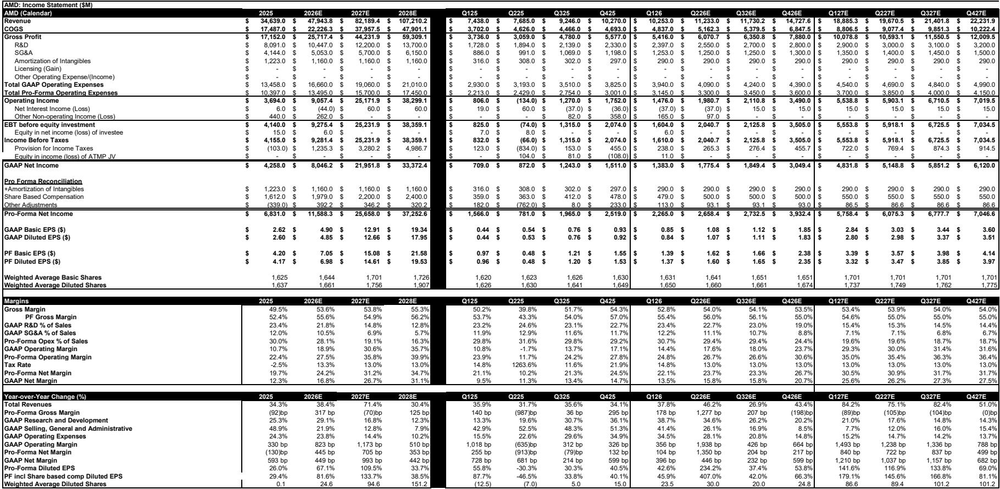
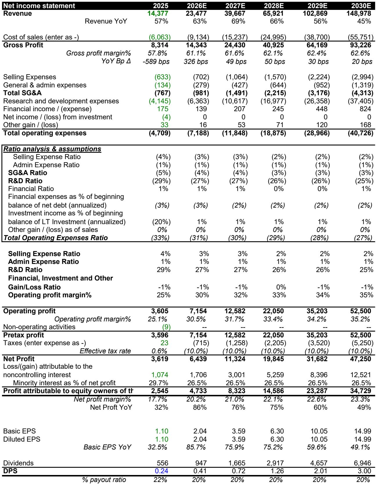
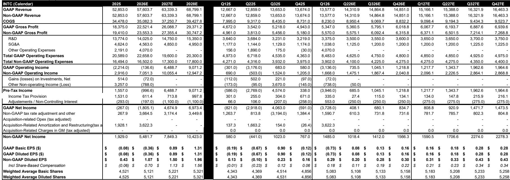

# Bernstein：AI从聊天走向智能体，CPU正在经历一场被低估的复兴

过去两年，AI基础设施的投资逻辑几乎被GPU完全定义。市场默认的叙事是：算力即GPU算力，数据中心建设等于加速器集群的扩张。CPU被降格为“配角”，在AI服务器中的价值占比被不断压缩，甚至出现一台服务器搭配8颗GPU、只配1颗CPU的极端配置。

但这份Bernstein研报提出了一个值得所有产业决策者重新审视的判断：**随着AI从1.0的聊天机器人范式，转向2.0的智能体范式，CPU正在经历一场结构性复兴。** 而市场对这一转变的定价，可能才刚刚开始。

Bernstein将2030年服务器CPU市场空间从此前的1370亿美元大幅上调至2230亿美元，并明确指出——这个数字在牛市情景下可能达到3300亿美元。驱动这一变化的，不是CPU自身的性能突破，而是AI工作负载的底层逻辑正在发生根本性转变。

以下是我们从这份报告中提炼出的五个核心洞察。

## 1. 智能体AI改变了CPU与GPU的配比逻辑，从1:8回归到1:1甚至更高

理解这份报告的核心，首先要理解一个关键比率：CPU与GPU的配对比例。

在传统的AI推理集群中，GPU是绝对的主角。以Google的TPU v6e和Meta的Grand Teton为例，GPU与CPU的配比曾达到8:1。这背后的逻辑是：推理任务本质上是“一次模型调用、一次返回结果”，CPU只需要承担数据加载和结果传递的轻量级工作，GPU负责最密集的矩阵运算。CPU被视作“税”，是必须支付但越少越好的开销。

智能体AI彻底改变了这一假设。当一个AI系统不再只是回答问题，而是需要自主执行任务时，工作流变成了一个循环：用户请求触发检索，系统调用工具、进行中间推理、再次调用模型、执行动作、反馈结果。在这个过程中，GPU仍然负责密集的数学运算，但CPU决定了整个系统能否高效编排——调度任务、管理内存、协调工具调用、避免加速器空闲。

Bernstein的判断是，智能体AI将推动GPU与CPU的配比从当前的8:1快速收窄至1:1甚至更高。报告引用了2026年的硬件路线图作为佐证：AMD的Venice平台是1颗CPU对4颗GPU，NVIDIA的Vera超级芯片是1颗CPU对2颗Rubin GPU，Google的TPU 7x是1颗CPU对4颗TPU芯片。这些设计都在指向同一个方向——CPU不再是附属品，而是与GPU平起平坐的计算核心。

这意味着什么？如果GPU与CPU的配比从8:1回归到1:1，即使AI数据中心的总资本支出不变，CPU的市场空间也将增长数倍。而如果AI资本支出本身仍在高速扩张，CPU将成为叠加了“配比提升”和“总量增长”双重杠杆的最大受益者。

## 2. 2030年服务器CPU市场空间可达2230亿美元，是当前规模的6倍

基于上述逻辑，Bernstein构建了一套新的服务器CPU市场空间模型。在基准情景下，假设2030年AI资本支出累计达到3.5万亿美元，推理环节的CPU与GPU配比为1:1，训练环节为0.5:1，CPU相对GPU的成本占比从当前的10%提升至13%，那么2030年服务器CPU市场空间将达到2230亿美元。

这个数字有多大的想象力？作为对比，2025年服务器CPU市场空间仅约370亿美元。这意味着未来五年，这个市场将以43%的年复合增长率扩张。而Bernstein此前的预测（1370亿美元）现在被降级为“熊市情景”。在牛市情景下——假设AI资本支出达到4万亿美元、CPU与GPU配比升至1.5:1——市场空间可以高达3300亿美元。

这份模型的关键假设值得推敲。首先，推理环节的CPU配比从当前的0.25倍提升至1倍，是最大的增量来源。这背后是智能体AI推理工作负载从“单次调用”变为“循环调用”的假设。其次，CPU成本占比从10%提升至13%，反映了CPU在系统中的重要性上升，但这一假设仍可能偏保守——如果CPU真正成为系统瓶颈的“解药”，其价值占比可能更高。

但报告也坦诚指出了风险：如果超大规模云厂商发现HBM等内存成本过高，选择直接从内存供应商采购而非通过GPU厂商打包购买，那么CPU的隐含价值可能会被重新评估。这是模型中最需要跟踪验证的变量。

## 3. Arm是CPU复兴的结构性受益者，目标价上调至500美元

在CPU复兴的叙事中，Bernstein将Arm定位为最核心的受益者。理由有三。

第一，智能体AI工作负载对功耗效率极度敏感。随着数据中心功率密度逼近物理极限，运营商需要的是“每瓦特能编排多少个智能体”，而非单纯的峰值性能。Arm架构在性能功耗比上的优势，在这一场景下被放大。

第二，Arm正在从IP授权商转型为CPU制造商。这一战略转型意味着Arm不再只是收取版税，而是直接参与CPU芯片的设计与销售，能够捕获更大的价值链份额。Bernstein此前预计Arm到2030年可实现150亿美元营收，但基于新的CPU市场空间模型，这一预测被上调至220亿美元。

第三，Arm的2030财年每股收益预测从9.83美元上调至11.79美元，基于42倍市盈率，目标价从300美元上调至500美元。这对应21%的上行空间。同时，由于Arm是软银的核心资产，Bernstein也将软银的目标价从8200日元上调至11200日元，隐含58%的上行空间。

需要注意的是，500美元的目标价对应的是2026年180倍以上的市盈率。这显然不是一个基于当前盈利的估值，而是基于2030年远景的折现。投资者需要判断的是：Arm能否在CPU复兴中兑现其市场领导地位，以及市场是否愿意为这一远景支付如此高的溢价。

## 4. AMD和英特尔同样受益，但受益逻辑截然不同

Bernstein同时上调了AMD和英特尔的目标价。AMD从525美元上调至600美元，英特尔从65美元上调至100美元。但两家公司的受益逻辑和竞争地位存在显著差异。

AMD被评级为“跑赢大盘”。Bernstein认为AMD的CPU产品在当前仍保持技术领先，并且有望继续扩大市场份额。更重要的是，AMD同时拥有CPU和GPU两条产品线，在智能体AI时代可以同时受益于两端的增长。报告指出，AMD已有的模型已经隐含了较强的服务器CPU环境假设，因此盈利预测调整幅度不大，但估值窗口前移推动了目标价上调。

英特尔被评级为“与大盘持平”。尽管服务器CPU需求的回暖对英特尔是明确的利好，但Bernstein认为其产品竞争力仍不及AMD。报告上调英特尔盈利预测的幅度更大，主要是因为此前模型对服务器CPU环境的假设偏保守。但英特尔面临的核心问题——制造工艺的追赶、产品路线图的执行风险——并未消失。100美元的目标价暗示当前股价已基本反映了服务器CPU复苏的利好，进一步上行需要看到产品竞争力的实质性改善。

这一对比揭示了一个重要洞察：CPU复兴的浪潮会推高所有参与者的估值，但最终能够持续创造超额收益的，是那些在产品力、市场份额和商业模式上具备结构性优势的公司。

## 5. 中国市场的CPU需求可能成为独立变量，海光信息是受益标的

这份报告还特别关注了中国市场。Bernstein认为，从2028年起，中国x86服务器CPU市场的增速将超过全球平均水平。驱动因素包括：国内先进制程产能约束的逐步缓解、AI投资加速释放CPU需求、以及国产CPU与国产AI芯片的互操作性持续改善。

在这一背景下，Bernstein将海光信息（Hygon）的目标价从280元大幅上调至450元。核心逻辑是：海光信息在中国x86服务器CPU市场的份额将从当前水平持续扩大，到2030年超过35%。其客户基础正在从传统的政府和国企，向云计算服务商渗透。

但这里有一个尚未被充分讨论的问题：海光信息的增长高度依赖于国内先进制程产能的可用性。如果供应链约束的缓解慢于预期，或者美国出口管制进一步升级，其产能扩张和产品迭代节奏可能面临不确定性。这是报告没有完全展开、但投资者需要持续跟踪的关键变量。

## 报告尚未完全回答的关键问题：CPU增长的供给端约束

Bernstein在报告末尾坦诚提出了一个尚未解决的问题：晶圆代工和内存产能是否足以支撑CPU的爆发式增长？

这是一个值得深思的问题。如果2030年CPU市场空间真的达到2230亿美元，意味着全球需要额外建设大量CPU产能。而当前全球先进制程产能的扩张速度，是否能够匹配这一需求？台积电的3nm和2nm产能规划，有多少可以分配给服务器CPU？高带宽内存（HBM）的供给瓶颈是否会成为CPU增长的隐性天花板？

此外，报告还提出了一个有趣的竞争格局问题：如果HBM成本持续高企，超大规模云厂商是否可能绕开NVIDIA等GPU厂商，直接向内存供应商采购？这一假设如果成真，将改变整个AI基础设施的价值分配格局——CPU的“含金量”可能被重新评估，而GPU厂商的议价能力可能受到挑战。

这些问题，报告提出了但并未给出确定答案。它们恰恰是决定CPU复兴叙事能否兑现为实际投资回报的关键变量。

## 留给读者的观察框架

基于这份报告，我们可以建立一个简单的观察框架，用于跟踪CPU复兴叙事的验证进度：

第一，跟踪主要云厂商和服务器OEM的CPU与GPU配比变化。如果2026年硬件路线图中1:1配比成为主流，而非个别案例，则报告的核心假设得到验证。

第二，关注Arm从IP授权向CPU制造的转型进度。其自研CPU的客户导入情况、量产节奏和性能表现，将是判断其能否捕获超额价值的关键。

第三，监控先进制程和HBM的产能供给。如果供给端出现瓶颈，CPU增长可能面临“有需求、无产能”的困境，市场预期可能需要向下修正。

第四，跟踪智能体AI的实际部署案例。当前关于CPU需求提升的论证，很大程度上基于“智能体AI需要更多CPU”的理论推演。如果实际部署中CPU负载并未如预期提升，整个叙事的基础将被动摇。

这些变量，每一个都值得深入拆解。而这份Bernstein报告，只是打开了讨论的序幕。

Personal reading notes and learning share only. Not investment advice.

