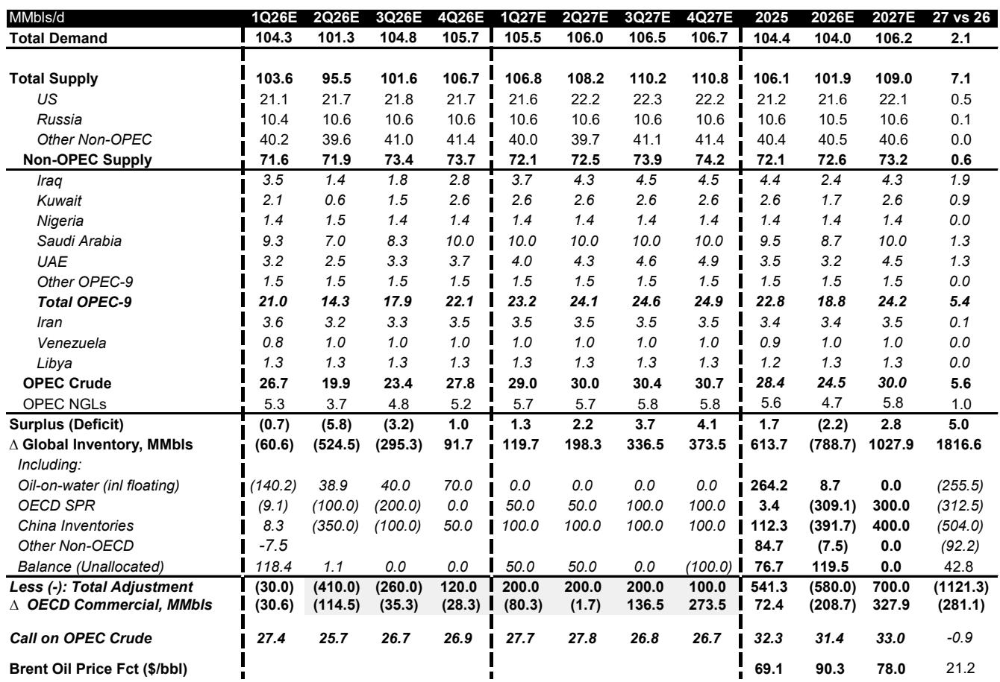
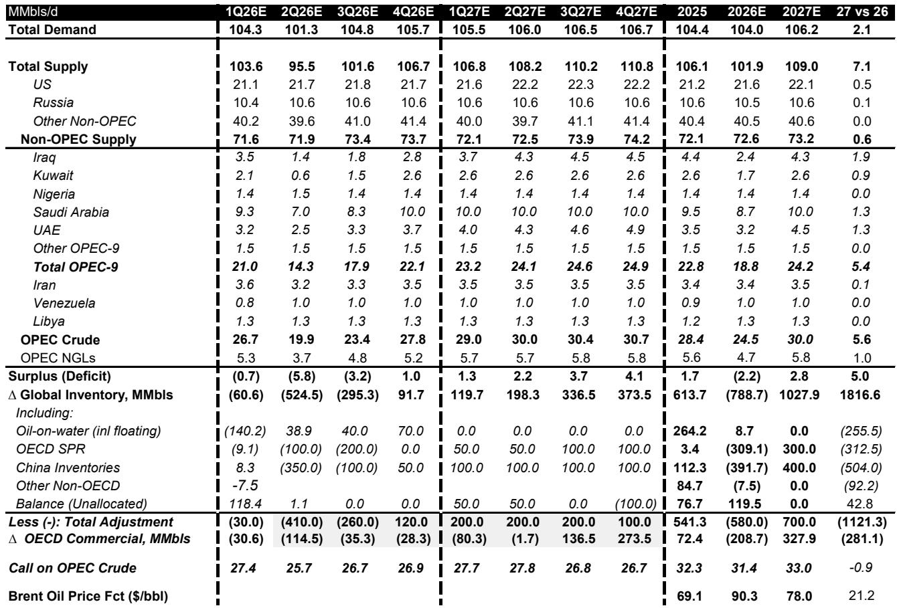
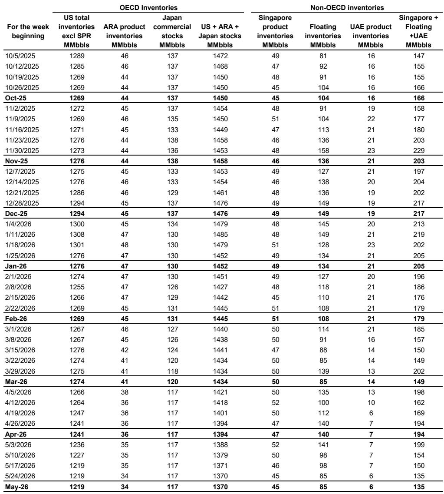

# Bernstein：市场低估的不是供给恢复的速度，而是库存重建的深度

这份报告的标题“Let the oil flow”看似直白，但真正有穿透力的判断藏在数字背后：全球石油市场在过去一段时间内累计消耗了约10亿桶库存。当所有人都在关注霍尔木兹海峡何时重新开放、供给何时恢复时，Bernstein的分析指向了一个更根本的问题——即便供给恢复正常，市场真正需要的不是“增量”，而是“补量”。重建这10亿桶库存，意味着未来两年内每天需要额外吸收约300万桶的供给。这个数字，才是理解油价底部和资产定价的关键。

这份Bernstein研报发布于一个微妙的时点：布伦特原油年初至今均价约87美元/桶，市场正处于对地缘政治缓和的乐观预期与物理供需现实之间的拉锯中。报告没有给出廉价的看多或看空结论，而是构建了一个“短期偏紧、中期逐渐宽松、长期受边际成本锚定”的分阶段框架。对于亚太油气行业的决策者和投资者而言，这份报告提供的不是简单的方向判断，而是一套理解库存周期如何重塑竞争格局的分析工具。

以下是我们从这份报告中提炼出的四个核心洞察，以及一个报告尚未完全回答的关键问题。

## 1. 10亿桶库存消耗才是当前油价的真实支撑，而非地缘溢价

市场普遍将油价维持在80-90美元/桶归因于地缘政治风险溢价。Bernstein的框架提供了一个更坚实的解释：物理库存的消耗。报告详细拆解了这约10亿桶的消耗构成——约3亿桶来自战略石油储备（SPR），约4.5亿桶来自中国库存，约1.4亿桶来自海上浮仓，其余来自商业库存。这不是一个抽象的数字，而是一个已经被市场吸收的供给冲击。

这意味着什么？意味着即便霍尔木兹海峡明天就完全恢复通航，第一批恢复的油流并不会直接满足终端需求，而是会首先进入库存重建通道。Bernstein预计，这个过程需要大约6个月，原因包括扫雷作业、船舶重新部署、战争险保险重新定价、港口和装载计划重建等一系列物理和制度性约束。供给恢复的斜率将是平缓的，而非陡峭的。

这对投资者的含义是：短期油价的下行空间被库存底部封住。报告维持2026年布伦特均价90美元/桶的预测，这一判断的核心依据不是地缘政治，而是“库存极低水平为价格提供了强地板”。任何因“危机结束”预期引发的估值回调，可能更多是买入机会而非卖出信号。

## 2. 2027年的2.8百万桶/日过剩将被库存重建吸收，市场并非走向失衡

报告预测到2027年，市场将转为约280万桶/日（约10亿桶/年）的过剩。乍看这是一个利空信号。但Bernstein的关键洞察在于，这个所谓的“过剩”大部分将被库存重建所吸收。报告明确写道：“我们预计大部分过剩将被库存重建吸收。”

这个判断的逻辑链条是：经历了本轮大幅消耗后，买家有强烈的动机重建库存。不仅是为了回到正常运营水平，更是为了应对未来可能再次出现的供给中断风险。Bernstein预计，到2027年底，全球库存将基本恢复到冲突前水平。这意味着，2027年的“过剩”在性质上更接近“补库需求”，而非真正的供需失衡。

这一判断对油价的含义是深远的。如果市场将2027年的过剩简单解读为“供给过剩导致油价下跌”，可能低估了库存重建对价格的支撑作用。报告对2027年布伦特原油的预测为78美元/桶，呈现上半年偏强、下半年偏软的走势，长期锚定在75美元/桶——这远高于许多市场参与者基于“供给过剩”叙事所预期的水平。

## 3. 亚太油气公司的现金流收益率提供了不对称的风险回报

在油价80美元/桶的假设下，Bernstein指出，亚太油气公司提供了两位数的自由现金流收益率。这是一个值得注意的信号。当市场因为地缘政治缓和预期而抛售这些股票时，估值压缩本身可能创造了一个有吸引力的入场点。

报告中的估值表提供了具体的参照：CNOOC（883.HK）被给予“跑赢大盘”评级，目标价31.70港元，基于2026年预期盈利的市盈率仅为5.2倍；PetroChina（857.HK）同样被给予“跑赢大盘”评级，目标价13.20港元，2026年预期市盈率为6.8倍。在油价维持80美元以上的情景下，这些估值显然没有充分反映库存重建周期对盈利的支撑。

但这里也需要审慎。报告对SinoPec（600028.CH）给出了“跑输大盘”的评级，目标价4.40元人民币，2026年预期市盈率13.7倍。这提醒我们，在同一油价环境下，不同子行业和公司因其业务结构（上游 vs. 下游、纯勘探生产 vs. 一体化）的差异，盈利弹性和估值逻辑可能截然不同。

## 4. 霍尔木兹海峡的“重新开放”是一个过程，而非一个事件

市场往往倾向于将地缘政治事件简化为“开/关”的二元状态。Bernstein的报告则细致地描绘了重新开放的过程性。报告指出，操作细节仍不明确，包括船舶返回的时间表、战争险保险的可用性和定价、过境船舶的安全协议等。扫雷进展和监督机制同样是关键未知数。

这意味着，即便美伊谅解备忘录是一个建设性的第一步，物理贸易的恢复不会一蹴而就。报告预计恢复过程需要约6个月。这一时间框架与市场可能预期的“几周内恢复正常”存在显著差距。如果市场定价已经开始反映快速正常化，而物理现实却滞后于预期，那么油价和相关资产价格可能面临阶段性的预期差修复。

## 报告尚未完全回答的关键问题：库存重建的“质量”与“分布”

Bernstein的报告对库存重建的数量给出了清晰的预测，但一个尚未完全展开的问题是：库存重建的“质量”和“分布”如何影响市场结构？

报告提到，一些国家可能会选择大幅增加库存，以应对未来类似事件重演的可能性。这意味着，库存重建不仅是一个总量问题，更是一个结构问题。如果OECD国家优先补充战略石油储备，而中国继续维持高库存水平，那么商业库存的恢复速度可能慢于预期。此外，不同地区、不同品级的原油库存恢复速度不同，可能导致特定品级的价差出现剧烈波动。

另一个未解问题是：库存重建的资金从哪里来？在高利率环境下，持有库存的融资成本上升，可能抑制部分商业库存的恢复意愿。这可能会改变库存重建的斜率，使其比报告假设的更为平缓。

这些未完全回答的问题，恰恰是深入理解这份报告价值的关键。欢迎来我们的星球微信群里继续讨论：库存重建的节奏如何影响不同公司的盈利预测？哪些公司在库存周期中拥有更强的定价权？报告的估值表背后还有哪些未被充分讨论的假设？这些问题的答案，可能比报告本身更值得深思。

Personal reading notes and learning share only. Not investment advice.

