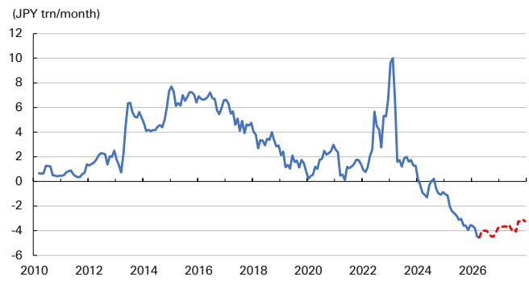
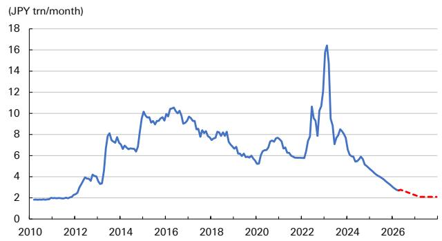

# The Bank of Japan Is Pivoting Toward Dovishness—and That Changes the Entire Rate Outlook

The Bank of Japan's June 2026 meeting appeared to deliver what markets expected: a rate hike. But beneath the surface, the decision reveals a central bank that is quietly shifting toward a more accommodative posture than any single rate move would suggest. The dovish signals embedded in this meeting—from a dissenting board member to a rewritten forward guidance and a conspicuously cautious exit from JGB purchases—collectively argue that the BoJ's normalization path will be slower, shallower, and more politically contingent than many investors currently price in.

This matters now because the consensus view on Japan's monetary tightening cycle is at a critical inflection point. Markets have been pricing in a path to 2% at roughly semi-annual increments. The evidence from this meeting suggests that scenario now faces materially higher hurdles. For global investors exposed to Japanese government bonds, the yen, and carry trades, the implications are substantial: the BoJ is signaling that it will prioritize financial stability and political sustainability over the mechanical pursuit of a neutral rate.

The argument of this article is that the BoJ's June meeting represents not just a rate decision, but a strategic reorientation. The central bank is deliberately reducing its own policy flexibility in the name of discretion—and that discretion will lean dovish. Investors who interpret this meeting as a simple continuation of the tightening cycle risk missing the deeper structural shift underway.

## A Dissenting Vote Just Three Months Into Office Signals a Politically Driven Board Shift

The most telling signal from the June meeting was not the rate hike itself, but the 7-1 vote that approved it. Board member Asada, appointed by Prime Minister Takaichi and joining the board only in March, cast the sole dissenting vote. This is not merely a procedural footnote. It is highly unusual for a new board member to publicly oppose the governor's proposal within their first three months, a period typically marked by deference to institutional norms.

The strategic implication is clear: the political appointment process is already reshaping the BoJ's decision-making dynamics. Asada's dissent was not a surprise to those who had tracked the political winds, but its early occurrence amplifies its significance. It signals that the new appointee feels empowered to break with convention, likely reflecting confidence in political backing.

Looking forward, this pattern is likely to intensify. A new member, Sato, is scheduled to join the board in June, and market participants should expect a similarly dovish inclination. More critically, the two most hawkish current members—Takata and Tamura—see their terms expire in July 2027. If Prime Minister Takaichi continues to control the appointment process for their successors, the board's center of gravity will shift decisively toward dovishness over the next 12 to 18 months.

The so-what for investors is that the BoJ's rate path is no longer solely a function of economic data. It is increasingly a function of political appointments. A board that becomes structurally more dovish will require stronger evidence of inflation persistence to justify each subsequent hike. The hurdle for action rises, and the threshold for inaction falls.

## The Revised Forward Guidance Removes Objective Anchors and Maximizes Discretion

The BoJ's revision to its forward guidance is the most analytically revealing change from the June meeting. The phrase "real interest rates are at significantly low levels"—a direct, quantifiable benchmark—was removed and replaced with "financial conditions have been accommodative." This is not a semantic adjustment. It is a fundamental shift in the framework the BoJ uses to communicate its policy stance.

The old language tied the BoJ to a specific, measurable concept: the real interest rate relative to some estimate of the natural rate. That framework, while imperfect, provided markets with a transparent reference point. The new language invokes "financial conditions," a broad, multi-dimensional concept that encompasses credit spreads, lending volumes, asset prices, exchange rates, and bank lending attitudes. As the report itself notes, this gives the BoJ "greater discretion."

This is precisely the point. The BoJ is deliberately moving away from a rules-based communication framework toward a judgment-based one. The justification, drawn from the BoJ's own March review paper on the natural rate of interest, is that concepts like the natural rate are too difficult to measure accurately to serve as reliable policy guides. This is a reasonable intellectual position, but it has a clear strategic consequence: it makes the BoJ's future actions harder to predict and easier to justify in either direction.

For investors, the critical implication is that the BoJ is signaling it does not intend to raise rates into restrictive territory. If financial conditions remain "accommodative" even after a hike, the bank retains room to pause. The report's observation that "it will take considerable time to determine if financial conditions remain accommodative even after a rate hike" is a tacit admission that the BoJ wants to slow the pace of tightening. The removal of the real-rate language effectively removes a mechanism that could have forced the BoJ's hand if real rates remained low while inflation stayed above target.

## The JGB Exit Is Conspicuously Cautious and Creates an Asymmetry That Favors Dovish Outcomes

The BoJ's decision on outright JGB purchases reveals a central bank that is far more cautious about balance sheet reduction than about rate hikes. The tapering plan will conclude at the end of March 2027, after which monthly purchases will be maintained at around 2 trillion yen. This was widely expected. What is new and significant is the justification: the BoJ explicitly stated that "improvement of market functioning and stability" is an objective of its JGB purchase operations.

This is a material shift. While "market stability" had been mentioned as a goal for flexible operations previously, incorporating both "market functioning" and "stability" into the purpose of the purchases themselves lowers the psychological and institutional threshold for the BoJ to intervene with increased purchases should long-term rates spike. The BoJ is effectively giving itself a standing mandate to cap bond yields if they rise too quickly.

The asymmetry with other policy tools makes this stance even more striking. The BoJ moved swiftly to tighten the terms of its special lending facility, with new lending ceasing at the end of June 2025 and the outstanding balance expected to fall to zero by March 2028. Similarly, the ETF exit plan was announced with a horizon of over 100 years—a deliberately glacial pace. But for JGBs, the BoJ is maintaining a permanent purchase floor.

This inconsistency raises legitimate accountability questions. Why is the exit from JGB holdings treated with such care, while the unwind of the lending facility is executed rapidly despite its impact on bank funding and collateral demand? The report rightly flags that this will become "a critical point of focus in its future dialogue with the market." The unanswered question is whether the BoJ has a coherent framework for balance sheet normalization, or whether it is making ad hoc decisions tool by tool.

## What the Report Does Not Fully Answer: The Political Economy of the Rate Path

The report provides a clear forecast—the next hike in October, followed by quarterly hikes to 1.75% by April 2027—but it leaves several critical questions unresolved. The most important is the political sustainability of this path.

The report acknowledges that the scenario of raising rates to 2% at a pace of roughly once every six months now faces a higher hurdle following Asada's dissent. But it does not fully explore what happens if the political pressure intensifies. Prime Minister Takaichi has now demonstrated her willingness to appoint dovish board members. If inflation moderates even slightly, or if economic growth disappoints, the political case for pausing the hiking cycle will become compelling.

A second unanswered question concerns the BoJ's tolerance for yen weakness. The revised forward guidance's emphasis on "financial conditions" rather than real rates implicitly gives the BoJ more room to tolerate a weaker yen if that is the consequence of maintaining accommodative conditions. The report does not address how the BoJ will balance its price stability mandate against its apparent preference for financial conditions that remain accommodative.

Finally, the report does not resolve the tension between the BoJ's rate hike forecast and its JGB purchase stance. If the BoJ is genuinely committed to raising rates to 1.75% by early 2027, why is it simultaneously maintaining a permanent floor under JGB purchases? These two policy stances are in tension: rate hikes should, all else equal, reduce the need for JGB purchases to support market functioning. The BoJ's dual approach suggests a lack of conviction in the rate path itself.

## A Decision Framework for Investors: Three Questions to Assess the BoJ's Next Moves

For investors trying to navigate this environment, the report's analysis can be distilled into a practical decision framework. Three questions should guide your assessment of each upcoming BoJ meeting.

First, what is the political composition of the board? Each new appointment matters. The Asada dissent was a leading indicator. Track the appointment calendar: the arrival of Sato in June 2026 and the expiration of Takata and Tamura's terms in July 2027 are the key inflection points. If the next appointee also dissents early, the dovish tilt is accelerating.

Second, how does the BoJ interpret "financial conditions"? The new forward guidance gives the bank wide latitude. Watch the BoJ's own communications for the indicators it cites to justify its assessment. If it focuses on credit spreads and bank lending, that is dovish. If it emphasizes the yen and equity prices, that is more ambiguous. The key is to identify which metrics the BoJ considers most important.

Third, is the JGB purchase floor being activated? The BoJ has given itself permission to increase purchases if rates spike. If long-term JGB yields rise sharply and the BoJ responds with increased purchases, that is a clear signal that the rate path is constrained from above. The BoJ's balance sheet actions will reveal its true policy stance more quickly than its rate decisions.

Using this framework, the current evidence points toward a slower, more conditional hiking cycle than the market prices. The political trajectory is dovish. The forward guidance maximizes discretion. The JGB stance provides a backstop against rising yields. The burden of proof is on those who argue for an aggressive tightening path.

## Join the Community to Read the Full Report and Review the Original Charts

The analysis above draws on a detailed research report that includes proprietary forecasts, historical comparisons, and original charts on the BoJ's balance sheet trajectory. The full report provides deeper context on the BoJ's internal debates, the evolution of its forward guidance language over multiple meetings, and the specific assumptions underlying the rate path forecast to 1.75% by April 2027. It also includes the original charts showing the outlook for the special lending facility's outstanding balance and the trajectory of the BoJ's JGB holdings through 2028. Join the community to read the full report and review the original charts.

*This article is for learning and discussion only and does not constitute investment advice.*

Personal reading notes and learning share only. Not investment advice.

