## Who is buying Treasuries, Mortgages, Credit, and Munis?

Matthew Luzzetti, Justin Weidner, Steven Zeng, Brett Ryan, Amy Yang, Raj Bhattacharyya
1 Columbus Circle

New York, New York 10019

Tel: 212 250 6161

June 2026

<table><tr><td>Table of contents</td><td>Page Number</td></tr><tr><td>Featured charts</td><td>02</td></tr><tr><td>What are foreign central banks doing?</td><td>17</td></tr><tr><td>Auction demand</td><td>27</td></tr><tr><td>Who is buying Treasuries?</td><td>35</td></tr><tr><td>Who is buying GSE MBS and agency debt?</td><td>50</td></tr><tr><td>Who is buying Corporate and Foreign Bonds?</td><td>54</td></tr><tr><td>Who is buying municipal securities and loans?</td><td>57</td></tr><tr><td>Asset allocations by investor account</td><td>61</td></tr><tr><td>Outlook</td><td>68</td></tr></table>

## Featured charts

Change in debt securities outstanding  

stacked bar chart

| Year | Tsy | Munis | Open market | Mortgages | Bank loans | Agency | Corp & frn | Cons. credit | Oth. loans | Total |
| --- | --- | --- | --- | --- | --- | --- | --- | --- | --- | --- |
| 1996 |  |  |  |  |  |  |  |  |  | $1.3 trillion |
| 1998 |  |  |  |  |  |  |  |  |  | $1.4 trillion |
| 2000 |  |  |  |  |  |  |  |  |  | $1.5 trillion |
| 2002 |  |  |  |  |  |  |  |  |  | $1.6 trillion |
| 2004 |  |  |  |  |  |  |  |  |  | $1.7 trillion |
| 2006 |  |  |  |  |  |  |  |  |  | $1.8 trillion |
| 2008 |  |  |  |  |  |  |  |  |  | $1.9 trillion |
| 2010 |  |  |  |  |  |  |  |  |  | $1.0 trillion |
| 2012 |  |  |  |  |  |  |  |  |  | $1.1 trillion |
| 2014 |  |  |  |  |  |  |  |  |  | $1.2 trillion |
| 2016 |  |  |  |  |  |  |  |  |  | $1.3 trillion |
| 2018 |  |  |  |  |  |  |  |  |  | $1.4 trillion |
| 2020 |  |  |  |  |  |  |  |  |  | $1.5 trillion |
| 2022 |  |  |  |  |  |  |  |  |  | $1.6 trillion |
| 2024 |  |  |  |  |  |  |  |  |  | $1.7 trillion |
| 2026 |  |  |  |  |  |  |  |  |  | $1.8 trillion |

Source: Fed, Macrobond, DB

## Total US fixed income securities outstanding: \$61trn as of Q1 2026

Outstanding debt securities  
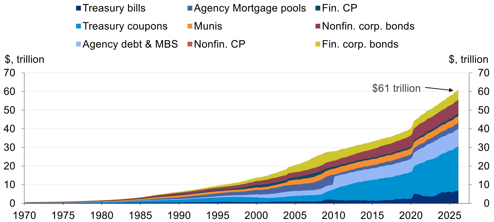

stacked bar chart

| Year | Treasury bills | Treasury coupons | Agency debt & MBS | Agency Mortgage pools | Munis | Nonfin. CP | Fin. corp. bonds | Fin. CP |
|------|-----------------|-------------------|--------------------|------------------------|-------|------------|------------------|---------|
| 2025 | ~6.5 trillion   | ~30 trillion      | ~15 trillion       | ~10 trillion            | ~8 trillion | ~5 trillion | ~40 trillion    | ~30 trillion |

Source: Fed, Macrobond, DB

## Treasury and agency securities make up about 70% of US fixed income

Outstanding debt securities  
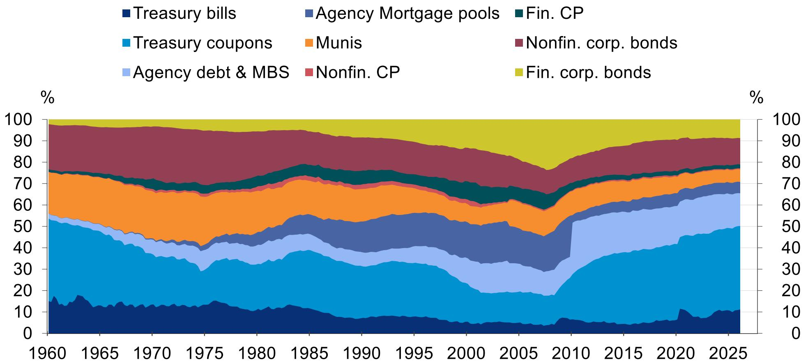

stacked bar chart

| Year | Treasury bills | Treasury coupons | Agency debt & MBS | Agency Mortgage pools | Munis | Fin. CP | Nonfin. corp. bonds | Nonfin. CP | Fin. corp. bonds |
|------|----------------|------------------|-------------------|------------------------|-------|---------|---------------------|------------|------------------|
| 1960 | ~15%           | ~30%             | ~10%              | ~15%                   | ~20%  | ~5%     | ~20%                | ~5%        | ~10%             |
| 1965 | ~10%           | ~25%             | ~10%              | ~15%                   | ~20%  | ~5%     | ~20%                | ~5%        | ~10%             |
| 1970 | ~10%           | ~20%             | ~10%              | ~15%                   | ~20%  | ~5%     | ~20%                | ~5%        | ~10%             |
| 1975 | ~10%           | ~15%             | ~10%              | ~15%                   | ~20%  | ~5%     | ~20%                | ~5%        | ~10%             |
| 1980 | ~10%           | ~15%             | ~10%              | ~15%                   | ~20%  | ~5%     | ~20%                | ~5%        | ~10%             |
| 1985 | ~10%           | ~15%             | ~10%              | ~15%                   | ~20%  | ~5%     | ~20%                | ~5%        | ~10%             |
| 1990 | ~10%           | ~15%             | ~10%              | ~15%                   | ~20%  | ~5%     | ~20%                | ~5%        | ~10%             |
| 1995 | ~10%           | ~15%             | ~10%              | ~15%                   | ~20%  | ~5%     | ~20%                | ~5%        | ~10%             |
| 2000 | ~10%           | ~15%             | ~10%              | ~15%                   | ~20%  | ~5%     | ~20%                | ~5%        | ~10%             |
| 2005 | ~10%           | ~15%             | ~10%              | ~15%                   | ~20%  | ~5%     | ~20%                | ~5%        | ~10%             |
| 2010 | ~10%           | ~15%             | ~10%              | ~15%                   | ~20%  | ~5%     | ~20%                | ~5%        | ~10%             |
| 2015 | ~10%           | ~15%             | ~10%              | ~15%                   | ~20%  | ~5%     | ~20%                | ~5%        | ~10%             |
| 2020 | ~10%           | ~15%             | ~10%              | ~15%                   | ~20%  | ~5%     | ~20%                | ~5%        | ~10%             |
| 2025 | ~10%           | ~15%             | ~10%              | ~15%                   | ~20%  | ~5%     | ~20%                | ~5%        | ~10%             |

Source: Fed, Macrobond, DB

## Treasuries' share of US fixed income has expanded significantly since the Global Financial Crisis

Treasury securities as a share of debt outstanding  
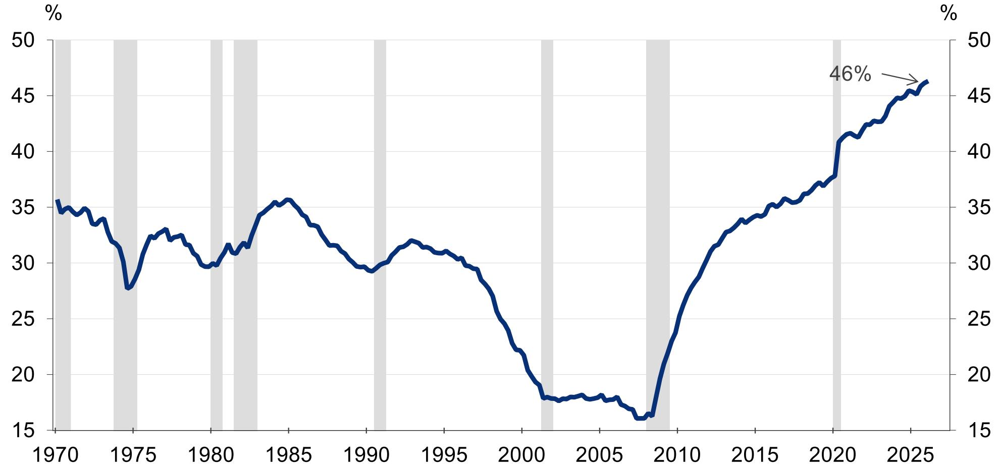

line chart

| Year | Value |
|------|-------|
| 2025 | 46%   |

Source: Fed, Macrobond, DB

## Treasury debt as a percentage of GDP is currently 96%, up from 75% before Covid

Treasury securities outstanding as a share of GDP  
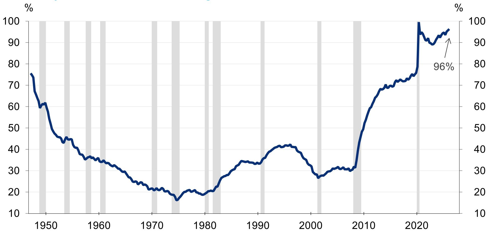

line chart

| Year | Value |
| ---- | ----- |
| 2020 | 96%   |

Source: Fed, BEA, Macrobond, DB

## Non-financial corporate debt as a percentage of GDP declined from a peak of 55% during Covid to 41% currently

Non-financial corporate debt securities and loans as a share of GDP  
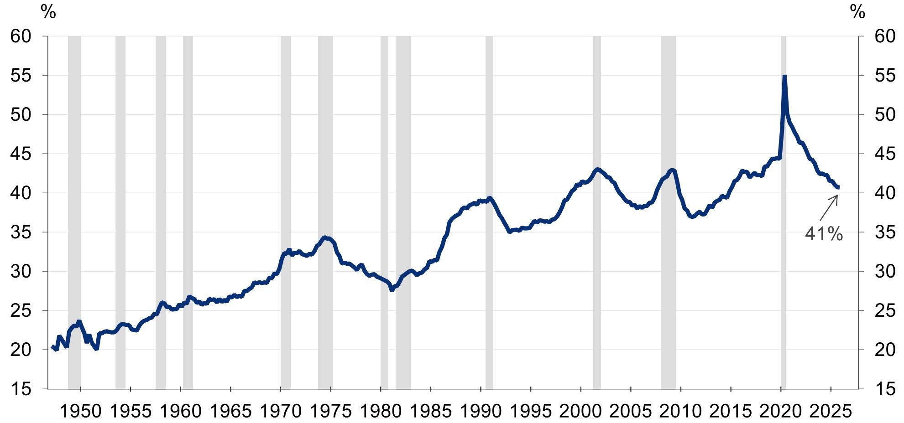

line chart

| Year | Value |
|------|-------|
| 2025 | 41%   |

Source: Fed, BEA, Macrobond, DB

Transactions in US Treasury securities  
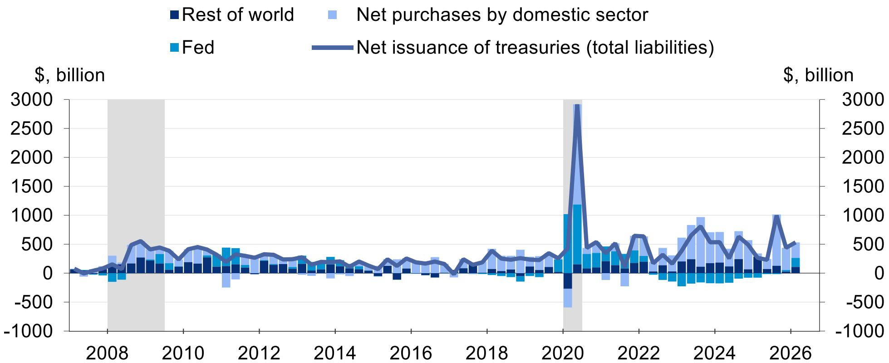

bar-line hybrid chart

| Year | Net purchases by domestic sector ($ billion) | Rest of world ($ billion) | Fed ($ billion) |
|------|-----------------------------------------------|--------------------------|----------------|
| 2008 | ~200                                          | ~100                     | ~-50           |
| 2010 | ~300                                          | ~200                     | ~-100          |
| 2012 | ~200                                          | ~150                     | ~-50           |
| 2014 | ~150                                          | ~100                     | ~-50           |
| 2016 | ~200                                          | ~150                     | ~-50           |
| 2018 | ~300                                          | ~200                     | ~-50           |
| 2020 | ~1000                                         | ~1200                    | ~1200          |
| 2022 | ~400                                          | ~300                     | ~-50           |
| 2024 | ~700                                          | ~400                     | ~-50           |
| 2026 | ~500                                          | ~300                     | ~-50           |

Source: Fed, Macrobond, DB  
Note: Domestic sector includes households, banks, pension funds, insurance, govt. retirement funds, mutual funds, GSEs and others.

## Foreign ownership of US Treasuries fell slightly to 30% in Q1 2026, not far from the multi-decade low of 29% seen in 2023 Q3

Holdings of Treasuries as % of treasury debt outstanding  
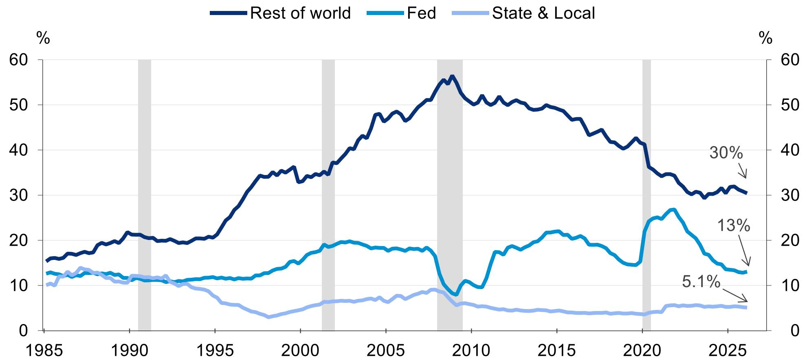

line chart

| Year | Rest of world | Fed  | State & Local |
|------|---------------|------|---------------|
| 2025 | 30%           | 13%  | 5.1%          |

Source: Fed, Macrobond, DB

## Private holdings of US Treasuries concentrated in maturity of 5 years or less

Marketable debt held outside the Federal Reserve: Maturity breakdown  
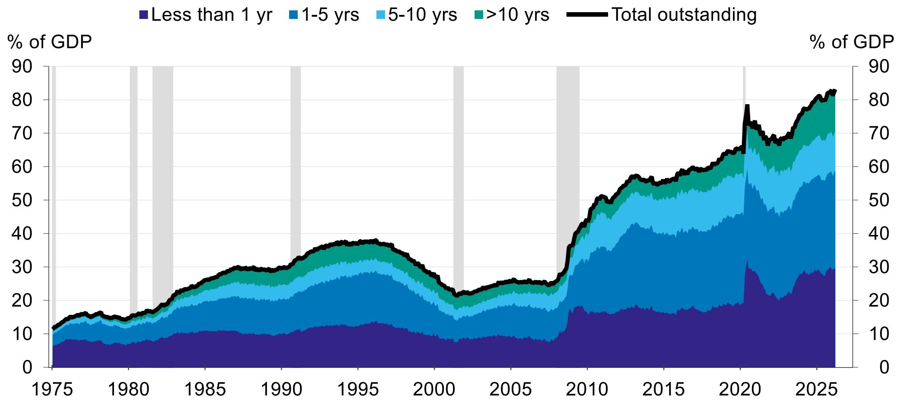

stacked bar chart

| Year | Less than 1 yr | 1-5 yrs | 5-10 yrs | >10 yrs | Total outstanding |
|------|-----------------|---------|----------|---------|-------------------|
| 1975 | ~6              | ~4      | ~3       | ~2      | ~12               |
| 1980 | ~7              | ~5      | ~4       | ~3      | ~14               |
| 1985 | ~8              | ~6      | ~5       | ~4      | ~16               |
| 1990 | ~9              | ~7      | ~6       | ~5      | ~18               |
| 1995 | ~10             | ~8      | ~7       | ~6      | ~20               |
| 2000 | ~8              | ~6      | ~5       | ~4      | ~16               |
| 2005 | ~9              | ~7      | ~6       | ~5      | ~18               |
| 2010 | ~12             | ~10     | ~8       | ~7      | ~22               |
| 2015 | ~13             | ~11     | ~9       | ~8      | ~24               |
| 2020 | ~15             | ~13     | ~11      | ~9      | ~28               |
| 2025 | ~18             | ~16     | ~13      | ~11     | ~32               |

Source: U.S. Treasury, BEA, Macrobond, DB

## Federal Reserve still owns close to 30% of Treasuries with 10-year or longer maturity

Fed holdings of Treasury securities outstanding (% by maturity)  
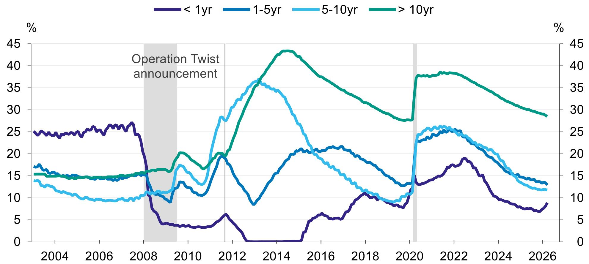

line chart

| Year | < 1yr | 1-5yr | 5-10yr | > 10yr |
|------|-------|-------|--------|--------|
| 2004 | 24.5  | 17.0  | 13.5   | 15.0   |
| 2006 | 25.0  | 14.5  | 10.5   | 14.5   |
| 2008 | 26.5  | 9.0   | 11.0   | 15.5   |
| 2010 | 3.5   | 13.0  | 17.0   | 20.0   |
| 2012 | 6.0   | 19.0  | 28.0   | 20.0   |
| 2014 | 0.0   | 15.0  | 35.0   | 43.0   |
| 2016 | 6.0   | 21.0  | 20.0   | 38.0   |
| 2018 | 11.0  | 18.0  | 12.0   | 32.0   |
| 2020 | 7.5   | 13.0  | 9.5    | 27.5   |
| 2022 | 18.5  | 25.5  | 26.0   | 38.5   |
| 2024 | 9.5   | 18.0  | 19.0   | 33.0   |
| 2026 | 8.5   | 13.5  | 12.0   | 28.5   |

Source: Fed, U.S. Treasury, Macrobond, DB

## Foreigners, insurance, and mutual funds make up majority of the investor in credit markets (IG, HY, and loans)

Holdings of corporate and foreign bonds as % outstanding  

line chart

| Year | Rest of the world | Life insurance companies | Hedge and households | Private pension funds | Mutual funds | Banks | Funding corporations |
|------|-------------------|--------------------------|----------------------|------------------------|--------------|-------|----------------------|
| 1955 | ~8                | ~62                      | ~8                   | ~12                    | ~1           | ~7    | ~1                   |
| 1960 | ~6                | ~55                      | ~10                  | ~16                    | ~1           | ~5    | ~1                   |
| 1965 | ~4                | ~50                      | ~8                   | ~18                    | ~1           | ~4    | ~1                   |
| 1970 | ~3                | ~40                      | ~12                  | ~14                    | ~1           | ~6    | ~1                   |
| 1975 | ~4                | ~35                      | ~18                  | ~12                    | ~1           | ~8    | ~1                   |
| 1980 | ~5                | ~35                      | ~15                  | ~14                    | ~1           | ~7    | ~1                   |
| 1985 | ~8                | ~33                      | ~10                  | ~16                    | ~2           | ~8    | ~1                   |
| 1990 | ~10               | ~32                      | ~12                  | ~10                    | ~4           | ~7    | ~1                   |
| 1995 | ~12               | ~30                      | ~18                  | ~8                     | ~6           | ~6    | ~1                   |
| 2000 | ~15               | ~28                      | ~10                  | ~6                     | ~8           | ~5    | ~1                   |
| 2005 | ~20               | ~25                      | ~8                   | ~4                     | ~7           | ~4    | ~1                   |
| 2010 | ~25               | ~20                      | ~6                   | ~3                     | ~10          | ~3    | ~1                   |
| 2015 | ~28               | ~22                      | ~4                   | ~4                     | ~14          | ~3    | ~1                   |
| 2020 | ~30               | ~24                      | ~2                   | ~5                     | ~16          | ~3    | ~1                   |
| 2025 | ~28               | ~23                      | ~1                   | ~4                     | ~14          | ~3    | ~1                   |

Source: Fed, Macrobond, DB

## Primary dealer net holdings of Treasuries have risen sharply since 2022

Primary dealer positions by asset class  
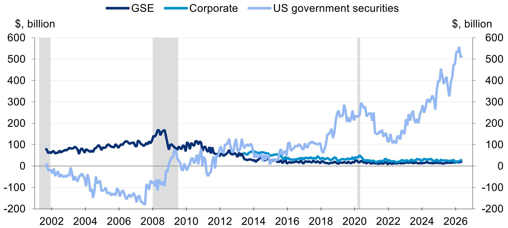

line chart

| Year | GSE (billion $) | Corporate (billion $) | US government securities (billion $) |
|------|-----------------|------------------------|--------------------------------------|
| 2002 | ~70             | ~0                     | ~0                                   |
| 2004 | ~90             | ~-50                   | ~-100                                |
| 2006 | ~100            | ~-100                  | ~-150                                |
| 2008 | ~170            | ~-150                  | ~-180                                |
| 2010 | ~80             | ~-50                   | ~-50                                 |
| 2012 | ~60             | ~50                    | ~100                                 |
| 2014 | ~40             | ~50                    | ~100                                 |
| 2016 | ~30             | ~40                    | ~150                                 |
| 2018 | ~20             | ~30                    | ~250                                 |
| 2020 | ~15             | ~30                    | ~300                                 |
| 2022 | ~15             | ~20                    | ~150                                 |
| 2024 | ~15             | ~20                    | ~300                                 |
| 2026 | ~15             | ~20                    | ~550                                 |

Source: New York Fed, Macrobond, DB

## Maturity composition of primary dealers' inventory of Treasuries

Primary Dealer Net Outright Position in US Govt. securities by category  
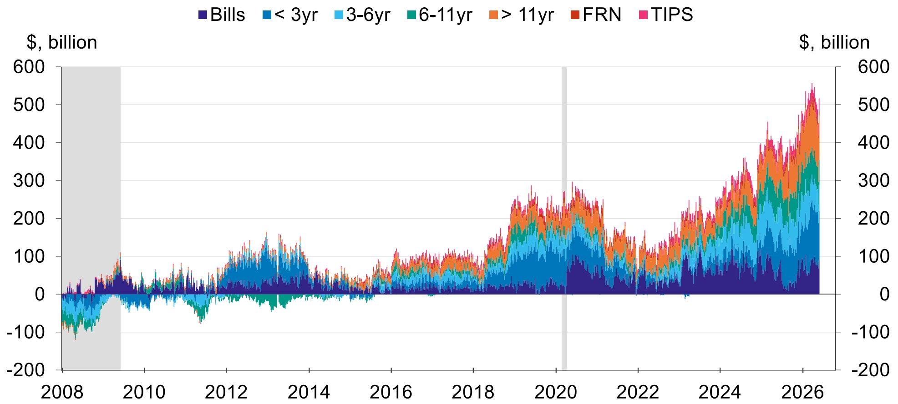

stacked bar chart

| Year | Bills | < 3yr | 3-6yr | 6-11yr | > 11yr | FRN | TIPS |
|------|-------|-------|-------|--------|--------|-----|------|
| 2008 | ~0    | ~0    | ~0    | ~0     | ~0     | ~0  | ~0   |
| 2010 | ~0    | ~0    | ~0    | ~0     | ~0     | ~0  | ~0   |
| 2012 | ~0    | ~0    | ~0    | ~0     | ~0     | ~0  | ~0   |
| 2014 | ~0    | ~0    | ~0    | ~0     | ~0     | ~0  | ~0   |
| 2016 | ~0    | ~0    | ~0    | ~0     | ~0     | ~0  | ~0   |
| 2018 | ~0    | ~0    | ~0    | ~0     | ~0     | ~0  | ~0   |
| 2020 | ~0    | ~0    | ~0    | ~0     | ~0     | ~0  | ~0   |
| 2022 | ~0    | ~0    | ~0    | ~0     | ~0     | ~0  | ~0   |
| 2024 | ~0    | ~0    | ~0    | ~0     | ~0     | ~0  | ~0   |
| 2026 | ~0    | ~0    | ~0    | ~0     | ~0     | ~0  | ~550 |
The chart includes a legend for each category (Bills, < 3yr, 3-6yr, 6-11yr, > 11yr, FRN, TIPS) but lacks explicit numerical labels on the data series.

Source: New York Fed, Macrobond, DB

## Bank holdings of Treasury and agency debt expanding again after contracting during the Fed tightening cycle

Holdings of Treasury and agency securities by commercial banks  
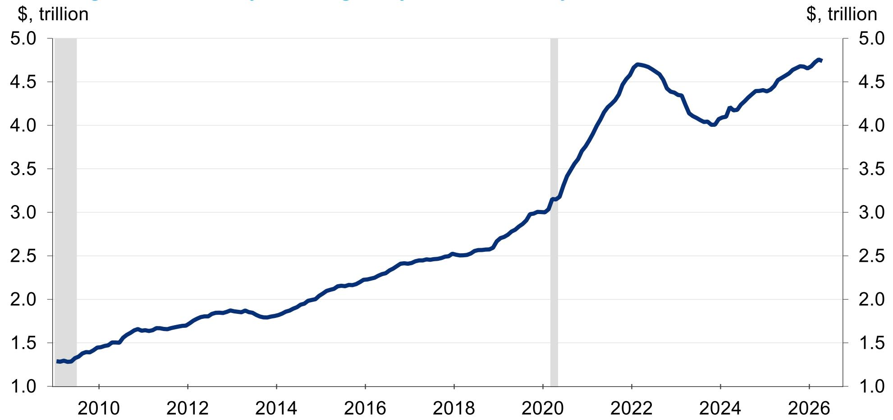

line chart

| Year | Value ($, trillion) |
| ---- | ------------------- |
| 2010 | 1.3                 |
| 2012 | 1.7                 |
| 2014 | 1.8                 |
| 2016 | 2.3                 |
| 2018 | 2.5                 |
| 2020 | 3.0                 |
| 2022 | 4.7                 |
| 2024 | 4.0                 |
| 2026 | 4.8                 |

Source: Fed, Macrobond, DB

## What are foreign central banks doing?

## Global FX reserves: \$13trn as of 2025 Q3

Global FX Reserves  
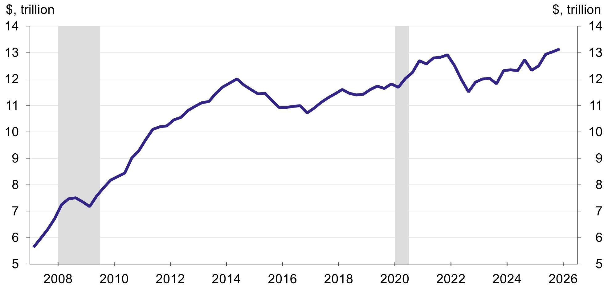

line chart

| Year | Value ($, trillion) |
| ---- | ------------------- |
| 2008 | 5.7                 |
| 2009 | 7.5                 |
| 2010 | 8.2                 |
| 2011 | 9.5                 |
| 2012 | 10.2                |
| 2013 | 11.0                |
| 2014 | 11.8                |
| 2015 | 11.5                |
| 2016 | 11.0                |
| 2017 | 10.8                |
| 2018 | 11.5                |
| 2019 | 11.7                |
| 2020 | 11.8                |
| 2021 | 12.5                |
| 2022 | 13.0                |
| 2023 | 11.5                |
| 2024 | 12.5                |
| 2025 | 13.0                |
| 2026 | 13.5                |

Source: IMF, Macrobond, DB

## Global FX reserves: USD share trending lower but remains above 50%

Allocated reserves in different currencies  
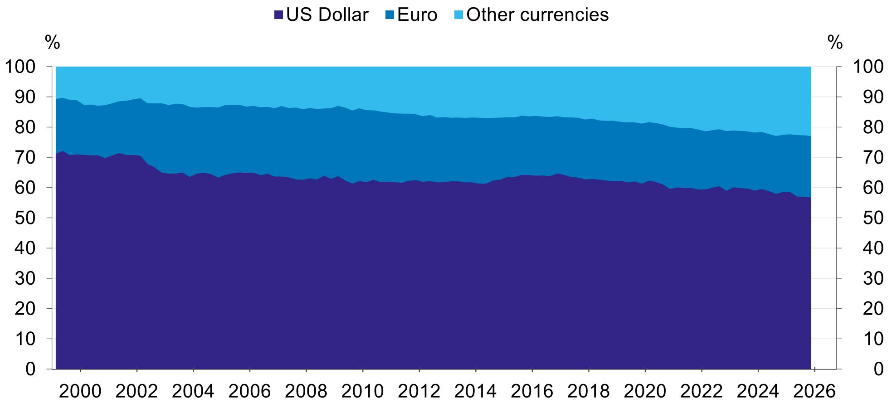

stacked bar chart

| Year | US Dollar | Euro | Other currencies |
|------|-----------|------|------------------|
| 2000 | 71        | 34   | 13               |
| 2002 | 70        | 35   | 13               |
| 2004 | 65        | 34   | 13               |
| 2006 | 64        | 34   | 13               |
| 2008 | 63        | 34   | 13               |
| 2010 | 62        | 34   | 13               |
| 2012 | 62        | 34   | 13               |
| 2014 | 61        | 34   | 13               |
| 2016 | 63        | 34   | 13               |
| 2018 | 62        | 34   | 13               |
| 2020 | 61        | 34   | 13               |
| 2022 | 60        | 34   | 13               |
| 2024 | 59        | 34   | 13               |
| 2026 | 57        | 34   | 13               |

Source: IMF, Macrobond, DB

## Value of USD reserves recovering after falling sharply in the last Fed tightening cycle

Year-over-year change in world USD reserves  
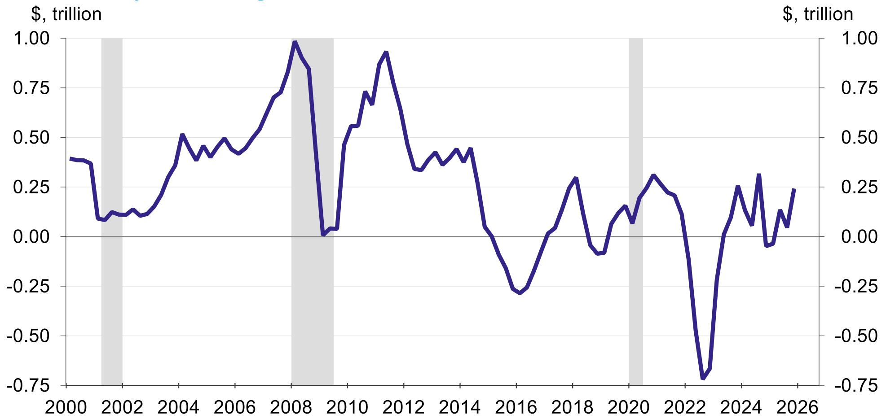

line chart

| Year | Value ($, trillion) |
|------|---------------------|
| 2000 | ~0.4                |
| 2001 | ~0.1                |
| 2002 | ~0.1                |
| 2003 | ~0.1                |
| 2004 | ~0.5                |
| 2005 | ~0.4                |
| 2006 | ~0.4                |
| 2007 | ~0.6                |
| 2008 | ~1.0                |
| 2009 | ~0.0                |
| 2010 | ~0.5                |
| 2011 | ~0.7                |
| 2012 | ~0.9                |
| 2013 | ~0.3                |
| 2014 | ~0.4                |
| 2015 | ~-0.1               |
| 2016 | ~-0.3               |
| 2017 | ~-0.2               |
| 2018 | ~0.3                |
| 2019 | ~-0.1               |
| 2020 | ~0.1                |
| 2021 | ~0.3                |
| 2022 | ~-0.7               |
| 2023 | ~-0.4               |
| 2024 | ~0.3                |
| 2025 | ~-0.1               |
| 2026 | ~0.2                |

Source: IMF, Macrobond, DB

## China's FX reserves rose to \$3.4 trillion as of May 2026

China's foreign reserves  
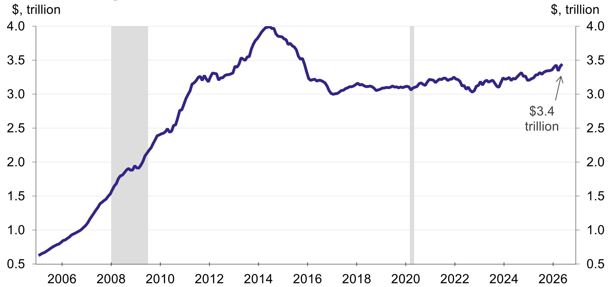

line chart

| Year | Value ($, trillion) |
| ---- | ------------------- |
| 2026 | 3.4                 |

Source: SAFE, Macrobond, DB

## China's foreign reserves

Chg. q/q \$, billion

Chg. q/q \$, billion

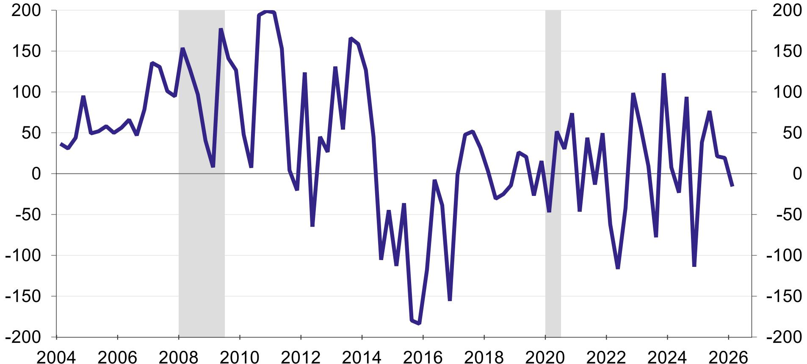

line chart

| Year | Value |
|------|-------|
| 2004 | 35    |
| 2005 | 95    |
| 2006 | 50    |
| 2007 | 65    |
| 2008 | 150   |
| 2009 | 10    |
| 2010 | 180   |
| 2011 | 160   |
| 2012 | -20   |
| 2013 | 45    |
| 2014 | 165   |
| 2015 | -100  |
| 2016 | -180  |
| 2017 | -150  |
| 2018 | 50    |
| 2019 | -30   |
| 2020 | -50   |
| 2021 | 75    |
| 2022 | -120  |
| 2023 | 100   |
| 2024 | -80   |
| 2025 | 95    |
| 2026 | -20   |

Source: SAFE, Macrobond, DB

## Federal Reserve's custodial holdings for foreign official accounts have declined

Fed custody holdings of securities for foreign central banks  
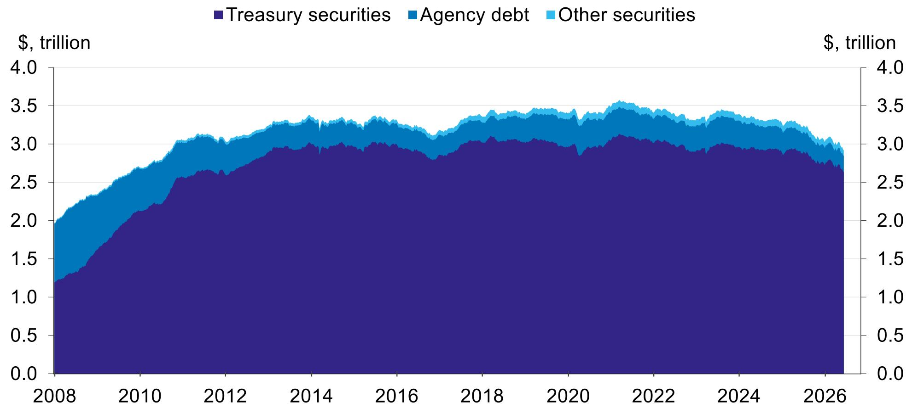

stacked bar chart

| Year | Treasury securities ($ trillion) | Agency debt ($ trillion) | Other securities ($ trillion) |
|------|----------------------------------|--------------------------|-------------------------------|
| 2008 | 1.2                              | 1.0                      | 0.0                           |
| 2010 | 2.0                              | 1.5                      | 0.5                           |
| 2012 | 2.5                              | 1.8                      | 1.0                           |
| 2014 | 2.8                              | 1.9                      | 1.2                           |
| 2016 | 2.7                              | 1.8                      | 1.3                           |
| 2018 | 2.9                              | 1.7                      | 1.4                           |
| 2020 | 2.8                              | 1.6                      | 1.5                           |
| 2022 | 2.9                              | 1.5                      | 1.6                           |
| 2024 | 2.8                              | 1.4                      | 1.7                           |
| 2026 | 2.7                              | 1.3                      | 1.8                           |

Source: Fed, Macrobond, DB

## Foreign private purchases of Treasuries remain positive while foreign official purchases are flat

Net foreign purchases: Treasury bonds and notes  
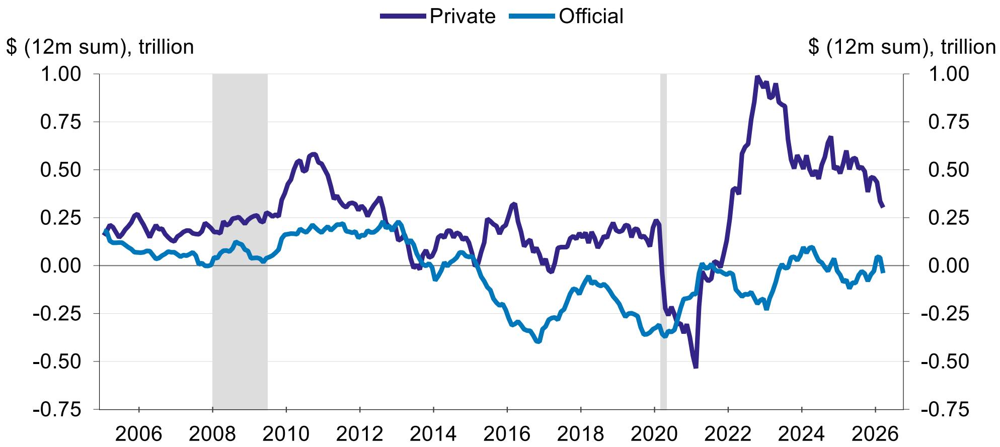

line chart

| Year | Private ($ (12m sum), trillion) | Official ($ (12m sum), trillion) |
|------|----------------------------------|----------------------------------|
| 2006 | ~0.20                            | ~0.15                            |
| 2008 | ~0.25                            | ~0.05                            |
| 2010 | ~0.55                            | ~0.15                            |
| 2012 | ~0.35                            | ~0.20                            |
| 2014 | ~0.10                            | ~-0.10                           |
| 2016 | ~0.30                            | ~-0.30                           |
| 2018 | ~0.15                            | ~-0.15                           |
| 2020 | ~0.25                            | ~-0.35                           |
| 2022 | ~0.95                            | ~-0.10                           |
| 2024 | ~0.75                            | ~0.10                            |
| 2026 | ~0.30                            | ~0.05                            |

Source: U.S. Treasury, Macrobond, DB

## Foreign official holdings shifted from Treasury notes and bonds into T-bills over last year

Holdings of US Treasury: Foreign official institutions  
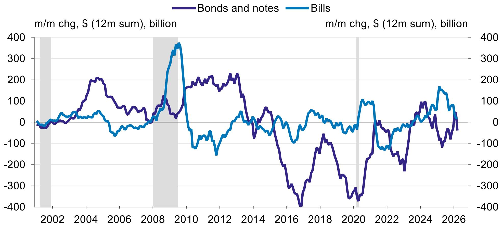

line chart

| Year | Bonds and notes ($ billion) | Bills ($ billion) |
|------|------------------------------|-------------------|
| 2002 | -10                          | 10                |
| 2004 | 200                          | 50                |
| 2006 | 100                          | -50               |
| 2008 | 50                           | 10                |
| 2010 | 150                          | 350               |
| 2012 | 200                          | -150              |
| 2014 | 100                          | 50                |
| 2016 | -300                         | -100              |
| 2018 | -100                         | 50                |
| 2020 | -350                         | -50               |
| 2022 | -150                         | -100              |
| 2024 | 50                           | 50                |
| 2026 | -50                          | 150               |

Source: U.S. Treasury, Macrobond, DB

## In aggregate, global central banks continued to reduce assets over the past six months

Monthly flow of G4 central bank asset purchases (6m moving average)  
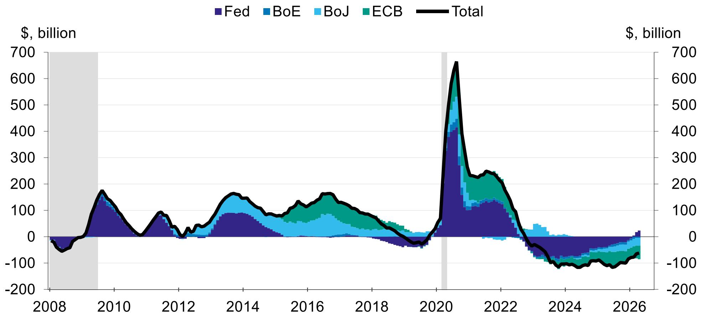

area chart

| Year | Fed  | BoE  | BoJ  | ECB  | Total |
|------|------|------|------|------|-------|
| 2008 | -50  | -40  | -30  | -20  | -10   |
| 2010 | 150  | 140  | 130  | 120  | 170   |
| 2012 | 80   | 70   | 60   | 50   | 90    |
| 2014 | 100  | 90   | 80   | 70   | 130   |
| 2016 | 120  | 110  | 100  | 90   | 150   |
| 2018 | 80   | 70   | 60   | 50   | 110   |
| 2020 | -50  | -40  | -30  | -20  | -10   |
| 2022 | 150  | 140  | 130  | 120  | 170   |
| 2024 | -100 | -90  | -80  | -70  | -60   |
| 2026 | -50  | -40  | -30  | -20  | -10   |

Source: Fed, BOJ, ECB, ONS, Macrobond, DB

## Auction demand

Bid-to-cover ratios for T-bill auctions  
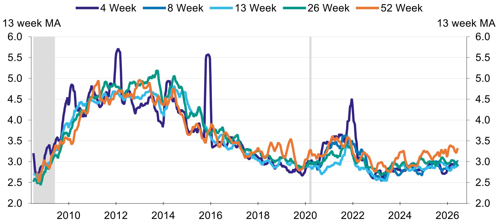

line chart

| Year | 4 Week | 8 Week | 13 Week | 26 Week | 52 Week |
|------|--------|--------|---------|---------|---------|
| 2010 | ~4.8   | ~4.5   | ~4.4    | ~4.6    | ~4.7    |
| 2012 | ~5.7   | ~4.7   | ~4.6    | ~4.9    | ~5.0    |
| 2014 | ~4.9   | ~4.6   | ~4.5    | ~5.1    | ~4.8    |
| 2016 | ~5.6   | ~3.8   | ~3.7    | ~3.9    | ~3.8    |
| 2018 | ~3.1   | ~3.0   | ~2.9    | ~3.1    | ~3.2    |
| 2020 | ~2.7   | ~2.8   | ~2.7    | ~2.9    | ~3.0    |
| 2022 | ~4.5   | ~3.5   | ~3.4    | ~3.6    | ~3.5    |
| 2024 | ~2.8   | ~2.7   | ~2.6    | ~2.8    | ~3.0    |
| 2026 | ~2.9   | ~2.9   | ~2.9    | ~3.0    | ~3.3    |

Source: U.S. Treasury, Macrobond, DB

## Investment funds have overtaken primary dealers in T-bill auction allotments

Percent awarded by investor class for T-bills  
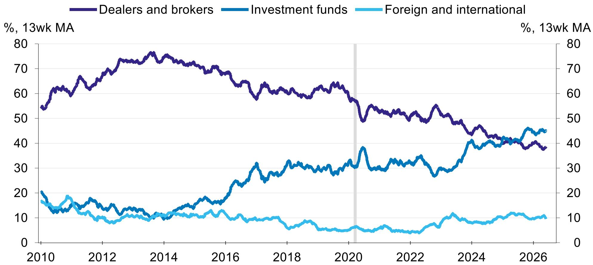

line chart

| Year | Dealers and brokers | Investment funds | Foreign and international |
|------|---------------------|------------------|----------------------------|
| 2010 | 54                  | 20               | 16                         |
| 2012 | 68                  | 15               | 10                         |
| 2014 | 75                  | 12               | 9                          |
| 2016 | 70                  | 18               | 11                         |
| 2018 | 65                  | 25               | 8                          |
| 2020 | 58                  | 30               | 6                          |
| 2022 | 50                  | 35               | 5                          |
| 2024 | 45                  | 40               | 10                         |
| 2026 | 38                  | 45               | 10                         |

Source: U.S. Treasury, Macrobond, DB

## Steady auction sizes for nominal Treasury coupon securities since 2024

Nominal security auction sizes  
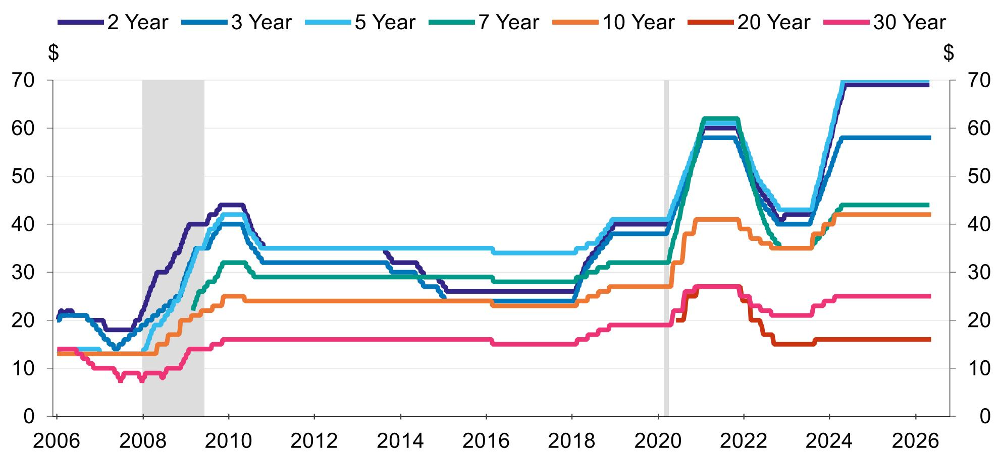

line chart

| Year | 2 Year | 3 Year | 5 Year | 7 Year | 10 Year | 20 Year | 30 Year |
|------|--------|--------|--------|--------|---------|---------|---------|
| 2006 | ~21    | ~20    | ~14    | ~13    | ~13     | ~13     | ~13     |
| 2008 | ~18    | ~15    | ~13    | ~13    | ~13     | ~8      | ~8      |
| 2010 | ~44    | ~40    | ~42    | ~32    | ~25     | ~16     | ~16     |
| 2012 | ~35    | ~32    | ~35    | ~29    | ~24     | ~16     | ~16     |
| 2014 | ~34    | ~31    | ~35    | ~28    | ~24     | ~16     | ~16     |
| 2016 | ~25    | ~24    | ~34    | ~28    | ~24     | ~16     | ~16     |
| 2018 | ~25    | ~24    | ~34    | ~28    | ~24     | ~16     | ~16     |
| 2020 | ~40    | ~39    | ~40    | ~32    | ~30     | ~20     | ~19     |
| 2022 | ~60    | ~58    | ~62    | ~62    | ~40     | ~25     | ~27     |
| 2024 | ~70    | ~58    | ~70    | ~44    | ~42     | ~16     | ~25     |
| 2026 | ~70    | ~58    | ~70    | ~44    | ~42     | ~16     | ~25     |

Source: U.S. Treasury, Macrobond, DB

## Generally stable demand for 2- to 7-year auctions

Bid-to-cover ratios for 2yr, 3yr, 5yr & 7yr auctions  
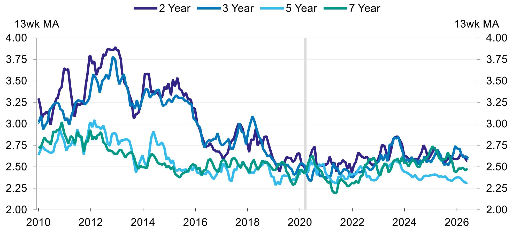

line chart

| Year | 2 Year | 3 Year | 5 Year | 7 Year |
|------|--------|--------|--------|--------|
| 2010 | 3.25   | 3.00   | 2.65   | 2.80   |
| 2011 | 3.65   | 3.25   | 2.75   | 3.00   |
| 2012 | 3.80   | 3.55   | 3.00   | 2.90   |
| 2013 | 3.90   | 3.75   | 2.90   | 2.80   |
| 2014 | 3.60   | 3.40   | 2.80   | 2.70   |
| 2015 | 3.50   | 3.35   | 2.75   | 2.65   |
| 2016 | 3.40   | 3.30   | 2.70   | 2.60   |
| 2017 | 3.20   | 3.15   | 2.65   | 2.55   |
| 2018 | 3.00   | 3.10   | 2.60   | 2.50   |
| 2019 | 2.80   | 2.95   | 2.55   | 2.45   |
| 2020 | 2.70   | 2.85   | 2.50   | 2.40   |
| 2021 | 2.60   | 2.75   | 2.45   | 2.35   |
| 2022 | 2.55   | 2.70   | 2.40   | 2.30   |
| 2023 | 2.65   | 2.75   | 2.45   | 2.35   |
| 2024 | 2.85   | 2.80   | 2.50   | 2.40   |
| 2025 | 2.75   | 2.70   | 2.45   | 2.35   |
| 2026 | 2.65   | 2.65   | 2.40   | 2.30   |

Source: U.S. Treasury, Macrobond, DB

## Investment fund allotments in 2- to 7-year auctions fell from recent highs

Percent awarded by investor class: 2yr, 3yr, 5yr & 7yr auctions  
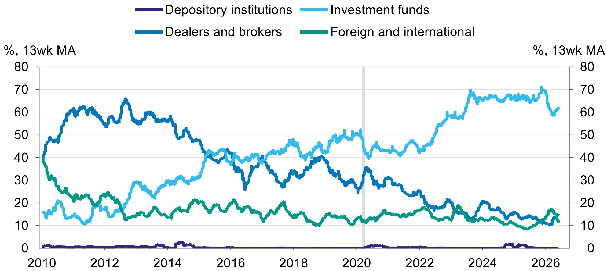

line chart

| Year | Depository institutions (%) | Dealers and brokers (%) | Foreign and international (%) | Investment funds (%) |
|------|-----------------------------|--------------------------|----------------------------------|----------------------|
| 2010 | ~0                          | ~45                      | ~35                              | ~15                  |
| 2012 | ~0                          | ~65                      | ~25                              | ~20                  |
| 2014 | ~0                          | ~55                      | ~20                              | ~30                  |
| 2016 | ~0                          | ~40                      | ~15                              | ~45                  |
| 2018 | ~0                          | ~35                      | ~10                              | ~50                  |
| 2020 | ~0                          | ~30                      | ~10                              | ~40                  |
| 2022 | ~0                          | ~25                      | ~15                              | ~55                  |
| 2024 | ~0                          | ~20                      | ~10                              | ~70                  |
| 2026 | ~0                          | ~15                      | ~15                              | ~60                  |

Source: U.S. Treasury, Macrobond, DB

## Stable demand for 10- to 30-year auctions

Bid-to-cover ratios for 10yr, 20yr & 30yr auctions  
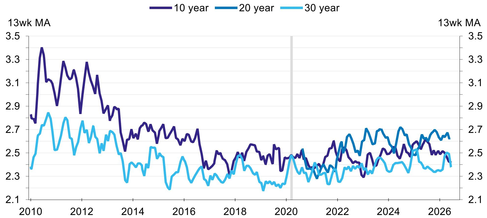

line chart

| Year | 10 year | 20 year | 30 year |
|------|---------|---------|---------|
| 2010 | 2.8     | 2.7     | 2.4     |
| 2011 | 3.4     | 2.8     | 2.8     |
| 2012 | 3.1     | 2.7     | 2.7     |
| 2013 | 2.9     | 2.6     | 2.6     |
| 2014 | 2.5     | 2.4     | 2.3     |
| 2015 | 2.7     | 2.5     | 2.4     |
| 2016 | 2.6     | 2.4     | 2.3     |
| 2017 | 2.5     | 2.3     | 2.3     |
| 2018 | 2.5     | 2.4     | 2.4     |
| 2019 | 2.4     | 2.3     | 2.3     |
| 2020 | 2.5     | 2.5     | 2.5     |
| 2021 | 2.4     | 2.4     | 2.4     |
| 2022 | 2.5     | 2.6     | 2.4     |
| 2023 | 2.4     | 2.7     | 2.5     |
| 2024 | 2.5     | 2.6     | 2.4     |
| 2025 | 2.5     | 2.7     | 2.5     |
| 2026 | 2.4     | 2.6     | 2.4     |

Source: U.S. Treasury, Macrobond, DB

## Investment fund allotments in 10- to 30-year auctions fell from recent highs

Percent awarded by investor class: 10yr, 20yr, & 30yr auctions  
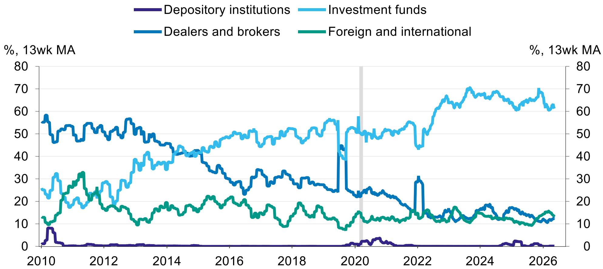

line chart

| Year | Depository institutions | Investment funds | Dealers and brokers | Foreign and international |
|------|--------------------------|------------------|---------------------|----------------------------|
| 2010 | ~8%                      | ~25%             | ~58%                | ~12%                       |
| 2012 | ~0%                      | ~30%             | ~55%                | ~25%                       |
| 2014 | ~0%                      | ~40%             | ~45%                | ~18%                       |
| 2016 | ~0%                      | ~45%             | ~35%                | ~20%                       |
| 2018 | ~0%                      | ~50%             | ~30%                | ~15%                       |
| 2020 | ~0%                      | ~55%             | ~25%                | ~10%                       |
| 2022 | ~0%                      | ~65%             | ~30%                | ~15%                       |
| 2024 | ~0%                      | ~70%             | ~18%                | ~12%                       |
| 2026 | ~0%                      | ~65%             | ~15%                | ~15%                       |

Source: U.S. Treasury, Macrobond, DB

## Who is buying Treasuries?

## Different buyers of fixed income have different price sensitivities:

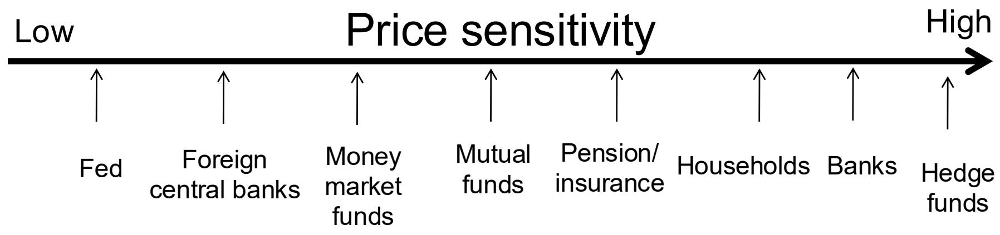

bar chart

| Category               | Price Sensitivity |
| ---------------------- | ----------------- |
| Fed                    | Low               |
| Foreign central banks  | Low               |
| Money market funds     | Low               |
| Mutual funds           | Low               |
| Pension/insurance      | Low               |
| Households             | Low               |
| Banks                  | Low               |
| Hedge funds            | Low               |

Source: DB

## Foreigners remain the largest investors in Treasury debt

Holders of Treasury securities (%)

<table><tr><td></td><td>2026 Q1</td><td>2019 Q2</td><td>2007 Q2</td></tr><tr><td>Rest of world</td><td>32.1</td><td>41.4</td><td>54.3</td></tr><tr><td>Mutual funds and ETFs</td><td>20.4</td><td>14.1</td><td>7.3</td></tr><tr><td>Federal Reserve</td><td>13.8</td><td>14.5</td><td>19.6</td></tr><tr><td>Household/hedge funds</td><td>10.5</td><td>9.8</td><td>-6.8</td></tr><tr><td>Others</td><td>7.0</td><td>0.6</td><td>9.1</td></tr><tr><td>Commercial banks</td><td>6.8</td><td>4.6</td><td>2.5</td></tr><tr><td>State and local governments</td><td>5.4</td><td>3.9</td><td>8.9</td></tr><tr><td>Investment banks</td><td>2.6</td><td>2.0</td><td>-2.7</td></tr><tr><td>Insurance companies</td><td>2.1</td><td>2.3</td><td>4.4</td></tr><tr><td>Private pensions</td><td>2.1</td><td>2.6</td><td>3.2</td></tr><tr><td>Government retirement funds</td><td>2.1</td><td>2.6</td><td>4.5</td></tr><tr><td>GSEs</td><td>0.8</td><td>0.9</td><td>0.4</td></tr><tr><td>ABS issuers</td><td>0.1</td><td>0.2</td><td>1.7</td></tr></table>

Source: Fed, Macrobond, DB. Note “Others” category includes i. Other Financial Business, ii. Non-financial Corporate and Noncorporate Business, iii. Credit Unions and iv. Instrument Discrepancies. Total may not sum to total 100% due to rounding.

## Top 5 investor categories in US Treasuries

Holdings of Treasuries as a % of Treasury debt outstanding - Top 5  
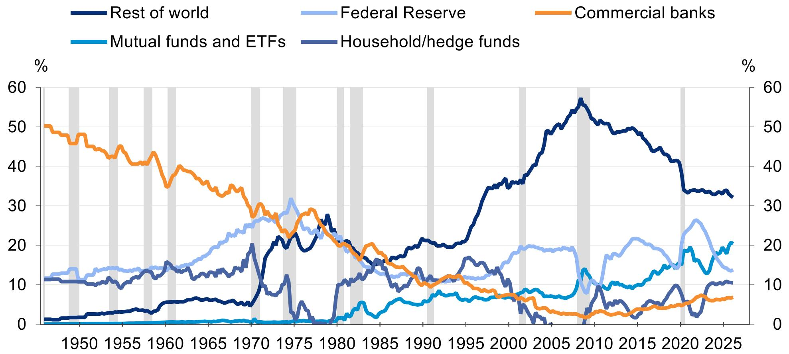

line chart

| Year | Rest of world | Federal Reserve | Mutual funds and ETFs | Commercial banks | Household/hedge funds |
|------|---------------|-----------------|------------------------|------------------|------------------------|
| 1950 | ~1            | ~13             | ~0                     | ~50              | ~10                    |
| 1955 | ~2            | ~14             | ~0                     | ~45              | ~10                    |
| 1960 | ~4            | ~14             | ~0                     | ~40              | ~12                    |
| 1965 | ~5            | ~16             | ~0                     | ~35              | ~13                    |
| 1970 | ~6            | ~20             | ~0                     | ~30              | ~15                    |
| 1975 | ~20           | ~30             | ~0                     | ~25              | ~10                    |
| 1980 | ~25           | ~20             | ~0                     | ~20              | ~15                    |
| 1985 | ~20           | ~15             | ~5                     | ~15              | ~10                    |
| 1990 | ~20           | ~12             | ~7                     | ~10              | ~12                    |
| 1995 | ~25           | ~15             | ~8                     | ~8               | ~15                    |
| 2000 | ~35           | ~18             | ~8                     | ~6               | ~10                    |
| 2005 | ~45           | ~18             | ~8                     | ~4               | ~0                     |
| 2010 | ~55           | ~15             | ~13                    | ~2               | ~5                     |
| 2015 | ~50           | ~20             | ~10                    | ~3               | ~5                     |
| 2020 | ~40           | ~25             | ~18                    | ~5               | ~10                    |
| 2025 | ~32           | ~13             | ~20                    | ~6               | ~10                    |

Source: Fed, Macrobond, DB

## Other investor categories ( $6^{th}-10^{th}$ ) in US Treasuries

Holdings of Treasuries as a % of Treasury debt outstanding - Next 5  

line chart

| Year | State and local governments | Insurance companies | Private pensions | Investment banks | Government retirement funds |
|------|-----------------------------|---------------------|------------------|------------------|-----------------------------|
| 1950 | ~3.5%                       | ~13.5%              | ~1.0%            | ~0.5%            | ~1.5%                       |
| 1960 | ~7.0%                       | ~6.5%               | ~1.5%            | ~0.5%            | ~2.5%                       |
| 1970 | ~10.0%                      | ~4.0%               | ~1.0%            | ~0.5%            | ~2.0%                       |
| 1980 | ~13.0%                      | ~3.0%               | ~5.0%            | ~1.0%            | ~3.0%                       |
| 1990 | ~12.0%                      | ~7.0%               | ~6.0%            | ~2.5%            | ~8.0%                       |
| 2000 | ~3.0%                       | ~4.0%               | ~4.0%            | ~0.5%            | ~7.0%                       |
| 2010 | ~6.0%                       | ~3.0%               | ~2.5%            | ~1.5%            | ~2.5%                       |
| 2020 | ~5.5%                       | ~2.5%               | ~2.0%            | ~1.5%            | ~2.0%                       |

Source: Fed, Macrobond, DB

## Net issuance of Treasury notes and bonds remains elevated relative to pre-Covid levels

Net issuance of Treasury notes and bonds  
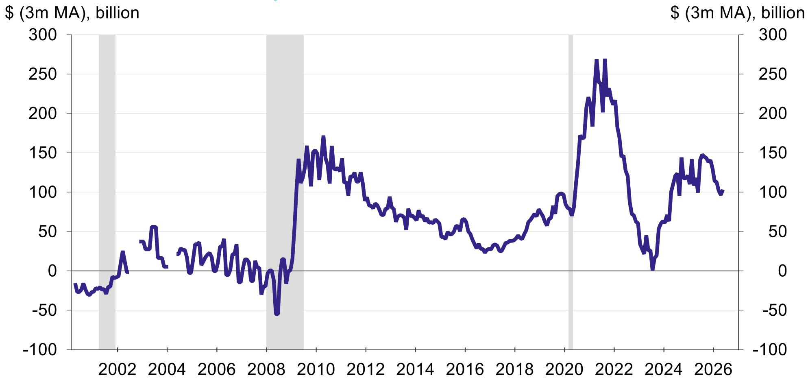

line chart

| Year | Value ($ (3m MA), billion) |
|------|-----------------------------|
| 2002 | -20                         |
| 2003 | 25                          |
| 2004 | 55                          |
| 2005 | 10                          |
| 2006 | 35                          |
| 2007 | 15                          |
| 2008 | -30                         |
| 2009 | -60                         |
| 2010 | 140                         |
| 2011 | 165                         |
| 2012 | 130                         |
| 2013 | 110                         |
| 2014 | 85                          |
| 2015 | 70                          |
| 2016 | 60                          |
| 2017 | 45                          |
| 2018 | 55                          |
| 2019 | 75                          |
| 2020 | 95                          |
| 2021 | 170                         |
| 2022 | 270                         |
| 2023 | 150                         |
| 2024 | 10                          |
| 2025 | 145                         |
| 2026 | 105                         |

Source: SIFMA, Macrobond, DB

## The Fed's bond portfolio fell by more than \$2trn during QT but is rising again with reserve management purchases (RMPs)

Treasuries and MBS outstanding held by the Fed  
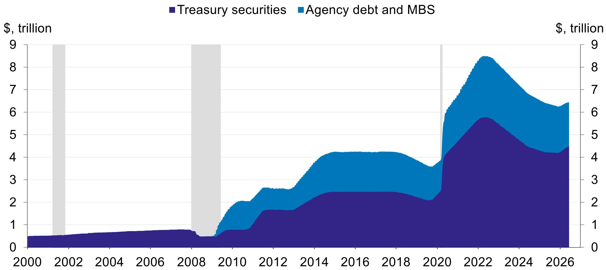

stacked bar chart

| Year | Treasury securities ($ trillion) | Agency debt and MBS ($ trillion) |
|------|----------------------------------|----------------------------------|
| 2000 | 0.5                              | 0                                |
| 2002 | 0.6                              | 0                                |
| 2004 | 0.7                              | 0                                |
| 2006 | 0.8                              | 0                                |
| 2008 | 0.9                              | 0                                |
| 2010 | 1.5                              | 1.5                              |
| 2012 | 2.0                              | 2.0                              |
| 2014 | 2.5                              | 3.0                              |
| 2016 | 2.5                              | 3.5                              |
| 2018 | 2.5                              | 3.5                              |
| 2020 | 2.0                              | 4.0                              |
| 2022 | 5.5                              | 6.5                              |
| 2024 | 4.5                              | 5.5                              |
| 2026 | 4.5                              | 4.5                              |

Source: Fed, Macrobond, DB

## Money market funds hold primarily short-term Treasury securities and repo

Money market mutual funds holdings  
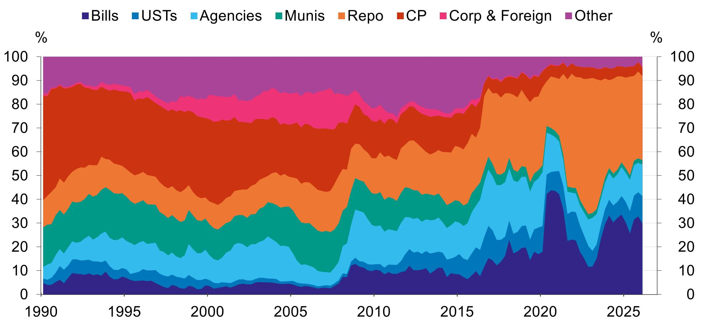

stacked bar chart

| Year | Bills | USTs | Agencies | Munis | Repo | CP | Corp & Foreign | Other |
|------|-------|------|----------|-------|------|----|----------------|-------|
| 1990 | 5     | 3    | 8        | 15    | 10   | 40 | 5              | 15    |
| 1995 | 6     | 4    | 10       | 18    | 12   | 35 | 5              | 15    |
| 2000 | 7     | 5    | 12       | 16    | 14   | 30 | 5              | 15    |
| 2005 | 8     | 6    | 14       | 17    | 16   | 25 | 5              | 15    |
| 2010 | 10    | 8    | 16       | 18    | 20   | 20 | 5              | 15    |
| 2015 | 12    | 10   | 18       | 20    | 25   | 15 | 5              | 15    |
| 2020 | 15    | 12   | 20       | 22    | 30   | 10 | 5              | 15    |
| 2025 | 20    | 15   | 22       | 25    | 35   | 5  | 5              | 15    |

Source: Fed, Macrobond, DB

## Bank holdings of Treasury and agency securities track their deposit liabilities

Large domestically chartered commercial banks holdings of US Treasuries & Deposits  
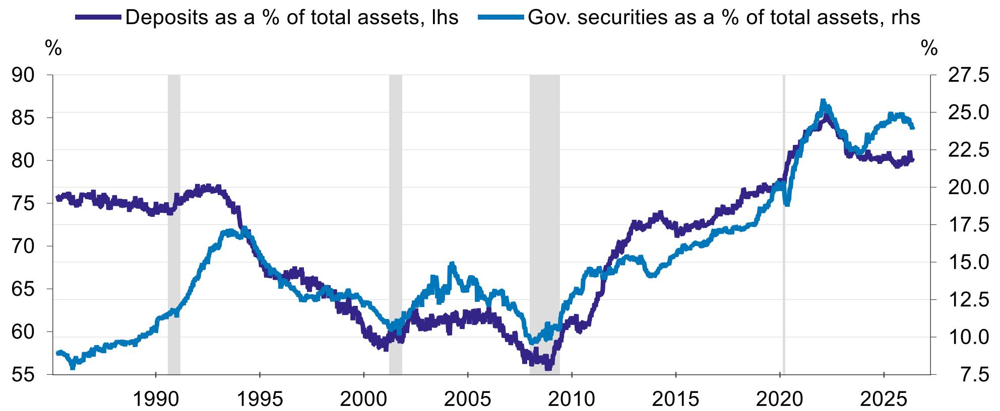

line chart

| Year | Deposits as % of total assets, lhs | Gov. securities as % of total assets, rhs |
|------|------------------------------------|-------------------------------------------|
| 1990 | ~75                                | ~10                                       |
| 1995 | ~68                                | ~15                                       |
| 2000 | ~60                                | ~10                                       |
| 2005 | ~62                                | ~15                                       |
| 2010 | ~60                                | ~10                                       |
| 2015 | ~75                                | ~15                                       |
| 2020 | ~85                                | ~20                                       |
| 2025 | ~80                                | ~25                                       |

Source: Fed, Macrobond, DB

## Foreign ownership of T-bills nears a multi-decade low

Treasury bills held by foreigners as % of outstanding  
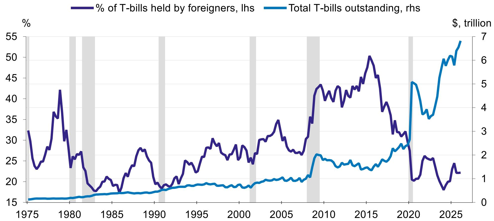

bar-line hybrid chart

| Year | % of T-bills held by foreigners, lhs | Total T-bills outstanding, rhs ($, trillion) |
|------|----------------------------------------|-----------------------------------------------|
| 1975 | ~32                                    | ~0.5                                          |
| 1980 | ~42                                    | ~0.6                                          |
| 1985 | ~18                                    | ~0.7                                          |
| 1990 | ~19                                    | ~0.8                                          |
| 1995 | ~25                                    | ~0.9                                          |
| 2000 | ~28                                    | ~1.0                                          |
| 2005 | ~35                                    | ~1.5                                          |
| 2010 | ~43                                    | ~2.0                                          |
| 2015 | ~50                                    | ~2.5                                          |
| 2020 | ~30                                    | ~5.0                                          |
| 2025 | ~22                                    | ~7.0                                          |

Source: Fed, Macrobond, DB

## Foreign private holdings skew toward longer maturities compared to foreign official holdings

Maturity structure of Treasury holdings  
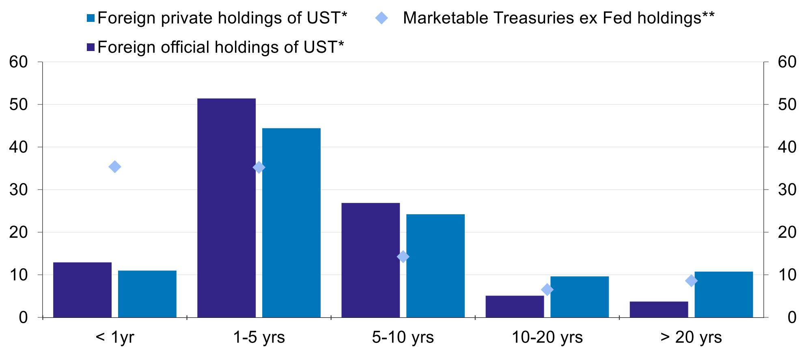

bar-line hybrid chart

| Maturity | Foreign private holdings of UST* | Foreign official holdings of UST* | Marketable Treasuries ex Fed holdings** |
| :--- | :--- | :--- | :--- |
| < 1yr | 11 | 13 | 36 |
| 1-5 yrs | 44 | 51 | 35 |
| 5-10 yrs | 24 | 27 | 14 |
| 10-20 yrs | 9 | 5 | 6 |
| > 20 yrs | 11 | 3 | 9 |

Source: U.S. Treasury, Macrobond, DB  
\* Latest data for 2025 released on 5/1/2026 \*\* Latest data for March 2026 released on 6/3/2026

## China's reported holdings of Treasuries continues to fall, while Europe, UK, and Canadian holdings are rising

Holdings of US Treasury securities  
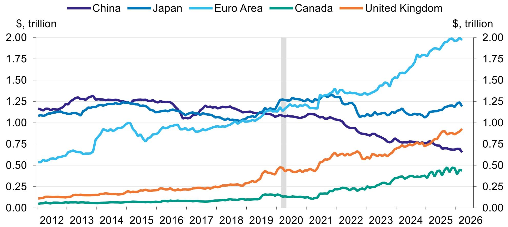

line chart

| Year | China ($ trillion) | Japan ($ trillion) | Euro Area ($ trillion) | Canada ($ trillion) | United Kingdom ($ trillion) |
|------|---------------------|--------------------|------------------------|---------------------|-----------------------------|
| 2012 | ~1.15               | ~1.10              | ~0.55                  | ~0.05               | ~0.10                       |
| 2013 | ~1.30               | ~1.15              | ~0.65                  | ~0.05               | ~0.15                       |
| 2014 | ~1.28               | ~1.20              | ~0.95                  | ~0.05               | ~0.18                       |
| 2015 | ~1.25               | ~1.18              | ~0.75                  | ~0.05               | ~0.20                       |
| 2016 | ~1.20               | ~1.15              | ~0.90                  | ~0.05               | ~0.22                       |
| 2017 | ~1.15               | ~1.10              | ~0.95                  | ~0.05               | ~0.25                       |
| 2018 | ~1.10               | ~1.05              | ~1.00                  | ~0.05               | ~0.30                       |
| 2019 | ~1.05               | ~1.00              | ~1.10                  | ~0.10               | ~0.40                       |
| 2020 | ~1.00               | ~1.25              | ~1.20                  | ~0.15               | ~0.45                       |
| 2021 | ~1.05               | ~1.30              | ~1.35                  | ~0.20               | ~0.60                       |
| 2022 | ~1.00               | ~1.25              | ~1.35                  | ~0.25               | ~0.65                       |
| 2023 | ~0.95               | ~1.15              | ~1.45                  | ~0.30               | ~0.70                       |
| 2024 | ~0.85               | ~1.10              | ~1.65                  | ~0.35               | ~0.75                       |
| 2025 | ~0.75               | ~1.20              | ~1.85                  | ~0.45               | ~0.85                       |
| 2026 | ~0.65               | ~1.25              | ~2.00                  | ~0.45               | ~0.95                       |

Source: U.S. Treasury, Macrobond, DB

## China appears to have restarted buying USD equities in early 2026

China net purchases by asset class  
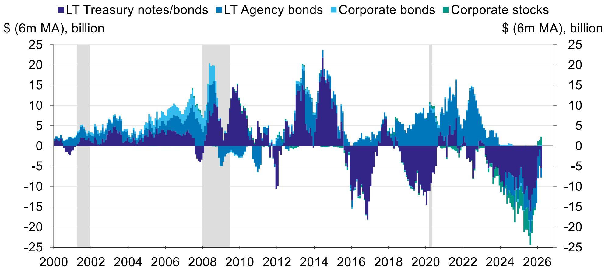

bar-line hybrid chart

| Year | LT Treasury notes/bonds ($ (6m MA), billion) | LT Agency bonds ($ (6m MA), billion) | Corporate bonds ($ (6m MA), billion) | Corporate stocks ($ (6m MA), billion) |
|------|-----------------------------------------------|--------------------------------------|--------------------------------------|---------------------------------------|
| 2000 | ~0                                            | ~0                                   | ~0                                   | ~0                                    |
| 2002 | ~0                                            | ~5                                   | ~5                                   | ~0                                    |
| 2004 | ~0                                            | ~7                                   | ~7                                   | ~0                                    |
| 2006 | ~0                                            | ~10                                  | ~10                                  | ~0                                    |
| 2008 | ~-5                                           | ~15                                  | ~15                                  | ~0                                    |
| 2010 | ~15                                           | ~10                                  | ~10                                  | ~0                                    |
| 2012 | ~-10                                          | ~5                                   | ~5                                   | ~0                                    |
| 2014 | ~25                                           | ~20                                  | ~20                                  | ~0                                    |
| 2016 | ~-15                                          | ~5                                   | ~5                                   | ~0                                    |
| 2018 | ~-10                                          | ~7                                   | ~7                                   | ~0                                    |
| 2020 | ~-15                                          | ~10                                  | ~10                                  | ~0                                    |
| 2022 | ~-5                                           | ~15                                  | ~15                                  | ~0                                    |
| 2024 | ~-10                                          | ~5                                   | ~5                                   | ~-5                                   |
| 2026 | ~-25                                          | ~-15                                 | ~-15                                 | ~-15                                  |

Source: U.S. Treasury, Macrobond, DB

## Foreign buying of equities has accelerated in recent quarters on a 12m basis

Net foreign buying of all US securities  
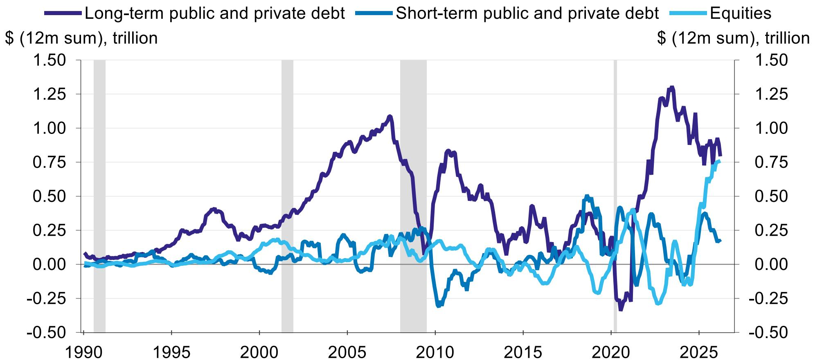

line chart

| Year | Long-term public and private debt ($ (12m sum), trillion) | Short-term public and private debt ($ (12m sum), trillion) | Equities ($ (12m sum), trillion) |
|------|----------------------------------------------------------|----------------------------------------------------------|----------------------------------|
| 1990 | ~0.05                                                    | ~0.00                                                    | ~0.00                            |
| 1995 | ~0.25                                                    | ~0.05                                                    | ~0.05                            |
| 2000 | ~0.35                                                    | ~0.10                                                    | ~0.15                            |
| 2005 | ~0.85                                                    | ~0.20                                                    | ~0.10                            |
| 2010 | ~0.80                                                    | ~-0.30                                                   | ~0.15                            |
| 2015 | ~0.40                                                    | ~0.10                                                    | ~-0.10                           |
| 2020 | ~-0.30                                                   | ~0.40                                                    | ~-0.25                           |
| 2025 | ~1.30                                                    | ~0.75                                                    | ~0.75                            |

Source: U.S. Treasury, Macrobond, DB

## Foreign demand is rising for corporate bonds and falling for Treasury and agency bonds

Net foreign buying of US debt securities  
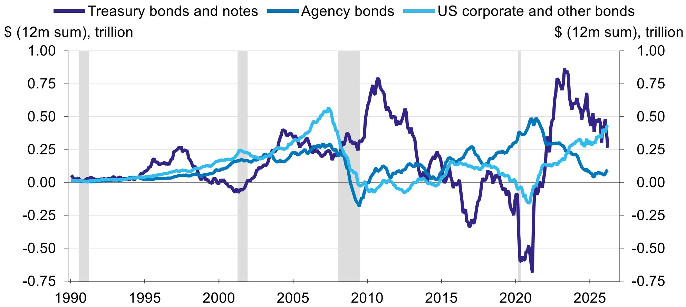

line chart

| Year | Treasury bonds and notes ($ (12m sum), trillion) | Agency bonds ($ (12m sum), trillion) | US corporate and other bonds ($ (12m sum), trillion) |
|------|--------------------------------------------------|--------------------------------------|----------------------------------------------------|
| 1990 | ~0.00                                            | ~0.00                                | ~0.00                                              |
| 1995 | ~0.15                                            | ~0.05                                | ~0.05                                              |
| 2000 | ~-0.10                                           | ~0.10                                | ~0.15                                              |
| 2005 | ~0.40                                            | ~0.25                                | ~0.35                                              |
| 2010 | ~0.80                                            | ~-0.20                               | ~-0.10                                             |
| 2015 | ~0.20                                            | ~0.15                                | ~0.10                                              |
| 2020 | ~-0.60                                           | ~-0.30                               | ~-0.25                                             |
| 2025 | ~0.45                                            | ~0.35                                | ~0.40                                              |

Source: U.S. Treasury, Macrobond, DB

## Who is buying GSE MBS and agency debt?

## Commercial banks are the largest investor with 25% of total agency securities outstanding, steady since 2019

Holders of agency and GSE-backed debt securities (%)

<table><tr><td></td><td>2026 Q1</td><td>Q2 2019</td><td>Q2 2007</td></tr><tr><td>Commercial banks</td><td>24.8</td><td>25.1</td><td>19.2</td></tr><tr><td>Federal Reserve</td><td>14.6</td><td>16.4</td><td>0.0</td></tr><tr><td>Others</td><td>14.8</td><td>6.7</td><td>11.5</td></tr><tr><td>Mutual funds</td><td>16.0</td><td>13.9</td><td>11.0</td></tr><tr><td>Rest of world</td><td>12.0</td><td>11.9</td><td>21.2</td></tr><tr><td>Households/Hedge funds</td><td>6.9</td><td>6.8</td><td>1.4</td></tr><tr><td>Investment banks</td><td>5.5</td><td>3.1</td><td>7.4</td></tr><tr><td>Insurance companies</td><td>4.6</td><td>5.5</td><td>7.8</td></tr><tr><td>GSEs</td><td>2.6</td><td>2.7</td><td>10.3</td></tr><tr><td>Private pensions</td><td>2.4</td><td>2.3</td><td>2.7</td></tr><tr><td>Government retirement funds</td><td>1.7</td><td>1.6</td><td>3.8</td></tr><tr><td>ABS issuers</td><td>0.0</td><td>0.0</td><td>5.0</td></tr></table>

Source: Fed, Macrobond, DB. Note “Others” includes i) Non-financial Corporate ii) Government, iii. Credit Unions, iv) REITs, Holding companies and v) Instrument Discrepancies. Total may not sum to total 100% due to rounding.

## Agency MBS ownership relatively spread out among investor categories

Holdings of agency securities as % of outstanding  
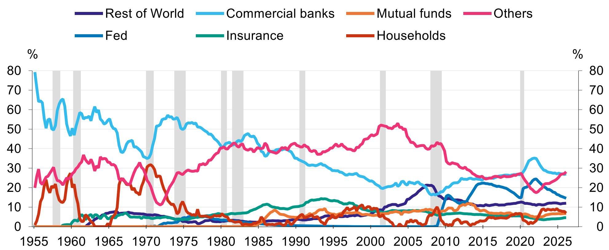

line chart

| Year | Rest of World | Commercial banks | Mutual funds | Insurance | Households | Others |
|------|---------------|------------------|--------------|---------|------------|--------|
| 1955 | ~0            | ~80              | ~0           | ~0      | ~0         | ~20    |
| 1960 | ~5            | ~65              | ~0           | ~5      | ~25        | ~35    |
| 1965 | ~7            | ~55              | ~0           | ~7      | ~10        | ~30    |
| 1970 | ~5            | ~40              | ~0           | ~5      | ~30        | ~25    |
| 1975 | ~3            | ~55              | ~0           | ~5      | ~10        | ~20    |
| 1980 | ~2            | ~45              | ~0           | ~7      | ~5         | ~35    |
| 1985 | ~3            | ~40              | ~0           | ~10     | ~5         | ~40    |
| 1990 | ~4            | ~35              | ~0           | ~12     | ~5         | ~40    |
| 1995 | ~5            | ~30              | ~0           | ~13     | ~5         | ~40    |
| 2000 | ~8            | ~25              | ~0           | ~14     | ~5         | ~45    |
| 2005 | ~12           | ~20              | ~0           | ~13     | ~5         | ~50    |
| 2010 | ~15           | ~18              | ~0           | ~12     | ~5         | ~40    |
| 2015 | ~12           | ~22              | ~10          | ~10     | ~5         | ~25    |
| 2020 | ~13           | ~35              | ~8           | ~8      | ~5         | ~28    |
| 2025 | ~12           | ~28              | ~7           | ~7      | ~7         | ~28    |

Source: Fed, Macrobond, DB. Note: Banks consists of Commercial banking, U.S. Charted depository institutes, Foreign banking offices, Banks in U.S. possessions and Holding Companies

## Mortgage activity perked up slightly as mortgage rates have come down slightly

Total new mortgages  
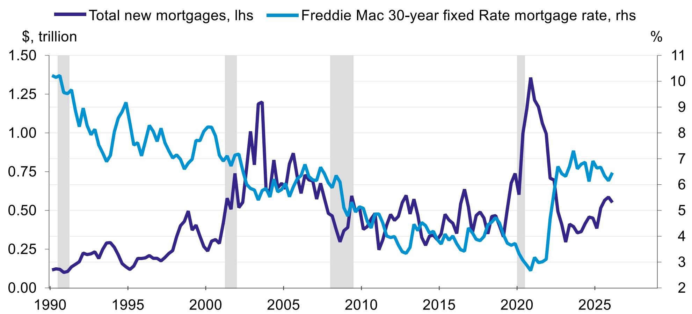

bar-line hybrid chart

| Year | Total new mortgages, lhs ($ trillion) | Freddie Mac 30-year fixed Rate mortgage rate, rhs (%) |
|------|----------------------------------------|-----------------------------------------------------|
| 1990 | ~0.10                                  | ~10.5                                               |
| 1995 | ~0.25                                  | ~8.5                                                |
| 2000 | ~0.50                                  | ~7.5                                                |
| 2005 | ~0.80                                  | ~6.0                                                |
| 2010 | ~0.40                                  | ~5.0                                                |
| 2015 | ~0.30                                  | ~4.5                                                |
| 2020 | ~0.70                                  | ~3.0                                                |
| 2025 | ~0.60                                  | ~7.0                                                |

Source: MBA, Freddie Mac, Macrobond, DB

## Who is buying Corporate and Foreign Bonds?

## Foreign investors and insurance companies own combined over half of corporate and foreign bonds

Holders of corporate and foreign bonds (%)

<table><tr><td></td><td>2026 Q1</td><td>Q2 2019</td><td>Q2 2007</td></tr><tr><td>Insurance companies</td><td>28.0</td><td>28.3</td><td>22.3</td></tr><tr><td>Rest of World</td><td>25.9</td><td>26.6</td><td>18.1</td></tr><tr><td>Mutual funds and ETFs</td><td>23.8</td><td>20.8</td><td>12.5</td></tr><tr><td>Others</td><td>3.5</td><td>3.3</td><td>23.6</td></tr><tr><td>Commercial banks</td><td>5.4</td><td>5.0</td><td>9.9</td></tr><tr><td>Private pension funds</td><td>5.4</td><td>6.5</td><td>3.5</td></tr><tr><td>Government retirement funds</td><td>4.0</td><td>3.8</td><td>4.0</td></tr><tr><td>Government</td><td>1.8</td><td>2.5</td><td>1.7</td></tr><tr><td>Households/hedge funds</td><td>1.1</td><td>1.6</td><td>5.7</td></tr><tr><td>Finance companies</td><td>0.1</td><td>0.4</td><td>2.0</td></tr></table>

Source: Fed, Macrobond, DB. Note “Others” includes i) Instrument Discrepancies, ii) Holding Companies, iii) Security Brokers & Dealers, iv) REITs, v) Govt-Sponsored Enterprises and vi) Credit Unions. Total may not sum to total 100% due to rounding.

## Growth in financial corporate and foreign bond supply remains positive

Net issuance of corporate & foreign bonds  
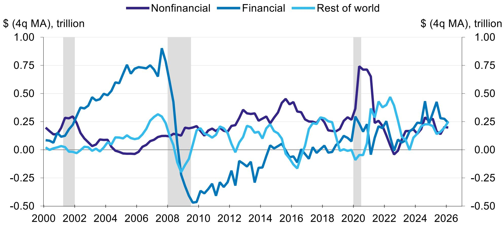

line chart

| Year | Nonfinancial | Financial | Rest of world |
|------|--------------|-----------|---------------|
| 2000 | 0.15         | 0.08      | 0.02          |
| 2002 | 0.28         | 0.35      | -0.01         |
| 2004 | 0.05         | 0.45      | 0.08          |
| 2006 | -0.02        | 0.75      | 0.15          |
| 2008 | 0.12         | 0.90      | 0.30          |
| 2010 | 0.20         | -0.45     | -0.15         |
| 2012 | 0.18         | -0.35     | 0.18          |
| 2014 | 0.35         | -0.25     | 0.25          |
| 2016 | 0.45         | -0.15     | -0.18         |
| 2018 | 0.25         | 0.05      | 0.28          |
| 2020 | 0.75         | 0.30      | -0.10         |
| 2022 | 0.25         | 0.25      | 0.45          |
| 2024 | 0.15         | 0.45      | 0.25          |
| 2026 | 0.20         | 0.35      | 0.28          |

Source: Fed, Macrobond, DB

## Who is buying municipal securities and loans?

## Household sector accounts for close to half of total municipal bonds outstanding

Holders of municipal securities and loans (%)

<table><tr><td></td><td>2026 Q1</td><td>Q2 2019</td><td>Q2 2007</td></tr><tr><td>Households/hedge funds</td><td>48.6</td><td>48.8</td><td>52.2</td></tr><tr><td>Mutual funds and ETFs</td><td>29.1</td><td>25.2</td><td>25.9</td></tr><tr><td>Commercial banks</td><td>11.1</td><td>12.2</td><td>5.8</td></tr><tr><td>Insurance companies</td><td>8.7</td><td>12.1</td><td>11.9</td></tr><tr><td>Other</td><td>6.6</td><td>-4.3</td><td>2.0</td></tr><tr><td>Rest of world</td><td>2.9</td><td>2.6</td><td>1.1</td></tr><tr><td>Security brokers</td><td>0.4</td><td>0.4</td><td>1.6</td></tr></table>

Source: Fed, Macrobond, DB. Note “Others” mainly includes i) Non-financial corporate & non-corporate ii) S&L Government, iii. Credit Unions, iv) Government. retirement funds v) GSEs and vi) Instrument Discrepancies. Total may not sum to total 100% due to rounding.

Holdings of municipal securities as % of outstanding  
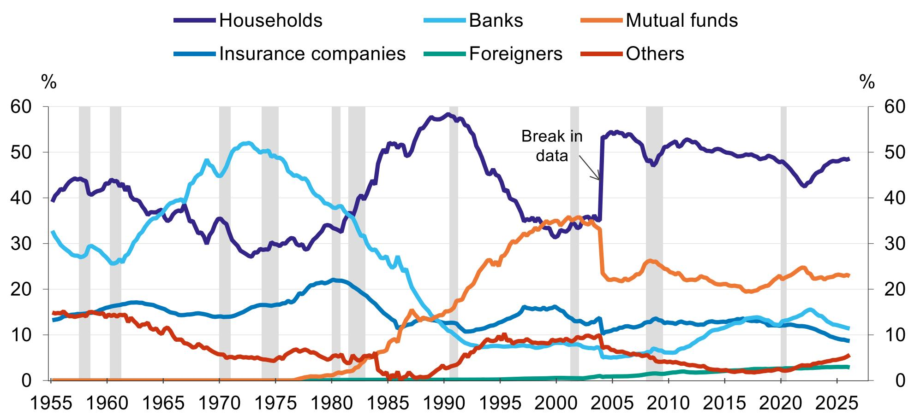

line chart

| Year | Households | Banks | Mutual funds | Insurance companies | Foreigners | Others |
|------|------------|-------|--------------|---------------------|----------|--------|
| 1955 | 40         | 32    | 0            | 13                  | 0        | 14     |
| 1960 | 44         | 27    | 0            | 16                  | 0        | 14     |
| 1965 | 38         | 38    | 0            | 15                  | 0        | 10     |
| 1970 | 35         | 48    | 0            | 14                  | 0        | 6      |
| 1975 | 30         | 50    | 0            | 16                  | 0        | 5      |
| 1980 | 33         | 38    | 0            | 22                  | 0        | 5      |
| 1985 | 40         | 28    | 15           | 12                  | 0        | 2      |
| 1990 | 58         | 12    | 15           | 10                  | 0        | 5      |
| 1995 | 45         | 8     | 25           | 15                  | 0        | 8      |
| 2000 | 35         | 8     | 35           | 16                  | 0        | 8      |
| 2005 | 54         | 5     | 22           | 12                  | 0        | 6      |
| 2010 | 48         | 6     | 25           | 13                  | 0        | 4      |
| 2015 | 50         | 12    | 22           | 13                  | 0        | 2      |
| 2020 | 48         | 13    | 23           | 12                  | 0        | 2      |
| 2025 | 49         | 11    | 23           | 9                   | 3        | 5      |

Source: Fed, Macrobond, DB

## Asset allocations by investor type

## US households (including hedge funds) are heavily overweight in equities relative to fixed income

Households' (incl. hedge fund) asset allocation  
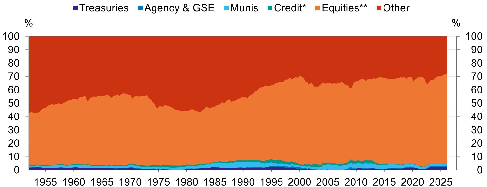

stacked bar chart

| Year | Treasuries | Agency & GSE | Munis | Credit* | Equities** | Other |
|------|------------|--------------|-------|---------|------------|-------|
| 1955 | ~2%        | ~1%          | ~3%   | ~1%     | ~40%       | ~60%  |
| 1960 | ~2%        | ~1%          | ~3%   | ~1%     | ~45%       | ~58%  |
| 1965 | ~2%        | ~1%          | ~3%   | ~1%     | ~48%       | ~56%  |
| 1970 | ~2%        | ~1%          | ~3%   | ~1%     | ~50%       | ~54%  |
| 1975 | ~2%        | ~1%          | ~3%   | ~1%     | ~45%       | ~52%  |
| 1980 | ~2%        | ~1%          | ~3%   | ~1%     | ~40%       | ~50%  |
| 1985 | ~2%        | ~1%          | ~3%   | ~1%     | ~45%       | ~48%  |
| 1990 | ~2%        | ~1%          | ~3%   | ~1%     | ~50%       | ~46%  |
| 1995 | ~2%        | ~1%          | ~3%   | ~1%     | ~55%       | ~44%  |
| 2000 | ~2%        | ~1%          | ~3%   | ~1%     | ~60%       | ~42%  |
| 2005 | ~2%        | ~1%          | ~3%   | ~1%     | ~65%       | ~40%  |
| 2010 | ~2%        | ~1%          | ~3%   | ~1%     | ~68%       | ~38%  |
| 2015 | ~2%        | ~1%          | ~3%   | ~1%     | ~70%       | ~36%  |
| 2020 | ~2%        | ~1%          | ~3%   | ~1%     | ~72%       | ~34%  |
| 2025 | ~2%        | ~1%          | ~3%   | ~1%     | ~75%       | ~32%  |

Source: Fed, Macrobond, DB.  
\*Credit includes corporate & foreign bonds  
\*\*Equities includes corporate equities, mutual fund shares, life insurance reserves and pension funds reserves

Pension funds' asset allocation  
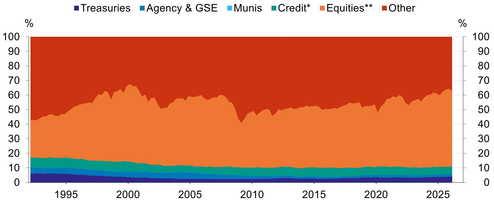

stacked bar chart

| Year | Treasuries | Agency & GSE | Munis | Credit* | Equities** | Other |
|------|------------|--------------|-------|---------|------------|-------|
| 1995 | ~5%        | ~5%          | ~5%   | ~10%    | ~30%       | ~40%  |
| 2000 | ~5%        | ~5%          | ~5%   | ~10%    | ~40%       | ~40%  |
| 2005 | ~5%        | ~5%          | ~5%   | ~10%    | ~40%       | ~40%  |
| 2010 | ~5%        | ~5%          | ~5%   | ~10%    | ~40%       | ~40%  |
| 2015 | ~5%        | ~5%          | ~5%   | ~10%    | ~40%       | ~40%  |
| 2020 | ~5%        | ~5%          | ~5%   | ~10%    | ~40%       | ~40%  |
| 2025 | ~5%        | ~5%          | ~5%   | ~10%    | ~40%       | ~40%  |

Source: Fed, Macrobond, DB.  
Pension funds incl. Private, State & local govt. retirement and Federal govt. retirement funds  
\*Credit includes corporate and foreign bonds \*\*Equities includes corporate equities and mutual fund shares

Insurance companies' asset allocation  
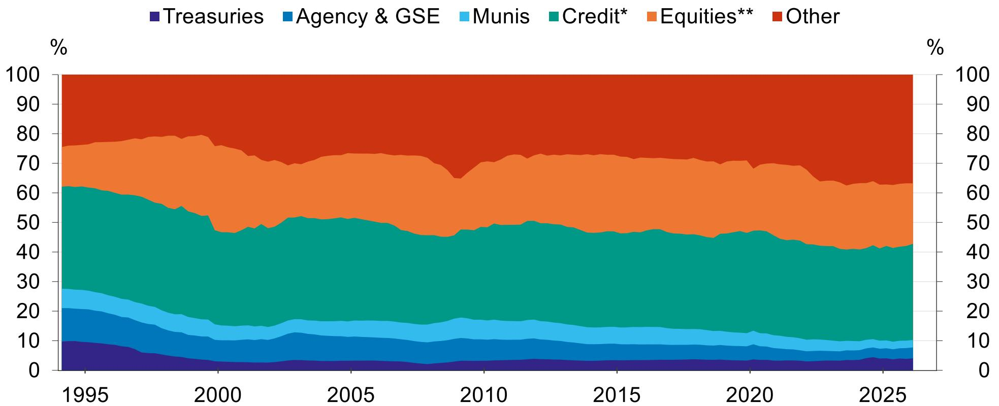

stacked bar chart

| Year | Treasuries | Agency & GSE | Munis | Credit* | Equities** | Other |
|------|------------|--------------|-------|---------|------------|-------|
| 1995 | 10         | 15           | 5     | 30      | 15         | 20    |
| 2000 | 5          | 10           | 5     | 25      | 20         | 25    |
| 2005 | 5          | 10           | 5     | 25      | 20         | 25    |
| 2010 | 5          | 10           | 5     | 25      | 20         | 25    |
| 2015 | 5          | 10           | 5     | 25      | 20         | 25    |
| 2020 | 5          | 10           | 5     | 25      | 20         | 25    |
| 2025 | 5          | 10           | 5     | 25      | 20         | 25    |

Source: Fed, Macrobond, DB.  
Insurance sector includes both life and non-life insurance  
\*Credit includes foreign and corporate bonds; \*\*Equities include mutual fund shares and corporate equities

Mutual funds' asset allocation  
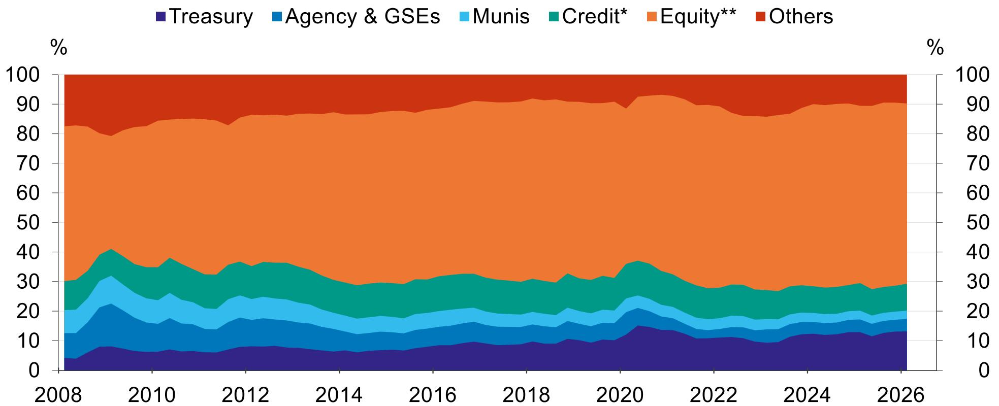

stacked bar chart

| Year | Treasury | Agency & GSEs | Munis | Credit* | Equity** | Others |
|------|----------|---------------|-------|---------|----------|--------|
| 2008 | 5        | 10            | 10    | 10      | 45       | 20     |
| 2010 | 5        | 15            | 10    | 10      | 45       | 20     |
| 2012 | 5        | 15            | 10    | 10      | 45       | 20     |
| 2014 | 5        | 15            | 10    | 10      | 45       | 20     |
| 2016 | 5        | 15            | 10    | 10      | 45       | 20     |
| 2018 | 5        | 15            | 10    | 10      | 45       | 20     |
| 2020 | 5        | 15            | 10    | 10      | 45       | 20     |
| 2022 | 5        | 15            | 10    | 10      | 45       | 20     |
| 2024 | 5        | 15            | 10    | 10      | 45       | 20     |
| 2026 | 5        | 15            | 10    | 10      | 45       | 20     |

Source: Fed, Macrobond, DB. Mutual funds incl. traditional mutual funds, money mkt. MFs, exchange traded MFs & open ended MFs. \*Credit includes corporate and foreign bonds; \*\*Equity includes corporate equities and mutual fund shares.

## Foreign investors increased allocations to US equities in the last decade

Asset allocation of foreigners in US assets  
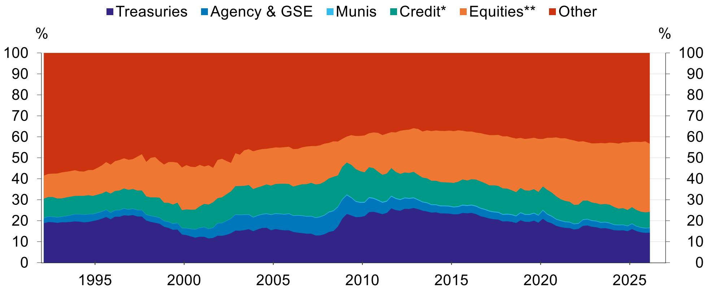

stacked bar chart

| Year | Treasuries | Agency & GSE | Munis | Credit* | Equities** | Other |
|------|------------|--------------|-------|---------|------------|-------|
| 1995 | ~18%       | ~5%          | ~5%   | ~10%    | ~15%       | ~45%  |
| 2000 | ~12%       | ~5%          | ~5%   | ~15%    | ~20%       | ~40%  |
| 2005 | ~15%       | ~5%          | ~5%   | ~20%    | ~25%       | ~35%  |
| 2010 | ~20%       | ~5%          | ~5%   | ~25%    | ~30%       | ~30%  |
| 2015 | ~18%       | ~5%          | ~5%   | ~20%    | ~35%       | ~25%  |
| 2020 | ~15%       | ~5%          | ~5%   | ~15%    | ~30%       | ~20%  |
| 2025 | ~12%       | ~5%          | ~5%   | ~10%    | ~35%       | ~15%  |

Source: Fed, Macrobond, DB.  
\*Credit is Corporate bonds held by Foreign sector; \*\*Equities is calculated as sum of corporate equities and mutual fund shares

## Commercial banks hold more Treasuries on their balance sheets after the Global Financial Crisis

Banks' asset allocation  
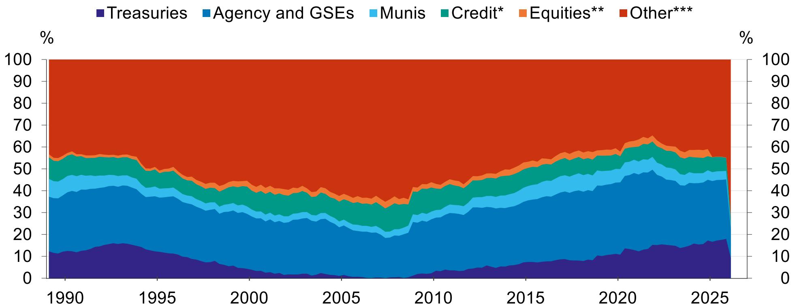

stacked bar chart

| Year | Treasuries | Agency and GSEs | Munis | Credit* | Equities** | Other*** |
|------|------------|-----------------|-------|---------|------------|----------|
| 1990 | ~12%       | ~38%            | ~10%  | ~15%    | ~5%        | ~65%     |
| 1995 | ~14%       | ~35%            | ~10%  | ~15%    | ~5%        | ~65%     |
| 2000 | ~5%        | ~28%            | ~10%  | ~15%    | ~5%        | ~65%     |
| 2005 | ~2%        | ~22%            | ~10%  | ~15%    | ~5%        | ~65%     |
| 2010 | ~3%        | ~25%            | ~10%  | ~15%    | ~5%        | ~65%     |
| 2015 | ~5%        | ~28%            | ~10%  | ~15%    | ~5%        | ~65%     |
| 2020 | ~8%        | ~32%            | ~10%  | ~15%    | ~5%        | ~65%     |
| 2025 | ~15%       | ~35%            | ~10%  | ~15%    | ~5%        | ~65%     |

Source: Fed, Macrobond, DB.  
Banks incl. all commercial banks and brokers and dealers  
\*Credit includes corporate and foreign bonds; \*\*Equities includes corporate equities and mutual fund shares,  
\*\*\*Excludes vault cash, reserves at Fed, fed funds and repos, loans, life ins. reserves and US direct investment abroad

## Models and outlook

## 10-year model accounting for central bank purchases suggests a fair value of $\sim 3.4\%$

10-year Treasury yield model forecasts  
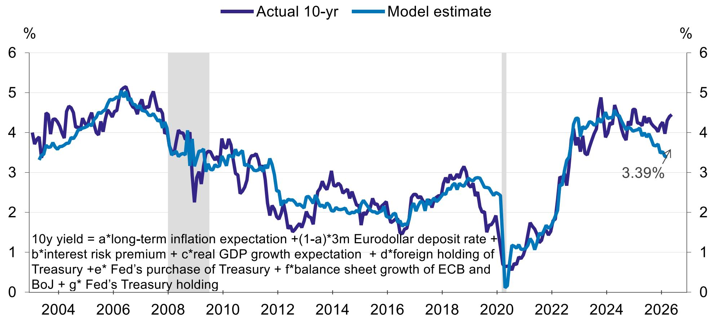

line chart

| Year | Actual 10-yr | Model estimate |
|------|--------------|----------------|
| 2026 | 3.39%        | 3.39%          |

Source: U.S. Treasury, Philadelphia Fed, Riksbanken, BEA, Fed, ECB, BOJ, Macrobond, DB

Model decomposition of 10-year Treasury yield  
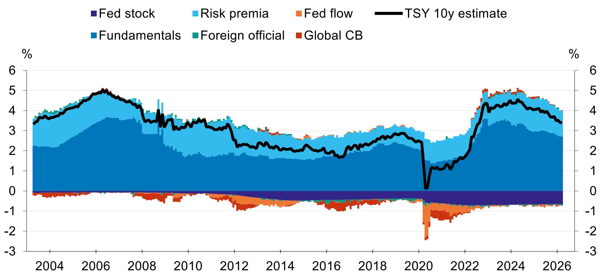

area chart

| Year | Fed stock | Risk premia | Fed flow | Fundamentals | Foreign official | Global CB |
|------|-----------|-------------|----------|---------------|------------------|-----------|
| 2004 | 0.0       | 0.0         | 0.0      | 0.0           | 0.0              | 0.0       |
| 2006 | 0.0       | 0.0         | 0.0      | 0.0           | 0.0              | 0.0       |
| 2008 | 0.0       | 0.0         | 0.0      | 0.0           | 0.0              | 0.0       |
| 2010 | 0.0       | 0.0         | 0.0      | 0.0           | 0.0              | 0.0       |
| 2012 | 0.0       | 0.0         | 0.0      | 0.0           | 0.0              | 0.0       |
| 2014 | 0.0       | 0.0         | 0.0      | 0.0           | 0.0              | 0.0       |
| 2016 | 0.0       | 0.0         | 0.0      | 0.0           | 0.0              | 0.0       |
| 2018 | 0.0       | 0.0         | 0.0      | 0.0           | 0.0              | 0.0       |
| 2020 | 0.0       | 0.0         | -3.5     | -1.5          | -1.5             | -1.5      |
| 2022 | 0.0       | 0.0         | -1.5     | -1.5          | -1.5             | -1.5      |
| 2024 | 0.0       | 0.0         | -1.5     | -1.5          | -1.5             | -1.5      |
| 2026 | 0.0       | 0.0         | -1.5     | -1.5          | -1.5             | -1.5      |

Source: U.S. Treasury, Philadelphia Fed, Riksbanken, BEA, Fed, ECB, BOJ, Macrobond, DB

## 10-year model using market explanatory variables suggests a fair value around 4.35% (as of June 12, 2026)

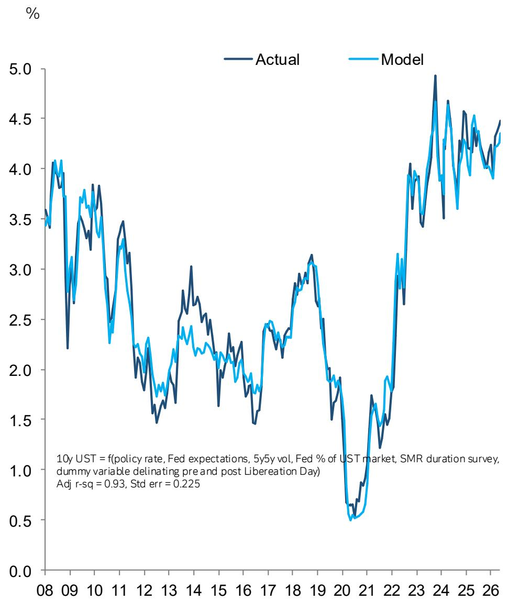

line chart

| Year | Actual | Model |
|------|--------|-------|
| 08   | 3.5    | 3.5   |
| 09   | 4.0    | 4.1   |
| 10   | 3.8    | 3.7   |
| 11   | 3.5    | 3.3   |
| 12   | 2.5    | 2.3   |
| 13   | 2.0    | 1.8   |
| 14   | 2.8    | 2.5   |
| 15   | 2.2    | 2.0   |
| 16   | 2.0    | 1.8   |
| 17   | 2.5    | 2.3   |
| 18   | 3.0    | 2.8   |
| 19   | 3.2    | 3.0   |
| 20   | 1.5    | 1.3   |
| 21   | 0.5    | 0.4   |
| 22   | 1.8    | 1.6   |
| 23   | 3.5    | 3.4   |
| 24   | 4.8    | 4.7   |
| 25   | 4.5    | 4.4   |
| 26   | 4.4    | 4.3   |

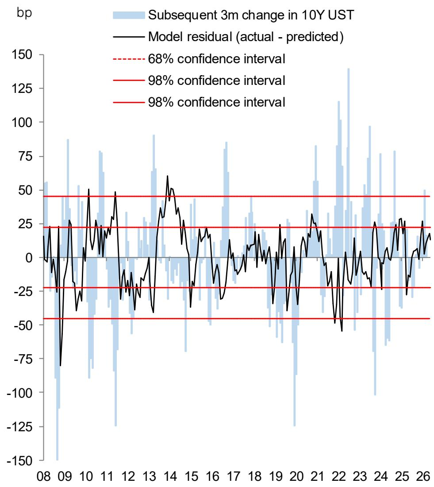

line chart

| Year | Subsequent 3m change in 10Y UST (bp) | Model residual (actual - predicted) (bp) |
|------|--------------------------------------|------------------------------------------|
| 08   | ~55                                  | ~0                                       |
| 09   | ~-150                                | ~-75                                     |
| 10   | ~85                                  | ~25                                      |
| 11   | ~75                                  | ~50                                      |
| 12   | ~30                                  | ~-25                                     |
| 13   | ~90                                  | ~40                                      |
| 14   | ~60                                  | ~55                                      |
| 15   | ~40                                  | ~-25                                     |
| 16   | ~85                                  | ~20                                      |
| 17   | ~60                                  | ~10                                      |
| 18   | ~40                                  | ~-10                                     |
| 19   | ~25                                  | ~-30                                     |
| 20   | ~-125                                | ~-40                                     |
| 21   | ~80                                  | ~30                                      |
| 22   | ~140                                 | ~-50                                     |
| 23   | ~75                                  | ~-25                                     |
| 24   | ~95                                  | ~25                                      |
| 25   | ~75                                  | ~-25                                     |
| 26   | ~50                                  | ~20                                      |

Source: FRB, BEA, Haver Analytics, DB

## Treasury net coupon issuance set to fall by $\sim 20\%$ in 2026 versus last year

Treasury coupon issuance  
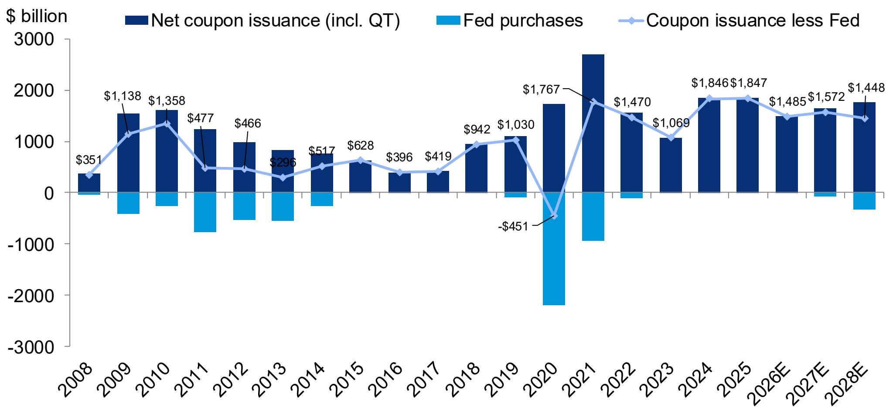

bar-line hybrid

| Year | Net coupon issuance (incl. QT) ($ billion) | Fed purchases ($ billion) | Coupon issuance less Fed ($ billion) |
| :--- | :--- | :--- | :--- |
| 2008 | 351 | -10 | 351 |
| 2009 | 1,138 | -456 | 1127 |
| 2010 | 1,358 | -356 | 1329 |
| 2011 | 477 | -789 | 489 |
| 2012 | 466 | -518 | 476 |
| 2013 | 296 | -539 | 336 |
| 2014 | 517 | -249 | 509 |
| 2015 | 628 | -14 | 628 |
| 2016 | 396 | -14 | 396 |
| 2017 | 419 | -14 | 419 |
| 2018 | 942 | -14 | 942 |
| 2019 | 1,030 | -451 | 1030 |
| 2020 | 1,767 | -2275 | -451 |
| 2021 | 2738 | -889 | 1789 |
| 2022 | 1,470 | -156 | 1470 |
| 2023 | 1,069 | -156 | 1069 |
| 2024 | 1,846 | -156 | 1846 |
| 2025 | 1,847 | -156 | 1847 |
| 2026E | 1,485 | -156 | 1485 |
| 2027E | 1,572 | -356 | 1572 |
| 2028E | 1,448 | -356 | 1448 |

Source: FRB, BEA, Haver Analytics, DB

## CBO's projection of US debt over the coming decades

Federal debt held by the public  
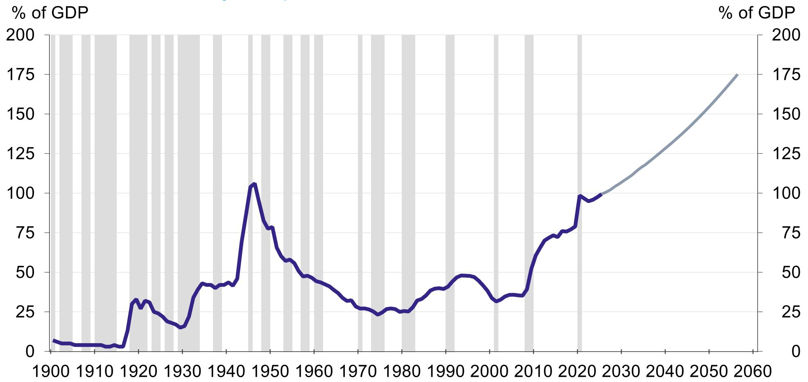

line chart

| Year | % of GDP |
|------|----------|
| 1900 | ~5       |
| 1910 | ~5       |
| 1920 | ~30      |
| 1930 | ~15      |
| 1940 | ~40      |
| 1950 | ~105     |
| 1960 | ~45      |
| 1970 | ~30      |
| 1980 | ~25      |
| 1990 | ~45      |
| 2000 | ~30      |
| 2010 | ~65      |
| 2020 | ~100     |
| 2030 | ~125     |
| 2040 | ~150     |
| 2050 | ~175     |
| 2060 | ~175     |

Source: CBO, Macrobond, DB

## Interest expense projected to be a rising share of the US deficit due to high interest rates

Total Deficit, Net Interest Outlays, and Primary Deficit  
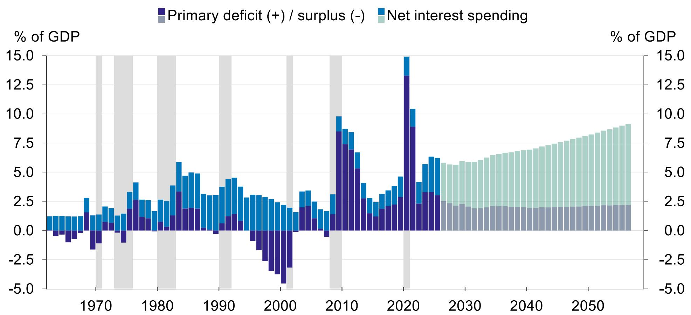

bar-line hybrid chart

| Year | Primary deficit (+) / surplus (-) | Net interest spending (%) | Total (% of GDP) |
|------|------------------------------------|----------------------------|------------------|
| 1965 | -0.5                               | 1.0                        | 1.0              |
| 1970 | -1.0                               | 1.5                        | 1.5              |
| 1975 | 0.5                                | 2.0                        | 2.0              |
| 1980 | 0.0                                | 2.5                        | 2.5              |
| 1985 | 2.0                                | 3.0                        | 3.0              |
| 1990 | 0.5                                | 3.5                        | 3.5              |
| 1995 | -1.0                               | 4.0                        | 4.0              |
| 2000 | -3.0                               | 4.5                        | 4.5              |
| 2005 | 1.0                                | 5.0                        | 5.0              |
| 2010 | 8.0                                | 6.0                        | 9.5              |
| 2015 | 2.0                                | 4.0                        | 4.0              |
| 2020 | 13.0                               | 3.0                        | 15.0             |
| 2025 | 3.0                                | 4.0                        | 6.0              |
| 2030 | 2.0                                | 5.0                        | 6.0              |
| 2035 | 2.0                                | 6.0                        | 6.5              |
| 2040 | 2.0                                | 7.0                        | 7.5              |
| 2045 | 2.0                                | 7.5                        | 8.5              |
| 2050 | 2.0                                | 8.5                        | 9.5              |
| 2055 | 2.0                                | 9.5                        | 10.5             |

Source: CBO, Macrobond, DB

## Rising outlays and a slower rise in revenue contributes to the primary deficit

Total Outlays and Revenues  
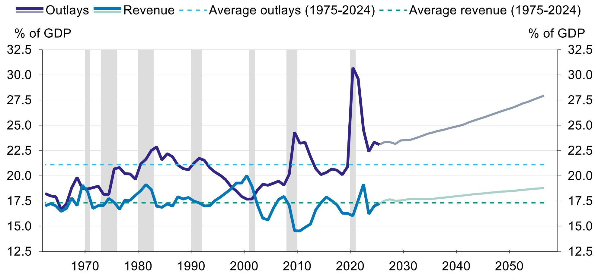

line chart

| Year | Outlays | Revenue | Average outlays (1975-2024) | Average revenue (1975-2024) |
|------|--------|---------|-----------------------------|-----------------------------|
| 1970 | ~18.5  | ~17.5   | 21.0                        | 17.5                        |
| 1980 | ~20.5  | ~18.5   | 21.0                        | 17.5                        |
| 1990 | ~21.5  | ~17.5   | 21.0                        | 17.5                        |
| 2000 | ~17.5  | ~19.5   | 21.0                        | 17.5                        |
| 2010 | ~24.0  | ~14.5   | 21.0                        | 17.5                        |
| 2020 | ~30.5  | ~16.0   | 21.0                        | 17.5                        |
| 2030 | ~23.0  | ~17.5   | 21.0                        | 17.5                        |
| 2040 | ~24.5  | ~18.0   | 21.0                        | 17.5                        |
| 2050 | ~27.5  | ~18.5   | 21.0                        | 17.5                        |

Source: CBO, Macrobond, DB

## Mandatory spending expected to grow faster than discretionary as net interest rises too

Outlays, by Category  
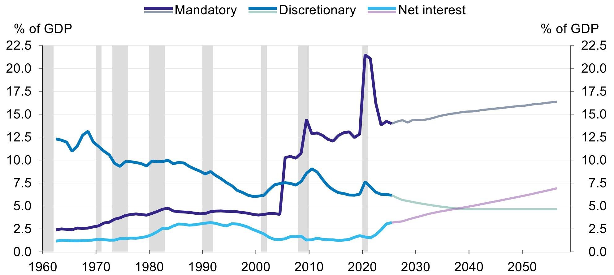

line chart

| Year | Mandatory | Discretionary | Net interest |
|------|-----------|---------------|--------------|
| 1960 | 2.5       | 12.5          | 1.0          |
| 1970 | 3.0       | 13.0          | 1.2          |
| 1980 | 4.0       | 9.5           | 1.5          |
| 1990 | 4.5       | 8.5           | 3.0          |
| 2000 | 4.0       | 6.0           | 2.5          |
| 2010 | 14.0      | 9.0           | 1.5          |
| 2020 | 21.5      | 7.5           | 1.8          |
| 2030 | 14.5      | 6.0           | 3.5          |
| 2040 | 15.5      | 5.0           | 5.0          |
| 2050 | 16.5      | 4.5           | 7.0          |

Source: CBO, Macrobond, DB

Composition of Outlays 2025 & 2055 (%)  
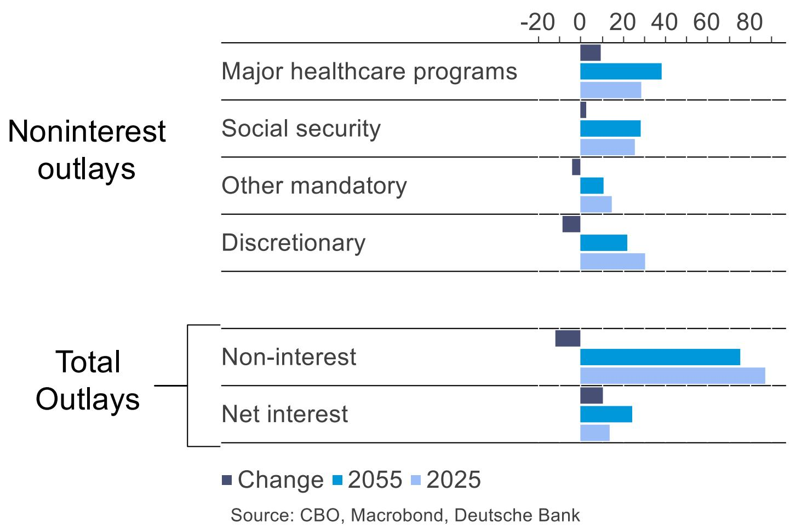

bar chart

| Category | Change | 2055 | 2025 |
| :--- | :--- | :--- | :--- |
| Major healthcare programs | -5 | 40 | 30 |
| Social security | -3 | 30 | 28 |
| Other mandatory | -3 | 10 | 16 |
| Discretionary | -7 | 22 | 33 |
| Non-interest | -5 | 75 | 85 |
| Net interest | -7 | 25 | 14 |
Source: CBO, Macrobond, DB

## CBO projection of defense versus non-defense spending

Discretionary Outlays, by Category  
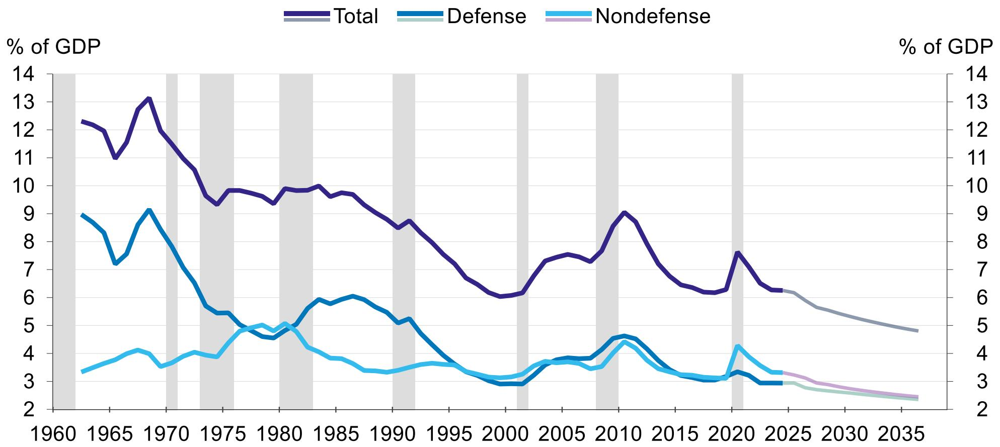

line chart

| Year | Total | Defense | Nondefense |
|------|-------|---------|------------|
| 1960 | 12.3  | 9.0     | 3.4        |
| 1965 | 11.0  | 7.2     | 3.8        |
| 1970 | 13.2  | 9.1     | 4.1        |
| 1975 | 9.5   | 5.5     | 4.0        |
| 1980 | 9.8   | 4.8     | 5.0        |
| 1985 | 9.9   | 6.0     | 4.5        |
| 1990 | 8.7   | 5.2     | 3.4        |
| 1995 | 7.5   | 4.0     | 3.6        |
| 2000 | 6.0   | 3.0     | 3.2        |
| 2005 | 7.5   | 3.8     | 3.6        |
| 2010 | 9.0   | 4.5     | 4.4        |
| 2015 | 6.5   | 3.2     | 3.3        |
| 2020 | 6.2   | 3.0     | 4.3        |
| 2025 | 6.0   | 3.0     | 3.2        |
| 2030 | 5.5   | 2.8     | 3.0        |
| 2035 | 4.8   | 2.5     | 2.5        |

Source: CBO, Macrobond, DB

Revenues, by Category  
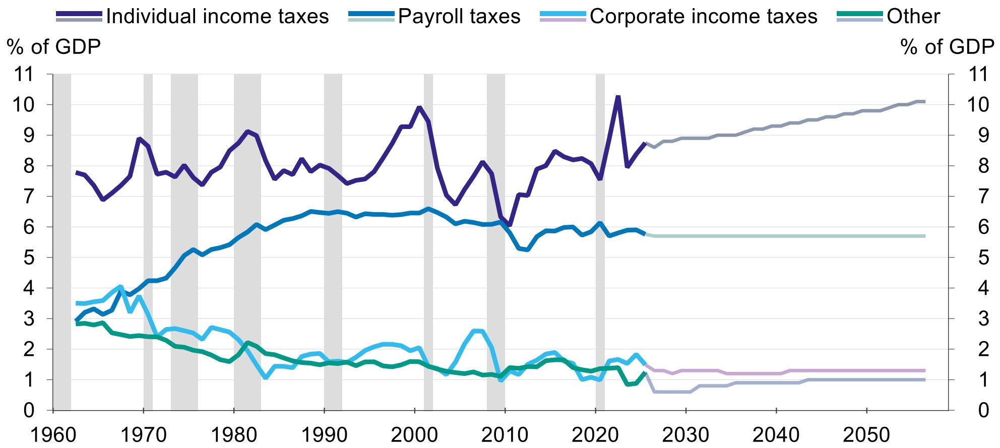

line chart

| Year | Individual income taxes | Payroll taxes | Corporate income taxes | Other |
|------|--------------------------|---------------|-------------------------|-------|
| 1960 | 7.8                      | 3.0           | 3.5                     | 2.8   |
| 1970 | 8.9                      | 4.0           | 3.8                     | 2.5   |
| 1980 | 9.1                      | 5.5           | 2.5                     | 2.0   |
| 1990 | 7.5                      | 6.5           | 1.8                     | 1.5   |
| 2000 | 9.8                      | 6.5           | 2.0                     | 1.5   |
| 2010 | 6.0                      | 6.0           | 1.0                     | 1.2   |
| 2020 | 8.5                      | 6.0           | 1.5                     | 1.3   |
| 2030 | 8.8                      | 5.8           | 1.2                     | 0.8   |
| 2040 | 9.2                      | 5.8           | 1.2                     | 0.9   |
| 2050 | 10.0                     | 5.8           | 1.2                     | 1.0   |

Source: CBO, Macrobond, DB

10 yr Treasury and interest rate on government debt  
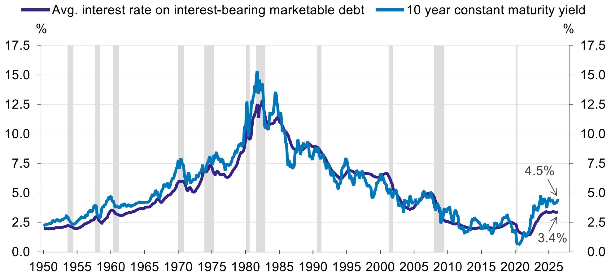

line chart

| Year | Avg. interest rate on interest-bearing marketable debt (%) | 10 year constant maturity yield (%) |
|------|----------------------------------------------------------|--------------------------------------|
| 2025 | 3.4%                                                     | 4.5%                                 |

Source: U.S. Treasury, Fed, Macrobond, DB

natural_image

Portrait of a man in business attire with a blue patterned tie (no text or symbols visible)

Matthew Luzzetti

212-250-6161

matthew.luzzetti@db.com

Matthew Luzzetti is Chief US Economist and Head of US Economic Research at DB in New York. He was previously an economist in DB's Office of the Chief Economist in London. Matthew's research focuses primarily on the US economy and Fed policy, and he regularly contributes to DB's global economics publications. In 2017, Matthew was named to Business Insider's Rising Stars on Wall Street Under 35. His research has appeared in several books on economic policy and in top macroeconomics journals.

Matthew holds a Ph.D. in Economics from the University of California, Los Angeles. While at UCLA, he worked at the U.S. Department of the Treasury in the Office of Financial Research. Prior to graduate school, he spent two years as a research analyst in the macroeconomics department at the Federal Reserve Bank of Philadelphia.

natural_image

Portrait of a smiling man in a suit and tie against a plain background (no text or symbols visible)

Steven Zeng

212-250-9373

steven.zeng@db.com

Steven Zeng is a Senior Rates Strategist at DB in New York, where he conducts research on the U.S. interest rate market. His focus is on U.S. Treasuries, dollar swaps, and funding markets. Previously, Steven worked in fixed income trading technology at BofA. He is a graduate of SUNY Stony Brook and holds an MBA from the UNC Kenan-Flagler Business School. He is also a CFA charterholder.

natural_image

Portrait of a man in business attire against a blue background (no text or symbols visible)

Justin Weidner

212 469-1679

justin-s.weidner@db.com

Justin Weidner is an Economist in DB's US Economics team in New York. Justin's research focuses primarily on the US economy and Fed policy, where he regularly contributes to DB's global economics publications.

His research has also appeared in a major economic policy volume and several other economics journals. Justin obtained a Ph.D. in Economics from Princeton University. Prior to graduate school, he spent three years as a research associate in the macroeconomics department at the Federal Reserve Bank of San Francisco.

natural_image

Portrait of a man in formal business attire with a goatee, against a plain gray background (no text or symbols visible)

Brett Ryan

212-250-6294

brett.ryan@db.com

Brett Ryan has been a Senior Economist at DB for the last 12 years, covering the US and Canada. Brett is responsible for DB's macro-economic forecasts and regularly publishes research on US macro-economic policy issues for institutional clients and corporate management teams. Brett is frequently cited in the financial press and appears on financial news networks. Prior to his economist roll, Brett spent five years in institutional equities at DB. Brett has a Bachelor of Arts degree from the University of Pennsylvania; majoring in politics, philosophy and economics.

## Appendix 1 Important Disclosures

## \*Other information available upon request

\*Prices are current as of the end of the previous trading session unless otherwise indicated and are sourced from local exchanges via Reuters, Bloomberg and other vendors. Other information is sourced from DB, subject companies, and other sources. For further information regarding disclosures relevant to DB, please visit our global disclosure look-up page on our website at https://research.db.com/Research/Disclosures/FICCDisclosures. Aside from within this report, important risk and conflict disclosures can also be found at https://research.db.com/Research/Disclosures/Disclaimer. Investors are strongly encouraged to review this information before investing.

## Analyst Certification

The views expressed in this report accurately reflect the personal views of the undersigned lead analyst(s). In addition, the undersigned lead analyst(s) has not and will not receive any compensation for providing a specific recommendation or view in this report. Steven Zeng, Matthew Luzzetti, Brett Ryan, Justin Weidner, Amy Yang

## Attribution

The authors wish to acknowledge the contributions made by Rajsekhar Bhattacharyya, employees of Acuity Knowledge Partners, a third-party provider to DB in the preparation of this report.

## Additional Information

The information and opinions in this report were prepared by DB AG or one of its affiliates (collectively "DB"). Though the information herein is believed to be reliable and has been obtained from public sources believed to be reliable, DB makes no representation as to its accuracy or completeness. Hyperlinks to third-party websites in this report are provided for reader convenience only. DB neither endorses the content nor is responsible for the accuracy or security controls of those websites.

If you use the services of DB in connection with a purchase or sale of a security that is discussed in this report, or is included or discussed in another communication (oral or written) from a DB analyst, DB may act as principal for its own account or as agent for another person.

DB may consider this report in deciding to trade as principal. It may also engage in transactions, for its own account or with customers, in a manner inconsistent with the views taken in this research report. Others within DB, including strategists, sales staff and other analysts, may take views that are inconsistent with those taken in this research report. DB issues a variety of research products, including fundamental analysis, equity-linked analysis, quantitative analysis and trade ideas. Recommendations contained in one type of communication may differ from recommendations contained in others, whether as a result of differing time horizons, methodologies, perspectives or otherwise. DB and/or its affiliates may also be holding debt or equity securities of the issuers it writes on. Analysts are paid in part based on the profitability of DB AG and its affiliates, which includes investment banking, trading and principal trading revenues.

Opinions, estimates and projections constitute the current judgment of the author as of the date of this report. They do not necessarily reflect the opinions of DB and are subject to change without notice. DB provides liquidity for buyers and sellers of securities issued by the companies it covers. DB analysts sometimes have shorter-term trade ideas that may be inconsistent with DB's existing longer-term ratings. Some trade ideas for equities are listed as Catalyst Calls ideas on the Research Website (https://research.db.com/Research/), and can be found on the general coverage list and also on the covered company's page. A Catalyst Call idea represents a high-conviction belief by an analyst that a stock will outperform or underperform the market and/or a specified sector over a time frame of no less than two weeks and no more than three months. In addition to Catalyst Calls ideas, analysts may occasionally discuss with our clients, and with DB salespersons and traders, trading strategies or ideas that reference catalysts or events that may have a near-term or medium-term impact on the market price of the securities discussed in this report, which impact may be directionally counter to the analysts' current 12-month view of total return or investment return as described herein. DB has no obligation to update, modify or amend this report or to otherwise notify a recipient thereof if an opinion, forecast or estimate changes or becomes inaccurate. Coverage and the frequency of changes in market conditions and in both general and company-specific economic prospects make it difficult to update research at defined intervals. Updates are at the sole discretion of the coverage analyst or of the Research Department Management, and the majority of reports are published at irregular intervals. This report is provided for informational purposes only and does not take into account the particular investment objectives, financial situations, or needs of individual clients. It is not an offer or a solicitation of an offer to buy or sell any financial instruments or to participate in any particular trading strategy. Target prices are inherently imprecise and a product of the analyst's judgment. The financial instruments discussed in this report may not be suitable for all investors, and investors must make their own informed investment decisions. Prices and availability of financial instruments are subject to change without notice, and investment transactions can lead to losses as a result of price fluctuations and other factors. If a financial instrument is denominated in a currency other than an investor's currency, a change in exchange rates may adversely affect the investment. Past performance is not necessarily indicative of future results. Performance calculations exclude transaction costs, unless otherwise indicated. Unless otherwise indicated, prices are current as of the end of the previous trading session and are sourced from local exchanges via Reuters, Bloomberg and other vendors. Data is also sourced from DB, subject companies, and other parties. Artificial intelligence tools may be used in the preparation of this material, including but not limited to assist in fact-finding, data analysis, pattern recognition, content drafting and editorial corrections pertaining to research material.

The DB Department is independent of other business divisions of the Bank. Details regarding our organizational arrangements and information barriers we have to prevent and avoid conflicts of interest with respect to our research are available on our website (https://research.db.com/Research/) under Disclaimer.

Macroeconomic fluctuations often account for most of the risks associated with exposures to instruments that promise to pay fixed or variable interest rates. For an investor who is long fixed-rate instruments (thus receiving these cash flows), increases in interest rates naturally lift the discount factors applied to the expected cash flows and thus cause a loss. The longer the maturity of a certain cash flow and the higher the move in the discount factor, the client will be the loss. Upside surprises in inflation, fiscal funding needs, and FX depreciation rates are among the most common adverse macroeconomic shocks to receivers. But counterparty exposure, issuer creditworthiness, client segmentation, regulation (including changes in assets holding limits for different types of investors), changes in tax policies, currency convertibility (which may constrain currency conversion, repatriation of profits and/or liquidation of positions), and settlement issues related to local clearing houses are also important risk factors. The sensitivity of fixed-income instruments to macroeconomic shocks may be mitigated by indexing the contracted cash flows to inflation, to FX depreciation, or to specified interest rates – these are common in emerging markets. The index fixings may – by construction – lag or mis-measure the actual move in the underlying variables they are intended to track. The choice of the proper fixing (or metric) is particularly important in swaps markets, where floating coupon rates (i.e., coupons indexed to a typically short-dated interest rate reference index) are exchanged for fixed coupons. Funding in a currency that differs from the currency in which coupons are denominated carries FX risk. Options on swaps (swaptions) the risks typical to options in addition to the risks related to rates movements.

Derivative transactions involve numerous risks including market, counterparty default and illiquidity risk. The appropriateness of these products for use by investors depends on the investors' own circumstances, including their tax position, their regulatory environment and the nature of their other assets and liabilities; as such, investors should take expert legal and financial advice before entering into any transaction similar to or inspired by the contents of this publication. The risk of loss in futures trading and options, foreign or domestic, can be substantial. As a result of the high degree of leverage obtainable in futures and options trading, losses may be incurred that are greater than the amount of funds initially deposited – up to theoretically unlimited losses. Trading in options involves risk and is not suitable for all investors. Prior to buying or selling an option, investors must review the "Characteristics and Risks of Standardized Options", at https://www.theocc.com/company-information/documents-and-archives/options-disclosure-document. If you are unable to access the website, please contact your DB representative for a copy of this important document.

Participants in foreign exchange transactions may incur risks arising from several factors, including the following: (i) exchange rates can be volatile and are subject to large fluctuations; (ii) the value of currencies may be affected by numerous market factors, including world and national economic, political and regulatory events, events in equity and debt markets and changes in interest rates; and (iii) currencies may be subject to devaluation or government-imposed exchange controls, which could affect the value of the currency. Investors in securities such as ADRs, whose values are affected by the currency of an underlying security, effectively assume currency risk.

Unless governing law provides otherwise, all transactions should be executed through the DB entity in the investor's home jurisdiction. Aside from within this report, important conflict disclosures can also be found at https://research.db.com/Research/ on each company's research page or under the 'Disclosures' tab . Investors are strongly encouraged to review this information before investing.

DB (which includes DB AG, its branches and affiliated companies) is not acting as a financial adviser, consultant or fiduciary to you or any of your agents (collectively, "You" or "Your") with respect to any information provided in this report. DB does not provide investment, legal, tax or accounting advice, DB is not acting as your impartial adviser, and does not express any opinion or recommendation whatsoever as to any strategies, products or any other information presented in the materials. Information contained herein is being provided solely on the basis that the recipient will make an independent assessment of the merits of any investment decision, and it does not constitute a recommendation of, or express an opinion on, any product or service or any trading strategy.

The information presented is general in nature and is not directed to retirement accounts or any specific person or account type, and is therefore provided to You on the express basis that it is not advice, and You may not rely upon it in making Your decision. The information we provide is being directed only to persons we believe to be financially sophisticated, who are capable of evaluating investment risks independently, both in general and with regard to particular transactions and investment strategies, and who understand that DB has financial interests in the offering of its products and services. If this is not the case, or if You are an IRA or other retail investor receiving this directly from us, we ask that you inform us immediately.

In July 2018, DB revised its rating system for short term ideas whereby the branding has been changed to Catalyst Calls (“CC”) from SOLAR ideas; the rating categories for Catalyst Calls originated in the Americas region have been made consistent with the categories used by Analysts globally; and the effective time period for CCs has been reduced from a maximum of 180 days to 90 days.

United States: Approved and/or distributed by DB Securities Incorporated, a member of FINRA and SIPC. Analysts located outside of the United States are employed by non-US affiliates and are not registered/qualified as research analysts with FINRA.

European Economic Area (exc. United Kingdom): Approved and/or distributed by DB AG, a joint stock corporation with limited liability incorporated in the Federal Republic of Germany with its principal office in Frankfurt am Main. DB AG is authorized under German Banking Law and is subject to supervision by the European Central Bank and by BaFin, Germany's Federal Financial Supervisory Authority.

United Kingdom: Approved and/or distributed by DB AG acting through its London Branch at 21 Moorfields, London EC2Y 9DB. DB AG in the United Kingdom is authorised by the Prudential Regulation Authority and is subject to limited regulation by the Prudential Regulation Authority and Financial Conduct Authority. Details about the extent of our authorisation and regulation are available on request.

Hong Kong SAR: Distributed by DB AG, Hong Kong Branch except for any research content relating to futures contracts within the meaning of the Hong Kong Securities and Futures Ordinance Cap. 571. Research reports on such futures contracts are not intended for access by persons who are located, incorporated, constituted or resident in Hong Kong. The author(s) of a research report may not be licensed to carry on regulated activities in Hong Kong and, if not licensed, do not hold themselves out as being able to do so. The provisions set out above in the “Additional Information” section shall apply to the fullest extent permissible by local laws and regulations, including without limitation the Code of Conduct for Persons Licensed or Registered with the Securities and Futures Commission. This report is intended for distribution only to “professional investors” as defined in Part 1 of Schedule 1 of the SFO. This document must not be acted or relied on by persons who are not professional investors. Any investment or investment activity to which this document relates is only available to professional investors and will be engaged only with professional investors.

India: Prepared by Deutsche Equities India Private Limited (DEIPL) having CIN: U65990MH2002PTC137431 and registered office at 14th Floor, The Capital, C-70, G Block, Bandra Kurla Complex, Mumbai (India) 400051. Tel: +91 22 7180 4444. It is registered by the Securities and Exchange Board of India (SEBI) as a Stock broker bearing registration no.: INZ000252437; Merchant Banker bearing SEBI Registration no.: INM000010833 and Research Analyst bearing SEBI Registration no.: INH000001741. DEIPL's Compliance / Grievance officer is Ms. Rashmi Poddar (Tel: +91 22 7180 4929, email ID: complaints.deipl@db.com). Registration granted by SEBI and certification from NISM in no way guarantee performance of DEIPL or provide any assurance of returns to investors. Investment in securities market are subject to market risks. Read all the related documents carefully before investing. DEIPL may have received administrative warnings from the SEBI for breaches of Indian regulations. DB and/or its affiliate(s) may have debt holdings or positions in the subject company. With regard to information on associates, please refer to the "Shareholdings" section in the Annual Report at: https://www.db.com/ir/en/annual-reports.htm. For latest India research audit report, refer https://country.db.com/india/deutsche-equities-india/index?language\_id=1.

Japan: Approved and/or distributed by Deutsche Securities Inc.(DSI). Registration number - Registered as a financial instruments dealer by the Head of the Kanto Local Finance Bureau (Kinsho) No. 117. Member of associations: JSDA, Type II Financial Instruments Firms Association and The Financial Futures Association of Japan. Commissions and risks involved in stock transactions - for stock transactions, we charge stock commissions and consumption tax by multiplying the transaction amount by the commission rate agreed with each customer. Stock transactions can lead to losses as a result of share price fluctuations and other factors. Transactions in foreign stocks can lead to additional losses stemming from foreign exchange fluctuations. We may also charge commissions and fees for certain categories of investment advice, products and services. Recommended investment strategies, products and services carry the risk of losses to principal and other losses as a result of changes in market and/or economic trends, and/or fluctuations in market value. Before deciding on the purchase of financial products and/or services, customers should carefully read the relevant disclosures, prospectuses and other documentation. "Moody's", "Standard & Poor's", and "Fitch" mentioned in this report are not registered credit rating agencies in Japan unless Japan or "Nippon" is specifically designated in the name of the entity. Reports on Japanese listed companies not written by analysts of DSI are written by DB Group's analysts with the coverage companies specified by DSI. Some of the foreign securities stated on this report are not disclosed according to the Financial Instruments and Exchange Law of Japan. Target prices set by DB's equity analysts are based on a 12-month forecast period.

Korea: Distributed by Deutsche Securities Korea Co.

South Africa: DB AG Johannesburg is incorporated in the Federal Republic of Germany (Branch Register Number in South Africa: 1998/003298/10).

Singapore: This report is issued by DB AG, Singapore Branch (One Raffles Quay #18-00 South Tower Singapore 048583, +65 6423 8001), which may be contacted in respect of any matters arising from, or in connection with, this report. Where this report is issued or promulgated by DB in Singapore to a person who is not an accredited investor, expert investor or institutional investor (as defined in the applicable Singapore laws and regulations), they accept legal responsibility to such person for its contents.

Taiwan: Information on securities/investments that trade in Taiwan is for your reference only. Readers should independently evaluate investment risks and are solely responsible for their investment decisions. DB may not be distributed to the Taiwan public media or quoted or used by the Taiwan public media without written consent. Information on securities/instruments that do not trade in Taiwan is for informational purposes only and is not to be construed as a recommendation to trade in such securities/instruments.

Qatar: DB AG in the Qatar Financial Centre (registered no. 00032) is regulated by the Qatar Financial Centre Regulatory Authority. DB AG - QFC Branch may undertake only the financial services activities that fall within the scope of its existing QFCRA license. Its principal place of business in the QFC: Qatar Financial Centre, Tower, West Bay, Level 5, PO Box 14928, Doha, Qatar. This information has been distributed by DB AG. Related financial products or services are only available only to Business Customers, as defined by the Qatar Financial Centre Regulatory Authority.

Russia: The information, interpretation and opinions submitted herein are not in the context of, and do not constitute, any appraisal or evaluation activity requiring a license in the Russian Federation.

Kingdom of Saudi Arabia: Deutsche Securities Saudi Arabia (DSSA) is a closed joint stock company authorized by the Capital Market Authority of the Kingdom of Saudi Arabia with a license number (No. 37-07073) to conduct the following business activities: Dealing, Arranging, Advising, and Custody activities. . DSSA registered office is at Faisaliah Tower, 17th floor, King Fahad Road - Al Olaya District Riyadh, Kingdom of Saudi Arabia P.O. Box 301806.

United Arab Emirates: DB AG in the Dubai International Financial Centre (registered no. 00045) is regulated by the Dubai Financial Services Authority. DB AG - DIFC Branch may only undertake the financial services activities that fall within the scope of its existing DFSA license. Principal place of business in the DIFC: Dubai International Financial Centre, The Gate Village, Building 5, PO Box 504902, Dubai, U.A.E. This information has been distributed by DB AG. Related financial products or services are available only to Professional Clients, as defined by the Dubai Financial Services Authority.

Australia and New Zealand: This research is intended only for "wholesale clients" within the meaning of the Australian Corporations Act and New Zealand Financial Advisors Act, respectively. Please refer to Australian specific research disclosures and related information at https://www.dbresearch.com/PROD/RPS\_EN-PROD/PROD000000000521304.xhtml . Where research refers to any particular financial product recipients of the research should consider any product disclosure statement, prospectus or other applicable disclosure document before making any decision about whether to acquire the product. In preparing this report, the primary analyst or an individual who assisted in the preparation of this report has likely been in contact with the company that is the subject of this research for confirmation/clarification of data, facts, statements, permission to use company-sourced material in the report, and/or site-visit attendance. Without prior approval from Research Management, analysts may not accept from current or potential Banking clients the costs of travel, accommodations, or other expenses incurred by analysts attending site visits, conferences, social events, and the like. Similarly, without prior approval from Research Management and Anti-Bribery and Corruption ("ABC") team, analysts may not accept perks or other items of value for their personal use from issuers they cover.

Additional information relative to securities, other financial products or issuers discussed in this report is available upon request. This report may not be reproduced, distributed or published without DB's prior written consent.

Backtested, hypothetical or simulated performance results have inherent limitations. Unlike an actual performance record based on trading actual client portfolios, simulated results are achieved by means of the retroactive application of a backtested model itself designed with the benefit of hindsight. Taking into account historical events the backtesting of performance also differs from actual account performance because an actual investment strategy may be adjusted any time, for any reason, including a response to material, economic or market factors. The backtested performance includes hypothetical results that do not reflect the reinvestment of dividends and other earnings or the deduction of advisory fees, brokerage or other commissions, and any other expenses that a client would have paid or actually paid. No representation is made that any trading strategy or account will or is likely to achieve profits or losses similar to those shown. Alternative modeling techniques or assumptions might produce significantly different results and prove to be more appropriate. Past hypothetical backtest results are neither an indicator nor guarantee of future returns. Actual results will vary, perhaps materially, from the analysis.

The method for computing individual E,S,G and composite ESG scores set forth herein is a novel method developed by the Research department within DB AG, computed using a systematic approach without human intervention. Different data providers, market sectors and geographies approach ESG analysis and incorporate the findings in a variety of ways. As such, the ESG scores referred to herein may differ from equivalent ratings developed and implemented by other ESG data providers in the market and may also differ from equivalent ratings developed and implemented by other divisions within the DB Group. Such ESG scores also differ from other ratings and rankings that have historically been applied in research reports published by DB AG. Further, such ESG scores do not represent a formal or official view of DB AG.

It should be noted that the decision to incorporate ESG factors into any investment strategy may inhibit the ability to participate in certain investment opportunities that otherwise would be consistent with your investment objective and other principal investment strategies. The returns on a portfolio consisting primarily of sustainable investments may be lower or higher than portfolios where ESG factors, exclusions, or other sustainability issues are not considered, and the investment opportunities available to such portfolios may differ. Companies may not necessarily meet high performance standards on all aspects of ESG or sustainable investing issues; there is also no guarantee that any company will meet expectations in connection with corporate responsibility, sustainability, and/or impact performance.

Copyright © 2025 DB AG