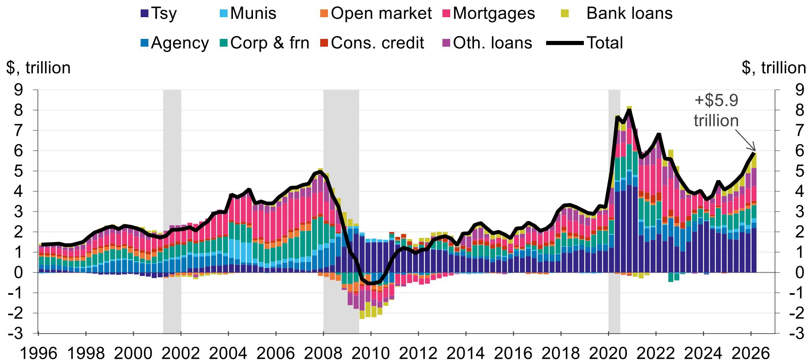
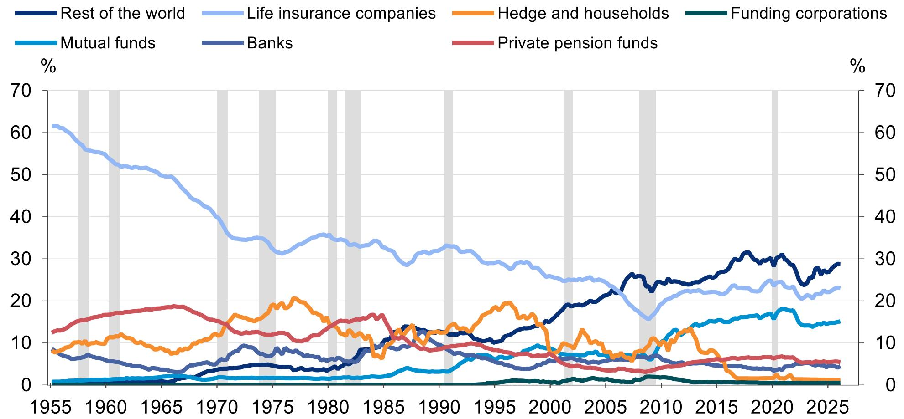
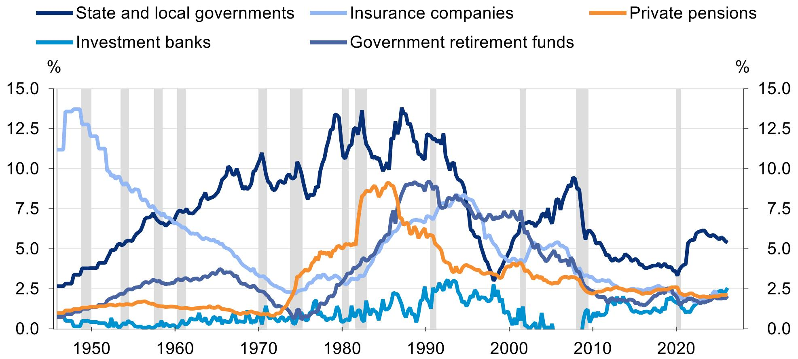

# DB：美国债券市场的真正变化不在需求端，而在持有者结构的不可逆重置

这份来自DB、由Matthew Luzzetti等五位分析师联合撰写的研报，提供了一个观察美国固定收益市场的新框架。报告的核心判断并非关于利率走势或通胀预期，而是关于一个更深层的问题：美国61万亿美元债券市场的持有者结构，正在经历一场不可逆的重置。

这份报告的价值在于，它没有停留在“谁在买”的简单统计上，而是试图回答一个更根本的问题：当美联储不再是最大买家、外国央行趋于保守、而国内私人部门开始重新定价风险时，市场运行逻辑会发生怎样的变化。

以下是对这份报告核心洞察的解读。

## 1. 外国持有者占比已降至30%，这个数字的背后是结构性而非周期性的退出

报告显示，外国持有美国国债的比例在2026年第一季度降至30%，接近2023年第三季度29%的多年低点。这个数字本身并不惊人，但结合全球外汇储备总额的变化来看，趋势值得关注。

全球外汇储备总额在2025年第三季度约为13万亿美元，虽然总量仍在增长，但美元占比持续走低。报告没有给出具体的美元占比数据，但从上下文可以推断，外国央行的增持意愿正在减弱。原因并非简单的“去美元化”，而是更务实的选择：多极储备体系下，各国央行在边际上更倾向于分散配置。

这里的关键洞察是：外国持有者占比下降，不是因为他们抛售，而是因为美国国债发行量增长更快。这意味着，美国必须找到新的国内买家来吸收增量供给。谁将成为这些增量国债的边际买家，将直接影响利率定价和金融市场的稳定性。

## 2. 一级交易商的国债库存激增至5500亿美元，市场缓冲垫正在变薄

报告中一个容易被忽视但极其重要的数据点：一级交易商的美国国债净持仓自2022年以来急剧上升，到2026年已达到约5500亿美元。这是历史最高水平。

一级交易商本质上扮演的是市场流动性提供者的角色。当他们的库存处于高位时，意味着市场的“天然买家”正在减少，交易商不得不自己持有更多存货。这并非因为他们看好国债，而是因为他们在履行做市义务。

这种现象的潜在含义有两个。第一，市场对冲击的缓冲能力下降。当交易商库存满仓时，他们无法在市场恐慌时大量吸收抛盘。第二，交易商的融资成本上升，这会传导至整个回购市场，进而影响短端利率的稳定性。

报告没有完全展开的是：如果一级交易商的库存继续上升，监管层面的资本约束是否会成为新的瓶颈。这里仍需验证。

## 3. 银行系统正在重新增持国债，但这次逻辑与量化宽松时期完全不同

报告显示，商业银行持有的国债和机构证券在经历美联储紧缩周期的收缩后，2026年再次回升至约4.8万亿美元，接近2022年的峰值。

但这次的增持逻辑与2020-2022年完全不同。当时银行增持国债是因为存款激增，需要配置高流动性资产。而2026年的增持，更多是因为银行在贷款利率下行、信贷需求疲软的环境下，主动寻求收益替代。

这是一个重要的结构性转变。当银行把国债当作“收益资产”而非“流动性资产”来配置时，他们对利率的敏感度会发生变化。如果利率上升导致国债价格下跌，银行可能面临更大的未实现损失，从而影响其信贷投放能力。

报告没有明确讨论的是，这种转变对银行净息差的长期影响。如果银行用国债替代贷款，其盈利能力将更直接地受制于利率曲线形态。

## 4. 私人持有国债集中在5年以内，长端利率的定价权正在转移

报告的一个重要图表显示，在美联储持有的国债之外，私人持有的可流通国债中，期限在5年以内的占比最大。这意味着，美国国债市场的“长端”正在变得越来越依赖少数几个大型机构投资者。

美联储目前仍持有约30%的10年期以上国债。随着量化紧缩的推进，美联储在长端的退出将迫使私人投资者吸收更多长期国债。但私人投资者对长端国债的需求并非无限弹性。

报告没有完全展开的是：养老金和保险公司作为长端国债的传统买家，其需求是否足以弥补美联储的退出。从报告数据看，保险公司在信用债市场的配置比例已从1950年代的60%以上降至当前的约23%，这个趋势是否会在国债市场重演，是一个关键问题。

## 5. 信用债市场的持有者结构正在向“被动化”倾斜，这改变了定价机制

报告显示，共同基金和外国投资者已成为公司债和外国债券的主要持有者，分别约占28%和14%。相比之下，传统上作为信用债最大买家的保险公司和养老金，其占比持续下降。

这种结构变化的含义是：信用债定价正在从“信用分析驱动”转向“指数配置驱动”。当越来越多的资金通过ETF和指数基金进入信用债市场时，个券的信用溢价将更多地取决于其是否被纳入指数，而非发行人的基本面。

这对高收益债市场的影响尤为显著。报告没有直接讨论的是，如果信用利差在指数配置的推动下被压缩至不合理的低位，一旦市场转向，被动资金可能加速抛售，造成比主动管理时代更剧烈的价格波动。

## 6. 报告尚未完全回答的一个关键问题：谁将填补美联储退出后的长端缺口

这是整份报告最核心但尚未完全解答的问题。美联储目前仍持有约30%的10年期以上国债。随着美联储继续缩表，这个比例将持续下降。

从报告数据看，一级交易商和银行系统可能成为长端国债的边际买家。但这两个主体的资产负债表都受到监管限制。外国央行的增持意愿有限。养老金和保险公司的久期需求虽然存在，但其对收益率的敏感度正在提高。

这意味着，长端国债收益率可能需要在更高的水平上才能找到足够的买家。而这将反过来影响抵押贷款利率、企业融资成本和财政部的利息支出。

报告没有给出明确的答案，但提供了一套分析框架：谁在买、为什么买、还能买多少。这三个问题的答案，决定了美国利率的长期中枢。

---

这份DB研报的价值，在于它把市场注意力从短期的通胀数据和就业报告，拉回到一个更根本的问题上：美国债券市场的持有者结构正在经历一场不可逆的重置。这种重置的影响不会在一天内显现，但它会逐渐改变利率定价、市场流动性和金融稳定性。

报告中有大量关于市政债、MBS和机构债的详细分析，以及各类型投资者资产配置的完整数据集，这些内容在本篇导读中未能一一展开。比如，报告对市政债持有者结构的讨论，揭示了银行和共同基金在税收优惠驱动下的配置行为，这对理解地方政府的融资成本有直接意义。

如果你对以下问题感兴趣，欢迎来星球微信群里继续讨论：一级交易商库存高企是否意味着流动性危机的种子已经埋下？银行增持国债对信贷供给的挤出效应有多大？外国央行在美元储备占比下降的同时，是否在边际上增加了对机构MBS的配置？

这些问题的答案，隐藏在这份报告的细节之中。

Personal reading notes and learning share only. Not investment advice.

