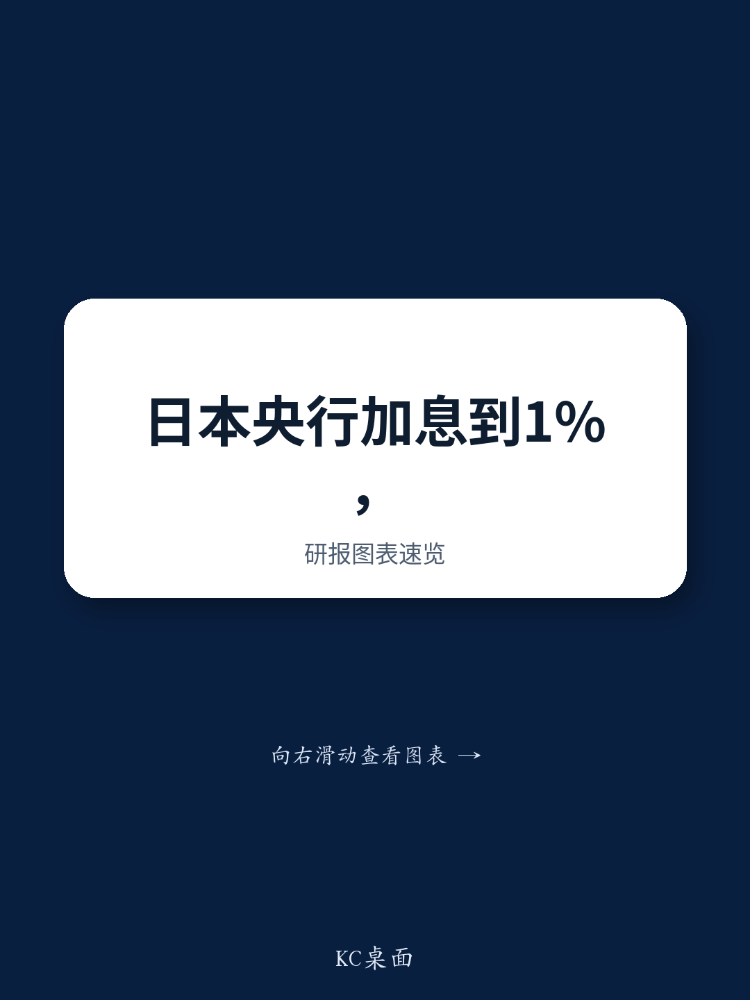
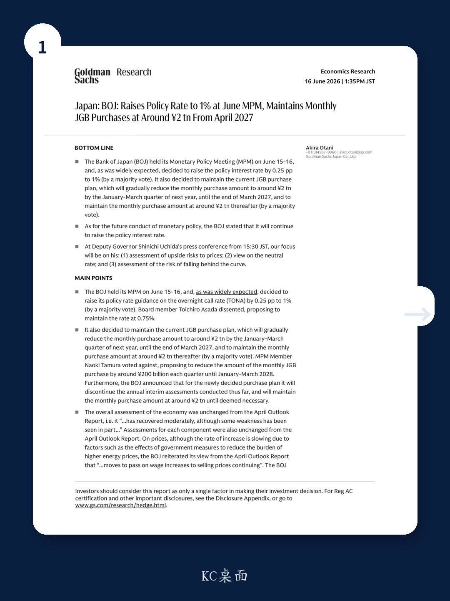
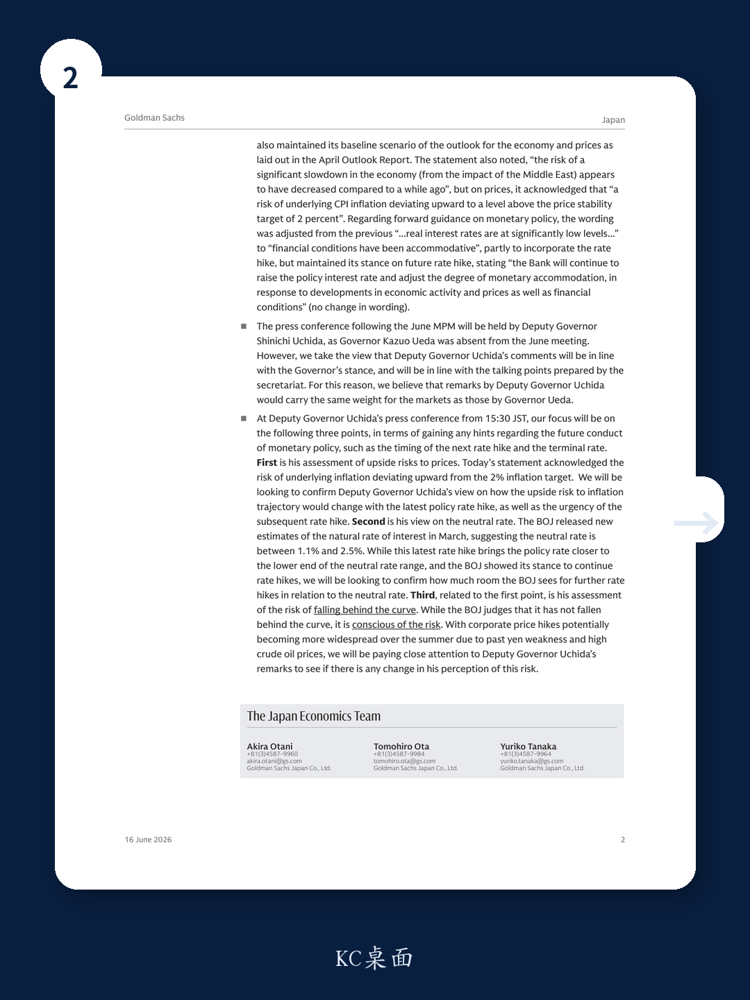

# The Bank of Japan Has Crossed a Threshold: 1% Policy Rate Changes the Calculus for Global Investors

The Bank of Japan’s decision to raise the policy rate to 1.0% at its June meeting is not merely another incremental tightening step. It is a structural inflection point. For the first time in decades, Japan’s policy rate has reached a level that forces a fundamental reassessment of the carry trade, the yen’s trajectory, and the relative attractiveness of Japanese assets in a global portfolio. This is no longer a story about whether the BOJ will normalize; it is a story about what happens when normalization becomes real.

The decision itself was widely anticipated. A 25-basis-point hike to 1.0% passed by a majority vote, with board member Asada dissenting in favor of maintaining 0.75%. The more telling signal came from the BOJ’s forward guidance, which explicitly stated that it “will continue to raise the policy interest rate.” This language was not softened. The central bank also confirmed it will maintain its JGB purchase plan, gradually reducing monthly purchases to around ¥2 trillion by early 2027 and holding that level thereafter. The message is clear: the BOJ sees further room to tighten, and it is willing to move.

Why now matters more than the headline number. The global investment community has spent years treating Japan as an outlier—a deflationary economy where monetary policy would remain accommodative indefinitely. That assumption is now broken. With the policy rate at 1.0%, the BOJ has entered a zone where it must actively manage the risk of overshooting on inflation, not just undershooting. The statement acknowledged that “a risk of underlying CPI inflation deviating upward” above the 2% target exists. This is the language of a central bank that is beginning to worry about being behind the curve, not ahead of it.

The implications for investors are profound. Japan is no longer a passive source of cheap funding for global carry trades. It is becoming a normal economy with a normal central bank. That shift will ripple through currency markets, bond yields, equity valuations, and sector allocation decisions. The strategic question is no longer whether to have exposure to Japan, but how to position for a regime where the BOJ is an active tightening force.

## The 1% Rate Level Creates a New Framework for Monetary Policy Credibility

The significance of the 1.0% threshold is not arbitrary. It represents the lower bound of the BOJ’s own estimated neutral rate range, which the central bank updated in March to between 1.1% and 2.5%. This means the policy rate is now at the very edge of what the BOJ itself considers neutral territory. The central bank is no longer operating in emergency accommodation; it is approaching the zone where monetary policy is neither stimulative nor restrictive.

This changes the analytical framework for every future BOJ decision. When rates were below 1.0%, the debate was about whether the economy could withstand any normalization at all. Now the debate shifts to how much further the BOJ can go before it begins to restrain growth. The neutral rate estimate provides a target, but it is a wide target. The gap between 1.1% and 2.5% is 140 basis points of uncertainty. The BOJ’s own internal models cannot tell it precisely where the terminal rate lies.

The market will now watch Deputy Governor Uchida’s press conference with unusual intensity. Three questions dominate: his assessment of upside risks to prices, his view on the neutral rate, and his perception of the risk of falling behind the curve. The first and third are linked. If the BOJ acknowledges that inflation could overshoot, it must also acknowledge that it might need to accelerate the pace of tightening. The second question is about destination. Does the BOJ see the terminal rate near the middle of its neutral range, or does it believe that 1.5% or 2.0% is sufficient?

The credibility of the entire normalization cycle hinges on the answers. A central bank that raises rates but then pauses prematurely risks losing control of inflation expectations. A central bank that moves too aggressively risks tipping a fragile recovery into recession. The BOJ is walking a narrow path, and the 1.0% level is the point at which the margin for error narrows significantly.

## The JGB Purchase Plan Signals a Managed Exit, Not an Abrupt One

The BOJ’s decision to maintain its JGB purchase plan until March 2027, with monthly purchases stabilizing at around ¥2 trillion, reveals a deliberate strategy. The central bank is not rushing to shrink its balance sheet. It is signaling that the exit from quantitative easing will be gradual, predictable, and transparent. The decision to discontinue annual interim assessments of the purchase plan reinforces this message: the BOJ wants to remove uncertainty about its bond-buying operations.

For fixed-income investors, this creates a clear timeline. The BOJ will continue to be a significant buyer of JGBs for at least another year, and the pace of reduction is already mapped out. This reduces the risk of a sudden spike in long-term yields that could destabilize the banking sector or trigger margin calls in the insurance industry. The BOJ is essentially providing a put option on the JGB market, at least through early 2027.

But there is a strategic tension here. The BOJ is raising the policy rate while continuing to buy bonds. This is not a contradiction; it is a hybrid approach designed to normalize the short end of the curve without disrupting the long end. The policy rate hike addresses inflation and the yen. The JGB purchases address financial stability and the government’s debt-servicing costs. The two tools are being used in tandem, but they pull in opposite directions.

The risk is that this hybrid approach becomes unsustainable. If inflation proves persistent, the BOJ may need to raise rates faster than planned, which would make the JGB purchase plan look inconsistent. Alternatively, if the economy weakens, the BOJ may need to pause rate hikes while continuing to buy bonds, which would raise questions about its commitment to normalization. Investors should watch for any signs that the BOJ is being forced to choose between its two objectives.

## The Dissenting Votes Reveal Internal Divergence on the Pace of Tightening

The June meeting featured two dissenting votes, and they are worth close attention. Board member Asada voted against the rate hike, proposing to maintain the rate at 0.75%. Board member Tamura voted against the JGB purchase plan, proposing a faster reduction of ¥200 billion per quarter through early 2028.

These dissents are not noise. They reveal a genuine internal debate about the speed and scope of normalization. Asada represents the cautious wing, concerned that raising rates too quickly could damage the recovery. Tamura represents the hawkish wing, arguing that the BOJ should move faster to shrink its balance sheet and reduce its market footprint.

The fact that both dissents were overruled by a majority does not mean the debate is settled. It means the BOJ’s leadership has chosen a middle path, but the endpoints of the internal spectrum are wide. If inflation continues to surprise to the upside, the Tamura view gains credibility. If growth disappoints, the Asada view becomes more persuasive. Investors should monitor the composition of future votes as a leading indicator of policy direction.

The strategic implication is that the BOJ is not a monolithic entity. It is a committee with genuine disagreements, and those disagreements will shape the pace of tightening. A central bank that is internally divided is more likely to pause or slow down when uncertainty rises. This is not necessarily a bearish signal for risk assets, but it introduces an additional layer of complexity for investors trying to forecast the path of rates.

## What the Report Does Not Fully Answer: The Yen and the Carry Trade Disruption

The report provides a detailed account of the BOJ’s decision and the forward guidance. It identifies the key questions for the press conference. But it does not fully address the most consequential question for global markets: what happens to the yen and the carry trade now that the policy rate is 1.0%?

The carry trade has been a dominant theme in global FX markets for years. Investors borrowed yen at near-zero rates to fund investments in higher-yielding currencies and assets. That trade is now under threat. With the BOJ signaling further rate hikes, the cost of funding yen positions is rising. At the same time, other major central banks are beginning to cut rates. The interest rate differential that made the carry trade so profitable is narrowing.

The report does not model the potential magnitude of carry trade unwinding. It does not estimate how much speculative yen short positioning exists, or how quickly it could reverse. It does not analyze the second-order effects on emerging market currencies, Asian equity markets, or commodity prices if the yen strengthens sharply. These are open questions that investors must answer for themselves.

What the report does make clear is that the BOJ is now actively managing the risk of falling behind the curve. If the yen weakens further, it will import inflation through higher import prices. That would force the BOJ to raise rates faster, which would in turn strengthen the yen. This feedback loop is the central dynamic to watch in the coming quarters. The report gives us the policy framework, but not the market outcome.

## A Decision Framework for Investors Navigating the Japanese Regime Shift

For investors, the BOJ’s June decision creates a new set of strategic questions. The framework below is designed to help structure the analysis.

First, assess your exposure to yen-funded positions. Any portfolio that relies on cheap yen financing is now at risk. The cost of carry is rising, and the direction of travel is clear. Investors should stress-test their positions under scenarios where the yen appreciates 10% to 15% over the next twelve months. The report suggests that the BOJ sees room for further rate hikes, which implies that the yen has further upside potential.

Second, evaluate the duration risk in Japanese government bonds. The BOJ’s purchase plan provides a floor for the market, but it does not prevent yields from rising. If the BOJ raises the policy rate to 1.5% or higher, the yield curve will steepen. Investors with long-duration JGB exposure should consider hedging or reducing positions. The report’s emphasis on the neutral rate range suggests that the BOJ itself expects yields to move higher over time.

Third, reconsider the role of Japanese equities in a global portfolio. Japanese stocks have benefited from a weak yen and accommodative monetary policy. That tailwind is fading. A stronger yen will compress export margins and reduce the value of overseas earnings in yen terms. At the same time, higher rates will increase the discount rate applied to future cash flows, which could compress valuations. Japanese equities are not necessarily a sell, but the thesis for owning them has changed. Investors should focus on domestic-demand-oriented sectors that benefit from wage growth and consumption, rather than exporters that rely on a weak currency.

Fourth, monitor the BOJ’s communication on the neutral rate. The range of 1.1% to 2.5% is too wide to be operationally useful. The market will be looking for signals about where within that range the BOJ believes the terminal rate lies. Any hint that the BOJ sees the neutral rate near the lower end would be dovish. Any suggestion that it sees room to go above 2.0% would be hawkish. The press conference and subsequent speeches will be critical for narrowing the range of possible outcomes.

## The Open Questions That Demand the Full Report

The BOJ has crossed a threshold, but the destination remains unknown. The report provides the analytical foundation for understanding the June decision, but it leaves several critical questions unanswered.

How quickly will the BOJ move to the next rate hike? The forward guidance says it will continue to raise rates, but it provides no calendar. The market must infer the pace from the data. If inflation remains above target and wage growth accelerates, the next hike could come as early as September. If the economy softens, the BOJ could pause until 2026.

What is the BOJ’s tolerance for yen strength? The report notes that the risk of a significant economic slowdown from Middle East tensions has decreased, but it does not address the risk of a disorderly yen appreciation. If the yen strengthens too quickly, it could damage export competitiveness and corporate profits. The BOJ may need to balance its inflation mandate against its financial stability concerns.

Will the BOJ eventually need to sell JGBs outright? The current plan relies on reducing purchases gradually, not selling bonds. But if the BOJ wants to shrink its balance sheet more aggressively, it will eventually need to consider outright sales. The report does not address this scenario, but it is the logical next step in the normalization process.

These are not academic questions. They will determine the path of Japanese asset prices for the next several years. The full report contains the detailed data, historical context, and scenario analysis needed to answer them.

Join the community to read the full report and review the original charts.

*This article is for learning and discussion only and does not constitute investment advice.*

Personal reading notes and learning share only. Not investment advice.

