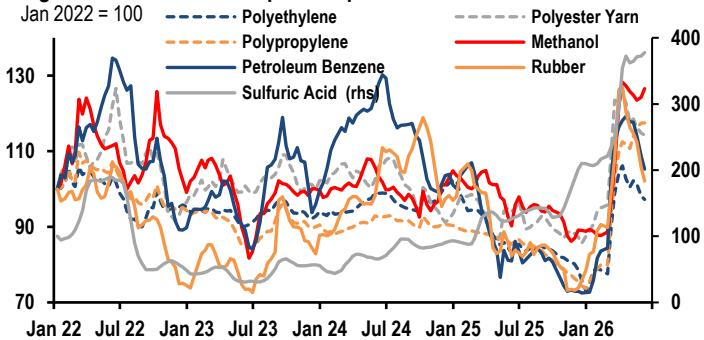
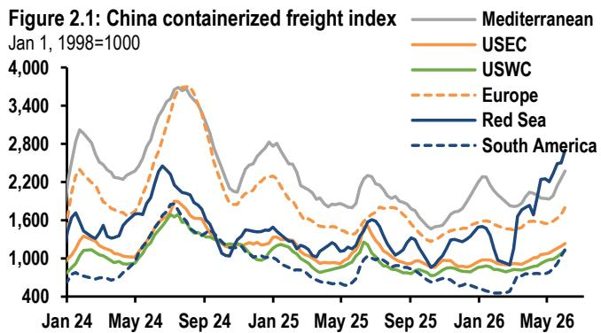
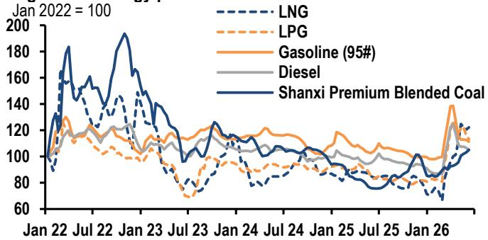

# China’s Economy Is Splitting in Two: The Exports Boom Masks a Domestic Demand Crisis That Policy Has Not Yet Solved

The most important story in China’s economy right now is not about growth slowing or accelerating. It is about a structural divergence that is becoming more pronounced by the week. On one side, exports are surging. Port data for June shows departing container and bulk shipping deadweight tonnage rising 17.9% year-on-year, more than double May’s pace. Freight costs to the US and the Persian Gulf are climbing. Trade is the clear bright spot. On the other side, domestic activity is faltering. Processed crude oil production is contracting further. Auto sales fell 22% year-on-year in May. Government bond issuance has moderated, and credit demand remains soft. The economy is not uniformly weak. It is splitting into two distinct regimes, and the policy response so far has been calibrated for the average, not for the divergence.

This matters because the second quarter is the critical window for recalibrating the growth trajectory. April data tilted second-quarter risks to the downside. May data has been mixed. The incoming high-frequency indicators for June will determine whether the domestic weakness is a temporary soft patch or the beginning of a more sustained deceleration. The alt-data trackers from a major global investment bank now provide a granular, real-time map of this divergence. The picture they paint is one of an export engine running hot while the domestic engine sputters, with fiscal and monetary policy still in a wait-and-see posture that may need to change.

The argument this article makes is straightforward: China’s current economic configuration is unsustainable without a policy pivot. The export sector cannot carry the entire economy, and the domestic demand shortfall is concentrated in precisely the areas—consumption, housing, and industrial production—that are least responsive to trade tailwinds. Until fiscal delivery accelerates and monetary conditions ease more decisively, the risk is that second-quarter growth will undershoot the official target, forcing a more aggressive policy response in the second half of the year. The alt-data is not just telling us where we are. It is telling us where policy will need to go.

## The Export Engine Is Running at Full Throttle, But the Fuel Is Not Reaching the Broader Economy

The trade data in this report is unambiguous. Departing container ships’ deadweight tonnage rose 5.0% year-on-year and 8.9% month-on-month in June month-to-date. Bulk carriers, which transport grain, coal, and iron ore, saw departing tonnage surge 21.7% year-on-year. The China Containerized Freight Index to the US East Coast and West Coast rose 6.5% and 9.1% respectively over the past two weeks, while the Persian Gulf/Red Sea route jumped another 8.6%. These are not marginal improvements. They are acceleration signals.

The so-what here is not that exports are strong. The so-what is that this strength is not translating into broad-based domestic demand. Higher export volumes and prices should, in theory, boost corporate profits, employment, and investment. But the alt-data shows the opposite happening in key domestic sectors. Processed crude oil production, a proxy for industrial activity in energy-intensive sectors, contracted 5.8% year-on-year in April, and the operating rates of petroleum asphalt plants suggest the contraction deepened in May and is extending into June. Steel production also contracted in May. Auto industrial production, which had been a relative bright spot, slowed in June after modest improvement in May.

This disconnect means the export channel is not functioning as a transmission mechanism to the rest of the economy. The reasons are structural. Export-oriented industries are increasingly capital-intensive and automated. They generate profits, but not proportionally more employment or domestic supply-chain demand. The beneficiaries of the trade boom are concentrated in coastal provinces and specific sectors, while the domestic demand weakness is broad-based across consumption, housing, and inland industrial activity. The alt-data captures this asymmetry in real time.

## Domestic Industrial Production Is Contracting in a Pattern That Suggests More Than Cyclical Weakness

The report’s mapping of high-frequency trackers to official activity is revealing. Operating rates for petroleum asphalt plants, tire plants, and steel rebar all point to contraction or stagnation in May and June. Processed crude oil production is the clearest example: the weekly tracker shows the contraction deepening from April’s -5.8% year-on-year. Auto industrial production growth may have improved modestly in May but slowed again in June. Steel production contraction deepened in May but may narrow slightly in June.

The pattern here is not random. It is consistent with a manufacturing sector that is being squeezed from two sides. On the input side, coal prices have risen to their highest level in nearly 20 months, driven by summer seasonal demand. Some petrochemical products have moderated from recent peaks, but sulfuric acid prices remain elevated. On the demand side, domestic consumption is weak. Passenger car retail sales fell 22% year-on-year in May, partially due to lower per-car trade-in subsidies and purchase tax exemptions, as well as higher fuel costs. New energy vehicle sales fell a narrower 7.5%, but even that is a deceleration from earlier in the year.

The so-what is that industrial production is not just weak. It is weakening in a way that suggests the domestic demand shortfall is becoming self-reinforcing. Lower production means lower employment and income growth, which in turn depresses consumption. The alt-data trackers are capturing the early stages of this feedback loop. If it continues, the contraction in industrial production could spread from energy-intensive and auto sectors to broader manufacturing, including the machinery and electronics sectors that are currently supported by exports.

## Fiscal and Monetary Policy Are in a Holding Pattern That May Be Unsustainable

The most striking aspect of the alt-data is what it reveals about policy posture. Government bond issuance moderated to 616 billion yuan in June month-to-date, down from 1,140 billion yuan in May. Central government bond issuance slipped to 164 billion yuan, while special local government bond issuance picked up only modestly to 212 billion yuan. The report notes that, absent a month-end jump, fiscal delivery will remain less front-loaded by June.

This is a critical observation. The standard narrative is that China has ample fiscal space and will accelerate bond issuance and fund deployment in the second half of the year. But the alt-data suggests that the pace of fiscal delivery is actually slowing in the near term, just as domestic demand weakness is becoming more apparent. The report explicitly states that if domestic demand weakness persists, an acceleration in government bond issuance and fund deployment is expected in the third quarter. That is a conditional statement, not a forecast. It implies that the current pace is insufficient to reverse the domestic demand trend.

On the monetary side, the People’s Bank of China net injected 410 billion yuan of liquidity via pledged open market operations in June month-to-date, while withdrawing 300 billion yuan via outright open market operations. The net injection is modest. The report adds that a cut could become more likely in the second half if growth headwinds intensify and outweigh inflation risks. Again, this is conditional. The implication is that the PBOC is not yet convinced that the domestic weakness warrants a rate cut, but the alt-data is building the case for one.

The so-what is that policy is currently calibrated for a scenario in which the domestic weakness is temporary and exports remain strong. But the alt-data is telling a different story. The domestic weakness is not temporary. It is structural and self-reinforcing. If policy does not pivot soon, the second-quarter growth outcome could be significantly below the official target, forcing a more aggressive and potentially less effective response later.

## Housing Market Stabilization Is Real but Fragile, and It May Not Be Enough to Drive a Broader Recovery

The housing data in this report is one of the few genuinely positive signals. Home sales in both new and secondary markets outperformed the same period last year in June month-to-date, with housing transactions in 30 major cities gaining 4.0% year-on-year, compared to -1.4% in May. This is a meaningful improvement. The report notes, however, that some momentum has eased lately, and uncertainty remains over whether this marks a housing market bottoming-out.

The so-what is that housing stabilization is a necessary condition for a broader domestic demand recovery, but it is not a sufficient one. Housing transactions are still at low levels in absolute terms. The improvement is from a very low base. More importantly, the housing market recovery is not yet translating into broader economic activity. Construction-related industrial production, such as steel and coke, remains weak. The operating rates for coke oven plants ticked down in June month-to-date. This suggests that the housing recovery is not yet driving a meaningful increase in construction activity or demand for building materials.

The deeper question is whether the housing market can sustain its improvement without additional policy support. The report’s alt-data does not answer this question, but it provides the framework for asking it. If housing transactions continue to improve, it could provide a floor for domestic demand. If they stall, the entire domestic demand outlook becomes significantly more negative. The alt-data trackers will be the first to signal which direction the housing market is heading.

## The Report’s Unanswered Question: How Will the Divergence Resolve?

The alt-data in this report is remarkably detailed, but it leaves one critical question open: how will the divergence between strong exports and weak domestic demand resolve? There are three possible scenarios, and the alt-data does not yet tell us which one is most likely.

The first scenario is that domestic demand recovers on its own, driven by the housing market stabilization and a gradual improvement in consumer confidence. In this scenario, the export strength continues, and the economy converges to a higher growth path. The alt-data would show industrial production stabilizing, auto sales improving, and government bond issuance accelerating in the second half.

The second scenario is that the domestic weakness persists, forcing a more aggressive policy response. In this scenario, the PBOC cuts rates, fiscal delivery accelerates sharply, and the government introduces new consumption stimulus measures. The alt-data would show a sudden increase in government bond issuance, a pickup in credit demand, and a stabilization in industrial production after the policy measures take effect.

The third scenario is the most concerning: the export strength begins to fade, and the domestic weakness continues. In this scenario, the economy faces a synchronized slowdown with no clear driver of growth. The alt-data would show a decline in port traffic and freight costs, alongside continued weakness in industrial production and consumption.

The report’s alt-data trackers are designed to provide early signals for each of these scenarios. But the current data does not yet resolve the uncertainty. That is why the report is valuable: it provides the framework for monitoring the divergence, but it leaves the reader with the analytical work of determining which scenario is unfolding.

## A Decision Framework for Readers: What to Watch in the Next Four Weeks

For readers who want to use this alt-data to make their own assessments, the report provides the building blocks for a simple but powerful decision framework. Focus on four indicators over the next four weeks.

First, watch the port data. If departing container and bulk shipping tonnage continues to accelerate, the export engine is still running strong. If it decelerates, the risk of scenario three increases.

Second, watch the operating rates for petroleum asphalt plants and steel rebar. These are the earliest signals of industrial production trends. If they stabilize or improve, the domestic contraction may be bottoming. If they continue to decline, the weakness is deepening.

Third, watch government bond issuance. The report notes that fiscal delivery will remain less front-loaded by June. If there is a month-end jump in issuance, it signals that policymakers are responding to the weakness. If not, the policy posture is still in wait-and-see mode.

Fourth, watch the housing transaction data for 30 major cities. If the year-on-year gains continue to improve, the housing market recovery is gaining traction. If they stall or reverse, the recovery is fragile.

These four indicators will tell you, in real time, which scenario is unfolding. The alt-data report provides the baseline. The reader must do the monitoring.

Join the community to read the full report and review the original charts.

*This article is for learning and discussion only and does not constitute investment advice.*

Personal reading notes and learning share only. Not investment advice.

