# From the Global Director of Research | North America

# Charts That Caught My Eye

A guiding principle at MS is to enhance your investment process by delivering unique insights that separate the signal from the noise. An intuitively designed and well-crafted chart can often accomplish this with exceptional clarity.

With that mission in mind, these charts in our recently published research stood out to me.

1. Thematics – AI: A "buy the dip" strategy can enhance alpha in AI-related thematic categories.  
2. US Economics & Strategy: Equity and rates markets react differently to data surprises depending on whether the CPI is above / below 3%.  
3. Europe Equity Strategy: We have refreshed our data-driven sector model, doubling down on AI, Banks, and Mining.  
4. China Economics: We expect a two-speed economy to persist, with exports and emerging manufacturing categories leading while consumption lags.  
5. Multipolar World – US Reshoring: After a year of tariffs, we are seeing more of a reorientation of supply chains than a “true” US reshoring.  
6. US Economics: We estimate the breakeven pace for US payrolls (at which the unemployment rate is unchanged) is +50,000 per month.  
7. US Valuation, Accounting and Tax Strategy: We expect corporates' cash tax rates to fall further this year as additional OBBBA benefits go into effect.  
8. Semiconductors: Our core view is that the cycle is still accelerating – earnings revisions remain robust and appear sustainable.

Please reach out to me with feedback on these or any other key investment debates. Thank you for your partnership.

Katy Huberty

Global Director of Research

MS & CO. LLC

Katy L. Huberty, CFA

Global Director of Research

Kathryn.Huberty@morganstanley.com

+1 212 761-6249

MS

Analyst

erteam@morganstanley.com

text_image

Signal That Moves Capital.
The MS Institute delivers integrated thinking on
the key questions that matter most to financial decision-makers.
Subscribe
MS Institute

MS does and seeks to do business with companies covered in MS. As a result, investors should be aware that the firm may have a conflict of interest that could affect the objectivity of MS. Investors should consider MS as only a single factor in making their investment decision.

For important disclosures, refer to the Disclosure Section, located at the end of this report.

## Thematics – AI

# 'Buy The Dip' Can Enhance Alpha in AI-Related Thematic Categories

Thematic investing can be a powerful driver of alpha: YTD, our thematic stock categories have outperformed the S&P 500 and MSCI World by 11% and 12%, respectively. One practical way that thematic conviction can translate into even greater alpha is through disciplined buying during periods of theme-specific volatility – i.e., episodes in which certain thematic categories underperform due to either broad market dynamics or idiosyncratic concerns tied to a given theme. We developed a “buy-the-dip” strategy overlay on MS’s AI Infrastructure (Bloomberg: MSRSTAI) and Powering AI (Bloomberg: MSRSTPAI) subthemes from 2023 onward. The back-tested cumulative performance of the strategy versus the respective underlying thematic portfolios is below.

See Thematics + Mathematics (11 Jun 2026)

Exhibit 1: Buy-the-dip strategy cumulative performance since 2023 - "AI Infrastructure" sub-theme  
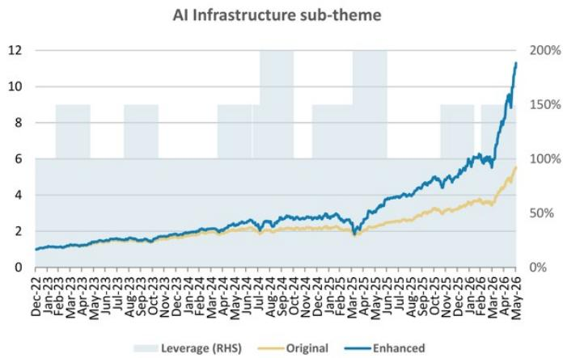

line chart

| Date | Leverage (RHS) | Original | Enhanced |
| --- | --- | --- | --- |
| Dec-22 | 9 | 1 | 1 |
| Jan-23 | 9 | 1 | 1 |
| Feb-23 | 9 | 1 | 1 |
| Mar-23 | 9 | 1 | 1 |
| Apr-23 | 9 | 1 | 1 |
| May-23 | 9 | 1 | 1 |
| Jun-23 | 9 | 1 | 1 |
| Jul-23 | 9 | 1 | 1 |
| Aug-23 | 9 | 1 | 1 |
| Sep-23 | 9 | 1 | 1 |
| Oct-23 | 9 | 1 | 1 |
| Nov-23 | 9 | 1 | 1 |
| Dec-23 | 9 | 1 | 1 |
| Jan-24 | 9 | 1 | 1 |
| Feb-24 | 9 | 1 | 1 |
| Mar-24 | 9 | 1 | 1 |
| Apr-24 | 9 | 1 | 1 |
| May-24 | 9 | 1 | 1 |
| Jun-24 | 9 | 1 | 1 |
| Jul-24 | 9 | 1 | 1 |
| Aug-24 | 9 | 1 | 1 |
| Sep-24 | 9 | 1 | 1 |
| Oct-24 | 9 | 1 | 1 |
| Nov-24 | 9 | 1 | 1 |
| Dec-24 | 9 | 1 | 1 |
| Jan-25 | 9 | 1 | 1 |
| Feb-25 | 9 | 1 | 1 |
| Mar-25 | 9 | 1 | 1 |
| Apr-25 | 9 | 1 | 1 |
| May-25 | 9 | 1 | 1 |
| Jun-25 | 9 | 1 | 1 |
| Jul-25 | 9 | 1 | 1 |
| Aug-25 | 9 | 1 | 1 |
| Sep-25 | 9 | 1 | 1 |
| Oct-25 | 9 | 1 | 1 |
| Nov-25 | 9 | 1 | 1 |
| Dec-25 | 9 | 1 | 1 |
| Jan-26 | 9 | 1 | 1 |
| Feb-26 | 9 | 1 | 1 |
| Mar-26 | 9 | 1 | 1 |
| Apr-26 | 9 | 1 | 1 |
| May-26 | 9 | 1 | 1 |
| May-27 | 9 | 1 | 1 |
| May-28 | 9 | 1 | 1 |
| May-29 | 9 | 1 | 1 |
| May-30 | 9 | 1 | 1 |
| May-31 | 9 | 1 | 1 |
| May-32 | 9 | 1 | 1 |
| May-33 | 9 | 1 | 1 |
| May-34 | 9 | 1 | 1 |
| May-35 | 9 | 1 | 1 |
| May-36 | 9 | 1 | 1 |
| May-37 | 9 | 1 | 1 |
| May-38 | 9 | 1 | 1 |
| May-39 | 9 | 1 | 1 |
| May-40 | 9 | 1 | 1 |
| May-41 | 9 | 1 | 1 |
| May-42 | 9 | 1 | 1 |
| May-43 | 9 | 1 | 1 |
| May-44 | 9 | 1 | 1 |
| May-45 | 9 | 1 | 1 |
| May-46 | 9 | 1 | 1 |
| May-47 | 9 | 1 | 1 |
| May-48 | 9 | 1 | 1 |
| May-49 | 9 | 1 | 1 |
| May-50 | 9 | 1 | 1 |
| May-51 | 9 | 1 | 1 |
| May-52 | 9 | 1 | 1 |
| May-53 | 9 | 1 | 1 |
| May-54 | 9 | 1 | 1 |
| May-55 | 9 | 1 | 1 |
| May-56 | 9 | 1 | 1 |
| May-57 | 9 | 1 | 1 |
| May-58 | 9 | 1 | 1 |
| May-59 | 9 | 1 | 1 |
| May-60 | 9 | 1 | 1 |
| May-61 | 9 | 1 | 1 |
| May-62 | 9 | 1 | 1 |
| May-63 | 9 | 1 | 1 |
| May-64 | 9 | 1 | 1 |

Source: Bloomberg (ticker: MSRSTAll), MS. Data as of June 2nd, 2026.

Exhibit 2: Buy-the-dip strategy cumulative performance since 2023 - "Powering AI" sub-theme  
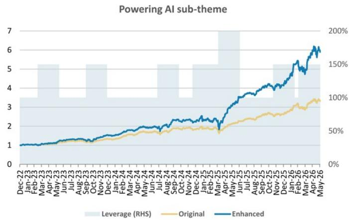

line chart

| Date     | Original | Enhanced |
|----------|----------|----------|
| Dec-22   | 1.0      | 1.0      |
| Jan-23   | 1.0      | 1.0      |
| Feb-23   | 1.0      | 1.0      |
| Mar-23   | 1.0      | 1.0      |
| Apr-23   | 1.0      | 1.0      |
| May-23   | 1.0      | 1.0      |
| Jun-23   | 1.0      | 1.0      |
| Jul-23   | 1.0      | 1.0      |
| Aug-23   | 1.0      | 1.0      |
| Sep-23   | 1.0      | 1.0      |
| Oct-23   | 1.0      | 1.0      |
| Nov-23   | 1.0      | 1.0      |
| Dec-23   | 1.0      | 1.0      |
| Jan-24   | 1.0      | 1.0      |
| Feb-24   | 1.0      | 1.0      |
| Mar-24   | 1.0      | 1.0      |
| Apr-24   | 1.0      | 1.0      |
| May-24   | 1.0      | 1.0      |
| Jun-24   | 1.0      | 1.0      |
| Jul-24   | 1.0      | 1.0      |
| Aug-24   | 1.0      | 1.0      |
| Sep-24   | 1.0      | 1.0      |
| Oct-24   | 1.0      | 1.0      |
| Nov-24   | 1.0      | 1.0      |
| Dec-24   | 1.0      | 1.0      |
| Jan-25   | 1.0      | 1.0      |
| Feb-25   | 1.0      | 1.0      |
| Mar-25   | 1.0      | 1.0      |
| Apr-25   | 1.0      | 1.0      |
| May-25   | 1.0      | 1.0      |
| Jun-25   | 1.0      | 1.0      |
| Jul-25   | 1.0      | 1.0      |
| Aug-25   | 1.0      | 1.0      |
| Sep-25   | 1.0      | 1.0      |
| Oct-25   | 1.0      | 1.0      |
| Nov-25   | 1.0      | 1.0      |
| Dec-25   | 1.0      | 1.0      |
| Jan-26   | 1.0      | 1.0      |
| Feb-26   | 1.0      | 1.0      |
| Mar-26   | 1.0      | 1.0      |
| Apr-26   | 1.0      | 1.0      |
| May-26   | 1.0      | 1.0      |

Source: Bloomberg (ticker: MSRSTPAI), MS. Data as of June 2nd, 2026.

Note: The back-test assumed an initial 100% capital allocation at end-2022. We increase exposure to 150% when the thematic portfolio declines by 5%, and to 200% when it declines by 15%. Each increase in leverage is held for three months (63 trading days), after which exposure reverts to 100%, unless a new signal is triggered earlier.

## US Economics & Strategy

## Above 3%, CPI Hits Different

Upside growth surprises (measured by Nonfarm Payrolls, or NFP) have tended to boost US equities, while upside inflation surprises have tended to weigh on them. Meanwhile, in rates markets, a hot US CPI print tends to push up US front-end rates. But we find that these markets react differently to data surprises depending on whether the CPI is above or below 3% inflation. When headline CPI is above 3% CPI surprises tend to move front-end rates significantly, but when CPI is between 2-3%, only the equity reaction is significant. Meanwhile, when CPI is below 2%, surprises do not reliably move rates or equities.

See Above 3%, CPI Hits Different (15 Jun 2026)

Exhibit 3: Hot CPI weighs on the S&P 500 (about -17 bp per +1σ) while hot NFP lifts it  

scatterplot

| Surprise (z-score) | S&P 500 return, 8-9 ET (%) | Group |
| ------------------ | -------------------------- | ----- |
| -3.0               | -0.3                       | CPI   |
| -2.0               | -0.2                       | CPI   |
| -1.0               | 0.1                        | CPI   |
| 0.0                | 0.0                        | CPI   |
| 1.0                | -0.1                       | CPI   |
| 2.0                | 0.3                        | CPI   |
| -3.0               | -0.4                       | NFP   |
| -2.0               | -0.5                       | NFP   |
| -1.0               | 0.2                        | NFP   |
| 0.0                | 0.1                        | NFP   |
| 1.0                | 0.3                        | NFP   |
| 2.0                | 0.5                        | NFP   |

Source: Bloomberg, MS. Note: Sample shown is Jan 2016 - Feb 2020. Y-axis is clipped to $(-0.75\%, +0.75\%)$ . Feb 14 2018 CPI $(-1.24\%$ SPX) is omitted for clarity of presentation

Exhibit 4: Both CPI and NFP upside surprises raise US yields  
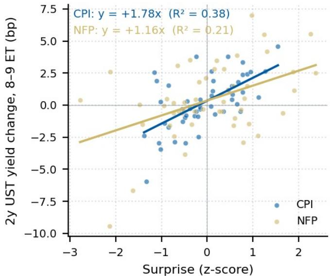

scatterplot

| Surprise (z-score) | 2y UST yield change, 8-9 ET (bp) | Group |
| ------------------ | -------------------------------- | ----- |
| -2.5               | -9.0                             | CPI   |
| -1.5               | -6.0                             | CPI   |
| -1.0               | -4.0                             | CPI   |
| -0.5               | -2.0                             | CPI   |
| 0.0                | 0.0                              | CPI   |
| 0.5                | 1.0                              | CPI   |
| 1.0                | 2.0                              | CPI   |
| 1.5                | 3.0                              | CPI   |
| 2.0                | 4.0                              | CPI   |
| -2.0               | 2.5                              | NFP   |
| -1.0               | 1.0                              | NFP   |
| 0.0                | 0.0                              | NFP   |
| 1.0                | -1.0                             | NFP   |
| 2.0                | -2.0                             | NFP   |

Source: Bloomberg, MS. Note: Sample shown is Jan 2016 - Feb 2020

## Europe Equity Strategy

## Sector Model Refresh: Doubling Down on AI, Banks, and Mining

We have refreshed our data-driven sector model, using the recent dip to add to categories with outstanding fundamentals across Europe's AI complex, with Semis holding the #1 ranking. Metals & Mining has risen to #2, and from an Equity Strategy perspective, we have upgraded the sector to OW. We have also raised Capital Goods to OW, boosted by its AI exposures. Notably outside of AI, Banks rose to 3rd in our ranking (up from 6th), and we remain OW the sector. We have reduced Defense to EW as a still-positive long-term rearmament view is offset by muted factor momentum and limited near-term catalysts.

See Sector Model Refresh: Doubling Down on AI, Banks, & Mining (9 Jun 2026)

Exhibit 5: Europe's core AI capex beneficiaries make up c. 15% of the MSCI Europe index  
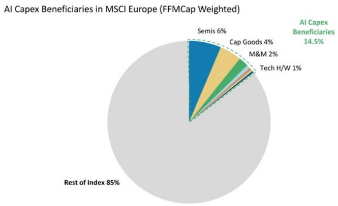

pie chart

AI Capex Beneficiaries in MSCI Europe (FFMCap Weighted)
| Category | Percentage (%) |
|---|---|
| Semis | 6 |
| Cap Goods | 4 |
| M&M | 2 |
| Tech H/W | 1 |
| AI Capex Beneficiaries | 14.5 |
| Rest of Index | 85 |

Source: LSEG Data & Analytics, MS

Exhibit 6: Semis stand out on fundamental momentum indicators; Banks jump back into the top 3  
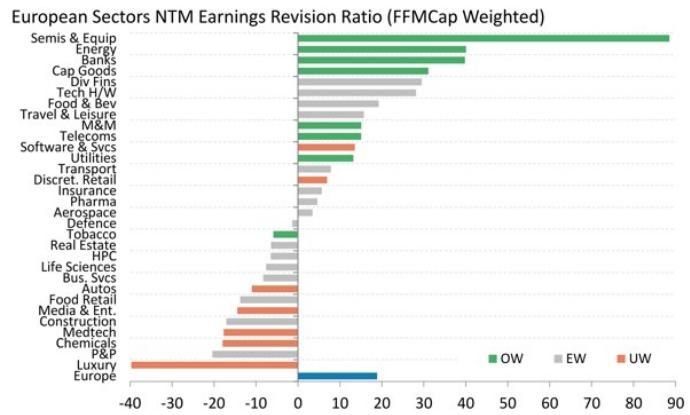

bar chart

| Sector | OWI (%) | EW (%) | UW (%) |
| --- | --- | --- | --- |
| Semis & Equip | 87 | 0 | 0 |
| Energy | 39 | 0 | 0 |
| Banks | 31 | 0 | 0 |
| Cap Goods | 29 | 0 | 0 |
| Div Fins | 28 | 0 | 0 |
| Tech H/W | 26 | 25 | 0 |
| Food & Bev | 19 | 19 | 0 |
| Travel & Leisure | 16 | 16 | 0 |
| M&M | 14 | 14 | 0 |
| Telecoms | 13 | 13 | 0 |
| Software & Svcs | 12 | 12 | 12 |
| Utilities | 11 | 11 | 0 |
| Transport | 6 | 6 | 6 |
| Discret. Retail | 5 | 5 | 5 |
| Insurance | 4 | 4 | 4 |
| Pharma | 3 | 3 | 3 |
| Aerospace | -1 | -1 | -1 |
| Defence | -2 | -2 | -2 |
| Tobacco | -3 | -3 | -3 |
| Real Estate | -4 | -4 | -4 |
| HPC | -5 | -5 | -5 |
| Life Sciences | -6 | -6 | -6 |
| Bus. Svcs | -7 | -7 | -7 |
| Autos | -8 | -8 | -8 |
| Food Retail | -9 | -9 | -9 |
| Media & Ent. | -10 | -10 | -10 |
| Construction | -11 | -11 | -11 |
| Medtech | -12 | -12 | -12 |
| Chemicals | -13 | -13 | -13 |
| P&P | -14 | -14 | -14 |
| Luxury Europe | -22 | -22 | -22 |

Source: Based on 45-day consensus window; Source: Factset, LSEG Data & Analytics, MS

## China Economics

## The K-Shaped Economy Is Here To Stay

We expect China's real GDP growth to be 4.8% in 2026 and 4.7% in 2027. The key driver would be strength in the "new economy" – exports and manufacturing capex related to AI, energy transition, and emerging tech sectors. The "old economy" stands in contrast – we expect household consumption to be constrained by a soft labor market and ongoing property-market adjustment. But even though we forecast China's export growth to be sustained at 10%, this high reliance on external demand would increase the economy's exposure to the global cycle, as well as potential for heightened trade tensions. The real cure, in our view, is reform that rebalances growth toward consumption.

See China's 3D Journey: The Hefei Paradox: Why Smart Industrial Policy Can't Fix Macro Imbalances (7 Jun 2026)

Exhibit 7: A two-speed economy, stable in aggregate  
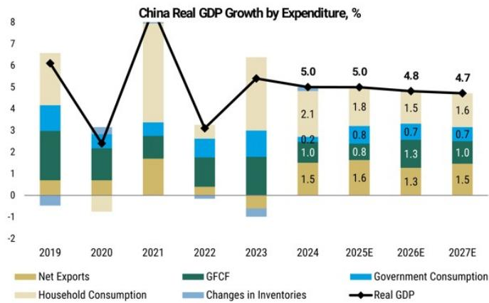

bar-line hybrid

China Real GDP Growth by Expenditure, %
| Year | Net Exports (%) | GFCF (%) | Government Consumption (%) | Household Consumption (%) | Changes in Inventories (%) | Real GDP (%) |
|---|---|---|---|---|---|---|
| 2019 | 0.8 | 2.3 | 1.4 | 2.0 | -0.5 | 6.0 |
| 2020 | 0.7 | 1.4 | 0.5 | -0.8 | -0.5 | 2.4 |
| 2021 | 1.6 | 1.1 | 0.7 | 4.5 | -0.5 | 8.0 |
| 2022 | 0.3 | 1.4 | 0.9 | -0.3 | -0.3 | 3.1 |
| 2023 | -0.7 | 1.6 | 1.3 | 2.8 | -0.7 | 5.4 |
| 2024 | 1.5 | 1.0 | 0.2 | 2.1 | -0.3 | 5.0 |
| 2025E | 1.6 | 0.8 | 0.8 | 1.8 | -0.3 | 5.0 |
| 2026E | 1.3 | 1.3 | 0.7 | 1.5 | -0.3 | 4.8 |
| 2027E | 1.5 | 1.0 | 0.7 | 1.6 | -0.3 | 4.7 |

Source: CEIC, MS estimates.

Exhibit 8: Increased external demand reliance would increase China's vulnerability to global cycle changes  
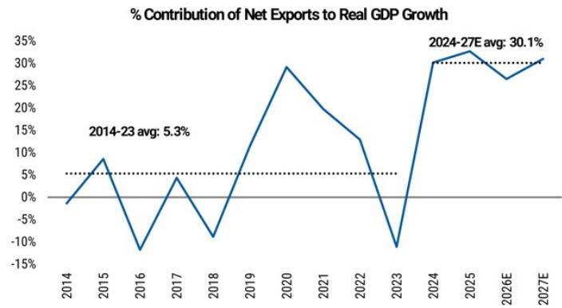

line chart

% Contribution of Net Exports to Real GDP Growth
| Year | Contribution (%) |
|---|---|
| 2014 | -2.0 |
| 2015 | 8.5 |
| 2016 | -11.0 |
| 2017 | 4.5 |
| 2018 | -9.0 |
| 2019 | 10.0 |
| 2020 | 29.5 |
| 2021 | 19.5 |
| 2022 | 13.0 |
| 2023 | -10.5 |
| 2024 | 30.0 |
| 2025E | 32.5 |
| 2026E | 26.5 |
| 2027E | 31.0 |
2014-23 avg: 5.3%
2024-27E avg: 30.1%

Source: CEIC, MS

## Multipolar World – US Reshoring

## Not Quite Yet ...

After one year of tariffs, the data suggest there is more of a reorientation of supply chains than a “true” US reshoring. Although nominal numbers suggest gross output rose considerably in 2025, it was largely price-driven. We are seeing narrow, long-dated investment, but it is tied mainly to AI capacity formation. We do see faint signals of a potential start to selective reshoring, but we believe policy continuity, especially around USMCA, will determine whether the selective reshoring we’ve seen thus far can broaden beyond the AI ecosystem.

See Reshoring? Not Quite Yet (9 Jun 2026)

Exhibit 9: Import penetration, measured as the share of domestic supply derived from imports, rose in 2025  
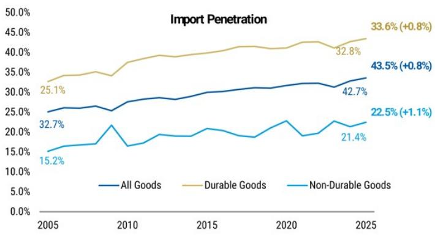

line chart

| Year | All Goods (%) | Durable Goods (%) | Non-Durable Goods (%) |
| --- | --- | --- | --- |
| 2005 | 25.1 | 32.7 | 15.2 |
| 2010 | 28.0 | 38.0 | 16.5 |
| 2015 | 29.5 | 40.0 | 19.0 |
| 2020 | 31.0 | 41.5 | 23.0 |
| 2025 | 42.7 | 32.8 | 21.4 |
| 2025 (with +0.8%) | 43.5 | 33.6 | 22.5 |

Source: BEA, Census, MS

Exhibit 10: Although nominal numbers suggest gross output rose considerably in 2025, it was largely price-driven  
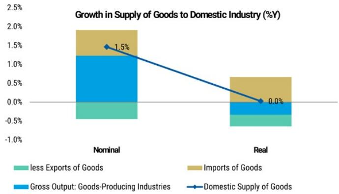

bar-line hybrid

Growth in Supply of Goods to Domestic Industry (%Y)
| Category | Less Exports of Goods (%) | Imports of Goods (%) | Gross Output: Goods-Producing Industries (%) | Domestic Supply of Goods (%) |
|---|---|---|---|---|
| Nominal | -0.4 | 0.6 | 1.2 | 1.5 |
| Real | -0.4 | 0.5 | 0.2 | 0.0 |

Source: BEA, Census, MS

Exhibit 11: Import penetration for most non-durable goods has been range-bound  
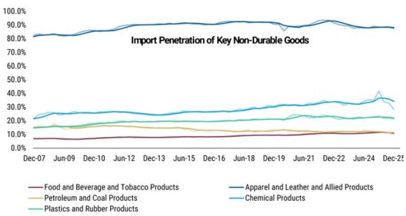

line chart

| Date    | Food and Beverage and Tobacco Products | Petroleum and Coal Products | Plastics and Rubber Products | Apparel and Leather and Allied Products | Chemical Products |
|---------|------------------------------------------|-----------------------------|------------------------------|------------------------------------------|--------------------|
| Dec-07  | 8.0%                                     | 15.0%                       | 20.0%                        | 85.0%                                    | 25.0%              |
| Jun-09  | 8.0%                                     | 15.0%                       | 20.0%                        | 85.0%                                    | 25.0%              |
| Dec-10  | 8.0%                                     | 15.0%                       | 20.0%                        | 85.0%                                    | 25.0%              |
| Jun-12  | 8.0%                                     | 15.0%                       | 20.0%                        | 85.0%                                    | 25.0%              |
| Dec-13  | 8.0%                                     | 15.0%                       | 20.0%                        | 85.0%                                    | 25.0%              |
| Jun-15  | 8.0%                                     | 15.0%                       | 20.0%                        | 85.0%                                    | 25.0%              |
| Dec-16  | 8.0%                                     | 15.0%                       | 20.0%                        | 85.0%                                    | 25.0%              |
| Jun-18  | 8.0%                                     | 15.0%                       | 20.0%                        | 85.0%                                    | 25.0%              |
| Dec-19  | 8.0%                                     | 15.0%                       | 20.0%                        | 85.0%                                    | 25.0%              |
| Jun-21  | 8.0%                                     | 15.0%                       | 20.0%                        | 85.0%                                    | 25.0%              |
| Dec-22  | 8.0%                                     | 15.0%                       | 20.0%                        | 85.0%                                    | 25.0%              |
| Jun-24  | 8.0%                                     | 15.0%                       | 20.0%                        | 85.0%                                    | 25.0%              |
| Dec-25  | 8.0%                                     | 15.0%                       | 20.0%                        | 85.0%                                    | 25.0%              |

Source: BEA, MS

## US Economics

# We Estimate the ‘Breakeven’ Payrolls Pace Is +50,000 Per Month

Over the last three months, payrolls averaged +188,000 per month – above our estimate of labor supply growth. We estimate the breakeven pace for US payrolls that is consistent with an unchanged unemployment rate to be 50,000 per month. Six-, nine-, and 12-month comparisons make for a cleaner assessment, and they look consistent with our 50k breakeven estimate.

See Why didn't the unemployment rate fall more? And will labor supply growth be sufficient? (11 Jun 2026)

Exhibit 12: The measured breakeven pace for payrolls fell sharply in the three months through February, then rose sharply in the three months through May  
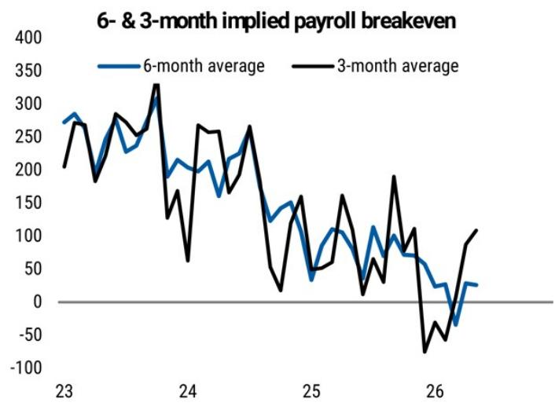

line chart

| Month | 6-month average | 3-month average |
|-------|-----------------|-----------------|
| 23    | ~280            | ~270            |
| 24    | ~200            | ~330            |
| 25    | ~150            | ~150            |
| 26    | ~20             | ~-50            |

Source: BLS, MS

Exhibit 13: We continue to expect 50k per month as the breakeven pace; the past 6, 9, and 12 months look consistent with that estimate  
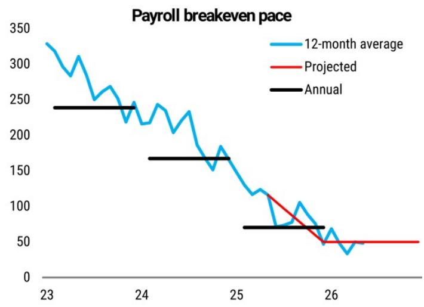

line chart

| Year | 12-month average | Projected | Annual |
|------|------------------|-----------|--------|
| 23   | 330              | -         | 240    |
| 24   | 240              | -         | 170    |
| 25   | 180              | -         | 170    |
| 26   | 50               | 50        | 70     |

Source: BLS, MS

# US Valuation, Accounting and Tax Strategy

## OBBBA Update – Benefits Still Ahead, 2026 FCF Could Surprise

The One Big Beautiful Bill Act created substantial corporate tax benefits last year, with the median effective cash tax rate falling 3% in 2025. We expect cash tax rates to fall further this year as additional OBBBA benefits go into effect. One result of these OBBBA effects is that corporate tax receipts now make up a smaller contribution to federal government revenue, and we think they are likely to continue to decline.

See OBBBA Update: Benefits Still Ahead, 2026 FCF Could Surprise (11 Jun 2026)

Exhibit 14: Corporate Cash Tax Rates Likely to Fall Further  
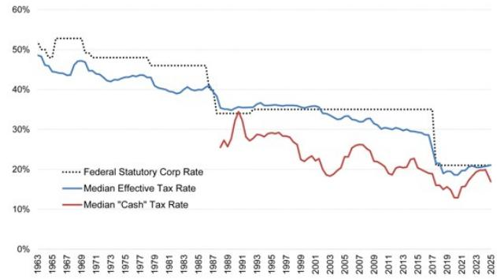

line chart

| Year | Federal Statutory Corp Rate (%) | Median Effective Tax Rate (%) | Median "Cash" Tax Rate (%) |
|---|---|---|---|
| 1963 | 52 | 48 | - |
| 1965 | 54 | 46 | - |
| 1967 | 53 | 45 | - |
| 1969 | 51 | 47 | - |
| 1971 | 50 | 45 | - |
| 1973 | 49 | 44 | - |
| 1975 | 48 | 43 | - |
| 1977 | 47 | 42 | - |
| 1979 | 46 | 41 | - |
| 1981 | 45 | 40 | - |
| 1983 | 44 | 39 | - |
| 1985 | 43 | 38 | - |
| 1987 | 35 | 36 | - |
| 1989 | 34 | 35 | 26 |
| 1991 | 34 | 35 | 34 |
| 1993 | 34 | 36 | 28 |
| 1995 | 34 | 36 | 27 |
| 1997 | 34 | 36 | 25 |
| 1999 | 34 | 36 | 22 |
| 2001 | 34 | 35 | 20 |
| 2003 | 34 | 35 | 18 |
| 2005 | 34 | 34 | 26 |
| 2007 | 34 | 33 | 25 |
| 2009 | 34 | 32 | 22 |
| 2011 | 34 | 31 | 20 |
| 2013 | 34 | 30 | 22 |
| 2015 | 34 | 29 | 20 |
| 2017 | 20 | 20 | 15 |
| 2019 | - | - | - |
| 2021 | - | - | - |
| 2023 | - | - | - |
| 2025 | - | - | - |
The chart displays three data series: 'Federal Statutory Corp Rate', 'Median Effective Tax Rate', and 'Median "Cash" Tax Rate'. The values for the Federal Statutory Corp Rate are explicitly labeled on the chart. The Median Effective Tax Rate is also labeled on the chart but not explicitly shown in the original data. The Median "Cash" Tax Rate is also labeled on the chart but not explicitly shown in the original data. The chart is saved as a PNG file named 'Federal Statutory Corp Rate' and is displayed in the top right corner.

Source: MS, Factset.

Exhibit 15: Cumulative difference in corporate income tax receipts: 2026 vs. 2025  
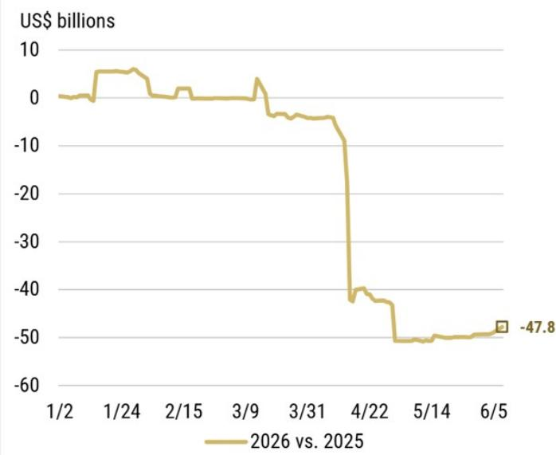

line chart

| Date   | Value (US$ billions) |
|--------|----------------------|
| 6/5    | -47.8                |

Source: MS, US Treasury, Bloomberg

## Semiconductors

## Memory – A Healthy Reset; We See More Running Room

We argue that the recent volatility in semiconductor stocks does not mean the cycle is over. Rather, our core view is that the cycle is still accelerating. Looking back on the internet build out, Netscape Navigator (the internet-era equivalent of Generative AI) emerged at the end of 1994, and over the next 4 years the NASDAQ was up 14.9%, and rose another 86% in year 5 (1999). Generative AI came out at the end of 2022, and we are 3 years into this uptrend, with NASDAQ up 122%. A key difference: Earnings revisions today remain robust and appear sustainable, in our view.

See Memory – A Healthy Reset (10 Jun 2026)

Exhibit 16: AI vs. Dot.com: NASDAQ Performance from the key technology's arrival  
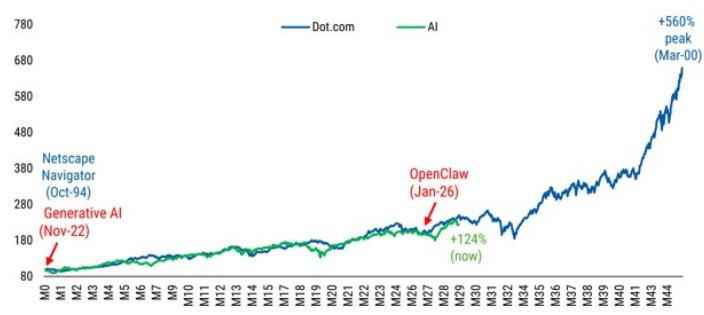

line chart

| Date       | Dot.com | AI     |
| ---------- | ------- | ------ |
| Nov-22     | -       | -      |
| Jan-26     | -       | +124% (now) |

Source: Factset, MS

Exhibit 17: NTM consensus EPS trend over last 1 year  
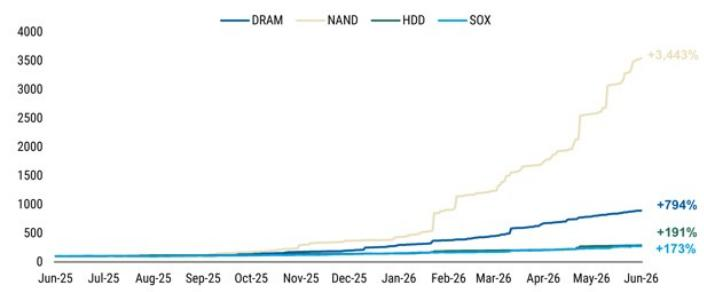

line chart

| Date   | DRAM   | NAND   | HDD    | SOX    |
|--------|--------|--------|--------|--------|
| Jun-25 |        |        |        |        |
| Jul-25 |        |        |        |        |
| Aug-25 |        |        |        |        |
| Sep-25 |        |        |        |        |
| Oct-25 |        |        |        |        |
| Nov-25 |        |        |        |        |
| Dec-25 |        |        |        |        |
| Jan-26 |        |        |        |        |
| Feb-26 |        |        |        |        |
| Mar-26 |        |        |        |        |
| Apr-26 |        |        |        |        |
| May-26 |        |        |        |        |
| Jun-26 | +794%  | +3,443%| +191%  | +173%  |

Source: Factset, MS

## Disclosure Section

The information and opinions in MS were prepared by MS & Co. LLC, and/or MS C.T.V.M. S.A., and/or MS Mexico, Casa de Bolsa, S.A. de C.V., and/or MS Canada Limited. As used in this disclosure section, "MS" includes MS & Co. LLC, MS C.T.V.M. S.A., MS Mexico, Casa de Bolsa, S.A. de C.V., MS Canada Limited and their affiliates as necessary.

For important disclosures, stock price charts and equity rating histories regarding companies that are the subject of this report, please see the MS Disclosure Website at www.morganstanley.com/eqr/disclosures/webapp/generalresearch, or contact your investment representative or MS at 1585 Broadway, (Attention: Research Management), New York, NY, 10036 USA.

For valuation methodology and risks associated with any recommendation, rating or price target referenced in this research report, please contact the Client Support Team as follows: US/Canada +1 800 303-2495; Hong Kong +852 2848-5999; Latin America +1 718 754-5444 (U.S.); London +44 (0)20-7425-8169; Singapore +65 6834-6860; Sydney +61 (0)2-9770-1505; Tokyo +81 (0)3-6836-9000. Alternatively you may contact your investment representative or MS at 1585 Broadway, (Attention: Research Management), New York, NY 10036 USA.

## Global Research Conflict Management Policy

MS has been published in accordance with our conflict management policy, which is available at www.morganstanley.com/institutional/research/conflictpolicies. A Portuguese version of the policy can be found at www.morganstanley.com.br

## Important Regulatory Disclosures on Subject Companies

The equity research analysts or strategists principally responsible for the preparation of MS have received compensation based upon various factors, including quality of research, investor client feedback, stock picking, competitive factors, firm revenues and overall investment banking revenues. Equity Research analysts' or strategists' compensation is not linked to investment banking or capital markets transactions performed by MS or the profitability or revenues of particular trading desks.

MS and its affiliates do business that relates to companies/instruments covered in MS, including market making, providing liquidity, fund management, commercial banking, extension of credit, investment services and investment banking. MS sells to and buys from customers the securities/instruments of companies covered in MS on a principal basis. MS may have a position in the debt of the Company or instruments discussed in this report. MS trades or may trade as principal in the debt securities (or in related derivatives) that are the subject of the debt research report.

Certain disclosures listed above are also for compliance with applicable regulations in non-US jurisdictions.

## STOCK RATINGS

MS uses a relative rating system using terms such as Overweight, Equal-weight, Not-Rated or Underweight (see definitions below). MS does not assign ratings of Buy, Hold or Sell to the stocks we cover. Overweight, Equal-weight, Not-Rated and Underweight are not the equivalent of buy, hold and sell. Investors should carefully read the definitions of all ratings used in MS. In addition, since MS contains more complete information concerning the analyst's views, investors should carefully read MS, in its entirety, and not infer the contents from the rating alone. In any case, ratings (or research) should not be used or relied upon as investment advice. An investor's decision to buy or sell a stock should depend on individual circumstances (such as the investor's existing holdings) and other considerations.

## Global Stock Ratings Distribution

(as of May 31, 2026)

The Stock Ratings described below apply to MS's Fundamental Equity Research and do not apply to Debt Research produced by the Firm.

For disclosure purposes only (in accordance with FINRA requirements), we include the category headings of Buy, Hold, and Sell alongside our ratings of Overweight, Equal-weight, Not-Rated and Underweight. MS does not assign ratings of Buy, Hold or Sell to the stocks we cover. Overweight, Equal-weight, Not-Rated and Underweight are not the equivalent of buy, hold, and sell but represent recommended relative weightings (see definitions below). To satisfy regulatory requirements, we correspond Overweight, our most positive stock rating, with a buy recommendation; we correspond Equal-weight and Not-Rated to hold and Underweight to sell recommendations, respectively.

<table><tr><td></td><td colspan="2">Coverage Universe</td><td colspan="3">Investment Banking Clients (IBC)</td><td colspan="2">Other Material Investment ServicesClients (MISC)</td></tr><tr><td>Stock RatingCategory</td><td>Count</td><td>% of Total</td><td>Count</td><td>% of Total IBC</td><td>% of RatingCategory</td><td>Count</td><td>% of Total OtherMISC</td></tr><tr><td>Overweight/Buy</td><td>1542</td><td>42%</td><td>465</td><td>51%</td><td>30%</td><td>707</td><td>43%</td></tr><tr><td>Equal-weight/Hold</td><td>1571</td><td>43%</td><td>369</td><td>40%</td><td>23%</td><td>723</td><td>44%</td></tr><tr><td>Not-Rated/Hold</td><td>3</td><td>0%</td><td>0</td><td>0%</td><td>0%</td><td>1</td><td>0%</td></tr><tr><td>Underweight/Sell</td><td>551</td><td>15%</td><td>86</td><td>9%</td><td>16%</td><td>201</td><td>12%</td></tr><tr><td>Total</td><td>3,667</td><td></td><td>920</td><td></td><td></td><td>1632</td><td></td></tr></table>

Data include common stock and ADRs currently assigned ratings. Investment Banking Clients are companies from whom MS received investment banking compensation in the last 12 months. Due to rounding off of decimals, the percentages provided in the "% of total" column may not add up to exactly 100 percent.

## Analyst Stock Ratings

Overweight (O). The stock's total return is expected to exceed the average total return of the analyst's industry (or industry team's) coverage universe, on a risk-adjusted basis, over the next 12-18 months.

Equal-weight (E). The stock's total return is expected to be in line with the average total return of the analyst's industry (or industry team's) coverage universe, on a risk-adjusted basis, over the next 12-18 months.

Not-Rated (NR). Currently the analyst does not have adequate conviction about the stock's total return relative to the average total return of the analyst's industry (or industry team's) coverage universe, on a risk-adjusted basis, over the next 12-18 months.

Underweight (U). The stock's total return is expected to be below the average total return of the analyst's industry (or industry team's) coverage universe, on a risk-adjusted basis, over the next

12-18 months.

Unless otherwise specified, the time frame for price targets included in MS is 12 to 18 months.

## Analyst Industry Views

Attractive (A): The analyst expects the performance of his or her industry coverage universe over the next 12-18 months to be attractive vs. the relevant broad market benchmark, as indicated below.

In-Line (I): The analyst expects the performance of his or her industry coverage universe over the next 12-18 months to be in line with the relevant broad market benchmark, as indicated below. Cautious (C): The analyst views the performance of his or her industry coverage universe over the next 12-18 months with caution vs. the relevant broad market benchmark, as indicated below. Benchmarks for each region are as follows: North America - S&P 500; Latin America - relevant MSCI country index or MSCI Latin America Index; Europe - MSCI Europe; Japan - TOPIX; Asia - relevant MSCI country index or MSCI sub-regional index or MSCI AC Asia Pacific ex Japan Index.

## Important Disclosures for MS Smith Barney LLC Customers

Important disclosures regarding any material conflict of interest that can reasonably be expected to have influenced MS Smith Barney LLC's choice of a third-party research provider or the subject company of a third-party research report, are available on the MS Wealth Management disclosure website at www.morganstanley.com/online/researchdisclosures. For MS specific disclosures, you may refer to https://www.morganstanley.com/eqr/disclosures/webapp/generalresearch.

Each MS report is reviewed and approved on behalf of MS Smith Barney LLC. This review and approval is conducted by the same person who reviews the research report on behalf of MS. This could create a conflict of interest.

## Other Important Disclosures

MS policy is to update research reports as and when the Research Analyst and Research Management deem appropriate, based on developments with the issuer, the sector, or the market that may have a material impact on the research views or opinions stated therein. In addition, certain Research publications are intended to be updated on a regular periodic basis (weekly/monthly/quarterly/annual) and will ordinarily be updated with that frequency, unless the Research Analyst and Research Management determine that a different publication schedule is appropriate based on current conditions.

MS is not acting as a municipal advisor and the opinions or views contained herein are not intended to be, and do not constitute, advice within the meaning of Section 975 of the Dodd-Frank Wall Street Reform and Consumer Protection Act.

MS produces an equity research product called a "Tactical Idea." Views contained in a "Tactical Idea" on a particular stock may be contrary to the recommendations or views expressed in research on the same stock. This may be the result of differing time horizons, methodologies, market events, or other factors. For all research available on a particular stock, please contact your sales representative or go to Matrix at http://www.morganstanley.com/matrix.

MS is provided to our clients through our proprietary research portal on Matrix and also distributed electronically by MS to clients. Certain, but not all, MS products are also made available to clients through third-party vendors or redistributed to clients through alternate electronic means as a convenience. For access to all available MS, please contact your sales representative or go to Matrix at http://www.morganstanley.com/matrix.

Any access and/or use of MS is subject to MS's Terms of Use (http://www.morganstanley.com/terms.html). By accessing and/or using MS, you are indicating that you have read and agree to be bound by our Terms of Use (http://www.morganstanley.com/terms.html). In addition you consent to MS processing your personal data and using cookies in accordance with our Privacy Policy and our Global Cookies Policy (http://www.morganstanley.com/privacy\_pledge.html), including for the purposes of setting your preferences and to collect readership data so that we can deliver better and more personalized service and products to you. To find out more information about how MS processes personal data, how we use cookies and how to reject cookies see our Privacy Policy and our Global Cookies Policy (http://www.morganstanley.com/privacy\_pledge.html). Please use the provided link to review the Terms and Conditions and Most Important Terms and Conditions for MS India Company Private Limited (https://www.morganstanley.com/assets/pdfs/about-us-global-offices/india/Terms\_and\_conditions.pdf) and the following link to review the audit report (https://ny.matrix.ms.com/eqr/research/webapp/researchdocs/MSICPL\_Morgan\_Stanley\_Research\_Audit\_Report.pdf).

If you do not agree to our Terms of Use and/or if you do not wish to provide your consent to MS processing your personal data or using cookies please do not access our research. MS does not provide individually tailored investment advice. MS has been prepared without regard to the circumstances and objectives of those who receive it. MS recommends that investors independently evaluate particular investments and strategies, and encourages investors to seek the advice of a financial adviser. The appropriateness of an investment or strategy will depend on an investor's circumstances and objectives. The securities, instruments, or strategies discussed in MS may not be suitable for all investors, and certain investors may not be eligible to purchase or participate in some or all of them. MS is not an offer to buy or sell or the solicitation of an offer to buy or sell any security/instrument or to participate in any particular trading strategy. The value of and income from your investments may vary because of changes in interest rates, foreign exchange rates, default rates, prepayment rates, securities/instruments prices, market indexes, operational or financial conditions of companies or other factors. There may be time limitations on the exercise of options or other rights in securities/instruments transactions. Past performance is not necessarily a guide to future performance. Estimates of future performance are based on assumptions that may not be realized. If provided, and unless otherwise stated, the closing price on the cover page is that of the primary exchange for the subject company's securities/instruments.

The fixed income research analysts, strategists or economists principally responsible for the preparation of MS have received compensation based upon various factors, including quality, accuracy and value of research, firm profitability or revenues (which include fixed income trading and capital markets profitability or revenues), client feedback and competitive factors. Fixed Income Research analysts', strategists' or economists' compensation is not linked to investment banking or capital markets transactions performed by MS or the profitability or revenues of particular trading desks.

The "Important Regulatory Disclosures on Subject Companies" section in MS lists all companies mentioned where MS owns 1% or more of a class of common equity securities of the companies. For all other companies mentioned in MS, MS may have an investment of less than 1% in securities/instruments or derivatives of securities/instruments of companies and may trade them in ways different from those discussed in MS. Employees of MS not involved in the preparation of MS may have investments in securities/instruments or derivatives of securities/instruments of companies mentioned and may trade them in ways different from those discussed in MS. Derivatives may be issued by MS or associated persons.

With the exception of information regarding MS, MS is based on public information. MS makes every effort to use reliable, comprehensive information, but we make no representation that it is accurate or complete. We have no obligation to tell you when opinions or information in MS change apart from when we intend to discontinue equity research coverage of a subject company. Facts and views presented in MS have not been reviewed by, and may not reflect information known to, professionals in other MS business areas, including investment banking personnel.

MS personnel may participate in company events such as site visits and are generally prohibited from accepting payment by the company of associated expenses unless pre-approved by authorized members of Research management.

MS may make investment decisions that are inconsistent with the recommendations or views in this report.

To our readers based in Taiwan or trading in Taiwan securities/instruments: Information on securities/instruments that trade in Taiwan is distributed by MS Taiwan Limited ("MSTL"). Such information is for your reference only. The reader should independently evaluate the investment risks and is solely responsible for their investment decisions. MS may not be distributed to the public media or quoted or used by the public media without the express written consent of MS. Any non-customer reader within the scope of Article 7-1 of the Taiwan Stock Exchange Recommendation Regulations accessing and/or receiving MS is not permitted to provide MS to any third party (including but not limited to related parties, affiliated companies and any other third parties) or engage in any activities regarding MS which may create or give the appearance of creating a conflict of interest. Information on securities/instruments that do not trade in Taiwan is for informational purposes only and is not to be construed as a recommendation or a solicitation to trade in such securities/instruments. MSTL may not execute transactions for clients in these securities/instruments.

MS is not incorporated under PRC law and the research in relation to this report is conducted outside the PRC. MS does not constitute an offer to sell or the solicitation of an offer to buy any securities in the PRC. PRC investors shall have the relevant qualifications to invest in such securities and shall be responsible for obtaining all relevant approvals, licenses, verifications and/or registrations from the relevant governmental authorities themselves. Neither this report nor any part of it is intended as, or shall constitute, provision of any consultancy or advisory service of securities investment as defined under PRC law. Such information is provided for your reference only.

MS is disseminated in Brazil by MS C.T.V.M. S.A. located at Av. Brigadeiro Faria Lima, 3600, 6th floor, São Paulo - SP, Brazil; and is regulated by the Comissão de Valores Mobiliários; in Mexico by MS México, Casa de Bolsa, S.A. de C.V which is regulated by Comision Nacional Bancaria y de Valores. Paseo de los Tamarindos 90, Torre 1, Col. Bosques de las Lomas Floor 29, 05120 Mexico City; in Japan by MS MUFG Securities Co., Ltd. and, for Commodities related research reports only, MS Capital Group Japan Co., Ltd; in Hong Kong by MS Asia Limited (which accepts responsibility for its contents) and by MS Bank Asia Limited; in Singapore by MS Asia (Singapore) Pte. (Registration number 199206298Z) and/or MS Asia (Singapore) Securities Pte Ltd (Registration number 200008434H), regulated by the Monetary Authority of Singapore (which accepts legal responsibility for its contents and should be contacted with respect to any matters arising from, or in connection with, MS) and by MS Bank Asia Limited, Singapore Branch (Registration number T14FC0118); in Australia to "wholesale clients" within the meaning of the Australian Corporations Act by MS Australia Limited A.B.N. 67 003 734 576, holder of Australian financial services license No. 233742, which accepts responsibility for its contents; in Australia to "wholesale clients" and "retail clients" within the meaning of the Australian Corporations Act by MS Wealth Management Australia Pty Ltd (A.B.N. 19 009 145 555, holder of Australian financial services license No. 240813, which accepts responsibility for its contents; in Korea by MS & Co International plc, Seoul Branch; in India by MS India Company Private Limited having Corporate Identification No (CIN) U22990MH1998PTC115305, regulated by the Securities and Exchange Board of India ("SEBI") and holder of licenses as a Research Analyst (SEBI Registration No. INH000001105); Stock Broker (SEBI Stock Broker Registration No. INZ000244438), Merchant Banker (SEBI Registration No. INM000011203), and depository participant with National Securities Depository Limited (SEBI Registration No. IN-DP-NSDL-567-2021) having registered office at Altimus, Level 39 & 40, Pandurang Budhkar Marg, Worli, Mumbai 400018, India; Telephone no. +91-22-61181000; Compliance Officer Details: Mr. Tejarshi Hardas, Tel. No.: +91-22-61181000 or Email: tejarshi.hardas@morganstanley.com; Grievance officer details: Mr. Tejarshi Hardas, Tel. No.: +91-22-61181000 or Email: msic-compliance@morganstanley.com. MS India Company Private Limited (MSICPL) may use AI tools in providing research services. All recommendations contained herein are made by the duly qualified research analysts; in Canada by MS Canada Limited; in Germany and the European Economic Area where required by MS Europe S.E., authorised and regulated by Bundesanstalt fuer Finanzdienstleistungsaufsicht (BaFin) under the reference number 149169; in the US by MS & Co. LLC, which accepts responsibility for its contents. MS & Co. International plc, authorized by the Prudential Regulation Authority and regulated by the Financial Conduct Authority and the Prudential Regulation Authority, disseminates in the UK research that it has prepared, and research which has been prepared by any of its affiliates, only to persons who (i) are investment professionals falling within Article 19(5) of the Financial Services and Markets Act 2000 (Financial Promotion) Order 2005 (as amended, the "Order"); (ii) are persons who are high net worth entities falling within Article 49(2)(a) to (d) of the Order; or (iii) are persons to whom an invitation or inducement to engage in investment activity (within the meaning of section 21 of the Financial Services and Markets Act 2000, as amended) may otherwise lawfully be communicated or caused to be communicated. RMB MS Proprietary Limited is a member of the JSE Limited and A2X (Pty) Ltd. RMB MS Proprietary Limited is a joint venture owned equally by MS International Holdings Inc. and RMB Investment Advisory (Proprietary) Limited, which is wholly owned by FirstRand Limited. The information in MS is being disseminated by MS Saudi Arabia, regulated by the Capital Market Authority in the Kingdom of Saudi Arabia, and is directed at Sophisticated investors only.

The information in MS is being communicated by MS & Co. International plc (DIFC Branch), regulated by the Dubai Financial Services Authority (the DFSA) or by MS & Co. International plc (ADGM Branch), regulated by the Financial Services Regulatory Authority Abu Dhabi (the FSRA), and is directed at Professional Clients only, as defined by the DFSA or the FSRA, respectively. The financial products or financial services to which this research relates will only be made available to a customer who we are satisfied meets the regulatory criteria of a Professional Client. A distribution of the different MS Research ratings or recommendations, in percentage terms for Investments in each sector covered, is available upon request from your sales representative.

The information in MS is being communicated by MS & Co. International plc (QFC Branch), regulated by the Qatar Financial Centre Regulatory Authority (the QFCRA), and is directed at business customers and market counterparties only and is not intended for Retail Customers as defined by the QFCRA.

As required by the Capital Markets Board of Turkey, investment information, comments and recommendations stated here, are not within the scope of investment advisory activity. Investment advisory service is provided exclusively to persons based on their risk and income preferences by the authorized firms. Comments and recommendations stated here are general in nature. These opinions may not fit to your financial status, risk and return preferences. For this reason, to make an investment decision by relying solely to this information stated here may not bring about outcomes that fit your expectations.

The trademarks and service marks contained in MS are the property of their respective owners. Third-party data providers make no warranties or representations relating to the accuracy, completeness, or timeliness of the data they provide and shall not have liability for any damages relating to such data. The Global Industry Classification Standard (GICS) was developed by and is the exclusive property of MSCI and S&P.

MS, or any portion thereof may not be reprinted, sold or redistributed without the written consent of MS.

Indicators and trackers referenced in MS may not be used as, or treated as, a benchmark under Regulation EU 2016/1011, or any other similar framework.

The issuers and/or fixed income products recommended or discussed in certain fixed income research reports may not be continuously followed. Accordingly, investors should regard those fixed income research reports as providing stand-alone analysis and should not expect continuing analysis or additional reports relating to such issuers and/or individual fixed income products. MS may hold, from time to time, material financial and commercial interests regarding the company subject to the Research report.

Registration granted by SEBI and certification from the National Institute of Securities Markets (NISM) in no way guarantee performance of the intermediary or provide any assurance of returns to investors. Investment in securities market are subject to market risks. Read

all the related documents carefully before investing.

© 2026 MS